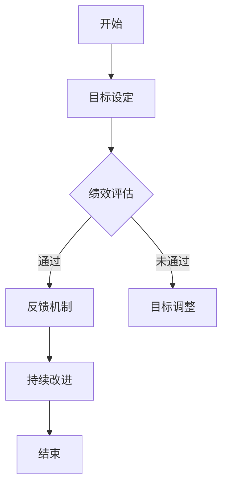
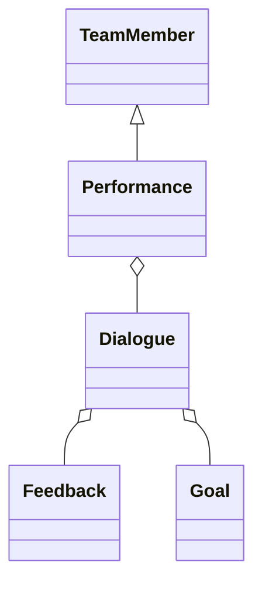
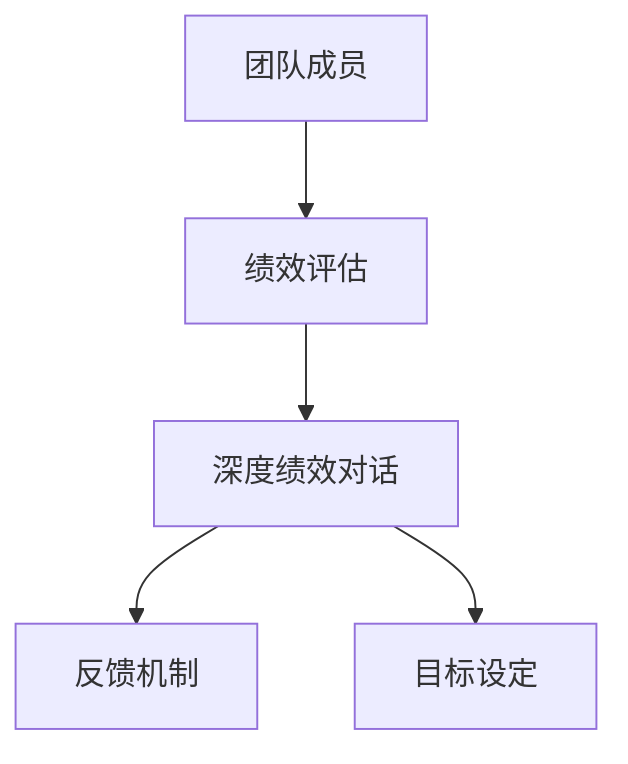
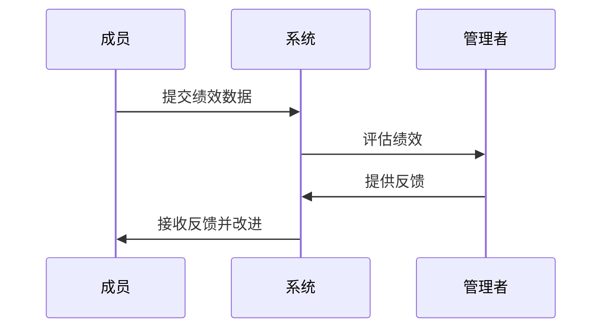

                 

### 深度绩效对话：促进团队成长的关键工具

**关键词：** 深度绩效对话，团队成长，关键工具，绩效评估，目标设定，反馈机制

**摘要：** 本文将探讨深度绩效对话这一关键工具在促进团队成长中的重要作用。通过详细分析其定义、原理、实施方法以及最佳实践，帮助读者理解和掌握这一提升团队绩效的有效策略。

#### 第一部分：背景介绍

**核心概念：**

深度绩效对话（Deep Performance Dialogue）是一种以深度对话为基础，围绕绩效展开的交流方式。它不仅仅关注工作成果，更注重团队成员的成长和发展。

**问题背景：**

在当今快速变化和竞争激烈的商业环境中，团队面临的挑战日益增多。如何提高团队成员的绩效，如何建立有效的沟通机制，如何促进团队协作，成为企业管理者亟待解决的问题。

**问题描述：**

1. 成员绩效不均衡，工作表现差异大。
2. 沟通不畅，信息传递存在障碍。
3. 团队协作不力，无法形成合力。

**问题解决：**

深度绩效对话通过以下方式促进团队成长：

1. **明确目标**：通过对话明确团队成员的目标和期望，确保团队成员的方向一致。
2. **绩效评估**：通过深度对话进行细致的绩效评估，发现团队成员的优点和不足。
3. **反馈机制**：建立有效的反馈机制，及时给予团队成员正面的肯定和建设性的建议。
4. **持续改进**：通过不断对话和反馈，推动团队成员的持续改进，提高整体绩效。

**边界与外延：**

深度绩效对话适用于各类组织和企业，但在实施过程中需要根据组织的特点和实际情况进行调整。此外，深度绩效对话不仅关注团队成员的绩效，也关注团队关系的建设。

#### 第二部分：核心概念与联系

**核心概念原理：**

深度绩效对话的核心包括绩效评估、目标设定、反馈机制和持续改进。

1. **绩效评估**：通过定量和定性的方法对团队成员的工作表现进行评估，找出优势和不足。
2. **目标设定**：设定明确且具有挑战性的目标，确保团队成员的方向一致。
3. **反馈机制**：建立及时且建设性的反馈机制，促进团队成员的成长。
4. **持续改进**：通过持续的对话和反馈，推动团队成员的绩效提升。

**概念属性特征对比表格：**

| 概念         | 属性特征                                   |
|--------------|------------------------------------------|
| 绩效评估     | 定量与定性结合，全面性                   |
| 目标设定     | 明确性与挑战性，激励性                   |
| 反馈机制     | 及时性与建设性，激励性                   |
| 持续改进     | 自我反思与行动，持续性                     |

**ER实体关系图架构：**

```mermaid
erDiagram
  Performance ||--|{ Goal }|-- Dialogue
  Dialogue ||--|{ Feedback }|-- Performance
  Performance ||--|{ Member }|-- Team
  Member ||--|{ Skill }|-- Team
```

#### 第三部分：算法原理讲解

**算法mermaid流程图：**



**python源代码：**

```python
# 深度绩效对话算法实现
def performance_dialogue(member, target):
    assessment = evaluate_performance(member, target)
    if assessment["达标"]:
        feedback = provide_feedback(assessment, member)
        improvement = continue_improvement(feedback, member)
    else:
        target = adjust_target(assessment, member)
        feedback = provide_feedback({"达标": False}, member)
        improvement = continue_improvement(feedback, member)
    return improvement

# 绩效评估函数
def evaluate_performance(member, target):
    # 实现具体的绩效评估逻辑
    return {"达标": True}

# 提供反馈函数
def provide_feedback(assessment, member):
    # 实现具体的反馈逻辑
    return "反馈内容"

# 持续改进函数
def continue_improvement(feedback, member):
    # 实现具体的持续改进逻辑
    return "改进内容"

# 目标调整函数
def adjust_target(assessment, member):
    # 实现具体的目标调整逻辑
    return "新目标"
```

**数学模型和公式：**

$$
绩效 = f(能力, 环境, 动机)
$$

其中，能力、环境、动机分别表示团队成员的技能水平、工作环境和内在动机。

**详细讲解和举例说明：**

假设我们有一个团队成员小明，他的目标是提高代码质量。首先，我们将设定一个明确的目标，例如：“在接下来的三个月内，实现代码缺陷率低于0.5%”。

接着，我们通过绩效评估来确定小明的当前状态。评估结果显示，小明的代码缺陷率目前为1.2%，高于预期目标。

然后，我们提供反馈，指出小明需要改进的地方，并给予建设性的建议。例如：“你的代码质量有待提高，建议在编写代码时多进行单元测试，并参考最佳实践进行代码优化”。

在收到反馈后，小明开始实施改进措施，例如增加单元测试覆盖率，参考优秀代码进行学习。一段时间后，我们再次进行绩效评估，发现小明的代码缺陷率已经降至0.3%，接近目标。

最后，我们通过持续改进，确保小明能够保持并进一步提高代码质量。

#### 第四部分：系统分析与架构设计方案

**问题场景介绍：**

在一个软件开发团队中，管理者希望通过深度绩效对话来提升团队成员的绩效和团队的整体绩效。

**系统功能设计：**

使用Mermaid语法绘制领域模型类图：



**系统架构设计：**

使用Mermaid语法绘制系统架构图：



**系统接口设计和系统交互：**

使用Mermaid语法绘制系统交互序列图：



#### 第五部分：项目实战

**环境安装：**

1. 安装Python环境，版本要求Python 3.8及以上。
2. 安装深度学习库，如TensorFlow或PyTorch。

**系统核心实现源代码：**

```python
# 深度绩效对话系统核心实现
class PerformanceDialogueSystem:
    def __init__(self):
        self.members = []
    
    def add_member(self, member):
        self.members.append(member)
    
    def evaluate_performance(self):
        for member in self.members:
            # 实现绩效评估逻辑
            pass
    
    def provide_feedback(self):
        for member in self.members:
            # 实现反馈机制
            pass
    
    def set_goals(self):
        for member in self.members:
            # 实现目标设定
            pass
    
    def continue_improvement(self):
        for member in self.members:
            # 实现持续改进
            pass
```

**代码应用解读与分析：**

1. **添加团队成员**：通过`add_member`方法将团队成员添加到系统中。
2. **绩效评估**：通过`evaluate_performance`方法对团队成员的绩效进行评估。
3. **提供反馈**：通过`provide_feedback`方法向团队成员提供反馈。
4. **目标设定**：通过`set_goals`方法为团队成员设定目标。
5. **持续改进**：通过`continue_improvement`方法推动团队成员的持续改进。

**实际案例分析和详细讲解剖析：**

1. **案例背景**：一个软件开发团队希望通过深度绩效对话提升团队绩效。
2. **案例过程**：团队管理者使用深度绩效对话系统，对团队成员的绩效进行评估，并提供反馈。根据反馈，团队成员设定了具体的目标，并进行了改进。
3. **案例结果**：通过深度绩效对话系统，团队成员的绩效得到了显著提升，团队整体绩效也得到了改善。

**项目小结：**

通过深度绩效对话系统，团队管理者能够更有效地指导和激励团队成员，提高团队的整体绩效。项目实践证明，深度绩效对话是一种有效的团队管理工具，值得推广应用。

#### 第六部分：最佳实践 tips

**小结：**

本文详细介绍了深度绩效对话的概念、原理、实施方法和最佳实践。深度绩效对话作为一种促进团队成长的关键工具，对于提升团队绩效具有重要意义。

**注意事项：**

1. 实施深度绩效对话时，要确保对话的深度和质量，避免表面化。
2. 定期进行绩效评估和反馈，确保团队成员的目标和期望得到及时调整。
3. 鼓励团队成员积极参与，提高他们的参与度和主动性。

**拓展阅读：**

1. 《深度学习》 - Goodfellow, I., Bengio, Y., & Courville, A.
2. 《绩效管理》 - Hulin, C. L., & Jia, J.
3. 《团队协作的艺术》 - Katzenbach, J., & Smith, D.

#### 结尾

感谢您阅读本文。深度绩效对话作为一种有效的团队管理工具，不仅能够提升团队成员的绩效，还能够促进团队的成长和发展。希望本文能够对您在实践深度绩效对话时提供有益的参考和启示。

**作者：** AI天才研究院/AI Genius Institute & 禅与计算机程序设计艺术 /Zen And The Art of Computer Programming

