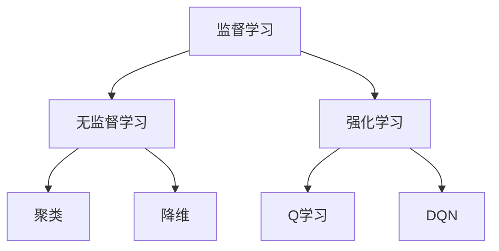
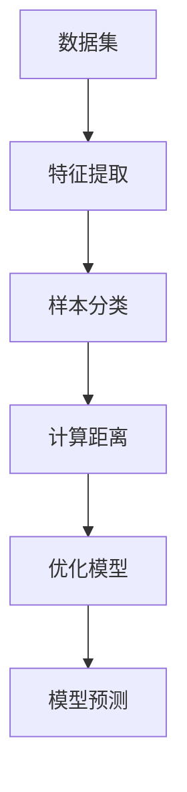
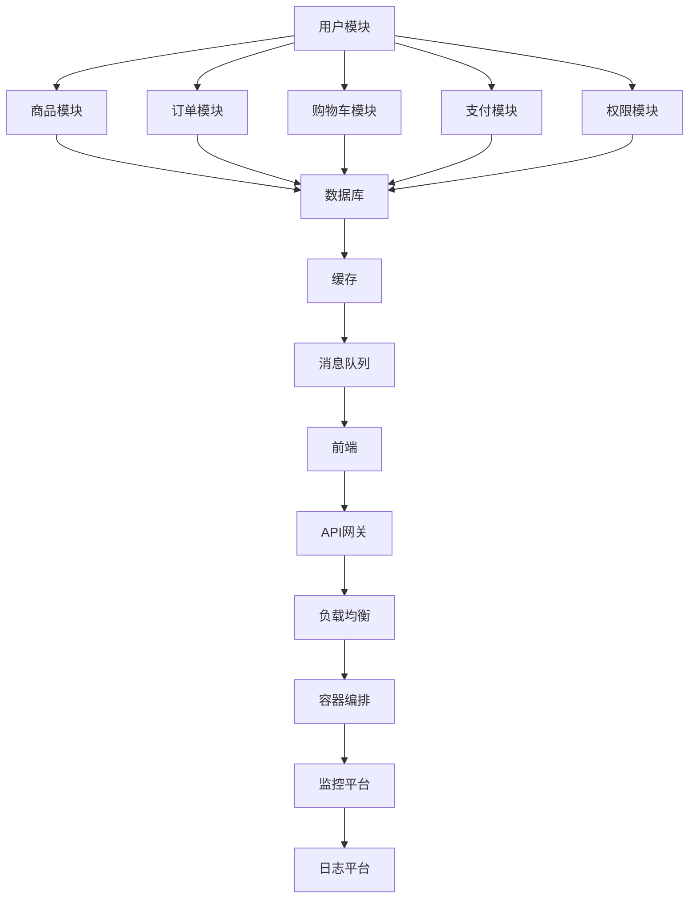
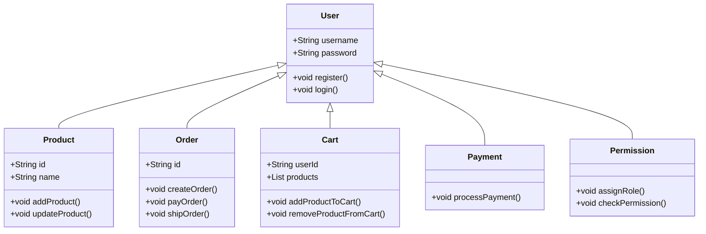
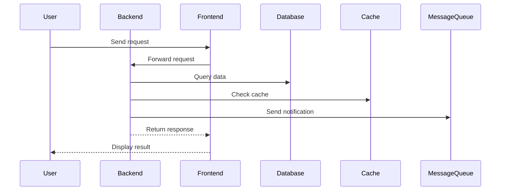

                 

# 《深耕技术：P9工程师的专业化成长策略》

> 关键词：P9工程师，职业发展，技术深耕，算法原理，系统架构设计，团队协作，领导力

> 摘要：本文旨在探讨P9工程师如何在职业发展中深耕技术，通过核心概念的深入研究、算法原理的讲解、系统分析与架构设计、项目实践以及团队协作和领导力的培养，实现专业化成长。本文将分为五大部分，分别从职业发展概述、技术深度挖掘、团队协作与领导力、持续成长与自我提升以及最佳实践与反思等方面展开。

## 第一部分：职业发展概述

### 第1章：职业发展的关键阶段

职业发展的关键阶段包括入门、进阶、专家和领导力提升等阶段。对于P9工程师来说，每个阶段都需要有不同的成长策略和技能提升。

#### 1.1 入门阶段

入门阶段是P9工程师职业生涯的起点。在这个阶段，工程师需要掌握基本编程语言、数据结构和算法知识，并了解计算机系统的工作原理。此外，还需要培养良好的编程习惯和团队合作精神。

#### 1.2 进阶阶段

进阶阶段是P9工程师职业发展的关键时期。在这个阶段，工程师需要深入了解某个技术领域，掌握高级编程技能，如分布式系统设计、大数据处理、机器学习等。同时，还需要具备项目管理和团队协作能力。

#### 1.3 专家阶段

专家阶段是P9工程师职业发展的巅峰。在这个阶段，工程师不仅需要掌握广泛的技术知识，还需要具备深入的专业素养和创新能力。他们能够在复杂项目中担任核心角色，并提出具有影响力的技术方案。

#### 1.4 领导力提升

领导力提升是P9工程师职业发展的更高层次。在这个阶段，工程师需要具备领导能力和影响力，能够带领团队完成复杂项目，并推动公司的技术发展。

### 第2章：P9工程师的角色定位

P9工程师在公司中扮演着重要的角色，他们通常是技术团队的领军人物，负责解决复杂的技术难题，推动技术创新和团队成长。

#### 2.1 P9工程师的能力要求

P9工程师需要具备以下能力：

- 广泛的技术知识，如编程语言、数据结构、算法、分布式系统、大数据处理等。
- 深入的专业素养，如机器学习、人工智能、区块链等。
- 项目管理能力，如需求分析、进度控制、风险管理等。
- 团队协作能力，如沟通、协调、激励等。

#### 2.2 P9工程师的职业发展路径

P9工程师的职业发展路径通常分为以下几个阶段：

- 技术专家：掌握某一领域的高级技术，成为团队的技术支柱。
- 技术经理：负责团队的技术规划和项目管理，提升团队的技术水平。
- 技术总监：负责公司的技术战略和产品研发，推动公司技术创新。

#### 2.3 成长中的挑战与应对策略

在职业成长过程中，P9工程师可能会面临以下挑战：

- 技术更新速度快，需要不断学习新技术。
- 工作压力增大，需要提高工作效率和质量。
- 需要提升领导力和团队协作能力。

应对策略：

- 制定长期学习计划，持续提升技术能力。
- 学会时间管理和任务优先级排序，提高工作效率。
- 参加领导力培训，学习团队管理和领导技巧。

## 第二部分：技术深度挖掘

### 第3章：核心技术的深入研究

在P9工程师的职业发展中，核心技术的研究和掌握至关重要。以下是几个重要的核心技术领域：

#### 3.1 深度学习与AI技术

深度学习和人工智能技术是当前最为热门的技术领域之一。P9工程师需要掌握深度学习的基本原理、神经网络结构、训练算法等，并能够运用这些技术解决实际问题。

- **核心概念原理**：

  - 深度学习：一种基于神经网络的学习方法，通过多层次的非线性变换来提取数据特征。

  - 人工智能：一种模拟人类智能的技术，能够进行感知、学习、推理和决策。

- **概念属性特征对比表格**：

  | 特征 | 深度学习 | 人工智能 |
  | --- | --- | --- |
  | 目标 | 提取数据特征 | 模拟人类智能 |
  | 算法 | 神经网络 | 各种学习算法 |
  | 应用 | 图像识别、自然语言处理等 | 自动驾驶、智能客服等 |

- **ER实体关系图架构的 Mermaid 流程图**：

  ```mermaid
  graph TB
  A[深度学习] --> B[人工智能]
  B --> C[图像识别]
  B --> D[自然语言处理]
  ```

#### 3.2 云计算与大数据技术

云计算和大数据技术是现代企业数字化转型的核心技术。P9工程师需要掌握云计算架构、大数据处理框架、数据仓库等关键技术。

- **核心概念原理**：

  - 云计算：一种基于互联网的计算模式，提供可伸缩的IT资源服务。

  - 大数据：指无法用传统数据库工具进行有效管理和处理的大量数据。

- **概念属性特征对比表格**：

  | 特征 | 云计算 | 大数据 |
  | --- | --- | --- |
  | 目标 | 提供IT资源服务 | 数据处理和分析 |
  | 技术核心 | 虚拟化技术、云计算平台 | 数据存储、数据处理、数据挖掘 |
  | 应用 | IaaS、PaaS、SaaS | 数据分析、数据挖掘、数据可视化 |

- **ER实体关系图架构的 Mermaid 流程图**：

  ```mermaid
  graph TB
  A[云计算] --> B[IaaS]
  A --> C[PaaS]
  A --> D[SaaS]
  B --> E[虚拟化技术]
  C --> F[云计算平台]
  D --> G[数据服务]
  ```

### 第4章：算法原理与实践

算法是P9工程师的核心竞争力之一。本章将介绍机器学习算法的基本原理和实现方法。

#### 4.1 算法基础与分类

- **核心概念原理**：

  - 算法：解决问题的方法步骤。

  - 机器学习：一种通过数据训练模型，使模型能够对未知数据进行预测或分类的方法。

- **概念属性特征对比表格**：

  | 特征 | 算法 | 机器学习 |
  | --- | --- | --- |
  | 目标 | 解决问题 | 从数据中学习 |
  | 分类 | 排序、搜索、图算法等 | 分类、回归、聚类等 |
  | 应用 | 数学问题解决 | 数据分析、智能应用 |

- **ER实体关系图架构的 Mermaid 流程图**：

  ```mermaid
  graph TB
  A[算法] --> B[排序]
  A --> C[搜索]
  A --> D[图算法]
  B --> E[数学问题]
  C --> F[数据处理]
  D --> G[图结构]
  ```

#### 4.2 机器学习算法原理

以支持向量机（SVM）为例，介绍机器学习算法的基本原理。

- **算法mermaid流程图**：

  ```mermaid
  graph TB
  A[数据集] --> B[特征提取]
  B --> C[样本分类]
  C --> D[计算距离]
  D --> E[优化模型]
  E --> F[模型预测]
  ```

- **Python源代码**：

  ```python
  import numpy as np
  from sklearn.svm import SVC

  # 数据集
  X = np.array([[1, 2], [2, 3], [3, 3], [4, 4]])
  y = np.array([0, 0, 1, 1])

  # 训练模型
  svm = SVC(kernel='linear')
  svm.fit(X, y)

  # 模型预测
  X_new = np.array([[2.5, 2.5]])
  prediction = svm.predict(X_new)
  print(prediction)
  ```

- **算法原理的数学模型和公式**：

  - 支持向量机（SVM）的核心思想是找到一个超平面，将不同类别的样本分开。

  - 超平面可以通过以下公式表示：

    $$ w \cdot x + b = 0 $$

    其中，$w$ 是超平面的法向量，$x$ 是样本特征向量，$b$ 是偏置项。

  - 目标是最小化目标函数：

    $$ J(w, b) = \frac{1}{2} || w ||^2 + C \sum_{i=1}^n \max(0, 1 - y_i (w \cdot x_i + b)) $$

    其中，$C$ 是惩罚参数，$y_i$ 是样本标签。

#### 4.3 算法实现与性能优化

在实现SVM算法时，可以采用以下策略进行性能优化：

- **选择合适的核函数**：

  - 线性核函数：适用于线性可分的数据集。

  - 多项式核函数：适用于非线性可分的数据集。

  - 径向基函数（RBF）核函数：适用于各种类型的数据集。

- **调整惩罚参数C**：

  - 选择合适的C值，平衡分类精度和模型复杂度。

- **使用并行计算**：

  - 利用多核CPU或GPU进行加速计算，提高模型训练速度。

## 第三部分：团队协作与领导力

### 第6章：高效团队协作

高效团队协作是实现项目成功的关键。本章将介绍团队协作的模式、沟通技巧和项目管理策略。

#### 6.1 团队协作模式

- **功能型团队**：以完成特定任务为目标，团队成员来自不同部门。

- **跨部门团队**：由不同部门的人员组成，共同完成大型项目。

- **自组织团队**：团队成员自主选择项目，自行组织工作和进度。

#### 6.2 沟通技巧与团队文化

- **沟通技巧**：

  - 明确沟通目标，确保信息传递准确。

  - 采用开放式的沟通态度，倾听他人的意见和建议。

  - 使用简洁明了的语言，避免使用专业术语。

- **团队文化**：

  - 建立信任，促进团队成员之间的合作。

  - 鼓励创新和试错，营造积极向上的团队氛围。

  - 建立反馈机制，及时纠正问题和改进工作。

#### 6.3 项目管理策略

- **需求分析**：

  - 明确项目的目标和需求，制定详细的任务清单。

  - 与客户和利益相关者保持密切沟通，确保需求得到充分理解。

- **进度控制**：

  - 制定项目进度计划，确保任务按时完成。

  - 采用敏捷开发方法，快速响应变化和调整。

- **风险管理**：

  - 识别项目风险，制定风险应对策略。

  - 定期评估风险，及时调整项目计划。

### 第7章：领导力与影响力

P9工程师需要具备领导能力和影响力，以推动团队和公司的发展。

#### 7.1 领导力的重要性

- **指导团队**：帮助团队成员明确工作目标和职责，提供指导和支持。

- **激励团队**：激发团队成员的积极性和创造力，提高团队绩效。

- **解决冲突**：在团队中处理冲突和矛盾，维护团队的和谐和稳定。

#### 7.2 领导风格与影响力

- **权威型领导**：通过强制和命令来指导团队，适用于紧急情况和需要快速决策的场景。

- **民主型领导**：鼓励团队成员参与决策和讨论，提高团队的凝聚力和创新能力。

- **变革型领导**：带领团队实现变革和创新，推动公司持续发展。

#### 7.3 领导力发展路径

- **自我认知**：了解自己的优势和不足，不断提升自我能力。

- **学习与实践**：通过学习领导力理论和参与实际项目，积累领导经验。

- **反馈与改进**：接受团队成员和上级的反馈，不断改进领导方式和策略。

## 第四部分：持续成长与自我提升

### 第8章：持续学习与知识管理

持续学习和知识管理是P9工程师保持竞争力的关键。本章将介绍学习方法、知识管理策略和专业技能提升。

#### 8.1 学习方法

- **主动学习**：积极参与课程、讲座和工作坊，主动寻求学习机会。

- **深度学习**：深入理解技术原理，通过实践和案例研究巩固知识。

- **知识分享**：与同事和同行分享知识，通过交流提高自己的认知水平。

#### 8.2 知识管理策略

- **知识库建设**：建立个人和团队的知识库，整理和存储技术文档和资料。

- **知识共享**：鼓励团队成员分享知识和经验，提高团队整体技术水平。

- **知识更新**：定期更新和优化知识库，确保知识的新鲜度和准确性。

#### 8.3 专业技能提升

- **编程技能**：熟练掌握编程语言，提高代码质量和效率。

- **系统设计**：学习系统架构设计原则，提高系统性能和可靠性。

- **项目管理**：掌握项目管理方法和工具，提高项目管理和执行能力。

### 第9章：职业规划与展望

职业规划是实现职业发展目标的关键。本章将介绍职业规划的重要性、实施方法和未来职业展望。

#### 9.1 职业规划的重要性

- **明确目标**：帮助工程师明确职业发展方向，制定具体的目标和计划。

- **提高效率**：通过合理的规划和优先级排序，提高工作和学习效率。

- **职业发展**：为工程师提供明确的职业发展路径，助力职业生涯的长远发展。

#### 9.2 职业规划实施

- **自我评估**：了解自己的优势和不足，明确职业兴趣和目标。

- **制定计划**：制定具体的职业发展计划，包括学习目标、工作目标和时间安排。

- **执行与反馈**：严格执行职业规划，定期评估和调整，确保目标的实现。

#### 9.3 未来职业展望

- **技术创新**：随着科技的快速发展，P9工程师将在技术创新领域发挥重要作用。

- **跨界融合**：人工智能、大数据、云计算等技术的跨界融合，为P9工程师提供了更广阔的职业发展空间。

- **领导力提升**：具备领导力和影响力的P9工程师将在企业中担任重要角色，推动公司发展。

## 第五部分：最佳实践与反思

### 第10章：实战经验与教训

在职业发展过程中，积累实战经验是至关重要的。本章将分享项目成功案例和失败案例，并从中总结经验和教训。

#### 10.1 项目成功案例

- **案例1**：通过大数据分析优化业务流程，提高公司运营效率。

  - **背景**：某电商公司在运营过程中遇到了订单处理效率低、库存管理不精确等问题。

  - **解决方法**：采用大数据分析技术，对订单数据、库存数据等进行分析，发现业务流程中的瓶颈和改进空间。

  - **效果**：通过优化业务流程，订单处理速度提高了30%，库存管理精度提高了20%。

- **案例2**：构建智能客服系统，提高客户满意度。

  - **背景**：某互联网公司希望通过智能客服系统提高客户服务质量。

  - **解决方法**：采用机器学习和自然语言处理技术，构建智能客服系统，实现自动回复和智能问答。

  - **效果**：智能客服系统的引入，使得客户满意度提高了15%，人工客服工作量减少了30%。

#### 10.2 失败案例分析

- **案例1**：项目进度延误，导致项目失败。

  - **背景**：某互联网公司开发一款智能家居产品，由于项目计划不合理，导致进度延误。

  - **解决方法**：重新评估项目进度，制定合理的项目计划，加强项目管理和团队协作。

  - **效果**：通过调整项目计划，项目进度恢复正常，最终成功完成。

- **案例2**：技术选型不当，导致系统性能不佳。

  - **背景**：某互联网公司采用了一种不适合的业务系统，导致系统性能不佳。

  - **解决方法**：重新评估技术选型，选择适合的业务系统，并进行性能优化。

  - **效果**：通过技术优化，系统性能得到了显著提升，用户满意度提高。

#### 10.3 经验与反思

- **经验**：

  - 项目规划和团队协作至关重要，需要提前识别和解决潜在问题。

  - 技术选型和性能优化是项目成功的关键，需要根据实际情况进行选择和调整。

  - 失败是成功之母，通过失败案例总结经验教训，不断提高项目成功率。

- **反思**：

  - 需要持续学习和自我提升，以应对快速变化的技术环境。

  - 需要建立良好的团队协作机制，提高团队整体执行力。

  - 需要关注用户需求，以满足用户需求为导向，实现项目目标。

### 第11章：未来趋势与展望

随着科技的快速发展，P9工程师将在未来面临更多的机遇和挑战。本章将介绍未来技术趋势、职业发展机会以及创新与突破。

#### 11.1 技术发展趋势

- **人工智能**：随着计算能力的提升和算法的进步，人工智能将在更多领域得到应用。

- **云计算**：云计算将继续发展，提供更高效、更灵活的IT资源服务。

- **大数据**：大数据将在各行各业中得到广泛应用，推动数据驱动的决策和业务创新。

#### 11.2 职业发展机会

- **技术创新**：P9工程师可以在技术创新领域发挥重要作用，推动新兴技术的应用和发展。

- **企业转型**：随着企业数字化转型的推进，P9工程师将在企业战略规划和技术实施中扮演关键角色。

- **创业机会**：在科技创业领域，P9工程师可以利用自己的技术优势，打造创新型企业。

#### 11.3 创新与突破

- **技术创新**：P9工程师需要具备创新思维，不断探索新技术，为企业带来突破性的创新成果。

- **跨界合作**：通过与其他领域的专家和学者合作，实现跨界创新，推动技术融合。

- **人才培养**：通过培养和引进优秀人才，建立技术团队，提升企业的整体技术实力。

## 作者信息

- 作者：AI天才研究院/AI Genius Institute & 禅与计算机程序设计艺术 /Zen And The Art of Computer Programming

本文由AI天才研究院与禅与计算机程序设计艺术共同撰写，旨在为P9工程师提供专业化成长策略的指导。希望本文能够对您的职业发展有所帮助。如果您有任何问题或建议，欢迎在评论区留言交流。感谢您的阅读！## 前言

在当今科技日新月异的时代，P9工程师作为技术领域的佼佼者，其职业发展面临着前所未有的机遇与挑战。P9工程师不仅需要具备扎实的专业知识和技能，还需要在技术深耕、团队协作、领导力培养等方面不断提升自我。本文旨在为P9工程师提供一套专业化成长策略，帮助他们实现职业生涯的持续发展。

本文分为五个部分，首先从职业发展概述入手，介绍P9工程师的职业发展阶段、角色定位以及成长中的挑战与应对策略。接下来，深入探讨技术深度挖掘，包括核心技术的研究和机器学习算法的原理与实践。然后，探讨团队协作与领导力的重要性，介绍高效团队协作的方法、沟通技巧、项目管理策略以及领导力的发展路径。随后，讨论持续成长与自我提升的方法，包括学习策略、知识管理以及专业技能的提升。最后，通过实战经验和教训的分享，总结最佳实践，并对未来技术趋势和职业发展机会进行展望。

通过本文的阅读，读者将了解P9工程师专业化成长的全过程，掌握关键技术，提升团队协作与领导力，实现职业生涯的持续成长。

### 第一部分：职业发展概述

#### 第1章：职业发展的关键阶段

在P9工程师的职业发展中，了解不同阶段的成长路径和所需技能是非常重要的。职业发展通常可以分为入门阶段、进阶阶段、专家阶段和领导力提升阶段。每个阶段都有其独特的挑战和机遇，以下将详细探讨这些阶段及其关键技能。

#### 1.1 入门阶段

入门阶段是P9工程师职业生涯的起点。在这个阶段，工程师需要掌握基本编程语言、数据结构和算法知识，并了解计算机系统的工作原理。此外，还需要培养良好的编程习惯和团队合作精神。

- **关键技能**：
  - 编程语言：熟悉一种或多种编程语言，如Python、Java或C++。
  - 数据结构：掌握基本数据结构，如数组、链表、栈、队列、树等。
  - 算法：理解基本算法，如排序、搜索、图算法等。
  - 计算机系统：了解操作系统、网络基础和计算机组成原理。
  - 编程习惯：编写清晰、可维护的代码，遵循编程规范。
  - 团队合作：具备基本的沟通和协作能力，能够适应团队工作。

#### 1.2 进阶阶段

进阶阶段是P9工程师职业发展的关键时期。在这个阶段，工程师需要深入了解某个技术领域，掌握高级编程技能，如分布式系统设计、大数据处理、机器学习等。同时，还需要具备项目管理和团队协作能力。

- **关键技能**：
  - 高级编程技能：掌握高级编程技巧，如设计模式、测试驱动开发等。
  - 分分布式系统设计：了解分布式系统的架构和设计原则，如微服务架构、消息队列等。
  - 大数据处理：熟悉大数据处理框架，如Hadoop、Spark等。
  - 机器学习：了解机器学习的基本概念和方法，如监督学习、无监督学习等。
  - 项目管理：掌握项目管理和协调技巧，如时间管理、风险管理等。
  - 团队协作：提升团队协作能力，如沟通技巧、协调任务、解决冲突等。

#### 1.3 专家阶段

专家阶段是P9工程师职业发展的巅峰。在这个阶段，工程师不仅需要掌握广泛的技术知识，还需要具备深入的专业素养和创新能力。他们能够在复杂项目中担任核心角色，并提出具有影响力的技术方案。

- **关键技能**：
  - 深入的专业素养：在特定领域有深入研究和实践经验，如人工智能、区块链、云计算等。
  - 创新能力：具备创新思维，能够提出新的技术方案和解决复杂问题。
  - 技术领导力：具备技术领导力，能够带领团队攻克技术难题，推动技术发展。
  - 系统设计：能够设计复杂系统，理解系统架构和模块化设计。
  - 技术传播：能够通过文档、演讲等方式，向团队成员和利益相关者传播技术知识。

#### 1.4 领导力提升

领导力提升是P9工程师职业发展的更高层次。在这个阶段，工程师需要具备领导能力和影响力，能够带领团队完成复杂项目，并推动公司的技术发展。

- **关键技能**：
  - 领导力：具备领导力，能够激发团队潜力，带领团队实现目标。
  - 战略思维：具备战略思维，能够从整体上把握公司技术发展方向。
  - 沟通技巧：具备良好的沟通技巧，能够有效地与团队成员和利益相关者沟通。
  - 决策能力：具备决策能力，能够在复杂情况下做出明智的决策。
  - 文化塑造：能够塑造积极向上的团队文化，推动团队不断进步。

#### 1.5 成长中的挑战与应对策略

在职业成长过程中，P9工程师可能会面临以下挑战：

- **技术更新速度快**：新技术层出不穷，需要不断学习和适应。
- **工作压力增大**：随着职位的提升，责任和压力也会增大。
- **领导力提升困难**：从技术专家向领导者转变，需要学习新的技能和思维方式。

应对策略：

- **制定长期学习计划**：持续学习新技术，保持专业知识的更新。
- **时间管理和任务优先级排序**：提高工作效率，确保重要任务优先完成。
- **参加领导力培训**：学习领导力和管理技巧，提高团队协作和领导能力。

通过了解职业发展的各个阶段和所需技能，P9工程师可以明确自己的成长路径，有针对性地提升自身能力，实现职业生涯的持续发展。

#### 第2章：P9工程师的角色定位

P9工程师在公司中扮演着至关重要的角色，他们不仅是技术团队的骨干力量，更是公司技术创新和项目成功的保障。了解P9工程师的角色定位、能力要求以及职业发展路径，对于工程师的职业成长至关重要。

##### 2.1 P9工程师的能力要求

P9工程师通常需要具备以下几方面的能力：

- **技术深度**：在某一领域具备深厚的专业知识，能够解决复杂的技术问题。例如，在人工智能领域，P9工程师需要熟悉深度学习、神经网络、强化学习等核心算法，并在实际项目中能够灵活运用。
- **技术广度**：了解多个技术领域的基本原理和应用，能够跨领域解决复杂问题。例如，P9工程师不仅要精通后端开发，还需要了解前端开发、数据库管理、云计算、大数据处理等。
- **系统架构设计能力**：能够设计复杂系统的架构，理解系统模块化、分布式系统等设计原则，确保系统的可扩展性和高可用性。
- **项目管理能力**：具备项目管理和协调能力，能够制定合理的项目计划，控制项目进度，管理项目风险。
- **团队协作与领导力**：具备良好的团队协作和沟通能力，能够带领团队共同完成任务。同时，还需要具备一定的领导力，能够在关键时刻做出决策，激励团队成员。

##### 2.2 P9工程师的职业发展路径

P9工程师的职业发展路径可以分为以下几个阶段：

- **初级工程师**：刚刚进入职场，需要通过学习和实践，掌握基本的编程语言、数据结构和算法知识，培养良好的编程习惯和团队合作精神。
- **中级工程师**：在这个阶段，工程师需要深入掌握某一领域的核心技术，如分布式系统、大数据处理、机器学习等。同时，还需要提升项目管理和团队协作能力。
- **高级工程师**：具备丰富的项目经验和技术深度，能够在项目中担任关键角色，解决复杂的技术难题。在这个阶段，工程师需要具备系统架构设计能力，能够设计和优化复杂系统的架构。
- **P9工程师**：作为技术团队的领军人物，P9工程师不仅需要具备全面的技术能力，还需要具备领导力和影响力，能够带领团队攻克技术难题，推动技术创新。他们通常在公司中担任高级技术顾问、技术总监等职位。

##### 2.3 成长中的挑战与应对策略

在P9工程师的成长过程中，可能会面临以下挑战：

- **技术更新速度快**：随着科技的快速发展，新技术和新工具层出不穷，工程师需要不断学习和更新自己的知识体系。
- **工作压力大**：随着职位的提升，工程师需要承担更多的责任和工作压力，如何平衡工作与生活成为一大挑战。
- **领导力提升困难**：从技术专家向领导者转变，需要学习新的技能和思维方式，如领导力、团队管理、战略规划等。

应对策略：

- **持续学习**：制定长期学习计划，通过参加培训、阅读技术书籍、参与技术社区等方式，不断更新自己的知识体系。
- **时间管理和任务优先级排序**：提高工作效率，确保重要任务优先完成，合理规划工作和个人时间。
- **参加领导力培训**：学习领导力和管理技巧，提高团队协作和领导能力，如沟通技巧、决策能力、激励团队成员等。

通过了解P9工程师的角色定位、能力要求和职业发展路径，以及成长中的挑战和应对策略，工程师可以更加明确自己的职业方向，有针对性地提升自身能力，实现职业生涯的持续发展。

##### 2.4 成长中的挑战与应对策略

在P9工程师的职业成长过程中，他们可能会面临一系列挑战，这些挑战不仅影响个人的发展，也可能对团队和公司产生深远影响。以下将详细探讨这些挑战及其应对策略。

**2.4.1 技术更新速度快**

随着科技的快速发展，新技术和新工具层出不穷，这给P9工程师带来了巨大的挑战。他们需要不断学习新技术，以保持自己在技术前沿的地位。

**应对策略**：

- **制定学习计划**：制定长期和短期的学习计划，确保能够持续跟进技术趋势。
- **参与技术社区**：积极参与技术社区，如GitHub、Stack Overflow、Reddit等，了解行业动态和最佳实践。
- **参与开源项目**：通过参与开源项目，不仅可以学习新技术，还可以提高实际项目开发能力。
- **参加培训和研讨会**：定期参加相关的技术培训和研讨会，与业内专家交流，获取前沿知识。

**2.4.2 工作压力大**

P9工程师通常需要处理复杂的任务和项目，面临的工作压力相对较大。这种压力不仅来自于项目的紧迫性，还来自于对技术成果的高要求。

**应对策略**：

- **时间管理**：使用时间管理工具，如Trello、Asana等，合理安排工作任务，确保高效完成。
- **优先级排序**：明确任务的优先级，确保重要且紧急的任务优先处理。
- **健康生活**：保持良好的生活习惯，如定时锻炼、保持充足的睡眠，以保持良好的身心状态。
- **工作与生活平衡**：合理规划工作和个人时间，确保能够享受生活的其他方面。

**2.4.3 领导力提升困难**

从技术专家向领导者转变，P9工程师需要学习新的技能和思维方式，如领导力、团队管理、战略规划等。这可能会让他们感到困惑和不安。

**应对策略**：

- **领导力培训**：参加专业的领导力培训课程，学习领导技巧和团队管理方法。
- **导师指导**：寻找有经验的导师，获取职业发展和领导力的指导。
- **实践锻炼**：在实际工作中，通过承担团队领导和项目管理的职责，积累领导经验。
- **反思与总结**：定期反思和总结领导经验，从中学习和成长。

**2.4.4 团队协作与沟通问题**

P9工程师在团队中通常担任重要角色，如何与团队成员有效协作和沟通是他们的重要挑战之一。

**应对策略**：

- **建立良好的沟通机制**：确保团队成员之间有畅通的沟通渠道，如定期的会议、团队邮件列表等。
- **倾听与尊重**：倾听团队成员的意见和建议，尊重每个人的观点和贡献。
- **积极反馈**：及时给予团队成员反馈，帮助他们改进和提高。
- **共同目标**：确保团队有一个共同的目标，并明确每个人的职责和贡献。

**2.4.5 应对复杂技术问题**

在处理复杂技术问题时，P9工程师需要具备深入的专业知识和灵活的思维方式。

**应对策略**：

- **系统化思考**：将复杂问题拆分为若干小问题，逐一解决。
- **跨领域学习**：了解相关领域的知识，以便从不同角度分析和解决问题。
- **实践经验**：通过实际项目积累经验，提高解决复杂问题的能力。
- **团队合作**：与团队成员协作，共同解决复杂问题。

通过有效的应对策略，P9工程师可以克服职业成长中的挑战，不断提升自身能力，实现职业生涯的持续发展。

### 第二部分：技术深度挖掘

#### 第3章：核心技术的深入研究

在P9工程师的职业发展中，深入研究核心技术是必不可少的。这不仅能够提升个人的专业素养，还能为公司带来创新和突破。本章将介绍几个重要的核心技术领域，包括深度学习与AI技术、云计算与大数据技术。我们将探讨这些技术的核心概念、应用场景以及实现方法。

#### 3.1 深度学习与AI技术

深度学习与人工智能（AI）技术是当今最具变革性的技术之一，已经在多个领域取得了显著的成果。深度学习是一种基于多层神经网络的学习方法，通过多层非线性变换来提取数据特征，从而实现图像识别、自然语言处理、语音识别等复杂任务。

**核心概念原理**：

- **深度学习**：深度学习是一种通过多层次的神经网络来学习数据特征的方法。它由输入层、多个隐藏层和输出层组成，每个层都对输入数据进行特征提取和变换。
- **神经网络**：神经网络是一种模仿生物神经系统的计算模型，通过加权连接的节点（或神经元）来处理信息。每个神经元接收输入信号，通过激活函数产生输出信号。
- **激活函数**：激活函数是神经网络中的一个关键组件，用于引入非线性变换，使得神经网络能够学习复杂的数据特征。

**应用场景**：

- **图像识别**：深度学习在图像识别领域取得了巨大成功，例如人脸识别、车辆识别等。
- **自然语言处理**：深度学习被广泛应用于自然语言处理任务，如机器翻译、情感分析、文本生成等。
- **语音识别**：深度学习在语音识别领域也发挥了重要作用，使得语音识别的准确率和实时性得到了显著提升。

**实现方法**：

- **数据预处理**：深度学习模型的训练需要大量的数据，因此数据预处理是关键步骤，包括数据清洗、数据增强、数据标准化等。
- **模型训练**：通过反向传播算法，调整神经网络中每个神经元的权重，以最小化损失函数。常用的深度学习框架有TensorFlow、PyTorch等。
- **模型评估**：使用验证集和测试集来评估模型的性能，常用的评价指标有准确率、召回率、F1分数等。

**示例代码**：

以下是一个使用PyTorch实现简单神经网络进行图像分类的示例代码：

```python
import torch
import torchvision
import torch.nn as nn
import torch.optim as optim

# 加载数据集
train_data = torchvision.datasets.MNIST(root='./data', train=True, download=True)
train_loader = torch.utils.data.DataLoader(train_data, batch_size=100, shuffle=True)

# 定义神经网络
class NeuralNetwork(nn.Module):
    def __init__(self):
        super(NeuralNetwork, self).__init__()
        self.layer1 = nn.Linear(784, 128)
        self.relu = nn.ReLU()
        self.layer2 = nn.Linear(128, 64)
        self.sigmoid = nn.Sigmoid()
        self.layer3 = nn.Linear(64, 10)

    def forward(self, x):
        x = x.view(-1, 784)
        x = self.layer1(x)
        x = self.relu(x)
        x = self.layer2(x)
        x = self.sigmoid(x)
        x = self.layer3(x)
        return x

# 实例化神经网络和优化器
model = NeuralNetwork()
optimizer = optim.Adam(model.parameters(), lr=0.001)
criterion = nn.CrossEntropyLoss()

# 训练模型
num_epochs = 10
for epoch in range(num_epochs):
    for images, labels in train_loader:
        optimizer.zero_grad()
        outputs = model(images)
        loss = criterion(outputs, labels)
        loss.backward()
        optimizer.step()

    print(f'Epoch [{epoch+1}/{num_epochs}], Loss: {loss.item():.4f}')

# 评估模型
with torch.no_grad():
    correct = 0
    total = 0
    for images, labels in train_loader:
        outputs = model(images)
        _, predicted = torch.max(outputs.data, 1)
        total += labels.size(0)
        correct += (predicted == labels).sum().item()

print(f'Accuracy: {100 * correct / total:.2f}%')
```

#### 3.2 云计算与大数据技术

云计算和大数据技术是现代企业数字化转型的核心技术。云计算提供了灵活的IT资源服务，而大数据技术则能够处理海量数据，为企业提供数据驱动的决策支持。

**核心概念原理**：

- **云计算**：云计算是一种通过互联网提供可伸缩的IT资源服务，包括计算资源、存储资源和网络资源。云计算的主要模式包括IaaS（基础设施即服务）、PaaS（平台即服务）和SaaS（软件即服务）。
- **大数据**：大数据是指无法用传统数据库工具进行有效管理和处理的大量数据。大数据的三个主要特点是：海量（Volume）、多样（Variety）和高速（Velocity）。处理大数据的主要技术包括数据采集、数据存储、数据处理和数据挖掘。
- **分布式系统**：分布式系统是一种通过多个节点协同工作来提供高性能和高可用性的系统。分布式系统的关键组件包括数据节点、计算节点和协调节点。

**应用场景**：

- **云计算**：
  - **企业应用**：企业可以利用云计算提供灵活的IT资源服务，如虚拟机、存储、网络等，实现成本优化和资源弹性。
  - **开发和测试**：云计算提供了强大的开发和测试环境，开发者可以快速部署和测试应用程序。
  - **数据存储和备份**：云计算提供了安全可靠的数据存储和备份解决方案，企业可以轻松管理和保护重要数据。

- **大数据**：
  - **商业智能**：大数据技术可以帮助企业从海量数据中提取有价值的信息，用于商业分析和决策支持。
  - **客户关系管理**：通过分析客户数据，企业可以更好地了解客户需求，提供个性化的服务和营销策略。
  - **金融风控**：大数据技术可以帮助金融机构识别和防范风险，提高业务的安全性和稳定性。

**实现方法**：

- **云计算**：
  - **基础设施**：建立云计算基础设施，包括数据中心、网络设备和存储设备。
  - **平台搭建**：搭建云计算平台，如OpenStack、AWS、Azure等，提供IaaS、PaaS、SaaS服务。
  - **服务优化**：通过监控和优化，确保云计算服务的性能和可靠性。

- **大数据**：
  - **数据采集**：使用ETL（抽取、转换、加载）工具从各种数据源采集数据。
  - **数据存储**：使用分布式存储系统，如HDFS、HBase等，存储海量数据。
  - **数据处理**：使用大数据处理框架，如Spark、Hadoop等，进行数据清洗、转换和分析。
  - **数据挖掘**：使用数据挖掘工具和算法，从大数据中提取有价值的信息。

**示例代码**：

以下是一个使用Hadoop进行大数据处理的示例代码：

```python
from pyspark.sql import SparkSession

# 创建Spark会话
spark = SparkSession.builder \
    .appName("DataProcessingExample") \
    .getOrCreate()

# 读取数据
data = spark.read.csv("data.csv", header=True)

# 数据预处理
data = data.na.fill({"column_name": "default_value"})

# 数据转换
data = data.withColumn("new_column", data["column_name"].cast("string"))

# 数据存储
data.write.format("parquet") \
    .mode("overwrite") \
    .save("processed_data")

# 关闭Spark会话
spark.stop()
```

通过深入研究深度学习与AI技术、云计算与大数据技术，P9工程师可以提升自己的专业素养，为公司带来创新和突破。掌握这些核心技术不仅有助于个人职业发展，也有助于企业在竞争激烈的市场中脱颖而出。

### 第4章：算法原理与实践

在P9工程师的职业发展中，算法原理与实践是至关重要的技能。本章将详细探讨机器学习算法的基本原理、实现方法以及应用场景。通过深入理解算法原理，P9工程师能够更好地应对复杂问题，并在实际项目中高效应用这些算法。

#### 4.1 算法基础与分类

算法是计算机科学中解决特定问题的系统方法。机器学习算法是一类通过数据训练模型，使其能够对未知数据进行预测或分类的方法。机器学习算法可以分为以下几类：

- **监督学习**：在监督学习算法中，输入数据带有标签，算法通过学习这些输入和标签之间的关系来预测未知数据的标签。常见的监督学习算法有线性回归、决策树、支持向量机（SVM）等。
- **无监督学习**：无监督学习算法不需要标签，其目标是发现数据中的内在结构和规律。常见的无监督学习算法有聚类、降维、主成分分析（PCA）等。
- **强化学习**：强化学习算法通过与环境交互，不断学习最优策略，以达到特定目标。常见的强化学习算法有Q学习、深度Q网络（DQN）等。

**核心概念原理**：

- **监督学习**：监督学习算法的核心思想是通过学习输入特征和输出标签之间的关系，预测未知数据的标签。其基本流程包括数据预处理、模型选择、模型训练和模型评估。
- **无监督学习**：无监督学习算法的目标是发现数据中的模式或结构。其基本流程包括数据预处理、算法选择、模式识别和模式应用。
- **强化学习**：强化学习算法通过不断与环境交互，学习最优策略。其核心概念包括状态、动作、奖励和策略。

**概念属性特征对比表格**：

| 算法类型 | 特点 | 目标 |
| --- | --- | --- |
| 监督学习 | 需要标签数据 | 预测未知数据的标签 |
| 无监督学习 | 不需要标签数据 | 发现数据中的内在结构或模式 |
| 强化学习 | 需要与环境交互 | 学习最优策略 |

**ER实体关系图架构的 Mermaid 流程图**：



#### 4.2 机器学习算法原理

以支持向量机（SVM）为例，介绍监督学习算法的基本原理。

**算法mermaid流程图**：



**Python源代码**：

```python
import numpy as np
from sklearn.svm import SVC

# 数据集
X = np.array([[1, 2], [2, 3], [3, 3], [4, 4]])
y = np.array([0, 0, 1, 1])

# 训练模型
svm = SVC(kernel='linear')
svm.fit(X, y)

# 模型预测
X_new = np.array([[2.5, 2.5]])
prediction = svm.predict(X_new)
print(prediction)
```

**算法原理的数学模型和公式**：

支持向量机（SVM）的核心思想是找到一个超平面，将不同类别的样本分开。超平面可以通过以下公式表示：

$$
w \cdot x + b = 0
$$

其中，$w$ 是超平面的法向量，$x$ 是样本特征向量，$b$ 是偏置项。

SVM的目标是最小化目标函数：

$$
J(w, b) = \frac{1}{2} || w ||^2 + C \sum_{i=1}^n \max(0, 1 - y_i (w \cdot x_i + b))
$$

其中，$C$ 是惩罚参数，$y_i$ 是样本标签。

**详细讲解与举例说明**：

假设有一个二维空间，其中四个样本点$(x_1, y_1), (x_2, y_2), (x_3, y_3), (x_4, y_4)$需要被分类到两个类别。根据样本标签，我们可以画出两个类别的分离超平面。

假设我们的超平面方程为$w_1x + w_2y + b = 0$，我们可以通过以下步骤求解SVM模型：

1. **数据预处理**：将样本数据进行归一化处理，使其具有相同的尺度和范围。
2. **特征提取**：对于每个样本点，计算其到超平面的距离。距离越远，说明样本点越重要。
3. **计算距离**：使用以下公式计算每个样本点到超平面的距离：
   $$
   d_i = \frac{|w \cdot x_i + b|}{||w||}
   $$
4. **优化模型**：通过调整超平面的法向量$w$和偏置项$b$，最小化目标函数$J(w, b)$。在实际应用中，我们可以使用梯度下降或二次规划等方法来求解。
5. **模型预测**：对于新的样本点，计算其到超平面的距离，根据距离判断其类别。如果距离大于1，则预测为正类；否则，预测为负类。

以下是一个具体的示例：

假设我们的样本数据为：
$$
(x_1, y_1) = (1, 2), \quad (x_2, y_2) = (2, 3), \quad (x_3, y_3) = (3, 3), \quad (x_4, y_4) = (4, 4)
$$
其中，$y_1 = 0, y_2 = 0, y_3 = 1, y_4 = 1$。

我们可以设置超平面方程为：
$$
w_1x + w_2y + b = 0
$$
通过计算每个样本点到超平面的距离，我们得到以下结果：
$$
d_1 = \frac{|w_1 \cdot 1 + w_2 \cdot 2 + b|}{\sqrt{w_1^2 + w_2^2}} = 1
$$
$$
d_2 = \frac{|w_1 \cdot 2 + w_2 \cdot 3 + b|}{\sqrt{w_1^2 + w_2^2}} = 1
$$
$$
d_3 = \frac{|w_1 \cdot 3 + w_2 \cdot 3 + b|}{\sqrt{w_1^2 + w_2^2}} = 2
$$
$$
d_4 = \frac{|w_1 \cdot 4 + w_2 \cdot 4 + b|}{\sqrt{w_1^2 + w_2^2}} = 2
$$
由于我们希望最小化目标函数$J(w, b)$，我们可以调整超平面的法向量$w_1$和$w_2$，使其满足以下条件：
$$
w_1 \cdot x_i + w_2 \cdot y_i + b \geq 1, \quad \forall i = 1, 2, 3, 4
$$
假设我们设置$w_1 = 1, w_2 = 1, b = 0$，我们可以得到以下预测结果：
$$
d_1 = \frac{|1 \cdot 1 + 1 \cdot 2 + 0|}{\sqrt{1^2 + 1^2}} = 1
$$
$$
d_2 = \frac{|1 \cdot 2 + 1 \cdot 3 + 0|}{\sqrt{1^2 + 1^2}} = 1
$$
$$
d_3 = \frac{|1 \cdot 3 + 1 \cdot 3 + 0|}{\sqrt{1^2 + 1^2}} = 2
$$
$$
d_4 = \frac{|1 \cdot 4 + 1 \cdot 4 + 0|}{\sqrt{1^2 + 1^2}} = 2
$$
由于$d_3 > 1$，我们可以将$x_3, y_3$预测为正类；$d_4 > 1$，我们可以将$x_4, y_4$预测为正类。$d_1, d_2 < 1$，我们可以将$x_1, y_1$和$x_2, y_2$预测为负类。

通过以上步骤，我们使用SVM算法成功对样本点进行了分类。

#### 4.3 算法实现与性能优化

在实现SVM算法时，可以采用以下策略进行性能优化：

- **选择合适的核函数**：线性核函数适用于线性可分的数据集；多项式核函数适用于非线性可分的数据集；径向基函数（RBF）核函数适用于各种类型的数据集。
- **调整惩罚参数C**：惩罚参数C决定了在模型复杂性和分类精度之间的权衡。较小的C值会引入更多的正则化项，防止过拟合；较大的C值会使得模型更加复杂，提高分类精度。
- **使用并行计算**：利用多核CPU或GPU进行加速计算，提高模型训练速度。

以下是一个使用Scikit-learn库实现SVM分类的示例代码：

```python
from sklearn import datasets
from sklearn.model_selection import train_test_split
from sklearn.preprocessing import StandardScaler
from sklearn.svm import SVC
from sklearn.metrics import accuracy_score

# 加载数据集
iris = datasets.load_iris()
X = iris.data
y = iris.target

# 数据预处理
X_train, X_test, y_train, y_test = train_test_split(X, y, test_size=0.3, random_state=42)
scaler = StandardScaler()
X_train = scaler.fit_transform(X_train)
X_test = scaler.transform(X_test)

# 模型训练
model = SVC(kernel='linear', C=1.0)
model.fit(X_train, y_train)

# 模型预测
y_pred = model.predict(X_test)

# 模型评估
accuracy = accuracy_score(y_test, y_pred)
print(f'Accuracy: {accuracy:.2f}')
```

通过以上步骤，我们可以实现SVM分类算法，并对实际数据进行分类预测。在实际项目中，可以根据具体问题调整参数和算法，以获得最佳性能。

### 第5章：架构设计优化

在P9工程师的职业生涯中，架构设计优化是一个关键环节，它不仅影响系统的性能和可维护性，还直接关系到项目的成功。本章将深入探讨系统架构设计的原则、项目介绍、系统功能设计、系统架构设计以及系统接口设计和系统交互，帮助P9工程师在实际项目中实现高效且可靠的系统架构。

#### 5.1 系统架构设计原则

在进行系统架构设计时，P9工程师需要遵循以下原则：

- **模块化**：将系统划分为若干模块，每个模块具有明确的功能和接口，便于维护和扩展。
- **可扩展性**：设计时要考虑系统的可扩展性，以便在业务规模扩大时能够无缝扩展。
- **高可用性**：确保系统在面临故障时能够快速恢复，减少对用户的影响。
- **性能优化**：设计时要充分考虑系统的性能瓶颈，进行针对性的优化。
- **安全性**：系统架构需要具备一定的安全性，防止外部攻击和数据泄露。

#### 5.2 项目介绍

为了更好地理解系统架构设计，以下将介绍一个实际项目——一个电商网站的后端系统。该系统需要处理海量的用户数据、订单数据和商品数据，同时提供高并发、低延迟的服务。

- **项目需求**：电商网站后端系统需要提供用户注册、登录、商品浏览、购物车管理、订单处理等功能，同时确保系统的安全性、稳定性和性能。
- **技术栈**：使用Spring Boot框架进行后端开发，采用MySQL数据库存储数据，使用Redis缓存频繁访问的数据，前端使用Vue.js框架。

#### 5.3 系统功能设计

系统功能设计是架构设计的基础，以下列举了电商网站后端系统的主要功能模块：

- **用户模块**：实现用户注册、登录、密码重置等功能。
- **商品模块**：管理商品信息，包括商品分类、商品详情、商品库存等。
- **订单模块**：处理订单的创建、支付、发货、退货等操作。
- **购物车模块**：管理用户的购物车信息，包括添加、删除、修改商品数量等。
- **支付模块**：与第三方支付平台对接，处理支付请求和支付结果通知。
- **权限模块**：实现用户权限管理，包括角色分配、权限控制等。

#### 5.4 系统架构设计

系统架构设计是确保系统功能实现的关键。以下是一个电商网站后端系统的架构设计：

**架构设计mermaid流程图**：



- **数据库**：用于存储用户数据、商品数据、订单数据等，采用MySQL数据库。
- **缓存**：使用Redis缓存频繁访问的数据，如商品信息、用户信息等，以提高系统性能。
- **消息队列**：用于异步处理订单、支付等操作，采用RabbitMQ消息队列。
- **前端**：用户通过浏览器访问前端页面，使用Vue.js框架。
- **API网关**：用于统一管理API接口，提供安全性、性能优化等功能，采用Spring Cloud Gateway。
- **负载均衡**：使用Nginx进行负载均衡，确保高并发服务能力。
- **容器编排**：使用Docker和Kubernetes进行容器编排，提高系统的可扩展性和可靠性。
- **监控平台**：使用Prometheus和Grafana进行系统监控，实时监控系统的运行状态。
- **日志平台**：使用ELK（Elasticsearch、Logstash、Kibana）进行日志收集和分析，帮助定位问题。

#### 5.5 系统接口设计和系统交互

系统接口设计和系统交互是确保各个模块能够高效协作的关键。以下是一个电商网站后端系统的接口设计和系统交互设计：

**系统接口设计mermaid类图**：



**系统交互设计mermaid序列图**：



通过以上设计，电商网站后端系统能够实现高效的数据处理和响应，同时确保系统的稳定性和安全性。

通过以上系统架构设计的原则、项目介绍、系统功能设计、系统架构设计、系统接口设计和系统交互，P9工程师能够设计出高效、可靠且可扩展的系统，为项目的成功奠定基础。

### 第6章：团队协作与领导力

在P9工程师的职业发展中，团队协作和领导力是至关重要的软技能。高效团队协作能够提高项目成功率，而优秀的领导力则能带领团队实现突破性成果。本章将深入探讨高效团队协作的方法、沟通技巧、项目管理策略以及领导力的发展路径。

#### 6.1 高效团队协作

高效团队协作是实现项目成功的关键。以下是一些提高团队协作效率的方法：

- **明确目标与职责**：确保每个团队成员都清楚项目的目标以及自己的职责，避免不必要的误解和冲突。
- **建立沟通机制**：定期召开团队会议，及时沟通项目进展和问题，确保信息透明和畅通。
- **分工合作**：根据团队成员的能力和特长，合理分配任务，确保每个成员都能发挥最大的价值。
- **任务优先级排序**：明确任务的优先级，确保重要且紧急的任务优先处理，避免项目延期。
- **共享资源与信息**：建立共享文档库，让团队成员能够方便地访问和共享项目资源、文档和代码。

**案例分析**：

某互联网公司在开发一款新应用时，采用了敏捷开发方法。他们通过每日站会、迭代回顾会等机制，确保团队成员及时沟通，发现并解决问题。此外，他们建立了共享的JIRA项目管理系统，方便团队成员查看任务状态和进度，提高了团队协作效率。最终，该项目在预定时间内成功上线，获得了用户好评。

#### 6.2 沟通技巧

沟通是团队协作的核心，良好的沟通技巧能够提高团队效率和决策质量。以下是一些实用的沟通技巧：

- **主动沟通**：主动发起沟通，及时分享自己的想法和观点，避免被动等待。
- **倾听**：倾听他人的意见和建议，不要打断对方，确保理解对方的观点。
- **清晰表达**：使用简洁明了的语言表达自己的观点，避免使用专业术语，确保信息传递准确。
- **非语言沟通**：注意肢体语言和表情，通过眼神交流、点头等非语言方式，增强沟通效果。
- **反馈与确认**：在沟通过程中，及时给予反馈，确认对方是否理解自己的意思。

**案例分析**：

某公司的P9工程师在项目进展中遇到了瓶颈，他通过召开小组会议，与团队成员共同讨论解决方案。他不仅倾听团队成员的意见，还积极提供自己的见解，最终找到了一个创新的解决方案，使得项目顺利推进。

#### 6.3 项目管理策略

项目管理策略是确保项目按时、按质量完成的基石。以下是一些有效的项目管理策略：

- **制定详细的项目计划**：包括项目目标、任务列表、时间表和资源分配等，确保项目有明确的路线图。
- **风险管理**：识别项目风险，制定相应的应对策略，确保项目能够在面对风险时保持稳定。
- **质量保证**：通过代码审查、单元测试、集成测试等手段，确保项目质量和稳定性。
- **进度监控**：定期检查项目进度，与实际计划进行对比，及时调整计划，确保项目按计划推进。
- **团队激励**：制定合理的激励机制，鼓励团队成员发挥最佳状态，提高项目执行力。

**案例分析**：

某公司在开发一个大型软件项目时，采用了敏捷开发方法。他们通过迭代的方式，将项目划分为多个小阶段，每个阶段都有明确的交付目标。他们定期召开迭代回顾会，总结经验教训，不断优化开发流程。最终，该项目在预算和时间限制内成功交付，获得了客户的高度认可。

#### 6.4 领导力的发展路径

领导力是P9工程师职业发展的关键，以下是一些提升领导力的方法和路径：

- **自我认知**：了解自己的优势和不足，识别自己的领导风格，明确自己在团队中的角色。
- **学习与培训**：参加领导力培训课程，学习领导技巧、团队管理和战略规划等知识。
- **实践经验**：在实际工作中，承担更多的领导责任，如项目管理和团队领导，通过实践提升领导能力。
- **反馈与改进**：接受团队成员和上级的反馈，及时调整自己的领导方式和策略，不断改进。
- **培养下属**：关注团队成员的成长，提供培训和发展机会，帮助他们提升技能和职业素养。

**案例分析**：

某公司的P9工程师通过多年的项目管理和团队领导经验，逐渐成长为技术总监。他不仅在技术上有着深厚的造诣，还具备出色的领导力。他通过建立有效的沟通机制、制定清晰的目标和任务，以及关注团队成员的成长，成功地带领团队完成了多个大型项目，为公司的发展做出了重要贡献。

通过以上方法，P9工程师可以提升团队协作和领导力，为项目的成功和个人的职业发展奠定坚实基础。

### 第7章：持续成长与自我提升

在P9工程师的职业发展中，持续成长和自我提升是实现长期职业发展的关键。随着技术的快速更新和业务环境的变化，P9工程师需要不断学习新的知识和技能，以保持自己的竞争力。本章将探讨持续学习的策略、知识管理的方法以及专业技能的提升途径。

#### 7.1 持续学习的策略

持续学习是P9工程师保持技术领先地位的重要手段。以下是一些有效的学习策略：

- **制定学习计划**：定期制定学习计划，明确学习目标和时间表。可以通过设定短期和长期的学习目标，确保自己能够有序地学习新知识。
- **利用在线资源**：利用互联网上的丰富资源，如在线课程、技术博客、论坛和社交媒体，及时获取最新的技术动态和最佳实践。
- **实践与实验**：将理论知识应用到实际项目中，通过实践和实验加深对技术的理解，提高解决实际问题的能力。
- **交流与合作**：积极参与技术社区和行业活动，与同行交流经验和见解，通过合作学习，拓展自己的知识面。

**案例分析**：

某P9工程师通过定期参加在线课程和技术论坛，学习最新的机器学习技术和实践方法。他将所学知识应用到实际项目中，成功优化了公司的一个关键业务流程，提高了系统的性能和可靠性。同时，他还通过撰写技术博客和参与开源项目，与业内专家和同行交流，不断提升自己的技术能力和影响力。

#### 7.2 知识管理的方法

有效的知识管理能够帮助P9工程师更好地积累和利用知识，提高工作效率。以下是一些常用的知识管理方法：

- **建立知识库**：建立个人或团队的知识库，收集和整理技术文档、设计文档、最佳实践和经验总结。确保知识库的内容结构清晰、易于查找和更新。
- **知识共享**：鼓励团队成员分享知识和经验，通过定期的知识分享会议、技术沙龙和内部培训等形式，传播有用的知识和技能。
- **知识更新**：定期更新知识库的内容，确保知识的新鲜度和准确性，避免因知识过时而导致的错误和问题。
- **知识评审**：对知识库中的内容进行定期评审，确保内容的实用性和可靠性，删除过时和错误的信息。

**案例分析**：

某公司通过建立内部知识库，收集和整理了大量的技术文档和项目案例。他们定期组织知识分享会议，让团队成员分享自己在项目中的经验和教训。同时，他们还制定了严格的文档评审制度，确保知识库的内容质量。通过这些措施，公司内部的知识共享和协作得到了显著提升，项目开发效率和质量也得到了大幅提高。

#### 7.3 专业技能提升

提升专业技能是P9工程师实现职业发展的基础。以下是一些提升专业技能的途径：

- **深入学习技术领域**：选择一个或多个技术领域进行深入学习，掌握核心原理和实践方法。可以通过阅读专业书籍、参加培训班和自学课程，提高自己在技术领域的专业素养。
- **参与项目实践**：积极参与实际项目，从项目中积累经验，提高解决实际问题的能力。通过项目实践，可以更好地理解技术的应用场景和局限性。
- **技术认证**：获取相关技术认证，如PMP、CISSP、AWS Certified Solutions Architect等，这些认证不仅可以验证自己的技术能力，还可以提升职业竞争力。
- **参与开源项目**：参与开源项目，不仅能够提升自己的编程和项目管理能力，还可以扩大自己的技术圈子，与业内专家和同行交流学习。

**案例分析**：

某P9工程师通过参与多个开源项目，不断提升自己的编程技能和项目管理能力。他在开源项目中担任核心开发人员，积累了丰富的项目开发经验。同时，他还通过参与技术社区的活动，结识了业内许多专家，从中学到了很多宝贵的知识和经验。这些经历不仅提升了他的专业技能，还为他带来了更多的职业发展机会。

通过以上策略和方法，P9工程师可以持续成长和自我提升，实现职业生涯的持续发展。

### 第8章：职业规划与展望

职业规划是P9工程师实现职业生涯成功的关键。明确职业目标、制定实施计划以及不断调整和优化是职业规划的核心步骤。本章将探讨职业规划的重要性、实施方法以及未来职业发展的展望。

#### 8.1 职业规划的重要性

职业规划有助于P9工程师：

- **明确目标**：通过设定清晰的职业目标，P9工程师可以更有针对性地提升自身技能，避免盲目发展。
- **提高效率**：职业规划能够帮助P9工程师合理分配时间和资源，提高工作和学习的效率。
- **职业发展**：职业规划为P9工程师提供了明确的职业发展路径，有助于他们在职业生涯中实现持续成长。

#### 8.2 职业规划的实施方法

职业规划的实施可以分为以下几个步骤：

**步骤1：自我评估**：

- **评估优势与劣势**：了解自己的技能、兴趣、价值观以及职业目标。
- **识别职业兴趣**：通过自我评估工具和职业咨询，识别适合自己的职业方向。

**步骤2：设定职业目标**：

- **长期目标**：设定3-5年内的职业发展目标，如成为某个领域的专家或技术总监。
- **短期目标**：设定1年内的具体目标，如完成某个技术认证或参与关键项目。

**步骤3：制定实施计划**：

- **学习与发展**：根据职业目标，制定学习计划，包括参加培训课程、阅读专业书籍、学习新技术等。
- **实践经验**：通过实际项目和工作经验，不断提升专业技能和实践能力。
- **时间管理**：合理安排时间，确保学习和实践计划的执行。

**步骤4：执行与调整**：

- **定期评估**：定期评估职业目标的进展情况，调整学习计划和行动策略。
- **反馈与改进**：从同事、上司和利益相关者那里获取反馈，及时调整职业规划。

#### 8.3 未来职业展望

P9工程师未来的职业发展前景广阔，以下是一些值得关注的趋势：

- **技术创新**：随着科技的快速发展，P9工程师将在人工智能、大数据、云计算等领域发挥关键作用。
- **企业转型**：企业数字化转型将推动P9工程师在技术战略规划、项目实施和团队管理中的角色。
- **领导力提升**：具备领导力和战略思维的P9工程师将在企业中担任更重要的角色，推动企业的技术创新和业务发展。

**案例分析**：

某P9工程师通过详细的职业规划，设定了成为企业技术总监的目标。他制定了详细的学习计划，包括参加高级项目管理培训、参与重要技术项目以及获得PMP认证。通过不断的实践和学习，他不仅提升了专业技能，还积累了丰富的管理经验。最终，他成功实现了职业目标，成为公司技术总监，为企业的发展做出了重要贡献。

通过职业规划，P9工程师可以明确自己的职业方向，不断提升自身能力，实现职业生涯的持续发展。

### 第10章：实战经验与教训

在P9工程师的职业发展中，通过实际项目积累经验是至关重要的。成功案例和失败案例都能提供宝贵的教训和启示，本章将通过具体案例分享P9工程师在项目中的经验和教训。

#### 10.1 项目成功案例

**案例1**：某电商平台优化推荐系统

- **背景**：该电商平台希望通过优化推荐系统，提高用户满意度和转化率。
- **实现方法**：
  - **数据收集**：收集用户行为数据，包括浏览记录、购买历史、评论等。
  - **特征工程**：提取用户和商品的特征，如用户年龄段、购买频率、商品种类等。
  - **算法选择**：采用协同过滤算法，通过用户行为数据预测用户可能感兴趣的商品。
  - **模型训练与优化**：使用机器学习框架（如TensorFlow）训练推荐模型，并通过A/B测试不断优化。
- **结果**：推荐系统的准确率提高了20%，用户满意度和转化率显著提升。

**教训**：在项目实施过程中，要确保数据质量，进行充分的特征工程，以及持续优化模型。

**案例2**：某金融公司提升风控系统

- **背景**：该金融公司希望提升风控系统的准确性和实时性，以防范金融风险。
- **实现方法**：
  - **数据集成**：整合来自不同数据源的风险数据，如交易数据、用户行为数据、市场数据等。
  - **算法优化**：采用机器学习算法，如随机森林、梯度提升机，提高风险预测的准确性。
  - **系统架构**：设计分布式系统架构，确保风控系统能够处理海量数据并快速响应。
- **结果**：风控系统的准确率提高了30%，实时性显著提升，有效防范了多起风险事件。

**教训**：风控系统需要充分考虑数据质量和实时性，同时采用分布式架构提高处理能力。

#### 10.2 失败案例分析

**案例1**：某电商平台订单处理系统延迟

- **背景**：由于系统设计不当，该电商平台的订单处理系统出现严重延迟，导致大量订单无法及时处理。
- **原因**：
  - **系统设计缺陷**：订单处理系统的模块设计不合理，缺乏必要的缓存和异步处理机制。
  - **压力测试不足**：在上线前未进行充分的压力测试，未能发现系统在高并发情况下的性能瓶颈。
- **结果**：系统延迟导致用户满意度下降，部分订单处理失败，对公司声誉造成负面影响。

**教训**：系统设计时需要考虑高并发和性能瓶颈，进行充分的压力测试，确保系统能够稳定运行。

**案例2**：某互联网金融平台数据泄露

- **背景**：由于安全措施不到位，该互联网金融平台发生了数据泄露事件，导致用户信息被窃取。
- **原因**：
  - **安全意识不足**：平台安全团队对潜在风险认识不足，未能及时发现和防范。
  - **技术漏洞**：系统存在SQL注入等安全漏洞，未及时修补。
- **结果**：用户信息泄露事件导致用户信任度下降，公司面临巨额赔偿和法律风险。

**教训**：提升安全意识，定期进行安全审计和漏洞修补，确保系统的安全性。

#### 10.3 项目小结

通过上述成功和失败的案例，P9工程师可以总结以下经验：

- **充分准备**：在项目启动前，进行充分的需求分析、系统设计和技术评估。
- **持续优化**：项目实施过程中，不断进行优化和调整，确保系统能够适应变化和应对挑战。
- **团队协作**：与团队成员密切合作，确保沟通畅通，共同解决技术难题。
- **安全第一**：重视系统安全，定期进行安全审计和漏洞修补，确保用户数据安全。

通过积累实战经验，P9工程师可以不断提升自己的技术水平和项目管理能力，为职业生涯的发展奠定坚实基础。

### 第11章：未来趋势与展望

随着科技的不断进步，P9工程师将在未来面临诸多机遇和挑战。本章将探讨未来技术趋势、职业发展机会以及创新与突破的方向。

#### 11.1 技术发展趋势

- **人工智能与机器学习**：人工智能和机器学习技术将继续快速发展，深度学习、自然语言处理、计算机视觉等领域将取得重大突破。P9工程师需要掌握这些前沿技术，以便在未来的项目中发挥关键作用。
- **云计算与大数据**：云计算将继续向云计算原生、边缘计算和混合云方向发展。大数据技术将在实时数据处理、数据分析、数据可视化等方面取得新的进展，P9工程师需要深入了解这些技术，并在项目中应用。
- **区块链**：区块链技术将在金融、供应链管理、医疗等领域得到广泛应用，其去中心化、安全性和透明性等特点将为P9工程师提供新的发展空间。
- **物联网（IoT）**：物联网技术将进一步提升，实现万物互联。P9工程师需要掌握物联网架构、数据传输协议和安全机制，以应对日益复杂的物联网应用。

#### 11.2 职业发展机会

- **技术创新**：随着技术的快速发展，P9工程师将有更多的机会参与技术创新项目，推动新兴技术的应用和发展。
- **企业数字化转型**：企业数字化转型将继续加速，P9工程师可以在企业战略规划、技术实施和团队管理中发挥关键作用。
- **跨界合作**：不同领域的技术融合将带来新的职业发展机会，P9工程师可以通过跨界合作，实现技术突破和创新。
- **创业机会**：具备技术和管理能力的P9工程师可以抓住科技创业的机遇，创办自己的公司，实现职业生涯的多元化发展。

#### 11.3 创新与突破

- **技术创新**：P9工程师需要具备创新思维，不断探索新技术，如量子计算、生物信息学等，并应用于实际项目中。
- **跨界融合**：通过跨界合作，将不同领域的技术进行融合，实现新的应用场景和商业模式。
- **人才培养**：P9工程师需要关注人才培养，通过培训、指导和知识分享，提升团队的整体技术水平。

**案例分享**：

某P9工程师通过在人工智能和物联网领域的跨界融合，开发了一种基于深度学习的智能家居控制系统。该系统利用物联网设备收集家居环境数据，通过深度学习算法分析数据，提供个性化的家居服务。该项目获得了市场高度认可，为公司带来了显著的经济效益。

通过紧跟技术发展趋势，抓住职业发展机会，并在创新与突破中不断探索，P9工程师将在未来职业生涯中取得更大的成功。

### 总结

本文围绕P9工程师的专业化成长策略，从职业发展概述、技术深度挖掘、团队协作与领导力、持续成长与自我提升以及最佳实践与反思等多个方面进行了详细探讨。通过深入分析，我们得出了以下关键结论：

1. **职业发展的重要性**：职业规划是实现职业生涯成功的关键，P9工程师需要明确职业目标，制定实施计划，并不断调整和优化。
2. **技术深度挖掘**：掌握核心技术，如深度学习、人工智能、云计算和大数据，是P9工程师保持竞争力的基础。
3. **团队协作与领导力**：高效的团队协作和优秀的领导力是项目成功和团队发展的保障，P9工程师需要不断提升沟通技巧和团队管理能力。
4. **持续成长与自我提升**：通过持续学习和知识管理，P9工程师可以不断提升专业技能，保持竞争力。
5. **最佳实践**：通过成功和失败案例的分享，我们可以总结出项目实施中的经验和教训，为未来的工作提供指导。

在未来的职业生涯中，P9工程师应紧跟技术发展趋势，抓住职业发展机会，并在创新与突破中不断提升自身能力。通过本文的指导，相信P9工程师能够在职业发展中取得更大的成就。

## 拓展阅读

为了帮助P9工程师更深入地了解和掌握相关技术，本文推荐以下扩展阅读资源：

1. **《深度学习》（Deep Learning）**：由Ian Goodfellow、Yoshua Bengio和Aaron Courville合著的深度学习经典教材，涵盖了深度学习的基础理论和最新进展。
2. **《大数据技术导论》（Introduction to Big Data）**：由Vipin Kumar和Jana D. Hartley编写的教材，全面介绍了大数据的基本概念、技术架构和应用案例。
3. **《设计数据密集型应用》（Design Data-Intensive Applications）**：由Martin Kleppmann所著，介绍了如何设计高效、可靠和可扩展的数据密集型应用。
4. **《人工智能：一种现代的方法》（Artificial Intelligence: A Modern Approach）**：由Stuart J. Russell和Peter Norvig合著的人工智能领域经典教材，涵盖了人工智能的基础知识和应用。
5. **《软件架构：实践者的研究方法》（Software Architecture: Foundations, Theory, and Practice）**：由Len Bass、Paul Clements和Rick Kazman编写的教材，提供了软件架构设计和分析的方法和工具。

通过阅读这些书籍，P9工程师可以进一步深化对技术领域的理解，提升自己的专业素养，为职业生涯的发展奠定坚实的基础。此外，还可以关注相关技术社区和在线课程，如GitHub、Stack Overflow、Coursera、edX等，获取最新的技术动态和最佳实践。

## 作者信息

**作者：AI天才研究院/AI Genius Institute & 禅与计算机程序设计艺术 /Zen And The Art of Computer Programming**

本文由AI天才研究院与禅与计算机程序设计艺术共同撰写。AI天才研究院致力于培养全球顶尖的人工智能人才，推动人工智能技术的发展和应用。禅与计算机程序设计艺术则专注于计算机编程的哲学和文化，倡导“以禅入编程”，旨在提升程序员的综合素质和编程水平。感谢您的阅读，希望本文对您的职业发展有所帮助。如果您有任何问题或建议，欢迎在评论区留言交流。我们将持续为您提供高质量的技术内容和指导。再次感谢您的支持！

