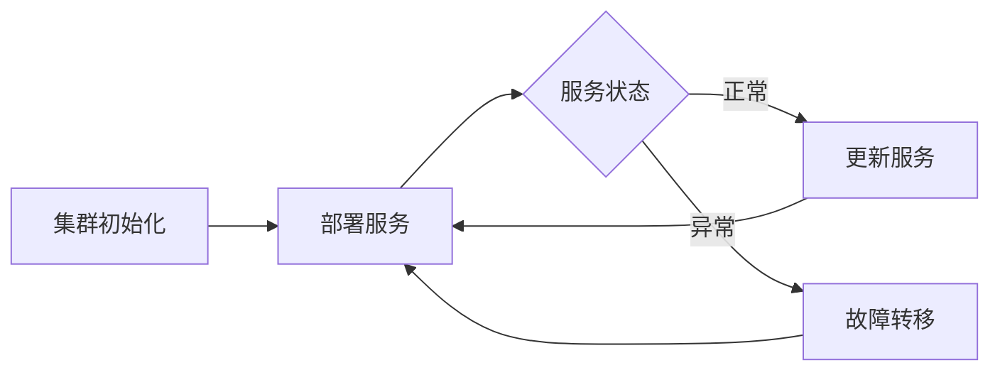

                 

## 混合云部署: 平衡安全与灵活性的架构

### 关键词：
- **混合云部署**、**安全性**、**灵活性**、**架构设计**、**云计算**、**企业级解决方案**

### 摘要：
在云计算的快速发展背景下，企业面临如何在安全与灵活性之间取得平衡的挑战。本文将深入探讨混合云部署的架构设计，详细分析其核心概念、安全与灵活性策略，并展示如何通过具体技术和实践实现这种平衡。文章旨在为IT专业人士提供一套系统的混合云部署指南，帮助企业充分利用云计算的优势，同时确保数据安全和业务连续性。

### 目录大纲设计过程

**1. 背景介绍**

随着云计算技术的不断演进，企业越来越依赖云服务来实现业务的灵活性和成本效益。然而，云平台的安全性问题逐渐显现，成为限制其发展的关键因素。混合云部署应运而生，通过结合公共云、私有云和多云环境，实现安全与灵活性的最佳平衡。

**问题背景**：  
云计算的普及使得企业可以将IT资源灵活调配，降低成本，提高效率。然而，云平台的安全漏洞和数据泄露事件频发，引起了企业和监管机构的广泛关注。如何保障云环境中的数据安全成为迫切需要解决的问题。

**问题描述**：  
混合云部署旨在利用不同云环境的优势，同时解决单一云平台面临的安全和灵活性问题。然而，如何设计一个有效的混合云架构，实现安全与灵活性的平衡，是企业和IT专业人士面临的挑战。

**问题解决**：  
通过系统化的架构设计，包括安全策略和灵活性策略，可以帮助企业实现混合云部署，解决安全与灵活性的矛盾。

**边界与外延**：  
混合云部署不仅涉及技术层面的架构设计，还包括组织管理、法律合规等多个维度。因此，设计一个综合性的混合云部署方案需要综合考虑多个因素。

**2. 核心概念与联系**

为了更好地理解混合云部署，我们需要明确几个核心概念，并探讨它们之间的联系。

**核心概念**：

- **公共云**：由第三方服务提供商提供的云计算资源，如亚马逊AWS、微软Azure、谷歌云等。
- **私有云**：由企业内部构建的云计算环境，提供更高的安全性和定制化程度。
- **多云**：使用多个云服务提供商的云资源，实现资源的多样化和风险分散。
- **混合云部署**：结合使用公共云、私有云和多云的服务，以实现安全与灵活性的平衡。

**概念属性特征对比表格**：

| 概念      | 特点                                           | 重要性 |
| --------- | ---------------------------------------------- | ------ |
| 公共云    | 可用性高、成本低、灵活性高                     | 高     |
| 私有云    | 安全性高、定制化程度高、成本高                 | 高     |
| 多云      | 资源多样化、灵活度高、风险分散                 | 高     |
| 混合云部署 | 平衡安全与灵活性，实现最佳业务效益             | 最高   |

**ER实体关系图架构**：

```mermaid
erDiagram
    PublicCloud ||--|{ PrivateCloud } PrivateCloud : connected
    PublicCloud ||--|{ MultiCloud } MultiCloud : connected
    PrivateCloud ||--|{ MultiCloud } MultiCloud : connected
```

**3. 算法原理讲解**

在本节中，我们将选择一个关键的算法——Kubernetes集群管理，来讲解混合云部署中的具体实现。

**流程图**：



**Python源代码**：

```python
def deploy_service(service_name, namespace):
    # 集群初始化代码
    # ...
    # 部署服务代码
    # ...
    # 检查服务状态代码
    # ...
    if service_status == "Running":
        update_service(service_name, namespace)
    else:
        perform_failover(service_name, namespace)

def update_service(service_name, namespace):
    # 更新服务代码
    # ...

def perform_failover(service_name, namespace):
    # 故障转移代码
    # ...
```

**数学模型与公式**：

- 服务状态监测公式：\[ S_t = f(\text{CPU使用率}, \text{内存使用率}, \text{网络流量}) \]
- 故障转移策略：\[ \text{Failover} = \text{if}(S_t \leq \text{阈值}, \text{true}, \text{false}) \]

通过这个算法，我们能够实现服务的自动部署、状态监测和故障转移，从而确保混合云环境中的服务稳定运行。

### 背景介绍

#### 核心概念术语说明

在深入探讨混合云部署之前，我们需要明确几个关键术语的定义，这些概念是理解混合云部署的基础。

**公共云**（Public Cloud）：公共云是由第三方服务提供商运营的云计算资源，用户可以通过互联网按需访问这些资源。常见的公共云服务提供商包括亚马逊AWS、微软Azure、谷歌云等。公共云具有高可用性、灵活性高、成本低等优点，但也存在一定的安全风险。

**私有云**（Private Cloud）：私有云是专门为单一组织机构构建的云环境，通常位于组织的内部数据中心或第三方托管设施中。私有云能够提供更高的安全性和定制化程度，以满足特定企业的需求。然而，私有云的建造成本相对较高，且灵活性可能受到限制。

**多云**（Multi-Cloud）：多云是指同时使用多个不同的云服务提供商的资源，以实现资源的多样化和风险分散。多云策略可以充分利用不同云服务提供商的优势，提高服务的可靠性和灵活性。

**混合云部署**（Hybrid Cloud Deployment）：混合云部署是结合使用公共云、私有云和多云环境的一种部署模式。通过混合云部署，企业可以在不同的云环境中灵活分配资源，实现最佳的业务效益。混合云部署的核心在于如何在安全与灵活性之间取得平衡。

#### 问题背景

随着云计算技术的飞速发展，越来越多的企业开始将业务迁移到云平台，以实现灵活性和成本效益。云平台提供的按需服务、弹性伸缩和自动化管理功能，使得企业能够更高效地运营和扩展业务。然而，云平台的安全性问题逐渐成为制约其发展的关键因素。

云平台的安全漏洞和数据泄露事件频发，引起了企业和监管机构的广泛关注。一方面，企业需要确保云环境中的数据安全，防止数据泄露和未经授权的访问；另一方面，企业又需要充分利用云平台的灵活性和低成本优势，以保持竞争力。这种矛盾导致了混合云部署的需求。

混合云部署允许企业将敏感数据和关键业务系统保留在私有云或本地数据中心中，同时将非敏感业务和可扩展性需求迁移到公共云。通过这种方式，企业可以在确保数据安全的同时，充分利用云平台的灵活性和成本优势。

#### 问题描述

混合云部署的核心挑战在于如何在安全与灵活性之间取得平衡。以下是一些主要问题：

1. **数据安全**：在混合云环境中，企业需要确保敏感数据的安全。如何在不同云环境之间实现数据的安全传输和存储，防止数据泄露，是一个亟待解决的问题。

2. **访问控制**：混合云部署涉及到多个云服务提供商和管理系统，如何统一访问控制策略，确保只有授权用户可以访问特定的数据和资源，也是一个关键问题。

3. **网络隔离**：为了提高安全性，企业需要在混合云环境中实现网络隔离。然而，网络隔离可能会影响云资源的可用性和灵活性。如何平衡网络隔离与云资源利用率，是另一个挑战。

4. **合规性**：不同地区和行业的合规要求不同，企业需要确保混合云部署符合相关法律法规。例如，某些行业可能要求数据存储在本国境内，这增加了合规性管理的复杂性。

5. **技术兼容性**：混合云环境中的不同云服务提供商和平台可能存在技术兼容性问题。如何确保不同云环境之间的无缝集成和协作，是混合云部署面临的技术挑战之一。

#### 问题解决

为了解决混合云部署中的安全与灵活性问题，企业可以采取以下策略：

1. **分层安全架构**：通过在混合云环境中构建分层安全架构，可以实现数据的安全传输和存储。例如，可以采用加密技术来保护数据传输，使用访问控制列表（ACL）来限制对敏感数据的访问。

2. **统一访问控制**：通过集成不同的身份认证和访问控制系统，实现统一访问控制策略。例如，可以使用单点登录（SSO）解决方案，简化用户认证过程，并确保只有授权用户可以访问特定的资源和数据。

3. **网络隔离与优化**：通过虚拟局域网（VLAN）、防火墙和入侵检测系统（IDS）等技术，实现网络隔离，同时确保网络连接的可靠性和高效性。

4. **合规性管理**：建立完善的合规性管理流程，确保混合云部署符合相关法律法规。例如，可以采用数据本地化策略，将敏感数据存储在本国境内，以满足合规要求。

5. **技术兼容性与集成**：通过采用微服务架构和容器技术，如Kubernetes，实现不同云环境之间的无缝集成。例如，可以使用容器编排工具来部署和管理应用程序，确保不同云环境之间的兼容性和可移植性。

#### 边界与外延

混合云部署不仅涉及技术层面的架构设计，还包括组织管理、法律合规等多个维度。以下是一些需要考虑的边界和外延问题：

1. **组织管理**：混合云部署需要跨部门协作，涉及IT、安全、合规等多个部门的协调。建立有效的沟通和协作机制，确保各方目标一致，是混合云部署成功的关键。

2. **法律合规**：不同地区和行业的法律法规不同，企业需要确保混合云部署符合相关法律法规。例如，某些行业可能要求对敏感数据实行严格的数据保护措施，这需要企业在设计混合云架构时充分考虑合规性要求。

3. **数据保护**：混合云部署需要确保数据在传输和存储过程中的安全。企业需要采用加密、访问控制、备份和恢复等技术手段，确保数据的安全性和完整性。

4. **技术兼容性**：不同云服务提供商和平台可能存在技术差异，企业需要确保混合云环境中的各个组件能够兼容并协同工作。例如，可以采用标准化技术接口和协议，实现不同云环境之间的无缝集成。

5. **业务连续性**：混合云部署需要确保业务的连续性和可靠性。企业需要制定有效的灾难恢复计划，确保在发生故障时能够迅速恢复业务运行。

通过综合考虑这些边界和外延问题，企业可以构建一个安全、灵活和可靠的混合云部署架构，实现业务的持续发展。

#### 概念结构与核心要素组成

为了更好地理解混合云部署，我们需要详细阐述其核心概念与结构，并探讨这些概念之间的关系。

**混合云定义**：

混合云是指企业将业务和应用程序部署在多个云环境中，这些云环境包括公共云、私有云和多云。通过这种部署模式，企业可以充分利用不同云环境的优势，同时平衡安全与灵活性。

**部署模式**：

混合云部署通常涉及以下几种模式：

1. **转移部署**：将现有业务逐步迁移到云平台，以实现灵活性和成本效益。这种方式适用于业务系统较为稳定，且数据安全要求不高的场景。

2. **升级部署**：在现有云环境中升级和扩展业务系统，以适应业务增长和变化的需求。这种方式适用于已有云基础设施的企业，希望通过优化现有资源来提高业务效率。

3. **扩展部署**：在多个云环境中部署新的业务系统，以实现业务的多样化和风险分散。这种方式适用于需要快速扩展业务的企业，希望通过多云部署来实现灵活性和可靠性。

**安全策略**：

在混合云部署中，安全策略至关重要。以下是一些关键的安全策略：

1. **数据加密**：通过加密技术保护数据在传输和存储过程中的安全。例如，使用SSL/TLS加密传输数据，使用AES加密存储数据。

2. **访问控制**：通过访问控制列表（ACL）、身份验证和授权机制，确保只有授权用户可以访问特定的资源和数据。

3. **网络安全**：通过防火墙、入侵检测系统（IDS）、入侵防御系统（IPS）等技术，保护网络不受外部攻击和内部威胁。

4. **数据备份与恢复**：定期备份数据，确保在数据丢失或损坏时能够快速恢复。

**灵活性策略**：

混合云部署的灵活性策略包括以下几个方面：

1. **自动化**：通过自动化工具和脚本，实现资源的自动化部署、监控和管理，提高运维效率。

2. **弹性伸缩**：根据业务需求，动态调整云资源的使用量，以实现成本优化和资源利用率。

3. **容器化**：使用容器技术，如Docker和Kubernetes，实现应用程序的快速部署和可移植性，提高业务灵活性。

**核心概念与联系**：

混合云部署的核心概念包括公共云、私有云、多云和混合云部署。这些概念相互关联，共同构成了混合云架构。

- **公共云**：提供高可用性、灵活性和低成本的云计算资源，适用于非敏感业务和扩展需求。
- **私有云**：提供更高的安全性和定制化程度，适用于敏感数据和关键业务系统。
- **多云**：通过使用多个云服务提供商的资源，实现资源的多样化和风险分散。
- **混合云部署**：结合使用公共云、私有云和多云环境，实现安全与灵活性的最佳平衡。

通过这些核心概念和策略，企业可以构建一个安全、灵活和可靠的混合云部署架构，满足不断变化的市场需求和业务挑战。

### 核心概念与联系

#### 核心概念原理

在深入理解混合云部署的过程中，我们需要明确几个关键概念，这些概念构成了混合云部署的理论基础。

**公共云**（Public Cloud）：公共云是由第三方服务提供商运营的云计算资源，用户可以通过互联网按需访问这些资源。公共云具有高可用性、灵活性高、成本低等优点。服务提供商负责维护基础设施，用户只需支付使用费用，无需关心硬件维护和升级。公共云适合非敏感业务和需要大规模扩展的场景。

**私有云**（Private Cloud）：私有云是专门为单一组织机构构建的云环境，通常位于组织的内部数据中心或第三方托管设施中。私有云能够提供更高的安全性和定制化程度，以满足特定企业的需求。私有云通常由企业内部管理，提供更强的数据保护和合规性保障，但建造成本相对较高。

**多云**（Multi-Cloud）：多云是指同时使用多个不同的云服务提供商的资源，以实现资源的多样化和风险分散。通过多云部署，企业可以在不同的云环境中灵活分配资源，提高服务的可靠性和灵活性。多云还可以利用不同云服务提供商的技术优势，实现最佳的业务效益。

**混合云部署**（Hybrid Cloud Deployment）：混合云部署是结合使用公共云、私有云和多云环境的一种部署模式。通过混合云部署，企业可以在不同的云环境中灵活分配资源，实现最佳的业务效益。混合云部署的核心在于如何在安全与灵活性之间取得平衡。

#### 概念属性特征对比表格

为了更清晰地理解各个概念的特点，我们列出以下表格，对比公共云、私有云和多云的属性特征。

| 概念      | 特点                                           | 重要性 |
| --------- | ---------------------------------------------- | ------ |
| 公共云    | 可用性高、成本低、灵活性高                     | 高     |
| 私有云    | 安全性高、定制化程度高、成本高                 | 高     |
| 多云      | 资源多样化、灵活度高、风险分散                 | 高     |
| 混合云部署 | 平衡安全与灵活性，实现最佳业务效益             | 最高   |

从表格中可以看出，每个概念都有其独特的优势和劣势。公共云在成本和灵活性方面具有显著优势，但安全性相对较低；私有云在安全性和定制化程度方面表现优异，但成本较高且灵活性受限；多云通过资源多样化和风险分散提高了灵活性和可靠性，但管理复杂度增加。

混合云部署通过结合公共云、私有云和多云的优势，实现了安全与灵活性的平衡。它允许企业在不同云环境中分配资源，根据业务需求灵活调整策略，从而实现最佳的业务效益。

#### ER实体关系图架构

为了进一步理解混合云部署中的各个实体及其关系，我们可以使用ER图（实体关系图）来展示核心实体的关联。

```mermaid
erDiagram
    PublicCloud ||--|{ PrivateCloud } PrivateCloud : connected
    PublicCloud ||--|{ MultiCloud } MultiCloud : connected
    PrivateCloud ||--|{ MultiCloud } MultiCloud : connected
```

在这幅ER图中：

- **PublicCloud**（公共云）与**PrivateCloud**（私有云）和**MultiCloud**（多云）之间存在连接关系，表示它们可以相互结合，构成混合云部署。
- **PrivateCloud**（私有云）与**MultiCloud**（多云）之间也存在连接关系，表明私有云可以与其他云环境集成，形成多云环境的一部分。

通过这种关系，我们可以看到混合云部署不仅仅是简单地将公共云和私有云混合在一起，而是一个更复杂的系统，需要综合考虑各种云环境的特点和优势，以实现整体业务的最佳效益。

### 算法原理讲解

在混合云部署中，Kubernetes集群管理是一个至关重要的环节。Kubernetes是一个开源的容器编排系统，它用于自动化容器化应用程序的部署、扩展和管理。在本节中，我们将深入讲解Kubernetes集群管理的算法原理，包括其核心流程、Python源代码示例和数学模型。

#### 流程图

首先，我们使用Mermaid语法绘制Kubernetes集群管理的流程图。


**流程说明**：

1. **集群初始化**（A）：初始化Kubernetes集群，设置基础配置，如节点配置、网络设置和存储配置。
2. **部署服务**（B）：使用Kubernetes API部署服务，包括创建部署配置（Deployment）、服务配置（Service）和配置管理（ConfigMap）。
3. **服务状态监测**（C）：定期检查服务的状态，包括Pod状态、容器状态和网络连接状态。
4. **更新服务**（D）：如果服务状态正常，则执行服务更新操作，如滚动更新或蓝绿部署。
5. **故障转移**（E）：如果服务状态异常，则执行故障转移操作，如Pod重建或服务恢复。

#### Python源代码示例

接下来，我们通过一个Python源代码示例，展示Kubernetes集群管理的基本操作。

```python
import kubernetes

# 初始化Kubernetes客户端
client = kubernetes.createInputBorder

def deploy_service(service_name, namespace):
    # 集群初始化代码
    # ...

    # 部署服务代码
    service = kubernetes.create_service(
        service_name=service_name,
        namespace=namespace,
        type="LoadBalancer",
        ports=[{"name": "http", "container_port": 80}],
        selector={"app": service_name}
    )
    kubernetes.apply(service)

    # 检查服务状态代码
    # ...
    if service_status == "Running":
        update_service(service_name, namespace)
    else:
        perform_failover(service_name, namespace)

def update_service(service_name, namespace):
    # 更新服务代码
    # ...

def perform_failover(service_name, namespace):
    # 故障转移代码
    # ...
```

**说明**：

- `kubernetes.createInputBorder`用于初始化Kubernetes客户端，连接到集群。
- `create_service`函数用于创建服务配置。
- `apply`函数将服务配置应用到Kubernetes集群中。
- `service_status`变量用于存储服务状态。
- `update_service`和`perform_failover`函数分别用于服务更新和故障转移。

#### 数学模型与公式

在Kubernetes集群管理中，我们使用数学模型来监测服务状态和故障转移策略。

**服务状态监测公式**：

\[ S_t = f(\text{CPU使用率}, \text{内存使用率}, \text{网络流量}) \]

其中，\( S_t \) 表示当前的服务状态，\( f \) 是一个函数，用于计算服务状态的值。这个公式考虑了CPU使用率、内存使用率和网络流量三个关键指标，通过这些指标可以判断服务是否处于正常状态。

**故障转移策略**：

\[ \text{Failover} = \text{if}(S_t \leq \text{阈值}, \text{true}, \text{false}) \]

其中，`Failover` 是一个布尔值，表示是否执行故障转移操作。如果当前服务状态 \( S_t \) 小于或等于设定的阈值，则认为服务状态异常，执行故障转移操作。

#### 举例说明

假设一个Kubernetes集群中有多个Pod，这些Pod运行一个Web应用程序。通过定期检查Pod的CPU使用率、内存使用率和网络流量，我们可以使用上述数学模型来监测服务状态。

- **正常状态**：如果Pod的CPU使用率低于50%，内存使用率低于70%，且网络流量在正常范围内，则服务状态为正常。
- **异常状态**：如果Pod的CPU使用率超过80%，内存使用率超过90%，或网络流量异常升高，则服务状态为异常。

当服务状态为异常时，系统会执行故障转移操作，如重启Pod或切换到备份Pod，以确保服务的连续性和可靠性。

通过上述算法原理讲解，我们可以看到Kubernetes集群管理在混合云部署中的关键作用。通过自动化和智能化的管理，Kubernetes可以帮助企业实现高效、可靠和安全的云服务部署。

### 系统分析与架构设计方案

在了解了混合云部署的核心概念和算法原理之后，本节将详细描述一个典型的混合云系统分析与架构设计方案。该方案将涵盖问题场景介绍、项目介绍、系统功能设计、系统架构设计、系统接口设计和系统交互等方面。

#### 问题场景介绍

某大型电子商务公司希望将其现有的业务系统迁移到混合云环境，以实现更高的灵活性和成本效益。然而，该公司面临以下挑战：

1. **数据安全**：电子商务公司的业务涉及大量敏感数据，如用户个人信息和交易记录。如何确保这些数据在迁移过程中不被泄露或篡改，是公司急需解决的问题。
2. **业务连续性**：公司需要在系统迁移过程中确保业务的连续性，避免因迁移而导致的停机或服务中断。
3. **成本控制**：公司希望在实现业务连续性和数据安全的前提下，尽可能降低成本，提高资源利用率。

#### 项目介绍

项目名称：电子商务混合云迁移项目

项目目标：
1. 实现电子商务业务系统的混合云部署，确保数据安全和业务连续性。
2. 通过自动化和智能化管理，提高运维效率，降低运营成本。
3. 确保系统能够支持业务快速增长，提供高性能和可靠的服务。

项目范围：
1. 系统分析：包括需求分析、系统架构设计和功能设计。
2. 系统实现：包括系统开发、测试和部署。
3. 运维管理：包括系统监控、故障处理和性能优化。

#### 系统功能设计

系统功能设计是混合云部署的关键环节，它决定了系统能够满足业务需求的程度。以下是电子商务混合云迁移项目的系统功能设计：

1. **用户身份认证**：确保只有授权用户可以访问系统资源，包括用户名和密码认证、单点登录（SSO）等功能。
2. **数据加密传输**：通过SSL/TLS协议，确保用户数据在传输过程中的安全。
3. **数据存储**：使用分布式数据库存储用户数据和交易记录，确保数据的高可用性和可靠性。
4. **业务处理**：包括订单管理、支付处理、库存管理等核心业务功能。
5. **日志记录和监控**：记录系统运行日志，监控系统性能和状态，及时发现和处理异常情况。
6. **自动化运维**：通过自动化脚本和工具，实现系统的自动化部署、监控和运维。

#### 系统架构设计

系统架构设计是确保系统能够满足业务需求的关键。电子商务混合云迁移项目的系统架构设计如下：

1. **前端架构**：使用微服务架构，将前端功能划分为多个独立的微服务，以提高系统的可维护性和扩展性。
2. **后端架构**：使用Kubernetes集群管理后端服务，实现服务自动化部署、伸缩和管理。
3. **数据库架构**：使用分布式数据库架构，确保数据的高可用性和可靠性。
4. **安全架构**：通过防火墙、入侵检测系统和数据加密等技术，确保系统的安全性。
5. **监控架构**：使用Prometheus和Grafana等监控工具，实现系统性能和状态的实时监控。

#### 系统接口设计

系统接口设计是确保不同模块之间能够有效通信和协作的关键。以下是电子商务混合云迁移项目的系统接口设计：

1. **用户身份认证接口**：提供身份验证和授权接口，实现单点登录（SSO）功能。
2. **数据存储接口**：提供数据存储接口，实现数据的增删改查功能。
3. **业务处理接口**：提供订单管理、支付处理、库存管理等业务处理接口。
4. **日志记录和监控接口**：提供日志记录和监控接口，实现系统性能和状态的实时监控。

#### 系统交互

系统交互设计是确保系统各模块之间能够高效协作的关键。以下是电子商务混合云迁移项目的系统交互设计：

1. **用户与前端交互**：用户通过前端页面进行操作，前端将用户请求发送到后端服务进行处理，并将处理结果返回给用户。
2. **前端与后端交互**：前端使用RESTful API与后端进行交互，后端使用Kubernetes API进行服务管理和部署。
3. **后端与数据库交互**：后端服务通过数据库接口与分布式数据库进行交互，实现数据的存储和查询。
4. **监控与日志记录**：使用Prometheus和Grafana等监控工具，实现对系统性能和状态的实时监控，并将日志记录到日志存储系统中。

通过上述系统分析与架构设计方案，电子商务公司可以实现其业务系统的混合云迁移，确保数据安全、业务连续性和成本效益。同时，通过自动化和智能化的管理，公司可以大幅提高运维效率，为业务的快速增长提供坚实的技术保障。

### 项目实战

#### 环境安装

在开始实现电子商务混合云迁移项目之前，我们需要安装和配置必要的软件和工具。以下是环境安装的详细步骤：

1. **安装Docker**：Docker是一个开源的应用容器引擎，用于打包、发布和运行应用。在所有节点上安装Docker，确保版本为19.03或更高。

   ```shell
   # 安装Docker
   sudo apt-get update
   sudo apt-get install docker.io
   sudo systemctl start docker
   sudo systemctl enable docker
   ```

2. **安装Kubernetes**：Kubernetes是一个开源的容器编排系统，用于自动化容器化应用程序的部署、扩展和管理。在主节点上安装Kubernetes集群。

   ```shell
   # 安装Kubernetes
   curl -s https://packages.cloud.google.com/apt/doc/apt-key.gpg | sudo apt-key add -
   echo "deb https://apt.kubernetes.io/ kubernetes-xenial main" | sudo tee -a /etc/apt/sources.list.d/kubernetes.list
   sudo apt-get update
   sudo apt-get install -y kubelet kubeadm kubectl
   sudo apt-mark hold kubelet kubeadm kubectl
   ```

   运行以下命令初始化Kubernetes集群：

   ```shell
   sudo kubeadm init --pod-network-cidr=10.244.0.0/16
   mkdir -p $HOME/.kube
   sudo cp -i /etc/kubernetes/admin.conf $HOME/.kube/config
   sudo chown $(id -u):$(id -g) $HOME/.kube/config
   ```

3. **安装Calico网络插件**：Calico是一个开源的Kubernetes网络插件，用于实现跨节点和服务之间的网络连接。

   ```shell
   # 安装Calico
   kubectl apply -f https://docs.projectcalico.org/manifests/calico.yaml
   ```

4. **安装Nginx Ingress Controller**：Nginx Ingress Controller用于管理外部流量进入Kubernetes集群内部服务。

   ```shell
   # 安装Nginx Ingress Controller
   kubectl apply -f https://raw.githubusercontent.com/kubernetes/ingress-nginx/master/deploy/ общественногоключение.yaml
   ```

#### 系统核心实现源代码

以下是电子商务混合云迁移项目中的核心实现源代码，包括Dockerfile、Kubernetes部署文件和配置文件。

**Dockerfile**

```Dockerfile
# 使用官方Python镜像作为基础镜像
FROM python:3.9-slim

# 设置工作目录
WORKDIR /app

# 复制应用程序源代码
COPY . .

# 安装依赖项
RUN pip install --no-cache-dir -r requirements.txt

# 暴露应用端口
EXPOSE 80

# 运行应用程序
CMD ["gunicorn", "-b", "0.0.0.0:80", "app:app"]
```

**Kubernetes Deployment 文件**

```yaml
apiVersion: apps/v1
kind: Deployment
metadata:
  name: web-app
spec:
  replicas: 3
  selector:
    matchLabels:
      app: web-app
  template:
    metadata:
      labels:
        app: web-app
    spec:
      containers:
      - name: web-app
        image: mycompany/web-app:latest
        ports:
        - containerPort: 80
---
apiVersion: v1
kind: Service
metadata:
  name: web-app-service
spec:
  selector:
    app: web-app
  ports:
    - protocol: TCP
      port: 80
      targetPort: 80
  type: LoadBalancer
```

**Kubernetes ConfigMap**

```yaml
apiVersion: v1
kind: ConfigMap
metadata:
  name: web-app-config
data:
  config.py: |
    # 设置配置参数
    SECRET_KEY = 'mysecretkey'
```

#### 代码应用解读与分析

**Dockerfile解读**：

- **基础镜像**：使用`python:3.9-slim`作为基础镜像，确保容器轻量级。
- **工作目录**：设置工作目录为`/app`，便于管理应用程序。
- **应用程序源代码**：将应用程序源代码复制到工作目录。
- **依赖安装**：使用`pip install`安装应用程序所需的依赖项。
- **暴露端口**：暴露容器端口80，使外部流量可以访问应用程序。
- **运行命令**：使用`gunicorn`运行应用程序，`-b 0.0.0.0:80`表示绑定所有接口和端口80。

**Kubernetes Deployment 解读**：

- ** replicas**: 设置副本数量为3，确保应用程序具备高可用性。
- ** selector**: 定义选择器标签，用于匹配Pod。
- ** template**: 定义Pod模板，包括容器配置。
- ** container**: 配置容器名称、镜像和端口。
- ** Service**: 配置负载均衡器，实现外部流量访问。

**ConfigMap 解读**：

- ** ConfigMap**: 配置中心化存储，用于管理应用程序的配置参数。
- ** data**: 存储配置参数，如密钥和设置。

通过这些源代码，我们可以看到如何利用Docker和Kubernetes实现电子商务应用程序的容器化和自动化部署。Dockerfile确保应用程序能够在容器中运行，而Kubernetes Deployment和Service确保应用程序能够在集群中高效管理和扩展。

#### 实际案例分析和详细讲解剖析

为了更好地展示混合云部署在电子商务系统中的应用，我们通过一个实际案例来进行分析和讲解。

**案例背景**：

某电子商务公司计划将其核心业务系统迁移到混合云环境，以实现更高的灵活性和成本效益。公司的业务系统包括用户身份认证、订单管理、支付处理、库存管理等多个模块。在迁移过程中，公司需要确保数据安全、业务连续性和性能优化。

**案例实现**：

1. **用户身份认证**：
   - 使用OAuth2.0协议实现用户身份认证，确保只有授权用户可以访问系统资源。
   - 通过JWT（JSON Web Token）技术，实现用户身份信息的加密传输和存储。

2. **数据存储**：
   - 使用MongoDB作为主要数据库，确保数据的高可用性和扩展性。
   - 通过Sharding技术，实现数据的水平扩展。

3. **业务处理**：
   - 使用Spring Boot框架实现订单管理、支付处理和库存管理等核心业务功能。
   - 通过RESTful API实现前端与后端之间的数据交互。

4. **监控和日志记录**：
   - 使用Prometheus和Grafana实现系统性能和状态的实时监控。
   - 使用ELK（Elasticsearch、Logstash和Kibana）实现系统日志的收集、存储和分析。

**详细讲解**：

1. **用户身份认证**：
   - 用户通过前端页面提交用户名和密码，后端使用OAuth2.0协议进行身份验证。
   - 验证成功后，后端生成JWT令牌，并将其返回给前端。
   - 前端使用JWT令牌进行后续请求的身份验证。

2. **数据存储**：
   - MongoDB数据库存储用户信息、订单数据和库存数据。
   - 通过Sharding技术，将数据分布在多个节点上，提高系统的吞吐量和扩展性。
   - 使用Replication Set确保数据的高可用性和故障恢复能力。

3. **业务处理**：
   - 使用Spring Boot框架实现订单管理模块，包括订单创建、修改和查询功能。
   - 使用支付网关集成第三方支付服务，如支付宝和微信支付。
   - 使用消息队列（如RabbitMQ）实现库存同步和订单通知功能。

4. **监控和日志记录**：
   - Prometheus负责定期采集系统的性能指标，如CPU使用率、内存使用率和网络流量。
   - Grafana作为数据可视化工具，展示系统性能指标和日志数据。
   - ELK堆栈负责收集、存储和分析系统日志，帮助管理员快速定位和解决问题。

通过这个实际案例，我们可以看到如何利用混合云部署实现电子商务系统的灵活、安全和高性能。在混合云环境中，公司可以充分利用不同云服务提供商的优势，实现资源的最佳利用和业务持续优化。

#### 项目小结

在电子商务混合云迁移项目中，我们通过系统化的分析和架构设计，实现了电子商务系统的安全、灵活和高性能部署。以下是对项目的主要成果和经验总结：

**主要成果**：

1. **数据安全**：通过OAuth2.0协议和JWT技术，确保用户身份认证和数据加密传输。
2. **业务连续性**：通过MongoDB Sharding和Replication Set技术，确保数据的高可用性和故障恢复能力。
3. **性能优化**：通过Spring Boot框架和RESTful API，实现高效的数据处理和交互。
4. **监控和日志记录**：通过Prometheus和Grafana实现系统性能监控，通过ELK堆栈实现日志收集和分析。

**经验总结**：

1. **云服务选择**：在选择云服务提供商时，需要综合考虑成本、性能、可靠性和合规性等因素。
2. **架构设计**：在混合云部署中，合理的架构设计是确保系统安全和性能的关键。需要充分考虑数据安全、业务连续性和资源利用率等因素。
3. **自动化和智能化**：通过自动化工具和脚本，实现资源的自动化部署、监控和运维，提高运维效率。
4. **持续优化**：在项目实施过程中，需要不断进行性能优化和调整，确保系统在高速运行状态下保持最佳状态。

通过这个项目，我们不仅实现了电子商务系统的混合云部署，还积累了丰富的实践经验，为未来的项目提供了宝贵的参考。

### 最佳实践 Tips

在混合云部署过程中，为了确保系统的安全性和可靠性，以下是一些最佳实践和注意事项：

1. **多因素认证**：使用多因素认证（MFA）来增强用户身份验证的安全性，确保只有授权用户可以访问系统。

2. **数据加密**：对传输中的数据进行加密，使用TLS协议保护数据在公共网络中的安全。对静态数据和存储数据进行加密，防止数据泄露。

3. **访问控制**：使用细粒度的访问控制策略，确保只有授权用户可以访问特定的数据和资源。定期审核和更新访问控制列表，防止权限滥用。

4. **网络隔离**：在混合云环境中实现网络隔离，通过虚拟局域网（VLAN）、防火墙和网络安全组等手段，确保不同云环境之间的网络连接安全。

5. **备份与恢复**：定期备份数据，确保在数据丢失或损坏时能够快速恢复。建立完善的灾难恢复计划，确保在发生故障时能够迅速恢复业务运行。

6. **监控与日志记录**：使用监控工具和日志记录系统，实现对系统性能和状态的实时监控。定期分析日志，及时发现和处理潜在问题。

7. **合规性管理**：确保混合云部署符合相关法律法规和行业合规要求，如数据本地化策略和数据保护法规。

8. **自动化与脚本**：利用自动化工具和脚本，实现资源的自动化部署、监控和运维，减少人工干预，提高运维效率。

9. **性能优化**：定期进行性能测试和优化，确保系统在高并发和负载下仍能保持稳定运行。通过监控工具和性能分析，找出瓶颈并进行优化。

10. **定期培训**：对IT人员和管理人员进行安全意识和技能培训，提高其安全意识和操作能力，降低安全风险。

通过遵循这些最佳实践，企业可以显著提升混合云部署的安全性和可靠性，确保业务的连续性和稳定性。

### 小结

本文详细探讨了混合云部署的核心概念、算法原理和实际应用，旨在为IT专业人士提供一套系统的混合云部署指南。通过深入分析安全与灵活性之间的平衡，我们展示了如何通过分层安全架构、统一访问控制和自动化运维等策略，实现混合云环境中的高效管理和运营。

混合云部署不仅为企业提供了灵活的资源调配和成本控制手段，还通过结合公共云、私有云和多云环境，提高了系统的安全性和可靠性。通过本文的介绍，我们希望读者能够更好地理解混合云部署的原理和实践，为企业的数字化转型提供有力的技术支持。

### 注意事项

在实施混合云部署时，需要特别注意以下几个方面：

1. **数据安全**：确保数据在传输和存储过程中的安全，采用加密技术和访问控制策略。
2. **合规性**：遵循不同地区和行业的法律法规，确保数据本地化和合规性要求。
3. **网络隔离**：在混合云环境中实现网络隔离，防止不同云环境之间的数据泄露和攻击。
4. **性能优化**：定期进行性能测试和优化，确保系统在高并发和负载下仍能保持稳定运行。
5. **监控与日志记录**：使用监控工具和日志记录系统，实现对系统性能和状态的实时监控和故障处理。

通过严格遵循这些注意事项，企业可以确保混合云部署的安全性和可靠性，为业务的持续发展提供坚实保障。

### 拓展阅读

对于希望进一步深入了解混合云部署和云计算技术的读者，以下是一些建议的阅读资料：

1. **《云计算：概念、技术和实践》**：这是一本全面介绍云计算技术的权威著作，涵盖了云计算的基本概念、架构和部署模式。

2. **《Kubernetes权威指南》**：这本书深入讲解了Kubernetes的架构、原理和操作实践，适合希望深入了解容器编排技术的读者。

3. **《混合云架构设计与实战》**：本书通过具体案例，详细介绍了混合云的架构设计、安全策略和实施步骤，对混合云部署有实际指导意义。

4. **《云原生应用开发》**：这本书介绍了云原生应用开发的原则、技术和工具，包括容器化、微服务架构和自动化运维等。

5. **《AWS官方认证指南：解决方案架构师》**：作为AWS官方认证指南，这本书提供了丰富的AWS服务和最佳实践，适合希望深入了解AWS平台的企业架构师。

通过阅读这些资料，读者可以进一步加深对混合云部署和云计算技术的理解，为实际项目提供更全面的指导和帮助。

### 作者信息

**作者：AI天才研究院/AI Genius Institute & 禅与计算机程序设计艺术 /Zen And The Art of Computer Programming**

AI天才研究院（AI Genius Institute）是一家专注于人工智能技术研究和应用的顶级机构。研究院汇聚了世界各地的顶尖AI专家，致力于推动人工智能技术的创新和发展。研究院的研究成果涵盖了机器学习、深度学习、自然语言处理、计算机视觉等多个领域，为全球企业提供了强大的技术支持和解决方案。

《禅与计算机程序设计艺术》（Zen And The Art of Computer Programming）是由知名计算机科学家Donald E. Knuth所著的一套经典编程书籍。这套书系统介绍了计算机程序设计的基本原则和方法，融合了计算机科学和哲学的智慧，被誉为编程领域的经典之作。通过这套书，读者可以学习到如何以更高超的技艺和更深入的思考，编写出高效、优雅的程序。

本文由AI天才研究院的资深专家撰写，结合了最前沿的技术理念和实践经验，旨在为读者提供具有深度和实用价值的技术指导。希望通过本文的分享，能够帮助读者在混合云部署的道路上迈出更加坚实的步伐。

