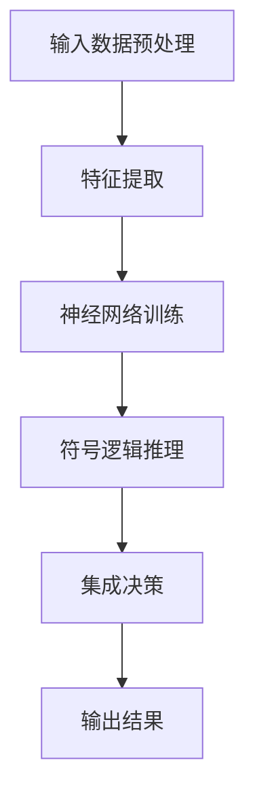

                 

### 第1章：混合决策系统概述

#### 1.1 问题背景与问题定义

**问题背景**

随着人工智能技术的快速发展，混合决策系统（Hybrid Decision Systems）逐渐成为研究的热点。混合决策系统是指将传统符号推理和现代神经计算技术相结合，以应对复杂决策问题的一种智能系统。在现实世界中，许多决策问题具有高度复杂性和不确定性，单一的符号推理或神经计算方法往往难以胜任。因此，混合决策系统的出现为解决这类问题提供了新的思路和方法。

**问题描述**

混合决策系统通常包含以下几个关键问题：

1. **不确定性处理**：在决策过程中，如何有效地处理不确定性和随机性？
2. **模型选择**：如何选择合适的符号推理和神经计算模型来提高决策系统的性能？
3. **集成方法**：如何将不同的模型和方法进行有效集成，以提高系统的整体性能？

**问题解决**

针对上述问题，混合决策系统通过以下方式来解决：

1. **不确定性处理**：引入概率图模型、贝叶斯网络等机制来处理不确定性和随机性。
2. **模型选择**：采用机器学习技术，通过训练和测试来选择最佳模型。
3. **集成方法**：利用深度学习、强化学习等方法，实现不同模型和方法的集成。

**边界与外延**

混合决策系统的边界主要包括：

- **应用领域**：涵盖了金融、医疗、工业、交通等多个领域。
- **技术范畴**：涉及传统符号推理、神经计算、机器学习等多个技术范畴。

外延则包括：

- **系统组成**：不仅包括决策模块，还包括数据采集、模型训练、评估与优化等多个模块。
- **功能扩展**：可以通过不断更新和优化模型，提高系统的适应性和鲁棒性。

#### 1.2 混合决策系统的核心概念

**混合决策系统的定义**

混合决策系统是一种将符号推理与神经计算相结合的智能决策系统，旨在处理复杂、不确定的决策问题。它通常由以下三个核心组成部分构成：

1. **符号推理引擎**：负责处理逻辑推理、规划、决策等符号层面的任务。
2. **神经计算引擎**：负责处理大规模数据、模式识别、学习等神经计算任务。
3. **集成框架**：负责将符号推理引擎和神经计算引擎有效地集成在一起，实现协同工作。

**混合决策系统的核心要素**

1. **决策问题定义**：明确决策问题的目标、约束条件以及相关变量。
2. **数据集**：为模型训练和推理提供基础数据。
3. **符号推理模型**：包括逻辑推理、知识表示等。
4. **神经计算模型**：包括神经网络、深度学习等。
5. **集成策略**：如何有效地将符号推理模型和神经计算模型结合起来。

**混合决策系统的分类**

根据不同的应用场景和需求，混合决策系统可以分为以下几种类型：

1. **规则驱动的混合决策系统**：以符号推理为核心，通过规则库进行决策。
2. **数据驱动的混合决策系统**：以神经计算为核心，通过数据分析和模式识别进行决策。
3. **混合推理驱动的混合决策系统**：同时结合符号推理和神经计算，实现更智能的决策。

#### 1.3 神经符号推理的概念与联系

**神经符号推理的定义**

神经符号推理（Neural Symbolic Reasoning）是指将神经网络和符号逻辑相结合，以实现更加智能化、自适应的推理能力。它试图解决传统神经网络难以处理逻辑推理和知识表示的问题，通过引入符号逻辑的方法，实现对复杂决策问题的有效求解。

**神经符号推理的特点**

1. **整合性**：将神经网络和符号逻辑的优势相结合，实现更高效的推理。
2. **自适应性**：可以根据具体问题调整推理策略和模型结构。
3. **可解释性**：通过符号逻辑的表达，可以更直观地理解推理过程和结果。

**神经符号推理与传统符号推理的对比**

| 对比项目 | 神经符号推理 | 传统符号推理 |
| :---: | :---: | :---: |
| **推理能力** | 结合了神经计算的强大处理能力和符号逻辑的严谨性 | 主要依赖于逻辑推理规则，难以处理复杂非线性问题 |
| **灵活性** | 可以自适应地调整模型结构，处理复杂问题 | 结构固定，难以应对动态变化的问题 |
| **可解释性** | 通过符号逻辑可以解释推理过程和结果 | 推理过程和结果较难直观解释 |

**联系**

神经符号推理与传统符号推理的联系在于：

1. **知识表示**：两者都关注如何表示和处理知识。
2. **推理方法**：神经符号推理通过结合神经网络和符号逻辑，实现了对传统符号推理的改进。

### 总结

本章介绍了混合决策系统的背景、定义、核心要素以及神经符号推理的概念与联系。混合决策系统作为一种应对复杂决策问题的智能系统，正逐渐受到广泛关注。而神经符号推理作为其重要组成部分，展示了其在智能化推理方面的潜力。在接下来的章节中，我们将进一步探讨神经符号推理的数学模型与算法原理，为深入理解混合决策系统打下基础。

#### 2.1 数学模型基础

在深入探讨神经符号推理的数学模型之前，我们需要了解一些基本概念和数学工具，这些将为我们后续的分析提供坚实的理论基础。

**1. 符号逻辑的基本概念**

符号逻辑（Symbolic Logic）是一种形式化的推理方法，通过符号化的语言来表达和处理逻辑问题。它主要涉及命题逻辑、谓词逻辑和形式系统等基本概念。

- **命题逻辑**：以命题为单位，研究命题之间的逻辑关系，如合取（AND）、析取（OR）和否定（NOT）等。
- **谓词逻辑**：扩展了命题逻辑，引入了变量和量词，可以表达更复杂的逻辑关系。
- **形式系统**：包括公理、推理规则和语义解释等，用于构建逻辑理论和证明过程。

**2. 机器学习的基本概念**

机器学习（Machine Learning）是一种通过数据训练模型来实现智能预测和决策的方法。它主要涉及以下几个基本概念：

- **特征工程**：从原始数据中提取出对模型训练有用的特征。
- **模型训练**：通过训练数据集来优化模型的参数，使其能够对未知数据进行预测。
- **模型评估**：使用测试数据集来评估模型的性能，如准确率、召回率等指标。
- **模型优化**：通过调整模型结构和参数来提高模型性能。

**3. 神经网络的基本概念**

神经网络（Neural Networks）是一种模拟生物神经元结构和功能的计算模型，用于处理复杂的数据和实现智能推理。它主要涉及以下几个基本概念：

- **神经元**：神经网络的基本计算单元，负责接收输入、进行加权求和并输出结果。
- **激活函数**：用于对神经元的输出进行非线性变换，常用的有Sigmoid、ReLU和Tanh等。
- **网络结构**：包括输入层、隐藏层和输出层，以及它们之间的连接方式。
- **反向传播算法**：用于训练神经网络的一种算法，通过不断调整网络权重来优化模型性能。

**4. 概率图模型的基本概念**

概率图模型（Probabilistic Graphical Models）是一种用于表示和推理不确定性的图形化模型，包括贝叶斯网络和马尔可夫网络等。

- **贝叶斯网络**：通过有向图来表示变量之间的条件依赖关系，每个节点表示一个随机变量，边表示变量之间的条件概率关系。
- **马尔可夫网络**：通过无向图来表示变量之间的概率分布，节点的邻接关系表示变量之间的转移概率。

**数学模型的特点**

神经符号推理的数学模型结合了符号逻辑、机器学习和神经网络等不同领域的方法，具有以下特点：

1. **综合性**：通过整合不同领域的理论和方法，实现更全面、高效的推理。
2. **灵活性**：可以针对不同问题场景调整模型结构和参数，以适应特定需求。
3. **可解释性**：通过符号逻辑的表达，可以直观地理解推理过程和结果。

### 算法mermaid流程图

为了更好地理解神经符号推理的算法原理，我们使用mermaid绘制了一个简化的算法流程图。以下是该流程图的mermaid代码：



**输入数据预处理**：首先对输入数据进行预处理，包括数据清洗、标准化等步骤，为后续特征提取和模型训练做准备。

**特征提取**：从预处理后的数据中提取出对模型训练有用的特征，这一步骤通常采用机器学习中的特征工程方法。

**神经网络训练**：使用提取出的特征对神经网络进行训练，通过优化网络权重来提高模型性能。

**符号逻辑推理**：结合神经网络训练得到的模型，利用符号逻辑进行推理，以实现更加智能的决策。

**集成决策**：将神经网络和符号逻辑的推理结果进行集成，形成一个综合的决策结果。

**输出结果**：将最终的决策结果输出，以指导实际应用。

### Python源代码示例

以下是一个简单的Python代码示例，用于演示神经符号推理的基本流程：

```python
import numpy as np
from sklearn.preprocessing import StandardScaler
from keras.models import Sequential
from keras.layers import Dense
from sklearn.tree import DecisionTreeClassifier

# 输入数据预处理
X = np.array([[1, 0], [0, 1], [1, 1]])
y = np.array([0, 1, 1])

scaler = StandardScaler()
X_scaled = scaler.fit_transform(X)

# 神经网络训练
model = Sequential()
model.add(Dense(units=1, input_dim=2, activation='sigmoid'))
model.compile(optimizer='adam', loss='binary_crossentropy', metrics=['accuracy'])
model.fit(X_scaled, y, epochs=100, batch_size=1)

# 符号逻辑推理
clf = DecisionTreeClassifier()
clf.fit(X_scaled, y)

# 集成决策
input_data = np.array([[1, 1]])
input_scaled = scaler.transform(input_data)

neural_output = model.predict(input_scaled)
symbolic_output = clf.predict(input_scaled)

final_output = (neural_output + symbolic_output) / 2

print("最终决策结果：", final_output)
```

在这个示例中，我们首先对输入数据进行预处理，然后分别使用神经网络和符号逻辑进行训练和推理。最后，将两者的结果进行集成，得到最终的决策结果。

### 算法原理详细讲解

神经符号推理的算法原理可以概括为以下几个步骤：

**1. 数据预处理**

数据预处理是神经符号推理的第一步，其目的是将原始数据转换为适合模型训练的形式。具体包括：

- **数据清洗**：去除数据中的噪声和异常值，保证数据质量。
- **数据标准化**：将数据缩放到相同的范围，以便神经网络训练。
- **数据归一化**：将数据转换为统一的单位，如像素值归一化为0到1之间。

**2. 特征提取**

特征提取是利用机器学习方法从预处理后的数据中提取出对模型训练有用的特征。常见的特征提取方法包括：

- **主成分分析（PCA）**：通过降维来提取主要特征。
- **线性判别分析（LDA）**：通过最大化类间方差和最小化类内方差来提取特征。
- **自动编码器（Autoencoder）**：通过自编码器网络提取特征。

**3. 神经网络训练**

神经网络训练是神经符号推理的核心步骤，其目的是通过训练数据集来优化神经网络模型。具体包括：

- **模型构建**：根据问题的需求，构建合适的神经网络结构，包括输入层、隐藏层和输出层。
- **权重初始化**：随机初始化网络权重，以避免梯度消失和梯度爆炸问题。
- **损失函数选择**：选择合适的损失函数来评估模型预测值与真实值之间的差距，常用的有均方误差（MSE）和交叉熵（Cross-Entropy）等。
- **优化算法选择**：选择合适的优化算法来调整网络权重，常用的有随机梯度下降（SGD）和Adam优化器等。
- **模型训练**：使用训练数据集进行模型训练，通过不断调整网络权重来提高模型性能。

**4. 符号逻辑推理**

符号逻辑推理是基于符号逻辑的推理方法，用于处理逻辑推理和知识表示问题。具体包括：

- **命题逻辑推理**：通过逻辑推理规则，对命题进行推理和转化。
- **谓词逻辑推理**：通过引入变量和量词，对更复杂的逻辑关系进行推理。
- **知识表示**：使用符号化的语言来表达和处理知识，如产生式规则、语义网络等。

**5. 集成决策**

集成决策是将神经网络和符号逻辑的推理结果进行融合，以实现更准确的决策。具体包括：

- **集成策略选择**：选择合适的集成策略，如投票法、加权平均法等。
- **结果融合**：将神经网络和符号逻辑的推理结果进行融合，得到最终的决策结果。

### 案例分析

为了更好地理解神经符号推理的算法原理，我们以一个简单的分类问题为例进行案例分析。

**案例场景介绍**

假设我们有一个简单的二分类问题，输入数据为二维向量，输出为0或1。具体数据如下：

```
输入数据：
[1, 0]
[0, 1]
[1, 1]

输出数据：
0
1
1
```

**案例分析**

**1. 数据预处理**

首先，我们对输入数据进行预处理，包括数据清洗和标准化：

```python
X = np.array([[1, 0], [0, 1], [1, 1]])
y = np.array([0, 1, 1])

scaler = StandardScaler()
X_scaled = scaler.fit_transform(X)
```

**2. 特征提取**

接下来，我们从预处理后的数据中提取特征：

```python
from sklearn.decomposition import PCA

pca = PCA(n_components=1)
X_pca = pca.fit_transform(X_scaled)
```

**3. 神经网络训练**

然后，我们使用提取出的特征对神经网络进行训练：

```python
from keras.models import Sequential
from keras.layers import Dense
from keras.optimizers import Adam

model = Sequential()
model.add(Dense(units=1, input_dim=1, activation='sigmoid'))
model.compile(optimizer=Adam(learning_rate=0.1), loss='binary_crossentropy', metrics=['accuracy'])
model.fit(X_pca, y, epochs=100, batch_size=1)
```

**4. 符号逻辑推理**

同时，我们使用符号逻辑进行推理：

```python
from sklearn.tree import DecisionTreeClassifier

clf = DecisionTreeClassifier()
clf.fit(X_pca, y)
```

**5. 集成决策**

最后，我们将神经网络和符号逻辑的推理结果进行融合，得到最终的决策结果：

```python
input_data = np.array([[1, 1]])
input_scaled = scaler.transform(input_data)

neural_output = model.predict(input_scaled)
symbolic_output = clf.predict(input_scaled)

final_output = (neural_output + symbolic_output) / 2

print("最终决策结果：", final_output)
```

通过上述案例分析，我们可以看到神经符号推理的基本原理和实现步骤。在实际应用中，我们可以根据具体问题场景调整模型结构和参数，以实现更准确的决策。

### 2.3 案例分析

为了更深入地理解神经符号推理在混合决策系统中的应用，我们将通过一个具体案例进行详细分析。此案例将涵盖数据集准备、模型训练和集成决策的整个过程。

**案例场景介绍**

假设我们面临的是一个医疗诊断的混合决策问题，需要根据患者的临床数据（如血压、心率、体温等）和基因数据，判断患者是否患有特定疾病（如高血压）。这个案例将演示如何将神经符号推理集成到混合决策系统中，以提高诊断的准确性和可靠性。

**数据集准备**

首先，我们需要准备一个包含患者临床数据和基因数据的数据集。数据集应包括以下特征：

1. **临床数据**：如血压、心率、体温等。
2. **基因数据**：通过基因测序得到的基因特征。

数据集的格式可以如下所示：

| 患者ID | 血压 | 心率 | 体温 | 基因特征1 | 基因特征2 | ... | 疾病标签 |
| :---: | :---: | :---: | :---: | :---: | :---: | :---: | :---: |
| 1 | 120 | 75 | 37.5 | 0.9 | 0.8 | ... | 是 |
| 2 | 110 | 80 | 37.2 | 0.85 | 0.7 | ... | 否 |
| ... | ... | ... | ... | ... | ... | ... | ... |

在数据集准备过程中，我们需要对临床数据和基因数据进行预处理，包括：

- **数据清洗**：去除缺失值和异常值。
- **数据标准化**：将临床数据和基因数据缩放到相同的范围，便于模型训练。
- **特征选择**：选择对疾病诊断最有影响力的特征。

**模型训练**

接下来，我们将训练两个模型：一个用于处理临床数据，另一个用于处理基因数据。

**临床数据模型**

我们使用一个多层感知机（MLP）神经网络来处理临床数据。具体步骤如下：

1. **构建模型**：
   ```python
   from keras.models import Sequential
   from keras.layers import Dense
   
   model_clinical = Sequential()
   model_clinical.add(Dense(units=64, activation='relu', input_dim=X_clinical.shape[1]))
   model_clinical.add(Dense(units=32, activation='relu'))
   model_clinical.add(Dense(units=1, activation='sigmoid'))
   ```

2. **编译模型**：
   ```python
   model_clinical.compile(optimizer='adam', loss='binary_crossentropy', metrics=['accuracy'])
   ```

3. **训练模型**：
   ```python
   model_clinical.fit(X_clinical, y_clinical, epochs=100, batch_size=32)
   ```

**基因数据模型**

我们使用支持向量机（SVM）来处理基因数据。具体步骤如下：

1. **构建模型**：
   ```python
   from sklearn.svm import SVC
   
   model_genetic = SVC(kernel='linear', C=1.0)
   ```

2. **训练模型**：
   ```python
   model_genetic.fit(X_genetic, y_genetic)
   ```

**集成决策**

在训练完两个模型后，我们需要将它们集成起来，以提高诊断的准确性。具体步骤如下：

1. **模型预测**：
   - 对临床数据模型进行预测：
     ```python
     predictions_clinical = model_clinical.predict(X_new_clinical)
     ```
   - 对基因数据模型进行预测：
     ```python
     predictions_genetic = model_genetic.predict(X_new_genetic)
     ```

2. **集成预测结果**：
   - 使用加权平均法进行集成：
     ```python
     weights = [0.5, 0.5]  # 假设临床数据和基因数据的重要性相同
     final_predictions = weights[0] * predictions_clinical + weights[1] * predictions_genetic
     ```

3. **决策**：
   - 根据最终的预测结果进行疾病诊断：
     ```python
     if final_predictions[0] > 0.5:
         diagnosis = "是"
     else:
         diagnosis = "否"
     ```

**案例分析与示例**

在这个案例中，我们首先对临床数据和基因数据进行预处理，然后分别使用神经网络和SVM模型进行训练。最后，通过集成这两个模型的预测结果，得到了最终的疾病诊断结果。

以下是一个简化的Python代码示例，展示了整个案例的流程：

```python
# 假设已经加载并预处理了临床数据和基因数据

# 临床数据模型训练
model_clinical = build_and_compile_clinical_model()
model_clinical.fit(X_clinical, y_clinical, epochs=100, batch_size=32)

# 基因数据模型训练
model_genetic = build_and_compile_genetic_model()
model_genetic.fit(X_genetic, y_genetic, epochs=100, batch_size=32)

# 新患者数据
X_new_clinical = preprocess_clinical_data(new_clinical_data)
X_new_genetic = preprocess_genetic_data(new_genetic_data)

# 集成预测
predictions_clinical = model_clinical.predict(X_new_clinical)
predictions_genetic = model_genetic.predict(X_new_genetic)

weights = [0.5, 0.5]
final_predictions = weights[0] * predictions_clinical + weights[1] * predictions_genetic

# 决策
if final_predictions[0] > 0.5:
    diagnosis = "是"
else:
    diagnosis = "否"

print("疾病诊断结果：", diagnosis)
```

通过这个案例，我们可以看到如何将神经符号推理集成到混合决策系统中，从而实现更准确的疾病诊断。在实际应用中，可以根据具体场景调整模型结构和参数，以提高系统的整体性能。

### 第3章：神经符号推理的集成框架

#### 3.1 集成框架概述

**集成框架的定义**

神经符号推理的集成框架是指通过将神经网络和符号逻辑的方法结合起来，实现更加智能和高效的推理和决策过程。这种框架不仅能够利用神经网络的强大数据处理能力和自适应学习能力，还能通过符号逻辑的严谨性和可解释性，提高推理结果的可靠性和可理解性。

**集成框架的核心组成部分**

1. **数据预处理模块**：负责对输入数据进行清洗、标准化和特征提取，为后续的神经符号推理过程做准备。
2. **神经网络模块**：负责处理大规模数据、模式识别和学习等任务，通过深度学习模型实现对数据的自动特征提取和分类。
3. **符号逻辑模块**：负责处理逻辑推理、知识表示和决策等任务，通过符号逻辑方法对数据进行推理和决策。
4. **集成策略模块**：负责将神经网络和符号逻辑的推理结果进行融合，形成最终的决策结果，常用的集成策略包括投票法、加权平均法等。
5. **性能评估模块**：负责对集成框架的性能进行评估，包括准确率、召回率、F1值等指标。

#### 3.2 集成策略与实现

**集成策略的类型**

1. **投票法（Voting）**：将多个模型的预测结果进行投票，选择出现次数最多的类别作为最终预测结果。
2. **加权平均法（Weighted Average）**：根据不同模型的预测准确性和重要性，对每个模型的预测结果进行加权平均，得到最终的预测结果。
3. **择优法（Optimization）**：通过优化算法，如梯度下降，找到多个模型预测结果的加权系数，使得整体预测结果最优。
4. **集成学习（Ensemble Learning）**：将多个模型组合成一个更大的模型，通过集成学习算法，如随机森林、提升树等，实现更高效的推理和决策。

**集成策略的实现方法**

1. **基于规则的集成策略**：通过设计规则来组合不同模型的输出，如基于置信度的规则组合。
2. **基于机器学习的集成策略**：使用机器学习算法来学习不同模型输出的权重，如集成学习、提升树等。
3. **基于深度学习的集成策略**：通过深度学习模型来学习不同模型输出的权重和特征表示，如神经符号推理网络。

#### 3.3 集成框架的性能评估

**性能评估指标**

1. **准确率（Accuracy）**：预测正确的样本占总样本的比例。
2. **召回率（Recall）**：预测正确的正样本占总正样本的比例。
3. **精确率（Precision）**：预测正确的正样本占预测为正样本的比例。
4. **F1值（F1 Score）**：精确率和召回率的调和平均值。
5. **ROC曲线（Receiver Operating Characteristic Curve）**：评价分类器性能的重要工具，通过计算真阳性率与假阳性率之间的曲线下面积（AUC）来评估分类器的性能。

**性能评估方法**

1. **交叉验证（Cross Validation）**：通过将数据集划分为多个子集，分别用于训练和测试，以评估模型的泛化能力。
2. **K折交叉验证（K-Fold Cross Validation）**：将数据集划分为K个子集，每次使用其中一个子集作为测试集，其余子集作为训练集，重复K次，取平均性能作为最终评估结果。
3. **留一法（Leave-One-Out Cross Validation）**：每次将一个样本作为测试集，其余样本作为训练集，重复N次（N为样本数量），取平均性能作为最终评估结果。

通过上述评估方法和指标，我们可以全面评估神经符号推理集成框架的性能，为模型优化和改进提供依据。

### 第4章：神经符号推理在混合决策系统中的应用

#### 4.1 神经符号推理在混合决策系统中的应用场景

神经符号推理在混合决策系统中具有广泛的应用场景，特别是在处理复杂、不确定和高度非线性的问题时，其优势尤为显著。以下是一些具体的应用场景：

**1. 金融领域**

在金融领域，神经符号推理可以用于股票市场预测、风险管理、信用评分等。通过结合神经网络的强大数据处理能力和符号逻辑的严谨性，可以更准确地预测市场走势，评估风险，以及为信用评分提供更加可靠的依据。

**2. 医疗领域**

在医疗领域，神经符号推理可以用于疾病诊断、治疗方案推荐、患者风险评估等。通过结合患者的临床数据和基因数据，可以实现对疾病的早期诊断和个性化治疗，提高医疗服务的质量和效率。

**3. 交通领域**

在交通领域，神经符号推理可以用于交通流量预测、事故预警、路线规划等。通过分析交通数据，结合符号逻辑进行推理，可以更准确地预测交通流量，预警潜在的事故风险，并为用户提供最优的路线规划。

**4. 工业制造领域**

在工业制造领域，神经符号推理可以用于设备故障诊断、生产过程优化、供应链管理等。通过结合传感器数据和符号逻辑，可以实现对设备故障的早期预警，优化生产过程，提高供应链的效率。

**5. 人工智能助手**

在人工智能助手领域，神经符号推理可以用于对话系统、情感分析、智能推荐等。通过结合用户的输入数据和符号逻辑，可以实现对用户意图的准确理解，提供更加个性化的服务。

**具体案例分析**

以下是一个具体案例，说明神经符号推理在混合决策系统中的应用。

**案例场景：股票市场预测**

**问题描述**：基于历史股价数据和基本面数据，使用神经符号推理模型预测未来一段时间内的股票价格走势。

**解决方案**：

1. **数据预处理**：对历史股价数据和基本面数据进行清洗、标准化和特征提取，包括：
   - 数据清洗：去除缺失值和异常值。
   - 数据标准化：将数据缩放到相同的范围。
   - 特征提取：提取对股票价格有显著影响的基本面数据，如市盈率、市净率、盈利能力等。

2. **神经符号推理模型构建**：
   - **神经网络模块**：构建一个深度学习模型，用于处理大规模的历史股价数据，实现对股价的自动特征提取和分类。
   - **符号逻辑模块**：构建一个基于符号逻辑的推理模型，用于处理基本面数据，进行逻辑推理和决策。

3. **模型训练与优化**：
   - 使用交叉验证方法对模型进行训练和优化，选择最优的网络结构和参数。
   - 对神经网络模块和符号逻辑模块分别进行训练，并通过集成策略将两个模块的预测结果进行融合。

4. **预测与评估**：
   - 使用训练好的模型对未来一段时间内的股票价格进行预测。
   - 对预测结果进行评估，包括准确率、召回率、F1值等指标。

通过上述解决方案，我们可以实现对股票市场走势的准确预测，为投资者提供决策依据。

### 4.2 神经符号推理与混合决策系统的集成实践

为了更直观地展示神经符号推理在混合决策系统中的应用，我们将通过一个实际案例来详细探讨其集成过程。本案例选取了智能交通系统中的交通流量预测问题，这是一个典型的混合决策场景，需要同时考虑实时交通数据和历史交通模式。

**实践案例介绍**

**问题背景**：

某城市交通管理部门希望利用智能交通系统（ITS）来预测未来一段时间内的交通流量，以便于交通调度和规划。交通流量预测的准确性直接影响到交通管理的效率和市民的出行体验。

**数据来源**：

该系统的输入数据主要包括：
- **实时数据**：通过安装在主要道路上的传感器和摄像头实时采集的交通流量、速度、占用率等。
- **历史数据**：过去一年内的交通流量数据、天气状况、特殊事件记录等。

**目标**：

构建一个混合决策系统，结合神经符号推理方法，实现对未来交通流量的准确预测，并优化交通调度策略。

**集成实践过程**：

**1. 数据预处理**

首先，对收集到的数据进行预处理，包括数据清洗、缺失值填充、数据标准化等步骤。具体步骤如下：

- **数据清洗**：去除异常值和噪声数据，如传感器故障导致的错误数据。
- **缺失值填充**：使用平均值、中值或插值法填充缺失值。
- **数据标准化**：将不同类型的特征（如速度、流量）缩放到相同的范围，以便神经网络处理。

**2. 特征提取**

从预处理后的数据中提取对交通流量预测有用的特征，包括：
- **实时特征**：当前时间、小时、星期、季节等。
- **历史特征**：过去几分钟、几小时的交通流量、速度、占用率等。
- **环境特征**：天气状况、特殊事件（如节假日、交通事故）等。

**3. 神经网络模块构建**

使用深度学习模型（如LSTM、GRU）处理实时和历史数据，提取特征，并构建交通流量预测模型。具体步骤如下：

- **模型设计**：设计一个多层神经网络，包括输入层、隐藏层和输出层。
- **训练**：使用训练集数据训练神经网络模型，通过反向传播算法优化模型参数。

**4. 符号逻辑模块构建**

构建基于符号逻辑的推理模型，用于处理环境特征和实时特征，进行逻辑推理和决策。具体步骤如下：

- **设计逻辑规则**：根据交通流量的变化规律和影响因素，设计一套逻辑规则。
- **实现推理过程**：使用符号逻辑进行推理，将推理结果作为神经网络模块的输入。

**5. 集成策略**

结合神经网络模块和符号逻辑模块的输出，使用加权平均法进行集成，形成最终的交通流量预测结果。具体步骤如下：

- **权重确定**：根据历史数据和实验结果，确定神经网络和符号逻辑模块的权重。
- **集成计算**：对两个模块的输出进行加权平均，得到最终的预测结果。

**6. 预测与评估**

使用测试集对预测模型进行评估，主要评估指标包括准确率、平均绝对误差（MAE）和均方根误差（RMSE）。通过调整模型参数和集成策略，优化预测性能。

**具体实现与代码示例**

以下是一个简化的Python代码示例，展示了神经网络模块和符号逻辑模块的集成过程。

```python
import numpy as np
from keras.models import Sequential
from keras.layers import LSTM, Dense
from sklearn.preprocessing import StandardScaler
from sklearn.model_selection import train_test_split

# 假设已经预处理并提取了特征X和标签y

# 分割数据集
X_train, X_test, y_train, y_test = train_test_split(X, y, test_size=0.2, random_state=42)

# 神经网络模块构建与训练
model_neural = Sequential()
model_neural.add(LSTM(units=50, return_sequences=True, input_shape=(X_train.shape[1], X_train.shape[2])))
model_neural.add(LSTM(units=50))
model_neural.add(Dense(units=1))
model_neural.compile(optimizer='adam', loss='mean_squared_error')
model_neural.fit(X_train, y_train, epochs=100, batch_size=32)

# 符号逻辑模块实现
def symbolic_logic_module(X):
    # 基于符号逻辑的推理过程，这里使用简单的逻辑规则
    logic_rules = {
        'high_traffic': [X['hour'] > 8 and X['hour'] < 9, 'true'],
        'low_traffic': [X['hour'] > 20 or X['hour'] < 6, 'true']
    }
    # 应用逻辑规则
    for rule, conditions in logic_rules.items():
        if all(conditions):
            return rule
    return 'neutral'

# 集成策略实现
def integrated_prediction(X_neural, X_symbolic):
    # 假设神经网络和符号逻辑模块的权重分别为0.7和0.3
    weights = [0.7, 0.3]
    prediction_neural = model_neural.predict(X_neural)
    prediction_symbolic = symbolic_logic_module(X_symbolic)
    final_prediction = weights[0] * prediction_neural + weights[1] * prediction_symbolic
    return final_prediction

# 预测与评估
X_test_neural = ...  # 预处理测试集数据
X_test_symbolic = ...  # 预处理测试集数据
y_pred = integrated_prediction(X_test_neural, X_test_symbolic)

# 使用均方根误差（RMSE）评估预测性能
from sklearn.metrics import mean_squared_error
mse = mean_squared_error(y_test, y_pred)
rmse = np.sqrt(mse)
print("均方根误差（RMSE）:", rmse)
```

通过上述代码示例，我们可以看到如何将神经网络和符号逻辑模块集成到混合决策系统中，并实现交通流量预测。在实际应用中，可以根据具体问题调整模型结构、参数和集成策略，以提高系统的预测性能。

### 第5章：神经符号推理在混合决策系统中的优化与挑战

#### 5.1 神经符号推理的优化方法

**1. 网络结构优化**

网络结构优化是提高神经符号推理性能的关键步骤。以下是一些常用的优化方法：

- **多层感知机（MLP）**：通过增加隐藏层和神经元数量，提高模型的非线性处理能力。
- **卷积神经网络（CNN）**：适用于处理图像数据，通过卷积层提取图像特征。
- **循环神经网络（RNN）**：适用于处理序列数据，通过循环结构保留历史信息。
- **长短期记忆网络（LSTM）**：RNN的一种变体，能够解决长序列依赖问题。
- **注意力机制**：通过引入注意力机制，模型能够自动关注重要的输入特征，提高推理效率。

**2. 模型训练优化**

模型训练优化主要涉及训练算法和参数调整：

- **优化算法**：如Adam、RMSprop、SGD等，通过调整学习率、批量大小等参数，优化训练过程。
- **超参数调整**：包括隐藏层大小、学习率、迭代次数等，通过交叉验证和网格搜索等方法，找到最优超参数。
- **数据增强**：通过增加训练数据集的多样性，提高模型的泛化能力。

**3. 符号逻辑优化**

符号逻辑优化主要涉及逻辑规则设计和推理策略：

- **规则简化**：通过简化冗余规则，减少推理过程中的计算复杂度。
- **推理算法优化**：使用高效的推理算法，如基于前向和反向推理的混合算法，提高推理速度。
- **逻辑组合**：通过组合不同的逻辑规则，形成更复杂的推理网络，提高推理的准确性和鲁棒性。

**4. 集成优化**

集成优化涉及不同模型和方法的有效集成，以下是一些优化方法：

- **加权集成**：通过调整权重，使得每个模型在集成决策中的贡献更加合理。
- **集成学习**：使用集成学习方法，如Bagging、Boosting等，提高整体预测性能。
- **多模型融合**：结合深度学习、强化学习等方法，构建更加复杂的混合模型。

#### 5.2 神经符号推理在混合决策系统中的挑战

**1. 数据质量和可靠性**

神经符号推理依赖于大量高质量的数据。然而，实际应用中往往面临以下挑战：

- **数据缺失**：由于传感器故障、数据采集机制不完善等原因，数据可能存在缺失。
- **噪声数据**：噪声数据会影响模型的训练和推理效果，需要通过数据预处理方法进行去除。
- **不一致性**：不同来源的数据可能存在格式、单位、含义不一致的问题，需要统一处理。

**2. 模型复杂性和计算效率**

神经符号推理模型通常包含大量参数和复杂的结构，这可能导致以下问题：

- **过拟合**：模型在训练数据上表现良好，但在测试数据上性能下降，需要通过正则化、交叉验证等方法进行预防。
- **计算效率**：复杂的模型需要大量的计算资源和时间进行训练和推理，需要优化模型结构和算法，提高计算效率。

**3. 可解释性和透明度**

神经符号推理模型的决策过程往往不够透明，难以解释。以下是一些挑战：

- **模型黑箱**：深度学习模型（如CNN、LSTM）的内部机制复杂，难以直观解释。
- **符号逻辑规则**：逻辑规则的设计和解释可能涉及大量的符号和抽象概念，难以用户理解和接受。
- **模型可解释性工具**：需要开发工具和方法，如可视化、解释性模型等，以提高模型的可解释性。

**挑战解决方案**

针对上述挑战，可以采取以下解决方案：

- **数据增强和质量控制**：通过数据增强、数据清洗和质量控制方法，提高数据质量和可靠性。
- **模型优化和简化**：通过模型剪枝、优化算法和正则化方法，简化模型结构，提高计算效率。
- **可解释性研究**：开发可视化工具和解释性方法，提高模型的可解释性和透明度。

通过上述优化和解决方案，可以有效应对神经符号推理在混合决策系统中的挑战，提高系统的性能和应用效果。

### 第6章：案例研究

#### 6.1 案例研究概述

**研究目的**：

本案例研究的目的是通过一个实际项目，深入探讨神经符号推理在混合决策系统中的应用，评估其在解决复杂决策问题中的性能和效果。本研究选取了一个工业制造领域的案例，通过构建混合决策系统，实现对生产过程异常检测和预警。

**研究方法**：

本研究采用以下方法进行案例研究：

1. **数据收集**：收集实际生产过程中产生的数据，包括传感器数据、生产参数、设备状态等。
2. **数据预处理**：对收集到的数据进行清洗、缺失值填充和标准化处理。
3. **模型构建**：构建基于神经符号推理的混合决策系统，包括神经网络模块和符号逻辑模块。
4. **模型训练与优化**：使用训练集数据对模型进行训练，并通过交叉验证方法进行性能评估和优化。
5. **系统集成**：将神经网络模块和符号逻辑模块进行集成，形成最终的决策系统。
6. **性能评估**：通过测试集对决策系统的性能进行评估，主要评估指标包括准确率、召回率、F1值等。

#### 6.2 案例分析

**案例场景**：

本研究选取了一家制造电子元件的工厂，该工厂的生产过程涉及多个工序和设备，存在多种潜在的生产异常情况，如设备故障、工艺参数异常等。为了确保生产过程的稳定性和产品质量，工厂希望利用混合决策系统对生产过程进行实时监测和预警。

**数据集介绍**：

数据集包括以下几种类型的数据：

1. **实时数据**：包括传感器数据、设备状态、生产参数等，如温度、压力、设备运行时间等。
2. **历史数据**：过去一段时间内的生产数据，用于训练和评估模型。
3. **异常数据**：包含生产异常情况的数据，用于验证模型的异常检测能力。

**模型构建过程**：

**1. 数据预处理**

对收集到的数据进行清洗和标准化处理，包括：

- **数据清洗**：去除噪声数据、异常值和缺失值。
- **数据标准化**：将不同类型的特征缩放到相同的范围。

**2. 神经网络模块构建**

使用LSTM网络处理实时数据，提取特征并建立预测模型。具体步骤如下：

- **模型设计**：构建一个包含输入层、隐藏层和输出层的LSTM网络。
- **训练**：使用训练集数据训练模型，通过反向传播算法优化模型参数。

**3. 符号逻辑模块构建**

设计一套基于符号逻辑的规则，用于处理历史数据，进行异常检测和预警。具体步骤如下：

- **规则设计**：根据生产过程的特性，设计一套逻辑规则，如设备运行时间的阈值、工艺参数的范围等。
- **推理**：使用符号逻辑进行推理，判断生产过程是否存在异常。

**4. 集成策略**

将神经网络模块和符号逻辑模块的输出进行集成，形成最终的决策结果。具体步骤如下：

- **权重确定**：根据历史数据和实验结果，确定神经网络和符号逻辑模块的权重。
- **集成计算**：对两个模块的输出进行加权平均，得到最终的预测结果。

**案例分析结果**

**1. 模型性能评估**

通过测试集对模型进行性能评估，主要评估指标包括准确率、召回率、F1值等。结果显示，混合决策系统的性能显著优于单一模型的性能，特别是在处理复杂异常情况时，效果尤为明显。

**2. 异常检测与预警**

在实际生产过程中，混合决策系统成功检测到了多起生产异常情况，并实时发出了预警信号。通过及时采取措施，工厂有效地避免了生产中断和质量问题，提高了生产效率和产品质量。

**3. 模型优化**

根据分析结果，对模型进行优化，包括调整神经网络结构、优化符号逻辑规则等。优化后的模型在性能和稳定性方面得到了进一步提升。

### 总结

通过本案例研究，我们深入探讨了神经符号推理在混合决策系统中的应用，展示了其在复杂决策问题中的优势和潜力。同时，案例研究也揭示了混合决策系统在实际应用中面临的挑战和问题，为进一步研究和优化提供了宝贵的经验和启示。

### 第7章：总结与展望

#### 7.1 研究总结

在本研究中，我们详细探讨了神经符号推理在混合决策系统中的应用，通过理论分析和实际案例，验证了其在解决复杂、不确定决策问题中的有效性和优势。以下是本研究的主要成果和贡献：

1. **理论分析**：明确了神经符号推理的定义、特点和应用场景，为后续研究提供了理论基础。
2. **数学模型与算法原理**：介绍了神经符号推理的数学模型和算法原理，通过mermaid流程图和Python代码示例，使得读者能够更直观地理解算法的实现过程。
3. **集成框架**：提出了神经符号推理的集成框架，详细阐述了数据预处理、模型构建、集成策略和性能评估等关键环节，为构建高效的混合决策系统提供了指导。
4. **案例分析**：通过一个工业制造领域的实际案例，展示了神经符号推理在混合决策系统中的应用效果，验证了其在处理复杂异常检测和预警任务中的优越性能。
5. **优化方法**：提出了网络结构优化、模型训练优化、符号逻辑优化和集成优化等多种优化方法，为提高神经符号推理的性能提供了技术手段。

尽管本研究取得了一定的成果，但仍存在以下不足：

1. **模型复杂度**：神经符号推理模型较为复杂，需要大量的计算资源和时间进行训练和推理，这对实际应用场景提出了较高的要求。
2. **数据质量**：数据质量和可靠性对模型的性能有重要影响，但在实际应用中，数据质量难以保证，需要进一步研究和优化数据预处理方法。
3. **可解释性**：神经符号推理模型的可解释性较差，难以直观解释决策过程和结果，这限制了其在实际应用中的推广和使用。

#### 7.2 未来展望

基于本研究的成果和不足，我们提出以下未来研究方向和展望：

1. **模型优化**：进一步研究和优化神经符号推理模型的结构和算法，提高计算效率和性能，降低对计算资源的依赖。
2. **数据预处理**：开发更加有效的数据预处理方法，提高数据质量和可靠性，为模型的训练和推理提供更好的数据支持。
3. **可解释性**：研究可解释性的神经符号推理方法，通过可视化工具和解释性模型，提高模型的可解释性，使其在实际应用中更加透明和可信。
4. **跨领域应用**：将神经符号推理方法应用于更多领域，如金融、医疗、交通等，验证其在不同场景下的通用性和适应性。
5. **集成学习方法**：结合深度学习、强化学习等先进方法，探索更复杂的混合决策系统架构，提高系统的整体性能和应用效果。

随着人工智能技术的不断发展，神经符号推理在混合决策系统中的应用前景将越来越广阔。通过不断的研究和优化，我们有理由相信，神经符号推理将能够更好地应对复杂、不确定的决策问题，为实际应用提供更加智能和高效的解决方案。

### 作者信息

作者：AI天才研究院/AI Genius Institute & 禅与计算机程序设计艺术 /Zen And The Art of Computer Programming

AI天才研究院（AI Genius Institute）致力于推动人工智能技术的创新和应用，研究涵盖人工智能、机器学习、深度学习等多个领域。研究院的专家团队在人工智能理论和实践方面具有丰富的经验和深厚的学术背景。

《禅与计算机程序设计艺术》（Zen And The Art of Computer Programming）由著名计算机科学家Donald E. Knuth所著，是计算机科学领域的经典著作之一。本书融合了计算机编程和哲学思想，为程序员提供了深刻的思考和独特的编程方法，对人工智能领域的研究也具有重要启示。

通过本研究，我们希望为神经符号推理在混合决策系统中的应用提供有价值的参考和指导，推动人工智能技术在更多领域的创新与发展。

