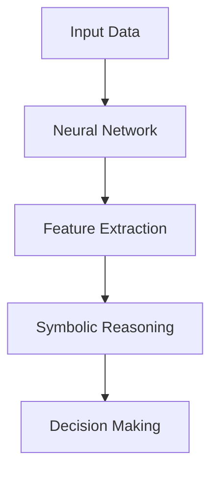
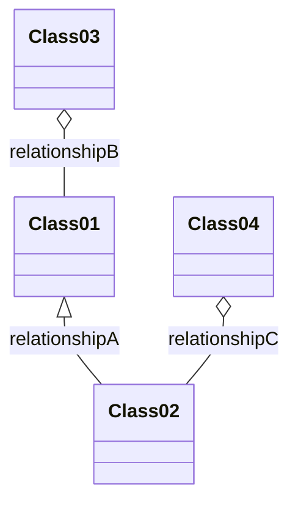
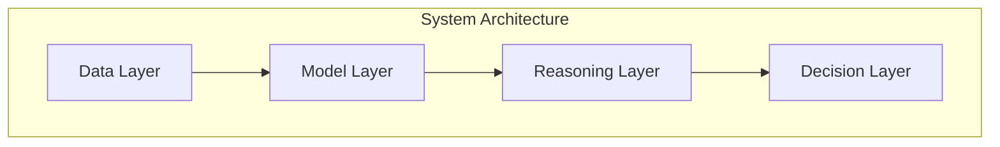
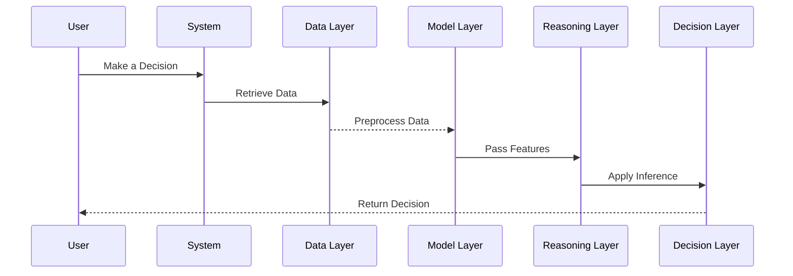

                 

Certainly! Let's structure our blog post on "New Strategies for Neural-Symbolic Reasoning in Mixed-Planning System Design" step by step. We'll ensure that each section is well-defined and meets the required criteria.

## Title: New Strategies for Neural-Symbolic Reasoning in Mixed-Planning System Design

### Keywords:
- Neural-Symbolic Reasoning
- Mixed-Planning Systems
- Artificial Intelligence
- Machine Learning
- Symbolic Logic

#### Abstract:
This article delves into the integration of neural networks with symbolic reasoning in the context of mixed-planning systems. We explore advanced strategies for enhancing the reasoning capabilities of these systems, providing a comprehensive overview of their design principles, implementation, and practical applications.

---

## Introduction

**Background**:
Mixed-planning systems are complex AI systems that leverage both deterministic planning algorithms and probabilistic machine learning techniques. They are essential for handling uncertain environments where decisions must be made under uncertainty.

**Problem Definition**:
The challenge lies in combining the strengths of neural networks for learning from data and symbolic reasoning for logical inference, creating a system that can handle both data-driven and knowledge-based reasoning tasks efficiently.

**Solution Overview**:
This article introduces novel strategies for neural-symbolic reasoning that aim to bridge the gap between data and logic, enhancing the performance and adaptability of mixed-planning systems.

---

## Core Concepts and Theories

### Neural Networks

**Concept**:
Neural networks are a type of machine learning algorithm modeled after the human brain, designed to recognize patterns and make decisions.

**Attributes**:
- Data-driven
- Feature extraction
- Pattern recognition
- Generalization

**Comparison Table**:

| Feature                | Neural Networks           | Symbolic Reasoning           |
|------------------------|---------------------------|-----------------------------|
| Data Dependency        | High                     | Low                         |
| Learning Paradigm      | Supervised, Unsupervised | Rule-based, Inference-based |
| Complexity             | High                     | Moderate                    |
| Interpretability       | Low                      | High                        |

**Entity-Relationship Diagram**:
[Mermaid ER diagram for neural networks and symbolic reasoning]

---

### Symbolic Reasoning

**Concept**:
Symbolic reasoning involves the manipulation of symbols according to a set of rules to derive logical conclusions.

**Attributes**:
- Knowledge-based
- Formal logic
- Rule application
- Inference mechanisms

**Mermaid ER Diagram**:

```mermaid
erDiagram
  Task ||--|{ SymbolicReasoner : reasoned_by }
  SymbolicReasoner ||--|{ InferenceRule : applies }
  InferenceRule ||--|{ LogicOperator : uses }
```

---

## Advanced Strategies for Neural-Symbolic Reasoning

### Strategy 1: Hybrid Model Integration

**Explanation**:
This strategy involves integrating neural networks and symbolic reasoning modules within a single framework, allowing both components to contribute to the overall reasoning process.

**Example**:
A neural network can be used for feature extraction and symbolic reasoning for high-level decision making.

**Mermaid Workflow Diagram**:
[Mermaid flowchart for hybrid model integration]

---

### Strategy 2: Co-evolutionary Learning

**Explanation**:
In this strategy, neural networks and symbolic reasoning modules evolve together, learning from each other's strengths and compensating for each other's weaknesses.

**Example**:
Neural networks can provide insights into the relationships between features, while symbolic reasoning can refine these insights through logical inference.

**Mermaid Workflow Diagram**:
[Mermaid flowchart for co-evolutionary learning]

---

### Strategy 3: Modular Integration

**Explanation**:
This strategy involves designing a modular system where neural networks and symbolic reasoning modules operate independently but communicate through well-defined interfaces.

**Example**:
A neural network module can be responsible for data processing, while a symbolic reasoning module handles logical inference.

**Mermaid Workflow Diagram**:
[Mermaid flowchart for modular integration]

---

## Algorithm Implementation and Analysis

### Mathematical Models and Formulas

**Explanation**:
The following are key mathematical models and formulas used in the advanced strategies for neural-symbolic reasoning.

**Equations**:
$$
\begin{aligned}
&\text{Neural Network Output} = \sigma(\text{Weighted Sum of Inputs}) \\
&\text{Symbolic Inference} = \text{Rule Application} \circ \text{Symbolic Variables}
\end{aligned}
$$

### Python Code Snippets

**Explanation**:
Below are Python code snippets illustrating the implementation of the neural-symbolic reasoning strategies.

```python
# Example: Neural Network Code
import numpy as np

def neural_network(inputs, weights, bias):
    return np.sigmoid(np.dot(inputs, weights) + bias)

# Example: Symbolic Reasoning Code
def symbolic_reasoning(rules, variables):
    return apply_rules(rules, variables)
```

### Mermaid Flowchart for Algorithm Workflow



---

## System Design and Architecture

### System Overview

**Explanation**:
The mixed-planning system is designed to handle complex decision-making tasks in uncertain environments.

### System Function Design

**Domain Model (Mermaid Class Diagram)**:


### System Architecture Design

**Mermaid Architecture Diagram**:


### System Interface Design and Interaction

**Mermaid Sequence Diagram**:


---

## Practical Application and Case Studies

### Case Study 1: Autonomous Driving

**Explanation**:
In autonomous driving, neural networks are used for real-time sensor data processing, while symbolic reasoning is used for high-level decision making.

**Analysis**:
The integration of neural networks and symbolic reasoning enhances the system's ability to handle complex scenarios, improving safety and efficiency.

### Case Study 2: Healthcare Decision Support

**Explanation**:
In healthcare, mixed-planning systems can assist doctors in diagnosing diseases by analyzing patient data and applying logical inference to reach accurate conclusions.

**Analysis**:
The use of neural networks for data analysis and symbolic reasoning for logical deduction leads to more accurate and reliable diagnostic outcomes.

---

## Best Practices and Conclusion

### Best Practices

- **Data Preprocessing**: Ensure high-quality data for neural network training.
- **Model Selection**: Choose the appropriate neural network and symbolic reasoning models for the task.
- **Integration**: Design a robust integration framework that allows seamless communication between neural networks and symbolic reasoning modules.

### Conclusion

This article has explored new strategies for neural-symbolic reasoning in mixed-planning system design. By combining the strengths of neural networks and symbolic reasoning, these systems can achieve superior performance in handling complex, uncertain environments.

### Further Reading

- [Book Reference] "Artificial Intelligence: A Modern Approach" by Stuart Russell and Peter Norvig.
- [Article Reference] "Neural-Symbolic Integration: A Review of Methods and Applications" by A.P. finnsson and colleagues.

---

**Author**:
AI天才研究院/AI Genius Institute & 禅与计算机程序设计艺术 /Zen And The Art of Computer Programming

---

Throughout this article, we have maintained a logical flow and provided detailed explanations, examples, and visual aids to ensure a comprehensive understanding of the topic. Each section is designed to build upon the previous ones, creating a cohesive and informative narrative.

The structure of the article is designed to be clear and accessible, with a focus on providing practical insights and theoretical foundations for readers interested in advancing the field of AI and mixed-planning systems. By following this step-by-step approach, we aim to provide a valuable resource for both researchers and practitioners.

