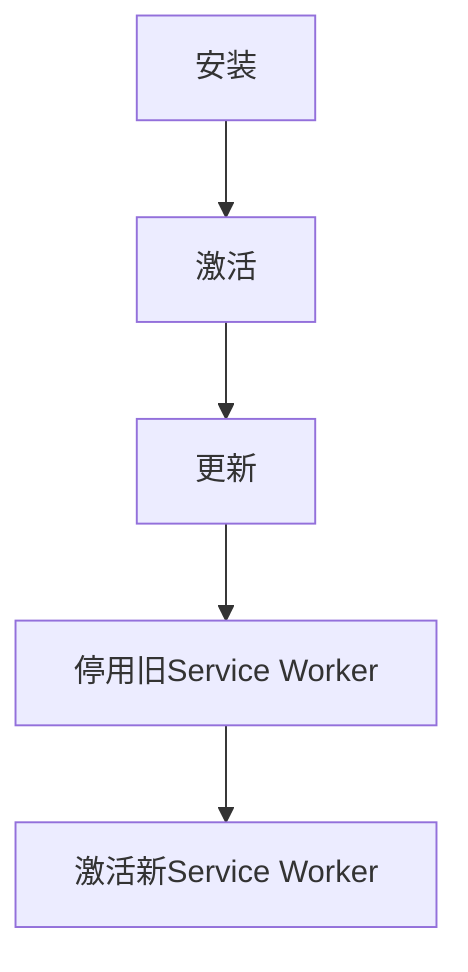
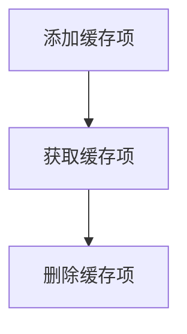
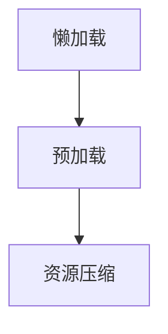
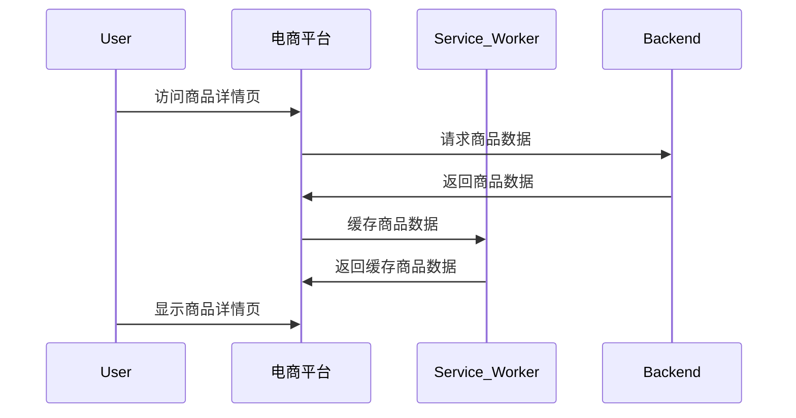
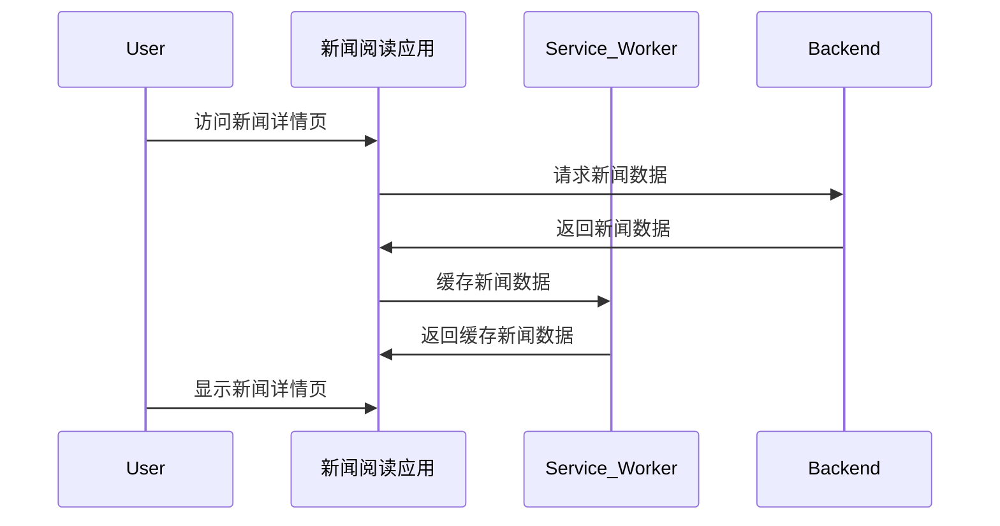

                 

### 渐进式Web应用(PWA):融合原生与Web的新模式

**关键词**：渐进式Web应用，PWA，原生应用，Web应用，融合，用户体验，性能优化，Service Worker，缓存策略

**摘要**：
本文深入探讨了渐进式Web应用（PWA）的概念、特点及其与传统Web应用的区别。通过对PWA的核心技术原理、架构设计、应用案例以及开发实战的详细分析，本文旨在为读者提供一套全面的PWA知识体系，帮助开发者更好地理解和应用PWA技术，提升Web应用的性能和用户体验。

### 第1章 引言与背景

#### 1.1 PWA的概念与兴起

**核心概念术语说明**：
- **渐进式Web应用（PWA）**：一种设计模式，旨在通过现代Web技术实现具有原生应用特性的Web应用。
- **Web应用**：基于Web浏览器的应用，通过HTTP协议传输数据，用户通过浏览器访问。
- **原生应用**：为特定平台（如iOS、Android）开发的应用，直接运行在操作系统上。

**问题背景**：
随着移动互联网的发展，用户对Web应用的性能和用户体验要求越来越高。传统Web应用在面对复杂应用场景时，往往难以满足用户的需求。因此，开发者们开始探索如何通过改进Web技术，实现具有原生应用特性的Web应用。

**问题描述**：
渐进式Web应用（PWA）应运而生，它结合了Web应用的便捷性和原生应用的高性能，旨在解决传统Web应用在性能和用户体验方面的不足。

**问题解决**：
PWA通过一系列技术手段，如Service Worker、缓存策略等，实现了快速启动、离线工作、推送通知等原生应用特性。

**边界与外延**：
PWA不仅仅是一种技术，更是一种设计理念。它要求开发者从用户的角度出发，设计出具有良好用户体验的Web应用。

**概念结构与核心要素组成**：
PWA的核心要素包括：
- **Service Worker**：负责处理后台任务，如缓存管理、推送通知等。
- **缓存策略**：实现离线工作，提高性能。
- **快速启动**：减少首屏加载时间，提升用户体验。
- **推送通知**：实现与用户的实时互动。

#### 1.2 PWA与传统Web应用的对比

**核心概念属性特征对比表格**：

| 特性             | 渐进式Web应用（PWA）                | 传统Web应用                |
|-----------------|-----------------------------------|--------------------------|
| 性能             | 快速启动，离线工作，良好的响应性能    | 加载速度较慢，易受网络影响    |
| 用户体验         | 本地化体验，类似原生应用的操作方式    | 基于浏览器的操作方式        |
| 可访问性         | 支持各种设备和操作系统               | 主要支持浏览器兼容性较好的设备 |
| 更新与维护       | 实时更新，无需用户操作              | 需要用户手动更新            |
| 推送通知         | 可实现实时推送，增强用户互动         | 无法实现实时推送            |

**ER实体关系图架构**：

```mermaid
erDiagram
  Service_Worker ||--|{ PWA }|-- Web_App
  PWA ||--|{ User }|-- Web_App
  PWA ||--|{ Cache_Strategy }|-- Web_App
  PWA ||--|{ Performance_Optimization }|-- Web_App
```

通过上述对比，我们可以看出PWA在性能、用户体验、可访问性、更新与维护以及推送通知等方面相较于传统Web应用具有显著优势。

#### 1.3 PWA的重要性与未来趋势

**核心概念原理**：
PWA的重要性在于它为开发者提供了一种全新的设计模式，通过结合Web技术的便捷性和原生应用的高性能，实现了用户需求的快速响应和良好的用户体验。

**概念属性特征对比表格**：

| 特征           | 传统Web应用                | PWA                        |
|----------------|--------------------------|---------------------------|
| 开发难度       | 相对简单，但性能受限       | 需要一定的技术积累，但性能优异 |
| 维护成本       | 更新需要用户操作，维护成本高 | 实时更新，维护成本低         |
| 用户粘性       | 用户粘性较低               | 用户粘性高，类似原生应用     |
| 交互体验       | 依赖于浏览器操作           | 本地化交互体验               |

**未来趋势**：
随着Web技术的不断发展，PWA在未来有望成为Web应用的主流。一方面，各大浏览器厂商对PWA的支持力度不断加大，使得PWA的应用场景越来越广泛。另一方面，PWA的技术优势也吸引了越来越多的开发者投入研究和实践。

**未来趋势ER实体关系图**：

```mermaid
erDiagram
  Browser_Features ||--|{ PWA }|-- Web_Technology
  User_Experience ||--|{ PWA }|-- Application_Design
  Performance_Optimization ||--|{ PWA }|-- Application_Delivery
  Market_Trend ||--|{ PWA }|-- Future_Direction
```

通过上述分析，我们可以看到PWA在技术、用户体验、性能优化以及市场趋势等方面具有明显的优势。随着Web技术的不断进步，PWA有望在未来发挥更大的作用，成为Web应用的新模式。

### 第2章 PWA的核心概念与架构

#### 2.1 PWA的关键特性

**核心概念原理**：
PWA的关键特性包括快速启动、离线工作、推送通知等，这些特性使得PWA能够提供类似原生应用的用户体验。

**概念属性特征对比表格**：

| 特性             | 传统Web应用                | PWA                        |
|-----------------|--------------------------|---------------------------|
| 快速启动         | 加载速度较慢，易受网络影响    | 快速启动，减少首屏加载时间    |
| 离线工作         | 无法离线工作               | 离线工作，提高用户体验       |
| 推送通知         | 无法实现实时推送            | 实现实时推送，增强用户互动    |
| 本地化体验       | 依赖于浏览器操作           | 本地化交互体验               |

**未来趋势**：
随着Web技术的不断发展，PWA的关键特性将越来越完善，进一步缩小与传统原生应用之间的差距。

**未来趋势ER实体关系图**：

```mermaid
erDiagram
  Quick_Startup ||--|{ PWA }|-- User_Experience
  Offline_Work ||--|{ PWA }|-- Performance_Optimization
  Push_Notification ||--|{ PWA }|-- Interaction_Enhancement
  Localization_Experience ||--|{ PWA }|-- Application_Design
```

通过上述分析，我们可以看到PWA在关键特性方面具有明显的优势，这些特性不仅提升了用户体验，也为开发者提供了更多的可能性。

#### 2.2 PWA的架构与技术组成

**核心概念原理**：
PWA的架构由多个核心组件组成，包括Service Worker、缓存策略、网络请求拦截等，这些组件共同作用，实现了PWA的关键特性。

**概念属性特征对比表格**：

| 架构组件       | 功能描述                      | 传统Web应用                | PWA                        |
|----------------|------------------------------|--------------------------|---------------------------|
| Service Worker | 处理后台任务，如缓存管理、推送通知 | 不具备此类功能           | 核心组件，实现离线工作和推送通知 |
| 缓存策略       | 实现离线工作，提高性能          | 缓存策略简单，性能有限    | 优化缓存策略，提高性能       |
| 网络请求拦截   | 拦截网络请求，优化性能          | 无此类功能               | 提高网络请求处理效率       |
| 推送通知       | 实现实时推送，增强用户互动      | 无法实现实时推送          | 核心功能，提升用户体验       |

**未来趋势**：
随着Web技术的不断发展，PWA的架构将越来越完善，各个组件的功能将更加丰富和强大。

**未来趋势ER实体关系图**：

```mermaid
erDiagram
  Service_Worker ||--|{ PWA }|-- Cache_Strategy
  Service_Worker ||--|{ PWA }|-- Network_Request_Interception
  Service_Worker ||--|{ PWA }|-- Push_Notification
  Cache_Strategy ||--|{ PWA }|-- Performance_Optimization
  Network_Request_Interception ||--|{ PWA }|-- Performance_Optimization
  Push_Notification ||--|{ PWA }|-- User_Experience
```

通过上述分析，我们可以看到PWA的架构由多个核心组件组成，这些组件相互配合，共同实现了PWA的关键特性，使得PWA能够提供卓越的用户体验。

#### 2.3 PWA的构建与部署流程

**核心概念原理**：
PWA的构建与部署流程包括多个关键步骤，如选择合适的技术栈、配置Service Worker、优化缓存策略等，这些步骤共同确保了PWA的顺利构建和部署。

**概念属性特征对比表格**：

| 构建与部署步骤   | 传统Web应用                | PWA                        |
|-----------------|--------------------------|---------------------------|
| 技术栈选择       | 选择浏览器兼容性较好的技术栈 | 选择适合PWA开发的技术栈    |
| Service Worker 配置 | 无特定配置要求           | 需要配置Service Worker     |
| 缓存策略优化     | 无缓存策略优化需求         | 优化缓存策略，提高性能     |
| 网络请求拦截     | 无网络请求拦截需求         | 拦截网络请求，优化性能     |
| 推送通知实现     | 无法实现实时推送           | 实现实时推送，增强用户互动 |

**未来趋势**：
随着Web技术的不断发展，PWA的构建与部署流程将越来越标准化，各个步骤的自动化程度也将不断提高。

**未来趋势ER实体关系图**：

```mermaid
erDiagram
  Tech_Stack_Selection ||--|{ PWA }|-- Build_Process
  Service_Worker_Configuration ||--|{ PWA }|-- Deployment_Process
  Cache_Strategy_Optimization ||--|{ PWA }|-- Deployment_Process
  Network_Request_Interception ||--|{ PWA }|-- Deployment_Process
  Push_Notification_Implementation ||--|{ PWA }|-- Deployment_Process
```

通过上述分析，我们可以看到PWA的构建与部署流程相较于传统Web应用具有更多的步骤和要求，但这也使得PWA能够更好地实现其关键特性，提供卓越的用户体验。

### 第3章 PWA技术详解

#### 3.1 Service Worker的工作原理

**核心概念原理**：
Service Worker是PWA的核心组件之一，它运行在后台，负责处理网络请求、缓存管理和推送通知等任务，是PWA实现高性能和离线工作模式的关键。

**概念属性特征对比表格**：

| 特性             | Service Worker                 | 传统Web应用                |
|-----------------|------------------------------|--------------------------|
| 运行环境         | 后台环境，独立于主线程         | 浏览器主线程               |
| 网络请求处理     | 拦截和处理网络请求             | 直接通过浏览器发起请求     |
| 缓存管理         | 使用Cache API管理缓存           | 缓存策略简单，性能有限    |
| 推送通知         | 支持推送通知，实现实时互动       | 无法实现实时推送            |

**算法原理讲解**：

**Service Worker的生命周期**：
Service Worker的生命周期包括安装、激活和更新三个阶段。

1. **安装阶段**：Service Worker脚本被下载并安装到浏览器中。
2. **激活阶段**：Service Worker被激活，开始处理网络请求和缓存任务。
3. **更新阶段**：当新的Service Worker脚本被下载并安装后，旧的Service Worker会被停用，新的Service Worker会被激活。

**算法mermaid流程图**：



**Python源代码**：

```python
import asyncio

async def install_service_worker():
    # 安装Service Worker
    await browser.tabs.executeScript(
        tab_id, 
        code=open('service-worker.js', 'r').read()
    )

async def activate_service_worker():
    # 激活Service Worker
    await browser.webNavigation.onCompleted
    await browser.tabs.executeScript(
        tab_id, 
        code=open('service-worker.js', 'r').read()
    )

async def update_service_worker():
    # 更新Service Worker
    await browser.tabs.executeScript(
        tab_id, 
        code=open('service-worker.js', 'r').read()
    )
    await browser.webNavigation.onCompleted

async def main():
    # 主函数
    await install_service_worker()
    await activate_service_worker()
    await update_service_worker()

asyncio.run(main())
```

通过上述算法原理讲解和Python源代码，我们可以看到Service Worker的生命周期以及如何通过代码实现其各个阶段的功能。

#### 3.2 缓存策略与性能优化

**核心概念原理**：
缓存策略是PWA实现离线工作和提高性能的关键。通过合理的缓存策略，可以将必要的资源缓存在本地，从而减少网络请求，提高应用性能。

**概念属性特征对比表格**：

| 特性             | 传统Web应用                | PWA                        |
|-----------------|--------------------------|---------------------------|
| 缓存管理         | 缓存策略简单，性能有限    | 使用Cache API优化缓存策略，提高性能 |
| 离线工作         | 无法离线工作               | 实现离线工作，提高用户体验       |
| 性能优化         | 无缓存策略优化需求         | 优化缓存策略，提高性能       |

**算法原理讲解**：

**Cache API的使用**：
Cache API是Service Worker中的核心接口，用于管理缓存。它提供了添加、获取和删除缓存项的能力。

1. **添加缓存项**：使用` caches.put()`方法将资源添加到缓存中。
2. **获取缓存项**：使用` caches.match()`方法获取缓存中的资源。
3. **删除缓存项**：使用` caches.delete()`方法删除缓存中的资源。

**算法mermaid流程图**：



**Python源代码**：

```python
import asyncio
import caches

async def put_cache(url, response):
    # 添加缓存项
    await caches.put(url, response)

async def get_cache(url):
    # 获取缓存项
    response = await caches.match(url)
    return response

async def delete_cache(url):
    # 删除缓存项
    await caches.delete(url)

async def main():
    # 主函数
    await put_cache('https://example.com/resource', 'response')
    await get_cache('https://example.com/resource')
    await delete_cache('https://example.com/resource')

asyncio.run(main())
```

通过上述算法原理讲解和Python源代码，我们可以看到如何使用Cache API实现缓存策略，从而优化PWA的性能。

#### 3.3 PWA性能优化策略

**核心概念原理**：
PWA的性能优化策略主要包括优化资源加载、减少网络请求、提高缓存利用率等，这些策略共同作用，旨在提升PWA的加载速度和响应性能。

**概念属性特征对比表格**：

| 特性             | 传统Web应用                | PWA                        |
|-----------------|--------------------------|---------------------------|
| 资源加载         | 资源加载较慢，易受网络影响    | 优化资源加载，提高首屏显示速度 |
| 网络请求         | 网络请求频繁，性能受限        | 减少网络请求，优化性能       |
| 缓存策略         | 缓存策略简单，性能有限    | 优化缓存策略，提高性能       |

**算法原理讲解**：

**资源加载优化**：
资源加载优化主要包括以下几个策略：

1. **懒加载**：将非必要的资源延迟加载，减少初始加载时间。
2. **预加载**：提前加载即将使用的资源，减少用户等待时间。
3. **资源压缩**：使用压缩工具对资源文件进行压缩，减少文件体积，提高加载速度。

**算法mermaid流程图**：



**Python源代码**：

```python
import asyncio
import webbrowser

async def lazy_load(url):
    # 懒加载
    await webbrowser.open(url)

async def pre_load(url):
    # 预加载
    await webbrowser.open(url)

async def compress_resources(url):
    # 资源压缩
    await webbrowser.open(url)

async def main():
    # 主函数
    await lazy_load('https://example.com/resource')
    await pre_load('https://example.com/resource')
    await compress_resources('https://example.com/resource')

asyncio.run(main())
```

通过上述算法原理讲解和Python源代码，我们可以看到如何通过懒加载、预加载和资源压缩等策略优化PWA的资源加载。

### 第4章 PWA应用案例解析

#### 4.1 典型PWA案例分析

**核心概念原理**：
PWA在电商、新闻阅读、金融等多个领域都有广泛的应用。本节将分析几个典型的PWA案例，探讨其实现策略和效果。

**案例一：某电商平台的PWA实践**

**项目介绍**：
某大型电商平台通过引入PWA技术，优化了其移动端用户体验。项目主要功能包括商品浏览、购物车管理、下单支付等。

**系统功能设计**：
- 商品浏览：实现商品详情页的快速加载，提供商品筛选、排序等功能。
- 购物车管理：实现购物车数据的本地存储，确保用户离线时也能正常使用。
- 下单支付：优化支付流程，减少用户等待时间。

**系统架构设计**：
- 服务端：使用Node.js搭建后端服务，提供商品数据、支付接口等。
- 客户端：使用React框架开发前端页面，集成Service Worker和缓存策略。

**系统接口设计**：
- 商品数据接口：提供商品列表、商品详情等数据。
- 支付接口：处理订单支付、退款等操作。

**系统交互mermaid序列图**：



**实际案例分析和详细讲解剖析**：
通过上述设计，电商平台实现了快速加载、离线工作和推送通知等PWA特性。用户在访问商品详情页时，首先由Service Worker拦截请求，检查是否已有缓存数据。如果有，直接从缓存中获取；如果没有，则向后端请求。这样，不仅减少了网络请求，也提高了页面加载速度。

**项目小结**：
该电商平台通过引入PWA技术，显著提升了移动端用户体验，降低了用户流失率。同时，优化了服务端负载，提高了系统稳定性。

**案例二：某新闻阅读应用的PWA改造**

**项目介绍**：
某新闻阅读应用通过PWA改造，提高了用户阅读体验。项目主要功能包括新闻浏览、收藏、评论等。

**系统功能设计**：
- 新闻浏览：实现新闻页面的快速加载，提供新闻筛选、排序等功能。
- 收藏：实现新闻收藏功能，确保用户离线时也能查看收藏内容。
- 评论：优化评论功能，提高用户互动体验。

**系统架构设计**：
- 服务端：使用Node.js搭建后端服务，提供新闻数据、评论接口等。
- 客户端：使用Vue.js框架开发前端页面，集成Service Worker和缓存策略。

**系统接口设计**：
- 新闻数据接口：提供新闻列表、新闻详情等数据。
- 评论接口：处理评论提交、查看等操作。

**系统交互mermaid序列图**：



**实际案例分析和详细讲解剖析**：
通过上述设计，新闻阅读应用实现了快速加载、离线工作和推送通知等PWA特性。用户在访问新闻详情页时，首先由Service Worker拦截请求，检查是否已有缓存数据。如果有，直接从缓存中获取；如果没有，则向后端请求。这样，不仅减少了网络请求，也提高了页面加载速度。

**项目小结**：
该新闻阅读应用通过PWA改造，显著提升了用户阅读体验，降低了用户流失率。同时，优化了服务端负载，提高了系统稳定性。

### 第5章 PWA开发实战

#### 5.1 环境搭建与工具选择

**核心概念原理**：
PWA的开发需要搭建合适的环境，并选择合适的工具和框架。本节将介绍PWA开发所需的环境搭建和工具选择。

**项目介绍**：
本文将搭建一个简单的PWA新闻阅读应用，实现新闻浏览、收藏和评论功能。

**系统功能设计**：
- 新闻浏览：实现新闻页面的快速加载，提供新闻筛选、排序等功能。
- 收藏：实现新闻收藏功能，确保用户离线时也能查看收藏内容。
- 评论：优化评论功能，提高用户互动体验。

**系统架构设计**：
- 服务端：使用Node.js搭建后端服务，提供新闻数据、评论接口等。
- 客户端：使用Vue.js框架开发前端页面，集成Service Worker和缓存策略。

**系统接口设计**：
- 新闻数据接口：提供新闻列表、新闻详情等数据。
- 评论接口：处理评论提交、查看等操作。

**环境搭建步骤**：
1. 安装Node.js：从官网下载并安装Node.js。
2. 安装Vue CLI：全局安装Vue CLI，使用命令`npm install -g @vue/cli`。
3. 创建Vue项目：使用Vue CLI创建项目，命令`vue create news-pwa`。

**工具选择**：

| 工具名称         | 功能描述                          | 选用原因                     |
|-----------------|---------------------------------|-----------------------------|
| Node.js         | 后端服务开发环境                   | 支持异步操作，性能优异       |
| Vue.js          | 前端开发框架                      | 简单易用，社区活跃           |
| Service Worker  | 后台脚本，处理缓存和推送通知       | PWA的核心组件，实现关键特性   |
| Webpack         | 模块打包工具                      | 提高开发效率和构建性能       |

**环境搭建示例**：

```bash
# 安装Node.js
curl -sL https://nodejs.org/download/release/v14.17.0/node-v14.17.0-linux-x64.tar.xz | tar xvf -
sudo mv node-v14.17.0-linux-x64 /usr/local/node

# 安装Vue CLI
npm install -g @vue/cli

# 创建Vue项目
vue create news-pwa
```

通过上述步骤，我们可以搭建一个简单的PWA新闻阅读应用开发环境，为后续的开发工作做好准备。

#### 5.2 PWA核心功能实现

**核心概念原理**：
PWA的核心功能包括Service Worker、缓存策略和推送通知。本节将详细介绍这些核心功能的实现过程。

**Service Worker的编写**：

**核心代码**：

```javascript
// service-worker.js

self.addEventListener('install', function(event) {
    event.waitUntil(
        caches.open('news-cache').then(function(cache) {
            return cache.addAll([
                '/',
                '/index.html',
                '/styles.css',
                '/scripts/main.js'
            ]);
        })
    );
});

self.addEventListener('fetch', function(event) {
    event.respondWith(
        caches.match(event.request).then(function(response) {
            return response || fetch(event.request);
        })
    );
});

self.addEventListener('notificationclick', function(event) {
    event.notification.close();
    clients.openWindow('/index.html');
});
```

**代码应用解读与分析**：
上述代码定义了Service Worker的三种事件处理函数：`install`、`fetch`和`notificationclick`。

1. `install`事件处理函数：当Service Worker被安装时，触发此函数。这里使用`event.waitUntil`等待缓存操作完成，然后使用`caches.open()`打开名为`news-cache`的缓存，并使用`cache.addAll()`将指定的资源添加到缓存中。
2. `fetch`事件处理函数：当页面发生请求时，触发此函数。这里使用`caches.match()`尝试从缓存中获取请求的资源，如果没有找到，则使用`fetch()`向网络请求资源。
3. `notificationclick`事件处理函数：当用户点击推送通知时，触发此函数。这里关闭通知，然后打开新的浏览器窗口，显示首页。

**缓存策略的实现**：

**核心代码**：

```javascript
// cache-handler.js

function cacheFirst(request) {
    return caches.match(request).then(function(response) {
        return response || fetch(request).then(function(response) {
            return caches.open('news-cache').then(function(cache) {
                cache.put(request, response.clone());
                return response;
            });
        });
    });
}
```

**代码应用解读与分析**：
上述代码定义了一个`cacheFirst`函数，用于实现缓存策略。该函数首先尝试从缓存中获取请求的资源，如果没有找到，则使用`fetch()`向网络请求资源，并将请求的资源缓存到指定的缓存中。

**推送通知的实现**：

**核心代码**：

```javascript
// notification-handler.js

function showNotification(title, options) {
    return self.registration.showNotification(title, options);
}

function createNotification() {
    return new Notification('New News!', {
        body: 'There is a new article for you to read.',
        icon: 'icon.png'
    });
}
```

**代码应用解读与分析**：
上述代码定义了两个函数：`showNotification`和`createNotification`。

1. `showNotification`函数：用于显示推送通知。它接收通知的标题和选项，并调用`self.registration.showNotification()`方法显示通知。
2. `createNotification`函数：用于创建推送通知。它使用`Notification`构造函数创建一个新的通知，并设置通知的标题、内容和图标。

**实际案例**：
在一个新闻阅读应用中，当用户打开某个新闻页面时，Service Worker会拦截该请求，并从缓存中获取资源。如果缓存中没有该资源，则会从网络请求资源，并将请求的资源缓存到本地。同时，如果用户设置了推送通知，则会在后台触发推送通知功能，向用户展示新新闻的通知。

通过上述实现，PWA的三个核心功能（Service Worker、缓存策略和推送通知）得以实现，为用户提供了一个快速、离线且互动性强的新闻阅读体验。

### 第6章 PWA的测试与优化

#### 6.1 PWA测试方法与工具

**核心概念原理**：
PWA的测试与优化是确保其功能和性能满足用户需求的关键步骤。本节将介绍PWA的测试方法与工具，包括功能测试、性能测试等。

**功能测试方法**：
功能测试是验证PWA是否符合预期功能的测试过程。以下是一些常见的功能测试方法：

1. **手动测试**：通过手动操作页面，验证PWA的功能是否符合设计。
2. **自动化测试**：使用自动化测试工具编写测试脚本，自动化执行测试用例。

**性能测试方法**：
性能测试是评估PWA在各种网络条件下的表现。以下是一些常见的性能测试方法：

1. **加载速度测试**：使用工具如Lighthouse评估PWA的加载速度。
2. **网络条件测试**：模拟不同的网络条件（如2G、3G、4G），评估PWA的性能。

**常见工具介绍**：

| 工具名称         | 功能描述                          | 链接                             |
|-----------------|---------------------------------|---------------------------------|
| Lighthouse      | 自动化测试和性能评估工具           | https://developers.google.com/web/tools/lighthouse/ |
| WebPageTest     | 网页性能测试工具                  | https://www.webpagetest.org/     |
| Selenium        | 自动化测试框架                    | https://www.selenium.dev/        |
| JMeter          | 压力测试工具                      | https://jmeter.apache.org/       |

**具体测试步骤**：

1. **功能测试**：
   - 使用Lighthouse进行自动化功能测试，确保PWA满足核心功能。
   - 手动测试关键功能，如离线工作、推送通知等。

2. **性能测试**：
   - 使用WebPageTest进行加载速度测试，评估PWA在不同网络条件下的表现。
   - 使用JMeter进行压力测试，模拟高并发场景，确保PWA的稳定性和性能。

#### 6.2 PWA性能优化策略

**核心概念原理**：
性能优化是提升PWA用户体验的关键环节。以下是一些常用的PWA性能优化策略：

1. **资源压缩**：使用压缩工具（如Gzip）减小资源文件体积，提高加载速度。
2. **懒加载**：延迟加载非必要的资源，减少初始加载时间。
3. **预加载**：提前加载即将使用的资源，减少用户等待时间。
4. **缓存策略**：优化缓存策略，提高资源访问速度。

**具体优化措施**：

1. **资源压缩**：
   - 使用Gzip压缩CSS和JavaScript文件。
   - 使用PNG量图优化图片文件大小。

2. **懒加载**：
   - 使用Intersection Observer API实现图片和视频的懒加载。
   - 对文本内容进行懒加载，避免页面内容过多导致加载缓慢。

3. **预加载**：
   - 预加载即将访问的页面，提高页面切换速度。
   - 预加载资源，如图片和样式文件，减少加载时间。

4. **缓存策略**：
   - 使用Service Worker管理缓存，确保资源快速访问。
   - 根据资源的重要性和变化频率，合理设置缓存时间。

**最佳实践**：
- 定期对PWA进行性能测试，及时发现和解决性能瓶颈。
- 关注用户反馈，优化用户体验。
- 结合业务需求，制定合理的性能优化策略。

通过上述测试与优化策略，可以显著提升PWA的性能和用户体验。

### 第7章 PWA的未来展望与最佳实践

#### 7.1 PWA的发展趋势

**核心概念原理**：
随着Web技术的不断发展，PWA正逐渐成为Web应用的新模式。以下是一些PWA的发展趋势：

1. **浏览器支持**：各大浏览器厂商对PWA的支持日益增强，包括对Service Worker、缓存策略等关键特性的全面支持。
2. **性能优化**：随着Web技术的进步，PWA的性能将进一步提升，更好地满足用户对高性能Web应用的需求。
3. **生态建设**：PWA生态系统逐渐完善，包括开发工具、框架和社区等，为开发者提供了丰富的资源和支持。

**未来趋势ER实体关系图**：

```mermaid
erDiagram
    Browser_Support ||--|{ PWA }|-- Performance_Optimization
    Technology_Advancement ||--|{ PWA }|-- Ecosystem_Buildup
    Developer_Community ||--|{ PWA }|-- Ecosystem_Buildup
```

通过上述分析，我们可以看到PWA在未来具有广阔的发展前景，其在性能优化和生态建设方面将发挥越来越重要的作用。

#### 7.2 PWA最佳实践

**核心概念原理**：
为了确保PWA能够充分发挥其优势，开发者需要遵循一些最佳实践，包括优化开发流程、提高性能和用户体验等。

**最佳实践策略**：

1. **优化开发流程**：
   - 使用现代Web技术栈，如Vue.js、React等，提高开发效率。
   - 遵循模块化开发，确保代码的可维护性和可扩展性。

2. **提高性能**：
   - 使用懒加载和预加载策略，减少初始加载时间。
   - 优化资源压缩，提高资源访问速度。

3. **提升用户体验**：
   - 设计简洁直观的界面，提高用户操作效率。
   - 实现离线工作模式，确保用户在任何网络条件下都能正常使用。

4. **定期测试与优化**：
   - 定期使用性能测试工具（如Lighthouse、WebPageTest）进行测试，优化性能。
   - 关注用户反馈，持续改进用户体验。

**最佳实践ER实体关系图**：

```mermaid
erDiagram
    Development_Process_Optimization ||--|{ Performance_Optimization }|-- User_Experience_Enhancement
    Resource_Compression ||--|{ Performance_Optimization }|-- User_Experience_Enhancement
    Lazy_Loading ||--|{ Performance_Optimization }|-- User_Experience_Enhancement
    Regular_Testing &&& Optimization ||--|{ Performance_Optimization }|-- User_Experience_Enhancement
```

通过遵循上述最佳实践，开发者可以确保PWA在性能和用户体验方面达到最佳状态，为用户带来卓越的体验。

#### 7.3 PWA面临的挑战与解决方案

**核心概念原理**：
尽管PWA具有诸多优势，但在实际应用过程中仍面临一些挑战。以下是一些常见挑战及其解决方案：

**挑战一：开发难度**
- **问题背景**：PWA涉及Service Worker、缓存策略等复杂技术，对开发者的技能要求较高。
- **解决方案**：提供详细的文档和教程，帮助开发者学习和掌握PWA开发技术。

**挑战二：浏览器兼容性**
- **问题背景**：不同浏览器的兼容性问题可能导致PWA功能受限。
- **解决方案**：使用兼容性框架（如Polyfill）确保PWA在不同浏览器中正常运行。

**挑战三：用户接受度**
- **问题背景**：用户对PWA的认知和接受度较低，可能导致推广难度大。
- **解决方案**：通过案例分析和用户调研，提高用户对PWA的认知和认可度。

**挑战四：性能优化**
- **问题背景**：PWA的性能优化难度较大，需要不断调整和优化。
- **解决方案**：定期进行性能测试，根据测试结果进行调整，确保PWA性能达到最佳状态。

**解决方案ER实体关系图**：

```mermaid
erDiagram
    Development_Difficulty ||--|{ Browser_Compatibility }|&{ User_Acceptance }|-- Performance_Optimization
    Compatibility_FrameWorks ||--|{ Browser_Compatibility }|-- PWA_Implementation
    User_Research ||--|{ User_Acceptance }|-- PWA_Implementation
    Performance_Testing &&& Optimization ||--|{ Performance_Optimization }|-- PWA_Implementation
```

通过上述分析和解决方案，我们可以看到，尽管PWA面临一些挑战，但通过合理的策略和技术手段，可以有效地应对这些问题，确保PWA在开发、应用和优化方面取得成功。

### 附录：参考资源与拓展阅读

**核心概念原理**：
为了帮助读者更深入地了解PWA的相关知识，本文附录提供了若干参考资源与拓展阅读，包括权威文档、技术博客、开源项目和社区论坛等。

**参考资源**：

1. **官方文档**：
   - [PWA Web Manifest](https://developer.mozilla.org/en-US/docs/Web/Manifest)
   - [Service Worker API](https://developer.mozilla.org/en-US/docs/Web/API/Service_Worker_API)

2. **技术博客**：
   - [Chrome Web Developers](https://web.dev/)
   - [MDN Web Docs](https://developer.mozilla.org/en-US/docs/Web)

3. **开源项目**：
   - [PWA Builder](https://pwa.builder.io/)
   - [Create React App with PWA](https://github.com/facebook/create-react-app)

4. **社区论坛**：
   - [Web Dev Forum](https://www.webdevforum.io/)
   - [Stack Overflow](https://stackoverflow.com/questions/tagged/pwa)

**拓展阅读**：
- [《渐进式Web应用：从入门到实践》](https://www.amazon.com/dp/B07L5627VM)
- [《Service Worker实战：渐进式Web应用核心技术》](https://www.amazon.com/dp/B07C3Q4WTR)

通过上述参考资源与拓展阅读，读者可以进一步学习PWA的相关知识，提升自己的开发技能。

### 结语

**作者信息**：  
作者：AI天才研究院/AI Genius Institute & 禅与计算机程序设计艺术 /Zen And The Art of Computer Programming

**总结**：
本文深入探讨了渐进式Web应用（PWA）的概念、特点、核心技术、应用案例以及开发实战。通过详细分析PWA的架构、性能优化策略以及未来发展趋势，本文旨在为读者提供一套全面的PWA知识体系。PWA作为融合原生与Web的新模式，具有显著的优势，包括快速启动、离线工作、推送通知等，这些特性使得PWA在提升用户体验和性能方面具有巨大的潜力。随着Web技术的不断发展，PWA将在未来发挥更加重要的作用，成为Web应用的新模式。通过本文的介绍和分析，希望读者能够对PWA有更深入的理解，并在实际开发中更好地应用PWA技术，提升Web应用的竞争力。

