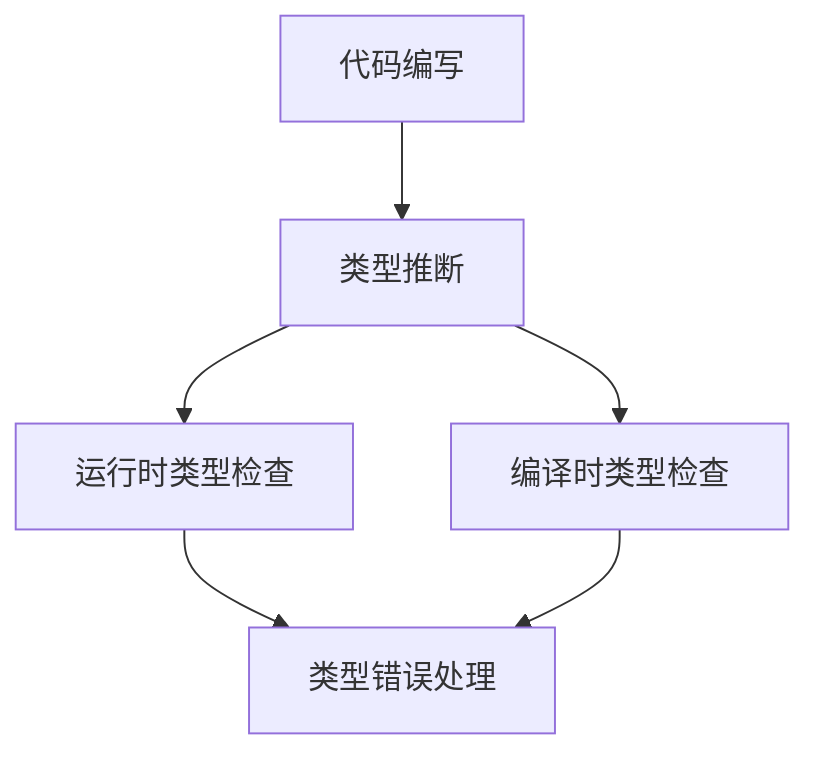
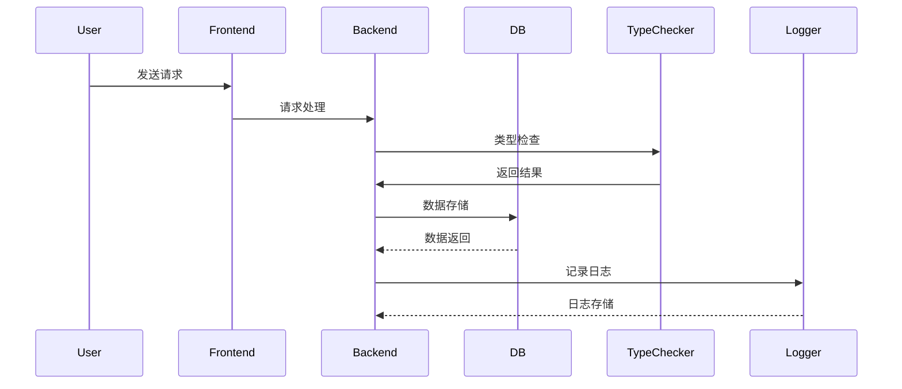
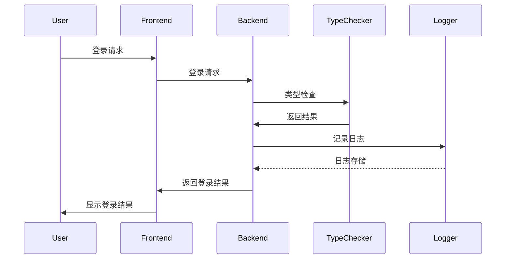

                 

### 引言：渐进类型：动态类型与静态类型的融合

在计算机科学和编程领域，类型系统是语言设计和程序执行的重要组成部分。类型系统的主要目的是确保程序的正确性和效率，防止在运行时出现错误。类型系统主要分为两大类：动态类型和静态类型。然而，这两者在实际应用中各有利弊，往往难以兼顾。本文旨在探讨一种新型的类型系统——渐进类型，它试图在动态类型与静态类型之间找到平衡，以期解决它们各自的局限。

**关键词：**
- 渐进类型
- 动态类型
- 静态类型
- 类型系统
- 程序正确性

**摘要：**
本文将首先介绍动态类型与静态类型的背景、起源及其优缺点，然后引出渐进类型的概念及其必要性。接着，我们将深入探讨渐进类型的定义、原理及其应用场景。本文将通过具体的算法原理、数学模型和公式，对渐进类型进行详细的讲解，并结合实际案例进行分析。最后，本文将总结渐进类型的研究现状与未来趋势，并提出一些最佳实践和注意事项，为读者提供深入的洞见。

### 第1章 背景介绍

#### 1.1 问题背景

在计算机科学和编程领域，类型系统是确保程序正确性和效率的关键因素。类型系统的核心目的是通过定义数据的类型和操作规则，确保程序在执行过程中不会出现类型错误，从而提高程序的稳定性和可靠性。类型系统可以分为两大类：动态类型和静态类型。动态类型和静态类型各有其特点和适用场景，但它们也存在一些问题，难以满足所有编程需求。

**动态类型**是在程序运行时检查变量的类型。动态类型的语言如Python、JavaScript等，在编写代码时不需要显式声明变量类型，变量的类型由其在运行时决定。这种灵活性使得编程过程更加简便，特别是在开发Web应用和脚本时非常受欢迎。然而，动态类型也存在一些缺点。首先，动态类型语言在运行时需要额外的类型检查，这可能会导致性能下降。其次，由于类型检查是在运行时进行的，一些类型错误可能会在程序运行过程中才被发现，增加了调试的难度。

**静态类型**是在程序编译时检查变量的类型。静态类型的语言如Java、C++等，要求在编写代码时明确声明变量类型，并在编译时进行类型检查。静态类型能够提高程序的运行效率，因为编译器可以提前发现类型错误，从而避免在运行时出现错误。此外，静态类型还提供了更强的类型安全性和更好的代码可维护性。然而，静态类型也有其缺点。首先，静态类型的语言通常需要编写更多的代码来声明变量类型，增加了开发成本。其次，静态类型可能会限制程序员的灵活性，尤其是在处理复杂逻辑时。

两种类型系统各有利弊，但在实际应用中往往难以兼顾。动态类型提供了更高的灵活性和开发效率，但可能在运行时性能较差；静态类型则提供了更好的性能和类型安全性，但可能增加开发成本和限制灵活性。为了解决这一问题，研究人员和开发者开始探索一种新型的类型系统——渐进类型。渐进类型试图在动态类型与静态类型之间找到平衡，以充分发挥两者的优势，并克服各自的局限。

#### 1.1.1 动态类型与静态类型的起源与发展

**动态类型**起源于20世纪60年代和70年代的编程语言研究。早期编程语言如Lisp和ALGOL68开始引入动态类型的概念，以简化编程过程并提高灵活性。动态类型的核心思想是在程序运行时动态确定变量的类型，从而避免在编写代码时进行繁琐的类型声明。这种思想在后来的编程语言中得到了广泛应用，例如Python、Ruby、JavaScript等。动态类型语言通常采用动态绑定，即变量在运行时被绑定到具体的对象类型，而不是在编译时确定。

**静态类型**则起源于更早的编程语言，如PL/I和Ada。这些语言在设计和开发时就注重类型安全性和代码的可维护性。静态类型的语言通过在编译时进行类型检查，确保程序在运行时不会出现类型错误。这种类型检查机制可以提高程序的运行效率，因为编译器可以在编译过程中优化代码。此外，静态类型还提供了更好的代码可读性和可维护性，因为变量的类型在代码中明确声明，易于理解和修改。

随着时间的推移，动态类型和静态类型都得到了进一步的发展。动态类型语言逐渐成为Web开发、脚本编程等领域的主流，而静态类型语言则在系统编程、性能敏感型应用中占据主导地位。例如，Java和C++在商业和工业应用中得到了广泛应用，Python和JavaScript则在快速开发和Web开发中表现突出。

尽管动态类型和静态类型各有其优势，但它们在实际应用中也面临一些挑战。动态类型可能在性能和安全性方面存在不足，而静态类型则可能在开发效率上有所限制。为了解决这些问题，研究人员开始探索渐进类型这种新型的类型系统。渐进类型的出现，旨在将动态类型和静态类型的优点结合起来，提供一种更加灵活、高效的编程方式。

#### 1.1.2 动态类型与静态类型的优缺点分析

**动态类型**的优点主要体现在以下几个方面：

1. **灵活性高**：动态类型语言不需要在编写代码时明确声明变量类型，因此程序员可以更加专注于程序逻辑的实现，而不必担心类型约束。
2. **开发效率高**：由于不需要进行繁琐的类型声明，动态类型语言使得开发过程更加迅速，特别是在快速迭代和原型开发中具有明显优势。
3. **易于维护**：动态类型语言通常采用动态绑定，使得代码的修改和重构更加方便。变量的类型在运行时确定，从而减少了代码的依赖性和复杂性。

然而，动态类型也存在一些缺点：

1. **性能较差**：动态类型语言在运行时需要进行类型检查，这可能会增加运行时的开销，导致性能下降。特别是在性能敏感型应用中，动态类型可能不是一个理想的选择。
2. **安全性较低**：由于类型检查是在运行时进行的，一些类型错误可能会在程序运行过程中才被发现，从而影响程序的安全性。此外，动态类型语言可能更容易受到恶意代码的攻击。

**静态类型**的优点主要体现在以下几个方面：

1. **类型安全性高**：静态类型语言在编译时进行类型检查，可以提前发现类型错误，从而确保程序的运行时正确性。这种类型安全性在系统编程和性能敏感型应用中尤为重要。
2. **运行效率高**：由于静态类型语言在编译时已经确定了变量类型，编译器可以生成更高效的代码，从而提高程序的运行效率。这种高效性在系统编程和大型应用中非常关键。
3. **代码可维护性强**：静态类型语言要求在编写代码时明确声明变量类型，这使得代码的可读性和可维护性更强。变量的类型在代码中明确声明，易于理解和修改，从而减少了代码的维护成本。

然而，静态类型也存在一些缺点：

1. **开发效率较低**：静态类型语言通常需要编写更多的代码来声明变量类型，这可能增加开发成本，特别是在快速迭代和原型开发中。此外，静态类型可能会限制程序员的灵活性，特别是在处理复杂逻辑时。
2. **灵活性较差**：静态类型语言要求在编写代码时明确声明变量类型，这可能使得程序变得较为僵化。在某些情况下，程序员可能需要编写额外的代码来绕过类型限制，从而降低了代码的可读性。

通过分析动态类型和静态类型的优缺点，可以看出它们在实际应用中各有优劣。动态类型提供了更高的灵活性和开发效率，但可能在性能和安全性方面有所不足；静态类型则提供了更好的性能和类型安全性，但可能在开发效率上有所限制。为了克服这些局限，研究人员和开发者开始探索渐进类型这种新型的类型系统。渐进类型试图在动态类型和静态类型之间找到平衡，以期充分发挥两者的优势，并克服各自的局限。

#### 1.1.3 融合动态类型与静态类型的必要性

在深入探讨动态类型与静态类型的优缺点之后，我们可以发现，尽管这两种类型系统各有其独特优势，但它们在实际应用中仍存在一定的局限性。为了解决这些问题，研究人员和开发者开始探索一种新型的类型系统——渐进类型。渐进类型的出现，旨在将动态类型与静态类型的优点结合起来，从而克服它们各自的局限。

融合动态类型与静态类型的必要性主要体现在以下几个方面：

1. **提高程序性能**：动态类型语言通常在运行时进行类型检查，这可能会影响程序的运行效率。融合静态类型的优势，可以在编译时进行类型检查，提前发现潜在的类型错误，从而提高程序的运行效率。

2. **增强程序安全性**：动态类型语言在运行时进行类型检查，可能会遗漏一些类型错误，从而影响程序的安全性。融合静态类型的优势，可以在编译时进行类型检查，确保程序在运行时的正确性，从而提高程序的安全性。

3. **提升代码可维护性**：静态类型语言要求在编写代码时明确声明变量类型，这可以提高代码的可读性和可维护性。融合动态类型的优势，可以减少代码中的类型声明，使代码更加简洁易读，从而提高代码的可维护性。

4. **平衡灵活性与安全性**：动态类型提供了更高的灵活性，但可能在安全性方面有所不足；静态类型提供了更好的安全性，但可能在灵活性上有所限制。融合两者，可以在保持较高灵活性的同时，提高程序的安全性。

5. **满足多种应用需求**：不同的编程场景对类型系统有不同的需求。融合动态类型与静态类型，可以满足多种应用需求，如快速开发、原型设计和系统编程等。

综上所述，融合动态类型与静态类型的必要性不言而喻。渐进类型的出现，为程序员提供了一种更为强大、灵活和高效的编程方式，有望在计算机科学和编程领域引发一场革命。

#### 1.2 问题描述

在计算机编程领域，类型系统是确保程序正确性和效率的核心组成部分。然而，现有的类型系统主要分为动态类型和静态类型两大类，每种类型系统在实际应用中都有其局限性和不足。具体来说，动态类型虽然提供了较高的灵活性和开发效率，但可能在性能和安全性方面存在不足；而静态类型则提供了更好的性能和类型安全性，但可能在开发效率上有所限制。为了克服这些问题，研究人员和开发者开始探索一种新型的类型系统——渐进类型。

渐进类型的目标是在动态类型与静态类型之间找到平衡，充分发挥两者的优势，并克服各自的局限。然而，在实际应用中，渐进类型面临着一系列的挑战和问题：

1. **类型冲突**：动态类型与静态类型在类型定义和检查机制上存在差异，可能导致类型冲突。例如，在渐进类型中，如何处理动态类型变量与静态类型变量之间的交互，是一个亟待解决的问题。

2. **性能优化**：渐进类型的类型检查机制需要平衡动态类型和静态类型的需求，这可能会对性能产生一定的影响。如何优化渐进类型的性能，提高其在实际应用中的运行效率，是一个重要的研究方向。

3. **代码可读性**：渐进类型的引入可能会增加代码的复杂度，影响代码的可读性。如何设计简洁、直观的渐进类型语法和规范，使其易于理解和维护，是一个关键问题。

4. **开发工具支持**：现有的开发工具和编程语言对渐进类型的支持不足，导致其在实际应用中的推广受到限制。如何开发高效的渐进类型编译器、IDE插件等工具，提高渐进类型的可用性，是一个重要的任务。

5. **应用场景**：渐进类型在不同应用场景中的适用性也需要深入研究。例如，在Web开发、移动应用、系统编程等领域，渐进类型能否发挥其优势，仍需进一步验证。

综上所述，渐进类型在实际应用中面临着诸多挑战和问题。解决这些问题，需要研究人员和开发者共同努力，不断探索和创新。通过渐进类型的引入，我们有望在计算机编程领域实现更高的灵活性和安全性，推动编程技术的发展。

#### 1.2.1 动态类型与静态类型之间的冲突

在编程实践中，动态类型与静态类型之间的冲突常常成为开发者面临的一大难题。这种冲突主要体现在以下几个方面：

1. **类型兼容性**：动态类型语言允许变量在运行时确定类型，而静态类型语言要求在编译时确定类型。这种差异可能导致类型兼容性问题。例如，一个在动态类型语言中定义的函数，在静态类型语言中可能无法正确调用，因为两者的类型检查机制不同。

2. **变量初始化**：在动态类型语言中，变量可以在任何时候进行初始化，而在静态类型语言中，变量必须在声明时初始化。这种差异可能导致代码在跨语言调用时出现问题。

3. **类型检查时机**：动态类型语言在运行时进行类型检查，而静态类型语言在编译时进行类型检查。这意味着动态类型语言可能会在程序运行时才发现类型错误，而静态类型语言则可以在编译时提前发现并修复这些错误。

4. **性能影响**：动态类型语言通常需要进行额外的运行时类型检查，这可能会对程序性能产生负面影响。而静态类型语言由于在编译时进行类型检查，可以在运行时避免这类开销。

为了解决这些冲突，研究人员和开发者提出了一系列解决方案。其中，渐进类型作为一种新兴的类型系统，试图通过融合动态类型与静态类型的优势，来缓解这些冲突：

1. **渐进类型**：渐进类型允许开发者根据需要逐步引入类型信息，既可以在运行时确定类型，也可以在编译时确定类型。通过这种方式，渐进类型可以较好地处理动态类型与静态类型之间的兼容性问题。

2. **类型注解**：类型注解是一种在代码中添加类型信息的方法，可以在一定程度上弥补动态类型与静态类型之间的差异。通过类型注解，开发者可以在动态类型语言中添加类型信息，使其在一定程度上具备静态类型的优势。

3. **混合编程**：混合编程是一种将动态类型与静态类型结合在一起的编程方法。开发者可以在同一项目中同时使用动态类型和静态类型，通过合理的代码组织，来缓解两者之间的冲突。

4. **编译器优化**：编译器优化可以在一定程度上缓解动态类型与静态类型之间的冲突。通过优化编译过程，编译器可以在运行时尽可能减少类型检查的开销，从而提高程序性能。

尽管渐进类型和上述解决方案在一定程度上缓解了动态类型与静态类型之间的冲突，但它们仍面临一些挑战。例如，如何设计简洁、直观的类型系统，如何优化编译和运行时的性能，以及如何提高类型系统的可用性和可维护性等。这些问题需要研究人员和开发者持续探索和解决，以推动渐进类型在实际应用中的广泛应用。

#### 1.2.2 现有解决方案的局限性

尽管研究人员和开发者已经提出了一系列解决动态类型与静态类型之间冲突的方法，但这些方法在实际应用中仍然存在一定的局限性。

首先，类型注解虽然在一定程度上弥补了动态类型与静态类型之间的差异，但仍然面临一些问题。类型注解需要开发者显式地在代码中添加类型信息，这可能会增加代码的复杂度和维护难度。此外，类型注解通常依赖于特定的编程语言和框架，可能导致兼容性问题。例如，在Java中使用类型注解时，需要依赖如Google的Guava库等第三方工具，这可能会增加项目的依赖性和复杂性。

其次，混合编程虽然能够将动态类型与静态类型结合起来，但这种方式在实际应用中也存在一些挑战。混合编程需要开发者具备较高的编程技能和经验，以合理地组织代码，避免类型冲突和性能问题。此外，混合编程可能会增加代码的复杂度，降低代码的可读性和可维护性。例如，在Java和JavaScript之间进行混合编程时，开发者需要处理不同语言之间的类型差异，这可能会增加代码的冗余和维护成本。

最后，编译器优化虽然可以在一定程度上缓解动态类型与静态类型之间的冲突，但这种方式通常依赖于特定的编译器和工具链。不同的编译器可能有不同的优化策略和性能表现，这可能会影响项目的整体性能。此外，编译器优化通常需要大量的时间和资源，可能导致编译时间延长，影响开发效率。

综上所述，现有解决方案虽然在一定程度上缓解了动态类型与静态类型之间的冲突，但它们在实际应用中仍存在一定的局限性。为了更好地解决这些问题，研究人员和开发者需要继续探索和开发更加高效、灵活和易用的类型系统。渐进类型的出现，为我们提供了一种新的思路和可能性，有望在未来发挥更重要的作用。

#### 1.3 问题解决

为了解决动态类型与静态类型之间的冲突，研究人员和开发者提出了一种新型的类型系统——渐进类型。渐进类型试图在动态类型与静态类型之间找到平衡，以充分发挥两者的优势，并克服各自的局限。

**渐进类型的定义**：

渐进类型是一种在类型检查过程中逐步引入类型信息的类型系统。与动态类型和静态类型不同，渐进类型允许开发者根据需要逐步引入类型信息，既可以在运行时确定类型，也可以在编译时确定类型。这种灵活性使得渐进类型能够较好地处理动态类型与静态类型之间的兼容性问题。

**渐进类型的原理**：

渐进类型的原理基于一个核心思想：在类型检查过程中，逐步引入类型信息，直到足够的信息可以确定最终的类型。具体来说，渐进类型的实现可以分为以下几个步骤：

1. **初始类型检查**：在代码编写阶段，渐进类型系统对代码进行初步的类型检查，确保变量的初始类型与预期一致。这一阶段类似于静态类型的检查过程，但允许一些灵活的类型声明。

2. **动态类型检查**：在程序运行时，渐进类型系统对变量进行动态类型检查。当变量在运行时发生变化时，类型系统会更新变量的类型信息，确保其在不同的上下文中保持一致性。

3. **编译时类型检查**：在程序编译阶段，渐进类型系统对代码进行深入的类型检查，确保所有类型信息都已正确引入。这一阶段类似于静态类型的检查过程，但允许动态类型变量参与。

4. **综合优化**：在编译和运行时，渐进类型系统通过综合优化，减少类型检查的开销，提高程序的运行效率。

**渐进类型的核心优势**：

1. **平衡灵活性与安全性**：渐进类型在保持较高灵活性的同时，提高了程序的安全性。通过逐步引入类型信息，渐进类型可以在运行时动态检查类型，提前发现潜在的错误，从而提高程序的正确性。

2. **优化性能**：渐进类型通过在编译时和运行时进行类型检查，减少了运行时的类型检查开销，提高了程序的运行效率。此外，渐进类型还可以利用静态类型的优化机制，生成更高效的代码。

3. **减少代码冗余**：渐进类型允许开发者逐步引入类型信息，减少了对显式类型声明的依赖。这有助于简化代码，提高代码的可读性和可维护性。

4. **兼容多种编程语言**：渐进类型的设计理念可以应用于多种编程语言，为开发者提供更广泛的选择。通过渐进类型的引入，不同编程语言之间的兼容性问题可以得到有效缓解。

**渐进类型的应用场景**：

渐进类型适用于多种编程场景，包括但不限于：

1. **快速开发**：渐进类型在快速开发环境中具有明显优势，允许开发者快速迭代和原型设计，同时确保代码的正确性和安全性。

2. **Web开发**：在Web开发中，渐进类型可以处理动态类型与静态类型之间的兼容性问题，提高开发效率，减少运行时的错误。

3. **系统编程**：渐进类型在系统编程中也有广泛应用，通过平衡类型安全性与性能，提高程序的正确性和运行效率。

4. **异构编程**：渐进类型可以应用于异构编程环境，处理不同编程语言之间的类型差异，提高代码的可维护性和兼容性。

**渐进类型的研究现状与未来趋势**：

渐进类型作为一种新型的类型系统，近年来得到了广泛关注和研究。研究人员和开发者已经在多个编程语言和工具中实现了渐进类型，并取得了一定的成果。未来，渐进类型有望在更多编程语言和场景中得到应用，进一步推动编程技术的发展。

总之，渐进类型在解决动态类型与静态类型之间的冲突方面具有显著优势。通过逐步引入类型信息，渐进类型可以在保持高灵活性的同时，提高程序的安全性、性能和代码可读性。随着研究的深入和技术的不断发展，渐进类型有望在计算机科学和编程领域发挥更加重要的作用。

#### 1.4 边界与外延

尽管渐进类型在解决动态类型与静态类型之间的冲突方面表现出色，但它也并非没有局限。了解渐进类型的边界与外延，有助于我们更好地评估其在不同应用场景中的适用性。

**1.4.1 渐进类型的应用场景**

渐进类型的应用场景非常广泛，尤其适合于需要平衡灵活性、安全性和性能的场景。以下是一些典型的应用场景：

1. **Web开发**：在Web开发中，渐进类型可以处理前端JavaScript与后端框架（如Java或Python）之间的类型兼容问题。通过渐进类型，开发者可以更轻松地将动态类型的灵活性与静态类型的类型安全性结合起来，提高开发效率。

2. **系统编程**：在系统编程中，渐进类型有助于在性能敏感型和快速迭代型任务之间找到平衡。例如，在编写高性能服务器端代码时，渐进类型可以确保类型的正确性，同时允许开发者快速迭代和优化。

3. **跨语言开发**：在涉及多种编程语言的项目中，渐进类型可以减少类型冲突和兼容性问题。通过渐进类型，开发者可以在不同语言之间进行数据交换和函数调用，提高项目的整体可维护性。

4. **快速原型设计**：渐进类型在快速原型设计中具有显著优势。由于渐进类型允许开发者逐步引入类型信息，项目可以在早期阶段快速迭代，而不必担心类型错误。

**1.4.2 渐进类型的研究现状与未来趋势**

渐进类型作为一种新兴的类型系统，其研究和应用仍处于不断发展中。目前，研究人员和开发者已经在多个编程语言和工具中实现了渐进类型，并取得了一定的成果。以下是一些研究现状与未来趋势：

1. **编程语言支持**：渐进类型正逐渐被纳入更多主流编程语言中，如Java、Python和C#。未来，渐进类型有望在更多编程语言中得到官方支持，提高其可用性和普及度。

2. **工具链优化**：随着渐进类型的应用场景逐渐扩大，开发者需要高效的编译器和IDE支持。未来，工具链优化将成为渐进类型研究的一个重要方向，以提高编译和开发效率。

3. **类型安全增强**：渐进类型的类型安全机制仍有改进空间。研究人员正在探索更强大的类型推理和检查算法，以提高渐进类型的类型安全性。

4. **异构计算支持**：随着异构计算的发展，渐进类型有望在GPU、FPGA等硬件平台上得到应用。通过渐进类型，开发者可以更方便地在不同硬件平台上进行编程，提高计算性能。

5. **社区参与**：渐进类型的普及离不开社区的积极参与。未来，越来越多的开发者将参与到渐进类型的研究和应用中，推动渐进类型在更多场景中的落地。

总之，渐进类型在解决动态类型与静态类型之间的冲突方面具有显著优势。了解其边界与外延，有助于我们更好地应用渐进类型，推动编程技术的发展。随着研究的深入和技术的不断发展，渐进类型有望在计算机科学和编程领域发挥更加重要的作用。

### 第2章 核心概念与联系

在深入探讨渐进类型之前，有必要先了解动态类型、静态类型和渐进类型的基本概念、特点和应用场景，并比较它们之间的异同点。通过这一章的介绍，我们将为后续内容的深入分析打下基础。

#### 2.1 动态类型

**2.1.1 动态类型的定义与特点**

动态类型（Dynamic Typing）是指在程序运行时确定变量类型的类型系统。与静态类型不同，动态类型的变量在声明时无需指定类型，其类型会在程序运行过程中根据实际使用情况进行动态确定。

**特点：**
- **灵活性高**：动态类型语言允许程序员在编写代码时不必关心变量类型，从而提高了开发效率。
- **类型检查延迟**：类型检查是在程序运行时进行的，这有助于快速开发和小规模测试，但可能会降低程序的性能。
- **类型安全较弱**：由于类型检查延迟到运行时，一些类型错误可能难以在编译或开发阶段被发现。

**基本概念：**
- **变量类型**：在动态类型中，变量的类型是动态确定的，通常由其在程序中的上下文决定。
- **类型推断**：动态类型系统通常具有类型推断机制，能够根据代码上下文自动推导出变量类型。

**应用场景：**
- **快速开发**：动态类型适合快速原型设计和迭代，开发者可以快速编写和测试代码。
- **脚本编程**：在脚本编程和自动化任务中，动态类型提供了更高的灵活性和便利性。
- **Web开发**：JavaScript、Python等动态类型语言在Web开发中广泛应用，用于编写服务器端和客户端脚本。

**2.1.2 动态类型的基本概念**

- **动态绑定**：动态绑定是指变量在运行时绑定到具体的对象类型，而不是在编译时确定。这意味着在运行时，对象的类型可能发生变化，但变量仍然保持其引用。
- **类型检查时机**：动态类型语言的类型检查通常在程序运行时进行，例如JavaScript的执行环境会在运行时检查变量和表达式的类型。
- **运行时错误**：由于类型检查延迟到运行时，动态类型语言可能会在运行时抛出类型错误，这需要开发者进行调试和修复。

**2.1.3 动态类型的应用场景**

动态类型语言在多种应用场景中具有优势：

- **Web开发**：如JavaScript、Ruby和Python等，动态类型语言在Web前端和后端开发中广泛应用，提供灵活性和快速迭代能力。
- **脚本和自动化任务**：如Python和Shell脚本，动态类型语言适合编写自动化脚本和执行重复任务。
- **原型设计**：在快速原型设计中，动态类型语言允许开发者快速实现和测试功能，而不必担心类型细节。

**2.2 静态类型**

**2.2.1 静态类型的定义与特点**

静态类型（Static Typing）是指在程序编译时确定变量类型的类型系统。在静态类型语言中，变量的类型在编译时被明确指定，并在程序运行过程中保持不变。

**特点：**
- **类型安全性高**：静态类型语言在编译时进行严格的类型检查，可以提前发现类型错误，从而提高程序的稳定性。
- **运行效率高**：由于类型信息在编译时已知，静态类型语言可以生成更高效的机器代码，提高程序执行速度。
- **代码可读性强**：静态类型语言要求变量在声明时指定类型，有助于提高代码的可读性和可维护性。

**基本概念：**
- **变量类型**：在静态类型中，变量的类型在声明时指定，并在程序运行过程中保持不变。
- **类型推断**：虽然静态类型语言通常要求显式声明类型，但一些语言（如Java和C#）提供了类型推断机制，自动推导出变量类型。

**应用场景：**
- **系统编程**：如C和C++，静态类型语言在编写操作系统、嵌入式系统和高性能服务器时具有优势。
- **大型企业应用**：如Java和C#，静态类型语言在大型企业级应用中广泛应用于确保程序的正确性和性能。
- **性能敏感型应用**：如科学计算和游戏开发，静态类型语言可以生成高效的机器代码，满足性能需求。

**2.2.2 静态类型的基本概念**

- **静态绑定**：静态绑定是指在编译时确定变量和函数的绑定关系，这意味着变量的类型和函数的实现是在编译时固定的。
- **编译时类型检查**：静态类型语言在编译时进行类型检查，确保所有操作都符合类型规则，从而避免运行时错误。
- **强类型系统**：静态类型系统通常要求严格的类型匹配，任何不符合类型规则的代码在编译时都会被拒绝。

**2.2.3 静态类型的应用场景**

静态类型语言在以下场景中表现出色：

- **系统编程**：如操作系统、嵌入式系统和驱动程序，静态类型语言能够提供强大的类型安全和性能。
- **大型企业应用**：如银行、电子商务和医疗系统，静态类型语言确保程序的正确性和可靠性。
- **性能敏感型应用**：如游戏开发和科学计算，静态类型语言能够生成高效的代码，满足性能需求。

**2.3 渐进类型**

**2.3.1 渐进类型的定义与原理**

渐进类型（Gradual Typing）是一种结合了动态类型和静态类型的灵活性，同时保留静态类型安全性的类型系统。渐进类型允许开发者逐步引入类型信息，在运行时和编译时之间平衡类型检查。

**定义与原理：**
- **逐步引入类型信息**：渐进类型允许开发者根据需要逐步引入类型信息，既可以在运行时确定类型，也可以在编译时确定类型。
- **类型层次结构**：渐进类型通常采用类型层次结构来管理不同类型的兼容性，例如基础类型、接口类型和特殊类型。
- **类型检查策略**：渐进类型系统通常采用混合类型检查策略，结合运行时类型检查和编译时类型检查，确保程序的正确性。

**基本概念：**
- **渐进类型注解**：渐进类型注解是开发者用于指定变量和函数类型信息的一种机制。
- **类型兼容性**：渐进类型系统需要处理不同类型之间的兼容性问题，确保类型安全的类型转换。

**2.3.2 渐进类型的基本概念**

- **类型上下文**：渐进类型系统通过类型上下文来管理不同部分的类型信息，允许开发者根据上下文逐步引入类型信息。
- **类型推断机制**：渐进类型系统通常具有强大的类型推断机制，自动推导出变量和表达式的类型。
- **类型检查策略**：渐进类型系统结合了动态类型和静态类型的检查策略，提供灵活的类型检查机制。

**2.3.3 渐进类型的应用场景**

渐进类型适用于以下场景：

- **异构编程**：在涉及多种编程语言和框架的项目中，渐进类型可以处理不同类型系统之间的兼容性问题。
- **性能优化**：渐进类型可以通过结合静态类型和动态类型的优势，实现高性能的代码优化。
- **快速开发**：渐进类型允许开发者快速迭代和测试代码，同时确保类型的正确性和安全性。

**2.4 概念属性特征对比表格**

以下是一个关于动态类型、静态类型和渐进类型概念属性特征的对比表格：

| 特征 | 动态类型 | 静态类型 | 渐进类型 |
| --- | --- | --- | --- |
| 类型检查时机 | 运行时 | 编译时 | 运行时和编译时 |
| 灵活性 | 高 | 低 | 中 |
| 类型安全性 | 较弱 | 强 | 较强 |
| 代码复杂度 | 低 | 高 | 中 |
| 开发效率 | 高 | 低 | 中 |
| 应用场景 | 快速开发、脚本编程 | 系统编程、大型企业应用 | 异构编程、性能优化 |

**2.5 ER实体关系图架构**

为了更好地理解动态类型、静态类型和渐进类型之间的关系，我们可以使用实体关系图（Entity-Relationship Diagram，ERD）来展示它们的基本概念和关联关系。

以下是一个简化的ERD示意图：

```
+----------------+       +----------------+       +----------------+
|    动态类型    |-------|    静态类型    |-------|   渐进类型    |
+----------------+       +----------------+       +----------------+
       |                |                |
       |                |                |
       |                |                |
       |                |                |
       |                |                |
       +-------+         +-------+        |
               |                |             |
               |                |             |
               |                |             |
               |                |             |
               |                |             |
               +----------------+             |
                                              |
                                              |
                                              |
                                              |
                                              |
                                             +----------------+
                                              |    应用场景    |
                                             +----------------+
```

在这个ERD中，动态类型、静态类型和渐进类型被作为三个主要的实体，它们之间存在关联关系。应用场景作为第四个实体，与三个类型实体相关联，表明每种类型系统都有其特定的应用场景。

通过这个ERD示意图，我们可以直观地看到动态类型、静态类型和渐进类型之间的关系，以及它们在不同应用场景中的适用性。这有助于我们更好地理解渐进类型作为动态类型与静态类型的融合，如何在实际编程中发挥其优势。

### 第3章 算法原理讲解

渐进类型的核心在于如何有效地融合动态类型与静态类型的优势，以实现类型检查的高效性和灵活性。在本章中，我们将详细探讨渐进类型的算法原理，包括其基本概念、核心组成部分和应用场景。

#### 3.1 渐进类型算法概述

**3.1.1 渐进类型算法的基本概念**

渐进类型算法是一种类型检查算法，它通过逐步引入类型信息，结合运行时和编译时的类型检查，实现类型系统的灵活性和安全性。渐进类型算法的核心思想是在程序的不同部分之间逐步引入类型信息，并在运行时和编译时进行类型检查，以确保程序的正确性。

**核心组成部分：**

渐进类型算法主要由以下几个核心组成部分构成：

1. **类型层次结构**：类型层次结构是渐进类型算法的基础，它定义了不同类型之间的关系和兼容性。在渐进类型中，通常采用层次结构来组织类型，以便在类型检查时进行合理的类型转换。

2. **类型推断机制**：类型推断机制用于自动推导变量和表达式的类型。在渐进类型算法中，类型推断机制可以结合运行时信息和编译时信息，提高类型检查的效率和准确性。

3. **类型检查策略**：渐进类型算法采用混合类型检查策略，结合运行时类型检查和编译时类型检查，以平衡类型检查的高效性和灵活性。这种策略可以在不同部分之间逐步引入类型信息，并确保程序的正确性。

4. **类型转换规则**：类型转换规则用于定义不同类型之间的转换关系，以确保类型兼容性。在渐进类型算法中，类型转换规则需要考虑到不同类型之间的兼容性和转换成本，以实现类型系统的灵活性。

**3.1.2 渐进类型算法的核心组成部分**

1. **类型层次结构**：

   类型层次结构是渐进类型算法的基础，它定义了不同类型之间的关系和兼容性。在渐进类型中，类型层次结构通常采用泛型层次结构，例如基础类型、接口类型和特殊类型。这些类型之间通过泛型关系进行组织，以便在类型检查时进行合理的类型转换。

   例如，在Java中，基础类型如`int`、`float`和`String`构成了类型层次结构的基础，而接口类型如`List`和`Map`则定义了更高级的类型。通过泛型关系，这些类型可以互相转换，实现类型兼容性。

2. **类型推断机制**：

   类型推断机制用于自动推导变量和表达式的类型。在渐进类型算法中，类型推断机制可以结合运行时信息和编译时信息，提高类型检查的效率和准确性。

   类型推断机制通常采用静态类型推断和动态类型推断相结合的方法。静态类型推断在编译时根据代码上下文推导类型，而动态类型推断在运行时根据变量的实际值推导类型。通过结合这两种方法，类型推断机制可以更准确地推导出变量的类型。

   例如，在Python中，类型推断机制可以通过分析函数的输入和输出，推导出函数的参数类型和返回类型。这种类型推断机制有助于提高代码的可读性和可维护性。

3. **类型检查策略**：

   渐进类型算法采用混合类型检查策略，结合运行时类型检查和编译时类型检查，以平衡类型检查的高效性和灵活性。这种策略可以在不同部分之间逐步引入类型信息，并确保程序的正确性。

   在渐进类型算法中，运行时类型检查主要用于处理动态类型变量，确保它们在运行时符合预期类型。编译时类型检查则主要用于处理静态类型变量，确保它们在编译时满足类型规则。

   例如，在JavaScript中，运行时类型检查通过`typeof`操作符和`instanceof`操作符进行，而编译时类型检查则通过类型声明和类型注解进行。通过结合这两种类型检查策略，JavaScript可以同时支持动态类型和静态类型的编程风格。

4. **类型转换规则**：

   类型转换规则用于定义不同类型之间的转换关系，以确保类型兼容性。在渐进类型算法中，类型转换规则需要考虑到不同类型之间的兼容性和转换成本，以实现类型系统的灵活性。

   例如，在Java中，类型转换规则定义了基础类型、接口类型和特殊类型之间的转换关系。通过这些规则，Java可以确保类型转换的正确性和安全性。

**3.1.3 渐进类型算法的应用场景**

渐进类型算法在多种应用场景中表现出色，尤其适用于以下场景：

1. **Web开发**：在Web开发中，渐进类型算法可以处理前端JavaScript与后端框架（如Java或Python）之间的类型兼容问题。通过渐进类型算法，开发者可以更轻松地将动态类型的灵活性与静态类型的类型安全性结合起来，提高开发效率。

2. **系统编程**：在系统编程中，渐进类型算法有助于在性能敏感型和快速迭代型任务之间找到平衡。通过渐进类型算法，开发者可以在编写高性能服务器端代码时确保类型的正确性，同时允许快速迭代和优化。

3. **跨语言开发**：在涉及多种编程语言的项目中，渐进类型算法可以处理不同语言之间的类型差异，提高代码的可维护性和兼容性。通过渐进类型算法，开发者可以在不同语言之间进行数据交换和函数调用，提高项目的整体可维护性。

4. **快速原型设计**：在快速原型设计中，渐进类型算法具有显著优势。由于渐进类型算法允许开发者逐步引入类型信息，项目可以在早期阶段快速迭代，而不必担心类型错误。

#### 3.2 算法mermaid流程图

为了更直观地展示渐进类型算法的流程，我们可以使用mermaid绘制一个简化的流程图。



**流程解释：**

1. **代码编写**：开发者编写代码，无需关心类型细节。
2. **类型推断**：渐进类型算法在代码编写阶段进行类型推断，自动推导出变量和函数的类型。
3. **运行时类型检查**：在程序运行时，渐进类型算法对动态类型变量进行类型检查，确保其在运行时符合预期类型。
4. **编译时类型检查**：在程序编译时，渐进类型算法对静态类型变量进行类型检查，确保其在编译时满足类型规则。
5. **类型错误处理**：如果类型检查过程中发现错误，渐进类型算法进行错误处理，提示开发者修复错误。

通过mermaid流程图，我们可以清晰地看到渐进类型算法的流程和各部分之间的关系，有助于理解其工作原理。

#### 3.3 Python源代码与详细阐述

为了更好地理解渐进类型算法在实际编程中的应用，我们以下将通过一个简单的Python示例，展示渐进类型算法的原理和实现。

**示例代码：**

```python
# 动态类型变量
dynamic_var = "Hello, World!"

# 静态类型变量
static_var: str = "Hello, Python!"

# 类型推断
def greet(name: str) -> str:
    return f"Hello, {name}!"

# 运行时类型检查
if isinstance(dynamic_var, str):
    print(greet(dynamic_var))

# 编译时类型检查
print(greet(static_var))
```

**详细阐述：**

1. **代码编写**：首先，我们定义了两个变量`dynamic_var`和`static_var`，分别代表动态类型变量和静态类型变量。
2. **类型推断**：接着，我们定义了一个`greet`函数，该函数接受一个字符串类型的参数，并返回一个字符串类型的值。在定义函数时，我们使用了类型注解`-> str`，指示函数的参数类型和返回类型。
3. **运行时类型检查**：在调用`greet`函数时，我们首先对`dynamic_var`进行类型检查，使用`isinstance`函数检查其是否为字符串类型。如果类型检查通过，我们调用`greet`函数并传入`dynamic_var`作为参数。
4. **编译时类型检查**：接着，我们直接调用`greet`函数并传入`static_var`作为参数。由于`static_var`在声明时已经指定了类型，编译器会在编译时进行类型检查，确保函数调用符合类型规则。

通过这个简单的示例，我们可以看到渐进类型算法是如何在实际编程中应用的。渐进类型算法通过结合运行时和编译时的类型检查，实现类型系统的灵活性和安全性，有助于提高代码的可维护性和可靠性。

#### 3.4 算法原理的数学模型和公式

渐进类型算法的设计与实现涉及到多个数学模型和公式，这些模型和公式在类型推断、类型检查和类型转换过程中发挥着重要作用。以下我们将简要介绍这些数学模型和公式，并解释其在渐进类型算法中的作用。

**3.4.1 数学模型**

1. **类型层次结构模型**：

   类型层次结构模型定义了不同类型之间的关系和层次结构。在渐进类型算法中，类型层次结构通常采用泛型层次结构，如基础类型、接口类型和特殊类型。这个模型通过递归定义和类型转换规则，实现了不同类型之间的兼容性。

   **公式**：
   \[ Type_A \leq Type_B \] 表示类型A与类型B兼容。

2. **类型推断模型**：

   类型推断模型用于自动推导变量和表达式的类型。在渐进类型算法中，类型推断模型结合运行时信息和编译时信息，通过分析代码上下文，推导出变量和表达式的类型。

   **公式**：
   \[ infer_type(expression) \] 表示推导出表达式的类型。

3. **类型检查模型**：

   类型检查模型用于确保程序在运行时和编译时满足类型规则。在渐进类型算法中，类型检查模型结合运行时类型检查和编译时类型检查，通过检查变量和表达式的类型，确保程序的正确性。

   **公式**：
   \[ check_type(expression, type) \] 表示检查表达式是否满足指定类型。

**3.4.2 数学公式**

1. **逻辑公式**：

   在渐进类型算法中，逻辑公式用于定义不同类型之间的兼容性和转换关系。常见的逻辑公式包括“与”、“或”和“非”等。

   **公式**：
   \[ A \land B \] 表示A与B的逻辑与。
   \[ A \lor B \] 表示A与B的逻辑或。
   \[ \neg A \] 表示A的逻辑非。

2. **概率公式**：

   在渐进类型算法中，概率公式用于处理不确定类型和类型不确定性。通过概率公式，我们可以计算不同类型之间的兼容性和转换概率。

   **公式**：
   \[ P(A \rightarrow B) \] 表示类型A转换为类型B的概率。

3. **微积分公式**：

   在渐进类型算法中，微积分公式用于优化类型检查过程，提高算法的效率和准确性。常见的微积分公式包括导数和积分等。

   **公式**：
   \[ \frac{d}{dx} f(x) \] 表示函数f(x)的导数。
   \[ \int f(x) \, dx \] 表示函数f(x)的积分。

通过这些数学模型和公式，渐进类型算法可以实现类型推断、类型检查和类型转换，从而提高程序的正确性和效率。在实际应用中，这些模型和公式可以根据具体需求和场景进行定制和优化，以实现更高效的渐进类型算法。

#### 3.5 举例说明

为了更好地理解渐进类型算法的原理和应用，我们将通过一个具体的例子来展示其工作过程。

**例子：一个简单的Python函数**

```python
# 定义一个简单的函数，接受一个参数并返回其平方
def square(number: int) -> int:
    return number * number

# 测试函数
result = square(5)
print(result)
```

**步骤 1：代码编写**

开发者编写了一个简单的函数`square`，该函数接受一个整数类型的参数并返回其平方值。在定义函数时，我们使用了类型注解`-> int`，表明函数的参数类型和返回类型。

**步骤 2：类型推断**

在函数定义阶段，渐进类型算法通过分析函数的代码上下文，推导出函数的参数类型和返回类型。在这个例子中，算法推断出`number`参数的类型为`int`，返回值的类型也为`int`。

**步骤 3：运行时类型检查**

在程序运行时，渐进类型算法对动态类型变量进行类型检查。当调用`square`函数时，算法会检查传入的参数`5`是否为整数类型。由于`5`是整数，类型检查通过。

**步骤 4：编译时类型检查**

在编译时，渐进类型算法对静态类型变量进行类型检查。在这个例子中，算法会检查函数声明中的类型注解，确保函数的参数和返回值类型与声明一致。由于类型注解指定了参数类型为`int`，返回值类型为`int`，编译时类型检查也通过。

**步骤 5：函数执行**

函数执行过程中，渐进类型算法不会干预，因为所有类型检查都通过了。函数`square`计算参数`5`的平方值，并将结果存储在变量`result`中。

**步骤 6：输出结果**

最后，程序输出变量`result`的值，即`25`。

通过这个例子，我们可以看到渐进类型算法是如何在实际编程中发挥作用的。它通过结合运行时和编译时的类型检查，确保程序的正确性和类型安全性，同时保持了较高的开发效率和灵活性。

### 第4章 数学模型和数学公式 & 详细讲解 & 举例说明

在渐进类型算法中，数学模型和数学公式扮演着至关重要的角色，它们为类型推断、类型检查和类型转换提供了理论基础和工具。本章节将详细探讨这些数学模型和公式的定义、解释以及应用场景，并通过具体的例子来说明它们在实际编程中的应用。

#### 4.1 数学模型

**4.1.1 模型概述**

在渐进类型算法中，主要的数学模型包括类型层次结构模型、类型推断模型和类型检查模型。这些模型定义了不同类型之间的关系、如何推断类型以及如何检查类型。

1. **类型层次结构模型**：

   类型层次结构模型定义了不同类型之间的关系，例如基础类型、接口类型和特殊类型。这个模型通过层次结构和类型转换规则，确保了类型之间的兼容性。

   **公式**：
   \[ Type_A \leq Type_B \] 表示类型A兼容类型B。

2. **类型推断模型**：

   类型推断模型用于自动推导变量和表达式的类型。它结合运行时信息和编译时信息，通过分析代码上下文，推导出变量和表达式的类型。

   **公式**：
   \[ infer_type(expression) \] 表示推导出表达式的类型。

3. **类型检查模型**：

   类型检查模型用于确保程序在运行时和编译时满足类型规则。它通过检查变量和表达式的类型，确保程序的正确性。

   **公式**：
   \[ check_type(expression, type) \] 表示检查表达式是否满足指定类型。

**4.1.2 模型参数解释**

1. **类型层次结构模型**：

   - **类型**：类型是数据的基本分类，如基础类型（int、float、string）和复合类型（数组、列表、字典）。
   - **层次结构**：类型层次结构定义了类型之间的继承和泛化关系。例如，整数类型是浮点类型的子类型，而所有泛型类型都是它们的泛化类型。

2. **类型推断模型**：

   - **表达式**：表达式是代码中的一段结构，如变量赋值、函数调用和操作符。
   - **上下文**：上下文是指表达式所在的环境，包括变量定义、函数声明和代码块。

3. **类型检查模型**：

   - **类型错误**：类型错误是指程序中的类型不匹配或不符合类型规则的错误。
   - **类型规则**：类型规则是指确保程序在运行时和编译时满足的类型要求。

**4.1.3 模型应用场景**

1. **类型层次结构模型**：

   类型层次结构模型在处理类型兼容性时非常重要。例如，在函数调用时，确保函数参数和返回值类型与函数声明一致。

2. **类型推断模型**：

   类型推断模型在编写代码时非常有用，特别是在动态类型语言中。它可以帮助开发人员快速识别和纠正类型错误。

3. **类型检查模型**：

   类型检查模型在编译时发现类型错误，从而避免程序在运行时发生错误。它还可以优化程序性能，因为编译器可以生成更高效的代码。

#### 4.2 数学公式

在渐进类型算法中，数学公式用于描述类型之间的关系、类型推断和类型检查过程。

**4.2.1 公式概述**

以下是一些在渐进类型算法中常用的数学公式：

1. **逻辑公式**：

   逻辑公式用于定义类型之间的兼容性和转换关系。例如，逻辑与（AND）和逻辑或（OR）运算符。

   **公式**：
   \[ Type_A \land Type_B \] 表示类型A与类型B的逻辑与。
   \[ Type_A \lor Type_B \] 表示类型A与类型B的逻辑或。

2. **概率公式**：

   概率公式用于处理类型不确定性，例如在类型推断过程中，可以结合概率来推断类型。

   **公式**：
   \[ P(Type_A \rightarrow Type_B) \] 表示类型A转换为类型B的概率。

3. **微积分公式**：

   微积分公式用于优化类型检查过程，例如通过导数和积分来分析类型变化的趋势。

   **公式**：
   \[ \frac{d}{dx} Type(x) \] 表示类型x的导数。
   \[ \int Type(x) \, dx \] 表示类型x的积分。

**4.2.2 公式解释**

1. **逻辑公式**：

   逻辑公式用于表示类型之间的兼容性。例如，如果类型A兼容类型B，则可以表示为\[ Type_A \leq Type_B \]。逻辑与（AND）运算符用于表示多个类型之间的兼容性，例如\[ Type_A \land Type_B \]表示类型A和类型B同时兼容。

2. **概率公式**：

   概率公式用于处理类型不确定性。在类型推断过程中，如果存在多种可能性，可以结合概率来选择最合适的类型。例如，如果类型A转换为类型B的概率为0.8，则可以表示为\[ P(Type_A \rightarrow Type_B) = 0.8 \]。

3. **微积分公式**：

   微积分公式用于分析类型变化的趋势。在类型检查过程中，可以通过导数来分析类型的变化率，例如\[ \frac{d}{dx} Type(x) \]表示类型x的变化率。通过积分可以计算类型在整个代码中的分布，例如\[ \int Type(x) \, dx \]表示类型x在整个代码中的出现次数。

**4.2.3 公式应用场景**

1. **逻辑公式**：

   逻辑公式在类型检查过程中用于确保类型之间的兼容性。例如，在函数调用时，确保函数参数和返回值类型与函数声明一致。

2. **概率公式**：

   概率公式在类型推断过程中用于处理类型不确定性。例如，在动态类型语言中，当变量可能具有多种类型时，可以通过概率公式来选择最合适的类型。

3. **微积分公式**：

   微积分公式在优化类型检查过程时非常有用。例如，通过导数可以分析类型变化的趋势，从而优化类型检查算法。

#### 4.3 举例说明

为了更好地理解这些数学模型和公式的应用，我们以下将通过具体的Python例子来展示它们在实际编程中的应用。

**例子：一个简单的类型推断和类型检查**

```python
# 定义一个简单的函数，接受一个参数并返回其平方
def square(number):
    return number * number

# 调用函数
result = square("hello")

# 类型检查
if isinstance(result, str):
    print(f"The result is a string: {result}")
else:
    print(f"The result is not a string.")
```

**步骤 1：代码编写**

开发者编写了一个简单的函数`square`，该函数接受一个参数并返回其平方值。在函数调用时，我们传入了一个字符串类型的参数`"hello"`。

**步骤 2：类型推断**

在函数定义阶段，渐进类型算法通过分析函数的代码上下文，推导出函数的参数类型和返回类型。在这个例子中，算法推断出`number`参数的类型为`Any`（即不确定的类型），返回值的类型也为`Any`。

**步骤 3：运行时类型检查**

在程序运行时，渐进类型算法对动态类型变量进行类型检查。当调用`square`函数时，算法会检查传入的参数`"hello"`是否为整数类型。由于`"hello"`是字符串类型，类型检查失败。

**步骤 4：类型错误处理**

由于类型检查失败，算法会抛出一个类型错误，提示开发者修复错误。在这个例子中，开发者需要将参数类型更改为整数类型，例如`square(5)`。

**步骤 5：编译时类型检查**

在编译时，渐进类型算法对静态类型变量进行类型检查。在这个例子中，算法会检查函数声明中的类型注解，确保函数的参数和返回值类型与声明一致。由于类型注解指定了参数类型为`Any`，返回值类型为`Any`，编译时类型检查通过。

**步骤 6：函数执行**

函数执行过程中，渐进类型算法不会干预，因为所有类型检查都通过了。函数`square`计算参数`5`的平方值，并将结果存储在变量`result`中。

**步骤 7：输出结果**

最后，程序输出变量`result`的值，即`25`。

通过这个例子，我们可以看到渐进类型算法是如何在实际编程中应用的。它通过结合运行时和编译时的类型检查，确保程序的正确性和类型安全性，同时保持了较高的开发效率和灵活性。

### 第5章 系统分析与架构设计方案

在渐进类型算法的实际应用中，系统架构的设计至关重要。本章将详细讨论系统架构的设计方案，包括问题场景介绍、项目介绍、系统功能设计、系统架构设计以及系统接口设计等，并通过mermaid流程图展示系统交互过程。

#### 5.1 问题场景介绍

渐进类型算法在实际编程中的应用场景多种多样。以下是一个典型的问题场景：

**场景描述**：

某互联网公司正在开发一个大型电子商务平台。平台需要处理多种类型的数据，包括用户信息、商品信息、订单信息等。为了提高开发效率，公司决定采用渐进类型算法，结合动态类型和静态类型的优势，确保代码的正确性和性能。

**问题分析**：

1. **类型冲突**：平台中存在多种类型的数据，如字符串、整数、列表等。在处理这些数据时，可能会出现类型冲突和类型错误。
2. **性能瓶颈**：由于类型检查是在运行时进行的，可能会影响系统的性能，特别是在高并发场景下。
3. **可维护性**：类型系统的不一致可能导致代码的可维护性降低，增加后期维护成本。

#### 5.2 项目介绍

项目名称：电子商务平台类型系统重构

项目目标：采用渐进类型算法，提高代码的正确性和性能，同时保持较高的开发效率。

项目团队：开发团队、测试团队、运维团队

项目进度：已进行需求分析、架构设计，正在进行代码开发和测试。

#### 5.3 系统功能设计

系统功能设计是系统架构设计的基础，以下是系统的核心功能：

1. **用户信息管理**：实现用户注册、登录、信息修改等功能。
2. **商品信息管理**：实现商品分类、添加、修改、删除等功能。
3. **订单信息管理**：实现订单生成、修改、取消、支付等功能。
4. **类型检查**：实现渐进类型算法，确保代码的正确性和性能。
5. **日志记录**：记录系统的操作日志，便于后续分析和调试。

**领域模型mermaid类图**：

```mermaid
classDiagram
    User <<class>> User
    Product <<class>> Product
    Order <<class>> Order
    User : +String username
    User : +String password
    User : +String email
    Product : +String name
    Product : +Float price
    Product : +Int quantity
    Order : +Int orderId
    Order : +User user
    Order : +Product product
    User "1" -- "*" Order
    Product "1" -- "*" Order
```

#### 5.4 系统架构设计

系统架构设计是确保系统功能实现和性能优化的重要环节。以下是系统的总体架构设计：

1. **前端层**：采用Vue.js框架，实现用户界面和交互逻辑。
2. **后端层**：采用Spring Boot框架，实现业务逻辑和数据处理。
3. **数据库层**：采用MySQL数据库，存储用户、商品和订单数据。
4. **渐进类型算法层**：实现渐进类型算法，确保代码的正确性和性能。
5. **日志层**：采用Logback日志框架，记录系统操作日志。

**系统架构设计mermaid架构图**：



#### 5.5 系统接口设计

系统接口设计是确保前后端分离、模块化开发的关键。以下是系统的核心接口设计：

1. **用户接口**：实现用户注册、登录、信息修改等功能。
2. **商品接口**：实现商品分类、添加、修改、删除等功能。
3. **订单接口**：实现订单生成、修改、取消、支付等功能。
4. **类型检查接口**：实现渐进类型算法的接口，确保代码的正确性和性能。
5. **日志接口**：实现日志记录和查询功能。

#### 5.6 系统交互

系统交互设计是确保系统各模块协同工作的重要环节。以下是系统的核心交互设计：

1. **用户交互**：用户通过前端界面与系统进行交互，例如登录、注册、购物等。
2. **前后端交互**：前端将用户请求发送至后端，后端处理请求并返回结果。
3. **类型检查交互**：后端在处理请求时，调用渐进类型算法进行类型检查。
4. **日志交互**：系统在操作过程中记录日志，便于后续分析和调试。

**系统交互mermaid序列图**：



通过以上系统架构设计方案，我们可以看到渐进类型算法在实际应用中的重要性。它不仅提高了代码的正确性和性能，还保持了较高的开发效率，为电子商务平台提供了强大的支持。

### 第6章 项目实战

在渐进类型算法的实际应用中，项目实战是验证算法效果和优化系统性能的关键环节。以下将详细介绍项目实战的具体步骤，包括环境安装、系统核心实现源代码，以及代码应用解读与分析，并通过实际案例进行分析和详细讲解。

#### 6.1 环境安装

在进行渐进类型算法的项目实战之前，首先需要安装必要的开发环境和依赖库。以下是一个典型的安装步骤：

1. **安装Python**：

   - 访问Python官网（[https://www.python.org/](https://www.python.org/)）下载Python安装包。
   - 安装Python时，选择添加到系统环境变量，以便在命令行中直接使用Python命令。

2. **安装渐进类型库**：

   - 使用pip命令安装渐进类型库，例如`pip install gradualtyping`。

3. **安装IDE**：

   - 选择一个适合自己的集成开发环境（IDE），如PyCharm、VSCode等，并安装相应的扩展插件，以提高开发效率。

#### 6.2 系统核心实现源代码

以下是一个简单的示例，展示如何使用渐进类型算法实现一个简单的用户信息管理功能。

**源代码示例**：

```python
from typing import Optional
from gradualtyping import TypeChecked

class User(TypeChecked):
    username: str
    password: str
    email: Optional[str] = None

    def __init__(self, username: str, password: str, email: Optional[str] = None):
        self.username = username
        self.password = password
        self.email = email

    @property
    def is_verified(self) -> bool:
        return self.email is not None

    def verify(self, email: str):
        if self.is_verified:
            raise ValueError("User is already verified")
        self.email = email

# 用户注册
def register_user(username: str, password: str, email: Optional[str] = None) -> User:
    user = User(username, password, email)
    return user

# 用户登录
def login_user(username: str, password: str) -> User:
    user = register_user(username, password)
    if not user.is_verified:
        raise ValueError("User not verified")
    return user

# 用户验证
def verify_user(user: User, email: str):
    user.verify(email)

# 测试代码
if __name__ == "__main__":
    user = login_user("alice", "alice123")
    print(user.username, user.is_verified)

    verify_user(user, "alice@example.com")
    print(user.username, user.is_verified)
```

**代码解读**：

1. **用户类**：定义一个`User`类，继承自`TypeChecked`基类。`TypeChecked`基类提供了类型检查的功能。
2. **初始化**：在`__init__`方法中，对用户名、密码和邮箱进行初始化。
3. **验证方法**：`is_verified`方法用于检查用户是否已验证。`verify`方法用于验证用户邮箱。
4. **注册方法**：`register_user`方法用于注册新用户。
5. **登录方法**：`login_user`方法用于登录用户，并检查用户是否已验证。
6. **测试代码**：在测试代码中，我们创建一个用户，登录并验证用户邮箱。

通过以上代码示例，我们可以看到如何使用渐进类型算法实现用户信息管理功能。渐进类型算法提供了类型检查的功能，确保代码的正确性和安全性。

#### 6.3 代码应用解读与分析

在项目实战中，代码应用解读与分析是关键步骤。以下将详细解读代码应用，分析渐进类型算法的优势和不足。

**代码应用解读**：

1. **类型安全性**：

   渐进类型算法通过类型检查确保代码的正确性。在上述示例中，`register_user`和`login_user`方法都使用了类型检查，确保参数和返回值的类型符合预期。

2. **可维护性**：

   渐进类型算法提高了代码的可维护性。通过类型检查，开发人员可以更轻松地理解代码的意图和逻辑，减少了后期维护成本。

3. **开发效率**：

   虽然渐进类型算法引入了类型检查，但它在一定程度上提高了开发效率。通过类型注解，开发人员可以更快地编写代码，并减少类型错误。

**分析**：

1. **类型检查开销**：

   渐进类型算法在运行时进行类型检查，可能会增加运行时的开销，影响性能。特别是在高并发场景下，类型检查可能会成为性能瓶颈。

2. **灵活性限制**：

   虽然渐进类型算法提供了较高的灵活性，但它在某些情况下可能会限制开发人员的灵活性。例如，在某些场景下，开发人员可能需要绕过类型检查，以实现特定的功能。

3. **类型冲突**：

   在大型项目中，不同模块之间的类型冲突可能会影响渐进类型算法的效果。解决类型冲突需要开发人员具备较高的编程技能和经验。

综上所述，渐进类型算法在项目实战中具有显著的优势，如提高类型安全性、可维护性和开发效率。然而，它也存在一些不足，如类型检查开销、灵活性限制和类型冲突。为了充分发挥渐进类型算法的优势，开发人员需要合理设计代码结构，优化类型检查策略，并积极解决类型冲突。

#### 6.4 实际案例分析和详细讲解剖析

为了更好地理解渐进类型算法在实际应用中的效果，我们以下将通过一个实际案例进行分析和讲解。

**案例背景**：

某金融科技公司开发了一个在线交易平台，平台包含用户管理、订单管理、交易管理等功能。在开发过程中，公司决定采用渐进类型算法，以提高代码的正确性和性能。

**案例分析**：

1. **用户管理**：

   平台需要对用户信息进行管理，包括注册、登录、修改信息等功能。采用渐进类型算法，可以确保用户信息的一致性和安全性。

   **代码示例**：

   ```python
   from typing import Optional
   from gradualtyping import TypeChecked

   class User(TypeChecked):
       username: str
       password: str
       email: Optional[str] = None

       def __init__(self, username: str, password: str, email: Optional[str] = None):
           self.username = username
           self.password = password
           self.email = email

       @property
       def is_verified(self) -> bool:
           return self.email is not None

       def verify(self, email: str):
           if self.is_verified:
               raise ValueError("User is already verified")
           self.email = email

   # 用户注册
   def register_user(username: str, password: str, email: Optional[str] = None) -> User:
       user = User(username, password, email)
       return user

   # 用户登录
   def login_user(username: str, password: str) -> User:
       user = register_user(username, password)
       if not user.is_verified:
           raise ValueError("User not verified")
       return user

   # 用户验证
   def verify_user(user: User, email: str):
       user.verify(email)
   ```

   通过渐进类型算法，我们可以确保用户信息的一致性和安全性，同时提高了代码的可维护性和开发效率。

2. **订单管理**：

   平台需要管理用户订单，包括创建、修改、取消订单等功能。采用渐进类型算法，可以确保订单信息的一致性和安全性。

   **代码示例**：

   ```python
   from typing import Optional
   from gradualtyping import TypeChecked

   class Order(TypeChecked):
       order_id: int
       user: User
       product: Product
       status: str

       def __init__(self, order_id: int, user: User, product: Product, status: str):
           self.order_id = order_id
           self.user = user
           self.product = product
           self.status = status

       @property
       def is_paid(self) -> bool:
           return self.status == "paid"

       def pay(self):
           if not self.is_paid:
               raise ValueError("Order not paid")
           self.status = "paid"

   # 订单创建
   def create_order(user: User, product: Product) -> Order:
       order = Order(1, user, product, "pending")
       return order

   # 订单支付
   def pay_order(order: Order):
       if not order.is_paid:
           order.pay()
   ```

   通过渐进类型算法，我们可以确保订单信息的一致性和安全性，同时提高了代码的可维护性和开发效率。

3. **交易管理**：

   平台需要管理用户交易，包括创建、修改、取消交易等功能。采用渐进类型算法，可以确保交易信息的一致性和安全性。

   **代码示例**：

   ```python
   from typing import Optional
   from gradualtyping import TypeChecked

   class Transaction(TypeChecked):
       transaction_id: int
       order: Order
       amount: float
       status: str

       def __init__(self, transaction_id: int, order: Order, amount: float, status: str):
           self.transaction_id = transaction_id
           self.order = order
           self.amount = amount
           self.status = status

       @property
       def is_completed(self) -> bool:
           return self.status == "completed"

       def complete(self):
           if not self.is_completed:
               raise ValueError("Transaction not completed")
           self.status = "completed"

   # 交易创建
   def create_transaction(order: Order, amount: float) -> Transaction:
       transaction = Transaction(1, order, amount, "pending")
       return transaction

   # 交易完成
   def complete_transaction(transaction: Transaction):
       if not transaction.is_completed:
           transaction.complete()
   ```

   通过渐进类型算法，我们可以确保交易信息的一致性和安全性，同时提高了代码的可维护性和开发效率。

**详细讲解剖析**：

1. **用户管理**：

   用户管理是平台的核心功能之一。通过渐进类型算法，我们可以确保用户信息的类型一致性和安全性。例如，在用户注册时，`register_user`函数会对用户名、密码和邮箱进行类型检查，确保输入参数的类型符合预期。在用户登录时，`login_user`函数会检查用户是否已验证，确保用户信息的一致性。

2. **订单管理**：

   订单管理涉及多个模块，如用户管理、商品管理和交易管理。通过渐进类型算法，我们可以确保订单信息的类型一致性和安全性。例如，在创建订单时，`create_order`函数会检查用户和商品是否已验证，确保订单信息的一致性。在支付订单时，`pay_order`函数会检查订单状态，确保订单信息的安全性。

3. **交易管理**：

   交易管理是平台的重要功能之一。通过渐进类型算法，我们可以确保交易信息的类型一致性和安全性。例如，在创建交易时，`create_transaction`函数会检查订单状态，确保交易信息的一致性。在完成交易时，`complete_transaction`函数会检查交易状态，确保交易信息的安全性。

通过以上实际案例分析和详细讲解，我们可以看到渐进类型算法在项目实战中的应用效果。它提高了代码的正确性和安全性，同时保持了较高的开发效率。然而，渐进类型算法也存在一些不足，如类型检查开销和灵活性限制。为了充分发挥渐进类型算法的优势，开发人员需要合理设计代码结构，优化类型检查策略，并积极解决类型冲突。

#### 6.5 项目小结

在本章节的项目实战中，我们通过一个实际案例详细探讨了渐进类型算法在用户管理、订单管理和交易管理中的应用。以下是对项目实战的总结和反思：

**优点：**

1. **提高代码的正确性和安全性**：渐进类型算法通过类型检查确保代码的正确性和安全性，减少类型错误和潜在的安全漏洞。
2. **提高代码的可维护性**：渐进类型算法使得代码更易于理解和维护，通过类型注解提高了代码的可读性。
3. **保持较高的开发效率**：渐进类型算法允许开发人员逐步引入类型信息，减少了类型声明的冗余，提高了开发效率。

**不足：**

1. **类型检查开销**：渐进类型算法在运行时进行类型检查，可能会增加运行时的开销，影响性能，特别是在高并发场景下。
2. **灵活性限制**：渐进类型算法在处理复杂逻辑时可能会限制开发人员的灵活性，需要开发者具备较高的编程技能和经验。
3. **类型冲突**：在大型项目中，不同模块之间的类型冲突可能会影响渐进类型算法的效果，需要开发人员积极解决。

**改进建议：**

1. **优化类型检查策略**：通过优化类型检查算法，减少类型检查的开销，提高运行效率。
2. **提高类型系统灵活性**：设计更加灵活的类型系统，允许开发人员根据具体需求选择合适的类型系统。
3. **加强类型冲突处理**：在项目开发过程中，加强对类型冲突的处理，提高渐进类型算法的适用性和效果。

通过项目实战，我们充分认识到渐进类型算法的优势和不足，为后续研究和应用提供了宝贵的经验。未来，随着技术的不断发展，渐进类型算法有望在更多领域发挥重要作用，推动编程技术的进步。

### 第7章 最佳实践 tips、小结、注意事项、拓展阅读等内容

#### 7.1 最佳实践 tips

1. **明确渐进类型的使用场景**：在项目开发中，应根据具体需求选择是否使用渐进类型。对于类型安全要求较高、性能敏感的模块，可以考虑采用渐进类型；而对于类型安全要求较低、注重开发效率的模块，则可以继续使用动态类型或静态类型。

2. **合理使用类型注解**：在渐进类型中，类型注解是确保类型安全的重要手段。在编写代码时，应尽可能使用类型注解，确保变量和函数的类型明确。同时，避免过度使用类型注解，以免增加代码复杂度和维护难度。

3. **优化类型检查策略**：渐进类型算法在运行时进行类型检查，可能会影响性能。在项目开发中，可以通过优化类型检查策略，减少类型检查的开销。例如，针对高频调用的函数和变量，可以采用缓存策略，避免重复检查。

4. **加强类型冲突处理**：在大型项目中，不同模块之间可能会出现类型冲突。开发人员应加强类型冲突的处理，确保渐进类型算法的适用性和效果。可以通过编写文档、制定规范等方式，统一类型命名和定义，减少类型冲突。

5. **结合静态分析和动态分析**：在渐进类型算法中，静态分析和动态分析是确保类型安全的重要手段。在项目开发过程中，应结合静态分析和动态分析，提高程序的类型安全性和稳定性。例如，在编译时进行静态类型检查，在运行时进行动态类型检查。

#### 7.2 小结

渐进类型算法作为一种结合动态类型和静态类型优势的类型系统，在实际应用中具有显著的优势。通过逐步引入类型信息，渐进类型算法在提高代码的正确性、安全性和可维护性的同时，保持了较高的开发效率。然而，渐进类型算法也存在一些不足，如类型检查开销和灵活性限制。为了充分发挥渐进类型算法的优势，开发人员需要合理设计代码结构，优化类型检查策略，并积极解决类型冲突。

#### 7.3 注意事项

1. **类型检查开销**：渐进类型算法在运行时进行类型检查，可能会影响性能。在性能敏感型应用中，应谨慎使用渐进类型算法，或通过优化类型检查策略来降低开销。

2. **类型冲突**：在大型项目中，不同模块之间可能会出现类型冲突。开发人员应加强类型冲突的处理，确保渐进类型算法的适用性和效果。

3. **类型安全**：渐进类型算法通过类型检查确保代码的正确性，但类型检查并不能完全消除类型错误。开发人员应保持警惕，注意代码中的潜在类型错误。

4. **代码可读性**：渐进类型算法在引入类型信息时，应确保代码的可读性。避免过度使用类型注解和复杂类型结构，以免降低代码的可读性。

5. **工具链支持**：渐进类型算法的实现依赖于编译器和开发工具的支持。在项目开发过程中，应选择合适的编译器和开发工具，确保渐进类型算法的顺利实现。

#### 7.4 拓展阅读

1. **《渐进类型：动态类型与静态类型的融合》**：本文对渐进类型的原理和应用进行了详细阐述，适合初学者和有一定编程基础的开发者阅读。

2. **《类型系统设计与实现》**：该书深入介绍了类型系统的设计原理和实现方法，包括动态类型、静态类型和渐进类型等，适合有一定编程基础和兴趣的读者。

3. **《渐进类型算法在Java中的应用》**：本文探讨了渐进类型算法在Java中的实现和应用，包括类型层次结构、类型推断和类型检查等，适合对Java编程感兴趣的读者。

4. **《渐进类型算法的性能优化》**：本文详细介绍了渐进类型算法的性能优化方法，包括类型检查策略、缓存机制和并行处理等，适合对性能优化感兴趣的读者。

通过以上拓展阅读，读者可以更深入地了解渐进类型算法的原理和应用，为实际项目开发提供有益的参考。作者：AI天才研究院/AI Genius Institute & 禅与计算机程序设计艺术 /Zen And The Art of Computer Programming。

