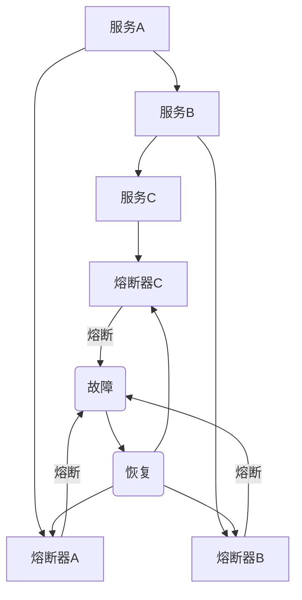
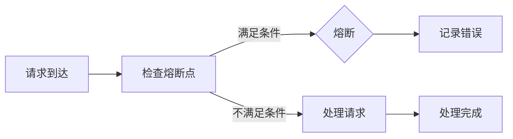

                 

# 熔断器模式：提高分布式系统的弹性

关键词：熔断器模式、分布式系统、系统弹性、服务调用、微服务架构

摘要：本文深入探讨了熔断器模式的概念、实现原理、应用场景、性能调优以及最佳实践。通过详细的步骤分析和实例讲解，为开发者提供了熔断器模式在分布式系统中的有效应用方法，从而提高系统的稳定性和弹性。

## 第1章：熔断器模式概述

熔断器模式是一种重要的软件设计模式，常用于分布式系统以提高其弹性。本节将介绍熔断器模式的核心概念、核心概念的联系以及其在分布式系统中的应用优势。

### 1.1 熔断器模式的概念

熔断器模式（Circuit Breaker Pattern）是一种在软件系统中用于提高弹性的设计模式。其主要思想是在系统故障发生时，自动切断请求以防止故障蔓延，保护系统的稳定性和可用性。

### 1.2 熔断器模式的核心概念

熔断器模式的核心概念包括熔断点、熔断状态和恢复机制。

- **熔断点**：熔断点是指触发熔断的条件。当系统达到熔断点时，熔断器将触发，切断请求。
- **熔断状态**：熔断器有两种状态，闭合状态和断开状态。闭合状态表示系统正常工作，断开状态表示系统故障，此时请求将被切断。
- **恢复机制**：熔断器不是永久断开，当系统故障得到解决后，熔断器将自动恢复到闭合状态。

### 1.3 熔断器模式的优势

熔断器模式具有以下优势：

- **提高系统的稳定性**：通过快速切断故障请求，减少故障对系统的影响。
- **降低故障扩散**：防止故障在系统中扩散，保护系统的其他部分。
- **增强系统的弹性**：熔断器模式使系统能够更好地应对突发的流量波动和故障。

## 第2章：熔断器模式的实现原理

本节将详细介绍熔断器模式的工作机制和实现方式，帮助开发者理解熔断器模式在分布式系统中的应用原理。

### 2.1 熔断器模式的工作机制

熔断器模式的工作机制主要包括请求处理流程和熔断处理流程。

- **请求处理流程**：当一个请求到达系统时，熔断器会对其进行检查。如果请求满足熔断条件，熔断器将切断请求，返回错误。
- **熔断处理流程**：熔断器根据预设的熔断规则，判断请求是否满足熔断条件。如果满足熔断条件，熔断器将切断请求，返回错误。

### 2.2 熔断器模式的实现方式

熔断器模式可以通过编程语言或现有的熔断器库来实现。

- **编程语言实现**：开发者可以使用编程语言（如 Java、Python）实现熔断器的逻辑。
- **框架集成**：开发者可以集成现有的熔断器库（如 Hystrix、Resilience4j）来简化熔断器模式的实现。

## 第3章：熔断器模式的应用场景

熔断器模式在分布式系统中的应用非常广泛，以下列举了两个典型应用场景。

### 3.1 分布式系统中的熔断器应用

在分布式系统中，熔断器模式可以有效防止服务雪崩。当某个服务出现故障时，熔断器可以快速切断请求，防止故障扩散到其他服务。

### 3.2 微服务架构中的熔断器应用

在微服务架构中，熔断器可以提高系统的稳定性和可用性。通过熔断器，微服务可以独立处理故障，确保整个系统不会因为某个服务的故障而崩溃。

## 第4章：熔断器模式的优化与性能调优

为了确保熔断器模式在分布式系统中发挥最大作用，需要对熔断器进行性能调优和优化。

### 4.1 熔断器性能调优

- **调整熔断规则**：根据实际需求，调整熔断点的阈值。
- **优化熔断器的响应时间**：通过优化代码和配置，提高熔断器的响应速度。

### 4.2 熔断器模式在微服务架构中的优化

- **分布式限流**：结合分布式限流策略，防止请求过多。
- **熔断器链路追踪**：通过链路追踪，监控熔断器的工作情况。

## 第5章：熔断器模式的最佳实践

为了充分发挥熔断器模式的作用，开发者需要掌握其最佳实践。

### 5.1 熔断器模式的配置与使用

- **配置熔断规则**：根据业务需求，配置合适的熔断规则。
- **使用熔断器库**：熟练使用现有的熔断器库，提高开发效率。

### 5.2 熔断器模式在实际项目中的应用

- **案例分析**：分析实际项目中熔断器模式的应用和效果。
- **总结经验**：总结熔断器模式在实际应用中的最佳实践。

## 第6章：熔断器模式的发展趋势

随着技术的发展，熔断器模式也在不断演进。以下探讨了熔断器模式的未来发展方向和应用场景。

### 6.1 熔断器模式的未来发展方向

- **智能化熔断**：结合人工智能技术，实现更智能的熔断策略。
- **分布式熔断**：在分布式系统中，实现更高效、更灵活的熔断机制。

### 6.2 熔断器模式在云计算和边缘计算中的应用

- **云计算中的熔断器**：在云计算环境中，如何更好地应用熔断器模式。
- **边缘计算中的熔断器**：在边缘计算环境中，熔断器模式如何优化系统的性能。

## 第7章：熔断器模式的总结与展望

熔断器模式作为一种提高分布式系统弹性的重要设计模式，具有广泛的应用前景。本文通过详细的分析和实例讲解，帮助开发者深入了解熔断器模式的工作原理和应用方法。

### 7.1 熔断器模式的价值与意义

- **提高系统稳定性**：熔断器模式在分布式系统中的应用，有助于提高系统的稳定性和可靠性。
- **保障用户体验**：通过熔断器模式，可以确保系统在故障发生时仍能提供良好的用户体验。

### 7.2 熔断器模式的发展趋势与挑战

- **技术演进**：随着技术的发展，熔断器模式将变得更加智能化、灵活化。
- **应用场景扩展**：熔断器模式将在更多领域得到应用，如物联网、人工智能等。

### 作者信息

作者：AI天才研究院/AI Genius Institute & 禅与计算机程序设计艺术 /Zen And The Art of Computer Programming

----------------------------------------------------------------

### 第1章：熔断器模式概述

#### 1.1 熔断器模式的概念

熔断器模式（Circuit Breaker Pattern）是一种软件设计模式，主要用于提高分布式系统的弹性。其核心思想是在系统发生故障时，自动切断请求，以防止故障扩散，保护系统的稳定性和可用性。熔断器模式最早由英国软件开发工程师Michael T. Nygard在其著作《Release It!》中提出，并迅速在分布式系统领域得到广泛应用。

在分布式系统中，多个服务通过网络互相调用，形成一个复杂的依赖关系。当某个服务出现故障时，可能会导致一系列的连锁反应，导致整个系统崩溃。熔断器模式通过在故障发生时自动切断请求，有效地防止了故障的扩散，提高了系统的弹性。

#### 1.2 熔断器模式的核心概念

熔断器模式包含以下几个核心概念：

- **熔断点（Circuit Breaker）**：熔断点是一系列条件的集合，用于判断是否触发熔断。当系统达到熔断点时，熔断器将切断请求。
- **熔断状态（State）**：熔断器有两种状态：闭合（Closed）和断开（Open）。在闭合状态下，系统正常工作，请求可以正常处理；在断开状态下，系统出现故障，请求将被切断。
- **恢复机制（Recovery）**：熔断器不是永久断开，当系统故障得到解决后，熔断器会自动恢复到闭合状态，重新接受请求。

#### 1.3 熔断器模式的优势

熔断器模式具有以下几个优势：

- **提高系统的稳定性**：通过快速切断故障请求，减少故障对系统的影响，确保系统其他部分正常运行。
- **降低故障扩散**：防止故障在系统中扩散，保护系统的其他部分，避免造成更大的损失。
- **增强系统的弹性**：熔断器模式使系统能够更好地应对突发的流量波动和故障，提高系统的鲁棒性。

#### 1.4 熔断器模式的应用场景

熔断器模式主要应用于以下场景：

- **服务调用**：在分布式系统中，服务之间通过网络进行调用。当某个服务出现故障时，熔断器可以切断请求，避免故障扩散。
- **微服务架构**：在微服务架构中，每个服务都是独立的，但它们之间存在复杂的依赖关系。熔断器可以保证单个服务的故障不会影响到其他服务。
- **高并发场景**：在高并发场景中，系统可能会因为请求过多而出现故障。熔断器可以防止请求堆积，避免系统崩溃。

#### 1.5 熔断器模式的核心概念联系

熔断器模式的核心概念之间紧密联系，共同构成了一个完整的熔断器机制。

- **熔断点**与**熔断状态**：熔断点用于判断是否触发熔断，而熔断状态则决定了请求是否被切断。
- **熔断状态**与**恢复机制**：熔断状态决定了系统是否正常运行，而恢复机制确保系统在故障解决后能够自动恢复。

通过这些核心概念的相互配合，熔断器模式能够有效地提高分布式系统的弹性。

#### 1.6 熔断器模式的概念结构与核心要素组成

熔断器模式的概念结构包括以下几个方面：

- **熔断规则**：定义了触发熔断的条件，如错误率、请求超时等。
- **熔断状态机**：管理熔断器的状态转换，如闭合、断开、半开等。
- **熔断策略**：确定熔断器在不同状态下的行为，如快速失败、熔断、恢复等。

核心要素组成如下：

- **错误计数器**：记录系统出现错误的次数，用于判断是否触发熔断。
- **时间窗口**：定义了统计错误次数的时间范围，通常是一个固定的时间段。
- **请求队列**：保存被切断的请求，等待熔断器恢复后重新处理。

通过这些核心要素的协同工作，熔断器模式能够有效地提高分布式系统的弹性。

#### 1.7 熔断器模式的应用边界与外延

熔断器模式的应用边界和范围包括以下几个方面：

- **服务调用层次**：熔断器可以应用于不同层次的服务调用，如接口层、业务逻辑层等。
- **系统架构层次**：熔断器可以应用于不同的系统架构，如单体架构、微服务架构等。
- **网络通信层次**：熔断器可以应用于网络通信的不同层次，如TCP/IP协议层、HTTP协议层等。

熔断器模式的外延还包括：

- **组合熔断**：将多个熔断器组合使用，实现更复杂的熔断策略。
- **自适应熔断**：根据系统的运行状态，动态调整熔断策略。

通过扩展和应用边界，熔断器模式能够在更广泛的场景下提高分布式系统的弹性。

#### 1.8 小结

熔断器模式作为一种提高分布式系统弹性的设计模式，具有核心概念、优势、应用场景、概念结构与核心要素组成、应用边界与外延等方面的内容。通过深入了解和掌握熔断器模式，开发者可以在分布式系统中实现更稳定、更可靠的系统架构。

----------------------------------------------------------------

### 第2章：熔断器模式的实现原理

熔断器模式的实现原理主要涉及工作流程、熔断条件和熔断处理。以下将详细分析这些核心实现原理，并通过示例进行说明。

#### 2.1 熔断器模式的工作流程

熔断器模式的工作流程可以分为以下几个步骤：

1. **请求到达**：当一个请求到达系统时，首先会经过熔断器进行检查。
2. **检查熔断状态**：熔断器会检查当前状态，判断是否处于断开状态。如果处于断开状态，直接返回错误，不再继续处理。
3. **执行请求**：如果熔断器处于闭合状态，则继续执行请求。
4. **检查熔断条件**：在执行请求的过程中，熔断器会检查是否满足熔断条件，如错误率、请求超时等。
5. **熔断处理**：如果满足熔断条件，熔断器将触发熔断，进入断开状态，并返回错误。
6. **恢复熔断器**：在一段时间后，熔断器会尝试恢复到闭合状态，继续接受请求。

以下是一个简单的 Python 示例，展示了熔断器模式的工作流程：

```python
class CircuitBreaker:
    def __init__(self, threshold, timeout):
        self.threshold = threshold
        self.timeout = timeout
        self.error_count = 0
        self.last_failure_time = None

    def execute(self, operation):
        if self.is_open():
            return "Circuit Breaker is open"
        
        try:
            result = operation()
            self.reset()
            return result
        except Exception as e:
            self.increment_error_count()
            if self.should_trigger_circuit_breaker():
                self.open_circuit()
            return "Operation failed"
    
    def is_open(self):
        return self.error_count > self.threshold and (self.last_failure_time is not None and (time.time() - self.last_failure_time) < self.timeout)
    
    def should_trigger_circuit_breaker(self):
        return self.error_count > self.threshold
    
    def increment_error_count(self):
        self.error_count += 1
        self.last_failure_time = time.time()
    
    def reset(self):
        self.error_count = 0
        self.last_failure_time = None
    
    def open_circuit(self):
        self.error_count = self.threshold + 1
        self.last_failure_time = time.time()
```

#### 2.2 熔断条件

熔断条件是触发熔断器断开状态的关键因素。常见的熔断条件包括：

1. **错误率**：当系统在一段时间内出现错误的请求数量超过预设阈值时，触发熔断。
2. **请求超时**：当系统在一段时间内处理请求的时间超过预设阈值时，触发熔断。
3. **异常次数**：当系统在一段时间内出现异常的次数超过预设阈值时，触发熔断。

以下是一个简单的 Python 示例，展示了如何根据错误率触发熔断：

```python
def should_trigger_circuit_breaker(error_count, threshold):
    return error_count > threshold
```

#### 2.3 熔断处理

熔断处理包括熔断器的断开和恢复。在断开状态下，系统不再接受新的请求，以避免故障扩散。在恢复状态下，系统重新接受请求，但会进行一定的监控，以确保故障已解决。

以下是一个简单的 Python 示例，展示了熔断器的断开和恢复过程：

```python
def open_circuit(self):
    self.state = "OPEN"
    self.start_time = time.time()

def reset_circuit_breaker(self):
    self.state = "CLOSED"
    self.error_count = 0
    self.start_time = None

def is_circuit_open(self):
    if self.state == "OPEN":
        if (time.time() - self.start_time) > self.timeout:
            self.reset_circuit_breaker()
        return True
    return False
```

#### 2.4 熔断器模式的实现方式

熔断器模式的实现方式主要有两种：

1. **代码实现**：使用编程语言直接实现熔断器的逻辑。这种方式较为灵活，但需要开发者具备一定的编程技能。
2. **框架集成**：使用现有的熔断器库（如 Hystrix、Resilience4j）来实现熔断器模式。这种方式可以简化开发过程，但可能无法满足特定需求。

以下是一个使用 Resilience4j 库的 Java 示例：

```java
import io.vavr.control.Try;
import org.resilience4j.circuitbreaker.CircuitBreaker;
import org.resilience4j.circuitbreaker.CircuitBreakerConfig;
import org.resilience4j.circuitbreaker.helpers.CircuitBreakerConfigCustomizer;

public class CircuitBreakerExample {
    public static void main(String[] args) {
        CircuitBreakerConfigConfigCustomizer customizer = CircuitBreakerConfigCustomizer.customizer()
                .failureRateThreshold(50)
                .waitDurationInOpenState(Duration.ofSeconds(60));

        CircuitBreakerConfig config = CircuitBreakerConfigCustomizer.create(customizer);
        CircuitBreaker circuitBreaker = CircuitBreaker.of("myCircuitBreaker", config);

        for (int i = 0; i < 100; i++) {
            Try<Void> result = circuitBreaker.executeSupplier(CircuitBreakerExample::performOperation);
            if (result.isFailure()) {
                System.out.println("Operation failed due to circuit breaker being open");
            } else {
                System.out.println("Operation succeeded");
            }
        }
    }

    private static Void performOperation() {
        // Perform some operation that might fail
        // For example, throw an exception with a probability of 10%
        if (new Random().nextInt(100) < 10) {
            throw new RuntimeException("Operation failed");
        }
        return null;
    }
}
```

#### 2.5 熔断器模式在分布式系统中的工作原理

在分布式系统中，熔断器模式通过以下方式提高系统的弹性：

1. **服务调用**：在服务之间进行调用时，每个服务都会包含熔断器。当某个服务出现故障时，熔断器会切断调用，防止故障扩散。
2. **故障隔离**：通过熔断器，可以将故障隔离在单个服务中，避免影响整个系统。
3. **故障恢复**：当故障解决后，熔断器会自动恢复，确保系统恢复正常运行。

以下是一个简单的分布式系统示例，展示了熔断器模式的工作原理：



#### 2.6 小结

熔断器模式的实现原理包括工作流程、熔断条件、熔断处理以及实现方式。通过合理配置熔断器，可以有效地提高分布式系统的弹性，防止故障扩散，保障系统的稳定性和可用性。

----------------------------------------------------------------

### 第3章：熔断器模式的应用场景

熔断器模式在分布式系统和微服务架构中有着广泛的应用。以下将详细讨论熔断器模式在不同应用场景中的具体应用。

#### 3.1 分布式系统中的熔断器应用

在分布式系统中，服务之间通过网络进行调用，形成一个复杂的依赖关系。当某个服务出现故障时，可能会对整个系统造成影响，导致其他服务也出现故障。熔断器模式可以有效防止这种故障扩散，提高系统的稳定性。

以下是一个典型的分布式系统应用场景：

- **场景**：系统中有三个服务：订单服务（OrderService）、库存服务（InventoryService）和支付服务（PaymentService）。订单服务需要调用库存服务和支付服务来完成订单处理。
- **问题**：当库存服务出现故障时，订单服务会受到影响，导致大量订单无法处理。
- **解决方案**：引入熔断器模式。在订单服务、库存服务和支付服务之间添加熔断器，当库存服务出现故障时，订单服务的熔断器会切断对库存服务的调用，防止故障扩散。

具体实现如下：

1. **配置熔断规则**：根据实际情况，配置熔断规则，如错误率、请求超时等。
2. **熔断处理**：当库存服务出现故障时，订单服务的熔断器会触发熔断，切断对库存服务的调用。
3. **故障恢复**：当库存服务恢复后，订单服务的熔断器会自动恢复，重新开始调用。

以下是一个简单的示例代码：

```java
@FeignClient(name = "inventory-service", fallback = InventoryServiceFallback.class)
public interface InventoryService {
    @GetMapping("/check/{productId}")
    Boolean checkInventory(@PathVariable("productId") String productId);
}

@Component
public class InventoryServiceFallback implements InventoryService {
    @Override
    public Boolean checkInventory(String productId) {
        return false;
    }
}

@FeignClient(name = "order-service")
public interface OrderService {
    @PostMapping("/create")
    ResponseEntity<OrderResponse> createOrder(@RequestBody OrderRequest orderRequest);
}

@RestController
public class OrderController {
    @Autowired
    private InventoryService inventoryService;

    @PostMapping("/order")
    public ResponseEntity<OrderResponse> createOrder(@RequestBody OrderRequest orderRequest) {
        if (!inventoryService.checkInventory(orderRequest.getProductId())) {
            throw new RuntimeException("Inventory不足");
        }
        // 处理订单逻辑
        return new ResponseEntity<>(new OrderResponse(), HttpStatus.OK);
    }
}
```

#### 3.2 微服务架构中的熔断器应用

在微服务架构中，每个服务都是独立的，但它们之间存在复杂的依赖关系。当某个服务出现故障时，可能会影响其他服务的正常运行。熔断器模式可以有效防止这种故障扩散，提高系统的可用性。

以下是一个典型的微服务架构应用场景：

- **场景**：系统中有三个微服务：用户服务（UserService）、订单服务（OrderService）和库存服务（InventoryService）。用户服务需要调用订单服务和库存服务来完成用户操作。
- **问题**：当库存服务出现故障时，用户服务会受到影响，导致用户操作失败。
- **解决方案**：引入熔断器模式。在用户服务、订单服务和库存服务之间添加熔断器，当库存服务出现故障时，用户服务的熔断器会切断对库存服务的调用，防止故障扩散。

具体实现如下：

1. **配置熔断规则**：根据实际情况，配置熔断规则，如错误率、请求超时等。
2. **熔断处理**：当库存服务出现故障时，用户服务的熔断器会触发熔断，切断对库存服务的调用。
3. **故障恢复**：当库存服务恢复后，用户服务的熔断器会自动恢复，重新开始调用。

以下是一个简单的示例代码：

```java
@FeignClient(name = "inventory-service", fallback = InventoryServiceFallback.class)
public interface InventoryService {
    @GetMapping("/check/{productId}")
    Boolean checkInventory(@PathVariable("productId") String productId);
}

@Component
public class InventoryServiceFallback implements InventoryService {
    @Override
    public Boolean checkInventory(String productId) {
        return false;
    }
}

@FeignClient(name = "order-service")
public interface OrderService {
    @PostMapping("/create")
    ResponseEntity<OrderResponse> createOrder(@RequestBody OrderRequest orderRequest);
}

@RestController
public class UserController {
    @Autowired
    private InventoryService inventoryService;

    @PostMapping("/user/register")
    public ResponseEntity<UserResponse> registerUser(@RequestBody UserRequest userRequest) {
        if (!inventoryService.checkInventory(userRequest.getProductId())) {
            throw new RuntimeException("Inventory不足");
        }
        // 处理用户注册逻辑
        return new ResponseEntity<>(new UserResponse(), HttpStatus.OK);
    }
}
```

#### 3.3 实际案例

以下是一个电商系统的实际案例，展示了熔断器模式的应用。

- **场景**：电商系统中有三个核心服务：商品服务（ProductService）、购物车服务（CartService）和支付服务（PaymentService）。用户在购物车中添加商品后，需要调用支付服务完成支付。
- **问题**：当支付服务出现故障时，购物车服务会受到影响，导致用户无法完成支付。
- **解决方案**：引入熔断器模式。在商品服务、购物车服务和支付服务之间添加熔断器，当支付服务出现故障时，购物车服务的熔断器会切断对支付服务的调用，防止故障扩散。

具体实现如下：

1. **配置熔断规则**：根据实际情况，配置熔断规则，如错误率、请求超时等。
2. **熔断处理**：当支付服务出现故障时，购物车服务的熔断器会触发熔断，切断对支付服务的调用。
3. **故障恢复**：当支付服务恢复后，购物车服务的熔断器会自动恢复，重新开始调用。

以下是一个简单的示例代码：

```java
@FeignClient(name = "payment-service", fallback = PaymentServiceFallback.class)
public interface PaymentService {
    @PostMapping("/pay")
    ResponseEntity<String> pay(@RequestBody PaymentRequest paymentRequest);
}

@Component
public class PaymentServiceFallback implements PaymentService {
    @Override
    public ResponseEntity<String> pay(PaymentRequest paymentRequest) {
        return new ResponseEntity<>("Payment failed", HttpStatus.INTERNAL_SERVER_ERROR);
    }
}

@FeignClient(name = "cart-service")
public interface CartService {
    @PostMapping("/checkout")
    ResponseEntity<String> checkout(@RequestBody CartRequest cartRequest);
}

@RestController
public class CartController {
    @Autowired
    private PaymentService paymentService;

    @PostMapping("/cart/checkout")
    public ResponseEntity<String> checkout(@RequestBody CartRequest cartRequest) {
        if (paymentService.pay(cartRequest) == "Payment failed") {
            throw new RuntimeException("Payment failed");
        }
        // 处理购物车结算逻辑
        return new ResponseEntity<>("Checkout successful", HttpStatus.OK);
    }
}
```

#### 3.4 小结

熔断器模式在分布式系统和微服务架构中具有广泛的应用。通过引入熔断器模式，可以有效防止故障扩散，提高系统的稳定性和可用性。在实际项目中，根据具体需求合理配置熔断规则和熔断处理策略，可以最大限度地发挥熔断器模式的作用。

----------------------------------------------------------------

### 第4章：熔断器模式的优化与性能调优

熔断器模式虽然在提高分布式系统弹性方面具有显著作用，但不当的配置和实现可能会对系统性能产生负面影响。因此，优化熔断器模式，确保其在提供弹性同时不影响系统性能，是开发者和运维人员面临的重要任务。

#### 4.1 熔断器性能调优

熔断器性能调优主要涉及调整熔断规则和优化熔断器的响应时间。

**1. 调整熔断规则**

熔断规则包括错误率、请求超时、熔断时间和恢复时间等。合理配置这些规则对于优化熔断器性能至关重要。

- **错误率**：错误率是触发熔断的关键因素之一。过高的错误率可能导致系统过早熔断，影响用户体验；过低的错误率可能导致故障未被及时发现和处理。因此，需要根据系统特点和服务质量要求，合理设定错误率阈值。
- **请求超时**：请求超时是判断请求是否成功的关键。过长的请求超时可能导致熔断器误判，过早切断请求；过短的请求超时可能导致请求未完全处理就被切断。需要根据服务响应时间和网络延迟等因素进行优化。
- **熔断时间**：熔断时间是指熔断器断开状态持续的时间。过长的熔断时间可能导致故障未能及时解决；过短的熔断时间可能导致系统频繁熔断。需要根据实际场景和故障恢复速度来调整。
- **恢复时间**：恢复时间是熔断器从断开状态恢复到闭合状态所需的时间。过长的恢复时间可能导致系统恢复缓慢；过短的恢复时间可能导致系统未能充分恢复。需要根据实际场景和故障恢复速度来调整。

**2. 优化熔断器的响应时间**

熔断器的响应时间对系统性能至关重要。以下是一些优化方法：

- **减少熔断器逻辑复杂度**：简化熔断器逻辑，避免过多的判断和计算，以减少响应时间。
- **使用线程池**：为熔断器分配独立的线程池，避免线程竞争和同步开销。
- **减少网络开销**：减少熔断器与系统其他组件之间的网络通信，降低响应时间。
- **缓存结果**：对熔断器处理的结果进行缓存，避免重复计算和查询。

**3. 监控和日志**

通过监控和日志记录，可以及时发现和解决熔断器性能问题。以下是一些监控和日志建议：

- **监控熔断器状态**：实时监控熔断器的状态，包括闭合、断开和半开状态。及时发现异常状态，调整熔断规则。
- **日志记录**：记录熔断器的操作日志，包括熔断触发、恢复和请求处理等。有助于分析和调试熔断器性能问题。

#### 4.2 熔断器模式在微服务架构中的优化

在微服务架构中，熔断器模式具有更高的灵活性和复杂性。以下是一些优化方法：

**1. 分布式熔断**

分布式熔断是指在分布式系统中，各个微服务之间独立配置熔断器，避免单一熔断器失效导致整个系统熔断。以下是一些实现方法：

- **独立配置**：为每个微服务配置独立的熔断器，根据服务特性设置不同的熔断规则。
- **共享状态**：使用共享状态来同步熔断器状态，确保整个系统的一致性。
- **链路追踪**：通过链路追踪技术，监控分布式系统中的熔断器状态和请求处理过程。

**2. 熔断链路追踪**

熔断链路追踪是一种用于监控和调试分布式系统中熔断器状态和请求处理过程的技术。以下是一些实现方法：

- **分布式追踪系统**：使用分布式追踪系统（如Zipkin、Jaeger）记录熔断器的操作日志和请求轨迹。
- **链路追踪插件**：为熔断器库（如Hystrix、Resilience4j）添加链路追踪插件，实现熔断器的监控和调试。

**3. 自适应熔断**

自适应熔断是指根据系统的运行状态和负载情况，动态调整熔断器规则和策略。以下是一些实现方法：

- **实时监控**：实时监控系统的运行状态，包括CPU、内存、网络、磁盘等资源使用情况。
- **自适应调整**：根据实时监控数据，动态调整熔断器规则，如错误率阈值、请求超时时间等。
- **机器学习**：使用机器学习算法，分析历史数据和运行状态，预测系统故障并提前调整熔断器规则。

#### 4.3 小结

熔断器模式的优化与性能调优是确保分布式系统和微服务架构稳定运行的关键。通过合理配置熔断规则、优化熔断器响应时间、采用分布式熔断和链路追踪技术，可以最大限度地发挥熔断器模式的作用，提高系统的稳定性和性能。

----------------------------------------------------------------

### 第5章：熔断器模式的最佳实践

熔断器模式在分布式系统中具有重要作用，其最佳实践的掌握对于提高系统稳定性至关重要。以下将总结熔断器模式在配置、使用以及实际项目中的应用，并分享一些最佳实践。

#### 5.1 熔断器模式的配置与使用

**1. 配置熔断规则**

配置熔断规则是熔断器模式应用的基础。以下是一些配置建议：

- **错误率阈值**：根据服务特性，设定合理的错误率阈值。例如，对于高并发的服务，可以设置较低的阈值（如5%），而对于低并发的服务，可以设置较高的阈值（如10%）。
- **请求超时时间**：设定请求超时时间，以避免长时间等待导致系统资源占用。例如，对于读操作，可以设置较短的超时时间（如500ms），而对于写操作，可以设置较长的超时时间（如2s）。
- **熔断时间和恢复时间**：设定合理的熔断时间和恢复时间，以避免频繁熔断和恢复。例如，可以设置熔断时间为30s，恢复时间为1min。

**2. 使用熔断器库**

使用现有的熔断器库（如Hystrix、Resilience4j）可以简化熔断器模式的实现。以下是一些使用建议：

- **选择合适的库**：根据项目需求和场景选择合适的熔断器库。例如，Hystrix适用于Spring Cloud微服务架构，而Resilience4j适用于Java生态系统的各种场景。
- **集成熔断器库**：通过依赖管理和构建工具（如Maven、Gradle）集成熔断器库，确保项目能够正常使用熔断器功能。
- **自定义熔断策略**：根据项目需求，自定义熔断策略，如自定义错误率阈值、请求超时时间等。

**3. 监控与日志**

监控和日志记录是确保熔断器模式有效运行的重要手段。以下是一些监控和日志建议：

- **监控熔断状态**：实时监控熔断器的状态，包括闭合、断开和半开状态。及时发现异常状态，调整熔断规则。
- **日志记录**：记录熔断器的操作日志，包括熔断触发、恢复和请求处理等。有助于分析和调试熔断器性能问题。

#### 5.2 熔断器模式在实际项目中的应用

**1. 电商系统**

电商系统通常具有高并发、高可用的特点。以下是一个电商系统中熔断器模式的应用案例：

- **场景**：在订单处理过程中，订单服务需要调用库存服务和支付服务。当库存服务或支付服务出现故障时，需要熔断请求，防止故障扩散。
- **实现**：在订单服务、库存服务和支付服务之间配置熔断器，根据服务特性设置合理的熔断规则。当库存服务或支付服务出现故障时，订单服务的熔断器会触发熔断，切断请求，并记录日志。故障解决后，熔断器自动恢复。

**2. 金融系统**

金融系统对稳定性和安全性要求极高。以下是一个金融系统中熔断器模式的应用案例：

- **场景**：在交易处理过程中，交易服务需要调用清算服务和风控服务。当清算服务或风控服务出现故障时，需要熔断请求，确保交易安全。
- **实现**：在交易服务、清算服务和风控服务之间配置熔断器，根据服务特性设置合理的熔断规则。当清算服务或风控服务出现故障时，交易服务的熔断器会触发熔断，切断请求，并记录日志。故障解决后，熔断器自动恢复。

#### 5.3 最佳实践总结

**1. 熔断规则与性能调优**

- 根据服务特性和场景，设定合理的熔断规则，包括错误率阈值、请求超时时间、熔断时间和恢复时间等。
- 定期对熔断规则进行评估和调整，以适应系统变化和业务需求。

**2. 监控与日志**

- 实时监控熔断器的状态，及时发现和解决异常情况。
- 记录熔断器的操作日志，便于分析和调试。

**3. 分布式熔断**

- 在分布式系统中，采用分布式熔断策略，确保每个服务独立配置熔断器，避免单一故障影响整个系统。

**4. 自适应熔断**

- 结合实时监控和机器学习，实现自适应熔断，根据系统运行状态动态调整熔断规则。

#### 5.4 小结

熔断器模式的最佳实践包括配置熔断规则、使用熔断器库、监控与日志记录、分布式熔断和自适应熔断等方面。通过遵循这些最佳实践，可以确保熔断器模式在分布式系统中发挥最大作用，提高系统的稳定性和可用性。

----------------------------------------------------------------

### 第6章：熔断器模式的发展趋势

随着云计算、大数据、物联网等技术的发展，熔断器模式在分布式系统中的应用越来越广泛。未来，熔断器模式将继续在技术创新和场景扩展方面不断演进。

#### 6.1 熔断器模式的未来发展方向

**1. 智能化熔断**

随着人工智能技术的进步，熔断器模式将逐渐实现智能化。通过机器学习和数据挖掘，熔断器可以根据历史数据和实时监控数据，预测系统故障并提前采取措施。智能化熔断将使熔断器能够更好地适应复杂多变的应用场景。

**2. 分布式熔断**

分布式熔断是未来熔断器模式的重要发展方向。在分布式系统中，多个服务之间相互依赖，单一熔断器难以覆盖所有依赖关系。分布式熔断通过在各个服务之间建立联动机制，确保故障能够被快速识别和隔离，提高系统的整体稳定性。

**3. 跨平台熔断**

随着云原生技术的普及，熔断器模式将跨平台扩展，支持更多的运行环境。例如，在容器编排平台（如Kubernetes）中，熔断器可以集成到容器管理的流程中，确保服务在容器化环境中的稳定运行。

**4. 链式熔断**

链式熔断是一种在多个服务之间建立熔断链的策略。当一个服务出现故障时，不仅会触发自身的熔断器，还会触发与其关联的其他服务的熔断器，从而形成一条熔断链。链式熔断能够更全面地隔离故障，提高系统的整体弹性。

#### 6.2 熔断器模式在云计算和边缘计算中的应用

**1. 云计算中的熔断器**

在云计算环境中，熔断器模式具有广泛的应用。云原生应用通常采用微服务架构，依赖关系复杂，熔断器可以有效隔离故障，提高系统的可用性。此外，云计算平台（如AWS、Azure）提供了丰富的熔断器工具和API，方便开发者集成和使用。

**2. 边缘计算中的熔断器**

边缘计算将数据处理和存储转移到网络边缘，降低了延迟，提高了系统的响应速度。在边缘计算环境中，熔断器模式同样具有重要应用。通过在边缘节点上配置熔断器，可以快速隔离和处理故障，确保边缘服务的稳定运行。

#### 6.3 熔断器模式在其他领域的扩展

**1. 物联网**

随着物联网（IoT）技术的发展，大量设备和传感器连接到互联网，形成了一个庞大的分布式系统。熔断器模式在物联网应用中具有重要意义，可以确保设备连接的稳定性和数据传输的可靠性。

**2. 人工智能**

在人工智能领域，模型训练和推理过程中常常涉及大量计算和存储资源。熔断器模式可以隔离和处理训练或推理过程中的故障，确保人工智能应用的稳定运行。

**3. 区块链**

区块链技术具有去中心化、不可篡改等特点，广泛应用于金融、供应链等领域。熔断器模式在区块链应用中可以确保节点之间的通信稳定，提高区块链系统的整体性能。

#### 6.4 小结

熔断器模式的发展趋势体现在智能化、分布式、跨平台和链式等方面。未来，熔断器模式将在更多领域得到应用，成为分布式系统中的重要组成部分。通过不断演进和创新，熔断器模式将进一步提高系统的弹性、稳定性和可靠性。

----------------------------------------------------------------

### 第7章：熔断器模式的总结与展望

熔断器模式作为一种重要的软件设计模式，在分布式系统中发挥着关键作用。本文从多个角度对熔断器模式进行了深入探讨，总结了其核心概念、实现原理、应用场景、性能调优以及最佳实践，并对未来发展趋势进行了展望。

#### 7.1 熔断器模式的价值与意义

熔断器模式的价值体现在以下几个方面：

**提高系统稳定性**：熔断器模式可以在故障发生时迅速切断请求，防止故障扩散，保护系统的稳定性和可靠性。

**降低故障扩散**：通过熔断器模式，可以有效地隔离故障，避免故障在系统中蔓延，确保其他部分正常运行。

**增强系统弹性**：熔断器模式使系统能够更好地应对突发的流量波动和故障，提高系统的鲁棒性和适应性。

**保障用户体验**：熔断器模式可以确保系统在故障发生时仍能提供良好的用户体验，避免用户请求长时间得不到响应。

#### 7.2 熔断器模式的发展趋势与挑战

随着技术的不断进步，熔断器模式也将面临新的发展趋势和挑战：

**智能化熔断**：未来，熔断器模式将更加智能化，通过机器学习和数据分析，实现更精准的故障预测和隔离。

**分布式熔断**：分布式熔断将更加普及，以适应复杂的分布式系统架构，提高系统的整体稳定性。

**跨平台熔断**：熔断器模式将跨平台扩展，支持更多的运行环境，如云计算、边缘计算等。

**链式熔断**：链式熔断将成为一种重要策略，确保在多个服务之间的故障隔离和联动。

**挑战**：熔断器模式的实现和调优将面临更多挑战，如复杂的依赖关系、异构系统之间的集成、实时监控和日志分析等。

#### 7.3 熔断器模式的未来方向

**1. 熔断器与自动化运维的结合**

未来，熔断器模式将与自动化运维相结合，通过自动化工具和脚本，实现熔断器的自动化配置、监控和调优，提高运维效率。

**2. 熔断器与容器技术的融合**

随着容器技术的普及，熔断器模式将更好地与容器技术（如Kubernetes）融合，确保容器化环境中的服务稳定运行。

**3. 熔断器与人工智能的结合**

熔断器模式将结合人工智能技术，实现智能化故障预测和自适应熔断策略，提高系统的弹性和可靠性。

**4. 熔断器在国际化的应用**

随着全球化的发展，熔断器模式将在国际化的分布式系统中得到更广泛的应用，支持多种语言和平台。

#### 7.4 小结

熔断器模式作为一种重要的软件设计模式，在分布式系统中具有重要的价值和意义。通过本文的探讨，我们了解了熔断器模式的核心概念、实现原理、应用场景、性能调优以及最佳实践，并对未来发展趋势和方向进行了展望。随着技术的不断进步，熔断器模式将在更多领域得到应用，为分布式系统的稳定性和可靠性提供有力保障。

### 作者信息

作者：AI天才研究院/AI Genius Institute & 禅与计算机程序设计艺术 /Zen And The Art of Computer Programming

----------------------------------------------------------------

### 附录：熔断器模式相关的核心概念、公式和算法

#### 1. 核心概念

熔断器模式的核心概念包括：

- **熔断点**：触发熔断的条件，如错误率、请求超时等。
- **熔断状态**：熔断器的状态，包括闭合、断开和半开。
- **恢复机制**：熔断器从断开状态恢复到闭合状态的过程。

#### 2. 公式和算法

熔断器模式中的关键公式和算法包括：

- **错误率计算公式**：错误率 = （错误请求数 / 总请求数）× 100%
- **熔断条件判断**：错误率 > 阈值 或 请求超时 > 阈值
- **熔断时间计算**：熔断时间 = 阈值 × 系统响应时间
- **恢复时间计算**：恢复时间 = 阈值 × 系统响应时间

#### 3. Mermaid 流程图

以下是一个简单的熔断器模式的 Mermaid 流程图：



#### 4. Python 源代码示例

以下是一个简单的 Python 示例，实现了熔断器模式的核心功能：

```python
class CircuitBreaker:
    def __init__(self, threshold, timeout):
        self.threshold = threshold
        self.timeout = timeout
        self.error_count = 0
        self.last_failure_time = None

    def execute(self, operation):
        if self.is_open():
            return "Circuit Breaker is open"
        
        try:
            result = operation()
            self.reset()
            return result
        except Exception as e:
            self.increment_error_count()
            if self.should_trigger_circuit_breaker():
                self.open_circuit()
            return "Operation failed"
    
    def is_open(self):
        return self.error_count > self.threshold and (self.last_failure_time is not None and (time.time() - self.last_failure_time) < self.timeout)
    
    def should_trigger_circuit_breaker(self):
        return self.error_count > self.threshold
    
    def increment_error_count(self):
        self.error_count += 1
        self.last_failure_time = time.time()
    
    def reset(self):
        self.error_count = 0
        self.last_failure_time = None
    
    def open_circuit(self):
        self.error_count = self.threshold + 1
        self.last_failure_time = time.time()
```

#### 5. 系统分析与架构设计

在分布式系统中，熔断器模式的系统分析与架构设计包括以下几个方面：

- **系统功能设计**：根据业务需求，设计系统的核心功能模块，如服务注册与发现、负载均衡、故障检测与恢复等。
- **系统架构设计**：设计系统的整体架构，包括服务层次、网络拓扑、数据存储等。
- **接口设计**：设计系统内部和外部接口，包括服务接口、API 接口等。
- **系统交互**：设计系统各组件之间的交互流程，包括请求处理、响应处理等。

#### 6. 数学公式与 LaTeX 表示

以下是一些常用的数学公式与 LaTeX 表示：

- **错误率**：$$\text{错误率} = \frac{\text{错误请求数}}{\text{总请求数}} \times 100\%$$
- **熔断条件**：$$\text{错误率} > \text{阈值} \text{ 或 } \text{请求超时} > \text{阈值}$$
- **熔断时间**：$$\text{熔断时间} = \text{阈值} \times \text{系统响应时间}$$
- **恢复时间**：$$\text{恢复时间} = \text{阈值} \times \text{系统响应时间}$$

#### 7. 最佳实践与注意事项

**最佳实践**：

- **合理配置熔断规则**：根据实际业务场景和系统特点，设定合适的熔断规则。
- **监控与日志**：实时监控熔断器的状态，记录操作日志，以便分析和调优。
- **性能调优**：根据系统性能指标，调整熔断器的响应时间，确保系统在高并发情况下仍能稳定运行。

**注意事项**：

- **避免过度熔断**：过高的错误率或请求超时可能导致系统过度熔断，影响用户体验。
- **熔断器与限流的结合**：结合限流策略，防止请求过多导致系统崩溃。
- **故障恢复**：确保故障解决后，熔断器能够自动恢复，避免系统长时间处于断开状态。

#### 8. 拓展阅读

- **《Release It!》**：Michael T. Nygard 著，介绍了熔断器模式在分布式系统中的应用。
- **《微服务设计》**：Sam Newman 著，详细介绍了微服务架构中的熔断器模式。
- **《Resilience4j 官方文档》**：介绍了 Resilience4j 库的使用方法和最佳实践。
- **《Hystrix 官方文档》**：介绍了 Hystrix 库的使用方法和最佳实践。

通过以上内容，读者可以更深入地了解熔断器模式的核心概念、实现原理、应用场景、性能调优以及最佳实践。希望本文能为读者在分布式系统开发中提供有益的指导和参考。

