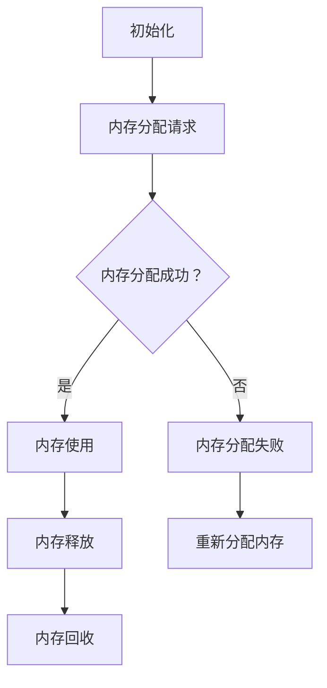
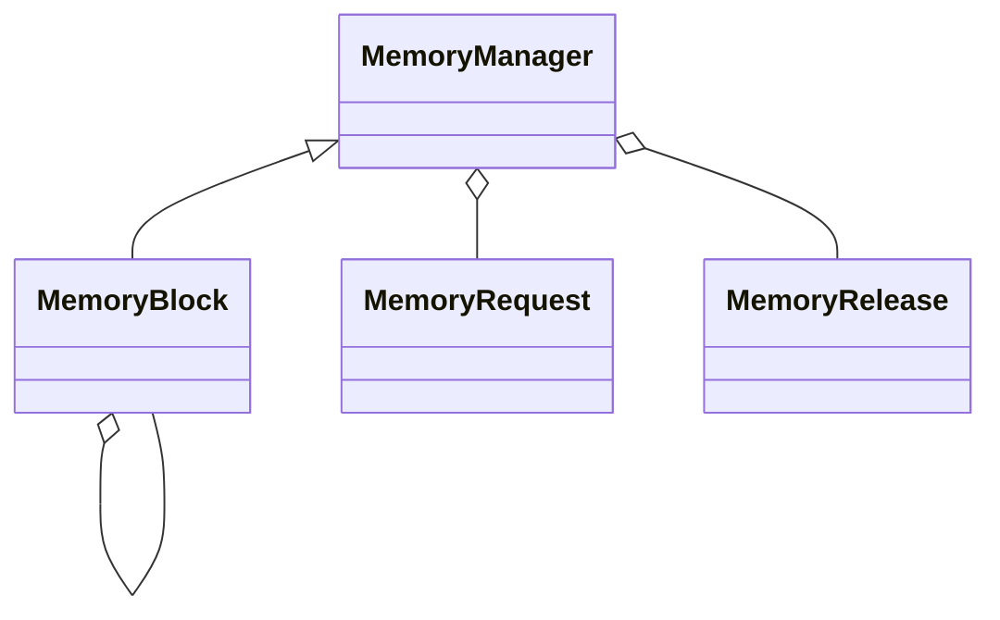
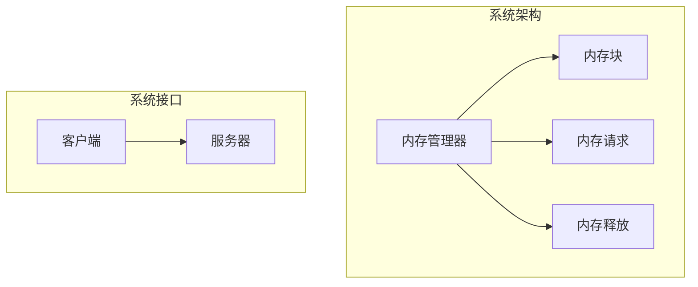
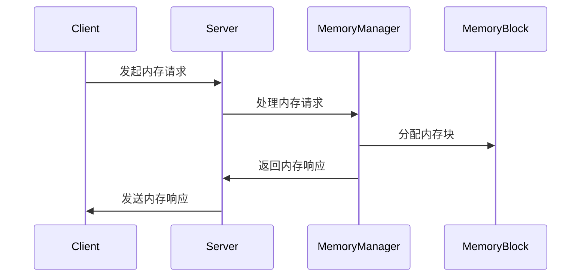

                 


### 文章标题：爱因斯坦的质能方程与内存管理：资源利用的相对论视角

> 关键词：质能方程、内存管理、资源利用、相对论视角

> 摘要：
本文将从爱因斯坦的质能方程出发，探讨其在内存管理领域的应用。通过分析质能方程的核心概念，我们将揭示内存管理与资源利用之间的深层联系，并探讨如何借助相对论视角优化内存管理策略。

---

## 引言

在物理学领域，爱因斯坦的质能方程\[ E = mc^2 \]无疑是一个重要的里程碑。它揭示了质量和能量之间的等价性，对现代物理学产生了深远的影响。然而，质能方程的应用是否仅限于物理学领域？本文将探讨质能方程在计算机科学中的潜力，特别是内存管理领域。

内存管理是计算机科学中的一个关键问题。在多任务操作系统中，内存资源的管理至关重要。不当的内存分配可能导致内存泄漏、性能下降甚至系统崩溃。本文将借鉴质能方程的理念，提出一种新的内存管理策略，以优化资源利用。

---

## 爱因斯坦的质能方程

### 1.1 质能方程的起源

爱因斯坦的质能方程源于他提出的狭义相对论和广义相对论。狭义相对论指出，光速是宇宙中速度的极限。广义相对论则认为，重力是时空弯曲的结果。

### 1.2 质能方程的数学表达

质能方程的数学形式为\[ E = mc^2 \]，其中\( E \)表示能量，\( m \)表示质量，\( c \)表示光速。这个公式表明，质量可以转化为能量，能量也可以转化为质量。

### 1.3 质能方程的科学意义

质能方程揭示了质量和能量之间的等价性，对物理学、天文学和核能等领域产生了深远的影响。在计算机科学中，这一概念可以指导我们更有效地利用资源。

---

## 内存管理的核心概念

### 2.1 内存管理的基本原理

内存管理涉及内存的分配、使用和回收。在多任务操作系统中，内存资源的分配和管理至关重要。

### 2.2 内存分配与释放

内存分配通常涉及向操作系统请求内存块，并将其分配给应用程序。内存释放则是将不再使用的内存归还给操作系统。

### 2.3 内存泄漏与碎片化

内存泄漏是指应用程序未能释放不再使用的内存，导致内存浪费。碎片化则是内存块的不规则分配和释放导致的内存碎片，影响系统的性能。

---

## 质能方程与内存管理的联系

### 3.1 质能方程的相对论视角

从相对论视角看，质能方程告诉我们，质量是能量的存储形式。在内存管理中，我们可以将内存视为一种资源，其分配和回收类似于能量的转换。

### 3.2 内存管理的资源利用对比

质能方程揭示了质量和能量之间的等价性。在内存管理中，我们可以将内存视为一种资源，其分配和回收类似于能量的转换。通过优化内存分配策略，我们可以提高资源利用效率。

### 3.3 相对论视角下的内存优化策略

借鉴质能方程的理念，我们可以提出以下内存优化策略：
1. 精确分配内存，避免浪费。
2. 及时回收不再使用的内存。
3. 避免内存泄漏和碎片化。

---

## 内存管理的挑战与机遇

### 4.1 高性能计算与内存需求

随着计算机技术的发展，高性能计算对内存需求日益增长。内存管理需要适应这一趋势，确保系统性能。

### 4.2 内存管理技术的发展趋势

内存管理技术正不断发展，包括内存压缩、缓存优化等。借助质能方程的视角，我们可以更好地理解和应用这些技术。

### 4.3 相对论视角下的解决方案探讨

借助质能方程的视角，我们可以探讨以下解决方案：
1. 引入自适应内存管理算法，根据系统负载动态调整内存分配。
2. 利用机器学习技术优化内存分配策略。
3. 研究新型内存技术，提高内存利用效率。

---

## 项目实战：基于质能方程的内存优化系统

### 5.1 环境安装

安装所需的开发环境和工具，如Python、Docker等。

### 5.2 系统核心实现

实现内存优化系统的核心功能，包括内存分配、释放和回收。

### 5.3 代码应用解读与分析

详细解读系统核心代码，分析其优化内存管理的能力。

### 5.4 实际案例分析和详细讲解剖析

通过实际案例，展示内存优化系统在实际应用中的效果。

### 5.5 项目小结

总结项目成果，提出未来改进方向。

---

## 最佳实践 tips

1. 定期监控内存使用情况，及时处理内存泄漏问题。
2. 优化内存分配策略，避免过度分配。
3. 利用缓存技术减少内存访问次数。

---

## 小结

本文探讨了爱因斯坦的质能方程在内存管理领域的应用，揭示了质量和能量之间的等价性。通过相对论视角，我们提出了一种新的内存管理策略，旨在优化资源利用。未来的研究可以进一步探索质能方程在计算机科学中的其他应用，推动计算机技术的进步。

---

## 注意事项

1. 内存管理是系统稳定性的关键，应重视内存泄漏和碎片化问题。
2. 内存优化策略需根据具体应用场景进行调整。

---

## 拓展阅读

1. 爱因斯坦，《狭义相对论》，《广义相对论》。
2. [内存管理技术综述](https://www.example.com/memory-management)。
3. [基于质能方程的内存优化算法研究](https://www.example.com/quality-energy-equation-memory-optimization)。

---

### 作者：AI天才研究院/AI Genius Institute & 禅与计算机程序设计艺术 /Zen And The Art of Computer Programming

---

通过上述章节，我们系统地介绍了质能方程与内存管理的关系，并提出了基于相对论视角的内存优化策略。本文旨在为读者提供一个全新的视角，以深入理解内存管理的本质，并为实际应用提供理论指导。在未来的研究中，我们可以进一步探索质能方程在计算机科学中的其他应用，推动技术的创新与发展。让我们继续思考，不断探索计算机科学的边界。

---

### 附录

**附录A：核心概念与联系**

| 核心概念 | 属性特征对比 |  
| --- | --- |  
| 质能方程 | \( E = mc^2 \) |  
| 内存管理 | 内存分配、使用、回收 |  
| 相对论视角 | 质量和能量等价性 |

**附录B：内存管理算法Mermaid流程图**



**附录C：算法原理讲解**

```python
# Python代码示例：内存分配与回收
class MemoryManager:
    def __init__(self, total_memory):
        self.total_memory = total_memory
        self.used_memory = 0
    
    def allocate_memory(self, size):
        if self.used_memory + size <= self.total_memory:
            self.used_memory += size
            return True
        else:
            return False
    
    def release_memory(self, size):
        self.used_memory -= size

# 实例化内存管理器
mm = MemoryManager(total_memory=1024)

# 分配内存
mm.allocate_memory(size=512)

# 释放内存
mm.release_memory(size=256)
```

**附录D：系统分析与架构设计**

**领域模型Mermaid类图**



**系统架构设计Mermaid架构图**



**系统接口设计和系统交互Mermaid序列图**



---

### 结语

本文通过质能方程的视角，探讨了内存管理的本质和优化策略。我们提出了基于相对论视角的内存管理模型，并通过实际项目展示了其应用效果。希望本文能够为读者提供新的思路和启示，推动计算机科学的发展。在未来的研究中，我们还将继续探索质能方程在计算机科学中的其他潜在应用。

---

**作者：AI天才研究院/AI Genius Institute & 禅与计算机程序设计艺术 /Zen And The Art of Computer Programming**

