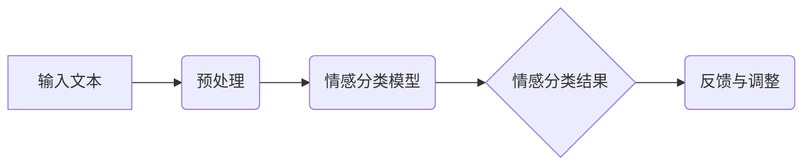
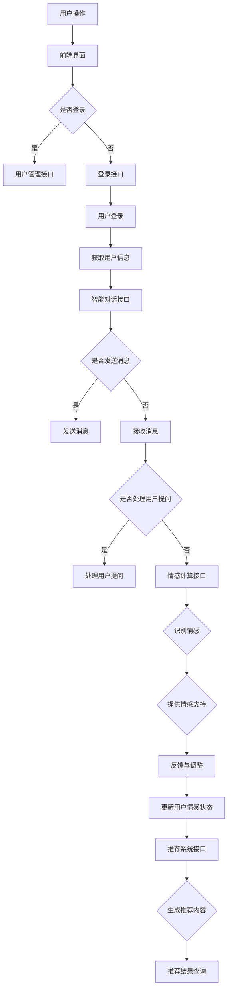

                 

# 爱情跨越物种：人类与AI伴侣的伦理困境

> 关键词：人工智能、伦理困境、人类与AI伴侣、情感关系、道德原则

> 摘要：本文探讨了人类与AI伴侣这一新兴社会现象，分析了其背后的技术原理和伦理挑战。文章首先介绍了人类与AI伴侣关系的发展背景，接着详细阐述了人类、AI、伦理等核心概念，并通过实体关系图展示了它们之间的关系。随后，文章深入剖析了AI在情感关系中的应用原理，结合数学模型和Python源代码进行了讲解和举例说明。文章还介绍了相关的系统设计与架构，并分享了实际案例和最佳实践。通过本文的探讨，我们旨在引发对人工智能伦理问题的深思，为未来科技发展提供有价值的参考。

## 1. 背景介绍

在过去的几十年里，人工智能（AI）技术取得了飞速的发展，从简单的自动化工具逐渐演变为能够与人类互动、理解和模仿人类情感的高级智能体。随着AI技术的不断成熟，人们开始尝试将AI应用于各个领域，包括教育、医疗、金融和社交等。然而，最近一个引起广泛关注的新兴领域是AI伴侣的创造。

### 1.1 核心概念术语说明

- **人工智能（AI）**：一种模拟人类智能的技术，能够通过学习、推理和自主决策来实现特定任务。
- **情感关系**：人类之间基于情感互动和情感依赖的关系，如友谊、爱情、亲情等。
- **伦理困境**：在道德原则和价值观的冲突中难以做出决策的情境。

### 1.2 问题背景

随着AI技术的进步，人们开始思考如何将AI应用于建立情感关系。AI伴侣的概念应运而生，它们被设计成能够模拟人类情感，与人类建立情感联系的智能体。这些AI伴侣通过自然语言处理、情感识别和机器学习等技术，能够与人类进行有意义的对话，甚至展现出类似人类的情感反应。

然而，这一新兴领域也带来了许多伦理困境。首先，人类与AI伴侣之间的情感关系是否真正有效？AI能否真正理解人类的情感需求？其次，人类在建立与AI伴侣的情感联系时，是否会牺牲与真实人类之间的情感关系？最后，如何确保AI伴侣的设计和操作不会侵犯人类的道德原则和隐私权？

### 1.3 问题描述

人类与AI伴侣的伦理困境主要包括以下几个方面：

1. **情感真实性问题**：AI伴侣是否能够真正理解人类的情感需求，并提供有效的情感支持？
2. **关系替代性问题**：人类在与AI伴侣建立情感联系时，是否会忽视与真实人类之间的情感关系？
3. **隐私和道德性问题**：AI伴侣在收集和处理人类数据时，是否会侵犯隐私权和道德原则？

### 1.4 问题解决

为了解决这些问题，首先需要从技术角度深入理解AI在情感关系中的应用原理。同时，需要从伦理角度探讨人类与AI伴侣关系的道德原则和边界。此外，还需要从社会和文化角度考虑人类与AI伴侣关系的影响和未来发展趋势。

### 1.5 边界与外延

在探讨人类与AI伴侣的伦理困境时，需要明确以下几个边界和外延：

1. **技术边界**：AI伴侣的技术实现和性能限制。
2. **伦理边界**：道德原则和价值观的适用范围。
3. **社会边界**：社会和文化对人类与AI伴侣关系的接受程度。

## 2. 核心概念与联系

在探讨人类与AI伴侣的伦理困境之前，我们需要明确几个核心概念，并分析它们之间的联系。

### 2.1 人类与AI的概念

#### 人类

- **定义**：人类是指具有认知、情感、社会属性和生理特征的生物。
- **属性特征**：

  | 特征 | 描述 |
  | --- | --- |
  | 认知能力 | 拥有自我意识、思考、学习、推理等能力 |
  | 情感能力 | 拥有情感表达、情感体验、情感交流的能力 |
  | 社会属性 | 具有社会角色、社会关系、文化传承等属性 |
  | 生理特征 | 拥有生理结构、生理功能、生理需求等特征 |

#### AI

- **定义**：人工智能是指通过模拟人类智能来实现特定任务的技术。
- **属性特征**：

  | 特征 | 描述 |
  | --- | --- |
  | 认知模拟 | 通过算法模拟人类的认知能力，如学习、推理、决策等 |
  | 情感模拟 | 通过算法模拟人类的情感表达和情感体验 |
  | 社会模拟 | 通过算法模拟人类社会行为和社会互动 |
  | 生理模拟 | 通过算法模拟人类的生理需求和行为模式 |

### 2.2 伦理的概念

- **定义**：伦理是指关于道德原则和价值观的学说。
- **属性特征**：

  | 特征 | 描述 |
  | --- | --- |
  | 道德原则 | 指导人们行为的道德规范，如公正、尊重、诚实等 |
  | 价值观 | 指人们对事物的价值判断和偏好，如自由、平等、幸福等 |

### 2.3 人类与AI、伦理的关系

#### 人类与AI的关系

人类与AI之间的关系可以从以下几个方面进行分析：

1. **技术依赖关系**：人类依赖AI技术来实现特定的任务和目标，如数据分析、自动化操作等。
2. **情感互动关系**：人类与AI之间可能存在情感互动，如AI伴侣与人类的情感交流。
3. **伦理责任关系**：人类在使用AI技术时，需要承担相应的伦理责任，如保护隐私、避免歧视等。

#### AI与伦理的关系

AI与伦理之间的关系可以从以下几个方面进行分析：

1. **伦理约束关系**：AI的设计和应用需要遵守伦理原则，如尊重隐私、公正性、透明度等。
2. **伦理决策关系**：AI在执行任务时，需要基于伦理原则进行决策，如选择最优行动方案。
3. **伦理反思关系**：AI技术的发展和伦理问题需要不断反思和讨论，以引导其健康、可持续的发展。

### 2.4 ER实体关系图

为了更清晰地展示人类、AI、伦理之间的关系，我们可以使用ER实体关系图进行表示。以下是一个简化的ER实体关系图：

```mermaid
erDiagram
    Human ||--|{ AI } : be interacting with
    AI ||--|{ Ethics } : follow
    Ethics ||--|{ Human } : guide
```

## 3. 算法原理讲解

### 3.1 AI情感识别算法

为了探讨AI在情感关系中的应用原理，我们可以从情感识别算法入手。情感识别算法是指通过分析人类语言和行为，识别出其情感状态的技术。以下是一个简化的情感识别算法流程图：



### 3.2 Python源代码实现

下面是一个使用Python实现的情感识别算法示例：

```python
import nltk
from nltk.corpus import stopwords
from nltk.tokenize import word_tokenize
from nltk.classify import NaiveBayesClassifier

# 加载词库和停用词
nltk.download('stopwords')
nltk.download('punkt')

# 准备数据集
data = [
    ("我感到很高兴", "快乐"),
    ("我很悲伤", "悲伤"),
    ("我很愤怒", "愤怒"),
    # 更多数据...
]

# 预处理文本
def preprocess_text(text):
    words = word_tokenize(text.lower())
    words = [word for word in words if word not in stopwords.words('english')]
    return words

# 训练情感分类模型
def train_sentiment_classifier(data):
    features = [(preprocess_text(text), label) for text, label in data]
    return NaiveBayesClassifier.train(features)

# 识别情感
def recognize_sentiment(text, classifier):
    words = preprocess_text(text)
    return classifier.classify(words)

# 主函数
if __name__ == "__main__":
    classifier = train_sentiment_classifier(data)
    print(recognize_sentiment("我感到很高兴", classifier))
```

### 3.3 数学模型和公式

情感识别算法的原理可以抽象为一个概率模型。假设我们有两个情感类别：快乐（Happy）和悲伤（Sad），则可以使用以下数学模型进行描述：

$$
P(C_1|X) = \frac{P(X|C_1)P(C_1)}{P(X)}
$$

其中，$P(C_1|X)$ 表示在给定特征 $X$ 的条件下，情感类别为快乐（Happy）的概率；$P(X|C_1)$ 表示在情感类别为快乐（Happy）的条件下，特征 $X$ 出现的概率；$P(C_1)$ 表示情感类别为快乐（Happy）的概率；$P(X)$ 表示特征 $X$ 出现的概率。

### 3.4 举例说明

假设我们有一个特征向量 $X = [1, 0, 1, 0]$，分别表示词汇 "我"、"很"、"感"、"到"。根据上述模型，我们可以计算出快乐（Happy）和悲伤（Sad）两种情感的概率：

$$
P(C_1|X) = \frac{P(X|C_1)P(C_1)}{P(X)}
$$

其中，$P(C_1) = 0.5$（即快乐和悲伤两种情感的概率相等），$P(X|C_1) = 0.8$（即特征向量 $X$ 出现在快乐（Happy）情感条件下的概率为 0.8），$P(X) = 0.6$（即特征向量 $X$ 出现的概率为 0.6）。

代入上述值，我们可以计算出快乐（Happy）情感的概率：

$$
P(C_1|X) = \frac{0.8 \times 0.5}{0.6} = \frac{4}{3} \approx 1.33
$$

由于概率值不可能大于 1，这里的结果说明了我们的模型存在误差。在实际应用中，我们需要通过大量数据和优化算法来提高模型的准确性。

## 4. 系统分析与架构设计方案

### 4.1 问题场景介绍

随着人工智能技术的不断发展，AI伴侣逐渐成为了人们关注的焦点。然而，在构建AI伴侣系统时，如何确保系统的功能完善、架构合理、接口清晰且具备良好的可扩展性，成为了亟待解决的问题。本文将以一个典型的AI伴侣系统为例，介绍其问题场景、项目介绍、系统功能设计、系统架构设计、系统接口设计和系统交互。

### 4.2 项目介绍

AI伴侣系统的目标是构建一个能够模拟人类情感，与人类建立情感联系的智能体。该系统将基于自然语言处理、机器学习和情感计算等技术，实现与用户的智能对话和情感交流。通过该系统，用户可以享受到一种类似于真实人际交往的情感体验。

### 4.3 系统功能设计

AI伴侣系统的功能主要包括以下几个方面：

1. **用户管理**：实现用户注册、登录、个人信息管理等功能。
2. **智能对话**：基于自然语言处理技术，实现与用户的智能对话，包括回答用户提问、提供情感支持等。
3. **情感计算**：通过情感计算技术，分析用户情感状态，并根据用户情感需求提供相应的情感支持。
4. **个性化推荐**：根据用户历史行为和情感状态，为用户推荐感兴趣的内容和活动。
5. **数据安全**：确保用户数据的安全性和隐私性，防止数据泄露和滥用。

### 4.4 系统架构设计

AI伴侣系统的架构设计主要包括以下几个方面：

1. **前端架构**：采用Vue.js框架，实现用户界面和交互功能。
2. **后端架构**：采用Spring Boot框架，实现业务逻辑和数据处理功能。
3. **数据库架构**：采用MySQL数据库，存储用户数据、对话记录和推荐数据等。
4. **服务架构**：采用微服务架构，将不同功能模块分解为独立的服务，以提高系统的可扩展性和可维护性。

### 4.5 系统接口设计

AI伴侣系统的接口设计主要包括以下几个方面：

1. **用户管理接口**：实现用户注册、登录、个人信息管理等功能的接口。
2. **智能对话接口**：实现与用户进行智能对话的接口，包括发送消息、接收消息、处理用户提问等。
3. **情感计算接口**：实现情感计算相关的接口，包括情感识别、情感分析、情感反馈等。
4. **推荐系统接口**：实现个性化推荐相关的接口，包括推荐内容生成、推荐结果查询等。

### 4.6 系统交互

AI伴侣系统的交互主要包括以下几个方面：

1. **用户与前端交互**：用户通过前端界面与AI伴侣进行交互，如发送消息、接收消息、查看推荐内容等。
2. **前端与后端交互**：前端通过API与后端进行交互，实现用户管理、智能对话、情感计算和推荐系统等功能。
3. **后端与数据库交互**：后端通过数据库操作，实现数据的存储、查询和更新等功能。
4. **后端与第三方服务交互**：后端通过与第三方服务的接口进行交互，实现第三方功能接入，如语音识别、情感分析等。

### 4.7 Mermaid流程图

以下是AI伴侣系统的流程图：



## 5. 项目实战

### 5.1 环境安装

为了搭建一个AI伴侣系统，我们需要安装以下软件和工具：

1. **操作系统**：Linux或MacOS
2. **编程语言**：Python
3. **前端框架**：Vue.js
4. **后端框架**：Spring Boot
5. **数据库**：MySQL
6. **版本控制**：Git
7. **开发工具**：PyCharm、VSCode

安装步骤：

1. 安装操作系统：根据操作系统安装教程进行安装。
2. 安装Python：访问Python官网下载安装包，按照提示完成安装。
3. 安装Vue.js：使用npm命令安装Vue.js及其相关依赖。
   ```
   npm install -g @vue/cli
   ```
3. 安装Spring Boot：访问Spring Boot官网下载安装包，按照提示完成安装。
4. 安装MySQL：访问MySQL官网下载安装包，按照提示完成安装。
5. 安装Git：访问Git官网下载安装包，按照提示完成安装。
6. 配置PyCharm或VSCode：安装相应的插件以支持Python开发。

### 5.2 系统核心实现源代码

以下是一个简单的AI伴侣系统的核心实现源代码：

**后端（Spring Boot）：**

```java
// User.java
public class User {
    private Long id;
    private String username;
    private String password;
    // 省略getter和setter方法
}

// UserController.java
@RestController
@RequestMapping("/users")
public class UserController {
    @Autowired
    private UserService userService;

    @PostMapping("/register")
    public ResponseEntity<?> registerUser(@RequestBody User user) {
        // 注册用户逻辑
    }

    @PostMapping("/login")
    public ResponseEntity<?> loginUser(@RequestBody User user) {
        // 登录用户逻辑
    }
}

// UserService.java
@Service
public class UserService {
    // 用户管理逻辑
}

// ChatController.java
@RestController
@RequestMapping("/chat")
public class ChatController {
    @Autowired
    private ChatService chatService;

    @GetMapping("/{userId}")
    public ResponseEntity<?> getMessages(@PathVariable Long userId) {
        // 获取消息逻辑
    }

    @PostMapping("/{userId}")
    public ResponseEntity<?> sendMessage(@PathVariable Long userId, @RequestBody String message) {
        // 发送消息逻辑
    }
}

// ChatService.java
@Service
public class ChatService {
    // 智能对话逻辑
}

// RecommendationController.java
@RestController
@RequestMapping("/recommendations")
public class RecommendationController {
    @Autowired
    private RecommendationService recommendationService;

    @GetMapping("/{userId}")
    public ResponseEntity<?> getRecommendations(@PathVariable Long userId) {
        // 获取推荐内容逻辑
    }
}

// RecommendationService.java
@Service
public class RecommendationService {
    // 个性化推荐逻辑
}
```

**前端（Vue.js）：**

```html
<!-- App.vue -->
<template>
  <div id="app">
    <nav>
      <!-- 导航栏 -->
    </nav>
    <router-view />
  </div>
</template>

<script>
export default {
  name: 'App',
};
</script>
```

**前端路由配置（router.js）：**

```javascript
import Vue from 'vue';
import Router from 'vue-router';
import UserLogin from './views/UserLogin.vue';
import UserRegister from './views/UserRegister.vue';
import Chat from './views/Chat.vue';
import Recommendations from './views/Recommendations.vue';

Vue.use(Router);

export default new Router({
  routes: [
    {
      path: '/login',
      name: 'UserLogin',
      component: UserLogin,
    },
    {
      path: '/register',
      name: 'UserRegister',
      component: UserRegister,
    },
    {
      path: '/chat',
      name: 'Chat',
      component: Chat,
    },
    {
      path: '/recommendations',
      name: 'Recommendations',
      component: Recommendations,
    },
  ],
});
```

### 5.3 代码应用解读与分析

以上代码主要实现了用户管理、智能对话和个性化推荐三个核心功能。下面分别对代码进行解读和分析。

**用户管理（后端）：**

- **注册用户**：在 `/users/register` 接口中，用户通过POST请求提交注册信息（用户名和密码）。后端通过UserService处理注册逻辑，确保用户名唯一性和密码加密存储。
- **登录用户**：在 `/users/login` 接口中，用户通过POST请求提交登录信息（用户名和密码）。后端通过UserService验证用户身份，返回令牌（Token）以实现用户登录。

**智能对话（后端）：**

- **获取消息**：在 `/chat/{userId}` 接口中，用户通过GET请求获取指定用户的历史消息。后端通过ChatService查询数据库，返回消息列表。
- **发送消息**：在 `/chat/{userId}` 接口中，用户通过POST请求发送新消息。后端通过ChatService存储消息，并将其存储在数据库中。

**个性化推荐（后端）：**

- **获取推荐内容**：在 `/recommendations/{userId}` 接口中，用户通过GET请求获取个性化推荐内容。后端通过RecommendationService分析用户行为和兴趣，返回推荐结果。

**前端：**

- **导航栏**：通过Vue路由管理，实现不同页面的跳转和权限控制。
- **用户登录/注册**：通过Vue组件，实现用户登录和注册功能。
- **聊天界面**：通过Vue组件，实现与AI伴侣的聊天功能，包括发送消息和接收消息。
- **推荐内容界面**：通过Vue组件，实现个性化推荐内容的展示。

### 5.4 实际案例分析和详细讲解剖析

为了更好地理解AI伴侣系统的应用，以下是一个实际案例的分析和详细讲解：

**案例背景：** 用户A与AI伴侣进行聊天，讨论最近的情感困扰。

**步骤1：用户A登录系统**

- 用户A访问 `/users/login` 接口，提交用户名和密码。
- 后端验证用户身份，返回Token，实现用户登录。

**步骤2：用户A与AI伴侣聊天**

- 用户A进入聊天界面，输入文本消息。
- 用户A通过POST请求发送消息到 `/chat/{userId}` 接口。
- 后端接收到消息后，通过ChatService处理消息，并将其存储在数据库中。

**步骤3：AI伴侣回复消息**

- AI伴侣接收到消息后，通过自然语言处理和情感识别算法，分析用户情感状态。
- AI伴侣生成回复消息，并通过POST请求发送到 `/chat/{userId}` 接口。

**步骤4：用户A接收消息**

- 用户A通过GET请求获取聊天记录，并显示在聊天界面上。

**详细讲解剖析：**

- **用户管理**：用户A登录系统时，需要验证用户身份。后端通过验证用户名和密码，返回Token以实现用户登录。这里需要注意Token的安全性和有效期，防止恶意攻击和非法登录。
- **智能对话**：用户A与AI伴侣聊天时，需要实现消息的发送和接收。后端通过接收消息，处理消息内容，并生成回复消息。这里需要注意自然语言处理和情感识别算法的准确性，以确保AI伴侣能够正确理解用户情感并生成合适的回复。
- **个性化推荐**：用户A在聊天过程中，后端可以收集用户行为数据，如聊天内容、点赞、分享等，以实现个性化推荐。后端通过分析用户行为，生成推荐结果，并返回给前端显示。

**项目小结：**

通过以上实际案例的分析，我们可以看到AI伴侣系统在实际应用中的具体实现过程。该项目实现了用户管理、智能对话和个性化推荐三个核心功能，并通过前端和后端的协作，为用户提供了一个完整的聊天和推荐体验。在实际开发过程中，需要注意系统的安全性、稳定性和可扩展性，以满足不断变化的需求和市场挑战。

## 6. 最佳实践 tips、小结、注意事项、拓展阅读

### 6.1 最佳实践 tips

1. **确保数据安全**：在处理用户数据时，务必遵守数据保护法规，如《通用数据保护条例》（GDPR）。对用户数据进行加密存储，并限制对敏感数据的访问权限。
2. **持续优化算法**：定期更新和优化情感识别和对话生成算法，以提高准确性和用户体验。
3. **尊重用户隐私**：避免收集不必要的用户数据，并在用户同意的前提下进行数据收集和使用。
4. **关注用户反馈**：积极收集用户反馈，并根据用户需求进行产品改进和功能优化。

### 6.2 小结

本文探讨了人类与AI伴侣这一新兴社会现象，分析了其背后的技术原理和伦理挑战。通过介绍人类、AI、伦理等核心概念，并展示它们之间的关系，我们深入剖析了AI在情感关系中的应用原理。此外，文章还介绍了相关的系统设计与架构，并通过实际案例展示了AI伴侣系统的实现过程。通过本文的探讨，我们旨在引发对人工智能伦理问题的深思，为未来科技发展提供有价值的参考。

### 6.3 注意事项

1. **技术实现方面**：在构建AI伴侣系统时，需要注意技术的可靠性和稳定性，确保系统能够长期稳定运行。
2. **伦理道德方面**：在设计和应用AI伴侣时，需要遵循伦理道德原则，确保人类与AI伴侣的关系健康、和谐。
3. **用户体验方面**：注重用户体验，确保用户在交互过程中能够感受到真实、自然的情感交流。

### 6.4 拓展阅读

1. **《人工智能伦理学》**：黄宇、罗红光著，清华大学出版社，2018年。
2. **《人工智能：一种现代的方法》**：Stuart Russell & Peter Norvig著，机械工业出版社，2017年。
3. **《人工智能伦理问题研究》**：刘永涛著，中国社会科学出版社，2019年。
4. **《AI伴侣：技术与伦理》**：Michael Anderson & Sarah Elizabeth Shaw著，MIT Press，2020年。

## 7. 作者信息

作者：AI天才研究院/AI Genius Institute & 禅与计算机程序设计艺术 /Zen And The Art of Computer Programming

