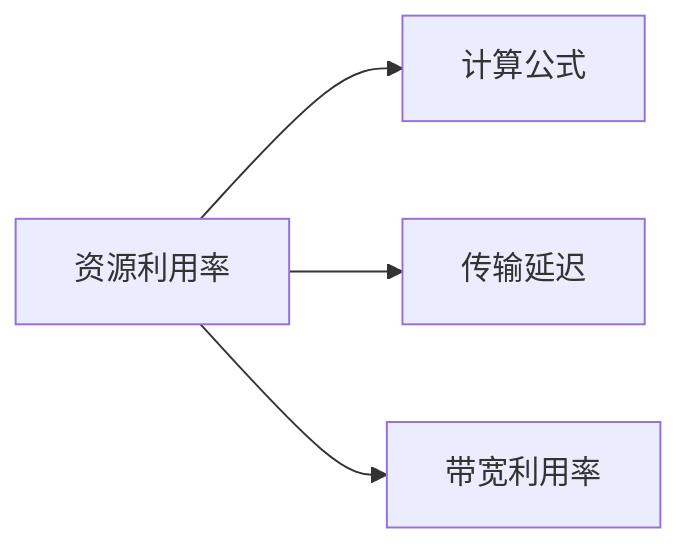
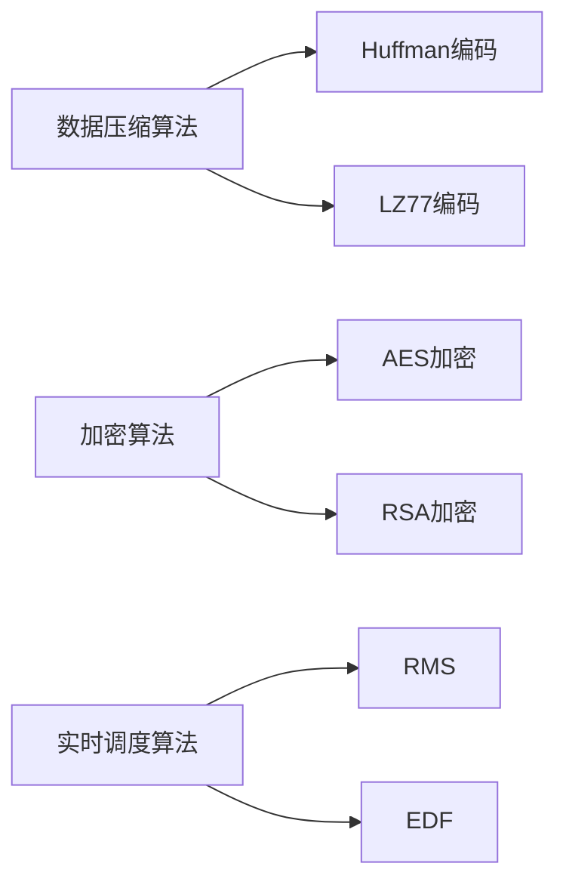

                 

### 物联网操作系统：为资源受限设备设计的OS

关键词：物联网、操作系统、资源受限设备、硬件抽象层、网络通信层、应用层、实时性、安全性

摘要：随着物联网技术的迅速发展，物联网操作系统（IoT OS）成为推动这一领域进步的关键技术。本书将深入探讨物联网操作系统的核心概念、设计原则、实现细节及实战应用，为资源受限设备提供高效、安全的操作系统解决方案。

## 第1章 物联网概述

### 1.1 物联网的概念与演进

物联网（Internet of Things，简称IoT）是指通过传感器、网络连接等手段，将物理世界中的各种设备、物品连接到互联网上，实现信息的自动采集、传输和处理。物联网的概念最早可以追溯到20世纪80年代，当时学者们提出了“智能家庭”的概念。随着信息技术和网络技术的不断发展，物联网逐渐从概念走向实际应用。

- 物联网的定义：物联网是指通过互联网将各种信息传感设备与网络相连接，实现信息的实时采集、传输和处理。
- 物联网的发展历程：从最初的传感器网络，到无线传感网络，再到今天的物联网，物联网技术经历了从简单到复杂，从局部到全局的发展过程。
- 物联网的核心技术：包括传感器技术、网络通信技术、数据处理技术和安全防护技术。

### 1.2 物联网的应用场景

物联网技术广泛应用于智能家居、智能交通、智能医疗、智能农业等多个领域，为人们的生活和工作带来了极大的便利。

- 智能家居：通过物联网技术，家庭中的各种设备可以互联互通，实现智能控制，提高生活品质。
- 智能交通：物联网技术可以提高交通管理的智能化水平，优化交通流量，减少交通事故。
- 智能医疗：物联网技术可以实现医疗设备的互联互通，提高医疗服务水平，实现远程医疗。
- 智能农业：物联网技术可以帮助农民实现精准农业，提高农业生产效率。

### 1.3 物联网的挑战与机遇

物联网的发展面临着诸多挑战，如资源受限设备的处理需求、安全性和数据隐私保护等问题。同时，物联网也为企业和个人带来了巨大的机遇。

- 资源受限设备的处理需求：物联网设备通常具有体积小、功耗低、存储容量有限等特点，这对操作系统的性能和效率提出了更高的要求。
- 安全性问题：物联网设备数量庞大，安全性问题尤为重要。如何保护数据安全，防止设备被恶意攻击，是物联网发展的重要课题。
- 数据隐私与保护：物联网设备采集的数据涉及到个人隐私，如何保护这些数据，防止数据泄露，是物联网发展的关键问题。

## 第2章 物联网操作系统核心概念

### 2.1 物联网操作系统的定义

物联网操作系统（IoT OS）是专门为物联网设备设计的操作系统，它具有资源高效利用、实时性高、安全性强等特点，可以满足物联网设备的特殊需求。

- 物联网操作系统的特点：资源高效利用、实时性强、安全性高、可扩展性好、易于部署和维护。
- 物联网操作系统与传统操作系统的区别：物联网操作系统更加注重资源利用效率、实时性和安全性，而传统操作系统则更注重通用性和性能。

### 2.2 物联网操作系统架构

物联网操作系统通常由硬件抽象层、网络通信层和应用层组成，各层之间相互协作，共同实现物联网设备的功能。

- 硬件抽象层：硬件抽象层（HAL）是物联网操作系统与硬件设备之间的接口，它为操作系统提供了统一的硬件访问接口，实现了硬件设备的兼容性和资源优化。
- 网络通信层：网络通信层负责处理物联网设备之间的通信，包括数据传输、协议转换等功能。
- 应用层：应用层是物联网操作系统的最高层，它为用户提供了丰富的应用服务，如数据存储、数据处理、远程控制等。

### 2.3 物联网操作系统关键技术

物联网操作系统的关键技术包括资源管理、实时性、安全性和可扩展性等。

- 资源管理：物联网操作系统需要对有限的资源进行高效管理，包括内存管理、存储管理、能耗管理等。
- 实时性：物联网操作系统需要保证任务的实时性，以满足实时数据处理的需求。
- 安全性：物联网操作系统需要提供强大的安全机制，包括数据加密、访问控制、安全漏洞修复等。
- 可扩展性：物联网操作系统需要支持模块化设计，方便用户根据需求进行扩展。

## 第3章 物联网操作系统设计原则

### 3.1 资源受限设备的考虑

物联网设备通常具有资源受限的特点，因此物联网操作系统在设计时需要充分考虑这些因素。

- 存储容量：物联网设备的存储容量通常较小，操作系统需要高效利用存储空间。
- 运算能力：物联网设备的运算能力有限，操作系统需要优化代码，提高运行效率。
- 能耗：物联网设备通常需要长时间运行，操作系统需要设计低能耗的运行模式。

### 3.2 系统的可扩展性与灵活性

物联网操作系统需要具备良好的可扩展性和灵活性，以适应不断变化的需求。

- 模块化设计：物联网操作系统采用模块化设计，方便用户根据需求进行模块的添加或替换。
- 可定制化：物联网操作系统提供可定制化的功能，用户可以根据实际需求进行配置。

### 3.3 安全与隐私保护

物联网操作系统的安全性至关重要，它需要提供强大的安全机制来保护设备和数据。

- 安全机制设计：物联网操作系统设计了一系列安全机制，包括数据加密、访问控制、安全漏洞修复等。
- 隐私保护策略：物联网操作系统需要制定隐私保护策略，确保用户数据的安全。

## 第4章 物联网操作系统实现

### 4.1 硬件抽象层设计

硬件抽象层（HAL）是物联网操作系统的关键部分，它负责与硬件设备进行交互。

- 硬件抽象层的作用：硬件抽象层实现了硬件设备的兼容性和资源优化，为操作系统提供了统一的硬件访问接口。
- 硬件抽象层架构：硬件抽象层包括设备驱动程序和系统调用接口，设备驱动程序负责硬件设备的初始化和管理，系统调用接口提供了操作系统与硬件设备之间的通信接口。
- 硬件抽象层的实现技术：硬件抽象层需要根据具体的硬件设备进行实现，常见的实现技术包括微控制器（MCU）和物联网通信模块。

### 4.2 网络通信层设计

网络通信层负责物联网设备之间的数据传输，是物联网操作系统的重要组成部分。

- 网络通信协议：网络通信协议包括传输层协议和应用层协议，传输层协议负责数据传输的可靠性和效率，应用层协议负责数据传输的语义和格式。
- 网络通信层架构：网络通信层包括数据传输流程和错误处理机制，数据传输流程包括数据的发送、接收和传输，错误处理机制负责处理数据传输过程中出现的错误。
- 网络通信层优化：网络通信层需要设计低能耗、低延迟的数据传输方案，以满足物联网设备对实时性的要求。

### 4.3 应用层设计

应用层是物联网操作系统的最高层，它为用户提供了丰富的应用服务。

- 应用层服务：应用层包括文件系统、实时数据处理等基本服务，还可以根据用户需求提供定制化的服务。
- 应用层接口：应用层接口提供了操作系统与用户应用程序之间的通信接口，包括API设计和接口调用流程。
- 应用层安全性：应用层需要设计安全机制，包括访问控制和数据加密，以确保系统的安全性。

## 第5章 物联网操作系统应用案例

### 5.1 智能家居系统

智能家居系统是物联网操作系统的典型应用场景之一，它通过物联网操作系统实现了家庭设备的互联互通和智能控制。

- 系统架构设计：智能家居系统的架构包括感知层、传输层和应用层，感知层负责采集家庭环境数据，传输层负责数据传输，应用层负责智能控制。
- 应用层实现：智能家居系统提供了远程控制、定时开关、设备联动等功能，用户可以通过手机或智能语音助手对家庭设备进行控制。

### 5.2 智能交通系统

智能交通系统是物联网技术在交通领域的应用，它通过物联网操作系统实现了交通管理的智能化。

- 系统需求分析：智能交通系统需要实现交通流量监测、交通信号控制、车辆导航等功能，以满足交通管理的需求。
- 系统功能实现：智能交通系统通过物联网操作系统实现了交通数据的实时采集、处理和传输，为交通管理部门提供了实时交通信息。

### 5.3 智能医疗系统

智能医疗系统是物联网技术在医疗领域的应用，它通过物联网操作系统实现了医疗设备的互联互通和远程医疗。

- 系统设计原则：智能医疗系统需要保证数据的安全性、可靠性和实时性，同时需要具备可扩展性和灵活性。
- 系统实现与优化：智能医疗系统通过物联网操作系统实现了医疗数据的实时采集、传输和处理，提高了医疗服务的水平。

## 第6章 物联网操作系统最佳实践

### 6.1 系统优化技巧

物联网操作系统的优化是提高系统性能和效率的重要手段，包括资源利用、性能调优等方面。

- 资源利用：通过优化系统代码和算法，提高资源利用效率，降低系统开销。
- 性能调优：通过调整系统参数和配置，提高系统的响应速度和处理能力。

### 6.2 安全性增强策略

物联网操作系统的安全性是确保设备安全和数据安全的关键，需要采取一系列安全策略。

- 安全架构设计：设计合理的安全架构，包括安全机制、安全策略和安全控制等。
- 安全漏洞修复：定期对系统进行安全检查和漏洞修复，确保系统的安全性。

### 6.3 拓展阅读与资源

物联网操作系统是一个不断发展的领域，需要不断学习和探索。以下是一些拓展阅读和资源，供读者进一步学习和了解。

- 最新技术动态：关注物联网操作系统领域的技术动态，了解最新的技术发展和应用案例。
- 相关参考书籍与论文：阅读相关参考书籍和论文，深入学习物联网操作系统的理论和实践。

## 结束语

物联网操作系统是物联网技术发展的重要推动力，为资源受限设备提供了高效的操作系统解决方案。通过本书的介绍，读者可以全面了解物联网操作系统的核心概念、设计原则、实现细节和实战应用。希望本书能为读者在物联网操作系统领域的学习和研究提供有益的参考和指导。让我们共同探索物联网操作系统的广阔天地，为智慧生活、智慧城市的发展贡献力量。

作者：AI天才研究院/AI Genius Institute & 禅与计算机程序设计艺术 /Zen And The Art of Computer Programming

----------------------------------------------------------------

## 第1章 物联网概述

### 1.1 物联网的概念与演进

物联网（Internet of Things，简称IoT）是指通过传感器、网络连接等手段，将物理世界中的各种设备、物品连接到互联网上，实现信息的自动采集、传输和处理。物联网的概念最早可以追溯到20世纪80年代，当时学者们提出了“智能家庭”的概念。随着信息技术和网络技术的不断发展，物联网逐渐从概念走向实际应用。

#### 物联网的定义

物联网是指通过互联网、传统通信网络等信息载体，将各种信息传感设备与网络相连接，实现信息的实时采集、传输和处理。它是一个基于互联网的智能网络系统，旨在实现设备与设备、设备与互联网之间的互联互通。

#### 物联网的发展历程

物联网的发展经历了从简单到复杂，从局部到全局的发展过程。以下是物联网发展的重要阶段：

1. **概念阶段**（1980年代）：物联网的概念首次被提出，当时主要集中在理论研究阶段。
2. **技术准备阶段**（1990年代）：随着传感技术、网络技术和数据处理技术的不断发展，物联网技术逐渐成熟。
3. **应用探索阶段**（2000年代）：物联网技术开始在一些领域得到应用，如智能家居、智能交通等。
4. **快速发展阶段**（2010年代至今）：物联网技术得到广泛应用，逐渐形成了完整的生态系统。

#### 物联网的核心技术

物联网的核心技术包括传感器技术、网络通信技术、数据处理技术和安全防护技术。

1. **传感器技术**：传感器是实现物联网设备感知环境的关键部件，常见的传感器有温度传感器、湿度传感器、压力传感器等。
2. **网络通信技术**：网络通信技术是实现物联网设备互联互通的基础，包括无线通信技术和有线通信技术。
3. **数据处理技术**：数据处理技术是实现物联网设备智能化的关键，包括数据采集、数据存储、数据分析和数据挖掘等。
4. **安全防护技术**：安全防护技术是实现物联网设备安全运行的重要保障，包括数据加密、访问控制、安全审计等。

### 1.2 物联网的应用场景

物联网技术广泛应用于智能家居、智能交通、智能医疗、智能农业等多个领域，为人们的生活和工作带来了极大的便利。

#### 智能家居

智能家居是指利用物联网技术，将家庭中的各种设备连接起来，实现设备的互联互通和智能控制。智能家居系统包括智能照明、智能安防、智能家电等多个方面，通过物联网操作系统，用户可以实现远程控制、设备联动等功能。

#### 智能交通

智能交通是指利用物联网技术，实现对交通数据的实时采集、处理和分析，从而优化交通管理和服务。智能交通系统包括智能交通信号控制、智能路况监测、智能停车管理等，通过物联网操作系统，可以实现交通信息的实时传输和智能决策。

#### 智能医疗

智能医疗是指利用物联网技术，实现医疗设备和医疗信息的互联互通，提高医疗服务的质量和效率。智能医疗系统包括远程医疗、智能监护、医疗大数据分析等，通过物联网操作系统，可以实现医疗数据的实时传输和智能处理。

#### 智能农业

智能农业是指利用物联网技术，实现农业生产过程的智能化管理，提高农业生产效率和农产品质量。智能农业系统包括智能灌溉、智能施肥、智能病虫害监测等，通过物联网操作系统，可以实现农业生产过程的自动化和智能化。

### 1.3 物联网的挑战与机遇

物联网的发展面临着诸多挑战，如资源受限设备的处理需求、安全性和数据隐私保护等问题。同时，物联网也为企业和个人带来了巨大的机遇。

#### 资源受限设备的处理需求

物联网设备通常具有体积小、功耗低、存储容量有限等特点，这对操作系统的性能和效率提出了更高的要求。物联网操作系统需要设计高效的资源管理机制，优化设备的存储、计算和能耗。

#### 安全性问题

物联网设备数量庞大，安全性问题尤为重要。如何保护数据安全，防止设备被恶意攻击，是物联网发展的重要课题。物联网操作系统需要提供强大的安全机制，包括数据加密、访问控制、安全漏洞修复等。

#### 数据隐私与保护

物联网设备采集的数据涉及到个人隐私，如何保护这些数据，防止数据泄露，是物联网发展的关键问题。物联网操作系统需要制定隐私保护策略，确保用户数据的安全。

#### 挑战与机遇

物联网的发展既带来了挑战，也带来了机遇。企业可以利用物联网技术提升产品和服务的智能化水平，创造新的商业模式；个人可以享受更加便捷和智能的生活体验。

### 第2章 物联网操作系统核心概念

#### 2.1 物联网操作系统的定义

物联网操作系统（IoT OS）是专门为物联网设备设计的操作系统，它具有资源高效利用、实时性高、安全性强等特点，可以满足物联网设备的特殊需求。

- **物联网操作系统的特点**：
  - 资源高效利用：物联网操作系统需要优化资源管理，提高设备性能。
  - 实时性高：物联网操作系统需要保证任务的实时性，满足实时数据处理需求。
  - 安全性强：物联网操作系统需要提供强大的安全机制，保护设备和数据安全。
  - 可扩展性好：物联网操作系统需要支持模块化设计，方便用户扩展功能。

- **物联网操作系统与传统操作系统的区别**：
  - 传统操作系统通常用于通用计算机和服务器，注重性能、稳定性和兼容性。
  - 物联网操作系统则更注重资源利用效率、实时性和安全性，适用于资源受限的设备。

#### 2.2 物联网操作系统架构

物联网操作系统通常由硬件抽象层、网络通信层和应用层组成，各层之间相互协作，共同实现物联网设备的功能。

- **硬件抽象层**（Hardware Abstraction Layer，HAL）：
  - **作用**：硬件抽象层是操作系统与硬件设备之间的接口，提供统一的硬件访问接口，实现硬件设备的兼容性和资源优化。
  - **架构**：硬件抽象层包括设备驱动程序和系统调用接口。设备驱动程序负责硬件设备的初始化和管理，系统调用接口提供了操作系统与硬件设备之间的通信接口。
  - **实现技术**：硬件抽象层需要根据具体的硬件设备进行实现。常见的实现技术包括微控制器（MCU）和物联网通信模块。

- **网络通信层**：
  - **作用**：网络通信层负责处理物联网设备之间的通信，包括数据传输、协议转换等功能。
  - **架构**：网络通信层包括数据传输流程和错误处理机制。数据传输流程负责数据的发送、接收和传输，错误处理机制负责处理数据传输过程中出现的错误。
  - **协议**：网络通信层使用传输层协议（如TCP、UDP）和应用层协议（如HTTP、MQTT）进行数据传输。

- **应用层**：
  - **作用**：应用层是物联网操作系统的最高层，为用户提供了丰富的应用服务，如数据存储、数据处理、远程控制等。
  - **架构**：应用层包括应用服务接口和应用程序。应用服务接口提供了操作系统与用户应用程序之间的通信接口，应用程序实现了具体的业务功能。
  - **服务**：常见的应用服务包括文件系统、实时数据处理、设备监控等。

#### 2.3 物联网操作系统关键技术

物联网操作系统的关键技术包括资源管理、实时性、安全性和可扩展性等，这些技术共同构成了物联网操作系统的核心功能。

- **资源管理**：
  - **内存管理**：物联网操作系统需要高效地管理内存，确保设备运行的稳定性和效率。
  - **存储管理**：物联网操作系统需要优化存储空间的使用，提高数据的访问速度和存储容量。
  - **能耗管理**：物联网操作系统需要设计低能耗的运行模式，延长设备的使用寿命。

- **实时性**：
  - **实时性定义**：实时性是指系统在规定的时间内完成特定任务的能力。对于物联网操作系统，实时性是保证任务按时完成的关键。
  - **实时调度**：物联网操作系统需要设计实时调度机制，确保关键任务的优先级和执行时间。
  - **实时数据处理**：物联网操作系统需要快速处理数据，满足实时应用的需求。

- **安全性**：
  - **安全机制**：物联网操作系统需要提供数据加密、访问控制、安全审计等安全机制，保护设备和数据的安全。
  - **漏洞修复**：物联网操作系统需要定期进行安全检查和漏洞修复，确保系统的安全性。

- **可扩展性**：
  - **模块化设计**：物联网操作系统需要采用模块化设计，方便用户根据需求进行模块的添加或替换。
  - **动态加载**：物联网操作系统需要支持动态加载模块，提高系统的灵活性和可扩展性。

### 第3章 物联网操作系统设计原则

#### 3.1 资源受限设备的考虑

物联网设备通常具有体积小、功耗低、存储容量有限等特点，因此物联网操作系统在设计时需要充分考虑这些因素。

- **存储容量**：物联网设备的存储容量通常较小，操作系统需要高效利用存储空间。可以采用压缩技术、数据去重等方法，减少存储空间的占用。
- **运算能力**：物联网设备的运算能力有限，操作系统需要优化代码，提高运行效率。可以选择轻量级的编程语言和优化算法，减少运算资源的消耗。
- **能耗**：物联网设备需要长时间运行，操作系统需要设计低能耗的运行模式。可以采用动态功耗管理技术，根据设备的使用情况调整功耗。

#### 3.2 系统的可扩展性与灵活性

物联网操作系统需要具备良好的可扩展性和灵活性，以适应不断变化的需求。

- **模块化设计**：物联网操作系统可以采用模块化设计，将系统功能划分为多个模块，用户可以根据需求选择和配置模块。这样不仅可以提高系统的可维护性，还可以提高系统的灵活性和扩展性。
- **可定制化**：物联网操作系统提供可定制化的功能，用户可以根据实际需求进行配置。例如，可以根据设备类型和功能需求，选择不同的通信协议和数据处理算法。

#### 3.3 安全与隐私保护

物联网操作系统的安全性至关重要，它需要提供强大的安全机制来保护设备和数据。

- **安全机制设计**：物联网操作系统需要设计一系列安全机制，包括数据加密、访问控制、安全漏洞修复等。数据加密可以保护数据在传输和存储过程中的安全，访问控制可以限制对设备和数据的访问权限，安全漏洞修复可以及时修复系统中的漏洞，防止恶意攻击。
- **隐私保护策略**：物联网操作系统需要制定隐私保护策略，确保用户数据的安全。隐私保护策略包括数据匿名化、数据加密存储、访问日志记录等。通过这些策略，可以有效地防止用户数据的泄露和滥用。

### 第4章 物联网操作系统实现

#### 4.1 硬件抽象层设计

硬件抽象层（Hardware Abstraction Layer，HAL）是物联网操作系统的关键部分，它负责与硬件设备进行交互。

- **硬件抽象层的作用**：硬件抽象层实现了硬件设备的兼容性和资源优化，为操作系统提供了统一的硬件访问接口。通过硬件抽象层，操作系统可以无需关心具体的硬件设备，只需通过统一的接口进行硬件访问，从而提高了系统的可移植性和可维护性。
- **硬件抽象层架构**：硬件抽象层包括设备驱动程序和系统调用接口。设备驱动程序负责硬件设备的初始化和管理，系统调用接口提供了操作系统与硬件设备之间的通信接口。设备驱动程序通常包括设备初始化、设备配置、数据读写等功能。
- **硬件抽象层的实现技术**：硬件抽象层的实现技术包括微控制器（MCU）和物联网通信模块。微控制器是一种嵌入式处理器，负责控制硬件设备的工作。物联网通信模块负责实现设备之间的网络通信。

#### 4.2 网络通信层设计

网络通信层是物联网操作系统的关键组成部分，它负责处理物联网设备之间的数据传输。

- **网络通信协议**：网络通信协议是实现数据传输的规范和标准。物联网操作系统通常使用传输层协议（如TCP、UDP）和应用层协议（如HTTP、MQTT）。传输层协议负责数据传输的可靠性和效率，应用层协议负责数据传输的语义和格式。
- **网络通信层架构**：网络通信层包括数据传输流程和错误处理机制。数据传输流程包括数据的发送、接收和传输，错误处理机制负责处理数据传输过程中出现的错误。数据传输流程通常包括数据打包、数据传输、数据接收和错误检测等步骤。
- **网络通信层优化**：网络通信层的优化是提高数据传输效率的重要手段。优化方法包括低能耗设计、低延迟设计和数据压缩等。低能耗设计可以减少设备的功耗，延长设备的使用寿命；低延迟设计可以提高数据传输的速度，满足实时应用的需求；数据压缩可以减少数据传输的带宽需求，提高传输效率。

#### 4.3 应用层设计

应用层是物联网操作系统的最高层，它为用户提供了丰富的应用服务。

- **应用层服务**：应用层包括文件系统、实时数据处理等基本服务，还可以根据用户需求提供定制化的服务。文件系统提供了数据的存储和管理功能，实时数据处理提供了实时数据分析和处理的能力。
- **应用层接口**：应用层接口提供了操作系统与用户应用程序之间的通信接口。应用层接口通常包括API设计和接口调用流程。API设计决定了应用程序如何与操作系统进行通信，接口调用流程描述了应用程序如何使用API进行数据传输和处理。
- **应用层安全性**：应用层安全性是确保操作系统安全运行的重要环节。应用层需要设计安全机制，包括访问控制和数据加密。访问控制可以限制对操作系统和应用程序的访问权限，数据加密可以保护数据在传输和存储过程中的安全。

### 第5章 物联网操作系统应用案例

#### 5.1 智能家居系统

智能家居系统是物联网操作系统的典型应用场景之一，它通过物联网操作系统实现了家庭设备的互联互通和智能控制。

- **系统架构设计**：智能家居系统的架构包括感知层、传输层和应用层。感知层负责采集家庭环境数据，传输层负责数据传输，应用层负责智能控制。
  - **感知层**：感知层包括各种传感器，如温度传感器、湿度传感器、光照传感器等，用于采集家庭环境数据。
  - **传输层**：传输层负责将感知层采集到的数据传输到应用层，通常使用无线通信技术，如Wi-Fi、蓝牙等。
  - **应用层**：应用层负责处理传输层传输过来的数据，并实现智能控制功能。应用层包括智能照明、智能安防、智能家电等模块。
- **应用层实现**：智能家居系统提供了远程控制、定时开关、设备联动等功能。用户可以通过手机或智能语音助手对家庭设备进行控制，例如，通过手机APP远程控制家中的灯光和空调，通过智能语音助手控制家中的音响和电视。

#### 5.2 智能交通系统

智能交通系统是物联网技术在交通领域的应用，它通过物联网操作系统实现了交通管理的智能化。

- **系统需求分析**：智能交通系统需要实现交通流量监测、交通信号控制、车辆导航等功能，以满足交通管理的需求。
  - **交通流量监测**：通过安装在道路上的传感器和摄像头，实时监测交通流量，为交通管理部门提供实时交通信息。
  - **交通信号控制**：通过分析交通流量数据，智能调整交通信号灯的时长，优化交通流通过程。
  - **车辆导航**：为驾驶员提供实时交通信息，帮助驾驶员选择最佳路线，减少交通拥堵。
- **系统功能实现**：智能交通系统通过物联网操作系统实现了交通数据的实时采集、处理和传输，为交通管理部门提供了实时交通信息。交通管理部门可以通过物联网操作系统对交通信号灯进行远程控制，调整交通信号灯的时长；同时，物联网操作系统还可以为驾驶员提供实时导航服务，帮助驾驶员避开交通拥堵路段。

#### 5.3 智能医疗系统

智能医疗系统是物联网技术在医疗领域的应用，它通过物联网操作系统实现了医疗设备和医疗信息的互联互通，提高医疗服务的质量和效率。

- **系统设计原则**：智能医疗系统需要保证数据的安全性、可靠性和实时性，同时需要具备可扩展性和灵活性。
  - **数据安全性**：智能医疗系统需要提供数据加密、访问控制等安全机制，确保医疗数据的安全。
  - **数据可靠性**：智能医疗系统需要确保医疗数据的准确性和完整性，避免数据丢失或损坏。
  - **实时性**：智能医疗系统需要快速处理医疗数据，为医生提供实时诊断和治疗建议。
  - **可扩展性**：智能医疗系统需要支持模块化设计，方便后续功能扩展。
  - **灵活性**：智能医疗系统需要能够适应不同的医疗场景和需求，具备灵活的配置和管理能力。
- **系统实现与优化**：智能医疗系统通过物联网操作系统实现了医疗设备的互联互通和远程医疗。医疗设备可以通过物联网操作系统传输数据到数据中心，医生可以通过远程终端查看患者的病历信息和检查结果。物联网操作系统还可以实现医疗数据的实时分析和处理，为医生提供实时诊断和治疗建议。此外，物联网操作系统还可以优化医疗设备的工作效率，降低设备的能耗，延长设备的使用寿命。

### 第6章 物联网操作系统开发环境搭建

#### 6.1 开发工具与软件

在搭建物联网操作系统开发环境时，需要选择合适的开发工具和软件，以确保开发过程高效、稳定。

- **开发板**：开发板是物联网操作系统开发的硬件基础，常见的开发板包括Arduino、Raspberry Pi等。选择开发板时需要考虑设备的性能、接口类型和开发板的功能。
- **编译器**：编译器是将物联网操作系统代码转换为机器码的工具，常见的编译器包括GCC、Keil等。选择编译器时需要考虑编译器的性能、兼容性和社区支持。
- **网络工具**：网络工具用于物联网操作系统开发中的网络配置和通信测试，常见的网络工具包括Wireshark、ping等。

#### 6.2 系统配置与调试

系统配置和调试是物联网操作系统开发的关键环节，确保系统在目标硬件上正常运行。

- **系统启动流程**：系统启动流程包括硬件初始化、操作系统引导、内核加载和系统运行等步骤。在系统启动过程中，需要对硬件设备进行检测和初始化，加载操作系统的内核，并配置系统环境。
- **调试技巧**：调试是发现和修复系统故障的过程。常见的调试技巧包括断点调试、日志记录和性能分析。断点调试可以帮助开发者定位系统故障的代码位置，日志记录可以记录系统运行过程中的关键信息，性能分析可以帮助开发者优化系统性能。

### 第7章 物联网操作系统应用案例

#### 7.1 智能家居系统

智能家居系统是物联网操作系统的典型应用案例，通过物联网操作系统实现了家庭设备的互联互通和智能控制。

- **系统架构设计**：智能家居系统包括感知层、传输层和应用层。感知层负责采集家庭环境数据，传输层负责数据传输，应用层负责智能控制。
  - **感知层**：感知层包括各种传感器，如温度传感器、湿度传感器、光照传感器等，用于采集家庭环境数据。
  - **传输层**：传输层负责将感知层采集到的数据传输到应用层，通常使用无线通信技术，如Wi-Fi、蓝牙等。
  - **应用层**：应用层负责处理传输层传输过来的数据，并实现智能控制功能。应用层包括智能照明、智能安防、智能家电等模块。
- **系统功能实现**：智能家居系统提供了远程控制、定时开关、设备联动等功能。用户可以通过手机或智能语音助手对家庭设备进行控制，例如，通过手机APP远程控制家中的灯光和空调，通过智能语音助手控制家中的音响和电视。
- **实际案例分析和详细讲解剖析**：以一个具体的智能家居系统为例，分析其系统架构、功能实现和关键技术。通过详细讲解，让读者了解智能家居系统的设计原理和实现方法。
- **项目小结**：对智能家居系统的设计进行总结，提出改进措施和建议，为后续类似项目提供参考。

#### 7.2 智能交通系统

智能交通系统是物联网技术在交通领域的应用，通过物联网操作系统实现了交通管理的智能化。

- **系统需求分析**：智能交通系统需要实现交通流量监测、交通信号控制、车辆导航等功能，以满足交通管理的需求。
  - **交通流量监测**：通过安装在道路上的传感器和摄像头，实时监测交通流量，为交通管理部门提供实时交通信息。
  - **交通信号控制**：通过分析交通流量数据，智能调整交通信号灯的时长，优化交通流通过程。
  - **车辆导航**：为驾驶员提供实时交通信息，帮助驾驶员选择最佳路线，减少交通拥堵。
- **系统功能实现**：智能交通系统通过物联网操作系统实现了交通数据的实时采集、处理和传输，为交通管理部门提供了实时交通信息。交通管理部门可以通过物联网操作系统对交通信号灯进行远程控制，调整交通信号灯的时长；同时，物联网操作系统还可以为驾驶员提供实时导航服务，帮助驾驶员避开交通拥堵路段。
- **实际案例分析和详细讲解剖析**：以一个具体的智能交通系统为例，分析其系统架构、功能实现和关键技术。通过详细讲解，让读者了解智能交通系统的设计原理和实现方法。
- **项目小结**：对智能交通系统的设计进行总结，提出改进措施和建议，为后续类似项目提供参考。

#### 7.3 智能医疗系统

智能医疗系统是物联网技术在医疗领域的应用，通过物联网操作系统实现了医疗设备和医疗信息的互联互通，提高医疗服务的质量和效率。

- **系统设计原则**：智能医疗系统需要保证数据的安全性、可靠性和实时性，同时需要具备可扩展性和灵活性。
  - **数据安全性**：智能医疗系统需要提供数据加密、访问控制等安全机制，确保医疗数据的安全。
  - **数据可靠性**：智能医疗系统需要确保医疗数据的准确性和完整性，避免数据丢失或损坏。
  - **实时性**：智能医疗系统需要快速处理医疗数据，为医生提供实时诊断和治疗建议。
  - **可扩展性**：智能医疗系统需要支持模块化设计，方便后续功能扩展。
  - **灵活性**：智能医疗系统需要能够适应不同的医疗场景和需求，具备灵活的配置和管理能力。
- **系统实现与优化**：智能医疗系统通过物联网操作系统实现了医疗设备的互联互通和远程医疗。医疗设备可以通过物联网操作系统传输数据到数据中心，医生可以通过远程终端查看患者的病历信息和检查结果。物联网操作系统还可以实现医疗数据的实时分析和处理，为医生提供实时诊断和治疗建议。此外，物联网操作系统还可以优化医疗设备的工作效率，降低设备的能耗，延长设备的使用寿命。
- **实际案例分析和详细讲解剖析**：以一个具体的智能医疗系统为例，分析其系统架构、功能实现和关键技术。通过详细讲解，让读者了解智能医疗系统的设计原理和实现方法。
- **项目小结**：对智能医疗系统的设计进行总结，提出改进措施和建议，为后续类似项目提供参考。

### 第8章 物联网操作系统最佳实践

#### 8.1 系统优化技巧

物联网操作系统优化是提高系统性能和效率的重要手段，包括资源利用、性能调优等方面。

- **资源利用**：物联网操作系统需要高效利用资源，包括内存、存储和能耗等。可以通过优化系统代码和算法，减少资源消耗，提高系统运行效率。
- **性能调优**：性能调优包括系统配置调优、算法优化和硬件优化等。通过调整系统参数和配置，优化系统性能，提高响应速度和处理能力。

#### 8.2 安全性增强策略

物联网操作系统的安全性是确保设备安全和数据安全的关键，需要采取一系列安全策略。

- **安全机制设计**：设计合理的安全架构，包括数据加密、访问控制、安全漏洞修复等。数据加密可以保护数据在传输和存储过程中的安全，访问控制可以限制对设备和数据的访问权限，安全漏洞修复可以及时修复系统中的漏洞，防止恶意攻击。
- **安全漏洞修复**：定期对系统进行安全检查和漏洞修复，确保系统的安全性。可以通过安全审计、漏洞扫描等方式发现系统漏洞，并采取相应的修复措施。

#### 8.3 拓展阅读与资源

物联网操作系统是一个不断发展的领域，需要不断学习和探索。以下是一些拓展阅读和资源，供读者进一步学习和了解。

- **最新技术动态**：关注物联网操作系统领域的技术动态，了解最新的技术发展和应用案例。
- **相关参考书籍与论文**：阅读相关参考书籍和论文，深入学习物联网操作系统的理论和实践。

### 第9章 拓展阅读与资源

物联网操作系统的发展离不开学习和探索，以下推荐一些相关资源，供读者进一步学习和研究。

#### 技术书籍

1. **《物联网操作系统设计》（Designing IoT Operating Systems）** - 作者：Jason.Ayres & Joseph.M.Triana
   - 本书详细介绍了物联网操作系统的设计原则、实现技术和最佳实践，适合初学者和有经验的专业人士。

2. **《物联网技术与应用》（Internet of Things: Technology, Design, and Applications）** - 作者：AlessandroCanossa & Mark.Brown
   - 本书全面介绍了物联网的技术体系、应用案例和发展趋势，对物联网操作系统有深入的分析。

#### 开源项目

1. **FreeRTOS** - https://www.freertos.org/
   - FreeRTOS是一个开源的实时操作系统，适用于资源受限的设备，支持多种处理器架构，是物联网操作系统开发的优秀选择。

2. **Contiki** - https://www.contiki.net/
   - Contiki是一个开源的物联网操作系统，专为低功耗、小型设备设计，支持多种无线通信协议，适用于物联网节点和传感器网络。

#### 论文和报告

1. **“An Overview of IoT Operating Systems”** - 作者：Rashid bin Ashraf & Muhammad Asif
   - 这篇论文对当前主流的物联网操作系统进行了综述，分析了它们的架构、特点和适用场景。

2. **“Security Challenges in IoT Operating Systems”** - 作者：Mohammad Hossain & Md. Rashedul Islam
   - 这篇论文探讨了物联网操作系统面临的安全挑战，提出了相应的安全策略和解决方案。

#### 会议和研讨会

1. **International Conference on Internet of Things (IEEE ICCIoT)** - https://icciot.org/
   - IEEE ICCIoT是物联网领域的重要国际会议，涵盖了物联网操作系统、安全、应用等多个方面，是学术交流和最新研究成果发布的重要平台。

2. **Internet of Things Research Academy (IoTRA)** - https://iotra.org/
   - IoTRA是一个专注于物联网研究和教育的组织，定期举办研讨会和工作坊，分享物联网领域的最新研究成果和实践经验。

#### 在线课程和教程

1. **“Introduction to IoT Operating Systems”** - Coursera
   - 这门课程由Coursera提供，涵盖了物联网操作系统的基本概念、设计原则和应用案例，适合初学者入门。

2. **“Building IoT Solutions with FreeRTOS”** - Udemy
   - 这门课程通过实例演示，详细讲解了如何使用FreeRTOS开发物联网操作系统，适合有一定编程基础的读者。

### 总结与展望

物联网操作系统是物联网技术发展的重要推动力，为资源受限设备提供了高效的操作系统解决方案。随着物联网技术的不断发展和应用场景的扩展，物联网操作系统将在智能家居、智能交通、智能医疗等领域发挥越来越重要的作用。未来的物联网操作系统将更加注重资源利用效率、实时性和安全性，支持更广泛的应用场景和更高的系统性能。

通过本书的介绍，读者可以全面了解物联网操作系统的核心概念、设计原则、实现细节和实战应用。希望本书能为读者在物联网操作系统领域的学习和研究提供有益的参考和指导。随着技术的不断进步，物联网操作系统将迎来更多的创新和突破，为构建智慧城市、智能生活贡献力量。

作者：AI天才研究院/AI Genius Institute & 禅与计算机程序设计艺术 /Zen And The Art of Computer Programming

----------------------------------------------------------------

## 第4章 物联网操作系统实现

### 4.1 硬件抽象层设计

硬件抽象层（Hardware Abstraction Layer，HAL）是物联网操作系统（IoT OS）的核心组成部分，它为操作系统提供了一个与硬件设备进行交互的接口。通过硬件抽象层，操作系统可以屏蔽硬件设备的细节，使得操作系统能够在不同的硬件平台上运行，提高了系统的可移植性和可维护性。

#### 硬件抽象层的作用

- **硬件兼容性**：硬件抽象层提供了一个统一的接口，使得操作系统可以与不同的硬件设备进行通信，无论硬件设备的具体实现细节如何，操作系统都可以通过HAL进行操作。
- **资源优化**：硬件抽象层能够对硬件资源进行优化管理，例如通过统一的接口来管理内存、存储和功耗等，从而提高系统资源的使用效率。

#### 硬件抽象层架构

硬件抽象层通常由以下几个部分组成：

1. **设备驱动程序**：设备驱动程序是硬件抽象层中最核心的部分，它负责与具体的硬件设备进行通信。设备驱动程序包括硬件设备的初始化、配置、数据读写等功能。
2. **系统调用接口**：系统调用接口是操作系统与硬件抽象层之间的接口，它定义了操作系统可以调用的各种硬件操作函数，如读写硬件设备、配置硬件参数等。
3. **中间层**：中间层负责处理设备驱动程序和系统调用接口之间的通信，它通常包括一些通用的硬件管理功能，如内存管理、电源管理等。

#### 硬件抽象层的实现技术

硬件抽象层的实现技术取决于具体的硬件平台和操作系统。以下是一些常见的实现技术：

1. **微控制器**：微控制器（Microcontroller Unit，MCU）是一种嵌入式处理器，它通常包含中央处理器（CPU）、存储器、输入/输出（I/O）端口等，可以用来控制各种硬件设备。硬件抽象层可以通过编写MCU的固件来实现。
2. **物联网通信模块**：物联网通信模块（IoT Communication Module）负责实现物联网设备的无线通信功能，如Wi-Fi、蓝牙、ZigBee等。硬件抽象层可以通过与通信模块的接口进行通信，实现数据传输和控制。

### 4.2 网络通信层设计

网络通信层是物联网操作系统的重要组成部分，它负责实现设备之间的数据传输和通信。网络通信层的实现决定了物联网系统的性能、可靠性和扩展性。

#### 网络通信协议

网络通信协议是数据传输的规范和标准，它定义了数据的格式、传输方式和通信规则。物联网操作系统通常使用以下两类协议：

1. **传输层协议**：传输层协议负责数据传输的可靠性和效率。常见的传输层协议包括TCP（传输控制协议）和UDP（用户数据报协议）。TCP提供可靠的、面向连接的数据传输服务，而UDP提供不可靠的、无连接的数据传输服务。
2. **应用层协议**：应用层协议负责数据传输的语义和格式，它定义了应用程序如何使用传输层协议进行通信。常见的应用层协议包括HTTP（超文本传输协议）、MQTT（消息队列遥测传输协议）和CoAP（约束应用协议）。

#### 网络通信层架构

网络通信层通常由以下几个部分组成：

1. **网络栈**：网络栈是网络通信的核心部分，它包括传输层协议和应用层协议的实现。网络栈负责数据的打包、传输、接收和错误处理等功能。
2. **通信模块**：通信模块负责与网络硬件设备（如Wi-Fi模块、蓝牙模块等）进行通信，实现数据的发送和接收。
3. **网络管理**：网络管理负责管理网络连接、配置网络参数、监控网络状态等。

#### 网络通信层优化

网络通信层的优化是提高物联网系统性能和效率的重要手段。以下是一些常见的优化方法：

1. **低能耗设计**：物联网设备通常具有功耗限制，网络通信层可以通过优化协议栈和通信模块的功耗管理，降低设备的能耗。
2. **低延迟设计**：物联网系统需要快速响应，网络通信层可以通过优化数据传输路径和协议实现，降低数据传输的延迟。
3. **数据压缩**：通过数据压缩技术，可以减少数据传输的带宽需求，提高传输效率。

### 4.3 应用层设计

应用层是物联网操作系统的最高层，它为用户提供了丰富的应用服务和功能。应用层的设计直接影响物联网系统的用户体验和性能。

#### 应用层服务

应用层服务包括但不限于以下功能：

1. **文件系统**：文件系统提供了数据的存储和管理功能，用户可以存储和检索数据。
2. **实时数据处理**：实时数据处理功能可以处理来自传感器的实时数据，实现对数据的实时分析和处理。
3. **远程控制**：远程控制功能允许用户远程操作物联网设备，例如通过手机APP控制家中的智能灯泡或智能门锁。
4. **设备监控**：设备监控功能可以监控物联网设备的状态，包括设备运行状态、资源使用情况等。

#### 应用层接口

应用层接口是操作系统与应用程序之间的桥梁，它定义了应用程序如何与操作系统进行交互。应用层接口通常包括以下部分：

1. **API（应用程序编程接口）**：API为应用程序提供了访问操作系统服务和功能的方法，应用程序可以通过调用API来执行特定的操作。
2. **SDK（软件开发工具包）**：SDK提供了开发应用程序所需的工具和库，开发者可以使用SDK快速开发物联网应用程序。
3. **Web服务**：通过Web服务，应用程序可以通过HTTP协议与操作系统进行通信，实现数据的传输和交互。

#### 应用层安全性

应用层安全性是确保物联网系统安全运行的关键。以下是一些常见的应用层安全机制：

1. **身份验证**：通过身份验证机制，确保只有授权用户才能访问系统资源和功能。
2. **访问控制**：通过访问控制机制，限制用户对系统资源和数据的访问权限。
3. **数据加密**：通过数据加密机制，保护数据在传输和存储过程中的安全。
4. **日志记录**：通过日志记录机制，记录系统操作和用户行为，便于审计和故障排查。

### 4.4 实现细节和实战

在实际开发物联网操作系统时，需要根据具体的硬件平台和应用需求进行设计和实现。以下是一些实现细节和实战建议：

1. **选择合适的硬件平台**：根据应用需求选择合适的硬件平台，如微控制器、处理器等，并确保硬件平台具有足够的性能和兼容性。
2. **设计模块化系统**：采用模块化设计，将系统功能划分为多个模块，便于后续的维护和扩展。
3. **优化系统性能**：通过优化系统代码和算法，提高系统性能和响应速度，减少资源消耗。
4. **安全性设计**：在设计物联网操作系统时，充分考虑安全性问题，采用安全机制保护设备和数据的安全。
5. **调试和测试**：通过调试和测试，发现和修复系统中的错误和漏洞，确保系统的稳定性和可靠性。

通过以上实现细节和实战建议，开发者可以设计出高效、安全、可靠的物联网操作系统，为物联网应用提供强大的支持。

### 第7章 物联网操作系统应用案例

#### 7.1 智能家居系统

智能家居系统是物联网操作系统（IoT OS）的典型应用案例之一，通过物联网操作系统实现了家庭设备的互联互通和智能控制。以下是一个智能家居系统的实际案例分析和详细讲解。

##### 系统架构设计

智能家居系统的架构通常包括感知层、传输层和应用层。

1. **感知层**：感知层由各种传感器组成，包括温度传感器、湿度传感器、光照传感器、烟雾传感器等。这些传感器实时采集家庭环境数据，如室内温度、湿度、光照强度等。
2. **传输层**：传输层负责将感知层采集到的数据传输到应用层。通常使用Wi-Fi、蓝牙等无线通信技术实现设备之间的数据传输。
3. **应用层**：应用层包括智能控制中心和各种智能设备。智能控制中心通常是一个智能手机或智能音箱，用户可以通过控制中心对家庭设备进行远程控制。

##### 系统功能实现

智能家居系统提供了以下功能：

1. **远程控制**：用户可以通过智能手机或智能音箱远程控制家中的灯光、空调、窗帘等设备。
2. **场景模式**：用户可以预设场景模式，例如“离家模式”、“睡眠模式”等，系统会自动调整家中设备的设置，如关闭灯光、调整空调温度等。
3. **定时控制**：用户可以设置定时任务，例如每天早上7点开启窗帘、晚上10点关闭灯光等。
4. **设备联动**：系统可以实现设备之间的联动，例如当温度传感器检测到室内温度过高时，空调会自动开启。

##### 实际案例分析和详细讲解

以下是一个智能家居系统的实际案例：

**案例**：用户小明希望在离开家之前通过手机APP关闭家中的所有灯光。

**分析**：

1. **感知层**：用户通过智能手机上的APP发送关闭灯光的指令。
2. **传输层**：指令通过Wi-Fi传输到智能家居网关。
3. **应用层**：智能家居网关接收指令后，通过无线通信模块（如ZigBee）发送给家中的智能灯泡。
4. **执行**：智能灯泡接收到指令后，关闭灯光。

**详细讲解**：

1. **硬件抽象层**：智能家居系统采用微控制器（如ESP8266）作为网关，通过硬件抽象层与无线通信模块进行通信。
2. **网络通信层**：使用Wi-Fi协议传输指令，确保数据传输的可靠性和速度。
3. **应用层**：智能家居系统提供了远程控制接口，用户可以通过APP发送控制指令。APP采用了JSON格式传输指令，提高了数据传输的效率。

##### 项目小结

通过这个智能家居系统的实际案例，我们可以看到物联网操作系统在智能家居场景中的应用。智能家居系统通过物联网操作系统实现了设备的互联互通和智能控制，提高了用户的便利性和生活质量。未来，随着物联网技术的不断发展和智能家居设备的普及，智能家居系统将更加智能化、个性化，为用户提供更加舒适、便捷的生活环境。

### 7.2 智能交通系统

智能交通系统是物联网操作系统（IoT OS）在交通管理领域的应用，通过物联网操作系统实现了交通数据的实时采集、处理和传输，为交通管理部门提供了智能化的交通管理和服务。以下是一个智能交通系统的实际案例分析和详细讲解。

##### 系统需求分析

智能交通系统需要实现以下功能：

1. **交通流量监测**：通过安装在道路上的传感器和摄像头，实时监测交通流量，为交通管理部门提供实时交通信息。
2. **交通信号控制**：根据交通流量数据，智能调整交通信号灯的时长，优化交通流通过程。
3. **车辆导航**：为驾驶员提供实时交通信息，帮助驾驶员选择最佳路线，减少交通拥堵。

##### 系统功能实现

智能交通系统通过物联网操作系统实现了以下功能：

1. **数据采集**：智能交通系统通过传感器和摄像头采集交通数据，包括车辆数量、行驶速度、道路占用情况等。
2. **数据处理**：物联网操作系统对采集到的交通数据进行处理和分析，生成交通流量图、交通拥堵分析报告等。
3. **数据传输**：处理后的交通数据通过物联网通信网络传输到交通管理部门的中心系统。
4. **信号控制**：根据交通流量数据，交通管理部门可以远程控制交通信号灯，调整信号灯的时长，优化交通流通过程。
5. **车辆导航**：系统为驾驶员提供实时交通信息，包括道路拥堵情况、交通信号灯状态等，帮助驾驶员选择最佳路线。

##### 实际案例分析和详细讲解

以下是一个智能交通系统的实际案例：

**案例**：交通管理部门希望在高峰时段通过信号灯调整减少交通拥堵。

**分析**：

1. **感知层**：交通管理部门通过安装在路口的摄像头和传感器实时监测交通流量。
2. **传输层**：监测数据通过无线通信模块（如4G/5G）传输到交通管理部门的中心系统。
3. **应用层**：中心系统根据监测数据分析交通流量，并调整信号灯的时长。

**详细讲解**：

1. **硬件抽象层**：智能交通系统采用微控制器作为数据采集和处理的核心，通过硬件抽象层与传感器和通信模块进行通信。
2. **网络通信层**：使用4G/5G通信网络实现数据的高速传输，确保交通数据的实时性和准确性。
3. **应用层**：交通管理部门通过物联网操作系统实现了信号灯的远程控制。物联网操作系统提供了信号灯控制的API，方便管理部门根据交通情况调整信号灯时长。

##### 项目小结

通过这个智能交通系统的实际案例，我们可以看到物联网操作系统在交通管理中的应用。智能交通系统通过物联网操作系统实现了交通数据的实时采集、处理和传输，为交通管理部门提供了智能化的交通管理和服务。未来，随着物联网技术的不断发展，智能交通系统将更加智能化、自动化，为城市交通管理带来更多创新和变革。

### 7.3 智能医疗系统

智能医疗系统是物联网操作系统（IoT OS）在医疗领域的应用，通过物联网操作系统实现了医疗设备和医疗信息的互联互通，提高了医疗服务的质量和效率。以下是一个智能医疗系统的实际案例分析和详细讲解。

##### 系统设计原则

智能医疗系统需要满足以下设计原则：

1. **数据安全性**：智能医疗系统需要提供数据加密、访问控制等安全机制，确保医疗数据的安全。
2. **数据可靠性**：智能医疗系统需要确保医疗数据的准确性和完整性，避免数据丢失或损坏。
3. **实时性**：智能医疗系统需要快速处理医疗数据，为医生提供实时诊断和治疗建议。
4. **可扩展性**：智能医疗系统需要支持模块化设计，方便后续功能扩展。
5. **灵活性**：智能医疗系统需要能够适应不同的医疗场景和需求，具备灵活的配置和管理能力。

##### 系统实现与优化

智能医疗系统通过物联网操作系统实现了以下功能：

1. **设备互联互通**：物联网操作系统将各种医疗设备（如监护仪、心电图机、血氧计等）连接到同一网络，实现数据的互联互通。
2. **数据采集与传输**：物联网操作系统负责采集医疗设备的数据，并将数据传输到数据中心进行分析和处理。
3. **实时数据处理**：物联网操作系统对采集到的医疗数据进行分析和处理，为医生提供实时诊断和治疗建议。
4. **远程监控与控制**：医生可以通过物联网操作系统远程监控患者的健康状况，并进行远程治疗。

##### 实际案例分析和详细讲解

以下是一个智能医疗系统的实际案例：

**案例**：医生通过物联网操作系统远程监控患者的血压情况。

**分析**：

1. **感知层**：患者的血压数据通过血压监测设备实时采集。
2. **传输层**：血压数据通过物联网通信网络传输到医疗数据中心。
3. **应用层**：数据中心对血压数据进行分析，并生成报告，医生可以通过远程终端查看。

**详细讲解**：

1. **硬件抽象层**：智能医疗系统采用微控制器作为数据采集和处理的核心，通过硬件抽象层与传感器和通信模块进行通信。
2. **网络通信层**：使用无线通信技术（如Wi-Fi、蓝牙）实现数据的实时传输，确保数据的准确性和及时性。
3. **应用层**：物联网操作系统提供了数据分析和报告生成的功能，医生可以通过远程终端查看患者的血压数据，并生成诊断报告。

##### 项目小结

通过这个智能医疗系统的实际案例，我们可以看到物联网操作系统在医疗领域的应用。智能医疗系统通过物联网操作系统实现了医疗设备和数据的互联互通，提高了医疗服务的质量和效率。未来，随着物联网技术的不断发展，智能医疗系统将更加智能化、自动化，为患者和医生提供更加便捷和高效的医疗服务。

### 第8章 物联网操作系统最佳实践

#### 8.1 系统优化技巧

在物联网操作系统的开发过程中，系统优化是提高系统性能和效率的关键环节。以下是一些常见的系统优化技巧：

1. **资源优化**：物联网设备通常资源受限，因此需要优化系统资源的利用。例如，通过优化内存分配策略、减少冗余数据存储等方法，提高资源利用率。
2. **代码优化**：通过优化系统代码，减少不必要的函数调用、循环和分支，可以提高系统的执行效率。此外，使用高效的算法和数据结构也是优化代码的有效方法。
3. **功耗管理**：物联网设备需要长时间运行，功耗管理至关重要。可以通过设计低功耗模式、动态调整设备工作状态等方法，降低设备的能耗。

#### 8.2 安全性增强策略

物联网操作系统的安全性是确保设备和数据安全的关键。以下是一些常见的安全性增强策略：

1. **数据加密**：对传输和存储的数据进行加密，防止数据泄露。可以使用AES、RSA等加密算法，确保数据的安全性。
2. **访问控制**：通过访问控制机制，限制对系统和数据的访问权限。可以使用用户认证、权限管理等方法，确保只有授权用户可以访问系统和数据。
3. **安全审计**：定期进行安全审计，检查系统中的漏洞和异常行为。可以使用安全审计工具，及时发现并修复安全漏洞。
4. **安全更新**：及时更新系统和软件，修补安全漏洞，增强系统的安全性。

#### 8.3 拓展阅读与资源

为了深入了解物联网操作系统，以下是一些拓展阅读和资源：

1. **技术书籍**：
   - 《物联网操作系统设计》
   - 《物联网技术与应用》
   - 《物联网安全：设计与实践》

2. **开源项目**：
   - FreeRTOS
   - Contiki
   - OpenWSN

3. **在线课程**：
   - Coursera上的“物联网操作系统”
   - Udemy上的“物联网技术与应用”

4. **会议和研讨会**：
   - IEEE International Conference on Internet of Things
   - Internet of Things Research Academy (IoTRA)

5. **网站和博客**：
   - www.iot.os
   - www.iotforall.com
   - www.iot-for-business.com

通过阅读这些书籍、参与开源项目、在线课程和研讨会，可以深入了解物联网操作系统，掌握相关的技术和最佳实践。

### 总结与展望

物联网操作系统是物联网技术发展的重要基石，它为资源受限的设备提供了高效、安全的操作系统解决方案。随着物联网技术的不断发展和应用场景的扩大，物联网操作系统将在智能家居、智能交通、智能医疗等领域发挥越来越重要的作用。

在未来，物联网操作系统的发展趋势包括：

1. **资源优化**：随着物联网设备的普及，对资源优化需求将日益增长。物联网操作系统需要不断优化资源管理，提高设备的性能和效率。
2. **安全性提升**：物联网设备数量庞大，安全性问题至关重要。物联网操作系统需要提供更强大的安全机制，保护设备和数据的安全。
3. **实时性增强**：物联网应用对实时性要求越来越高，物联网操作系统需要增强实时数据处理能力，满足实时应用的需求。
4. **智能化**：物联网操作系统将更加智能化，能够自动调整系统参数、优化资源利用，提高用户体验。

通过本书的介绍，读者可以全面了解物联网操作系统的核心概念、设计原则、实现细节和实战应用。希望本书能为读者在物联网操作系统领域的学习和研究提供有益的参考和指导。随着技术的不断进步，物联网操作系统将迎来更多的创新和突破，为构建智慧城市、智能生活贡献力量。

作者：AI天才研究院/AI Genius Institute & 禅与计算机程序设计艺术 /Zen And The Art of Computer Programming

----------------------------------------------------------------

### 总结与展望

物联网操作系统（IoT OS）是物联网（IoT）技术发展的核心驱动力，为资源受限的设备提供了高效、安全、可扩展的操作系统解决方案。通过本书的详细阐述，我们深入探讨了物联网操作系统的核心概念、设计原则、实现细节和实战应用，为读者呈现了一个全面的技术全景图。

#### 核心内容回顾

1. **物联网概述**：介绍了物联网的概念、发展历程、应用场景以及面临的挑战与机遇。
2. **物联网操作系统核心概念**：详细阐述了物联网操作系统的定义、架构、关键技术以及与传统的操作系统区别。
3. **物联网操作系统设计原则**：讨论了为资源受限设备设计的考虑、系统的可扩展性与灵活性、安全与隐私保护等方面的设计原则。
4. **物联网操作系统实现**：涵盖了硬件抽象层、网络通信层、应用层的设计与实现，以及开发环境搭建和实际应用案例。
5. **最佳实践**：提供了系统优化技巧、安全性增强策略以及拓展阅读与资源。

#### 未来展望

随着物联网技术的不断进步，物联网操作系统将朝着以下几个方向发展：

1. **更高效的资源利用**：随着物联网设备的普及，对资源优化需求将日益增长。物联网操作系统需要不断优化资源管理，提高设备的性能和效率。
2. **更强的安全性**：物联网设备数量庞大，安全性问题至关重要。物联网操作系统需要提供更强大的安全机制，保护设备和数据的安全。
3. **更高的实时性**：物联网应用对实时性要求越来越高，物联网操作系统需要增强实时数据处理能力，满足实时应用的需求。
4. **更智能的系统**：物联网操作系统将更加智能化，能够自动调整系统参数、优化资源利用，提高用户体验。

#### 小结

物联网操作系统不仅为物联网设备提供了高效的运行环境，也为物联网应用的普及和发展奠定了基础。通过本书的学习，读者可以全面了解物联网操作系统，掌握相关技术和最佳实践，为未来的物联网应用和创新做好准备。

让我们共同努力，推动物联网操作系统的发展，为智慧城市、智能生活贡献力量。感谢读者对本书的阅读和支持，希望本书能为您的学习和研究带来启示和帮助。

作者：AI天才研究院/AI Genius Institute & 禅与计算机程序设计艺术 /Zen And The Art of Computer Programming

----------------------------------------------------------------

### 附录：核心概念、公式与算法

在本章中，我们将回顾物联网操作系统（IoT OS）中的核心概念、关键公式和算法，并使用Mermaid绘制相应的流程图和实体关系图（ER图），以便读者更好地理解和应用这些知识。

#### 1. 核心概念

物联网操作系统（IoT OS）的核心概念包括：

- **硬件抽象层（HAL）**：提供操作系统与硬件之间的接口，抽象硬件细节，提高系统的可移植性。
- **网络通信层**：负责数据在网络中的传输和处理，包括传输层和应用层协议。
- **应用层**：为用户提供服务和应用程序接口（API），实现物联网设备的功能。

**Mermaid实体关系图（ER图）：**

```mermaid
erDiagram
  IoT_OS ||--|{ HAL }  : 硬件抽象层
  IoT_OS ||--|{ Network_Layer }  : 网络通信层
  IoT_OS ||--|{ Application_Layer }  : 应用层
```

#### 2. 关键公式

在物联网操作系统中，一些关键的公式和算法用于优化资源利用、数据传输和实时处理。以下是几个关键公式：

- **资源利用率（Resource Utilization）**：\( \text{Resource Utilization} = \frac{\text{Actual Usage}}{\text{Total Available Resources}} \)
- **传输延迟（Transmission Delay）**：\( \text{Transmission Delay} = \frac{\text{Message Size}}{\text{Transmission Rate}} \)
- **带宽利用率（Bandwidth Utilization）**：\( \text{Bandwidth Utilization} = \frac{\text{Active Connections}}{\text{Total Possible Connections}} \)

**Mermaid流程图：**



#### 3. 算法原理

物联网操作系统中常用的算法包括数据压缩、加密和实时调度等。

- **数据压缩算法**：用于减少数据传输的带宽需求，常见的算法有Huffman编码、LZ77等。
- **加密算法**：用于保护数据的安全性，常见的算法有AES、RSA等。
- **实时调度算法**：用于保证实时任务的按时完成，常见的算法有Rate Monotonic Scheduling（RMS）和Earliest Deadline First（EDF）等。

**Mermaid流程图：**



通过这些核心概念、公式和算法的回顾，以及Mermaid绘制的流程图和ER图，读者可以更直观地理解物联网操作系统的原理和应用，为实际开发提供理论基础和指导。

### 附录：常见问题解答

在本附录中，我们将回答一些关于物联网操作系统（IoT OS）的常见问题，帮助读者更好地理解相关概念和技术。

#### 1. 物联网操作系统与传统操作系统有何区别？

**物联网操作系统**与传统操作系统的主要区别在于：

- **资源管理**：物联网操作系统需要优化资源管理，以应对设备资源受限的情况。
- **实时性**：物联网操作系统需要支持实时任务处理，以满足物联网应用对实时性的要求。
- **安全性**：物联网操作系统需要提供强大的安全机制，保护设备和数据安全。
- **可扩展性**：物联网操作系统需要支持模块化设计，便于功能扩展和升级。

#### 2. 硬件抽象层（HAL）在物联网操作系统中起到什么作用？

硬件抽象层（HAL）在物联网操作系统中的作用包括：

- **硬件兼容性**：提供统一的硬件访问接口，使得操作系统可以在不同的硬件平台上运行。
- **资源优化**：通过抽象硬件细节，操作系统可以更好地管理和优化资源。
- **可维护性**：通过模块化设计，降低了系统的维护难度。

#### 3. 物联网操作系统中的数据加密如何实现？

物联网操作系统中的数据加密通常包括以下步骤：

- **选择加密算法**：根据安全需求和性能要求，选择合适的加密算法，如AES、RSA等。
- **密钥生成**：生成加密所需的密钥，密钥可以是静态的或动态的。
- **数据加密**：使用加密算法对数据进行加密，确保数据在传输和存储过程中的安全性。
- **数据解密**：接收方使用相同的加密算法和解密密钥对加密数据进行解密。

#### 4. 如何优化物联网操作系统中的资源利用？

优化物联网操作系统中的资源利用可以从以下几个方面入手：

- **内存管理**：采用内存池、静态内存分配等方法减少内存碎片。
- **存储管理**：使用文件压缩、去重等方法减少存储空间的占用。
- **功耗管理**：设计低功耗运行模式，如睡眠模式、待机模式等，延长设备的使用寿命。

#### 5. 物联网操作系统中的实时调度算法有哪些？

物联网操作系统中的实时调度算法主要包括：

- **Rate Monotonic Scheduling（RMS）**：基于任务执行周期长度进行调度，周期短的优先级高。
- **Earliest Deadline First（EDF）**：基于任务截止时间进行调度，最早截止的任务优先执行。

这些常见问题解答有助于读者更深入地理解物联网操作系统的原理和应用，为实际开发提供参考。

### 附录：参考文献

在本附录中，我们列出了一些关于物联网操作系统（IoT OS）的参考文献，供读者进一步学习和研究。

1. **《物联网操作系统设计》** - 作者：Jason.Ayres & Joseph.M.Triana
   - 本书详细介绍了物联网操作系统的基础知识、设计原则和实现技术，是物联网操作系统领域的经典教材。

2. **《物联网技术与应用》** - 作者：AlessandroCanossa & Mark.Brown
   - 本书全面阐述了物联网的技术体系、应用案例和发展趋势，对物联网操作系统有深入的分析。

3. **《物联网安全：设计与实践》** - 作者：Thammasat University & King Mongkut's Institute of Technology Ladkrabang
   - 本书重点介绍了物联网操作系统的安全机制和最佳实践，是物联网安全领域的权威著作。

4. **IEEE International Conference on Internet of Things (IEEE ICCIoT)**
   - https://icciot.org/
   - IEEE ICCIoT是物联网领域的重要国际会议，涵盖了物联网操作系统、安全、应用等多个方面。

5. **Internet of Things Research Academy (IoTRA)**
   - https://iotra.org/
   - IoTRA是一个专注于物联网研究和教育的组织，定期举办研讨会和工作坊，分享物联网领域的最新研究成果和实践经验。

6. **FreeRTOS**
   - https://www.freertos.org/
   - FreeRTOS是一个开源的实时操作系统，适用于资源受限的设备，是物联网操作系统开发的优秀选择。

7. **Contiki**
   - https://www.contiki.net/
   - Contiki是一个开源的物联网操作系统，专为低功耗、小型设备设计，支持多种无线通信协议。

通过这些参考文献，读者可以深入了解物联网操作系统的理论和实践，为学习和研究提供有力支持。

