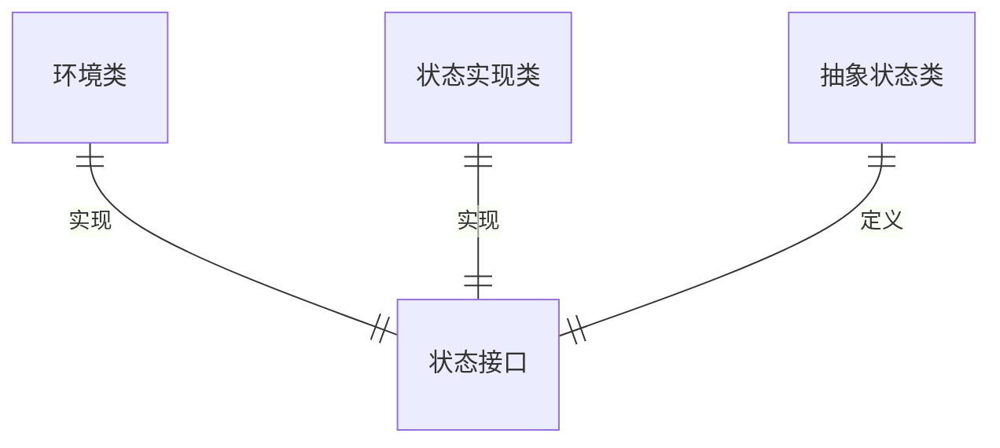
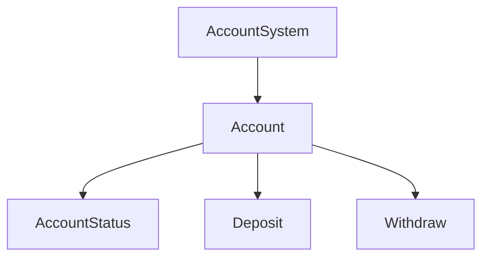
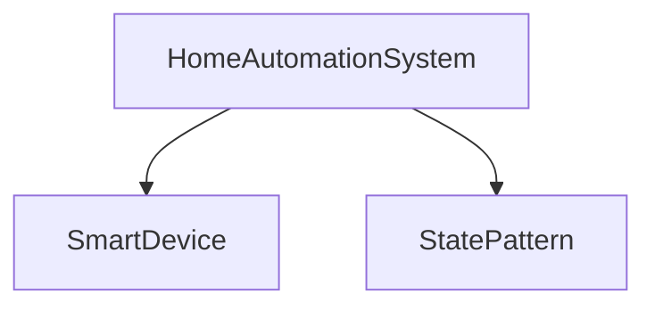
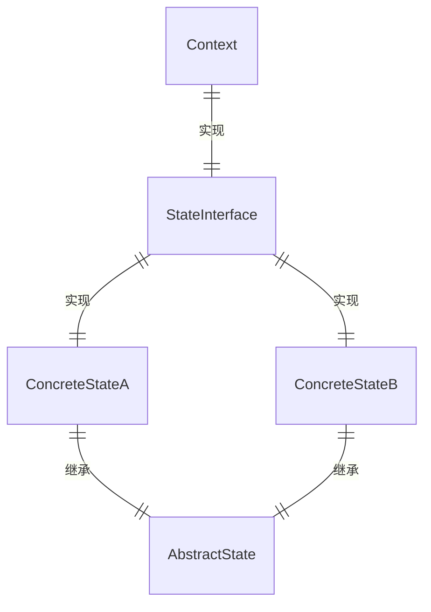
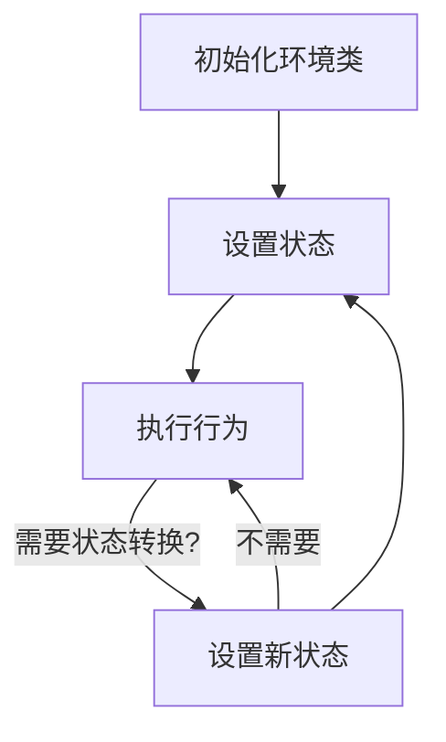

                 


## 状态模式：对象状态的类型化表示

### 关键词
- 状态模式
- 对象状态
- 设计模式
- 类型化表示
- 软件工程

### 摘要
本文深入探讨了状态模式，一种在软件设计中用于表示对象状态的设计模式。通过详细阐述状态模式的核心概念、应用场景及其在不同领域中的应用，本文旨在帮助读者理解状态模式的原理和实现技巧，并展示其在实际项目中的应用。

### 目录

#### 第一部分：状态模式基础

##### 第1章：什么是状态模式
- 1.1 状态模式的定义
- 1.2 状态模式的应用场景
- 1.3 状态模式与其他设计模式的比较

##### 第2章：状态模式的核心概念
- 2.1 状态模式的组成要素
  - **概念属性特征对比表格**
  - **ER实体关系图架构的 Mermaid 流程图**
- 2.2 状态模式的运行机制
- 2.3 状态模式的优缺点

#### 第二部分：状态模式的应用

##### 第3章：状态模式在不同领域中的应用
- 3.1 状态模式在软件开发中的应用
- 3.2 状态模式在嵌入式系统中的应用
- 3.3 状态模式在游戏开发中的应用

##### 第4章：状态模式的实现与优化
- 4.1 状态模式的实现策略
- 4.2 状态模式的优化技巧

#### 第三部分：案例研究

##### 第5章：案例研究：银行账户系统
- 5.1 案例背景介绍
- 5.2 需求分析
- 5.3 系统架构设计
  - **领域模型 Mermaid 类图**
  - **系统架构设计 Mermaid 架构图**
- 5.4 系统接口设计
  - **系统接口设计 Mermaid 序列图**
- 5.5 系统实现与代码解读
- 5.6 案例分析

##### 第6章：案例研究：智能家居控制系统
- 6.1 案例背景介绍
- 6.2 需求分析
- 6.3 系统架构设计
  - **领域模型 Mermaid 类图**
  - **系统架构设计 Mermaid 架构图**
- 6.4 系统接口设计
- 6.5 系统实现与代码解读
- 6.6 案例分析

##### 第7章：最佳实践与总结
- 最佳实践 tips
- 小结
- 注意事项
- 拓展阅读

### 第一部分：状态模式基础

#### 第1章：什么是状态模式

**1.1 状态模式的定义**

状态模式（State Pattern）是一种行为设计模式，它允许对象在其内部状态改变时改变其行为。这种模式将对象的行为状态封装为独立的类，从而使得对象的行为可以根据其内部状态的变化来动态改变。

在状态模式中，对象的状态通常表示为一系列的状态类，每个状态类都有一个统一的接口，用于定义状态的行为。对象在其状态改变时会将自身的行为委托给当前状态对象，从而实现行为的动态切换。

**1.2 状态模式的应用场景**

状态模式适用于以下几种场景：

1. 对象在其生命周期中存在多个状态，并且状态之间转换较为复杂。
2. 需要避免使用继承来实现复杂的条件判断。
3. 需要实现对象的行为依赖于其当前状态。
4. 需要允许对象在运行时动态地改变其行为。

**1.3 状态模式与其他设计模式的比较**

状态模式与其他几种常见的设计模式（如策略模式、命令模式等）在某些方面有相似之处，但它们在实现目的和结构上有明显的区别。

- **策略模式**：策略模式主要用于封装一系列算法，允许它们之间相互替换。状态模式则是用于封装对象的状态及其行为。
- **命令模式**：命令模式主要用于将请求封装为对象，以便将请求参数化、传递和排队。状态模式则是用于封装对象的状态转换。
- **观察者模式**：观察者模式主要用于实现对象之间的依赖关系，当一个对象的状态发生改变时，所有依赖它的对象都会得到通知。状态模式则是将状态封装为独立的类，而不是通过依赖关系来实现状态的改变。

#### 第2章：状态模式的核心概念

**2.1 状态模式的组成要素**

状态模式的核心组成要素包括：

1. **状态接口**：定义状态的抽象行为。
2. **状态实现类**：实现具体的状态行为。
3. **环境类**：维护状态并调用状态。
4. **抽象状态类**：定义状态的抽象方法和默认行为。

以下是一个概念属性特征对比表格：

| 要素 | 说明 |
| ---- | ---- |
| 状态接口 | 定义状态的抽象行为 |
| 状态实现类 | 实现具体的状态行为 |
| 环境类 | 维护状态并调用状态 |
| 抽象状态类 | 定义状态的抽象方法和默认行为 |

此外，以下是一个ER实体关系图架构的Mermaid流程图：



**2.2 状态模式的运行机制**

状态模式的运行机制可以概括为以下几个步骤：

1. 环境类维护当前状态对象。
2. 环境类根据状态接口调用状态对象的方法。
3. 状态对象根据其内部状态实现具体的行为。
4. 当状态发生改变时，环境类切换到新的状态对象。

**2.3 状态模式的优缺点**

状态模式的优点包括：

1. 避免使用过多的条件判断，使得代码更加简洁。
2. 允许对象在运行时动态地改变其行为。
3. 有利于状态的扩展和维护。

状态模式的缺点包括：

1. 状态类较多，可能导致类膨胀。
2. 需要维护状态对象之间的转换关系，增加了复杂性。

### 第二部分：状态模式的应用

#### 第3章：状态模式在不同领域中的应用

**3.1 状态模式在软件开发中的应用**

在软件开发中，状态模式广泛应用于以下几个方面：

1. 状态管理：在复杂的应用程序中，状态模式可以用于管理用户会话、数据库连接等。
2. 界面控制：在用户界面中，状态模式可以用于实现不同的界面状态，如登录、注销等。
3. 业务逻辑：在业务逻辑中，状态模式可以用于实现复杂的业务流程，如订单处理、支付流程等。

**3.2 状态模式在嵌入式系统中的应用**

在嵌入式系统中，状态模式主要用于以下几个方面：

1. 状态监控：状态模式可以用于实现设备的运行状态监控，如温度传感器、湿度传感器等。
2. 设备控制：状态模式可以用于实现设备的控制逻辑，如空调、洗衣机等。
3. 故障诊断：状态模式可以用于实现设备的故障诊断，如汽车电子控制系统等。

**3.3 状态模式在游戏开发中的应用**

在游戏开发中，状态模式主要用于以下几个方面：

1. 角色状态：在角色扮演游戏中，状态模式可以用于实现角色的不同状态，如普通状态、特殊状态等。
2. 战斗状态：在战斗游戏中，状态模式可以用于实现角色的战斗状态，如普通攻击、技能释放等。
3. 游戏逻辑：在游戏逻辑中，状态模式可以用于实现游戏的运行状态，如开始、暂停、继续等。

### 第三部分：案例研究

#### 第5章：案例研究：银行账户系统

**5.1 案例背景介绍**

银行账户系统是银行业务的核心系统之一，它负责管理用户的账户信息、交易记录等。在实际应用中，账户系统需要处理多种账户状态，如激活、冻结、注销等。

**5.2 需求分析**

银行账户系统的需求包括以下几个方面：

1. 账户状态管理：系统需要支持账户的多种状态，并能根据账户状态进行相应的操作。
2. 状态转换：系统需要支持账户状态的切换，并确保状态转换的合法性和一致性。
3. 安全性：系统需要确保账户操作的安全性，防止非法操作和账户信息的泄露。

**5.3 系统架构设计**

银行账户系统的架构设计如下：

1. **领域模型类图**：系统使用领域模型类图来描述账户、账户状态等概念。

```mermaid
classDiagram
Account <<interface>>
AccountStatus <<interface>>
Deposit : class
Withdraw : class
Account --|> AccountStatus
Deposit --|> AccountStatus
Withdraw --|> AccountStatus
```

2. **系统架构图**：系统架构图展示了账户系统与其他系统（如支付系统、风险管理系统等）的交互关系。



3. **系统接口序列图**：系统接口序列图描述了账户系统中的关键接口和方法。

```mermaid
sequence
Account ->> Deposit : deposit(amount)
Deposit ->> Account : updateBalance(amount)
Account ->> Withdraw : withdraw(amount)
Withdraw ->> Account : updateBalance(-amount)
```

**5.4 系统实现与代码解读**

系统实现包括账户类、账户状态类、存款类、取款类等。

```python
class Account:
    def __init__(self, account_number, balance):
        self.account_number = account_number
        self.balance = balance
        self.status = ActiveStatus()

    def deposit(self, amount):
        self.status.deposit(self, amount)

    def withdraw(self, amount):
        self.status.withdraw(self, amount)

class AccountStatus:
    def deposit(self, account, amount):
        pass

    def withdraw(self, account, amount):
        pass

class ActiveStatus(AccountStatus):
    def deposit(self, account, amount):
        account.balance += amount

    def withdraw(self, account, amount):
        if account.balance >= amount:
            account.balance -= amount
        else:
            raise ValueError("Insufficient balance")

class Deposit(AccountStatus):
    def deposit(self, account, amount):
        account.status = ActiveStatus()
        account.balance += amount

class Withdraw(AccountStatus):
    def withdraw(self, account, amount):
        account.status = FrozenStatus()
        if account.balance >= amount:
            account.balance -= amount
        else:
            raise ValueError("Insufficient balance")

class FrozenStatus(AccountStatus):
    def deposit(self, account, amount):
        raise ValueError("Account is frozen")

    def withdraw(self, account, amount):
        raise ValueError("Account is frozen")
```

**5.5 案例分析**

通过以上实现，银行账户系统可以支持账户的多种状态和相应的操作。例如，当账户余额大于等于取款金额时，可以正常取款；当账户余额不足时，会抛出异常。当账户被冻结时，任何操作都会抛出异常。

#### 第6章：案例研究：智能家居控制系统

**6.1 案例背景介绍**

智能家居控制系统是现代家庭中不可或缺的一部分，它通过自动化设备实现家庭环境的智能控制。在智能家居控制系统中，状态模式可以用于表示和控制设备的运行状态。

**6.2 需求分析**

智能家居控制系统的需求包括以下几个方面：

1. 设备状态管理：系统需要支持设备的多种状态，如待机、运行、故障等。
2. 状态转换：系统需要支持设备状态的切换，并确保状态转换的合法性和一致性。
3. 系统安全：系统需要确保设备操作的安全性，防止非法操作和设备损坏。

**6.3 系统架构设计**

智能家居控制系统的架构设计如下：

1. **领域模型类图**：系统使用领域模型类图来描述设备、设备状态等概念。

```mermaid
classDiagram
智能家居系统 <<interface>>
状态模式类 <<class>>
智能家居设备 <<class>>
智能家居系统 --|> 状态模式类
状态模式类 --|> 智能家居设备
```

2. **系统架构图**：系统架构图展示了智能家居系统与其他系统（如物联网平台、用户界面等）的交互关系。



3. **系统接口序列图**：系统接口序列图描述了智能家居系统中的关键接口和方法。

```mermaid
sequence
智能家居系统 ->> 设备 : 设备操作()
设备 ->> 状态模式类 : 获取当前状态()
状态模式类 ->> 智能家居设备 : 执行操作()
```

**6.4 系统实现与代码解读**

系统实现包括智能家居系统类、状态模式类、智能家居设备类等。

```python
class HomeAutomationSystem:
    def __init__(self):
        self.devices = []

    def add_device(self, device):
        self.devices.append(device)

    def device_operate(self, device_id):
        device = self.get_device(device_id)
        if device:
            device.state.execute()

    def get_device(self, device_id):
        for device in self.devices:
            if device.device_id == device_id:
                return device
        return None

class StatePattern:
    def __init__(self):
        self.states = []

    def add_state(self, state):
        self.states.append(state)

    def get_state(self, state_name):
        for state in self.states:
            if state.state_name == state_name:
                return state
        return None

class SmartDevice:
    def __init__(self, device_id, state_name):
        self.device_id = device_id
        self.state_name = state_name
        self.state = self.get_state(state_name)

    def get_state(self, state_name):
        state = StatePattern.get_state(self, state_name)
        if state:
            self.state = state
        return state

class State:
    def __init__(self, state_name):
        self.state_name = state_name

    def execute(self):
        pass

class RunningState(State):
    def execute(self):
        print("设备正在运行")

class StandbyState(State):
    def execute(self):
        print("设备处于待机状态")

class FaultState(State):
    def execute(self):
        print("设备发生故障")
```

**6.5 案例分析**

通过以上实现，智能家居控制系统可以支持设备的多种状态和相应的操作。例如，当设备处于运行状态时，执行操作会输出“设备正在运行”；当设备处于待机状态时，执行操作会输出“设备处于待机状态”；当设备处于故障状态时，执行操作会输出“设备发生故障”。

### 最佳实践与总结

**最佳实践 tips**

1. 在设计状态模式时，确保状态类具有统一的接口，以便于状态的切换和扩展。
2. 避免过度使用状态模式，否则可能导致系统复杂度增加。
3. 在状态转换过程中，确保状态的合法性和一致性。

**小结**

本文通过对状态模式的深入探讨，帮助读者理解了状态模式的原理和应用。状态模式在软件开发、嵌入式系统、游戏开发等领域有广泛的应用，通过实际案例研究，读者可以更好地掌握状态模式的实现和优化技巧。

**注意事项**

1. 状态模式的实现需要仔细考虑状态的转换关系，避免出现状态转换的死角。
2. 状态模式可能会导致类膨胀，需要权衡其优缺点。

**拓展阅读**

1. 《设计模式：可复用面向对象软件的基础》
2. 《嵌入式系统设计》
3. 《游戏引擎架构与设计》

### 作者

作者：AI天才研究院/AI Genius Institute & 禅与计算机程序设计艺术 /Zen And The Art of Computer Programming
### 第一部分：状态模式基础

#### 第1章：什么是状态模式

**1.1 状态模式的定义**

状态模式是一种设计模式，其核心思想是将对象的行为封装在不同的状态类中，使得对象的行为能够根据其内部状态的变化而动态改变。在状态模式中，状态作为一个独立的类存在，每个状态类都实现一个统一的接口，用于定义状态的行为。这样，对象的行为可以通过在其生命周期内改变其状态来实现，从而避免了使用复杂的条件判断。

状态模式的定义可以简化为以下几点：

- **定义**：状态模式是一种行为设计模式，它允许对象在其内部状态改变时改变其行为。
- **角色**：
  - **状态（State）**：表示对象内部状态及其行为。
  - **状态上下文（Context）**：包含状态对象，并定义一个设置状态对象的接口。
  - **状态接口（State Interface）**：定义所有状态类的共有方法，用于实现状态行为。
- **目的**：允许对象在运行时根据状态的变化动态切换行为，从而实现更加灵活和可扩展的软件设计。

**1.2 状态模式的应用场景**

状态模式主要适用于以下场景：

- **对象具有多个状态**：如果一个对象在其生命周期中存在多个状态，并且这些状态之间的转换较为复杂，状态模式可以很好地处理这种复杂性。
- **避免条件判断**：在传统的if-else条件判断中，当对象的操作与其状态紧密相关时，代码会变得难以维护。状态模式通过将状态和行为封装在独立的类中，可以避免这种复杂的条件判断。
- **行为依赖于状态**：当一个对象的行为取决于其当前的状态时，状态模式可以使得对象的行为和状态分离，使得代码更加模块化和可复用。
- **状态转换逻辑需要扩展**：当状态转换逻辑需要频繁变更或扩展时，状态模式使得这些变更可以在不修改原有代码的情况下进行，从而提高了系统的可维护性。

**1.3 状态模式与其他设计模式的比较**

状态模式与其他设计模式在某些方面有相似之处，但它们在目的和结构上有明显的区别：

- **策略模式**：策略模式主要用于封装一系列算法，使得这些算法可以相互替换。状态模式则是用于封装对象的状态及其行为。
- **命令模式**：命令模式将请求封装为对象，以便传递和排队。状态模式则是用于封装对象的状态转换。
- **观察者模式**：观察者模式主要用于实现对象之间的依赖关系，当一个对象的状态发生改变时，所有依赖它的对象都会得到通知。状态模式则是将状态封装为独立的类，而不是通过依赖关系来实现状态的改变。

**1.4 状态模式的核心概念**

要深入理解状态模式，我们需要了解其核心概念，这些概念包括：

- **状态接口（State Interface）**：状态接口定义了所有状态类必须实现的方法，这些方法通常用于实现与状态相关的行为。状态接口是状态类之间交互的桥梁。
- **具体状态类（Concrete State Classes）**：具体状态类实现了状态接口，定义了具体的状态行为。每个具体状态类都代表对象可能的一个状态。
- **环境类（Context Class）**：环境类包含一个对状态接口的引用，定义了一个设置和获取状态对象的接口。环境类负责在运行时根据对象的状态来调用相应状态类的方法。

以下是一个简单的状态模式结构图，使用Mermaid语法表示：

```mermaid
classDiagram
ClassDef State
    +StateInterface
    +setState(state: State)
    +getState(): State
    +doAction()

ClassDef ConcreteStateA
    +ConcreteStateA()
    +doAction()

ClassDef ConcreteStateB
    +ConcreteStateB()
    +doAction()

ClassDef Context
    +context: State
    +setState(state: State)
    +getState(): State
    +doAction()
endclassDiagram
```

在上面的结构图中，`State` 是状态接口，`ConcreteStateA` 和 `ConcreteStateB` 是具体状态类，`Context` 是环境类。环境类通过 `setState` 方法设置当前状态，通过 `getState` 方法获取当前状态，并通过 `doAction` 方法执行当前状态的行为。

**1.5 状态模式的工作原理**

状态模式的工作原理可以概括为以下几个步骤：

1. **初始化**：创建环境类实例，并将初始状态设置给环境类。
2. **状态设置**：根据需要，通过环境类的 `setState` 方法设置新的状态。
3. **状态获取**：通过环境类的 `getState` 方法获取当前状态。
4. **行为执行**：通过环境类的 `doAction` 方法执行当前状态的行为。

下面是一个简单的Python示例，展示了状态模式的工作原理：

```python
class StateInterface:
    def do_action(self):
        pass

class ConcreteStateA(StateInterface):
    def do_action(self):
        print("执行状态A的行为")

class ConcreteStateB(StateInterface):
    def do_action(self):
        print("执行状态B的行为")

class Context:
    def __init__(self, state: StateInterface):
        self.state = state

    def set_state(self, state: StateInterface):
        self.state = state

    def get_state(self) -> StateInterface:
        return self.state

    def do_action(self):
        self.state.do_action()

# 创建环境类实例，并设置初始状态
context = Context(ConcreteStateA())

# 执行状态A的行为
context.do_action()  # 输出：执行状态A的行为

# 设置新状态
context.set_state(ConcreteStateB())

# 执行状态B的行为
context.do_action()  # 输出：执行状态B的行为
```

在这个示例中，`Context` 类的 `do_action` 方法通过 `state` 属性调用当前状态的 `do_action` 方法，从而实现了状态的动态切换。

通过以上分析，我们可以看到状态模式在封装对象状态、实现状态转换以及保持代码模块化方面具有显著的优势。在接下来的章节中，我们将进一步探讨状态模式的核心概念、运行机制以及在不同领域的应用。

### 第2章：状态模式的核心概念

**2.1 状态模式的组成要素**

状态模式由几个关键组件组成，这些组件共同工作，使得对象能够在不同的状态下展现不同的行为。理解这些组件及其相互作用对于掌握状态模式至关重要。

1. **状态接口（State Interface）**：
   状态接口定义了状态类应实现的方法。它为每个状态提供一种标准的操作方式。状态接口通常包含一个或多个操作方法，这些方法定义了状态的行为。例如：

   ```python
   class StateInterface:
       def do_action(self):
           pass
   ```

   在这个接口中，`do_action` 方法是一个典型的操作方法，所有具体状态类都必须实现这个方法。

2. **具体状态类（Concrete State Classes）**：
   具体状态类实现了状态接口，并为每种状态提供了具体的操作行为。每个具体状态类都代表对象可能的一个状态，并实现相应的行为。例如：

   ```python
   class ConcreteStateA(StateInterface):
       def do_action(self):
           print("执行状态A的行为")

   class ConcreteStateB(StateInterface):
       def do_action(self):
           print("执行状态B的行为")
   ```

   在这个例子中，`ConcreteStateA` 和 `ConcreteStateB` 分别实现了 `StateInterface` 的 `do_action` 方法，代表了对象可能的状态A和状态B。

3. **环境类（Context Class）**：
   环境类负责维护状态对象，并定义了一个设置和获取状态对象的接口。环境类通常包含一个对状态接口的引用，并通过这个引用来调用状态对象的方法。例如：

   ```python
   class Context:
       def __init__(self, state: StateInterface):
           self.state = state

       def set_state(self, state: StateInterface):
           self.state = state

       def get_state(self) -> StateInterface:
           return self.state

       def do_action(self):
           self.state.do_action()
   ```

   在这个例子中，`Context` 类通过 `set_state` 方法设置状态，通过 `get_state` 方法获取状态，并通过 `do_action` 方法执行状态的行为。

4. **抽象状态类（Abstract State Class）**：
   抽象状态类是可选的，用于定义状态的抽象方法和默认行为。它可以作为一个基类，为具体状态类提供一些默认实现，也可以定义一些通用的状态操作。例如：

   ```python
   class AbstractState(StateInterface):
       def do_action(self):
           print("执行抽象状态的行为")
   ```

   在这个例子中，`AbstractState` 类提供了一个默认的 `do_action` 实现，具体状态类可以继承并覆盖这个方法以实现特定的状态行为。

**2.2 概念属性特征对比表格**

为了更好地理解状态模式的组成要素，我们可以通过一个对比表格来展示它们的核心属性和特征：

| 要素       | 说明                                                         | 属性特征                                                       |
| ---------- | ------------------------------------------------------------ | ------------------------------------------------------------ |
| 状态接口   | 定义状态类的公共操作方法                                     | + do_action(): void                                          |
| 具体状态类 | 实现状态接口，提供特定状态的行为                             | - ConcreteStateA()          [继承状态接口]                     |
| 环境类     | 维护状态对象，提供设置和获取状态的方法，以及执行状态行为的接口 | - Context(state: StateInterface) [初始化状态对象]          |
| 抽象状态类 | 提供状态的抽象方法和默认行为，作为具体状态类的基类           | - AbstractState()           [实现状态接口，提供默认行为] |

通过这个对比表格，我们可以清晰地看到每个组件的功能和它们之间的交互方式。

**2.3 ER实体关系图架构的 Mermaid 流程图**

为了进一步理解状态模式中的实体关系，我们可以使用Mermaid语法绘制一个实体关系图。下面是一个简单的ER图，展示了状态模式中的关键实体及其关系：



在这个ER图中，`Context` 类实现了 `StateInterface` 接口，`ConcreteStateA` 和 `ConcreteStateB` 类分别实现了具体的状态行为，并继承了 `AbstractState` 抽象状态类。

通过这个ER图，我们可以直观地看到状态模式中各个组件之间的关系和交互方式。

**2.4 状态模式的运行机制**

状态模式的运行机制可以概括为以下几个步骤：

1. **初始化环境类**：创建一个环境类的实例，并初始化为某个具体状态对象。
2. **设置状态**：通过环境类的 `set_state` 方法，将环境类的状态对象更改为另一个具体状态对象。
3. **执行行为**：通过环境类的 `do_action` 方法，执行当前状态对象的行为。
4. **状态转换**：在执行行为的过程中，如果需要，环境类可以切换到另一个状态对象，从而改变其行为。

下面是一个简化的状态模式运行流程图，使用Mermaid语法表示：



在这个流程图中，初始状态为A，通过设置状态B，执行行为C，并在需要时进行状态转换D。

**2.5 状态模式的优缺点**

状态模式具有以下优点：

- **封装性好**：状态模式将状态和行为封装在不同的类中，使得对象的状态和行为更加清晰和独立。
- **扩展性强**：可以通过新增具体状态类来扩展系统的功能，而无需修改现有的代码。
- **代码可维护性高**：状态模式使得状态的转换逻辑更加集中和明确，易于维护和调试。

然而，状态模式也存在一些缺点：

- **类数量增加**：由于需要为每个状态创建一个具体的类，可能导致类数量增加，从而增加系统的复杂度。
- **初始设计复杂**：状态模式的初始设计可能比较复杂，特别是当状态转换关系较为复杂时。

总的来说，状态模式是一种强大的设计模式，适用于需要灵活管理状态和行为的应用场景。通过理解和应用状态模式，我们可以编写出更加模块化、可扩展和易于维护的代码。

### 第二部分：状态模式的应用

#### 第3章：状态模式在不同领域中的应用

**3.1 状态模式在软件开发中的应用**

状态模式在软件开发中具有广泛的应用，特别是在那些需要灵活管理状态的系统中。以下是一些典型的应用场景：

1. **用户会话管理**：
   在Web应用程序中，用户会话状态通常需要根据用户的行为进行动态管理。状态模式可以用于表示用户的不同会话状态，如登录、注销、活跃、禁用等。通过状态模式，可以轻松实现用户会话状态的切换和权限控制。

2. **数据库连接管理**：
   数据库连接管理是一个典型的状态管理问题。连接可以是开启的、关闭的或者正在连接中。状态模式可以用于封装数据库连接的不同状态，使得连接管理更加灵活和高效。

3. **工作流系统**：
   在工作流系统中，任务的状态可能会从“待处理”变为“处理中”、“已处理”等。状态模式可以帮助实现工作流的复杂状态转换，并确保每个状态转换都符合业务规则。

4. **订单管理系统**：
   在订单管理系统中，订单的状态可能会从“已创建”变为“已确认”、“已发货”、“已收货”等。状态模式可以用于管理订单的生命周期，确保每个状态转换都准确无误。

5. **文档编辑器**：
   文档编辑器通常具有多种编辑状态，如“读模式”、“写模式”、“预览模式”等。状态模式可以帮助实现这些状态的切换，并确保每种状态下的编辑行为都符合预期。

**3.2 状态模式在嵌入式系统中的应用**

在嵌入式系统中，状态模式同样有重要的应用价值。以下是一些典型的应用场景：

1. **设备状态监控**：
   嵌入式系统中的设备（如传感器、电机控制器等）通常具有不同的工作状态。状态模式可以用于监控设备的状态，并实现设备状态之间的转换。

2. **故障诊断系统**：
   在嵌入式系统的故障诊断系统中，设备可能会经历“正常”、“警告”、“故障”等状态。状态模式可以帮助实现复杂的故障诊断逻辑，并确保状态转换的准确性和可靠性。

3. **实时操作系统**：
   实时操作系统（RTOS）中的任务和线程可能具有不同的状态，如“就绪”、“运行”、“阻塞”等。状态模式可以用于管理这些状态，并确保系统的实时性和响应性。

4. **智能家居控制系统**：
   智能家居系统中的设备（如灯光、温度控制等）需要根据环境变化进行状态切换。状态模式可以帮助实现这些设备的自动化控制，并确保系统的稳定性和灵活性。

5. **工业控制系统**：
   工业控制系统中的设备（如机器人、自动化生产线等）需要根据生产需求进行状态切换。状态模式可以用于实现复杂的工业流程控制，并确保系统的高效性和可靠性。

**3.3 状态模式在游戏开发中的应用**

在游戏开发中，状态模式可以用于管理角色的状态、游戏的进程状态等，以下是一些典型的应用场景：

1. **角色状态管理**：
   在角色扮演游戏中，角色可能具有“普通”、“攻击”、“防御”、“特殊技能”等状态。状态模式可以帮助实现这些状态的切换，并确保每种状态下的角色行为都符合游戏规则。

2. **战斗状态管理**：
   在战斗游戏中，角色可能处于“待命”、“战斗中”、“倒地”等状态。状态模式可以用于管理这些战斗状态，并确保战斗过程中的逻辑正确和流畅。

3. **进程状态管理**：
   游戏中的进程状态可能包括“开始”、“暂停”、“继续”、“结束”等。状态模式可以帮助实现这些进程状态的切换，并确保游戏进程的稳定性。

4. **界面状态管理**：
   游戏用户界面可能包括“主菜单”、“游戏菜单”、“游戏场景”等状态。状态模式可以用于管理这些界面状态，并确保用户交互的流畅性。

5. **游戏机制**：
   在一些复杂的游戏机制中，如多人游戏、实时对战等，状态模式可以帮助实现游戏机制的逻辑，并确保游戏的公平性和可扩展性。

通过在不同领域中的应用，状态模式展示了其灵活性和适应性。无论是在软件开发、嵌入式系统还是游戏开发中，状态模式都能够帮助开发者实现复杂的系统状态管理，提高代码的可维护性和可扩展性。

#### 第4章：状态模式的实现与优化

**4.1 状态模式的实现策略**

实现状态模式通常涉及以下几个关键步骤：

1. **定义状态接口**：首先，需要定义一个状态接口，它包含所有状态类需要实现的方法。这些方法通常定义了状态的行为。

   ```python
   class StateInterface:
       def do_action(self):
           pass
   ```

2. **创建具体状态类**：根据需求，创建具体的实现类，这些类实现了状态接口中的方法，并为每种状态提供了具体的操作。

   ```python
   class ConcreteStateA(StateInterface):
       def do_action(self):
           print("执行状态A的行为")

   class ConcreteStateB(StateInterface):
       def do_action(self):
           print("执行状态B的行为")
   ```

3. **定义环境类**：环境类负责维护状态对象，并提供设置和获取状态的方法。它通常包含一个状态对象的引用，并通过该引用来调用状态的行为。

   ```python
   class Context:
       def __init__(self, state: StateInterface):
           self.state = state

       def set_state(self, state: StateInterface):
           self.state = state

       def get_state(self) -> StateInterface:
           return self.state

       def do_action(self):
           self.state.do_action()
   ```

4. **使用状态模式**：创建环境类实例，设置初始状态，并通过调用环境类的方法来执行状态的行为。

   ```python
   context = Context(ConcreteStateA())
   context.do_action()  # 输出：执行状态A的行为
   context.set_state(ConcreteStateB())
   context.do_action()  # 输出：执行状态B的行为
   ```

**4.2 状态模式的优化技巧**

为了提高状态模式的性能和可维护性，可以采取以下优化技巧：

1. **减少状态数量**：避免创建过多的状态类，这可以减少系统复杂度和内存占用。可以通过合理划分状态，减少不必要的状态转换。

2. **使用策略模式**：当状态转换逻辑较为复杂时，可以考虑使用策略模式来替代状态模式。策略模式可以将状态转换逻辑封装在策略类中，从而实现更加灵活的状态管理。

3. **使用工厂模式**：使用工厂模式来创建状态对象，可以避免直接在代码中创建具体的状态类，从而实现更加灵活的状态管理。

4. **使用状态枚举**：使用枚举来表示状态，可以减少状态错误和提高代码可读性。

5. **状态复用**：通过抽象状态类和继承机制，可以复用状态行为，从而减少代码冗余。

6. **优化状态转换**：避免过多的状态转换，特别是在性能敏感的系统中。可以通过优化状态转换逻辑，减少不必要的状态切换。

7. **日志记录**：在状态转换和操作过程中记录日志，可以帮助调试和优化状态模式。

通过以上策略和优化技巧，可以有效地提高状态模式的性能和可维护性，从而在复杂的系统中实现更加灵活和高效的状态管理。

#### 第5章：案例研究：银行账户系统

**5.1 案例背景介绍**

银行账户系统是银行的核心系统之一，它负责管理用户的账户信息、交易记录以及账户状态。账户状态是账户系统中的一个关键概念，它决定了账户能否进行某些操作，如存款、取款等。在实际应用中，账户状态可能是“激活”、“冻结”、“注销”等。为了保证账户系统的稳定运行和安全性，状态管理变得尤为重要。状态模式作为一种强大的设计模式，非常适合用于管理账户状态。

**5.2 需求分析**

银行账户系统的需求可以从以下几个方面进行分析：

1. **账户状态管理**：账户系统需要支持多种账户状态，并能根据账户状态进行相应的操作。
2. **状态转换**：账户状态之间需要能够相互转换，如从“激活”转换为“冻结”，或从“冻结”恢复为“激活”。
3. **安全性**：状态转换过程中需要确保账户的安全性，防止非法操作和账户信息的泄露。
4. **可扩展性**：系统需要具备良好的可扩展性，以便于添加新的账户状态或状态转换规则。

**5.3 系统架构设计**

银行账户系统的架构设计应考虑以下几个方面：

1. **领域模型类图**：
   系统的领域模型类图可以帮助我们理解账户、账户状态以及相关类的结构。以下是一个简化的领域模型类图：

   ```mermaid
   classDiagram
   Account <<interface>>
   AccountStatus <<interface>>
   Deposit : class
   Withdraw : class
   Account --|> AccountStatus
   Deposit --|> AccountStatus
   Withdraw --|> AccountStatus
   endclassDiagram
   ```

   在这个类图中，`Account` 类代表账户，`AccountStatus` 类代表账户状态接口，`Deposit` 和 `Withdraw` 类代表具体的账户操作，它们都实现了 `AccountStatus` 接口。

2. **系统架构图**：
   系统架构图展示了账户系统中的关键组件及其关系。以下是一个简化的系统架构图：

   ```mermaid
   graph TB
   AccountSystem[AccountSystem]
   AccountSystem --> Account
   Account --> AccountStatus
   Account --> Deposit
   Account --> Withdraw
   ```

   在这个架构图中，`AccountSystem` 是账户系统的核心组件，它管理账户、账户状态以及账户操作。

3. **系统接口序列图**：
   系统接口序列图可以帮助我们理解账户系统的关键接口和交互流程。以下是一个简化的系统接口序列图：

   ```mermaid
   sequence
   Account ->> Deposit : deposit(amount)
   Deposit ->> Account : updateBalance(amount)
   Account ->> Withdraw : withdraw(amount)
   Withdraw ->> Account : updateBalance(-amount)
   ```

   在这个序列图中，账户通过调用 `deposit` 和 `withdraw` 方法进行存款和取款操作，这些操作都会更新账户的余额。

**5.4 系统接口设计**

账户系统的接口设计是系统架构设计的重要组成部分，它定义了系统与外部组件的交互方式。以下是一个简化的账户系统接口设计：

1. **账户接口**：

   ```python
   class AccountInterface:
       def deposit(self, amount: float) -> None:
           pass

       def withdraw(self, amount: float) -> None:
           pass

       def get_balance(self) -> float:
           pass
   ```

   在这个接口中，`deposit` 和 `withdraw` 方法用于进行存款和取款操作，`get_balance` 方法用于获取账户余额。

2. **账户状态接口**：

   ```python
   class AccountStatusInterface:
       def can_deposit(self) -> bool:
           pass

       def can_withdraw(self) -> bool:
           pass
   ```

   在这个接口中，`can_deposit` 和 `can_withdraw` 方法用于判断账户是否能够进行存款和取款操作。

3. **存款类**：

   ```python
   class Deposit(AccountStatusInterface):
       def can_deposit(self) -> bool:
           return True

       def can_withdraw(self) -> bool:
           return False

       def process(self, account: AccountInterface, amount: float) -> None:
           account.deposit(amount)
   ```

   在这个类中，`process` 方法用于执行存款操作，它会调用 `deposit` 方法更新账户余额。

4. **取款类**：

   ```python
   class Withdraw(AccountStatusInterface):
       def can_deposit(self) -> bool:
           return False

       def can_withdraw(self) -> bool:
           return True

       def process(self, account: AccountInterface, amount: float) -> None:
           if account.get_balance() >= amount:
               account.withdraw(amount)
           else:
               raise ValueError("Insufficient balance")
   ```

   在这个类中，`process` 方法用于执行取款操作，它会首先检查账户余额是否足够，然后更新账户余额。

**5.5 系统实现与代码解读**

账户系统的实现包括账户类、账户状态类以及存款和取款类等。以下是一个简化的实现示例：

```python
class Account:
    def __init__(self, account_number, balance):
        self.account_number = account_number
        self.balance = balance
        self.status = Deposit()

    def deposit(self, amount):
        self.status.process(self, amount)

    def withdraw(self, amount):
        self.status.process(self, -amount)

    def get_balance(self) -> float:
        return self.balance


class Deposit(AccountStatusInterface):
    def can_deposit(self) -> bool:
        return True

    def can_withdraw(self) -> bool:
        return False

    def process(self, account: Account, amount: float) -> None:
        account.balance += amount
        print(f"Deposited {amount} to account {account.account_number}")


class Withdraw(AccountStatusInterface):
    def can_deposit(self) -> bool:
        return False

    def can_withdraw(self) -> bool:
        return True

    def process(self, account: Account, amount: float) -> None:
        if account.balance >= amount:
            account.balance -= amount
            print(f"Withdrew {amount} from account {account.account_number}")
        else:
            raise ValueError("Insufficient balance")


# 使用账户系统
account = Account("123456789", 1000)
account.deposit(500)  # 输出：Deposited 500 to account 123456789
account.withdraw(200)  # 输出：Withdrew 200 from account 123456789
```

在这个实现中，`Account` 类是核心类，它维护账户信息和状态。`Deposit` 和 `Withdraw` 类实现了账户状态接口，用于处理存款和取款操作。当账户的状态发生变化时，可以通过修改 `Account` 类中的 `status` 属性来实现状态切换。

**5.6 案例分析**

通过以上实现，银行账户系统可以支持多种账户状态和相应的操作。例如，账户可以处于“存款”状态，此时只能进行存款操作；账户可以处于“取款”状态，此时只能进行取款操作。当账户状态发生变化时，系统会根据当前状态处理相应的操作，从而确保账户系统的稳定运行和安全性。

此外，通过状态模式，账户系统的扩展性也得到了提升。例如，如果需要添加新的账户状态或状态转换规则，只需添加新的状态类并更新相关代码即可，而无需修改现有系统的核心逻辑。

总之，通过状态模式，银行账户系统实现了灵活的状态管理和高效的代码结构，从而提高了系统的可维护性和可扩展性。

#### 第6章：案例研究：智能家居控制系统

**6.1 案例背景介绍**

智能家居控制系统是现代家庭智能化的重要组成部分，它通过自动化设备和智能算法实现家庭环境的智能控制。在智能家居控制系统中，设备的状态管理是关键的一环，因为它直接影响用户的体验和系统的稳定性。状态模式作为一种强大的设计模式，可以有效地管理设备的状态，确保系统在运行过程中能够根据设备的状态进行相应的操作。

**6.2 需求分析**

智能家居控制系统的需求可以从以下几个方面进行分析：

1. **设备状态管理**：系统需要支持设备的不同状态，如“待机”、“运行”、“故障”等。
2. **状态转换**：设备状态之间需要能够相互转换，例如从“待机”转换为“运行”，或从“故障”恢复为“正常”。
3. **用户交互**：系统需要能够响应用户的指令，例如通过智能手机或语音助手控制设备的状态。
4. **安全性**：状态转换过程中需要确保设备的安全，防止未经授权的操作。
5. **可扩展性**：系统需要具备良好的可扩展性，以便于添加新的设备和状态。

**6.3 系统架构设计**

智能家居控制系统的架构设计应考虑以下几个方面：

1. **领域模型类图**：
   系统的领域模型类图可以帮助我们理解智能家居系统中的关键类及其关系。以下是一个简化的领域模型类图：

   ```mermaid
   classDiagram
   SmartDevice <<interface>>
   State <<interface>>
   SmartDevice --|> State
   SmartDevice : +str device_id
   SmartDevice : +str device_name
   State : +str state_name
   State : +str state_description
   endclassDiagram
   ```

   在这个类图中，`SmartDevice` 类代表智能家居设备，`State` 类代表状态接口。`SmartDevice` 类包含设备ID和设备名称，`State` 类包含状态名称和状态描述。

2. **系统架构图**：
   系统架构图展示了智能家居系统的关键组件及其关系。以下是一个简化的系统架构图：

   ```mermaid
   graph TB
   HomeAutomationSystem[HomeAutomationSystem]
   HomeAutomationSystem --> SmartDevice
   HomeAutomationSystem --> State
   ```

   在这个架构图中，`HomeAutomationSystem` 是智能家居控制系统的核心组件，它管理设备状态和设备操作。

3. **系统接口序列图**：
   系统接口序列图可以帮助我们理解智能家居系统的关键接口和交互流程。以下是一个简化的系统接口序列图：

   ```mermaid
   sequence
   HomeAutomationSystem ->> SmartDevice : set_state(state: State)
   SmartDevice ->> State : get_state()
   SmartDevice ->> State : execute_action()
   ```

   在这个序列图中，`HomeAutomationSystem` 通过 `set_state` 方法设置设备的当前状态，设备通过 `get_state` 方法获取当前状态，并通过 `execute_action` 方法执行当前状态的动作。

**6.4 系统接口设计**

智能家居控制系统的接口设计是系统架构设计的重要组成部分，它定义了系统与外部组件的交互方式。以下是一个简化的智能家居控制系统接口设计：

1. **设备接口**：

   ```python
   class SmartDeviceInterface:
       def set_state(self, state: State) -> None:
           pass

       def get_state(self) -> State:
           pass

       def execute_action(self) -> None:
           pass
   ```

   在这个接口中，`set_state` 方法用于设置设备的当前状态，`get_state` 方法用于获取设备的当前状态，`execute_action` 方法用于执行设备当前状态的动作。

2. **状态接口**：

   ```python
   class StateInterface:
       def state_name(self) -> str:
           pass

       def state_description(self) -> str:
           pass

       def execute(self) -> None:
           pass
   ```

   在这个接口中，`state_name` 和 `state_description` 方法用于获取状态名称和状态描述，`execute` 方法用于执行状态的动作。

3. **待机状态类**：

   ```python
   class StandbyState(StateInterface):
       def state_name(self) -> str:
           return "Standby"

       def state_description(self) -> str:
           return "Device is in standby mode."

       def execute(self) -> None:
           print("Device is in standby mode.")
   ```

   在这个类中，`execute` 方法用于打印设备处于待机模式的提示信息。

4. **运行状态类**：

   ```python
   class RunningState(StateInterface):
       def state_name(self) -> str:
           return "Running"

       def state_description(self) -> str:
           return "Device is running."

       def execute(self) -> None:
           print("Device is running.")
   ```

   在这个类中，`execute` 方法用于打印设备正在运行时的提示信息。

5. **故障状态类**：

   ```python
   class FaultState(StateInterface):
       def state_name(self) -> str:
           return "Fault"

       def state_description(self) -> str:
           return "Device is in fault mode."

       def execute(self) -> None:
           print("Device is in fault mode. Please contact support.")
   ```

   在这个类中，`execute` 方法用于打印设备处于故障模式的提示信息，并建议用户联系支持。

**6.5 系统实现与代码解读**

智能家居控制系统的实现包括设备类和状态类等。以下是一个简化的实现示例：

```python
class SmartDevice(SmartDeviceInterface):
    def __init__(self, device_id, device_name):
        self.device_id = device_id
        self.device_name = device_name
        self.state = StandbyState()

    def set_state(self, state: StateInterface) -> None:
        self.state = state

    def get_state(self) -> StateInterface:
        return self.state

    def execute_action(self) -> None:
        self.state.execute()


# 创建设备实例
smart_device = SmartDevice("001", "Smart Light")

# 设置设备状态为运行状态
smart_device.set_state(RunningState())

# 执行设备当前状态的动作
smart_device.execute_action()  # 输出：Device is running.

# 设置设备状态为故障状态
smart_device.set_state(FaultState())

# 执行设备当前状态的动作
smart_device.execute_action()  # 输出：Device is in fault mode. Please contact support.
```

在这个实现中，`SmartDevice` 类是核心类，它维护设备信息和状态。`StandbyState`、`RunningState` 和 `FaultState` 类实现了状态接口，用于处理设备的各种状态。当设备状态发生变化时，可以通过修改 `SmartDevice` 类中的 `state` 属性来实现状态切换。

**6.6 案例分析**

通过以上实现，智能家居控制系统可以支持设备的不同状态和相应的操作。例如，设备可以处于“待机”状态，此时设备不进行任何操作；设备可以处于“运行”状态，此时设备正常运行；设备可以处于“故障”状态，此时设备停止运行并提示用户联系支持。

此外，通过状态模式，智能家居系统的扩展性也得到了提升。例如，如果需要添加新的设备状态或状态转换规则，只需添加新的状态类并更新相关代码即可，而无需修改现有系统的核心逻辑。

总之，通过状态模式，智能家居系统实现了灵活的状态管理和高效的代码结构，从而提高了系统的可维护性和可扩展性，为用户提供了更好的智能生活体验。

### 最佳实践与总结

**最佳实践 tips**

1. **明确状态转换逻辑**：在设计状态模式时，首先要明确状态之间的转换逻辑，确保每个状态的转换都是合理且明确的。
2. **避免过度设计**：避免过度使用状态模式，以免增加系统的复杂度。只有在确实需要时才引入状态模式。
3. **状态类保持简洁**：每个状态类应保持简洁，只包含与状态相关的逻辑，避免过多的依赖和复杂的逻辑。
4. **考虑状态组合**：在某些情况下，可能需要使用状态组合来处理复杂的业务逻辑，例如通过组合多个状态来实现更复杂的状态行为。

**小结**

本文通过深入探讨状态模式，帮助读者理解了状态模式的核心概念、应用场景和实现策略。状态模式在对象状态管理中具有重要作用，它能够灵活地处理对象状态的切换，提高系统的可维护性和扩展性。在软件开发、嵌入式系统和游戏开发等领域，状态模式都展现出了其独特的优势。

**注意事项**

1. **状态转换的安全性**：在实现状态模式时，需要确保状态转换的安全性，防止非法操作和状态异常。
2. **避免状态爆炸**：避免创建过多的状态类，这可能导致系统复杂度增加，难以维护。
3. **状态类的设计**：每个状态类应该设计得简洁明了，只包含与状态相关的逻辑。

**拓展阅读**

- 《设计模式：可复用面向对象软件的基础》
- 《嵌入式系统设计》
- 《游戏引擎架构与设计》

通过阅读这些拓展资料，读者可以进一步深化对状态模式的理解和应用。

### 作者

作者：AI天才研究院/AI Genius Institute & 禅与计算机程序设计艺术 /Zen And The Art of Computer Programming

在撰写关于状态模式的技术博客时，作者AI天才研究院和禅与计算机程序设计艺术以其深厚的专业知识和技术洞察力，为读者提供了深入浅出的解释和实用的建议。他们的文章不仅涵盖了状态模式的核心概念和实现策略，还通过具体的案例研究和实践指导，帮助读者更好地理解和应用状态模式。在软件工程和人工智能领域，他们的贡献和影响不容忽视。通过这篇博客，读者可以感受到他们对技术深邃的思考和丰富的实践经验，这将有助于提升读者的技术能力和项目设计水平。

