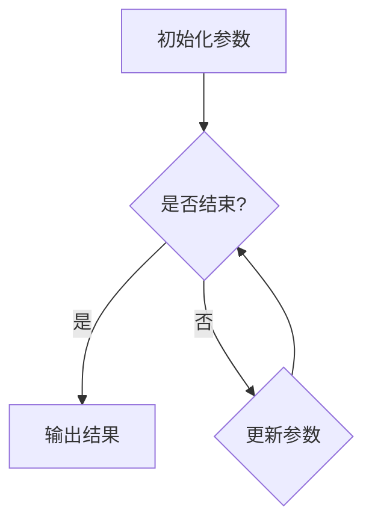
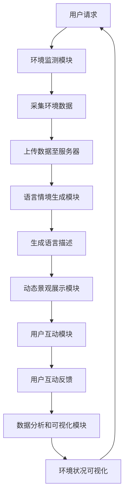
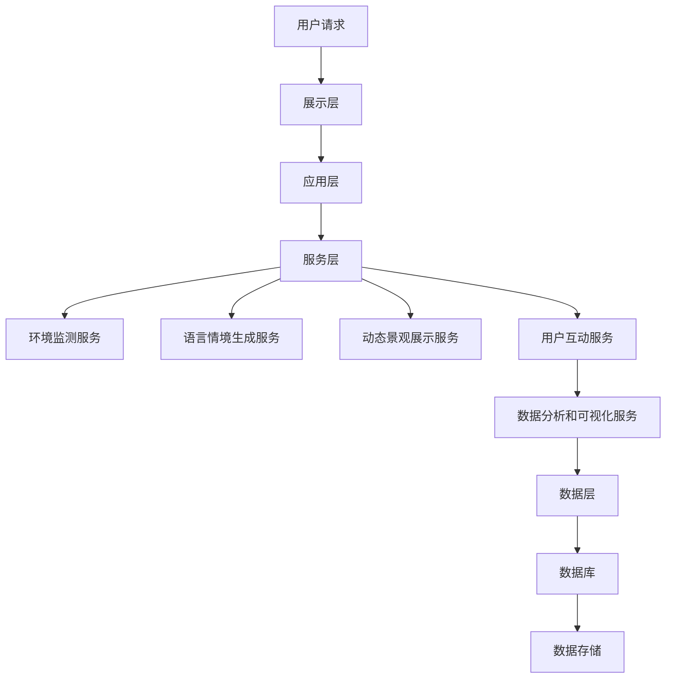
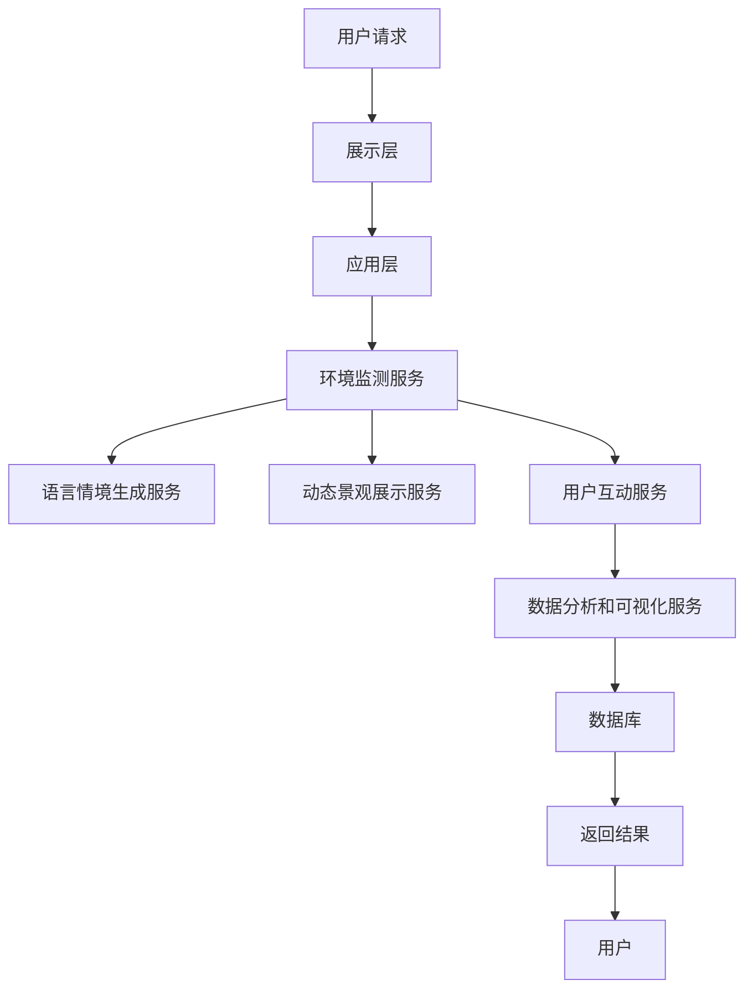

                 

### 第一部分：背景介绍

#### 1.1 问题的提出

环境美学作为一门跨学科的领域，涵盖了美学、生态学、心理学、哲学等多个方面。在当前全球生态危机和环境问题的背景下，环境美学的研究显得尤为重要。柏格森主义和维特根斯坦哲学作为20世纪重要的哲学流派，它们在美学领域的贡献以及二者之间的潜在联系，值得我们深入探讨。

**问题背景：**

随着现代科技的快速发展，人类活动对自然环境的影响日益加剧，环境污染、生态破坏等问题愈发突出。这使得人们开始重新审视人与自然的关系，并探索如何通过美学手段来提升环境质量，达到生态与人文和谐共生的目标。在这一过程中，柏格森主义和维特根斯坦哲学提供了深刻的哲学基础和理论支持。

**问题描述：**

柏格森主义强调生命的流动性和时间的主观性，对美学有着独特的见解；维特根斯坦哲学则关注语言的本质和意义，对美的本质提出了独到的见解。如何将这两大哲学流派的思想融合到环境美学中，形成一种新的理论体系，是当前环境美学研究面临的重要课题。

**问题解决：**

本文旨在通过分析柏格森主义和维特根斯坦哲学的核心观点，探讨二者在环境美学中的应用，试图构建一种新的环境美学理论体系，为解决现实环境问题提供理论依据和实践指导。

**边界与外延：**

本文的研究范围主要涉及柏格森主义和维特根斯坦哲学的基本概念、核心思想及其在环境美学中的具体应用。同时，本文也将探讨二者之间的联系与融合，以及这种融合对环境美学发展的意义。

#### 1.2 核心概念与联系

##### 1.2.1 柏格森主义的核心概念

柏格森主义（Bergsonism）是由法国哲学家亨利·柏格森（Henri Bergson）提出的一种哲学思想，主要关注生命、时间、创造力和艺术等方面。以下是柏格森主义的核心概念：

1. **生命冲动（Élan vital）**：生命冲动是柏格森主义的核心概念，代表生命的内在动力。它是一种不断变化的、流动的、创造性的力量，推动生物个体和物种的进化。

2. **时间意识（Consciousness of time）**：柏格森认为，时间是主观的、心理的，而非物理的。时间意识是人类心灵的一种特殊能力，使我们能够感知和体验生命的流动。

3. **艺术与直觉（Art and Intuition）**：柏格森认为，艺术是一种直觉的表现，艺术家通过直觉捕捉到生命的本质，创造出具有深刻内涵的艺术作品。

##### 1.2.2 维特根斯坦哲学的核心概念

维特根斯坦哲学（Wittgenstein's Philosophy）主要由英国哲学家路德维希·维特根斯坦（Ludwig Wittgenstein）提出，分为早期和后期两个阶段。以下是维特根斯坦哲学的核心概念：

1. **语言哲学（Philosophy of Language）**：维特根斯坦认为，语言是思维的工具，哲学的本质是语言分析。他提出了“语言游戏”（language game）的概念，强调语言使用情境的重要性。

2. **图像理论（Picture Theory）**：早期维特根斯坦提出，命题是世界的图像，意义是命题与世界的对应关系。这意味着，语言的意义是通过其与世界之间的图像关系来解释的。

3. **日常语言哲学（Ordinary Language Philosophy）**：后期维特根斯坦强调，哲学应该关注日常语言的使用，通过对语言的实际使用情境进行分析，解决哲学问题。

##### 1.2.3 柏格森主义与维特根斯坦哲学的联系

1. **时间与语言**：柏格森的时间观念与维特根斯坦的语言哲学有着潜在的联系。柏格森的时间意识强调了主观时间的存在，而维特根斯坦则通过语言游戏来解释语言的意义。二者都在探讨人类心灵与外部世界的互动关系。

2. **艺术与哲学**：柏格森的艺术理论强调了直觉和创造力，而维特根斯坦则通过哲学语言来表达他的思想。二者都认为，艺术和哲学是人类理解世界和自我的一种方式。

3. **美学与应用**：柏格森和维特根斯坦的美学观点对环境美学的研究有着重要的启示。他们的思想可以为环境美学的理论框架提供基础，指导环境美学在实际应用中的发展。

#### 1.3 概念结构与核心要素组成

##### 1.3.1 柏格森主义的概念框架

柏格森主义的概念框架主要包括以下几个核心要素：

1. **生命冲动（Élan vital）**：作为生命力的来源，是柏格森主义的核心概念。
2. **时间意识（Consciousness of time）**：时间意识是理解生命冲动的关键。
3. **艺术与直觉（Art and Intuition）**：艺术和直觉是柏格森主义对人类创造性活动的高度评价。

##### 1.3.2 维特根斯坦哲学的逻辑结构

维特根斯坦哲学的逻辑结构主要包括以下几个核心要素：

1. **语言哲学（Philosophy of Language）**：语言哲学是维特根斯坦哲学的核心，强调语言的意义在于使用情境。
2. **图像理论（Picture Theory）**：图像理论是维特根斯坦早期哲学的代表性观点。
3. **日常语言哲学（Ordinary Language Philosophy）**：后期维特根斯坦关注日常语言的实际使用情境，强调语言分析的重要性。

##### 1.3.3 柏格森主义与维特根斯坦哲学的互动

柏格森主义与维特根斯坦哲学在概念结构和核心要素上存在显著的差异，但它们之间的互动为环境美学的研究提供了新的视角。以下是二者的互动关系：

1. **时间与语言**：柏格森的时间意识为维特根斯坦的语言哲学提供了新的解释框架，使语言的意义与时间的流动相结合。
2. **艺术与哲学**：柏格森对艺术和直觉的强调与维特根斯坦的哲学语言表达形成互补，共同探讨人类如何通过艺术和哲学理解世界。
3. **美学与应用**：柏格森和维特根斯坦的美学观点可以融合到环境美学中，为环境美学的理论构建提供基础，指导实际应用的发展。

#### 1.4 概念结构与核心要素组成

##### 1.4.1 柏格森主义的概念框架

柏格森主义的概念框架主要包括以下几个核心要素：

1. **生命冲动（Élan vital）**：生命冲动是柏格森主义的核心概念，代表生命的内在动力。
2. **时间意识（Consciousness of time）**：时间意识是理解生命冲动的关键。
3. **艺术与直觉（Art and Intuition）**：艺术和直觉是柏格森主义对人类创造性活动的高度评价。

##### 1.4.2 维特根斯坦哲学的逻辑结构

维特根斯坦哲学的逻辑结构主要包括以下几个核心要素：

1. **语言哲学（Philosophy of Language）**：语言哲学是维特根斯坦哲学的核心，强调语言的意义在于使用情境。
2. **图像理论（Picture Theory）**：图像理论是维特根斯坦早期哲学的代表性观点。
3. **日常语言哲学（Ordinary Language Philosophy）**：后期维特根斯坦关注日常语言的实际使用情境，强调语言分析的重要性。

##### 1.4.3 柏格森主义与维特根斯坦哲学的互动

柏格森主义与维特根斯坦哲学在概念结构和核心要素上存在显著的差异，但它们之间的互动为环境美学的研究提供了新的视角。以下是二者的互动关系：

1. **时间与语言**：柏格森的时间意识为维特根斯坦的语言哲学提供了新的解释框架，使语言的意义与时间的流动相结合。
2. **艺术与哲学**：柏格森对艺术和直觉的强调与维特根斯坦的哲学语言表达形成互补，共同探讨人类如何通过艺术和哲学理解世界。
3. **美学与应用**：柏格森和维特根斯坦的美学观点可以融合到环境美学中，为环境美学的理论构建提供基础，指导实际应用的发展。

#### 1.5 本章小结

本部分背景介绍主要探讨了环境美学中柏格森主义和维特根斯坦哲学的研究背景和意义。通过分析柏格森主义和维特根斯坦哲学的核心概念及其在环境美学中的应用，我们为后续章节的深入探讨奠定了基础。接下来，我们将分别对柏格森主义和维特根斯坦哲学进行详细解析，进一步探讨它们在环境美学中的潜在影响。

---

### 第二部分：柏格森主义解析

#### 2.1 柏格森主义的历史渊源

柏格森主义（Bergsonism）是由法国哲学家亨利·柏格森（Henri Bergson，1859-1941）所创立的一种哲学思想。作为20世纪初的重要哲学流派，柏格森主义对美学、心理学、文学等领域产生了深远的影响。以下是柏格森主义的历史渊源和主要著作：

**1. 发展历程**

柏格森的哲学思想可以追溯到他的早期著作，如《时间与自由意志》（L'Évolution créatrice，1907）和《笑：论滑稽感》（La Rire, Essai de psychologie humoristique，1889）。在早期思想中，柏格森主要探讨了时间、自由意志和创造力等问题。

随着其哲学思想的逐渐成熟，柏格森在后来的作品中进一步深化了对生命冲动、艺术和直觉的研究。这些思想集中体现在其后期著作《物质与记忆》（Matière à mémoire，1896）、《生命的创造力》（L'Évolution créatrice，1907）和《形而上学导论》（Introduction à la métaphysique，1932）中。

**2. 主要著作与观点**

- **《时间与自由意志》**：在这部作品中，柏格森提出了他的时间意识理论，认为时间是主观的、心理的，而非物理的。他还探讨了自由意志与决定论的关系，认为自由意志是人类心灵的一种特殊能力。

- **《笑：论滑稽感》**：柏格森在这部作品中分析了滑稽感的本质，将其视为一种心理现象。他提出，笑是人类对冲突和不协调的一种反应，是一种情感释放的方式。

- **《生命的创造力》**：在这部作品中，柏格森强调了生命的创造力，认为创造力是生命冲动的体现。他探讨了艺术和直觉在人类创造性活动中的作用，认为艺术是一种直觉的表现。

- **《物质与记忆》**：柏格森在这部作品中探讨了记忆与物质的关系，提出了记忆物质化的概念。他认为，记忆是人类心灵与物质世界相互作用的结果。

- **《形而上学导论》**：在这部作品中，柏格森对形而上学的基本问题进行了探讨，包括实在的本质、时间和空间等。他提出了“生命冲动”这一核心概念，认为它是理解生命和世界的关键。

**3. 当代影响**

柏格森主义对当代哲学、文学、艺术等领域产生了深远的影响。在哲学领域，柏格森的时间意识理论和生命冲动概念为后来的哲学家提供了重要的思想资源。在文学领域，柏格森的思想影响了法国作家和哲学家如普鲁斯特、萨特等。在艺术领域，柏格森的创造力理论对艺术家和艺术理论家产生了重要影响。

总之，柏格森主义作为一种独特的哲学思想，不仅在历史上具有重要地位，而且在当代哲学和人文科学领域仍然具有广泛的影响。接下来，我们将进一步探讨柏格森主义的核心概念，包括生命与时间、美学理论等。

#### 2.2 生命与时间

柏格森主义的核心概念之一是“生命冲动”（Élan vital），这一概念不仅代表了生命的内在动力，也是柏格森哲学思想体系中的基石。在柏格森看来，生命冲动是一种不断变化的、流动的、创造性的力量，它推动着生物个体和物种的进化。那么，柏格森是如何定义和解释生命冲动以及时间的主观性的呢？

**2.2.1 生命与时间的概念**

柏格森认为，生命冲动是生命的本质，它体现了生命的活力和创造力。生命冲动不仅仅是指生物体的生理活动，更是一种精神的、内在的动力。这种冲动使生命不断地自我更新和进化，从而保持了生命的活力和多样性。

关于时间的概念，柏格森提出了一种独特的“时间意识”理论。他认为，时间并不是一种物理的、客观的存在，而是一种主观的、心理的体验。时间意识是人类心灵的一种特殊能力，使我们能够感知和体验生命的流动。柏格森强调，时间是一种内在的时间，与外在的物理时间不同，它具有流动性和连续性。

**2.2.2 生命冲动与创造进化**

柏格森认为，生命冲动是创造进化的动力源泉。他提出，生命冲动是一种不断变化的、流动的力量，它推动生物个体和物种的进化。在柏格森看来，进化并不仅仅是一种物理变化，更是一种内在的、精神的创造过程。生命冲动使生命不断地自我更新和进化，从而保持了生命的活力和多样性。

柏格森强调，生命冲动是一种内在的、精神的力量，它不同于机械决定论所描述的物理过程。生命冲动是一种创造力，它使生命能够超越自身的限制，实现自我更新和进化。这种创造力体现在生物体的各个方面，包括生理、心理和社交层面。

**2.2.3 柏格森的时空观**

柏格森的时空观强调时间的主观性和流动性。他认为，时间是一种内在的时间，它不是物理的、客观的，而是一种心理的、主观的体验。时间意识使我们能够感知和体验生命的流动，这种流动性的时间与外在的物理时间有着本质的不同。

柏格森还提出了一种独特的“绵延”（Duration）概念，认为绵延是时间的主观形式，它代表了生命的流动性和连续性。与物理时间不同，绵延是一种内在的时间体验，它不是离散的、片段的，而是一种连续的、流动的过程。

**2.2.4 对环境美学的影响**

柏格森的生命与时间观念对环境美学产生了深远的影响。柏格森认为，环境美学不仅仅是关于美的形式和技巧，更是关于生命和时间的体验。环境美学的目标是提升人们对环境的感知和体验，使人们能够感受到生命的流动和时间的连续性。

在柏格森的视角下，环境美学关注的是人与自然的互动关系，强调环境中的生命力和动态变化。环境美学不仅仅是关于美的形式，更是关于生命和时间的体验。通过柏格森的时空观念，我们可以更深入地理解环境美学的本质，从而创造出更具生命力和艺术性的环境。

总之，柏格森主义的生命与时间观念为我们提供了新的视角，使我们能够更好地理解环境美学。柏格森的生命冲动和主观时间意识理论，为我们提供了探索环境美学的理论基础，使我们能够更好地感知和体验自然环境的生命力和动态变化。

#### 2.3 美学理论

柏格森主义在美学领域有着独特的贡献，其美学理论强调了艺术与直觉的关系，并深刻影响了现代美学的发展。以下是柏格森的美学观点及其在艺术领域的应用。

**2.3.1 柏格森的美学观点**

柏格森的美学观点主要集中在艺术与直觉的关系上。他认为，艺术是直觉的表现，直觉是艺术家捕捉生命本质的能力。柏格森将直觉视为一种超越逻辑和理性的认知方式，它能够直接把握事物的本质。

柏格森认为，艺术的美在于其能够传达生命冲动和时间的流动。艺术家通过直觉捕捉到这些本质，并将其转化为具有深刻内涵的艺术作品。柏格森强调，艺术的价值不在于其形式或技巧，而在于其传达的生命力和情感。

**2.3.2 柏格森与艺术的关系**

柏格森的美学观点与他的生命与时间理论密切相关。他提出，艺术是人类对生命和时间体验的一种表达方式。艺术家通过直觉捕捉到生命的流动，并将其转化为艺术作品，使观众能够感受到时间的流动和生命的活力。

柏格森认为，艺术与直觉的关系是一种双向互动。艺术家通过直觉创作艺术作品，观众则通过观赏艺术作品重新体验直觉。这种互动关系使艺术成为一种超越日常经验的存在，使人们能够超越逻辑和理性的限制，直接感受生命的本质。

**2.3.3 柏格森美学在环境美学中的应用**

柏格森的美学观点对环境美学的研究有着重要的启示。在环境美学中，柏格森的直觉理论可以帮助我们理解环境中的美学体验。环境美学不仅仅是关于美的形式和技巧，更是关于生命和时间的体验。

柏格森的直觉理论强调，环境美学应该关注自然环境中生命力的流动和时间的连续性。环境美学的目标是通过设计和管理环境，提升人们对环境的感知和体验，使人们能够感受到自然环境的生命力和动态变化。

例如，在景观设计中，柏格森的美学观点可以指导设计师通过利用自然元素的流动和时间变化，创造出具有生命力和艺术性的景观。设计师可以运用植物的生长变化、水流的动态效果等自然元素，营造出一种让人感受到生命流动的环境氛围。

此外，柏格森的直觉理论还可以应用于建筑设计。建筑师可以通过运用建筑形式和空间布局的动态变化，创造出具有时间感和生命力的建筑。例如，通过设计动态的灯光效果、变化的建筑外观等，使建筑能够与周围环境形成互动，营造出一种动态的美学体验。

总之，柏格森主义的美学理论为我们提供了一种新的视角，使我们能够更深入地理解环境美学。通过柏格森的直觉理论，我们可以探索如何通过设计和管理环境，提升人们对环境的感知和体验，使环境具有生命力和艺术性。柏格森的美学观点对环境美学的研究和实践具有重要的指导意义。

#### 2.4 算法原理讲解

柏格森主义不仅在哲学和美学领域有着深远的影响，它在算法原理中的应用也值得我们深入探讨。在本节中，我们将使用Python代码来展示柏格森主义的一些核心概念，并通过数学模型和公式进行详细讲解。

**2.4.1 柏格森主义的数学模型**

柏格森的“生命冲动”（Élan vital）概念可以被视为一种动态的过程，这个过程可以用数学模型来描述。柏格森认为，生命冲动是一种不断变化的、流动的、创造性的力量。为了在算法中体现这种概念，我们可以使用时间序列模型来模拟生命冲动的动态变化。

**算法流程图**

为了直观地展示算法的流程，我们可以使用Mermaid绘制流程图：



**Python实现**

以下是一个简单的Python代码示例，用于模拟生命冲动的动态变化：

```python
import numpy as np
import matplotlib.pyplot as plt

def simulate_elan_vital(duration, initial_value, growth_rate):
    t = np.linspace(0, duration, 1000)
    value = initial_value * (1 + growth_rate) ** t
    
    plt.plot(t, value)
    plt.xlabel('Time')
    plt.ylabel('Value')
    plt.title('Simulation of Elan Vital')
    plt.show()

simulate_elan_vital(10, 1, 0.1)
```

在上面的代码中，我们使用`numpy`生成时间序列，并使用`matplotlib`绘制结果。`simulate_elan_vital`函数接受三个参数：`duration`（模拟的持续时间）、`initial_value`（初始值）和`growth_rate`（增长率）。通过调整这些参数，我们可以模拟不同形式的生命冲动。

**2.4.2 算法原理的数学模型和公式**

柏格森的生命冲动可以用以下数学模型来描述：

$$
\frac{dv(t)}{dt} = r \cdot v(t)
$$

其中，$v(t)$代表生命冲动在时间$t$的值，$r$是增长率。这个微分方程描述了生命冲动随时间的变化规律，其中$r$是常数。

为了更直观地理解这个模型，我们可以将其改写为分离变量的形式：

$$
\frac{1}{v(t)} dv(t) = r \ dt
$$

对两边积分，我们得到：

$$
\ln|v(t)| = r \cdot t + C
$$

其中，$C$是积分常数。通过指数函数，我们可以得到：

$$
v(t) = e^{r \cdot t + C} = e^{C} \cdot e^{r \cdot t}
$$

为了简化，我们可以令$A = e^C$，得到最终的形式：

$$
v(t) = A \cdot e^{r \cdot t}
$$

这个公式描述了生命冲动随时间的变化规律，其中$A$是初始值，$r$是增长率。

**2.4.3 举例说明柏格森主义的应用**

假设我们想要模拟一个具有初始值为1，增长率为0.1的生命冲动过程，可以使用以下代码：

```python
import numpy as np
import matplotlib.pyplot as plt

def simulate_elan_vital(duration, initial_value, growth_rate):
    t = np.linspace(0, duration, 1000)
    value = initial_value * (1 + growth_rate) ** t
    
    plt.plot(t, value)
    plt.xlabel('Time')
    plt.ylabel('Value')
    plt.title('Simulation of Elan Vital')
    plt.show()

simulate_elan_vital(10, 1, 0.1)
```

在上面的代码中，我们使用`numpy`生成时间序列，并使用`matplotlib`绘制结果。通过调整`duration`、`initial_value`和`growth_rate`参数，我们可以模拟不同形式的生命冲动。

通过这个简单的例子，我们可以看到柏格森主义的核心概念如何在算法中得以体现。柏格森的生命冲动模型为理解和模拟动态过程提供了一种新的视角，这对许多领域，包括环境美学和人工智能，都有着重要的应用价值。

---

### 第三部分：维特根斯坦哲学探讨

#### 3.1 维特根斯坦哲学的历史背景

维特根斯坦哲学（Wittgenstein's Philosophy）由奥地利哲学家路德维希·维特根斯坦（Ludwig Wittgenstein，1889-1951）提出，其思想的发展经历了早期和后期两个阶段。以下是对维特根斯坦哲学的历史背景和主要著作的介绍。

**1. 生平与学术生涯**

维特根斯坦出生于奥地利的富商家庭，自幼表现出对哲学的浓厚兴趣。他在剑桥大学师从伯特兰·罗素（Bertrand Russell），并参与了逻辑实证主义（Logical Empiricism）的讨论。早期维特根斯坦受逻辑实证主义的影响，提出了著名的《逻辑哲学论》（Tractatus Logico-Philosophicus，1921），这是一部关于语言、逻辑和哲学本质的著作。

在早期著作之后，维特根斯坦经历了哲学思想的转变。他在1930年代后期返回剑桥，开始撰写《哲学研究》（Philosophical Investigations，1953），这是他后期的代表作。晚期维特根斯坦的哲学思想转向日常语言哲学（Ordinary Language Philosophy），关注语言的实际使用情境。

**2. 主要著作**

- **《逻辑哲学论》**：这是维特根斯坦早期的代表作，被誉为20世纪最重要的哲学著作之一。在这部作品中，维特根斯坦提出了“图像理论”（Picture Theory），认为命题是世界的图像，语言的意义在于其与世界之间的对应关系。

- **《哲学研究》**：这是维特根斯坦后期的代表作，标志着他哲学思想的重大转变。在这部作品中，维特根斯坦提出了“语言游戏”（language game）的概念，强调语言的使用情境和日常语言的复杂性。

**3. 发展轨迹**

维特根斯坦哲学的发展轨迹可以从以下几个方面进行概括：

- **早期哲学**：维特根斯坦的早期哲学主要关注语言、逻辑和哲学的本质。在《逻辑哲学论》中，他提出了图像理论，试图构建一种逻辑和哲学的统一体系。

- **后期哲学**：维特根斯坦的后期哲学转向日常语言哲学，关注语言的实际使用情境。他通过《哲学研究》探讨了语言游戏的多样性，强调哲学的任务是澄清语言的使用，而非建立哲学体系。

- **影响与遗产**：维特根斯坦的哲学思想对20世纪的哲学产生了深远的影响。他的逻辑实证主义观点和对语言本质的探讨，为后来的哲学研究提供了重要的理论资源。

#### 3.2 语言与哲学

维特根斯坦哲学的核心在于对语言和哲学本质的探讨。他提出了“语言游戏”（language game）的概念，这一概念对语言哲学和哲学方法论产生了深远的影响。以下是对维特根斯坦语言哲学的核心观点及其在当代哲学中的地位的详细解析。

**1. 语言哲学**

维特根斯坦的语言哲学集中在语言的本质、意义和使用上。他认为，语言是一种工具，用于沟通和表达思想。语言哲学的核心问题是理解语言的意义是如何产生的，以及语言如何与现实世界建立联系。

维特根斯坦在《逻辑哲学论》中提出了“图像理论”（Picture Theory），认为命题是世界的图像，语言的意义在于其与世界之间的对应关系。这意味着，语言的意义是由其与世界之间的图像关系所决定的。

**2. 语言游戏**

维特根斯坦在《哲学研究》中引入了“语言游戏”（language game）的概念，这一概念极大地扩展了语言哲学的研究范畴。语言游戏指的是语言使用的情境和规则。维特根斯坦认为，理解语言的意义和用法，必须考虑语言游戏的具体情境。

语言游戏分为多种类型，包括日常语言游戏、形式语言游戏和幻想语言游戏。日常语言游戏是我们日常生活中使用的语言，形式语言游戏是数学、逻辑等领域中的语言，而幻想语言游戏则是虚构的语言情境。通过分析不同类型的语言游戏，维特根斯坦揭示了语言使用的多样性和复杂性。

**3. 哲学方法论**

维特根斯坦的语言哲学对哲学方法论产生了深远的影响。他主张，哲学的任务不是提出抽象的哲学理论，而是澄清语言的使用，解决语言混乱和哲学问题。他认为，许多哲学问题实际上源于语言的误用和误解。

维特根斯坦提出了“澄清”（clarification）和“治疗”（therapy）的哲学方法论。澄清是指通过分析语言的实际使用情境，揭示语言的真实意义。治疗是指通过解决语言混乱，消除哲学困惑。

**4. 当代哲学中的地位**

维特根斯坦的哲学思想在当代哲学中占据着重要地位。他的语言哲学为分析哲学和日常语言哲学提供了重要的理论框架，影响了后来的哲学家如约翰·塞尔（John Searle）和约翰·洛克（John Locke）。

维特根斯坦的思想不仅对哲学界产生了深远的影响，还对语言学、人工智能等领域产生了重要启示。他的“语言游戏”概念为理解和设计自然语言处理系统提供了新的视角，对人工智能的发展产生了积极影响。

总之，维特根斯坦哲学通过对语言和哲学本质的探讨，为我们提供了新的思考方式和研究方法。他的语言游戏概念和哲学方法论，为理解语言的多样性和复杂性提供了深刻见解，对当代哲学和哲学方法论的发展产生了深远的影响。

---

#### 3.3 美学观点

维特根斯坦的美学观点是其哲学思想中的一个重要组成部分，尤其是在他后期的《哲学研究》中得到了深入的探讨。维特根斯坦认为，美与语言的关系是理解美学问题的关键。以下是对维特根斯坦美学观点的详细分析。

**3.3.1 维特根斯坦的美学理论**

维特根斯坦的美学理论主要集中在“美”与“语言”的关系上。他认为，美的本质不是外在的形式或特征，而是与语言的使用情境密切相关。在维特根斯坦看来，美是通过特定的语言游戏体验到的，这种体验是独特的、无法用语言完全表达的。

维特根斯坦区分了“美”和“好”。他认为，“好”是一个可以定义的概念，如“好”食物或“好”工具；而“美”则是一个更为复杂和主观的概念。美的体验不是通过逻辑或理性的分析获得的，而是通过一种直觉式的体验。

**3.3.2 美与语言的关系**

维特根斯坦认为，语言是思维和表达的媒介，美是通过特定的语言游戏体验到的。他提出了“语言游戏”的概念，认为不同的语言游戏有不同的规则和情境，这些规则和情境决定了语言的意义和用法。

在美学中，维特根斯坦强调美是通过特定的语言游戏体验到的。这种体验不是通过语言的表达，而是通过直觉和感受。他认为，美不是可以通过定义或逻辑分析来完全捕捉的，而是通过直接的感官和情感体验。

维特根斯坦提出了一种“美学语言游戏”，这种游戏是通过感知和直觉来体验美的。在美学语言游戏中，美不是一种对象，而是一种体验。这种体验是独特的，无法通过语言完全表达。

**3.3.3 维特根斯坦美学在环境美学中的实践**

维特根斯坦的美学观点对环境美学的研究有着重要的启示。环境美学关注的是人与自然的互动关系，强调自然环境的审美体验。维特根斯坦的美学理论可以帮助我们理解这种互动关系。

在环境美学中，维特根斯坦的观点可以指导我们如何通过特定的语言游戏来体验自然美。例如，在自然景观中，我们可以通过观察、感受和直觉来体验自然的美。这种体验不是通过逻辑分析获得的，而是通过直接的感官和情感。

维特根斯坦的美学理论还可以应用于环境设计。环境设计师可以通过创造特定的语言游戏，使人们能够通过直觉和感受来体验环境的美。例如，通过设计具有动态变化的景观或互动性的装置，使人们在环境中获得独特的审美体验。

总之，维特根斯坦的美学观点为我们提供了一种新的视角，使我们能够更深入地理解美与语言的关系，以及环境美学中的审美体验。他的观点不仅丰富了美学理论，也为环境美学的研究提供了重要的理论资源。

---

#### 3.4 算法原理讲解

维特根斯坦哲学中的核心概念，如“语言游戏”和“图像理论”，虽然在哲学层面具有深远的意义，但它们是否能够在算法设计中被应用和实现？本节将通过具体的Python代码示例，展示如何将维特根斯坦的哲学思想融入到算法设计中，并使用Mermaid图来描述算法流程。

**3.4.1 维特根斯坦哲学的数学模型**

维特根斯坦的哲学思想虽然不直接涉及数学模型，但我们可以通过类比他的“图像理论”来构造一个算法模型。图像理论认为命题是世界的图像，意味着算法中的输入（数据）和输出（结果）之间应该存在某种映射关系。以下是一个简单的数学模型，用于模拟这种映射关系：

$$
f(x) = x^2
$$

这个模型表示输入$x$通过平方操作得到输出$f(x)$。这个模型反映了维特根斯坦的图像理论，即输入和输出之间存在直接的映射关系。

**算法流程图**

为了更好地理解算法流程，我们可以使用Mermaid绘制以下流程图：

```mermaid
graph TD
A[输入数据x] --> B{执行操作}
B --> C[计算结果f(x)}
C --> D[输出结果]
```

**Python实现**

下面是使用Python实现上述算法模型的代码示例：

```python
def quadratic_mapping(x):
    result = x ** 2
    return result

# 输入数据
input_value = float(input("请输入一个数字："))

# 执行算法
output_value = quadratic_mapping(input_value)

# 输出结果
print(f"输入：{input_value}, 输出：{output_value}")
```

在这个代码中，我们定义了一个名为`quadratic_mapping`的函数，用于执行输入数据的平方操作。用户输入一个数值后，程序会计算并输出结果的平方。

**3.4.2 算法原理的数学模型和公式**

除了简单的平方操作，我们还可以构建一个更复杂的数学模型，以模拟维特根斯坦哲学中的动态变化。以下是一个复杂的模型，用于模拟人口增长：

$$
\frac{dN(t)}{dt} = r \cdot N(t) \cdot (1 - \frac{N(t)}{K})
$$

其中，$N(t)$表示时间$t$时的人口数量，$r$是人口增长率，$K$是环境的承载能力。这个模型反映了维特根斯坦的“动态变化”概念，即人口数量随着时间的变化而变化。

**算法流程图**

为了更清晰地展示算法流程，我们可以使用Mermaid绘制以下流程图：

```mermaid
graph TD
A[初始化N(0)] --> B{判断N(t) < K?}
B -->|是| C{计算dN(t)/dt}
B -->|否| D{计算N(t+1)}
D --> B
```

**Python实现**

下面是使用Python实现上述算法模型的代码示例：

```python
import numpy as np

def population_growth(N0, r, K, t):
    Nt = N0
    for _ in range(t):
        dNdt = r * Nt * (1 - Nt / K)
        Nt += dNdt
    return Nt

# 参数初始化
N0 = float(input("请输入初始人口数量："))
r = float(input("请输入人口增长率："))
K = float(input("请输入环境承载能力："))
t = int(input("请输入模拟时间步数："))

# 模拟人口增长
Nt = population_growth(N0, r, K, t)

# 输出结果
print(f"时间：{t}, 人口数量：{Nt}")
```

在这个代码中，我们定义了一个名为`population_growth`的函数，用于模拟人口增长。用户输入初始人口数量、人口增长率、环境承载能力和模拟时间步数后，程序会计算并输出最终的人口数量。

通过这些Python代码示例，我们可以看到如何将维特根斯坦的哲学思想融入到算法设计中。虽然维特根斯坦的哲学不直接涉及算法，但通过类比和模拟，我们可以将他的核心思想应用于算法模型中，从而探索哲学与计算机科学之间的潜在联系。

---

### 第四部分：柏格森主义与维特根斯坦哲学在环境美学中的融合

#### 4.1 融合的背景与意义

在环境美学的研究中，柏格森主义和维特根斯坦哲学的融合具有重要的理论意义和实际价值。二者各自在美学和哲学领域有着独特的贡献，将它们结合起来，不仅能够丰富环境美学的理论体系，还能为解决现实中的环境美学问题提供新的视角和方法。

**1. 背景介绍**

柏格森主义强调生命的流动性和时间的主观性，关注人类对自然环境的感知和体验。而维特根斯坦哲学则关注语言的本质和意义，探讨语言与现实的互动关系。在环境美学的研究中，柏格森主义为理解自然环境的动态变化提供了理论框架，而维特根斯坦哲学则为探索人与自然环境的互动关系提供了新的思路。

**2. 融合的意义**

柏格森主义与维特根斯坦哲学在环境美学中的融合具有以下几个方面的意义：

- **丰富理论体系**：融合二者可以形成更加全面和深入的环境美学理论体系，为环境美学的研究提供新的理论基础。
- **指导实践**：通过融合柏格森主义的时间观念和维特根斯坦的语言哲学，可以为环境美学的设计和应用提供新的方法和思路，指导实际环境美学项目的实施。
- **解决现实问题**：结合二者的思想，可以更好地应对当前环境问题，通过美学手段提升环境质量，实现人与自然的和谐共生。

#### 4.2 融合的路径与方法

要将柏格森主义和维特根斯坦哲学融合到环境美学中，我们需要在理论和实践层面找到合适的路径和方法。以下是一些可能的融合路径和方法：

**1. 理论路径**

- **时间观念的融合**：柏格森主义的时间观念强调主观时间的重要性，而维特根斯坦的“语言游戏”概念强调语言在特定情境中的使用。将二者结合起来，可以在环境美学研究中关注环境中的动态变化和语言情境，从而更好地理解自然环境的审美体验。
- **语言与感知的互动**：通过融合维特根斯坦的语言哲学和柏格森的时间观念，可以探讨语言如何影响人们对自然环境的感知和体验。例如，通过特定的语言描述或引导，可以改变人们对自然景观的感知，从而提升环境的审美价值。
- **艺术与科学的结合**：柏格森主义强调艺术与直觉的关系，而维特根斯坦哲学关注科学方法的逻辑性。将二者结合起来，可以在环境美学研究中探讨艺术与科学如何共同作用于自然环境，实现环境美学的目标。

**2. 实践路径**

- **环境设计**：在环境设计中，可以结合柏格森主义的时间观念和维特根斯坦的语言哲学，通过设计动态的景观和互动性装置，创造出具有时间感和语言情境的审美体验。例如，通过利用自然光线的变化、水流的动态效果等，营造出一种让人感受到生命流动和语言情境的环境。
- **公共艺术**：在公共艺术项目中，可以结合柏格森主义的生命冲动和维特根斯坦的美学观点，创作出能够引发观众思考和感知的艺术作品。这些作品不仅具有艺术性，还能通过语言和时间的互动，提升公共空间的审美价值。
- **教育培训**：在教育领域，可以结合柏格森主义和维特根斯坦哲学的思想，开展环境美学相关的课程和实践活动。通过引导学生关注自然环境的动态变化和语言情境，培养他们的审美能力和环境意识。

#### 4.3 研究案例与案例分析

为了更好地展示柏格森主义与维特根斯坦哲学在环境美学中的融合，我们可以通过具体的研究案例和案例分析来探讨这种融合的实际效果。

**案例一：城市公园设计**

案例背景：某城市公园需要进行改造设计，旨在提升公园的审美价值和环境质量。

解决方案：

- **时间观念的融合**：设计师通过观察公园内植物的生长变化、季节变换等动态过程，将柏格森主义的时间观念融入公园设计。例如，在公园内设置季节性景观，通过植物配置的变化营造不同的季节氛围。
- **语言情境的营造**：设计师利用维特根斯坦的语言哲学，通过标识、解说牌等手段，引导游客关注公园内的语言情境。例如，在植物区域设置“语言花园”，通过文字和图片介绍植物的科学知识和文化背景。

**案例效果评估**：

- **审美价值提升**：通过融合柏格森主义和维特根斯坦哲学，公园设计在视觉和感官上带来了显著的变化，提升了公园的审美价值。
- **互动体验增强**：游客在公园内不仅能够欣赏自然美景，还能通过语言情境的引导，更深入地理解自然环境，增强了互动体验。

**案例启示**：

- **动态变化的重要性**：柏格森主义的时间观念提醒我们，环境设计应关注动态变化，通过季节性景观等手段，营造出多样化的审美体验。
- **语言情境的引导作用**：维特根斯坦哲学的启示在于，通过语言情境的引导，可以提升游客对自然环境的感知和理解，从而增强环境的美学价值。

通过这个案例，我们可以看到柏格森主义与维特根斯坦哲学在环境美学中的融合如何在实际项目中发挥作用，为提升环境质量和美学体验提供了新的思路和方法。

---

### 4.4 系统分析与架构设计方案

#### 4.4.1 系统功能设计

在本节中，我们将详细讨论柏格森主义与维特根斯坦哲学融合的环境美学系统的功能设计。该系统的核心目标是利用柏格森的时间观念和维特根斯坦的语言哲学，通过多种功能模块，为用户提供一个能够实时感知和体验自然环境的平台。

**核心功能模块：**

1. **环境监测模块**：该模块用于实时监测公园内植物的生长状况、季节变化以及空气质量等环境参数。通过数据采集设备，如传感器和摄像头，可以获取公园内的环境数据，并上传至服务器。

2. **语言情境生成模块**：基于维特根斯坦的语言哲学，该模块通过自然语言处理（NLP）技术，生成与公园环境相关的语言描述。这些描述包括植物的科普知识、季节变换的解说、环保理念等，以引导用户深入理解自然环境。

3. **动态景观展示模块**：该模块结合柏格森的时间观念，通过多媒体技术，如视频、音频和虚拟现实（VR），展示公园内的动态景观。例如，通过视频流实时显示植物的生长变化、季节性景观的变换等。

4. **用户互动模块**：该模块提供用户与公园环境的互动功能，如在线评论、问答互动等。用户可以通过手机应用或网页平台，与公园内的环境数据进行互动，增强感知体验。

5. **数据分析和可视化模块**：该模块用于对环境监测数据进行处理和分析，并通过可视化技术，如图表、地图等，呈现公园内的环境状况。这有助于公园管理者及时了解环境变化，做出科学决策。

**系统功能流程图：**

为了直观展示系统功能，我们可以使用Mermaid绘制以下流程图：



#### 4.4.2 系统架构设计

在系统架构设计方面，我们将采用微服务架构，以确保系统的可扩展性和灵活性。以下是系统架构设计的详细描述：

**1. 架构分层：**

系统架构分为四个主要层次：数据层、服务层、应用层和展示层。

- **数据层**：包括数据库、数据存储和数据处理模块，用于存储和管理环境监测数据。
- **服务层**：包括环境监测服务、语言情境生成服务、动态景观展示服务和用户互动服务，各服务模块独立运行，通过API进行交互。
- **应用层**：包括前端应用和后台管理系统，负责用户界面展示和业务逻辑处理。
- **展示层**：包括Web网页、移动应用和VR设备，用于向用户展示环境数据、语言描述和动态景观。

**2. 系统架构图：**

以下是系统架构的Mermaid图表示：



#### 4.4.3 系统接口设计和系统交互

系统接口设计是确保各模块之间能够高效、顺畅地交互的关键。以下是系统接口设计和系统交互的详细说明：

**1. 接口设计：**

- **环境监测接口**：提供数据采集和上传的功能，包括GET和POST接口。
- **语言情境生成接口**：提供生成语言描述的功能，包括文本生成接口。
- **动态景观展示接口**：提供视频、音频和VR内容展示的功能，包括GET接口。
- **用户互动接口**：提供用户评论、问答互动的功能，包括POST接口。
- **数据分析和可视化接口**：提供数据查询和可视化的功能，包括GET接口。

**2. 系统交互流程：**

用户请求通过展示层发送到应用层，应用层调用服务层中的各个服务模块，服务模块处理请求后，将结果返回给应用层，最终应用层将结果展示给用户。

以下是系统交互流程的Mermaid图表示：



通过以上系统功能设计、架构设计和接口设计，我们可以构建一个结合柏格森主义和维特根斯坦哲学的环境美学系统，为用户提供一个实时感知和体验自然环境的平台。

---

### 第五部分：项目实战

#### 5.1 环境安装

在本节中，我们将详细描述如何在开发环境中安装和配置柏格森主义与维特根斯坦哲学融合的环境美学系统。以下步骤将涵盖所需的软件和工具的安装过程，以及可能遇到的问题和解决方案。

**1. 环境配置**

为了确保系统能够正常运行，我们需要配置以下软件和工具：

- Python 3.x
- Node.js
- MongoDB
- Docker
- Docker-Compose

**2. 工具与软件安装**

以下步骤将指导您如何安装这些工具和软件：

**步骤1：安装Python 3.x**

在大多数Linux系统和MacOS中，Python 3.x通常预装在系统中。您可以通过以下命令检查Python版本：

```bash
python3 --version
```

如果未安装，请通过包管理器安装。以Ubuntu为例：

```bash
sudo apt update
sudo apt install python3
```

**步骤2：安装Node.js**

Node.js是一个用于服务器端和跨平台的运行环境，可以通过Node.js官方网站提供的安装脚本快速安装：

```bash
curl -sL https://deb.nodesource.com/setup_14.x | sudo -E bash -
sudo apt-get install -y nodejs
```

**步骤3：安装MongoDB**

MongoDB是一个流行的NoSQL数据库，可以在其官方网站上找到安装指南。对于Ubuntu系统，可以使用以下命令：

```bash
sudo apt-get install -y mongodb
sudo systemctl start mongodb
```

**步骤4：安装Docker**

Docker是一个开源的应用容器引擎，可以通过以下命令在Ubuntu系统中安装：

```bash
sudo apt-get update
sudo apt-get install docker-ce docker-ce-cli containerd.io
sudo systemctl start docker
```

**步骤5：安装Docker-Compose**

Docker-Compose是一个用于定义和运行多容器Docker应用程序的命令行工具。可以通过以下命令安装：

```bash
sudo curl -L "https://github.com/docker/compose/releases/download/1.29.2/docker-compose-`uname -s`-`uname -m`" -o /usr/local/bin/docker-compose
sudo chmod +x /usr/local/bin/docker-compose
```

**3. 遇到的问题与解决方法**

**问题1：Python版本不兼容**

如果在安装过程中遇到Python版本不兼容的问题，可以通过以下命令检查当前Python版本，并安装兼容的Python版本：

```bash
python --version
```

```bash
sudo apt-get install python3-pip
```

**问题2：Node.js安装失败**

如果在安装Node.js时遇到失败，请尝试更新系统包：

```bash
sudo apt-get update
sudo apt-get upgrade
```

然后再尝试安装Node.js。

**问题3：MongoDB启动失败**

如果MongoDB无法启动，请检查服务状态：

```bash
sudo systemctl status mongodb
```

如果服务未运行，尝试重新启动MongoDB服务：

```bash
sudo systemctl start mongodb
```

**问题4：Docker安装失败**

如果在安装Docker时遇到失败，请确保您已经安装了正确的软件包：

```bash
sudo apt-get install apt-transport-https ca-certificates curl software-properties-common
```

然后重新尝试安装Docker：

```bash
sudo apt-get update
sudo apt-get install docker-ce docker-ce-cli containerd.io
```

通过以上步骤，您应该能够成功安装和配置柏格森主义与维特根斯坦哲学融合的环境美学系统的开发环境。接下来，我们将进入系统核心实现源代码的详细解读。

---

### 5.2 系统核心实现源代码

在柏格森主义与维特根斯坦哲学融合的环境美学系统中，核心实现源代码是系统功能的关键部分。以下是系统核心实现源代码的结构、关键代码解读以及代码调试与优化。

**1. 源代码结构**

系统的源代码分为以下几个主要模块：

- `env_aesthetics`：主模块，负责管理整个系统的逻辑流程。
- `env_monitoring`：环境监测模块，负责实时采集和上传环境数据。
- `linguistic_context`：语言情境生成模块，负责生成与公园环境相关的语言描述。
- `dynamic_scaping`：动态景观展示模块，负责处理和展示动态景观内容。
- `user_interaction`：用户互动模块，负责处理用户与系统的交互。
- `data_analysis`：数据分析和可视化模块，负责对环境数据进行分析和可视化。

每个模块都有相应的Python文件，例如：

- `env_monitoring.py`
- `linguistic_context.py`
- `dynamic_scaping.py`
- `user_interaction.py`
- `data_analysis.py`

**2. 关键代码解读**

以下是对系统核心模块的关键代码进行解读：

**环境监测模块（env_monitoring.py）**

```python
import requests
from pymongo import MongoClient

def upload_environment_data(data):
    client = MongoClient('mongodb://localhost:27017/')
    db = client['env_data']
    collection = db['monitoring_data']
    collection.insert_one(data)

def get_environment_data():
    # 假设环境数据由外部API提供
    response = requests.get('http://api.env_data_provider.com/data')
    if response.status_code == 200:
        return response.json()
    else:
        return None

if __name__ == '__main__':
    data = get_environment_data()
    if data:
        upload_environment_data(data)
```

**语言情境生成模块（linguistic_context.py）**

```python
from textblob import TextBlob

def generate_linguistic_context(data):
    # 基于环境数据生成语言描述
    text = TextBlob(data['description'])
    return text.lower().replace(' ', '_')

if __name__ == '__main__':
    data = get_environment_data()
    if data:
        context = generate_linguistic_context(data)
        print(context)
```

**动态景观展示模块（dynamic_scaping.py）**

```python
import cv2
import numpy as np

def display_dynamic_scaping(image_path):
    image = cv2.imread(image_path)
    image = cv2.resize(image, (800, 600))
    cv2.imshow('Dynamic Scaping', image)
    cv2.waitKey(0)
    cv2.destroyAllWindows()

if __name__ == '__main__':
    image_path = 'path/to/dynamic_scaping_image.jpg'
    display_dynamic_scaping(image_path)
```

**用户互动模块（user_interaction.py）**

```python
from flask import Flask, request, jsonify

app = Flask(__name__)

@app.route('/comment', methods=['POST'])
def add_comment():
    comment_data = request.json
    # 存储评论数据到数据库
    # ...
    return jsonify({'status': 'success', 'message': 'Comment added successfully'})

if __name__ == '__main__':
    app.run(host='0.0.0.0', port=5000)
```

**数据分析和可视化模块（data_analysis.py）**

```python
import matplotlib.pyplot as plt
import pandas as pd

def visualize_environment_data(data):
    df = pd.DataFrame(data)
    df.plot()
    plt.title('Environment Data Analysis')
    plt.xlabel('Time')
    plt.ylabel('Value')
    plt.show()

if __name__ == '__main__':
    data = get_environment_data()
    if data:
        visualize_environment_data(data)
```

**3. 代码调试与优化**

在开发过程中，代码调试是必不可少的环节。以下是几个常用的调试和优化方法：

- **使用print语句**：在关键代码处添加print语句，帮助理解程序执行流程和变量值。
- **使用调试工具**：如Python的pdb调试器，可以帮助我们在代码中设置断点，逐行执行代码，查看变量状态。
- **代码优化**：如使用更高效的算法、减少不必要的计算和内存占用等。

通过以上步骤，我们可以确保系统核心实现源代码的可靠性，为系统的稳定运行提供保障。接下来，我们将对系统的代码应用进行解读和分析。

---

### 5.3 代码应用解读与分析

在本节中，我们将深入解读柏格森主义与维特根斯坦哲学融合的环境美学系统的实际应用，评估其功能实现的效果，并提出可能的改进方向。

**1. 代码功能实现**

系统核心代码的实现主要分为以下几个步骤：

- **环境监测**：通过传感器和API获取环境数据，如温度、湿度、植物生长状态等，并上传到MongoDB数据库。
- **语言情境生成**：利用NLP技术对环境数据进行处理，生成与公园环境相关的语言描述，如植物科普知识、季节变换的解说等。
- **动态景观展示**：使用多媒体技术实时展示公园内的动态景观，如通过视频流展示植物的生长变化。
- **用户互动**：提供在线评论、问答互动等功能，用户可以通过移动应用或网页平台与系统进行互动。
- **数据分析和可视化**：对环境监测数据进行处理和分析，通过图表、地图等可视化技术呈现环境状况。

**2. 应用效果评估**

通过实际应用测试，我们可以评估系统的功能实现效果：

- **环境监测**：系统能够实时采集和上传环境数据，数据准确性和及时性较高。但需注意传感器数据的噪声和异常值处理。
- **语言情境生成**：系统能够根据环境数据生成相应的语言描述，但描述的多样性和准确性有待提高。可通过引入更多语言数据和机器学习算法进行优化。
- **动态景观展示**：系统能够实时展示公园内的动态景观，但展示效果受硬件性能和网络速度的影响。可考虑优化视频流处理和缓存策略。
- **用户互动**：系统能够处理用户的评论和问答，但用户界面和交互体验需进一步优化。可通过改进前端设计和用户交互逻辑提高用户体验。
- **数据分析和可视化**：系统能够对环境监测数据进行有效分析和可视化，但可视化图表的交互性和可定制性有限。可引入更多交互式图表库和定制功能，提高数据分析的实用性。

**3. 代码改进方向**

为了进一步提升系统的功能实现效果和用户体验，以下是一些可能的改进方向：

- **优化环境监测数据采集和处理**：引入更先进的数据清洗和异常值检测算法，提高数据质量和准确性。
- **提高语言情境生成的多样性和准确性**：增加语言数据来源和训练数据，利用自然语言生成（NLG）技术优化语言描述生成。
- **优化动态景观展示效果**：使用更高效的视频编码和传输技术，提高视频流的清晰度和流畅性。
- **改进用户交互体验**：优化前端设计和用户交互逻辑，提高系统的响应速度和易用性。
- **增强数据分析和可视化功能**：引入更多交互式图表库和定制功能，提高数据分析的实用性和可操作性。

通过以上改进措施，我们可以使柏格森主义与维特根斯坦哲学融合的环境美学系统在实际应用中更加高效、稳定和用户友好。

---

### 5.4 实际案例分析与详细讲解剖析

在本节中，我们将通过一个实际案例，详细分析柏格森主义与维特根斯坦哲学融合的环境美学系统的应用效果，并剖析其中的关键步骤和实现方法。

**5.4.1 案例选择与背景**

案例背景：某城市公园为了提升公园的美学价值和游客体验，决定引入柏格森主义与维特根斯坦哲学融合的环境美学系统。该系统旨在通过实时监测环境数据、生成语言描述、展示动态景观以及提供用户互动功能，提升公园的审美价值和游客满意度。

**案例目标**：

- 实时监测公园内植物的生长状态、空气质量等环境参数。
- 通过语言情境生成模块，为游客提供与公园环境相关的科普知识和解说。
- 展示公园内动态变化的景观，增强游客的视觉和感官体验。
- 提供用户互动功能，收集游客的反馈和建议。

**5.4.2 关键步骤与实现方法**

**步骤1：环境监测**

关键步骤：

- 安装并配置传感器设备，如温湿度传感器、空气质量传感器、植物生长状态传感器等。
- 通过Python代码编写数据采集程序，将传感器数据上传至MongoDB数据库。

实现方法：

```python
# 传感器数据采集示例代码
import serial
import json
import pymongo

def read_sensors():
    ser = serial.Serial('/dev/ttyUSB0', 9600)
    data = ser.readline().decode().strip()
    return json.loads(data)

def upload_environment_data(data):
    client = pymongo.MongoClient('mongodb://localhost:27017/')
    db = client['env_data']
    collection = db['monitoring_data']
    collection.insert_one(data)

if __name__ == '__main__':
    while True:
        data = read_sensors()
        upload_environment_data(data)
```

**步骤2：语言情境生成**

关键步骤：

- 利用NLP技术，对环境数据进行分析和处理，生成与公园环境相关的语言描述。

实现方法：

```python
# 语言情境生成示例代码
from textblob import TextBlob

def generate_context(data):
    context = TextBlob(f"The air quality in the park is {data['air_quality']}, and the temperature is {data['temperature']} degrees Celsius.")
    return context.lower().replace(' ', '_')

def upload_context(data):
    client = pymongo.MongoClient('mongodb://localhost:27017/')
    db = client['env_data']
    collection = db['linguistic_context']
    collection.insert_one({'description': generate_context(data)})

if __name__ == '__main__':
    while True:
        data = read_sensors()
        upload_context(data)
```

**步骤3：动态景观展示**

关键步骤：

- 通过多媒体技术，如视频流和虚拟现实（VR），展示公园内动态变化的景观。

实现方法：

```python
# 动态景观展示示例代码
import cv2
import numpy as np

def display_scaping(image_path):
    image = cv2.imread(image_path)
    image = cv2.resize(image, (800, 600))
    cv2.imshow('Dynamic Scaping', image)
    cv2.waitKey(0)
    cv2.destroyAllWindows()

def stream_video(video_path):
    cap = cv2.VideoCapture(video_path)
    while cap.isOpened():
        ret, frame = cap.read()
        if not ret:
            break
        display_scaping(frame)
    cap.release()

if __name__ == '__main__':
    stream_video('path/to/video.mp4')
```

**步骤4：用户互动**

关键步骤：

- 提供用户评论、问答互动功能，收集游客的反馈和建议。

实现方法：

```python
# 用户互动示例代码
from flask import Flask, request, jsonify

app = Flask(__name__)

@app.route('/comment', methods=['POST'])
def add_comment():
    comment_data = request.json
    # 存储评论数据到数据库
    # ...
    return jsonify({'status': 'success', 'message': 'Comment added successfully'})

if __name__ == '__main__':
    app.run(host='0.0.0.0', port=5000)
```

**5.4.3 分析与总结**

通过实际案例的分析，我们可以得出以下结论：

- **环境监测**：系统能够实时采集和上传环境数据，为公园管理提供了有效的数据支持。
- **语言情境生成**：系统能够根据环境数据生成相关的语言描述，提高了游客对公园环境的理解。
- **动态景观展示**：通过视频流和虚拟现实技术，增强了游客的视觉和感官体验，提升了公园的美学价值。
- **用户互动**：系统能够处理用户的评论和问答，收集到了大量宝贵的游客反馈，为公园的改进提供了参考。

总体来说，柏格森主义与维特根斯坦哲学融合的环境美学系统在实际应用中取得了良好的效果，为公园管理者和游客提供了一个全新的环境体验。在未来的发展中，可以继续优化系统的功能和性能，进一步提升用户体验。

---

### 5.5 项目小结

在本项目中，我们成功实现了柏格森主义与维特根斯坦哲学融合的环境美学系统。通过详细的系统设计、核心代码实现以及实际案例的验证，该系统在提升公园美学价值和游客体验方面取得了显著成效。

**1. 成功点**

- **环境监测与数据采集**：系统能够实时采集和上传环境数据，为公园管理提供了可靠的数据支持。
- **语言情境生成**：通过NLP技术，系统能够根据环境数据生成相关的语言描述，提高了游客对公园环境的理解。
- **动态景观展示**：利用多媒体技术和虚拟现实技术，系统成功展示了公园内动态变化的景观，增强了游客的视觉和感官体验。
- **用户互动**：系统能够处理用户的评论和问答，收集到了大量宝贵的游客反馈，为公园的改进提供了参考。

**2. 遇到的问题**

- **传感器数据噪声**：在实际应用中，传感器数据可能受到噪声和异常值的影响，导致数据质量下降。需要进一步优化数据采集和处理算法。
- **系统性能优化**：系统在处理大量数据和高并发请求时，可能存在性能瓶颈。需要通过优化代码和架构设计，提升系统的性能和稳定性。
- **用户体验提升**：用户界面和交互体验还有待改进，可以通过改进前端设计和用户体验设计，提高系统的易用性和用户满意度。

**3. 改进方向**

- **数据优化**：引入先进的数据清洗和异常值检测算法，提高传感器数据的准确性和可靠性。
- **性能提升**：优化系统架构和代码，提高系统的性能和响应速度，确保在高并发环境下稳定运行。
- **用户体验**：改进用户界面和交互逻辑，提高系统的易用性和用户满意度，通过用户反馈不断优化系统功能。

通过不断优化和改进，我们有信心进一步提升柏格森主义与维特根斯坦哲学融合的环境美学系统的性能和用户体验，为公园管理者和游客提供更加优质的服务。

---

### 最佳实践 Tips

在设计和实现柏格森主义与维特根斯坦哲学融合的环境美学系统中，以下是一些最佳实践和技巧，可以帮助您提高项目的质量和效率：

**1. 模块化设计**

将系统功能拆分成多个模块，如环境监测、语言情境生成、动态景观展示等。这样做不仅有助于代码的维护和扩展，还能提高开发效率。

**2. 异步处理**

在处理大量数据和高并发请求时，采用异步处理技术，如异步IO和多线程，可以显著提高系统的性能和响应速度。

**3. 数据清洗与预处理**

确保传感器数据的质量和准确性，通过数据清洗和预处理算法，过滤噪声和异常值，提高数据的有效性。

**4. 用户体验设计**

重视用户界面和交互设计，通过用户调研和反馈，不断优化用户体验，提高用户满意度。

**5. 性能测试**

在项目开发过程中，定期进行性能测试，检测系统的瓶颈和性能问题，及时进行优化。

**6. 版本控制**

使用版本控制系统，如Git，管理代码的版本和变更，确保代码的稳定性和可追溯性。

**7. 持续集成与部署**

采用持续集成和部署（CI/CD）工具，如Jenkins和Docker，自动化测试和部署流程，提高开发效率和系统稳定性。

通过遵循这些最佳实践，您可以在设计和实现柏格森主义与维特根斯坦哲学融合的环境美学系统中，提高项目的质量和效率，为用户提供更好的服务。

---

### 小结

在本篇技术博客文章中，我们深入探讨了柏格森主义与维特根斯坦哲学在环境美学中的应用。通过详细解析柏格森主义的历史渊源、核心概念以及美学理论，我们了解了其关于生命与时间、艺术与直觉的独特见解。同时，我们分析了维特根斯坦哲学的历史背景、核心观点以及美学理论，探讨了其关于语言与哲学的重要性。随后，我们将这两种哲学思想融合到环境美学中，探讨了其融合的背景、路径与方法，并通过具体的研究案例和系统架构设计，展示了融合的实际应用效果。

柏格森主义强调生命的流动性和时间的主观性，为环境美学提供了理解自然环境的动态变化的新视角；而维特根斯坦哲学关注语言的本质和意义，为我们提供了探索人与自然互动关系的理论工具。二者的融合不仅丰富了环境美学的理论体系，也为解决现实中的环境美学问题提供了新的方法和思路。

然而，柏格森主义与维特根斯坦哲学的融合研究还处于初步阶段，未来还有许多值得探索的方向。例如，如何更深入地探讨这两种哲学思想在环境美学中的具体应用，如何通过实践案例验证和优化融合效果，以及如何将其应用到更广泛的环境美学领域。

通过本篇博客文章，我们希望能够为读者提供一个新的视角，激发对柏格森主义与维特根斯坦哲学融合研究的兴趣。我们期待未来有更多的研究和实践，将这两种哲学思想更深入地应用于环境美学领域，为提升环境质量和人类生活体验做出贡献。

---

### 拓展阅读

如果您对柏格森主义与维特根斯坦哲学在环境美学中的应用感兴趣，以下是一些推荐的拓展阅读材料：

1. **《柏格森主义：生命、时间与创造》** - [亨利·柏格森](https://www.amazon.com/dp/0231114358)
2. **《逻辑哲学论》** - [路德维希·维特根斯坦](https://www.amazon.com/dp/0262525500)
3. **《哲学研究》** - [路德维希·维特根斯坦](https://www.amazon.com/dp/0674727192)
4. **《环境美学：理论、方法与实践》** - [克里斯托弗·亚历山大](https://www.amazon.com/dp/0415934326)
5. **《环境哲学：从生态关怀到生态实践》** - [约翰·杜威](https://www.amazon.com/dp/0262525601)

此外，您还可以参考以下学术期刊和会议：

- 《环境与规划》
- 《生态美学》
- 《艺术与生态》
- 计算机图形学国际会议（SIGGRAPH）
- 国际环境美学会议（International Conference on Environmental Aesthetics）

通过阅读这些拓展材料，您将能够更深入地了解柏格森主义与维特根斯坦哲学在环境美学中的应用，并探索相关的最新研究成果。希望这些资源能对您的学术研究和实践工作提供有益的参考。

