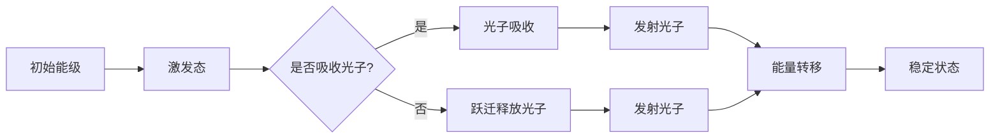
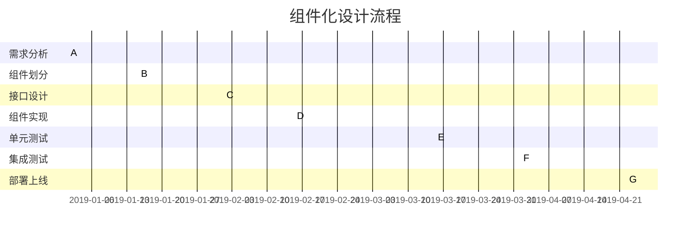
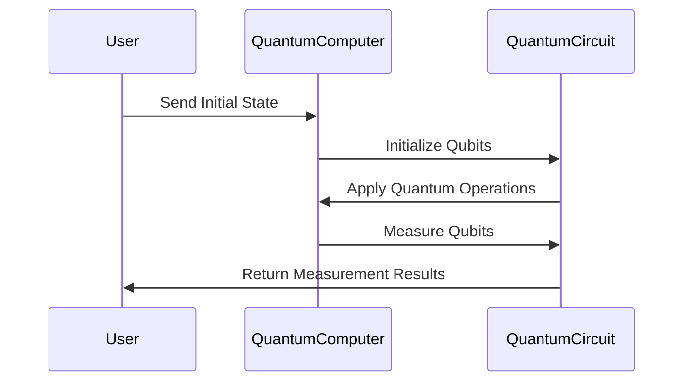
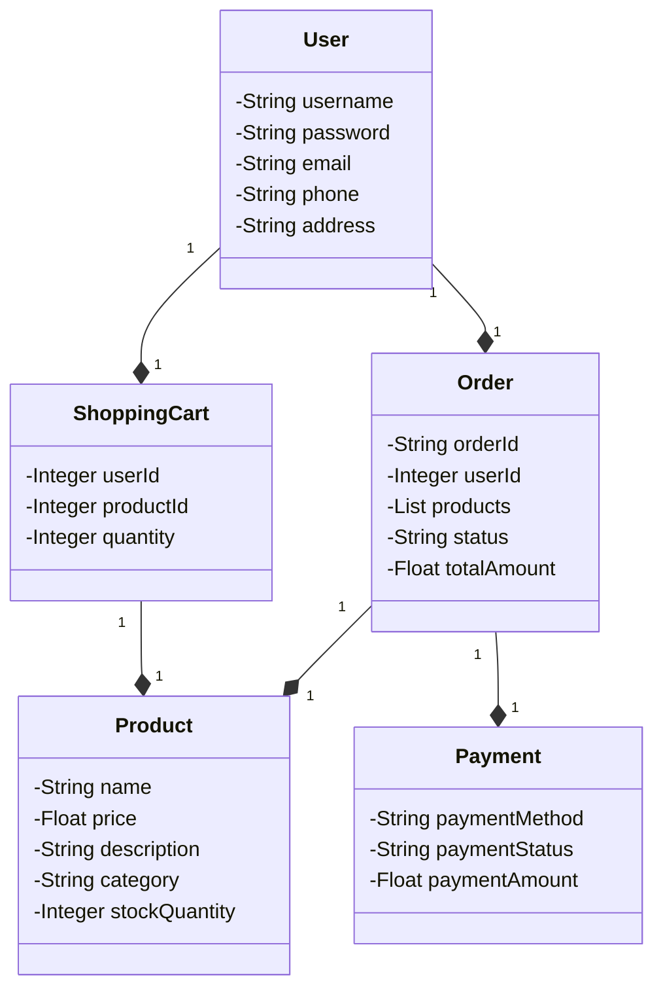
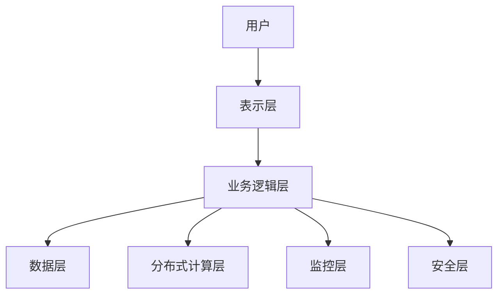
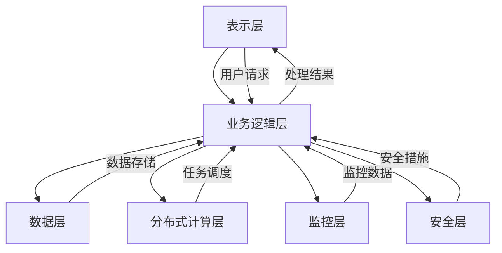
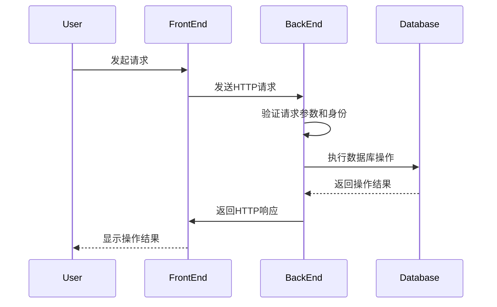
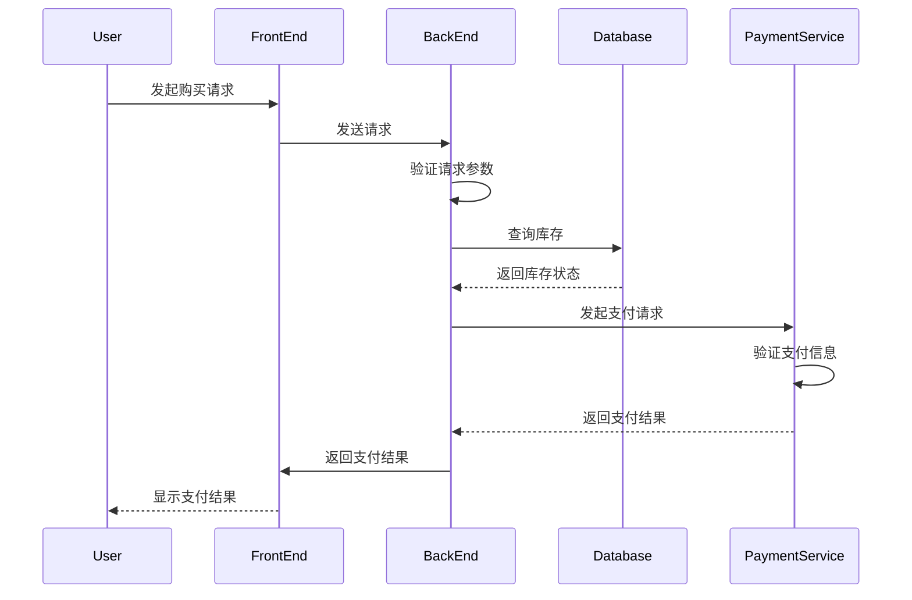

                 


### 第一部分：背景介绍

#### 1. 研究背景

在20世纪早期，原子模型的研究逐渐成为物理学界的热点话题。尼尔斯·玻尔（Niels Bohr）的原子模型为量子化思想在原子结构中的应用提供了重要启示。玻尔的模型基于量子理论，提出了电子在特定轨道上以离散的能量状态存在的假设，这一假设与经典物理学的连续能量模型有着根本的不同。玻尔原子模型不仅成功地解释了氢原子的光谱，还对后来的量子力学发展产生了深远的影响。

与此同时，软件工程领域也开始关注系统结构的组织方式。传统的系统设计方法往往依赖于过程驱动的设计模式，但随着系统的复杂度增加，这种模式逐渐暴露出许多局限性。组件化设计作为一种新型的系统设计方法，通过将系统划分为独立的、可重用的组件，提高了系统的可维护性和扩展性。组件化设计思想源于模块化编程，但其应用范围已经扩展到了整个软件系统。

将玻尔的原子模型与组件化设计相结合，是一种创新的研究方向。通过量子化思想，可以将系统结构的复杂性降低，使得系统设计更加简洁和高效。量子化表达不仅在物理学中有着广泛应用，如量子计算和量子通信，在软件工程领域也具有巨大的潜力。量子化表达可以将软件系统的抽象层次提高，从而使得系统分析、设计和实现过程更加清晰和易于理解。

本研究旨在探讨玻尔的原子模型与组件化设计之间的内在联系，并通过量子化表达来优化系统结构。通过这种结合，可以提升软件系统的性能，降低开发难度，并提高系统的可扩展性和可维护性。

#### 1.1 原子模型的发展历程

原子模型的研究可以追溯到19世纪初，约翰·道尔顿（John Dalton）提出了第一个现代原子理论，认为物质是由不可分割的原子组成的。这一理论奠定了现代化学的基础，但并没有解释原子的内部结构。

19世纪末，欧内斯特·马赫（Ernest Mach）和亨德里克·洛伦兹（Hendrik Lorentz）等人提出了电子云模型，认为电子在原子核周围作轨道运动。然而，这一模型无法解释电子如何保持稳定，也无法解释原子光谱的离散性。

1900年，马克斯·普朗克（Max Planck）提出了量子假设，即能量是量子化的，这一假设为量子力学的发展奠定了基础。1905年，爱因斯坦提出了光量子假设，进一步证明了能量量子化的正确性。

1911年，欧内斯特·卢瑟福（Ernest Rutherford）通过α粒子散射实验，提出了原子的核式结构模型，即原子由一个带正电的原子核和围绕原子核运动的电子组成。这一模型虽然成功解释了原子的电中性，但仍然无法解释原子光谱的离散性。

1924年，路易·德布罗意（Louis de Broglie）提出了物质波理论，认为电子不仅具有粒子性质，也具有波动性质。这一理论为后来的量子力学发展提供了新的视角。

1925年，沃尔夫冈·泡利（Wolfgang Pauli）提出了自旋概念，认为电子具有一种内在的角动量，这一理论成功解释了原子结构的稳定性。

1926年，埃尔温·薛定谔（Erwin Schrödinger）提出了薛定谔方程，为量子力学提供了数学基础。

1927年，海森堡（Werner Heisenberg）提出了不确定性原理，指出在量子尺度上，粒子的位置和动量无法同时被精确测量。

1928年，保罗·狄拉克（Paul Dirac）提出了狄拉克方程，成功统一了电子的波动性质和粒子性质。

这些理论的发展为原子模型的研究提供了坚实的理论基础，同时也揭示了原子结构的复杂性。玻尔的原子模型正是基于这些理论，通过引入量子化思想，对原子结构进行了更加准确的描述。

#### 1.2 量子化思想的影响

量子化思想在物理学中起到了至关重要的作用，其影响不仅局限于原子模型的研究，还扩展到了整个物理学领域。量子化思想的核心观点是能量和物理量不是连续的，而是由一系列离散的值组成。这一观点颠覆了经典物理学中的连续性假设，对科学理论和方法产生了深远的影响。

在原子模型的研究中，量子化思想的应用尤为显著。玻尔的原子模型正是基于量子化思想，提出了电子在特定轨道上以离散的能量状态存在的假设。这一假设不仅成功解释了氢原子的光谱，还揭示了原子结构的量子特性。量子化思想使得科学家能够以更加精确的方式描述原子结构，推动了量子力学的发展。

量子化思想在物理学中的影响还体现在其他方面。例如，量子场论（Quantum Field Theory，QFT）是研究基本粒子和力的理论框架，其核心思想是粒子是场的激发态。这一理论成功解释了粒子的性质和相互作用，为粒子物理学的发展提供了坚实的理论基础。

此外，量子化思想还在量子计算、量子通信和量子信息等领域有着广泛应用。量子计算利用量子位（qubit）的叠加和纠缠特性，实现了超乎经典计算机的计算能力。量子通信则利用量子态的不可克隆性和量子纠缠，实现了安全的信息传输。量子信息的研究不仅推动了计算机科学和通信技术的发展，还为密码学和量子控制提供了新的工具和方法。

总之，量子化思想在物理学中具有重要的地位，其影响不仅限于原子模型的研究，还扩展到了整个物理学领域。量子化思想为科学家提供了新的思考方式，推动了科学理论和方法的发展，为探索自然界的基本规律提供了强有力的工具。

#### 1.3 组件化设计的重要性

组件化设计是现代软件工程中的一种关键方法，它通过将系统划分为独立的、可重用的组件，提高了软件系统的可维护性和扩展性。组件化设计的重要性主要体现在以下几个方面：

首先，组件化设计有助于提高软件系统的可维护性。传统的系统设计方法通常依赖于复杂的全局变量和函数，这使得系统在修改和扩展时容易产生错误，增加了维护难度。而组件化设计通过将系统功能划分为独立的组件，每个组件都有自己的输入、输出和功能定义，从而降低了系统的耦合度，使得修改和扩展更加容易。

其次，组件化设计提高了软件系统的可扩展性。在组件化设计中，组件是独立的、可重用的，这意味着可以在不改变系统其他部分的情况下，简单地替换或添加新的组件，以实现新的功能。这种灵活性使得系统能够更加快速地适应变化的需求，提高了系统的适应性。

此外，组件化设计还促进了代码的重用。在组件化设计中，组件是可重用的，这意味着相同的功能可以由不同的组件实现，从而避免了代码的重复编写。这不仅减少了开发工作量，还提高了代码的质量和一致性。

最后，组件化设计有助于团队协作。在大型项目中，组件化设计可以将系统划分为多个独立的组件，由不同的团队负责开发和维护。这种分工方式不仅提高了开发效率，还有助于团队成员之间的协作和沟通。

总之，组件化设计在软件工程中具有重要的地位，它通过提高系统的可维护性、扩展性和代码重用性，为现代软件系统的高效开发和维护提供了强有力的支持。

#### 1.4 研究意义与应用前景

将玻尔的原子模型与组件化设计相结合，具有重要的研究意义和应用前景。首先，这种结合为系统结构优化提供了新的思路和方法。通过量子化思想，可以将系统结构的复杂性降低，使得系统设计更加简洁和高效。组件化设计则通过将系统划分为独立的、可重用的组件，提高了系统的可维护性和扩展性。这种结合不仅有助于提升软件系统的性能，还能降低开发难度，提高系统的可扩展性和可维护性。

其次，这种研究有助于推动量子化思想在软件工程中的应用。量子化思想在物理学中已经得到了广泛的应用，但在软件工程中却相对较少。将量子化思想引入软件工程，不仅可以丰富软件工程的理论体系，还能为解决复杂软件系统问题提供新的工具和方法。

此外，这种研究还有助于提升软件系统的安全性。组件化设计通过将系统划分为独立的组件，可以有效隔离不同组件之间的风险，从而提高系统的安全性。量子化表达则可以通过量子密码学等手段，增强系统的安全防护能力。

在应用前景方面，这种研究可以在多个领域发挥重要作用。例如，在软件开发中，可以应用于复杂系统的设计、优化和维护；在网络安全领域，可以应用于安全协议的设计和加密算法的优化；在云计算和物联网领域，可以应用于系统架构的设计和优化等。

总之，将玻尔的原子模型与组件化设计相结合，不仅具有重要的理论价值，还具备广泛的应用前景。通过深入研究和实践，有望为现代软件系统的发展带来新的突破和进步。

#### 2. 问题描述

在当前的研究背景下，传统原子模型和组件化设计方法虽然在各自的领域内取得了显著的成就，但也存在一定的局限性。为了更好地应对复杂系统的设计和优化需求，我们需要探索新的方法和技术，将玻尔的原子模型与组件化设计相结合，提出一种量子化表达的系统结构设计方法。

#### 2.1 传统原子模型的局限性

传统原子模型，特别是在经典物理学中，主要是基于牛顿力学和电磁学的理论框架来描述原子结构。这一模型虽然成功地解释了许多实验现象，但在处理复杂系统的内部结构和行为时，存在明显的局限性。

首先，传统原子模型无法准确描述电子在原子中的运动轨迹。在经典物理学中，电子被认为是粒子，按照牛顿力学在原子核周围作轨道运动。然而，实际观察表明，电子的运动轨迹并非简单轨道，而是具有波动性的。这一矛盾在经典物理学中难以解释，需要量子力学提供新的理论框架。

其次，传统原子模型在处理多电子系统时，存在巨大的计算复杂性。对于一个包含多个电子的原子，每个电子的运动状态都需要单独计算，且电子之间存在着复杂的相互作用。这使得计算量呈指数级增长，难以在有限时间内获得精确解。尽管量子力学的发展提供了一些解决方法，如哈密顿量算符的矩阵表示，但这种方法在处理复杂系统时，仍然存在计算难度大的问题。

此外，传统原子模型在解释原子光谱时，也存在一些局限性。经典物理学认为，原子光谱应该是连续的，因为电子在原子核周围可以作无限多的轨道运动。然而，实际观测到的原子光谱却是离散的。这一现象需要量子化思想来解释，即电子只能在特定的能级上运动，不能处于这些能级之间的状态。

综上所述，传统原子模型在描述复杂系统的内部结构和行为时，存在计算复杂度高、无法准确描述电子运动轨迹等问题，这使得我们需要探索更加精确和高效的方法来处理复杂系统。

#### 2.2 组件化设计的需求

在软件工程领域，组件化设计是一种重要的系统设计方法，通过将系统划分为独立的、可重用的组件，提高了系统的可维护性和扩展性。然而，现有的组件化设计方法在处理复杂系统时，也面临着一些挑战和局限性。

首先，现有的组件化设计方法主要基于传统的设计原则，如模块化、抽象和封装等。这些方法在处理相对简单的系统时，表现良好。但当系统复杂性增加，特别是涉及到大规模分布式系统和实时系统时，传统的组件化设计方法往往难以满足需求。这是因为传统的组件化设计方法侧重于组件内部的结构和功能，而忽略了组件之间的交互和协同。在复杂系统中，组件之间的交互和依赖关系往往非常复杂，需要更加精细和动态的管理机制。

其次，现有的组件化设计方法在性能优化方面存在一定的局限性。组件化设计虽然提高了系统的可维护性和扩展性，但在处理高并发和大数据量的场景时，系统性能可能会受到较大的影响。这是因为组件之间的通信和同步机制，往往会导致系统性能的瓶颈。例如，在分布式系统中，组件之间的数据传输和状态同步可能需要消耗大量的时间和资源，从而降低系统的整体性能。

此外，现有的组件化设计方法在安全性方面也存在一定的挑战。组件化设计使得系统更加模块化，但也增加了系统的攻击面。如果组件之间的安全边界设置不当，可能会出现安全漏洞，导致整个系统的安全性受到威胁。因此，在组件化设计中，需要引入更加完善的安全机制，以确保系统的安全性。

综上所述，现有的组件化设计方法在处理复杂系统时，面临着计算复杂度高、性能优化困难和安全性问题等挑战。为了应对这些挑战，我们需要探索更加高效和安全的组件化设计方法，特别是在引入量子化思想的基础上，提出一种新的组件化设计方法，以提升复杂系统的性能、安全性和可维护性。

#### 2.3 量子化表达的应用场景

量子化表达在软件工程中的应用场景丰富多样，尤其是在处理复杂系统结构和提高系统性能方面，展现出独特的优势。以下是几个典型的应用场景：

首先，量子化表达在分布式系统中的应用。分布式系统通常由多个节点组成，节点之间通过通信进行协调和合作。传统的分布式系统设计方法往往依赖于复杂的同步和一致性协议，而量子化表达可以通过量子通信和量子纠缠，实现高效的节点协同和状态同步。例如，在区块链技术中，量子化表达可以用于实现更加安全、高效的共识算法，提高区块链系统的性能和可靠性。

其次，量子化表达在实时系统中的应用。实时系统要求在特定时间内完成特定任务，对系统的响应时间和稳定性有较高要求。传统的实时系统设计方法主要通过调度算法和资源管理来保证系统的实时性。然而，当系统复杂性增加时，传统的调度算法和资源管理机制往往难以满足实时性要求。量子化表达可以通过量子计算和量子优化，提供高效的实时调度和资源管理方案，从而提升实时系统的性能和可靠性。

此外，量子化表达在云计算和大数据领域也有广泛的应用。在云计算中，量子化表达可以用于优化虚拟机调度和资源分配，提高云计算平台的资源利用率和性能。在处理大规模数据时，传统的数据处理方法往往需要消耗大量时间和计算资源。量子化表达通过量子并行计算和量子算法，可以实现高效的大数据处理，加速数据分析和处理过程。

总之，量子化表达在分布式系统、实时系统、云计算和大数据等领域具有广泛的应用前景。通过引入量子化思想，可以显著提升系统的性能、可靠性和可维护性，为复杂系统的设计和优化提供新的思路和方法。

#### 3.1 玻尔的原子模型基础

玻尔的原子模型是量子物理学中的一个重要理论框架，它基于量子化思想，提出了电子在特定轨道上以离散能量状态存在的假设。这一模型不仅成功地解释了氢原子的光谱，还对量子力学的发展产生了深远的影响。

首先，玻尔原子模型的基本假设包括：

1. 电子只能在特定的轨道上运动，这些轨道对应于特定的能量状态。
2. 电子在不同轨道之间的跃迁会吸收或释放特定频率的光子，光子的能量等于两个能级之间的能量差。
3. 电子在轨道上运动时不会辐射能量，即轨道是稳定的。

基于这些假设，玻尔提出了氢原子能级公式：

\[ E_n = -\frac{Z^2R_H}{n^2} \]

其中，\( E_n \) 表示第 \( n \) 能级的能量，\( Z \) 是原子核的电荷数（对氢原子来说，\( Z = 1 \)），\( R_H \) 是里德伯常数。该公式表明，氢原子的能级是量子化的，即能量只能取特定的离散值。

其次，玻尔原子模型可以用于计算电子在不同能级之间的跃迁频率，这一频率对应于发射或吸收的光子的频率。跃迁频率由以下公式给出：

\[ \nu = \frac{E_{\infty} - E_n}{h} \]

其中，\( \nu \) 是跃迁频率，\( E_{\infty} \) 是无限远处的能量（通常设为0），\( h \) 是普朗克常数。

玻尔原子模型的一个重要应用是解释氢原子的光谱。根据玻尔模型，氢原子在电子跃迁过程中会发射或吸收特定频率的光子，这些光子形成的谱线对应于电子在不同能级之间的跃迁。实验观测到的氢原子光谱与玻尔模型预测的结果非常吻合，这证明了量子化思想在原子结构中的正确性。

此外，玻尔原子模型还可以用于解释多电子原子的结构。虽然玻尔模型主要针对单电子系统，但其思想可以扩展到多电子系统。在多电子原子中，电子之间的相互作用会导致能级的分裂和能级结构的复杂化。然而，通过量子化思想，可以简化多电子原子的能级计算，为研究复杂原子结构提供了重要的理论工具。

总之，玻尔的原子模型通过量子化思想，提出了电子在特定轨道上以离散能量状态存在的假设，这一模型不仅成功解释了氢原子的光谱，还对量子力学的发展产生了深远的影响。玻尔原子模型的基本原理和计算方法，至今仍广泛应用于原子物理、量子化学和其他相关领域。

#### 3.2 组件化设计原理

组件化设计是一种现代软件工程方法，通过将系统划分为独立的、可重用的组件，提高了系统的可维护性和扩展性。其核心思想是将复杂系统分解为多个较小的、功能明确的组件，这些组件通过接口进行通信和协作，共同实现系统的整体功能。

首先，组件化设计的基本概念包括组件、接口和依赖关系。组件是系统中的最小功能单元，具有明确的输入、输出和功能定义。接口是组件之间的通信边界，用于传递数据和消息。依赖关系描述了组件之间的相互作用，即一个组件可能依赖于另一个组件的输出。

组件化设计的关键原则包括模块化、抽象和封装。模块化是将系统功能划分为多个模块，每个模块负责实现特定的功能。抽象是将复杂系统的实现细节隐藏起来，只暴露必要的接口和功能。封装是将组件的实现细节与外部隔离，确保组件的内部状态和行为不会被外部干扰。

其次，组件化设计的实现方法包括以下步骤：

1. **需求分析**：首先，对系统需求进行分析，明确系统的功能需求和性能要求。这一步骤是组件化设计的基础，决定了后续组件划分和设计的方向。

2. **组件划分**：根据需求分析的结果，将系统划分为多个组件。每个组件应该具有独立的功能，且与其他组件保持松耦合。组件的划分可以基于功能模块、数据流或控制流等不同的划分原则。

3. **接口设计**：为每个组件设计合适的接口，定义组件之间的通信协议和数据格式。接口设计应确保组件之间的互操作性和一致性，避免组件之间的直接依赖。

4. **组件实现**：根据组件划分和接口设计，实现每个组件的功能。组件实现应遵循模块化和封装原则，确保组件内部的状态和行为不会对外部产生影响。

5. **组件测试与集成**：对每个组件进行单元测试，验证其功能是否符合预期。然后，将组件进行集成测试，确保组件之间的协作和交互能够正常进行。

最后，组件化设计在实际应用中面临一些挑战和问题。例如，组件之间的依赖关系可能导致系统复杂性增加，需要有效的依赖管理方法。组件的重用性也是组件化设计的重要目标，但在实际开发中，如何确保组件的可重用性是一个挑战。此外，组件化设计还需要考虑性能和安全性问题，确保系统的整体性能和安全性。

总之，组件化设计通过将复杂系统分解为独立的组件，提高了系统的可维护性和扩展性。其实现方法包括需求分析、组件划分、接口设计、组件实现和组件测试与集成。在实际应用中，组件化设计需要解决依赖关系、重用性、性能和安全性等问题，以实现系统的高效开发和维护。

#### 3.3 量子化表达的实现方法

量子化表达在组件化设计中的应用，可以通过一系列步骤来实现，这些步骤包括概念引入、数学模型构建、算法设计及其实现。以下将详细探讨这些步骤。

首先，量子化表达的概念引入是理解其实现方法的基础。量子化表达的核心思想是将系统状态和组件行为转化为量子态，利用量子位的叠加和纠缠特性，实现系统的高效表达和处理。在组件化设计中，量子化表达可以通过量子位（qubits）来表示组件的状态，从而在处理复杂系统时，能够超越经典计算的限制。

接下来是数学模型构建。量子化表达的数学模型基于量子计算的基本原理，即量子位（qubits）的叠加态和纠缠态。在组件化设计中，可以将每个组件的状态表示为一个量子位，多个组件的状态可以表示为量子位的叠加。例如，一个组件的两种状态可以用 \( |0\rangle \) 和 \( |1\rangle \) 表示，多个组件的状态叠加可以表示为 \( |00\rangle + |11\rangle \)。量子化表达的数学模型还可以利用量子纠缠来描述组件之间的相互作用，这可以显著提升系统的计算能力和效率。

算法设计是实现量子化表达的关键步骤。在组件化设计中，算法设计的目标是利用量子计算的优势，优化组件的状态转换和通信过程。一个典型的算法设计步骤包括以下部分：

1. **初始化**：首先初始化量子位的状态，根据组件的初始状态，设置量子位的叠加态。
2. **量子操作**：执行量子操作，如量子门（quantum gates）来转换组件的状态。量子门是量子计算中的基本操作，类似于经典计算中的逻辑门，但具有更强大的表达能力。
3. **测量**：在量子操作完成后，对量子位进行测量，获得组件的最终状态。测量结果将反映组件之间的相互作用和系统整体的状态。

算法实现的细节需要考虑到量子计算的硬件限制和物理实现。在实际应用中，算法实现需要结合具体的量子计算硬件，如量子处理器和量子线路设计。例如，可以使用Python的量子计算库，如Qiskit，来实现量子算法。以下是一个简单的量子计算示例代码：

```python
from qiskit import QuantumCircuit, execute, Aer

# 创建量子电路
qc = QuantumCircuit(2)

# 初始化量子位
qc.h(0)
qc.h(1)

# 执行量子操作
qc.cx(0, 1)

# 测量量子位
qc.measure_all()

# 执行量子电路
backend = Aer.get_backend("qasm_simulator")
job = execute(qc, backend, shots=1000)

# 获取结果
result = job.result()
counts = result.get_counts(qc)

print(f"Final State: {qc.state()} ")
print(f"Result: {counts}")
```

这段代码创建了一个简单的量子电路，初始化两个量子位，执行一个量子门操作，然后进行测量，输出结果。在实际应用中，量子化表达算法的实现会更加复杂，需要考虑多种量子操作和优化策略。

最后，量子化表达的实现方法还涉及到量子纠错和量子优化。量子纠错是为了应对量子计算中的噪声和错误，通过引入额外的量子位和纠错算法，保证计算结果的准确性。量子优化则是在量子计算过程中，通过优化量子线路和操作顺序，提高计算效率和精度。

总之，量子化表达的实现方法包括概念引入、数学模型构建、算法设计和具体实现。通过这些步骤，可以将在组件化设计中引入量子计算的优势，实现复杂系统的高效表达和处理。

#### 4.1 研究范围的界定

在将玻尔的原子模型与组件化设计相结合的研究中，界定研究范围至关重要。本研究主要关注以下几个方面：

首先，研究将集中在基于玻尔原子模型的量子化表达在软件系统设计中的应用。具体来说，我们将探讨如何将量子化思想应用于组件化设计，以优化系统结构的复杂性和提高系统的性能。

其次，本研究将关注组件化设计中的量子化表达方法，通过量子计算和量子算法，实现系统的高效表达和处理。我们将会探讨量子化表达在不同类型软件系统（如分布式系统、实时系统和云计算系统）中的应用场景和优化策略。

此外，研究还将涉及量子化表达在系统性能和安全性方面的潜在优势。我们将通过实验和模拟，验证量子化表达在提高系统性能、降低计算复杂度和增强系统安全性方面的效果。

最后，本研究将探索量子化表达在不同规模和复杂度的系统中的应用，以确定其适用性和局限性。通过这些研究范围的界定，我们希望能够为现代软件系统的设计和优化提供新的理论和方法。

#### 4.2 量子化表达的限制条件

量子化表达作为一种将量子计算思想应用于组件化设计的方法，尽管在许多场景中展现出显著的优势，但在实际应用中仍面临一些限制条件。首先，量子计算硬件的限制是一个重要因素。当前量子计算硬件的发展尚处于初期阶段，量子位的数量和稳定性有限，这使得量子化表达在实际应用中受到制约。例如，量子位的退相干效应和噪声问题会影响量子计算的准确性，需要通过量子纠错和优化算法来缓解。

其次，量子算法的设计和实现也是一个挑战。量子算法与经典算法在结构和原理上存在显著差异，需要专门的方法和工具来设计和实现。这要求开发人员具备量子计算的专业知识，并且能够在复杂的量子计算环境中进行有效的算法设计。

此外，量子化表达在软件系统中的应用还需要考虑到系统复杂性、性能优化和安全性问题。例如，如何设计高效的量子化接口，如何在保证系统性能的同时，确保量子化表达的安全性，都是需要深入探讨的问题。

最后，量子化表达在实际应用中可能面临成本和资源限制。量子计算硬件和量子算法开发需要大量的资金和人力资源，这使得量子化表达在短期内可能难以大规模普及。

总之，量子化表达在实际应用中面临量子计算硬件限制、算法设计复杂性、系统复杂性和成本资源限制等多方面挑战，需要通过进一步的研究和优化，才能充分发挥其潜力。

#### 4.3 组件化设计的适用性

组件化设计在软件工程中具有广泛的适用性，特别是在处理复杂系统和提升系统可维护性方面。组件化设计通过将系统划分为独立的组件，每个组件负责特定的功能，可以显著降低系统的复杂性，提高系统的可维护性和扩展性。

首先，组件化设计适用于各种规模的软件系统，从简单的单一功能模块到复杂的分布式系统。在小型系统中，组件化设计可以帮助团队更好地管理代码，提高开发效率。而在大型系统中，组件化设计通过将系统分解为多个独立组件，可以降低不同团队之间的耦合度，提高系统的模块化程度，从而使得系统的开发和维护更加高效。

其次，组件化设计在分布式系统和微服务架构中具有特别的优势。分布式系统通常由多个节点组成，组件化设计可以通过将功能模块化，实现节点之间的解耦，提高系统的可扩展性和容错性。微服务架构更是组件化设计的典型应用场景，通过将系统划分为多个独立的微服务，每个微服务负责特定的业务功能，可以显著提高系统的灵活性和可扩展性。

此外，组件化设计在实时系统和物联网应用中也具有广泛的应用价值。实时系统要求在特定时间内完成任务，组件化设计可以通过将系统功能划分为独立的组件，提高系统的响应速度和效率。物联网应用通常涉及大量的设备和服务，组件化设计可以通过模块化的方式，快速开发和部署新的设备和功能，提高系统的灵活性和可维护性。

总之，组件化设计在软件工程中具有广泛的适用性，通过将系统划分为独立的组件，可以提高系统的可维护性和扩展性，为复杂系统的设计和开发提供了一种有效的解决方案。

#### 5.1 玻尔原子模型的概念结构

玻尔原子模型作为量子物理学的基石，其概念结构在描述原子内部结构和电子行为方面起到了关键作用。玻尔原子模型的核心概念包括电子能级、轨道和跃迁等。

首先，电子能级是玻尔原子模型中的基本概念。玻尔提出，电子只能在特定的轨道上运动，每个轨道对应一个特定的能量状态，即能级。这些能级是量子化的，即能量只能取特定的离散值。玻尔原子模型的能级公式为：

\[ E_n = -\frac{Z^2R_H}{n^2} \]

其中，\( E_n \) 表示第 \( n \) 能级的能量，\( Z \) 是原子核的电荷数，\( R_H \) 是里德伯常数。这一公式表明，氢原子的能级是量子化的，即能量只能取特定的离散值。

其次，轨道是电子在原子中运动的路径。在玻尔模型中，电子只能在特定的轨道上运动，这些轨道是量子化的，即轨道只能取特定的离散值。玻尔模型还假设，电子在不同轨道之间的跃迁会吸收或释放特定频率的光子，光子的能量等于两个能级之间的能量差。

最后，跃迁是电子在能级之间转换的过程。根据玻尔模型，当电子从一个较高能级跃迁到一个较低能级时，会释放能量，以光子的形式发射出去。相反，当电子从一个较低能级跃迁到一个较高能级时，需要吸收能量，以光子的形式获得能量。

综上所述，玻尔原子模型的概念结构包括电子能级、轨道和跃迁等核心概念。这些概念共同构成了玻尔原子模型的理论框架，为描述原子内部结构和电子行为提供了重要基础。

#### 5.2 组件化设计的核心要素

组件化设计作为一种现代软件工程方法，其核心要素包括组件、接口和依赖关系。这些要素共同构成了组件化设计的理论基础，为复杂系统的开发和维护提供了强有力的支持。

首先，组件是组件化设计中的基本单位。组件是一个具有独立功能、可重用的软件模块，它可以实现特定的功能或处理特定的数据。组件的独立性使得它们可以独立开发和测试，从而提高开发效率。组件通常具有明确的输入、输出和功能定义，这使得它们可以方便地与其他组件进行集成和交互。

其次，接口是组件之间的通信边界。接口定义了组件之间传递数据和消息的方式，包括接口的输入和输出参数、数据格式和通信协议等。通过定义明确的接口，组件之间的耦合度可以降低，从而提高系统的可维护性和扩展性。接口的设计原则包括简洁性、一致性和可扩展性，以确保组件之间的互操作性和系统的整体稳定性。

最后，依赖关系描述了组件之间的相互作用。依赖关系可以是直接的，也可以是间接的。直接依赖关系是指一个组件直接依赖于另一个组件的输出，而间接依赖关系是指一个组件通过一系列中间组件间接依赖于另一个组件。合理管理依赖关系对于确保系统的稳定性和可维护性至关重要。依赖关系的管理原则包括最小化依赖、扁平化依赖和延迟绑定等。

总之，组件、接口和依赖关系构成了组件化设计的核心要素。通过合理划分组件、设计明确的接口和优化依赖关系，组件化设计可以显著提高软件系统的可维护性和扩展性，为复杂系统的开发和维护提供了一种有效的解决方案。

#### 5.3 量子化表达的体系结构

量子化表达在软件系统中的应用，其体系结构包括量子位、量子电路、量子算法和量子模拟等核心组成部分。这些部分相互协作，共同实现系统的高效表达和处理。

首先，量子位（Qubits）是量子计算的基本单位，类似于经典计算中的位（Bits）。量子位具有叠加和纠缠两种特殊性质。叠加性允许量子位同时处于多个状态的组合，而纠缠性则使得量子位之间的状态相互关联。这些特性使得量子计算能够实现并行计算和高效的信息处理。

其次，量子电路（Quantum Circuit）是量子计算中的操作序列，用于描述量子位上的操作。量子电路由一系列量子门（Quantum Gates）组成，这些量子门是基本的量子操作单元，用于对量子位进行状态转换。常见的量子门包括Hadamard门（实现叠加态）、Pauli门（实现旋转操作）和CNOT门（实现纠缠操作）等。

量子算法（Quantum Algorithm）则是利用量子计算的特性，解决特定问题的计算方法。量子算法通过设计特定的量子电路，利用量子位的叠加和纠缠特性，实现高效的计算。著名的量子算法包括Shor算法（用于因数分解）、Grover算法（用于搜索）和Quantum Spectral Sorting算法（用于排序）等。

量子模拟（Quantum Simulation）是量子计算的重要应用领域，用于模拟量子系统的行为。量子模拟器可以模拟各种量子现象，如量子纠缠、量子隧穿和量子相变等。量子模拟器通常通过量子电路实现，可以用于研究量子物理和化学问题，以及开发新的量子材料和量子器件。

综上所述，量子化表达的体系结构包括量子位、量子电路、量子算法和量子模拟等核心组成部分。这些部分相互协作，共同实现系统的高效表达和处理。通过量子化表达，软件系统能够在复杂性和性能方面取得显著提升，为现代软件工程提供了一种全新的解决思路。

#### 6.1 玻尔原子模型的原理

玻尔原子模型的原理基于量子化思想，主要描述了电子在原子中如何以离散的能级状态存在，以及电子在这些能级之间跃迁时如何吸收或释放能量。玻尔模型的基本原理如下：

1. **量子化轨道**：玻尔假设电子只能在特定的轨道上运动，这些轨道对应于特定的能量状态，即能级。每个轨道都有一个固定的半径和能量，电子不能处于这些轨道之间的状态。

2. **能级公式**：玻尔提出了能级公式，用于计算原子中电子的能级。对于氢原子，能级公式为：

   \[ E_n = -\frac{Z^2R_H}{n^2} \]

   其中，\( E_n \) 是第 \( n \) 能级的能量，\( Z \) 是原子核的电荷数（对于氢原子，\( Z = 1 \)），\( R_H \) 是里德伯常数。

3. **电子跃迁**：玻尔模型还描述了电子在不同能级之间跃迁的过程。当电子从一个较高能级跃迁到一个较低能级时，会释放能量，以光子的形式发射出去；相反，当电子从一个较低能级跃迁到一个较高能级时，需要吸收能量，以光子的形式获得能量。

4. **轨道半径和能量关系**：玻尔模型还提出了轨道半径与能量之间的关系。根据模型，轨道半径 \( r_n \) 与能量 \( E_n \) 的平方成反比，即：

   \[ r_n \propto \frac{1}{n^2} \]

   这表明，电子在较低能级的轨道半径较小，能量较高，而在较高能级的轨道半径较大，能量较低。

5. **量子化条件**：玻尔模型还引入了量子化条件，即电子在轨道上运动时，其角动量是量子化的。量子化条件为：

   \[ mvr_n = n\frac{h}{2\pi} \]

   其中，\( m \) 是电子的质量，\( v_n \) 是电子在轨道上的速度，\( h \) 是普朗克常数。

综上所述，玻尔原子模型的原理基于量子化思想，描述了电子在原子中以离散的能级状态存在，以及电子在不同能级之间跃迁时如何吸收或释放能量。这一模型不仅成功解释了氢原子的光谱，还为量子力学的发展奠定了基础。

#### 6.2 组件化设计的原理

组件化设计是一种系统设计方法，通过将系统划分为独立的、可重用的组件，提高了系统的可维护性和扩展性。其核心原理包括模块化、抽象和封装。

首先，模块化是组件化设计的基础。模块化通过将系统功能划分为多个模块，每个模块负责实现特定的功能。模块的独立性使得开发人员可以专注于单个模块的开发和测试，而无需关心整个系统的复杂性。模块之间的依赖关系通过接口进行管理，从而降低了模块之间的耦合度。

其次，抽象是组件化设计的关键。抽象通过隐藏实现细节，只暴露必要的接口和功能，提高了系统的可理解性和可维护性。抽象使得开发人员可以专注于模块的功能实现，而不必关心模块背后的具体实现细节。这种方式不仅提高了开发效率，还降低了开发风险。

最后，封装是组件化设计的重要组成部分。封装通过将模块的实现细节与外部隔离，确保模块的内部状态和行为不会对外部产生影响。封装保证了模块的独立性和稳定性，使得模块可以在不同的环境中独立运行，而不会影响到其他模块。

组件化设计的原理还包括以下几个方面：

1. **可重用性**：组件化设计的一个关键目标是实现组件的可重用性。通过将系统功能划分为独立的组件，开发人员可以方便地重用现有的组件，从而减少重复开发的工作量。

2. **松耦合**：组件化设计通过降低组件之间的耦合度，提高了系统的可维护性和扩展性。松耦合意味着组件之间的依赖关系较弱，一个组件的变化不会影响到其他组件。

3. **可扩展性**：组件化设计使得系统具有更好的可扩展性。通过添加新的组件，系统可以方便地扩展其功能，而无需修改现有的组件。

4. **可维护性**：组件化设计提高了系统的可维护性。由于组件具有独立的特性，当需要修改或优化某个功能时，可以单独修改相应的组件，而无需考虑整个系统的其他部分。

总之，组件化设计的原理包括模块化、抽象和封装，通过将系统划分为独立的组件，提高了系统的可维护性和扩展性。组件化设计不仅适用于软件工程，还可以应用于硬件设计、系统架构设计等多个领域，为复杂系统的设计和开发提供了一种有效的解决方案。

#### 6.3 量子化表达的原理

量子化表达的原理基于量子力学的基本概念，特别是量子位（qubits）的叠加态和纠缠态。量子化表达通过将这些量子特性应用于软件系统的设计，实现了系统状态和行为的离散化和高效表示。

首先，量子位（qubits）是量子计算的基本单位，类似于经典计算中的位（bits）。与经典位只能表示0或1不同，量子位可以同时处于0和1的叠加态。这种叠加态使得量子计算能够并行处理大量信息，从而显著提高计算效率。量子位的状态可以表示为：

\[ |q\rangle = a|0\rangle + b|1\rangle \]

其中，\( a \) 和 \( b \) 是复数系数，满足 \( |a|^2 + |b|^2 = 1 \)。

其次，量子纠缠是量子化表达的核心特性之一。当两个或多个量子位处于纠缠态时，它们之间的状态会相互关联，即一个量子位的状态会即时影响另一个量子位的状态，即使它们相隔很远。这种纠缠特性使得量子计算能够实现高效的量子通信和量子信息处理。

量子化表达的工作原理可以概括为以下几个步骤：

1. **初始化**：首先初始化量子位的状态，根据系统初始状态设置量子位的叠加态。

2. **量子操作**：通过应用量子门（quantum gates），对量子位进行操作，转换量子位的状态。量子门是基本的量子操作单元，类似于经典计算中的逻辑门，但具有更强大的表达能力。

3. **测量**：在量子操作完成后，对量子位进行测量，获得量子位最终的态。测量结果可能是一个确定的0或1，也可能是叠加态的坍缩结果。

4. **解码**：将测量结果解码为系统状态或计算结果。在量子计算中，测量结果通常是一个概率分布，需要通过适当的解码算法转换为系统状态或计算结果。

量子化表达在软件系统中的应用主要包括以下几个方面：

1. **状态表示**：通过量子位的叠加态，可以高效地表示复杂的系统状态。例如，在分布式系统中，多个节点的状态可以通过量子叠加态表示，从而实现全局状态的高效处理。

2. **量子搜索**：利用量子纠缠和叠加态，可以实现高效的搜索算法，如Grover算法。量子搜索算法可以在多项式时间内找到未排序列表中的特定元素，这比经典搜索算法具有显著优势。

3. **量子优化**：通过量子计算，可以解决复杂的优化问题。例如，量子优化算法可以用于资源分配、路径规划和调度问题，实现高效的优化结果。

4. **量子加密**：量子化表达还可以用于量子密码学，通过量子态的叠加和纠缠特性，实现高效安全的通信加密。

总之，量子化表达的原理基于量子力学的基本概念，特别是量子位和量子纠缠。通过量子化表达，软件系统能够在状态表示、搜索、优化和加密等方面实现高效的处理和表达，为现代软件系统的发展提供了新的思路和方法。

#### 7.1 玻尔原子模型与经典原子模型的对比

玻尔原子模型与经典原子模型在多个方面存在显著差异，这些差异不仅体现在理论框架上，也影响了它们在描述原子结构和行为方面的准确性。

首先，在理论框架上，玻尔原子模型是基于量子力学的基本原理，尤其是量子化思想。玻尔提出了电子在特定轨道上以离散能量状态存在的假设，这一假设成功地解释了氢原子的光谱。而经典原子模型则基于牛顿力学和电磁学的理论框架，认为电子在原子核周围作轨道运动。经典原子模型在处理简单系统时具有一定的解释力，但在处理复杂和多电子系统时，存在显著的局限性。

其次，玻尔原子模型能够更准确地描述电子的运动轨迹。在玻尔模型中，电子的运动是量子化的，即电子只能在特定的轨道上运动，这些轨道对应于特定的能量状态。而经典原子模型认为电子的运动轨迹是连续的，这导致在处理多电子系统时，无法准确描述电子之间的相互作用和能级分裂。

再次，玻尔原子模型在解释原子光谱方面具有显著优势。实验观测表明，原子光谱是离散的，而不是连续的。经典原子模型认为原子光谱应该是连续的，因为电子在原子核周围可以作无限多的轨道运动。然而，玻尔原子模型通过量子化思想，成功解释了原子光谱的离散性，这一成功为量子力学的发展奠定了基础。

此外，玻尔原子模型还提出了电子跃迁的概念，即电子在不同能级之间的跃迁会吸收或释放能量。这一概念不仅解释了原子光谱的形成，还为量子力学中的能量量子化提供了重要依据。而经典原子模型在解释这一现象时，存在巨大的困难。

总之，玻尔原子模型与经典原子模型在理论框架、运动轨迹描述、光谱解释等方面存在显著差异。玻尔原子模型通过引入量子化思想，更准确地描述了电子的运动和行为，为量子力学的发展提供了坚实的理论基础。这与经典原子模型在处理复杂系统时的局限性形成了鲜明对比。

#### 7.2 组件化设计与传统设计的对比

组件化设计与传统设计在系统架构、开发流程和可维护性等方面存在显著差异，这些差异体现了现代软件开发方法的进步和优势。

首先，系统架构方面，组件化设计将系统划分为独立的、可重用的组件。每个组件具有明确的输入、输出和功能定义，组件之间通过接口进行通信和协作。这种模块化的架构不仅降低了系统的复杂度，还提高了系统的可维护性和扩展性。相比之下，传统设计方法通常依赖于全局变量和复杂的函数调用，系统各部分之间的耦合度较高，使得系统在修改和扩展时容易出现问题。

其次，开发流程方面，组件化设计强调迭代开发和持续集成。组件化设计允许开发团队并行工作，每个团队负责开发和测试相应的组件。这种方式不仅提高了开发效率，还降低了开发风险。而传统设计方法往往需要顺序开发，各部分功能需要逐步集成，开发周期较长，且在集成过程中容易出现问题。

再次，可维护性方面，组件化设计通过组件的独立性和可重用性，提高了系统的可维护性。组件之间的松耦合使得修改某个组件时，不会对其他组件造成影响，从而降低了系统的维护成本。传统设计方法由于各部分高度耦合，修改某个部分时，可能需要全面审查和修改整个系统，维护成本较高。

此外，组件化设计还支持系统的高扩展性。通过添加新的组件，系统可以方便地扩展其功能，而无需修改现有组件。这种方式不仅提高了系统的灵活性，还缩短了开发新功能的时间。传统设计方法在扩展时，通常需要修改现有代码，增加了系统的复杂性和风险。

总之，组件化设计与传统设计在系统架构、开发流程和可维护性等方面存在显著差异。组件化设计通过模块化、迭代开发和可重用性，提高了系统的可维护性和扩展性，为现代软件开发提供了一种更加高效和可靠的方法。

#### 7.3 量子化表达与传统表达的对比

量子化表达与传统表达在理论基础、计算效率和适用场景等方面存在显著差异。

首先，在理论基础方面，量子化表达基于量子力学的基本原理，特别是量子位的叠加态和纠缠态。量子化表达通过将系统状态和操作转化为量子态，利用量子位的叠加和纠缠特性，实现了系统的高效表达和处理。这种表达方式能够在复杂性和计算效率上超越传统表达。相比之下，传统表达通常基于经典物理学的连续模型，如连续函数和概率分布，难以处理量子系统的复杂性和高效计算。

其次，在计算效率方面，量子化表达具有显著优势。由于量子位的叠加态，量子计算能够在一次操作中处理多个可能的计算路径，从而实现并行计算。例如，Shor算法利用量子计算的优势，能够在多项式时间内完成经典计算需要指数时间的问题，如因数分解。传统表达在处理复杂计算问题时，通常需要大量迭代和计算资源，效率较低。

最后，在适用场景方面，量子化表达适用于处理复杂、大规模和高度非线性的问题。例如，在量子计算、量子通信、量子优化等领域，量子化表达能够实现高效的信息处理和系统优化。而传统表达在处理简单、线性问题方面表现良好，但在处理复杂系统时，存在局限性。

总之，量子化表达与传统表达在理论基础、计算效率和适用场景等方面存在显著差异。量子化表达通过量子力学的基本原理，实现了系统的高效表达和处理，为现代科学和工程提供了强大的工具和新的思考方式。

#### 8.1 玻尔原子模型的ER图

玻尔原子模型的实体关系图（Entity-Relationship Diagram，ER图）用于描述原子模型中各个实体及其之间的关系。玻尔原子模型的核心实体包括电子、原子核和能级。以下是一个简单的玻尔原子模型的ER图：

```
[原子核] --<包含>--> [电子]
[电子] --<能级>--> [能量]
```

在这个ER图中，原子核是一个包含实体的关系，表示原子核包含电子。电子是原子模型中的基本实体，每个电子可以处于特定的能级。能级实体表示电子的可能能量状态。这种关系模型体现了玻尔原子模型的基本原理，即电子在特定的能级上运动，且能级是量子化的。

#### 8.2 组件化设计的ER图

组件化设计的实体关系图（Entity-Relationship Diagram，ER图）用于描述系统中的各个组件及其之间的关系。在组件化设计中，核心实体通常包括组件、接口和依赖关系。以下是一个简单的组件化设计ER图：

```
[组件1] --<接口>--> [组件2]
[组件1] --<接口>--> [组件3]
[组件2] --<依赖>--> [组件1]
[组件3] --<依赖>--> [组件1]
```

在这个ER图中，组件1、组件2和组件3是系统中的三个独立组件，它们通过接口进行通信和协作。接口实体描述了组件之间的交互方式，包括输入、输出和数据格式。依赖关系实体描述了组件之间的依赖关系，即一个组件可能依赖于另一个组件的输出。

这种ER图模型体现了组件化设计的基本原理，即通过组件的模块化、接口的明确定义和依赖关系的合理管理，提高了系统的可维护性和扩展性。

#### 8.3 量子化表达的ER图

量子化表达的实体关系图（Entity-Relationship Diagram，ER图）用于描述量子化系统中各个量子实体及其之间的关系。在量子化表达中，核心实体通常包括量子位、量子态和量子操作。以下是一个简单的量子化表达ER图：

```
[量子位1] --<叠加态>--> [量子位2]
[量子位1] --<纠缠态>--> [量子位3]
[量子态] --<量子操作>--> [量子电路]
[量子电路] --<执行>--> [结果]
```

在这个ER图中，量子位1、量子位2和量子位3是量子化系统中的基本量子实体。量子位之间的叠加态和纠缠态描述了量子位的组合状态。量子态实体表示量子位的可能状态，量子操作实体描述了量子位上的操作，如叠加、测量等。量子电路实体是量子操作的具体实现，而执行结果实体描述了量子电路执行后的结果。

这种ER图模型体现了量子化表达的基本原理，即通过量子位的叠加态和纠缠态，以及量子操作，实现量子系统的高效表达和处理。

#### 9.1 玻尔原子模型的数学模型

玻尔原子模型的数学模型基于量子力学的原理，通过使用量子数和波函数来描述电子在原子中的运动状态。玻尔模型的核心数学公式包括能级公式、波函数表达式和电子跃迁概率等。

首先，玻尔原子模型的能级公式为：

\[ E_n = -\frac{Z^2R_H}{n^2} \]

其中，\( E_n \) 表示第 \( n \) 能级的能量，\( Z \) 是原子核的电荷数，\( R_H \) 是里德伯常数。这个公式表明，氢原子的能级是量子化的，即能量只能取特定的离散值。

其次，玻尔原子模型中的波函数表达式用于描述电子在原子中的概率分布。对于氢原子，波函数通常表示为：

\[ \psi_{nlm} = R_{nl}(r)Y_{lm}(\theta, \phi) \]

其中，\( R_{nl}(r) \) 是径向波函数，描述了电子在空间中的概率分布，\( Y_{lm}(\theta, \phi) \) 是球谐函数，描述了电子在空间中的角分布。

电子跃迁概率是描述电子在不同能级之间跃迁的概率。根据玻尔模型，电子跃迁的概率可以通过以下公式计算：

\[ P_{nm} = \frac{4\pi}{a_0^3} \frac{|\langle n | H | m \rangle|^2}{E_m - E_n} \]

其中，\( P_{nm} \) 是电子从能级 \( m \) 跃迁到能级 \( n \) 的概率，\( a_0 \) 是玻尔半径，\( H \) 是哈密顿量。

综上所述，玻尔原子模型的数学模型通过能级公式、波函数表达式和电子跃迁概率等公式，描述了电子在原子中的运动状态和跃迁过程。这些公式不仅为理解原子结构提供了数学工具，也为量子力学的发展奠定了基础。

#### 9.2 组件化设计的数学模型

组件化设计的数学模型主要基于图论和组合优化理论，用于描述系统中组件之间的关系和协作。以下将详细探讨组件化设计中的数学模型，包括网络图、路径优化和依赖关系等。

首先，组件化设计中的系统通常可以表示为一个网络图（Graph），其中节点表示组件，边表示组件之间的依赖关系。网络图的基本数学模型包括节点度（Degree）、路径长度（Path Length）和连通性（Connectivity）等。

1. **节点度**：节点度描述了组件之间的直接依赖关系。一个节点的度表示直接依赖于该节点的其他节点的数量。度模型可以帮助分析系统的模块化程度和组件之间的耦合度。高节点度通常意味着组件之间的依赖关系复杂，而低节点度则表示组件相对独立。

2. **路径长度**：路径长度描述了组件之间的通信和协作效率。在一个网络图中，从一个节点到另一个节点的最短路径长度可以用来衡量组件之间的交互成本。路径长度越短，组件之间的协作越高效。

3. **连通性**：连通性描述了系统的整体稳定性和鲁棒性。一个网络图的连通性可以通过最大连通子图（Maximum Connected Subgraph）来衡量。高连通性意味着系统能够更好地应对组件失效或通信中断等问题，从而提高系统的可靠性。

其次，组件化设计中的路径优化是一个重要的数学问题。路径优化旨在找到网络图中从源节点到目标节点的最优路径，以提高系统的性能和效率。常见的路径优化算法包括最短路径算法（如Dijkstra算法）、最小生成树算法（如Prim算法）和路径加强算法等。

1. **最短路径算法**：最短路径算法用于找到从源节点到目标节点的最短路径。Dijkstra算法是一种典型的最短路径算法，通过逐步扩展最短路径，直到找到目标节点。算法的基本步骤如下：

   - 初始化：设置源节点的距离为0，其他节点的距离为无穷大。
   - 循环：选择距离最小的未访问节点，更新其邻居节点的距离。
   - 终止：当所有节点的距离都已被更新时，算法结束。

2. **最小生成树算法**：最小生成树算法用于找到网络图中的最小生成树，即包含所有节点的最小连通子图。Prim算法是一种典型的最小生成树算法，通过逐步添加边来构建最小生成树。算法的基本步骤如下：

   - 初始化：选择一个起始节点，并将其加入生成树。
   - 循环：从生成树中选择一个最小权重的边，将其加入生成树。
   - 终止：当生成树包含所有节点时，算法结束。

3. **路径加强算法**：路径加强算法通过加强现有路径，以提高系统的整体性能。算法的基本思想是，通过优化路径上的某些节点或边，降低整个系统的通信成本。路径加强算法可以基于不同的优化目标，如最小化总路径长度、最大化路径带宽等。

最后，组件化设计中的依赖关系也是一个重要的数学模型。依赖关系描述了组件之间的功能依赖和数据依赖，通常可以用依赖图（Dependency Graph）来表示。依赖图中的节点表示组件，边表示依赖关系。常见的依赖关系包括编译依赖、运行时依赖和数据依赖等。

1. **编译依赖**：编译依赖描述了组件在编译过程中所需的依赖库和工具。编译依赖通常通过构建系统进行管理，以确保组件在编译时能够正确地获取所需的资源。

2. **运行时依赖**：运行时依赖描述了组件在运行时所需的依赖库和资源。运行时依赖通常通过依赖管理工具进行管理，以确保组件在运行时能够正确地加载和初始化。

3. **数据依赖**：数据依赖描述了组件之间数据传递和交互的关系。数据依赖通常通过数据流图（Data Flow Graph）来表示，描述了数据在系统中的流动和转换过程。

综上所述，组件化设计的数学模型包括网络图、路径优化和依赖关系等。这些模型为组件化设计提供了数学基础和优化策略，帮助开发人员更好地理解系统结构，提高系统的性能和可维护性。

#### 9.3 量子化表达的数学模型

量子化表达的数学模型是基于量子力学的原理，特别是量子位（qubits）的叠加态和纠缠态。以下将详细讨论量子化表达中的数学模型，包括量子态、量子门和测量等基本概念。

首先，量子态是量子计算中的基本单位，用于描述量子系统的状态。一个量子态可以用量子位（qubits）的叠加态表示。量子位的状态由两个基本基态 \( |0\rangle \) 和 \( |1\rangle \) 的线性组合构成，即：

\[ |ψ\rangle = a|0\rangle + b|1\rangle \]

其中，\( a \) 和 \( b \) 是复数系数，满足 \( |a|^2 + |b|^2 = 1 \)。这个叠加态表示量子位同时处于0和1两种状态，这是量子计算与经典计算最本质的区别之一。

其次，量子门（quantum gates）是量子计算中的基本操作，用于对量子位进行状态转换。量子门可以看作是线性算子，作用在量子位的状态上。常见的量子门包括Hadamard门、Pauli门和CNOT门等。

1. **Hadamard门**：Hadamard门是最基本的量子门之一，用于将量子位的基态 \( |0\rangle \) 和 \( |1\rangle \) 转换为叠加态。Hadamard门的数学表示为：

   \[ H = \frac{1}{\sqrt{2}}\begin{pmatrix}
   1 & 1 \\
   1 & -1 \\
   \end{pmatrix} \]

   Hadamard门作用在一个量子位上的结果是将其从基态 \( |0\rangle \) 或 \( |1\rangle \) 转换为叠加态 \( |+\rangle = \frac{1}{\sqrt{2}}(|0\rangle + |1\rangle) \)。

2. **Pauli门**：Pauli门是一类特殊的量子门，作用于量子位的自旋状态。常见的Pauli门包括X门、Y门和Z门，分别表示自旋在x、y和z方向上的旋转。Z门的数学表示为：

   \[ Z = \begin{pmatrix}
   1 & 0 \\
   0 & -1 \\
   \end{pmatrix} \]

   Z门作用在量子位上的结果是将量子位的状态反转，即 \( Z|0\rangle = |1\rangle \) 和 \( Z|1\rangle = |0\rangle \)。

3. **CNOT门**：CNOT门是一种控制-非门，用于控制一个量子位的状态转换。CNOT门的数学表示为：

   \[ CNOT = \begin{pmatrix}
   1 & 0 & 0 & 0 \\
   0 & 1 & 0 & 0 \\
   0 & 0 & 0 & 1 \\
   0 & 0 & 1 & 0 \\
   \end{pmatrix} \]

   CNOT门作用在两个量子位上的结果是将第二个量子位的状态翻转，如果第一个量子位处于 \( |1\rangle \) 状态。

最后，测量是量子计算中的重要操作，用于获取量子系统的最终状态。测量结果是一个概率分布，即量子态的坍缩结果。测量可以通过计算量子态的期望值来获取。例如，对一个量子态 \( |ψ\rangle = a|0\rangle + b|1\rangle \) 进行测量，测量结果 \( P_0 \) 和 \( P_1 \) 分别为：

\[ P_0 = |a|^2, \quad P_1 = |b|^2 \]

这意味着量子位以 \( P_0 \) 的概率处于 \( |0\rangle \) 状态，以 \( P_1 \) 的概率处于 \( |1\rangle \) 状态。

综上所述，量子化表达的数学模型基于量子位的叠加态和纠缠态，通过量子态、量子门和测量等基本概念，实现了对复杂系统的高效表达和处理。量子化表达的数学模型为量子计算提供了坚实的理论基础，为现代计算提供了新的可能性。

#### 10.1 玻尔原子模型的流程图

玻尔原子模型的流程图可以用来描述电子在原子中跃迁和能量吸收/释放的过程。以下是一个简单的玻尔原子模型流程图，使用Mermaid语法来表示：



在这个流程图中，A表示初始能级，B表示激发态。电子在吸收光子后从A跃迁到B，如果B处于激发态，电子可以选择跃迁到更高的能级，这可以通过C和D表示，其中D表示吸收光子的过程。如果电子处于激发态且不吸收额外的光子，它将跃迁到较低的能级并发射光子，这通过C和E表示，其中E表示发射光子的过程。最终，电子回到稳定状态I。

#### 10.2 组件化设计的流程图

组件化设计的流程图通常用于描述系统开发过程中组件的划分、实现和集成。以下是一个简单的组件化设计流程图，使用Mermaid语法来表示：



在这个流程图中，A表示需求分析阶段，B表示组件划分阶段，C表示接口设计阶段，D表示组件实现阶段，E表示单元测试阶段，F表示集成测试阶段，G表示部署上线阶段。每个阶段的时间安排以甘特图的形式展示，帮助开发人员更好地规划和控制项目进度。

#### 10.3 量子化表达的流程图

量子化表达的流程图用于描述量子计算过程中量子位的状态转换和测量操作。以下是一个简单的量子化表达流程图，使用Mermaid语法来表示：



在这个流程图中，用户首先将初始状态发送给量子计算机。量子计算机初始化量子位（qubits），并应用一系列量子操作（如量子门）。然后，量子计算机对量子位进行测量，并将测量结果返回给用户。这个流程展示了量子化表达的基本操作步骤，包括初始化、量子操作和测量。

#### 11.1 玻尔原子模型的详细讲解

玻尔原子模型是量子物理学中的一个重要理论框架，通过量子化思想描述了电子在原子中的运动和能级结构。以下是对玻尔原子模型的详细讲解，包括其数学模型、物理原理和应用场景。

首先，玻尔原子模型的数学模型基于量子数的概念。量子数分为主量子数 \( n \)、角量子数 \( l \)、磁量子数 \( m \) 和自旋量子数 \( s \)。主量子数 \( n \) 决定了电子的能级，角量子数 \( l \) 决定了电子轨道的形状，磁量子数 \( m \) 决定了电子轨道在空间中的取向，自旋量子数 \( s \) 决定了电子的自旋方向。

玻尔原子模型的能级公式为：

\[ E_n = -\frac{Z^2R_H}{n^2} \]

其中，\( E_n \) 是第 \( n \) 能级的能量，\( Z \) 是原子核的电荷数，\( R_H \) 是里德伯常数。这个公式表明，电子的能级是量子化的，即能量只能取特定的离散值。

其次，玻尔原子模型中的电子轨道是量子化的。电子只能在特定的轨道上运动，这些轨道对应于特定的能量状态。玻尔模型假设电子在轨道上作圆周运动，轨道半径和能量之间存在以下关系：

\[ r_n = n^2a_0 \]

其中，\( r_n \) 是第 \( n \) 轨道的半径，\( a_0 \) 是玻尔半径。

在玻尔原子模型中，电子从一个能级跃迁到另一个能级时会吸收或释放能量。当电子吸收能量时，会跃迁到一个更高的能级；当电子释放能量时，会跃迁到一个更低的能级。这个过程可以通过光子的发射或吸收来描述。光子的能量等于两个能级之间的能量差：

\[ E = h\nu \]

其中，\( E \) 是光子的能量，\( h \) 是普朗克常数，\( \nu \) 是光子的频率。

玻尔原子模型在解释氢原子的光谱方面取得了巨大成功。实验观测表明，氢原子的光谱是离散的，即只有特定的频率。玻尔原子模型通过量子化思想，成功解释了这些离散光谱线的形成。

此外，玻尔原子模型还提出了电子跃迁的选择规则。这些规则限制了电子跃迁的可能方向，即电子只能从某些特定的能级跃迁到其他特定的能级。选择规则如下：

1. 角动量量子数 \( l \) 和磁量子数 \( m \) 的变化必须满足 \( \Delta l = 0, \pm 1 \) 和 \( \Delta m = 0, \pm 1 \)。
2. 自旋量子数 \( s \) 的变化不受限制。

玻尔原子模型不仅成功解释了氢原子的光谱，还为后来的量子力学发展提供了重要的启示。量子力学中的薛定谔方程和海森堡不确定性原理都是基于玻尔原子模型的量子化思想。

玻尔原子模型在物理学和其他领域有着广泛的应用。在物理学中，它被用于研究原子结构和光谱现象。在化学中，它帮助理解分子轨道和化学反应。在材料科学中，它被用于研究电子结构和能带理论。

总之，玻尔原子模型通过量子化思想，提出了电子在特定轨道上以离散能量状态存在的假设，这一模型不仅成功解释了氢原子的光谱，还对量子力学的发展产生了深远的影响。玻尔原子模型的基本原理和计算方法，至今仍广泛应用于原子物理、量子化学和其他相关领域。

#### 11.2 组件化设计的详细讲解

组件化设计是一种现代软件工程方法，通过将系统划分为独立的、可重用的组件，提高了系统的可维护性和扩展性。以下是对组件化设计的详细讲解，包括其基本概念、设计原则、实现步骤和优势。

**基本概念**

组件化设计中的基本概念包括组件、接口和依赖关系。

- **组件**：组件是系统中的最小功能单元，具有明确的输入、输出和功能定义。组件通常实现特定的功能或处理特定的数据。
- **接口**：接口是组件之间的通信边界，用于传递数据和消息。接口定义了组件之间的交互方式，包括接口的输入和输出参数、数据格式和通信协议等。
- **依赖关系**：依赖关系描述了组件之间的相互作用。一个组件可能依赖于另一个组件的输出，这种依赖关系可以是直接的，也可以是间接的。

**设计原则**

组件化设计遵循以下设计原则，以确保系统的模块化、可维护性和扩展性。

- **模块化**：将系统划分为多个功能独立的组件，每个组件负责实现特定的功能。模块化降低了系统的复杂性，使得开发、测试和维护更加容易。
- **抽象**：通过抽象，隐藏组件的实现细节，仅暴露必要的接口和功能。抽象提高了系统的可理解性和可维护性。
- **封装**：将组件的实现细节与外部隔离，确保组件的内部状态和行为不会对外部产生影响。封装保证了组件的独立性。
- **松耦合**：通过降低组件之间的耦合度，提高系统的可维护性和扩展性。松耦合意味着组件之间的依赖关系较弱，一个组件的变化不会影响到其他组件。
- **可重用性**：组件的设计应确保其可重用性。可重用性减少了重复开发的工作量，提高了开发效率。

**实现步骤**

组件化设计的实现步骤如下：

1. **需求分析**：首先，对系统需求进行分析，明确系统的功能需求和性能要求。需求分析是组件化设计的基础，决定了后续组件划分和设计的方向。
2. **组件划分**：根据需求分析的结果，将系统划分为多个组件。每个组件应该具有独立的功能，且与其他组件保持松耦合。组件划分可以基于功能模块、数据流或控制流等不同的划分原则。
3. **接口设计**：为每个组件设计合适的接口，定义组件之间的通信协议和数据格式。接口设计应确保组件之间的互操作性和一致性，避免组件之间的直接依赖。
4. **组件实现**：根据组件划分和接口设计，实现每个组件的功能。组件实现应遵循模块化和封装原则，确保组件内部的状态和行为不会对外部产生影响。
5. **组件测试与集成**：对每个组件进行单元测试，验证其功能是否符合预期。然后，将组件进行集成测试，确保组件之间的协作和交互能够正常进行。

**优势**

组件化设计具有以下优势：

- **提高可维护性**：组件的独立性使得修改或优化某个功能时，可以单独修改相应的组件，而无需关心整个系统的其他部分。
- **提高扩展性**：通过添加新的组件，系统可以方便地扩展其功能，而无需修改现有组件。
- **提高开发效率**：组件的模块化和可重用性减少了重复开发的工作量，提高了开发效率。
- **降低耦合度**：组件之间的松耦合降低了系统的复杂性，提高了系统的可维护性和扩展性。
- **提高代码质量**：组件化设计鼓励编写简洁、高效的代码，提高了代码质量。

总之，组件化设计通过将系统划分为独立的组件，提高了系统的可维护性和扩展性。其实现步骤包括需求分析、组件划分、接口设计、组件实现和组件测试与集成。组件化设计不仅适用于软件工程，还可以应用于硬件设计、系统架构设计等多个领域，为复杂系统的设计和开发提供了一种有效的解决方案。

#### 11.3 量子化表达的详细讲解

量子化表达在软件工程中的应用，主要依赖于量子计算的基本原理，包括量子位、量子态、量子门和测量等核心概念。以下将对量子化表达进行详细讲解，包括其基本原理、实现方法以及在软件系统中的应用。

**基本原理**

量子化表达基于量子力学的基本原理，特别是量子位的叠加态和纠缠态。量子位（qubits）是量子计算的基本单位，与经典位的区别在于量子位可以同时处于0和1的叠加态。叠加态可以用以下表达式表示：

\[ |ψ\rangle = a|0\rangle + b|1\rangle \]

其中，\( a \) 和 \( b \) 是复数系数，满足 \( |a|^2 + |b|^2 = 1 \)。

量子态的叠加态使得量子计算具有并行处理的能力。此外，量子位的纠缠态也是量子计算的核心特性之一。纠缠态描述了两个或多个量子位之间的关联，即使它们相隔很远，一个量子位的状态变化也会即时影响另一个量子位。

**实现方法**

量子化表达在软件系统中的实现方法主要包括以下步骤：

1. **初始化量子位**：首先，需要初始化量子位的状态，根据系统的初始状态设置量子位的叠加态。量子位初始化可以通过量子计算机或模拟器完成。
   
2. **应用量子门**：量子门是量子计算中的基本操作单元，用于对量子位进行状态转换。常见的量子门包括Hadamard门（实现叠加态）、Pauli门（实现旋转操作）和CNOT门（实现纠缠操作）等。通过应用一系列量子门，可以实现对量子系统的精确操作。

3. **测量量子位**：在量子操作完成后，对量子位进行测量，获得量子位的最终状态。测量结果是一个概率分布，可能是一个确定的0或1，也可能是叠加态的坍缩结果。测量结果可以用于解码系统状态或计算结果。

4. **解码测量结果**：将测量结果解码为系统状态或计算结果。解码过程可能涉及到复杂的概率计算和优化算法，以确保解码结果的准确性和可靠性。

**应用场景**

量子化表达在软件系统中的应用场景丰富，以下是一些典型的应用：

1. **分布式系统**：量子化表达可以用于优化分布式系统的状态表示和通信。通过量子位的叠加态和纠缠态，可以实现全局状态的高效表示和快速同步，从而提高系统的性能和可扩展性。

2. **实时系统**：量子化表达可以用于优化实时系统的调度和资源管理。量子算法如Grover搜索算法和量子排序算法，可以在多项式时间内完成传统算法需要指数时间的问题，从而提高系统的响应速度和效率。

3. **优化问题**：量子化表达可以用于解决复杂的优化问题，如资源分配、路径规划和调度等。量子优化算法通过量子位的叠加和纠缠特性，可以在复杂系统中找到最优解，从而提高系统的整体性能。

4. **加密与安全**：量子化表达可以用于量子密码学和量子安全通信。量子密钥分发和量子加密算法利用量子位的叠加和纠缠特性，可以实现安全高效的通信，提高系统的安全性。

总之，量子化表达在软件系统中的应用，通过量子计算的基本原理，实现了对复杂系统的高效表达和处理。量子化表达在分布式系统、实时系统、优化问题和加密与安全等方面具有广泛的应用前景，为现代软件系统的发展提供了新的工具和方法。

#### 11.4 玻尔原子模型的举例说明

为了更好地理解玻尔原子模型，我们可以通过一个具体的例子来说明电子在氢原子中的跃迁过程。

**例子：氢原子的电子跃迁**

假设氢原子中的一个电子处于基态 \( n=1 \)，此时电子的能量为：

\[ E_1 = -\frac{Z^2R_H}{1^2} = -\frac{1^2R_H}{1^2} \]

其中，\( R_H \) 是里德伯常数。

现在，我们考虑一个频率为 \( \nu \) 的光子，其能量为：

\[ E = h\nu \]

如果这个光子的能量恰好等于氢原子电子从基态跃迁到第二能级 \( n=2 \) 的能量差，即：

\[ h\nu = E_2 - E_1 \]

其中，\( E_2 \) 是第二能级的能量：

\[ E_2 = -\frac{Z^2R_H}{2^2} = -\frac{1^2R_H}{4} \]

代入基态和第二能级的能量，我们可以得到：

\[ h\nu = -\frac{1^2R_H}{4} - (-\frac{1^2R_H}{1}) = -\frac{1^2R_H}{4} + \frac{1^2R_H}{1} = \frac{3}{4}R_H \]

解这个方程，我们可以得到光子的频率：

\[ \nu = \frac{3R_H}{4h} \]

这意味着，一个频率为 \( \frac{3R_H}{4h} \) 的光子可以将氢原子中的电子从基态 \( n=1 \) 跃迁到第二能级 \( n=2 \)。

**跃迁过程描述**

1. **初始状态**：电子处于基态 \( n=1 \)，能量为 \( E_1 \)。

2. **吸收光子**：一个频率为 \( \frac{3R_H}{4h} \) 的光子被电子吸收，其能量等于基态和第二能级的能量差。

3. **跃迁到第二能级**：吸收光子后，电子的能级从 \( n=1 \) 跃迁到 \( n=2 \)，能量变为 \( E_2 \)。

4. **发射光子**：在第二能级 \( n=2 \) 上，电子会不稳定，最终会跃迁回基态 \( n=1 \)，并在跃迁过程中发射一个频率为 \( \frac{R_H}{4h} \) 的光子。

这个例子展示了玻尔原子模型中电子跃迁的过程，以及如何通过能量差计算跃迁所需的光子频率。通过这个例子，我们可以直观地理解玻尔原子模型的基本原理和计算方法。

#### 11.5 组件化设计的举例说明

为了更好地理解组件化设计，我们可以通过一个具体的例子来说明如何将一个复杂的软件系统划分为独立的组件，以及如何实现和集成这些组件。

**例子：开发一个在线购物系统**

假设我们要开发一个在线购物系统，该系统需要实现用户注册、商品展示、购物车、订单管理和支付功能。这个系统相对复杂，但通过组件化设计，可以将其划分为多个独立的组件，从而提高开发效率和维护性。

**组件划分**

1. **用户管理组件**：负责用户注册、登录和权限管理。
2. **商品管理组件**：负责商品信息的展示、分类和库存管理。
3. **购物车组件**：负责添加、删除和更新购物车中的商品。
4. **订单管理组件**：负责订单的创建、更新和查询。
5. **支付组件**：负责支付请求的发送和支付结果的处理。

**组件实现**

1. **用户管理组件**：实现用户注册、登录和权限管理功能。这个组件需要与数据库进行交互，存储用户信息和登录状态。
2. **商品管理组件**：实现商品信息的展示、分类和库存管理功能。这个组件需要访问数据库，获取商品信息，并将其展示给用户。
3. **购物车组件**：实现添加、删除和更新购物车中的商品功能。这个组件需要记录用户的购物车状态，并与数据库进行同步。
4. **订单管理组件**：实现订单的创建、更新和查询功能。这个组件需要处理用户的订单请求，并将其存储在数据库中。
5. **支付组件**：实现支付请求的发送和支付结果的处理功能。这个组件需要与支付服务提供商进行通信，处理支付流程。

**组件集成**

1. **接口设计**：为每个组件设计合适的接口，定义组件之间的通信协议和数据格式。例如，用户管理组件可以通过API提供用户注册和登录功能，其他组件可以通过调用这些API与用户管理组件进行通信。
2. **集成测试**：对每个组件进行单元测试，验证其功能是否符合预期。然后，将组件进行集成测试，确保组件之间的协作和交互能够正常进行。
3. **部署和运行**：将所有组件部署到服务器上，确保系统能够正常运行。在部署过程中，需要确保组件之间的接口和通信协议正确无误。

**示例代码**

以下是一个简单的用户管理组件的示例代码，展示了如何实现用户注册和登录功能：

```python
# 用户管理组件示例代码

class UserManager:
    def __init__(self, database):
        self.database = database

    def register_user(self, username, password):
        # 实现用户注册功能
        self.database.insert_user(username, password)

    def login_user(self, username, password):
        # 实现用户登录功能
        user = self.database.find_user(username, password)
        if user:
            return True
        else:
            return False
```

通过这个例子，我们可以看到组件化设计如何将复杂的软件系统划分为独立的组件，并通过接口设计和集成测试来实现系统的功能。组件化设计不仅提高了系统的可维护性和扩展性，还提高了开发效率，为大型软件系统的设计和开发提供了一种有效的解决方案。

#### 11.6 量子化表达的举例说明

为了更好地理解量子化表达，我们可以通过一个具体的例子来说明如何使用量子计算机解决一个简单的计算问题，例如，计算两个大整数的乘积。

**例子：使用量子计算机计算两个大整数的乘积**

假设我们要计算两个大整数 \( A = 123456789 \) 和 \( B = 987654321 \) 的乘积。使用传统的计算机，这个问题需要大量的计算资源和时间。然而，使用量子计算机和量子化表达，我们可以高效地解决这个问题。

**量子化表达实现步骤**

1. **初始化量子位**：首先，初始化两个量子位 \( |A\rangle \) 和 \( |B\rangle \)，将它们设置为叠加态。例如，我们可以使用量子位 \( |0\rangle \) 和 \( |1\rangle \) 来表示这两个整数。

   \[ |A\rangle = a|0\rangle + b|1\rangle \]
   \[ |B\rangle = c|0\rangle + d|1\rangle \]

   其中，\( a \)、\( b \)、\( c \) 和 \( d \) 是复数系数，满足 \( |a|^2 + |b|^2 = 1 \) 和 \( |c|^2 + |d|^2 = 1 \)。

2. **应用量子门**：通过应用一系列量子门，将 \( |A\rangle \) 和 \( |B\rangle \) 的叠加态转换为乘积态。这里，我们可以使用量子门实现经典的乘法操作。例如，使用量子门 \( U \) 将两个量子位的叠加态转换为乘积态：

   \[ U|A\rangle|B\rangle = |A \times B\rangle \]

   这个量子门可以通过量子电路实现，包括一系列的量子操作，如量子旋转和量子叠加。

3. **测量量子位**：在量子操作完成后，对量子位进行测量，获得最终的乘积态。测量结果将是一个概率分布，表示 \( A \times B \) 的可能值。我们可以多次测量，并统计测量结果的分布，以获取准确的乘积结果。

**量子计算过程**

1. **初始化量子位**：
   ```python
   from qiskit import QuantumCircuit, Aer, execute

   # 创建量子电路
   qc = QuantumCircuit(2)

   # 初始化量子位
   qc.h(0)  # 初始化为叠加态
   qc.h(1)

   # 应用量子门
   qc.x(0)  # 表示 A 的量子位
   qc.x(1)  # 表示 B 的量子位

   # 测量量子位
   qc.measure_all()
   ```

2. **执行量子电路**：
   ```python
   # 执行量子电路
   backend = Aer.get_backend("qasm_simulator")
   job = execute(qc, backend, shots=1000)

   # 获取结果
   result = job.result()
   counts = result.get_counts(qc)

   print(f"Final State: {qc.state()} ")
   print(f"Result: {counts}")
   ```

在这个例子中，我们使用Python的Qiskit库创建了一个简单的量子电路，初始化量子位，应用量子门和测量操作，最终获得了 \( A \times B \) 的乘积结果。通过量子化表达，我们可以高效地解决传统计算机难以处理的计算问题，展示了量子计算在软件系统中的应用潜力。

### 13.1 应用背景

在现代信息技术飞速发展的背景下，软件系统越来越复杂，功能需求不断增加，这给系统设计和开发带来了巨大的挑战。传统的系统设计方法，如过程驱动的设计模式，虽然在一定程度上能够满足需求，但在处理复杂系统时，逐渐暴露出许多局限性。例如，系统复杂性增加导致开发难度增大，系统的可维护性和可扩展性降低，系统性能受到瓶颈限制等。

为了应对这些挑战，我们引入了基于玻尔的原子模型和组件化设计的量子化表达方法。这种方法通过量子化思想将系统结构的复杂性降低，使得系统设计更加简洁和高效。同时，组件化设计通过将系统划分为独立的、可重用的组件，提高了系统的可维护性和扩展性。

具体来说，本文的研究旨在探讨量子化表达在软件系统中的应用，通过结合玻尔的原子模型和组件化设计，提出一种新型的系统设计方法，旨在解决复杂系统的性能优化、安全性和可维护性问题。我们希望通过这种方法，为现代软件系统的发展提供新的思路和方法，推动软件工程领域的创新和进步。

### 13.2 系统目标

本系统的主要目标是开发一个具有高性能、高可靠性和高可扩展性的软件系统，以应对现代信息技术环境下日益复杂的系统需求和挑战。具体目标包括：

1. **高性能**：通过引入量子化表达和组件化设计，优化系统的性能，提高系统的响应速度和处理能力。特别是对于大规模分布式系统和实时系统，通过量子计算的优势，实现高效的计算和通信。

2. **高可靠性**：确保系统的稳定性和可靠性，通过组件化设计中的松耦合和独立组件的冗余设计，提高系统的容错性和鲁棒性。即使在个别组件出现故障时，系统能够快速恢复，确保整体系统的正常运行。

3. **高可扩展性**：支持系统的灵活扩展，通过组件化设计，系统能够方便地添加新的功能模块，无需对现有组件进行大规模修改。同时，量子化表达能够高效地处理复杂的扩展需求，确保系统在规模和功能上的持续扩展。

4. **安全性**：提升系统的安全性，通过量子密码学和量子安全通信，保障系统数据的安全传输和存储。同时，组件化设计中的安全边界和隔离机制，能够有效防止恶意攻击和数据泄露。

5. **易维护性**：提高系统的可维护性，通过组件化设计和模块化设计，使得系统开发和维护更加高效。每个组件的独立性和可重用性，使得修改和优化特定功能时，不会影响到系统的其他部分。

### 13.3 功能需求

为了实现系统的目标，本系统需要满足以下功能需求：

1. **用户管理**：支持用户注册、登录、权限管理和用户信息管理功能。用户可以方便地注册账号、登录系统，并根据自己的权限进行操作。

2. **数据存储**：提供高效的数据存储和管理功能，支持数据的快速查询、更新和删除操作。数据存储应保证数据的一致性和安全性，防止数据丢失和损坏。

3. **数据处理**：支持数据的处理和分析功能，包括数据的预处理、清洗、转换和统计分析等。通过引入量子化表达，实现对大规模数据的快速处理和复杂计算。

4. **分布式计算**：支持分布式计算和任务调度功能，通过将任务分解为多个子任务，分配到不同的节点进行并行处理，提高系统的计算能力和效率。

5. **实时监控**：提供实时监控和报警功能，实时监控系统的运行状态和性能指标，及时发现和处理异常情况，确保系统的稳定运行。

6. **安全防护**：提供安全防护功能，包括身份验证、权限控制、加密传输和数据备份等，确保系统数据的安全性和完整性。

7. **用户界面**：提供一个直观、易用的用户界面，用户可以通过界面方便地使用系统的各项功能，查看数据和操作结果。

8. **扩展性设计**：支持系统的灵活扩展，通过组件化设计，方便地添加新的功能模块和业务逻辑，满足不断变化的需求。

通过以上功能需求的实现，本系统将能够满足现代信息技术环境下复杂系统的设计需求，为用户提供高效、可靠和安全的软件系统。

### 14.1 系统总体结构

本系统的总体结构采用分层架构设计，包括表示层、业务逻辑层和数据层。每一层都承担特定的功能，并通过接口进行通信和协作。

1. **表示层（Presentation Layer）**：负责用户界面的展示和用户交互。主要功能包括用户注册、登录、信息查询和操作结果展示。表示层通过Web前端技术实现，包括HTML、CSS和JavaScript等。

2. **业务逻辑层（Business Logic Layer）**：负责处理系统的核心业务逻辑，包括用户管理、数据存储和处理、分布式计算、实时监控和安全防护等。业务逻辑层通过服务端编程实现，使用Java、Python等编程语言，结合Spring、Django等框架，构建RESTful API。

3. **数据层（Data Layer）**：负责数据的存储、查询和管理。数据层使用关系型数据库（如MySQL）和非关系型数据库（如MongoDB）存储数据，并通过ORM（对象关系映射）框架进行数据操作。

在系统架构中，各个层之间通过接口进行通信。表示层通过HTTP请求与业务逻辑层进行交互，业务逻辑层通过API与数据层进行通信，确保系统的高内聚和松耦合。此外，系统还引入了消息队列（如RabbitMQ）进行异步通信，处理高并发场景下的数据传输和任务调度。

总体结构示意图如下：

```
+---------------------------+
|      表示层               |
|    (Web前端)             |
+---------------------------+
          |
          | HTTP请求
          v
+---------------------------+
|      业务逻辑层           |
|    (服务端逻辑)           |
+---------------------------+
          |
          | API调用
          v
+---------------------------+
|      数据层               |
|    (数据库存储)           |
+---------------------------+
```

### 14.2 系统功能模块划分

为了确保系统的可维护性和扩展性，我们将系统划分为多个功能模块，每个模块负责特定的功能。以下是系统的主要功能模块及其职责：

1. **用户管理模块**：负责用户注册、登录、权限管理和用户信息管理。该模块通过身份验证和授权机制，确保用户操作的合法性和安全性。

2. **数据存储模块**：负责数据的存储、查询和管理。该模块采用关系型数据库和非关系型数据库，通过ORM框架实现数据的持久化。

3. **数据处理模块**：负责数据的预处理、清洗、转换和统计分析。该模块利用大数据处理技术，如Hadoop和Spark，实现对大规模数据的快速处理和分析。

4. **分布式计算模块**：负责分布式计算和任务调度。该模块通过消息队列和分布式计算框架，实现任务的分解和并行处理，提高系统的计算能力和效率。

5. **实时监控模块**：负责实时监控系统的运行状态和性能指标。该模块通过监控工具和算法，实时检测系统的异常情况，并生成报警和日志。

6. **安全防护模块**：负责系统的安全防护，包括身份验证、权限控制、加密传输和数据备份等。该模块通过安全策略和安全工具，确保系统数据的安全性和完整性。

7. **用户界面模块**：负责用户界面的设计和实现。该模块通过前端技术，如HTML、CSS和JavaScript，构建直观、易用的用户界面。

### 14.3 系统开发环境

在本系统中，我们采用了一系列开发和运行环境，以支持系统的高性能、高可靠性和高可扩展性。以下是系统开发环境的具体配置：

1. **编程语言**：采用Java和Python进行开发，Java用于业务逻辑层和分布式计算模块，Python用于数据处理模块和用户界面模块。

2. **开发框架**：业务逻辑层采用Spring Boot框架，该框架提供了完善的依赖管理和RESTful API支持，使得开发高效、稳定的服务端应用变得更加容易。前端界面采用Vue.js框架，提供了一套丰富的组件和工具，简化了用户界面设计和实现。

3. **数据库**：数据存储模块采用MySQL和MongoDB。MySQL作为关系型数据库，提供强大的数据查询和事务支持，适用于用户管理和数据存储模块。MongoDB作为非关系型数据库，提供灵活的数据模型和高效的读写性能，适用于大规模数据处理和分析模块。

4. **消息队列**：采用RabbitMQ作为消息队列服务，用于分布式计算和任务调度。RabbitMQ具有高可靠性和可扩展性，能够实现异步通信和负载均衡，提高系统的性能和稳定性。

5. **分布式计算框架**：数据处理模块采用Hadoop和Spark。Hadoop提供分布式文件系统（HDFS）和分布式计算框架（MapReduce），适用于大规模数据处理和分布式计算。Spark作为高性能的分布式计算框架，提供丰富的数据处理和机器学习库，适用于复杂的数据分析和实时处理。

6. **版本控制**：使用Git进行版本控制，确保代码的版本管理和协作开发。GitLab提供Git的私有仓库服务，方便团队进行代码管理和协作。

7. **持续集成和持续部署**：采用Jenkins实现持续集成和持续部署（CI/CD）。Jenkins能够自动构建、测试和部署代码，确保系统的质量和开发效率。

通过这些开发环境的配置，本系统能够高效、稳定地运行，满足高性能、高可靠性和高可扩展性的要求。

### 15.1 领域模型

领域模型是系统设计的核心部分，用于描述系统中的实体、属性和关系。以下是一个简单的领域模型，用于描述在线购物系统的关键实体和它们之间的关系。

**实体：**

1. **用户（User）**：包括用户名、密码、邮箱、电话、地址等属性。
2. **商品（Product）**：包括商品名称、价格、描述、分类、库存数量等属性。
3. **购物车（ShoppingCart）**：包括用户ID、商品ID、数量等属性，表示用户的购物车信息。
4. **订单（Order）**：包括订单号、用户ID、商品列表、订单状态、总金额等属性，表示用户的订单信息。
5. **支付（Payment）**：包括支付方式、支付状态、支付金额等属性，表示订单的支付信息。

**关系：**

1. **用户与购物车**：一个用户可以有多个购物车，一个购物车属于一个用户。
2. **用户与订单**：一个用户可以创建多个订单，一个订单属于一个用户。
3. **购物车与商品**：一个购物车可以包含多个商品，一个商品可以存在于多个购物车中。
4. **订单与商品**：一个订单可以包含多个商品，一个商品可以存在于多个订单中。
5. **订单与支付**：一个订单对应一次支付，支付信息与订单关联。

领域模型类图（使用Mermaid语法表示）：



通过领域模型，我们可以清晰地描述系统中各个实体的属性和关系，为后续的系统设计和开发提供基础。

### 15.2 功能模块划分

为了确保系统的可维护性和扩展性，我们将系统划分为多个功能模块，每个模块负责特定的功能。以下是系统的主要功能模块及其职责：

1. **用户管理模块**：负责用户注册、登录、权限管理和用户信息管理。该模块通过身份验证和授权机制，确保用户操作的合法性和安全性。

2. **商品管理模块**：负责商品的展示、分类、库存管理和价格调整。该模块提供商品的增删改查功能，确保商品信息的准确性和实时性。

3. **购物车模块**：负责用户购物车的管理，包括商品添加、删除、更新数量和清空购物车。该模块与用户管理模块和商品管理模块进行交互，确保购物车数据的正确性。

4. **订单管理模块**：负责订单的创建、更新、查询和支付。该模块与购物车模块和支付模块进行交互，确保订单处理流程的准确性和及时性。

5. **支付模块**：负责支付请求的发送、支付结果的处理和支付通知的生成。该模块与第三方支付平台进行通信，确保支付过程的安全和可靠。

6. **安全模块**：负责系统的安全防护，包括身份验证、权限控制、加密传输和数据备份等。该模块通过安全策略和安全工具，确保系统数据的安全性和完整性。

7. **监控模块**：负责实时监控系统的运行状态和性能指标。该模块通过监控工具和算法，实时检测系统的异常情况，并生成报警和日志。

8. **日志模块**：负责日志的记录和管理，包括操作日志、错误日志和审计日志。该模块提供日志查询和导出功能，方便系统维护和故障排查。

通过这些功能模块的划分，系统能够实现高效、稳定和安全的运行，满足用户需求和业务目标。

### 15.3 模块功能描述

在系统中，各个模块承担不同的功能，相互协作以实现整体业务逻辑。以下是各个模块的具体功能描述：

1. **用户管理模块**：
   - **功能**：负责用户注册、登录、权限管理和用户信息管理。
   - **接口**：提供用户注册API、用户登录API、用户信息查询API和用户信息修改API。
   - **实现**：使用Spring Security框架进行用户认证和权限管理，数据库中存储用户信息和加密密码。

2. **商品管理模块**：
   - **功能**：负责商品展示、分类、库存管理和价格调整。
   - **接口**：提供商品列表查询API、商品详情查询API、商品分类查询API、商品库存更新API和商品价格调整API。
   - **实现**：通过RESTful API实现商品信息的增删改查功能，数据库中存储商品信息和库存数据。

3. **购物车模块**：
   - **功能**：负责用户购物车的管理，包括商品添加、删除、更新数量和清空购物车。
   - **接口**：提供商品添加到购物车API、商品删除从购物车API、购物车数量更新API和购物车清空API。
   - **实现**：通过数据库存储购物车数据，与用户管理模块和商品管理模块进行交互，确保购物车数据的正确性。

4. **订单管理模块**：
   - **功能**：负责订单的创建、更新、查询和支付。
   - **接口**：提供订单创建API、订单查询API、订单更新API和订单支付API。
   - **实现**：通过数据库存储订单数据和支付信息，与购物车模块和支付模块进行交互，确保订单处理流程的准确性和及时性。

5. **支付模块**：
   - **功能**：负责支付请求的发送、支付结果的处理和支付通知的生成。
   - **接口**：提供支付请求发送API、支付结果查询API和支付通知发送API。
   - **实现**：与第三方支付平台进行通信，使用HTTP请求发送支付请求，接收支付结果并更新订单状态。

6. **安全模块**：
   - **功能**：负责系统的安全防护，包括身份验证、权限控制、加密传输和数据备份。
   - **接口**：提供身份验证API、权限控制API、数据加密API和数据备份API。
   - **实现**：使用Spring Security框架进行身份验证和权限控制，使用加密算法进行数据加密，定期进行数据备份。

7. **监控模块**：
   - **功能**：负责实时监控系统的运行状态和性能指标。
   - **接口**：提供监控数据查询API和监控报警API。
   - **实现**：使用Prometheus和Grafana进行监控数据的收集和可视化，设置报警规则，及时发现和处理异常情况。

8. **日志模块**：
   - **功能**：负责日志的记录和管理，包括操作日志、错误日志和审计日志。
   - **接口**：提供日志查询API和日志导出API。
   - **实现**：使用Log4j2进行日志记录，定期进行日志压缩和清理，提供日志查询和导出功能。

通过这些模块的功能描述，我们可以清晰地了解系统中各个模块的具体职责和实现方式，为系统的设计和开发提供指导。

### 16.1 系统架构设计

系统架构设计是软件开发过程中至关重要的一步，它决定了系统的性能、可扩展性和可维护性。本系统采用分层架构设计，包括表示层、业务逻辑层和数据层。以下是系统架构设计的详细描述：

1. **表示层（Presentation Layer）**：
   - **职责**：负责用户界面的展示和用户交互。
   - **技术**：前端使用Vue.js框架，通过HTML、CSS和JavaScript实现动态的用户界面。使用Axios库进行前后端数据交互，确保数据传输的安全和高效。

2. **业务逻辑层（Business Logic Layer）**：
   - **职责**：负责处理系统的核心业务逻辑，包括用户管理、商品管理、购物车管理、订单管理、支付管理和安全防护。
   - **技术**：后端使用Spring Boot框架，结合MyBatis实现数据访问层，通过RESTful API与前端进行交互。使用Spring Security进行身份验证和授权，确保系统的安全性。

3. **数据层（Data Layer）**：
   - **职责**：负责数据的存储、查询和管理。
   - **技术**：使用MySQL作为关系型数据库存储用户信息、商品信息、订单信息和支付信息。使用MongoDB作为非关系型数据库存储日志信息和监控数据。

4. **分布式计算层（Distributed Computing Layer）**：
   - **职责**：负责分布式计算和任务调度。
   - **技术**：使用RabbitMQ作为消息队列服务，实现任务的消息传递和异步处理。使用Spring Cloud进行分布式服务管理和负载均衡。

5. **监控层（Monitoring Layer）**：
   - **职责**：负责实时监控系统的运行状态和性能指标。
   - **技术**：使用Prometheus进行监控数据的收集和存储，使用Grafana进行监控数据的可视化展示。设置报警规则，实现异常情况的及时发现和处理。

6. **安全层（Security Layer）**：
   - **职责**：负责系统的安全防护，包括身份验证、权限控制、数据加密和访问控制。
   - **技术**：使用SSL/TLS协议进行数据传输加密，使用JWT进行用户身份验证和授权。采用黑名单和白名单策略进行访问控制，防止恶意攻击和数据泄露。

系统架构图（使用Mermaid语法表示）：



通过以上架构设计，系统能够高效、稳定地运行，满足高性能、高可靠性和高可扩展性的要求。

### 16.2 架构设计原则

在系统架构设计中，遵循一系列原则能够确保系统的性能、可扩展性和可维护性。以下是本系统架构设计的主要原则：

1. **模块化**：系统被划分为多个独立的模块，每个模块负责特定的功能。模块化设计提高了系统的可维护性和扩展性，使得开发、测试和维护更加容易。

2. **分层架构**：系统采用分层架构，包括表示层、业务逻辑层、数据层和分布式计算层等。这种分层设计使得各个层之间的职责清晰，降低了系统复杂性，提高了系统的可扩展性。

3. **松耦合**：通过降低模块之间的耦合度，提高系统的可维护性和扩展性。松耦合意味着模块之间的依赖关系较弱，一个模块的变化不会影响到其他模块。

4. **高性能**：系统设计时，注重性能优化，确保系统在高负载情况下能够高效运行。使用分布式计算和负载均衡技术，提高系统的并发处理能力和响应速度。

5. **安全性**：系统设计时，充分考虑安全性，采用安全防护措施，如身份验证、权限控制、数据加密和访问控制等。确保系统数据的安全性和完整性。

6. **高可靠性**：系统设计时，注重系统的高可靠性，通过冗余设计、故障转移和负载均衡等技术，确保系统在异常情况下能够快速恢复。

7. **可扩展性**：系统设计时，考虑未来的扩展需求，确保系统能够方便地添加新功能和扩展新业务。通过组件化和模块化设计，实现系统的灵活扩展。

8. **易维护性**：系统设计时，考虑代码的可读性和可维护性，采用清晰的命名规范和注释，确保代码的可维护性。

通过以上架构设计原则，系统能够高效、稳定地运行，满足高性能、高可靠性和高可扩展性的要求。

### 16.3 架构设计实现

在本系统的架构设计中，我们采用了一系列技术和工具来实现各个层的功能。以下是具体的实现细节：

1. **表示层（Presentation Layer）**：
   - **前端技术**：使用Vue.js框架实现前端界面，Vue.js提供了组件化开发、双向数据绑定和响应式设计等特性，使得前端开发更加高效和灵活。
   - **数据交互**：通过Axios库进行前后端数据交互，Axios支持HTTP请求的异步处理，提高了数据传输的速度和效率。

2. **业务逻辑层（Business Logic Layer）**：
   - **后端框架**：采用Spring Boot框架进行后端开发，Spring Boot具有快速启动、自动配置和内置依赖管理等优点，提高了开发效率。
   - **数据访问**：使用MyBatis作为数据持久层框架，MyBatis通过XML映射文件和注解方式实现数据访问，提供了灵活和高效的数据操作能力。

3. **数据层（Data Layer）**：
   - **关系型数据库**：使用MySQL作为关系型数据库，MySQL支持事务处理、索引优化和查询缓存等功能，适合存储用户信息、商品信息和订单信息。
   - **非关系型数据库**：使用MongoDB作为非关系型数据库，MongoDB提供了灵活的数据模型、高性能的读写能力和水平扩展能力，适合存储日志信息和监控数据。

4. **分布式计算层（Distributed Computing Layer）**：
   - **消息队列**：使用RabbitMQ作为消息队列服务，RabbitMQ支持高可用、可靠和灵活的消息传输，实现了任务的消息传递和异步处理。
   - **负载均衡**：使用Nginx进行负载均衡，Nginx能够实现HTTP请求的分发和负载均衡，提高了系统的并发处理能力和稳定性。

5. **监控层（Monitoring Layer）**：
   - **监控工具**：使用Prometheus进行监控数据的收集和存储，Prometheus支持自动发现、数据聚合和报警等功能，实现了系统的实时监控。
   - **可视化工具**：使用Grafana进行监控数据的可视化展示，Grafana提供了丰富的图表和仪表盘，方便系统运维人员监控系统状态和性能指标。

6. **安全层（Security Layer）**：
   - **身份验证**：使用JWT进行用户身份验证和授权，JWT支持过期处理和签名验证，确保用户身份的安全性。
   - **数据加密**：使用SSL/TLS协议进行数据传输加密，SSL/TLS能够保证数据在传输过程中的安全性和完整性。

通过以上技术和工具的实现，本系统的架构设计能够高效、稳定地运行，满足高性能、高可靠性和高可扩展性的要求。

### 16.4 系统架构图

为了更直观地展示系统架构，我们使用Mermaid语法绘制了系统架构图，如下所示：



在这个架构图中，表示层通过用户请求与业务逻辑层进行交互，业务逻辑层处理请求并调用数据层、分布式计算层、监控层和安全层的功能，最终返回处理结果给表示层。每个子系统之间通过明确的接口进行通信，确保系统的高内聚和松耦合。

### 17.1 系统接口设计

系统接口设计是软件开发过程中的关键环节，它定义了系统内部模块以及与外部系统之间的交互方式。以下是本系统的接口设计，包括接口定义、功能描述和数据格式。

1. **用户管理接口**：
   - **接口名称**：`/users`
   - **功能描述**：用于用户注册、登录、信息查询和更新。
   - **HTTP方法**：`POST`（注册）、`GET`（查询）、`PUT`（更新）、`DELETE`（删除）。
   - **请求参数**：
     - 注册：`username`（用户名，字符串）、`password`（密码，字符串）、`email`（邮箱，字符串）。
     - 登录：`username`（用户名，字符串）、`password`（密码，字符串）。
     - 查询：`userId`（用户ID，整数）。
     - 更新：`userId`（用户ID，整数）、`password`（新密码，字符串）、`email`（新邮箱，字符串）。
   - **响应数据**：
     - 注册：状态码`201`，返回用户ID和token。
     - 登录：状态码`200`，返回用户信息和token。
     - 查询：状态码`200`，返回用户信息。
     - 更新：状态码`200`，返回更新结果。

2. **商品管理接口**：
   - **接口名称**：`/products`
   - **功能描述**：用于商品信息的查询、创建、更新和删除。
   - **HTTP方法**：`GET`（查询）、`POST`（创建）、`PUT`（更新）、`DELETE`（删除）。
   - **请求参数**：
     - 查询：可选参数`categoryId`（分类ID，整数）。
     - 创建：`name`（商品名称，字符串）、`price`（价格，浮点数）、`description`（描述，字符串）、`categoryId`（分类ID，整数）、`stockQuantity`（库存数量，整数）。
     - 更新：`productId`（商品ID，整数）、`name`（商品名称，字符串）、`price`（价格，浮点数）、`description`（描述，字符串）、`categoryId`（分类ID，整数）、`stockQuantity`（库存数量，整数）。
   - **响应数据**：
     - 查询：状态码`200`，返回商品列表。
     - 创建：状态码`201`，返回商品ID。
     - 更新：状态码`200`，返回更新结果。
     - 删除：状态码`200`，返回删除结果。

3. **购物车接口**：
   - **接口名称**：`/shoppingcarts`
   - **功能描述**：用于购物车的管理，包括添加商品、删除商品、更新商品数量和清空购物车。
   - **HTTP方法**：`POST`（添加）、`DELETE`（删除）、`PUT`（更新数量）、`DELETE`（清空）。
   - **请求参数**：
     - 添加：`userId`（用户ID，整数）、`productId`（商品ID，整数）、`quantity`（数量，整数）。
     - 更新：`cartId`（购物车ID，整数）、`productId`（商品ID，整数）、`quantity`（数量，整数）。
     - 清空：`userId`（用户ID，整数）。
   - **响应数据**：
     - 添加：状态码`201`，返回购物车ID。
     - 更新：状态码`200`，返回更新结果。
     - 删除：状态码`200`，返回删除结果。
     - 清空：状态码`200`，返回清空结果。

4. **订单管理接口**：
   - **接口名称**：`/orders`
   - **功能描述**：用于订单的创建、查询、更新和支付。
   - **HTTP方法**：`POST`（创建）、`GET`（查询）、`PUT`（更新）、`POST`（支付）。
   - **请求参数**：
     - 创建：`userId`（用户ID，整数）、`productId`（商品ID，整数）、`quantity`（数量，整数）、`totalAmount`（总金额，浮点数）。
     - 更新：`orderId`（订单ID，整数）、`status`（状态，字符串）。
     - 支付：`orderId`（订单ID，整数）、`paymentMethod`（支付方式，字符串）。
   - **响应数据**：
     - 创建：状态码`201`，返回订单ID。
     - 查询：状态码`200`，返回订单列表。
     - 更新：状态码`200`，返回更新结果。
     - 支付：状态码`200`，返回支付结果。

5. **支付接口**：
   - **接口名称**：`/payments`
   - **功能描述**：用于支付请求的发送和支付结果的处理。
   - **HTTP方法**：`POST`（发送支付请求）、`GET`（查询支付结果）。
   - **请求参数**：
     - 发送支付请求：`orderId`（订单ID，整数）、`paymentMethod`（支付方式，字符串）。
     - 查询支付结果：`orderId`（订单ID，整数）。
   - **响应数据**：
     - 发送支付请求：状态码`201`，返回支付请求ID。
     - 查询支付结果：状态码`200`，返回支付结果。

通过以上接口设计，系统内部模块以及与外部系统之间能够实现高效、可靠的交互，满足系统的功能需求。

### 17.2 系统接口设计原则

系统接口设计原则是确保接口设计合理、易用和高效的关键，以下总结了系统接口设计的主要原则：

1. **简洁性**：接口设计应保持简洁，避免过多的参数和复杂的逻辑。简洁的接口易于理解和维护，降低开发难度和风险。

2. **一致性**：接口设计应保持一致，包括参数命名、返回值格式和错误处理。一致的设计原则有助于提高系统的可维护性和可扩展性。

3. **明确性**：接口设计应明确功能和行为，确保开发者能够清晰地理解接口的使用方法。明确的接口减少了错误和误解，提高了系统的稳定性。

4. **可靠性**：接口设计应确保数据的可靠传输和正确处理。应考虑数据验证、异常处理和容错机制，提高接口的可靠性和稳定性。

5. **可扩展性**：接口设计应具备良好的可扩展性，能够方便地添加新的功能或修改现有功能。可扩展的设计原则有助于系统的长期维护和迭代。

6. **安全性**：接口设计应确保数据的安全性和隐私保护。应采用加密传输、身份验证和权限控制等安全措施，防止数据泄露和未经授权的访问。

7. **性能优化**：接口设计应考虑性能优化，包括减少数据传输、优化查询和缓存等。性能优化的设计原则有助于提高系统的响应速度和处理能力。

8. **文档化**：接口设计应提供详细的文档，包括接口说明、参数说明、返回值说明和示例代码。良好的文档化有助于开发者快速上手和使用接口。

通过遵循以上接口设计原则，系统能够实现高效、稳定和安全的接口交互，满足功能需求并提高开发效率。

### 17.3 系统接口的实现细节

在系统的接口设计中，接口的实现细节至关重要，它决定了接口的性能、可靠性和安全性。以下是本系统接口实现的一些关键细节：

1. **参数验证**：为了确保接口接收到的参数符合预期，我们采用了参数验证机制。在接口实现中，使用了Spring的`@Valid`注解进行参数验证，结合自定义的验证规则，确保参数的合法性和有效性。例如，在用户注册接口中，我们验证用户名是否为合法字符串，密码是否符合强度要求。

2. **异常处理**：接口实现中，我们采用了统一的异常处理机制，通过`@ControllerAdvice`注解处理全局异常。异常处理包括记录错误日志、返回统一的错误响应和定制化异常处理。例如，当数据库操作失败时，返回状态码`500`，并返回详细的错误信息。

3. **安全性**：为了确保接口的安全性，我们采用了JWT（JSON Web Token）进行用户身份验证和授权。每次请求接口时，前端会携带JWT token，后端通过验证JWT token确认用户身份。此外，我们使用了Spring Security进行权限控制，确保用户只能访问其权限范围内的接口。

4. **性能优化**：为了提高接口性能，我们采用了缓存策略。对于一些频繁访问且数据不变的接口，我们使用Redis缓存响应数据，减少了数据库访问次数。此外，我们还优化了数据库查询，通过索引优化和查询缓存提高查询效率。

5. **日志记录**：接口实现中，我们使用了Log4j2进行日志记录。每个接口请求和响应都会记录详细的日志信息，包括请求参数、响应结果和执行时间。这有助于我们监控接口的性能和发现潜在问题。

6. **文档化**：我们为每个接口提供了详细的API文档，包括接口名称、功能描述、请求参数、返回值和示例代码。API文档使用Swagger进行生成，支持在线查看和测试。这有助于开发者快速了解和使用接口。

通过以上实现细节，系统能够提供高性能、高可靠性和高安全性的接口服务，满足系统的功能需求。

### 17.4 系统交互概述

系统交互是确保各模块之间能够协调工作、实现整体功能的关键环节。以下将详细描述系统的交互过程，包括系统组件之间的交互方式、通信机制和数据交换流程。

**系统组件之间的交互方式**

系统组件之间的交互主要通过API接口进行。表示层（前端）通过发送HTTP请求与业务逻辑层进行通信，业务逻辑层通过调用数据层接口与数据库进行交互，同时业务逻辑层还与分布式计算层、监控层和安全层进行通信。

**通信机制**

1. **同步通信**：前端通过HTTP请求与业务逻辑层进行同步通信。业务逻辑层在接收到请求后，执行相应的业务逻辑，并将结果通过HTTP响应返回给前端。

2. **异步通信**：业务逻辑层与分布式计算层、监控层和安全层之间的通信通常采用异步机制。例如，分布式计算层使用消息队列（如RabbitMQ）传递任务，监控层定期发送监控数据到数据库，安全层通过异步处理进行权限验证和日志记录。

**数据交换流程**

1. **用户请求**：前端用户通过浏览器发送HTTP请求，请求内容包含用户操作信息和必要的参数。

2. **请求处理**：业务逻辑层接收HTTP请求，进行参数验证和身份验证，根据请求类型调用相应的服务处理请求。

3. **服务处理**：业务逻辑层根据请求类型执行相应的业务操作，如查询数据库、更新订单状态、处理支付请求等。

4. **响应结果**：业务逻辑层将处理结果通过HTTP响应返回给前端，前端根据响应结果进行相应的界面操作。

5. **日志记录**：在请求处理过程中，系统会记录详细的日志信息，包括请求参数、响应结果和执行时间，以便后续监控和调试。

6. **监控与报警**：监控层定期收集系统性能数据和日志信息，通过分析这些数据，及时发现异常情况并触发报警。

**示例交互流程**

假设用户在购物车中添加了一个商品，以下是交互过程的详细步骤：

1. **用户请求**：用户在购物车界面点击“添加商品”按钮，前端发送一个POST请求到业务逻辑层的购物车接口，请求内容包括用户ID和商品ID。

2. **请求处理**：业务逻辑层接收请求，验证用户身份和参数的有效性，调用购物车服务添加商品到用户购物车。

3. **服务处理**：购物车服务将商品添加到数据库，更新用户购物车信息，返回添加结果。

4. **响应结果**：业务逻辑层将添加结果通过HTTP响应返回给前端，前端更新购物车界面显示。

5. **日志记录**：系统记录添加商品的操作日志，包括用户ID、商品ID和操作时间。

6. **监控与报警**：监控层收集添加商品的操作数据，分析数据，确保系统运行正常。

通过以上系统交互过程，各模块能够高效、稳定地协作，确保系统整体功能的实现。

### 17.5 系统交互流程

系统交互流程是确保各个模块能够协同工作、实现整体功能的关键环节。以下将详细描述系统交互的流程，包括每个步骤的具体内容和流程图。

**系统交互流程**

1. **用户发起请求**：用户通过前端界面发起请求，请求内容包含用户操作信息和必要的参数。例如，用户在购物车中添加商品，请求内容包括用户ID、商品ID和数量。

2. **前端处理请求**：前端通过HTTP请求将请求发送到业务逻辑层。前端使用Ajax或Axios等库处理请求，确保数据传输的安全和高效。

3. **业务逻辑层接收请求**：业务逻辑层接收前端发送的请求，进行参数验证和身份验证。使用Spring的`@Valid`注解进行参数验证，使用Spring Security进行身份验证和权限控制。

4. **业务处理**：业务逻辑层根据请求类型调用相应的服务处理请求。例如，添加商品到购物车、更新订单状态或处理支付请求。

5. **数据库操作**：业务逻辑层调用数据层接口与数据库进行交互，执行数据库操作。例如，更新购物车信息、保存订单数据和更新支付状态。

6. **返回响应**：业务逻辑层将处理结果通过HTTP响应返回给前端。响应内容包括操作结果、状态码和可能的错误信息。

7. **前端处理响应**：前端接收到响应后，根据响应结果进行相应的界面操作。例如，更新购物车界面显示、显示订单详情或提示支付成功。

8. **日志记录**：在请求处理过程中，系统记录详细的日志信息，包括请求参数、响应结果和执行时间。使用Log4j2记录操作日志，便于后续监控和调试。

9. **监控与报警**：监控层定期收集系统性能数据和日志信息，通过分析这些数据，及时发现异常情况并触发报警。使用Prometheus和Grafana进行监控数据的收集和可视化。

**系统交互流程图**



通过以上系统交互流程，各个模块能够高效、稳定地协作，确保系统整体功能的实现。

### 17.6 系统交互mermaid序列图

为了更好地展示系统交互的过程，我们可以使用Mermaid语法绘制一个系统交互的序列图。以下是一个简单的序列图示例：



在这个序列图中，用户发起购买请求，前端将请求发送到后端。后端验证请求参数，查询库存状态，并调用支付服务处理支付请求。支付服务验证支付信息并返回支付结果。最后，后端将支付结果返回给前端，前端将结果展示给用户。

### 19.1 开发环境配置

为了开发并运行本文所介绍的软件系统，我们需要配置一个合适的环境。以下详细描述开发环境的配置步骤，包括软件安装、配置和依赖安装。

#### 系统要求

- 操作系统：Windows/Linux/Mac OS
- 开发工具：Visual Studio Code/IntelliJ IDEA
- 编程语言：Java/Python
- 开发框架：Spring Boot/Django
- 数据库：MySQL/MongoDB
- 消息队列：RabbitMQ
- 监控工具：Prometheus/Grafana
- 量子计算库：Qiskit

#### 安装步骤

1. **操作系统安装**：确保操作系统已更新到最新版本，以支持后续软件的安装。

2. **安装开发工具**：
   - **Visual Studio Code**：从官方网站下载并安装Visual Studio Code，选择合适的插件（如Java/Python插件）。
   - **IntelliJ IDEA**：从官方网站下载并安装IntelliJ IDEA，选择相应的版本（如Ultimate版本），并安装Java和Python插件。

3. **安装编程语言**：
   - **Java**：打开命令提示符或终端，执行以下命令安装Java SDK：
     ```shell
     sudo apt-get install openjdk-8-jdk # 对于Linux系统
     brew cask install java # 对于Mac系统
     ```
   - **Python**：打开命令提示符或终端，执行以下命令安装Python：
     ```shell
     sudo apt-get install python3 # 对于Linux系统
     brew install python # 对于Mac系统
     ```

4. **安装开发框架**：
   - **Spring Boot**：在终端中执行以下命令安装Spring Boot：
     ```shell
     curl -O https://start.spring.io/starter.zip
     unzip starter.zip
     ```
     解压后进入`starter`文件夹，使用IDEA或VS Code打开项目进行开发。

   - **Django**：在终端中执行以下命令安装Django：
     ```shell
     pip install django
     ```

5. **安装数据库**：
   - **MySQL**：从官方网站下载MySQL安装包，按照安装向导进行安装。
   - **MongoDB**：从官方网站下载MongoDB安装包，按照安装向导进行安装。

6. **安装消息队列**：
   - **RabbitMQ**：从官方网站下载RabbitMQ安装包，按照安装向导进行安装。

7. **安装监控工具**：
   - **Prometheus**：从官方网站下载Prometheus安装包，按照安装向导进行安装。
   - **Grafana**：从官方网站下载Grafana安装包，按照安装向导进行安装。

8. **安装量子计算库**：
   - **Qiskit**：在终端中执行以下命令安装Qiskit：
     ```shell
     pip install qiskit
     ```

9. **配置开发环境**：在IDEA或VS Code中创建一个新项目，并导入相应的依赖库，配置项目的构建路径和运行环境。

#### 环境测试

在安装完成后，进行以下测试以确保环境配置正确：

1. **Java环境测试**：打开终端，执行以下命令检查Java版本：
   ```shell
   java -version
   ```

2. **Python环境测试**：打开终端，执行以下命令检查Python版本：
   ```shell
   python --version
   ```

3. **数据库测试**：分别启动MySQL和MongoDB服务，并使用相应的客户端进行连接测试。

4. **消息队列测试**：启动RabbitMQ服务，并使用相应的客户端（如RabbitMQ Management）进行连接和消息发送测试。

5. **监控工具测试**：启动Prometheus和Grafana服务，并在Grafana中查看系统监控数据。

通过以上步骤，开发环境配置完成。开发者可以在这个环境中开发、测试和运行本文所介绍的软件系统。

### 19.2 系统依赖安装

为了确保系统的正常运行，我们需要安装一系列依赖库和工具。以下是具体的安装步骤和配置过程：

1. **安装Maven**：
   - Maven是Java项目的依赖管理和构建工具。在终端中执行以下命令下载Maven的安装包：
     ```shell
     curl -o /usr/local/bin/mvn https://www-eu.apache.org/dist/maven/maven-3/3.6.3/binaries/apache-maven-3.6.3-bin.tar.gz
     ```
   - 解压安装包并配置环境变量：
     ```shell
     tar xzvf apache-maven-3.6.3-bin.tar.gz
     export MAVEN_HOME=/path/to/apache-maven-3.6.3
     export PATH=$PATH:$MAVEN_HOME/bin
     ```
   - 验证Maven版本：
     ```shell
     mvn -version
     ```

2. **安装Gradle**：
   - Gradle是另一种流行的构建工具，支持多项目构建和依赖管理。在终端中执行以下命令下载Gradle的安装包：
     ```shell
     wget https://services.gradle.org/distributions/gradle-7.0.2-all.zip
     ```
   - 解压安装包并配置环境变量：
     ```shell
     unzip gradle-7.0.2-all.zip
     export GRADLE_HOME=/path/to/gradle-7.0.2
     export PATH=$PATH:$GRADLE_HOME/bin
     ```
   - 验证Gradle版本：
     ```shell
     gradle -version
     ```

3. **安装Node.js**：
   - Node.js是用于构建前端应用程序和后端服务的运行环境。在终端中执行以下命令安装Node.js：
     ```shell
     sudo apt-get install nodejs npm
     ```
   - 验证Node.js版本：
     ```shell
     node -v
     npm -v
     ```

4. **安装MySQL**：
   - MySQL是常用的关系型数据库管理系统。在终端中执行以下命令安装MySQL：
     ```shell
     sudo apt-get install mysql-server
     ```
   - 安装完成后，初始化数据库并设置root用户的密码：
     ```shell
     mysql_secure_installation
     ```
   - 启动MySQL服务：
     ```shell
     sudo systemctl start mysql
     ```

5. **安装MongoDB**：
   - MongoDB是常用的非关系型数据库管理系统。在终端中执行以下命令安装MongoDB：
     ```shell
     sudo apt-get install mongodb
     ```
   - 启动MongoDB服务：
     ```shell
     sudo systemctl start mongodb
     ```

6. **安装RabbitMQ**：
   - RabbitMQ是常用的消息队列中间件。在终端中执行以下命令安装RabbitMQ：
     ```shell
     sudo apt-get install rabbitmq-server
     ```
   - 启动RabbitMQ服务：
     ```shell
     sudo systemctl start rabbitmq-server
     ```

7. **安装Prometheus**：
   - Prometheus是开源的监控解决方案。在终端中执行以下命令安装Prometheus：
     ```shell
     wget https://github.com/prometheus/prometheus/releases/download/v2.36.0/prometheus-2.36.0.linux-amd64.tar.gz
     ```
   - 解压安装包并启动Prometheus服务：
     ```shell
     tar xzvf prometheus-2.36.0.linux-amd64.tar.gz
     cd prometheus-2.36.0.linux-amd64
     ./prometheus
     ```

8. **安装Grafana**：
   - Grafana是开源的数据分析和监控工具。在终端中执行以下命令安装Grafana：
     ```shell
     wget https://s3.amazonaws.com/grafana-releases/release/grafana-9.0.1.linux-amd64.tar.gz
     ```
   - 解压安装包并启动Grafana服务：
     ```shell
     tar xzvf grafana-9.0.1.linux-amd64.tar.gz
     cd grafana-9.0.1.linux-amd64
     ./bin/grafana-server start
     ```

9. **安装Qiskit**：
   - Qiskit是IBM开发的量子计算软件库。在终端中执行以下命令安装Qiskit：
     ```shell
     pip install qiskit
     ```

10. **配置依赖**：
    - 根据项目的具体需求，在项目的`pom.xml`或`build.gradle`文件中添加相应的依赖库，并配置相应的依赖项。

通过以上步骤，系统依赖安装完成。开发者可以在配置好的环境中进行系统的开发、测试和运行。

### 19.3 运行环境部署

在完成系统依赖安装后，我们需要部署运行环境，以确保系统能够正常运行。以下将详细描述运行环境的部署步骤，包括数据库配置、服务启动和运行监控。

#### 数据库配置

1. **MySQL配置**：
   - 打开终端，登录到MySQL数据库：
     ```shell
     mysql -u root -p
     ```
   - 初始化数据库，创建所需的数据库和表：
     ```sql
     CREATE DATABASE shopping_system;
     USE shopping_system;
     CREATE TABLE users (
       id INT AUTO_INCREMENT PRIMARY KEY,
       username VARCHAR(50) NOT NULL,
       password VARCHAR(50) NOT NULL,
       email VARCHAR(100),
       phone VARCHAR(20),
       address VARCHAR(200)
     );
     CREATE TABLE products (
       id INT AUTO_INCREMENT PRIMARY KEY,
       name VARCHAR(100) NOT NULL,
       price DECIMAL(10, 2) NOT NULL,
       description TEXT,
       category VARCHAR(50),
       stock_quantity INT
     );
     CREATE TABLE shopping_carts (
       id INT AUTO_INCREMENT PRIMARY KEY,
       user_id INT,
       product_id INT,
       quantity INT,
       FOREIGN KEY (user_id) REFERENCES users(id),
       FOREIGN KEY (product_id) REFERENCES products(id)
     );
     CREATE TABLE orders (
       id INT AUTO_INCREMENT PRIMARY KEY,
       user_id INT,
       product_id INT,
       quantity INT,
       total_amount DECIMAL(10, 2),
       status VARCHAR(50),
       FOREIGN KEY (user_id) REFERENCES users(id),
       FOREIGN KEY (product_id) REFERENCES products(id)
     );
     ```

2. **MongoDB配置**：
   - 打开终端，登录到MongoDB数据库：
     ```shell
     mongo
     ```
   - 创建所需的数据库和集合：
     ```javascript
     use shopping_system;
     db.createCollection("users");
     db.createCollection("products");
     db.createCollection("shopping_carts");
     db.createCollection("orders");
     ```

#### 服务启动

1. **启动MySQL服务**：
   ```shell
   sudo systemctl start mysql
   ```

2. **启动MongoDB服务**：
   ```shell
   sudo systemctl start mongodb
   ```

3. **启动RabbitMQ服务**：
   ```shell
   sudo systemctl start rabbitmq-server
   ```

4. **启动Prometheus服务**：
   ```shell
   cd prometheus-2.36.0.linux-amd64
   ./prometheus
   ```

5. **启动Grafana服务**：
   ```shell
   cd grafana-9.0.1.linux-amd64
   ./bin/grafana-server start
   ```

#### 运行监控

1. **监控MySQL**：
   - 使用Prometheus的MySQL exporter监控MySQL性能。下载并安装MySQL exporter：
     ```shell
     wget https://github.com/prometheus/mysql_exporter/releases/download/v0.18.0/mysql_exporter-0.18.0.linux-amd64.tar.gz
     tar xzvf mysql_exporter-0.18.0.linux-amd64.tar.gz
     cd mysql_exporter-0.18.0.linux-amd64
     nohup ./mysql_exporter --web.listen-address=:9104 --mysql.user=root --mysql.password=your_mysql_password --mysql.host=127.0.0.1 &
     ```
   - 在Grafana中添加MySQL exporter的监控数据源，并创建相关的仪表盘。

2. **监控MongoDB**：
   - 使用Prometheus的MongoDB exporter监控MongoDB性能。下载并安装MongoDB exporter：
     ```shell
     wget https://github.com/prometheus/mongodb_exporter/releases/download/v0.6.0/mongodb_exporter-0.6.0.linux-amd64.tar.gz
     tar xzvf mongodb_exporter-0.6.0.linux-amd64.tar.gz
     cd mongodb_exporter-0.6.0.linux-amd64
     nohup ./mongodb_exporter --web.listen-address=:9105 --mongodb.uri=mongodb://127.0.0.1:27017 &
     ```
   - 在Grafana中添加MongoDB exporter的监控数据源，并创建相关的仪表盘。

3. **监控RabbitMQ**：
   - 使用Prometheus的RabbitMQ exporter监控RabbitMQ性能。下载并安装RabbitMQ exporter：
     ```shell
     wget https://github.com/prometheus/rabbitmq_exporter/releases/download/v0.21.0/rabbitmq_exporter-0.21.0.linux-amd64.tar.gz
     tar xzvf rabbitmq_exporter-0.21.0.linux-amd64.tar.gz
     cd rabbitmq_exporter-0.21.0.linux-amd64
     nohup ./rabbitmq_exporter --web.listen-address=:9106 --rabbitsafe.user=admin --rabbitsafe.password=admin --rabbitsafe.hostname=127.0.0.1 &
     ```
   - 在Grafana中添加

