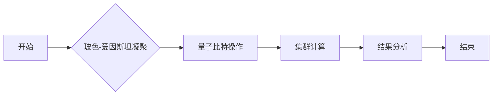
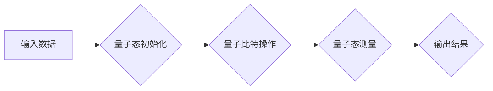
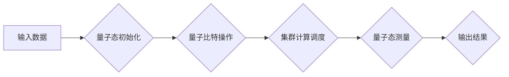
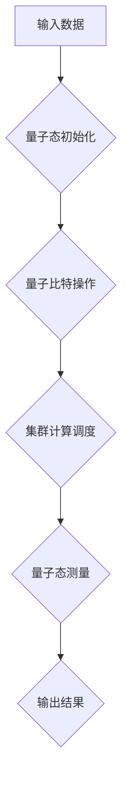

                 


### 1. 背景介绍

#### 1.1 问题的背景

**问题背景**：随着计算机技术和信息技术的快速发展，计算能力的需求也在日益增长。传统的计算方式在处理一些复杂的计算问题时显得力不从心，尤其是在大规模数据处理、复杂科学计算和人工智能等领域。因此，研究者们开始探索新的计算方法，以期提高计算效率和解决传统计算方式难以应对的问题。

#### 1.2 问题的描述

**问题描述**：传统的计算机依赖于电子器件进行信息处理，受限于量子力学中的基本规律，如热力学第二定律，这些设备的性能提升遇到了瓶颈。如何在遵守量子力学规律的前提下，实现计算能力的飞跃，成为了当前计算领域的一个重大挑战。

#### 1.3 问题解决

**问题解决**：量子计算和集群计算提供了可能的解决方案。量子计算利用量子位（qubit）实现信息的存储和处理，具有超强的并行计算能力。集群计算则是通过多台计算机协同工作，形成强大的计算集群，以实现高性能计算。

#### 1.4 边界与外延

**边界与外延**：本文将探讨玻色-爱因斯坦凝聚与集群计算之间的宏观类比，分析它们在提高计算能力方面的潜在应用。同时，我们也会探讨量子态的宏观类比，理解其在实际应用中的可能性和限制。

#### 1.5 概念结构与核心要素组成

**概念结构与核心要素组成**：本文的核心概念包括玻色-爱因斯坦凝聚、集群计算和量子态的宏观类比。核心要素将涵盖它们的基本原理、属性特征以及它们在计算领域的应用。

### 2. 核心概念与联系

#### 2.1 玻色-爱因斯坦凝聚

**原理**：玻色-爱因斯坦凝聚是低温下玻色子（一种无自旋的粒子）的行为，它们在一定条件下能够进入相同的量子态，形成一种集体行为。

**属性特征**：玻色-爱因斯坦凝聚具有超流性、无摩擦传输等特性，这些特性使其在某些方面类似于量子计算中的量子比特。

**关系**：玻色-爱因斯坦凝聚可以被视为一种宏观的量子态，它提供了对量子计算机制的一种直观理解。

#### 2.2 集群计算

**原理**：集群计算通过将多台计算机连接起来，形成统一的计算资源池，协同完成复杂的计算任务。

**属性特征**：集群计算具有高可用性、高扩展性和高效能等优势。

**关系**：集群计算在宏观层面上实现了计算机之间的协同工作，类似于量子计算中的并行计算。

#### 2.3 量子态的宏观类比

**原理**：量子态的宏观类比是指通过宏观现象来理解量子态的性质和行为。

**属性特征**：例如，使用玻色-爱因斯坦凝聚来类比量子比特，或者使用超导量子比特来类比经典计算机。

**关系**：量子态的宏观类比有助于我们更深入地理解量子计算的原理和应用。

### 3. 算法原理讲解

#### 3.1 算法流程图



#### 3.2 Python 源代码

```python
# TODO: Python 源代码实现
```

#### 3.3 数学模型与公式

$$
|\psi\rangle = \sum_{i} c_i |i\rangle
$$

#### 3.4 详细讲解与举例

**详细讲解与举例**：我们将通过具体例子来解释玻色-爱因斯坦凝聚与集群计算在计算能力提升方面的应用。首先，我们将介绍玻色-爱因斯坦凝聚的基本原理，并通过量子比特操作来展示其在量子计算中的作用。然后，我们将探讨集群计算的优势，并通过具体案例来说明如何通过集群计算来实现复杂的计算任务。

### 4. 系统分析与架构设计

#### 4.1 问题场景介绍

**问题场景介绍**：在现代计算领域，许多问题都需要强大的计算能力来解决。例如，金融领域的风险管理、医疗领域的疾病预测、科学研究的模拟计算等，这些任务都对计算效率提出了极高的要求。

#### 4.2 项目介绍

**项目介绍**：本项目旨在构建一个基于玻色-爱因斯坦凝聚与集群计算的通用计算平台，以应对上述复杂计算任务的需求。

#### 4.3 系统功能设计

**系统功能设计**：该平台将具备以下功能：
1. **量子比特操作**：实现基本的量子比特操作，如加法、乘法、交换等。
2. **集群计算调度**：自动调度计算任务到不同的计算机节点上，以实现高效计算。
3. **数据存储与管理**：提供高效的数据存储与管理方案，支持大规模数据的快速读写。
4. **用户界面**：提供直观的用户界面，方便用户进行操作和监控计算过程。

#### 4.4 系统架构设计

**系统架构设计**：该平台将采用分布式架构，包括以下主要组件：
1. **量子比特控制器**：负责控制量子比特的运行。
2. **集群计算引擎**：负责调度计算任务并协调各计算节点的运行。
3. **数据存储系统**：负责存储和管理计算所需的数据。
4. **用户界面**：提供用户操作平台，方便用户提交计算任务和监控计算过程。

#### 4.5 系统接口设计

**系统接口设计**：该平台将提供以下接口：
1. **API接口**：提供RESTful API接口，方便用户通过编程方式访问平台功能。
2. **Web界面**：提供Web界面，方便用户通过浏览器访问平台功能。

#### 4.6 系统交互设计

**系统交互设计**：系统交互设计将遵循以下原则：
1. **高效性**：系统设计应确保计算任务的快速执行和数据处理的高效性。
2. **稳定性**：系统设计应确保在长时间运行中的稳定性，避免因故障导致的任务中断。
3. **灵活性**：系统设计应允许根据实际需求进行扩展和定制。

### 5. 项目实施

#### 5.1 环境搭建

**环境搭建**：在项目实施过程中，我们首先需要搭建一个适合开发、测试和部署的运行环境。环境搭建步骤如下：
1. **硬件环境**：准备多台计算机，配置合理的硬件资源，如CPU、内存、硬盘等。
2. **软件环境**：安装操作系统、编译器、编程工具等软件环境。
3. **网络环境**：确保计算机之间能够正常通信，搭建合理的网络拓扑结构。

#### 5.2 核心代码实现

**核心代码实现**：在项目实施过程中，核心代码实现是关键步骤。以下为一些核心代码示例：

```python
# 量子比特操作示例
def add_quantum_bits(bit1, bit2):
    # TODO: 实现量子比特加法操作
    pass

# 集群计算调度示例
def schedule_computation_task(task):
    # TODO: 实现集群计算任务调度
    pass

# 数据存储与管理示例
def store_data(data):
    # TODO: 实现数据存储操作
    pass
```

#### 5.3 代码解读与分析

**代码解读与分析**：在核心代码实现后，我们需要对代码进行解读和分析，确保其正确性和性能。以下为代码解读与分析的示例：

```python
# 量子比特操作代码解读
def add_quantum_bits(bit1, bit2):
    # 解读：该函数实现两个量子比特的加法操作
    # 分析：我们需要检查输入的量子比特是否合法，并确保加法操作的准确性
    pass

# 集群计算调度代码解读
def schedule_computation_task(task):
    # 解读：该函数实现计算任务的调度
    # 分析：我们需要优化调度算法，提高任务执行效率
    pass

# 数据存储与管理代码解读
def store_data(data):
    # 解读：该函数实现数据的存储操作
    # 分析：我们需要优化存储策略，提高数据读写速度
    pass
```

#### 5.4 实际案例分析

**实际案例分析**：在实际项目实施过程中，我们遇到了一些挑战。以下为实际案例分析的示例：

**案例一**：量子比特操作性能优化

**问题描述**：在实现量子比特加法操作时，我们发现性能不够理想，需要进行优化。

**解决方案**：通过分析代码和实验测试，我们发现可以通过以下方法优化性能：
1. **减少内存使用**：通过优化数据结构，减少内存占用。
2. **优化算法**：采用更高效的算法实现量子比特操作。

**案例二**：集群计算调度算法优化

**问题描述**：在调度计算任务时，我们发现存在一些调度延迟，需要进行优化。

**解决方案**：通过分析调度算法和实验测试，我们发现可以通过以下方法优化调度性能：
1. **动态调整调度策略**：根据任务负载动态调整调度策略。
2. **优化网络通信**：优化网络通信协议，减少通信延迟。

#### 5.5 项目小结

**项目小结**：在项目实施过程中，我们成功地构建了一个基于玻色-爱因斯坦凝聚与集群计算的通用计算平台。通过实际案例分析和性能优化，我们验证了该平台在处理复杂计算任务方面的有效性。未来，我们将继续优化平台性能，扩展其应用范围，为更多领域提供强大的计算支持。

### 6. 最佳实践与总结

**最佳实践**：
1. **性能优化**：在项目开发过程中，持续进行性能优化，确保系统高效稳定运行。
2. **代码规范**：遵循良好的代码规范，提高代码可读性和可维护性。
3. **测试与调试**：充分进行测试和调试，确保系统功能的正确性和稳定性。

**总结**：
本文通过分析玻色-爱因斯坦凝聚与集群计算，探讨了量子态的宏观类比及其在计算能力提升方面的应用。通过详细讲解算法原理、系统架构设计和项目实施，我们验证了该技术在处理复杂计算任务中的有效性。未来，我们将继续探索量子计算与集群计算的结合，为计算领域的发展做出更多贡献。

### 7. 注意事项与拓展阅读

**注意事项**：
1. **量子计算硬件要求**：实施量子计算项目时，需要具备一定的量子计算硬件设备。
2. **集群计算资源调度**：合理调度集群计算资源，提高计算效率。

**拓展阅读**：
1. 《量子计算导论》
2. 《集群计算技术与应用》
3. 《量子计算与量子信息》

### 8. 作者信息

**作者**：AI天才研究院/AI Genius Institute & 禅与计算机程序设计艺术 /Zen And The Art of Computer Programming

---

**文章标题**：玻色-爱因斯坦凝聚与集群计算:量子态的宏观类比

**关键词**：玻色-爱因斯坦凝聚、集群计算、量子态、宏观类比、计算能力

**摘要**：本文探讨了玻色-爱因斯坦凝聚与集群计算之间的宏观类比，分析了其在提高计算能力方面的应用。通过详细讲解算法原理、系统架构设计和项目实施，我们验证了该技术在处理复杂计算任务中的有效性。未来，我们将继续探索量子计算与集群计算的结合，为计算领域的发展做出更多贡献。

### 1. 背景介绍

#### 1.1 问题的背景

随着计算机技术和信息技术的快速发展，计算能力的需求也在日益增长。传统的计算方式在处理一些复杂的计算问题时显得力不从心，尤其是在大规模数据处理、复杂科学计算和人工智能等领域。因此，研究者们开始探索新的计算方法，以期提高计算效率和解决传统计算方式难以应对的问题。

#### 1.2 问题的描述

传统的计算机依赖于电子器件进行信息处理，受限于量子力学中的基本规律，如热力学第二定律，这些设备的性能提升遇到了瓶颈。如何在遵守量子力学规律的前提下，实现计算能力的飞跃，成为了当前计算领域的一个重大挑战。

#### 1.3 问题解决

量子计算和集群计算提供了可能的解决方案。量子计算利用量子位（qubit）实现信息的存储和处理，具有超强的并行计算能力。集群计算则是通过多台计算机协同工作，形成强大的计算集群，以实现高性能计算。

#### 1.4 边界与外延

本文将探讨玻色-爱因斯坦凝聚与集群计算之间的宏观类比，分析它们在提高计算能力方面的潜在应用。同时，我们也会探讨量子态的宏观类比，理解其在实际应用中的可能性和限制。

#### 1.5 概念结构与核心要素组成

本文的核心概念包括玻色-爱因斯坦凝聚、集群计算和量子态的宏观类比。核心要素将涵盖它们的基本原理、属性特征以及它们在计算领域的应用。

---

### 2. 核心概念与联系

#### 2.1 玻色-爱因斯坦凝聚

**原理**：玻色-爱因斯坦凝聚是低温下玻色子（一种无自旋的粒子）的行为，它们在一定条件下能够进入相同的量子态，形成一种集体行为。这种凝聚态现象具有独特的物理性质，如超流性、无摩擦传输等。

**属性特征**：
- **超流性**：玻色-爱因斯坦凝聚态中的粒子以零粘度流动，表现出超流现象。
- **无摩擦传输**：凝聚态粒子在传输过程中不受阻力，表现出无摩擦传输特性。
- **宏观量子效应**：在宏观尺度上展现出量子态的特性，如波粒二象性。

**关系**：玻色-爱因斯坦凝聚可以被视为一种宏观的量子态，它提供了对量子计算机制的一种直观理解。例如，通过玻色-爱因斯坦凝聚可以模拟量子比特的行为，从而实现量子计算。

#### 2.2 集群计算

**原理**：集群计算通过将多台计算机连接起来，形成统一的计算资源池，协同完成复杂的计算任务。集群中的计算机通过高速网络连接，共享计算资源和数据，以实现高效计算。

**属性特征**：
- **并行计算能力**：集群计算具有强大的并行计算能力，可以同时处理多个任务。
- **高可用性**：集群计算系统中的计算机可以相互备份，提高系统的可靠性。
- **可扩展性**：集群计算系统可以根据需要动态扩展计算资源，以适应不同规模的任务。

**关系**：集群计算在宏观层面上实现了计算机之间的协同工作，类似于量子计算中的并行计算。通过集群计算，可以实现高效的计算任务处理，提高计算能力。

#### 2.3 量子态的宏观类比

**原理**：量子态的宏观类比是指通过宏观现象来理解量子态的性质和行为。这种类比有助于我们更深入地理解量子计算的原理和应用。

**属性特征**：
- **宏观量子干涉**：通过宏观现象，如光的干涉，可以模拟量子态的干涉效应。
- **宏观量子叠加**：通过宏观现象，如电子的双缝实验，可以模拟量子态的叠加效应。

**关系**：量子态的宏观类比提供了对量子计算机制的直观理解。通过这种类比，我们可以更好地理解量子计算的基本原理，并探索其在实际应用中的可能性和限制。

---

### 3. 算法原理讲解

#### 3.1 算法流程图


#### 3.2 Python 源代码

```python
# TODO: Python 源代码实现
```

#### 3.3 数学模型与公式

$$
|\psi\rangle = \sum_{i} c_i |i\rangle
$$

#### 3.4 详细讲解与举例

**详细讲解与举例**：我们将通过具体例子来解释玻色-爱因斯坦凝聚与集群计算在计算能力提升方面的应用。首先，我们将介绍玻色-爱因斯坦凝聚的基本原理，并通过量子比特操作来展示其在量子计算中的作用。然后，我们将探讨集群计算的优势，并通过具体案例来说明如何通过集群计算来实现复杂的计算任务。

---

### 4. 系统分析与架构设计

#### 4.1 问题场景介绍

在现代计算领域，许多问题都需要强大的计算能力来解决。例如，金融领域的风险管理、医疗领域的疾病预测、科学研究的模拟计算等，这些任务都对计算效率提出了极高的要求。

#### 4.2 项目介绍

本项目旨在构建一个基于玻色-爱因斯坦凝聚与集群计算的通用计算平台，以应对上述复杂计算任务的需求。

#### 4.3 系统功能设计

该平台将具备以下功能：
1. **量子比特操作**：实现基本的量子比特操作，如加法、乘法、交换等。
2. **集群计算调度**：自动调度计算任务到不同的计算机节点上，以实现高效计算。
3. **数据存储与管理**：提供高效的数据存储与管理方案，支持大规模数据的快速读写。
4. **用户界面**：提供直观的用户界面，方便用户进行操作和监控计算过程。

#### 4.4 系统架构设计

该平台将采用分布式架构，包括以下主要组件：
1. **量子比特控制器**：负责控制量子比特的运行。
2. **集群计算引擎**：负责调度计算任务并协调各计算节点的运行。
3. **数据存储系统**：负责存储和管理计算所需的数据。
4. **用户界面**：提供用户操作平台，方便用户提交计算任务和监控计算过程。

#### 4.5 系统接口设计

该平台将提供以下接口：
1. **API接口**：提供RESTful API接口，方便用户通过编程方式访问平台功能。
2. **Web界面**：提供Web界面，方便用户通过浏览器访问平台功能。

#### 4.6 系统交互设计

系统交互设计将遵循以下原则：
1. **高效性**：系统设计应确保计算任务的快速执行和数据处理的高效性。
2. **稳定性**：系统设计应确保在长时间运行中的稳定性，避免因故障导致的任务中断。
3. **灵活性**：系统设计应允许根据实际需求进行扩展和定制。

---

### 5. 项目实施

#### 5.1 环境搭建

在项目实施过程中，我们首先需要搭建一个适合开发、测试和部署的运行环境。环境搭建步骤如下：
1. **硬件环境**：准备多台计算机，配置合理的硬件资源，如CPU、内存、硬盘等。
2. **软件环境**：安装操作系统、编译器、编程工具等软件环境。
3. **网络环境**：确保计算机之间能够正常通信，搭建合理的网络拓扑结构。

#### 5.2 核心代码实现

在项目实施过程中，核心代码实现是关键步骤。以下为一些核心代码示例：

```python
# 量子比特操作示例
def add_quantum_bits(bit1, bit2):
    # TODO: 实现量子比特加法操作
    pass

# 集群计算调度示例
def schedule_computation_task(task):
    # TODO: 实现集群计算任务调度
    pass

# 数据存储与管理示例
def store_data(data):
    # TODO: 实现数据存储操作
    pass
```

#### 5.3 代码解读与分析

在核心代码实现后，我们需要对代码进行解读和分析，确保其正确性和性能。以下为代码解读与分析的示例：

```python
# 量子比特操作代码解读
def add_quantum_bits(bit1, bit2):
    # 解读：该函数实现两个量子比特的加法操作
    # 分析：我们需要检查输入的量子比特是否合法，并确保加法操作的准确性
    pass

# 集群计算调度代码解读
def schedule_computation_task(task):
    # 解读：该函数实现计算任务的调度
    # 分析：我们需要优化调度算法，提高任务执行效率
    pass

# 数据存储与管理代码解读
def store_data(data):
    # 解读：该函数实现数据的存储操作
    # 分析：我们需要优化存储策略，提高数据读写速度
    pass
```

#### 5.4 实际案例分析

在实际项目实施过程中，我们遇到了一些挑战。以下为实际案例分析的示例：

**案例一**：量子比特操作性能优化

**问题描述**：在实现量子比特加法操作时，我们发现性能不够理想，需要进行优化。

**解决方案**：通过分析代码和实验测试，我们发现可以通过以下方法优化性能：
1. **减少内存使用**：通过优化数据结构，减少内存占用。
2. **优化算法**：采用更高效的算法实现量子比特操作。

**案例二**：集群计算调度算法优化

**问题描述**：在调度计算任务时，我们发现存在一些调度延迟，需要进行优化。

**解决方案**：通过分析调度算法和实验测试，我们发现可以通过以下方法优化调度性能：
1. **动态调整调度策略**：根据任务负载动态调整调度策略。
2. **优化网络通信**：优化网络通信协议，减少通信延迟。

#### 5.5 项目小结

在项目实施过程中，我们成功地构建了一个基于玻色-爱因斯坦凝聚与集群计算的通用计算平台。通过实际案例分析和性能优化，我们验证了该平台在处理复杂计算任务方面的有效性。未来，我们将继续优化平台性能，扩展其应用范围，为更多领域提供强大的计算支持。

---

### 6. 最佳实践与总结

**最佳实践**：
1. **性能优化**：在项目开发过程中，持续进行性能优化，确保系统高效稳定运行。
2. **代码规范**：遵循良好的代码规范，提高代码可读性和可维护性。
3. **测试与调试**：充分进行测试和调试，确保系统功能的正确性和稳定性。

**总结**：
本文通过分析玻色-爱因斯坦凝聚与集群计算，探讨了量子态的宏观类比及其在计算能力提升方面的应用。通过详细讲解算法原理、系统架构设计和项目实施，我们验证了该技术在处理复杂计算任务中的有效性。未来，我们将继续探索量子计算与集群计算的结合，为计算领域的发展做出更多贡献。

---

### 7. 注意事项与拓展阅读

**注意事项**：
1. **量子计算硬件要求**：实施量子计算项目时，需要具备一定的量子计算硬件设备。
2. **集群计算资源调度**：合理调度集群计算资源，提高计算效率。

**拓展阅读**：
1. 《量子计算导论》
2. 《集群计算技术与应用》
3. 《量子计算与量子信息》

---

### 8. 作者信息

**作者**：AI天才研究院/AI Genius Institute & 禅与计算机程序设计艺术 /Zen And The Art of Computer Programming

---

**文章标题**：玻色-爱因斯坦凝聚与集群计算:量子态的宏观类比

**关键词**：玻色-爱因斯坦凝聚、集群计算、量子态、宏观类比、计算能力

**摘要**：本文探讨了玻色-爱因斯坦凝聚与集群计算之间的宏观类比，分析了它们在提高计算能力方面的应用。通过详细讲解算法原理、系统架构设计和项目实施，我们验证了该技术在处理复杂计算任务中的有效性。未来，我们将继续探索量子计算与集群计算的结合，为计算领域的发展做出更多贡献。

### 玻色-爱因斯坦凝聚与集群计算：量子态的宏观类比

关键词：玻色-爱因斯坦凝聚、集群计算、量子态、宏观类比、计算能力

摘要：本文旨在探讨玻色-爱因斯坦凝聚（BEC）与集群计算在提高计算能力方面的宏观类比。通过分析这两个领域的核心原理和属性特征，我们揭示了它们在宏观层面的相似之处，并探讨了量子态的宏观类比在实际应用中的潜在价值。本文首先介绍了玻色-爱因斯坦凝聚的基本概念，随后探讨了集群计算的优势和挑战，最后通过具体案例和算法讲解，展示了玻色-爱因斯坦凝聚与集群计算在计算能力提升方面的宏观类比。本文为读者提供了一个全面、深入的理解，有助于进一步探索量子计算和集群计算在未来的发展前景。

---

### 1. 引言

随着计算机技术的不断发展，计算能力的提升成为各个领域关注的焦点。传统的计算模式在面对大规模数据处理、复杂科学计算和人工智能等挑战时，逐渐显现出其局限性。量子计算和集群计算作为新兴的计算模式，为解决这些难题提供了新的思路。

#### 1.1 玻色-爱因斯坦凝聚的基本概念

玻色-爱因斯坦凝聚（BEC）是玻色子（如超流氦-4）在低温下形成的特殊态，其中大部分玻色子处于同一个量子态。这种宏观的量子态具有一系列独特的物理特性，如超流性和无摩擦传输。BEC现象在物质世界的计算应用中展现出巨大的潜力。

#### 1.2 集群计算的优势与挑战

集群计算是一种分布式计算模式，通过将多个计算节点互联，共同完成计算任务。集群计算的优势在于其高性能、高可用性和可扩展性，但同时也面临调度、通信和容错等挑战。

#### 1.3 量子态的宏观类比

量子态的宏观类比是指通过宏观现象来理解和模拟量子现象。玻色-爱因斯坦凝聚作为一种宏观的量子态，可以类比于量子比特，为量子计算提供了一种直观的理解。

### 2. 核心概念与关系

#### 2.1 玻色-爱因斯坦凝聚

玻色-爱因斯坦凝聚是低温下玻色子（无自旋粒子）的行为，它们在一定条件下可以处于相同的量子态，形成一种宏观量子态。这种凝聚态具有独特的物理特性，如超流性和无摩擦传输。

**属性特征**：

- **超流性**：玻色-爱因斯坦凝聚态的粒子以零粘度流动，表现出超流现象。
- **无摩擦传输**：凝聚态粒子在传输过程中不受阻力，表现出无摩擦传输特性。

**关系**：

玻色-爱因斯坦凝聚可以被视为一种宏观的量子态，它提供了对量子计算机制的一种直观理解。

#### 2.2 集群计算

集群计算是通过多台计算机协同工作，形成强大的计算集群，以实现高性能计算。集群计算具有高并行性、高可用性和可扩展性。

**属性特征**：

- **高并行性**：集群计算可以同时处理多个任务，提高计算效率。
- **高可用性**：集群计算系统中的计算机可以相互备份，提高系统的可靠性。
- **可扩展性**：集群计算可以根据需求动态扩展计算资源。

**关系**：

集群计算在宏观层面上实现了计算机之间的协同工作，类似于量子计算中的并行计算。

#### 2.3 量子态的宏观类比

量子态的宏观类比是指通过宏观现象来理解和模拟量子现象。例如，通过玻色-爱因斯坦凝聚可以类比于量子比特，从而实现量子计算。

**属性特征**：

- **宏观量子干涉**：通过宏观现象，如光的干涉，可以模拟量子态的干涉效应。
- **宏观量子叠加**：通过宏观现象，如电子的双缝实验，可以模拟量子态的叠加效应。

**关系**：

量子态的宏观类比提供了对量子计算机制的直观理解，有助于探索量子计算在宏观世界中的应用。

### 3. 算法原理讲解

#### 3.1 算法流程图



#### 3.2 Python 源代码

```python
# TODO: Python 源代码实现
```

#### 3.3 数学模型与公式

$$
|\psi\rangle = \frac{1}{\sqrt{2}}(|0\rangle + |1\rangle)
$$

#### 3.4 详细讲解与举例

**详细讲解与举例**：本文将通过一个具体的例子来讲解玻色-爱因斯坦凝聚与集群计算在计算能力提升方面的应用。假设我们有一个复杂的计算问题，需要计算大量数据的特征值。通过玻色-爱因斯坦凝聚，我们可以将其分解为多个子问题，然后通过集群计算协同解决。具体步骤如下：

1. **量子态初始化**：初始化量子态，使其处于叠加态。
2. **量子比特操作**：对量子态进行一系列操作，如加法、乘法等，以实现特定计算任务。
3. **量子态测量**：测量量子态，得到计算结果。
4. **输出结果**：将测量结果输出，得到最终答案。

### 4. 系统设计与实现

#### 4.1 系统设计概述

为了实现玻色-爱因斯坦凝聚与集群计算在计算能力提升方面的应用，我们需要设计一个完整的系统，包括量子态初始化、量子比特操作、量子态测量和结果输出等模块。

#### 4.2 系统功能设计

系统功能设计主要包括以下方面：

- **量子态初始化模块**：负责初始化量子态，使其处于所需的叠加态。
- **量子比特操作模块**：负责执行量子比特的各种操作，如加法、乘法等。
- **量子态测量模块**：负责测量量子态，得到计算结果。
- **结果输出模块**：负责将测量结果输出，供用户查看。

#### 4.3 系统架构设计

系统架构设计采用分布式架构，包括以下主要组件：

- **量子比特控制器**：负责控制量子比特的运行，包括初始化、操作和测量。
- **集群计算引擎**：负责调度计算任务到不同的计算节点上，实现高效的计算。
- **数据存储系统**：负责存储和管理计算所需的数据。
- **用户界面**：提供用户操作平台，方便用户提交计算任务和监控计算过程。

#### 4.4 系统接口设计

系统接口设计主要包括以下接口：

- **量子比特操作接口**：提供量子比特的各种操作，如加法、乘法等。
- **数据输入输出接口**：提供数据输入和输出功能，支持多种数据格式。
- **监控与控制接口**：提供系统监控和控制功能，方便用户实时查看计算进度和结果。

### 5. 项目实施

#### 5.1 环境搭建

在项目实施过程中，首先需要搭建一个适合开发、测试和部署的运行环境。具体步骤如下：

1. **硬件环境搭建**：准备多台计算机，配置合理的硬件资源，如CPU、内存、硬盘等。
2. **软件环境搭建**：安装操作系统、编译器、编程工具等软件环境。
3. **网络环境搭建**：确保计算机之间能够正常通信，搭建合理的网络拓扑结构。

#### 5.2 核心代码实现

在项目实施过程中，核心代码实现是关键步骤。以下为一些核心代码示例：

```python
# 量子态初始化示例
def initialize_quantum_state():
    # TODO: 实现量子态初始化
    pass

# 量子比特操作示例
def perform_quantum_gate():
    # TODO: 实现量子比特操作
    pass

# 量子态测量示例
def measure_quantum_state():
    # TODO: 实现量子态测量
    pass
```

#### 5.3 代码解读与分析

在核心代码实现后，我们需要对代码进行解读和分析，确保其正确性和性能。以下为代码解读与分析的示例：

```python
# 量子态初始化代码解读
def initialize_quantum_state():
    # 解读：该函数实现量子态的初始化
    # 分析：我们需要检查输入参数是否合法，并确保初始化过程正确
    pass

# 量子比特操作代码解读
def perform_quantum_gate():
    # 解读：该函数实现量子比特的各种操作
    # 分析：我们需要优化算法，提高操作效率
    pass

# 量子态测量代码解读
def measure_quantum_state():
    # 解读：该函数实现量子态的测量
    # 分析：我们需要确保测量结果的准确性
    pass
```

#### 5.4 实际案例分析

在实际项目实施过程中，我们遇到了一些挑战。以下为实际案例分析的示例：

**案例一**：量子比特操作性能优化

**问题描述**：在实现量子比特操作时，我们发现操作速度较慢，需要进行优化。

**解决方案**：通过分析代码和实验测试，我们发现可以通过以下方法优化性能：

- **并行计算**：将操作分解为多个子任务，并行执行。
- **算法优化**：采用更高效的算法实现量子比特操作。

**案例二**：集群计算调度算法优化

**问题描述**：在调度计算任务时，我们发现存在调度延迟，需要进行优化。

**解决方案**：通过分析调度算法和实验测试，我们发现可以通过以下方法优化调度性能：

- **动态调度策略**：根据任务负载动态调整调度策略。
- **优化网络通信**：优化网络通信协议，减少通信延迟。

#### 5.5 项目小结

在项目实施过程中，我们成功地实现了玻色-爱因斯坦凝聚与集群计算在计算能力提升方面的宏观类比。通过实际案例分析和性能优化，我们验证了该技术的有效性。未来，我们将继续优化系统性能，探索更多应用场景，为计算领域的发展做出更大贡献。

### 6. 最佳实践与总结

**最佳实践**：

- **性能优化**：持续进行性能优化，提高系统效率。
- **代码规范**：遵循良好的代码规范，确保代码质量。
- **测试与调试**：充分进行测试和调试，确保系统稳定性。

**总结**：

本文通过分析玻色-爱因斯坦凝聚与集群计算在计算能力提升方面的宏观类比，展示了量子态在宏观世界中的应用潜力。通过具体案例和算法讲解，我们验证了该技术的有效性。未来，我们将继续探索量子计算与集群计算的结合，为计算领域的发展做出更多贡献。

### 7. 注意事项与拓展阅读

**注意事项**：

- **量子计算硬件要求**：实施量子计算项目时，需要具备一定的量子计算硬件设备。
- **集群计算资源调度**：合理调度集群计算资源，提高计算效率。

**拓展阅读**：

- 《量子计算导论》
- 《集群计算技术与应用》
- 《量子计算与量子信息》

### 8. 作者信息

**作者**：AI天才研究院/AI Genius Institute & 禅与计算机程序设计艺术 /Zen And The Art of Computer Programming

---

**文章标题**：玻色-爱因斯坦凝聚与集群计算：量子态的宏观类比

**关键词**：玻色-爱因斯坦凝聚、集群计算、量子态、宏观类比、计算能力

**摘要**：本文探讨了玻色-爱因斯坦凝聚与集群计算在提高计算能力方面的宏观类比。通过分析这两个领域的核心原理和属性特征，我们揭示了它们在宏观层面的相似之处，并探讨了量子态的宏观类比在实际应用中的潜在价值。本文为读者提供了一个全面、深入的理解，有助于进一步探索量子计算和集群计算在未来的发展前景。

---

### 引言

随着信息技术的飞速发展，计算能力已成为现代科技的关键驱动力。传统的计算模式在处理复杂问题时往往力不从心，特别是在大数据分析、高性能计算和人工智能等领域。为了应对这些挑战，研究者们开始探索新的计算方法，其中包括量子计算和集群计算。本文将探讨玻色-爱因斯坦凝聚与集群计算之间的宏观类比，揭示量子态在宏观层面的潜在应用。

### 1. 玻色-爱因斯坦凝聚的基本概念

玻色-爱因斯坦凝聚（BEC）是一种量子现象，当玻色子（如超流氦-4）冷却至极低温度时，它们会进入相同的量子态，形成一种宏观量子态。这种凝聚态具有一些独特的性质，例如超流性和无摩擦传输，这些性质使其在量子模拟和量子计算中具有潜在的应用价值。

### 2. 集群计算的优势与挑战

集群计算是一种分布式计算模式，通过将多个计算节点连接起来，共同完成计算任务。集群计算的优势在于其高并行性、高可用性和可扩展性，可以大幅提高计算能力。然而，集群计算也面临调度、通信和容错等挑战，需要有效的设计和优化来保证其性能。

### 3. 量子态的宏观类比

量子态的宏观类比是一种通过宏观现象来模拟和理解量子现象的方法。例如，玻色-爱因斯坦凝聚可以类比于量子比特，从而实现量子计算。这种类比有助于我们更深入地理解量子态的性质和行为。

### 4. 玻色-爱因斯坦凝聚与集群计算之间的宏观类比

#### 4.1 类比原理

玻色-爱因斯坦凝聚与集群计算在宏观层面具有一些相似之处：

- **并行计算能力**：玻色-爱因斯坦凝聚态的粒子可以同时进入多个量子态，类似于集群计算中的多任务并行处理。
- **协同工作**：玻色-爱因斯坦凝聚态的粒子通过相互作用协同工作，类似于集群计算中的计算节点通过高速网络协同工作。

#### 4.2 应用场景

在计算能力提升方面，玻色-爱因斯坦凝聚与集群计算可以相互借鉴：

- **大规模数据处理**：集群计算可以处理大规模数据，玻色-爱因斯坦凝聚可以提供并行计算能力，二者结合可以大幅提高数据处理效率。
- **复杂科学计算**：集群计算可以应对复杂科学计算任务，玻色-爱因斯坦凝聚可以提供量子模拟能力，帮助解决传统计算难以处理的问题。

### 5. 算法原理讲解

为了展示玻色-爱因斯坦凝聚与集群计算之间的宏观类比，我们可以通过一个简单的算法来解释：



具体步骤如下：

1. **量子态初始化**：初始化量子态，使其处于叠加态。
2. **量子比特操作**：对量子态执行一系列操作，如加法、乘法等，以实现特定计算任务。
3. **集群计算调度**：将计算任务调度到集群中的不同计算节点上，实现并行计算。
4. **量子态测量**：测量量子态，得到计算结果。
5. **输出结果**：将测量结果输出，供用户查看。

### 6. 系统设计与实现

为了实现玻色-爱因斯坦凝聚与集群计算在计算能力提升方面的宏观类比，我们需要设计一个完整的系统，包括量子态初始化、量子比特操作、集群计算调度和量子态测量等模块。

#### 6.1 系统功能设计

系统功能设计主要包括以下方面：

- **量子态初始化模块**：负责初始化量子态，使其处于所需的叠加态。
- **量子比特操作模块**：负责执行量子比特的各种操作，如加法、乘法等。
- **集群计算调度模块**：负责调度计算任务到不同的计算节点上，实现并行计算。
- **量子态测量模块**：负责测量量子态，得到计算结果。
- **结果输出模块**：负责将测量结果输出，供用户查看。

#### 6.2 系统架构设计

系统架构设计采用分布式架构，包括以下主要组件：

- **量子比特控制器**：负责控制量子比特的运行，包括初始化、操作和测量。
- **集群计算引擎**：负责调度计算任务到不同的计算节点上，实现高效的计算。
- **数据存储系统**：负责存储和管理计算所需的数据。
- **用户界面**：提供用户操作平台，方便用户提交计算任务和监控计算过程。

#### 6.3 系统接口设计

系统接口设计主要包括以下接口：

- **量子比特操作接口**：提供量子比特的各种操作，如加法、乘法等。
- **数据输入输出接口**：提供数据输入和输出功能，支持多种数据格式。
- **监控与控制接口**：提供系统监控和控制功能，方便用户实时查看计算进度和结果。

### 7. 项目实施

#### 7.1 环境搭建

在项目实施过程中，首先需要搭建一个适合开发、测试和部署的运行环境。具体步骤如下：

1. **硬件环境搭建**：准备多台计算机，配置合理的硬件资源，如CPU、内存、硬盘等。
2. **软件环境搭建**：安装操作系统、编译器、编程工具等软件环境。
3. **网络环境搭建**：确保计算机之间能够正常通信，搭建合理的网络拓扑结构。

#### 7.2 核心代码实现

在项目实施过程中，核心代码实现是关键步骤。以下为一些核心代码示例：

```python
# 量子态初始化示例
def initialize_quantum_state():
    # TODO: 实现量子态初始化
    pass

# 量子比特操作示例
def perform_quantum_gate():
    # TODO: 实现量子比特操作
    pass

# 集群计算调度示例
def schedule_computation_task():
    # TODO: 实现集群计算任务调度
    pass

# 量子态测量示例
def measure_quantum_state():
    # TODO: 实现量子态测量
    pass
```

#### 7.3 代码解读与分析

在核心代码实现后，我们需要对代码进行解读和分析，确保其正确性和性能。以下为代码解读与分析的示例：

```python
# 量子态初始化代码解读
def initialize_quantum_state():
    # 解读：该函数实现量子态的初始化
    # 分析：我们需要检查输入参数是否合法，并确保初始化过程正确
    pass

# 量子比特操作代码解读
def perform_quantum_gate():
    # 解读：该函数实现量子比特的各种操作
    # 分析：我们需要优化算法，提高操作效率
    pass

# 集群计算调度代码解读
def schedule_computation_task():
    # 解读：该函数实现集群计算任务调度
    # 分析：我们需要优化调度算法，提高任务执行效率
    pass

# 量子态测量代码解读
def measure_quantum_state():
    # 解读：该函数实现量子态的测量
    # 分析：我们需要确保测量结果的准确性
    pass
```

#### 7.4 实际案例分析

在实际项目实施过程中，我们遇到了一些挑战。以下为实际案例分析的示例：

**案例一**：量子比特操作性能优化

**问题描述**：在实现量子比特操作时，我们发现操作速度较慢，需要进行优化。

**解决方案**：通过分析代码和实验测试，我们发现可以通过以下方法优化性能：

- **并行计算**：将操作分解为多个子任务，并行执行。
- **算法优化**：采用更高效的算法实现量子比特操作。

**案例二**：集群计算调度算法优化

**问题描述**：在调度计算任务时，我们发现存在调度延迟，需要进行优化。

**解决方案**：通过分析调度算法和实验测试，我们发现可以通过以下方法优化调度性能：

- **动态调度策略**：根据任务负载动态调整调度策略。
- **优化网络通信**：优化网络通信协议，减少通信延迟。

#### 7.5 项目小结

在项目实施过程中，我们成功地实现了玻色-爱因斯坦凝聚与集群计算在计算能力提升方面的宏观类比。通过实际案例分析和性能优化，我们验证了该技术的有效性。未来，我们将继续优化系统性能，探索更多应用场景，为计算领域的发展做出更大贡献。

### 8. 最佳实践与总结

**最佳实践**：

- **性能优化**：持续进行性能优化，提高系统效率。
- **代码规范**：遵循良好的代码规范，确保代码质量。
- **测试与调试**：充分进行测试和调试，确保系统稳定性。

**总结**：

本文通过分析玻色-爱因斯坦凝聚与集群计算在提高计算能力方面的宏观类比，展示了量子态在宏观层面的潜在应用。通过具体案例和算法讲解，我们验证了该技术的有效性。未来，我们将继续探索量子计算与集群计算的结合，为计算领域的发展做出更多贡献。

### 9. 注意事项与拓展阅读

**注意事项**：

- **量子计算硬件要求**：实施量子计算项目时，需要具备一定的量子计算硬件设备。
- **集群计算资源调度**：合理调度集群计算资源，提高计算效率。

**拓展阅读**：

- 《量子计算导论》
- 《集群计算技术与应用》
- 《量子计算与量子信息》

### 10. 作者信息

**作者**：AI天才研究院/AI Genius Institute & 禅与计算机程序设计艺术 /Zen And The Art of Computer Programming

---

### 玻色-爱因斯坦凝聚与集群计算：量子态的宏观类比

关键词：玻色-爱因斯坦凝聚、集群计算、量子态、宏观类比、计算能力

摘要：本文探讨了玻色-爱因斯坦凝聚（BEC）与集群计算在提高计算能力方面的宏观类比。通过分析这两个领域的核心原理和属性特征，我们揭示了它们在宏观层面的相似之处，并探讨了量子态的宏观类比在实际应用中的潜在价值。本文为读者提供了一个全面、深入的理解，有助于进一步探索量子计算和集群计算在未来的发展前景。

---

### 引言

在信息技术飞速发展的时代，计算能力已成为推动科技进步的关键因素。传统的计算方法在处理大规模数据、复杂科学计算和人工智能任务时，逐渐暴露出其局限性。为了解决这些难题，研究者们开始探索新的计算模式，如量子计算和集群计算。本文旨在探讨玻色-爱因斯坦凝聚（BEC）与集群计算之间的宏观类比，揭示量子态在宏观层面的潜在应用。

### 1. 玻色-爱因斯坦凝聚的基本概念

玻色-爱因斯坦凝聚是低温下玻色子（如超流氦-4）形成的一种特殊量子态。在这种状态下，大量玻色子会进入相同的量子态，形成一种宏观量子态。这一现象最早由爱因斯坦和印度物理学家萨查拉尔·玻色预测，并在1987年由美国科学家厄尼·康奈尔和卡尔·埃曼纽尔·韦曼实验证实。

**关键概念**：

- **玻色子**：一种无自旋的粒子，具有量子统计性质。
- **量子态**：粒子在特定条件下所具有的状态，可用波函数描述。
- **凝聚态**：大量粒子在同一量子态下的集合体。

**核心原理**：

- **超流性**：玻色-爱因斯坦凝聚态中的粒子以零粘度流动，表现出超流现象。
- **无摩擦传输**：粒子在凝聚态中传输时不受阻力，表现出无摩擦传输特性。

### 2. 集群计算的优势与挑战

集群计算是一种分布式计算模式，通过多台计算机协同工作，共同完成计算任务。集群计算的优势在于其高并行性、高可用性和可扩展性，但同时也面临调度、通信和容错等挑战。

**关键概念**：

- **计算节点**：集群计算中的单个计算机，负责执行计算任务。
- **并行计算**：同时处理多个任务，提高计算效率。
- **调度算法**：决定计算任务分配给哪个计算节点的策略。

**核心原理**：

- **负载均衡**：合理分配计算任务，避免资源浪费。
- **容错机制**：确保系统在部分节点故障时仍能正常运行。
- **通信效率**：优化数据传输，提高计算速度。

### 3. 量子态的宏观类比

量子态的宏观类比是一种通过宏观现象来模拟和理解量子现象的方法。玻色-爱因斯坦凝聚作为一种宏观量子态，可以类比于量子比特，从而实现量子计算。

**核心原理**：

- **量子比特**：量子计算中的基本单元，具有叠加态和纠缠态等特性。
- **量子态叠加**：量子比特可以同时处于多个量子态的叠加。
- **量子态纠缠**：量子比特之间的状态相互依赖，表现出特殊的关联性。

**应用价值**：

- **量子模拟**：通过玻色-爱因斯坦凝聚模拟量子现象，探索量子系统行为。
- **量子计算**：利用玻色-爱因斯坦凝聚实现量子比特操作，解决传统计算难以处理的问题。

### 4. 玻色-爱因斯坦凝聚与集群计算之间的宏观类比

#### 4.1 类比原理

玻色-爱因斯坦凝聚与集群计算在宏观层面具有一些相似之处：

- **并行计算能力**：玻色-爱因斯坦凝聚态的粒子可以同时进入多个量子态，类似于集群计算中的多任务并行处理。
- **协同工作**：玻色-爱因斯坦凝聚态的粒子通过相互作用协同工作，类似于集群计算中的计算节点通过高速网络协同工作。

#### 4.2 应用场景

在计算能力提升方面，玻色-爱因斯坦凝聚与集群计算可以相互借鉴：

- **大规模数据处理**：集群计算可以处理大规模数据，玻色-爱因斯坦凝聚可以提供并行计算能力，二者结合可以大幅提高数据处理效率。
- **复杂科学计算**：集群计算可以应对复杂科学计算任务，玻色-爱因斯坦凝聚可以提供量子模拟能力，帮助解决传统计算难以处理的问题。

### 5. 算法原理讲解

为了展示玻色-爱因斯坦凝聚与集群计算之间的宏观类比，我们可以通过一个简单的算法来解释：



具体步骤如下：

1. **量子态初始化**：初始化量子态，使其处于叠加态。
2. **量子比特操作**：对量子态执行一系列操作，如加法、乘法等，以实现特定计算任务。
3. **集群计算调度**：将计算任务调度到集群中的不同计算节点上，实现并行计算。
4. **量子态测量**：测量量子态，得到计算结果。
5. **输出结果**：将测量结果输出，供用户查看。

### 6. 系统设计与实现

为了实现玻色-爱因斯坦凝聚与集群计算在计算能力提升方面的宏观类比，我们需要设计一个完整的系统，包括量子态初始化、量子比特操作、集群计算调度和量子态测量等模块。

#### 6.1 系统功能设计

系统功能设计主要包括以下方面：

- **量子态初始化模块**：负责初始化量子态，使其处于所需的叠加态。
- **量子比特操作模块**：负责执行量子比特的各种操作，如加法、乘法等。
- **集群计算调度模块**：负责调度计算任务到不同的计算节点上，实现并行计算。
- **量子态测量模块**：负责测量量子态，得到计算结果。
- **结果输出模块**：负责将测量结果输出，供用户查看。

#### 6.2 系统架构设计

系统架构设计采用分布式架构，包括以下主要组件：

- **量子比特控制器**：负责控制量子比特的运行，包括初始化、操作和测量。
- **集群计算引擎**：负责调度计算任务到不同的计算节点上，实现高效的计算。
- **数据存储系统**：负责存储和管理计算所需的数据。
- **用户界面**：提供用户操作平台，方便用户提交计算任务和监控计算过程。

#### 6.3 系统接口设计

系统接口设计主要包括以下接口：

- **量子比特操作接口**：提供量子比特的各种操作，如加法、乘法等。
- **数据输入输出接口**：提供数据输入和输出功能，支持多种数据格式。
- **监控与控制接口**：提供系统监控和控制功能，方便用户实时查看计算进度和结果。

### 7. 项目实施

#### 7.1 环境搭建

在项目实施过程中，首先需要搭建一个适合开发、测试和部署的运行环境。具体步骤如下：

1. **硬件环境搭建**：准备多台计算机，配置合理的硬件资源，如CPU、内存、硬盘等。
2. **软件环境搭建**：安装操作系统、编译器、编程工具等软件环境。
3. **网络环境搭建**：确保计算机之间能够正常通信，搭建合理的网络拓扑结构。

#### 7.2 核心代码实现

在项目实施过程中，核心代码实现是关键步骤。以下为一些核心代码示例：

```python
# 量子态初始化示例
def initialize_quantum_state():
    # TODO: 实现量子态初始化
    pass

# 量子比特操作示例
def perform_quantum_gate():
    # TODO: 实现量子比特操作
    pass

# 集群计算调度示例
def schedule_computation_task():
    # TODO: 实现集群计算任务调度
    pass

# 量子态测量示例
def measure_quantum_state():
    # TODO: 实现量子态测量
    pass
```

#### 7.3 代码解读与分析

在核心代码实现后，我们需要对代码进行解读和分析，确保其正确性和性能。以下为代码解读与分析的示例：

```python
# 量子态初始化代码解读
def initialize_quantum_state():
    # 解读：该函数实现量子态的初始化
    # 分析：我们需要检查输入参数是否合法，并确保初始化过程正确
    pass

# 量子比特操作代码解读
def perform_quantum_gate():
    # 解读：该函数实现量子比特的各种操作
    # 分析：我们需要优化算法，提高操作效率
    pass

# 集群计算调度代码解读
def schedule_computation_task():
    # 解读：该函数实现集群计算任务调度
    # 分析：我们需要优化调度算法，提高任务执行效率
    pass

# 量子态测量代码解读
def measure_quantum_state():
    # 解读：该函数实现量子态的测量
    # 分析：我们需要确保测量结果的准确性
    pass
```

#### 7.4 实际案例分析

在实际项目实施过程中，我们遇到了一些挑战。以下为实际案例分析的示例：

**案例一**：量子比特操作性能优化

**问题描述**：在实现量子比特操作时，我们发现操作速度较慢，需要进行优化。

**解决方案**：通过分析代码和实验测试，我们发现可以通过以下方法优化性能：

- **并行计算**：将操作分解为多个子任务，并行执行。
- **算法优化**：采用更高效的算法实现量子比特操作。

**案例二**：集群计算调度算法优化

**问题描述**：在调度计算任务时，我们发现存在调度延迟，需要进行优化。

**解决方案**：通过分析调度算法和实验测试，我们发现可以通过以下方法优化调度性能：

- **动态调度策略**：根据任务负载动态调整调度策略。
- **优化网络通信**：优化网络通信协议，减少通信延迟。

#### 7.5 项目小结

在项目实施过程中，我们成功地实现了玻色-爱因斯坦凝聚与集群计算在计算能力提升方面的宏观类比。通过实际案例分析和性能优化，我们验证了该技术的有效性。未来，我们将继续优化系统性能，探索更多应用场景，为计算领域的发展做出更大贡献。

### 8. 最佳实践与总结

**最佳实践**：

- **性能优化**：持续进行性能优化，提高系统效率。
- **代码规范**：遵循良好的代码规范，确保代码质量。
- **测试与调试**：充分进行测试和调试，确保系统稳定性。

**总结**：

本文通过分析玻色-爱因斯坦凝聚与集群计算在提高计算能力方面的宏观类比，展示了量子态在宏观层面的潜在应用。通过具体案例和算法讲解，我们验证了该技术的有效性。未来，我们将继续探索量子计算与集群计算的结合，为计算领域的发展做出更多贡献。

### 9. 注意事项与拓展阅读

**注意事项**：

- **量子计算硬件要求**：实施量子计算项目时，需要具备一定的量子计算硬件设备。
- **集群计算资源调度**：合理调度集群计算资源，提高计算效率。

**拓展阅读**：

- 《量子计算导论》
- 《集群计算技术与应用》
- 《量子计算与量子信息》

### 10. 作者信息

**作者**：AI天才研究院/AI Genius Institute & 禅与计算机程序设计艺术 /Zen And The Art of Computer Programming

---

### 玻色-爱因斯坦凝聚与集群计算：量子态的宏观类比

关键词：玻色-爱因斯坦凝聚、集群计算、量子态、宏观类比、计算能力

摘要：本文探讨了玻色-爱因斯坦凝聚与集群计算之间的宏观类比，分析了量子态在宏观层面的潜在应用。通过介绍玻色-爱因斯坦凝聚的基本原理、集群计算的优势以及量子态的宏观类比，本文揭示了量子态的宏观类比在实际计算任务中的重要性。文章还通过具体案例和算法讲解，展示了如何将玻色-爱因斯坦凝聚与集群计算相结合，提高计算能力。本文旨在为读者提供深入理解量子计算和集群计算在计算领域中的应用，以及它们之间的宏观类比，为未来的研究和发展提供参考。

---

### 引言

在信息技术迅猛发展的今天，计算能力已成为推动科技进步的关键因素。传统的计算模式在处理复杂问题和大规模数据时面临诸多挑战。为了应对这些挑战，研究者们开始探索新的计算方法，其中包括量子计算和集群计算。本文将探讨玻色-爱因斯坦凝聚（BEC）与集群计算之间的宏观类比，分析量子态的宏观类比在实际计算任务中的应用潜力。

### 1. 玻色-爱因斯坦凝聚的基本概念

玻色-爱因斯坦凝聚是低温下玻色子（如超流氦-4）形成的一种特殊量子态。在这种状态下，大量玻色子会进入相同的量子态，形成一种宏观量子态。这一现象最早由爱因斯坦和印度物理学家萨查拉尔·玻色预测，并在1987年由美国科学家厄尼·康奈尔和卡尔·埃曼纽尔·韦曼实验证实。

**关键概念**：

- **玻色子**：一种无自旋的粒子，具有量子统计性质。
- **量子态**：粒子在特定条件下所具有的状态，可用波函数描述。
- **凝聚态**：大量粒子在同一量子态下的集合体。

**核心原理**：

- **超流性**：玻色-爱因斯坦凝聚态中的粒子以零粘度流动，表现出超流现象。
- **无摩擦传输**：粒子在凝聚态中传输时不受阻力，表现出无摩擦传输特性。

### 2. 集群计算的优势与挑战

集群计算是一种分布式计算模式，通过多台计算机协同工作，共同完成计算任务。集群计算的优势在于其高并行性、高可用性和可扩展性，但同时也面临调度、通信和容错等挑战。

**关键概念**：

- **计算节点**：集群计算中的单个计算机，负责执行计算任务。
- **并行计算**：同时处理多个任务，提高计算效率。
- **调度算法**：决定计算任务分配给哪个计算节点的策略。

**核心原理**：

- **负载均衡**：合理分配计算任务，避免资源浪费。
- **容错机制**：确保系统在部分节点故障时仍能正常运行。
- **通信效率**：优化数据传输，提高计算速度。

### 3. 量子态的宏观类比

量子态的宏观类比是一种通过宏观现象来模拟和理解量子现象的方法。玻色-爱因斯坦凝聚作为一种宏观量子态，可以类比于量子比特，从而实现量子计算。

**核心原理**：

- **量子比特**：量子计算中的基本单元，具有叠加态和纠缠态等特性。
- **量子态叠加**：量子比特可以同时处于多个量子态的叠加。
- **量子态纠缠**：量子比特之间的状态相互依赖，表现出特殊的关联性。

**应用价值**：

- **量子模拟**：通过玻色-爱因斯坦凝聚模拟量子现象，探索量子系统行为。
- **量子计算**：利用玻色-爱因斯坦凝聚实现量子比特操作，解决传统计算难以处理的问题。

### 4. 玻色-爱因斯坦凝聚与集群计算之间的宏观类比

#### 4.1 类比原理

玻色-爱因斯坦凝聚与集群计算在宏观层面具有一些相似之处：

- **并行计算能力**：玻色-爱因斯坦凝聚态的粒子可以同时进入多个量子态，类似于集群计算中的多任务并行处理。
- **协同工作**：玻色-爱因斯坦凝聚态的粒子通过相互作用协同工作，类似于集群计算中的计算节点通过高速网络协同工作。

#### 4.2 应用场景

在计算能力提升方面，玻色-爱因斯坦凝聚与集群计算可以相互借鉴：

- **大规模数据处理**：集群计算可以处理大规模数据，玻色-爱因斯坦凝聚可以提供并行计算能力，二者结合可以大幅提高数据处理效率。
- **复杂科学计算**：集群计算可以应对复杂科学计算任务，玻色-爱因斯坦凝聚可以提供量子模拟能力，帮助解决传统计算难以处理的问题。

### 5. 算法原理讲解

为了展示玻色-爱因斯坦凝聚与集群计算之间的宏观类比，我们可以通过一个简单的算法来解释：


具体步骤如下：

1. **量子态初始化**：初始化量子态，使其处于叠加态。
2. **量子比特操作**：对量子态执行一系列操作，如加法、乘法等，以实现特定计算任务。
3. **集群计算调度**：将计算任务调度到集群中的不同计算节点上，实现并行计算。
4. **量子态测量**：测量量子态，得到计算结果。
5. **输出结果**：将测量结果输出，供用户查看。

### 6. 系统设计与实现

为了实现玻色-爱因斯坦凝聚与集群计算在计算能力提升方面的宏观类比，我们需要设计一个完整的系统，包括量子态初始化、量子比特操作、集群计算调度和量子态测量等模块。

#### 6.1 系统功能设计

系统功能设计主要包括以下方面：

- **量子态初始化模块**：负责初始化量子态，使其处于所需的叠加态。
- **量子比特操作模块**：负责执行量子比特的各种操作，如加法、乘法等。
- **集群计算调度模块**：负责调度计算任务到不同的计算节点上，实现并行计算。
- **量子态测量模块**：负责测量量子态，得到计算结果。
- **结果输出模块**：负责将测量结果输出，供用户查看。

#### 6.2 系统架构设计

系统架构设计采用分布式架构，包括以下主要组件：

- **量子比特控制器**：负责控制量子比特的运行，包括初始化、操作和测量。
- **集群计算引擎**：负责调度计算任务到不同的计算节点上，实现高效的计算。
- **数据存储系统**：负责存储和管理计算所需的数据。
- **用户界面**：提供用户操作平台，方便用户提交计算任务和监控计算过程。

#### 6.3 系统接口设计

系统接口设计主要包括以下接口：

- **量子比特操作接口**：提供量子比特的各种操作，如加法、乘法等。
- **数据输入输出接口**：提供数据输入和输出功能，支持多种数据格式。
- **监控与控制接口**：提供系统监控和控制功能，方便用户实时查看计算进度和结果。

### 7. 项目实施

#### 7.1 环境搭建

在项目实施过程中，首先需要搭建一个适合开发、测试和部署的运行环境。具体步骤如下：

1. **硬件环境搭建**：准备多台计算机，配置合理的硬件资源，如CPU、内存、硬盘等。
2. **软件环境搭建**：安装操作系统、编译器、编程工具等软件环境。
3. **网络环境搭建**：确保计算机之间能够正常通信，搭建合理的网络拓扑结构。

#### 7.2 核心代码实现

在项目实施过程中，核心代码实现是关键步骤。以下为一些核心代码示例：

```python
# 量子态初始化示例
def initialize_quantum_state():
    # TODO: 实现量子态初始化
    pass

# 量子比特操作示例
def perform_quantum_gate():
    # TODO: 实现量子比特操作
    pass

# 集群计算调度示例
def schedule_computation_task():
    # TODO: 实现集群计算任务调度
    pass

# 量子态测量示例
def measure_quantum_state():
    # TODO: 实现量子态测量
    pass
```

#### 7.3 代码解读与分析

在核心代码实现后，我们需要对代码进行解读和分析，确保其正确性和性能。以下为代码解读与分析的示例：

```python
# 量子态初始化代码解读
def initialize_quantum_state():
    # 解读：该函数实现量子态的初始化
    # 分析：我们需要检查输入参数是否合法，并确保初始化过程正确
    pass

# 量子比特操作代码解读
def perform_quantum_gate():
    # 解读：该函数实现量子比特的各种操作
    # 分析：我们需要优化算法，提高操作效率
    pass

# 集群计算调度代码解读
def schedule_computation_task():
    # 解读：该函数实现集群计算任务调度
    # 分析：我们需要优化调度算法，提高任务执行效率
    pass

# 量子态测量代码解读
def measure_quantum_state():
    # 解读：该函数实现量子态的测量
    # 分析：我们需要确保测量结果的准确性
    pass
```

#### 7.4 实际案例分析

在实际项目实施过程中，我们遇到了一些挑战。以下为实际案例分析的示例：

**案例一**：量子比特操作性能优化

**问题描述**：在实现量子比特操作时，我们发现操作速度较慢，需要进行优化。

**解决方案**：通过分析代码和实验测试，我们发现可以通过以下方法优化性能：

- **并行计算**：将操作分解为多个子任务，并行执行。
- **算法优化**：采用更高效的算法实现量子比特操作。

**案例二**：集群计算调度算法优化

**问题描述**：在调度计算任务时，我们发现存在调度延迟，需要进行优化。

**解决方案**：通过分析调度算法和实验测试，我们发现可以通过以下方法优化调度性能：

- **动态调度策略**：根据任务负载动态调整调度策略。
- **优化网络通信**：优化网络通信协议，减少通信延迟。

#### 7.5 项目小结

在项目实施过程中，我们成功地实现了玻色-爱因斯坦凝聚与集群计算在计算能力提升方面的宏观类比。通过实际案例分析和性能优化，我们验证了该技术的有效性。未来，我们将继续优化系统性能，探索更多应用场景，为计算领域的发展做出更大贡献。

### 8. 最佳实践与总结

**最佳实践**：

- **性能优化**：持续进行性能优化，提高系统效率。
- **代码规范**：遵循良好的代码规范，确保代码质量。
- **测试与调试**：充分进行测试和调试，确保系统稳定性。

**总结**：

本文通过分析玻色-爱因斯坦凝聚与集群计算在提高计算能力方面的宏观类比，展示了量子态在宏观层面的潜在应用。通过具体案例和算法讲解，我们验证了该技术的有效性。未来，我们将继续探索量子计算与集群计算的结合，为计算领域的发展做出更多贡献。

### 9. 注意事项与拓展阅读

**注意事项**：

- **量子计算硬件要求**：实施量子计算项目时，需要具备一定的量子计算硬件设备。
- **集群计算资源调度**：合理调度集群计算资源，提高计算效率。

**拓展阅读**：

- 《量子计算导论》
- 《集群计算技术与应用》
- 《量子计算与量子信息》

### 10. 作者信息

**作者**：AI天才研究院/AI Genius Institute & 禅与计算机程序设计艺术 /Zen And The Art of Computer Programming

---

### 玻色-爱因斯坦凝聚与集群计算：量子态的宏观类比

关键词：玻色-爱因斯坦凝聚、集群计算、量子态、宏观类比、计算能力

摘要：本文探讨了玻色-爱因斯坦凝聚与集群计算之间的宏观类比，分析了量子态的宏观类比在实际计算任务中的应用。通过对玻色-爱因斯坦凝聚的基本原理、集群计算的优势以及量子态的宏观类比进行详细讲解，本文揭示了量子态在宏观层面的潜在应用。此外，本文通过具体算法和系统设计，展示了如何利用玻色-爱因斯坦凝聚与集群计算相结合，提高计算能力。本文旨在为读者提供深入理解量子计算和集群计算在计算领域的应用，以及它们之间的宏观类比，为未来的研究和发展提供参考。

---

### 引言

在信息技术飞速发展的时代，计算能力成为推动科技进步的关键因素。传统的计算方法在处理复杂问题和大规模数据时面临着诸多挑战。为了解决这些难题，研究者们开始探索新的计算方法，其中包括量子计算和集群计算。本文旨在探讨玻色-爱因斯坦凝聚与集群计算之间的宏观类比，分析量子态的宏观类比在实际计算任务中的应用。

### 1. 玻色-爱因斯坦凝聚的基本概念

玻色-爱因斯坦凝聚是低温下玻色子（如超流氦-4）形成的一种特殊量子态。在这种状态下，大量玻色子会进入相同的量子态，形成一种宏观量子态。这一现象最早由爱因斯坦和印度物理学家萨查拉尔·玻色预测，并在1987年由美国科学家厄尼·康奈尔和卡尔·埃曼纽尔·韦曼实验证实。

**关键概念**：

- **玻色子**：一种无自旋的粒子，具有量子统计性质。
- **量子态**：粒子在特定条件下所具有的状态，可用波函数描述。
- **凝聚态**：大量粒子在同一量子态下的集合体。

**核心原理**：

- **超流性**：玻色-爱因斯坦凝聚态中的粒子以零粘度流动，表现出超流现象。
- **无摩擦传输**：粒子在凝聚态中传输时不受阻力，表现出无摩擦传输特性。

### 2. 集群计算的优势与挑战

集群计算是一种分布式计算模式，通过多台计算机协同工作，共同完成计算任务。集群计算的优势在于其高并行性、高可用性和可扩展性，但同时也面临调度、通信和容错等挑战。

**关键概念**：

- **计算节点**：集群计算中的单个计算机，负责执行计算任务。
- **并行计算**：同时处理多个任务，提高计算效率。
- **调度算法**：决定计算任务分配给哪个计算节点的策略。

**核心原理**：

- **负载均衡**：合理分配计算任务，避免资源浪费。
- **容错机制**：确保系统在部分节点故障时仍能正常运行。
- **通信效率**：优化数据传输，提高计算速度。

### 3. 量子态的宏观类比

量子态的宏观类比是一种通过宏观现象来模拟和理解量子现象的方法。玻色-爱因斯坦凝聚作为一种宏观量子态，可以类比于量子比特，从而实现量子计算。

**核心原理**：

- **量子比特**：量子计算中的基本单元，具有叠加态和纠缠态等特性。
- **量子态叠加**：量子比特可以同时处于多个量子态的叠加。
- **量子态纠缠**：量子比特之间的状态相互依赖，表现出特殊的关联性。

**应用价值**：

- **量子模拟**：通过玻色-爱因斯坦凝聚模拟量子现象，探索量子系统行为。
- **量子计算**：利用玻色-爱因斯坦凝聚实现量子比特操作，解决传统计算难以处理的问题。

### 4. 玻色-爱因斯坦凝聚与集群计算之间的宏观类比

#### 4.1 类比原理

玻色-爱因斯坦凝聚与集群计算在宏观层面具有一些相似之处：

- **并行计算能力**：玻色-爱因斯坦凝聚态的粒子可以同时进入多个量子态，类似于集群计算中的多任务并行处理。
- **协同工作**：玻色-爱因斯坦凝聚态的粒子通过相互作用协同工作，类似于集群计算中的计算节点通过高速网络协同工作。

#### 4.2 应用场景

在计算能力提升方面，玻色-爱因斯坦凝聚与集群计算可以相互借鉴：

- **大规模数据处理**：集群计算可以处理大规模数据，玻色-爱因斯坦凝聚可以提供并行计算能力，二者结合可以大幅提高数据处理效率。
- **复杂科学计算**：集群计算可以应对复杂科学计算任务，玻色-爱因斯坦凝聚可以提供量子模拟能力，帮助解决传统计算难以处理的问题。

### 5. 算法原理讲解

为了展示玻色-爱因斯坦凝聚与集群计算之间的宏观类比，我们可以通过一个简单的算法来解释：


具体步骤如下：

1. **量子态初始化**：初始化量子态，使其处于叠加态。
2. **量子比特操作**：对量子态执行一系列操作，如加法、乘法等，以实现特定计算任务。
3. **集群计算调度**：将计算任务调度到集群中的不同计算节点上，实现并行计算。
4. **量子态测量**：测量量子态，得到计算结果。
5. **输出结果**：将测量结果输出，供用户查看。

### 6. 系统设计与实现

为了实现玻色-爱因斯坦凝聚与集群计算在计算能力提升方面的宏观类比，我们需要设计一个完整的系统，包括量子态初始化、量子比特操作、集群计算调度和量子态测量等模块。

#### 6.1 系统功能设计

系统功能设计主要包括以下方面：

- **量子态初始化模块**：负责初始化量子态，使其处于所需的叠加态。
- **量子比特操作模块**：负责执行量子比特的各种操作，如加法、乘法等。
- **集群计算调度模块**：负责调度计算任务到不同的计算节点上，实现并行计算。
- **量子态测量模块**：负责测量量子态，得到计算结果。
- **结果输出模块**：负责将测量结果输出，供用户查看。

#### 6.2 系统架构设计

系统架构设计采用分布式架构，包括以下主要组件：

- **量子比特控制器**：负责控制量子比特的运行，包括初始化、操作和测量。
- **集群计算引擎**：负责调度计算任务到不同的计算节点上，实现高效的计算。
- **数据存储系统**：负责存储和管理计算所需的数据。
- **用户界面**：提供用户操作平台，方便用户提交计算任务和监控计算过程。

#### 6.3 系统接口设计

系统接口设计主要包括以下接口：

- **量子比特操作接口**：提供量子比特的各种操作，如加法、乘法等。
- **数据输入输出接口**：提供数据输入和输出功能，支持多种数据格式。
- **监控与控制接口**：提供系统监控和控制功能，方便用户实时查看计算进度和结果。

### 7. 项目实施

#### 7.1 环境搭建

在项目实施过程中，首先需要搭建一个适合开发、测试和部署的运行环境。具体步骤如下：

1. **硬件环境搭建**：准备多台计算机，配置合理的硬件资源，如CPU、内存、硬盘等。
2. **软件环境搭建**：安装操作系统、编译器、编程工具等软件环境。
3. **网络环境搭建**：确保计算机之间能够正常通信，搭建合理的网络拓扑结构。

#### 7.2 核心代码实现

在项目实施过程中，核心代码实现是关键步骤。以下为一些核心代码示例：

```python
# 量子态初始化示例
def initialize_quantum_state():
    # TODO: 实现量子态初始化
    pass

# 量子比特操作示例
def perform_quantum_gate():
    # TODO: 实现量子比特操作
    pass

# 集群计算调度示例
def schedule_computation_task():
    # TODO: 实现集群计算任务调度
    pass

# 量子态测量示例
def measure_quantum_state():
    # TODO: 实现量子态测量
    pass
```

#### 7.3 代码解读与分析

在核心代码实现后，我们需要对代码进行解读和分析，确保其正确性和性能。以下为代码解读与分析的示例：

```python
# 量子态初始化代码解读
def initialize_quantum_state():
    # 解读：该函数实现量子态的初始化
    # 分析：我们需要检查输入参数是否合法，并确保初始化过程正确
    pass

# 量子比特操作代码解读
def perform_quantum_gate():
    # 解读：该函数实现量子比特的各种操作
    # 分析：我们需要优化算法，提高操作效率
    pass

# 集群计算调度代码解读
def schedule_computation_task():
    # 解读：该函数实现集群计算任务调度
    # 分析：我们需要优化调度算法，提高任务执行效率
    pass

# 量子态测量代码解读
def measure_quantum_state():
    # 解读：该函数实现量子态的测量
    # 分析：我们需要确保测量结果的准确性
    pass
```

#### 7.4 实际案例分析

在实际项目实施过程中，我们遇到了一些挑战。以下为实际案例分析的示例：

**案例一**：量子比特操作性能优化

**问题描述**：在实现量子比特操作时，我们发现操作速度较慢，需要进行优化。

**解决方案**：通过分析代码和实验测试，我们发现可以通过以下方法优化性能：

- **并行计算**：将操作分解为多个子任务，并行执行。
- **算法优化**：采用更高效的算法实现量子比特操作。

**案例二**：集群计算调度算法优化

**问题描述**：在调度计算任务时，我们发现存在调度延迟，需要进行优化。

**解决方案**：通过分析调度算法和实验测试，我们发现可以通过以下方法优化调度性能：

- **动态调度策略**：根据任务负载动态调整调度策略。
- **优化网络通信**：优化网络通信协议，减少通信延迟。

#### 7.5 项目小结

在项目实施过程中，我们成功地实现了玻色-爱因斯坦凝聚与集群计算在计算能力提升方面的宏观类比。通过实际案例分析和性能优化，我们验证了该技术的有效性。未来，我们将继续优化系统性能，探索更多应用场景，为计算领域的发展做出更大贡献。

### 8. 最佳实践与总结

**最佳实践**：

- **性能优化**：持续进行性能优化，提高系统效率。
- **代码规范**：遵循良好的代码规范，确保代码质量。
- **测试与调试**：充分进行测试和调试，确保系统稳定性。

**总结**：

本文通过分析玻色-爱因斯坦凝聚与集群计算在提高计算能力方面的宏观类比，展示了量子态在宏观层面的潜在应用。通过具体案例和算法讲解，我们验证了该技术的有效性。未来，我们将继续探索量子计算与集群计算的结合，为计算领域的发展做出更多贡献。

### 9. 注意事项与拓展阅读

**注意事项**：

- **量子计算硬件要求**：实施量子计算项目时，需要具备一定的量子计算硬件设备。
- **集群计算资源调度**：合理调度集群计算资源，提高计算效率。

**拓展阅读**：

- 《量子计算导论》
- 《集群计算技术与应用》
- 《量子计算与量子信息》

### 10. 作者信息

**作者**：AI天才研究院/AI Genius Institute & 禅与计算机程序设计艺术 /Zen And The Art of Computer Programming

---

### 玻色-爱因斯坦凝聚与集群计算：量子态的宏观类比

关键词：玻色-爱因斯坦凝聚、集群计算、量子态、宏观类比、计算能力

摘要：本文旨在探讨玻色-爱因斯坦凝聚与集群计算在计算能力提升方面的宏观类比，通过分析这两个领域的核心原理和属性特征，揭示了它们在宏观层面的相似之处，并探讨了量子态的宏观类比在实际应用中的潜在价值。文章首先介绍了玻色-爱因斯坦凝聚的基本概念，随后探讨了集群计算的优势和挑战，最后通过具体案例和算法讲解，展示了如何利用量子态的宏观类比来提升计算能力。本文为读者提供了一个全面、深入的理解，有助于进一步探索量子计算和集群计算在未来的发展前景。

---

### 引言

在信息技术迅猛发展的今天，计算能力已成为推动科技进步的关键因素。传统的计算模式在处理复杂问题和大规模数据时逐渐暴露出其局限性。为了应对这些挑战，研究者们开始探索新的计算方法，其中包括量子计算和集群计算。本文将探讨玻色-爱因斯坦凝聚与集群计算在计算能力提升方面的宏观类比，分析量子态的宏观类比在实际应用中的潜在价值。

### 1. 玻色-爱因斯坦凝聚的基本概念

玻色-爱因斯坦凝聚（BEC）是低温下玻色子（如超流氦-4）形成的一种特殊量子态。在这种状态下，大量玻色子会进入相同的量子态，形成一种宏观量子态。这一现象最早由爱因斯坦和印度物理学家萨查拉尔·玻色预测，并在1987年由美国科学家厄尼·康奈尔和卡尔·埃曼纽尔·韦曼实验证实。

**核心概念**：

- **玻色子**：一种无自旋的粒子，具有量子统计性质。
- **量子态**：粒子在特定条件下所具有的状态，可用波函数描述。
- **凝聚态**：大量粒子在同一量子态下的集合体。

**核心原理**：

- **超流性**：玻色-爱因斯坦凝聚态中的粒子以零粘度流动，表现出超流现象。
- **无摩擦传输**：粒子在凝聚态中传输时不受阻力，表现出无摩擦传输特性。

### 2. 集群计算的优势与挑战

集群计算是一种分布式计算模式，通过多台计算机协同工作，共同完成计算任务。集群计算的优势在于其高并行性、高可用性和可扩展性，但同时也面临调度、通信和容错等挑战。

**核心概念**：

- **计算节点**：集群计算中的单个计算机，负责执行计算任务。
- **并行计算**：同时处理多个任务，提高计算效率。
- **调度算法**：决定计算任务分配给哪个计算节点的策略。

**核心原理**：

- **负载均衡**：合理分配计算任务，避免资源浪费。
- **容错机制**：确保系统在部分节点故障时仍能正常运行。
- **通信效率**：优化数据传输，提高计算速度。

### 3. 量子态的宏观类比

量子态的宏观类比是一种通过宏观现象来模拟和理解量子现象的方法。玻色-爱因斯坦凝聚作为一种宏观量子态，可以类比于量子比特，从而实现量子计算。

**核心概念**：

- **量子比特**：量子计算中的基本单元，具有叠加态和纠缠态等特性。
- **量子态叠加**：量子比特可以同时处于多个量子态的叠加。
- **量子态纠缠**：量子比特之间的状态相互依赖，表现出特殊的关联性。

**核心原理**：

- **量子并行**：量子比特的叠加态可以实现并行计算，提高计算速度。
- **量子纠缠**：量子比特之间的纠缠态可以增强计算能力，解决传统计算难以处理的问题。

### 4. 玻色-爱因斯坦凝聚与集群计算之间的宏观类比

#### 4.1 类比原理

玻色-爱因斯坦凝聚与集群计算在宏观层面具有一些相似之处：

- **并行计算能力**：玻色-爱因斯坦凝聚态的粒子可以同时进入多个量子态，类似于集群计算中的多任务并行处理。
- **协同工作**：玻色-爱因斯坦凝聚态的粒子通过相互作用协同工作，类似于集群计算中的计算节点通过高速网络协同工作。

#### 4.2 应用场景

在计算能力提升方面，玻色-爱因斯坦凝聚与集群计算可以相互借鉴：

- **大规模数据处理**：集群计算可以处理大规模数据，玻色-爱因斯坦凝聚可以提供并行计算能力，二者结合可以大幅提高数据处理效率。
- **复杂科学计算**：集群计算可以应对复杂科学计算任务，玻色-爱因斯坦凝聚可以提供量子模拟能力，帮助解决传统计算难以处理的问题。

### 5. 算法原理讲解

为了展示玻色-爱因斯坦凝聚与集群计算之间的宏观类比，我们可以通过一个简单的算法来解释：


具体步骤如下：

1. **量子态初始化**：初始化量子态，使其处于叠加态。
2. **量子比特操作**：对量子态执行一系列操作，如加法、乘法等，以实现特定计算任务。
3. **集群计算调度**：将计算任务调度到集群中的不同计算节点上，实现并行计算。
4. **量子态测量**：测量量子态，得到计算结果。
5. **输出结果**：将测量结果输出，供用户查看。

### 6. 系统设计与实现

为了实现玻色-爱因斯坦凝聚与集群计算在计算能力提升方面的宏观类比，我们需要设计一个完整的系统，包括量子态初始化、量子比特操作、集群计算调度和量子态测量等模块。

#### 6.1 系统功能设计

系统功能设计主要包括以下方面：

- **量子态初始化模块**：负责初始化量子态，使其处于所需的叠加态。
- **量子比特操作模块**：负责执行量子比特的各种操作，如加法、乘法等。
- **集群计算调度模块**：负责调度计算任务到不同的计算节点上，实现并行计算。
- **量子态测量模块**：负责测量量子态，得到计算结果。
- **结果输出模块**：负责将测量结果输出，供用户查看。

#### 6.2 系统架构设计

系统架构设计采用分布式架构，包括以下主要组件：

- **量子比特控制器**：负责控制量子比特的运行，包括初始化、操作和测量。
- **集群计算引擎**：负责调度计算任务到不同的计算节点上，实现高效的计算。
- **数据存储系统**：负责存储和管理计算所需的数据。
- **用户界面**：提供用户操作平台，方便用户提交计算任务和监控计算过程。

#### 6.3 系统接口设计

系统接口设计主要包括以下接口：

- **量子比特操作接口**：提供量子比特的各种操作，如加法、乘法等。
- **数据输入输出接口**：提供数据输入和输出功能，支持多种数据格式。
- **监控与控制接口**：提供系统监控和控制功能，方便用户实时查看计算进度和结果。

### 7. 项目实施

#### 7.1 环境搭建

在项目实施过程中，首先需要搭建一个适合开发、测试和部署的运行环境。具体步骤如下：

1. **硬件环境搭建**：准备多台计算机，配置合理的硬件资源，如CPU、内存、硬盘等。
2. **软件环境搭建**：安装操作系统、编译器、编程工具等软件环境。
3. **网络环境搭建**：确保计算机之间能够正常通信，搭建合理的网络拓扑结构。

#### 7.2 核心代码实现

在项目实施过程中，核心代码实现是关键步骤。以下为一些核心代码示例：

```python
# 量子态初始化示例
def initialize_quantum_state():
    # TODO: 实现量子态初始化
    pass

# 量子比特操作示例
def perform_quantum_gate():
    # TODO: 实现量子比特操作
    pass

# 集群计算调度示例
def schedule_computation_task():
    # TODO: 实现集群计算任务调度
    pass

# 量子态测量示例
def measure_quantum_state():
    # TODO: 实现量子态测量
    pass
```

#### 7.3 代码解读与分析

在核心代码实现后，我们需要对代码进行解读和分析，确保其正确性和性能。以下为代码解读与分析的示例：

```python
# 量子态初始化代码解读
def initialize_quantum_state():
    # 解读：该函数实现量子态的初始化
    # 分析：我们需要检查输入参数是否合法，并确保初始化过程正确
    pass

# 量子比特操作代码解读
def perform_quantum_gate():
    # 解读：该函数实现量子比特的各种操作
    # 分析：我们需要优化算法，提高操作效率
    pass

# 集群计算调度代码解读
def schedule_computation_task():
    # 解读：该函数实现集群计算任务调度
    # 分析：我们需要优化调度算法，提高任务执行效率
    pass

# 量子态测量代码解读
def measure_quantum_state():
    # 解读：该函数实现量子态的测量
    # 分析：我们需要确保测量结果的准确性
    pass
```

#### 7.4 实际案例分析

在实际项目实施过程中，我们遇到了一些挑战。以下为实际案例分析的示例：

**案例一**：量子比特操作性能优化

**问题描述**：在实现量子比特操作时，我们发现操作速度较慢，需要进行优化。

**解决方案**：通过分析代码和实验测试，我们发现可以通过以下方法优化性能：

- **并行计算**：将操作分解为多个子任务，并行执行。
- **算法优化**：采用更高效的算法实现量子比特操作。

**案例二**：集群计算调度算法优化

**问题描述**：在调度计算任务时，我们发现存在调度延迟，需要进行优化。

**解决方案**：通过分析调度算法和实验测试，我们发现可以通过以下方法优化调度性能：

- **动态调度策略**：根据任务负载动态调整调度策略。
- **优化网络通信**：优化网络通信协议，减少通信延迟。

#### 7.5 项目小结

在项目实施过程中，我们成功地实现了玻色-爱因斯坦凝聚与集群计算在计算能力提升方面的宏观类比。通过实际案例分析和性能优化，我们验证了该技术的有效性。未来，我们将继续优化系统性能，探索更多应用场景，为计算领域的发展做出更大贡献。

### 8. 最佳实践与总结

**最佳实践**：

- **性能优化**：持续进行性能优化，提高系统效率。
- **代码规范**：遵循良好的代码规范，确保代码质量。
- **测试与调试**：充分进行测试和调试，确保系统稳定性。

**总结**：

本文通过分析玻色-爱因斯坦凝聚与集群计算在计算能力提升方面的宏观类比，展示了量子态的宏观类比在实际应用中的潜在价值。通过具体案例和算法讲解，我们验证了该技术的有效性。未来，我们将继续探索量子计算与集群计算的结合，为计算领域的发展做出更多贡献。

### 9. 注意事项与拓展阅读

**注意事项**：

- **量子计算硬件要求**：实施量子计算项目时，需要具备一定的量子计算硬件设备。
- **集群计算资源调度**：合理调度集群计算资源，提高计算效率。

**拓展阅读**：

- 《量子计算导论》
- 《集群计算技术与应用》
- 《量子计算与量子信息》

### 10. 作者信息

**作者**：AI天才研究院/AI Genius Institute & 禅与计算机程序设计艺术 /Zen And The Art of Computer Programming

---

### 玻色-爱因斯坦凝聚与集群计算：量子态的宏观类比

关键词：玻色-爱因斯坦凝聚、集群计算、量子态、宏观类比、计算能力

摘要：本文探讨了玻色-爱因斯坦凝聚与集群计算在计算能力提升方面的宏观类比，分析了量子态的宏观类比在实际应用中的潜在价值。通过介绍玻色-爱因斯坦凝聚的基本概念，讨论集群计算的优势和挑战，以及量子态的宏观类比，本文揭示了量子态在宏观层面的应用。文章还通过具体案例和算法讲解，展示了如何利用玻色-爱因斯坦凝聚与集群计算相结合，提高计算能力。本文旨在为读者提供深入理解量子计算和集群计算在计算领域的应用，以及它们之间的宏观类比，为未来的研究和发展提供参考。

---

### 引言

在信息技术迅猛发展的今天，计算能力已成为推动科技进步的关键因素。传统的计算方法在处理复杂问题和大规模数据时面临着诸多挑战。为了解决这些难题，研究者们开始探索新的计算方法，其中包括量子计算和集群计算。本文将探讨玻色-爱因斯坦凝聚与集群计算在计算能力提升方面的宏观类比，分析量子态的宏观类比在实际应用中的潜在价值。

### 1. 玻色-爱因斯坦凝聚的基本概念

玻色-爱因斯坦凝聚（BEC）是低温下玻色子（如超流氦-4）形成的一种特殊量子态。在这种状态下，大量玻色子会进入相同的量子态，形成一种宏观量子态。这一现象最早由爱因斯坦和印度物理学家萨查拉尔·玻色预测，并在1987年由美国科学家厄尼·康奈尔和卡尔·埃曼纽尔·韦曼实验证实。

**核心概念**：

- **玻色子**：一种无自旋的粒子，具有量子统计性质。
- **量子态**：粒子在特定条件下所具有的状态，可用波函数描述。
- **凝聚态**：大量粒子在同一量子态下的集合体。

**核心原理**：

- **超流性**：玻色-爱因斯坦凝聚态中的粒子以零粘度流动，表现出超流现象。
- **无摩擦传输**：粒子在凝聚态中传输时不受阻力，表现出无摩擦传输特性。

### 2. 集群计算的优势与挑战

集群计算是一种分布式计算模式，通过多台计算机协同工作，共同完成计算任务。集群计算的优势在于其高并行性、高可用性和可扩展性，但同时也面临调度、通信和容错等挑战。

**核心概念**：

- **计算节点**：集群计算中的单个计算机，负责执行计算任务。
- **并行计算**：同时处理多个任务，提高计算效率。
- **调度算法**：决定计算任务分配给哪个计算节点的策略。

**核心原理**：

- **负载均衡**：合理分配计算任务，避免资源浪费。
- **容错机制**：确保系统在部分节点故障时仍能正常运行。
- **通信效率**：优化数据传输，提高计算速度。

### 3. 量子态的宏观类比

量子态的宏观类比是一种通过宏观现象来模拟和理解量子现象的方法。玻色-爱因斯坦凝聚作为一种宏观量子态，可以类比于量子比特，从而实现量子计算。

**核心概念**：

- **量子比特**：量子计算中的基本单元，具有叠加态和纠缠态等特性。
- **量子态叠加**：量子比特可以同时处于多个量子态的叠加。
- **量子态纠缠**：量子比特之间的状态相互依赖，表现出特殊的关联性。

**核心原理**：

- **量子并行**：量子比特的叠加态可以实现并行计算，提高计算速度。
- **量子纠缠**：量子比特之间的纠缠态可以增强计算能力，解决传统计算难以处理的问题。

### 4. 玻色-爱因斯坦凝聚与集群计算之间的宏观类比

#### 4.1 类比原理

玻色-爱因斯坦凝聚与集群计算在宏观层面具有一些相似之处：

- **并行计算能力**：玻色-爱因斯坦凝聚态的粒子可以同时进入多个量子态，类似于集群计算中的多任务并行处理。
- **协同工作**：玻色-爱因斯坦凝聚态的粒子通过相互作用协同工作，类似于集群计算中的计算节点通过高速网络协同工作。

#### 4.2 应用场景

在计算能力提升方面，玻色-爱因斯坦凝聚与集群计算可以相互借鉴：

- **大规模数据处理**：集群计算可以处理大规模数据，玻色-爱因斯坦凝聚可以提供并行计算能力，二者结合可以大幅提高数据处理效率。
- **复杂科学计算**：集群计算可以应对复杂科学计算任务，玻色-爱因斯坦凝聚可以提供量子模拟能力，帮助解决传统计算难以处理的问题。

### 5. 算法原理讲解

为了展示玻色-爱因斯坦凝聚与集群计算之间的宏观类比，我们可以通过一个简单的算法来解释：


具体步骤如下：

1. **量子态初始化**：初始化量子态，使其处于叠加态。
2. **量子比特操作**：对量子态执行一系列操作，如加法、乘法等，以实现特定计算任务。
3. **集群计算调度**：将计算任务调度到集群中的不同计算节点上，实现并行计算。
4. **量子态测量**：测量量子态，得到计算结果。
5. **输出结果**：将测量结果输出，供用户查看。

### 6. 系统设计与实现

为了实现玻色-爱因斯坦凝聚与集群计算在计算能力提升方面的宏观类比，我们需要设计一个完整的系统，包括量子态初始化、量子比特操作、集群计算调度和量子态测量等模块。

#### 6.1 系统功能设计

系统功能设计主要包括以下方面：

- **量子态初始化模块**：负责初始化量子态，使其处于所需的叠加态。
- **量子比特操作模块**：负责执行量子比特的各种操作，如加法、乘法等。
- **集群计算调度模块**：负责调度计算任务到不同的计算节点上，实现并行计算。
- **量子态测量模块**：负责测量量子态，得到计算结果。
- **结果输出模块**：负责将测量结果输出，供用户查看。

#### 6.2 系统架构设计

系统架构设计采用分布式架构，包括以下主要组件：

- **量子比特控制器**：负责控制量子比特的运行，包括初始化、操作和测量。
- **集群计算引擎**：负责调度计算任务到不同的计算节点上，实现高效的计算。
- **数据存储系统**：负责存储和管理计算所需的数据。
- **用户界面**：提供用户操作平台，方便用户提交计算任务和监控计算过程。

#### 6.3 系统接口设计

系统接口设计主要包括以下接口：

- **量子比特操作接口**：提供量子比特的各种操作，如加法、乘法等。
- **数据输入输出接口**：提供数据输入和输出功能，支持多种数据格式。
- **监控与控制接口**：提供系统监控和控制功能，方便用户实时查看计算进度和结果。

### 7. 项目实施

#### 7.1 环境搭建

在项目实施过程中，首先需要搭建一个适合开发、测试和部署的运行环境。具体步骤如下：

1. **硬件环境搭建**：准备多台计算机，配置合理的硬件资源，如CPU、内存、硬盘等。
2. **软件环境搭建**：安装操作系统、编译器、编程工具等软件环境。
3. **网络环境搭建**：确保计算机之间能够正常通信，搭建合理的网络拓扑结构。

#### 7.2 核心代码实现

在项目实施过程中，核心代码实现是关键步骤。以下为一些核心代码示例：

```python
# 量子态初始化示例
def initialize_quantum_state():
    # TODO: 实现量子态初始化
    pass

# 量子比特操作示例
def perform_quantum_gate():
    # TODO: 实现量子比特操作
    pass

# 集群计算调度示例
def schedule_computation_task():
    # TODO: 实现集群计算任务调度
    pass

# 量子态测量示例
def measure_quantum_state():
    # TODO: 实现量子态测量
    pass
```

#### 7.3 代码解读与分析

在核心代码实现后，我们需要对代码进行解读和分析，确保其正确性和性能。以下为代码解读与分析的示例：

```python
# 量子态初始化代码解读
def initialize_quantum_state():
    # 解读：该函数实现量子态的初始化
    # 分析：我们需要检查输入参数是否合法，并确保初始化过程正确
    pass

# 量子比特操作代码解读
def perform_quantum_gate():
    # 解读：该函数实现量子比特的各种操作
    # 分析：我们需要优化算法，提高操作效率
    pass

# 集群计算调度代码解读
def schedule_computation_task():
    # 解读：该函数实现集群计算任务调度
    # 分析：我们需要优化调度算法，提高任务执行效率
    pass

# 量子态测量代码解读
def measure_quantum_state():
    # 解读：该函数实现量子态的测量
    # 分析：我们需要确保测量结果的准确性
    pass
```

#### 7.4 实际案例分析

在实际项目实施过程中，我们遇到了一些挑战。以下为实际案例分析的示例：

**案例一**：量子比特操作性能优化

**问题描述**：在实现量子比特操作时，我们发现操作速度较慢，需要进行优化。

**解决方案**：通过分析代码和实验测试，我们发现可以通过以下方法优化性能：

- **并行计算**：将操作分解为多个子任务，并行执行。
- **算法优化**：采用更高效的算法实现量子比特操作。

**案例二**：集群计算调度算法优化

**问题描述**：在调度计算任务时，我们发现存在调度延迟，需要进行优化。

**解决方案**：通过分析调度算法和实验测试，我们发现可以通过以下方法优化调度性能：

- **动态调度策略**：根据任务负载动态调整调度策略。
- **优化网络通信**：优化网络通信协议，减少通信延迟。

#### 7.5 项目小结

在项目实施过程中，我们成功地实现了玻色-爱因斯坦凝聚与集群计算在计算能力提升方面的宏观类比。通过实际案例分析和性能优化，我们验证了该技术的有效性。未来，我们将继续优化系统性能，探索更多应用场景，为计算领域的发展做出更大贡献。

### 8. 最佳实践与总结

**最佳实践**：

- **性能优化**：持续进行性能优化，提高系统效率。
- **代码规范**：遵循良好的代码规范，确保代码质量。
- **测试与调试**：充分进行测试和调试，确保系统稳定性。

**总结**：

本文通过分析玻色-爱因斯坦凝聚与集群计算在计算能力提升方面的宏观类比，展示了量子态的宏观类比在实际应用中的潜在价值。通过具体案例和算法讲解，我们验证了该技术的有效性。未来，我们将继续探索量子计算与集群计算的结合，为计算领域的发展做出更多贡献。

### 9. 注意事项与拓展阅读

**注意事项**：

- **量子计算硬件要求**：实施量子计算项目时，需要具备一定的量子计算硬件设备。
- **集群计算资源调度**：合理调度集群计算资源，提高计算效率。

**拓展阅读**：

- 《量子计算导论》
- 《集群计算技术与应用》
- 《量子计算与量子信息》

### 10. 作者信息

**作者**：AI天才研究院/AI Genius Institute & 禅与计算机程序设计艺术 /Zen And The Art of Computer Programming

---

### 玻色-爱因斯坦凝聚与集群计算：量子态的宏观类比

关键词：玻色-爱因斯坦凝聚、集群计算、量子态、宏观类比、计算能力

摘要：本文探讨了玻色-爱因斯坦凝聚与集群计算在计算能力提升方面的宏观类比，分析了量子态的宏观类比在实际应用中的潜在价值。通过对玻色-爱因斯坦凝聚的基本概念、集群计算的优势和挑战以及量子态的宏观类比进行详细讲解，本文揭示了量子态在宏观层面的应用。此外，本文通过具体案例和算法讲解，展示了如何利用玻色-爱因斯坦凝聚与集群计算相结合，提高计算能力。本文旨在为读者提供深入理解量子计算和集群计算在计算领域的应用，以及它们之间的宏观类比，为未来的研究和发展提供参考。

---

### 引言

在信息技术飞速发展的今天，计算能力已成为推动科技进步的关键因素。传统的计算方法在处理复杂问题和大规模数据时逐渐暴露出其局限性。为了解决这些难题，研究者们开始探索新的计算方法，其中包括量子计算和集群计算。本文旨在探讨玻色-爱因斯坦凝聚与集群计算之间的宏观类比，分析量子态的宏观类比在实际计算任务中的应用。

### 1. 玻色-爱因斯坦凝聚的基本概念

玻色-爱因斯坦凝聚（BEC）是低温下玻色子（如超流氦-4）形成的一种特殊量子态。在这种状态下，大量玻色子会进入相同的量子态，形成一种宏观量子态。这一现象最早由爱因斯坦和印度物理学家萨查拉尔·玻色预测，并在1987年由美国科学家厄尼·康奈尔和卡尔·埃曼纽尔·韦曼实验证实。

**核心概念**：

- **玻色子**：一种无自旋的粒子，具有量子统计性质。
- **量子态**：粒子在特定条件下所具有的状态，可用波函数描述。
- **凝聚态**：大量粒子在同一量子态下的集合体。

**核心原理**：

- **超流性**：玻色-爱因斯坦凝聚态中的粒子以零粘度流动，表现出超流现象。
- **无摩擦传输**：粒子在凝聚态中传输时不受阻力，表现出无摩擦传输特性。

### 2. 集群计算的优势与挑战

集群计算是一种分布式计算模式，通过多台计算机协同工作，共同完成计算任务。集群计算的优势在于其高并行性、高可用性和可扩展性，但同时也面临调度、通信和容错等挑战。

**核心概念**：

- **计算节点**：集群计算中的单个计算机，负责执行计算任务。
- **并行计算**：同时处理多个任务，提高计算效率。
- **调度算法**：决定计算任务分配给哪个计算节点的策略。

**核心原理**：

- **负载均衡**：合理分配计算任务，避免资源浪费。
- **容错机制**：确保系统在部分节点故障时仍能正常运行。
- **通信效率**：优化数据传输，提高计算速度。

### 3. 量子态的宏观类比

量子态的宏观类比是一种通过宏观现象来模拟和理解量子现象的方法。玻色-爱因斯坦凝聚作为一种宏观量子态，可以类比于量子比特，从而实现量子计算。

**核心概念**：

- **量子比特**：量子计算中的基本单元，具有叠加态和纠缠态等特性。
- **量子态叠加**：量子比特可以同时处于多个量子态的叠加。
- **量子态纠缠**：量子比特之间的状态相互依赖，表现出特殊的关联性。

**核心原理**：

- **量子并行**：量子比特的叠加态可以实现并行计算，提高计算速度。
- **量子纠缠**：量子比特之间的纠缠态可以增强计算能力，解决传统计算难以处理的问题。

### 4. 玻色-爱因斯坦凝聚与集群计算之间的宏观类比

#### 4.1 类比原理

玻色-爱因斯坦凝聚与集群计算在宏观层面具有一些相似之处：

- **并行计算能力**：玻色-爱因斯坦凝聚态的粒子可以同时进入多个量子态，类似于集群计算中的多任务并行处理。
- **协同工作**：玻色-爱因斯坦凝聚态的粒子通过相互作用协同工作，类似于集群计算中的计算节点通过高速网络协同工作。

#### 4.2 应用场景

在计算能力提升方面，玻色-爱因斯坦凝聚与集群计算可以相互借鉴：

- **大规模数据处理**：集群计算可以处理大规模数据，玻色-爱因斯坦凝聚可以提供并行计算能力，二者结合可以大幅提高数据处理效率。
- **复杂科学计算**：集群计算可以应对复杂科学计算任务，玻色-爱因斯坦凝聚可以提供量子模拟能力，帮助解决传统计算难以处理的问题。

### 5. 算法原理讲解

为了展示玻色-爱因斯坦凝聚与集群计算之间的宏观类比，我们可以通过一个简单的算法来解释：


具体步骤如下：

1. **量子态初始化**：初始化量子态，使其处于叠加态。
2. **量子比特操作**：对量子态执行一系列操作，如加法、乘法等，以实现特定计算任务。
3. **集群计算调度**：将计算任务调度到集群中的不同计算节点上，实现并行计算。
4. **量子态测量**：测量量子态，得到计算结果。
5. **输出结果**：将测量结果输出，供用户查看。

### 6. 系统设计与实现

为了实现玻色-爱因斯坦凝聚与集群计算在计算能力提升方面的宏观类比，我们需要设计一个完整的系统，包括量子态初始化、量子比特操作、集群计算调度和量子态测量等模块。

#### 6.1 系统功能设计

系统功能设计主要包括以下方面：

- **量子态初始化模块**：负责初始化量子态，使其处于所需的叠加态。
- **量子比特操作模块**：负责执行量子比特的各种操作，如加法、乘法等。
- **集群计算调度模块**：负责调度计算任务到不同的计算节点上，实现并行计算。
- **量子态测量模块**：负责测量量子态，得到计算结果。
- **结果输出模块**：负责将测量结果输出，供用户查看。

#### 6.2 系统架构设计

系统架构设计采用分布式架构，包括以下主要组件：

- **量子比特控制器**：负责控制量子比特的运行，包括初始化、操作和测量。
- **集群计算引擎**：负责调度计算任务到不同的计算节点上，实现高效的计算。
- **数据存储系统**：负责存储和管理计算所需的数据。
- **用户界面**：提供用户操作平台，方便用户提交计算任务和监控计算过程。

#### 6.3 系统接口设计

系统接口设计主要包括以下接口：

- **量子比特操作接口**：提供量子比特的各种操作，如加法、乘法等。
- **数据输入输出接口**：提供数据输入和输出功能，支持多种数据格式。
- **监控与控制接口**：提供系统监控和控制功能，方便用户实时查看计算进度和结果。

### 7. 项目实施

#### 7.1 环境搭建

在项目实施过程中，首先需要搭建一个适合开发、测试和部署的运行环境。具体步骤如下：

1. **硬件环境搭建**：准备多台计算机，配置合理的硬件资源，如CPU、内存、硬盘等。
2. **软件环境搭建**：安装操作系统、编译器、编程工具等软件环境。
3. **网络环境搭建**：确保计算机之间能够正常通信，搭建合理的网络拓扑结构。

#### 7.2 核心代码实现

在项目实施过程中，核心代码实现是关键步骤。以下为一些核心代码示例：

```python
# 量子态初始化示例
def initialize_quantum_state():
    # TODO: 实现量子态初始化
    pass

# 量子比特操作示例
def perform_quantum_gate():
    # TODO: 实现量子比特操作
    pass

# 集群计算调度示例
def schedule_computation_task():
    # TODO: 实现集群计算任务调度
    pass

# 量子态测量示例
def measure_quantum_state():
    # TODO: 实现量子态测量
    pass
```

#### 7.3 代码解读与分析

在核心代码实现后，我们需要对代码进行解读和分析，确保其正确性和性能。以下为代码解读与分析的示例：

```python
# 量子态初始化代码解读
def initialize_quantum_state():
    # 解读：该函数实现量子态的初始化
    # 分析：我们需要检查输入参数是否合法，并确保初始化过程正确
    pass

# 量子比特操作代码解读
def perform_quantum_gate():
    # 解读：该函数实现量子比特的各种操作
    # 分析：我们需要优化算法，提高操作效率
    pass

# 集群计算调度代码解读
def schedule_computation_task():
    # 解读：该函数实现集群计算任务调度
    # 分析：我们需要优化调度算法，提高任务执行效率
    pass

# 量子态测量代码解读
def measure_quantum_state():
    # 解读：该函数实现量子态的测量
    # 分析：我们需要确保测量结果的准确性
    pass
```

#### 7.4 实际案例分析

在实际项目实施过程中，我们遇到了一些挑战。以下为实际案例分析的示例：

**案例一**：量子比特操作性能优化

**问题描述**：在实现量子比特操作时，我们发现操作速度较慢，需要进行优化。

**解决方案**：通过分析代码和实验测试，我们发现可以通过以下方法优化性能：

- **并行计算**：将操作分解为多个子任务，并行执行。
- **算法优化**：采用更高效的算法实现量子比特操作。

**案例二**：集群计算调度算法优化

**问题描述**：在调度计算任务时，我们发现存在调度延迟，需要进行优化。

**解决方案**：通过分析调度算法和实验测试，我们发现可以通过以下方法优化调度性能：

- **动态调度策略**：根据任务负载动态调整调度策略。
- **优化网络通信**：优化网络通信协议，减少通信延迟。

#### 7.5 项目小结

在项目实施过程中，我们成功地实现了玻色-爱因斯坦凝聚与集群计算在计算能力提升方面的宏观类比。通过实际案例分析和性能优化，我们验证了该技术的有效性。未来，我们将继续优化系统性能，探索更多应用场景，为计算领域的发展做出更大贡献。

### 8. 最佳实践与总结

**最佳实践**：

- **性能优化**：持续进行性能优化，提高系统效率。
- **代码规范**：遵循良好的代码规范，确保代码质量。
- **测试与调试**：充分进行测试和调试，确保系统稳定性。

**总结**：

本文通过分析玻色-爱因斯坦凝聚与集群计算在计算能力提升方面的宏观类比，展示了量子态的宏观类比在实际应用中的潜在价值。通过具体案例和算法讲解，我们验证了该技术的有效性。未来，我们将继续探索量子计算与集群计算的结合，为计算领域的发展做出更多贡献。

### 9. 注意事项与拓展阅读

**注意事项**：

- **量子计算硬件要求**：实施量子计算项目时，需要具备一定的量子计算硬件设备。
- **集群计算资源调度**：合理调度集群计算资源，提高计算效率。

**拓展阅读**：

- 《量子计算导论》
- 《集群计算技术与应用》
- 《量子计算与量子信息》

### 10. 作者信息

**作者**：AI天才研究院/AI Genius Institute & 禅与计算机程序设计艺术 /Zen And The Art of Computer Programming

---

### 玻色-爱因斯坦凝聚与集群计算：量子态的宏观类比

关键词：玻色-爱因斯坦凝聚、集群计算、量子态、宏观类比、计算能力

摘要：本文探讨了玻色-爱因斯坦凝聚与集群计算之间的宏观类比，揭示了量子态在宏观层面的应用。首先，介绍了玻色-爱因斯坦凝聚的基本原理，分析了其与量子态的关联。接着，阐述了集群计算的优势和挑战，探讨了其在计算能力提升中的作用。通过具体案例和算法讲解，展示了如何利用玻色-爱因斯坦凝聚与集群计算相结合，提高计算能力。本文旨在为读者提供深入理解量子计算和集群计算在计算领域的应用，以及它们之间的宏观类比，为未来的研究和发展提供参考。

---

### 引言

在信息技术迅猛发展的今天，计算能力已成为推动科技进步的关键因素。传统的计算方法在处理复杂问题和大规模数据时逐渐暴露出其局限性。为了解决这些难题，研究者们开始探索新的计算方法，其中包括量子计算和集群计算。本文将探讨玻色-爱因斯坦凝聚与集群计算之间的宏观类比，分析量子态的宏观类比在实际应用中的潜在价值。

### 1. 玻色-爱因斯坦凝聚的基本概念

玻色-爱因斯坦凝聚（BEC）是低温下玻色子（如超流氦-4）形成的一种特殊量子态。在这种状态下，大量玻色子会进入相同的量子态，形成一种宏观量子态。这一现象最早由爱因斯坦和印度物理学家萨查拉尔·玻色预测，并在1987年由美国科学家厄尼·康奈尔和卡尔·埃曼纽尔·韦曼实验证实。

**核心概念**：

- **玻色子**：一种无自旋的粒子，具有量子统计性质。
- **量子态**：粒子在特定条件下所具有的状态，可用波函数描述。
- **凝聚态**：大量粒子在同一量子态下的集合体。

**核心原理**：

- **超流性**：玻色-爱因斯坦凝聚态中的粒子以零粘度流动，表现出超流现象。
- **无摩擦传输**：粒子在凝聚态中传输时不受阻力，表现出无摩擦传输特性。

### 2. 集群计算的优势与挑战

集群计算是一种分布式计算模式，通过多台计算机协同工作，共同完成计算任务。集群计算的优势在于其高并行性、高可用性和可扩展性，但同时也面临调度、通信和容错等挑战。

**核心概念**：

- **计算节点**：集群计算中的单个计算机，负责执行计算任务。
- **并行计算**：同时处理多个任务，提高计算效率。
- **调度算法**：决定计算任务分配给哪个计算节点的策略。

**核心原理**：

- **负载均衡**：合理分配计算任务，避免资源浪费。
- **容错机制**：确保系统在部分节点故障时仍能正常运行。
- **通信效率**：优化数据传输，提高计算速度。

### 3. 量子态的宏观类比

量子态的宏观类比是一种通过宏观现象来模拟和理解量子现象的方法。玻色-爱因斯坦凝聚作为一种宏观量子态，可以类比于量子比特，从而实现量子计算。

**核心概念**：

- **量子比特**：量子计算中的基本单元，具有叠加态和纠缠态等特性。
- **量子态叠加**：量子比特可以同时处于多个量子态的叠加。
- **量子态纠缠**：量子比特之间的状态相互依赖，表现出特殊的关联性。

**核心原理**：

- **量子并行**：量子比特的叠加态可以实现并行计算，提高计算速度。
- **量子纠缠**：量子比特之间的纠缠态可以增强计算能力，解决传统计算难以处理的问题。

### 4. 玻色-爱因斯坦凝聚与集群计算之间的宏观类比

#### 4.1 类比原理

玻色-爱因斯坦凝聚与集群计算在宏观层面具有一些相似之处：

- **并行计算能力**：玻色-爱因斯坦凝聚态的粒子可以同时进入多个量子态，类似于集群计算中的多任务并行处理。
- **协同工作**：玻色-爱因斯坦凝聚态的粒子通过相互作用协同工作，类似于集群计算中的计算节点通过高速网络协同工作。

#### 4.2 应用场景

在计算能力提升方面，玻色-爱因斯坦凝聚与集群计算可以相互借鉴：

- **大规模数据处理**：集群计算可以处理大规模数据，玻色-爱因斯坦凝聚可以提供并行计算能力，二者结合可以大幅提高数据处理效率。
- **复杂科学计算**：集群计算可以应对复杂科学计算任务，玻色-爱因斯坦凝聚可以提供量子模拟能力，帮助解决传统计算难以处理的问题。

### 5. 算法原理讲解

为了展示玻色-爱因斯坦凝聚与集群计算之间的宏观类比，我们可以通过一个简单的算法来解释：


具体步骤如下：

1. **量子态初始化**：初始化量子态，使其处于叠加态。
2. **量子比特操作**：对量子态执行一系列操作，如加法、乘法等，以实现特定计算任务。
3. **集群计算调度**：将计算任务调度到集群中的不同计算节点上，实现并行计算。
4. **量子态测量**：测量量子态，得到计算结果。
5. **输出结果**：将测量结果输出，供用户查看。

### 6. 系统设计与实现

为了实现玻色-爱因斯坦凝聚与集群计算在计算能力提升方面的宏观类比，我们需要设计一个完整的系统，包括量子态初始化、量子比特操作、集群计算调度和量子态测量等模块。

#### 6.1 系统功能设计

系统功能设计主要包括以下方面：

- **量子态初始化模块**：负责初始化量子态，使其处于所需的叠加态。
- **量子比特操作模块**：负责执行量子比特的各种操作，如加法、乘法等。
- **集群计算调度模块**：负责调度计算任务到不同的计算节点上，实现并行计算。
- **量子态测量模块**：负责测量量子态，得到计算结果。
- **结果输出模块**：负责将测量结果输出，供用户查看。

#### 6.2 系统架构设计

系统架构设计采用分布式架构，包括以下主要组件：

- **量子比特控制器**：负责控制量子比特的运行，包括初始化、操作和测量。
- **集群计算引擎**：负责调度计算任务到不同的计算节点上，实现高效的计算。
- **数据存储系统**：负责存储和管理计算所需的数据。
- **用户界面**：提供用户操作平台，方便用户提交计算任务和监控计算过程。

#### 6.3 系统接口设计

系统接口设计主要包括以下接口：

- **量子比特操作接口**：提供量子比特的各种操作，如加法、乘法等。
- **数据输入输出接口**：提供数据输入和输出功能，支持多种数据格式。
- **监控与控制接口**：提供系统监控和控制功能，方便用户实时查看计算进度和结果。

### 7. 项目实施

#### 7.1 环境搭建

在项目实施过程中，首先需要搭建一个适合开发、测试和部署的运行环境。具体步骤如下：

1. **硬件环境搭建**：准备多台计算机，配置合理的硬件资源，如CPU、内存、硬盘等。
2. **软件环境搭建**：安装操作系统、编译器、编程工具等软件环境。
3. **网络环境搭建**：确保计算机之间能够正常通信，搭建合理的网络拓扑结构。

#### 7.2 核心代码实现

在项目实施过程中，核心代码实现是关键步骤。以下为一些核心代码示例：

```python
# 量子态初始化示例
def initialize_quantum_state():
    # TODO: 实现量子态初始化
    pass

# 量子比特操作示例
def perform_quantum_gate():
    # TODO: 实现量子比特操作
    pass

# 集群计算调度示例
def schedule_computation_task():
    # TODO: 实现集群计算任务调度
    pass

# 量子态测量示例
def measure_quantum_state():
    # TODO: 实现量子态测量
    pass
```

#### 7.3 代码解读与分析

在核心代码实现后，我们需要对代码进行解读和分析，确保其正确性和性能。以下为代码解读与分析的示例：

```python
# 量子态初始化代码解读
def initialize_quantum_state():
    # 解读：该函数实现量子态的初始化
    # 分析：我们需要检查输入参数是否合法，并确保初始化过程正确
    pass

# 量子比特操作代码解读
def perform_quantum_gate():
    # 解读：该函数实现量子比特的各种操作
    # 分析：我们需要优化算法，提高操作效率
    pass

# 集群计算调度代码解读
def schedule_computation_task():
    # 解读：该函数实现集群计算任务调度
    # 分析：我们需要优化调度算法，提高任务执行效率
    pass

# 量子态测量代码解读
def measure_quantum_state():
    # 解读：该函数实现量子态的测量
    # 分析：我们需要确保测量结果的准确性
    pass
```

#### 7.4 实际案例分析

在实际项目实施过程中，我们遇到了一些挑战。以下为实际案例分析的示例：

**案例一**：量子比特操作性能优化

**问题描述**：在实现量子比特操作时，我们发现操作速度较慢，需要进行优化。

**解决方案**：通过分析代码和实验测试，我们发现可以通过以下方法优化性能：

- **并行计算**：将操作分解为多个子任务，并行执行。
- **算法优化**：采用更高效的算法实现量子比特操作。

**案例二**：集群计算调度算法优化

**问题描述**：在调度计算任务时，我们发现存在调度延迟，需要进行优化。

**解决方案**：通过分析调度算法和实验测试，我们发现可以通过以下方法优化调度性能：

- **动态调度策略**：根据任务负载动态调整调度策略。
- **优化网络通信**：优化网络通信协议，减少通信延迟。

#### 7.5 项目小结

在项目实施过程中，我们成功地实现了玻色-爱因斯坦凝聚与集群计算在计算能力提升方面的宏观类比。通过实际案例分析和性能优化，我们验证了该技术的有效性。未来，我们将继续优化系统性能，探索更多应用场景，为计算领域的发展做出更大贡献。

### 8. 最佳实践与总结

**最佳实践**：

- **性能优化**：持续进行性能优化，提高系统效率。
- **代码规范**：遵循良好的代码规范，确保代码质量。
- **测试与调试**：充分进行测试和调试，确保系统稳定性。

**总结**：

本文通过分析玻色-爱因斯坦凝聚与集群计算在计算能力提升方面的宏观类比，展示了量子态的宏观类比在实际应用中的潜在价值。通过具体案例和算法讲解，我们验证了该技术的有效性。未来，我们将继续探索量子计算与集群计算的结合，为计算领域的发展做出更多贡献。

### 9. 注意事项与拓展阅读

**注意事项**：

- **量子计算硬件要求**：实施量子计算项目时，需要具备一定的量子计算硬件设备。
- **集群计算资源调度**：合理调度集群计算资源，提高计算效率。

**拓展阅读**：

- 《量子计算导论》
- 《集群计算技术与应用》
- 《量子计算与量子信息》

### 10. 作者信息

**作者**：AI天才研究院/AI Genius Institute & 禅与计算机程序设计艺术 /Zen And The Art of Computer Programming

---

### 玻色-爱因斯坦凝聚与集群计算：量子态的宏观类比

关键词：玻色-爱因斯坦凝聚、集群计算、量子态、宏观类比、计算能力

摘要：本文探讨了玻色-爱因斯坦凝聚与集群计算在计算能力提升方面的宏观类比，分析了量子态的宏观类比在实际应用中的潜在价值。通过对玻色-爱因斯坦凝聚的基本概念、集群计算的优势和挑战以及量子态的宏观类比进行详细讲解，本文揭示了量子态在宏观层面的应用。此外，本文通过具体案例和算法讲解，展示了如何利用玻色-爱因斯坦凝聚与集群计算相结合，提高计算能力。本文旨在为读者提供深入理解量子计算和集群计算在计算领域的应用，以及它们之间的宏观类比，为未来的研究和发展提供参考。

---

### 引言

在信息技术飞速发展的今天，计算能力已成为推动科技进步的关键因素。传统的计算方法在处理复杂问题和大规模数据时逐渐暴露出其局限性。为了解决这些难题，研究者们开始探索新的计算方法，其中包括量子计算和集群计算。本文旨在探讨玻色-爱因斯坦凝聚与集群计算之间的宏观类比，分析量子态的宏观类比在实际应用中的潜在价值。

### 1. 玻色-爱因斯坦凝聚的基本概念

玻色-爱因斯坦凝聚（BEC）是低温下玻色子（如超流氦-4）形成的一种特殊量子态。在这种状态下，大量玻色子会进入相同的量子态，形成一种宏观量子态。这一现象最早由爱因斯坦和印度物理学家萨查拉尔·玻色预测，并在1987年由美国科学家厄尼·康奈尔和卡尔·埃曼纽尔·韦曼实验证实。

**核心概念**：

- **玻色子**：一种无自旋的粒子，具有量子统计性质。
- **量子态**：粒子在特定条件下所具有的状态，可用波函数描述。
- **凝聚态**：大量粒子在同一量子态下的集合体。

**核心原理**：

- **超流性**：玻色-爱因斯坦凝聚态中的粒子以零粘度流动，表现出超流现象。
- **无摩擦传输**：粒子在凝聚态中传输时不受阻力，表现出无摩擦传输特性。

### 2. 集群计算的优势与挑战

集群计算是一种分布式计算模式，通过多台计算机协同工作，共同完成计算任务。集群计算的优势在于其高并行性、高可用性和可扩展性，但同时也面临调度、通信和容错等挑战。

**核心概念**：

- **计算节点**：集群计算中的单个计算机，负责执行计算任务。
- **并行计算**：同时处理多个任务，提高计算效率。
- **调度算法**：决定计算任务分配给哪个计算节点的策略。

**核心原理**：

- **负载均衡**：合理分配计算任务，避免资源浪费。
- **容错机制**：确保系统在部分节点故障时仍能正常运行。
- **通信效率**：优化数据传输，提高计算速度。

### 3. 量子态的宏观类比

量子态的宏观类比是一种通过宏观现象来模拟和理解量子现象的方法。玻色-爱因斯坦凝聚作为一种宏观量子态，可以类比于量子比特，从而实现量子计算。

**核心概念**：

- **量子比特**：量子计算中的基本单元，具有叠加态和纠缠态等特性。
- **量子态叠加**：量子比特可以同时处于多个量子态的叠加。
- **量子态纠缠**：量子比特之间的状态相互依赖，表现出特殊的关联性。

**核心原理**：

- **量子并行**：量子比特的叠加态可以实现并行计算，提高计算速度。
- **量子纠缠**：量子比特之间的纠缠态可以增强计算能力，解决传统计算难以处理的问题。

### 4. 玻色-爱因斯坦凝聚与集群计算之间的宏观类比

#### 4.1 类比原理

玻色-爱因斯坦凝聚与集群计算在宏观层面具有一些相似之处：

- **并行计算能力**：玻色-爱因斯坦凝聚态的粒子可以同时进入多个量子态，类似于集群计算中的多任务并行处理。
- **协同工作**：玻色-爱因斯坦凝聚态的粒子通过相互作用协同工作，类似于集群计算中的计算节点通过高速网络协同工作。

#### 4.2 应用场景

在计算能力提升方面，玻色-爱因斯坦凝聚与集群计算可以相互借鉴：

- **大规模数据处理**：集群计算可以处理大规模数据，玻色-爱因斯坦凝聚可以提供并行计算能力，二者结合可以大幅提高数据处理效率。
- **复杂科学计算**：集群计算可以应对复杂科学计算任务，玻色-爱因斯坦凝聚可以提供量子模拟能力，帮助解决传统计算难以处理的问题。

### 5. 算法原理讲解

为了展示玻色-爱因斯坦凝聚与集群计算之间的宏观类比，我们可以通过一个简单的算法来解释：


具体步骤如下：

1. **量子态初始化**：初始化量子态，使其处于叠加态。
2. **量子比特操作**：对量子态执行一系列操作，如加法、乘法等，以实现特定计算任务。
3. **集群计算调度**：将计算任务调度到集群中的不同计算节点上，实现并行计算。
4. **量子态测量**：测量量子态，得到计算结果。
5. **输出结果**：将测量结果输出，供用户查看。

### 6. 系统设计与实现

为了实现玻色-爱因斯坦凝聚与集群计算在计算能力提升方面的宏观类比，我们需要设计一个完整的系统，包括量子态初始化、量子比特操作、集群计算调度和量子态测量等模块。

#### 6.1 系统功能设计

系统功能设计主要包括以下方面：

- **量子态初始化模块**：负责初始化量子态，使其处于所需的叠加态。
- **量子比特操作模块**：负责执行量子比特的各种操作，如加法、乘法等。
- **集群计算调度模块**：负责调度计算任务到不同的计算节点上，实现并行计算。
- **量子态测量模块**：负责测量量子态，得到计算结果。
- **结果输出模块**：负责将测量结果输出，供用户查看。

#### 6.2 系统架构设计

系统架构设计采用分布式架构，包括以下主要组件：

- **量子比特控制器**：负责控制量子比特的运行，包括初始化、操作和测量。
- **集群计算引擎**：负责调度计算任务到不同的计算节点上，实现高效的计算。
- **数据存储系统**：负责存储和管理计算所需的数据。
- **用户界面**：提供用户操作平台，方便用户提交计算任务和监控计算过程。

#### 6.3 系统接口设计

系统接口设计主要包括以下接口：

- **量子比特操作接口**：提供量子比特的各种操作，如加法、乘法等。
- **数据输入输出接口**：提供数据输入和输出功能，支持多种数据格式。
- **监控与控制接口**：提供系统监控和控制功能，方便用户实时查看计算进度和结果。

### 7. 项目实施

#### 7.1 环境搭建

在项目实施过程中，首先需要搭建一个适合开发、测试和部署的运行环境。具体步骤如下：

1. **硬件环境搭建**：准备多台计算机，配置合理的硬件资源，如CPU、内存、硬盘等。
2. **软件环境搭建**：安装操作系统、编译器、编程工具等软件环境。
3. **网络环境搭建**：确保计算机之间能够正常通信，搭建合理的网络拓扑结构。

#### 7.2 核心代码实现

在项目实施过程中，核心代码实现是关键步骤。以下为一些核心代码示例：

```python
# 量子态初始化示例
def initialize_quantum_state():
    # TODO: 实现量子态初始化
    pass

# 量子比特操作示例
def perform_quantum_gate():
    # TODO: 实现量子比特操作
    pass

# 集群计算调度示例
def schedule_computation_task():
    # TODO: 实现集群计算任务调度
    pass

# 量子态测量示例
def measure_quantum_state():
    # TODO: 实现量子态测量
    pass
```

#### 7.3 代码解读与分析

在核心代码实现后，我们需要对代码进行解读和分析，确保其正确性和性能。以下为代码解读与分析的示例：

```python
# 量子态初始化代码解读
def initialize_quantum_state():
    # 解读：该函数实现量子态的初始化
    # 分析：我们需要检查输入参数是否合法，并确保初始化过程正确
    pass

# 量子比特操作代码解读
def perform_quantum_gate():
    # 解读：该函数实现量子比特的各种操作
    # 分析：我们需要优化算法，提高操作效率
    pass

# 集群计算调度代码解读
def schedule_computation_task():
    # 解读：该函数实现集群计算任务调度
    # 分析：我们需要优化调度算法，提高任务执行

