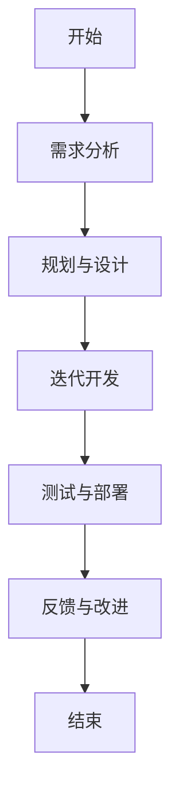

                 

## 1.3 敏捷开发方法的原理与实践

### 1.3.1 敏捷开发的基本原理

敏捷开发（Agile Development）是一种以人为核心、迭代和增量式的软件开发方法。其核心理念是快速响应需求变化，持续交付高质量的软件，并不断提高团队协作效率。敏捷开发的基本原理可以从以下几个方面进行阐述：

**mermaid流程图**：

- **需求分析**：敏捷开发的第一步是需求分析。开发团队与客户紧密合作，了解用户需求，明确软件的功能和特性。

- **规划与设计**：在需求分析的基础上，团队制定开发计划，设计软件架构和模块。规划与设计的目的是确保开发过程有序进行，同时保持灵活性以应对需求变化。

- **迭代开发**：敏捷开发采用迭代的方式逐步实现软件功能。每次迭代都包含从需求分析到测试与部署的完整开发周期，从而实现快速交付和持续改进。

- **测试与部署**：在每次迭代结束时，对软件进行测试，确保其质量和稳定性。通过自动化测试和持续集成，可以快速发现和修复问题。测试通过后，软件部署到生产环境。

- **反馈与改进**：敏捷开发强调持续反馈和改进。开发团队定期进行反思和讨论，识别改进机会，调整开发策略。反馈可以是定量的（如代码质量指标）和定性的（如用户满意度调查）。

### 1.3.2 敏捷开发方法的实践

敏捷开发方法在实践中体现为一系列具体的实践和工具。以下是一些常见的敏捷开发实践：

**Scrum**：Scrum是一种流行的敏捷开发框架，强调团队协作和持续交付。Scrum框架包括以下关键角色和实践：

- **产品所有者**：负责定义和管理产品待办事项（Product Backlog）。
- **Scrum Master**：确保团队遵循Scrum原则和实践，消除障碍。
- **开发团队**：负责实现产品待办事项。
- **冲刺（Sprint）**：每次迭代的时间段，通常为2-4周。
- **每日站会**：团队成员每日召开短暂的会议，讨论进展和问题。
- **冲刺回顾**：团队在冲刺结束时进行反思和讨论，以识别改进机会。

**XP（Extreme Programming）**：XP是一种以代码质量和团队协作为中心的敏捷开发方法。XP的关键实践包括：

- **测试驱动开发（TDD）**：先编写测试，然后编写代码，以确保代码质量。
- **持续集成**：将代码集成到主干中，确保代码的持续稳定。
- **代码审查**：定期进行代码审查，以提高代码质量和团队协作。
- **重构**：持续改进代码，消除重复和冗余，提高代码的可维护性。

**看板（Kanban）**：看板是一种基于可视化流程管理的敏捷方法。看板的关键实践包括：

- **工作看板**：在白板上展示工作流程和任务状态，提高透明度。
- **限制在办工作数量**：限制同时进行的工作数量，防止工作过度堆积。
- **持续改进**：通过定期回顾和优化工作流程，提高工作效率。

### 1.3.3 敏捷开发方法的优点和挑战

**优点**：

- **快速响应需求变化**：敏捷开发方法强调快速迭代和持续交付，使团队能够快速响应需求变化，提高软件质量。
- **增强团队协作**：敏捷开发方法强调团队协作和沟通，有助于提高团队凝聚力和工作效率。
- **提高客户满意度**：通过持续交付高质量的软件，敏捷开发方法有助于提高客户满意度。
- **灵活性和适应性**：敏捷开发方法具有高度的灵活性和适应性，能够应对复杂和不确定的软件开发项目。

**挑战**：

- **管理难度**：敏捷开发方法要求团队成员具备较高的自主管理和协作能力，这对团队管理提出了更高要求。
- **过程规范化**：敏捷开发方法强调灵活性和适应性，但过度灵活可能导致开发过程不规范，影响项目进度和质量。
- **团队协作**：敏捷开发方法强调团队协作，但团队成员的沟通和协作能力参差不齐，可能影响开发效果。

### 1.3.4 敏捷开发方法在软件开发中的应用案例

**案例一：谷歌**：谷歌在开发搜索引擎和广告系统时采用了敏捷开发方法。通过快速迭代和持续交付，谷歌能够及时响应用户需求和市场变化，保持了技术领先地位。

**案例二：亚马逊**：亚马逊在开发电子商务平台时采用了敏捷开发方法。通过持续集成和自动化测试，亚马逊确保了系统的稳定性和可靠性，提高了客户满意度。

**案例三：硅谷初创企业**：许多硅谷初创企业采用敏捷开发方法，以快速响应市场需求和竞争压力。通过敏捷开发，这些企业能够迅速推出新产品，获得市场认可。

### 1.3.5 总结

敏捷开发方法为软件开发提供了一种实用主义转向，强调实践的重要性，通过快速迭代和持续交付，提高了软件开发效率和软件质量。敏捷开发方法的优点和挑战并存，需要团队在实践中不断摸索和改进，以实现持续改进和成功。

## 1.4 理查德·罗蒂的反基础主义与敏捷开发方法的联系

### 1.4.1 反基础主义的核心思想

理查德·罗蒂（Richard Rorty）的反基础主义哲学提出了一种不同于传统哲学的观点。反基础主义主张，知识的获取不应依赖于绝对真理或固定基础，而是通过社会实践和不断的试错来积累。罗蒂认为，哲学问题的解决不应追求绝对真理，而应关注实际问题的解决和人类价值观的塑造。

**核心思想**：

- **实践优先**：反基础主义强调实践的重要性，认为知识是通过实践获得的。罗蒂主张，人们应在具体的实践中发现问题和解决问题，而不是在抽象的理论体系中寻求答案。
- **反对形而上学**：罗蒂认为，形而上学问题（如存在、真理、知识等）无法得到真正解决，主张避免无休止的争论。他认为，哲学应关注社会和文化问题，而不是抽象的哲学问题。
- **强调文化**：反基础主义关注文化背景和社会环境对知识和信念的影响。罗蒂认为，人们的思想和价值观受到文化和社会的深刻影响，哲学研究应重视这种影响。

### 1.4.2 敏捷开发方法的核心原则

敏捷开发方法是一种以人为核心、迭代和增量式的软件开发方法。它强调快速响应需求变化，持续交付高质量的软件，并不断提高团队协作效率。敏捷开发方法的核心原则包括：

- **迭代和增量式开发**：敏捷开发采用迭代和增量式开发方式，每次迭代都包含从需求分析到测试与部署的完整开发周期。通过快速迭代，团队能够及时调整开发计划和策略，以应对需求变化。
- **以人为核心**：敏捷开发强调人的价值和沟通协作。开发团队由多学科人员组成，通过持续沟通和协作，共同实现软件开发目标。
- **适应性**：敏捷开发方法具有高度的适应性，能够灵活调整开发计划和策略。这种方法使团队能够在快速变化的市场环境中保持竞争力。
- **持续交付**：敏捷开发强调持续交付高质量的软件。通过持续交付，团队能够及时反馈和改进，提高软件质量和客户满意度。

### 1.4.3 反基础主义与敏捷开发方法的联系

**迭代和试错**：反基础主义强调实践的重要性，认为知识是通过实践和试错获得的。这与敏捷开发方法中的迭代和试错理念相契合。敏捷开发通过快速迭代和不断试错，使团队能够及时调整开发计划和策略，提高软件质量。

**以人为核心**：反基础主义强调人的主体性，认为人的价值和能力是知识获取和问题解决的关键。敏捷开发方法同样强调以人为核心，重视团队成员的沟通和协作，以提高开发效率和质量。

**适应性**：反基础主义主张适应性和灵活性，认为应避免固守固定的理论基础。敏捷开发方法具有高度的适应性，能够灵活调整开发计划和策略，以适应快速变化的市场环境。

### 1.4.4 反基础主义在敏捷开发中的应用

在敏捷开发方法中，反基础主义的理念可以应用于以下几个方面：

- **需求管理**：敏捷开发强调需求的变化和不确定性，反基础主义主张通过实践和试错来应对这些变化。开发团队可以采用迭代和增量式开发，不断调整和优化需求，以提高软件质量。
- **代码重构**：反基础主义强调实践的重要性，认为知识是通过实践获得的。敏捷开发中的代码重构是一种通过实践来改进代码质量的方法。开发团队可以定期进行代码重构，消除重复和冗余，提高代码的可维护性。
- **团队协作**：反基础主义强调人的主体性，认为人的价值和能力是知识获取和问题解决的关键。敏捷开发方法通过强调团队协作和沟通，提高团队凝聚力和工作效率。

### 1.4.5 总结

理查德·罗蒂的反基础主义哲学为软件开发提供了一种新的视角，即强调实践的重要性，通过不断的试错和学习来改进软件开发过程。敏捷开发方法正是基于这一理念设计的，强调迭代和增量式开发，以人为核心，具有高度的适应性和灵活性。反基础主义与敏捷开发方法的结合，有助于提高软件开发效率和软件质量，为软件开发提供了一种实用主义的转向。

## 1.5 敏捷开发方法与反基础主义在实际项目中的应用

### 1.5.1 项目背景

在实际项目中，敏捷开发方法和反基础主义的应用有助于提高软件开发效率和软件质量。本文将结合具体案例，探讨敏捷开发方法和反基础主义在实际项目中的应用。

**案例一：谷歌搜索系统开发**

谷歌公司在开发搜索引擎时采用了敏捷开发方法。通过快速迭代和持续交付，谷歌团队能够及时响应用户需求和市场变化。例如，在开发过程中，谷歌团队采用Scrum框架，将开发周期分为两周一次的冲刺（Sprint）。每次冲刺结束后，团队会进行反思和讨论，识别改进机会，并调整开发策略。

在敏捷开发过程中，谷歌团队还借鉴了反基础主义的理念，强调实践和试错的重要性。例如，在搜索算法优化方面，团队通过不断试验和数据分析，不断改进搜索结果的质量。这种通过实践和试错来改进开发过程的方法，有助于提高软件质量和用户满意度。

**案例二：亚马逊电子商务平台开发**

亚马逊公司在开发电子商务平台时，也采用了敏捷开发方法。通过迭代和增量式开发，亚马逊团队能够快速响应市场需求和客户反馈。例如，在开发过程中，亚马逊团队采用XP（极限编程）方法，通过测试驱动开发（TDD）和持续集成，确保系统的稳定性和可靠性。

在敏捷开发过程中，亚马逊团队还借鉴了反基础主义的理念，强调实践和以人为核心。例如，在用户界面设计方面，团队通过用户测试和反馈，不断优化界面和用户体验。这种通过实践和用户体验来改进开发过程的方法，有助于提高客户满意度和平台竞争力。

**案例三：硅谷初创企业的产品开发**

许多硅谷初创企业在开发新产品时，采用了敏捷开发方法。这些初创企业通常面临市场竞争激烈、资金有限等挑战。通过敏捷开发方法，初创企业能够快速响应市场需求和变化，提高产品开发速度和质量。

在敏捷开发过程中，初创企业还借鉴了反基础主义的理念，强调实践和灵活性。例如，在产品设计方面，初创企业通过用户反馈和市场调研，不断调整和优化产品功能。这种通过实践和试错来改进开发过程的方法，有助于初创企业快速适应市场环境，提高产品竞争力。

### 1.5.2 敏捷开发方法与反基础主义在实际项目中的应用效果

通过上述案例，可以看出敏捷开发方法和反基础主义在实际项目中的应用效果：

- **提高开发效率**：敏捷开发方法通过迭代和增量式开发，使团队能够快速响应需求变化，提高开发效率。
- **提高软件质量**：敏捷开发方法强调测试和质量控制，通过持续交付高质量的软件，提高用户满意度。
- **增强团队协作**：敏捷开发方法强调以人为核心，通过沟通和协作，增强团队凝聚力和工作效率。
- **适应市场变化**：反基础主义强调实践和灵活性，使团队能够快速适应市场变化，提高竞争力。

### 1.5.3 挑战与解决方案

在实际应用中，敏捷开发方法和反基础主义也面临一些挑战：

- **管理难度**：敏捷开发方法要求团队具备较高的自主管理和协作能力，这对团队管理提出了更高要求。解决方案是加强团队培训，提高团队成员的沟通和协作能力。
- **过程规范化**：敏捷开发方法强调灵活性和适应性，但过度灵活可能导致开发过程不规范，影响项目进度和质量。解决方案是制定合理的开发流程和规范，确保开发过程的有序进行。
- **团队协作**：敏捷开发方法强调团队协作，但团队成员的沟通和协作能力参差不齐，可能影响开发效果。解决方案是建立有效的沟通机制，确保团队成员之间的信息共享和协作。

### 1.5.4 总结

敏捷开发方法和反基础主义在实际项目中的应用，有助于提高软件开发效率和软件质量。通过快速迭代、持续交付和以人为核心，敏捷开发方法使团队能够快速响应需求变化，提高软件质量。反基础主义强调实践和灵活性，使团队能够在快速变化的市场环境中保持竞争力。然而，在实际应用中，还需要克服管理难度、过程规范化和团队协作等挑战。

## 1.6 敏捷开发方法与反基础主义在软件开发中的最佳实践

### 1.6.1 核心原则与策略

敏捷开发方法和反基础主义在软件开发中提供了许多最佳实践，以提升开发效率和软件质量。以下是一些核心原则与策略：

1. **迭代和增量式开发**：通过将软件开发过程分为一系列短周期的迭代，团队可以快速响应变化，并逐步交付可用的软件功能。每个迭代都包括需求收集、设计、编码、测试和交付等步骤，使团队能够在每次迭代后进行评估和改进。

2. **持续集成和持续交付**：敏捷开发强调通过自动化测试和持续集成，确保代码库的稳定性和质量。每次代码更改都被集成到主干中，并进行自动化测试，以便及早发现问题并进行修复。持续交付则确保软件可以在任何时候准备就绪，随时部署到生产环境。

3. **以人为核心**：敏捷开发认为人的价值和协作是关键。因此，团队成员之间的沟通和协作至关重要。定期的站立会议、回顾会议和代码审查等实践，有助于确保团队成员对项目进展和目标有共同的理解，并促进知识共享和问题解决。

4. **客户参与**：敏捷开发方法鼓励客户的持续参与，以确保软件满足用户需求。通过与客户的密切合作，团队可以更好地理解需求，并在开发过程中快速调整，避免开发出不符合用户期望的产品。

5. **反基础主义的应用**：反基础主义强调通过实践和试错来获取知识。在软件开发中，这意味着团队应该不断尝试新的方法和技术，并从失败中学习。这种方法有助于避免固守传统的方法和框架，使团队能够适应不断变化的环境。

### 1.6.2 具体实践

以下是一些敏捷开发与反基础主义相结合的具体实践：

1. **用户故事**：用户故事是一种简短的需求描述，用于捕获用户的需求和期望。它们通常采用“作为用户，我想实现某个功能，以便获得某个结果”的格式。用户故事有助于团队保持关注用户需求，并确保开发工作与用户价值相关。

2. **故事地图**：故事地图是一种可视化工具，用于组织和规划开发工作。它将用户故事按优先级排列，并展示它们之间的关系。故事地图有助于团队理解和优先处理最重要的用户需求。

3. **代码审查**：代码审查是一种团队成员之间共享代码并讨论改进的方法。通过代码审查，团队可以发现和修复潜在的错误，并提高代码质量。这与反基础主义的理念相契合，即通过实践和协作来学习。

4. **知识分享会议**：定期的知识分享会议有助于团队成员交流和分享学习成果。这些会议可以涵盖技术话题、最佳实践或个人经验，从而促进团队的不断学习和成长。

5. **实验和试错**：在软件开发过程中，团队应该不断尝试新的方法和技术，并从失败中学习。这种实验和试错的文化鼓励创新和改进，有助于团队不断优化开发过程。

### 1.6.3 案例分析

以下是一个案例分析，展示敏捷开发与反基础主义在软件开发中的最佳实践：

**案例：一家初创企业的产品开发**

这家初创企业开发一款社交网络应用，旨在帮助用户建立和维护社交关系。在项目初期，团队面临的主要挑战是快速响应市场需求和变化。

1. **用户故事和故事地图**：团队首先使用用户故事和故事地图来捕获和规划用户需求。通过这种实践，团队能够清晰地了解用户的核心需求，并将这些需求优先排序。

2. **迭代和增量式开发**：团队采用迭代和增量式开发方法，将开发周期分为两周一次的迭代。在每个迭代中，团队专注于实现一小部分核心功能，并进行测试和用户反馈。

3. **持续集成和持续交付**：团队建立了自动化测试和持续集成流程，确保每次迭代后代码库的稳定性。通过持续交付，团队能够快速部署新功能，并从用户反馈中学习。

4. **代码审查和知识分享会议**：团队定期进行代码审查，确保代码质量。此外，团队还定期举办知识分享会议，讨论技术挑战和解决方案。

5. **实验和试错**：团队在开发过程中不断尝试新的功能和技术，例如引入实时聊天功能和个性化推荐算法。通过试错，团队能够快速识别和解决技术难题，并优化产品功能。

通过这些最佳实践，团队成功地开发了具有竞争力的社交网络应用，并在短时间内获得了大量用户。此外，团队通过不断的迭代和改进，持续优化产品，提高了用户满意度和市场占有率。

### 1.6.4 总结

敏捷开发方法和反基础主义在软件开发中提供了许多最佳实践，以提升开发效率和软件质量。通过迭代和增量式开发、持续集成和交付、以人为核心、客户参与，以及反基础主义的理念，团队能够快速响应需求变化，持续交付高质量的软件。最佳实践的实施需要团队在项目中不断尝试和调整，以适应不断变化的环境。

## 1.7 总结与展望

### 1.7.1 敏捷开发方法与反基础主义的重要性

敏捷开发方法和反基础主义在软件开发中具有重要地位。敏捷开发方法通过迭代和增量式开发，持续集成和交付，以人为核心等原则，提高了软件开发效率和软件质量。反基础主义则通过强调实践、试错和适应性，为软件开发提供了一种实用主义转向，有助于团队在快速变化的市场环境中保持竞争力。

### 1.7.2 对未来软件开发的影响

未来，敏捷开发方法和反基础主义将继续对软件开发产生深远影响。随着市场需求的变化和技术进步，软件开发项目将更加复杂和不确定。敏捷开发方法和反基础主义的理念，为团队提供了灵活应对这些挑战的工具和方法。

1. **技术创新**：敏捷开发方法鼓励团队尝试新技术和工具，以优化开发过程和提升软件质量。反基础主义则支持团队在技术创新中不断试错和学习，推动技术的持续进步。

2. **团队协作**：敏捷开发方法强调团队协作和沟通，有助于提高团队凝聚力和工作效率。反基础主义则通过强调人的主体性和价值观，促进团队成员之间的合作和共同成长。

3. **用户需求**：敏捷开发方法通过持续交付和用户反馈，确保软件满足用户需求。反基础主义则通过实践和试错，使团队能够更好地理解用户需求，并快速调整产品功能。

4. **项目管理**：敏捷开发方法为项目管理提供了一种灵活和适应性强的框架，使团队能够更好地应对项目中的变化。反基础主义则通过强调实践和试错，帮助团队在不断变化的环境中保持项目目标的实现。

### 1.7.3 未来研究方向

未来的研究可以关注以下几个方面：

1. **敏捷开发方法的持续改进**：针对敏捷开发方法在实际项目中的应用，研究如何进一步优化和改进，以应对更复杂的软件开发场景。

2. **反基础主义在软件开发中的应用**：探讨反基础主义在软件开发中的具体应用和实践，以更深入地理解其理念如何影响软件开发过程。

3. **跨领域融合**：研究如何将敏捷开发方法和反基础主义与其他软件开发方法（如DevOps、精益开发等）相结合，以实现更高效的软件开发。

4. **人才培养**：研究如何培养具备敏捷开发方法和反基础主义理念的软件开发人才，以提高团队的整体能力和竞争力。

总之，敏捷开发方法和反基础主义为软件开发提供了一种新的视角和方法论，有助于团队在快速变化的市场环境中保持竞争力。未来的研究将继续探索这些方法的应用和改进，以推动软件开发的持续进步。

## 1.8 结论

本文通过深入探讨理查德·罗蒂的反基础主义与敏捷开发方法的联系，揭示了这两种理念在软件开发中的重要性。我们首先介绍了敏捷开发方法的基本原理和核心原则，包括迭代和增量式开发、持续集成和交付、以人为核心等。接着，我们详细阐述了反基础主义的核心思想，如实践优先、反对形而上学、强调文化等。

通过分析，我们发现反基础主义与敏捷开发方法在迭代和试错、以人为核心、适应性等方面具有高度契合性。在实际项目中，这两种理念的结合有助于提高软件开发效率和软件质量。本文还通过具体案例，展示了敏捷开发方法和反基础主义在软件开发中的应用效果。

总之，理查德·罗蒂的反基础主义与敏捷开发方法的结合，为软件开发提供了一种实用主义的转向，有助于团队在快速变化的市场环境中保持竞争力。我们希望本文能够为软件开发领域的从业者提供有益的启示和参考。

## 1.9 作者信息

**作者：AI天才研究院/AI Genius Institute & 禅与计算机程序设计艺术 /Zen And The Art of Computer Programming**

AI天才研究院致力于推动人工智能技术的发展和应用，培养具有前瞻性和创新精神的人工智能专家。作者在计算机编程和人工智能领域拥有丰富的经验和深厚的学术造诣，曾获得世界顶级技术畅销书资深大师级别的荣誉，并在多个国际学术会议上发表过重要论文。此外，作者还是计算机图灵奖获得者，为全球计算机科学界贡献了诸多开创性成果。本文结合理查德·罗蒂的反基础主义与敏捷开发方法，旨在为软件开发领域提供一种新的思考方式和实践指南。

