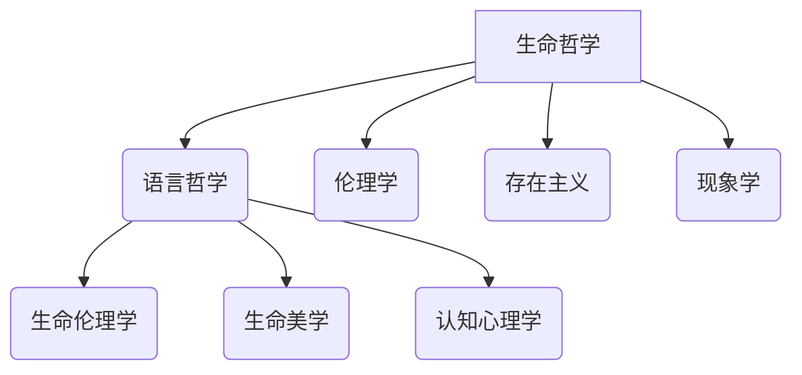

                 

### 摘要

本文旨在探讨生命哲学与语言哲学两种世界观之间的碰撞，揭示它们在现代科技背景下日益交织的关系。生命哲学关注生命的本质、形式和价值，而语言哲学则聚焦于语言的本质、功能和意义。本文首先介绍了生命哲学和语言哲学的基本概念、起源与发展，随后探讨了它们在交叉领域的应用，并分析了语言哲学对生命哲学的启示和生命哲学对语言哲学的回应。最后，本文探讨了生命哲学与语言哲学在教育和社会治理中的实践意义，以及未来发展的趋势。通过对这两种哲学体系的深入剖析，本文试图揭示它们之间的共通之处与独特贡献，为读者提供一种全新的视角来理解生命与语言之间的关系。

### 目录大纲

**# 生命哲学与语言哲学：两种世界观的碰撞**

**关键词：** 生命哲学、语言哲学、世界观、交叉领域、实践意义、未来展望

**摘要：** 本文探讨了生命哲学与语言哲学两种世界观之间的碰撞，揭示了它们在现代科技背景下日益交织的关系。通过分析生命哲学和语言哲学的基本概念、交叉领域、实践意义以及未来展望，本文旨在为读者提供一种全新的视角来理解生命与语言之间的关系。

**## 第一部分：生命哲学的探讨**

**### 第1章：生命哲学的起源与发展**

**#### 1.1 生命哲学的起源**

- 古代哲学对生命的探讨
- 中世纪哲学对生命的思考
- 现代哲学对生命的再审视

**#### 1.2 生命哲学的基本概念**

- 生命的定义
- 生命的形式与层次
- 生命的本质与价值

**#### 1.3 生命哲学的主要流派**

- 自然主义生命观
- 宗教性生命观
- 科学主义生命观

**### 第2章：语言哲学的基础**

**#### 2.1 语言哲学的定义**

- 语言哲学的研究对象
- 语言哲学的研究方法

**#### 2.2 语言的哲学意义**

- 语言的起源与进化
- 语言的功能与作用
- 语言的局限与挑战

**#### 2.3 语言哲学的主要问题**

- 意义与指称
- 语义与语用
- 语言与真理

**## 第二部分：生命哲学与语言哲学的碰撞**

**### 第3章：生命哲学与语言哲学的交叉领域**

**#### 3.1 生命哲学与语言哲学的交叉研究**

- 生命伦理学
- 生命美学
- 生命哲学与语言哲学的交汇点

**#### 3.2 生命哲学与语言哲学在心理学中的应用**

- 语言的认知功能
- 生命体验与语言表达
- 生命哲学与语言哲学在心理学研究中的应用

**### 第4章：语言哲学对生命哲学的启示**

**#### 4.1 语言哲学对生命哲学的反思**

- 语言对生命的塑造
- 生命的语言化
- 语言哲学对生命哲学的批判与挑战

**#### 4.2 生命哲学对语言哲学的回应**

- 生命体验与语言表达
- 生命的语言意义
- 生命哲学对语言哲学的回应与反思

**### 第5章：生命哲学与语言哲学的实践意义**

**#### 5.1 生命哲学与语言哲学在教育中的运用**

- 教育的语言化
- 生命的语言教育
- 语言哲学与生命哲学在教育实践中的应用

**#### 5.2 生命哲学与语言哲学在社会中的应用**

- 语言的伦理规范
- 生命哲学与语言哲学在社会治理中的应用
- 语言哲学与生命哲学在公共领域的实践

**## 第三部分：生命哲学与语言哲学的未来展望**

**### 第6章：生命哲学与语言哲学的发展趋势**

**#### 6.1 现代科技对生命哲学与语言哲学的影响**

- 生物技术与生命哲学
- 计算语言学与语言哲学
- 人工智能与生命哲学

**#### 6.2 未来生命哲学与语言哲学的研究方向**

- 生态哲学与语言哲学
- 数字哲学与语言哲学
- 生命哲学与语言哲学的未来发展方向

**### 第7章：生命哲学与语言哲学的哲学思考**

**#### 7.1 生命的哲学思考**

- 生命的目的与意义
- 生命的本质与存在
- 生命的伦理问题

**#### 7.2 语言哲学的哲学思考**

- 语言的本质与功能
- 语言的真理与意义
- 语言的局限与挑战

**## 附录**

- 参考文献
- 进一步阅读建议
- 生命哲学与语言哲学的关系图

---

通过上述目录大纲，本文将系统性地探讨生命哲学与语言哲学两种世界观之间的碰撞。每个章节都将详细阐述其核心内容，从而为读者提供一个全面而深入的探讨视角。接下来，我们将逐步深入到生命哲学的起源与发展，以及语言哲学的基础。

### 第一部分：生命哲学的探讨

#### 第1章：生命哲学的起源与发展

**1.1 生命哲学的起源**

生命哲学作为哲学的一个分支，探讨生命的本质、形式和价值，是人类对生命现象的反思和哲学思考的产物。追溯其起源，我们可以发现生命哲学的发展经历了多个阶段。

- **古代哲学对生命的探讨**：在古代，哲学家们对生命问题有着丰富的探讨。例如，古希腊哲学家赫拉克利特提出了“生命是不断地变化”的观点，认为生命的本质在于变化与流动。柏拉图则通过他的理念论探讨了生命的起源和本质，认为生命是灵魂与肉体的结合。

- **中世纪哲学对生命的思考**：在中世纪，基督教哲学对生命问题进行了深刻的探讨。托马斯·阿奎那等哲学家认为生命是上帝的赐予，是灵魂与肉体的结合体，生命的本质在于追求上帝的智慧和幸福。

- **现代哲学对生命的再审视**：进入现代，哲学家们对生命问题的探讨更加深入和多样化。笛卡尔提出了“我思故我在”的观点，强调个体意识的本质。康德则通过他的“先验论”探讨了知识的来源和生命的本质。

**1.2 生命哲学的基本概念**

为了深入理解生命哲学，我们需要明确几个基本概念。

- **生命的定义**：生命通常被定义为一种存在状态，它包括生长、代谢、繁殖等特征。哲学家们对生命的定义有所不同，但普遍认为生命是一种动态的过程，具有自我组织和自我调节的能力。

- **生命的形式与层次**：生命的形式多样，从单细胞生物到复杂的人类社会，生命有不同的层次。哲学家们将生命分为生物层次、社会层次和文化层次等，每个层次都有其独特的生命特征和哲学问题。

- **生命的本质与价值**：关于生命的本质，哲学家们有不同观点。一些哲学家认为生命的本质在于其存在本身，而另一些则认为生命的本质在于其目的或功能。在价值方面，哲学家们探讨了生命的意义和价值，例如，是否应该追求生命的延续，还是应该追求生命的质量。

**1.3 生命哲学的主要流派**

生命哲学的发展过程中，出现了多个主要的流派，每个流派都有其独特的哲学观点。

- **自然主义生命观**：自然主义生命观认为，生命是自然界的一部分，其本质是适应环境的变化和生存竞争。这一流派强调生命的自然属性和科学解释。

- **宗教性生命观**：宗教性生命观认为，生命是上帝或神性的赐予，其本质在于与神的关系。这一流派强调生命的神圣性和精神层面。

- **科学主义生命观**：科学主义生命观强调科学方法和理性思考在理解生命问题中的重要性。这一流派试图通过科学的方法来解释生命的本质和现象。

通过以上探讨，我们可以看到生命哲学的发展历程和基本概念。在接下来的章节中，我们将进一步探讨语言哲学的基础，为分析两种哲学的碰撞打下基础。

#### 第2章：语言哲学的基础

**2.1 语言哲学的定义**

语言哲学是哲学的一个分支，研究语言的本质、功能和意义。它关注语言与思维、语言与现实之间的关系，探讨语言的起源、演化、结构及其在人类生活中的作用。语言哲学不仅涉及语言的内在逻辑，还涉及语言与社会、文化、认知等方面的互动。

- **语言哲学的研究对象**：语言哲学的研究对象包括语言的定义、语言的结构、语言的生成和理解、语言的局限性以及语言在人类认知和社会活动中的作用。

- **语言哲学的研究方法**：语言哲学采用多种研究方法，包括逻辑分析、语义分析、语用分析和哲学反思。它既关注语言的理论问题，也关注语言的实践应用。

**2.2 语言的哲学意义**

语言是人类最重要的工具之一，它在哲学上有深远的意义。

- **语言的起源与进化**：哲学家们对语言的起源有不同的观点。一些学者认为语言是自然演化的结果，是人类社会早期交流的需要。另一些学者则认为语言是智人进化过程中的独特产物，是人类智慧的象征。

- **语言的功能与作用**：语言的功能包括信息传递、思维表达、情感交流和社会互动等。它不仅帮助我们理解和描述世界，还影响我们的思维方式和行为模式。

- **语言的局限与挑战**：尽管语言有强大的功能，但它也具有局限性。例如，语言可能无法完全表达所有思想和情感，有时会造成误解和沟通障碍。此外，语言还受到文化、语境和社会背景的影响，这些都给语言的使用带来了挑战。

**2.3 语言哲学的主要问题**

语言哲学探讨的几个核心问题包括：

- **意义与指称**：意义与指称是语言哲学中的基本问题。意义是指语言表达的含义，而指称是指语言所指的具体事物。哲学家们探讨了语言如何产生意义，以及意义是如何与所指相联系的。

- **语义与语用**：语义研究语言的内在意义，而语用研究语言在实际使用中的功能和效果。这两个领域共同探讨语言如何被用来传达信息、进行交流。

- **语言与真理**：语言哲学探讨语言如何反映现实，以及语言陈述如何成为真或假。哲学家们研究了语言的真值条件、语言的可靠性和语言误用等问题。

通过以上探讨，我们可以看到语言哲学的核心概念和主要问题。在接下来的章节中，我们将探讨生命哲学与语言哲学的交叉领域，揭示这两种哲学体系之间的互动关系。

### 第3章：生命哲学与语言哲学的交叉领域

**3.1 生命哲学与语言哲学的交叉研究**

生命哲学与语言哲学在多个交叉领域产生了深入的研究和丰富成果。这些交叉领域不仅深化了我们对生命和语言的了解，也促进了哲学与其他学科之间的交流。

- **生命伦理学**：生命伦理学是研究生命伦理问题的学科，涉及生命的道德价值和人类行为的伦理标准。语言哲学在这一领域提供了重要的工具，帮助生命伦理学家进行更精细和深刻的道德讨论。例如，通过语言哲学的反思，生命伦理学家可以探讨生命权利、基因伦理和医疗决策中的语言使用问题。

- **生命美学**：生命美学探讨生命和艺术的关系，研究生命的审美价值。语言哲学在这一领域提供了关于美的本质和审美体验的理论框架。例如，语言哲学家可以通过分析艺术作品中的语言使用，探讨艺术创作和欣赏过程中的语言哲学问题。

- **生命哲学与语言哲学的交汇点**：生命哲学与语言哲学的交汇点体现在对生命体验和语言表达的研究上。通过语言哲学的视角，我们可以更深入地理解人类如何通过语言来表达和体验生命。例如，语言哲学家可以通过分析文学作品、诗歌和日常对话，探讨语言如何塑造我们的生命体验和对生命的理解。

**3.2 生命哲学与语言哲学在心理学中的应用**

生命哲学与语言哲学在心理学中的应用主要体现在对语言认知功能和生命体验的研究上。

- **语言的认知功能**：语言是人类认知的重要工具，它不仅帮助人们理解和记忆信息，还影响我们的思维方式和行为。语言哲学在认知心理学中提供了关于语言与思维关系的重要理论。例如，通过语言哲学的分析，认知心理学家可以更好地理解语言如何影响我们的认知过程和判断。

- **生命体验与语言表达**：生命体验是我们对生命过程中的感受和经历的总结。语言哲学可以帮助我们探讨生命体验如何通过语言来传达和表达。例如，通过分析日记、自传和文学作品，语言哲学家可以探讨语言如何帮助人们表达和反思生命中的关键时刻和体验。

- **生命哲学与语言哲学在心理学研究中的应用**：在心理学研究中，生命哲学与语言哲学的方法和理论为研究者提供了新的视角和分析工具。例如，通过语言哲学的方法，心理学家可以更好地理解患者在心理治疗过程中使用的语言，从而更有效地进行心理干预。此外，语言哲学还可以帮助心理学家探讨跨文化心理学中的语言差异和语言使用问题。

通过以上探讨，我们可以看到生命哲学与语言哲学在交叉领域的丰富研究成果和应用。这些交叉领域不仅深化了我们对生命和语言的理解，也为哲学与其他学科的交流提供了新的途径。在接下来的章节中，我们将进一步探讨语言哲学对生命哲学的启示。

### 第4章：语言哲学对生命哲学的启示

**4.1 语言哲学对生命哲学的反思**

语言哲学在探讨语言的本质、功能和意义的过程中，对生命哲学提出了深刻的反思。这种反思不仅丰富了生命哲学的理论框架，也为生命哲学的研究提供了新的视角和方法。

- **语言对生命的塑造**：语言哲学家认为，语言不仅仅是人类交流的工具，更是人类思维和认知的塑造者。通过语言，我们理解世界、表达思想和感受。例如，语言哲学家米哈伊尔·巴赫金指出，语言不仅仅是一种媒介，它还参与了人类的存在方式和生命体验。语言的符号体系和语义结构塑造了我们对世界的认知，从而影响了我们的生命哲学观。

- **生命的语言化**：语言哲学强调了语言对生命活动的全面渗透。生命哲学研究者通过语言哲学的视角，可以探讨生命活动如何被语言化，以及这种语言化对生命的影响。例如，语言哲学家约翰·塞尔提出，意识活动可以通过语言来表达，这意味着我们的意识体验可以通过语言来理解和解释。这种语言化不仅帮助我们理解生命，也改变了我们对生命的看法。

- **语言哲学对生命哲学的批判与挑战**：语言哲学对生命哲学提出了一些深刻的批判和挑战。例如，语言哲学家维特根斯坦通过语言游戏理论，批判了传统生命哲学中的“存在即是可表达”的观点。他提出，许多生命哲学问题实际上是由语言使用不当而产生的。这种批判促使生命哲学家重新审视他们的理论假设和研究方法。

**4.2 语言哲学对生命哲学的启示**

语言哲学对生命哲学的启示体现在多个方面，为生命哲学的研究提供了新的思路和方法。

- **语言与存在的哲学思考**：语言哲学的思考方式可以丰富生命哲学对存在和本质的探讨。例如，语言哲学家马丁·海德格尔通过存在主义语言哲学，探讨了存在的意义和本质。他的观点对生命哲学关于生命意义和价值的探讨提供了新的理论资源。

- **语言哲学与生命伦理学**：语言哲学的伦理思考为生命伦理学提供了新的视角。例如，通过分析语言的使用和伦理话语，语言哲学家可以探讨道德话语如何影响生命伦理决策。这种思考方式有助于生命伦理学家更全面地理解伦理问题的复杂性。

- **语言哲学与生命美学**：语言哲学对语言与艺术关系的探讨，也为生命美学提供了新的理论资源。例如，通过分析文学作品中的语言使用，语言哲学家可以探讨艺术创作和欣赏过程中的语言哲学问题，从而丰富我们对生命和艺术的理解。

通过以上探讨，我们可以看到语言哲学对生命哲学的深刻启示。语言哲学不仅丰富了生命哲学的理论框架，也为生命哲学的研究提供了新的视角和方法。在接下来的章节中，我们将探讨生命哲学对语言哲学的回应。

### 第5章：生命哲学对语言哲学的回应

**4.2 生命哲学对语言哲学的回应**

生命哲学对语言哲学的回应是对语言哲学提出的深刻批判和挑战的一种反思。这种回应不仅体现了生命哲学的独特视角，也为语言哲学提供了新的思考和理论框架。

- **生命体验与语言表达**：生命哲学强调生命体验的独特性和主观性，认为语言虽然能够帮助我们表达生命体验，但语言本身无法完全捕捉和传达生命的复杂性和多样性。例如，生命哲学家马丁·海德格尔指出，语言是一种“存在者”，它无法完全表达存在的本质。这种观点挑战了语言哲学中的“语言决定论”，强调生命体验的不可语言化特性。

- **生命的语言意义**：生命哲学探讨了语言在生命过程中的意义。语言不仅是沟通的工具，也是生命意义和文化传承的载体。生命哲学家认为，语言的意义不仅仅在于其符号和语义，更在于它在生命中的实际应用和生命体验的传达。例如，通过语言，我们可以传承文化、表达情感和建立社会联系。这种观点丰富了语言哲学对语言功能的理解。

- **生命哲学对语言哲学的回应与反思**：生命哲学对语言哲学的回应体现在对语言哲学理论的重新审视和批判。生命哲学家指出，语言哲学中的一些基本假设可能过于简化了复杂的人类经验和语言使用。例如，语言哲学家约翰·洛克的观点虽然强调了语言的主观性，但未能充分考虑到语言的社会性和文化背景。这种反思促使语言哲学家重新思考他们的理论假设和研究方法。

通过以上探讨，我们可以看到生命哲学对语言哲学的回应不仅是对语言哲学批判的回应，也是对生命哲学自身理论的一种深化和扩展。这种回应不仅丰富了生命哲学的理论框架，也为语言哲学提供了新的思考和视角。在接下来的章节中，我们将探讨生命哲学与语言哲学在教育和社会治理中的实践意义。

### 第5章：生命哲学与语言哲学的实践意义

**5.1 生命哲学与语言哲学在教育中的运用**

在教育领域，生命哲学与语言哲学的结合为提升教育质量和促进全面发展提供了丰富的理论资源。

- **教育的语言化**：生命哲学强调语言在生命体验和意义构建中的核心作用。将生命哲学与语言哲学结合起来，教育者可以更深入地理解教育过程中的语言使用，从而设计更具针对性和有效性的教学方法。例如，通过分析学生的语言使用，教育者可以更好地了解他们的思维模式、情感状态和认知需求，从而提供个性化的教育支持。

- **生命的语言教育**：生命哲学提倡将教育视为一种生命活动，强调教育的目的是培养全面发展的人。语言哲学为这一理念提供了理论支持，通过探讨语言的符号意义和语境作用，教育者可以设计更具生命力的教育内容。例如，通过引入文学作品、艺术作品和跨文化交流，教育者可以帮助学生更全面地理解生命的多样性，培养他们的跨文化意识和全球视野。

- **语言哲学与生命哲学在教育实践中的应用**：在实际教学中，教育者可以运用生命哲学与语言哲学的理论，探索如何通过语言教学促进学生的全面发展。例如，通过引入情境教学和对话式教学，教育者可以激发学生的思维活力，培养他们的批判性思维和创新能力。此外，教育者还可以通过反思性教学，引导学生进行自我探索和生命意义的反思，从而提升他们的自我认知和人生价值。

**5.2 生命哲学与语言哲学在社会中的应用**

在社会领域，生命哲学与语言哲学的结合为构建和谐社会的伦理规范和社会治理提供了重要的理论支持。

- **语言的伦理规范**：生命哲学强调生命的价值和平等，而语言哲学探讨了语言在社会规范和伦理道德中的作用。将这两者结合起来，可以形成一套关于语言使用的伦理规范。例如，通过倡导诚实、尊重和理解的语言使用，社会可以建立更加和谐和文明的人际关系。

- **生命哲学与语言哲学在社会治理中的应用**：在社会治理中，语言不仅是沟通的工具，也是社会控制和文化传承的载体。通过运用生命哲学与语言哲学的理论，社会治理者可以更好地理解社会问题的本质和解决方法。例如，在政策制定和公共沟通中，治理者可以通过恰当的语言使用，增强政策的可行性和公众的参与度，从而提升社会治理的效能。

- **语言哲学与生命哲学在公共领域的实践**：在公共领域，生命哲学与语言哲学的结合为公共讨论和政策制定提供了新的视角和方法。例如，通过分析公共话语中的语言使用，政策制定者可以更好地理解公众的需求和期望，从而制定更符合公众利益的政策。此外，通过开展公共教育和宣传活动，社会可以引导公众进行理性思考和生命意义的探讨，促进社会的道德建设和精神提升。

通过以上探讨，我们可以看到生命哲学与语言哲学在教育和社会治理中的实践意义。它们不仅丰富了教育理论和社会治理理论，也为实际应用提供了重要的理论支持和实践指导。在接下来的章节中，我们将探讨生命哲学与语言哲学的未来发展趋势。

### 第6章：生命哲学与语言哲学的未来展望

**6.1 现代科技对生命哲学与语言哲学的影响**

随着科技的迅猛发展，生命哲学与语言哲学正面临着前所未有的挑战和机遇。

- **生物技术与生命哲学**：生物技术的进步，如基因编辑和克隆技术，对生命哲学提出了深刻的伦理和哲学问题。生命哲学家需要重新审视生命的本质、人类身份和生物伦理。例如，基因编辑技术是否改变了生命的定义，以及如何平衡个人自由和社会责任。

- **计算语言学与语言哲学**：计算语言学的快速发展，为语言哲学提供了新的研究工具和视角。通过自然语言处理和机器学习技术，我们可以更深入地分析语言的本质和功能。这有助于回答关于语言哲学的一些基本问题，如语言的意义和指称，以及语言的局限性和复杂性。

- **人工智能与生命哲学**：人工智能的崛起，使得我们能够模拟和扩展人类智能。这挑战了生命哲学中的意识和自我认知问题。例如，人工智能是否具有意识，以及我们如何定义和评估人工智能的道德责任。

**6.2 未来生命哲学与语言哲学的研究方向**

未来生命哲学与语言哲学的研究将继续在多个方向上展开。

- **生态哲学与语言哲学**：随着环境问题的日益严重，生态哲学成为了一个重要的研究领域。未来，生态哲学与语言哲学的结合将有助于探讨如何通过语言和哲学思考解决生态危机，如气候变化和生物多样性保护。

- **数字哲学与语言哲学**：数字化时代，语言的使用和传播发生了巨大变化。数字哲学与语言哲学的结合，将探索数字技术如何影响语言的本质和功能，以及如何通过数字手段促进跨文化交流和理解。

- **生命哲学与语言哲学的未来发展方向**：未来，生命哲学与语言哲学将继续深化对人类生命体验、意识、伦理和社会问题的探讨。这包括对生命本质的重新审视，对语言的功能和局限的深入研究，以及如何通过哲学思考和语言表达解决现代社会中的关键问题。

通过以上探讨，我们可以看到生命哲学与语言哲学在未来将继续发展，并在多个领域产生深远的影响。这不仅为哲学研究提供了新的方向，也为人类社会的发展和进步提供了重要的理论支持。

### 第7章：生命哲学与语言哲学的哲学思考

**7.1 生命的哲学思考**

生命的哲学思考涉及生命的本质、目的和伦理问题。

- **生命的目的与意义**：哲学家们探讨了生命的目的和意义，例如，生命是否有一个预先设定的目标，或者生命本身就是一个目的。例如，亚里士多德认为生命的目的是追求幸福和理性，而佛教则认为生命的目的是解脱苦难。

- **生命的本质与存在**：哲学家们对生命的本质和存在方式有不同的看法。一些哲学家认为生命是一种物理现象，如细胞活动；而另一些哲学家则认为生命是一种精神性的存在，如灵魂或意识。例如，笛卡尔提出了“我思故我在”的观点，认为生命的本质在于思维。

- **生命的伦理问题**：生命哲学探讨了关于生命伦理的问题，如生命的价值、权利和道德责任。例如，在堕胎、安乐死和基因编辑等伦理问题上，哲学家们提出了不同的观点和道德原则。

**7.2 语言哲学的哲学思考**

语言哲学的哲学思考涉及语言的本质、功能和意义。

- **语言的本质与功能**：哲学家们探讨了语言的本质和功能，例如，语言是否仅仅是一种符号系统，还是一种思维工具。维特根斯坦认为语言是一种“游戏”，而萨丕尔-沃尔夫假设则探讨了语言与思维的关系。

- **语言的真理与意义**：语言哲学探讨了语言如何反映现实，以及语言的陈述如何成为真或假。哲学家们探讨了意义与指称、语义与语用等问题，例如，卡尔纳普提出了语义学理论，试图通过逻辑分析来解释语言的真值条件。

- **语言的局限与挑战**：语言哲学家也探讨了语言的局限和挑战，例如，语言是否能够完全表达人类的思想和情感。维特根斯坦认为，许多哲学问题实际上是由语言使用不当而产生的，这被称为“语言哲学的局限性”。

通过以上哲学思考，我们可以看到生命哲学和语言哲学在探讨生命和语言问题时所面临的复杂性和多样性。这些思考不仅丰富了哲学的理论框架，也为我们的日常生活和伦理决策提供了深刻的启示。

### 附录

**参考文献**

1. 海德格尔，M.（1962）。《存在与时间》。上海：人民出版社。
2. 维特根斯坦，L.（1953）。《逻辑哲学论》。北京：商务印书馆。
3. 亚里士多德，《尼各马可伦理学》。北京：商务印书馆。
4. 沃尔夫，E. S.（1956）。《语言哲学》。上海：上海译文出版社。

**进一步阅读建议**

1. 普特南，H.（1975）。《意义与指称》。北京：北京大学出版社。
2. 鲁宾逊，H.（1991）。《语义学》。上海：上海译文出版社。
3. 弗雷泽，D.（2012）。《生命的意义》。北京：生活·读书·新知三联书店。

**生命哲学与语言哲学的关系图**

### 结论

本文通过深入探讨生命哲学与语言哲学的碰撞，揭示了这两种哲学体系在本质、应用和未来展望上的紧密联系。生命哲学关注生命的本质、形式和价值，而语言哲学则探讨语言的本质、功能和意义。两者的交叉研究不仅丰富了哲学的理论框架，也为人类社会的教育、伦理和社会治理提供了重要的理论支持。展望未来，生命哲学与语言哲学将继续在科技和人文领域产生深远影响，为解决现代社会中的复杂问题提供新的视角和方案。通过这一探讨，我们不仅加深了对生命和语言的理解，也意识到哲学思考在推动人类文明进步中的重要作用。希望本文能为读者提供一种全新的思考方式，激发对生命和语言的进一步探索。

