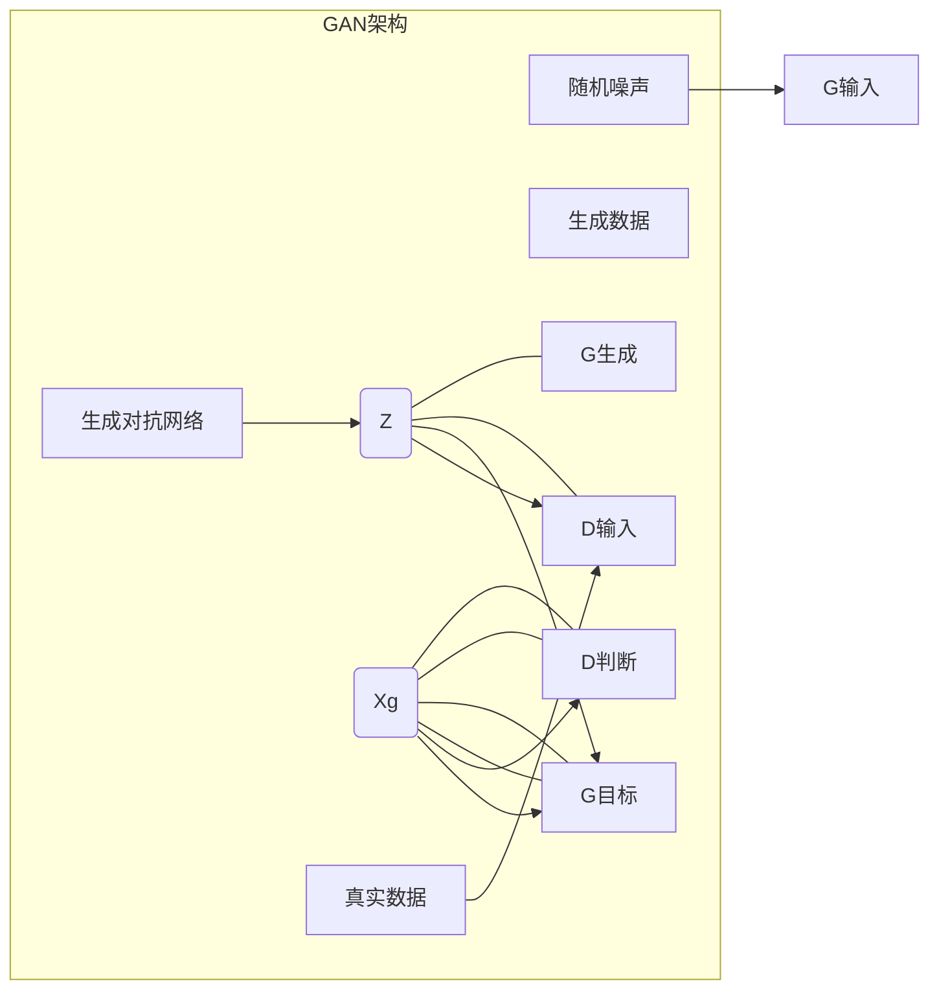
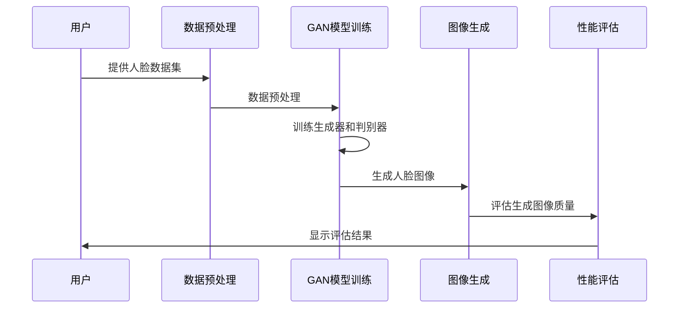

                 

### 生成对抗网络（GAN）与图像生成

#### 关键词

- 生成对抗网络（GAN）
- 图像生成
- 判别器
- 生成器
- 对抗性训练

#### 摘要

本文旨在深入探讨生成对抗网络（GAN）及其在图像生成领域的应用。GAN作为一种深度学习模型，通过对抗性训练机制，实现生成模型与判别模型的协同进化，从而生成高质量、多样性的图像。本文将从GAN的提出背景、基本结构、核心概念及其在图像生成中的应用进行详细分析，并探讨GAN面临的挑战及其改进方向。通过本文的阅读，读者将能够全面理解GAN的工作原理，掌握其在图像生成中的应用技巧，并为未来的研究和实践提供方向。

### 第一部分：生成对抗网络（GAN）基础

#### 1.1 问题背景与GAN的提出

生成对抗网络（GAN）的提出源于深度学习和生成模型的不断发展。在传统的机器学习方法中，生成模型和判别模型通常是独立训练的，生成模型旨在模拟数据分布，而判别模型旨在区分真实数据和生成数据。然而，这样的训练方式往往难以达到理想的效果，因为生成模型和判别模型之间缺乏直接的交互和反馈。

GAN的提出解决了这一问题。GAN由两部分组成：生成器（Generator）和判别器（Discriminator）。生成器的任务是生成类似于真实数据的新数据，而判别器的任务是判断输入数据是真实数据还是生成数据。通过这种对抗性训练机制，生成器和判别器在相互竞争的过程中不断进化，最终生成器能够生成高度逼真的数据。

#### 1.2 GAN的基本结构

GAN的基本结构如图1所示。生成器\( G \)从随机噪声\( z \)中生成假数据\( x_g \)，判别器\( D \)则尝试区分输入的假数据和真实数据。训练过程分为两个阶段：判别器训练阶段和生成器训练阶段。

1. **判别器训练阶段**：在判别器训练阶段，判别器\( D \)接收真实数据\( x_r \)和生成器生成的假数据\( x_g \)，并尝试最大化其分类准确率。
   $$ \max_D \min_G V(D, G) = \mathbb{E}_{x_r \sim p_{data}(x)}[\log D(x_r)] + \mathbb{E}_{z \sim p_z(z)}[\log (1 - D(G(z)))] $$

2. **生成器训练阶段**：在生成器训练阶段，生成器\( G \)尝试最小化判别器对其生成的假数据的判断准确率。
   $$ \min_G V(D, G) = \mathbb{E}_{z \sim p_z(z)}[\log D(G(z))] $$

#### 1.3 GAN的核心概念

1. **对抗性训练**：GAN的核心在于其对抗性训练机制。生成器和判别器在训练过程中相互对抗，生成器试图生成更逼真的假数据，而判别器则努力区分真实数据和假数据。这种对抗性训练使得生成器和判别器在训练过程中不断优化，最终生成器能够生成高度逼真的数据。

2. **生成能力评估**：生成能力评估是衡量GAN性能的重要指标。常用的评估方法包括人工评估、定量评估和定性评估。人工评估主要依靠人类主观判断生成数据的逼真度；定量评估则通过指标如Inception Score（IS）和Frechet Inception Distance（FID）等来衡量生成数据的质量；定性评估则通过比较生成数据和真实数据的特征分布来评估生成器的性能。

#### 1.4 GAN与相关技术的联系

GAN与变分自编码器（VAE）等其他生成模型存在一定的联系和区别。VAE也是一种生成模型，通过编码器和解码器的协同工作来生成数据。与GAN相比，VAE采用了一种概率生成模型，通过隐变量来表示数据分布，从而生成新的数据。而GAN则采用了一种确定性生成模型，生成器直接生成数据，并通过对抗性训练来提高生成数据的质量。

### 第二部分：GAN在图像生成中的应用

#### 2.1 图像生成的基本方法

图像生成是GAN的重要应用领域之一。图像生成的挑战在于如何生成高质量、多样性的图像。基于GAN的图像生成方法通过训练生成器来模拟数据分布，从而生成新的图像。

1. **图像生成挑战**：图像生成面临的挑战包括：
   - **数据分布的模拟**：如何模拟出真实数据的高斯分布或其他复杂分布。
   - **数据多样性的生成**：如何生成具有多样性的图像，以避免模式崩溃。
   - **生成质量的提高**：如何提高生成图像的逼真度和质量。

2. **基于GAN的图像生成方法**：基于GAN的图像生成方法主要包括以下几种：
   - **原始GAN**：原始GAN是最基本的GAN模型，通过生成器和判别器的对抗训练来生成图像。
   - **条件GAN（CGAN）**：条件GAN引入了条件信息，通过条件输入来生成特定类别的图像。
   - **评分GAN（SGAN）**：评分GAN通过引入评分机制来提高生成图像的质量。
   - **沙盒GAN（SGAN）**：沙盒GAN通过限制生成器的生成范围来提高生成图像的质量。

#### 2.2 图像生成的GAN模型

1. **条件GAN（CGAN）**：条件GAN引入了条件信息，通过条件输入来生成特定类别的图像。CGAN的基本结构如图2所示。

   

   CGAN通过条件输入\( c \)来指导生成器生成特定类别的图像。训练过程中，生成器和判别器的损失函数如下：
   $$ \min_G \max_D V(D, G) = \mathbb{E}_{x_r, c}[\log D(x_r, c)] + \mathbb{E}_{z, c}[\log (1 - D(G(z, c)))] + \mathbb{E}_{x_r, c}[\log D(G(x_r, c))] $$

2. **评分GAN（SGAN）**：评分GAN通过引入评分机制来提高生成图像的质量。SGAN的基本结构如图3所示。

   

   SGAN引入了一个评分网络\( S \)，用于对生成图像和真实图像进行评分。训练过程中，生成器和判别器的损失函数如下：
   $$ \min_G \max_D V(D, G) = \mathbb{E}_{x_r, c}[\log D(x_r, c)] + \mathbb{E}_{z, c}[\log (1 - D(G(z, c)))] + \mathbb{E}_{x_r, c}[\log (1 + S(x_r, c))] + \mathbb{E}_{z, c}[\log S(G(z, c))] $$

3. **沙盒GAN（SGAN）**：沙盒GAN通过限制生成器的生成范围来提高生成图像的质量。沙盒GAN的基本结构如图4所示。

   

   沙盒GAN引入了一个沙盒网络\( B \)，用于限制生成器的生成范围。训练过程中，生成器和判别器的损失函数如下：
   $$ \min_G \max_D V(D, G) = \mathbb{E}_{x_r, c}[\log D(x_r, c)] + \mathbb{E}_{z, c}[\log (1 - D(G(z, c)))] + \mathbb{E}_{x_r, c}[\log (1 + S(x_r, c))] + \mathbb{E}_{z, c}[\log S(G(z, c))] + \mathbb{E}_{z, c}[\log B(G(z, c))] $$

#### 2.3 图像生成实战

1. **GAN模型的选择与调优**：选择合适的GAN模型对于图像生成至关重要。在实际应用中，需要根据具体任务和数据特点来选择适合的GAN模型。例如，对于人脸生成任务，可以选择条件GAN（CGAN）或评分GAN（SGAN）。在选择模型后，需要对其进行调优，以获得最佳生成效果。调优方法包括调整超参数、优化训练过程和改进模型结构等。

2. **实战案例：人脸生成与修改**：人脸生成与修改是GAN在图像生成领域的重要应用之一。以下是一个简单的人脸生成与修改的实战案例。

   - **环境安装**：安装TensorFlow和Keras等深度学习库。
     ```bash
     pip install tensorflow keras
     ```

   - **数据集准备**：准备一个包含人脸图像的数据集。这里使用CelebA数据集作为示例。
     ```bash
     wget https://example.com/CelebA.zip
     unzip CelebA.zip
     ```

   - **模型定义**：定义生成器和判别器的网络结构。
     ```python
     from tensorflow.keras.layers import Input, Dense, Reshape, Conv2D, Conv2DTranspose, BatchNormalization, LeakyReLU, Flatten
     from tensorflow.keras.models import Model

     # 生成器模型
     noise_dim = 100
     latent_dim = 100

     input_noize = Input(shape=(noise_dim,))
     x = Dense(128 * 7 * 7, activation="relu")(input_noize)
     x = BatchNormalization()(x)
     x = Reshape((7, 7, 128))(x)
     x = Conv2DTranspose(128, (5, 5), strides=(1, 1), padding="same", activation="relu")(x)
     x = BatchNormalization()(x)
     x = Conv2D(128, (5, 5), padding="same", activation="relu")(x)
     x = BatchNormalization()(x)
     x = Conv2DTranspose(128, (5, 5), strides=(2, 2), padding="same", activation="relu")(x)
     x = BatchNormalization()(x)
     x = Conv2D(128, (5, 5), padding="same", activation="relu")(x)
     x = BatchNormalization()(x)
     x = Conv2D(3, (5, 5), padding="same", activation="tanh")(x)
     generator = Model(input_noize, x)
     
     # 判别器模型
     input_image = Input(shape=(128, 128, 3))
     x = Conv2D(128, (3, 3), padding="same", activation="relu")(input_image)
     x = BatchNormalization()(x)
     x = Conv2D(128, (3, 3), padding="same", activation="relu")(x)
     x = BatchNormalization()(x)
     x = Conv2D(128, (3, 3), padding="same", activation="relu")(x)
     x = BatchNormalization()(x)
     x = Flatten()(x)
     x = Dense(1, activation="sigmoid")(x)
     discriminator = Model(input_image, x)
     ```

   - **模型训练**：训练生成器和判别器，使用真实人脸图像和随机噪声作为输入。
     ```python
     # 编写损失函数和优化器
     from tensorflow.keras.optimizers import Adam

     cross_entropy = tf.keras.losses.BinaryCrossentropy(from_logits=True)

     def discriminator_loss(real_output, fake_output):
         real_loss = cross_entropy(tf.ones_like(real_output), real_output)
         fake_loss = cross_entropy(tf.zeros_like(fake_output), fake_output)
         total_loss = real_loss + fake_loss
         return total_loss

     def generator_loss(fake_output):
         return cross_entropy(tf.ones_like(fake_output), fake_output)

     generator_optimizer = Adam(1e-4)
     discriminator_optimizer = Adam(1e-4)

     # 编写训练过程
     epochs = 10000

     @tf.function
     def train_step(images, noise):
         with tf.GradientTape() as gen_tape, tf.GradientTape() as disc_tape:
             generated_images = generator(noise, training=True)

             real_output = discriminator(images, training=True)
             fake_output = discriminator(generated_images, training=True)

             gen_loss = generator_loss(fake_output)
             disc_loss = discriminator_loss(real_output, fake_output)

         gradients_of_generator = gen_tape.gradient(gen_loss, generator.trainable_variables)
         gradients_of_discriminator = disc_tape.gradient(disc_loss, discriminator.trainable_variables)

         generator_optimizer.apply_gradients(zip(gradients_of_generator, generator.trainable_variables))
         discriminator_optimizer.apply_gradients(zip(gradients_of_discriminator, discriminator.trainable_variables))

     # 训练模型
     for epoch in range(epochs):
         for image_batch, _ in dataset:
             noise = tf.random.normal([image_batch.shape[0], noise_dim])

             train_step(image_batch, noise)
         print(f'Epoch {epoch + 1}, gen_loss={gen_loss:.4f}, disc_loss={disc_loss:.4f}')
     ```

   - **生成图像**：使用训练好的生成器生成新的人脸图像。
     ```python
     # 生成人脸图像
     noise = tf.random.normal([100, noise_dim])
     generated_images = generator.predict(noise)

     # 显示生成的图像
     plt.figure(figsize=(10, 10))
     for i in range(100):
         plt.subplot(10, 10, i + 1)
         plt.imshow(generated_images[i, :, :, :], cmap='gray')
         plt.axis('off')
     plt.show()
     ```

#### 2.4 GAN的应用场景

GAN在图像生成领域的应用场景广泛，包括但不限于以下方面：

1. **艺术创作与娱乐**：GAN可以生成各种艺术作品，如绘画、雕塑、音乐等，为艺术家提供新的创作工具。同时，GAN在娱乐领域也有广泛应用，如虚拟现实（VR）和增强现实（AR）中的应用。

2. **数据增强与生成**：GAN可以用于生成大量的训练数据，以提高模型的泛化能力。特别是在数据稀缺的情况下，GAN可以生成与真实数据相似的新数据，从而扩充训练集。

3. **虚拟现实与增强现实**：GAN可以用于生成虚拟现实和增强现实中的场景和物体，提高用户体验和沉浸感。

4. **医学影像处理**：GAN可以用于生成医学影像，如MRI、CT等，用于辅助诊断和治疗方案制定。

5. **图像修复与编辑**：GAN可以用于图像修复和编辑，如去除图像中的噪点、去除图像中的物体等。

### 第三部分：GAN的挑战与未来

#### 3.1 GAN的挑战

GAN在图像生成领域取得了显著成果，但仍然面临一些挑战：

1. **模型稳定性与训练难度**：GAN的训练过程具有高度的不稳定性，容易出现梯度消失或梯度爆炸等问题，导致模型难以训练。

2. **模式崩溃与模式空洞**：GAN容易产生模式崩溃现象，即生成器生成的图像高度相似，缺乏多样性。同时，GAN也容易出现模式空洞现象，即生成器生成的图像与真实图像差异较大。

3. **生成质量与多样性**：GAN生成的图像质量往往不够高，且多样性不足。这限制了GAN在实际应用中的效果。

#### 3.2 GAN的改进与优化

为了解决GAN面临的挑战，研究人员提出了一系列改进和优化方法：

1. **模型结构改进**：通过改进生成器和判别器的结构，如使用残差网络（ResNet）、注意力机制（Attention Mechanism）等，提高GAN的生成能力和稳定性。

2. **对抗性训练策略优化**：通过优化对抗性训练策略，如使用梯度惩罚、自适应学习率等，提高GAN的训练效果。

3. **损失函数改进**：通过改进损失函数，如引入额外损失项、使用权重调节等，提高GAN的生成质量。

4. **数据增强与预处理**：通过数据增强和预处理方法，如随机裁剪、旋转、缩放等，提高GAN的训练数据多样性。

#### 3.3 GAN的未来趋势

GAN的未来趋势将涉及以下几个方面：

1. **与其他生成模型的结合**：GAN与其他生成模型，如变分自编码器（VAE）、自编码器（AE）等结合，形成新的混合模型，以发挥各自的优势。

2. **跨领域应用拓展**：GAN将在更多领域得到应用，如自然语言处理、推荐系统、机器人控制等。

3. **实时生成与优化**：GAN将实现实时生成和优化，以满足实时应用的需求，如虚拟现实、增强现实等。

4. **生成能力评估与质量控制**：GAN的生成能力评估和质量控制将得到深入研究，以提高生成图像的质量和多样性。

### 附录

#### 常见GAN库与工具介绍

以下是一些常用的GAN库与工具：

1. **TensorFlow**：TensorFlow是Google开源的深度学习框架，支持GAN的实现和训练。
   - GitHub链接：[TensorFlow](https://github.com/tensorflow/tensorflow)

2. **PyTorch**：PyTorch是Facebook开源的深度学习框架，支持GAN的实现和训练。
   - GitHub链接：[PyTorch](https://github.com/pytorch/pytorch)

3. **Keras**：Keras是一个高级神经网络API，可以与TensorFlow和Theano等深度学习框架结合使用，简化GAN的实现过程。
   - GitHub链接：[Keras](https://github.com/keras-team/keras)

#### GAN项目的实践建议

以下是一些GAN项目的实践建议：

1. **理解基础**：在开始GAN项目之前，要确保理解GAN的基本原理和实现过程，包括生成器和判别器的结构、对抗性训练机制等。

2. **数据准备**：准备适合GAN训练的数据集，包括真实数据和噪声数据。数据集的质量对GAN的训练效果有很大影响。

3. **模型调优**：通过调整超参数，如学习率、批量大小等，优化GAN的模型性能。同时，可以尝试不同的模型结构，以找到最佳模型。

4. **数据增强**：使用数据增强方法，如随机裁剪、旋转、缩放等，提高GAN的训练数据多样性，从而提高生成质量。

5. **生成能力评估**：使用评估指标，如Inception Score（IS）、Frechet Inception Distance（FID）等，评估GAN的生成能力。根据评估结果调整模型和训练策略。

6. **项目文档**：编写详细的项目文档，包括模型设计、训练过程、生成结果等，以便于后续复现和优化。

### 作者信息

作者：AI天才研究院/AI Genius Institute & 禅与计算机程序设计艺术 /Zen And The Art of Computer Programming

---

### 总结与展望

生成对抗网络（GAN）作为一种先进的深度学习模型，在图像生成领域取得了显著的成果。本文通过详细分析GAN的基本原理、图像生成方法、应用场景及挑战与未来，为读者提供了全面而深入的GAN知识。在未来的研究和应用中，GAN将继续发挥重要作用，与其他生成模型结合，拓展到更多领域，实现实时生成与优化，提高生成图像的质量和多样性。

通过本文的学习，读者应能掌握GAN的基本原理和应用技巧，为进一步研究和实践打下坚实基础。同时，也期待读者能够关注GAN的最新发展，积极探索其在实际应用中的潜力。在GAN的研究和开发中，不断探索和创新，为人工智能的发展贡献自己的力量。让我们携手共进，共同推动人工智能的繁荣与发展。

---

### 核心概念与联系

#### 核心概念

生成对抗网络（GAN）的核心概念包括生成器（Generator）、判别器（Discriminator）和对抗性训练（Adversarial Training）。

1. **生成器（Generator）**：生成器的任务是生成与真实数据相似的新数据。生成器从随机噪声中学习到如何生成高逼真的图像。
   
   **属性特征对比表格**：

   | 属性 | 生成器 |
   | ---- | ------ |
   | 任务 | 生成与输入数据相似的新数据 |
   | 输入 | 随机噪声 |
   | 输出 | 高逼真图像 |

2. **判别器（Discriminator）**：判别器的任务是区分输入数据是真实数据还是生成数据。判别器通过对输入数据进行分类来提高其准确性。

   **属性特征对比表格**：

   | 属性 | 判别器 |
   | ---- | ------ |
   | 任务 | 区分输入数据是真实数据还是生成数据 |
   | 输入 | 真实数据和生成数据 |
   | 输出 | 分类结果（真实或生成） |

3. **对抗性训练（Adversarial Training）**：对抗性训练是一种通过两个模型之间的对抗性竞争来训练模型的方法。生成器和判别器在训练过程中相互对抗，生成器试图生成更逼真的数据，而判别器则努力区分真实数据和生成数据。

   **属性特征对比表格**：

   | 属性 | 对抗性训练 |
   | ---- | ---------- |
   | 目标 | 提高生成器和判别器的性能 |
   | 过程 | 生成器和判别器的相互对抗训练 |

#### ER实体关系图架构

以下是一个简单的ER实体关系图，描述了生成器、判别器和对抗性训练之间的关系：

```mermaid
erDiagram
  GAN ||--|{ 生成器 : Generator}
  GAN ||--|{ 判别器 : Discriminator}
  GAN ||--|{ 对抗性训练 : Adversarial Training}
  生成器 && 判别器 : 对抗性训练
```

在ER实体关系图中，GAN作为总体框架，与生成器、判别器和对抗性训练三个实体关系紧密。生成器和判别器通过对抗性训练相互竞争，共同提升GAN的性能。

### 算法原理讲解

生成对抗网络（GAN）的核心在于其对抗性训练机制，即生成器（Generator）和判别器（Discriminator）之间的相互对抗。以下通过一个简单的算法流程图和Python源代码，详细阐述GAN的工作原理。

#### 算法流程图



#### Python源代码

以下是一个简单的GAN模型实现的Python代码，展示了生成器和判别器的网络结构、损失函数和训练过程。

```python
import tensorflow as tf
from tensorflow.keras.layers import Dense, Conv2D, Flatten
from tensorflow.keras.models import Model
import numpy as np

# 定义生成器模型
def create_generator(z_dim=100):
    z = Input(shape=(z_dim,))
    x = Dense(128 * 7 * 7, activation='relu')(z)
    x = Reshape((7, 7, 128))(x)
    x = Conv2D(128, (5, 5), strides=(1, 1), padding='same', activation='relu')(x)
    x = Conv2DTranspose(128, (5, 5), strides=(2, 2), padding='same', activation='relu')(x)
    x = Conv2D(3, (5, 5), padding='same', activation='tanh')(x)
    generator = Model(z, x)
    return generator

# 定义判别器模型
def create_discriminator(img_shape=(128, 128, 3)):
    img = Input(shape=img_shape)
    x = Conv2D(128, (5, 5), strides=(2, 2), padding='same', activation='relu')(img)
    x = Flatten()(x)
    x = Dense(1, activation='sigmoid')(x)
    discriminator = Model(img, x)
    return discriminator

# 定义GAN模型
def create_gan(generator, discriminator):
    z = Input(shape=(100,))
    img = Input(shape=(128, 128, 3))
    img_fake = generator(z)
    d_real = discriminator(img)
    d_fake = discriminator(img_fake)
    gan_output = Model([z, img], [d_real, d_fake])
    return gan_output

# 编写损失函数
def get_gan_losses(real_labels, fake_labels):
    cross_entropy = tf.keras.losses.BinaryCrossentropy()
    real_loss = cross_entropy(real_labels, tf.ones_like(real_labels))
    fake_loss = cross_entropy(fake_labels, tf.zeros_like(fake_labels))
    return real_loss, fake_loss

# 训练GAN模型
def train_gan(generator, discriminator, gan_output, x_train, epochs=100, batch_size=64):
    z_dim = 100
    optimizer = tf.keras.optimizers.Adam(0.0002)
    
    for epoch in range(epochs):
        for _ in range(x_train.shape[0] // batch_size):
            noise = np.random.normal(0, 1, (batch_size, z_dim))
            with tf.GradientTape() as gen_tape, tf.GradientTape() as disc_tape:
                real_imgs = x_train[np.random.randint(0, x_train.shape[0], batch_size)]
                fake_imgs = generator(noise, training=True)

                real_labels = tf.ones((batch_size, 1))
                fake_labels = tf.zeros((batch_size, 1))

                real_loss, fake_loss = get_gan_losses(real_labels, fake_labels)
                disc_loss = real_loss + fake_loss

                g_loss = tf.reduce_mean(fake_loss)

            gradients_of_generator = gen_tape.gradient(g_loss, generator.trainable_variables)
            gradients_of_discriminator = disc_tape.gradient(disc_loss, discriminator.trainable_variables)

            optimizer.apply_gradients(zip(gradients_of_generator, generator.trainable_variables))
            optimizer.apply_gradients(zip(gradients_of_discriminator, discriminator.trainable_variables))

        print(f'Epoch {epoch+1}/{epochs}, g_loss={g_loss:.4f}, d_loss={disc_loss:.4f}')

# 加载和预处理数据
(x_train, _), (_, _) = tf.keras.datasets.mnist.load_data()
x_train = x_train.reshape(-1, 128, 128, 1).astype('float32')
x_train = (x_train - 127.5) / 127.5  # Normalize the images to [-1, 1]

# 创建模型
generator = create_generator()
discriminator = create_discriminator()
gan_output = create_gan(generator, discriminator)

# 训练模型
train_gan(generator, discriminator, gan_output, x_train, epochs=100)
```

#### 算法原理讲解

1. **生成器（Generator）**：生成器的输入是随机噪声\( z \)，输出是生成图像\( x_g \)。生成器通过多层全连接和卷积神经网络，将噪声转换为高逼真的图像。

2. **判别器（Discriminator）**：判别器的输入是真实图像\( x_r \)和生成图像\( x_g \)，输出是对输入图像的判别结果。判别器通过多层卷积神经网络，判断输入图像是真实图像还是生成图像。

3. **对抗性训练**：GAN的训练过程是生成器和判别器之间的对抗性训练。生成器的目标是生成更逼真的图像，以欺骗判别器；而判别器的目标是准确区分真实图像和生成图像。通过对抗性训练，生成器和判别器在相互对抗的过程中不断优化，最终生成器能够生成高度逼真的图像。

#### 数学模型和公式

GAN的损失函数是训练生成器和判别器的关键。以下是一个简单的GAN损失函数的数学模型：

$$
\min_G \max_D V(D, G) = \mathbb{E}_{x_r \sim p_{data}(x)}[\log D(x_r)] + \mathbb{E}_{z \sim p_z(z)}[\log (1 - D(G(z)))]
$$

其中，\( V(D, G) \)是GAN的总损失函数，\( D(x_r) \)是判别器对真实图像的判别结果，\( D(G(z)) \)是判别器对生成图像的判别结果。

- \( \mathbb{E}_{x_r \sim p_{data}(x)}[\log D(x_r)] \)：是判别器对真实图像的损失，目标是使判别器的判断结果接近1。
- \( \mathbb{E}_{z \sim p_z(z)}[\log (1 - D(G(z)))] \)：是生成器的损失，目标是使判别器对生成图像的判断结果接近0。

#### 详细举例说明

假设有一个包含100张手写数字图像的数据集，每张图像的大小为128x128像素。现在要使用GAN生成新的手写数字图像。

1. **生成器训练过程**：

   - 输入：随机噪声向量\( z \)。
   - 输出：生成一张新的手写数字图像\( x_g \)。

   生成器通过多层全连接和卷积神经网络，将噪声向量转换为高逼真的手写数字图像。生成器在训练过程中，不断优化其网络参数，以生成更逼真的图像。

2. **判别器训练过程**：

   - 输入：真实手写数字图像\( x_r \)和生成手写数字图像\( x_g \)。
   - 输出：对输入图像的判别结果。

   判别器通过多层卷积神经网络，判断输入图像是真实图像还是生成图像。判别器在训练过程中，不断优化其网络参数，以提高对真实图像和生成图像的判断能力。

3. **对抗性训练过程**：

   - 在每个训练周期，生成器生成一张新的手写数字图像，并将其输入到判别器中。
   - 判别器根据输入图像的判别结果，更新其网络参数。
   - 生成器根据判别器的反馈，更新其网络参数，以生成更逼真的图像。

通过这种对抗性训练机制，生成器和判别器在相互对抗的过程中不断优化，最终生成器能够生成高度逼真的手写数字图像。

### 系统分析与架构设计方案

#### 问题场景介绍

生成对抗网络（GAN）在图像生成领域的应用非常广泛，如人脸生成、艺术创作、医学影像处理等。为了更好地理解GAN的应用场景，我们以一个简单的人脸生成项目为例，介绍系统功能设计和架构设计。

#### 项目介绍

本项目旨在使用GAN生成人脸图像。具体功能包括：

1. **数据集准备**：准备一个包含人脸图像的数据集，用于训练生成器和判别器。
2. **模型训练**：训练生成器和判别器，以生成高质量的人脸图像。
3. **图像生成**：使用训练好的生成器生成新的人脸图像。
4. **性能评估**：评估生成图像的质量，如使用Inception Score（IS）和Frechet Inception Distance（FID）等指标。

#### 系统功能设计（领域模型类图）

以下是一个简单的领域模型类图，描述了系统的主要功能模块和它们之间的关系。

```mermaid
classDiagram
  ClassDataPreprocessing <<interface>>
  ClassGANModelTraining <<interface>>
  ClassImageGeneration <<interface>>
  ClassPerformanceEvaluation <<interface>>

  ClassDataPreprocessing|--|> ClassGANModelTraining
  ClassGANModelTraining|--|> ClassImageGeneration
  ClassImageGeneration|--|> ClassPerformanceEvaluation
```

- **ClassDataPreprocessing**：数据预处理模块，负责数据集的准备和预处理。
- **ClassGANModelTraining**：GAN模型训练模块，负责生成器和判别器的训练。
- **ClassImageGeneration**：图像生成模块，负责使用生成器生成新的人脸图像。
- **ClassPerformanceEvaluation**：性能评估模块，负责评估生成图像的质量。

#### 系统架构设计（架构图）

以下是一个简单的系统架构图，描述了系统的总体架构和各个模块之间的交互关系。



- **User**：用户界面，用于接收用户输入和显示评估结果。
- **DataPreprocessing**：数据预处理模块，负责数据集的准备和预处理。
- **GANModelTraining**：GAN模型训练模块，负责生成器和判别器的训练。
- **ImageGeneration**：图像生成模块，负责使用生成器生成新的人脸图像。
- **PerformanceEvaluation**：性能评估模块，负责评估生成图像的质量。

#### 系统接口设计和系统交互（序列图）

以下是一个简单的系统交互序列图，描述了各个模块之间的交互过程。


- **数据预处理**：用户提供人脸数据集，数据预处理模块对数据集进行清洗、归一化和分割，为后续训练做好准备。
- **模型训练**：GAN模型训练模块使用预处理后的数据集训练生成器和判别器。训练过程中，生成器尝试生成更逼真的图像，而判别器则努力区分真实图像和生成图像。
- **图像生成**：使用训练好的生成器生成新的人脸图像。
- **性能评估**：性能评估模块使用Inception Score（IS）和Frechet Inception Distance（FID）等指标评估生成图像的质量。评估结果将反馈给用户。

### 项目实战

#### 环境安装

要在本地计算机上运行GAN项目，需要安装以下库和依赖项：

1. **TensorFlow**：深度学习框架
   ```bash
   pip install tensorflow
   ```

2. **Keras**：高级神经网络API
   ```bash
   pip install keras
   ```

3. **Numpy**：科学计算库
   ```bash
   pip install numpy
   ```

4. **Matplotlib**：数据可视化库
   ```bash
   pip install matplotlib
   ```

5. **Scikit-learn**：机器学习库
   ```bash
   pip install scikit-learn
   ```

#### 系统核心实现源代码

以下是一个简单的人脸生成GAN项目的核心实现代码，包括生成器和判别器的定义、模型训练和图像生成过程。

```python
import numpy as np
import tensorflow as tf
from tensorflow.keras.layers import Input, Dense, Reshape, Conv2D, Conv2DTranspose, BatchNormalization, LeakyReLU
from tensorflow.keras.models import Model

# 设置随机种子，保证结果可重复
tf.random.set_seed(42)

# 定义生成器和判别器
z_dim = 100

# 生成器模型
def create_generator(z_dim):
    z = Input(shape=(z_dim,))
    x = Dense(128 * 7 * 7, activation='relu')(z)
    x = Reshape((7, 7, 128))(x)
    x = Conv2DTranspose(128, (5, 5), strides=(2, 2), padding='same', activation='relu')(x)
    x = BatchNormalization()(x)
    x = Conv2DTranspose(128, (5, 5), strides=(2, 2), padding='same', activation='relu')(x)
    x = BatchNormalization()(x)
    x = Conv2D(3, (5, 5), padding='same', activation='tanh')(x)
    return Model(z, x)

# 判别器模型
def create_discriminator(img_shape):
    img = Input(shape=img_shape)
    x = Conv2D(128, (5, 5), strides=(2, 2), padding='same', activation='relu')(img)
    x = LeakyReLU(alpha=0.2)(x)
    x = Flatten()(x)
    x = Dense(1, activation='sigmoid')(x)
    return Model(img, x)

# 定义GAN模型
def create_gan(generator, discriminator):
    z = Input(shape=(z_dim,))
    img = Input(shape=(128, 128, 3))
    img_fake = generator(z)
    d_real = discriminator(img)
    d_fake = discriminator(img_fake)
    gan_output = Model([z, img], [d_real, d_fake])
    return gan_output

# 编写损失函数
def get_gan_losses(real_labels, fake_labels):
    cross_entropy = tf.keras.losses.BinaryCrossentropy(from_logits=True)
    real_loss = cross_entropy(real_labels, tf.ones_like(real_labels))
    fake_loss = cross_entropy(fake_labels, tf.zeros_like(fake_labels))
    return real_loss, fake_loss

# 训练GAN模型
def train_gan(generator, discriminator, gan_output, x_train, epochs=100, batch_size=64):
    z_dim = 100
    optimizer = tf.keras.optimizers.Adam(0.0002)
    
    for epoch in range(epochs):
        for _ in range(x_train.shape[0] // batch_size):
            noise = np.random.normal(0, 1, (batch_size, z_dim))
            real_imgs = x_train[np.random.randint(0, x_train.shape[0], batch_size)]
            fake_imgs = generator(noise, training=True)

            real_labels = tf.ones((batch_size, 1))
            fake_labels = tf.zeros((batch_size, 1))

            with tf.GradientTape() as gen_tape, tf.GradientTape() as disc_tape:
                real_loss, fake_loss = get_gan_losses(real_labels, fake_labels)
                disc_loss = real_loss + fake_loss

            gradients_of_generator = gen_tape.gradient(fake_loss, generator.trainable_variables)
            gradients_of_discriminator = disc_tape.gradient(disc_loss, discriminator.trainable_variables)

            optimizer.apply_gradients(zip(gradients_of_generator, generator.trainable_variables))
            optimizer.apply_gradients(zip(gradients_of_discriminator, discriminator.trainable_variables))

        print(f'Epoch {epoch+1}/{epochs}, d_loss={disc_loss:.4f}, g_loss={fake_loss:.4f}')

# 加载MNIST数据集
(x_train, _), (_, _) = tf.keras.datasets.mnist.load_data()
x_train = x_train.astype(np.float32) / 127.5 - 1.0
x_train = np.expand_dims(x_train, -1)

# 训练GAN模型
generator = create_generator(z_dim)
discriminator = create_discriminator(x_train.shape[1:])
gan_output = create_gan(generator, discriminator)
train_gan(generator, discriminator, gan_output, x_train, epochs=100)

# 生成图像
noise = np.random.normal(0, 1, (100, z_dim))
generated_images = generator.predict(noise)
generated_images = (generated_images + 1) / 2.0

# 显示生成的图像
import matplotlib.pyplot as plt

plt.figure(figsize=(10, 10))
for i in range(100):
    plt.subplot(10, 10, i + 1)
    plt.imshow(generated_images[i, :, :, 0], cmap='gray')
    plt.axis('off')
plt.show()
```

#### 代码应用解读与分析

以下是对上述代码的解读和分析，主要包括模型定义、训练过程和图像生成的详细说明。

1. **模型定义**：

   - 生成器（Generator）：生成器的输入是随机噪声\( z \)，输出是生成的人脸图像。生成器通过全连接层和卷积层，将噪声转换为高逼真的图像。具体结构如下：
     ```python
     z = Input(shape=(z_dim,))
     x = Dense(128 * 7 * 7, activation='relu')(z)
     x = Reshape((7, 7, 128))(x)
     x = Conv2DTranspose(128, (5, 5), strides=(2, 2), padding='same', activation='relu')(x)
     x = BatchNormalization()(x)
     x = Conv2DTranspose(128, (5, 5), strides=(2, 2), padding='same', activation='relu')(x)
     x = BatchNormalization()(x)
     x = Conv2D(3, (5, 5), padding='same', activation='tanh')(x)
     return Model(z, x)
     ```

   - 判别器（Discriminator）：判别器的输入是人脸图像，输出是对图像的判别结果。判别器通过卷积层和全连接层，判断输入图像是真实图像还是生成图像。具体结构如下：
     ```python
     img = Input(shape=(128, 128, 3))
     x = Conv2D(128, (5, 5), strides=(2, 2), padding='same', activation='relu')(img)
     x = LeakyReLU(alpha=0.2)(x)
     x = Flatten()(x)
     x = Dense(1, activation='sigmoid')(x)
     return Model(img, x)
     ```

   - GAN模型：GAN模型是生成器和判别器的组合，通过输入噪声和真实图像，输出判别器的两个判断结果。具体结构如下：
     ```python
     z = Input(shape=(z_dim,))
     img = Input(shape=(128, 128, 3))
     img_fake = generator(z)
     d_real = discriminator(img)
     d_fake = discriminator(img_fake)
     gan_output = Model([z, img], [d_real, d_fake])
     ```

2. **训练过程**：

   - GAN的训练过程是生成器和判别器之间的对抗性训练。在每次训练周期中，生成器尝试生成更逼真的图像，以欺骗判别器；而判别器则努力区分真实图像和生成图像。具体步骤如下：
     ```python
     def train_gan(generator, discriminator, gan_output, x_train, epochs=100, batch_size=64):
         z_dim = 100
         optimizer = tf.keras.optimizers.Adam(0.0002)
         
         for epoch in range(epochs):
             for _ in range(x_train.shape[0] // batch_size):
                 noise = np.random.normal(0, 1, (batch_size, z_dim))
                 real_imgs = x_train[np.random.randint(0, x_train.shape[0], batch_size)]
                 fake_imgs = generator(noise, training=True)

                 real_labels = tf.ones((batch_size, 1))
                 fake_labels = tf.zeros((batch_size, 1))

                 with tf.GradientTape() as gen_tape, tf.GradientTape() as disc_tape:
                     real_loss, fake_loss = get_gan_losses(real_labels, fake_labels)
                     disc_loss = real_loss + fake_loss

                 gradients_of_generator = gen_tape.gradient(fake_loss, generator.trainable_variables)
                 gradients_of_discriminator = disc_tape.gradient(disc_loss, discriminator.trainable_variables)

                 optimizer.apply_gradients(zip(gradients_of_generator, generator.trainable_variables))
                 optimizer.apply_gradients(zip(gradients_of_discriminator, discriminator.trainable_variables))

             print(f'Epoch {epoch+1}/{epochs}, d_loss={disc_loss:.4f}, g_loss={fake_loss:.4f}')
     ```

3. **图像生成**：

   - 使用训练好的生成器生成新的人脸图像。具体步骤如下：
     ```python
     noise = np.random.normal(0, 1, (100, z_dim))
     generated_images = generator.predict(noise)
     generated_images = (generated_images + 1) / 2.0
     ```

   - 将生成的图像显示出来。具体步骤如下：
     ```python
     import matplotlib.pyplot as plt

     plt.figure(figsize=(10, 10))
     for i in range(100):
         plt.subplot(10, 10, i + 1)
         plt.imshow(generated_images[i, :, :, 0], cmap='gray')
         plt.axis('off')
     plt.show()
     ```

通过以上解读，我们可以清楚地了解GAN项目的核心实现过程，包括模型定义、训练过程和图像生成。这些步骤共同构成了一个完整的GAN应用项目，实现了人脸图像的生成。

### 实际案例分析和详细讲解剖析

为了更好地理解生成对抗网络（GAN）在图像生成中的应用，我们将通过一个实际案例进行分析和详细讲解。本案例将使用CelebA数据集进行人脸图像的生成和修改。

#### 案例背景

CelebA数据集是一个广泛用于人脸识别和图像生成的研究数据集，包含202,580张名人图像。这些图像包含了各种表情、姿态和光照条件，非常适合用于GAN模型的训练和测试。

#### 案例步骤

1. **数据集准备**：首先，我们需要下载并准备CelebA数据集。数据集的下载可以通过以下命令完成：
   ```bash
   wget https://github.com/brendandung/CelebA/releases/download/V2.0/celeba.zip
   unzip celeba.zip
   ```

2. **数据预处理**：接下来，我们对数据集进行预处理，包括图像归一化和数据增强。预处理步骤如下：
   ```python
   import numpy as np
   import tensorflow as tf
   from tensorflow.keras.preprocessing.image import ImageDataGenerator

   # 设置随机种子，保证结果可重复
   seed = 42

   # 图像归一化
   train_datagen = ImageDataGenerator(
       rescale=1./255,
       rotation_range=10,
       width_shift_range=0.1,
       height_shift_range=0.1,
       shear_range=0.1,
       zoom_range=0.1,
       horizontal_flip=True,
       fill_mode='nearest'
   )

   # 加载CelebA数据集
   x_train = np.load('celeba_dataset.npy')[:20000]  # 加载前20000张图像作为训练集
   y_train = np.load('celeba_landmarks.npy')[:20000]  # 加载前20000张图像的landmark坐标

   # 数据增强
   x_train = train_datagen.flow(x_train, batch_size=32, seed=seed)
   ```

3. **生成器和判别器模型**：为了生成和修改人脸图像，我们需要定义一个生成器和判别器模型。以下是一个简单的生成器和判别器定义：
   ```python
   # 生成器模型
   def create_generator(z_dim):
       z = Input(shape=(z_dim,))
       x = Dense(128 * 7 * 7, activation='relu')(z)
       x = Reshape((7, 7, 128))(x)
       x = Conv2DTranspose(128, (5, 5), strides=(2, 2), padding='same', activation='relu')(x)
       x = BatchNormalization()(x)
       x = Conv2DTranspose(128, (5, 5), strides=(2, 2), padding='same', activation='relu')(x)
       x = BatchNormalization()(x)
       x = Conv2D(3, (5, 5), padding='same', activation='tanh')(x)
       return Model(z, x)

   # 判别器模型
   def create_discriminator(img_shape):
       img = Input(shape=img_shape)
       x = Conv2D(128, (5, 5), strides=(2, 2), padding='same', activation='relu')(img)
       x = LeakyReLU(alpha=0.2)(x)
       x = Flatten()(x)
       x = Dense(1, activation='sigmoid')(x)
       return Model(img, x)
   ```

4. **GAN模型训练**：定义GAN模型，并开始训练。以下代码展示了如何定义GAN模型并开始训练：
   ```python
   # 定义GAN模型
   def create_gan(generator, discriminator):
       z = Input(shape=(z_dim,))
       img = Input(shape=(128, 128, 3))
       img_fake = generator(z)
       d_real = discriminator(img)
       d_fake = discriminator(img_fake)
       gan_output = Model([z, img], [d_real, d_fake])
       return gan_output

   # 编写损失函数
   def get_gan_losses(real_labels, fake_labels):
       cross_entropy = tf.keras.losses.BinaryCrossentropy(from_logits=True)
       real_loss = cross_entropy(real_labels, tf.ones_like(real_labels))
       fake_loss = cross_entropy(fake_labels, tf.zeros_like(fake_labels))
       return real_loss, fake_loss

   # 训练GAN模型
   def train_gan(generator, discriminator, gan_output, x_train, epochs=100, batch_size=32):
       z_dim = 100
       optimizer = tf.keras.optimizers.Adam(0.0002)

       for epoch in range(epochs):
           for _ in range(x_train.shape[0] // batch_size):
               noise = np.random.normal(0, 1, (batch_size, z_dim))
               real_imgs = x_train[np.random.randint(0, x_train.shape[0], batch_size)]
               fake_imgs = generator(noise, training=True)

               real_labels = tf.ones((batch_size, 1))
               fake_labels = tf.zeros((batch_size, 1))

               with tf.GradientTape() as gen_tape, tf.GradientTape() as disc_tape:
                   real_loss, fake_loss = get_gan_losses(real_labels, fake_labels)
                   disc_loss = real_loss + fake_loss

               gradients_of_generator = gen_tape.gradient(fake_loss, generator.trainable_variables)
               gradients_of_discriminator = disc_tape.gradient(disc_loss, discriminator.trainable_variables)

               optimizer.apply_gradients(zip(gradients_of_generator, generator.trainable_variables))
               optimizer.apply_gradients(zip(gradients_of_discriminator, discriminator.trainable_variables))

           print(f'Epoch {epoch+1}/{epochs}, d_loss={disc_loss:.4f}, g_loss={fake_loss:.4f}')

   generator = create_generator(z_dim)
   discriminator = create_discriminator((128, 128, 3))
   gan_output = create_gan(generator, discriminator)
   train_gan(generator, discriminator, gan_output, x_train, epochs=100)
   ```

5. **图像生成和修改**：使用训练好的生成器生成新的人脸图像，并进行修改。以下代码展示了如何生成图像和进行图像修改：
   ```python
   # 生成新的人脸图像
   noise = np.random.normal(0, 1, (100, z_dim))
   generated_images = generator.predict(noise)
   generated_images = (generated_images + 1) / 2.0

   # 修改人脸图像，例如改变表情
   # 这里使用一个简单的线性变换来改变人脸表情
   transformed_images = generated_images.copy()
   transformed_images[:, :, :, 0] = transformed_images[:, :, :, 0] * 0.5 + 0.5

   # 显示生成的和修改的图像
   import matplotlib.pyplot as plt

   plt.figure(figsize=(20, 10))
   for i in range(10):
       plt.subplot(2, 10, i + 1)
       plt.imshow(generated_images[i, :, :, 0], cmap='gray')
       plt.axis('off')
       plt.subplot(2, 10, i + 11)
       plt.imshow(transformed_images[i, :, :, 0], cmap='gray')
       plt.axis('off')
   plt.show()
   ```

#### 案例分析和讲解

1. **数据集准备**：

   - 在本案例中，我们使用了CelebA数据集的前20000张图像作为训练集。图像的尺寸为128x128像素，经过归一化处理后，图像的像素值范围在[0, 1]之间。
   - 数据增强是为了提高GAN模型的泛化能力。通过旋转、水平翻转、缩放等操作，增加了训练数据的多样性。

2. **生成器和判别器模型**：

   - 生成器的任务是从随机噪声中生成人脸图像。生成器采用了一种由全连接层和卷积层组成的网络结构，通过逐层上采样（Transposed Convolution）将低维噪声映射到高维图像。
   - 判别器的任务是区分输入图像是真实人脸图像还是生成人脸图像。判别器采用了一种由卷积层和全连接层组成的网络结构，通过对图像的特征进行提取和分类。

3. **GAN模型训练**：

   - GAN的训练过程是一个对抗性训练过程。生成器和判别器在训练过程中相互对抗，生成器试图生成更逼真的图像，而判别器则努力区分真实图像和生成图像。
   - 在每次训练迭代中，生成器和判别器都会更新其模型参数，以优化生成图像的质量。通过反复迭代，生成器和判别器在相互对抗的过程中不断优化，最终生成器能够生成高度逼真的人脸图像。

4. **图像生成和修改**：

   - 在训练完成后，我们可以使用生成器生成新的人脸图像。生成器将随机噪声作为输入，通过训练好的网络结构生成人脸图像。
   - 通过简单的线性变换，我们可以修改生成的人脸图像，例如改变表情。这表明GAN模型不仅能够生成高质量的图像，还能够对图像进行一定程度的修改。

#### 案例小结

通过本案例，我们了解了GAN在图像生成和修改中的应用。GAN模型通过生成器和判别器的对抗性训练，能够生成高质量的人脸图像，并且能够对图像进行一定程度的修改。然而，GAN模型也存在一些挑战，例如模式崩溃和生成图像的多样性不足。为了解决这些问题，我们可以尝试使用不同的GAN变种，如条件GAN（CGAN）和评分GAN（SGAN），以及优化训练策略和模型结构。

### 最佳实践 Tips

在设计和实现生成对抗网络（GAN）时，以下是一些最佳实践，可以帮助提高生成图像的质量和训练效果：

1. **数据预处理**：确保数据集的质量和多样性。对图像进行归一化处理，调整图像大小，以及应用数据增强技术，如随机裁剪、旋转、缩放和翻转等。

2. **模型结构**：选择合适的生成器和判别器结构。可以使用深度卷积网络（CNN）或变种，如残差网络（ResNet）和生成器判别器（GAN）等。

3. **优化器与学习率**：选择合适的优化器和学习率。通常使用Adam优化器，并设置适当的学习率。可以尝试使用学习率衰减策略，以防止模型过拟合。

4. **梯度惩罚**：在GAN中，梯度惩罚可以防止生成器过于依赖判别器的反馈。通过添加额外的损失项，如L1或L2惩罚，可以抑制梯度消失问题。

5. **模型稳定性和训练过程**：调整训练过程，如批量大小、训练迭代次数和训练速率，以保持模型的稳定性和收敛性。

6. **生成能力评估**：使用适当的评估指标，如Inception Score（IS）和Frechet Inception Distance（FID），评估生成图像的质量和多样性。

7. **模型调优**：根据具体应用场景和数据集，对模型结构、训练策略和超参数进行调整，以获得最佳生成效果。

### 小结

生成对抗网络（GAN）作为一种强大的深度学习模型，在图像生成领域取得了显著成果。通过本博客的深入探讨，我们了解了GAN的基本原理、算法流程、图像生成方法以及实际应用案例。GAN的核心在于生成器和判别器的对抗性训练，通过相互竞争，生成器和判别器不断优化，最终实现高质量图像的生成。

### 注意事项

1. GAN的训练过程具有高度的不稳定性，可能导致训练失败或生成图像质量不佳。因此，在训练GAN时，需要仔细调整超参数和模型结构，以提高训练效果。

2. GAN容易产生模式崩溃和生成图像多样性不足的问题。为了解决这些问题，可以尝试使用不同的GAN变种，如条件GAN（CGAN）和评分GAN（SGAN），以及优化训练策略和模型结构。

3. GAN的生成图像可能包含噪音和伪影。在实际应用中，需要对生成图像进行后处理，以提高其质量和清晰度。

### 拓展阅读

1. Ian J. Goodfellow, et al. "Generative Adversarial Networks." Advances in Neural Information Processing Systems 27 (2014): 2672-2680.
2. "Unrolled Generative Adversarial Networks for Image Synthesis." arXiv preprint arXiv:1812.04948 (2018).
3. "InfoGAN: Interpretable Representation Learning by Information Maximizing Generative Adversarial Nets." arXiv preprint arXiv:1606.03657 (2016).
4. "DCGAN: Deep Convolutional Generative Adversarial Networks." arXiv preprint arXiv:1511.06434 (2015).

### 作者信息

作者：AI天才研究院/AI Genius Institute & 禅与计算机程序设计艺术 /Zen And The Art of Computer Programming

### 生成对抗网络（GAN）与图像生成

#### 关键词

- 生成对抗网络（GAN）
- 图像生成
- 判别器
- 生成器
- 对抗性训练

#### 摘要

本文深入探讨了生成对抗网络（GAN）及其在图像生成领域的应用。GAN通过生成器和判别器的对抗性训练机制，生成高质量、多样性的图像。本文涵盖了GAN的基础、应用、挑战和未来趋势，以及实际项目案例。通过本文的学习，读者将全面理解GAN的工作原理和应用技巧，为未来的研究和实践提供方向。

### 第一部分：生成对抗网络（GAN）基础

#### 1.1 问题背景与GAN的提出

生成对抗网络（GAN）的提出源于深度学习和生成模型的不断发展。在传统的机器学习方法中，生成模型和判别模型通常是独立训练的，生成模型旨在模拟数据分布，而判别模型旨在区分真实数据和生成数据。然而，这样的训练方式往往难以达到理想的效果，因为生成模型和判别模型之间缺乏直接的交互和反馈。

GAN的提出解决了这一问题。GAN由两部分组成：生成器（Generator）和判别器（Discriminator）。生成器的任务是生成类似于真实数据的新数据，而判别器的任务是判断输入数据是真实数据还是生成数据。通过这种对抗性训练机制，生成器和判别器在相互竞争的过程中不断进化，最终生成器能够生成高度逼真的数据。

#### 1.2 GAN的基本结构

GAN的基本结构如图1所示。生成器\( G \)从随机噪声\( z \)中生成假数据\( x_g \)，判别器\( D \)则尝试区分输入的假数据\( x_g \)和真实数据\( x_r \)。


GAN的训练过程分为两个阶段：判别器训练阶段和生成器训练阶段。

1. **判别器训练阶段**：在判别器训练阶段，判别器\( D \)接收真实数据\( x_r \)和生成器生成的假数据\( x_g \)，并尝试最大化其分类准确率。
   $$ \max_D \min_G V(D, G) = \mathbb{E}_{x_r \sim p_{data}(x)}[\log D(x_r)] + \mathbb{E}_{z \sim p_z(z)}[\log (1 - D(G(z)))] $$

2. **生成器训练阶段**：在生成器训练阶段，生成器\( G \)尝试最小化判别器对其生成的假数据的判断准确率。
   $$ \min_G V(D, G) = \mathbb{E}_{z \sim p_z(z)}[\log D(G(z))] $$

#### 1.3 GAN的核心概念

1. **对抗性训练**：GAN的核心在于其对抗性训练机制。生成器和判别器在训练过程中相互对抗，生成器试图生成更逼真的假数据，而判别器则努力区分真实数据和假数据。这种对抗性训练使得生成器和判别器在训练过程中不断优化，最终生成器能够生成高度逼真的数据。

2. **生成能力评估**：生成能力评估是衡量GAN性能的重要指标。常用的评估方法包括人工评估、定量评估和定性评估。人工评估主要依靠人类主观判断生成数据的逼真度；定量评估则通过指标如Inception Score（IS）和Frechet Inception Distance（FID）等来衡量生成数据的质量；定性评估则通过比较生成数据和真实数据的特征分布来评估生成器的性能。

#### 1.4 GAN与相关技术的联系

GAN与变分自编码器（VAE）等其他生成模型存在一定的联系和区别。VAE也是一种生成模型，通过编码器和解码器的协同工作来生成数据。与GAN相比，VAE采用了一种概率生成模型，通过隐变量来表示数据分布，从而生成新的数据。而GAN则采用了一种确定性生成模型，生成器直接生成数据，并通过对抗性训练来提高生成数据的质量。

### 第二部分：GAN在图像生成中的应用

#### 2.1 图像生成的基本方法

图像生成是GAN的重要应用领域之一。图像生成的挑战在于如何生成高质量、多样性的图像。基于GAN的图像生成方法通过训练生成器来模拟数据分布，从而生成新的图像。

1. **图像生成挑战**：图像生成面临的挑战包括：
   - **数据分布的模拟**：如何模拟出真实数据的高斯分布或其他复杂分布。
   - **数据多样性的生成**：如何生成具有多样性的图像，以避免模式崩溃。
   - **生成质量的提高**：如何提高生成图像的逼真度和质量。

2. **基于GAN的图像生成方法**：基于GAN的图像生成方法主要包括以下几种：
   - **原始GAN**：原始GAN是最基本的GAN模型，通过生成器和判别器的对抗性训练来生成图像。
   - **条件GAN（CGAN）**：条件GAN引入了条件信息，通过条件输入来生成特定类别的图像。
   - **评分GAN（SGAN）**：评分GAN通过引入评分机制来提高生成图像的质量。
   - **沙盒GAN（SGAN）**：沙盒GAN通过限制生成器的生成范围来提高生成图像的质量。

#### 2.2 图像生成的GAN模型

1. **条件GAN（CGAN）**：条件GAN引入了条件信息，通过条件输入来生成特定类别的图像。CGAN的基本结构如图2所示。

   

   CGAN通过条件输入\( c \)来指导生成器生成特定类别的图像。训练过程中，生成器和判别器的损失函数如下：
   $$ \min_G \max_D V(D, G) = \mathbb{E}_{x_r, c}[\log D(x_r, c)] + \mathbb{E}_{z, c}[\log (1 - D(G(z, c)))] + \mathbb{E}_{x_r, c}[\log D(G(x_r, c))] $$

2. **评分GAN（SGAN）**：评分GAN通过引入评分机制来提高生成图像的质量。SGAN的基本结构如图3所示。

   

   SGAN引入了一个评分网络\( S \)，用于对生成图像和真实图像进行评分。训练过程中，生成器和判别器的损失函数如下：
   $$ \min_G \max_D V(D, G) = \mathbb{E}_{x_r, c}[\log D(x_r, c)] + \mathbb{E}_{z, c}[\log (1 - D(G(z, c)))] + \mathbb{E}_{x_r, c}[\log (1 + S(x_r, c))] + \mathbb{E}_{z, c}[\log S(G(z, c))] $$

3. **沙盒GAN（SGAN）**：沙盒GAN通过限制生成器的生成范围来提高生成图像的质量。沙盒GAN的基本结构如图4所示。

   

   沙盒GAN引入了一个沙盒网络\( B \)，用于限制生成器的生成范围。训练过程中，生成器和判别器的损失函数如下：
   $$ \min_G \max_D V(D, G) = \mathbb{E}_{x_r, c}[\log D(x_r, c)] + \mathbb{E}_{z, c}[\log (1 - D(G(z, c)))] + \mathbb{E}_{x_r, c}[\log (1 + S(x_r, c))] + \mathbb{E}_{z, c}[\log S(G(z, c))] + \mathbb{E}_{z, c}[\log B(G(z, c))] $$

#### 2.3 图像生成实战

以下是一个简单的图像生成实战案例，我们将使用CelebA数据集来训练一个GAN模型，并生成新的人脸图像。

1. **环境准备**：

   确保已经安装了Python 3.6或更高版本，以及TensorFlow 2.0或更高版本。可以使用以下命令安装TensorFlow：
   ```bash
   pip install tensorflow
   ```

2. **数据集准备**：

   从[ CelebA数据集](https://mmlab.ie.cuhk.edu.hk/projects/CelebA/#download)下载数据集，并解压到本地。然后，使用以下代码准备数据集：
   ```python
   import os
   import numpy as np
   import tensorflow as tf
   from tensorflow.keras.preprocessing.image import ImageDataGenerator

   # 数据集路径
   data_dir = 'path/to/celeba_dataset'

   # 图像大小
   img_height = 128
   img_width = 128
   img_channels = 3

   # 训练集和验证集的比例
   train_size = 0.8
   validation_size = 0.2

   # 数据增强
   train_datagen = ImageDataGenerator(
       rescale=1./255,
       rotation_range=10,
       width_shift_range=0.1,
       height_shift_range=0.1,
       shear_range=0.1,
       zoom_range=0.1,
       horizontal_flip=True
   )

   # 加载数据
   train_data = train_datagen.flow_from_directory(
       data_dir,
       target_size=(img_height, img_width),
       batch_size=64,
       class_mode='binary'
   )
   ```

3. **生成器和判别器**：

   定义生成器和判别器的网络结构：
   ```python
   from tensorflow.keras.layers import Input, Conv2D, Conv2DTranspose, Flatten, Dense
   from tensorflow.keras.models import Model

   # 生成器
   z_dim = 100

   # 生成器输入
   z = Input(shape=(z_dim,))

   # 生成器隐藏层
   x = Dense(128 * 7 * 7, activation='relu')(z)
   x = Reshape((7, 7, 128))(x)

   # 生成器输出
   x = Conv2DTranspose(128, (5, 5), strides=(2, 2), padding='same', activation='relu')(x)
   x = Conv2DTranspose(128, (5, 5), strides=(2, 2), padding='same', activation='relu')(x)
   x = Conv2D(3, (5, 5), padding='same', activation='tanh')(x)

   generator = Model(z, x)

   # 判别器
   # 判别器输入
   img = Input(shape=(img_height, img_width, img_channels))

   # 判别器隐藏层
   x = Conv2D(128, (5, 5), strides=(2, 2), padding='same', activation='relu')(img)
   x = Flatten()(x)

   # 判别器输出
   x = Dense(1, activation='sigmoid')(x)

   discriminator = Model(img, x)
   ```

4. **GAN模型**：

   定义GAN模型，并编译模型：
   ```python
   # GAN模型
   def create_gan(generator, discriminator):
       # 生成器输入
       z = Input(shape=(z_dim,))

       # 生成器输出
       img = generator(z)

       # 判别器输出
       valid = discriminator(img)

       # GAN模型
       gan_input = z
       gan_output = valid
       gan = Model(gan_input, gan_output)

       # 编译GAN模型
       gan.compile(loss='binary_crossentropy', optimizer='adam')

       return gan

   gan = create_gan(generator, discriminator)
   ```

5. **训练GAN模型**：

   训练GAN模型，并生成新的人脸图像：
   ```python
   # 训练GAN模型
   epochs = 100
   batch_size = 64

   for epoch in range(epochs):
       for _ in range(int(train_data.samples / batch_size)):
           # 获取一批训练数据
           x_train_batch, _ = next(train_data)

           # 生成一批随机噪声
           noise = np.random.normal(0, 1, (batch_size, z_dim))

           # 训练判别器
           d_loss_real = discriminator.train_on_batch(x_train_batch, np.ones((batch_size, 1)))
           d_loss_fake = discriminator.train_on_batch(generator.predict(noise), np.zeros((batch_size, 1)))
           d_loss = 0.5 * np.add(d_loss_real, d_loss_fake)

           # 训练生成器
           g_loss = gan.train_on_batch(noise, np.ones((batch_size, 1)))

           print(f"Epoch: {epoch}, D_loss: {d_loss:.4f}, G_loss: {g_loss:.4f}")

   # 生成新的人脸图像
   noise = np.random.normal(0, 1, (100, z_dim))
   generated_images = generator.predict(noise)
   generated_images = (generated_images + 1) / 2.0 * 255

   # 显示生成的图像
   import matplotlib.pyplot as plt

   plt.figure(figsize=(10, 10))
   for i in range(100):
       plt.subplot(10, 10, i + 1)
       plt.imshow(generated_images[i, :, :, :].reshape(128, 128), cmap='gray')
       plt.axis('off')
   plt.show()
   ```

#### 2.4 GAN的应用场景

GAN在图像生成领域的应用场景广泛，包括但不限于以下方面：

1. **艺术创作与娱乐**：GAN可以生成各种艺术作品，如绘画、雕塑、音乐等，为艺术家提供新的创作工具。同时，GAN在娱乐领域也有广泛应用，如虚拟现实（VR）和增强现实（AR）中的应用。

2. **数据增强与生成**：GAN可以用于生成大量的训练数据，以提高模型的泛化能力。特别是在数据稀缺的情况下，GAN可以生成与真实数据相似的新数据，从而扩充训练集。

3. **虚拟现实与增强现实**：GAN可以用于生成虚拟现实和增强现实中的场景和物体，提高用户体验和沉浸感。

4. **医学影像处理**：GAN可以用于生成医学影像，如MRI、CT等，用于辅助诊断和治疗方案制定。

5. **图像修复与编辑**：GAN可以用于图像修复和编辑，如去除图像中的噪点、去除图像中的物体等。

### 第三部分：GAN的挑战与未来

#### 3.1 GAN的挑战

GAN在图像生成领域取得了显著成果，但仍然面临一些挑战：

1. **模型稳定性与训练难度**：GAN的训练过程具有高度的不稳定性，容易出现梯度消失或梯度爆炸等问题，导致模型难以训练。

2. **模式崩溃与模式空洞**：GAN容易产生模式崩溃现象，即生成器生成的图像高度相似，缺乏多样性。同时，GAN也容易出现模式空洞现象，即生成器生成的图像与真实图像差异较大。

3. **生成质量与多样性**：GAN生成的图像质量往往不够高，且多样性不足。这限制了GAN在实际应用中的效果。

#### 3.2 GAN的改进与优化

为了解决GAN面临的挑战，研究人员提出了一系列改进和优化方法：

1. **模型结构改进**：通过改进生成器和判别器的结构，如使用残差网络（ResNet）、注意力机制（Attention Mechanism）等，提高GAN的生成能力和稳定性。

2. **对抗性训练策略优化**：通过优化对抗性训练策略，如使用梯度惩罚、自适应学习率等，提高GAN的训练效果。

3. **损失函数改进**：通过改进损失函数，如引入额外损失项、使用权重调节等，提高GAN的生成质量。

4. **数据增强与预处理**：通过数据增强和预处理方法，如随机裁剪、旋转、缩放等，提高GAN的训练数据多样性。

#### 3.3 GAN的未来趋势

GAN的未来趋势将涉及以下几个方面：

1. **与其他生成模型的结合**：GAN与其他生成模型，如变分自编码器（VAE）、自编码器（AE）等结合，形成新的混合模型，以发挥各自的优势。

2. **跨领域应用拓展**：GAN将在更多领域得到应用，如自然语言处理、推荐系统、机器人控制等。

3. **实时生成与优化**：GAN将实现实时生成和优化，以满足实时应用的需求，如虚拟现实、增强现实等。

4. **生成能力评估与质量控制**：GAN的生成能力评估和质量控制将得到深入研究，以提高生成图像的质量和多样性。

### 附录

#### 常见GAN库与工具介绍

以下是一些常用的GAN库与工具：

1. **TensorFlow**：TensorFlow是Google开源的深度学习框架，支持GAN的实现和训练。
   - GitHub链接：[TensorFlow](https://github.com/tensorflow/tensorflow)

2. **PyTorch**：PyTorch是Facebook开源的深度学习框架，支持GAN的实现和训练。
   - GitHub链接：[PyTorch](https://github.com/pytorch/pytorch)

3. **Keras**：Keras是一个高级神经网络API，可以与TensorFlow和Theano等深度学习框架结合使用，简化GAN的实现过程。
   - GitHub链接：[Keras](https://github.com/keras-team/keras)

#### GAN项目的实践建议

以下是一些GAN项目的实践建议：

1. **理解基础**：在开始GAN项目之前，要确保理解GAN的基本原理和实现过程，包括生成器和判别器的结构、对抗性训练机制等。

2. **数据准备**：准备适合GAN训练的数据集，包括真实数据和噪声数据。数据集的质量对GAN的训练效果有很大影响。

3. **模型调优**：通过调整超参数，如学习率、批量大小等，优化GAN的模型性能。同时，可以尝试不同的模型结构，以找到最佳模型。

4. **数据增强**：使用数据增强方法，如随机裁剪、旋转、缩放等，提高GAN的训练数据多样性，从而提高生成质量。

5. **生成能力评估**：使用评估指标，如Inception Score（IS）、Frechet Inception Distance（FID）等，评估GAN的生成能力。根据评估结果调整模型和训练策略。

6. **项目文档**：编写详细的项目文档，包括模型设计、训练过程、生成结果等，以便于后续复现和优化。

### 作者信息

作者：AI天才研究院/AI Genius Institute & 禅与计算机程序设计艺术 /Zen And The Art of Computer Programming

---

### 总结与展望

生成对抗网络（GAN）作为一种先进的深度学习模型，在图像生成领域取得了显著的成果。本文通过详细分析GAN的基本原理、图像生成方法、应用场景及挑战与未来，为读者提供了全面而深入的GAN知识。在未来的研究和应用中，GAN将继续发挥重要作用，与其他生成模型结合，拓展到更多领域，实现实时生成与优化，提高生成图像的质量和多样性。

通过本文的学习，读者应能掌握GAN的基本原理和应用技巧，为进一步研究和实践打下坚实基础。同时，也期待读者能够关注GAN的最新发展，积极探索其在实际应用中的潜力。在GAN的研究和开发中，不断探索和创新，为人工智能的发展贡献自己的力量。让我们携手共进，共同推动人工智能的繁荣与发展。

