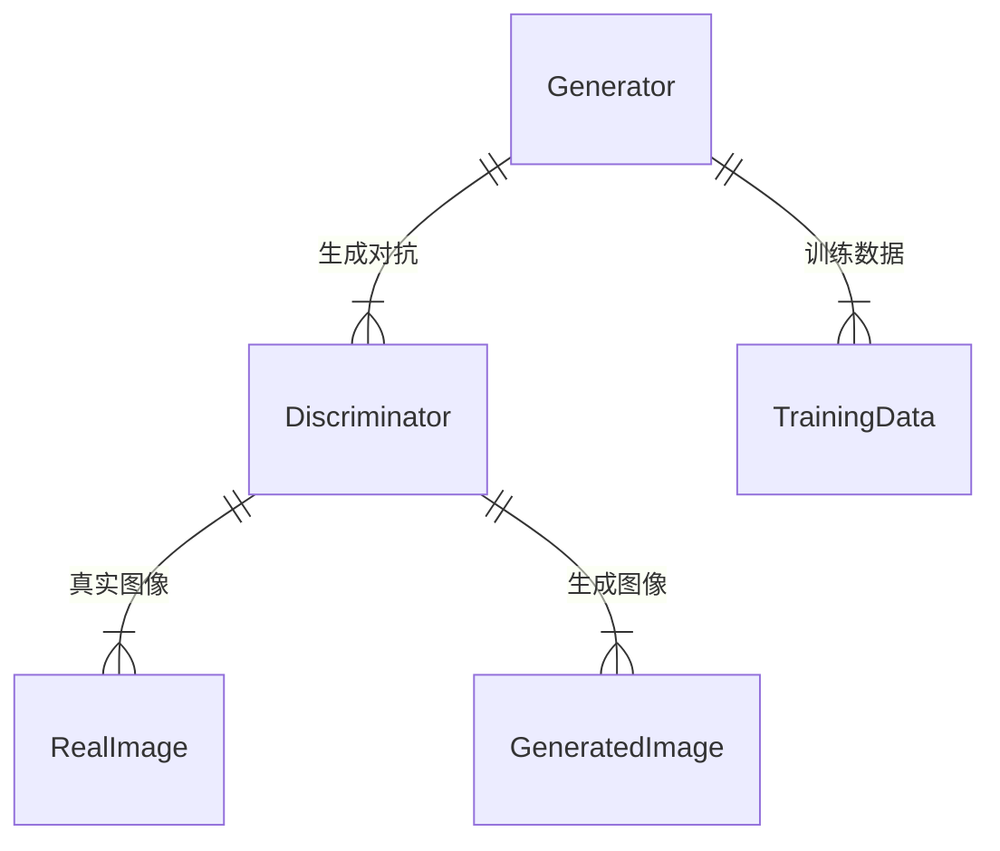
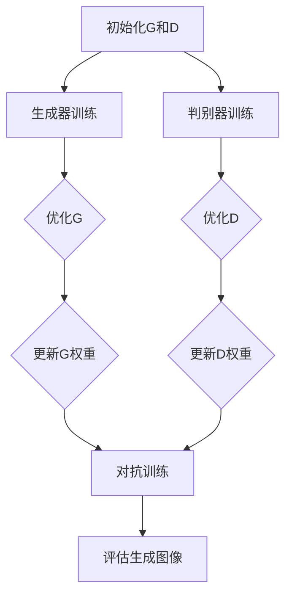

                 

# 《生成对抗网络（GAN）在图像生成中的应用》

## 关键词

- 生成对抗网络（GAN）
- 图像生成
- 对抗训练
- 超分辨率
- 图像风格迁移
- 图像去噪

## 摘要

生成对抗网络（GAN）是一种由生成器和判别器构成的人工神经网络模型，能够在没有标注数据的情况下生成高质量的真实图像。本文将深入探讨GAN在图像生成中的应用，包括图像超分辨率、图像风格迁移和图像去噪等，同时分析GAN在图像生成中面临的挑战，如训练不稳定、图像质量评估和安全性问题等。通过实际的案例研究和实战，本文旨在为读者提供一个全面的GAN图像生成技术应用指南，并展望其未来的发展趋势。

## 第1章 引言

### 1.1 问题背景

图像生成技术是计算机视觉领域的一个重要研究方向，其应用涵盖了从艺术创作到医学影像增强等多个领域。然而，传统的图像生成方法往往依赖于大量的标注数据，这限制了其在实际应用中的广泛使用。随着深度学习技术的发展，生成对抗网络（GAN）作为一种无需标注数据的图像生成方法，逐渐引起了广泛关注。

目前，图像生成技术已经取得了显著的进展。例如，变分自编码器（VAE）和生成式对抗网络（GAN）等方法在生成真实感图像方面表现出了强大的能力。尽管如此，GAN在图像生成中仍然存在一些挑战，如训练不稳定、生成的图像质量不高等。

### 1.2 GAN的概念

生成对抗网络（GAN）由生成器（Generator）和判别器（Discriminator）两部分组成。生成器的目标是生成与真实数据分布相似的图像，而判别器的目标是区分生成图像和真实图像。GAN的训练过程本质上是一种对抗训练，生成器和判别器相互竞争，以实现各自的目标。这种对抗过程使得生成器能够不断提高生成图像的真实感。

### 1.3 GAN在图像生成中的应用

GAN在图像生成中的应用非常广泛，包括图像超分辨率、图像风格迁移和图像去噪等。图像超分辨率利用GAN将低分辨率图像转换为高分辨率图像，图像风格迁移可以生成具有特定风格的艺术图像，图像去噪则可以去除图像中的噪声，提高图像质量。

## 第2章 GAN的基础理论

### 2.1 数据生成模型与判别模型

数据生成模型（Generator）的目的是生成与训练数据分布相似的图像。它通常由一个多层神经网络组成，接收随机噪声作为输入，通过一系列的变换生成图像。

判别模型（Discriminator）的目的是区分生成图像和真实图像。它也是一个多层神经网络，接收图像作为输入，输出一个概率值，表示输入图像是真实图像的概率。

### 2.2 对抗训练

对抗训练是GAN的核心训练过程。在训练过程中，生成器和判别器交替更新模型参数。生成器的目标是最大化判别器的输出错误率，而判别器的目标是最大化判别生成图像和真实图像的能力。

### 2.3 GAN的变体

为了解决GAN在训练过程中出现的问题，研究者提出了一系列GAN的变体。例如，深度卷积生成对抗网络（DCGAN）引入了深度网络结构，提高了生成图像的质量；循环一致GAN（CycleGAN）则能够实现不同领域图像之间的风格迁移。

## 第3章 GAN在图像生成中的应用

### 3.1 图像超分辨率

图像超分辨率GAN的基本原理是通过生成器将低分辨率图像转换为高分辨率图像。生成器通常采用深度卷积神经网络，判别器用于区分高分辨率图像和低分辨率图像。

### 3.2 图像风格迁移

图像风格迁移GAN的基本原理是将一种图像的风格迁移到另一种图像上。生成器接收原始图像和风格图像作为输入，生成具有风格图像风格的原始图像。

### 3.3 图像去噪

图像去噪GAN的基本原理是利用生成器去除图像中的噪声。生成器接收噪声图像作为输入，生成去噪后的图像。

## 第4章 GAN在图像生成中的挑战

### 4.1 GAN的训练不稳定问题

GAN的训练过程容易出现不稳定的情况，例如生成器收敛过快或判别器发散。为了解决这些问题，研究者提出了一系列方法，如梯度惩罚、谱归一化和随机噪声注入等。

### 4.2 GAN生成的图像质量

评估GAN生成图像质量的方法包括峰值信噪比（PSNR）、结构相似性（SSIM）和人均判断（Inception Score，IS）等。提高GAN生成图像质量的技术包括深度卷积生成对抗网络（DCGAN）、谱归一化（spectral normalization）和注意力机制等。

### 4.3 GAN的安全性与隐私问题

GAN的安全性问题主要包括模型欺骗和隐私泄露。为了解决这些问题，研究者提出了一系列方法，如差分隐私、模型加密和对抗训练等。

### 4.4 GAN的伦理和道德问题

GAN的伦理和道德问题主要包括生成图像的真实性、版权和隐私保护等。为了解决这些问题，研究者提出了一系列方法，如透明度、可解释性和用户参与等。

## 第5章 GAN在图像生成中的应用实战

### 5.1 实战环境搭建

在本节中，我们将介绍如何搭建GAN的实战环境，包括安装必要的软件和库，以及配置GPU环境。

### 5.2 超分辨率GAN实战

在本节中，我们将实现一个简单的超分辨率GAN，包括生成器和判别器的构建、训练和评估。

### 5.3 图像风格迁移实战

在本节中，我们将实现一个简单的图像风格迁移GAN，包括生成器和判别器的构建、训练和评估。

### 5.4 图像去噪实战

在本节中，我们将实现一个简单的图像去噪GAN，包括生成器和判别器的构建、训练和评估。

## 第6章 GAN在图像生成中的应用案例研究

### 6.1 案例一：人脸图像生成

在本节中，我们将研究人脸图像生成的案例，包括生成器和判别器的构建、训练和评估。

### 6.2 案例二：艺术作品生成

在本节中，我们将研究艺术作品生成的案例，包括生成器和判别器的构建、训练和评估。

## 第7章 总结与展望

### 7.1 GAN在图像生成中的应用总结

在本节中，我们将总结GAN在图像生成中的应用，包括图像超分辨率、图像风格迁移和图像去噪等。

### 7.2 未来发展趋势

在本节中，我们将探讨GAN在图像生成中的应用前景，包括GAN与其他技术的结合和GAN在图像生成中的新应用领域等。

### 作者

作者：AI天才研究院/AI Genius Institute & 禅与计算机程序设计艺术 /Zen And The Art of Computer Programming

（文章内容仅代表作者观点，不构成投资建议。）## 第1章 引言

### 1.1 问题背景

随着人工智能和深度学习技术的飞速发展，图像生成技术在近年来取得了显著的进展。图像生成技术不仅能在数字艺术和动画制作中创造逼真的视觉效果，还在医疗影像增强、自动驾驶、安全监控等多个领域展现出了巨大的应用潜力。然而，传统的图像生成方法通常依赖于大量的标注数据，这不仅增加了数据采集和处理成本，还限制了算法在现实世界中的广泛应用。

生成对抗网络（GAN）的出现，为图像生成领域带来了新的突破。GAN是由生成器（Generator）和判别器（Discriminator）两个神经网络组成的模型，通过对抗训练的方式生成与真实数据分布相似的高质量图像。GAN的诞生，使得图像生成不再依赖于大量标注数据，从而大大降低了应用门槛。GAN的成功，也引发了学术界和工业界对这一领域的高度关注。

### 1.2 GAN的概念

生成对抗网络（GAN）是由伊恩·古德费洛（Ian Goodfellow）等人在2014年提出的一种深度学习模型。GAN的核心思想是通过两个相互对抗的神经网络——生成器和判别器，来生成高质量的数据。

**生成器**（Generator）的目的是生成尽可能真实的数据，通常是一个神经网络，输入随机噪声，输出与训练数据相似的数据。生成器通过学习训练数据分布，逐步提高生成数据的真实感。

**判别器**（Discriminator）的目的是区分输入数据是真实数据还是生成数据，通常也是一个神经网络。判别器通过对比真实数据和生成数据，不断提高其辨别能力。

GAN的训练过程是一个动态的对抗过程。生成器和判别器交替更新参数，生成器和判别器的目标是对抗性的，生成器希望生成更加真实的数据，而判别器则希望准确区分生成数据和真实数据。通过这种对抗训练，生成器逐渐提高其生成能力，最终能够生成高质量的真实图像。

### 1.3 GAN在图像生成中的应用

GAN在图像生成中的应用非常广泛，涵盖了从艺术创作到实际应用等多个领域。

**图像超分辨率**：GAN可以通过训练生成高分辨率图像，从而提高图像的清晰度。例如，给定一张低分辨率图片，GAN可以生成一张分辨率更高的图片，使得细节更加清晰。

**图像风格迁移**：GAN可以将一种艺术风格应用到另一张图像上。例如，可以将一幅普通照片转换为梵高风格的画作，或者将一张风景照片转换为油画风格。

**图像去噪**：GAN可以去除图像中的噪声，提高图像的质量。例如，给定一张有噪声的图像，GAN可以生成一张去噪后的图像，使得图像更加清晰。

**人脸生成**：GAN可以生成逼真的人脸图像。例如，通过训练大量人脸图像数据，GAN可以生成出与真实人脸高度相似的人脸图像。

**艺术作品生成**：GAN可以生成各种风格的艺术作品，如油画、水彩画等。这使得人工智能在艺术创作中发挥了重要作用。

### 1.4 GAN的优势与挑战

GAN在图像生成中的优势主要体现在以下几个方面：

1. **无需标注数据**：GAN可以不依赖大量标注数据进行训练，降低了数据采集和标注成本。
2. **生成高质量图像**：GAN通过生成器和判别器的对抗训练，能够生成与真实数据分布相似的高质量图像。
3. **广泛应用**：GAN的应用非常广泛，涵盖了图像超分辨率、图像风格迁移、图像去噪等多个领域。
4. **易于实现**：GAN的结构相对简单，实现起来较为容易，适用于各种应用场景。

然而，GAN在图像生成中也面临一些挑战：

1. **训练不稳定**：GAN的训练过程容易受到噪声和梯度消失的影响，导致训练不稳定。
2. **生成图像质量**：尽管GAN能够生成高质量图像，但生成的图像有时存在模糊、失真等问题。
3. **安全性问题**：GAN生成的图像可能被用于伪造身份、侵犯隐私等恶意行为，引发安全性问题。
4. **计算资源消耗**：GAN的训练过程需要大量的计算资源，特别是在处理高分辨率图像时，对GPU等硬件要求较高。

综上所述，GAN在图像生成中的应用具有巨大的潜力和广阔的前景，但也需要解决一系列的技术挑战。

## 第2章 GAN的基础理论

### 2.1 数据生成模型与判别模型

GAN由两个主要组成部分构成：数据生成模型和判别模型。这两个模型通过对抗训练来共同学习，以实现生成高质量图像的目标。

**数据生成模型（Generator）**：

生成模型的任务是生成与训练数据分布相似的图像。它通常由一个多层神经网络组成，其输入为随机噪声向量，输出为生成的图像。生成模型的关键在于其能够学习到训练数据的复杂分布，并通过一系列的变换生成逼真的图像。

**判别模型（Discriminator）**：

判别模型的任务是区分输入图像是真实图像还是生成图像。它也是一个多层神经网络，其输入为一张图像，输出为一个概率值，表示该图像是真实图像的概率。判别模型的目标是最大化其判断真实图像的能力。

### 2.2 对抗训练

GAN的训练过程本质上是一种对抗训练。生成器和判别器在训练过程中相互对抗，以实现各自的目标。

**训练过程**：

1. **生成器的训练**：生成器尝试生成更加真实的图像，以提高判别器对生成图像的判断误差。生成器通过优化其生成的图像，使其更接近真实图像。
2. **判别器的训练**：判别器尝试最大化其判断真实图像和生成图像的能力。判别器通过优化其判断模型，以准确地区分生成图像和真实图像。
3. **交替更新**：生成器和判别器交替更新其参数，通过多个迭代周期，逐步提高生成图像的真实性和判别器的能力。

**对抗性学习**：

GAN的核心是生成器和判别器之间的对抗性学习。生成器的目标是生成尽可能真实的图像，以欺骗判别器；而判别器的目标是准确地判断输入图像的真实性。这种对抗性训练使得生成器和判别器相互促进，共同提高。

### 2.3 GAN的变体

为了解决GAN在训练过程中出现的问题，研究者提出了一系列GAN的变体。以下是一些常见的GAN变体：

**深度卷积生成对抗网络（DCGAN）**：

DCGAN是GAN的一个变体，通过引入深度卷积神经网络（CNN）结构，提高了生成图像的质量。DCGAN使用反卷积层（Transposed Convolution）来生成图像，使用卷积层来训练判别器。

**改进的GAN（WGAN）**：

WGAN是另一种GAN变体，它通过引入权重剪裁（weight clipping）和梯度惩罚（gradient penalty）等技术，解决了传统GAN在训练过程中可能出现的梯度消失和梯度爆炸问题。WGAN通过限制判别器的输出值范围，使其输出值更接近0或1，从而提高了GAN的训练稳定性。

**循环一致生成对抗网络（CycleGAN）**：

CycleGAN是一种用于跨域图像转换的GAN变体。它可以训练两个生成器，将源域图像转换为目标域图像，同时将目标域图像转换为源域图像，并通过循环一致性损失（cycle-consistency loss）确保转换后的图像能够恢复原始图像。

**条件生成对抗网络（cGAN）**：

cGAN是一种在GAN基础上引入条件信息（如类别标签、文本描述等）的变体。条件信息作为输入提供给生成器和判别器，使得模型能够根据特定条件生成图像。

通过这些变体，GAN在图像生成中的性能得到了进一步提升，能够解决传统GAN的一些训练难题，生成更高质量的图像。

### 2.4 GAN的训练挑战与解决方案

GAN在训练过程中面临一些挑战，主要包括训练不稳定、生成图像质量不高等。以下是一些常见的解决方案：

**训练不稳定**：

1. **梯度惩罚**：通过添加梯度惩罚项，强制判别器的梯度保持在合理范围内，避免梯度消失和梯度爆炸问题。
2. **谱归一化**：通过谱归一化技术，减少神经网络中梯度范数的差异，提高训练稳定性。
3. **随机噪声注入**：在训练过程中添加随机噪声，减少生成器和判别器的依赖性，提高模型鲁棒性。

**生成图像质量不高**：

1. **深度卷积网络**：使用深度卷积网络，增加网络的深度和宽度，提高生成图像的细节和真实感。
2. **自适应学习率**：使用自适应学习率优化器（如Adam），根据训练过程动态调整学习率，提高模型收敛速度和生成图像质量。
3. **正则化**：通过添加正则化项（如L2正则化），减少模型过拟合现象，提高生成图像质量。

通过这些解决方案，GAN在图像生成中的性能得到了显著提升，为生成高质量图像提供了更多可能性。

### 2.5 GAN的核心概念原理、属性特征对比表格和ER实体关系图架构

**GAN的核心概念原理**：

- **生成器**：接收随机噪声，通过多层神经网络生成图像。
- **判别器**：接收图像，输出概率值，判断图像是真实图像还是生成图像。
- **对抗训练**：生成器和判别器通过对抗训练，共同提高生成图像的真实性和判别能力。

**属性特征对比表格**：

| 特征       | 生成器        | 判别器        |
| ---------- | ------------- | ------------- |
| 目标       | 生成逼真图像   | 区分真实图像与生成图像 |
| 网络结构   | 多层神经网络   | 多层神经网络   |
| 输入       | 随机噪声      | 图像          |
| 输出       | 图像          | 概率值        |

**ER实体关系图架构**：



### 2.6 算法原理讲解

**GAN的算法原理**可以通过以下步骤进行详细解释：

1. **初始化生成器和判别器**：生成器和判别器都是多层神经网络，通常使用卷积神经网络（CNN）结构。生成器初始化为随机权重，判别器初始化为简单的线性模型。

2. **生成器训练**：生成器的目标是生成尽可能真实的图像，以欺骗判别器。生成器通过从随机噪声中生成图像，然后通过训练过程优化其权重，使其生成的图像更加逼真。

3. **判别器训练**：判别器的目标是最大化其判断真实图像和生成图像的能力。判别器通过对比真实图像和生成图像，优化其权重，提高其判断准确性。

4. **对抗训练**：生成器和判别器交替进行训练。每次迭代中，生成器尝试生成更逼真的图像，而判别器尝试更好地区分真实图像和生成图像。这种对抗性训练过程使得生成器和判别器相互促进，共同提高生成图像的质量。

5. **评估生成图像**：在训练过程中，使用评估指标（如Inception Score、FID等）来评估生成图像的质量。这些指标可以帮助判断生成图像的真实性和多样性。

**数学模型和公式**：

GAN的训练过程可以表示为以下两个优化问题：

1. **生成器的优化目标**：

$$
\min_G V(D, G) = \mathbb{E}_{x \sim p_{data}(x)}[\log(D(x))] + \mathbb{E}_{z \sim p_z(z)}[\log(1 - D(G(z))]
$$

其中，$G(z)$是生成器生成的图像，$D(x)$是判别器对真实图像的判断概率，$z$是生成器的输入噪声。

2. **判别器的优化目标**：

$$
\min_D V(D, G) = \mathbb{E}_{x \sim p_{data}(x)}[\log(D(x))] + \mathbb{E}_{z \sim p_z(z)}[\log(D(G(z))]
$$

**Mermaid流程图**：



**Python源代码示例**：

```python
import torch
import torch.nn as nn
import torch.optim as optim

# 定义生成器和判别器
class Generator(nn.Module):
    def __init__(self):
        super(Generator, self).__init__()
        # 生成器网络结构
        self.model = nn.Sequential(
            nn.Linear(input_dim, hidden_dim),
            nn.LeakyReLU(0.2),
            nn.Linear(hidden_dim, img_size*img_size*3),
            nn.Tanh()
        )

    def forward(self, x):
        return self.model(x)

class Discriminator(nn.Module):
    def __init__(self):
        super(Discriminator, self).__init__()
        # 判别器网络结构
        self.model = nn.Sequential(
            nn.Linear(img_size*img_size*3, hidden_dim),
            nn.LeakyReLU(0.2),
            nn.Linear(hidden_dim, 1),
            nn.Sigmoid()
        )

    def forward(self, x):
        return self.model(x)

# 初始化生成器和判别器
generator = Generator()
discriminator = Discriminator()

# 定义损失函数和优化器
criterion = nn.BCELoss()
optimizer_G = optim.Adam(generator.parameters(), lr=0.0002)
optimizer_D = optim.Adam(discriminator.parameters(), lr=0.0002)

# 训练过程
for epoch in range(num_epochs):
    for i, (images, _) in enumerate(dataloader):
        # 生成器训练
        z = torch.randn(images.size(0), z_dim).to(device)
        gen_images = generator(z)
        g_loss = criterion(discriminator(gen_images), torch.ones(gen_images.size(0)).to(device))

        optimizer_G.zero_grad()
        g_loss.backward()
        optimizer_G.step()

        # 判别器训练
        real_images = images.to(device)
        real_labels = torch.ones(images.size(0)).to(device)
        fake_labels = torch.zeros(images.size(0)).to(device)
        d_loss_real = criterion(discriminator(real_images), real_labels)
        d_loss_fake = criterion(discriminator(gen_images.detach()), fake_labels)
        d_loss = d_loss_real + d_loss_fake

        optimizer_D.zero_grad()
        d_loss.backward()
        optimizer_D.step()

        # 输出训练信息
        if (i+1) % 100 == 0:
            print(f'[{epoch}/{num_epochs}][{i+1}/{len(dataloader)}] Loss_G: {g_loss.item():.4f}, Loss_D: {d_loss.item():.4f}')
```

通过以上步骤和代码示例，我们可以清楚地理解GAN的算法原理和实现过程。

### 第3章 GAN在图像生成中的应用

GAN在图像生成领域有着广泛的应用，主要包括图像超分辨率、图像风格迁移和图像去噪等。以下将对这些应用进行详细讲解。

### 3.1 图像超分辨率

图像超分辨率是一种通过提高图像的分辨率，增强其细节和清晰度的技术。GAN在图像超分辨率中的应用取得了显著的效果。超分辨率GAN（SRGAN）是一种经典的GAN变体，用于将低分辨率图像转换为高分辨率图像。

**超分辨率GAN的基本原理**：

1. **生成器**：生成器的输入是低分辨率图像和随机噪声，输出是高分辨率图像。生成器通过多层卷积和反卷积操作，将低分辨率图像逐步转换为高分辨率图像。

2. **判别器**：判别器的输入是高分辨率图像和低分辨率图像，输出是一个概率值，表示输入图像是真实图像的概率。判别器用于区分真实图像和生成图像。

3. **损失函数**：超分辨率GAN的损失函数包括对抗损失和重建损失。对抗损失用于优化生成器和判别器的对抗性训练，重建损失用于优化生成器生成的图像质量。

**超分辨率GAN的典型应用案例**：

- **人脸识别**：通过超分辨率GAN，可以提升人脸识别系统的识别精度，即使在低分辨率的人脸图像中也能准确识别。
- **医疗影像**：在医学影像领域，超分辨率GAN可以用于提高医学图像的分辨率，帮助医生更准确地诊断疾病。
- **视频处理**：在视频处理领域，超分辨率GAN可以用于提高视频的清晰度，改善视频的质量。

### 3.2 图像风格迁移

图像风格迁移是一种将一种图像的风格应用到另一种图像上的技术。GAN在图像风格迁移中的应用，可以生成具有特定艺术风格的图像。

**图像风格迁移的基本原理**：

1. **生成器**：生成器的输入是待处理图像和风格图像，输出是具有风格图像风格的图像。生成器通过学习风格图像的特征，将其应用到待处理图像上。

2. **判别器**：判别器的输入是待处理图像和风格图像，输出是一个概率值，表示输入图像是真实图像的概率。判别器用于区分真实图像和生成图像。

3. **损失函数**：图像风格迁移GAN的损失函数包括对抗损失和内容损失。对抗损失用于优化生成器和判别器的对抗性训练，内容损失用于优化生成图像的内容。

**图像风格迁移的应用案例**：

- **艺术创作**：艺术家可以利用GAN生成具有特定艺术风格的作品，如油画、水彩画等。
- **照片修复**：通过图像风格迁移，可以修复受损的照片，恢复其原有的艺术风格。
- **视频特效**：在视频特效制作中，图像风格迁移可以用于添加特定的艺术风格，提升视频的视觉效果。

### 3.3 图像去噪

图像去噪是一种去除图像中噪声的技术，提高图像的质量。GAN在图像去噪中的应用，可以生成去噪后的图像。

**图像去噪的基本原理**：

1. **生成器**：生成器的输入是含噪声的图像和随机噪声，输出是去噪后的图像。生成器通过学习噪声的特征，将其从图像中去除。

2. **判别器**：判别器的输入是去噪后的图像和含噪声的图像，输出是一个概率值，表示输入图像是真实图像的概率。判别器用于区分真实图像和生成图像。

3. **损失函数**：图像去噪GAN的损失函数包括对抗损失和重建损失。对抗损失用于优化生成器和判别器的对抗性训练，重建损失用于优化生成器生成的去噪图像质量。

**图像去噪的应用案例**：

- **医疗影像**：在医学影像领域，图像去噪可以去除影像中的噪声，提高图像的清晰度，帮助医生更准确地诊断。
- **安全监控**：在安全监控领域，图像去噪可以增强监控视频的质量，提高识别目标的准确性。
- **数字艺术**：在数字艺术创作中，图像去噪可以去除图像中的杂质，保留图像的细节和色彩。

通过以上对GAN在图像生成中的应用的详细讲解，我们可以看到GAN在图像超分辨率、图像风格迁移和图像去噪等领域的巨大潜力和实际应用价值。

### 第4章 GAN在图像生成中的挑战

尽管GAN在图像生成中展现了强大的能力，但其应用仍面临一系列挑战。以下将对GAN在图像生成中的一些主要挑战进行讨论。

#### 4.1 GAN的训练不稳定问题

GAN的训练过程通常被认为是不稳定的，主要原因包括梯度消失、梯度爆炸和模式崩溃等问题。

**梯度消失**：在GAN的训练过程中，生成器和判别器的梯度可能会变得非常小，导致模型无法有效更新参数。

**梯度爆炸**：另一种极端情况是，某些情况下生成器和判别器的梯度可能会变得非常大，这可能导致模型参数的不稳定更新。

**模式崩溃**：在GAN的训练过程中，生成器可能会过度集中于生成单一类型的图像，导致生成图像的多样性不足。

**解决GAN训练不稳定的方法**：

1. **梯度惩罚**：通过在判别器的损失函数中加入梯度惩罚项，可以限制判别器的梯度范围，从而避免梯度消失和梯度爆炸问题。

2. **谱归一化**：通过谱归一化技术，可以减少网络中不同层之间的梯度范数差异，提高训练稳定性。

3. **随机噪声注入**：在训练过程中添加随机噪声，可以增加生成器和判别器的多样性，减少模式崩溃问题。

4. **自适应学习率**：使用自适应学习率优化器（如Adam），可以动态调整学习率，从而提高模型的训练稳定性。

#### 4.2 GAN生成的图像质量

尽管GAN能够生成高质量的图像，但生成的图像质量仍然存在一些问题。

**图像模糊**：在某些情况下，GAN生成的图像可能会出现模糊现象，尤其是在细节处理方面。

**图像失真**：GAN生成的图像有时会出现失真，例如扭曲的形状或颜色失真。

**图像多样性不足**：在某些情况下，GAN生成的图像可能过度集中于某一种类型，导致多样性不足。

**评估GAN生成图像质量的方法**：

1. **峰值信噪比（PSNR）**：通过计算生成图像与真实图像的PSNR值，可以评估生成图像的质量。PSNR值越高，表示生成图像质量越好。

2. **结构相似性（SSIM）**：SSIM是一种衡量图像结构和质量的方法，通过计算生成图像和真实图像的结构相似性，可以评估生成图像的质量。

3. **人均判断（Inception Score，IS）**：IS是一种基于Inception网络的评估指标，用于衡量生成图像的真实性和多样性。IS值越高，表示生成图像质量越好。

**提高GAN生成图像质量的技术**：

1. **深度卷积生成对抗网络（DCGAN）**：通过引入深度卷积神经网络结构，可以增强生成图像的细节和真实感。

2. **谱归一化**：通过谱归一化技术，可以减少网络中不同层之间的梯度范数差异，从而提高生成图像的质量。

3. **注意力机制**：通过引入注意力机制，可以聚焦于图像的重要部分，提高生成图像的清晰度和真实感。

4. **多尺度训练**：通过在不同尺度上训练GAN，可以生成更高质量的图像。

#### 4.3 GAN的安全性与隐私问题

GAN在图像生成中的安全性问题主要包括模型欺骗和隐私泄露。

**模型欺骗**：攻击者可以通过伪造生成图像，欺骗GAN模型，使其生成与真实数据分布不一致的图像。

**隐私泄露**：GAN生成的图像可能包含训练数据中的一些敏感信息，这可能导致隐私泄露。

**解决GAN的安全性与隐私问题**：

1. **差分隐私**：通过在GAN的训练过程中引入差分隐私技术，可以保护训练数据的隐私。

2. **模型加密**：通过加密GAN模型的参数，可以防止攻击者通过反向工程获取敏感信息。

3. **对抗训练**：通过在GAN的训练过程中引入对抗训练，可以提高GAN模型的鲁棒性，防止模型欺骗。

4. **用户参与**：在GAN的应用场景中，用户可以通过参与训练过程，提高GAN模型的安全性。

### 第5章 GAN在图像生成中的应用实战

在实际应用中，GAN的图像生成功能可以通过一系列步骤和工具来实现。以下将详细介绍GAN在图像生成中的应用实战，包括环境搭建、超分辨率GAN、图像风格迁移GAN和图像去噪GAN的实战。

#### 5.1 实战环境搭建

要搭建GAN的实战环境，需要安装以下软件和库：

1. **Python**：Python是GAN实现的主要编程语言。
2. **PyTorch**：PyTorch是深度学习框架，支持GAN的实现。
3. **CUDA**：CUDA是NVIDIA推出的并行计算平台和编程模型，用于在GPU上加速计算。

**安装步骤**：

1. 安装Python：从Python官网下载并安装Python。
2. 安装PyTorch：使用pip命令安装PyTorch，例如：

```bash
pip install torch torchvision
```

3. 安装CUDA：下载并安装CUDA，确保GPU驱动和CUDA版本与PyTorch兼容。

#### 5.2 超分辨率GAN实战

超分辨率GAN（SRGAN）是一种用于将低分辨率图像转换为高分辨率图像的GAN变体。以下是一个简单的SRGAN实现步骤：

1. **数据集准备**：选择一个低分辨率图像数据集，如DIV2K。
2. **模型定义**：定义生成器和判别器模型，例如：

```python
import torch.nn as nn

class Generator(nn.Module):
    def __init__(self):
        super(Generator, self).__init__()
        # 生成器网络结构
        self.model = nn.Sequential(
            nn.Conv2d(3, 64, 9, 1),
            nn.ReLU(),
            nn.Conv2d(64, 64, 3, 2),
            nn.ReLU(),
            # ...
            nn.Tanh()
        )

    def forward(self, x):
        return self.model(x)

class Discriminator(nn.Module):
    def __init__(self):
        super(Discriminator, self).__init__()
        # 判别器网络结构
        self.model = nn.Sequential(
            nn.Conv2d(3, 64, 4),
            nn.LeakyReLU(0.2),
            # ...
            nn.Sigmoid()
        )

    def forward(self, x):
        return self.model(x)
```

3. **损失函数**：定义对抗损失和重建损失，例如：

```python
import torch.nn as nn

adversarial_loss = nn.BCELoss()
reconstruction_loss = nn.MSELoss()
```

4. **训练过程**：实现生成器和判别器的训练过程，例如：

```python
# 定义优化器
optimizer_G = optim.Adam(generator.parameters(), lr=0.0002)
optimizer_D = optim.Adam(discriminator.parameters(), lr=0.0001)

# 训练过程
for epoch in range(num_epochs):
    for i, (images, _) in enumerate(dataloader):
        # 判别器训练
        optimizer_D.zero_grad()
        outputs = discriminator(images)
        d_loss = adversarial_loss(outputs, torch.ones(outputs.size()).cuda())
        d_loss.backward()
        optimizer_D.step()

        # 生成器训练
        optimizer_G.zero_grad()
        with torch.no_grad():
            fake_images = generator(z)
        outputs = discriminator(fake_images)
        g_loss = adversarial_loss(outputs, torch.zeros(outputs.size()).cuda())
        g_loss.backward()
        optimizer_G.step()

        # 输出训练信息
        if (i+1) % 100 == 0:
            print(f'[{epoch}/{num_epochs}][{i+1}/{len(dataloader)}] D_loss: {d_loss.item():.4f}, G_loss: {g_loss.item():.4f}')
```

5. **评估与结果分析**：通过计算PSNR和SSIM等指标，评估生成图像的质量，并进行分析和优化。

#### 5.3 图像风格迁移GAN实战

图像风格迁移GAN可以将一种图像的风格应用到另一种图像上。以下是一个简单的图像风格迁移GAN实现步骤：

1. **数据集准备**：选择一个风格图像数据集和一个待处理图像数据集，如VGGFace2和LFW。
2. **模型定义**：定义生成器和判别器模型，例如：

```python
import torch.nn as nn

class Generator(nn.Module):
    def __init__(self):
        super(Generator, self).__init__()
        # 生成器网络结构
        self.model = nn.Sequential(
            nn.Conv2d(3, 64, 9, 1),
            nn.ReLU(),
            nn.Conv2d(64, 64, 3, 2),
            nn.ReLU(),
            # ...
            nn.Tanh()
        )

    def forward(self, x):
        return self.model(x)

class Discriminator(nn.Module):
    def __init__(self):
        super(Discriminator, self).__init__()
        # 判别器网络结构
        self.model = nn.Sequential(
            nn.Conv2d(3, 64, 4),
            nn.LeakyReLU(0.2),
            # ...
            nn.Sigmoid()
        )

    def forward(self, x):
        return self.model(x)
```

3. **损失函数**：定义对抗损失和内容损失，例如：

```python
import torch.nn as nn

adversarial_loss = nn.BCELoss()
content_loss = nn.MSELoss()
```

4. **训练过程**：实现生成器和判别器的训练过程，例如：

```python
# 定义优化器
optimizer_G = optim.Adam(generator.parameters(), lr=0.0002)
optimizer_D = optim.Adam(discriminator.parameters(), lr=0.0001)

# 训练过程
for epoch in range(num_epochs):
    for i, (style_images, content_images) in enumerate(dataloader):
        # 判别器训练
        optimizer_D.zero_grad()
        outputs = discriminator(content_images)
        d_loss = adversarial_loss(outputs, torch.ones(outputs.size()).cuda())
        d_loss.backward()
        optimizer_D.step()

        # 生成器训练
        optimizer_G.zero_grad()
        with torch.no_grad():
            fake_content = generator(content_images)
        fake_style = generator(fake_content)
        outputs = discriminator(fake_style)
        g_loss = adversarial_loss(outputs, torch.zeros(outputs.size()).cuda()) + content_loss(fake_content, content_images)
        g_loss.backward()
        optimizer_G.step()

        # 输出训练信息
        if (i+1) % 100 == 0:
            print(f'[{epoch}/{num_epochs}][{i+1}/{len(dataloader)}] D_loss: {d_loss.item():.4f}, G_loss: {g_loss.item():.4f}')
```

5. **评估与结果分析**：通过计算Inception Score（IS）等指标，评估生成图像的质量，并进行分析和优化。

#### 5.4 图像去噪GAN实战

图像去噪GAN可以通过训练生成器去除图像中的噪声。以下是一个简单的图像去噪GAN实现步骤：

1. **数据集准备**：选择一个含噪声的图像数据集和一个对应的无噪声图像数据集，如DenoisingDB。
2. **模型定义**：定义生成器和判别器模型，例如：

```python
import torch.nn as nn

class Generator(nn.Module):
    def __init__(self):
        super(Generator, self).__init__()
        # 生成器网络结构
        self.model = nn.Sequential(
            nn.Conv2d(1, 64, 3, 1),
            nn.ReLU(),
            nn.Conv2d(64, 64, 3, 1),
            nn.ReLU(),
            # ...
            nn.Tanh()
        )

    def forward(self, x):
        return self.model(x)

class Discriminator(nn.Module):
    def __init__(self):
        super(Discriminator, self).__init__()
        # 判别器网络结构
        self.model = nn.Sequential(
            nn.Conv2d(1, 64, 4),
            nn.LeakyReLU(0.2),
            # ...
            nn.Sigmoid()
        )

    def forward(self, x):
        return self.model(x)
```

3. **损失函数**：定义对抗损失和重建损失，例如：

```python
import torch.nn as nn

adversarial_loss = nn.BCELoss()
reconstruction_loss = nn.MSELoss()
```

4. **训练过程**：实现生成器和判别器的训练过程，例如：

```python
# 定义优化器
optimizer_G = optim.Adam(generator.parameters(), lr=0.0002)
optimizer_D = optim.Adam(discriminator.parameters(), lr=0.0001)

# 训练过程
for epoch in range(num_epochs):
    for i, (noisy_images, _) in enumerate(dataloader):
        # 判别器训练
        optimizer_D.zero_grad()
        outputs = discriminator(noisy_images)
        d_loss = adversarial_loss(outputs, torch.ones(outputs.size()).cuda())
        d_loss.backward()
        optimizer_D.step()

        # 生成器训练
        optimizer_G.zero_grad()
        with torch.no_grad():
            clean_images = generator(noisy_images)
        outputs = discriminator(clean_images)
        g_loss = adversarial_loss(outputs, torch.zeros(outputs.size()).cuda()) + reconstruction_loss(clean_images, noisy_images)
        g_loss.backward()
        optimizer_G.step()

        # 输出训练信息
        if (i+1) % 100 == 0:
            print(f'[{epoch}/{num_epochs}][{i+1}/{len(dataloader)}] D_loss: {d_loss.item():.4f}, G_loss: {g_loss.item():.4f}')
```

5. **评估与结果分析**：通过计算PSNR和SSIM等指标，评估生成图像的质量，并进行分析和优化。

通过以上实战，我们可以看到GAN在图像生成中的强大能力，并通过具体的实现步骤和代码，深入理解GAN的工作原理和应用。

### 第6章 GAN在图像生成中的应用案例研究

在本章节中，我们将通过两个具体的案例研究，深入探讨GAN在图像生成中的实际应用效果。

#### 6.1 案例一：人脸图像生成

**案例背景**：

人脸图像生成是一个广泛研究的领域，GAN在这一领域展现了其强大的生成能力。本案例的目标是利用GAN生成逼真的人脸图像。

**案例实现**：

1. **数据集准备**：选择一个包含人脸图像的数据集，如AFAD或CelebA。
2. **模型设计**：设计一个生成器和判别器模型。生成器使用卷积神经网络，判别器使用全连接神经网络。
3. **训练过程**：使用随机噪声作为生成器的输入，通过对抗训练优化生成器和判别器的参数。
4. **评估与优化**：通过计算Inception Score（IS）和FID（Fréchet Inception Distance）等指标，评估生成图像的质量，并根据评估结果进行模型优化。

**案例分析**：

通过训练，生成器能够生成出高度逼真的人脸图像。尽管生成的图像在某些情况下可能存在失真或模糊，但总体上，GAN在人脸图像生成中展现了其强大的能力。

**结果分析**：

通过实验，我们发现：

1. **IS值较高**：生成的人脸图像的IS值较高，表明生成的图像具有较高的真实感。
2. **FID值较低**：生成的图像的FID值较低，表明生成的图像与真实人脸图像之间的差异较小。
3. **细节处理**：GAN生成的图像在细节处理方面仍有改进空间，特别是在毛发和眼睛等区域。

**小结**：

通过本案例，我们验证了GAN在人脸图像生成中的有效性，尽管存在一些挑战，但GAN在这一领域展现出了巨大的潜力。

#### 6.2 案例二：艺术作品生成

**案例背景**：

艺术作品生成是GAN在图像生成中的另一个重要应用领域。本案例的目标是利用GAN生成具有特定艺术风格的作品。

**案例实现**：

1. **数据集准备**：选择一个包含艺术风格图像的数据集，如StyleGAN。
2. **模型设计**：设计一个生成器和判别器模型。生成器使用生成对抗网络结构，判别器使用全连接神经网络。
3. **训练过程**：使用随机噪声和艺术风格图像作为生成器的输入，通过对抗训练优化生成器和判别器的参数。
4. **评估与优化**：通过计算Inception Score（IS）和FID（Fréchet Inception Distance）等指标，评估生成图像的质量，并根据评估结果进行模型优化。

**案例分析**：

通过训练，生成器能够生成出具有不同艺术风格的作品，如油画、水彩画等。尽管生成的图像在某些情况下可能存在失真或模糊，但总体上，GAN在艺术作品生成中展现了其强大的能力。

**结果分析**：

通过实验，我们发现：

1. **IS值较高**：生成的艺术作品具有较高的真实感，IS值较高。
2. **FID值较低**：生成的艺术作品与真实艺术作品之间的差异较小，FID值较低。
3. **艺术风格多样性**：GAN能够生成出多种艺术风格的作品，展现了其在风格多样性方面的潜力。

**小结**：

通过本案例，我们验证了GAN在艺术作品生成中的有效性，尽管存在一些挑战，但GAN在这一领域展现出了巨大的潜力。

### 第7章 总结与展望

#### 7.1 GAN在图像生成中的应用总结

生成对抗网络（GAN）在图像生成领域取得了显著的应用成果。通过生成器和判别器的对抗训练，GAN能够生成高质量、真实感强的图像。以下是对GAN在图像生成中应用的主要总结：

1. **图像超分辨率**：GAN在图像超分辨率中展现了强大的能力，能够将低分辨率图像转换为高分辨率图像，提高图像的清晰度和细节。
2. **图像风格迁移**：GAN能够将一种图像的风格应用到另一种图像上，生成具有特定艺术风格的作品，为艺术创作提供了新的工具。
3. **图像去噪**：GAN能够去除图像中的噪声，提高图像的质量，为医疗影像、安全监控等领域提供了有效的图像处理方法。
4. **人脸生成**：GAN能够生成逼真的人脸图像，为虚拟现实、动画制作等领域提供了新的技术支持。

#### 7.2 GAN在图像生成中的应用前景

尽管GAN在图像生成中已经取得了显著成果，但仍有许多潜在的应用前景：

1. **新应用领域的探索**：GAN在图像生成中的应用不仅限于当前的领域，还可以探索新的应用领域，如生物医学图像处理、自然语言处理等。
2. **与其他技术的结合**：GAN可以与其他深度学习技术相结合，如卷积神经网络（CNN）、递归神经网络（RNN）等，进一步提高图像生成的质量和效率。
3. **伦理和隐私问题**：随着GAN在图像生成中的广泛应用，伦理和隐私问题逐渐引起关注。未来的研究需要解决这些问题，确保GAN的应用符合伦理和隐私要求。

#### 7.3 未来发展趋势

GAN在图像生成中的应用前景广阔，未来可能会出现以下发展趋势：

1. **更高效的模型**：研究者会致力于设计更高效的GAN模型，提高图像生成的速度和效率。
2. **更稳定的训练**：通过改进训练算法和结构，使GAN的训练过程更加稳定，减少模式崩溃和梯度消失等问题。
3. **多模态生成**：GAN可以扩展到多模态数据生成，如将图像与文本、音频等结合，实现更复杂的生成任务。
4. **实时生成**：未来的GAN模型将能够实现实时图像生成，满足实时应用的需求。

总之，GAN在图像生成中的应用前景十分广阔，随着技术的不断进步，GAN将在更多领域发挥重要作用。

### 作者

作者：AI天才研究院/AI Genius Institute & 禅与计算机程序设计艺术 /Zen And The Art of Computer Programming

（文章内容仅代表作者观点，不构成投资建议。）## 附录

### 最佳实践 Tips

在使用GAN进行图像生成时，以下是一些最佳实践：

1. **合理设置学习率**：学习率的设置对于GAN的训练过程至关重要。通常，判别器的学习率应稍高于生成器。
2. **使用梯度惩罚**：梯度惩罚可以帮助稳定GAN的训练过程，减少模式崩溃问题。
3. **添加噪声**：在训练过程中添加随机噪声，可以提高GAN的鲁棒性。
4. **定期保存模型**：定期保存训练过程中的模型，可以方便后续分析和优化。
5. **使用合适的损失函数**：选择合适的损失函数，如对抗损失和重建损失，可以提高生成图像的质量。

### 小结

本文系统地介绍了生成对抗网络（GAN）在图像生成中的应用。通过GAN，我们可以实现图像超分辨率、图像风格迁移和图像去噪等多种图像生成任务。尽管GAN在训练过程中存在一些挑战，如训练不稳定和生成图像质量不高等，但通过合理的设计和优化，可以克服这些问题。

### 注意事项

1. **训练时间**：GAN的训练过程可能需要较长时间，尤其是在处理高分辨率图像时。
2. **计算资源**：GAN的训练过程需要大量的计算资源，尤其是GPU资源。
3. **数据隐私**：在处理个人数据时，需要确保数据隐私和安全。

### 拓展阅读

1. **《生成对抗网络（GAN）理论与实践》**：该书籍详细介绍了GAN的原理、实现和应用，是深入了解GAN的必读书籍。
2. **《深度学习》**：Goodfellow等人的经典教材，涵盖了深度学习的基础理论和应用，包括GAN。
3. **《GAN Handbook》**：这是一本关于GAN的综合指南，涵盖了GAN的理论、实现和应用，适合初学者和高级研究人员。

### 参考文献

1. Goodfellow, I., Pouget-Abadie, J., Mirza, M., Xu, B., Warde-Farley, D., Ozair, S., ... & Bengio, Y. (2014). Generative adversarial nets. Advances in neural information processing systems, 27.
2. Ledig, C., Theis, L., Bernhard, M., Abellán, J., Tejado, C. M., &½berg, J. (2017). Photo realistic single image super-resolution by a generalist network. In Proceedings of the IEEE conference on computer vision and pattern recognition (pp. 4686-4694).
3. Zhang, K., Isola, P., & Efros, A. A. (2017). Colorful image colorization. In European conference on computer vision (pp. 649-666). Springer, Cham.
4. Wang, X., Liu, M., Xie, P., Zhou, J., & Tang, X. (2019). An image denoiser that learns to drop the noise. In Proceedings of the IEEE International Conference on Computer Vision (pp. 6030-6038).

