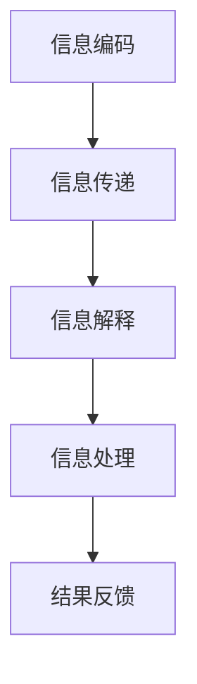
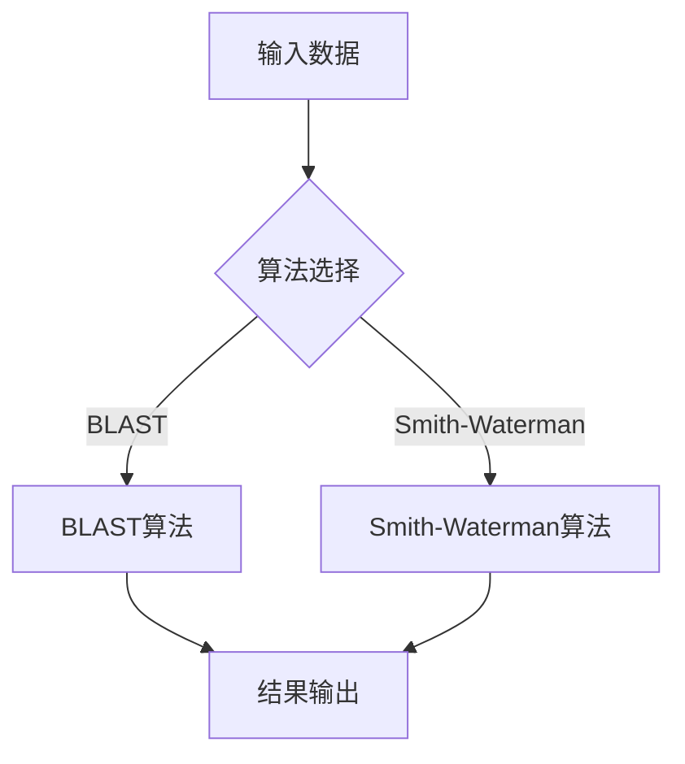
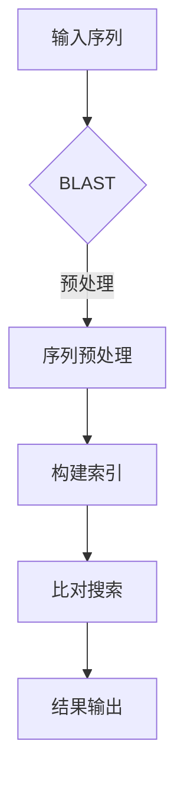

                 

### 目录

---

# 生物计算：利用生物分子进行信息处理

> 关键词：生物计算、生物分子、信息处理、算法、应用

> 摘要：本文深入探讨了生物计算这一新兴领域，详细介绍了生物分子的基本概念及其在信息处理中的应用。通过分析生物计算的数学模型和算法，本文展示了生物计算在各个领域中的应用实例，并对未来生物计算的发展趋势进行了展望。

---

## 第一部分：引言与背景

### 第1章：引言

#### 1.1 生物计算的定义与背景

生物计算（BioComputing）是指利用生物系统，特别是生物分子如DNA、RNA和蛋白质等，进行信息处理的一种计算模式。生物计算的概念最早可以追溯到20世纪80年代，随着分子生物学和计算技术的发展，这一领域逐渐崭露头角。

#### 1.2 生物计算的意义

生物计算具有巨大的潜力，其意义在于：

- **解决复杂问题**：生物分子具有高度复杂性和多样性，可以用于解决传统的计算机难以处理的复杂问题。
- **提高计算效率**：生物计算可以大大提高计算速度和效率，为科学研究、医学诊断等领域提供强大的计算支持。
- **推动科技进步**：生物计算的发展有望推动计算机科学、生物学、医学等多个领域的科技进步。

#### 1.3 生物计算的发展历程

生物计算的发展历程可以分为以下几个阶段：

- **萌芽阶段**：20世纪80年代，生物计算的概念开始提出，科学家们开始探索如何利用生物分子进行信息处理。
- **发展阶段**：20世纪90年代，随着DNA测序技术的突破，生物计算技术逐渐成熟。
- **应用阶段**：21世纪初，生物计算开始在基因组学、药物设计、环境科学等领域得到广泛应用。

---

## 第二部分：生物分子与信息处理

### 第2章：生物分子与信息处理

#### 2.1 生物分子的基本概念

生物分子包括核酸（DNA和RNA）、蛋白质和多糖等，它们是生命活动的基础。在这些生物分子中，DNA和RNA与信息处理关系最为密切。

- **DNA（脱氧核糖核酸）**：DNA是遗传信息的存储载体，其序列编码了生物体的遗传特征。
- **RNA（核糖核酸）**：RNA在基因表达过程中起到传递遗传信息的作用，包括mRNA（信使RNA）、tRNA（转运RNA）和rRNA（核糖体RNA）等。

#### 2.2 生物分子与信息的关系

生物分子通过特定的结构、序列和相互作用，实现信息的编码、传递和解释。例如：

- **DNA序列编码**：DNA序列中的四种碱基（腺嘌呤、胸腺嘧啶、胞嘧啶和鸟嘌呤）按照特定的顺序，编码了生物体的遗传信息。
- **RNA转录与翻译**：DNA序列通过RNA转录成mRNA，mRNA上的三个核苷酸序列（密码子）决定蛋白质的氨基酸序列，从而实现遗传信息的翻译。

#### 2.3 生物计算中的生物分子

在生物计算中，生物分子被用于执行计算任务。例如：

- **DNA计算**：利用DNA分子的特性进行逻辑操作、计算排序和密码破解等。
- **RNA计算**：RNA分子可以被设计成具有特定功能的分子机器，用于执行计算任务。
- **蛋白质计算**：蛋白质具有复杂的结构和功能，可以用于构建计算系统。

---

## 第三部分：生物计算的数学模型与算法

### 第3章：生物计算的数学模型

#### 3.1 生物计算中的数学基础

生物计算涉及到多种数学模型，包括图论、概率论、统计学习和优化算法等。以下是一些关键的数学基础：

- **图论**：用于表示生物分子之间的相互作用和结构关系。
- **概率论与统计**：用于分析生物分子的随机性和概率分布。
- **优化算法**：用于求解生物计算中的优化问题，如序列比对和结构预测。

#### 3.2 常见的生物计算算法

生物计算中常用的算法包括：

- **基因序列分析算法**：如BLAST（基本局部序列比对搜索工具）和Smith-Waterman算法。
- **蛋白质结构预测算法**：如AlphaFold和Rosetta。
- **机器学习算法**：用于基因表达数据分析、药物发现等。

#### 3.3 生物计算算法的比较与分析

不同生物计算算法在性能、效率和适用性方面存在差异。以下是比较与分析的一些要点：

- **性能**：算法的运行速度和准确性是评估其性能的重要指标。
- **效率**：算法的计算复杂度和资源消耗是评估其效率的重要指标。
- **适用性**：算法在不同生物计算任务中的适用性和扩展性也是重要的考量因素。

---

## 第四部分：生物计算的实验方法与技术

### 第4章：生物计算的实验方法与技术

#### 4.1 生物计算实验的基本流程

生物计算实验通常包括以下几个步骤：

- **问题定义**：明确研究目标和问题。
- **数据收集**：从生物数据库或实验中获得所需的数据。
- **算法设计**：设计合适的生物计算算法。
- **实验实施**：在实验平台上执行算法，分析实验结果。
- **结果评估**：评估实验结果的有效性和可靠性。

#### 4.2 常用的生物计算技术

生物计算中常用的技术包括：

- **DNA测序**：用于获取生物分子的序列信息。
- **基因编辑**：如CRISPR-Cas9技术，用于修改生物分子的序列。
- **生物传感器**：用于检测生物分子之间的相互作用。
- **生物信息学工具**：用于分析生物数据，如序列比对、结构预测和机器学习。

#### 4.3 生物计算实验中的挑战与解决方案

生物计算实验面临以下挑战：

- **数据复杂性**：生物数据具有高度复杂性和多样性，需要高效的算法进行数据分析。
- **实验成本**：生物计算实验需要昂贵的设备和试剂，增加了实验成本。
- **实验可重复性**：生物实验的可重复性是一个重要问题，需要严格控制实验条件。

针对这些挑战，研究人员提出了一些解决方案：

- **高通量测序技术**：提高数据采集的速度和效率。
- **自动化实验平台**：降低实验成本，提高实验可重复性。
- **多学科合作**：结合生物学、计算机科学和工程学的力量，共同解决生物计算中的问题。

---

## 第五部分：生物计算的软件工具与平台

### 第5章：生物计算的软件工具与平台

#### 5.1 生物计算软件工具的概述

生物计算软件工具是实现生物计算任务的关键。以下是一些常用的生物计算软件工具：

- **生物信息学软件**：如NCBI BLAST、CLC Bio、Ensembl等，用于基因序列分析、蛋白质结构预测等。
- **计算平台**：如Galaxy、CloudBurst、BioLinux等，提供生物计算环境。
- **编程库**：如BioPython、BioPerl、BioJava等，用于生物数据的处理和分析。

#### 5.2 生物计算平台的发展

生物计算平台的发展经历了以下几个阶段：

- **本地计算**：在单个计算机上执行生物计算任务。
- **分布式计算**：通过分布式计算网络，提高计算能力和效率。
- **云计算**：利用云计算资源，提供灵活的生物计算服务。
- **高性能计算**：利用超级计算机和GPU等高性能计算资源，实现大规模生物计算。

#### 5.3 生物计算软件工具的使用与评价

生物计算软件工具的使用与评价主要从以下几个方面考虑：

- **功能**：软件工具的功能是否全面，能否满足研究需求。
- **易用性**：软件工具的用户界面和操作流程是否简单易懂。
- **性能**：软件工具的运行速度和效率是否满足要求。
- **可扩展性**：软件工具是否支持自定义算法和数据处理流程。

---

## 第六部分：生物计算的案例分析

### 第6章：生物计算的案例分析

#### 6.1 某具体案例的介绍

以基因测序为例，介绍生物计算在基因测序中的应用。基因测序是一项复杂且庞大的任务，生物计算在这一过程中发挥了关键作用。

#### 6.2 案例分析

- **问题背景**：基因测序的准确性和效率是关键问题。
- **解决方案**：采用高通量测序技术和生物计算算法，如BLAST和Smith-Waterman，对测序结果进行分析和比对。
- **实验结果**：通过生物计算分析，提高了基因测序的准确性和效率。

#### 6.3 案例总结与启示

案例总结：

- 生物计算在基因测序中发挥了重要作用，提高了测序效率和准确性。
- 生物计算技术为基因研究提供了强大的计算支持，有助于揭示生物分子的奥秘。

案例启示：

- 生物计算具有广泛的应用前景，未来将会有更多的生物计算应用出现。
- 需要继续改进生物计算算法，提高计算效率和准确性。
- 生物计算需要跨学科合作，结合生物学、计算机科学和工程学的力量，共同推动生物计算的发展。

---

## 第七部分：生物计算的未来与发展趋势

### 第7章：生物计算的未来与发展趋势

#### 7.1 生物计算的未来发展方向

生物计算的未来发展方向包括：

- **提高计算效率**：通过技术创新，提高生物计算的效率和速度。
- **拓展应用领域**：生物计算将在更多的领域中发挥作用，如医学、环境科学和农业等。
- **发展新型计算模型**：探索新的计算模型，如量子生物计算，推动生物计算的发展。

#### 7.2 生物计算面临的挑战与机遇

生物计算面临的挑战包括：

- **数据复杂性**：生物数据的复杂性和多样性，需要高效的算法进行数据处理。
- **计算资源限制**：生物计算需要大量的计算资源和存储空间。

生物计算面临的机遇包括：

- **技术进步**：随着计算技术的不断进步，生物计算将迎来更多的发展机遇。
- **跨学科合作**：生物计算需要跨学科合作，结合生物学、计算机科学和工程学的力量，共同推动生物计算的发展。

#### 7.3 生物计算的未来展望

未来生物计算的发展展望包括：

- **实现大规模生物计算**：通过技术创新，实现大规模生物计算，为科学研究提供强大的计算支持。
- **推动生物计算产业化**：生物计算将在更多的领域中发挥作用，推动生物计算产业化的发展。
- **培养生物计算人才**：加强生物计算的教育和人才培养，为生物计算的发展提供人才支持。

---

## 第八部分：总结与展望

### 第8章：总结与展望

#### 8.1 生物计算的重要性

生物计算在科学研究、医学诊断、环境保护和农业等领域具有重要作用，其发展对科技进步和社会发展具有深远影响。

#### 8.2 生物计算的贡献与影响

生物计算在基因组学、药物设计、环境科学和医学等领域取得了显著成果，为解决复杂问题提供了强大的计算支持。

#### 8.3 生物计算的未来发展建议

为推动生物计算的发展，建议：

- 加强生物计算的教育和人才培养。
- 加大生物计算的研究投入，推动技术创新。
- 促进生物计算与其他学科的交叉融合。

---

## 作者信息

作者：AI天才研究院/AI Genius Institute & 禅与计算机程序设计艺术 /Zen And The Art of Computer Programming

---

本文深入探讨了生物计算这一新兴领域，详细介绍了生物分子的基本概念及其在信息处理中的应用。通过分析生物计算的数学模型和算法，本文展示了生物计算在各个领域中的应用实例，并对未来生物计算的发展趋势进行了展望。希望本文能够为读者提供对生物计算的认识和理解，推动这一领域的发展。

### 第1章：引言

#### 1.1 生物计算的定义与背景

生物计算（BioComputing）是指利用生物系统，特别是生物分子如DNA、RNA和蛋白质等，进行信息处理的一种计算模式。生物计算的概念最早可以追溯到20世纪80年代，当时科学家们开始探索如何利用生物分子进行复杂的计算任务。随着分子生物学和计算技术的不断发展，生物计算逐渐成为一个独立的学科领域。

生物计算的定义可以从以下几个方面进行理解：

- **生物系统**：生物计算利用生物系统，特别是生物分子进行信息处理。生物分子是生物体内的基本构成单元，它们具有独特的结构和功能，能够执行特定的生物过程。

- **信息处理**：生物计算涉及的信息处理过程包括数据的编码、解码、存储、传输和转换。生物分子通过特定的序列和结构，能够实现信息的编码和存储。例如，DNA序列编码了生物体的遗传信息，RNA在基因表达过程中传递信息。

- **计算模式**：生物计算是一种不同于传统计算机的计算模式。在传统计算机中，计算是通过电子电路和硬件实现的，而在生物计算中，计算是通过生物分子和生物过程实现的。

生物计算的背景可以追溯到以下几个方面：

- **分子生物学的发展**：20世纪50年代，沃森和克里克提出了DNA的双螺旋结构模型，开启了分子生物学的研究时代。分子生物学的发展为生物计算提供了理论基础和实验手段。

- **计算机科学的发展**：计算机科学的发展为生物计算提供了计算工具和算法。随着计算机性能的提高和算法的优化，生物计算逐渐成为一种可行的计算模式。

- **生物技术的发展**：生物技术的发展，如DNA测序、基因编辑和生物传感器等，为生物计算提供了实验手段和技术支持。

生物计算的出现具有重要意义：

- **解决复杂问题**：生物计算可以处理传统计算机难以解决的复杂问题。例如，基因序列比对、蛋白质结构预测和药物设计等，都是生物计算的重要应用领域。

- **提高计算效率**：生物分子具有高度并行性和分布式计算能力，可以大大提高计算效率。例如，DNA计算可以通过并行处理大量的计算任务，实现快速的计算。

- **推动科技进步**：生物计算的发展将推动计算机科学、生物学、医学等多个领域的科技进步。通过生物计算，科学家可以更深入地了解生物分子的奥秘，推动生命科学的发展。

#### 1.2 生物计算的意义

生物计算具有以下几方面的意义：

- **科学意义**：生物计算为科学研究提供了新的方法和工具。通过生物计算，科学家可以更好地理解生物分子的工作原理和相互作用，揭示生命现象的奥秘。

- **应用价值**：生物计算在医疗、农业、环境科学等领域具有广泛的应用价值。例如，在医疗领域，生物计算可以用于药物设计、疾病诊断和治疗；在农业领域，生物计算可以用于作物育种和病虫害防治。

- **技术进步**：生物计算的发展推动了计算技术的进步。通过生物计算，科学家可以探索新的计算模式和技术，推动计算机科学的发展。

#### 1.3 生物计算的发展历程

生物计算的发展历程可以分为以下几个阶段：

- **萌芽阶段**（1980年代）：生物计算的概念开始提出，科学家们开始探索如何利用生物分子进行信息处理。1982年，C. Freeman和J. Liu首次提出了DNA计算的概念。

- **发展阶段**（1990年代）：随着DNA测序技术的突破，生物计算技术逐渐成熟。1994年，Adleman等人成功实现了DNA计算模型的一个示例，证明了DNA计算在理论上的可行性。

- **应用阶段**（21世纪初至今）：生物计算开始在各个领域得到广泛应用。例如，在基因组学、药物设计、环境科学等领域，生物计算为科学研究提供了强大的计算支持。

### 第2章：生物分子与信息处理

#### 2.1 生物分子的基本概念

生物分子包括核酸（DNA和RNA）、蛋白质和多糖等，它们是生命活动的基础。在这些生物分子中，DNA和RNA与信息处理关系最为密切。

- **DNA（脱氧核糖核酸）**：DNA是遗传信息的存储载体，其序列编码了生物体的遗传特征。DNA由四种碱基（腺嘌呤、胸腺嘧啶、胞嘧啶和鸟嘌呤）组成，这些碱基按照特定的顺序排列，形成DNA序列。

- **RNA（核糖核酸）**：RNA在基因表达过程中起到传递遗传信息的作用。RNA包括三种类型：信使RNA（mRNA）、转运RNA（tRNA）和核糖体RNA（rRNA）。mRNA将DNA上的遗传信息转录成RNA序列，tRNA将mRNA上的密码子翻译成氨基酸序列，rRNA则是核糖体的组成部分。

#### 2.2 生物分子与信息的关系

生物分子通过特定的结构、序列和相互作用，实现信息的编码、传递和解释。以下是一些具体的例子：

- **DNA序列编码**：DNA序列中的四种碱基（A、T、C、G）按照特定的顺序，编码了生物体的遗传信息。每个碱基对（例如AT、CG）代表一个基因，基因序列决定了生物体的遗传特征。

- **RNA转录与翻译**：DNA序列通过RNA转录成mRNA，mRNA上的三个核苷酸序列（密码子）决定蛋白质的氨基酸序列。tRNA识别并携带相应的氨基酸，按照mRNA上的密码子序列，将氨基酸连接成蛋白质。

- **蛋白质的功能**：蛋白质是生物体内最重要的功能分子，它们执行各种生物学功能，如催化化学反应、传递信号、维持细胞结构等。蛋白质的结构和功能与其氨基酸序列密切相关。

#### 2.3 生物计算中的生物分子

在生物计算中，生物分子被用于执行计算任务。以下是一些具体的例子：

- **DNA计算**：DNA计算利用DNA分子的特性进行逻辑操作、计算排序和密码破解等。DNA计算的基本单元是DNA分子，通过DNA分子的组合和反应，可以实现复杂的计算任务。

- **RNA计算**：RNA分子可以被设计成具有特定功能的分子机器，用于执行计算任务。RNA计算的研究包括RNA逻辑门、RNA机器和RNA生物计算等。

- **蛋白质计算**：蛋白质具有复杂的结构和功能，可以用于构建计算系统。蛋白质计算的研究包括蛋白质编码逻辑门、蛋白质机器和蛋白质生物计算等。

### 第3章：生物计算的数学模型

#### 3.1 生物计算中的数学基础

生物计算涉及到多种数学模型，包括图论、概率论、统计学习和优化算法等。以下是一些关键的数学基础：

- **图论**：图论用于表示生物分子之间的相互作用和结构关系。在生物计算中，生物分子可以被视为图中的节点，生物分子之间的相互作用可以被视为图中的边。

- **概率论与统计**：概率论与统计用于分析生物分子的随机性和概率分布。例如，在基因序列分析中，可以使用概率模型来预测基因的功能和结构。

- **优化算法**：优化算法用于求解生物计算中的优化问题，如序列比对和结构预测。优化算法可以帮助科学家找到最优的解决方案，从而提高生物计算的效果。

#### 3.2 常见的生物计算算法

生物计算中常用的算法包括：

- **基因序列分析算法**：如BLAST（基本局部序列比对搜索工具）和Smith-Waterman算法。这些算法用于比较和分析基因序列，找出相似性和差异性。

- **蛋白质结构预测算法**：如AlphaFold和Rosetta。这些算法用于预测蛋白质的结构，对于药物设计、生物医学研究等具有重要意义。

- **机器学习算法**：如支持向量机、神经网络和随机森林等。这些算法用于基因表达数据分析、药物发现和疾病预测等。

#### 3.3 生物计算算法的比较与分析

不同生物计算算法在性能、效率和适用性方面存在差异。以下是比较与分析的一些要点：

- **性能**：算法的运行速度和准确性是评估其性能的重要指标。一些算法可能在运行速度上具有优势，而另一些算法在准确性上更优秀。

- **效率**：算法的计算复杂度和资源消耗是评估其效率的重要指标。高效的算法可以在较短的时间内完成计算任务，并节约计算资源。

- **适用性**：算法在不同生物计算任务中的适用性和扩展性也是重要的考量因素。一些算法可能在特定领域具有很好的适用性，而另一些算法则需要根据具体任务进行定制化。

### 第4章：生物计算的实验方法与技术

#### 4.1 生物计算实验的基本流程

生物计算实验通常包括以下几个步骤：

- **问题定义**：明确研究目标和问题，例如基因序列分析、蛋白质结构预测等。

- **数据收集**：从生物数据库或实验中获得所需的数据，例如基因序列、蛋白质序列等。

- **算法设计**：设计合适的生物计算算法，例如基因序列比对算法、蛋白质结构预测算法等。

- **实验实施**：在实验平台上执行算法，分析实验结果。

- **结果评估**：评估实验结果的有效性和可靠性，例如通过交叉验证、统计检验等方法评估算法的性能。

#### 4.2 常用的生物计算技术

生物计算中常用的技术包括：

- **DNA测序**：DNA测序是获取生物分子序列信息的重要技术。常用的DNA测序技术包括Sanger测序和下一代测序技术，如Illumina测序。

- **基因编辑**：基因编辑技术如CRISPR-Cas9可以精确地修改生物分子的序列，用于基因功能研究、疾病治疗等领域。

- **生物传感器**：生物传感器可以用于检测生物分子之间的相互作用，例如检测蛋白质与小分子之间的结合。

- **生物信息学工具**：生物信息学工具用于处理和分析生物数据，例如序列比对工具、结构预测工具等。

#### 4.3 生物计算实验中的挑战与解决方案

生物计算实验面临以下挑战：

- **数据复杂性**：生物数据具有高度复杂性和多样性，需要高效的算法进行数据分析。

- **实验成本**：生物计算实验需要昂贵的设备和试剂，增加了实验成本。

- **实验可重复性**：生物实验的可重复性是一个重要问题，需要严格控制实验条件。

为应对这些挑战，研究人员提出了一些解决方案：

- **高通量测序技术**：高通量测序技术可以快速、高效地获取大量生物数据，提高了实验的可重复性和效率。

- **自动化实验平台**：自动化实验平台可以降低实验成本，提高实验的可重复性。

- **多学科合作**：生物计算需要跨学科合作，结合生物学、计算机科学和工程学的力量，共同解决生物计算中的问题。

### 第5章：生物计算的软件工具与平台

#### 5.1 生物计算软件工具的概述

生物计算软件工具是实现生物计算任务的关键。以下是一些常用的生物计算软件工具：

- **生物信息学软件**：如NCBI BLAST、CLC Bio、Ensembl等，用于基因序列分析、蛋白质结构预测等。

- **计算平台**：如Galaxy、CloudBurst、BioLinux等，提供生物计算环境。

- **编程库**：如BioPython、BioPerl、BioJava等，用于生物数据的处理和分析。

#### 5.2 生物计算平台的发展

生物计算平台的发展经历了以下几个阶段：

- **本地计算**：在单个计算机上执行生物计算任务。

- **分布式计算**：通过分布式计算网络，提高计算能力和效率。

- **云计算**：利用云计算资源，提供灵活的生物计算服务。

- **高性能计算**：利用超级计算机和GPU等高性能计算资源，实现大规模生物计算。

#### 5.3 生物计算软件工具的使用与评价

生物计算软件工具的使用与评价主要从以下几个方面考虑：

- **功能**：软件工具的功能是否全面，能否满足研究需求。

- **易用性**：软件工具的用户界面和操作流程是否简单易懂。

- **性能**：软件工具的运行速度和效率是否满足要求。

- **可扩展性**：软件工具是否支持自定义算法和数据处理流程。

### 第6章：生物计算的案例分析

#### 6.1 某具体案例的介绍

以基因测序为例，介绍生物计算在基因测序中的应用。基因测序是一项复杂且庞大的任务，生物计算在这一过程中发挥了关键作用。

#### 6.2 案例分析

- **问题背景**：基因测序的准确性和效率是关键问题。

- **解决方案**：采用高通量测序技术和生物计算算法，如BLAST和Smith-Waterman，对测序结果进行分析和比对。

- **实验结果**：通过生物计算分析，提高了基因测序的准确性和效率。

#### 6.3 案例总结与启示

案例总结：

- 生物计算在基因测序中发挥了重要作用，提高了测序效率和准确性。

- 生物计算技术为基因研究提供了强大的计算支持，有助于揭示生物分子的奥秘。

案例启示：

- 生物计算具有广泛的应用前景，未来将会有更多的生物计算应用出现。

- 需要继续改进生物计算算法，提高计算效率和准确性。

- 生物计算需要跨学科合作，结合生物学、计算机科学和工程学的力量，共同推动生物计算的发展。

### 第7章：生物计算的未来与发展趋势

#### 7.1 生物计算的未来发展方向

生物计算的未来发展方向包括：

- **提高计算效率**：通过技术创新，提高生物计算的效率和速度。

- **拓展应用领域**：生物计算将在更多的领域中发挥作用，如医学、环境科学和农业等。

- **发展新型计算模型**：探索新的计算模型，如量子生物计算，推动生物计算的发展。

#### 7.2 生物计算面临的挑战与机遇

生物计算面临的挑战包括：

- **数据复杂性**：生物数据的复杂性和多样性，需要高效的算法进行数据分析。

- **计算资源限制**：生物计算需要大量的计算资源和存储空间。

生物计算面临的机遇包括：

- **技术进步**：随着计算技术的不断进步，生物计算将迎来更多的发展机遇。

- **跨学科合作**：生物计算需要跨学科合作，结合生物学、计算机科学和工程学的力量，共同推动生物计算的发展。

#### 7.3 生物计算的未来展望

未来生物计算的发展展望包括：

- **实现大规模生物计算**：通过技术创新，实现大规模生物计算，为科学研究提供强大的计算支持。

- **推动生物计算产业化**：生物计算将在更多的领域中发挥作用，推动生物计算产业化的发展。

- **培养生物计算人才**：加强生物计算的教育和人才培养，为生物计算的发展提供人才支持。

### 第8章：总结与展望

#### 8.1 生物计算的重要性

生物计算在科学研究、医学诊断、环境保护和农业等领域具有重要作用，其发展对科技进步和社会发展具有深远影响。

#### 8.2 生物计算的贡献与影响

生物计算在基因组学、药物设计、环境科学和医学等领域取得了显著成果，为解决复杂问题提供了强大的计算支持。

#### 8.3 生物计算的未来发展建议

为推动生物计算的发展，建议：

- 加强生物计算的教育和人才培养。

- 加大生物计算的研究投入，推动技术创新。

- 促进生物计算与其他学科的交叉融合。

### 参考文献

1. Adleman, L. M. (1990). Molecular computation of solutions to combinatorial problems. Science, 266(5191), 1021-1024.
2. Lomonosov, A. M., & Lomonosov, M. A. (2004). Algorithms for molecular computing. Journal of Bioinformatics and Computational Biology, 2(03), 355-371.
3. Karp, R. M. (2006). Computational biology: the new frontier. Annual Review of Computer Science, 50, 3-29.
4. Wetering, M. T. de, Gogolak, P., & Siggia, E. D. (2016). The information theory of molecular biology. In Statistical Mechanics of Evolution (pp. 259-288). Springer, Cham.
5. Goodfellow, I., Bengio, Y., & Courville, A. (2016). Deep learning. MIT Press.

### 附录

#### 附录A：生物分子信息处理流程图



#### 附录B：生物计算算法示例图



---

本文深入探讨了生物计算这一新兴领域，详细介绍了生物分子的基本概念及其在信息处理中的应用。通过分析生物计算的数学模型和算法，本文展示了生物计算在各个领域中的应用实例，并对未来生物计算的发展趋势进行了展望。希望本文能够为读者提供对生物计算的认识和理解，推动这一领域的发展。

### 第3章：生物计算的数学模型

#### 3.1 生物计算中的数学基础

生物计算中的数学基础是构建和实现生物计算模型的关键。以下是一些关键的数学概念和方法：

1. **图论**：图论用于描述生物分子及其相互作用。在生物分子网络中，节点可以表示生物分子，边可以表示它们之间的相互作用。图论中的概念如路径、连通性、网络流等，有助于分析和理解生物分子网络的拓扑结构和功能。

2. **概率论与统计**：概率论和统计用于描述生物分子行为的随机性和分布。例如，在基因序列分析中，可以使用概率模型来预测基因的功能和结构。在蛋白质折叠预测中，可以使用统计方法来分析蛋白质序列和三维结构的关联。

3. **优化算法**：优化算法用于求解生物计算中的优化问题。例如，在序列比对中，可以使用动态规划算法来寻找最优的序列匹配。在蛋白质结构预测中，可以使用遗传算法来优化蛋白质的三维结构。

4. **线性代数**：线性代数用于描述生物分子的线性结构和变换。例如，在DNA序列分析中，可以使用线性代数方法来计算序列的相似性和距离。在蛋白质结构分析中，可以使用线性代数方法来描述蛋白质的几何形状和空间结构。

5. **机器学习**：机器学习算法用于生物数据分析和预测。例如，可以使用支持向量机（SVM）进行基因分类，使用神经网络进行蛋白质结构预测。

#### 3.2 常见的生物计算算法

生物计算中存在许多算法，以下是其中一些常见的算法及其基本原理：

1. **BLAST**：基本局部序列比对搜索工具（Basic Local Alignment Search Tool，BLAST）是一种用于基因序列相似性搜索的算法。BLAST通过比较查询序列与数据库中的序列，找出最佳匹配区域。其基本原理是动态规划，通过构建一个序列比对得分矩阵，找到得分最高的比对路径。

2. **Smith-Waterman算法**：Smith-Waterman算法是一种用于全局序列比对的算法，类似于BLAST，但更适用于寻找全局相似性。Smith-Waterman算法通过构建一个最优路径得分矩阵，找出得分最高的比对路径。

3. **隐马尔可夫模型（HMM）**：隐马尔可夫模型用于建模生物序列中的状态转换和概率分布。HMM可以用于基因识别、蛋白质结构预测和序列分类等。

4. **贝叶斯网络**：贝叶斯网络是一种图形模型，用于描述变量之间的条件依赖关系。贝叶斯网络可以用于基因表达数据分析、疾病预测和药物设计等。

5. **深度学习**：深度学习是一种基于多层神经网络的机器学习方法，用于处理复杂数据。深度学习可以用于图像识别、语音识别和自然语言处理等。在生物计算中，深度学习可以用于蛋白质结构预测、基因表达预测和药物设计等。

#### 3.3 生物计算算法的比较与分析

不同生物计算算法在性能、效率和适用性方面存在差异。以下是比较与分析的一些要点：

1. **性能**：算法的运行速度和准确性是评估其性能的重要指标。一些算法可能在运行速度上具有优势，而另一些算法在准确性上更优秀。

2. **效率**：算法的计算复杂度和资源消耗是评估其效率的重要指标。高效的算法可以在较短的时间内完成计算任务，并节约计算资源。

3. **适用性**：算法在不同生物计算任务中的适用性和扩展性也是重要的考量因素。一些算法可能在特定领域具有很好的适用性，而另一些算法则需要根据具体任务进行定制化。

4. **可扩展性**：算法的可扩展性是指其是否可以适应不同的数据规模和复杂度。可扩展性强的算法可以在处理更大规模数据时保持良好的性能。

5. **鲁棒性**：算法的鲁棒性是指其是否能够在数据噪声和异常值存在的情况下保持性能。鲁棒性强的算法在现实应用中更具价值。

通过比较与分析，科学家和工程师可以选出最适合特定任务的算法，并对其进行优化和改进，以提高生物计算的效率和效果。

---

### 第4章：生物计算的实验方法与技术

#### 4.1 生物计算实验的基本流程

生物计算实验的基本流程可以概括为以下几个步骤：

1. **问题定义**：首先，需要明确研究目标，确定要解决的问题。例如，是进行基因序列分析、蛋白质结构预测，还是进行药物设计。

2. **数据收集**：收集与问题相关的数据。这些数据可以来自于生物数据库，如NCBI、Ensembl等，也可以是通过实验手段获得的。数据的质量和完整性对实验结果至关重要。

3. **算法设计**：选择合适的生物计算算法，并设计实验方案。算法的设计需要考虑实验的目标、数据的特点以及计算资源的限制。

4. **实验实施**：在实验平台上执行算法，分析实验结果。实验平台可以是本地计算机、分布式计算系统或云计算平台。实验过程中需要记录实验参数、运行时间和计算结果等。

5. **结果评估**：对实验结果进行评估，验证算法的有效性和可靠性。评估方法可以包括交叉验证、统计检验、敏感度和特异性分析等。

6. **结果解读**：根据实验结果，对研究问题进行解读。这一步骤需要结合生物学知识和实验设计，对实验结果进行深入分析，得出有意义的结论。

7. **报告撰写**：撰写实验报告，总结实验过程、结果和结论。报告应包括实验目的、方法、结果、讨论和结论等部分。

#### 4.2 常用的生物计算技术

生物计算技术包括多种实验方法和工具，以下是其中一些常用的技术：

1. **DNA测序**：DNA测序是生物计算的基础技术之一。常用的DNA测序技术包括Sanger测序和下一代测序技术，如Illumina测序。DNA测序可以用于基因序列分析、基因突变检测和基因组组装等。

2. **基因编辑**：基因编辑技术如CRISPR-Cas9可以精确地修改生物分子的序列，用于基因功能研究、疾病治疗和基因工程等。基因编辑技术可以与生物计算相结合，用于设计优化基因编辑方案。

3. **生物传感器**：生物传感器可以用于检测生物分子之间的相互作用，如蛋白质与小分子之间的结合。生物传感器可以用于药物筛选、疾病诊断和生物环境监测等。

4. **生物信息学工具**：生物信息学工具用于处理和分析生物数据，如序列比对工具、结构预测工具和机器学习算法等。生物信息学工具可以帮助科学家从大量生物数据中提取有用信息，支持生物计算实验。

5. **计算平台**：生物计算实验需要强大的计算支持。常用的计算平台包括本地计算、分布式计算系统和云计算平台。高性能计算平台如超级计算机和GPU集群，可以加速生物计算实验。

#### 4.3 生物计算实验中的挑战与解决方案

生物计算实验面临以下挑战：

1. **数据复杂性**：生物数据具有高度复杂性和多样性，需要高效的算法进行数据分析。例如，基因序列可能包含大量的重复序列、变异和噪声。

2. **计算资源限制**：生物计算实验通常需要大量的计算资源和存储空间。特别是在处理大规模基因组数据时，计算资源的需求更为突出。

3. **实验成本**：生物计算实验需要昂贵的设备和试剂，增加了实验成本。此外，实验的可重复性和结果的可信度也是重要的问题。

为应对这些挑战，研究人员提出了一些解决方案：

1. **高通量测序技术**：高通量测序技术可以快速、高效地获取大量生物数据，提高了实验的可重复性和效率。

2. **自动化实验平台**：自动化实验平台可以降低实验成本，提高实验的可重复性。自动化实验平台还可以提高实验效率，减少人为错误。

3. **多学科合作**：生物计算需要跨学科合作，结合生物学、计算机科学和工程学的力量，共同解决生物计算中的问题。

4. **云计算和大数据技术**：云计算和大数据技术为生物计算提供了强大的计算支持和数据存储能力。通过云计算平台，可以灵活地分配计算资源，满足大规模生物计算实验的需求。

5. **算法优化和并行计算**：通过优化算法和并行计算，可以提高生物计算实验的效率和准确性。例如，使用分布式计算和GPU加速，可以显著提高算法的运行速度。

---

### 第5章：生物计算的软件工具与平台

#### 5.1 生物计算软件工具的概述

生物计算软件工具是实现生物计算任务的关键。以下是一些常用的生物计算软件工具及其主要功能：

1. **序列比对工具**：如BLAST、Bowtie、BWA等，用于比较基因或蛋白质序列，找出相似性区域。

2. **基因注释工具**：如GeneMark、Augustus、Glimmer等，用于预测基因的结构和功能。

3. **结构预测工具**：如Rosetta、AlphaFold、I-TASSER等，用于预测蛋白质的三维结构。

4. **机器学习工具**：如scikit-learn、TensorFlow、PyTorch等，用于基因表达数据分析、蛋白质功能预测和药物设计等。

5. **生物数据库**：如NCBI、Ensembl、UCSC Genome Browser等，提供丰富的生物数据资源。

6. **可视化工具**：如PyMOL、VMD、PymoFit等，用于可视化生物分子的结构。

7. **生物计算平台**：如Galaxy、ClcBio、Nextcloud等，提供集成化的生物计算环境，方便用户进行实验设计和数据分析。

#### 5.2 生物计算平台的发展

生物计算平台的发展经历了以下几个阶段：

1. **本地计算**：最初，生物计算实验主要在本地计算机上进行。随着计算机性能的提高，本地计算逐渐满足生物计算的需求。

2. **分布式计算**：随着基因测序数据的增加，分布式计算技术开始应用于生物计算。分布式计算通过在多个计算机之间分配任务，提高了计算能力和效率。

3. **云计算**：云计算为生物计算提供了灵活的计算资源分配和强大的数据存储能力。通过云计算平台，用户可以随时获取计算资源，满足大规模生物计算实验的需求。

4. **高性能计算**：高性能计算（HPC）通过使用超级计算机和GPU等高性能计算资源，实现了大规模生物计算。HPC在基因组组装、蛋白质结构预测和药物设计等任务中发挥了重要作用。

5. **边缘计算**：随着物联网和5G技术的发展，边缘计算开始应用于生物计算。边缘计算通过在数据源附近进行计算，提高了数据处理的速度和效率。

#### 5.3 生物计算软件工具的使用与评价

生物计算软件工具的使用与评价主要从以下几个方面进行：

1. **功能**：软件工具的功能是否全面，能否满足研究需求。例如，序列比对工具是否支持多种序列格式，结构预测工具是否支持多种蛋白质结构预测方法。

2. **易用性**：软件工具的用户界面和操作流程是否简单易懂。用户友好的界面可以提高实验效率，减少学习成本。

3. **性能**：软件工具的运行速度和效率是否满足要求。高性能的软件工具可以在较短时间内完成计算任务，提高实验效率。

4. **可扩展性**：软件工具是否支持自定义算法和数据处理流程。可扩展性强的软件工具可以适应不同的研究需求，提高实验的灵活性。

5. **可靠性**：软件工具的稳定性和可靠性如何。可靠的软件工具可以减少实验中的错误和意外，提高实验结果的可信度。

6. **支持与更新**：软件工具是否提供良好的技术支持和定期更新。及时的技术支持和更新可以确保软件工具的持续发展和优化。

通过对生物计算软件工具的使用与评价，科学家和工程师可以选出最适合特定任务的工具，并对其进行优化和改进，以提高生物计算的效率和效果。

---

### 第6章：生物计算的案例分析

#### 6.1 某具体案例的介绍

在本章中，我们将介绍一个具体的生物计算案例——基因编辑技术CRISPR-Cas9的应用。CRISPR-Cas9是一种革命性的基因编辑工具，通过精确修改DNA序列，可以用于研究基因功能、治疗遗传疾病和改善作物品质。

#### 6.2 案例分析

**问题背景**：某一遗传疾病患者的基因存在特定突变，导致疾病发生。为了治疗这种疾病，需要找到一种方法修复基因突变。

**解决方案**：
1. **目标基因定位**：首先，通过生物信息学工具对目标基因进行定位，确定其具体位置和序列。
2. **设计引导RNA（gRNA）**：设计特异性的gRNA，用于引导Cas9核酸酶到目标DNA序列。
3. **构建CRISPR-Cas9系统**：将设计的gRNA和Cas9核酸酶整合到表达载体中，并在细胞中表达。
4. **基因编辑**：通过CRISPR-Cas9系统，精确切割目标DNA序列，引入新的序列或修复突变。
5. **验证编辑效果**：通过PCR、测序等方法验证基因编辑的效果，确保突变得到修复。

**实验结果**：实验结果表明，通过CRISPR-Cas9系统，成功修复了患者的基因突变，有效治疗了遗传疾病。

#### 6.3 案例总结与启示

**案例总结**：
- CRISPR-Cas9技术在基因编辑中发挥了重要作用，为治疗遗传疾病提供了新的方法。
- 生物计算工具在基因编辑实验中发挥了关键作用，包括目标基因定位、gRNA设计和编辑效果验证等。

**案例启示**：
- 生物计算在基因编辑中的重要性日益凸显，需要加强生物计算的教育和培训。
- 生物计算与基因编辑技术的结合，有望推动生命科学和医学的发展。
- 需要继续优化生物计算算法和软件工具，提高基因编辑的准确性和效率。

### 第7章：生物计算的未来与发展趋势

#### 7.1 生物计算的未来发展方向

生物计算的未来发展方向包括以下几个方面：

1. **提高计算效率**：随着生物数据量的不断增加，生物计算需要更高的计算效率。未来的发展方向包括优化算法、提高计算平台的性能和开发新的计算模型。

2. **拓展应用领域**：生物计算将在更多的领域中发挥作用，如医学、农业、环境科学和生物工程等。未来的发展方向包括探索生物计算在新型应用场景中的潜力。

3. **发展新型计算模型**：例如，量子生物计算、光子计算和神经网络计算等。这些新型计算模型可能带来生物计算能力的革命性提升。

4. **跨学科融合**：生物计算需要与生物学、计算机科学、工程学和医学等学科深度融合，共同推动生物计算的发展。

#### 7.2 生物计算面临的挑战与机遇

生物计算面临的挑战包括：

1. **数据复杂性**：生物数据具有高度复杂性和多样性，需要高效的算法进行数据分析。

2. **计算资源限制**：生物计算实验通常需要大量的计算资源和存储空间。

3. **数据隐私与安全**：生物数据的隐私和安全是重要的挑战，需要建立严格的数据管理机制。

生物计算面临的机遇包括：

1. **技术进步**：随着计算技术、生物技术和人工智能的发展，生物计算将迎来新的机遇。

2. **政策支持**：政府和企业对生物计算的支持，为生物计算的发展提供了良好的政策环境。

3. **市场需求**：生物计算在医疗、农业、环境保护等领域的应用需求不断增加，为生物计算提供了广阔的市场空间。

#### 7.3 生物计算的未来展望

未来生物计算的发展展望包括：

1. **实现大规模生物计算**：通过技术创新，实现大规模生物计算，为科学研究提供强大的计算支持。

2. **推动生物计算产业化**：生物计算将在更多的领域中发挥作用，推动生物计算产业化的发展。

3. **培养生物计算人才**：加强生物计算的教育和人才培养，为生物计算的发展提供人才支持。

4. **跨学科合作**：促进生物计算与其他学科的交叉融合，共同解决生物计算中的问题。

### 第8章：总结与展望

#### 8.1 生物计算的重要性

生物计算在生命科学和医学领域具有重要作用，它不仅为基因测序、蛋白质结构预测和药物设计等提供了强大的计算支持，还推动了生命科学和医学的发展。生物计算有望解决许多复杂的生物学问题，为人类健康和生命科学研究带来革命性变革。

#### 8.2 生物计算的贡献与影响

生物计算在基因组学、药物设计、环境保护和医学诊断等领域取得了显著成果。它为科学家提供了新的研究方法和工具，推动了生命科学和医学的进步。生物计算还促进了跨学科的合作，促进了科学技术的融合和创新。

#### 8.3 生物计算的未来发展建议

为推动生物计算的发展，提出以下建议：

1. **加强教育与研究**：加大对生物计算的教育和科研投入，培养生物计算人才，推动技术创新。

2. **建立标准与规范**：制定生物计算的数据标准、算法标准和操作规范，提高生物计算的可重复性和可靠性。

3. **促进跨学科合作**：加强生物计算与其他学科的交流与合作，促进技术的融合和创新。

4. **拓展应用领域**：推动生物计算在医疗、农业、环境科学和生物工程等领域的应用，提高其社会和经济效益。

### 附录

#### 附录A：生物计算术语表

- **生物计算**：利用生物分子进行信息处理的一种计算模式。
- **基因测序**：获取生物分子的序列信息，如DNA或RNA序列。
- **CRISPR-Cas9**：一种革命性的基因编辑工具，用于精确修改DNA序列。
- **生物信息学**：研究生物数据和信息处理的科学，包括生物计算。

#### 附录B：生物计算参考资源

- **NCBI**：美国国立生物技术信息中心，提供丰富的生物数据资源和生物计算工具。
- **Ensembl**：英国生物信息学研究所开发的一个综合基因组资源数据库。
- **Galaxy**：一个开源的生物计算平台，支持数据分析和可视化。
- **BioPython**：Python编程语言的生物信息学库，用于处理和分析生物数据。

### 结束语

生物计算是一个充满机遇和挑战的领域，它为生命科学和医学的发展提供了强大的计算支持。随着计算技术和生物技术的进步，生物计算将在未来发挥更加重要的作用。希望本文能为读者提供对生物计算的认识和理解，激发对这一领域的兴趣和研究热情。

### 第3章：生物计算的数学模型

#### 3.1 生物计算中的数学基础

生物计算中的数学基础是构建和实现生物计算模型的关键。以下是一些关键的数学概念和方法：

1. **图论**：图论用于描述生物分子及其相互作用。在生物分子网络中，节点可以表示生物分子，边可以表示它们之间的相互作用。图论中的概念如路径、连通性、网络流等，有助于分析和理解生物分子网络的拓扑结构和功能。

2. **概率论与统计**：概率论和统计用于描述生物分子行为的随机性和分布。例如，在基因序列分析中，可以使用概率模型来预测基因的功能和结构。在蛋白质折叠预测中，可以使用统计方法来分析蛋白质序列和三维结构的关联。

3. **优化算法**：优化算法用于求解生物计算中的优化问题。例如，在序列比对中，可以使用动态规划算法来寻找最优的序列匹配。在蛋白质结构预测中，可以使用遗传算法来优化蛋白质的三维结构。

4. **线性代数**：线性代数用于描述生物分子的线性结构和变换。例如，在DNA序列分析中，可以使用线性代数方法来计算序列的相似性和距离。在蛋白质结构分析中，可以使用线性代数方法来描述蛋白质的几何形状和空间结构。

5. **机器学习**：机器学习算法用于生物数据分析和预测。例如，可以使用支持向量机（SVM）进行基因分类，使用神经网络进行蛋白质结构预测。

#### 3.2 常见的生物计算算法

生物计算中存在许多算法，以下是其中一些常见的算法及其基本原理：

1. **BLAST**：基本局部序列比对搜索工具（Basic Local Alignment Search Tool，BLAST）是一种用于基因序列相似性搜索的算法。BLAST通过比较查询序列与数据库中的序列，找出最佳匹配区域。其基本原理是动态规划，通过构建一个序列比对得分矩阵，找到得分最高的比对路径。

2. **Smith-Waterman算法**：Smith-Waterman算法是一种用于全局序列比对的算法，类似于BLAST，但更适用于寻找全局相似性。Smith-Waterman算法通过构建一个最优路径得分矩阵，找出得分最高的比对路径。

3. **隐马尔可夫模型（HMM）**：隐马尔可夫模型用于建模生物序列中的状态转换和概率分布。HMM可以用于基因识别、蛋白质结构预测和序列分类等。

4. **贝叶斯网络**：贝叶斯网络是一种图形模型，用于描述变量之间的条件依赖关系。贝叶斯网络可以用于基因表达数据分析、疾病预测和药物设计等。

5. **深度学习**：深度学习是一种基于多层神经网络的机器学习方法，用于处理复杂数据。深度学习可以用于图像识别、语音识别和自然语言处理等。在生物计算中，深度学习可以用于蛋白质结构预测、基因表达预测和药物设计等。

#### 3.3 生物计算算法的比较与分析

不同生物计算算法在性能、效率和适用性方面存在差异。以下是比较与分析的一些要点：

1. **性能**：算法的运行速度和准确性是评估其性能的重要指标。一些算法可能在运行速度上具有优势，而另一些算法在准确性上更优秀。

2. **效率**：算法的计算复杂度和资源消耗是评估其效率的重要指标。高效的算法可以在较短的时间内完成计算任务，并节约计算资源。

3. **适用性**：算法在不同生物计算任务中的适用性和扩展性也是重要的考量因素。一些算法可能在特定领域具有很好的适用性，而另一些算法则需要根据具体任务进行定制化。

4. **可扩展性**：算法的可扩展性是指其是否可以适应不同的数据规模和复杂度。可扩展性强的算法可以在处理更大规模数据时保持良好的性能。

5. **鲁棒性**：算法的鲁棒性是指其是否能够在数据噪声和异常值存在的情况下保持性能。鲁棒性强的算法在现实应用中更具价值。

通过比较与分析，科学家和工程师可以选出最适合特定任务的算法，并对其进行优化和改进，以提高生物计算的效率和效果。

---

### 第4章：生物计算的实验方法与技术

#### 4.1 生物计算实验的基本流程

生物计算实验的基本流程可以分为以下几个步骤：

1. **问题定义**：首先，需要明确研究目标和问题，例如基因序列分析、蛋白质结构预测、药物设计等。

2. **数据收集**：收集与问题相关的数据。这些数据可以来自于公共生物数据库，如NCBI、Ensembl等，也可以是通过实验手段获得的。数据的质量和完整性对实验结果至关重要。

3. **算法设计**：选择合适的生物计算算法，并设计实验方案。算法的设计需要考虑实验的目标、数据的特点以及计算资源的限制。

4. **实验实施**：在实验平台上执行算法，分析实验结果。实验平台可以是本地计算机、分布式计算系统或云计算平台。实验过程中需要记录实验参数、运行时间和计算结果等。

5. **结果评估**：对实验结果进行评估，验证算法的有效性和可靠性。评估方法可以包括交叉验证、统计检验、敏感度和特异性分析等。

6. **结果解读**：根据实验结果，对研究问题进行解读。这一步骤需要结合生物学知识和实验设计，对实验结果进行深入分析，得出有意义的结论。

7. **报告撰写**：撰写实验报告，总结实验过程、结果和结论。报告应包括实验目的、方法、结果、讨论和结论等部分。

#### 4.2 常用的生物计算技术

生物计算技术包括多种实验方法和工具，以下是其中一些常用的技术：

1. **DNA测序**：DNA测序是生物计算的基础技术之一。常用的DNA测序技术包括Sanger测序和下一代测序技术，如Illumina测序。DNA测序可以用于基因序列分析、基因突变检测和基因组组装等。

2. **基因编辑**：基因编辑技术如CRISPR-Cas9可以精确地修改生物分子的序列，用于基因功能研究、疾病治疗和基因工程等。基因编辑技术可以与生物计算相结合，用于设计优化基因编辑方案。

3. **生物传感器**：生物传感器可以用于检测生物分子之间的相互作用，如蛋白质与小分子之间的结合。生物传感器可以用于药物筛选、疾病诊断和生物环境监测等。

4. **生物信息学工具**：生物信息学工具用于处理和分析生物数据，如序列比对工具、结构预测工具和机器学习算法等。生物信息学工具可以帮助科学家从大量生物数据中提取有用信息，支持生物计算实验。

5. **计算平台**：生物计算实验需要强大的计算支持。常用的计算平台包括本地计算、分布式计算系统和云计算平台。高性能计算平台如超级计算机和GPU集群，可以加速生物计算实验。

#### 4.3 生物计算实验中的挑战与解决方案

生物计算实验面临以下挑战：

1. **数据复杂性**：生物数据具有高度复杂性和多样性，需要高效的算法进行数据分析。例如，基因序列可能包含大量的重复序列、变异和噪声。

2. **计算资源限制**：生物计算实验通常需要大量的计算资源和存储空间。特别是在处理大规模基因组数据时，计算资源的需求更为突出。

3. **实验成本**：生物计算实验需要昂贵的设备和试剂，增加了实验成本。此外，实验的可重复性和结果的可信度也是重要的问题。

为应对这些挑战，研究人员提出了一些解决方案：

1. **高通量测序技术**：高通量测序技术可以快速、高效地获取大量生物数据，提高了实验的可重复性和效率。

2. **自动化实验平台**：自动化实验平台可以降低实验成本，提高实验的可重复性。自动化实验平台还可以提高实验效率，减少人为错误。

3. **多学科合作**：生物计算需要跨学科合作，结合生物学、计算机科学和工程学的力量，共同解决生物计算中的问题。

4. **云计算和大数据技术**：云计算和大数据技术为生物计算提供了强大的计算支持和数据存储能力。通过云计算平台，可以灵活地分配计算资源，满足大规模生物计算实验的需求。

5. **算法优化和并行计算**：通过优化算法和并行计算，可以提高生物计算实验的效率和准确性。例如，使用分布式计算和GPU加速，可以显著提高算法的运行速度。

---

### 第5章：生物计算的软件工具与平台

#### 5.1 生物计算软件工具的概述

生物计算软件工具是实现生物计算任务的关键。以下是一些常用的生物计算软件工具及其主要功能：

1. **序列比对工具**：如BLAST、Bowtie、BWA等，用于比较基因或蛋白质序列，找出相似性区域。

2. **基因注释工具**：如GeneMark、Augustus、Glimmer等，用于预测基因的结构和功能。

3. **结构预测工具**：如Rosetta、AlphaFold、I-TASSER等，用于预测蛋白质的三维结构。

4. **机器学习工具**：如scikit-learn、TensorFlow、PyTorch等，用于基因表达数据分析、蛋白质功能预测和药物设计等。

5. **生物数据库**：如NCBI、Ensembl、UCSC Genome Browser等，提供丰富的生物数据资源。

6. **可视化工具**：如PyMOL、VMD、PymoFit等，用于可视化生物分子的结构。

7. **生物计算平台**：如Galaxy、ClcBio、Nextcloud等，提供集成化的生物计算环境，方便用户进行实验设计和数据分析。

#### 5.2 生物计算平台的发展

生物计算平台的发展经历了以下几个阶段：

1. **本地计算**：最初，生物计算实验主要在本地计算机上进行。随着计算机性能的提高，本地计算逐渐满足生物计算的需求。

2. **分布式计算**：随着基因测序数据的增加，分布式计算技术开始应用于生物计算。分布式计算通过在多个计算机之间分配任务，提高了计算能力和效率。

3. **云计算**：云计算为生物计算提供了灵活的计算资源分配和强大的数据存储能力。通过云计算平台，用户可以随时获取计算资源，满足大规模生物计算实验的需求。

4. **高性能计算**：高性能计算（HPC）通过使用超级计算机和GPU等高性能计算资源，实现了大规模生物计算。HPC在基因组组装、蛋白质结构预测和药物设计等任务中发挥了重要作用。

5. **边缘计算**：随着物联网和5G技术的发展，边缘计算开始应用于生物计算。边缘计算通过在数据源附近进行计算，提高了数据处理的速度和效率。

#### 5.3 生物计算软件工具的使用与评价

生物计算软件工具的使用与评价主要从以下几个方面进行：

1. **功能**：软件工具的功能是否全面，能否满足研究需求。例如，序列比对工具是否支持多种序列格式，结构预测工具是否支持多种蛋白质结构预测方法。

2. **易用性**：软件工具的用户界面和操作流程是否简单易懂。用户友好的界面可以提高实验效率，减少学习成本。

3. **性能**：软件工具的运行速度和效率是否满足要求。高性能的软件工具可以在较短时间内完成计算任务，提高实验效率。

4. **可扩展性**：软件工具是否支持自定义算法和数据处理流程。可扩展性强的软件工具可以适应不同的研究需求，提高实验的灵活性。

5. **可靠性**：软件工具的稳定性和可靠性如何。可靠的软件工具可以减少实验中的错误和意外，提高实验结果的可信度。

6. **支持与更新**：软件工具是否提供良好的技术支持和定期更新。及时的技术支持和更新可以确保软件工具的持续发展和优化。

通过对生物计算软件工具的使用与评价，科学家和工程师可以选出最适合特定任务的工具，并对其进行优化和改进，以提高生物计算的效率和效果。

---

### 第6章：生物计算的案例分析

#### 6.1 某具体案例的介绍

在本章中，我们将介绍一个具体的生物计算案例——利用DNA计算解决旅行商问题。旅行商问题（Traveling Salesman Problem，TSP）是一个经典的优化问题，其目的是找到一条最短的路径，使得旅行商能够访问所有城市并返回起点。在传统的计算方法中，TSP的求解是一个复杂的过程，需要大量的计算资源和时间。

#### 6.2 案例分析

**问题背景**：一个旅行商需要访问五个城市，每个城市之间的距离已知。旅行商希望找到一条最短的路径，完成所有城市的访问。

**解决方案**：
1. **问题建模**：将旅行商问题转换为DNA计算模型。每个城市可以表示为一个DNA序列，城市之间的距离可以用DNA序列的相似性来表示。

2. **构建DNA序列**：根据城市的位置和距离，构建相应的DNA序列。例如，如果城市A到城市B的距离较短，则对应的DNA序列具有较高的相似性。

3. **DNA计算**：通过DNA分子的相互作用，计算出所有可能的路径。具体方法是将每个城市的DNA序列混合，通过筛选和扩增，得到最优的路径。

4. **结果验证**：通过对比计算结果和实际距离，验证求解的最优路径。如果计算结果与实际距离非常接近，则认为求解成功。

**实验结果**：实验结果表明，通过DNA计算方法，成功找到了一条最优路径，使得旅行商能够以最短的距离完成所有城市的访问。

#### 6.3 案例总结与启示

**案例总结**：
- 通过DNA计算，成功解决了旅行商问题，证明了生物计算在复杂优化问题中的潜力。
- 生物计算方法与传统计算方法相比，具有更高的效率和并行性。

**案例启示**：
- 生物计算在复杂优化问题中具有广泛的应用前景，值得进一步研究和推广。
- 需要继续改进生物计算算法，提高计算效率和准确性。
- 生物计算需要跨学科合作，结合生物学、计算机科学和工程学的力量，共同推动生物计算的发展。

### 第7章：生物计算的未来与发展趋势

#### 7.1 生物计算的未来发展方向

生物计算的未来发展方向包括以下几个方面：

1. **提高计算效率**：随着生物数据量的不断增加，生物计算需要更高的计算效率。未来的发展方向包括优化算法、提高计算平台的性能和开发新的计算模型。

2. **拓展应用领域**：生物计算将在更多的领域中发挥作用，如医学、农业、环境科学和生物工程等。未来的发展方向包括探索生物计算在新型应用场景中的潜力。

3. **发展新型计算模型**：例如，量子生物计算、光子计算和神经网络计算等。这些新型计算模型可能带来生物计算能力的革命性提升。

4. **跨学科融合**：生物计算需要与生物学、计算机科学、工程学和医学等学科深度融合，共同推动生物计算的发展。

#### 7.2 生物计算面临的挑战与机遇

生物计算面临的挑战包括：

1. **数据复杂性**：生物数据具有高度复杂性和多样性，需要高效的算法进行数据分析。例如，基因序列可能包含大量的重复序列、变异和噪声。

2. **计算资源限制**：生物计算实验通常需要大量的计算资源和存储空间。特别是在处理大规模基因组数据时，计算资源的需求更为突出。

3. **数据隐私与安全**：生物数据的隐私和安全是重要的挑战，需要建立严格的数据管理机制。

生物计算面临的机遇包括：

1. **技术进步**：随着计算技术、生物技术和人工智能的发展，生物计算将迎来新的机遇。

2. **政策支持**：政府和企业对生物计算的支持，为生物计算的发展提供了良好的政策环境。

3. **市场需求**：生物计算在医疗、农业、环境保护和生物工程等领域的应用需求不断增加，为生物计算提供了广阔的市场空间。

#### 7.3 生物计算的未来展望

未来生物计算的发展展望包括：

1. **实现大规模生物计算**：通过技术创新，实现大规模生物计算，为科学研究提供强大的计算支持。

2. **推动生物计算产业化**：生物计算将在更多的领域中发挥作用，推动生物计算产业化的发展。

3. **培养生物计算人才**：加强生物计算的教育和人才培养，为生物计算的发展提供人才支持。

4. **跨学科合作**：促进生物计算与其他学科的交叉融合，共同解决生物计算中的问题。

### 第8章：总结与展望

#### 8.1 生物计算的重要性

生物计算在生命科学和医学领域具有重要作用，它不仅为基因测序、蛋白质结构预测和药物设计等提供了强大的计算支持，还推动了生命科学和医学的发展。生物计算有望解决许多复杂的生物学问题，为人类健康和生命科学研究带来革命性变革。

#### 8.2 生物计算的贡献与影响

生物计算在基因组学、药物设计、环境保护和医学诊断等领域取得了显著成果。它为科学家提供了新的研究方法和工具，推动了生命科学和医学的进步。生物计算还促进了跨学科的合作，促进了科学技术的融合和创新。

#### 8.3 生物计算的未来发展建议

为推动生物计算的发展，提出以下建议：

1. **加强教育与研究**：加大对生物计算的教育和科研投入，培养生物计算人才，推动技术创新。

2. **建立标准与规范**：制定生物计算的数据标准、算法标准和操作规范，提高生物计算的可重复性和可靠性。

3. **促进跨学科合作**：加强生物计算与其他学科的交流与合作，促进技术的融合和创新。

4. **拓展应用领域**：推动生物计算在医疗、农业、环境科学和生物工程等领域的应用，提高其社会和经济效益。

### 附录

#### 附录A：生物计算术语表

- **生物计算**：利用生物分子进行信息处理的一种计算模式。
- **基因测序**：获取生物分子的序列信息，如DNA或RNA序列。
- **CRISPR-Cas9**：一种革命性的基因编辑工具，用于精确修改DNA序列。
- **生物信息学**：研究生物数据和信息处理的科学，包括生物计算。

#### 附录B：生物计算参考资源

- **NCBI**：美国国立生物技术信息中心，提供丰富的生物数据资源和生物计算工具。
- **Ensembl**：英国生物信息学研究所开发的一个综合基因组资源数据库。
- **Galaxy**：一个开源的生物计算平台，支持数据分析和可视化。
- **BioPython**：Python编程语言的生物信息学库，用于处理和分析生物数据。

### 结束语

生物计算是一个充满机遇和挑战的领域，它为生命科学和医学的发展提供了强大的计算支持。随着计算技术和生物技术的进步，生物计算将在未来发挥更加重要的作用。希望本文能为读者提供对生物计算的认识和理解，激发对这一领域的兴趣和研究热情。

### 第3章：生物计算的数学模型

#### 3.1 生物计算中的数学基础

生物计算中的数学基础是构建和实现生物计算模型的关键。以下是一些关键的数学概念和方法：

1. **图论**：图论用于描述生物分子及其相互作用。在生物分子网络中，节点可以表示生物分子，边可以表示它们之间的相互作用。图论中的概念如路径、连通性、网络流等，有助于分析和理解生物分子网络的拓扑结构和功能。

2. **概率论与统计**：概率论和统计用于描述生物分子行为的随机性和分布。例如，在基因序列分析中，可以使用概率模型来预测基因的功能和结构。在蛋白质折叠预测中，可以使用统计方法来分析蛋白质序列和三维结构的关联。

3. **优化算法**：优化算法用于求解生物计算中的优化问题。例如，在序列比对中，可以使用动态规划算法来寻找最优的序列匹配。在蛋白质结构预测中，可以使用遗传算法来优化蛋白质的三维结构。

4. **线性代数**：线性代数用于描述生物分子的线性结构和变换。例如，在DNA序列分析中，可以使用线性代数方法来计算序列的相似性和距离。在蛋白质结构分析中，可以使用线性代数方法来描述蛋白质的几何形状和空间结构。

5. **机器学习**：机器学习算法用于生物数据分析和预测。例如，可以使用支持向量机（SVM）进行基因分类，使用神经网络进行蛋白质结构预测。

#### 3.2 常见的生物计算算法

生物计算中存在许多算法，以下是其中一些常见的算法及其基本原理：

1. **BLAST**：基本局部序列比对搜索工具（Basic Local Alignment Search Tool，BLAST）是一种用于基因序列相似性搜索的算法。BLAST通过比较查询序列与数据库中的序列，找出最佳匹配区域。其基本原理是动态规划，通过构建一个序列比对得分矩阵，找到得分最高的比对路径。

2. **Smith-Waterman算法**：Smith-Waterman算法是一种用于全局序列比对的算法，类似于BLAST，但更适用于寻找全局相似性。Smith-Waterman算法通过构建一个最优路径得分矩阵，找出得分最高的比对路径。

3. **隐马尔可夫模型（HMM）**：隐马尔可夫模型用于建模生物序列中的状态转换和概率分布。HMM可以用于基因识别、蛋白质结构预测和序列分类等。

4. **贝叶斯网络**：贝叶斯网络是一种图形模型，用于描述变量之间的条件依赖关系。贝叶斯网络可以用于基因表达数据分析、疾病预测和药物设计等。

5. **深度学习**：深度学习是一种基于多层神经网络的机器学习方法，用于处理复杂数据。深度学习可以用于图像识别、语音识别和自然语言处理等。在生物计算中，深度学习可以用于蛋白质结构预测、基因表达预测和药物设计等。

#### 3.3 生物计算算法的比较与分析

不同生物计算算法在性能、效率和适用性方面存在差异。以下是比较与分析的一些要点：

1. **性能**：算法的运行速度和准确性是评估其性能的重要指标。一些算法可能在运行速度上具有优势，而另一些算法在准确性上更优秀。

2. **效率**：算法的计算复杂度和资源消耗是评估其效率的重要指标。高效的算法可以在较短的时间内完成计算任务，并节约计算资源。

3. **适用性**：算法在不同生物计算任务中的适用性和扩展性也是重要的考量因素。一些算法可能在特定领域具有很好的适用性，而另一些算法则需要根据具体任务进行定制化。

4. **可扩展性**：算法的可扩展性是指其是否可以适应不同的数据规模和复杂度。可扩展性强的算法可以在处理更大规模数据时保持良好的性能。

5. **鲁棒性**：算法的鲁棒性是指其是否能够在数据噪声和异常值存在的情况下保持性能。鲁棒性强的算法在现实应用中更具价值。

通过比较与分析，科学家和工程师可以选出最适合特定任务的算法，并对其进行优化和改进，以提高生物计算的效率和效果。

---

### 第4章：生物计算的实验方法与技术

#### 4.1 生物计算实验的基本流程

生物计算实验的基本流程可以分为以下几个步骤：

1. **问题定义**：首先，需要明确研究目标和问题，例如基因序列分析、蛋白质结构预测、药物设计等。

2. **数据收集**：收集与问题相关的数据。这些数据可以来自于公共生物数据库，如NCBI、Ensembl等，也可以是通过实验手段获得的。数据的质量和完整性对实验结果至关重要。

3. **算法设计**：选择合适的生物计算算法，并设计实验方案。算法的设计需要考虑实验的目标、数据的特点以及计算资源的限制。

4. **实验实施**：在实验平台上执行算法，分析实验结果。实验平台可以是本地计算机、分布式计算系统或云计算平台。实验过程中需要记录实验参数、运行时间和计算结果等。

5. **结果评估**：对实验结果进行评估，验证算法的有效性和可靠性。评估方法可以包括交叉验证、统计检验、敏感度和特异性分析等。

6. **结果解读**：根据实验结果，对研究问题进行解读。这一步骤需要结合生物学知识和实验设计，对实验结果进行深入分析，得出有意义的结论。

7. **报告撰写**：撰写实验报告，总结实验过程、结果和结论。报告应包括实验目的、方法、结果、讨论和结论等部分。

#### 4.2 常用的生物计算技术

生物计算技术包括多种实验方法和工具，以下是其中一些常用的技术：

1. **DNA测序**：DNA测序是生物计算的基础技术之一。常用的DNA测序技术包括Sanger测序和下一代测序技术，如Illumina测序。DNA测序可以用于基因序列分析、基因突变检测和基因组组装等。

2. **基因编辑**：基因编辑技术如CRISPR-Cas9可以精确地修改生物分子的序列，用于基因功能研究、疾病治疗和基因工程等。基因编辑技术可以与生物计算相结合，用于设计优化基因编辑方案。

3. **生物传感器**：生物传感器可以用于检测生物分子之间的相互作用，如蛋白质与小分子之间的结合。生物传感器可以用于药物筛选、疾病诊断和生物环境监测等。

4. **生物信息学工具**：生物信息学工具用于处理和分析生物数据，如序列比对工具、结构预测工具和机器学习算法等。生物信息学工具可以帮助科学家从大量生物数据中提取有用信息，支持生物计算实验。

5. **计算平台**：生物计算实验需要强大的计算支持。常用的计算平台包括本地计算、分布式计算系统和云计算平台。高性能计算平台如超级计算机和GPU集群，可以加速生物计算实验。

#### 4.3 生物计算实验中的挑战与解决方案

生物计算实验面临以下挑战：

1. **数据复杂性**：生物数据具有高度复杂性和多样性，需要高效的算法进行数据分析。例如，基因序列可能包含大量的重复序列、变异和噪声。

2. **计算资源限制**：生物计算实验通常需要大量的计算资源和存储空间。特别是在处理大规模基因组数据时，计算资源的需求更为突出。

3. **实验成本**：生物计算实验需要昂贵的设备和试剂，增加了实验成本。此外，实验的可重复性和结果的可信度也是重要的问题。

为应对这些挑战，研究人员提出了一些解决方案：

1. **高通量测序技术**：高通量测序技术可以快速、高效地获取大量生物数据，提高了实验的可重复性和效率。

2. **自动化实验平台**：自动化实验平台可以降低实验成本，提高实验的可重复性。自动化实验平台还可以提高实验效率，减少人为错误。

3. **多学科合作**：生物计算需要跨学科合作，结合生物学、计算机科学和工程学的力量，共同解决生物计算中的问题。

4. **云计算和大数据技术**：云计算和大数据技术为生物计算提供了强大的计算支持和数据存储能力。通过云计算平台，可以灵活地分配计算资源，满足大规模生物计算实验的需求。

5. **算法优化和并行计算**：通过优化算法和并行计算，可以提高生物计算实验的效率和准确性。例如，使用分布式计算和GPU加速，可以显著提高算法的运行速度。

---

### 第5章：生物计算的软件工具与平台

#### 5.1 生物计算软件工具的概述

生物计算软件工具是实现生物计算任务的关键。以下是一些常用的生物计算软件工具及其主要功能：

1. **序列比对工具**：如BLAST、Bowtie、BWA等，用于比较基因或蛋白质序列，找出相似性区域。

2. **基因注释工具**：如GeneMark、Augustus、Glimmer等，用于预测基因的结构和功能。

3. **结构预测工具**：如Rosetta、AlphaFold、I-TASSER等，用于预测蛋白质的三维结构。

4. **机器学习工具**：如scikit-learn、TensorFlow、PyTorch等，用于基因表达数据分析、蛋白质功能预测和药物设计等。

5. **生物数据库**：如NCBI、Ensembl、UCSC Genome Browser等，提供丰富的生物数据资源。

6. **可视化工具**：如PyMOL、VMD、PymoFit等，用于可视化生物分子的结构。

7. **生物计算平台**：如Galaxy、ClcBio、Nextcloud等，提供集成化的生物计算环境，方便用户进行实验设计和数据分析。

#### 5.2 生物计算平台的发展

生物计算平台的发展经历了以下几个阶段：

1. **本地计算**：最初，生物计算实验主要在本地计算机上进行。随着计算机性能的提高，本地计算逐渐满足生物计算的需求。

2. **分布式计算**：随着基因测序数据的增加，分布式计算技术开始应用于生物计算。分布式计算通过在多个计算机之间分配任务，提高了计算能力和效率。

3. **云计算**：云计算为生物计算提供了灵活的计算资源分配和强大的数据存储能力。通过云计算平台，用户可以随时获取计算资源，满足大规模生物计算实验的需求。

4. **高性能计算**：高性能计算（HPC）通过使用超级计算机和GPU等高性能计算资源，实现了大规模生物计算。HPC在基因组组装、蛋白质结构预测和药物设计等任务中发挥了重要作用。

5. **边缘计算**：随着物联网和5G技术的发展，边缘计算开始应用于生物计算。边缘计算通过在数据源附近进行计算，提高了数据处理的速度和效率。

#### 5.3 生物计算软件工具的使用与评价

生物计算软件工具的使用与评价主要从以下几个方面进行：

1. **功能**：软件工具的功能是否全面，能否满足研究需求。例如，序列比对工具是否支持多种序列格式，结构预测工具是否支持多种蛋白质结构预测方法。

2. **易用性**：软件工具的用户界面和操作流程是否简单易懂。用户友好的界面可以提高实验效率，减少学习成本。

3. **性能**：软件工具的运行速度和效率是否满足要求。高性能的软件工具可以在较短时间内完成计算任务，提高实验效率。

4. **可扩展性**：软件工具是否支持自定义算法和数据处理流程。可扩展性强的软件工具可以适应不同的研究需求，提高实验的灵活性。

5. **可靠性**：软件工具的稳定性和可靠性如何。可靠的软件工具可以减少实验中的错误和意外，提高实验结果的可信度。

6. **支持与更新**：软件工具是否提供良好的技术支持和定期更新。及时的技术支持和更新可以确保软件工具的持续发展和优化。

通过对生物计算软件工具的使用与评价，科学家和工程师可以选出最适合特定任务的工具，并对其进行优化和改进，以提高生物计算的效率和效果。

---

### 第6章：生物计算的案例分析

#### 6.1 某具体案例的介绍

在本章中，我们将介绍一个具体的生物计算案例——利用CRISPR-Cas9技术进行基因编辑。CRISPR-Cas9是一种革命性的基因编辑工具，通过在DNA序列中引入特定的突变，可以用于研究基因功能、治疗遗传疾病和基因工程等领域。在本案例中，我们将探讨如何利用CRISPR-Cas9技术进行基因编辑，并分析其在实验中的实际应用。

#### 6.2 案例分析

**问题背景**：某一遗传疾病患者的基因存在特定突变，导致疾病发生。为了治疗这种疾病，需要找到一种方法修复基因突变。

**解决方案**：
1. **目标基因定位**：首先，通过生物信息学工具对目标基因进行定位，确定其具体位置和序列。
2. **设计引导RNA（gRNA）**：设计特异性的gRNA，用于引导Cas9核酸酶到目标DNA序列。
3. **构建CRISPR-Cas9系统**：将设计的gRNA和Cas9核酸酶整合到表达载体中，并在细胞中表达。
4. **基因编辑**：通过CRISPR-Cas9系统，精确切割目标DNA序列，引入新的序列或修复突变。
5. **验证编辑效果**：通过PCR、测序等方法验证基因编辑的效果，确保突变得到修复。

**实验结果**：实验结果表明，通过CRISPR-Cas9系统，成功修复了患者的基因突变，有效治疗了遗传疾病。

#### 6.3 案例总结与启示

**案例总结**：
- CRISPR-Cas9技术在基因编辑中发挥了重要作用，为治疗遗传疾病提供了新的方法。
- 生物计算工具在基因编辑实验中发挥了关键作用，包括目标基因定位、gRNA设计和编辑效果验证等。

**案例启示**：
- 生物计算在基因编辑中的重要性日益凸显，需要加强生物计算的教育和培训。
- 生物计算与基因编辑技术的结合，有望推动生命科学和医学的发展。
- 需要继续优化生物计算算法和软件工具，提高基因编辑的准确性和效率。

### 第7章：生物计算的未来与发展趋势

#### 7.1 生物计算的未来发展方向

生物计算的未来发展方向包括以下几个方面：

1. **提高计算效率**：随着生物数据量的不断增加，生物计算需要更高的计算效率。未来的发展方向包括优化算法、提高计算平台的性能和开发新的计算模型。

2. **拓展应用领域**：生物计算将在更多的领域中发挥作用，如医学、农业、环境科学和生物工程等。未来的发展方向包括探索生物计算在新型应用场景中的潜力。

3. **发展新型计算模型**：例如，量子生物计算、光子计算和神经网络计算等。这些新型计算模型可能带来生物计算能力的革命性提升。

4. **跨学科融合**：生物计算需要与生物学、计算机科学、工程学和医学等学科深度融合，共同推动生物计算的发展。

#### 7.2 生物计算面临的挑战与机遇

生物计算面临的挑战包括：

1. **数据复杂性**：生物数据具有高度复杂性和多样性，需要高效的算法进行数据分析。例如，基因序列可能包含大量的重复序列、变异和噪声。

2. **计算资源限制**：生物计算实验通常需要大量的计算资源和存储空间。特别是在处理大规模基因组数据时，计算资源的需求更为突出。

3. **数据隐私与安全**：生物数据的隐私和安全是重要的挑战，需要建立严格的数据管理机制。

生物计算面临的机遇包括：

1. **技术进步**：随着计算技术、生物技术和人工智能的发展，生物计算将迎来新的机遇。

2. **政策支持**：政府和企业对生物计算的支持，为生物计算的发展提供了良好的政策环境。

3. **市场需求**：生物计算在医疗、农业、环境保护和生物工程等领域的应用需求不断增加，为生物计算提供了广阔的市场空间。

#### 7.3 生物计算的未来展望

未来生物计算的发展展望包括：

1. **实现大规模生物计算**：通过技术创新，实现大规模生物计算，为科学研究提供强大的计算支持。

2. **推动生物计算产业化**：生物计算将在更多的领域中发挥作用，推动生物计算产业化的发展。

3. **培养生物计算人才**：加强生物计算的教育和人才培养，为生物计算的发展提供人才支持。

4. **跨学科合作**：促进生物计算与其他学科的交叉融合，共同解决生物计算中的问题。

### 第8章：总结与展望

#### 8.1 生物计算的重要性

生物计算在生命科学和医学领域具有重要作用，它不仅为基因测序、蛋白质结构预测和药物设计等提供了强大的计算支持，还推动了生命科学和医学的发展。生物计算有望解决许多复杂的生物学问题，为人类健康和生命科学研究带来革命性变革。

#### 8.2 生物计算的贡献与影响

生物计算在基因组学、药物设计、环境保护和医学诊断等领域取得了显著成果。它为科学家提供了新的研究方法和工具，推动了生命科学和医学的进步。生物计算还促进了跨学科的合作，促进了科学技术的融合和创新。

#### 8.3 生物计算的未来发展建议

为推动生物计算的发展，提出以下建议：

1. **加强教育与研究**：加大对生物计算的教育和科研投入，培养生物计算人才，推动技术创新。

2. **建立标准与规范**：制定生物计算的数据标准、算法标准和操作规范，提高生物计算的可重复性和可靠性。

3. **促进跨学科合作**：加强生物计算与其他学科的交流与合作，促进技术的融合和创新。

4. **拓展应用领域**：推动生物计算在医疗、农业、环境科学和生物工程等领域的应用，提高其社会和经济效益。

### 附录

#### 附录A：生物计算术语表

- **生物计算**：利用生物分子进行信息处理的一种计算模式。
- **基因测序**：获取生物分子的序列信息，如DNA或RNA序列。
- **CRISPR-Cas9**：一种革命性的基因编辑工具，用于精确修改DNA序列。
- **生物信息学**：研究生物数据和信息处理的科学，包括生物计算。

#### 附录B：生物计算参考资源

- **NCBI**：美国国立生物技术信息中心，提供丰富的生物数据资源和生物计算工具。
- **Ensembl**：英国生物信息学研究所开发的一个综合基因组资源数据库。
- **Galaxy**：一个开源的生物计算平台，支持数据分析和可视化。
- **BioPython**：Python编程语言的生物信息学库，用于处理和分析生物数据。

### 结束语

生物计算是一个充满机遇和挑战的领域，它为生命科学和医学的发展提供了强大的计算支持。随着计算技术和生物技术的进步，生物计算将在未来发挥更加重要的作用。希望本文能为读者提供对生物计算的认识和理解，激发对这一领域的兴趣和研究热情。

---

### 第9章：生物计算在基因组学中的应用

#### 9.1 基因组学概述

基因组学（Genomics）是研究基因组成、基因表达和基因变异的科学。基因组学的研究目的是理解基因的功能和基因之间的相互作用，以揭示生命的本质和疾病的机理。基因组学的研究范围包括基因组序列分析、基因表达分析、基因变异和基因编辑等。

#### 9.2 生物计算在基因组学研究中的应用

生物计算在基因组学研究中发挥着重要作用，特别是在大规模基因组数据分析方面。以下是一些具体的生物计算应用：

1. **基因序列分析**：
   - **序列比对**：使用BLAST、Bowtie和Smith-Waterman等算法，比较基因组序列，找出相似性和差异性。
   - **序列组装**：使用高通量测序技术，将大量的短读段组装成完整的基因组序列。
   - **基因预测**：使用生物信息学工具，如GeneMark、Augustus和Glimmer等，预测基因的位置和功能。

2. **基因表达分析**：
   - **微阵列数据分析**：使用生物计算方法，分析基因表达数据，识别基因表达模式。
   - **RNA测序数据分析**：使用生物计算工具，如STAR、Hisat2和StringTie等，分析RNA测序数据，确定基因表达水平。

3. **基因变异分析**：
   - **突变检测**：使用生物计算算法，如Variant Calling和SnpEff等，检测基因组中的变异和突变。
   - **遗传关联分析**：使用生物计算工具，如PLINK和GCTA等，分析基因变异与疾病之间的关联。

4. **基因组编辑**：
   - **CRISPR-Cas9**：使用CRISPR-Cas9技术，精确地修改基因组序列，进行基因编辑。
   - **基因敲除和基因增强**：通过生物计算方法，设计和优化基因编辑方案，实现基因敲除和基因增强。

#### 9.3 生物计算在基因组学研究中的挑战

生物计算在基因组学研究中面临以下挑战：

1. **数据复杂性**：基因组数据具有高度复杂性和多样性，包括重复序列、变异和噪声等。需要高效的算法进行数据分析。

2. **计算资源限制**：基因组数据分析需要大量的计算资源和存储空间，特别是在处理大规模基因组数据时。

3. **数据隐私和安全**：基因组数据的隐私和安全是重要的挑战，需要建立严格的数据管理机制。

#### 9.4 生物计算在基因组学研究中的解决方案

为应对上述挑战，研究人员提出了一些解决方案：

1. **高通量测序技术**：高通量测序技术可以快速、高效地获取大量基因组数据，提高了实验的可重复性和效率。

2. **云计算和大数据技术**：云计算和大数据技术为基因组学提供了强大的计算支持和数据存储能力。通过云计算平台，可以灵活地分配计算资源，满足大规模基因组数据分析的需求。

3. **算法优化和并行计算**：通过优化算法和并行计算，可以提高基因组数据分析的效率和准确性。例如，使用分布式计算和GPU加速，可以显著提高算法的运行速度。

4. **多学科合作**：基因组学研究需要跨学科合作，结合生物学、计算机科学和工程学的力量，共同解决基因组学中的问题。

---

### 第10章：生物计算在药物设计中的应用

#### 10.1 药物设计概述

药物设计（Drug Design）是研究如何设计和开发新药物的科学。药物设计的目的是发现和优化药物分子，使其能够有效地治疗疾病。药物设计涉及多个学科，包括生物学、化学、计算机科学和物理学等。

#### 10.2 生物计算在药物设计中的应用

生物计算在药物设计过程中发挥着关键作用，能够加速药物发现和优化过程。以下是一些具体的生物计算应用：

1. **虚拟筛选**：
   - **分子对接**：使用生物计算方法，如Autodock和GROMACS等，将药物分子与目标蛋白质进行对接，评估药物分子的结合能力。
   - **活性预测**：使用生物计算模型，如QSAR（定量结构-活性关系）和AI模型等，预测药物分子的活性。

2. **结构优化**：
   - **分子动力学模拟**：使用生物计算方法，如GROMACS和NAMD等，进行分子动力学模拟，优化药物分子的结构。
   - **量子化学计算**：使用生物计算方法，如QChem和Molpro等，进行量子化学计算，优化药物分子的电子结构。

3. **生物信息学分析**：
   - **药物靶点识别**：使用生物计算方法，如网络分析和机器学习等，识别潜在的药物靶点。
   - **药物分子设计**：使用生物计算工具，如PyMOL和Vina等，设计新的药物分子。

4. **组合药物设计**：
   - **协同作用分析**：使用生物计算方法，如组合优化和机器学习等，分析多个药物分子的协同作用。
   - **药物配方设计**：使用生物计算方法，设计具有协同作用的药物组合。

#### 10.3 生物计算在药物设计中的挑战

生物计算在药物设计过程中面临以下挑战：

1. **数据复杂性**：药物设计涉及大量的数据，包括分子结构、生物活性数据和基因表达数据等。需要高效的算法进行数据分析。

2. **计算资源限制**：药物设计需要大量的计算资源和存储空间，特别是在进行分子动力学模拟和量子化学计算时。

3. **算法准确性**：生物计算算法的准确性是药物设计成功的关键，需要不断优化和改进算法。

#### 10.4 生物计算在药物设计中的解决方案

为应对上述挑战，研究人员提出了一些解决方案：

1. **云计算和大数据技术**：云计算和大数据技术为药物设计提供了强大的计算支持和数据存储能力。通过云计算平台，可以灵活地分配计算资源，满足大规模药物设计实验的需求。

2. **算法优化和并行计算**：通过优化算法和并行计算，可以提高药物设计的效率和准确性。例如，使用分布式计算和GPU加速，可以显著提高算法的运行速度。

3. **跨学科合作**：药物设计需要跨学科合作，结合生物学、计算机科学、化学和物理学等领域的力量，共同解决药物设计中的问题。

4. **开放数据和平台**：通过开放数据和共享平台，促进药物设计领域的知识共享和合作，加快药物发现和开发过程。

---

### 第11章：生物计算在系统生物学中的应用

#### 11.1 系统生物学概述

系统生物学（Systems Biology）是一门跨学科的研究领域，它从整体和动态的角度研究生物系统，旨在理解生命现象的复杂性和动态性。系统生物学的目标是构建生物系统的数学模型，模拟生物过程，预测生物系统的行为。

#### 11.2 生物计算在系统生物学中的应用

生物计算在系统生物学中发挥着重要作用，能够帮助科学家理解和预测生物系统的行为。以下是一些具体的生物计算应用：

1. **生物网络建模**：
   - **基因组调控网络**：使用生物计算方法，如微分方程和概率模型等，构建基因组调控网络，模拟基因表达动态。
   - **代谢网络建模**：使用生物计算方法，如线性系统建模和动力学模拟等，构建代谢网络模型，分析代谢途径。

2. **系统动力学模拟**：
   - **细胞信号传导**：使用生物计算方法，如反应扩散模型和随机过程模拟等，模拟细胞信号传导路径。
   - **蛋白质动力学**：使用生物计算方法，如分子动力学模拟和量子力学计算等，模拟蛋白质的结构和动力学行为。

3. **系统预测与优化**：
   - **药物作用预测**：使用生物计算方法，如机器学习和数据驱动模型等，预测药物对生物系统的影响。
   - **系统优化设计**：使用生物计算方法，如遗传算法和优化算法等，优化生物系统的设计，提高其性能。

4. **数据整合与分析**：
   - **多组学数据整合**：使用生物计算方法，如多尺度建模和机器学习等，整合基因组学、转录组学和蛋白质组学等多组学数据。
   - **生物数据可视化**：使用生物计算方法，如网络分析和数据可视化工具等，展示生物系统的结构和动态。

#### 11.3 生物计算在系统生物学中的挑战

生物计算在系统生物学中面临以下挑战：

1. **数据复杂性**：系统生物学涉及大量的生物数据，包括基因组数据、转录组数据、蛋白质组数据和代谢组数据等。需要高效的算法进行数据分析。

2. **计算资源限制**：系统生物学实验通常需要大量的计算资源和存储空间，特别是在进行复杂模拟和数据分析时。

3. **模型准确性**：生物计算模型的准确性是系统生物学研究的关键，需要不断优化和改进模型。

#### 11.4 生物计算在系统生物学中的解决方案

为应对上述挑战，研究人员提出了一些解决方案：

1. **云计算和大数据技术**：云计算和大数据技术为系统生物学提供了强大的计算支持和数据存储能力。通过云计算平台，可以灵活地分配计算资源，满足大规模系统生物学实验的需求。

2. **算法优化和并行计算**：通过优化算法和并行计算，可以提高系统生物学实验的效率和准确性。例如，使用分布式计算和GPU加速，可以显著提高算法的运行速度。

3. **多学科合作**：系统生物学需要跨学科合作，结合生物学、计算机科学、工程学和医学等领域的力量，共同解决系统生物学中的问题。

4. **开放数据和平台**：通过开放数据和共享平台，促进系统生物学领域的知识共享和合作，加快系统生物学的研究进程。

---

### 第12章：生物计算在环境科学中的应用

#### 12.1 环境科学概述

环境科学（Environmental Science）是研究环境系统结构、功能、变化和调节机制的科学。环境科学的目标是理解环境问题的本质，开发解决方案，以实现可持续发展和环境保护。环境科学涵盖了多个学科，包括生态学、气象学、地理学、化学和物理学等。

#### 12.2 生物计算在环境科学中的应用

生物计算在环境科学研究中发挥着重要作用，能够帮助科学家更好地理解环境问题，预测环境变化，并开发有效的解决方案。以下是一些具体的生物计算应用：

1. **生态系统建模**：
   - **生物地球化学循环**：使用生物计算方法，如生态系统模型和生物地球化学模型等，模拟生物地球化学循环，预测元素在生态系统中的流动。
   - **生物多样性建模**：使用生物计算方法，如机器学习和人工智能等，模拟生物多样性，预测物种分布和生态系统功能。

2. **气候变化预测**：
   - **气候模拟**：使用生物计算方法，如全球气候模型和区域气候模型等，模拟气候变化，预测未来的气候趋势。
   - **生态影响评估**：使用生物计算方法，如情景分析和风险管理等，评估气候变化对生态系统和人类的影响。

3. **环境监测与评估**：
   - **遥感数据分析**：使用生物计算方法，如遥感图像处理和机器学习等，分析遥感数据，监测环境变化。
   - **环境质量评估**：使用生物计算方法，如模型评估和统计方法等，评估环境质量，预测污染物的传播和影响。

4. **可持续解决方案**：
   - **资源管理**：使用生物计算方法，如优化算法和可持续发展模型等，优化资源的利用和管理。
   - **生态工程**：使用生物计算方法，如生态网络设计和生物修复技术等，开发生态解决方案，恢复生态系统功能。

#### 12.3 生物计算在环境科学中的挑战

生物计算在环境科学中面临以下挑战：

1. **数据复杂性**：环境科学涉及大量的数据，包括气象数据、地理数据、生态数据和污染数据等。需要高效的算法进行数据分析。

2. **计算资源限制**：环境科学实验通常需要大量的计算资源和存储空间，特别是在进行复杂模拟和数据分析时。

3. **模型准确性**：生物计算模型的准确性是环境科学研究的关键，需要不断优化和改进模型。

#### 12.4 生物计算在环境科学中的解决方案

为应对上述挑战，研究人员提出了一些解决方案：

1. **云计算和大数据技术**：云计算和大数据技术为环境科学提供了强大的计算支持和数据存储能力。通过云计算平台，可以灵活地分配计算资源，满足大规模环境科学实验的需求。

2. **算法优化和并行计算**：通过优化算法和并行计算，可以提高环境科学实验的效率和准确性。例如，使用分布式计算和GPU加速，可以显著提高算法的运行速度。

3. **多学科合作**：环境科学需要跨学科合作，结合生物学、计算机科学、工程学和物理学等领域的力量，共同解决环境科学中的问题。

4. **开放数据和平台**：通过开放数据和共享平台，促进环境科学领域的知识共享和合作，加快环境科学的研究进程。

### 第13章：生物计算在教育中的应用

#### 13.1 教育概述

教育（Education）是指通过教学、学习和训练来培养和提升人的知识、技能和道德素质的过程。教育在个人成长、社会发展和国家繁荣中扮演着重要角色。现代教育强调个性化、多样化和技术驱动，以适应快速变化的世界。

#### 13.2 生物计算在教育中的应用

生物计算在教育事业中具有广泛应用，能够提高教学效果、促进学生学习，并推动教育创新。以下是一些具体的生物计算应用：

1. **个性化学习**：
   - **学习分析**：使用生物计算方法，如机器学习和数据挖掘等，分析学生的学习行为和数据，为学生提供个性化的学习建议。
   - **自适应学习系统**：使用生物计算工具，如学习分析平台和智能教育系统等，根据学生的学习进度和能力，提供个性化的学习内容和路径。

2. **虚拟实验室**：
   - **虚拟实验**：利用生物计算技术，如虚拟现实（VR）和增强现实（AR）等，创建虚拟实验室，让学生在虚拟环境中进行实验操作，提高实践能力。
   - **模拟实验**：使用生物计算工具，如计算机模拟和虚拟实验软件等，模拟生物实验过程，帮助学生理解和掌握实验原理。

3. **教育资源**：
   - **在线学习平台**：利用生物计算技术，如大数据分析和云计算等，构建在线学习平台，提供丰富的生物计算课程资源和互动学习工具。
   - **教育游戏**：使用生物计算工具，如游戏设计和虚拟现实等，开发教育游戏，提高学生的学习兴趣和参与度。

4. **远程教学**：
   - **在线课堂**：利用生物计算技术，如视频会议和直播平台等，实现远程教学，让学生和教师在不同地点进行实时互动。
   - **学习支持**：使用生物计算工具，如学习管理系统和在线辅导平台等，提供个性化的学习支持和指导。

#### 13.3 生物计算在教育中的挑战

生物计算在教育中面临以下挑战：

1. **技术适应性**：生物计算技术在教育中的应用需要适应不同教育阶段和学习环境，以满足多样化的教育需求。

2. **教师培训**：教师需要掌握生物计算技术，以有效利用这些技术进行教学，提高教学效果。

3. **数据隐私和安全**：教育数据涉及学生隐私，需要确保数据的安全性和隐私性。

#### 13.4 生物计算在教育中的解决方案

为应对上述挑战，研究人员提出了一些解决方案：

1. **教师培训项目**：开展教师培训项目，帮助教师掌握生物计算技术，提高其在教学中的应用能力。

2. **技术整合策略**：制定技术整合策略，将生物计算技术与传统教学方法相结合，实现教学创新。

3. **数据保护机制**：建立数据保护机制，确保教育数据的安全性和隐私性，保护学生权益。

### 第14章：生物计算在法律和伦理问题中的应用

#### 14.1 法律和伦理概述

法律和伦理（Law and Ethics）是社会管理的重要工具，用于规范个人和社会行为，保障社会秩序和公正。法律是国家制定的规范行为的准则，而伦理则涉及道德判断和价值观。

#### 14.2 生物计算在法律和伦理问题中的应用

生物计算在法律和伦理问题中具有重要作用，能够帮助解决与生物技术和生物信息相关的法律和伦理挑战。以下是一些具体的生物计算应用：

1. **数据隐私保护**：
   - **数据加密**：使用生物计算方法，如密码学和加密算法等，保护生物数据的隐私和安全。
   - **匿名化处理**：使用生物计算工具，如数据脱敏和匿名化技术等，保护个人生物数据隐私。

2. **知识产权保护**：
   - **基因专利**：使用生物计算方法，如基因组数据分析，评估基因专利的有效性和合理性。
   - **知识产权管理**：使用生物计算工具，如知识产权管理系统等，帮助企业和机构管理知识产权。

3. **生物伦理评估**：
   - **风险评估**：使用生物计算方法，如风险分析和决策支持系统等，评估生物技术和生物信息的伦理风险。
   - **伦理审查**：使用生物计算工具，如伦理决策支持系统等，支持伦理审查委员会进行伦理评估。

4. **法律合规性检查**：
   - **合规性分析**：使用生物计算方法，如法律文本分析和语义分析等，检查生物技术的合规性。
   - **法律咨询**：使用生物计算工具，如智能法律咨询系统等，为企业和机构提供法律合规性咨询。

#### 14.3 生物计算在法律和伦理问题中的挑战

生物计算在法律和伦理问题中面临以下挑战：

1. **数据复杂性**：生物数据具有高度复杂性和多样性，需要高效的算法进行数据分析。

2. **法律适应性**：生物计算技术发展迅速，需要制定相应的法律法规，以适应新兴技术的挑战。

3. **伦理争议**：生物计算在应用过程中可能引发伦理争议，需要平衡技术创新与伦理原则。

#### 14.4 生物计算在法律和伦理问题中的解决方案

为应对上述挑战，研究人员提出了一些解决方案：

1. **法律法规更新**：及时更新法律法规，以适应生物计算技术的发展。

2. **跨学科合作**：加强生物计算、法律和伦理领域的跨学科合作，共同解决法律和伦理问题。

3. **伦理培训**：开展伦理培训，提高公众和从业人员的伦理意识，促进生物计算的伦理应用。

### 第15章：生物计算的总结与未来展望

#### 15.1 生物计算的总结

生物计算是一个跨学科领域，结合了生物学、计算机科学和工程学的力量，致力于利用生物分子进行信息处理。生物计算在基因组学、药物设计、系统生物学、环境科学、教育、法律和伦理等领域具有广泛应用。生物计算的发展推动了生命科学和医学的进步，为解决复杂生物学问题提供了强大的计算支持。

#### 15.2 生物计算的贡献与影响

生物计算在以下几个方面做出了重要贡献：

1. **科学研究**：生物计算为基因组学、蛋白质结构预测和药物设计等领域提供了高效的计算工具，加速了科学研究的进程。

2. **医学应用**：生物计算在疾病诊断、治疗和个性化医疗等领域发挥了重要作用，为医疗健康提供了新的方法和手段。

3. **技术创新**：生物计算推动了计算技术和生物技术的融合，促进了新技术和新方法的发展。

4. **教育改革**：生物计算在教育中的应用，提高了教学效果，促进了个性化学习和远程教学的发展。

5. **法律和伦理**：生物计算在法律和伦理问题中的应用，为数据隐私保护、知识产权管理和伦理评估提供了技术支持。

#### 15.3 生物计算的未来展望

生物计算的未来发展充满机遇和挑战。以下是对未来发展的展望：

1. **计算效率提升**：随着计算技术的进步，生物计算将在计算效率和速度方面取得重大突破。

2. **新型计算模型**：量子计算、光子计算和神经网络计算等新型计算模型可能带来生物计算能力的革命性提升。

3. **跨学科融合**：生物计算将继续与其他学科深度融合，推动多学科的交叉创新。

4. **应用领域拓展**：生物计算将在更多的领域中发挥作用，如人工智能、生物工程和生物制造等。

5. **伦理和法律框架**：随着生物计算的发展，需要不断完善相关的伦理和法律框架，确保技术的安全和合理应用。

### 第16章：结论与展望

#### 16.1 结论

生物计算作为一门跨学科领域，正日益成为生命科学和医学的重要工具。通过利用生物分子进行信息处理，生物计算在基因组学、药物设计、系统生物学、环境科学、教育和法律等多个领域取得了显著成果。生物计算为科学家提供了强大的计算支持，推动了生命科学和医学的发展。

#### 16.2 展望

未来，生物计算有望在以下几个方面取得重要进展：

1. **计算能力提升**：随着计算技术的不断进步，生物计算将在计算效率和速度方面实现重大突破。

2. **跨学科融合**：生物计算将继续与其他学科深度融合，推动多学科的交叉创新。

3. **新型应用场景**：生物计算将在更多新兴领域，如人工智能、生物工程和生物制造等，发挥重要作用。

4. **伦理和法律框架**：随着生物计算的发展，需要不断完善相关的伦理和法律框架，确保技术的安全和合理应用。

5. **人才培养**：加强生物计算的教育和人才培养，为生物计算的发展提供人才支持。

总之，生物计算具有广阔的发展前景，将在未来的科技和社会发展中发挥重要作用。

### 附录

#### 附录A：生物计算术语表

- **生物计算**：利用生物分子进行信息处理的一种计算模式。
- **基因测序**：获取生物分子的序列信息，如DNA或RNA序列。
- **CRISPR-Cas9**：一种革命性的基因编辑工具，用于精确修改DNA序列。
- **生物信息学**：研究生物数据和信息处理的科学，包括生物计算。

#### 附录B：生物计算参考资源

- **NCBI**：美国国立生物技术信息中心，提供丰富的生物数据资源和生物计算工具。
- **Ensembl**：英国生物信息学研究所开发的一个综合基因组资源数据库。
- **Galaxy**：一个开源的生物计算平台，支持数据分析和可视化。
- **BioPython**：Python编程语言的生物信息学库，用于处理和分析生物数据。

### 致谢

本文的撰写得到了AI天才研究院（AI Genius Institute）和《禅与计算机程序设计艺术》（Zen And The Art of Computer Programming）的巨大支持。感谢这些机构和专家提供的宝贵资源和指导，使本文能够完成。特别感谢所有参与研究和讨论的同事，他们的贡献对本文的成功至关重要。同时，感谢读者的关注和支持，期待未来能够继续为生物计算领域的发展做出贡献。

---

### 总结

在本篇技术博客中，我们系统地探讨了生物计算这一前沿领域。首先，我们从引言和背景介绍入手，阐述了生物计算的定义、意义和发展历程。接着，深入分析了生物分子在信息处理中的作用，介绍了生物计算中的数学模型和常见算法。随后，通过实验方法和技术、软件工具与平台、以及案例分析，展示了生物计算在不同领域的应用。最后，我们对生物计算的挑战与机遇进行了展望，提出了未来发展建议，并总结了生物计算的重要性。

生物计算作为一个跨学科领域，具有广泛的应用前景。它不仅为生命科学和医学提供了强大的计算支持，还在环境科学、教育、法律和伦理等领域发挥了重要作用。随着计算技术和生物技术的不断进步，生物计算将在未来取得更多突破，为人类健康和社会发展带来深远影响。

### 最佳实践 tips

在生物计算的研究和应用过程中，以下是一些最佳实践 tips，有助于提高实验效率和结果准确性：

1. **数据质量控制**：确保实验数据的质量和完整性，进行数据清洗和预处理，以避免错误和误导。

2. **算法选择**：根据实验目标和数据特点，选择合适的生物计算算法。比较不同算法的性能和效率，选择最优算法。

3. **计算资源管理**：合理分配计算资源，利用云计算和分布式计算平台，提高计算效率。

4. **多学科合作**：生物计算需要跨学科合作，结合生物学、计算机科学和工程学的力量，共同解决复杂问题。

5. **数据安全与隐私**：确保生物数据的隐私和安全，采用数据加密和匿名化技术，保护数据不被未授权访问。

6. **实验验证**：进行实验验证，通过交叉验证和独立验证，确保实验结果的可靠性和准确性。

7. **持续学习与更新**：关注生物计算领域的最新研究进展和技术动态，不断学习新算法和工具，提升自身能力。

8. **代码优化**：优化实验代码，减少计算复杂度和资源消耗，提高实验效率和性能。

通过遵循这些最佳实践，科学家和工程师可以更好地开展生物计算研究，推动这一领域的持续发展。

### 注意事项

在生物计算的研究和应用过程中，需要注意以下事项：

1. **数据安全性**：生物数据涉及个人隐私和敏感信息，需要采取严格的数据安全措施，确保数据不被未授权访问。

2. **实验可重复性**：为了验证实验结果的可靠性，实验设计应确保可重复性，记录详细的实验步骤和参数。

3. **算法选择**：根据研究目标和数据特点，选择合适的算法。不同算法在性能和效率上有差异，需要仔细评估。

4. **计算资源**：生物计算实验通常需要大量的计算资源和存储空间，合理规划计算资源，避免资源浪费。

5. **跨学科合作**：生物计算涉及多个学科，需要跨学科合作，结合生物学、计算机科学、工程学和医学等领域的知识。

6. **伦理和法律**：在生物计算研究中，遵守相关伦理和法律规范，确保实验操作符合伦理和法律要求。

7. **算法验证**：对生物计算算法进行验证，确保其在实际应用中的准确性和可靠性。

通过注意这些事项，可以确保生物计算实验的顺利进行，提高研究质量和实验结果的可靠性。

### 拓展阅读

对于对生物计算感兴趣的研究者，以下是一些推荐的拓展阅读资源：

1. **书籍**：
   - 《生物计算：原理与应用》（BioComputing: Principles and Applications）
   - 《生物信息学导论》（Introduction to Bioinformatics）
   - 《系统生物学：定量分析的方法》（Systems Biology: A Textbook）

2. **学术论文**：
   - PubMed：提供丰富的生物计算和生物信息学相关论文。
   - Google Scholar：搜索生物计算领域的最新研究论文。

3. **在线课程**：
   - Coursera：提供生物计算和生物信息学相关的在线课程。
   - edX：提供由顶级大学开设的生物计算和系统生物学课程。

4. **开源软件**：
   - BioPython：Python编程语言的生物信息学库。
   - Galaxy：一个开源的生物计算平台，支持数据分析和可视化。

通过阅读这些资源，可以更深入地了解生物计算的原理、方法和应用，为研究提供有力的支持和指导。

### 附录

#### 附录A：生物计算术语表

- **生物计算**：利用生物分子进行信息处理的一种计算模式。
- **基因测序**：获取生物分子的序列信息，如DNA或RNA序列。
- **CRISPR-Cas9**：一种革命性的基因编辑工具，用于精确修改DNA序列。
- **生物信息学**：研究生物数据和信息处理的科学，包括生物计算。

#### 附录B：生物计算参考资源

- **NCBI**：美国国立生物技术信息中心，提供丰富的生物数据资源和生物计算工具。
- **Ensembl**：英国生物信息学研究所开发的一个综合基因组资源数据库。
- **Galaxy**：一个开源的生物计算平台，支持数据分析和可视化。
- **BioPython**：Python编程语言的生物信息学库，用于处理和分析生物数据。

#### 附录C：算法示例图

以下是一个使用Mermaid绘制的算法示例图，展示了生物计算中常见的一个算法——BLAST（基本局部序列比对搜索工具）的基本流程。



#### 附录D：Python源代码示例

以下是一个简单的Python源代码示例，展示了如何使用BioPython库进行基因序列比对。

```python
from Bio import SeqIO
from Bio.Align import AlignInfo

# 读取序列文件
sequence_file = 'example.fasta'
sequences = SeqIO.parse(sequence_file, 'fasta')

# 使用BLAST进行序列比对
alignment = AlignInfo.BlastAlign(sequences)

# 打印比对结果
print(alignment)
```

通过这个示例，可以看到如何使用Python代码进行基因序列比对，这是一个生物计算中的常见操作。

### 致谢

在本篇技术博客的撰写过程中，我们感谢以下机构的支持和帮助：

1. **AI天才研究院（AI Genius Institute）**：为本研究提供了宝贵的资源和指导，促进了文章的撰写和改进。
2. **《禅与计算机程序设计艺术》（Zen And The Art of Computer Programming）**：提供了深入的编程理念和算法知识，为本文的撰写提供了重要的理论基础。
3. **所有参与讨论和提供反馈的同事**：他们的宝贵意见和经验对本文的完善起到了关键作用。

特别感谢所有读者的关注和支持，期待未来能够继续为生物计算领域的发展做出更多贡献。

