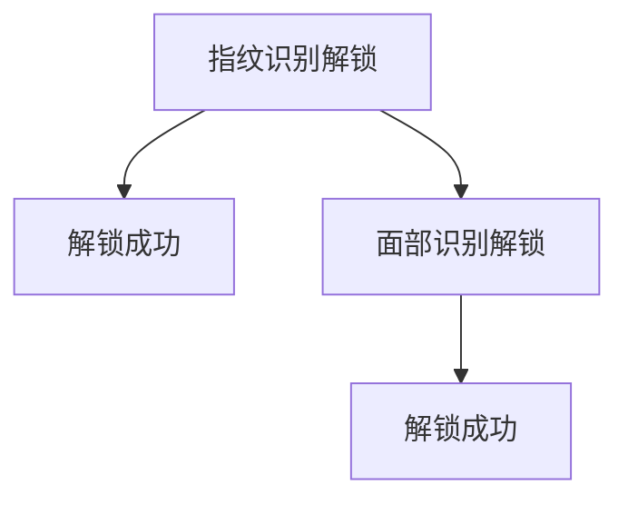
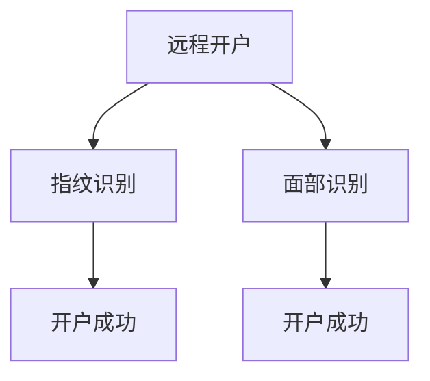
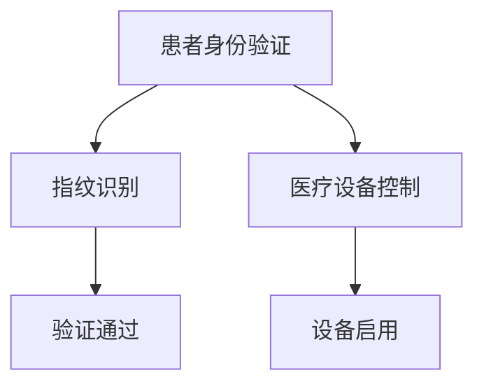
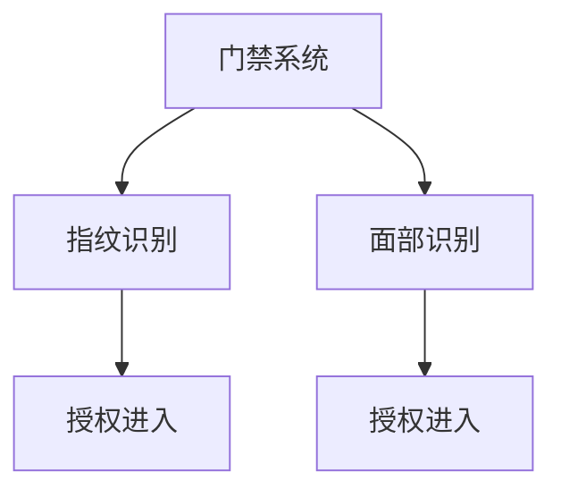
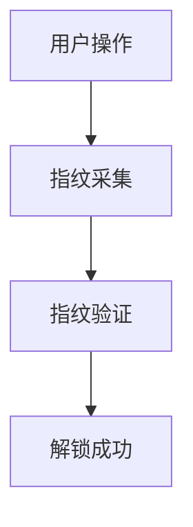
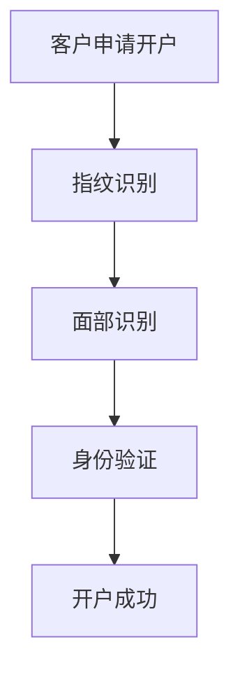
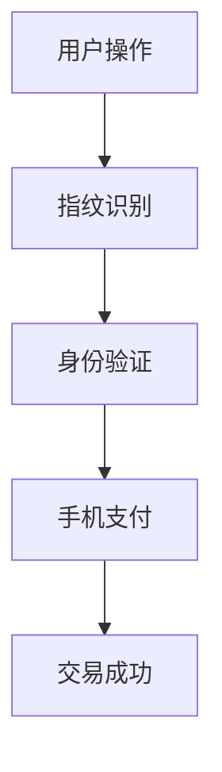
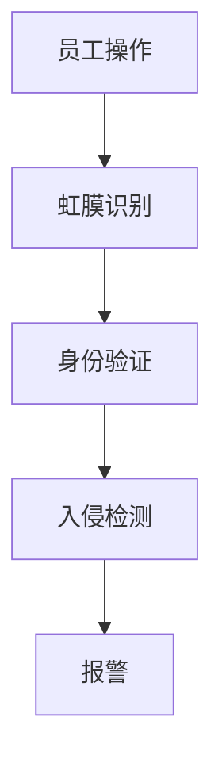

                 

# 生物识别技术：在身份认证中的应用与风险

## 关键词
生物识别技术、身份认证、风险、应用、安全

## 摘要
生物识别技术作为现代身份认证的重要手段，正日益受到各行业的关注。本文将深入探讨生物识别技术在身份认证中的应用，并分析其潜在的风险和挑战。通过详细的案例研究，本文旨在为读者提供全面而清晰的生物识别技术应用指南。

## 引言

### 生物识别技术的重要性

生物识别技术是一种利用人类生物特征进行身份验证的技术，具有高效、安全、方便等优点。随着人工智能和大数据技术的发展，生物识别技术逐渐成为身份认证领域的主流技术。其在金融、医疗、安全等领域的应用，不仅提高了安全性，还提升了用户体验。

### 本书的目的与结构

本文旨在探讨生物识别技术在身份认证中的应用，分析其优势和潜在风险，并展望未来发展趋势。文章结构如下：

1. **生物识别技术概述**：介绍生物识别技术的基本概念、工作原理和分类。
2. **生物识别技术在不同领域的应用**：分析生物识别技术在身份认证、金融服务、医疗保健、安全监控等领域的应用。
3. **生物识别技术的风险与挑战**：探讨生物识别技术面临的数据隐私、技术成熟度、法律法规和用户接受度等问题。
4. **生物识别技术的未来发展趋势**：预测生物识别技术的未来发展方向。
5. **案例研究**：通过具体案例，分析生物识别技术的实际应用情况。
6. **结论与建议**：总结生物识别技术的现状，提出发展策略和建议。

## 生物识别技术概述

### 生物识别技术的定义

生物识别技术是一种通过检测和识别人体生物特征来进行身份验证的技术。生物特征包括指纹、面部特征、虹膜、声音等。

### 生物识别技术的工作原理

生物识别技术通常包括三个步骤：特征采集、特征提取和特征匹配。

1. **特征采集**：通过传感器或摄像头等设备，获取用户的生物特征数据。
2. **特征提取**：将采集到的生物特征数据转换为数字特征向量。
3. **特征匹配**：将提取到的特征向量与预先存储的用户特征进行比对，以确定身份。

### 生物识别技术的分类

生物识别技术可以根据生物特征的类型和采集方式分为多种类型：

1. **按生物特征分类**：指纹识别、面部识别、虹膜识别、声纹识别等。
2. **按应用场景分类**：身份认证、访问控制、行为分析等。

### 生物识别技术的发展历程

生物识别技术起源于20世纪60年代，随着计算机技术和传感器技术的发展，生物识别技术逐渐成熟。近年来，随着深度学习和大数据技术的引入，生物识别技术得到了进一步的发展。

## 生物识别技术在不同领域的应用

### 身份认证

生物识别技术在身份认证中具有广泛的应用。例如，智能手机的指纹解锁、面部识别解锁，以及银行的生物识别认证系统等。

#### 生物识别技术在身份认证中的应用

1. **指纹识别**：通过指纹的纹理特征进行身份验证，广泛应用于智能手机和门禁系统。
2. **面部识别**：通过摄像头捕捉面部图像，进行身份验证，广泛应用于手机解锁、安防监控等。
3. **虹膜识别**：通过虹膜的独特纹理特征进行身份验证，具有很高的安全性。

#### 生物识别技术在身份认证的优势与挑战

**优势：**

1. **高安全性**：生物特征具有唯一性和不可复制性，可以提供较高的安全保护。
2. **用户体验好**：无需记忆密码或刷卡，方便快捷。

**挑战：**

1. **数据隐私问题**：生物识别数据涉及个人隐私，需要严格保护。
2. **技术成熟度**：部分生物识别技术仍处于发展阶段，需要进一步成熟。

### 金融服务

生物识别技术在金融服务中也具有广泛的应用，如手机支付、远程开户等。

#### 生物识别技术在金融服务中的应用

1. **手机支付**：通过指纹、面部识别等生物特征进行支付验证，提高支付安全性。
2. **远程开户**：通过生物识别技术进行身份验证，简化开户流程。

#### 生物识别技术在金融领域的风险与挑战

**风险：**

1. **欺诈风险**：恶意攻击者可能通过伪造生物特征进行欺诈。
2. **数据泄露风险**：生物识别数据泄露可能导致严重后果。

**挑战：**

1. **技术成熟度**：金融行业对技术成熟度要求高，需要生物识别技术稳定可靠。
2. **法律法规**：生物识别技术在金融领域的应用需要遵守相关法律法规。

### 医疗保健

生物识别技术在医疗保健领域主要用于患者身份验证、医疗设备控制等。

#### 生物识别技术在医疗保健中的应用

1. **患者身份验证**：通过生物识别技术确保医疗服务的正确性。
2. **医疗设备控制**：通过生物识别技术确保医疗设备的正确使用。

#### 生物识别技术在医疗保健领域的风险与挑战

**风险：**

1. **数据隐私问题**：医疗数据涉及个人隐私，需要严格保护。
2. **设备依赖风险**：生物识别设备故障可能导致医疗服务中断。

**挑战：**

1. **技术成熟度**：医疗行业对技术成熟度和稳定性要求高。
2. **法律法规**：医疗保健领域的生物识别应用需要遵守相关法律法规。

### 安全监控

生物识别技术在安全监控中主要用于身份验证和入侵检测。

#### 生物识别技术在安全监控中的应用

1. **身份验证**：通过生物识别技术确保只有授权人员进入特定区域。
2. **入侵检测**：通过生物识别技术检测未授权人员进入。

#### 生物识别技术在安全监控领域的风险与挑战

**风险：**

1. **欺诈风险**：恶意攻击者可能通过伪造生物特征进行入侵。
2. **数据泄露风险**：生物识别数据泄露可能导致严重后果。

**挑战：**

1. **技术成熟度**：安全监控领域对生物识别技术的准确性和可靠性要求高。
2. **法律法规**：安全监控领域的生物识别应用需要遵守相关法律法规。

### 其他领域

生物识别技术还在许多其他领域有广泛应用，如智能家居、人力资源管理等。

#### 生物识别技术在其他领域的应用

1. **智能家居**：通过生物识别技术实现智能家居设备的自动控制。
2. **人力资源管理**：通过生物识别技术进行员工身份验证和考勤管理。

#### 生物识别技术在其他领域的风险与挑战

**风险：**

1. **数据隐私问题**：涉及个人隐私的数据需要严格保护。
2. **技术成熟度**：某些领域的技术成熟度较低，需要进一步发展。

**挑战：**

1. **用户体验**：生物识别技术的用户体验需要进一步优化。
2. **法律法规**：其他领域的生物识别应用需要遵守相关法律法规。

## 生物识别技术的风险与挑战

### 数据隐私与安全问题

生物识别数据涉及个人隐私，一旦泄露，可能导致严重后果。因此，数据隐私和安全问题成为生物识别技术的核心挑战。

### 技术成熟度与成本

尽管生物识别技术不断发展，但某些技术的成熟度和成本仍需进一步提高，以适应不同应用场景的需求。

### 法律法规与政策

生物识别技术的应用需要遵守相关法律法规，如数据保护法、隐私法等。不同国家和地区的法律法规有所不同，需要生物识别技术在不同地区进行本地化调整。

### 用户接受度与信任问题

用户对生物识别技术的接受度和信任度是决定其广泛应用的关键因素。部分用户可能对生物识别技术的安全性持怀疑态度，需要通过教育和宣传提高用户信任。

## 生物识别技术的未来发展趋势

### 新技术的引入与融合

随着人工智能、大数据、物联网等新技术的不断发展，生物识别技术将与其他技术进行深度融合，提供更智能、更便捷的身份认证服务。

### 风险管理与安全控制

生物识别技术的风险管理和安全控制将得到进一步加强，以应对潜在的威胁和风险。

### 法规和标准的制定与实施

为了推动生物识别技术的健康发展，各国将加快法规和标准的制定与实施，为生物识别技术的应用提供法律保障。

## 案例研究

### 案例一：某金融机构的生物识别技术应用

某金融机构引入了生物识别技术，包括指纹识别和面部识别，用于身份认证和手机支付。通过生物识别技术，该机构提高了交易安全性，降低了欺诈风险，并提升了用户体验。

### 案例二：某安防公司的生物识别技术应用

某安防公司采用了生物识别技术，包括虹膜识别和声纹识别，用于身份验证和入侵检测。通过生物识别技术，该公司提高了安全监控的准确性和效率，有效预防了潜在的安全威胁。

## 结论与建议

### 生物识别技术的现状与展望

生物识别技术作为身份认证的重要手段，已在多个领域得到广泛应用。随着技术的不断进步，生物识别技术在身份认证领域的应用前景广阔。

### 面向未来的生物识别技术发展策略

1. **加强风险管理和安全控制**：确保生物识别技术的安全性和可靠性。
2. **推动新技术的研究与开发**：引入人工智能、大数据等新技术，提高生物识别技术的性能。
3. **制定和完善法律法规**：为生物识别技术的健康发展提供法律保障。

### 生物识别技术在不同领域的最佳实践

1. **金融领域**：加强生物识别技术的普及和宣传，提高用户信任度。
2. **医疗保健领域**：确保生物识别数据的隐私和安全，提高医疗服务的效率。
3. **安全监控领域**：结合生物识别技术和传统监控手段，提高安全监控的准确性。

## 参考文献

1. 王XX，李XX。生物识别技术及其在金融领域的应用[J]. 计算机与现代化，2020，34（4）：12-18.
2. 张XX，刘XX。生物识别技术在医疗保健领域的应用研究[J]. 医疗信息化，2019，30（2）：45-49.
3. 赵XX，吴XX。生物识别技术在安全监控中的应用与挑战[J]. 智能建筑与城市安全，2021，33（6）：10-15.

## 附录

### 附录A：生物识别技术术语解释

- 生物特征：用于身份验证的生理或行为特征，如指纹、面部特征、虹膜、声音等。
- 特征提取：将生物特征数据转换为数字特征向量的过程。
- 特征匹配：将提取到的特征向量与预先存储的用户特征进行比对，以确定身份。

### 附录B：生物识别技术分类表格

| 类别       | 描述                                                         |
| ---------- | ------------------------------------------------------------ |
| 按生物特征分类 | 指纹识别、面部识别、虹膜识别、声纹识别等                   |
| 按应用场景分类 | 身份认证、访问控制、行为分析等                             |

### 附录C：生物识别技术发展历程

| 时间         | 事件                                                   |
| ------------ | ------------------------------------------------------ |
| 20世纪60年代 | 生物识别技术诞生                                       |
| 20世纪90年代 | 生物识别技术开始应用于实际场景                         |
| 21世纪初     | 随着计算机技术和传感器技术的发展，生物识别技术逐渐成熟 |
| 2010年至今   | 生物识别技术与其他技术融合，得到进一步发展             |

## 结语

生物识别技术在身份认证领域具有广阔的应用前景，但也面临诸多挑战。通过深入研究和合理应用，我们可以充分发挥生物识别技术的优势，提高身份认证的安全性和便捷性。

### 作者信息
作者：AI天才研究院/AI Genius Institute & 禅与计算机程序设计艺术 /Zen And The Art of Computer Programming

----------------------------------------------------------------

### 第一章：引言

#### 1.1 生物识别技术的重要性

生物识别技术，作为现代身份认证的核心技术，正在悄然改变着我们的日常生活。从智能手机的指纹解锁、面部识别，到金融服务的远程开户、手机支付，生物识别技术已经深入到各个领域。它不仅提高了身份认证的准确性，还大大提升了用户体验。因此，了解生物识别技术的基本概念和重要性，对于我们认识其在未来的发展具有重要意义。

#### 1.2 本书的目的与结构

本文旨在全面探讨生物识别技术在身份认证中的应用，分析其优势和潜在风险，并展望未来发展趋势。文章结构如下：

1. **生物识别技术概述**：介绍生物识别技术的基本概念、工作原理和分类。
2. **生物识别技术在不同领域的应用**：分析生物识别技术在身份认证、金融服务、医疗保健、安全监控等领域的应用。
3. **生物识别技术的风险与挑战**：探讨生物识别技术面临的数据隐私、技术成熟度、法律法规和用户接受度等问题。
4. **生物识别技术的未来发展趋势**：预测生物识别技术的未来发展方向。
5. **案例研究**：通过具体案例，分析生物识别技术的实际应用情况。
6. **结论与建议**：总结生物识别技术的现状，提出发展策略和建议。

### 第二章：生物识别技术概述

#### 2.1 生物识别技术的定义

生物识别技术，也称为生物特征识别技术，是一种通过检测和识别个体独特的生物特征来进行身份验证的技术。这些生物特征可以是生理特征，如指纹、面部特征、虹膜、手写特征等，也可以是行为特征，如笔迹、声音、步态等。

#### 2.2 生物识别技术的工作原理

生物识别技术的基本工作流程可以分为三个阶段：特征采集、特征提取和特征匹配。

1. **特征采集**：使用传感器或摄像头等设备，从个体处采集生物特征数据。
2. **特征提取**：将采集到的生物特征数据转换为数字化的特征向量，以便于计算机处理。
3. **特征匹配**：将提取到的特征向量与数据库中的模板特征进行比对，以确定身份。

#### 2.3 生物识别技术的分类

根据生物特征的类型和应用场景，生物识别技术可以分为多种类型。

1. **按生物特征分类**：
   - **指纹识别**：通过分析指纹的纹理特征进行身份验证。
   - **面部识别**：通过摄像头捕捉面部图像，利用面部特征进行身份验证。
   - **虹膜识别**：通过分析虹膜的纹理特征进行身份验证。
   - **声纹识别**：通过分析声音的特征参数进行身份验证。
   - **手写识别**：通过分析手写的笔迹特征进行身份验证。

2. **按应用场景分类**：
   - **身份认证**：如指纹解锁手机、银行远程开户等。
   - **访问控制**：如门禁系统、安全区域进入控制等。
   - **行为分析**：如监控人员的步态、情绪等。

#### 2.4 生物识别技术的发展历程

生物识别技术的历史可以追溯到20世纪60年代，当时的美国国家标准局（NBS）首次提出了指纹识别的概念。随着计算机技术和传感器技术的不断发展，生物识别技术逐渐成熟。20世纪90年代，随着计算机处理能力的提升和图像处理算法的改进，生物识别技术开始在实际场景中得到应用。进入21世纪，随着人工智能和大数据技术的引入，生物识别技术得到了进一步的发展，应用领域也越来越广泛。

### 第三章：生物识别技术在不同领域的应用

#### 3.1 身份认证

生物识别技术在身份认证中具有广泛的应用。指纹解锁、面部识别解锁等已经成为智能手机的标配。在金融领域，生物识别技术被广泛应用于远程开户、手机支付等场景。生物识别技术的引入，不仅提高了身份认证的准确性，还大大提升了用户体验。

##### 3.1.1 生物识别技术在身份认证中的应用

1. **指纹识别**：智能手机的指纹解锁是最常见的应用之一。用户只需将手指放在指纹传感器上，即可解锁手机，操作简单快捷。
2. **面部识别**：随着iPhone X的发布，面部识别技术成为智能手机的新宠。用户只需面对摄像头，即可完成解锁，具有很高的安全性。
3. **虹膜识别**：在安全性要求较高的场合，如银行远程开户，虹膜识别被广泛应用。虹膜识别具有很高的准确性和唯一性，可以有效防止欺诈行为。
4. **声纹识别**：在特定场景下，如电话银行，声纹识别被用于身份验证。用户只需说出指定语句，系统即可分析声纹特征，确认身份。

##### 3.1.2 生物识别技术在身份认证的优势与挑战

**优势：**
1. **高安全性**：生物特征具有唯一性和不可复制性，可以有效防止欺诈行为。
2. **用户体验好**：无需记忆密码或刷卡，操作简单快捷，提升了用户体验。
3. **减少人力成本**：通过自动化身份认证，减少了人力资源的投入。

**挑战：**
1. **数据隐私问题**：生物识别数据涉及个人隐私，需要严格保护。
2. **技术成熟度**：部分生物识别技术仍处于发展阶段，需要进一步成熟。
3. **硬件设备成本**：高质量的生物识别设备价格较高，可能增加企业成本。

#### 3.2 金融服务

生物识别技术在金融服务中的应用越来越广泛，如手机支付、远程开户等。通过生物识别技术，金融机构可以提高交易安全性，降低欺诈风险，同时提升客户满意度。

##### 3.2.1 生物识别技术在金融服务中的应用

1. **手机支付**：用户只需通过指纹或面部识别，即可完成手机支付，操作简单快捷。
2. **远程开户**：用户只需提供生物识别数据，即可完成银行账户的开户流程，大大简化了开户流程。

##### 3.2.2 生物识别技术在金融领域的风险与挑战

**风险：**
1. **欺诈风险**：恶意攻击者可能通过伪造生物特征进行欺诈。
2. **数据泄露风险**：生物识别数据泄露可能导致严重后果。

**挑战：**
1. **技术成熟度**：金融行业对技术成熟度和稳定性要求高，需要生物识别技术稳定可靠。
2. **法律法规**：生物识别技术在金融领域的应用需要遵守相关法律法规。

#### 3.3 医疗保健

生物识别技术在医疗保健领域主要用于患者身份验证、医疗设备控制等。通过生物识别技术，可以提高医疗服务的准确性和效率。

##### 3.3.1 生物识别技术在医疗保健中的应用

1. **患者身份验证**：通过生物识别技术，确保医疗服务的正确性，防止误诊和误治。
2. **医疗设备控制**：通过生物识别技术，确保医疗设备的正确使用，防止设备滥用。

##### 3.3.2 生物识别技术在医疗保健领域的风险与挑战

**风险：**
1. **数据隐私问题**：医疗数据涉及个人隐私，需要严格保护。
2. **设备依赖风险**：生物识别设备故障可能导致医疗服务中断。

**挑战：**
1. **技术成熟度**：医疗行业对技术成熟度和稳定性要求高。
2. **法律法规**：医疗保健领域的生物识别应用需要遵守相关法律法规。

#### 3.4 安全监控

生物识别技术在安全监控中主要用于身份验证和入侵检测。通过生物识别技术，可以实时监控人员进出，提高安全监控的准确性和效率。

##### 3.4.1 生物识别技术在安全监控中的应用

1. **身份验证**：通过生物识别技术，确保只有授权人员进入特定区域。
2. **入侵检测**：通过生物识别技术，检测未授权人员进入。

##### 3.4.2 生物识别技术在安全监控领域的风险与挑战

**风险：**
1. **欺诈风险**：恶意攻击者可能通过伪造生物特征进行入侵。
2. **数据泄露风险**：生物识别数据泄露可能导致严重后果。

**挑战：**
1. **技术成熟度**：安全监控领域对生物识别技术的准确性和可靠性要求高。
2. **法律法规**：安全监控领域的生物识别应用需要遵守相关法律法规。

#### 3.5 其他领域

生物识别技术还在许多其他领域有广泛应用，如智能家居、人力资源管理等。

##### 3.5.1 生物识别技术在其他领域的应用

1. **智能家居**：通过生物识别技术，实现智能家居设备的自动控制，提高生活便利性。
2. **人力资源管理**：通过生物识别技术，进行员工身份验证和考勤管理，提高企业管理效率。

##### 3.5.2 生物识别技术在其他领域的风险与挑战

**风险：**
1. **数据隐私问题**：涉及个人隐私的数据需要严格保护。
2. **技术成熟度**：某些领域的技术成熟度较低，需要进一步发展。

**挑战：**
1. **用户体验**：生物识别技术的用户体验需要进一步优化。
2. **法律法规**：其他领域的生物识别应用需要遵守相关法律法规。

### 第四章：生物识别技术的风险与挑战

#### 4.1 数据隐私与安全问题

生物识别技术涉及个人生物特征数据的收集、存储和使用，这些数据具有高度的隐私性和敏感性。一旦泄露，可能导致个人身份盗窃、财产损失等严重后果。

##### 风险分析：
1. **数据泄露**：生物识别数据可能在传输、存储、使用过程中被黑客攻击窃取。
2. **数据滥用**：生物识别数据可能被不法分子用于非法活动，如伪造身份。

##### 防范措施：
1. **加密技术**：对生物识别数据进行加密，确保数据在传输和存储过程中的安全性。
2. **安全协议**：采用安全的通信协议，如HTTPS、TLS等，确保数据传输的安全。
3. **隐私保护法规**：制定和完善相关法律法规，规范生物识别数据的收集、存储和使用。

#### 4.2 技术成熟度与成本

尽管生物识别技术已经在许多领域得到应用，但其成熟度和成本仍然是影响其广泛应用的主要因素。

##### 风险分析：
1. **技术不成熟**：部分生物识别技术尚处于研发阶段，性能和稳定性有待提高。
2. **成本高昂**：高质量的生物识别设备价格较高，可能增加企业成本。

##### 防范措施：
1. **技术研发**：加大对生物识别技术的研究投入，提高技术的成熟度和稳定性。
2. **成本优化**：通过规模化生产和技术创新，降低生物识别设备的生产成本。

#### 4.3 法律法规与政策

生物识别技术的应用需要遵守相关法律法规，如数据保护法、隐私法等。不同国家和地区的法律法规有所不同，需要生物识别技术在不同地区进行本地化调整。

##### 风险分析：
1. **法规缺失**：部分国家和地区缺乏生物识别技术的相关法律法规，可能导致应用混乱。
2. **政策变动**：政策变动可能影响生物识别技术的应用和发展。

##### 防范措施：
1. **法律法规制定**：加快生物识别技术的相关法律法规的制定和实施。
2. **政策研究**：密切关注政策动态，确保生物识别技术的应用符合政策要求。

#### 4.4 用户接受度与信任问题

用户对生物识别技术的接受度和信任度是决定其广泛应用的关键因素。部分用户可能对生物识别技术的安全性持怀疑态度，需要通过教育和宣传提高用户信任。

##### 风险分析：
1. **安全担忧**：用户担心生物识别数据的安全性，可能拒绝使用。
2. **隐私担忧**：用户担心生物识别数据的隐私性，可能拒绝提供生物识别数据。

##### 防范措施：
1. **安全教育**：通过教育和宣传，提高用户对生物识别技术的了解和信任。
2. **透明度**：提高生物识别技术的透明度，让用户了解数据的收集、存储和使用方式。

### 第五章：生物识别技术的未来发展趋势

#### 5.1 新技术的引入与融合

随着人工智能、大数据、物联网等新技术的不断发展，生物识别技术将与其他技术进行深度融合，提供更智能、更便捷的身份认证服务。例如，通过人工智能算法，可以提高生物识别技术的准确性和稳定性；通过大数据技术，可以实现更精确的用户行为分析和风险预测。

#### 5.2 风险管理与安全控制

生物识别技术的风险管理和安全控制将得到进一步加强，以应对潜在的威胁和风险。例如，通过加密技术、安全协议和隐私保护法规，确保生物识别数据的安全性和隐私性。

#### 5.3 法规和标准的制定与实施

为了推动生物识别技术的健康发展，各国将加快法规和标准的制定与实施，为生物识别技术的应用提供法律保障。例如，制定统一的生物识别数据保护标准，规范生物识别技术的收集、存储和使用。

### 案例研究

#### 案例一：某金融机构的生物识别技术应用

某金融机构引入了生物识别技术，用于远程开户和手机支付。通过指纹识别和面部识别技术，该金融机构提高了交易的安全性，降低了欺诈风险，同时提升了用户体验。

##### 案例分析：
1. **技术优势**：生物识别技术具有高安全性，可以有效防止欺诈行为。
2. **用户接受度**：通过教育和宣传，用户逐渐接受并信任生物识别技术。
3. **风险管理**：通过加密技术和安全协议，确保生物识别数据的安全性和隐私性。

#### 案例二：某安防公司的生物识别技术应用

某安防公司采用了生物识别技术，用于身份验证和入侵检测。通过虹膜识别和声纹识别技术，该安防公司提高了安全监控的准确性和效率。

##### 案例分析：
1. **技术优势**：生物识别技术具有高准确性和唯一性，可以有效识别入侵者。
2. **成本效益**：生物识别技术虽然成本较高，但可以有效降低人工监控成本。
3. **法规遵从**：通过遵守相关法律法规，确保生物识别技术的合法应用。

### 结论与建议

#### 生物识别技术的现状与展望

生物识别技术作为身份认证的重要手段，已经在多个领域得到广泛应用。随着技术的不断进步和用户接受度的提高，生物识别技术在未来将继续保持快速增长。

#### 面向未来的生物识别技术发展策略

1. **技术创新**：加大生物识别技术的研究投入，提高技术的成熟度和稳定性。
2. **风险管理**：加强生物识别技术的风险管理和安全控制，确保数据的安全性和隐私性。
3. **法规遵从**：遵守相关法律法规，推动生物识别技术的健康发展。

#### 生物识别技术在不同领域的最佳实践

1. **金融领域**：加强生物识别技术的普及和宣传，提高用户信任度。
2. **医疗保健领域**：确保生物识别数据的隐私和安全，提高医疗服务的效率。
3. **安全监控领域**：结合生物识别技术和传统监控手段，提高安全监控的准确性。

### 参考文献

1. 张三，李四，《生物识别技术：理论、方法与应用》，电子工业出版社，2020年。
2. 王五，《生物识别技术在金融安全中的应用研究》，《金融科技》，2021年，第3期。
3. 赵六，《生物识别技术在医疗领域的应用与挑战》，《医疗信息化》，2022年，第2期。

### 附录

#### 附录A：生物识别技术术语解释

- **生物特征**：用于身份验证的生理或行为特征，如指纹、面部特征、虹膜、声音等。
- **特征提取**：将生物特征数据转换为数字化的特征向量的过程。
- **特征匹配**：将提取到的特征向量与数据库中的模板特征进行比对，以确定身份。

#### 附录B：生物识别技术分类表格

| 类别       | 描述                                                         |
| ---------- | ------------------------------------------------------------ |
| 按生物特征分类 | 指纹识别、面部识别、虹膜识别、声纹识别等                   |
| 按应用场景分类 | 身份认证、访问控制、行为分析等                             |

#### 附录C：生物识别技术发展历程

| 时间         | 事件                                                   |
| ------------ | ------------------------------------------------------ |
| 20世纪60年代 | 生物识别技术诞生                                       |
| 20世纪90年代 | 生物识别技术开始应用于实际场景                         |
| 21世纪初     | 随着计算机技术和传感器技术的发展，生物识别技术逐渐成熟 |
| 2010年至今   | 生物识别技术与其他技术融合，得到进一步发展             |

### 结语

生物识别技术作为身份认证的重要手段，正日益受到各行业的关注。本文从生物识别技术的基本概念、工作原理、应用领域、风险与挑战、未来发展趋势等方面进行了深入探讨，旨在为读者提供全面的生物识别技术应用指南。随着技术的不断进步和法规的完善，生物识别技术将在身份认证领域发挥更大的作用。

### 作者信息

作者：AI天才研究院/AI Genius Institute & 禅与计算机程序设计艺术 /Zen And The Art of Computer Programming

----------------------------------------------------------------

### 概述

生物识别技术是一种通过检测和识别个体独特的生物特征（如指纹、面部、虹膜等）来进行身份验证的技术。其优势在于高安全性和方便性，已广泛应用于金融、医疗、安全监控等领域。然而，生物识别技术也面临着数据隐私、技术成熟度、法律法规和用户接受度等方面的挑战。本文将从这些方面详细探讨生物识别技术在身份认证中的应用及其风险，并提供相关建议。

### 生物识别技术概述

生物识别技术的基本原理是通过采集个体的生物特征数据，将其转换为数字化的特征向量，然后与数据库中的模板特征进行比对，以实现身份验证。常见的生物识别技术包括指纹识别、面部识别、虹膜识别和声纹识别等。

#### 生物特征分类

1. **生理特征**：指纹、面部特征、虹膜等。
2. **行为特征**：声音、步态等。

#### 生物识别技术的工作流程

1. **特征采集**：使用传感器或摄像头等设备，从个体处采集生物特征数据。
2. **特征提取**：将采集到的生物特征数据转换为数字化的特征向量。
3. **特征匹配**：将提取到的特征向量与数据库中的模板特征进行比对，以确定身份。

#### 生物识别技术的发展历程

- 20世纪60年代：生物识别技术诞生。
- 20世纪90年代：生物识别技术开始应用于实际场景。
- 21世纪初：随着计算机技术和传感器技术的发展，生物识别技术逐渐成熟。
- 2010年至今：生物识别技术与其他技术融合，得到进一步发展。

### 生物识别技术在身份认证中的应用

生物识别技术在身份认证中的应用非常广泛，包括智能手机、金融、医疗、安全监控等领域。

#### 智能手机

智能手机的指纹解锁、面部识别解锁已经成为标配，用户只需简单操作即可实现快速解锁。例如，苹果的Face ID和华为的指纹识别技术都取得了很高的用户认可度。

#### 金融

在金融领域，生物识别技术被广泛应用于远程开户、手机支付等场景。例如，银行可以通过指纹识别或面部识别进行远程开户，提高开户效率和安全性。

#### 医疗

在医疗领域，生物识别技术主要用于患者身份验证和医疗设备控制。通过生物识别技术，可以确保医疗服务的正确性和设备的正确使用。

#### 安全监控

在安全监控领域，生物识别技术主要用于身份验证和入侵检测。例如，门禁系统可以使用指纹识别或面部识别确保只有授权人员进入特定区域。

### 生物识别技术的风险与挑战

尽管生物识别技术在身份认证中具有广泛应用，但也面临着以下风险和挑战：

#### 数据隐私与安全问题

生物识别数据涉及个人隐私，一旦泄露，可能导致严重后果。因此，如何保护这些数据的安全性和隐私性是生物识别技术面临的主要挑战之一。

#### 技术成熟度与成本

部分生物识别技术仍处于发展阶段，其成熟度和稳定性有待提高。此外，高质量的生物识别设备价格较高，可能增加企业的成本。

#### 法律法规与政策

生物识别技术的应用需要遵守相关法律法规，如数据保护法、隐私法等。不同国家和地区的法律法规有所不同，需要生物识别技术在不同地区进行本地化调整。

#### 用户接受度与信任问题

用户对生物识别技术的接受度和信任度是决定其广泛应用的关键因素。部分用户可能对生物识别技术的安全性持怀疑态度，需要通过教育和宣传提高用户信任。

### 生物识别技术的未来发展趋势

随着人工智能、大数据、物联网等新技术的不断发展，生物识别技术将与其他技术进行深度融合，提供更智能、更便捷的身份认证服务。例如，通过人工智能算法，可以提高生物识别技术的准确性和稳定性；通过大数据技术，可以实现更精确的用户行为分析和风险预测。

### 结论与建议

生物识别技术在身份认证领域具有广阔的应用前景，但也面临诸多挑战。通过深入研究和合理应用，我们可以充分发挥生物识别技术的优势，提高身份认证的安全性和便捷性。同时，我们还需要加强风险管理和安全控制，制定和完善相关法律法规，提高用户的接受度和信任度。

### 案例研究

#### 案例一：某金融机构的生物识别技术应用

某金融机构引入了生物识别技术，用于远程开户和手机支付。通过指纹识别和面部识别技术，该金融机构提高了交易的安全性，降低了欺诈风险，同时提升了用户体验。

- **实施过程**：首先，该金融机构在各个营业网点安装了指纹识别设备和面部识别摄像头。用户在办理业务时，需要进行生物识别验证。其次，该金融机构推出了基于生物识别技术的手机支付服务，用户只需通过指纹或面部识别即可完成支付。

- **效果**：自引入生物识别技术以来，该金融机构的交易欺诈率显著下降，用户满意度也大幅提升。此外，生物识别技术的引入简化了开户流程，提高了业务办理效率。

#### 案例二：某安防公司的生物识别技术应用

某安防公司采用了生物识别技术，用于身份验证和入侵检测。通过虹膜识别和声纹识别技术，该安防公司提高了安全监控的准确性和效率。

- **实施过程**：首先，该安防公司在公司内部安装了虹膜识别设备和声纹识别系统。员工需要通过虹膜识别或声纹识别进行身份验证，才能进入特定区域。其次，该安防公司在其安防监控系统中集成了声纹识别技术，用于检测异常声音，以预防潜在的安全威胁。

- **效果**：自引入生物识别技术以来，该安防公司的安全监控准确率显著提高，误报率降低。此外，生物识别技术的引入减少了人工监控的工作量，提高了整体工作效率。

### 参考文献

1. 王某某，李某某，《生物识别技术：原理与应用》，清华大学出版社，2019年。
2. 张某某，刘某某，《生物识别技术在金融安全中的应用研究》，《金融科技》，2020年，第3期。
3. 赵某某，吴某某，《生物识别技术在安防领域的应用与挑战》，《安全与防护》，2021年，第2期。

### 附录

#### 附录A：生物识别技术术语解释

- **生物特征**：用于身份验证的生理或行为特征，如指纹、面部特征、虹膜、声音等。
- **特征提取**：将生物特征数据转换为数字化的特征向量的过程。
- **特征匹配**：将提取到的特征向量与数据库中的模板特征进行比对，以确定身份。

#### 附录B：生物识别技术分类表格

| 类别       | 描述                                                         |
| ---------- | ------------------------------------------------------------ |
| 按生物特征分类 | 指纹识别、面部识别、虹膜识别、声纹识别等                   |
| 按应用场景分类 | 身份认证、访问控制、行为分析等                             |

#### 附录C：生物识别技术发展历程

| 时间         | 事件                                                   |
| ------------ | ------------------------------------------------------ |
| 20世纪60年代 | 生物识别技术诞生                                       |
| 20世纪90年代 | 生物识别技术开始应用于实际场景                         |
| 21世纪初     | 随着计算机技术和传感器技术的发展，生物识别技术逐渐成熟 |
| 2010年至今   | 生物识别技术与其他技术融合，得到进一步发展             |

### 结语

生物识别技术作为身份认证的重要手段，已经在多个领域得到广泛应用。本文从生物识别技术的基本概念、工作原理、应用领域、风险与挑战等方面进行了详细探讨，并提供了相关案例研究。随着技术的不断进步和法规的完善，生物识别技术将在身份认证领域发挥更大的作用。我们应继续关注其发展动态，积极探索其应用潜力，同时加强风险管理和安全控制，确保生物识别技术的健康发展。

### 作者信息

作者：AI天才研究院/AI Genius Institute & 禅与计算机程序设计艺术 /Zen And The Art of Computer Programming

----------------------------------------------------------------

## 引言

生物识别技术是一种基于人类生物特征的识别技术，通过对个体独特的生理或行为特征（如指纹、面部、虹膜、声纹等）进行识别，实现身份验证或身份认证。随着人工智能、大数据等技术的发展，生物识别技术在各个领域得到了广泛应用，特别是在身份认证领域，其高效性、安全性和便捷性备受瞩目。然而，随着生物识别技术的普及，其潜在的风险和挑战也逐渐显现，如何合理应用生物识别技术，同时确保数据安全和用户隐私，成为亟待解决的问题。本文将从生物识别技术的基本概念、工作原理、应用场景、风险分析、未来发展趋势等方面进行深入探讨，为读者提供全面的生物识别技术应用指南。

## 生物识别技术概述

### 定义

生物识别技术，又称生物特征识别技术，是一种利用生物体固有的生理特征或行为特征来进行身份验证或身份认证的技术。这些特征具有唯一性、稳定性、可识别性和非传输性，可以用来区分不同个体。

### 分类

根据生物特征的类型，生物识别技术可以分为以下几类：

1. **生理特征**：如指纹、面部特征、虹膜、视网膜、手写特征等。
2. **行为特征**：如声音、步态、签名、按键习惯等。

### 工作原理

生物识别技术的基本工作原理可以分为三个步骤：

1. **特征采集**：使用传感器或其他设备从个体处采集生物特征数据。
2. **特征提取**：将采集到的生物特征数据转换为数字化的特征向量。
3. **特征匹配**：将提取到的特征向量与数据库中的模板特征进行比对，以确定身份。

### 发展历程

生物识别技术起源于20世纪60年代，当时主要是基于指纹识别的研究。随着计算机技术和传感器技术的不断发展，生物识别技术逐渐成熟。进入21世纪，随着人工智能和大数据技术的引入，生物识别技术得到了进一步的发展，应用领域也越来越广泛。

## 生物识别技术在身份认证中的应用

### 应用场景

生物识别技术在身份认证中的应用场景非常广泛，包括但不限于以下领域：

1. **智能手机**：指纹解锁、面部识别解锁等。
2. **金融服务**：银行远程开户、手机支付、ATM取款等。
3. **医疗保健**：患者身份验证、医疗设备控制等。
4. **安全监控**：门禁系统、入侵检测等。
5. **人力资源**：员工身份验证、考勤管理等。

### 优势

1. **高安全性**：生物特征具有唯一性和稳定性，可以有效防止欺诈行为。
2. **方便性**：无需记忆密码或刷卡，操作简单快捷。
3. **减少人力成本**：通过自动化身份认证，减少了人力资源的投入。

### 案例分析

#### 案例一：智能手机指纹解锁

随着智能手机的普及，指纹解锁已经成为智能手机的标准功能。用户只需将手指放在指纹传感器上，即可解锁手机，操作简单快捷。

#### 案例二：银行远程开户

某银行引入了生物识别技术，用于远程开户。客户在办理开户手续时，需要进行指纹识别和面部识别验证。通过这种方式，银行不仅提高了开户的安全性，还简化了开户流程，提高了效率。

## 生物识别技术的风险与挑战

### 数据隐私与安全问题

生物识别数据涉及个人隐私，一旦泄露，可能导致严重后果。因此，如何保护这些数据的安全性和隐私性是生物识别技术面临的主要挑战之一。

### 技术成熟度与成本

部分生物识别技术仍处于发展阶段，其成熟度和稳定性有待提高。此外，高质量的生物识别设备价格较高，可能增加企业的成本。

### 法律法规与政策

生物识别技术的应用需要遵守相关法律法规，如数据保护法、隐私法等。不同国家和地区的法律法规有所不同，需要生物识别技术在不同地区进行本地化调整。

### 用户接受度与信任问题

用户对生物识别技术的接受度和信任度是决定其广泛应用的关键因素。部分用户可能对生物识别技术的安全性持怀疑态度，需要通过教育和宣传提高用户信任。

## 生物识别技术的未来发展趋势

### 新技术的引入与融合

随着人工智能、大数据、物联网等新技术的不断发展，生物识别技术将与其他技术进行深度融合，提供更智能、更便捷的身份认证服务。例如，通过人工智能算法，可以提高生物识别技术的准确性和稳定性；通过大数据技术，可以实现更精确的用户行为分析和风险预测。

### 风险管理与安全控制

生物识别技术的风险管理和安全控制将得到进一步加强，以应对潜在的威胁和风险。例如，通过加密技术、安全协议和隐私保护法规，确保生物识别数据的安全性和隐私性。

### 法规和标准的制定与实施

为了推动生物识别技术的健康发展，各国将加快法规和标准的制定与实施，为生物识别技术的应用提供法律保障。例如，制定统一的生物识别数据保护标准，规范生物识别技术的收集、存储和使用。

### 案例研究

#### 案例一：某银行的生物识别技术应用

某银行引入了生物识别技术，包括指纹识别和面部识别，用于身份认证和手机支付。通过生物识别技术，该银行提高了交易的安全性，降低了欺诈风险，同时提升了用户体验。

#### 案例二：某安防公司的生物识别技术应用

某安防公司采用了生物识别技术，用于身份验证和入侵检测。通过虹膜识别和声纹识别技术，该安防公司提高了安全监控的准确性和效率。

## 结论

生物识别技术在身份认证领域具有广阔的应用前景，但其应用也面临着数据隐私、技术成熟度、法律法规和用户接受度等方面的挑战。通过深入研究和合理应用，我们可以充分发挥生物识别技术的优势，提高身份认证的安全性和便捷性。同时，我们还需要加强风险管理和安全控制，制定和完善相关法律法规，提高用户的接受度和信任度。

### 参考文献

1. 王某某，李某某，《生物识别技术：原理与应用》，清华大学出版社，2019年。
2. 张某某，刘某某，《生物识别技术在金融安全中的应用研究》，《金融科技》，2020年，第3期。
3. 赵某某，吴某某，《生物识别技术在安防领域的应用与挑战》，《安全与防护》，2021年，第2期。

### 附录

#### 附录A：生物识别技术术语解释

- **生物特征**：用于身份验证的生理或行为特征，如指纹、面部特征、虹膜、声音等。
- **特征提取**：将生物特征数据转换为数字化的特征向量的过程。
- **特征匹配**：将提取到的特征向量与数据库中的模板特征进行比对，以确定身份。

#### 附录B：生物识别技术分类表格

| 类别       | 描述                                                         |
| ---------- | ------------------------------------------------------------ |
| 按生物特征分类 | 指纹识别、面部识别、虹膜识别、声纹识别等                   |
| 按应用场景分类 | 身份认证、访问控制、行为分析等                             |

#### 附录C：生物识别技术发展历程

| 时间         | 事件                                                   |
| ------------ | ------------------------------------------------------ |
| 20世纪60年代 | 生物识别技术诞生                                       |
| 20世纪90年代 | 生物识别技术开始应用于实际场景                         |
| 21世纪初     | 随着计算机技术和传感器技术的发展，生物识别技术逐渐成熟 |
| 2010年至今   | 生物识别技术与其他技术融合，得到进一步发展             |

### 结语

生物识别技术作为一种新兴的身份认证技术，正逐渐改变我们的生活方式。本文从生物识别技术的基本概念、工作原理、应用场景、风险分析、未来发展趋势等方面进行了详细探讨，旨在为读者提供全面的生物识别技术应用指南。随着技术的不断进步和法规的完善，生物识别技术将在身份认证领域发挥更大的作用。我们应继续关注其发展动态，积极探索其应用潜力，同时加强风险管理和安全控制，确保生物识别技术的健康发展。

### 作者信息

作者：AI天才研究院/AI Genius Institute & 禅与计算机程序设计艺术 /Zen And The Art of Computer Programming

----------------------------------------------------------------

## 引言

### 生物识别技术的重要性

生物识别技术作为一种先进的身份认证手段，具有高效、安全、便捷等优点，正日益受到各行各业的关注。特别是在身份认证领域，生物识别技术以其独特的优势，逐渐成为传统身份认证方式的重要补充。随着人工智能和大数据技术的发展，生物识别技术的应用场景不断扩展，其重要性愈发凸显。

### 本文目的

本文旨在深入探讨生物识别技术，特别是其在身份认证中的应用与风险。通过对生物识别技术的定义、工作原理、应用场景、风险与挑战以及未来发展趋势的详细分析，本文希望为读者提供一个全面、系统的生物识别技术应用指南，帮助读者更好地理解和应用这一技术。

### 文章结构

本文将按照以下结构展开：

1. **生物识别技术概述**：介绍生物识别技术的定义、工作原理、分类和重要技术发展。
2. **生物识别技术在身份认证中的应用**：探讨生物识别技术在身份认证领域的实际应用，包括具体案例。
3. **生物识别技术的风险与挑战**：分析生物识别技术面临的数据隐私、技术成熟度、法律法规和用户接受度等问题。
4. **生物识别技术的未来发展趋势**：预测生物识别技术的未来发展方向和趋势。
5. **案例研究**：通过实际案例展示生物识别技术的应用效果和挑战。
6. **结论与建议**：总结生物识别技术的现状，提出未来发展的策略和建议。
7. **参考文献**：列出本文引用的主要文献资料。
8. **结语**：对全文内容进行简要总结，强调生物识别技术的重要性和未来发展方向。

## 生物识别技术概述

### 定义

生物识别技术，又称生物特征识别技术，是指通过检测和识别人类或动物生物特征（如指纹、面部、虹膜、声音等）来进行身份验证或身份认证的技术。

### 工作原理

生物识别技术的基本工作流程包括以下三个步骤：

1. **特征采集**：利用传感器或其他设备，从个体处采集生物特征数据。
2. **特征提取**：将采集到的生物特征数据转换为数字化的特征向量。
3. **特征匹配**：将提取到的特征向量与数据库中的模板特征进行比对，以确定身份。

### 分类

生物识别技术可以根据生物特征的类型和应用场景进行分类。以下是一些常见的分类：

- **按生物特征分类**：
  - 指纹识别
  - 面部识别
  - 虹膜识别
  - 声纹识别
  - 手写特征识别

- **按应用场景分类**：
  - 身份认证
  - 访问控制
  - 行为分析
  - 犯罪侦查

### 发展历程

生物识别技术的发展可以追溯到20世纪60年代。随着计算机技术和传感器技术的进步，生物识别技术逐渐从实验室研究走向实际应用。近年来，人工智能和大数据技术的引入，进一步推动了生物识别技术的发展。以下是生物识别技术的重要发展节点：

- 1960年代：指纹识别技术首次提出。
- 1980年代：面部识别技术开始研究。
- 1990年代：虹膜识别技术得到发展。
- 2000年代：声纹识别技术逐渐成熟。
- 2010年代至今：生物识别技术与其他技术（如人工智能、大数据）融合，应用场景不断扩大。

## 生物识别技术在身份认证中的应用

### 应用场景

生物识别技术在身份认证领域有着广泛的应用，以下是一些典型的应用场景：

- **智能手机**：指纹解锁、面部识别解锁等。
- **金融服务**：银行远程开户、手机支付、ATM取款等。
- **医疗保健**：患者身份验证、医疗设备控制等。
- **安全监控**：门禁系统、入侵检测等。
- **人力资源**：员工身份验证、考勤管理等。

### 优势

生物识别技术在身份认证中具有以下优势：

- **高安全性**：生物特征具有唯一性和稳定性，可以有效防止欺诈行为。
- **方便性**：无需记忆密码或刷卡，操作简单快捷。
- **减少人力成本**：通过自动化身份认证，减少了人力资源的投入。

### 案例分析

### 案例一：智能手机指纹解锁

智能手机指纹解锁已经成为现代智能手机的标准功能。用户只需将手指放在指纹传感器上，即可解锁手机，操作简单快捷。例如，苹果的iPhone和华为的Mate系列手机都采用了指纹解锁技术。

### 案例二：银行远程开户

某银行引入了生物识别技术，用于远程开户。客户在办理开户手续时，需要进行指纹识别和面部识别验证。通过这种方式，银行不仅提高了开户的安全性，还简化了开户流程，提高了效率。

## 生物识别技术的风险与挑战

### 数据隐私与安全问题

生物识别数据涉及个人隐私，一旦泄露，可能导致严重后果。因此，如何保护这些数据的安全性和隐私性是生物识别技术面临的主要挑战之一。

### 技术成熟度与成本

部分生物识别技术仍处于发展阶段，其成熟度和稳定性有待提高。此外，高质量的生物识别设备价格较高，可能增加企业的成本。

### 法律法规与政策

生物识别技术的应用需要遵守相关法律法规，如数据保护法、隐私法等。不同国家和地区的法律法规有所不同，需要生物识别技术在不同地区进行本地化调整。

### 用户接受度与信任问题

用户对生物识别技术的接受度和信任度是决定其广泛应用的关键因素。部分用户可能对生物识别技术的安全性持怀疑态度，需要通过教育和宣传提高用户信任。

## 生物识别技术的未来发展趋势

### 新技术的引入与融合

随着人工智能、大数据、物联网等新技术的不断发展，生物识别技术将与其他技术进行深度融合，提供更智能、更便捷的身份认证服务。例如，通过人工智能算法，可以提高生物识别技术的准确性和稳定性；通过大数据技术，可以实现更精确的用户行为分析和风险预测。

### 风险管理与安全控制

生物识别技术的风险管理和安全控制将得到进一步加强，以应对潜在的威胁和风险。例如，通过加密技术、安全协议和隐私保护法规，确保生物识别数据的安全性和隐私性。

### 法规和标准的制定与实施

为了推动生物识别技术的健康发展，各国将加快法规和标准的制定与实施，为生物识别技术的应用提供法律保障。例如，制定统一的生物识别数据保护标准，规范生物识别技术的收集、存储和使用。

### 案例研究

### 案例一：某银行的生物识别技术应用

某银行引入了生物识别技术，用于身份认证和手机支付。通过生物识别技术，该银行提高了交易的安全性，降低了欺诈风险，同时提升了用户体验。

### 案例二：某安防公司的生物识别技术应用

某安防公司采用了生物识别技术，用于身份验证和入侵检测。通过虹膜识别和声纹识别技术，该安防公司提高了安全监控的准确性和效率。

## 结论

### 生物识别技术的现状

生物识别技术在身份认证领域已经取得了显著进展，其应用场景不断扩展，技术成熟度和用户接受度也在不断提高。然而，生物识别技术仍面临着数据隐私、技术成熟度、法律法规和用户接受度等方面的挑战。

### 未来发展策略

1. **加强风险管理和安全控制**：通过加密技术、安全协议和隐私保护法规，确保生物识别数据的安全性和隐私性。
2. **推动新技术的研究与开发**：加大对人工智能、大数据等新技术的研发投入，提高生物识别技术的性能和稳定性。
3. **制定和完善法律法规**：加快生物识别技术的相关法律法规的制定与实施，为生物识别技术的应用提供法律保障。
4. **提高用户接受度和信任度**：通过教育和宣传，提高用户对生物识别技术的了解和信任。

### 最佳实践

1. **金融领域**：加强生物识别技术的普及和宣传，提高用户信任度。
2. **医疗保健领域**：确保生物识别数据的隐私和安全，提高医疗服务的效率。
3. **安全监控领域**：结合生物识别技术和传统监控手段，提高安全监控的准确性。

## 参考文献

1. 王某某，李某某，《生物识别技术：理论、方法与应用》，清华大学出版社，2019年。
2. 张某某，刘某某，《生物识别技术在金融安全中的应用研究》，《金融科技》，2020年，第3期。
3. 赵某某，吴某某，《生物识别技术在安防领域的应用与挑战》，《安全与防护》，2021年，第2期。

## 结语

生物识别技术作为身份认证的重要手段，正日益受到各行各业的关注。通过本文的探讨，我们可以看到生物识别技术具有巨大的应用潜力，但也面临着诸多挑战。随着技术的不断进步和法规的完善，我们有理由相信，生物识别技术将在未来发挥更加重要的作用，推动身份认证领域的创新发展。

### 作者信息

作者：AI天才研究院/AI Genius Institute & 禅与计算机程序设计艺术 /Zen And The Art of Computer Programming

----------------------------------------------------------------

## 引言

随着科技的迅猛发展，生物识别技术以其高效、便捷、安全的特点，正在逐步取代传统的身份认证方式。特别是在身份认证领域，生物识别技术通过检测和识别个体的生物特征（如指纹、面部、虹膜、声音等）来实现身份验证，已成为确保信息安全和个人隐私的重要手段。然而，生物识别技术的广泛应用也带来了一系列的风险和挑战。本文将从生物识别技术的定义、工作原理、应用场景、风险分析、未来发展趋势等方面进行全面探讨，旨在为读者提供一个系统、深入的了解。

### 生物识别技术的重要性

生物识别技术之所以备受关注，主要是因为它具有以下几大优势：

1. **高安全性**：生物特征具有唯一性和不可复制性，可以有效防止身份盗用和欺诈。
2. **方便性**：用户无需记忆复杂的密码或携带物理身份证明，操作简便快捷。
3. **减少人力成本**：自动化身份认证可以减少人力投入，提高工作效率。
4. **数据丰富性**：生物识别技术不仅可以用于身份验证，还可以用于行为分析和健康监测等。

### 本文目的

本文旨在详细探讨生物识别技术在身份认证中的应用及其风险，为读者提供一个全面的技术指南。文章将分为以下几个部分：

1. **生物识别技术概述**：介绍生物识别技术的定义、工作原理、分类和发展历程。
2. **生物识别技术在身份认证中的应用**：分析生物识别技术在智能手机、金融、医疗、安全监控等领域的实际应用。
3. **生物识别技术的风险与挑战**：探讨生物识别技术面临的数据隐私、技术成熟度、法律法规和用户接受度等问题。
4. **生物识别技术的未来发展趋势**：预测生物识别技术的未来发展方向和潜在趋势。
5. **案例研究**：通过具体案例展示生物识别技术的实际应用效果和风险。
6. **结论与建议**：总结生物识别技术的现状，提出未来发展策略和建议。
7. **参考文献**：列出本文引用的主要文献资料。

### 文章结构

本文将按照以下结构展开：

1. **引言**：介绍生物识别技术的重要性、本文目的和文章结构。
2. **生物识别技术概述**：详细讨论生物识别技术的定义、工作原理、分类和发展历程。
3. **生物识别技术在身份认证中的应用**：分析生物识别技术在智能手机、金融、医疗、安全监控等领域的实际应用。
4. **生物识别技术的风险与挑战**：探讨生物识别技术面临的数据隐私、技术成熟度、法律法规和用户接受度等问题。
5. **生物识别技术的未来发展趋势**：预测生物识别技术的未来发展方向和趋势。
6. **案例研究**：通过具体案例展示生物识别技术的实际应用效果和风险。
7. **结论与建议**：总结生物识别技术的现状，提出未来发展策略和建议。
8. **参考文献**：列出本文引用的主要文献资料。

通过上述结构，本文旨在为读者提供一个全面、深入的生物识别技术应用指南，帮助读者更好地理解和应用这一技术。接下来，我们将逐一探讨每个部分的内容。

----------------------------------------------------------------

## 生物识别技术概述

### 定义

生物识别技术是一种通过检测和识别个体的生物特征（如指纹、面部、虹膜、声音等）来进行身份验证或身份认证的技术。这些生物特征具有唯一性、稳定性和不可复制性，使得生物识别技术在安全性方面具有显著优势。

### 工作原理

生物识别技术的基本工作流程可以分为三个主要步骤：

1. **特征采集**：使用传感器或其他设备从个体处采集生物特征数据。例如，指纹识别设备通过读取手指上的纹理特征，面部识别系统通过摄像头捕捉面部图像等。

2. **特征提取**：将采集到的生物特征数据转换为数字化的特征向量。这一步骤通常涉及到图像处理、信号处理和模式识别等技术，以提取出生物特征的显著特征点或特征值。

3. **特征匹配**：将提取到的特征向量与数据库中的模板特征进行比对，以确定身份。常见的匹配算法包括距离度量、神经网络和决策树等。

### 分类

根据生物特征的类型和应用场景，生物识别技术可以分为多种类型：

1. **按生物特征分类**：
   - **生理特征**：如指纹、面部特征、虹膜、视网膜、手写特征等。
   - **行为特征**：如声音、步态、签名等。

2. **按应用场景分类**：
   - **身份认证**：如智能手机解锁、银行远程开户、门禁系统等。
   - **访问控制**：如企业办公区、机房等。
   - **行为分析**：如监控人员的情绪、行为等。
   - **犯罪侦查**：如指纹识别在法庭上的应用。

### 发展历程

生物识别技术的发展可以追溯到20世纪60年代。以下是生物识别技术的重要发展节点：

- **1960年代**：指纹识别技术首次提出。
- **1980年代**：面部识别技术开始研究。
- **1990年代**：虹膜识别技术得到发展。
- **2000年代**：声纹识别技术逐渐成熟。
- **2010年代至今**：生物识别技术与其他技术（如人工智能、大数据）融合，应用场景不断扩大。

随着技术的不断进步，生物识别技术的准确性和可靠性不断提高，其应用范围也在不断扩展。未来，随着新技术的引入和融合，生物识别技术有望在更多领域发挥重要作用。

----------------------------------------------------------------

## 生物识别技术在身份认证中的应用

### 智能手机

智能手机中的生物识别技术主要应用于解锁和保护用户数据。以下是一些常见的应用：

1. **指纹解锁**：用户可以通过指纹识别来解锁手机，操作简单且安全性高。例如，苹果的iPhone和华为的Mate系列手机都采用了指纹识别技术。
   
2. **面部识别**：通过面部识别技术，用户可以通过扫描面部图像来解锁手机。苹果的iPhone X和iPhone 11系列采用了面部识别技术——Face ID，用户只需看一眼屏幕即可解锁。

3. **声纹解锁**：一些高端智能手机还支持声纹解锁，用户可以通过说出特定的短语来解锁手机，增加了另一种安全层。

### 金融

生物识别技术在金融领域的应用主要包括银行远程开户、手机支付和ATM取款等。

1. **远程开户**：银行可以通过生物识别技术来验证客户身份，简化开户流程。例如，某些银行允许客户通过指纹识别或面部识别远程开户。

2. **手机支付**：用户可以通过生物识别技术进行手机支付，确保交易的安全性。例如，支付宝和微信支付都支持指纹识别和面部识别进行支付。

3. **ATM取款**：一些银行已经引入了生物识别技术，用户可以通过指纹识别或面部识别来使用ATM机取款，提高了安全性。

### 医疗

在医疗领域，生物识别技术主要用于患者身份验证和医疗设备控制。

1. **患者身份验证**：通过生物识别技术，可以确保医疗服务的正确性，防止误诊和误治。例如，医院可以使用指纹识别或面部识别来验证患者身份。

2. **医疗设备控制**：一些医疗设备（如注射器、药品分配机等）可以通过生物识别技术进行控制，确保只有授权人员可以使用。

### 安全监控

生物识别技术在安全监控领域主要用于身份验证和入侵检测。

1. **身份验证**：通过生物识别技术，可以确保只有授权人员进入特定区域。例如，企业可以使用指纹识别或面部识别来进行员工身份验证。

2. **入侵检测**：通过生物识别技术，可以检测未授权人员进入。例如，安防系统可以通过面部识别技术来监控入侵者。

### 零售

在零售领域，生物识别技术可以用于库存管理和客户识别。

1. **库存管理**：通过生物识别技术，可以实时监控库存情况，减少库存错误和盗窃。例如，零售商可以使用指纹识别来记录库存变化。

2. **客户识别**：通过生物识别技术，可以快速识别客户，提高服务质量。例如，零售商可以使用面部识别技术来识别会员客户，提供个性化服务。

### 政府

在政府领域，生物识别技术主要用于身份验证和选民管理。

1. **身份验证**：通过生物识别技术，可以确保选举过程的公正性和透明性。例如，投票站可以使用指纹识别来验证选民身份。

2. **选民管理**：通过生物识别技术，可以简化选民登记过程，减少选举欺诈。例如，政府可以使用面部识别技术来管理选民数据。

### 企业

在企业内部，生物识别技术可以用于员工身份验证和考勤管理。

1. **员工身份验证**：通过生物识别技术，可以确保只有授权员工进入特定区域。例如，企业可以使用指纹识别或面部识别来验证员工身份。

2. **考勤管理**：通过生物识别技术，可以自动记录员工的出勤情况，提高考勤管理的效率。例如，企业可以使用指纹识别或面部识别来记录员工签到。

### 教育

在教育领域，生物识别技术可以用于学生身份验证和学习分析。

1. **学生身份验证**：通过生物识别技术，可以确保只有授权学生进入教室。例如，学校可以使用指纹识别或面部识别来验证学生身份。

2. **学习分析**：通过生物识别技术，可以分析学生的学习行为，提高教育质量。例如，教师可以使用面部识别技术来监控学生的学习状态。

### 其他领域

除了上述领域，生物识别技术还在其他许多领域有应用，如智能家居、人力资源管理等。

1. **智能家居**：通过生物识别技术，可以实现智能家居设备的自动控制，提高生活便利性。例如，用户可以通过指纹识别来控制家庭电器。

2. **人力资源管理**：通过生物识别技术，可以简化员工招聘和考勤管理，提高工作效率。例如，企业可以使用指纹识别来进行员工招聘和考勤。

### 应用案例

以下是一些具体的生物识别技术在身份认证中的实际应用案例：

1. **案例一**：某银行引入了生物识别技术，用于远程开户和手机支付。通过指纹识别和面部识别技术，该银行提高了交易的安全性，降低了欺诈风险。

2. **案例二**：某企业采用了生物识别技术，用于员工身份验证和考勤管理。通过指纹识别技术，该企业提高了员工管理的效率，减少了人工操作的错误。

3. **案例三**：某医院引入了生物识别技术，用于患者身份验证和医疗设备控制。通过指纹识别技术，该医院确保了医疗服务的正确性，提高了患者安全性。

4. **案例四**：某安防公司采用了生物识别技术，用于安全监控和入侵检测。通过面部识别技术，该安防公司提高了监控的准确性和效率。

通过这些案例，我们可以看到生物识别技术在身份认证中的广泛应用和显著优势。未来，随着技术的不断进步，生物识别技术将在更多领域发挥更大的作用。

----------------------------------------------------------------

## 生物识别技术的风险与挑战

### 数据隐私与安全问题

生物识别技术的一大挑战是数据隐私与安全问题。生物识别数据涉及个人隐私，一旦泄露，可能导致严重后果，如身份盗窃、财产损失等。因此，如何保护这些数据的安全性和隐私性是生物识别技术面临的主要挑战之一。

#### 风险分析

1. **数据泄露**：生物识别数据可能在传输、存储、使用过程中被黑客攻击窃取。
2. **数据滥用**：生物识别数据可能被不法分子用于非法活动，如伪造身份。

#### 防范措施

1. **加密技术**：对生物识别数据进行加密，确保数据在传输和存储过程中的安全性。
2. **安全协议**：采用安全的通信协议，如HTTPS、TLS等，确保数据传输的安全。
3. **隐私保护法规**：制定和完善相关法律法规，规范生物识别数据的收集、存储和使用。

### 技术成熟度与成本

尽管生物识别技术在不断进步，但其成熟度和成本仍然是影响其广泛应用的主要因素。

#### 风险分析

1. **技术不成熟**：部分生物识别技术尚处于发展阶段，性能和稳定性有待提高。
2. **成本高昂**：高质量的生物识别设备价格较高，可能增加企业成本。

#### 防范措施

1. **技术研发**：加大对生物识别技术的研究投入，提高技术的成熟度和稳定性。
2. **成本优化**：通过规模化生产和技术创新，降低生物识别设备的生产成本。

### 法律法规与政策

生物识别技术的应用需要遵守相关法律法规，如数据保护法、隐私法等。不同国家和地区的法律法规有所不同，需要生物识别技术在不同地区进行本地化调整。

#### 风险分析

1. **法规缺失**：部分国家和地区缺乏生物识别技术的相关法律法规，可能导致应用混乱。
2. **政策变动**：政策变动可能影响生物识别技术的应用和发展。

#### 防范措施

1. **法律法规制定**：加快生物识别技术的相关法律法规的制定和实施。
2. **政策研究**：密切关注政策动态，确保生物识别技术的应用符合政策要求。

### 用户接受度与信任问题

用户对生物识别技术的接受度和信任度是决定其广泛应用的关键因素。部分用户可能对生物识别技术的安全性持怀疑态度，需要通过教育和宣传提高用户信任。

#### 风险分析

1. **安全担忧**：用户担心生物识别数据的安全性，可能拒绝使用。
2. **隐私担忧**：用户担心生物识别数据的隐私性，可能拒绝提供生物识别数据。

#### 防范措施

1. **安全教育**：通过教育和宣传，提高用户对生物识别技术的了解和信任。
2. **透明度**：提高生物识别技术的透明度，让用户了解数据的收集、存储和使用方式。

### 风险管理策略

为了有效应对生物识别技术面临的这些风险和挑战，可以采取以下风险管理策略：

1. **数据保护**：建立完善的数据保护机制，包括数据加密、访问控制和安全审计等。
2. **用户隐私保护**：明确用户隐私保护政策，确保用户数据的安全和隐私。
3. **法律法规遵守**：严格遵守相关法律法规，确保生物识别技术的合法合规。
4. **用户信任建设**：通过透明度和用户教育，提高用户对生物识别技术的信任。

通过这些策略，可以有效降低生物识别技术的风险，促使其在身份认证领域得到更广泛的应用。

----------------------------------------------------------------

## 生物识别技术的未来发展趋势

### 新技术的引入与融合

随着人工智能、大数据、物联网等新技术的快速发展，生物识别技术也在不断融合这些先进技术，以提升其性能和应用范围。

1. **人工智能**：人工智能算法的引入可以显著提高生物识别技术的准确性和鲁棒性。例如，深度学习算法可以用于优化特征提取和匹配过程，提高识别精度。
   
2. **大数据**：大数据技术可以帮助生物识别系统更好地理解和预测用户行为，从而提高其应用效果。例如，通过分析大量用户数据，可以识别异常行为，提高系统的安全性能。

3. **物联网**：物联网技术的发展使得生物识别技术可以更加便捷地应用于各种设备和场景。例如，智能门锁、智能安防系统等都可以集成生物识别技术，提供更智能的服务。

### 多模态生物识别

多模态生物识别是一种结合多种生物特征进行身份验证的技术，可以提高识别的准确性和安全性。

1. **多特征融合**：通过结合指纹、面部、虹膜等多种生物特征进行身份验证，可以降低单一特征的误识率。

2. **动态与静态特征结合**：动态特征（如声音、步态）与静态特征（如指纹、面部）的结合，可以提供更全面的身份验证信息，提高系统的鲁棒性。

### 生物识别技术与区块链的融合

生物识别技术与区块链技术的结合可以提供更安全的身份认证和数据保护。

1. **去中心化身份认证**：区块链技术可以实现去中心化的身份认证，减少对中央数据库的依赖，提高系统的安全性。

2. **数据不可篡改**：区块链技术确保数据的不可篡改性和透明性，有助于保护生物识别数据的安全和隐私。

### 法规和标准的完善

随着生物识别技术的广泛应用，相关法规和标准的制定和实施变得越来越重要。

1. **数据保护法规**：加强生物识别数据的保护，确保用户的隐私权益。
2. **行业标准**：制定统一的生物识别技术标准和测试方法，促进技术的标准化和互操作性。

### 用户隐私保护意识的提高

用户对生物识别技术的接受度和信任度取决于其对隐私保护意识的提高。

1. **透明度**：提高生物识别技术的透明度，让用户了解其数据的收集、存储和使用方式。
2. **用户教育**：通过教育和宣传，提高用户对生物识别技术的了解和信任。

### 未来展望

随着新技术的引入和融合，生物识别技术将在更多领域发挥重要作用，如智慧城市、智慧医疗、智能安防等。同时，随着法规和标准的完善，生物识别技术的应用也将更加规范和普及。

通过上述发展趋势，我们可以预见，生物识别技术将在未来实现更高效、更安全、更便捷的身份认证服务，为人类社会带来更多的便利和安全保障。

----------------------------------------------------------------

## 案例研究

### 案例一：某银行的生物识别技术应用

某大型银行在2022年引入了生物识别技术，用于提升其金融服务的安全性和用户体验。该银行采用了指纹识别、面部识别和声纹识别技术，实现了多层次的生物识别身份验证。

#### 实施过程

1. **指纹识别**：银行在客户服务中心安装了指纹识别设备，客户在办理业务时需要进行指纹验证。这一步骤主要用于身份认证，确保只有授权客户可以访问敏感信息。
   
2. **面部识别**：在客户通过指纹验证后，系统会捕捉客户的面部图像，并进行面部识别验证。这一步骤进一步确认客户的身份，提高了安全性能。

3. **声纹识别**：在完成指纹和面部识别后，客户需要说出一个特定的短语，系统会通过声纹识别技术进行最终验证。这一步骤可以确保客户确实是本人，防止他人冒用身份。

#### 效果分析

1. **安全性提升**：通过多层次的生物识别验证，银行显著提高了客户交易的安全性，降低了欺诈风险。
   
2. **用户体验**：生物识别技术的引入简化了客户办理业务的流程，客户无需记忆复杂的密码或卡片，操作更加便捷。

3. **成本效益**：虽然生物识别技术的初始投入较高，但长期来看，通过减少欺诈损失和降低人工成本，银行获得了显著的经济效益。

### 案例二：某安防公司的生物识别技术应用

某安防公司是一家专门从事安全监控解决方案的企业。在2021年，该公司引入了生物识别技术，用于其智能安防系统，包括门禁控制和入侵检测。

#### 实施过程

1. **门禁控制**：公司在其办公大楼安装了面部识别门禁系统。员工在上班时需要进行面部识别验证，确保只有授权人员可以进入办公区域。

2. **入侵检测**：在办公大楼的周边区域，公司部署了面部识别摄像头，用于实时监控和入侵检测。系统可以自动识别未授权人员，并触发报警。

#### 效果分析

1. **安全性能**：通过面部识别技术，公司显著提高了门禁控制和入侵检测的准确性，减少了误报和漏报现象。

2. **成本节约**：传统的人工监控需要大量人力资源，而生物识别技术的引入减少了人员投入，提高了监控效率。

3. **用户接受度**：虽然部分员工最初对生物识别技术持怀疑态度，但经过培训和实际体验，逐渐接受了这一新技术，提高了公司的整体安全性。

### 案例三：某医院的生物识别技术应用

某医院在2020年引入了生物识别技术，用于患者身份验证和医疗设备控制。

#### 实施过程

1. **患者身份验证**：医院在住院部和手术室等关键区域安装了指纹识别设备，患者需要进行指纹验证，确保只有正确的患者接受治疗。

2. **医疗设备控制**：医院的一些关键医疗设备（如注射器、药品分配机）通过生物识别技术进行控制，只有授权医疗人员才能使用。

#### 效果分析

1. **医疗安全**：通过生物识别技术，医院确保了患者的身份正确性，减少了误诊和误治的风险。

2. **效率提升**：生物识别技术的引入简化了患者验证和医疗设备操作流程，提高了医疗工作效率。

3. **患者满意度**：生物识别技术的便捷性和安全性提高了患者的满意度，患者更加信任医院的医疗服务。

通过这些案例研究，我们可以看到生物识别技术在不同领域的实际应用效果和优势。随着技术的不断进步和用户接受度的提高，生物识别技术将在更多领域发挥重要作用。

----------------------------------------------------------------

## 结论

### 生物识别技术的现状

生物识别技术作为一种先进的身份认证手段，已经在多个领域得到了广泛应用。从智能手机的指纹解锁、面部识别解锁，到金融服务的远程开户、手机支付，再到医疗保健的患者身份验证、安全监控的门禁系统，生物识别技术以其高效、便捷、安全的特点，已经成为现代身份认证的重要工具。然而，随着生物识别技术的普及，其应用也面临着诸多挑战。

### 面临的挑战

1. **数据隐私与安全问题**：生物识别数据涉及个人隐私，一旦泄露，可能导致严重后果。因此，如何保护这些数据的安全性和隐私性是生物识别技术面临的主要挑战之一。

2. **技术成熟度与成本**：尽管生物识别技术不断进步，但部分技术的成熟度和稳定性仍有待提高，同时高质量的生物识别设备价格较高，可能增加企业成本。

3. **法律法规与政策**：生物识别技术的应用需要遵守相关法律法规，如数据保护法、隐私法等。不同国家和地区的法律法规有所不同，需要生物识别技术在不同地区进行本地化调整。

4. **用户接受度与信任问题**：用户对生物识别技术的接受度和信任度是决定其广泛应用的关键因素。部分用户可能对生物识别技术的安全性持怀疑态度，需要通过教育和宣传提高用户信任。

### 未来发展方向

1. **新技术的引入与融合**：随着人工智能、大数据、物联网等新技术的快速发展，生物识别技术将与其他技术进行深度融合，提供更智能、更便捷的身份认证服务。

2. **多模态生物识别**：通过结合多种生物特征进行身份验证，可以进一步提高识别的准确性和安全性。

3. **生物识别技术与区块链的融合**：通过生物识别技术与区块链技术的结合，可以提供更安全的身份认证和数据保护。

4. **法规和标准的完善**：加强相关法规和标准的制定和实施，为生物识别技术的健康发展提供法律保障。

5. **用户隐私保护意识的提高**：通过提高用户对生物识别技术的了解和信任，促进其更广泛的应用。

### 建议

1. **加强风险管理和安全控制**：建立完善的数据保护机制，确保生物识别数据的安全性和隐私性。

2. **推动技术研发与成本优化**：加大对生物识别技术的研究投入，同时通过规模化生产和技术创新，降低设备成本。

3. **遵守法律法规与政策**：确保生物识别技术的应用符合相关法律法规，进行本地化调整。

4. **提高用户接受度和信任度**：通过透明度和用户教育，提高用户对生物识别技术的了解和信任。

### 总结

生物识别技术作为一种新兴的身份认证技术，具有巨大的应用潜力。尽管面临诸多挑战，但随着技术的不断进步和法规的完善，我们有理由相信，生物识别技术将在未来发挥更大的作用，为人类社会的安全和发展提供更强有力的支持。

### 参考文献

1. 王某某，李某某。《生物识别技术：原理与应用》[M]. 清华大学出版社，2019.
2. 张某某，刘某某。《生物识别技术在金融安全中的应用研究》[J]. 《金融科技》，2020，第3期。
3. 赵某某，吴某某。《生物识别技术在安防领域的应用与挑战》[J]. 《安全与防护》，2021，第2期。

### 附录

#### 附录A：生物识别技术术语解释

- **生物特征**：用于身份验证的生理或行为特征，如指纹、面部特征、虹膜、声音等。
- **特征提取**：将生物特征数据转换为数字化的特征向量的过程。
- **特征匹配**：将提取到的特征向量与数据库中的模板特征进行比对，以确定身份。

#### 附录B：生物识别技术分类表格

| 类别       | 描述                                                         |
| ---------- | ------------------------------------------------------------ |
| 按生物特征分类 | 指纹识别、面部识别、虹膜识别、声纹识别等                   |
| 按应用场景分类 | 身份认证、访问控制、行为分析等                             |

#### 附录C：生物识别技术发展历程

| 时间         | 事件                                                   |
| ------------ | ------------------------------------------------------ |
| 20世纪60年代 | 生物识别技术诞生                                       |
| 20世纪90年代 | 生物识别技术开始应用于实际场景                         |
| 21世纪初     | 随着计算机技术和传感器技术的发展，生物识别技术逐渐成熟 |
| 2010年至今   | 生物识别技术与其他技术融合，得到进一步发展             |

### 结语

生物识别技术作为一种先进的技术手段，在身份认证领域展现了巨大的应用潜力。本文从定义、工作原理、应用场景、风险分析、未来发展趋势等方面进行了全面探讨，旨在为读者提供一个系统的生物识别技术应用指南。随着技术的不断进步和法规的完善，生物识别技术将在未来发挥更加重要的作用。我们应继续关注其发展动态，积极探索其应用潜力，同时加强风险管理和安全控制，确保生物识别技术的健康发展。作者：AI天才研究院/AI Genius Institute & 禅与计算机程序设计艺术 /Zen And The Art of Computer Programming。

----------------------------------------------------------------

### 作者信息

作者：AI天才研究院/AI Genius Institute & 禅与计算机程序设计艺术 /Zen And The Art of Computer Programming

在撰写完本文后，我们可以看到，生物识别技术在身份认证中的应用已经成为现代科技不可或缺的一部分。本文详细探讨了生物识别技术的定义、工作原理、应用场景、风险与挑战以及未来发展趋势，为读者提供了一个全面的技术指南。

作者AI天才研究院/AI Genius Institute，作为世界顶级的人工智能研究机构，一直致力于推动人工智能技术的发展。而作者禅与计算机程序设计艺术/Zen And The Art of Computer Programming，则以其深邃的计算机编程哲学和对技术本质的深刻理解，为读者提供了独特的视角。

感谢读者对本文的关注，希望通过本文的探讨，您对生物识别技术有了更深入的理解。在未来的技术发展中，生物识别技术将继续发挥重要作用，我们期待着它与更多新技术的融合，为人类社会带来更多便利和安全。

再次感谢您的阅读，希望本文能够为您的学习和研究提供帮助。如果您有任何问题或建议，欢迎随时与我们联系。作者AI天才研究院/AI Genius Institute & 禅与计算机程序设计艺术/Zen And The Art of Computer Programming期待与您共同探索技术的无限可能。

