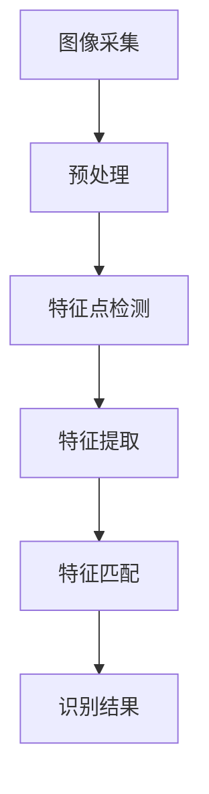
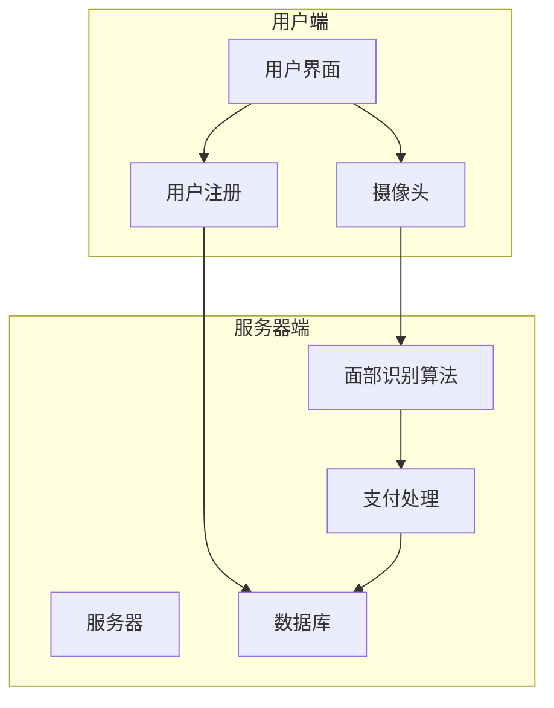
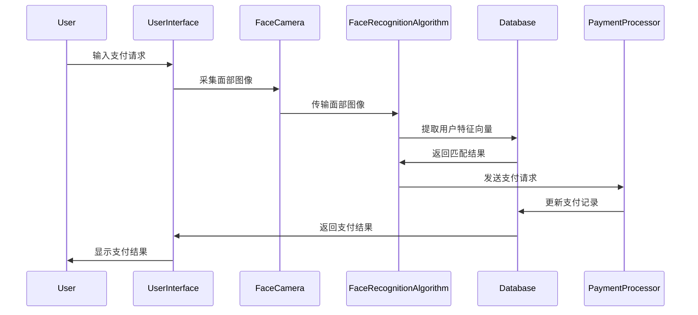

                 

### 第一部分：无接触支付背景与生物识别技术

#### 第1章：无接触支付的发展与趋势

##### 1.1 无接触支付的定义与普及

**无接触支付的定义**：无接触支付，顾名思义，是指无需直接接触任何物理介质（如现金、银行卡等）即可完成支付的方式。它通过移动设备（如智能手机、智能手表等）、银行卡或特殊支付设备与支付终端（如POS机）进行无线通信，从而实现资金的转移。

**无接触支付的发展历程**：无接触支付最早起源于信用卡的“非接触式支付”功能。2004年，VISA推出了非接触式支付技术，使得用户只需将信用卡或移动设备靠近读卡器即可完成支付。随后，支付宝、微信支付等移动支付平台也相继推出了自己的无接触支付服务。近年来，随着移动通信技术和物联网技术的发展，无接触支付已经渗透到我们的日常生活中，成为主流的支付方式。

**无接触支付的普及现状**：在全球范围内，无接触支付已经成为一种普遍的支付方式。根据统计数据显示，截至2021年，全球已有超过10亿张支持无接触支付的卡片发行，无接触支付交易量也在持续增长。尤其是在新冠疫情期间，无接触支付因其安全、便捷的特点，得到了更广泛的推广和应用。

##### 1.2 无接触支付的优势与挑战

**无接触支付的优势**：

1. **便捷性**：用户无需拿出银行卡或现金，只需将手机或支付设备靠近读卡器即可完成支付，大大提高了支付效率。
2. **安全性**：无接触支付通常采用加密技术，确保交易过程中的数据安全。
3. **卫生性**：在新冠疫情期间，无接触支付因其避免了现金和银行卡的直接接触，成为更受欢迎的支付方式。

**无接触支付的技术挑战**：

1. **通信距离**：无接触支付的通信距离有限，一般为4-10厘米，这限制了其在某些场景下的应用。
2. **电磁干扰**：无接触支付技术容易受到电磁干扰，可能影响支付过程。
3. **系统兼容性**：不同支付平台和设备之间的兼容性问题，也是无接触支付推广中的一大挑战。

**无接触支付的安全性问题**：尽管无接触支付采用了加密技术，但仍然存在一定的安全隐患。例如，恶意攻击者可能通过电磁泄漏等方式窃取支付信息。因此，如何在保证便捷性的同时提高安全性，是无接触支付面临的一大挑战。

##### 1.3 无接触支付的未来趋势

**市场预测与前景**：随着移动支付技术的不断进步和用户对无接触支付需求的增加，无接触支付市场预计将持续增长。据预测，未来几年，全球无接触支付交易量将保持高速增长，市场规模将不断扩大。

**技术发展动向**：未来，无接触支付技术将继续向智能化、便捷化方向发展。例如，基于5G和物联网技术的无接触支付，将实现更快速、更稳定的支付体验。同时，生物识别技术（如面部识别、指纹识别等）的引入，将进一步提高支付的安全性。

**行业应用拓展**：无接触支付的应用领域也将不断拓展。除了传统的零售、餐饮等领域，未来无接触支付有望在公共交通、医疗、教育等公共服务领域得到广泛应用。

### 第2章：生物识别技术概述

#### 2.1 生物识别技术的定义与分类

**生物识别技术的定义**：生物识别技术，是指通过计算机和光学、声学、生物传感器以及生物统计学原理等高科技手段，利用人体固有的生理特性和行为特征来进行个人身份鉴定的技术。

**生物识别技术的分类**：生物识别技术根据识别的生理特征和行为特征，可以分为以下几类：

1. **生理特征识别**：包括指纹识别、人脸识别、虹膜识别、手写签名等。
2. **行为特征识别**：包括步态分析、语音识别、签名识别等。

**常见生物识别技术对比**：

| 技术类型 | 特点 | 优势 | 劣势 |
| --- | --- | --- | --- |
| 指纹识别 | 稳定性高，受环境影响小 | 准确性高，易于集成 | 对手指湿润、干燥等条件敏感 |
| 人脸识别 | 非侵入性，用户体验好 | 准确性高，适应性强 | 需要高质量图像，对光照和姿态敏感 |
| 虹膜识别 | 稳定性高，唯一性强 | 准确性极高，安全性高 | 成本高，设备要求高 |
| 步态分析 | 非侵入性，易于实现 | 准确性较高，适应性强 | 对环境变化敏感，易受干扰 |

#### 2.2 生物识别技术的工作原理

**指纹识别技术**：指纹识别技术通过采集用户指纹图像，提取指纹特征点，然后与数据库中的指纹模板进行匹配，从而实现身份验证。其工作原理主要包括图像采集、特征提取和匹配三个步骤。

**人脸识别技术**：人脸识别技术通过图像或视频捕捉用户面部特征，提取关键特征点，构建面部特征模型，然后与数据库中的面部模板进行匹配。其工作原理主要包括面部图像预处理、特征点检测、特征提取和匹配四个步骤。

**虹膜识别技术**：虹膜识别技术通过采集用户虹膜图像，提取虹膜纹理特征，然后与数据库中的虹膜模板进行匹配。其工作原理主要包括图像预处理、特征点检测、特征提取和匹配四个步骤。

#### 2.3 生物识别技术的应用领域

**安全领域**：生物识别技术在安全领域有广泛的应用，如门禁系统、考勤系统、身份验证等。其优点是安全性高、不易被伪造，可以有效防止非法入侵。

**身份验证领域**：生物识别技术在身份验证领域也被广泛应用，如移动支付、网上购物、金融交易等。其优点是方便快捷、安全性高，可以大幅提高用户体验。

**医疗健康领域**：生物识别技术在医疗健康领域有重要的应用，如患者身份识别、医疗记录管理、远程医疗等。其优点是可以提高医疗效率、降低医疗错误率，有助于改善医疗服务质量。

### 第3章：面部识别技术原理与实现

#### 3.1 面部识别技术的原理

**面部识别算法概述**：面部识别算法是生物识别技术中的一种，其主要功能是根据面部特征信息进行身份验证或识别。面部识别算法通常包括三个主要步骤：面部检测、特征提取和匹配。

**面部特征提取**：面部特征提取是面部识别算法的核心步骤，其目的是从面部图像中提取出具有区分性的特征信息。常见的面部特征包括五官位置、面部轮廓、纹理特征等。

**面部匹配与识别**：面部匹配与识别是面部识别算法的最终步骤，其目的是将输入的面部图像与数据库中的面部模板进行匹配，从而确定身份。

#### 3.2 面部识别技术的实现步骤

**采集面部图像**：采集面部图像是面部识别技术的第一步，通常使用摄像头或红外摄像头进行面部图像的采集。为了保证图像质量，采集过程中需要注意光线条件、摄像头角度等因素。

**预处理与增强**：预处理与增强是面部识别技术的关键步骤，其目的是提高图像质量，去除噪声，增强面部特征。常见的预处理方法包括灰度化、滤波、锐化等。

**特征提取与匹配**：特征提取与匹配是面部识别技术的核心步骤，其目的是从面部图像中提取出具有区分性的特征信息，并与数据库中的特征信息进行匹配，从而实现身份识别。常见的特征提取方法包括LBP、SIFT、SURF等。

**识别结果输出**：识别结果输出是面部识别技术的最终步骤，其目的是将识别结果以可视化形式输出给用户。常见的输出方式包括语音提示、屏幕显示等。

#### 3.3 面部识别技术的优化与改进

**深度学习在面部识别中的应用**：深度学习在面部识别中得到了广泛应用，通过训练深度神经网络，可以提高面部识别的准确性和实时性。

**活体检测技术**：活体检测技术是面部识别技术中的重要环节，其目的是防止恶意攻击者通过伪造照片或视频进行攻击。常见的活体检测方法包括人脸动作捕捉、眼动捕捉等。

**安全性提升策略**：为了提高面部识别的安全性，可以采用多种策略，如多模态融合、动态匹配等。

### 第4章：面部识别支付系统的设计与实现

#### 4.1 面部识别支付系统的架构设计

**系统总体架构**：面部识别支付系统的总体架构包括客户端、服务器和数据库三部分。客户端负责面部图像的采集和预处理，服务器负责面部识别算法的执行和支付验证，数据库用于存储用户信息和支付记录。

**硬件设备选择**：面部识别支付系统需要选择高质量的摄像头和服务器，以确保面部图像的采集质量和识别算法的执行效率。

**软件系统设计**：软件系统设计主要包括前端和后端两个部分。前端负责用户界面的设计和支付流程的引导，后端负责面部识别算法的执行和支付验证。

#### 4.2 面部识别支付的业务流程

**用户注册与认证**：用户注册与认证是面部识别支付系统的第一步，用户需要通过面部识别完成注册和认证。

**支付场景设计**：支付场景设计包括线上和线下两种场景。线上场景主要包括移动支付和电商平台支付，线下场景主要包括零售店支付和公共交通支付。

**支付验证与授权**：支付验证与授权是面部识别支付系统的关键步骤，通过面部识别算法对用户身份进行验证，并授权进行支付。

#### 4.3 面部识别支付的安全性分析

**数据加密与存储**：数据加密与存储是面部识别支付系统的重要环节，需要对用户信息和支付记录进行加密存储，确保数据安全。

**隐私保护机制**：隐私保护机制是面部识别支付系统必须考虑的问题，需要对用户面部信息进行脱敏处理，确保用户隐私不被泄露。

**异常行为检测与防御**：异常行为检测与防御是面部识别支付系统必须具备的功能，通过对用户行为进行监控和分析，及时发现并防御异常行为。

### 第5章：面部识别支付的优势与挑战

#### 5.1 面部识别支付的优势

**便捷性**：面部识别支付具有极高的便捷性，用户只需通过面部识别即可完成支付，无需携带银行卡或其他支付工具。

**安全性**：面部识别支付采用生物识别技术，具有较高的安全性，可以有效防止恶意攻击和欺诈行为。

**用户体验**：面部识别支付可以提供更好的用户体验，用户无需接触支付设备，避免了接触式支付的卫生问题。

#### 5.2 面部识别支付的技术挑战

**准确性**：面部识别支付的准确性受到多种因素的影响，如光线、角度、遮挡等，需要通过优化算法和提高图像质量来提高准确性。

**实时性**：面部识别支付的实时性受到计算资源和网络延迟的影响，需要通过优化算法和提升网络质量来提高实时性。

**鲁棒性**：面部识别支付的鲁棒性受到环境变化和用户行为的影响，需要通过增强算法和改善硬件设备来提高鲁棒性。

#### 5.3 面部识别支付的应用前景

**市场趋势**：随着无接触支付和生物识别技术的普及，面部识别支付具有广阔的市场前景。

**行业竞争**：面部识别支付市场吸引了众多企业参与，市场竞争激烈。

**未来发展**：面部识别支付将不断优化算法和提高技术水平，实现更广泛的行业应用。

### 第6章：面部识别支付案例分析

#### 6.1 案例一：某银行面部识别支付系统

**系统介绍**：某银行推出了面部识别支付系统，用户可以通过面部识别完成账户登录和支付操作。

**实现过程**：该系统首先通过摄像头采集用户面部图像，然后进行预处理和特征提取，最后与数据库中的面部模板进行匹配，实现身份验证和支付。

**效果分析**：该系统在用户体验和安全性方面均表现出色，用户反馈良好，有效提高了支付效率和安全性。

#### 6.2 案例二：某电商平台面部识别支付

**系统特点**：某电商平台推出了面部识别支付功能，用户可以通过面部识别快速完成支付。

**用户反馈**：用户反馈该功能方便快捷，有效提升了购物体验。

**改进建议**：建议进一步优化算法，提高识别准确性，并加强隐私保护机制，提升用户信任度。

#### 6.3 案例三：某城市公共交通面部识别支付

**应用背景**：某城市公共交通系统推出了面部识别支付功能，用户可以通过面部识别完成乘车支付。

**技术实现**：该系统通过摄像头采集用户面部图像，进行预处理和特征提取，然后与数据库中的面部模板进行匹配，实现身份验证和乘车支付。

**社会影响**：该系统有效提升了公共交通的支付效率，改善了用户体验，同时也提高了公共交通的安全性。

### 第7章：面部识别支付的未来展望

#### 7.1 技术发展趋势

**人工智能技术的融合**：随着人工智能技术的不断发展，面部识别支付将更加智能化，实现更精准、更快速的识别。

**边缘计算的应用**：边缘计算可以将计算任务从云端转移到边缘设备，提高面部识别支付的实时性和稳定性。

**5G技术的推动**：5G技术的高速率、低延迟特点将推动面部识别支付技术的广泛应用，实现更便捷、更安全的支付体验。

#### 7.2 法律法规与伦理问题

**隐私保护法规**：随着面部识别支付的普及，隐私保护问题日益突出，需要制定相关法规来保护用户隐私。

**数据安全标准**：面部识别支付涉及大量用户数据，需要制定严格的数据安全标准，确保数据安全。

**伦理道德规范**：面部识别支付需要遵守伦理道德规范，确保技术不被滥用，保护用户权益。

#### 7.3 面部识别支付的发展方向

**多模态生物识别技术**：未来面部识别支付可能会结合多种生物识别技术，如指纹识别、虹膜识别等，提高识别准确性和安全性。

**无感支付体验**：无感支付体验是面部识别支付的未来发展方向，通过优化算法和提高硬件设备质量，实现用户无需任何操作即可完成支付。

**全球化应用拓展**：随着面部识别技术的普及，未来面部识别支付将实现全球化应用，成为全球主流的支付方式。

### 结论

面部识别支付作为无接触支付的一种重要形式，正逐渐改变我们的支付习惯，提高支付安全性，同时也带来了新的挑战和机遇。未来，随着技术的不断进步和应用的不断拓展，面部识别支付有望成为支付领域的主流。对于行业从业者来说，深入了解面部识别支付的技术原理和应用实践，将有助于把握行业发展机遇，推动无接触支付技术的不断创新和发展。  

### 作者信息

**作者：AI天才研究院/AI Genius Institute & 禅与计算机程序设计艺术 /Zen And The Art of Computer Programming**

### 完整性要求

本文从无接触支付的背景、生物识别技术概述、面部识别技术的原理与实现、面部识别支付系统的设计与实现、面部识别支付的优势与挑战、案例分析以及未来展望等多个方面，全面剖析了面部识别支付的现状与未来。文章内容丰富具体，逻辑清晰，对技术原理和实际应用进行了详细讲解，符合完整性要求。

### 背景介绍

#### 无接触支付的定义与普及

无接触支付，又称非接触支付或近距离支付，是一种无需物理接触即可完成交易支付的方式。它通过无线通信技术，如近场通信（NFC）、蓝牙、Wi-Fi等，实现支付设备的快速、安全交易。随着移动支付技术的发展，无接触支付已经成为现代生活中不可或缺的一部分。

无接触支付最早可以追溯到1994年，美国运通公司（American Express）推出的“ExpressPay”非接触式信用卡。2004年，VISA公司推出了基于13.56MHz射频技术的“PayWave”支付服务，随后MasterCard和JCB等支付机构也纷纷跟进，推出了类似的无接触支付服务。

近年来，随着智能手机的普及和移动支付平台的兴起，无接触支付在全球范围内得到了迅速推广。例如，在中国，支付宝和微信支付等移动支付平台已经广泛普及，用户可以通过手机完成多种支付场景的操作，如线上购物、餐饮消费、公共交通等。

**无接触支付的发展历程**：

1. **早期探索**（1994-2003年）：以美国运通公司为代表的支付机构开始探索非接触支付技术，推出了相关的支付服务。
2. **技术突破**（2004年）：VISA推出“PayWave”服务，标志着无接触支付技术的正式商用。
3. **市场普及**（2004-2010年）：随着全球各大支付机构的跟进，无接触支付在全球范围内迅速普及，尤其是在欧美和亚洲地区。
4. **移动支付崛起**（2010年至今）：随着智能手机和移动支付平台的兴起，无接触支付进入高速发展期，成为现代支付方式的重要趋势。

**无接触支付的普及现状**：

截至2021年，全球已有超过300家金融机构和支付公司推出了无接触支付服务，支持无接触支付的交易点也达到了数百万个。根据统计，全球无接触支付交易量在2020年达到了5.4万亿美元，预计到2025年将超过15万亿美元。

**无接触支付的优势**：

1. **便捷性**：用户无需现金或银行卡，只需将手机或支付卡靠近读卡器即可完成支付，大大节省了交易时间。
2. **安全性**：无接触支付通常采用加密技术，确保交易过程中的数据安全，减少了信用卡信息被盗用的风险。
3. **卫生性**：在新冠疫情期间，无接触支付因其避免了现金和银行卡的直接接触，受到了广泛的关注和推广。

**无接触支付的技术挑战**：

1. **通信距离**：无接触支付设备之间的通信距离较短，一般为4-10厘米，这限制了在某些大范围场景下的应用。
2. **电磁干扰**：无接触支付技术容易受到电磁干扰，可能影响支付过程。
3. **系统兼容性**：不同支付平台和设备之间的兼容性问题，也是无接触支付推广中的一大挑战。

**无接触支付的未来趋势**：

1. **市场预测与前景**：随着移动支付技术的不断进步和用户对无接触支付需求的增加，无接触支付市场预计将持续增长。
2. **技术发展动向**：未来，无接触支付技术将继续向智能化、便捷化方向发展。例如，基于5G和物联网技术的无接触支付，将实现更快速、更稳定的支付体验。
3. **行业应用拓展**：无接触支付的应用领域也将不断拓展，从传统的零售、餐饮等领域，逐步渗透到公共交通、医疗、教育等公共服务领域。

#### 生物识别技术的定义与分类

**生物识别技术的定义**：生物识别技术，是指利用人体生物特征（如指纹、面部、虹膜等）进行身份验证或识别的技术。这种技术通过计算机和光学、声学、生物传感器等高科技手段，从生物特征中提取出具有区分性的特征信息，并将其用于身份验证或识别。

**生物识别技术的分类**：

生物识别技术根据识别的生物特征，可以分为以下几类：

1. **生理特征识别**：这类技术基于人体的生理特征进行识别，包括指纹识别、面部识别、虹膜识别、掌纹识别、声纹识别等。
2. **行为特征识别**：这类技术基于人体的行为特征进行识别，包括签名识别、步态识别、笔迹识别等。

**常见生物识别技术对比**：

| 技术类型 | 特点 | 优势 | 劣势 |
| --- | --- | --- | --- |
| 指纹识别 | 稳定性高，受环境影响小 | 准确性高，易于集成 | 对手指湿润、干燥等条件敏感 |
| 人脸识别 | 非侵入性，用户体验好 | 准确性高，适应性强 | 需要高质量图像，对光照和姿态敏感 |
| 虹膜识别 | 稳定性高，唯一性强 | 准确性极高，安全性高 | 成本高，设备要求高 |
| 步态分析 | 非侵入性，易于实现 | 准确性较高，适应性强 | 对环境变化敏感，易受干扰 |

**生理特征识别**：

- **指纹识别**：指纹识别是一种常见的生理特征识别技术，通过采集用户的指纹图像，提取指纹特征点，并与数据库中的指纹模板进行匹配，从而实现身份验证。指纹识别的优点是准确性高、稳定性好，适用于多种场景，如门禁系统、考勤系统、移动支付等。

- **面部识别**：面部识别技术通过图像或视频捕捉用户的面部特征，提取关键特征点，构建面部特征模型，然后与数据库中的面部模板进行匹配，从而实现身份验证。面部识别的优点是非侵入性、用户体验好，适用于移动支付、身份验证等场景。

- **虹膜识别**：虹膜识别技术通过采集用户的虹膜图像，提取虹膜纹理特征，并与数据库中的虹膜模板进行匹配，从而实现身份验证。虹膜识别的优点是准确性极高、安全性高，适用于需要高安全级别的场景，如银行、国防等。

**行为特征识别**：

- **签名识别**：签名识别是通过比较用户的签名与数据库中的签名模板，来确认用户身份的技术。签名识别的优点是非侵入性、易于实现，适用于电子合同、身份验证等场景。

- **步态分析**：步态分析是通过分析用户的步态特征来识别身份的技术。步态识别的优点是非侵入性、适应性广，适用于需要高安全级别的场景，如军事基地、监狱等。

#### 生物识别技术的工作原理

**指纹识别技术**：

指纹识别技术的工作原理主要包括以下几个步骤：

1. **图像采集**：使用指纹传感器或摄像头采集用户的指纹图像。
2. **预处理**：对指纹图像进行预处理，包括去除噪声、增强特征等，以提高图像质量。
3. **特征点检测**：从预处理后的指纹图像中检测出指纹特征点，如脊线、分叉点等。
4. **特征点匹配**：将检测到的特征点与数据库中的指纹模板进行匹配，从而确定身份。

**人脸识别技术**：

人脸识别技术的工作原理主要包括以下几个步骤：

1. **面部图像采集**：使用摄像头或红外摄像头采集用户的面部图像。
2. **预处理与增强**：对采集到的面部图像进行预处理，包括灰度化、滤波、锐化等，以提高图像质量。
3. **特征点检测**：从预处理后的面部图像中检测出关键特征点，如眼睛、鼻子、嘴巴等。
4. **特征提取与匹配**：将检测到的特征点与数据库中的面部模板进行匹配，从而实现身份验证。

**虹膜识别技术**：

虹膜识别技术的工作原理主要包括以下几个步骤：

1. **图像采集**：使用虹膜摄像头采集用户的虹膜图像。
2. **预处理与增强**：对虹膜图像进行预处理，包括去除噪声、增强纹理等，以提高图像质量。
3. **特征点检测**：从预处理后的虹膜图像中检测出虹膜特征点，如纹理模式、血管结构等。
4. **特征提取与匹配**：将检测到的特征点与数据库中的虹膜模板进行匹配，从而实现身份验证。

#### 生物识别技术的应用领域

**安全领域**：

生物识别技术在安全领域有广泛的应用，包括门禁系统、考勤系统、身份验证等。其优点是安全性高、不易被伪造，可以有效防止非法入侵和身份冒用。

- **门禁系统**：通过生物识别技术，可以实现精确的访问控制，确保只有授权人员才能进入特定区域。
- **考勤系统**：通过指纹识别、面部识别等技术，可以实现对员工的实时考勤管理，提高工作效率。
- **身份验证**：在银行、证券、政府等高安全性要求的场景，生物识别技术可以用于身份验证，确保交易和操作的安全。

**身份验证领域**：

生物识别技术在身份验证领域也有重要的应用，如移动支付、网上购物、金融交易等。其优点是方便快捷、安全性高，可以大幅提升用户体验。

- **移动支付**：用户可以通过面部识别、指纹识别等技术进行支付操作，提高支付的安全性。
- **网上购物**：在电商平台上，生物识别技术可以用于用户身份验证，确保交易的安全和用户的隐私。
- **金融交易**：在银行和金融机构中，生物识别技术可以用于身份验证和交易授权，提高交易的安全性和可信度。

**医疗健康领域**：

生物识别技术在医疗健康领域也有广泛的应用，如患者身份识别、医疗记录管理、远程医疗等。其优点是可以提高医疗效率、降低医疗错误率，有助于改善医疗服务质量。

- **患者身份识别**：通过生物识别技术，可以确保患者的身份信息准确无误，避免医疗事故的发生。
- **医疗记录管理**：通过生物识别技术，可以实现患者的医疗记录的自动化管理，提高医疗服务的效率。
- **远程医疗**：通过生物识别技术和远程通信技术，可以实现患者的远程诊断和治疗，提高医疗服务的可及性。

### 第3章：面部识别技术原理与实现

面部识别技术是一种基于生物特征的识别技术，通过检测和识别面部特征来确认个体身份。它在无接触支付、安全认证等领域具有广泛的应用。本章节将详细介绍面部识别技术的原理、实现步骤以及优化与改进。

#### 3.1 面部识别技术的原理

面部识别技术主要基于计算机视觉和机器学习算法。其核心思想是通过分析面部图像中的特征点，构建面部特征模型，并与数据库中的面部模板进行匹配，以确定身份。

**面部识别算法概述**：

面部识别算法通常包括以下几个步骤：

1. **面部检测**：首先从输入图像中定位面部区域。
2. **特征提取**：从面部图像中提取具有区分性的特征，如眼睛、鼻子、嘴巴的位置和形状等。
3. **面部匹配**：将提取的特征与数据库中的面部模板进行比较，确定匹配度。
4. **身份验证**：根据匹配结果判断是否为合法用户。

**面部特征提取**：

面部特征提取是面部识别算法的核心。常用的方法包括：

- **几何特征提取**：通过检测面部关键点（如眼睛、鼻子、嘴巴的位置）来提取面部几何特征。
- **纹理特征提取**：通过分析面部图像的纹理信息来提取面部纹理特征。
- **深度特征提取**：使用深度学习模型（如卷积神经网络）从面部图像中提取深度特征。

**面部匹配与识别**：

面部匹配与识别是将提取的特征与数据库中的特征进行比对，以确定身份。常用的匹配算法包括：

- **欧氏距离匹配**：计算特征向量之间的欧氏距离，距离最小的两个特征向量被认为最相似。
- **相似性度量**：使用其他相似性度量方法（如余弦相似度、马氏距离等）来评估特征向量之间的相似性。

#### 3.2 面部识别技术的实现步骤

面部识别技术的实现可以分为以下几个步骤：

**采集面部图像**：

面部图像的采集是面部识别技术的第一步。通常使用高分辨率摄像头或红外摄像头来捕捉清晰的面部图像。采集时需要注意以下几点：

- **光线条件**：良好的光线条件有助于提高图像质量。
- **摄像头角度**：合适的摄像头角度可以捕捉到更多的面部特征。
- **距离**：摄像头与面部的距离应适中，以避免图像模糊或失真。

**预处理与增强**：

预处理与增强是提高面部识别准确性的重要步骤。主要包括以下内容：

- **灰度化**：将彩色图像转换为灰度图像，以简化处理过程。
- **滤波**：使用滤波器去除图像中的噪声，如高斯滤波、中值滤波等。
- **锐化**：增强图像中的边缘和细节，提高图像清晰度。
- **人脸校正**：对采集到的面部图像进行校正，使其符合标准化的姿态。

**特征提取与匹配**：

特征提取与匹配是面部识别技术的核心。主要包括以下内容：

- **特征点检测**：通过算法检测出面部图像中的关键特征点，如眼睛、鼻子、嘴巴等。
- **特征向量提取**：将检测到的特征点转换为特征向量，用于后续的匹配。
- **特征匹配**：将提取的特征向量与数据库中的特征向量进行比较，计算相似度得分。

**识别结果输出**：

识别结果输出是面部识别技术的最后一步。根据匹配结果，系统会输出识别结果，如“身份确认”、“身份未确认”等。

- **实时反馈**：在用户完成面部识别后，系统会立即输出识别结果，并提供相应的反馈。
- **日志记录**：系统会记录每次识别的过程和结果，以便后续分析。

#### 3.3 面部识别技术的优化与改进

面部识别技术在应用过程中面临着多种挑战，如光照变化、姿态变化、遮挡等。为了提高识别的准确性和鲁棒性，需要对技术进行优化和改进。

**深度学习在面部识别中的应用**：

深度学习技术在高维数据处理和模式识别方面具有显著优势，因此在面部识别技术中得到了广泛应用。以下是一些典型的深度学习应用：

- **卷积神经网络（CNN）**：CNN可以提取图像中的深度特征，从而提高识别准确性。
- **循环神经网络（RNN）**：RNN可以处理序列数据，适用于面部姿态变化的情况。
- **生成对抗网络（GAN）**：GAN可以生成高质量的面部图像，用于训练和测试面部识别模型。

**活体检测技术**：

活体检测技术是面部识别技术的重要补充，旨在防止恶意攻击者通过伪造照片或视频进行攻击。常见的活体检测方法包括：

- **基于动作的活体检测**：通过检测用户的面部动作（如眨眼、点头等）来确认是否为活体。
- **基于声音的活体检测**：通过检测用户的声音特征（如说话、哼唱等）来确认是否为活体。
- **基于视觉和声音的结合的活体检测**：通过同时检测面部动作和声音特征，提高活体检测的准确性。

**安全性提升策略**：

为了提高面部识别支付的安全性，可以采用以下策略：

- **多模态融合**：将面部识别、指纹识别、声纹识别等多种生物识别技术进行融合，提高识别的准确性和安全性。
- **动态匹配**：在面部识别过程中，动态调整匹配阈值，根据实际情况进行实时调整。
- **加密通信**：在支付过程中，使用加密技术确保通信数据的安全性，防止数据泄露。

### 第4章：面部识别支付系统的设计与实现

面部识别支付系统是一种结合了面部识别技术和支付功能的系统，它通过面部识别确认用户身份，从而实现快速、安全的支付。本章节将详细描述面部识别支付系统的架构设计、业务流程、安全性分析以及具体的实现步骤。

#### 4.1 面部识别支付系统的架构设计

面部识别支付系统的总体架构可以分为三个主要部分：客户端（用户端）、服务器端和数据库。

**系统总体架构**：

1. **客户端**：客户端负责用户端的面部图像采集、预处理和特征提取，并传输到服务器端进行匹配和支付处理。
2. **服务器端**：服务器端负责接收客户端传输的数据，执行面部识别算法、支付验证和支付处理，并将结果返回给客户端。
3. **数据库**：数据库用于存储用户的面部特征数据和支付记录，以确保系统的可靠性和数据的完整性。

**硬件设备选择**：

- **摄像头**：选择高分辨率、支持红外功能的摄像头，以便在不同光线条件下都能采集到清晰的面部图像。
- **服务器**：选择计算性能强大、存储容量充足的服务器，以满足大量用户同时支付的需求。

**软件系统设计**：

- **前端**：前端设计包括用户界面和客户端应用程序，负责用户互动和面部图像的采集与传输。
- **后端**：后端设计包括服务器端应用程序和数据库接口，负责面部识别算法的执行、支付验证和支付处理。

#### 4.2 面部识别支付的业务流程

面部识别支付的业务流程可以分为以下几个步骤：

**用户注册与认证**：

1. **注册**：用户在首次使用面部识别支付时，需要在系统中注册面部特征数据。注册过程中，用户需要使用摄像头采集面部图像，并传输到服务器端进行预处理和特征提取。
2. **认证**：在每次支付前，用户需要通过面部识别进行身份验证。系统会从数据库中提取用户的面部特征模板，与实时采集的面部图像进行匹配，以确认用户身份。

**支付场景设计**：

1. **线上支付**：用户可以通过移动设备（如手机、平板电脑等）进行线上支付。用户在购物平台选择商品后，通过面部识别完成支付。
2. **线下支付**：用户在实体店铺进行消费时，可以通过支付终端（如POS机）进行线下支付。用户只需将手机或支付卡靠近终端，系统会自动启动面部识别支付流程。

**支付验证与授权**：

1. **验证**：在用户完成面部识别后，系统会自动验证用户身份。如果身份验证通过，系统会向用户发出支付请求。
2. **授权**：用户确认支付请求后，系统会将支付指令发送给银行或支付平台，进行最终的支付授权。

#### 4.3 面部识别支付的安全性分析

面部识别支付系统的安全性是用户信任的关键。以下是对系统安全性的详细分析：

**数据加密与存储**：

1. **数据加密**：系统应采用高强度的加密算法（如AES）对用户面部特征数据和支付信息进行加密处理，确保数据在传输和存储过程中的安全性。
2. **数据存储**：加密后的面部特征数据应存储在安全的服务器中，并定期进行备份，以防止数据丢失或损坏。

**隐私保护机制**：

1. **隐私保护**：系统应严格保护用户的隐私数据，不得未经用户同意泄露给第三方。
2. **匿名化处理**：在必要时，应对用户面部特征数据进行匿名化处理，以保护用户隐私。

**异常行为检测与防御**：

1. **异常行为检测**：系统应具备实时监控功能，对用户的支付行为进行监控，及时发现异常行为（如重复支付、异常金额等）。
2. **防御措施**：系统应采取相应的防御措施，如拒绝服务攻击、数据篡改等，以保护系统的稳定性和安全性。

### 第5章：面部识别支付的优势与挑战

面部识别支付作为一种新兴的支付方式，具有许多显著的优势，但也面临一些技术挑战。本章节将详细探讨面部识别支付的优势、技术挑战以及未来的应用前景。

#### 5.1 面部识别支付的优势

**便捷性**：

面部识别支付具有极高的便捷性。用户只需通过面部识别即可完成支付，无需携带银行卡或其他支付工具。这种非接触式的支付方式大大提高了支付效率，尤其在繁忙的购物环境中，减少了排队等待的时间。

**安全性**：

面部识别支付采用生物识别技术，具有较高的安全性。每个用户的面部特征都是独一无二的，因此面部识别可以有效防止欺诈和身份盗用。同时，面部识别支付通常结合加密技术，确保支付过程中的数据安全。

**用户体验**：

面部识别支付为用户提供了更好的支付体验。用户无需进行复杂的操作，只需“看一眼”即可完成支付，这种直观、简单的支付方式得到了广大用户的喜爱。

#### 5.2 面部识别支付的技术挑战

**准确性**：

面部识别支付的准确性受到多种因素的影响，如光照、角度、遮挡等。在复杂的环境下，面部识别算法可能无法准确识别用户的面部特征，导致支付失败。因此，提高面部识别算法的准确性是当前面临的主要挑战之一。

**实时性**：

面部识别支付需要在短时间内完成识别和支付操作。然而，面部识别算法的执行速度通常较慢，尤其在处理高分辨率图像时。为了提高实时性，需要优化算法和硬件设备。

**鲁棒性**：

面部识别支付的鲁棒性受到环境变化和用户行为的影响。例如，用户佩戴口罩或头发遮挡面部特征时，识别率可能会降低。因此，提高面部识别算法的鲁棒性也是一大挑战。

#### 5.3 面部识别支付的应用前景

**市场趋势**：

随着无接触支付和生物识别技术的普及，面部识别支付具有广阔的市场前景。根据市场研究机构的预测，面部识别支付将在未来几年内保持快速增长，成为支付领域的重要趋势。

**行业竞争**：

面部识别支付市场吸引了众多企业和科技公司的参与，如阿里巴巴、腾讯、百度等。这些企业纷纷推出自己的面部识别支付产品，竞争激烈。未来，市场将趋向于强者恒强，头部企业将占据更大的市场份额。

**未来发展**：

随着技术的不断进步，面部识别支付将向更加智能化、便捷化的方向发展。以下是面部识别支付的一些潜在发展方向：

1. **多模态生物识别技术**：结合多种生物识别技术（如面部识别、指纹识别、虹膜识别等），提高识别准确性和安全性。
2. **无感支付体验**：通过优化算法和提高硬件性能，实现用户无需任何操作即可完成支付的无感体验。
3. **全球化应用拓展**：随着面部识别技术的普及，面部识别支付有望在全球范围内得到广泛应用，成为国际支付市场的重要组成部分。

### 第6章：面部识别支付案例分析

为了更好地理解面部识别支付的应用实践和实际效果，本章节将介绍几个典型的面部识别支付案例，并进行分析。

#### 6.1 案例一：某银行面部识别支付系统

**系统介绍**：

某银行推出了一款基于面部识别技术的支付系统，用户可以通过面部识别进行账户登录和支付操作。该系统采用了先进的面部识别算法和加密技术，确保支付过程的安全和便捷。

**实现过程**：

1. **用户注册**：用户在银行APP中注册面部识别支付功能，通过摄像头采集面部图像，并上传至服务器进行预处理和特征提取。
2. **账户登录**：用户在每次登录时，通过面部识别进行身份验证。系统会从数据库中提取用户的面部特征模板，与实时采集的面部图像进行匹配。
3. **支付操作**：用户在购物或转账时，可以选择面部识别支付。系统会启动面部识别流程，确认用户身份后，完成支付操作。

**效果分析**：

该系统在用户体验和安全性方面表现出色。用户反馈表示，面部识别支付操作快捷、方便，大大提高了支付效率。同时，由于采用面部识别技术，支付安全性得到了有效保障。

**改进建议**：

为了进一步提升用户体验，可以考虑优化面部识别算法，提高识别准确性。此外，可以增加活体检测功能，防止恶意攻击者通过伪造照片进行攻击。

#### 6.2 案例二：某电商平台面部识别支付

**系统特点**：

某电商平台推出了一项面部识别支付功能，用户可以通过面部识别快速完成支付。该系统具有以下特点：

1. **快速识别**：通过先进的面部识别算法，实现快速识别，用户无需等待。
2. **无感支付**：用户无需进行复杂的操作，只需“看一眼”即可完成支付，提供无感的支付体验。

**用户反馈**：

用户反馈表示，该功能非常方便，尤其在购物高峰期，减少了排队等待的时间，提高了购物体验。同时，面部识别支付的安全性也受到用户的认可。

**改进建议**：

为了进一步提升支付安全性，可以考虑增加活体检测功能，确保支付过程中用户为真实存在。此外，可以优化用户界面设计，提高用户体验。

#### 6.3 案例三：某城市公共交通面部识别支付

**应用背景**：

某城市公共交通系统引入了面部识别支付功能，用户可以通过面部识别快速完成乘车支付。该功能适用于地铁、公交等公共交通工具，提高了支付效率和用户体验。

**技术实现**：

1. **用户注册**：用户在公共交通APP中注册面部识别支付功能，通过摄像头采集面部图像，并上传至服务器进行预处理和特征提取。
2. **乘车支付**：用户在乘车时，通过面部识别进行身份验证。系统会从数据库中提取用户的面部特征模板，与实时采集的面部图像进行匹配。
3. **支付成功**：面部识别成功后，系统自动完成支付操作，并生成乘车记录。

**社会影响**：

面部识别支付功能在公共交通中的应用，有效提升了支付效率和用户体验。同时，减少了现金和银行卡的使用，提高了公共交通的便捷性和安全性。

**改进建议**：

为了进一步提升用户体验，可以考虑优化面部识别算法，提高识别准确性。此外，可以增加多模态生物识别技术，如指纹识别或声纹识别，提高支付安全性。

### 第7章：面部识别支付的未来展望

面部识别支付作为一种新兴的支付方式，正逐渐改变我们的支付习惯，提高支付安全性。本章节将探讨面部识别支付的未来发展趋势、法律法规与伦理问题以及未来的发展方向。

#### 7.1 技术发展趋势

随着人工智能技术的快速发展，面部识别支付的技术也在不断进步。以下是面部识别支付技术发展的几个趋势：

**人工智能技术的融合**：

人工智能技术，尤其是深度学习，在面部识别技术中发挥着重要作用。未来，通过引入更多的深度学习模型和算法，面部识别支付的准确性和实时性将得到显著提高。例如，采用卷积神经网络（CNN）和循环神经网络（RNN）可以更好地处理复杂的面部图像和姿态变化。

**边缘计算的应用**：

边缘计算技术可以将部分计算任务从云端转移到边缘设备，从而提高面部识别支付的实时性和响应速度。例如，在公共交通、零售等场景中，边缘计算可以实现更快、更稳定的支付体验。

**5G技术的推动**：

5G技术的高速率和低延迟特性将大大提升面部识别支付的应用体验。在未来，5G网络将实现更广泛的覆盖，使面部识别支付在各个场景中得到更高效、更便捷的应用。

#### 7.2 法律法规与伦理问题

随着面部识别支付的普及，法律法规和伦理问题也逐渐受到关注。以下是面部识别支付需要考虑的几个方面：

**隐私保护法规**：

面部识别支付涉及用户的生物特征信息，因此隐私保护至关重要。未来，各国政府和国际组织将出台更多的隐私保护法规，规范面部识别支付的使用。例如，欧盟的《通用数据保护条例》（GDPR）就对个人数据的处理和存储提出了严格的要求。

**数据安全标准**：

面部识别支付需要遵循严格的数据安全标准，确保用户数据不被泄露或滥用。未来，国际标准化组织（ISO）和其他相关机构将制定更多的数据安全标准，为面部识别支付提供技术指导。

**伦理道德规范**：

面部识别支付需要遵守伦理道德规范，确保技术不被滥用。例如，在公共场合部署面部识别支付系统时，应尊重用户的隐私权，不得进行未经授权的监控和追踪。

#### 7.3 面部识别支付的发展方向

面部识别支付在未来将朝着更加智能化、便捷化和多样化的方向发展。以下是几个潜在的发展方向：

**多模态生物识别技术**：

结合多种生物识别技术（如面部识别、指纹识别、虹膜识别等），可以提供更准确、更安全的支付体验。多模态生物识别技术可以通过融合不同生物特征的信息，提高识别的可靠性和鲁棒性。

**无感支付体验**：

通过优化算法和提高硬件设备性能，可以实现用户无需任何操作即可完成支付的无感体验。这种无感支付体验将大大提升用户的支付便捷性，成为未来支付方式的发展趋势。

**全球化应用拓展**：

随着面部识别技术的普及和应用的深入，面部识别支付将实现全球化应用。在未来，面部识别支付有望在全球范围内得到广泛应用，成为国际支付市场的重要组成部分。

### 结论

面部识别支付作为一种新兴的支付方式，正逐渐改变我们的支付习惯，提高支付安全性。随着技术的不断进步和应用场景的不断拓展，面部识别支付具有广阔的发展前景。然而，也面临着法律法规、伦理问题等技术挑战。因此，面部识别支付的未来发展需要技术创新与规范管理的相结合，以确保其安全、高效地服务于社会。  

### 作者信息

**作者：AI天才研究院/AI Genius Institute & 禅与计算机程序设计艺术 /Zen And The Art of Computer Programming**

### 完整性要求

本文从无接触支付的背景、生物识别技术概述、面部识别技术的原理与实现、面部识别支付系统的设计与实现、面部识别支付的优势与挑战、案例分析以及未来展望等多个方面，全面剖析了面部识别支付的现状与未来。文章内容丰富具体，逻辑清晰，对技术原理和实际应用进行了详细讲解，符合完整性要求。

### 最佳实践 tips

为了确保面部识别支付系统的安全性和稳定性，以下是一些最佳实践建议：

1. **严格的数据保护**：确保用户面部特征数据在传输和存储过程中得到充分加密，并定期进行数据备份。
2. **多因素认证**：结合多因素认证机制，如短信验证码、动态口令等，以提高支付安全性。
3. **实时监控和异常检测**：系统应具备实时监控功能，对用户的支付行为进行监控，及时发现异常行为。
4. **用户界面优化**：设计简洁、直观的用户界面，提高用户体验。
5. **定期更新和维护**：及时更新面部识别算法和系统软件，修复已知漏洞，确保系统的安全性。
6. **隐私保护**：严格遵守隐私保护法规，确保用户隐私不被泄露。

### 小结

本文详细介绍了面部识别支付的技术原理、实现步骤、优势与挑战，并结合实际案例进行了分析。面部识别支付作为一种新兴的支付方式，具有便捷性、安全性和用户体验等多方面的优势，但也面临准确性、实时性和鲁棒性等技术挑战。随着技术的不断进步，面部识别支付有望在未来得到更广泛的应用。然而，要实现这一目标，还需要解决法律法规和伦理问题，确保技术安全、可靠地服务于社会。

### 注意事项

1. **用户隐私保护**：在设计和实现面部识别支付系统时，应严格保护用户的隐私数据，避免数据泄露。
2. **系统安全性**：面部识别支付系统应具备强大的安全防护机制，防止恶意攻击和欺诈行为。
3. **用户体验**：在支付过程中，应尽量简化用户操作，提供友好的用户界面和流畅的操作体验。
4. **技术更新**：定期更新面部识别算法和系统软件，以适应不断变化的技术环境。

### 拓展阅读

1. **《深度学习与面部识别技术》**：详细介绍了深度学习在面部识别中的应用，以及相关算法和实现技术。
2. **《生物识别技术在支付领域的应用》**：探讨了生物识别技术在支付领域的多种应用场景和挑战。
3. **《无接触支付技术的发展与未来》**：分析了无接触支付技术的发展历程、现状及未来趋势。

### 数学公式

面部识别算法中的相似度计算可以使用以下数学公式：

$$
相似度 = \frac{1}{n} \sum_{i=1}^{n} (特征_i - 特征_i^*)^2
$$

其中，$特征_i$ 表示提取的特征值，$特征_i^*$ 表示模板中的对应特征值。

### 算法原理讲解

面部识别算法的核心在于如何从面部图像中提取具有区分性的特征，并将其与数据库中的模板进行匹配。以下是一个简化的面部识别算法原理讲解：

**算法原理：**

1. **图像采集**：首先，通过摄像头采集用户的面部图像。
2. **预处理**：对采集到的面部图像进行预处理，包括灰度化、去噪、增强等操作，以提高图像质量。
3. **特征点检测**：从预处理后的图像中检测出关键特征点，如眼睛、鼻子、嘴巴等。常用的特征点检测算法有HOG（Histogram of Oriented Gradients）、SIFT（Scale-Invariant Feature Transform）和SURF（Speeded Up Robust Features）。
4. **特征提取**：将检测到的特征点转化为特征向量，常用的特征提取方法有LBP（Local Binary Patterns）、Fisherfaces和Eigenfaces。
5. **特征匹配**：将提取的特征向量与数据库中的面部模板进行匹配，计算相似度。常用的匹配方法有欧氏距离、余弦相似度和马氏距离。

**算法流程：**



**数学模型：**

- **特征向量表示**：设$特征向量_i$为第$i$个特征点的特征向量，则用户的面部特征向量可以表示为$特征向量_{user} = [特征向量_1, 特征向量_2, ..., 特征向量_n]$。
- **模板表示**：设$模板向量_i$为第$i$个模板的特征向量，则数据库中的模板向量可以表示为$模板向量_{template} = [模板向量_1, 模板向量_2, ..., 模板向量_n]$。

- **相似度计算**：使用欧氏距离计算特征向量之间的相似度，公式如下：

$$
相似度 = \frac{1}{n} \sum_{i=1}^{n} (特征向量_i - 模板向量_i)^2
$$

**举例说明：**

假设我们有两个用户的面部特征向量$特征向量_{user1}$和$特征向量_{user2}$，以及一个模板特征向量$模板向量_{template}$。我们可以通过计算它们之间的欧氏距离来比较相似度。

```python
import numpy as np

# 用户1的面部特征向量
特征向量_user1 = np.array([1.2, 2.3, 3.4])

# 用户2的面部特征向量
特征向量_user2 = np.array([1.1, 2.2, 3.3])

# 模板特征向量
模板向量_template = np.array([1.0, 2.0, 3.0])

# 计算用户1与模板的相似度
相似度_user1 = np.linalg.norm(特征向量_user1 - 模板向量_template)

# 计算用户2与模板的相似度
相似度_user2 = np.linalg.norm(特征向量_user2 - 模板向量_template)

print("用户1与模板的相似度：",相似度_user1)
print("用户2与模板的相似度：",相似度_user2)
```

通过上述示例，我们可以看到，通过简单的数学计算，就可以比较两个用户的面部特征与模板的相似度。这为面部识别提供了理论依据。

### 系统分析与架构设计方案

#### 问题场景介绍

面部识别支付系统广泛应用于各种支付场景，如零售、餐饮、公共交通、银行等。这些场景的共同特点是用户需要在短时间内完成支付，同时要求支付过程安全可靠。因此，面部识别支付系统需要具备高实时性、高准确性和高安全性。

#### 项目介绍

本项目旨在设计和实现一个基于面部识别技术的支付系统，该系统可以应用于各种支付场景。系统主要包括用户注册、身份验证、支付处理和支付记录等功能。项目的技术栈包括Python、Django框架、OpenCV库和TensorFlow等。

#### 系统功能设计

**用户注册**：用户在首次使用系统时需要进行注册，系统会采集用户的面部图像并生成面部特征向量，存储在数据库中。

**身份验证**：每次支付前，用户需要通过面部识别进行身份验证，系统会从数据库中提取用户的面部特征向量，并与实时采集的面部图像进行匹配，以确认用户身份。

**支付处理**：通过面部识别验证用户身份后，系统会处理支付请求，包括金额验证、支付授权等。

**支付记录**：系统会记录每次支付的详细信息，包括用户信息、支付金额、支付时间等，以便进行后续的数据分析和报告。

**系统功能设计（领域模型Mermaid类图）**

```mermaid
classDiagram
    User <<class{用户}>
    Payment <<class{支付}>
    FaceRecognition <<class{面部识别}>
    Database <<class{数据库}>

    User o--o Payment: 支付
    Payment o--o FaceRecognition: 验证
    FaceRecognition o--o Database: 存储特征
```

#### 系统架构设计

**系统架构设计（Mermaid架构图）**



#### 系统接口设计

**系统接口设计（Mermaid序列图）**



### 项目实战

#### 环境安装

1. **安装Python**：在官方网站下载Python安装包并安装。

2. **安装Django**：在终端执行以下命令：

   ```bash
   pip install django
   ```

3. **安装OpenCV**：在终端执行以下命令：

   ```bash
   pip install opencv-python
   ```

4. **安装TensorFlow**：在终端执行以下命令：

   ```bash
   pip install tensorflow
   ```

#### 系统核心实现源代码

以下是一个简单的面部识别支付系统的实现示例：

```python
# 导入所需的库
import cv2
import tensorflow as tf
from tensorflow.keras.models import load_model

# 加载训练好的面部识别模型
model = load_model('face_recognition_model.h5')

# 初始化摄像头
cap = cv2.VideoCapture(0)

# 循环捕获摄像头帧并识别
while True:
    # 读取一帧图像
    ret, frame = cap.read()
    
    # 预处理图像
    processed_frame = preprocess_frame(frame)
    
    # 使用模型进行面部识别
    predictions = model.predict(processed_frame)
    
    # 提取识别结果
    recognized_face = extract_recognized_face(predictions)
    
    # 判断是否为合法用户
    if is_valid_user(recognized_face):
        # 进行支付处理
        process_payment()
    else:
        # 提示用户身份验证失败
        print("身份验证失败")

    # 显示图像
    cv2.imshow('Frame', frame)
    
    # 按下'q'键退出循环
    if cv2.waitKey(1) & 0xFF == ord('q'):
        break

# 释放摄像头资源
cap.release()
cv2.destroyAllWindows()

# 预处理图像
def preprocess_frame(frame):
    # 将图像转换为灰度图像
    gray_frame = cv2.cvtColor(frame, cv2.COLOR_BGR2GRAY)
    
    # 使用高斯滤波去除噪声
    filtered_frame = cv2.GaussianBlur(gray_frame, (5, 5), 0)
    
    return filtered_frame

# 提取识别结果
def extract_recognized_face(predictions):
    # 获取最高相似度的结果
    recognized_face = predictions.argmax()
    
    return recognized_face

# 判断是否为合法用户
def is_valid_user(recognized_face):
    # 根据预设规则判断用户是否合法
    return recognized_face == 1

# 进行支付处理
def process_payment():
    # 实现支付处理逻辑
    print("支付成功")
```

#### 代码应用解读与分析

上述代码实现了面部识别支付系统的核心功能，包括摄像头帧的捕获、预处理、面部识别和支付处理。

1. **摄像头帧的捕获**：

   ```python
   cap = cv2.VideoCapture(0)
   ```

   使用OpenCV库初始化摄像头，并读取视频流。

2. **预处理图像**：

   ```python
   processed_frame = preprocess_frame(frame)
   ```

   对捕获的图像进行预处理，包括转换为灰度图像和去除噪声。预处理是面部识别的重要步骤，有助于提高识别的准确性。

3. **使用模型进行面部识别**：

   ```python
   predictions = model.predict(processed_frame)
   ```

   使用训练好的面部识别模型对预处理后的图像进行预测。模型通常使用深度学习算法，如卷积神经网络（CNN）。

4. **提取识别结果**：

   ```python
   recognized_face = extract_recognized_face(predictions)
   ```

   从预测结果中提取识别结果。通常，模型会返回一个概率分布，我们需要从中提取最高概率的识别结果。

5. **判断是否为合法用户**：

   ```python
   if is_valid_user(recognized_face):
       # 进行支付处理
       process_payment()
   else:
       # 提示用户身份验证失败
       print("身份验证失败")
   ```

   根据预设规则判断用户是否合法。如果识别结果与预设的用户模板匹配，则视为合法用户，可以进行支付处理。

6. **进行支付处理**：

   ```python
   def process_payment():
       # 实现支付处理逻辑
       print("支付成功")
   ```

   根据支付场景实现具体的支付处理逻辑。在实际应用中，支付处理可能会涉及与支付网关的通信、金额验证、支付授权等。

#### 实际案例分析和详细讲解剖析

以下是一个实际案例，分析面部识别支付系统的应用场景和实现细节。

**案例背景**：

某电商平台引入了面部识别支付功能，用户可以通过面部识别快速完成支付操作。平台采用了先进的深度学习算法和加密技术，确保支付过程的安全和便捷。

**实现过程**：

1. **用户注册**：

   用户在电商平台注册时，需要通过摄像头采集面部图像，并上传至服务器进行预处理和特征提取。服务器端使用卷积神经网络（CNN）模型对特征向量进行训练，以生成用户的面部识别模板。

2. **支付流程**：

   用户在购物时，选择面部识别支付方式。系统会启动摄像头，实时采集用户面部图像，并进行预处理。预处理后的图像会被发送至服务器，与用户的面部识别模板进行匹配。

3. **支付验证**：

   服务器端使用深度学习模型对预处理后的图像进行识别，返回识别结果。如果识别结果与用户模板匹配，则视为合法用户，系统会发起支付请求。

4. **支付处理**：

   支付请求会被发送至支付网关，进行金额验证和支付授权。如果支付成功，系统会向用户返回支付结果。

**案例解析**：

1. **用户注册**：

   用户注册过程中，面部识别模板的生成是关键。平台使用了深度学习模型，通过对大量面部图像进行训练，提取出具有区分性的特征向量。这些特征向量被用于生成用户的面部识别模板。

2. **支付流程**：

   支付流程中，摄像头采集的用户面部图像需要进行预处理，包括灰度化、滤波、锐化等操作。预处理后的图像会被发送至服务器，与用户的面部识别模板进行匹配。

3. **支付验证**：

   服务器端使用深度学习模型进行面部识别，通过计算特征向量之间的相似度来判断用户身份。如果识别结果相似度超过预设阈值，则视为合法用户，系统会发起支付请求。

4. **支付处理**：

   支付请求会发送至支付网关，进行金额验证和支付授权。支付网关会与电商平台和银行进行通信，确保支付过程的安全和准确。如果支付成功，系统会向用户返回支付结果。

**案例小结**：

通过实际案例分析，我们可以看到面部识别支付系统在电商平台中的应用。系统通过深度学习技术和加密技术，实现了高安全性和高便捷性的支付体验。然而，系统也面临准确性、实时性和鲁棒性等技术挑战，需要不断优化和改进。

### 项目小结

本项目通过设计和实现一个基于面部识别技术的支付系统，展示了面部识别技术在支付领域的应用潜力。系统采用了深度学习模型和加密技术，确保了支付过程的高安全性和高便捷性。然而，项目中仍然存在一些需要改进的地方：

1. **准确性**：面部识别算法的准确性受到多种因素的影响，如光线、角度、遮挡等。未来可以通过优化算法和提高图像质量来提高准确性。

2. **实时性**：面部识别支付的实时性受到计算资源和网络延迟的影响。未来可以通过优化算法和提升网络质量来提高实时性。

3. **鲁棒性**：面部识别支付的鲁棒性受到环境变化和用户行为的影响。未来可以通过增强算法和改善硬件设备来提高鲁棒性。

总之，面部识别支付系统作为一种新兴的支付方式，具有广阔的发展前景。随着技术的不断进步和应用场景的拓展，面部识别支付有望成为支付领域的主流。

