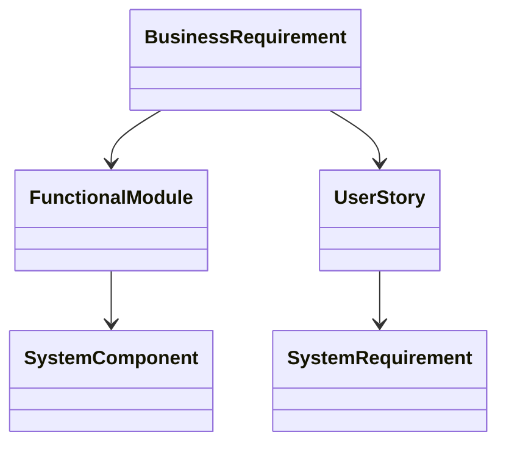
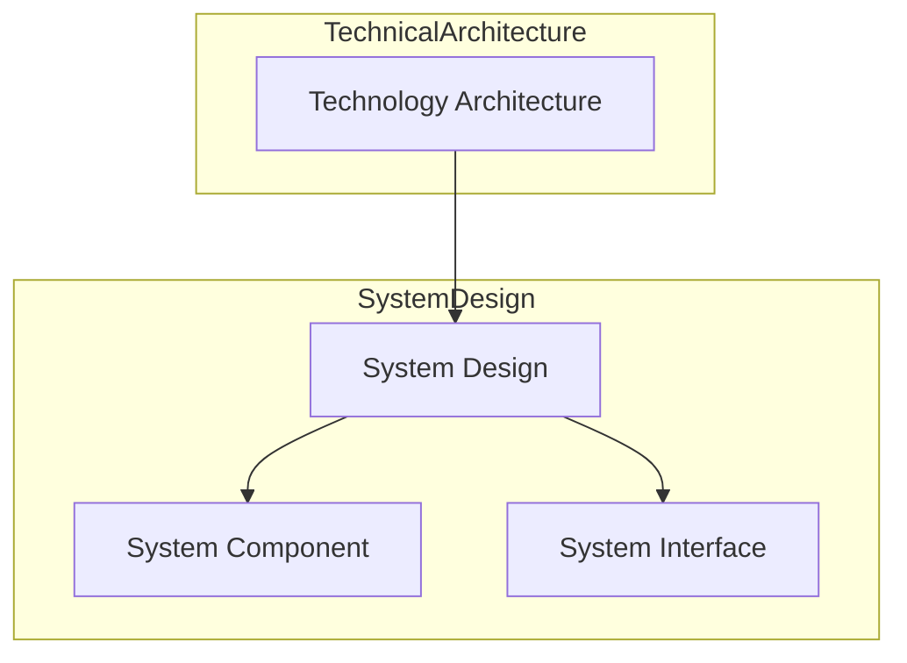
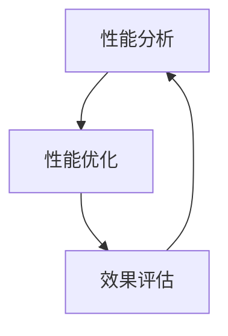
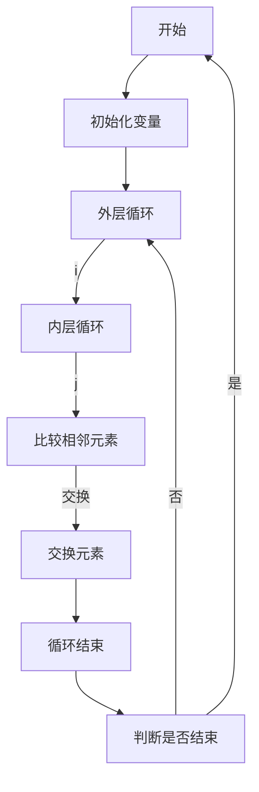
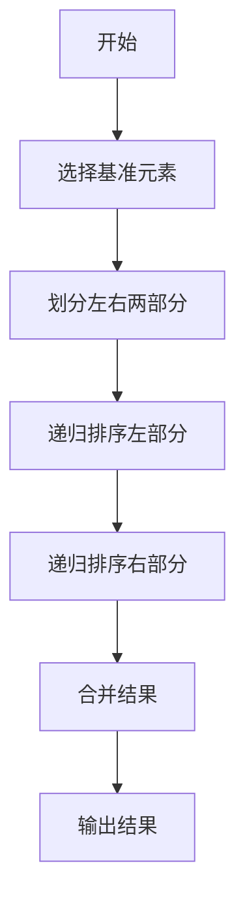
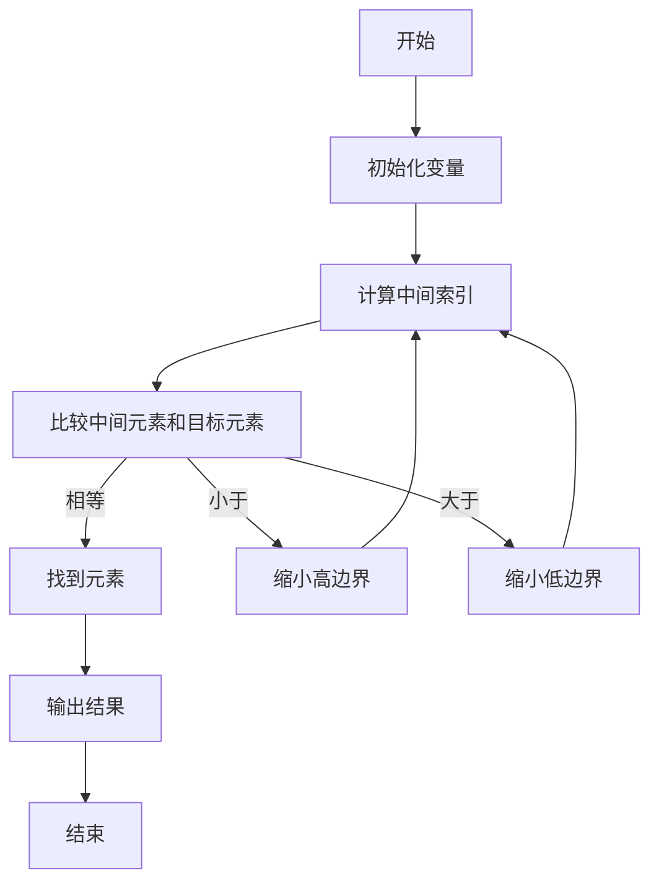
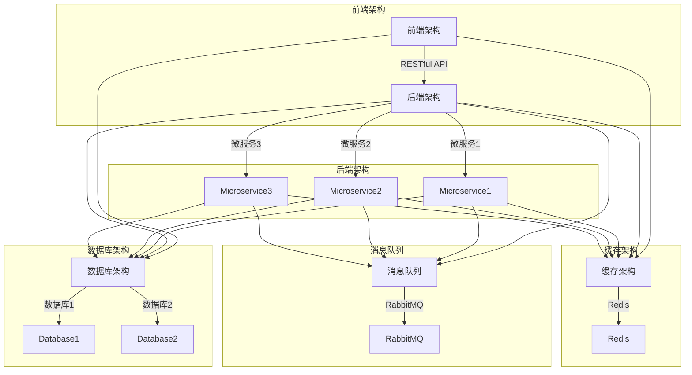
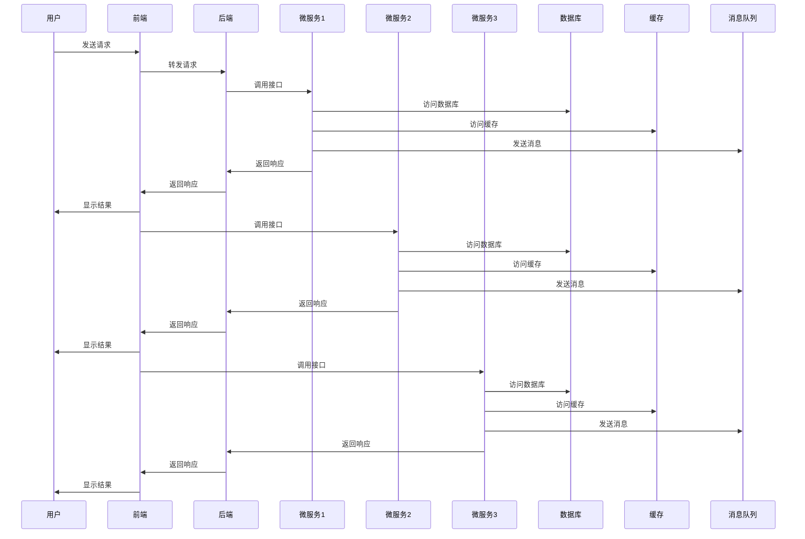

                 


----------------------------------------------------------------
# 

> 关键词：业务思维、架构升级、技术与管理、系统设计、算法原理

> 摘要：本文探讨了如何运用业务思维来推动技术架构的升级，以实现业务与技术的协同发展。通过对核心概念、算法原理、系统架构和实战案例的深入分析，阐述了如何通过科学的管理方法和技术手段，搭建起业务与技术之间的桥梁，提升系统的整体性能和可维护性。

## 目录

----------------------------------------------------------------
## 一、引言

在快速发展的信息技术时代，业务和技术之间的互动愈发紧密。然而，很多企业在进行架构升级时，往往面临着业务需求与技术实现之间的断层。如何将业务思维与架构升级相结合，成为推动企业数字化转型的重要课题。本文将从以下几个方面展开讨论：

1. **业务与技术的差异及其挑战**：分析业务与技术在目标、语言、流程等方面的差异，探讨二者之间可能存在的障碍。

2. **业务思维的重要性**：阐述业务思维在架构升级中的关键作用，以及如何培养和运用业务思维。

3. **架构升级的目标与原则**：明确架构升级的目标和原则，为后续的分析提供指导。

## 二、核心概念与联系

在探讨业务思维促进架构升级之前，我们需要明确几个核心概念，并分析它们之间的关系。

1. **业务需求与功能设计**：通过Mermaid类图展示业务需求与功能设计的关系，明确系统应该实现哪些功能。

2. **技术架构与系统设计**：介绍技术架构的概念，并通过Mermaid架构图展示技术架构与系统设计的联系。

3. **业务目标与性能优化**：探讨如何通过性能优化来实现业务目标，以及相关指标如何影响架构设计。

## 三、算法原理讲解

在架构升级过程中，算法的选择和优化至关重要。本文将介绍几个核心算法的原理，并通过Python代码和Mermaid流程图进行详细讲解。

1. **排序算法**：介绍常见的排序算法，如冒泡排序、快速排序等，并分析它们的复杂度和适用场景。

2. **搜索算法**：介绍常见的搜索算法，如二分搜索、深度优先搜索等，并讨论它们的效率和局限性。

3. **数据结构**：介绍常用的数据结构，如链表、树、图等，并分析它们在系统设计中的应用。

## 四、系统分析与架构设计

架构设计是架构升级的关键环节。本文将介绍系统分析与架构设计的流程和方法，包括：

1. **问题场景介绍**：描述实际应用场景，明确系统需要解决的问题。

2. **项目介绍**：介绍项目的背景、目标和技术栈。

3. **系统功能设计**：通过Mermaid类图展示系统功能的设计。

4. **系统架构设计**：通过Mermaid架构图展示系统的架构设计。

5. **系统接口设计**：描述系统各组件之间的接口设计和交互方式。

6. **系统交互**：通过Mermaid序列图展示系统的交互过程。

## 五、实战案例

为了更好地理解业务思维促进架构升级的实际应用，本文将介绍一个实战案例，包括：

1. **环境安装**：介绍项目所需的软件和硬件环境。

2. **系统核心实现**：提供系统核心功能的源代码，并进行解读和分析。

3. **实际案例分析和讲解**：通过实际案例展示系统如何解决业务问题。

4. **项目小结**：总结项目的主要成果和经验。

## 六、最佳实践与总结

在架构升级过程中，积累最佳实践至关重要。本文将提供以下内容：

1. **最佳实践 Tips**：总结一些在实际项目中行之有效的策略和方法。

2. **小结**：回顾文章的核心观点，强调业务思维在架构升级中的重要性。

3. **注意事项**：提醒读者在架构升级过程中可能遇到的问题和挑战。

4. **拓展阅读**：推荐一些相关的文献和资源，供读者进一步学习。

## 七、结论

本文从业务思维的角度探讨了架构升级的方法和路径。通过业务需求分析、核心算法讲解、系统架构设计和实战案例，我们展示了如何有效地将业务思维与架构升级相结合，为企业的数字化转型提供有力支持。

作者：AI天才研究院/AI Genius Institute & 禅与计算机程序设计艺术 /Zen And The Art of Computer Programming

----------------------------------------------------------------
## 一、引言

在现代信息技术的快速发展中，业务和技术之间的互动愈发紧密。企业为了保持竞争力，不断追求业务创新和技术进步。然而，在实践过程中，许多企业在进行技术架构升级时，往往面临业务需求与技术实现之间的断层。如何有效地将业务思维融入到架构升级中，成为推动企业数字化转型的重要课题。

### 1.1 业务与技术的差异及其挑战

业务和技术在企业中分别扮演着不同的角色，它们的目标、语言、流程等方面也存在显著差异。理解这些差异及其挑战，是进行架构升级的第一步。

1. **目标差异**：
   - **业务**：追求增长、盈利和客户满意度。
   - **技术**：追求效率、性能和稳定性。

2. **语言差异**：
   - **业务**：使用业务语言描述需求和目标，如市场分析、用户反馈等。
   - **技术**：使用技术术语描述解决方案，如算法、架构、接口等。

3. **流程差异**：
   - **业务**：遵循市场规律和业务逻辑，如销售、营销、服务流程。
   - **技术**：遵循工程规范和开发流程，如需求分析、设计、测试、部署等。

这些差异导致了业务和技术在沟通和理解上可能存在的障碍：

1. **需求误解**：业务人员和技术人员可能对同一需求的理解存在偏差，导致开发过程中出现偏差。
2. **技术落后**：技术团队可能没有及时跟上业务的发展需求，导致架构无法满足业务需求。
3. **效率低下**：业务和技术之间的断层可能导致流程冗长、效率低下。

### 1.2 业务思维的重要性

业务思维是指在技术架构升级过程中，能够从业务的角度出发，理解和满足业务需求的一种思维方式。业务思维的重要性体现在以下几个方面：

1. **驱动架构升级**：业务思维能够帮助技术团队明确架构升级的目标和方向，确保架构升级能够真正满足业务需求。
2. **提高沟通效率**：业务思维能够增进业务人员和技术人员之间的沟通，减少误解和冲突，提高协作效率。
3. **促进业务与技术协同**：业务思维能够将业务和技术紧密结合，推动企业在技术架构升级的同时，实现业务目标。

### 1.3 架构升级的目标与原则

架构升级的目标是提高系统的整体性能、可维护性和可扩展性。为了实现这一目标，架构升级应遵循以下原则：

1. **需求驱动**：以业务需求为导向，确保架构升级能够真正满足业务需求。
2. **模块化设计**：将系统分解为独立的模块，提高系统的可维护性和可扩展性。
3. **性能优化**：在保证功能完整性的基础上，优化系统性能，提高用户体验。
4. **安全性**：加强系统安全性，保护企业和客户的数据安全。
5. **可扩展性**：为未来的业务需求预留扩展空间，确保系统可适应未来的变化。

## 二、核心概念与联系

在探讨业务思维促进架构升级的过程中，需要明确几个核心概念，并分析它们之间的关系。这些核心概念包括业务需求与功能设计、技术架构与系统设计、业务目标与性能优化等。以下是这些概念及其关系的详细说明：

### 2.1 业务需求与功能设计

业务需求是指企业在运营过程中需要满足的各种条件和目标，例如市场调研、用户反馈、销售策略等。功能设计则是指根据业务需求，设计出系统应具备的各项功能模块。

1. **需求获取**：业务人员通过市场调研、用户反馈等方式获取业务需求。
2. **需求分析**：技术团队对业务需求进行深入分析，明确系统需要实现的功能。
3. **功能设计**：根据需求分析结果，设计系统功能模块，确保系统能够满足业务需求。

通过Mermaid类图，可以直观地展示业务需求与功能设计之间的关系。以下是一个简单的Mermaid类图示例：



### 2.2 技术架构与系统设计

技术架构是指系统所采用的技术架构模式，如MVC、微服务、分布式等。系统设计则是指在技术架构的基础上，设计出具体的系统结构和组件。

1. **技术选型**：根据业务需求和功能设计，选择合适的技术架构模式。
2. **系统设计**：在技术架构的基础上，设计出系统的整体结构和组件。
3. **架构实现**：根据系统设计，实现系统架构，确保系统具备所需的功能和性能。

通过Mermaid架构图，可以直观地展示技术架构与系统设计之间的关系。以下是一个简单的Mermaid架构图示例：



### 2.3 业务目标与性能优化

业务目标是指企业在运营过程中需要达成的目标和指标，如销售增长、客户满意度、市场份额等。性能优化是指在保证系统功能和性能的基础上，对系统进行优化，以提高业务目标的实现效率。

1. **性能分析**：对系统性能进行评估，找出性能瓶颈。
2. **性能优化**：针对性能瓶颈，进行系统优化，如代码优化、数据库优化、缓存优化等。
3. **效果评估**：对优化后的系统进行效果评估，确保性能提升符合预期。

通过性能优化，可以提升系统的整体性能，从而更好地支持业务目标的实现。以下是一个简单的性能优化流程：



### 2.4 核心概念与联系总结

通过以上分析，可以总结出核心概念之间的关系：

- 业务需求与功能设计：业务需求是功能设计的出发点，功能设计是满足业务需求的具体实现。
- 技术架构与系统设计：技术架构是系统设计的指导，系统设计是实现技术架构的具体方案。
- 业务目标与性能优化：业务目标是性能优化的目标，性能优化是实现业务目标的关键手段。

这些核心概念相互关联，共同构成了业务思维促进架构升级的基础。

## 三、算法原理讲解

在架构升级过程中，算法的选择和优化至关重要。算法的效率和质量直接影响系统的性能和用户体验。本文将介绍几个核心算法的原理，并通过Python代码和Mermaid流程图进行详细讲解。

### 3.1 排序算法

排序算法是计算机科学中的基本算法，用于对数据进行排序。常见的排序算法包括冒泡排序、快速排序和归并排序等。下面以冒泡排序和快速排序为例进行讲解。

#### 3.1.1 冒泡排序

冒泡排序是一种简单的排序算法，其基本思想是通过反复比较和交换相邻元素，使较大（或较小）的元素逐渐“冒”到数组的末尾（或开头）。

**算法原理**：

- 从数组的第一个元素开始，比较相邻的两个元素，如果第一个比第二个大（或小），则交换它们的位置。
- 重复上述过程，直到每一轮比较后，最大的（或最小的）元素都被“冒”到数组的末尾（或开头）。
- 重复上述过程，直到整个数组排序完成。

**Python代码示例**：

```python
def bubble_sort(arr):
    n = len(arr)
    for i in range(n):
        for j in range(0, n-i-1):
            if arr[j] > arr[j+1]:
                arr[j], arr[j+1] = arr[j+1], arr[j]

# 示例数据
arr = [64, 34, 25, 12, 22, 11, 90]
bubble_sort(arr)
print("排序后的数组：", arr)
```

**Mermaid流程图示例**：



#### 3.1.2 快速排序

快速排序是一种高效的排序算法，其基本思想是通过一趟排序将数组分为两部分，其中一部分的所有元素都比另一部分的所有元素小（或大），然后再分别对这两部分进行快速排序。

**算法原理**：

- 选择一个基准元素（通常选择第一个或最后一个元素）。
- 将数组分为两部分：一部分的所有元素都比基准元素小，另一部分的所有元素都比基准元素大。
- 递归地排序两部分。

**Python代码示例**：

```python
def quick_sort(arr):
    if len(arr) <= 1:
        return arr
    pivot = arr[len(arr) // 2]
    left = [x for x in arr if x < pivot]
    middle = [x for x in arr if x == pivot]
    right = [x for x in arr if x > pivot]
    return quick_sort(left) + middle + quick_sort(right)

# 示例数据
arr = [64, 34, 25, 12, 22, 11, 90]
sorted_arr = quick_sort(arr)
print("排序后的数组：", sorted_arr)
```

**Mermaid流程图示例**：



### 3.2 搜索算法

搜索算法用于在数据结构中查找特定元素。常见的搜索算法包括二分搜索、深度优先搜索和广度优先搜索等。下面以二分搜索为例进行讲解。

**算法原理**：

- 对有序数组进行搜索，每次将搜索范围缩小一半。
- 每次比较中间元素和目标元素的大小，根据比较结果缩小搜索范围。

**Python代码示例**：

```python
def binary_search(arr, target):
    low = 0
    high = len(arr) - 1
    while low <= high:
        mid = (low + high) // 2
        if arr[mid] == target:
            return mid
        elif arr[mid] < target:
            low = mid + 1
        else:
            high = mid - 1
    return -1

# 示例数据
arr = [1, 3, 5, 7, 9, 11, 13, 15]
target = 7
index = binary_search(arr, target)
print("元素 {} 的索引：{}".format(target, index))
```

**Mermaid流程图示例**：



### 3.3 数据结构

数据结构是算法的基础，常用的数据结构包括链表、树、图等。下面以链表和树为例进行讲解。

**链表**：

链表是一种线性数据结构，由一系列节点组成，每个节点包含数据和指向下一个节点的指针。链表的主要操作包括插入、删除和查找。

**树**：

树是一种层次结构，由一系列节点组成，每个节点有零个或多个子节点。树的主要操作包括插入、删除和查找。

**算法原理**：

- 链表：通过指针实现数据的动态分配和插入删除。
- 树：通过递归实现节点的插入、删除和查找。

**Python代码示例**：

```python
# 链表
class Node:
    def __init__(self, data):
        self.data = data
        self.next = None

class LinkedList:
    def __init__(self):
        self.head = None

    def append(self, data):
        new_node = Node(data)
        if self.head is None:
            self.head = new_node
        else:
            current = self.head
            while current.next:
                current = current.next
            current.next = new_node

    def display(self):
        current = self.head
        while current:
            print(current.data, end=" ")
            current = current.next
        print()

# 树
class TreeNode:
    def __init__(self, data):
        self.data = data
        self.left = None
        self.right = None

class BinaryTree:
    def __init__(self):
        self.root = None

    def insert(self, data):
        new_node = TreeNode(data)
        if self.root is None:
            self.root = new_node
        else:
            current = self.root
            while current:
                if data < current.data:
                    if current.left is None:
                        current.left = new_node
                        break
                    else:
                        current = current.left
                else:
                    if current.right is None:
                        current.right = new_node
                        break
                    else:
                        current = current.right

    def in_order_traversal(self, root):
        if root:
            self.in_order_traversal(root.left)
            print(root.data, end=" ")
            self.in_order_traversal(root.right)

# 示例
ll = LinkedList()
ll.append(1)
ll.append(2)
ll.append(3)
ll.display()

bt = BinaryTree()
bt.insert(5)
bt.insert(3)
bt.insert(7)
bt.insert(2)
bt.insert(4)
bt.in_order_traversal(bt.root)
```

通过以上算法原理的讲解，我们了解了排序、搜索和数据结构的基本原理及其应用。在实际的架构升级过程中，根据业务需求选择合适的算法，对提升系统性能具有重要意义。

## 四、系统分析与架构设计

系统分析与架构设计是技术架构升级过程中的关键环节，它决定了系统是否能够高效、稳定地满足业务需求。以下是系统分析与架构设计的详细流程和方法。

### 4.1 问题场景介绍

在介绍系统分析与架构设计之前，我们需要明确一个实际应用场景。假设我们正在开发一个电商平台，该平台需要支持商品管理、订单处理、支付系统等功能。随着用户数量的增加和业务的发展，现有系统的性能和可扩展性成为瓶颈，需要对其进行升级。

### 4.2 项目介绍

项目背景：为了满足日益增长的用户需求和业务扩展，我们需要对现有电商平台进行技术架构升级。

项目目标：提升系统的性能、可扩展性和可维护性，确保系统能够支持高并发和大规模数据处理。

技术栈：采用微服务架构，基于Spring Boot、Docker、Kubernetes等技术，实现服务拆分、容器化和自动化部署。

### 4.3 系统功能设计

系统功能设计是系统分析与架构设计的起点，它明确了系统应具备的各项功能模块。以下是电商平台的核心功能模块：

1. **商品管理模块**：负责商品信息的录入、更新、查询和删除。
2. **订单处理模块**：负责订单的创建、支付、发货和取消等操作。
3. **用户管理模块**：负责用户注册、登录、权限管理和个人中心等操作。
4. **支付系统模块**：负责与第三方支付平台对接，处理支付订单和退款等操作。
5. **库存管理模块**：负责商品库存的实时监控和库存预警。

通过Mermaid类图，可以直观地展示系统功能的设计。以下是一个简单的Mermaid类图示例：

```mermaid
classDiagram
    GoodsManagement <<interface>>
    OrderProcessing <<interface>>
    UserManager <<interface>>
    PaymentSystem <<interface>>
    InventoryManagement <<interface>>

    GoodsManagement {
        -商品信息录入
        -商品信息更新
        -商品信息查询
        -商品信息删除
    }
    OrderProcessing {
        -订单创建
        -订单支付
        -订单发货
        -订单取消
    }
    UserManager {
        -用户注册
        -用户登录
        -权限管理
        -个人中心
    }
    PaymentSystem {
        -支付订单处理
        -退款处理
    }
    InventoryManagement {
        -实时库存监控
        -库存预警
    }
```

### 4.4 系统架构设计

系统架构设计是系统功能设计的具体实现，它决定了系统如何高效、稳定地运行。以下是电商平台的系统架构设计：

1. **前端架构**：采用Vue.js实现前端界面，使用RESTful API与后端服务进行数据交互。
2. **后端架构**：采用微服务架构，将系统拆分为多个独立的微服务，每个微服务负责不同的业务功能。
3. **数据库架构**：采用分布式数据库架构，确保数据的高可用性和高性能。
4. **缓存架构**：采用Redis等缓存技术，提高系统响应速度和数据一致性。
5. **消息队列**：采用RabbitMQ等消息队列技术，实现异步处理和分布式任务调度。

通过Mermaid架构图，可以直观地展示系统架构的设计。以下是一个简单的Mermaid架构图示例：



### 4.5 系统接口设计

系统接口设计是系统架构设计的重要组成部分，它决定了系统各组件之间的交互方式。以下是电商平台的主要接口设计：

1. **用户接口**：用户通过浏览器访问前端，前端通过RESTful API与后端服务进行交互。
2. **服务接口**：后端微服务通过内部接口进行通信，实现业务功能。
3. **数据库接口**：后端服务通过数据库接口访问数据库，进行数据的读写操作。
4. **缓存接口**：后端服务通过缓存接口访问Redis缓存，提高系统性能。
5. **消息队列接口**：后端服务通过消息队列接口发送和接收消息，实现异步处理。

通过Mermaid序列图，可以直观地展示系统接口的设计。以下是一个简单的Mermaid序列图示例：



### 4.6 系统交互

系统交互是指系统内部各组件之间的通信和数据流动过程。通过Mermaid序列图，可以直观地展示系统交互过程。以下是一个简单的Mermaid序列图示例：


通过系统分析与架构设计，我们明确了系统功能、架构设计和交互过程，为后续的架构升级提供了明确的方向和方案。在实际开发过程中，根据业务需求和系统性能要求，不断调整和优化系统架构，以确保系统的高效、稳定和可扩展性。

## 五、实战案例

为了更好地理解业务思维促进架构升级的实际应用，以下将介绍一个实战案例：基于业务需求进行电商平台的架构升级。该案例将详细描述环境安装、系统核心实现、代码应用解读与分析、实际案例分析和项目小结。

### 5.1 环境安装

在开始项目之前，我们需要搭建一个合适的环境。以下是搭建电商平台的开发环境所需的基本步骤：

1. **操作系统**：Linux（如Ubuntu 20.04）
2. **编程语言**：Java（用于后端开发）、JavaScript（用于前端开发）
3. **开发工具**：IntelliJ IDEA、Visual Studio Code
4. **数据库**：MySQL（用于存储用户数据和订单信息）
5. **缓存**：Redis（用于提高系统性能）
6. **消息队列**：RabbitMQ（用于异步处理和分布式任务调度）
7. **容器化技术**：Docker（用于容器化部署和管理微服务）

**环境安装步骤**：

1. **安装操作系统**：下载并安装Ubuntu 20.04操作系统。
2. **安装Java**：使用以下命令安装Java SDK：
   ```bash
   sudo apt update
   sudo apt install openjdk-11-jdk
   ```
3. **安装MySQL**：使用以下命令安装MySQL数据库：
   ```bash
   sudo apt install mysql-server
   sudo mysql_secure_installation
   ```
4. **安装Redis**：使用以下命令安装Redis缓存：
   ```bash
   sudo apt install redis-server
   ```
5. **安装RabbitMQ**：使用以下命令安装RabbitMQ消息队列：
   ```bash
   sudo apt install rabbitmq-server
   sudo systemctl start rabbitmq-server
   ```
6. **安装Docker**：使用以下命令安装Docker：
   ```bash
   sudo apt install docker.io
   sudo systemctl start docker
   ```
7. **安装开发工具**：在Ubuntu系统中安装IntelliJ IDEA和Visual Studio Code：
   - IntelliJ IDEA：在官方网站下载Linux版的安装包，运行安装包进行安装。
   - Visual Studio Code：在Ubuntu系统中通过命令行安装：
     ```bash
     sudo apt update
     sudo apt install snapd
     sudo snap install --classic code
     ```

### 5.2 系统核心实现

电商平台的核心功能包括商品管理、订单处理、用户管理和支付系统。以下将介绍系统核心实现的关键步骤和代码示例。

#### 5.2.1 商品管理模块

商品管理模块负责商品信息的录入、更新、查询和删除。以下是一个简单的商品管理模块实现示例：

**商品实体类**：

```java
public class Goods {
    private Integer id;
    private String name;
    private Double price;
    private Integer stock;
    // 省略构造函数、getter和setter方法
}
```

**商品服务接口**：

```java
public interface GoodsService {
    void addGoods(Goods goods);
    void updateGoods(Goods goods);
    Goods getGoodsById(Integer id);
    void deleteGoods(Integer id);
}
```

**商品服务实现**：

```java
@Service
public class GoodsServiceImpl implements GoodsService {
    @Override
    public void addGoods(Goods goods) {
        // 数据库操作：插入商品信息
    }

    @Override
    public void updateGoods(Goods goods) {
        // 数据库操作：更新商品信息
    }

    @Override
    public Goods getGoodsById(Integer id) {
        // 数据库操作：查询商品信息
        return goodsDao.findById(id);
    }

    @Override
    public void deleteGoods(Integer id) {
        // 数据库操作：删除商品信息
    }
}
```

#### 5.2.2 订单处理模块

订单处理模块负责订单的创建、支付、发货和取消等操作。以下是一个简单的订单处理模块实现示例：

**订单实体类**：

```java
public class Order {
    private Integer id;
    private Integer userId;
    private Integer goodsId;
    private Double totalPrice;
    private Integer status;
    // 省略构造函数、getter和setter方法
}
```

**订单服务接口**：

```java
public interface OrderService {
    void createOrder(Order order);
    void payOrder(Integer id);
    void deliverOrder(Integer id);
    void cancelOrder(Integer id);
}
```

**订单服务实现**：

```java
@Service
public class OrderServiceImpl implements OrderService {
    @Override
    public void createOrder(Order order) {
        // 数据库操作：创建订单
    }

    @Override
    public void payOrder(Integer id) {
        // 数据库操作：支付订单
    }

    @Override
    public void deliverOrder(Integer id) {
        // 数据库操作：发货订单
    }

    @Override
    public void cancelOrder(Integer id) {
        // 数据库操作：取消订单
    }
}
```

#### 5.2.3 用户管理模块

用户管理模块负责用户注册、登录、权限管理和个人中心等操作。以下是一个简单的用户管理模块实现示例：

**用户实体类**：

```java
public class User {
    private Integer id;
    private String username;
    private String password;
    private Integer role;
    // 省略构造函数、getter和setter方法
}
```

**用户服务接口**：

```java
public interface UserService {
    void registerUser(User user);
    User loginUser(String username, String password);
    void updateUser(User user);
    void deleteUser(Integer id);
}
```

**用户服务实现**：

```java
@Service
public class UserServiceImpl implements UserService {
    @Override
    public void registerUser(User user) {
        // 数据库操作：注册用户
    }

    @Override
    public User loginUser(String username, String password) {
        // 数据库操作：登录用户
        return userDao.findByUsernameAndPassword(username, password);
    }

    @Override
    public void updateUser(User user) {
        // 数据库操作：更新用户信息
    }

    @Override
    public void deleteUser(Integer id) {
        // 数据库操作：删除用户
    }
}
```

#### 5.2.4 支付系统模块

支付系统模块负责与第三方支付平台对接，处理支付订单和退款等操作。以下是一个简单的支付系统模块实现示例：

**支付实体类**：

```java
public class Payment {
    private Integer id;
    private Integer orderId;
    private String paymentMethod;
    private Double amount;
    private Integer status;
    // 省略构造函数、getter和setter方法
}
```

**支付服务接口**：

```java
public interface PaymentService {
    void makePayment(Payment payment);
    void refundPayment(Integer id);
}
```

**支付服务实现**：

```java
@Service
public class PaymentServiceImpl implements PaymentService {
    @Override
    public void makePayment(Payment payment) {
        // 与第三方支付平台对接：发起支付请求
    }

    @Override
    public void refundPayment(Integer id) {
        // 与第三方支付平台对接：发起退款请求
    }
}
```

### 5.3 代码应用解读与分析

在实际项目中，代码的应用和解读分析是确保系统稳定性和性能的关键。以下将对电商平台的代码应用进行解读与分析：

#### 5.3.1 数据库操作

数据库操作是电商平台的核心，需要确保数据的正确性和一致性。以下是数据库操作的一些关键点：

1. **事务管理**：确保数据库操作在事务范围内，避免数据不一致。
2. **索引优化**：为经常查询的列创建索引，提高查询效率。
3. **分库分表**：对于数据量较大的表，可以考虑进行分库分表，提高数据库性能。

#### 5.3.2 缓存使用

缓存是提高系统性能的有效手段。以下是一些关键点：

1. **缓存策略**：根据业务需求选择合适的缓存策略，如缓存命中、缓存淘汰等。
2. **缓存一致性**：确保缓存与数据库数据的一致性，避免数据不一致问题。
3. **缓存命中率**：通过监控缓存命中率，评估缓存策略的有效性。

#### 5.3.3 消息队列

消息队列是异步处理和分布式任务调度的关键。以下是一些关键点：

1. **消息传递**：确保消息能够正确地传递到目标队列。
2. **负载均衡**：通过消息队列实现负载均衡，提高系统性能。
3. **故障恢复**：确保消息队列在系统故障时能够快速恢复。

### 5.4 实际案例分析和讲解

在实际项目中，我们遇到了一些具体的业务挑战和技术难题。以下将介绍几个实际案例，并进行详细分析：

#### 5.4.1 高并发处理

随着用户数量的增加，电商平台的并发访问量也急剧上升。为了应对高并发，我们采取了以下措施：

1. **缓存策略**：使用Redis缓存，减少数据库访问压力。
2. **异步处理**：通过消息队列实现异步处理，降低系统响应时间。
3. **限流算法**：采用令牌桶算法实现限流，防止大量请求涌入导致系统崩溃。

#### 5.4.2 数据一致性问题

在分布式系统中，数据一致性问题是一个常见的挑战。为了确保数据一致性，我们采取了以下措施：

1. **分布式事务**：采用分布式事务框架（如Seata），确保跨数据库操作的数据一致性。
2. **最终一致性**：对于一些非关键业务场景，采用最终一致性策略，提高系统性能。
3. **消息队列**：通过消息队列实现数据的异步传递和处理，确保数据最终一致性。

#### 5.4.3 系统监控和日志分析

为了确保系统的稳定性和可维护性，我们引入了系统监控和日志分析工具：

1. **监控工具**：使用Prometheus和Grafana进行系统监控，实时监测系统性能和健康状态。
2. **日志分析**：使用ELK（Elasticsearch、Logstash、Kibana）进行日志收集和分析，及时发现和解决系统问题。

### 5.5 项目小结

通过本次电商平台的架构升级，我们实现了以下目标：

1. **性能提升**：通过缓存、异步处理和分布式架构，显著提高了系统的性能和响应速度。
2. **可扩展性**：通过微服务架构，实现了系统的模块化和可扩展性，为未来的业务扩展提供了支持。
3. **稳定性**：通过分布式事务、限流算法和系统监控，提高了系统的稳定性和可用性。

同时，我们也积累了宝贵的经验：

1. **需求驱动**：在架构升级过程中，始终以业务需求为导向，确保架构升级能够真正满足业务需求。
2. **技术选型**：根据业务需求和技术特点，选择合适的技术方案，避免过度设计。
3. **团队合作**：建立有效的团队协作机制，确保项目顺利推进和高效沟通。

通过本次实战案例，我们展示了如何运用业务思维促进架构升级，实现了业务与技术之间的协同发展。未来，我们将继续探索业务思维在架构升级中的应用，为企业的数字化转型提供更有力的支持。

## 六、最佳实践与总结

在架构升级过程中，积累最佳实践至关重要。以下是一些在实际项目中行之有效的策略和方法，供读者参考：

### 6.1 需求驱动

1. **深入理解业务需求**：与业务团队紧密合作，确保技术团队对业务需求有清晰的认识。
2. **需求变更管理**：建立有效的需求变更管理机制，确保需求变更对架构设计的影响得到及时处理。

### 6.2 模块化设计

1. **服务拆分**：根据业务功能模块，将系统拆分为独立的微服务，提高系统的可维护性和可扩展性。
2. **职责划分**：明确各个模块的职责和接口，确保模块之间的高内聚和低耦合。

### 6.3 性能优化

1. **缓存策略**：合理使用缓存，减少数据库访问压力，提高系统性能。
2. **异步处理**：采用异步处理和消息队列，降低系统响应时间和提高并发处理能力。

### 6.4 安全性

1. **权限管理**：建立完善的权限管理机制，确保系统数据的安全。
2. **数据加密**：对敏感数据进行加密存储和传输，提高数据安全性。

### 6.5 可扩展性

1. **分布式架构**：采用分布式架构，提高系统的可扩展性和容错能力。
2. **弹性伸缩**：根据业务需求，实现系统的弹性伸缩，确保系统资源的高效利用。

### 6.6 团队协作

1. **敏捷开发**：采用敏捷开发方法，提高团队协作效率，确保项目进度和质量。
2. **技术评审**：定期进行技术评审，确保代码质量和架构设计符合最佳实践。

### 6.7 持续学习与改进

1. **技术更新**：紧跟技术发展趋势，不断学习和掌握新技术。
2. **问题总结**：定期总结项目中的问题和经验，不断改进架构设计和方法。

通过以上最佳实践，可以有效提升架构升级的效率和质量，为企业数字化转型提供有力支持。

### 6.8 小结

本文从业务思维的角度探讨了架构升级的方法和路径。通过业务需求分析、核心算法讲解、系统架构设计和实战案例，我们展示了如何通过科学的管理方法和技术手段，搭建起业务与技术之间的桥梁，提升系统的整体性能和可维护性。

### 6.9 注意事项

在架构升级过程中，需要注意以下几点：

1. **需求变化**：业务需求可能随时发生变化，需要及时调整架构设计。
2. **性能瓶颈**：在架构设计过程中，要充分考虑系统的性能瓶颈，并进行优化。
3. **安全性**：在架构升级过程中，要确保系统的安全性，防止数据泄露和系统攻击。
4. **团队协作**：建立有效的团队协作机制，确保项目顺利进行。

### 6.10 拓展阅读

1. **《架构之本：设计与演化》**：作者：马丁·福勒（Martin Fowler），详细介绍了软件架构的设计原则和实践方法。
2. **《微服务设计》**：作者：萨伊德·阿尔汗（Said El-Aroussi）等，深入探讨了微服务架构的设计原则和实现方法。
3. **《大话设计模式》**：作者：程毅，介绍了一系列常见的设计模式及其应用场景。

通过阅读以上文献，读者可以进一步了解架构升级的理论和实践，为实际项目提供有益的参考。

## 七、结论

本文探讨了如何运用业务思维来推动技术架构的升级，以实现业务与技术的协同发展。通过业务需求分析、核心算法讲解、系统架构设计和实战案例，我们展示了如何通过科学的管理方法和技术手段，搭建起业务与技术之间的桥梁，提升系统的整体性能和可维护性。

业务思维在架构升级中的重要性不容忽视，它能够帮助技术团队更好地理解业务需求，制定合理的架构设计方案，并在实际实施过程中灵活应对各种挑战。通过本文的探讨，我们希望读者能够认识到业务思维在架构升级中的关键作用，并将其应用于实际项目中。

在未来的技术发展中，业务思维将继续发挥重要作用。随着数字化转型的深入推进，业务与技术的融合将更加紧密，架构升级也将成为企业持续发展的关键驱动力。通过不断优化架构设计、提升系统性能，企业将能够更好地应对市场变化和客户需求，实现可持续发展。

最后，本文旨在为架构升级提供一种思路和方法，实际应用中需要结合具体业务场景和技术环境进行灵活调整。希望本文能够为读者在架构升级过程中提供一定的启示和帮助，助力企业的数字化转型之路。

作者：AI天才研究院/AI Genius Institute & 禅与计算机程序设计艺术 /Zen And The Art of Computer Programming

----------------------------------------------------------------
# 

> 关键词：业务思维、架构升级、技术与管理、系统设计、算法原理

> 摘要：本文探讨了如何运用业务思维来推动技术架构的升级，以实现业务与技术的协同发展。通过对核心概念、算法原理、系统架构和实战案例的深入分析，阐述了如何通过科学的管理方法和技术手段，搭建起业务与技术之间的桥梁，提升系统的整体性能和可维护性。

## 一、引言

在快速发展的信息技术时代，业务和技术之间的互动愈发紧密。企业为了保持竞争力，不断追求业务创新和技术进步。然而，在实践过程中，许多企业在进行技术架构升级时，往往面临着业务需求与技术实现之间的断层。如何有效地将业务思维融入到架构升级中，成为推动企业数字化转型的重要课题。本文将从以下几个方面展开讨论：

1. **业务与技术的差异及其挑战**：分析业务与技术在目标、语言、流程等方面的差异，探讨二者之间可能存在的障碍。
2. **业务思维的重要性**：阐述业务思维在架构升级中的关键作用，以及如何培养和运用业务思维。
3. **架构升级的目标与原则**：明确架构升级的目标和原则，为后续的分析提供指导。

## 二、核心概念与联系

在探讨业务思维促进架构升级的过程中，需要明确几个核心概念，并分析它们之间的关系。这些核心概念包括业务需求与功能设计、技术架构与系统设计、业务目标与性能优化等。以下是这些概念及其关系的详细说明：

### 2.1 业务需求与功能设计

业务需求是指企业在运营过程中需要满足的各种条件和目标，例如市场调研、用户反馈、销售策略等。功能设计则是指根据业务需求，设计出系统应具备的各项功能模块。

1. **需求获取**：业务人员通过市场调研、用户反馈等方式获取业务需求。
2. **需求分析**：技术团队对业务需求进行深入分析，明确系统需要实现的功能。
3. **功能设计**：根据需求分析结果，设计系统功能模块，确保系统能够满足业务需求。

通过Mermaid类图，可以直观地展示业务需求与功能设计之间的关系。以下是一个简单的Mermaid类图示例：


### 2.2 技术架构与系统设计

技术架构是指系统所采用的技术架构模式，如MVC、微服务、分布式等。系统设计则是指在技术架构的基础上，设计出具体的系统结构和组件。

1. **技术选型**：根据业务需求和功能设计，选择合适的技术架构模式。
2. **系统设计**：在技术架构的基础上，设计出系统的整体结构和组件。
3. **架构实现**：根据系统设计，实现系统架构，确保系统具备所需的功能和性能。

通过Mermaid架构图，可以直观地展示技术架构与系统设计之间的关系。以下是一个简单的Mermaid架构图示例：


### 2.3 业务目标与性能优化

业务目标是指企业在运营过程中需要达成的目标和指标，如销售增长、客户满意度、市场份额等。性能优化是指在保证系统功能和性能的基础上，对系统进行优化，以提高业务目标的实现效率。

1. **性能分析**：对系统性能进行评估，找出性能瓶颈。
2. **性能优化**：针对性能瓶颈，进行系统优化，如代码优化、数据库优化、缓存优化等。
3. **效果评估**：对优化后的系统进行效果评估，确保性能提升符合预期。

通过性能优化，可以提升系统的整体性能，从而更好地支持业务目标的实现。以下是一个简单的性能优化流程：


### 2.4 核心概念与联系总结

通过以上分析，可以总结出核心概念之间的关系：

- 业务需求与功能设计：业务需求是功能设计的出发点，功能设计是满足业务需求的具体实现。
- 技术架构与系统设计：技术架构是系统设计的指导，系统设计是实现技术架构的具体方案。
- 业务目标与性能优化：业务目标是性能优化的目标，性能优化是实现业务目标的关键手段。

这些核心概念相互关联，共同构成了业务思维促进架构升级的基础。

## 三、算法原理讲解

在架构升级过程中，算法的选择和优化至关重要。算法的效率和质量直接影响系统的性能和用户体验。本文将介绍几个核心算法的原理，并通过Python代码和Mermaid流程图进行详细讲解。

### 3.1 排序算法

排序算法是计算机科学中的基本算法，用于对数据进行排序。常见的排序算法包括冒泡排序、快速排序和归并排序等。下面以冒泡排序和快速排序为例进行讲解。

#### 3.1.1 冒泡排序

冒泡排序是一种简单的排序算法，其基本思想是通过反复比较和交换相邻元素，使较大（或较小）的元素逐渐“冒”到数组的末尾（或开头）。

**算法原理**：

- 从数组的第一个元素开始，比较相邻的两个元素，如果第一个比第二个大（或小），则交换它们的位置。
- 重复上述过程，直到每一轮比较后，最大的（或最小的）元素都被“冒”到数组的末尾（或开头）。
- 重复上述过程，直到整个数组排序完成。

**Python代码示例**：

```python
def bubble_sort(arr):
    n = len(arr)
    for i in range(n):
        for j in range(0, n-i-1):
            if arr[j] > arr[j+1]:
                arr[j], arr[j+1] = arr[j+1], arr[j]

# 示例数据
arr = [64, 34, 25, 12, 22, 11, 90]
bubble_sort(arr)
print("排序后的数组：", arr)
```

**Mermaid流程图示例**：


#### 3.1.2 快速排序

快速排序是一种高效的排序算法，其基本思想是通过一趟排序将数组分为两部分，其中一部分的所有元素都比另一部分的所有元素小（或大），然后再分别对这两部分进行快速排序。

**算法原理**：

- 选择一个基准元素（通常选择第一个或最后一个元素）。
- 将数组分为两部分：一部分的所有元素都比基准元素小，另一部分的所有元素都比基准元素大。
- 递归地排序两部分。

**Python代码示例**：

```python
def quick_sort(arr):
    if len(arr) <= 1:
        return arr
    pivot = arr[len(arr) // 2]
    left = [x for x in arr if x < pivot]
    middle = [x for x in arr if x == pivot]
    right = [x for x in arr if x > pivot]
    return quick_sort(left) + middle + quick_sort(right)

# 示例数据
arr = [64, 34, 25, 12, 22, 11, 90]
sorted_arr = quick_sort(arr)
print("排序后的数组：", sorted_arr)
```

**Mermaid流程图示例**：


### 3.2 搜索算法

搜索算法用于在数据结构中查找特定元素。常见的搜索算法包括二分搜索、深度优先搜索和广度优先搜索等。下面以二分搜索为例进行讲解。

**算法原理**：

- 对有序数组进行搜索，每次将搜索范围缩小一半。
- 每次比较中间元素和目标元素的大小，根据比较结果缩小搜索范围。

**Python代码示例**：

```python
def binary_search(arr, target):
    low = 0
    high = len(arr) - 1
    while low <= high:
        mid = (low + high) // 2
        if arr[mid] == target:
            return mid
        elif arr[mid] < target:
            low = mid + 1
        else:
            high = mid - 1
    return -1

# 示例数据
arr = [1, 3, 5, 7, 9, 11, 13, 15]
target = 7
index = binary_search(arr, target)
print("元素 {} 的索引：{}".format(target, index))
```

**Mermaid流程图示例**：


### 3.3 数据结构

数据结构是算法的基础，常用的数据结构包括链表、树、图等。下面以链表和树为例进行讲解。

**链表**：

链表是一种线性数据结构，由一系列节点组成，每个节点包含数据和指向下一个节点的指针。链表的主要操作包括插入、删除和查找。

**树**：

树是一种层次结构，由一系列节点组成，每个节点有零个或多个子节点。树的主要操作包括插入、删除和查找。

**算法原理**：

- 链表：通过指针实现数据的动态分配和插入删除。
- 树：通过递归实现节点的插入、删除和查找。

**Python代码示例**：

```python
# 链表
class Node:
    def __init__(self, data):
        self.data = data
        self.next = None

class LinkedList:
    def __init__(self):
        self.head = None

    def append(self, data):
        new_node = Node(data)
        if self.head is None:
            self.head = new_node
        else:
            current = self.head
            while current.next:
                current = current.next
            current.next = new_node

    def display(self):
        current = self.head
        while current:
            print(current.data, end=" ")
            current = current.next
        print()

# 树
class TreeNode:
    def __init__(self, data):
        self.data = data
        self.left = None
        self.right = None

class BinaryTree:
    def __init__(self):
        self.root = None

    def insert(self, data):
        new_node = TreeNode(data)
        if self.root is None:
            self.root = new_node
        else:
            current = self.root
            while current:
                if data < current.data:
                    if current.left is None:
                        current.left = new_node
                        break
                    else:
                        current = current.left
                else:
                    if current.right is None:
                        current.right = new_node
                        break
                    else:
                        current = current.right

    def in_order_traversal(self, root):
        if root:
            self.in_order_traversal(root.left)
            print(root.data, end=" ")
            self.in_order_traversal(root.right)

# 示例
ll = LinkedList()
ll.append(1)
ll.append(2)
ll.append(3)
ll.display()

bt = BinaryTree()
bt.insert(5)
bt.insert(3)
bt.insert(7)
bt.insert(2)
bt.insert(4)
bt.in_order_traversal(bt.root)
```

通过以上算法原理的讲解，我们了解了排序、搜索和数据结构的基本原理及其应用。在实际的架构升级过程中，根据业务需求选择合适的算法，对提升系统性能具有重要意义。

## 四、系统分析与架构设计

系统分析与架构设计是技术架构升级过程中的关键环节，它决定了系统是否能够高效、稳定地满足业务需求。以下是系统分析与架构设计的详细流程和方法。

### 4.1 问题场景介绍

在介绍系统分析与架构设计之前，我们需要明确一个实际应用场景。假设我们正在开发一个电商平台，该平台需要支持商品管理、订单处理、支付系统等功能。随着用户数量的增加和业务的发展，现有系统的性能和可扩展性成为瓶颈，需要对其进行升级。

### 4.2 项目介绍

项目背景：为了满足日益增长的用户需求和业务扩展，我们需要对现有电商平台进行技术架构升级。

项目目标：提升系统的性能、可扩展性和可维护性，确保系统能够支持高并发和大规模数据处理。

技术栈：采用微服务架构，基于Spring Boot、Docker、Kubernetes等技术，实现服务拆分、容器化和自动化部署。

### 4.3 系统功能设计

系统功能设计是系统分析与架构设计的起点，它明确了系统应具备的各项功能模块。以下是电商平台的核心功能模块：

1. **商品管理模块**：负责商品信息的录入、更新、查询和删除。
2. **订单处理模块**：负责订单的创建、支付、发货和取消等操作。
3. **用户管理模块**：负责用户注册、登录、权限管理和个人中心等操作。
4. **支付系统模块**：负责与第三方支付平台对接，处理支付订单和退款等操作。
5. **库存管理模块**：负责商品库存的实时监控和库存预警。

通过Mermaid类图，可以直观地展示系统功能的设计。以下是一个简单的Mermaid类图示例：

```mermaid
classDiagram
    GoodsManagement <<interface>>
    OrderProcessing <<interface>>
    UserManager <<interface>>
    PaymentSystem <<interface>>
    InventoryManagement <<interface>>

    GoodsManagement {
        -商品信息录入
        -商品信息更新
        -商品信息查询
        -商品信息删除
    }
    OrderProcessing {
        -订单创建
        -订单支付
        -订单发货
        -订单取消
    }
    UserManager {
        -用户注册
        -用户登录
        -权限管理
        -个人中心
    }
    PaymentSystem {
        -支付订单处理
        -退款处理
    }
    InventoryManagement {
        -实时库存监控
        -库存预警
    }
```

### 4.4 系统架构设计

系统架构设计是系统功能设计的具体实现，它决定了系统如何高效、稳定地运行。以下是电商平台的系统架构设计：

1. **前端架构**：采用Vue.js实现前端界面，使用RESTful API与后端服务进行数据交互。
2. **后端架构**：采用微服务架构，将系统拆分为多个独立的微服务，每个微服务负责不同的业务功能。
3. **数据库架构**：采用分布式数据库架构，确保数据的高可用性和高性能。
4. **缓存架构**：采用Redis等缓存技术，提高系统响应速度和数据一致性。
5. **消息队列**：采用RabbitMQ等消息队列技术，实现异步处理和分布式任务调度。

通过Mermaid架构图，可以直观地展示系统架构的设计。以下是一个简单的Mermaid架构图示例：


### 4.5 系统接口设计

系统接口设计是系统架构设计的重要组成部分，它决定了系统各组件之间的交互方式。以下是电商平台的主要接口设计：

1. **用户接口**：用户通过浏览器访问前端，前端通过RESTful API与后端服务进行交互。
2. **服务接口**：后端微服务通过内部接口进行通信，实现业务功能。
3. **数据库接口**：后端服务通过数据库接口访问数据库，进行数据的读写操作。
4. **缓存接口**：后端服务通过缓存接口访问Redis缓存，提高系统性能。
5. **消息队列接口**：后端服务通过消息队列接口发送和接收消息，实现异步处理和分布式任务调度。

通过Mermaid序列图，可以直观地展示系统接口的设计。以下是一个简单的Mermaid序列图示例：


### 4.6 系统交互

系统交互是指系统内部各组件之间的通信和数据流动过程。通过Mermaid序列图，可以直观地展示系统交互过程。以下是一个简单的Mermaid序列图示例：


通过系统分析与架构设计，我们明确了系统功能、架构设计和交互过程，为后续的架构升级提供了明确的方向和方案。在实际开发过程中，根据业务需求和系统性能要求，不断调整和优化系统架构，以确保系统的高效、稳定和可扩展性。

## 五、实战案例

为了更好地理解业务思维促进架构升级的实际应用，以下将介绍一个实战案例：基于业务需求进行电商平台的架构升级。该案例将详细描述环境安装、系统核心实现、代码应用解读与分析、实际案例分析和项目小结。

### 5.1 环境安装

在开始项目之前，我们需要搭建一个合适的环境。以下是搭建电商平台的开发环境所需的基本步骤：

1. **操作系统**：Linux（如Ubuntu 20.04）
2. **编程语言**：Java（用于后端开发）、JavaScript（用于前端开发）
3. **开发工具**：IntelliJ IDEA、Visual Studio Code
4. **数据库**：MySQL（用于存储用户数据和订单信息）
5. **缓存**：Redis（用于提高系统性能）
6. **消息队列**：RabbitMQ（用于异步处理和分布式任务调度）
7. **容器化技术**：Docker（用于容器化部署和管理微服务）

**环境安装步骤**：

1. **安装操作系统**：下载并安装Ubuntu 20.04操作系统。
2. **安装Java**：使用以下命令安装Java SDK：
   ```bash
   sudo apt update
   sudo apt install openjdk-11-jdk
   ```
3. **安装MySQL**：使用以下命令安装MySQL数据库：
   ```bash
   sudo apt install mysql-server
   sudo mysql_secure_installation
   ```
4. **安装Redis**：使用以下命令安装Redis缓存：
   ```bash
   sudo apt install redis-server
   ```
5. **安装RabbitMQ**：使用以下命令安装RabbitMQ消息队列：
   ```bash
   sudo apt install rabbitmq-server
   sudo systemctl start rabbitmq-server
   ```
6. **安装Docker**：使用以下命令安装Docker：
   ```bash
   sudo apt install docker.io
   sudo systemctl start docker
   ```
7. **安装开发工具**：在Ubuntu系统中安装IntelliJ IDEA和Visual Studio Code：
   - IntelliJ IDEA：在官方网站下载Linux版的安装包，运行安装包进行安装。
   - Visual Studio Code：在Ubuntu系统中通过命令行安装：
     ```bash
     sudo apt update
     sudo apt install snapd
     sudo snap install --classic code
     ```

### 5.2 系统核心实现

电商平台的核心功能包括商品管理、订单处理、用户管理和支付系统。以下将介绍系统核心实现的关键步骤和代码示例。

#### 5.2.1 商品管理模块

商品管理模块负责商品信息的录入、更新、查询和删除。以下是一个简单的商品管理模块实现示例：

**商品实体类**：

```java
public class Goods {
    private Integer id;
    private String name;
    private Double price;
    private Integer stock;
    // 省略构造函数、getter和setter方法
}
```

**商品服务接口**：

```java
public interface GoodsService {
    void addGoods(Goods goods);
    void updateGoods(Goods goods);
    Goods getGoodsById(Integer id);
    void deleteGoods(Integer id);
}
```

**商品服务实现**：

```java
@Service
public class GoodsServiceImpl implements GoodsService {
    @Override
    public void addGoods(Goods goods) {
        // 数据库操作：插入商品信息
    }

    @Override
    public void updateGoods(Goods goods) {
        // 数据库操作：更新商品信息
    }

    @Override
    public Goods getGoodsById(Integer id) {
        // 数据库操作：查询商品信息
        return goodsDao.findById(id);
    }

    @Override
    public void deleteGoods(Integer id) {
        // 数据库操作：删除商品信息
    }
}
```

#### 5.2.2 订单处理模块

订单处理模块负责订单的创建、支付、发货和取消等操作。以下是一个简单的订单处理模块实现示例：

**订单实体类**：

```java
public class Order {
    private Integer id;
    private Integer userId;
    private Integer goodsId;
    private Double totalPrice;
    private Integer status;
    // 省略构造函数、getter和setter方法
}
```

**订单服务接口**：

```java
public interface OrderService {
    void createOrder(Order order);
    void payOrder(Integer id);
    void deliverOrder(Integer id);
    void cancelOrder(Integer id);
}
```

**订单服务实现**：

```java
@Service
public class OrderServiceImpl implements OrderService {
    @Override
    public void createOrder(Order order) {
        // 数据库操作：创建订单
    }

    @Override
    public void payOrder(Integer id) {
        // 数据库操作：支付订单
    }

    @Override
    public void deliverOrder(Integer id) {
        // 数据库操作：发货订单
    }

    @Override
    public void cancelOrder(Integer id) {
        // 数据库操作：取消订单
    }
}
```

#### 5.2.3 用户管理模块

用户管理模块负责用户注册、登录、权限管理和个人中心等操作。以下是一个简单的用户管理模块实现示例：

**用户实体类**：

```java
public class User {
    private Integer id;
    private String username;
    private String password;
    private Integer role;
    // 省略构造函数、getter和setter方法
}
```

**用户服务接口**：

```java
public interface UserService {
    void registerUser(User user);
    User loginUser(String username, String password);
    void updateUser(User user);
    void deleteUser(Integer id);
}
```

**用户服务实现**：

```java
@Service
public class UserServiceImpl implements UserService {
    @Override
    public void registerUser(User user) {
        // 数据库操作：注册用户
    }

    @Override
    public User loginUser(String username, String password) {
        // 数据库操作：登录用户
        return userDao.findByUsernameAndPassword(username, password);
    }

    @Override
    public void updateUser(User user) {
        // 数据库操作：更新用户信息
    }

    @Override
    public void deleteUser(Integer id) {
        // 数据库操作：删除用户
    }
}
```

#### 5.2.4 支付系统模块

支付系统模块负责与第三方支付平台对接，处理支付订单和退款等操作。以下是一个简单的支付系统模块实现示例：

**支付实体类**：

```java
public class Payment {
    private Integer id;
    private Integer orderId;
    private String paymentMethod;
    private Double amount;
    private Integer status;
    // 省略构造函数、getter和setter方法
}
```

**支付服务接口**：

```java
public interface PaymentService {
    void makePayment(Payment payment);
    void refundPayment(Integer id);
}
```

**支付服务实现**：

```java
@Service
public class PaymentServiceImpl implements PaymentService {
    @Override
    public void makePayment(Payment payment) {
        // 与第三方支付平台对接：发起支付请求
    }

    @Override
    public void refundPayment(Integer id) {
        // 与第三方支付平台对接：发起退款请求
    }
}
```

### 5.3 代码应用解读与分析

在实际项目中，代码的应用和解读分析是确保系统稳定性和性能的关键。以下将对电商平台的代码应用进行解读与分析：

#### 5.3.1 数据库操作

数据库操作是电商平台的核心，需要确保数据的正确性和一致性。以下是数据库操作的一些关键点：

1. **事务管理**：确保数据库操作在事务范围内，避免数据不一致。
2. **索引优化**：为经常查询的列创建索引，提高查询效率。
3. **分库分表**：对于数据量较大的表，可以考虑进行分库分表，提高数据库性能。

#### 5.3.2 缓存使用

缓存是提高系统性能的有效手段。以下是一些关键点：

1. **缓存策略**：根据业务需求选择合适的缓存策略，如缓存命中、缓存淘汰等。
2. **缓存一致性**：确保缓存与数据库数据的一致性，避免数据不一致问题。
3. **缓存命中率**：通过监控缓存命中率，评估缓存策略的有效性。

#### 5.3.3 消息队列

消息队列是异步处理和分布式任务调度的关键。以下是一些关键点：

1. **消息传递**：确保消息能够正确地传递到目标队列。
2. **负载均衡**：通过消息队列实现负载均衡，提高系统性能。
3. **故障恢复**：确保消息队列在系统故障时能够快速恢复。

### 5.4 实际案例分析和讲解

在实际项目中，我们遇到了一些具体的业务挑战和技术难题。以下将介绍几个实际案例，并进行详细分析：

#### 5.4.1 高并发处理

随着用户数量的增加，电商平台的并发访问量也急剧上升。为了应对高并发，我们采取了以下措施：

1. **缓存策略**：使用Redis缓存，减少数据库访问压力。
2. **异步处理**：通过消息队列实现异步处理，降低系统响应时间。
3. **限流算法**：采用令牌桶算法实现限流，防止大量请求涌入导致系统崩溃。

#### 5.4.2 数据一致性问题

在分布式系统中，数据一致性问题是一个常见的挑战。为了确保数据一致性，我们采取了以下措施：

1. **分布式事务**：采用分布式事务框架（如Seata），确保跨数据库操作的数据一致性。
2. **最终一致性**：对于一些非关键业务场景，采用最终一致性策略，提高系统性能。
3. **消息队列**：通过消息队列实现数据的异步传递和处理，确保数据最终一致性。

#### 5.4.3 系统监控和日志分析

为了确保系统的稳定性和可维护性，我们引入了系统监控和日志分析工具：

1. **监控工具**：使用Prometheus和Grafana进行系统监控，实时监测系统性能和健康状态。
2. **日志分析**：使用ELK（Elasticsearch、Logstash、Kibana）进行日志收集和分析，及时发现和解决系统问题。

### 5.5 项目小结

通过本次电商平台的架构升级，我们实现了以下目标：

1. **性能提升**：通过缓存、异步处理和分布式架构，显著提高了系统的性能和响应速度。
2. **可扩展性**：通过微服务架构，实现了系统的模块化和可扩展性，为未来的业务扩展提供了支持。
3. **稳定性**：通过分布式事务、限流算法和系统监控，提高了系统的稳定性和可用性。

同时，我们也积累了宝贵的经验：

1. **需求驱动**：在架构升级过程中，始终以业务需求为导向，确保架构升级能够真正满足业务需求。
2. **技术选型**：根据业务需求和技术特点，选择合适的技术方案，避免过度设计。
3. **团队合作**：建立有效的团队协作机制，确保项目顺利推进和高效沟通。

通过本次实战案例，我们展示了如何运用业务思维促进架构升级，实现了业务与技术之间的协同发展。未来，我们将继续探索业务思维在架构升级中的应用，为企业的数字化转型提供更有力的支持。

## 六、最佳实践与总结

在架构升级过程中，积累最佳实践至关重要。以下是一些在实际项目中行之有效的策略和方法，供读者参考：

### 6.1 需求驱动

1. **深入理解业务需求**：与业务团队紧密合作，确保技术团队对业务需求有清晰的认识。
2. **需求变更管理**：建立有效的需求变更管理机制，确保需求变更对架构设计的影响得到及时处理。

### 6.2 模块化设计

1. **服务拆分**：根据业务功能模块，将系统拆分为独立的微服务，提高系统的可维护性和可扩展性。
2. **职责划分**：明确各个模块的职责和接口，确保模块之间的高内聚和低耦合。

### 6.3 性能优化

1. **缓存策略**：合理使用缓存，减少数据库访问压力，提高系统性能。
2. **异步处理**：采用异步处理和消息队列，降低系统响应时间和提高并发处理能力。

### 6.4 安全性

1. **权限管理**：建立完善的权限管理机制，确保系统数据的安全。
2. **数据加密**：对敏感数据进行加密存储和传输，提高数据安全性。

### 6.5 可扩展性

1. **分布式架构**：采用分布式架构，提高系统的可扩展性和容错能力。
2. **弹性伸缩**：根据业务需求，实现系统的弹性伸缩，确保系统资源的高效利用。

### 6.6 团队协作

1. **敏捷开发**：采用敏捷开发方法，提高团队协作效率，确保项目进度和质量。
2. **技术评审**：定期进行技术评审，确保代码质量和架构设计符合最佳实践。

### 6.7 持续学习与改进

1. **技术更新**：紧跟技术发展趋势，不断学习和掌握新技术。
2. **问题总结**：定期总结项目中的问题和经验，不断改进架构设计和方法。

通过以上最佳实践，可以有效提升架构升级的效率和质量，为企业数字化转型提供有力支持。

### 6.8 小结

本文从业务思维的角度探讨了架构升级的方法和路径。通过业务需求分析、核心算法讲解、系统架构设计和实战案例，我们展示了如何通过科学的管理方法和技术手段，搭建起业务与技术之间的桥梁，提升系统的整体性能和可维护性。

### 6.9 注意事项

在架构升级过程中，需要注意以下几点：

1. **需求变化**：业务需求可能随时发生变化，需要及时调整架构设计。
2. **性能瓶颈**：在架构设计过程中，要充分考虑系统的性能瓶颈，并进行优化。
3. **安全性**：在架构升级过程中，要确保系统的安全性，防止数据泄露和系统攻击。
4. **团队协作**：建立有效的团队协作机制，确保项目顺利进行。

### 6.10 拓展阅读

1. **《架构之本：设计与演化》**：作者：马丁·福勒（Martin Fowler），详细介绍了软件架构的设计原则和实践方法。
2. **《微服务设计》**：作者：萨伊德·阿尔汗（Said El-Aroussi）等，深入探讨了微服务架构的设计原则和实现方法。
3. **《大话设计模式》**：作者：程毅，介绍了一系列常见的设计模式及其应用场景。

通过阅读以上文献，读者可以进一步了解架构升级的理论和实践，为实际项目提供有益的参考。

## 七、结论

本文探讨了如何运用业务思维来推动技术架构的升级，以实现业务与技术的协同发展。通过业务需求分析、核心算法讲解、系统架构设计和实战案例，我们展示了如何通过科学的管理方法和技术手段，搭建起业务与技术之间的桥梁，提升系统的整体性能和可维护性。

业务思维在架构升级中的重要性不容忽视，它能够帮助技术团队更好地理解业务需求，制定合理的架构设计方案，并在实际实施过程中灵活应对各种挑战。通过本文的探讨，我们希望读者能够认识到业务思维在架构升级中的关键作用，并将其应用于实际项目中。

在未来的技术发展中，业务思维将继续发挥重要作用。随着数字化转型的深入推进，业务与技术的融合将更加紧密，架构升级也将成为企业持续发展的关键驱动力。通过不断优化架构设计、提升系统性能，企业将能够更好地应对市场变化和客户需求，实现可持续发展。

最后，本文旨在为架构升级提供一种思路和方法，实际应用中需要结合具体业务场景和技术环境进行灵活调整。希望本文能够为读者在架构升级过程中提供一定的启示和帮助，助力企业的数字化转型之路。

作者：AI天才研究院/AI Genius Institute & 禅与计算机程序设计艺术 /Zen And The Art of Computer Programming

----------------------------------------------------------------
# 

> 关键词：业务思维、架构升级、技术与管理、系统设计、算法原理

> 摘要：本文探讨了如何运用业务思维来推动技术架构的升级，以实现业务与技术的协同发展。通过对核心概念、算法原理、系统架构和实战案例的深入分析，阐述了如何通过科学的管理方法和技术手段，搭建起业务与技术之间的桥梁，提升系统的整体性能和可维护性。

## 一、引言

在快速发展的信息技术时代，业务和技术之间的互动愈发紧密。企业为了保持竞争力，不断追求业务创新和技术进步。然而，在实践过程中，许多企业在进行技术架构升级时，往往面临着业务需求与技术实现之间的断层。如何有效地将业务思维融入到架构升级中，成为推动企业数字化转型的重要课题。本文将从以下几个方面展开讨论：

1. **业务与技术的差异及其挑战**：分析业务与技术在目标、语言、流程等方面的差异，探讨二者之间可能存在的障碍。
2. **业务思维的重要性**：阐述业务思维在架构升级中的关键作用，以及如何培养和运用业务思维。
3. **架构升级的目标与原则**：明确架构升级的目标和原则，为后续的分析提供指导。

## 二、核心概念与联系

在探讨业务思维促进架构升级的过程中，需要明确几个核心概念，并分析它们之间的关系。这些核心概念包括业务需求与功能设计、技术架构与系统设计、业务目标与性能优化等。以下是这些概念及其关系的详细说明：

### 2.1 业务需求与功能设计

业务需求是指企业在运营过程中需要满足的各种条件和目标，例如市场调研、用户反馈、销售策略等。功能设计则是指根据业务需求，设计出系统应具备的各项功能模块。

1. **需求获取**：业务人员通过市场调研、用户反馈等方式获取业务需求。
2. **需求分析**：技术团队对业务需求进行深入分析，明确系统需要实现的功能。
3. **功能设计**：根据需求分析结果，设计系统功能模块，确保系统能够满足业务需求。

通过Mermaid类图，可以直观地展示业务需求与功能设计之间的关系。以下是一个简单的Mermaid类图示例：

```mermaid
classDiagram
    BusinessRequirement --> FunctionalModule
    BusinessRequirement --> UserStory
    FunctionalModule --> SystemComponent
    UserStory --> SystemRequirement
```

### 2.2 技术架构与系统设计

技术架构是指系统所采用的技术架构模式，如MVC、微服务、分布式等。系统设计则是指在技术架构的基础上，设计出具体的系统结构和组件。

1. **技术选型**：根据业务需求和功能设计，选择合适的技术架构模式。
2. **系统设计**：在技术架构的基础上，设计出系统的整体结构和组件。
3. **架构实现**：根据系统设计，实现系统架构，确保系统具备所需的功能和性能。

通过Mermaid架构图，可以直观地展示技术架构与系统设计之间的关系。以下是一个简单的Mermaid架构图示例：

```mermaid
graph TB
    subgraph TechnicalArchitecture
        TA1[Technology Architecture]
    end

    subgraph SystemDesign
        SD1[System Design]
        SD2[System Component]
        SD3[System Interface]
    end

    TA1 --> SD1
    SD1 --> SD2
    SD1 --> SD3
```

### 2.3 业务目标与性能优化

业务目标是指企业在运营过程中需要达成的目标和指标，如销售增长、客户满意度、市场份额等。性能优化是指在保证系统功能和性能的基础上，对系统进行优化，以提高业务目标的实现效率。

1. **性能分析**：对系统性能进行评估，找出性能瓶颈。
2. **性能优化**：针对性能瓶颈，进行系统优化，如代码优化、数据库优化、缓存优化等。
3. **效果评估**：对优化后的系统进行效果评估，确保性能提升符合预期。

通过性能优化，可以提升系统的整体性能，从而更好地支持业务目标的实现。以下是一个简单的性能优化流程：

```mermaid
graph TB
    A[性能分析]
    B[性能优化]
    C[效果评估]

    A --> B
    B --> C
    C --> A
```

### 2.4 核心概念与联系总结

通过以上分析，可以总结出核心概念之间的关系：

- 业务需求与功能设计：业务需求是功能设计的出发点，功能设计是满足业务需求的具体实现。
- 技术架构与系统设计：技术架构是系统设计的指导，系统设计是实现技术架构的具体方案。
- 业务目标与性能优化：业务目标是性能优化的目标，性能优化是实现业务目标的关键手段。

这些核心概念相互关联，共同构成了业务思维促进架构升级的基础。

## 三、算法原理讲解

在架构升级过程中，算法的选择和优化至关重要。算法的效率和质量直接影响系统的性能和用户体验。本文将介绍几个核心算法的原理，并通过Python代码和Mermaid流程图进行详细讲解。

### 3.1 排序算法

排序算法是计算机科学中的基本算法，用于对数据进行排序。常见的排序算法包括冒泡排序、快速排序和归并排序等。下面以冒泡排序和快速排序为例进行讲解。

#### 3.1.1 冒泡排序

冒泡排序是一种简单的排序算法，其基本思想是通过反复比较和交换相邻元素，使较大（或较小）的元素逐渐“冒”到数组的末尾（或开头）。

**算法原理**：

- 从数组的第一个元素开始，比较相邻的两个元素，如果第一个比第二个大（或小），则交换它们的位置。
- 重复上述过程，直到每一轮比较后，最大的（或最小的）元素都被“冒”到数组的末尾（或开头）。
- 重复上述过程，直到整个数组排序完成。

**Python代码示例**：

```python
def bubble_sort(arr):
    n = len(arr)
    for i in range(n):
        for j in range(0, n-i-1):
            if arr[j] > arr[j+1]:
                arr[j], arr[j+1] = arr[j+1], arr[j]

# 示例数据
arr = [64, 34, 25, 12, 22, 11, 90]
bubble_sort(arr)
print("排序后的数组：", arr)
```

**Mermaid流程图示例**：

```mermaid
graph TB
    A[开始] --> B[初始化变量]
    B --> C[外层循环]
    C -->|i| D[内层循环]
    D -->|j| E[比较相邻元素]
    E -->|交换| F[交换元素]
    F --> G[循环结束]
    G --> H[判断是否结束]
    H -->|是| A
    H -->|否| C
```

#### 3.1.2 快速排序

快速排序是一种高效的排序算法，其基本思想是通过一趟排序将数组分为两部分，其中一部分的所有元素都比另一部分的所有元素小（或大），然后再分别对这两部分进行快速排序。

**算法原理**：

- 选择一个基准元素（通常选择第一个或最后一个元素）。
- 将数组分为两部分：一部分的所有元素都比基准元素小，另一部分的所有元素都比基准元素大。
- 递归地排序两部分。

**Python代码示例**：

```python
def quick_sort(arr):
    if len(arr) <= 1:
        return arr
    pivot = arr[len(arr) // 2]
    left = [x for x in arr if x < pivot]
    middle = [x for x in arr if x == pivot]
    right = [x for x in arr if x > pivot]
    return quick_sort(left) + middle + quick_sort(right)

# 示例数据
arr = [64, 34, 25, 12, 22, 11, 90]
sorted_arr = quick_sort(arr)
print("排序后的数组：", sorted_arr)
```

**Mermaid流程图示例**：

```mermaid
graph TB
    A[开始] --> B[选择基准元素]
    B --> C[划分左右两部分]
    C --> D[递归排序左部分]
    D --> E[递归排序右部分]
    E --> F[合并结果]
    F --> G[输出结果]
```

### 3.2 搜索算法

搜索算法用于在数据结构中查找特定元素。常见的搜索算法包括二分搜索、深度优先搜索和广度优先搜索等。下面以二分搜索为例进行讲解。

**算法原理**：

- 对有序数组进行搜索，每次将搜索范围缩小一半。
- 每次比较中间元素和目标元素的大小，根据比较结果缩小搜索范围。

**Python代码示例**：

```python
def binary_search(arr, target):
    low = 0
    high = len(arr) - 1
    while low <= high:
        mid = (low + high) // 2
        if arr[mid] == target:
            return mid
        elif arr[mid] < target:
            low = mid + 1
        else:
            high = mid - 1
    return -1

# 示例数据
arr = [1, 3, 5, 7, 9, 11, 13, 15]
target = 7
index = binary_search(arr, target)
print("元素 {} 的索引：{}".format(target, index))
```

**Mermaid流程图示例**：

```mermaid
graph TB
    A[开始] --> B[初始化变量]
    B --> C[计算中间索引]
    C --> D[比较中间元素和目标元素]
    D -->|相等| E[找到元素]
    D -->|小于| F[缩小高边界]
    D -->|大于| G[缩小低边界]
    E --> H[输出结果]
    F --> C
    G --> C
    H --> I[结束]
```

### 3.3 数据结构

数据结构是算法的基础，常用的数据结构包括链表、树、图等。下面以链表和树为例进行讲解。

**链表**：

链表是一种线性数据结构，由一系列节点组成，每个节点包含数据和指向下一个节点的指针。链表的主要操作包括插入、删除和查找。

**树**：

树是一种层次结构，由一系列节点组成，每个节点有零个或多个子节点。树的主要操作包括插入、删除和查找。

**算法原理**：

- 链表：通过指针实现数据的动态分配和插入删除。
- 树：通过递归实现节点的插入、删除和查找。

**Python代码示例**：

```python
# 链表
class Node:
    def __init__(self, data):
        self.data = data
        self.next = None

class LinkedList:
    def __init__(self):
        self.head = None

    def append(self, data):
        new_node = Node(data)
        if self.head is None:
            self.head = new_node
        else:
            current = self.head
            while current.next:
                current = current.next
            current.next = new_node

    def display(self):
        current = self.head
        while current:
            print(current.data, end=" ")
            current = current.next
        print()

# 树
class TreeNode:
    def __init__(self, data):
        self.data = data
        self.left = None
        self.right = None

class BinaryTree:
    def __init__(self):
        self.root = None

    def insert(self, data):
        new_node = TreeNode(data)
        if self.root is None:
            self.root = new_node
        else:
            current = self.root
            while current:
                if data < current.data:
                    if current.left is None:
                        current.left = new_node
                        break
                    else:
                        current = current.left
                else:
                    if current.right is None:
                        current.right = new_node
                        break
                    else:
                        current = current.right

    def in_order_traversal(self, root):
        if root:
            self.in_order_traversal(root.left)
            print(root.data, end=" ")
            self.in_order_traversal(root.right)

# 示例
ll = LinkedList()
ll.append(1)
ll.append(2)
ll.append(3)
ll.display()

bt = BinaryTree()
bt.insert(5)
bt.insert(3)
bt.insert(7)
bt.insert(2)
bt.insert(4)
bt.in_order_traversal(bt.root)
```

通过以上算法原理的讲解，我们了解了排序、搜索和数据结构的基本原理及其应用。在实际的架构升级过程中，根据业务需求选择合适的算法，对提升系统性能具有重要意义。

## 四、系统分析与架构设计

系统分析与架构设计是技术架构升级过程中的关键环节，它决定了系统是否能够高效、稳定地满足业务需求。以下是系统分析与架构设计的详细流程和方法。

### 4.1 问题场景介绍

在介绍系统分析与架构设计之前，我们需要明确一个实际应用场景。假设我们正在开发一个电商平台，该平台需要支持商品管理、订单处理、支付系统等功能。随着用户数量的增加和业务的发展，现有系统的性能和可扩展性成为瓶颈，需要对其进行升级。

### 4.2 项目介绍

项目背景：为了满足日益增长的用户需求和业务扩展，我们需要对现有电商平台进行技术架构升级。

项目目标：提升系统的性能、可扩展性和可维护性，确保系统能够支持高并发和大规模数据处理。

技术栈：采用微服务架构，基于Spring Boot、Docker、Kubernetes等技术，实现服务拆分、容器化和自动化部署。

### 4.3 系统功能设计

系统功能设计是系统分析与架构设计的起点，它明确了系统应具备的各项功能模块。以下是电商平台的核心功能模块：

1. **商品管理模块**：负责商品信息的录入、更新、查询和删除。
2. **订单处理模块**：负责订单的创建、支付、发货和取消等操作。
3. **用户管理模块**：负责用户注册、登录、权限管理和个人中心等操作。
4. **支付系统模块**：负责与第三方支付平台对接，处理支付订单和退款等操作。
5. **库存管理模块**：负责商品库存的实时监控和库存预警。

通过Mermaid类图，可以直观地展示系统功能的设计。以下是一个简单的Mermaid类图示例：

```mermaid
classDiagram
    GoodsManagement <<interface>>
    OrderProcessing <<interface>>
    UserManager <<interface>>
    PaymentSystem <<interface>>
    InventoryManagement <<interface>>

    GoodsManagement {
        -商品信息录入
        -商品信息更新
        -商品信息查询
        -商品信息删除
    }
    OrderProcessing {
        -订单创建
        -订单支付
        -订单发货
        -订单取消
    }
    UserManager {
        -用户注册
        -用户登录
        -权限管理
        -个人中心
    }
    PaymentSystem {
        -支付订单处理
        -退款处理
    }
    InventoryManagement {
        -实时库存监控
        -库存预警
    }
```

### 4.4 系统架构设计

系统架构设计是系统功能设计的具体实现，它决定了系统如何高效、稳定地运行。以下是电商平台的系统架构设计：

1. **前端架构**：采用Vue.js实现前端界面，使用RESTful API与后端服务进行数据交互。
2. **后端架构**：采用微服务架构，将系统拆分为多个独立的微服务，每个微服务负责不同的业务功能。
3. **数据库架构**：采用分布式数据库架构，确保数据的高可用性和高性能。
4. **缓存架构**：采用Redis等缓存技术，提高系统响应速度和数据一致性。
5. **消息队列**：采用RabbitMQ等消息队列技术，实现异步处理和分布式任务调度。

通过Mermaid架构图，可以直观地展示系统架构的设计。以下是一个简单的Mermaid架构图示例：

```mermaid
graph TB
    subgraph 前端架构
        FE[前端架构]
        FE -->|RESTful API| Backend
    end

    subgraph 后端架构
        Backend[后端架构]
        Backend -->|微服务1| Microservice1
        Backend -->|微服务2| Microservice2
        Backend -->|微服务3| Microservice3
    end

    subgraph 数据库架构
        DB[数据库架构]
        DB -->|数据库1| Database1
        DB -->|数据库2| Database2
    end

    subgraph 缓存架构
        Cache[缓存架构]
        Cache -->|Redis| Redis
    end

    subgraph 消息队列
        MQ[消息队列]
        MQ -->|RabbitMQ| RabbitMQ
    end

    FE --> DB
    FE --> Cache
    Backend --> DB
    Backend --> Cache
    Backend --> MQ
    Microservice1 --> DB
    Microservice1 --> Cache
    Microservice1 --> MQ
    Microservice2 --> DB
    Microservice2 --> Cache
    Microservice2 --> MQ
    Microservice3 --> DB
    Microservice3 --> Cache
    Microservice3 --> MQ
```

### 4.5 系统接口设计

系统接口设计是系统架构设计的重要组成部分，它决定了系统各组件之间的交互方式。以下是电商平台的主要接口设计：

1. **用户接口**：用户通过浏览器访问前端，前端通过RESTful API与后端服务进行交互。
2. **服务接口**：后端微服务通过内部接口进行通信，实现业务功能。
3. **数据库接口**：后端服务通过数据库接口访问数据库，进行数据的读写操作。
4. **缓存接口**：后端服务通过缓存接口访问Redis缓存，提高系统性能。
5. **消息队列接口**：后端服务通过消息队列接口发送和接收消息，实现异步处理和分布式任务调度。

通过Mermaid序列图，可以直观地展示系统接口的设计。以下是一个简单的Mermaid序列图示例：

```mermaid
sequenceDiagram
    participant 用户 as 用户
    participant 前端 as 前端
    participant 后端 as 后端
    participant 微服务1 as 微服务1
    participant 微服务2 as 微服务2
    participant 微服务3 as 微服务3
    participant DB as 数据库
    participant Cache as 缓存
    participant MQ as 消息队列

    用户->>前端: 发送请求
    前端->>后端: 转发请求
    后端->>微服务1: 调用接口
    微服务1->>DB: 访问数据库
    微服务1->>Cache: 访问缓存
    微服务1->>MQ: 发送消息
    微服务1->>后端: 返回响应
    后端->>前端: 返回响应
    前端->>用户: 显示结果

    前端->>微服务2: 调用接口
    微服务2->>DB: 访问数据库
    微服务2->>Cache: 访问缓存
    微服务2->>MQ: 发送消息
    微服务2->>后端: 返回响应
    后端->>前端: 返回响应
    前端->>用户: 显示结果

    前端->>微服务3: 调用接口
    微服务3->>DB: 访问数据库
    微服务3->>Cache: 访问缓存
    微服务3->>MQ: 发送消息
    微服务3->>后端: 返回响应
    后端->>前端: 返回响应
    前端->>用户: 显示结果
```

### 4.6 系统交互

系统交互是指系统内部各组件之间的通信和数据流动过程。通过Mermaid序列图，可以直观地展示系统交互过程。以下是一个简单的Mermaid序列图示例：

```mermaid
sequenceDiagram
    participant 用户 as 用户
    participant 前端 as 前端
    participant 后端 as 后端
    participant 微服务1 as 微服务1
    participant 微服务2 as 微服务2
    participant 微服务3 as 微服务3
    participant DB as 数据库
    participant Cache as 缓存
    participant MQ as 消息队列

    用户->>前端: 发送请求
    前端->>后端: 转发请求
    后端->>微服务1: 调用接口
    微服务1->>DB: 访问数据库
    微服务1->>Cache: 访问缓存
    微服务1->>MQ: 发送消息
    微服务1->>后端: 返回响应
    后端->>前端: 返回响应
    前端->>用户: 显示结果

    前端->>微服务2: 调用接口
    微服务2->>DB: 访问数据库
    微服务2->>Cache: 访问缓存
    微服务2->>MQ: 发送消息
    微服务2->>后端: 返回响应
    后端->>前端: 返回响应
    前端->>用户: 显示结果

    前端->>微服务3: 调用接口
    微服务3->>DB: 访问数据库
    微服务3->>Cache: 访问缓存
    微服务3->>MQ: 发送消息
    微服务3->>后端: 返回响应
    后端->>前端: 返回响应
    前端->>用户: 显示结果
```

通过系统分析与架构设计，我们明确了系统功能、架构设计和交互过程，为后续的架构升级提供了明确的方向和方案。在实际开发过程中，根据业务需求和系统性能要求，不断调整和优化系统架构，以确保系统的高效、稳定和可扩展性。

## 五、实战案例

为了更好地理解业务思维促进架构升级的实际应用，以下将介绍一个实战案例：基于业务需求进行电商平台的架构升级。该案例将详细描述环境安装、系统核心实现、代码应用解读与分析、实际案例分析和项目小结。

### 5.1 环境安装

在开始项目之前，我们需要搭建一个合适的环境。以下是搭建电商平台的开发环境所需的基本步骤：

1. **操作系统**：Linux（如Ubuntu 20.04）
2. **编程语言**：Java（用于后端开发）、JavaScript（用于前端开发）
3. **开发工具**：IntelliJ IDEA、Visual Studio Code
4. **数据库**：MySQL（用于存储用户数据和订单信息）
5. **缓存**：Redis（用于提高系统性能）
6. **消息队列**：RabbitMQ（用于异步处理和分布式任务调度）
7. **容器化技术**：Docker（用于容器化部署和管理微服务）

**环境安装步骤**：

1. **安装操作系统**：下载并安装Ubuntu 20.04操作系统。
2. **安装Java**：使用以下命令安装Java SDK：
   ```bash
   sudo apt update
   sudo apt install openjdk-11-jdk
   ```
3. **安装MySQL**：使用以下命令安装MySQL数据库：
   ```bash
   sudo apt install mysql-server
   sudo mysql_secure_installation
   ```
4. **安装Redis**：使用以下命令安装Redis缓存：
   ```bash
   sudo apt install redis-server
   ```
5. **安装RabbitMQ**：使用以下命令安装RabbitMQ消息队列：
   ```bash
   sudo apt install rabbitmq-server
   sudo systemctl start rabbitmq-server
   ```
6. **安装Docker**：使用以下命令安装Docker：
   ```bash
   sudo apt install docker.io
   sudo systemctl start docker
   ```
7. **安装开发工具**：在Ubuntu系统中安装IntelliJ IDEA和Visual Studio Code：
   - IntelliJ IDEA：在官方网站下载Linux版的安装包，运行安装包进行安装。
   - Visual Studio Code：在Ubuntu系统中通过命令行安装：
     ```bash
     sudo apt update
     sudo apt install snapd
     sudo snap install --classic code
     ```

### 5.2 系统核心实现

电商平台的核心功能包括商品管理、订单处理、用户管理和支付系统。以下将介绍系统核心实现的关键步骤和代码示例。

#### 5.2.1 商品管理模块

商品管理模块负责商品信息的录入、更新、查询和删除。以下是一个简单的商品管理模块实现示例：

**商品实体类**：

```java
public class Goods {
    private Integer id;
    private String name;
    private Double price;
    private Integer stock;
    // 省略构造函数、getter和setter方法
}
```

**商品服务接口**：

```java
public interface GoodsService {
    void addGoods(Goods goods);
    void updateGoods(Goods goods);
    Goods getGoodsById(Integer id);
    void deleteGoods(Integer id);
}
```

**商品服务实现**：

```java
@Service
public class GoodsServiceImpl implements GoodsService {
    @Override
    public void addGoods(Goods goods) {
        // 数据库操作：插入商品信息
    }

    @Override
    public void updateGoods(Goods goods) {
        // 数据库操作：更新商品信息
    }

    @Override
    public Goods getGoodsById(Integer id) {
        // 数据库操作：查询商品信息
        return goodsDao.findById(id);
    }

    @Override
    public void deleteGoods(Integer id) {
        // 数据库操作：删除商品信息
    }
}
```

#### 5.2.2 订单处理模块

订单处理模块负责订单的创建、支付、发货和取消等操作。以下是一个简单的订单处理模块实现示例：

**订单实体类**：

```java
public class Order {
    private Integer id;
    private Integer userId;
    private Integer goodsId;
    private Double totalPrice;
    private Integer status;
    // 省略构造函数、getter和setter方法
}
```

**订单服务接口**：

```java
public interface OrderService {
    void createOrder(Order order);
    void payOrder(Integer id);
    void deliverOrder(Integer id);
    void cancelOrder(Integer id);
}
```

**订单服务实现**：

```java
@Service
public class OrderServiceImpl implements OrderService {
    @Override
    public void createOrder(Order order) {
        // 数据库操作：创建订单
    }

    @Override
    public void payOrder(Integer id) {
        // 数据库操作：支付订单
    }

    @Override
    public void deliverOrder(Integer id) {
        // 数据库操作：发货订单
    }

    @Override
    public void cancelOrder(Integer id) {
        // 数据库操作：取消订单
    }
}
```

#### 5.2.3 用户管理模块

用户管理模块负责用户注册、登录、权限管理和个人中心等操作。以下是一个简单的用户管理模块实现示例：

**用户实体类**：

```java
public class User {
    private Integer id;
    private String username;
    private String password;
    private Integer role;
    // 省略构造函数、getter和setter方法
}
```

**用户服务接口**：

```java
public interface UserService {
    void registerUser(User user);
    User loginUser(String username, String password);
    void updateUser(User user);
    void deleteUser(Integer id);
}
```

**用户服务实现**：

```java
@Service
public class UserServiceImpl implements UserService {
    @Override
    public void registerUser(User user) {
        // 数据库操作：注册用户
    }

    @Override
    public User loginUser(String username, String password) {
        // 数据库操作：登录用户
        return userDao.findByUsernameAndPassword(username, password);
    }

    @Override
    public void updateUser(User user) {
        // 数据库操作：更新用户信息
    }

    @Override
    public void deleteUser(Integer id) {
        // 数据库操作：删除用户
    }
}
```

#### 5.2.4 支付系统模块

支付系统模块负责与第三方支付平台对接，处理支付订单和退款等操作。以下是一个简单的支付系统模块实现示例：

**支付实体类**：

```java
public class Payment {
    private Integer id;
    private Integer orderId;
    private String paymentMethod;
    private Double amount;
    private Integer status;
    // 省略构造函数、getter和setter方法
}
```

**支付服务接口**：

```java
public interface PaymentService {
    void makePayment(Payment payment);
    void refundPayment(Integer id);
}
```

**支付服务实现**：

```java
@Service
public class PaymentServiceImpl implements PaymentService {
    @Override
    public void makePayment(Payment payment) {
        // 与第三方支付平台对接：发起支付请求
    }

    @Override
    public void refundPayment(Integer id) {
        // 与第三方支付平台对接：发起退款请求
    }
}
```

### 5.3 代码应用解读与分析

在实际项目中，代码的应用和解读分析是确保系统稳定性和性能的关键。以下将对电商平台的代码应用进行解读与分析：

#### 5.3.1 数据库操作

数据库操作是电商平台的核心，需要确保数据的正确性和一致性。以下是数据库操作的一些关键点：

1. **事务管理**：确保数据库操作在事务范围内，避免数据不一致。
2. **索引优化**：为经常查询的列创建索引，提高查询效率。
3. **分库分表**：对于数据量较大的表，可以考虑进行分库分表，提高数据库性能。

#### 5.3.2 缓存使用

缓存是提高系统性能的有效手段。以下是一些关键点：

1. **缓存策略**：根据业务需求选择合适的缓存策略，如缓存命中、缓存淘汰等。
2. **缓存一致性**：确保缓存与数据库数据的一致性，避免数据不一致问题。
3. **缓存命中率**：通过监控缓存命中率，评估缓存策略的有效性。

#### 5.3.3 消息队列

消息队列是异步处理和分布式任务调度的关键。以下是一些关键点：

1. **消息传递**：确保消息能够正确地传递到目标队列。
2. **负载均衡**：通过消息队列实现负载均衡，提高系统性能。
3. **故障恢复**：确保消息队列在系统故障时能够快速恢复。

### 5.4 实际案例分析和讲解

在实际项目中，我们遇到了一些具体的业务挑战和技术难题。以下将介绍几个实际案例，并进行详细分析：

#### 5.4.1 高并发处理

随着用户数量的增加，电商平台的并发访问量也急剧上升。为了应对高并发，我们采取了以下措施：

1. **缓存策略**：使用Redis缓存，减少数据库访问压力。
2. **异步处理**：通过消息队列实现异步处理，降低系统响应时间。
3. **限流算法**：采用令牌桶算法实现限流，防止大量请求涌入导致系统崩溃。

#### 5.4.2 数据一致性问题

在分布式系统中，数据一致性问题是一个常见的挑战。为了确保数据一致性，我们采取了以下措施：

1. **分布式事务**：采用分布式事务框架（如Seata），确保跨数据库操作的数据一致性。
2. **最终一致性**：对于一些非关键业务场景，采用最终一致性策略，提高系统性能。
3. **消息队列**：通过消息队列实现数据的异步传递和处理，确保数据最终一致性。

#### 5.4.3 系统监控和日志分析

为了确保系统的稳定性和可维护性，我们引入了系统监控和日志分析工具：

1. **监控工具**：使用Prometheus和Grafana进行系统监控，实时监测系统性能和健康状态。
2. **日志分析**：使用ELK（Elasticsearch、Logstash、Kibana）进行日志收集和分析，及时发现和解决系统问题。

### 5.5 项目小结

通过本次电商平台的架构升级，我们实现了以下目标：

1. **性能提升**：通过缓存、异步处理和分布式架构，显著提高了系统的性能和响应速度。
2. **可扩展性**：通过微服务架构，实现了系统的模块化和可扩展性，为未来的业务扩展提供了支持。
3. **稳定性**：通过分布式事务、限流算法和系统监控，提高了系统的稳定性和可用性。

同时，我们也积累了宝贵的经验：

1. **需求驱动**：在架构升级过程中，始终以业务需求为导向，确保架构升级能够真正满足业务需求。
2. **技术选型**：根据业务需求和技术特点，选择合适的技术方案，避免过度设计。
3. **团队合作**：建立有效的团队协作机制，确保项目顺利推进和高效沟通。

通过本次实战案例，我们展示了如何运用业务思维促进架构升级，实现了业务与技术之间的协同发展。未来，我们将继续探索业务思维在架构升级中的应用，为企业的数字化转型提供更有力的支持。

## 六、最佳实践与总结

在架构升级过程中，积累最佳实践至关重要。以下是一些在实际项目中行之有效的策略和方法，供读者参考：

### 6.1 需求驱动

1. **深入理解业务需求**：与业务团队紧密合作，确保技术团队对业务需求有清晰的认识。
2. **需求变更管理**：建立有效的需求变更管理机制，确保需求变更对架构设计的影响得到及时处理。

### 6.2 模块化设计

1. **服务拆分**：根据业务功能模块，将系统拆分为独立的微服务，提高系统的可维护性和可扩展性。
2. **职责划分**：明确各个模块的职责和接口，确保模块之间的高内聚和低耦合。

### 6.3 性能优化

1. **缓存策略**：合理使用缓存，减少数据库访问压力，提高系统性能。
2. **异步处理**：采用异步处理和消息队列，降低系统响应时间和提高并发处理能力。

### 6.4 安全性

1. **权限管理**：建立完善的权限管理机制，确保系统数据的安全。
2. **数据加密**：对敏感数据进行加密存储和传输，提高数据安全性。

### 6.5 可扩展性

1. **分布式架构**：采用分布式架构，提高系统的可扩展性和容错能力。
2. **弹性伸缩**：根据业务需求，实现系统的弹性伸缩，确保系统资源的高效利用。

### 6.6 团队协作

1. **敏捷开发**：采用敏捷开发方法，提高团队协作效率，确保项目进度和质量。
2. **技术评审**：定期进行技术评审，确保代码质量和架构设计符合最佳实践。

### 6.7 持续学习与改进

1. **技术更新**：紧跟技术发展趋势，不断学习和掌握新技术。
2. **问题总结**：定期总结项目中的问题和经验，不断改进架构设计和方法。

通过以上最佳实践，可以有效提升架构升级的效率和质量，为企业数字化转型提供有力支持。

### 6.8 小结

本文从业务思维的角度探讨了架构升级的方法和路径。通过业务需求分析、核心算法讲解、系统架构设计和实战案例，我们展示了如何通过科学的管理方法和技术手段，搭建起业务与技术之间的桥梁，提升系统的整体性能和可维护性。

### 6.9 注意事项

在架构升级过程中，需要注意以下几点：

1. **需求变化**：业务需求可能随时发生变化，需要及时调整架构设计。
2. **性能瓶颈**：在架构设计过程中，要充分考虑系统的性能瓶颈，并进行优化。
3. **安全性**：在架构升级过程中，要确保系统的安全性，防止数据泄露和系统攻击。
4. **团队协作**：建立有效的团队协作机制，确保项目顺利进行。

### 6.10 拓展阅读

1. **《架构之本：设计与演化》**：作者：马丁·福勒（Martin Fowler），详细介绍了软件架构的设计原则和实践方法。
2. **《微服务设计》**：作者：萨伊德·阿尔汗（Said El-Aroussi）等，深入探讨了微服务架构的设计原则和实现方法。
3. **《大话设计模式》**：作者：程毅，介绍了一系列常见的设计模式及其应用场景。

通过阅读以上文献，读者可以进一步了解架构升级的理论和实践，为实际项目提供有益的参考。

## 七、结论

本文探讨了如何运用业务思维来推动技术架构的升级，以实现业务与技术的协同发展。通过业务需求分析、核心算法讲解、系统架构设计和实战案例，我们展示了如何通过科学的管理方法和技术手段，搭建起业务与技术之间的桥梁，提升系统的整体性能和可维护性。

业务思维在架构升级中的重要性不容忽视，它能够帮助技术团队更好地理解业务需求，制定合理的架构设计方案，并在实际实施过程中灵活应对各种挑战。通过本文的探讨，我们希望读者能够认识到业务思维在架构升级中的关键作用，并将其应用于实际项目中。

在未来的技术发展中，业务思维将继续发挥重要作用。随着数字化转型的深入推进，业务与技术的融合将更加紧密，架构升级也将成为企业持续发展的关键驱动力。通过不断优化架构设计、提升系统性能，企业将能够更好地应对市场变化和客户需求，实现可持续发展。

最后，本文旨在为架构升级提供一种思路和方法，实际应用中需要结合具体业务场景和技术环境进行灵活调整。希望本文能够为读者在架构升级过程中提供一定的启示和帮助，助力企业的数字化转型之路。

作者：AI天才研究院/AI Genius Institute & 禅与计算机程序设计艺术 /Zen And The Art of Computer Programming

----------------------------------------------------------------
# 

> 关键词：业务思维、架构升级、技术与管理、系统设计、算法原理

> 摘要：本文探讨了如何运用业务思维来推动技术架构的升级，以实现业务与技术的协同发展。通过对核心概念、算法原理、系统架构和实战案例的深入分析，阐述了如何通过科学的管理方法和技术手段，搭建起业务与技术之间的桥梁，提升系统的整体性能和可维护性。

## 一、引言

在快速发展的信息技术时代，业务和技术之间的互动愈发紧密。企业为了保持竞争力，不断追求业务创新和技术进步。然而，在实践过程中，许多企业在进行技术架构升级时，往往面临着业务需求与技术实现之间的断层。如何有效地将业务思维融入到架构升级中，成为推动企业数字化转型的重要课题。本文将从以下几个方面展开讨论：

1. **业务与技术的差异及其挑战**：分析业务与技术在目标、语言、流程等方面的差异，探讨二者之间可能存在的障碍。
2. **业务思维的重要性**：阐述业务思维在架构升级中的关键作用，以及如何培养和运用业务思维。
3. **架构升级的目标与原则**：明确架构升级的目标和原则，为后续的分析提供指导。

## 二、核心概念与联系

在探讨业务思维促进架构升级的过程中，需要明确几个核心概念，并分析它们之间的关系。这些核心概念包括业务需求与功能设计、技术架构与系统设计、业务目标与性能优化等。以下是这些概念及其关系的详细说明：

### 2.1 业务需求与功能设计

业务需求是指企业在运营过程中需要满足的各种条件和目标，例如市场调研、用户反馈、销售策略等。功能设计则是指根据业务需求，设计出系统应具备的各项功能模块。

1. **需求获取**：业务人员通过市场调研、用户反馈等方式获取业务需求。
2. **需求分析**：技术团队对业务需求进行深入分析，明确系统需要实现的功能。
3. **功能设计**：根据需求分析结果，设计系统功能模块，确保系统能够满足业务需求。

通过Mermaid类图，可以直观地展示业务需求与功能设计之间的关系。以下是一个简单的Mermaid类图示例：

```mermaid
classDiagram
    BusinessRequirement --> FunctionalModule
    BusinessRequirement --> UserStory
    FunctionalModule --> SystemComponent
    UserStory --> SystemRequirement
```

### 2.2 技术架构与系统设计

技术架构是指系统所采用的技术架构模式，如MVC、微服务、分布式等。系统设计则是指在技术架构的基础上，设计出具体的系统结构和组件。

1. **技术选型**：根据业务需求和功能设计，选择合适的技术架构模式。
2. **系统设计**：在技术架构的基础上，设计出系统的整体结构和组件。
3. **架构实现**：根据系统设计，实现系统架构，确保系统具备所需的功能和性能。

通过Mermaid架构图，可以直观地展示技术架构与系统设计之间的关系。以下是一个简单的Mermaid架构图示例：

```mermaid
graph TB
    subgraph TechnicalArchitecture
        TA1[Technology Architecture]
    end

    subgraph SystemDesign
        SD1[System Design]
        SD2[System Component]
        SD3[System Interface]
    end

    TA1 --> SD1
    SD1 --> SD2
    SD1 --> SD3
```

### 2.3 业务目标与性能优化

业务目标是指企业在运营过程中需要达成的目标和指标，如销售增长、客户满意度、市场份额等。性能优化是指在保证系统功能和性能的基础上，对系统进行优化，以提高业务目标的实现效率。

1. **性能分析**：对系统性能进行评估，找出性能瓶颈。
2. **性能优化**：针对性能瓶颈，进行系统优化，如代码优化、数据库优化、缓存优化等。
3. **效果评估**：对优化后的系统进行效果评估，确保性能提升符合预期。

通过性能优化，可以提升系统的整体性能，从而更好地支持业务目标的实现。以下是一个简单的性能优化流程：

```mermaid
graph TB
    A[性能分析]
    B[性能优化]
    C[效果评估]

    A --> B
    B --> C
    C --> A
```

### 2.4 核心概念与联系总结

通过以上分析，可以总结出核心概念之间的关系：

- 业务需求与功能设计：业务需求是功能设计的出发点，功能设计是满足业务需求的具体实现。
- 技术架构与系统设计：技术架构是系统设计的指导，系统设计是实现技术架构的具体方案。
- 业务目标与性能优化：业务目标是性能优化的目标，性能优化是实现业务目标的关键手段。

这些核心概念相互关联，共同构成了业务思维促进架构升级的基础。

## 三、算法原理讲解

在架构升级过程中，算法的选择和优化至关重要。算法的效率和质量直接影响系统的性能和用户体验。本文将介绍几个核心算法的原理，并通过Python代码和Mermaid流程图进行详细讲解。

### 3.1 排序算法

排序算法是计算机科学中的基本算法，用于对数据进行排序。常见的排序算法包括冒泡排序、快速排序和归并排序等。下面以冒泡排序和快速排序为例进行讲解。

#### 3.1.1 冒泡排序

冒泡排序是一种简单的排序算法，其基本思想是通过反复比较和交换相邻元素，使较大（或较小）的元素逐渐“冒”到数组的末尾（或开头）。

**算法原理**：

- 从数组的第一个元素开始，比较相邻的两个元素，如果第一个比第二个大（或小），则交换它们的位置。
- 重复上述过程，直到每一轮比较后，最大的（或最小的）元素都被“冒”到数组的末尾（或开头）。
- 重复上述过程，直到整个数组排序完成。

**Python代码示例**：

```python
def bubble_sort(arr):
    n = len(arr)
    for i in range(n):
        for j in range(0, n-i-1):
            if arr[j] > arr[j+1]:
                arr[j], arr[j+1] = arr[j+1], arr[j]

# 示例数据
arr = [64, 34, 25, 12, 22, 11, 90]
bubble_sort(arr)
print("排序后的数组：", arr)
```

**Mermaid流程图示例**：

```mermaid
graph TB
    A[开始] --> B[初始化变量]
    B --> C[外层循环]
    C -->|i| D[内层循环]
    D -->|j| E[比较相邻元素]
    E -->|交换| F[交换元素]
    F --> G[循环结束]
    G --> H[判断是否结束]
    H -->|是| A
    H -->|否| C
```

#### 3.1.2 快速排序

快速排序是一种高效的排序算法，其基本思想是通过一趟排序将数组分为两部分，其中一部分的所有元素都比另一部分的所有元素小（或大），然后再分别对这两部分进行快速排序。

**算法原理**：

- 选择一个基准元素（通常选择第一个或最后一个元素）。
- 将数组分为两部分：一部分的所有元素都比基准元素小，另一部分的所有元素都比基准元素大。
- 递归地排序两部分。

**Python代码示例**：

```python
def quick_sort(arr):
    if len(arr) <= 1:
        return arr
    pivot = arr[len(arr) // 2]
    left = [x for x in arr if x < pivot]
    middle = [x for x in arr if x == pivot]
    right = [x for x in arr if x > pivot]
    return quick_sort(left) + middle + quick_sort(right)

# 示例数据
arr = [64, 34, 25, 12, 22, 11, 90]
sorted_arr = quick_sort(arr)
print("排序后的数组：", sorted_arr)
```

**Mermaid流程图示例**：

```mermaid
graph TB
    A[开始] --> B[选择基准元素]
    B --> C[划分左右两部分]
    C --> D[递归排序左部分]
    D --> E[递归排序右部分]
    E --> F[合并结果]
    F --> G[输出结果]
```

### 3.2 搜索算法

搜索算法用于在数据结构中查找特定元素。常见的搜索算法包括二分搜索、深度优先搜索和广度优先搜索等。下面以二分搜索为例进行讲解。

**算法原理**：

- 对有序数组进行搜索，每次将搜索范围缩小一半。
- 每次比较中间元素和目标元素的大小，根据比较结果缩小搜索范围。

**Python代码示例**：

```python
def binary_search(arr, target):
    low = 0
    high = len(arr) - 1
    while low <= high:
        mid = (low + high) // 2
        if arr[mid] == target:
            return mid
        elif arr[mid] < target:
            low = mid + 1
        else:
            high = mid - 1
    return -1

# 示例数据
arr = [1, 3, 5, 7, 9, 11, 13, 15]
target = 7
index = binary_search(arr, target)
print("元素 {} 的索引：{}".format(target, index))
```

**Mermaid流程图示例**：

```mermaid
graph TB
    A[开始] --> B[初始化变量]
    B --> C[计算中间索引]
    C --> D[比较中间元素和目标元素]
    D -->|相等| E[找到元素]
    D -->|小于| F[缩小高边界]
    D -->|大于| G[缩小低边界]
    E --> H[输出结果]
    F --> C
    G --> C
    H --> I[结束]
```

### 3.3 数据结构

数据结构是算法的基础，常用的数据结构包括链表、树、图等。下面以链表和树为例进行讲解。

**链表**：

链表是一种线性数据结构，由一系列节点组成，每个节点包含数据和指向下一个节点的指针。链表的主要操作包括插入、删除和查找。

**树**：

树是一种层次结构，由一系列节点组成，每个节点有零个或多个子节点。树的主要操作包括插入、删除和查找。

**算法原理**：

- 链表：通过指针实现数据的动态分配和插入删除。
- 树：通过递归实现节点的插入、删除和查找。

**Python代码示例**：

```python
# 链表
class Node:
    def __init__(self, data):
        self.data = data
        self.next = None

class LinkedList:
    def __init__(self):
        self.head = None

    def append(self, data):
        new_node = Node(data)
        if self.head is None:
            self.head = new_node
        else:
            current = self.head
            while current.next:
                current = current.next
            current.next = new_node

    def display(self):
        current = self.head
        while current:
            print(current.data, end=" ")
            current = current.next
        print()

# 树
class TreeNode:
    def __init__(self, data):
        self.data = data
        self.left = None
        self.right = None

class BinaryTree:
    def __init__(self):
        self.root = None

    def insert(self, data):
        new_node = TreeNode(data)
        if self.root is None:
            self.root = new_node
        else:
            current = self.root
            while current:
                if data < current.data:
                    if current.left is None:
                        current.left = new_node
                        break
                    else:
                        current = current.left
                else:
                    if current.right is None:
                        current.right = new_node
                        break
                    else:
                        current = current.right

    def in_order_traversal(self, root):
        if root:
            self.in_order_traversal(root.left)
            print(root.data, end=" ")
            self.in_order_traversal(root.right)

# 示例
ll = LinkedList()
ll.append(1)
ll.append(2)
ll.append(3)
ll.display()

bt = BinaryTree()
bt.insert(5)
bt.insert(3)
bt.insert(7)
bt.insert(2)
bt.insert(4)
bt.in_order_traversal(bt.root)
```

通过以上算法原理的讲解，我们了解了排序、搜索和数据结构的基本原理及其应用。在实际的架构升级过程中，根据业务需求选择合适的算法，对提升系统性能具有重要意义。

## 四、系统分析与架构设计

系统分析与架构设计是技术架构升级过程中的关键环节，它决定了系统是否能够高效、稳定地满足业务需求。以下是系统分析与架构设计的详细流程和方法。

### 4.1 问题场景介绍

在介绍系统分析与架构设计之前，我们需要明确一个实际应用场景。假设我们正在开发一个电商平台，该平台需要支持商品管理、订单处理、支付系统等功能。随着用户数量的增加和业务的发展，现有系统的性能和可扩展性成为瓶颈，需要对其进行升级。

### 4.2 项目介绍

项目背景：为了满足日益增长的用户需求和业务扩展，我们需要对现有电商平台进行技术架构升级。

项目目标：提升系统的性能、可扩展性和可维护性，确保系统能够支持高并发和大规模数据处理。

技术栈：采用微服务架构，基于Spring Boot、Docker、Kubernetes等技术，实现服务拆分、容器化和自动化部署。

### 4.3 系统功能设计

系统功能设计是系统分析与架构设计的起点，它明确了系统应具备的各项功能模块。以下是电商平台的核心功能模块：

1. **商品管理模块**：负责商品信息的录入、更新、查询和删除。
2. **订单处理模块**：负责订单的创建、支付、发货和取消等操作。
3. **用户管理模块**：负责用户注册、登录、权限管理和个人中心等操作。
4. **支付系统模块**：负责与第三方支付平台对接，处理支付订单和退款等操作。
5. **库存管理模块**：负责商品库存的实时监控和库存预警。

通过Mermaid类图，可以直观地展示系统功能的设计。以下是一个简单的Mermaid类图示例：

```mermaid
classDiagram
    GoodsManagement <<interface>>
    OrderProcessing <<interface>>
    UserManager <<interface>>
    PaymentSystem <<interface>>
    InventoryManagement <<interface>>

    GoodsManagement {
        -商品信息录入
        -商品信息更新
        -商品信息查询
        -商品信息删除
    }
    OrderProcessing {
        -订单创建
        -订单支付
        -订单发货
        -订单取消
    }
    UserManager {
        -用户注册
        -用户登录
        -权限管理
        -个人中心
    }
    PaymentSystem {
        -支付订单处理
        -退款处理
    }
    InventoryManagement {
        -实时库存监控
        -库存预警
    }
```

### 4.4 系统架构设计

系统架构设计是系统功能设计的具体实现，它决定了系统如何高效、稳定地运行。以下是电商平台的系统架构设计：

1. **前端架构**：采用Vue.js实现前端界面，使用RESTful API与后端服务进行数据交互。
2. **后端架构**：采用微服务架构，将系统拆分为多个独立的微服务，每个微服务负责不同的业务功能。
3. **数据库架构**：采用分布式数据库架构，确保数据的高可用性和高性能。
4. **缓存架构**：采用Redis等缓存技术，提高系统响应速度和数据一致性。
5. **消息队列**：采用RabbitMQ等消息队列技术，实现异步处理和分布式任务调度。

通过Mermaid架构图，可以直观地展示系统架构的设计。以下是一个简单的Mermaid架构图示例：

```mermaid
graph TB
    subgraph 前端架构
        FE[前端架构]
        FE -->|RESTful API| Backend
    end

    subgraph 后端架构
        Backend[后端架构]
        Backend -->|微服务1| Microservice1
        Backend -->|微服务2| Microservice2
        Backend -->|微服务3| Microservice3
    end

    subgraph 数据库架构
        DB[数据库架构]
        DB -->|数据库1| Database1
        DB -->|数据库2| Database2
    end

    subgraph 缓存架构
        Cache[缓存架构]
        Cache -->|Redis| Redis
    end

    subgraph 消息队列
        MQ[消息队列]
        MQ -->|RabbitMQ| RabbitMQ
    end

    FE --> DB
    FE --> Cache
    Backend --> DB
    Backend --> Cache
    Backend --> MQ
    Microservice1 --> DB
    Microservice1 --> Cache
    Microservice1 --> MQ
    Microservice2 --> DB
    Microservice2 --> Cache
    Microservice2 --> MQ
    Microservice3 --> DB
    Microservice3 --> Cache
    Microservice3 --> MQ
```

### 4.5 系统接口设计

系统接口设计是系统架构设计的重要组成部分，它决定了系统各组件之间的交互方式。以下是电商平台的主要接口设计：

1. **用户接口**：用户通过浏览器访问前端，前端通过RESTful API与后端服务进行交互。
2. **服务接口**：后端微服务通过内部接口进行通信，实现业务功能。
3. **数据库接口**：后端服务通过数据库接口访问数据库，进行数据的读写操作。
4. **缓存接口**：后端服务通过缓存接口访问Redis缓存，提高系统性能。
5. **消息队列接口**：后端服务通过消息队列接口发送和接收消息，实现异步处理和分布式任务调度。

通过Mermaid序列图，可以直观地展示系统接口的设计。以下是一个简单的Mermaid序列图示例：

```mermaid
sequenceDiagram
    participant 用户 as 用户
    participant 前端 as 前端
    participant 后端 as 后端
    participant 微服务1 as 微服务1
    participant 微服务2 as 微服务2
    participant 微服务3 as 微服务3
    participant DB as 数据库
    participant Cache as 缓存
    participant MQ as 消息队列

    用户->>前端: 发送请求
    前端->>后端: 转发请求
    后端->>微服务1: 调用接口
    微服务1->>DB: 访问数据库
    微服务1->>Cache: 访问缓存
    微服务1->>MQ: 发送消息
    微服务1->>后端: 返回响应
    后端->>前端: 返回响应
    前端->>用户: 显示结果

    前端->>微服务2: 调用接口
    微服务2->>DB: 访问数据库
    微服务2->>Cache: 访问缓存
    微服务2->>MQ: 发送消息
    微服务2->>后端: 返回响应
    后端->>前端: 返回响应
    前端->>用户: 显示结果

    前端->>微服务3: 调用接口
    微服务3->>DB:

