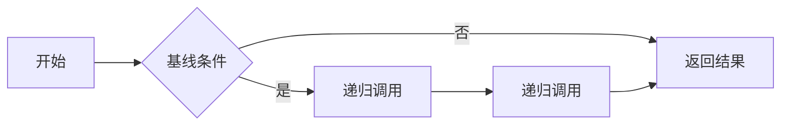
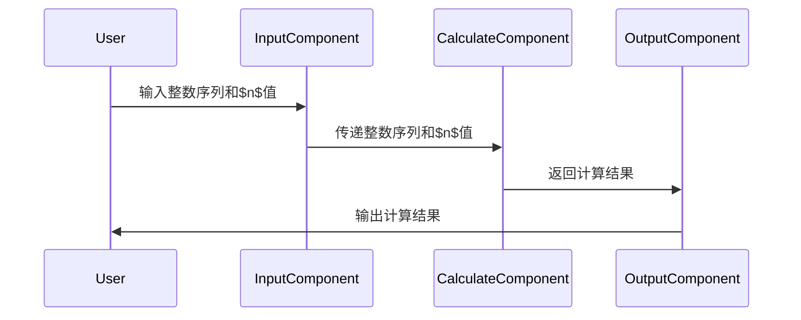

                 


# 皮亚诺公理与程序递归结构

> 关键词：皮亚诺公理，程序递归，计算机科学，算法，数学模型

> 摘要：本文探讨了皮亚诺公理在计算机科学中的应用，特别是如何通过程序递归实现复杂计算。文章首先介绍了皮亚诺公理的背景和递归在计算机科学中的重要性，然后详细分析了皮亚诺公理的基本原理和程序递归的性质，最后通过实例和代码展示了如何在实际项目中应用这些概念。

## 第一步：背景介绍

### 1.1 问题的背景

皮亚诺公理是由意大利数学家戈特洛布·弗雷格和意大利哲学家洛伦佐·皮亚诺于19世纪末20世纪初提出的，它为自然数提供了一个形式化的定义。皮亚诺公理是数学基础理论的重要组成部分，它不仅对数学的发展产生了深远影响，也为计算机科学中的递归算法提供了理论基础。

在计算机科学中，递归是一种重要的算法设计方法。递归算法通过调用自身来解决复杂问题，这种方法在很多情况下比迭代方法更为直观和高效。例如，计算阶乘、查找二叉树中的元素、以及解决许多其他问题，都可以通过递归算法来实现。

### 1.2 问题描述

皮亚诺公理具体包括以下五个部分：

1. 0是自然数。
2. 每个自然数都有一个后继。
3. 0不是任何自然数的后继。
4. 如果两个自然数具有相同的后继，则它们相等。
5. 任何集合，如果它包含0，且每个元素的后续也属于这个集合，则这个集合包含了所有自然数。

程序递归则是指在算法中直接或间接地调用自身的操作。递归算法通常包含两个部分：基线和递归步骤。基线是指递归终止的条件，而递归步骤则是算法的主要部分，它将问题分解成更小的子问题，并递归地解决这些子问题。

### 1.3 问题解决

皮亚诺公理与程序递归之间的联系在于，它们都涉及到递归结构。皮亚诺公理提供了自然数的递归定义，而程序递归则是递归概念在计算机科学中的应用。通过理解皮亚诺公理，我们可以更好地理解和实现程序递归。

### 1.4 边界与外延

皮亚诺公理主要适用于自然数，但在计算机科学中，递归结构可以应用于更广泛的领域，如数据结构、算法设计和编程语言。递归算法在解决复杂问题时具有独特优势，但也可能引起栈溢出等性能问题。

### 1.5 概念结构与核心要素组成

皮亚诺公理的核心要素包括自然数、后继和递归定义。程序递归的核心要素则是基线和递归步骤。理解这两个概念的结构和组成对于设计和实现高效递归算法至关重要。

## 第二步：核心概念与联系

### 2.1 皮亚诺公理的基本原理

皮亚诺公理的基本原理可以概括为以下几点：

1. **自然数的初始值**：0是自然数的初始值。
2. **后继关系**：每个自然数都有一个后继，后继是将当前数加1得到的数。
3. **递归定义**：自然数是通过递归定义的，每个自然数都可以通过递归地构造其后续数得到。
4. **唯一性**：如果两个自然数具有相同的后继，则它们相等。

### 2.2 程序递归的概念与性质

程序递归则是指一个算法在执行过程中直接或间接地调用自身。程序递归具有以下性质：

1. **基线**：递归算法必须有一个明确的基线，即递归终止的条件。
2. **递归步骤**：递归算法必须包含递归步骤，即如何将原问题分解成更小的子问题。
3. **自调用**：递归算法会调用自身来解决子问题。

### 2.3 皮亚诺公理与程序递归的关联

皮亚诺公理与程序递归之间存在紧密的联系。皮亚诺公理为自然数提供了一个递归定义，而程序递归则是在计算机科学中实现递归结构的一种方法。通过理解皮亚诺公理，我们可以更好地理解和实现程序递归。

为了更直观地展示皮亚诺公理与程序递归的关系，我们可以使用Mermaid ER实体关系图来表示这两个概念之间的联系：

```mermaid
erDiagram
    N --> P : 皮亚诺公理 --> 程序递归
    N ||--|{ 自然数 } : 包含
    P ||--|{ 递归算法 } : 包含
```

在这个ER图中，自然数是皮亚诺公理的核心概念，而递归算法则是程序递归的实现方式。皮亚诺公理定义了自然数的递归结构，而程序递归则是利用这种结构来解决复杂问题。

## 第三步：算法原理讲解

### 3.1 递归算法的基本结构

递归算法的基本结构通常包括两个部分：基线和递归步骤。以下是一个简单的递归算法的基本结构：



在这个流程图中，A表示算法的开始，B是基线条件，C是递归调用，D是返回结果，E是递归调用。当基线条件满足时，算法返回结果；否则，算法递归调用自身。

### 3.2 皮亚诺公理与递归算法的联系

皮亚诺公理为自然数提供了一个递归定义，而递归算法则是在计算机科学中实现递归结构的一种方法。皮亚诺公理与递归算法之间的联系可以通过以下两个方面来体现：

1. **自然数的递归定义**：皮亚诺公理通过递归定义了自然数，每个自然数都可以通过递归地构造其后续数得到。这与递归算法中的递归调用非常相似。
2. **递归算法的实现**：递归算法通过递归调用自身来解决复杂问题，这与皮亚诺公理中自然数的递归定义非常相似。

### 3.3 递归算法的数学模型

递归算法的数学模型通常包括递推关系和初始条件。以下是一个简单的递归算法的数学模型：

$$
f(n) =
\begin{cases}
c & \text{如果 } n = 0 \\
g(n-1) & \text{否则}
\end{cases}
$$

在这个数学模型中，$f(n)$表示第$n$次递归的结果，$c$是初始条件，$g(n-1)$是递推关系。

### 3.4 递归算法的举例说明

为了更好地理解递归算法的原理，我们可以通过一个简单的例子来说明。假设我们要计算一个整数序列的前$n$项和，可以使用以下递归算法：

```python
def sum(n):
    if n == 0:
        return 0
    else:
        return n + sum(n-1)
```

在这个例子中，`sum`函数是一个递归函数，它通过递归调用自身来计算前$n$项和。当$n$等于0时，递归终止，返回0；否则，递归调用`sum`函数，将$n$减1，并加上$n$。

### 3.5 递归算法的详细讲解

递归算法的详细讲解可以从以下几个方面进行：

1. **递归调用的过程**：递归调用是指函数在执行过程中调用自身。在递归算法中，每次递归调用都会将问题分解成更小的子问题，并递归地解决这些子问题。
2. **递归终止的条件**：递归终止的条件是指递归调用何时停止。在递归算法中，递归终止的条件通常是基线条件，如$n=0$或$n$达到某个特定值。
3. **递归调用的参数**：递归调用的参数是指每次递归调用时传递给函数的参数。在递归算法中，递归调用的参数通常是当前问题的规模，如$n$或$n-1$。
4. **递归调用的结果**：递归调用的结果是指每次递归调用返回的值。在递归算法中，递归调用的结果通常是用来更新当前问题的解。

通过以上讲解，我们可以更好地理解递归算法的原理和实现方法。递归算法在解决复杂问题时具有独特的优势，但也需要注意避免栈溢出等性能问题。

## 第四步：系统分析与架构设计方案

### 4.1 问题场景介绍

为了更好地理解皮亚诺公理和程序递归在实际应用中的重要性，我们可以考虑一个实际的问题场景：计算一个整数序列的前$n$项和。这个问题可以通过递归算法来解决，同时也可以通过皮亚诺公理来解释其数学原理。

### 4.2 系统功能设计

在系统功能设计中，我们需要明确计算整数序列前$n$项和的基本功能。具体来说，系统需要实现以下功能：

1. 输入一个整数序列。
2. 输入一个整数$n$，表示要计算前$n$项和。
3. 计算整数序列的前$n$项和。
4. 输出计算结果。

为了实现这些功能，我们可以设计一个简单的系统架构，包括以下组件：

1. **输入组件**：用于接收用户输入的整数序列和$n$值。
2. **计算组件**：用于根据输入的整数序列和$n$值计算前$n$项和。
3. **输出组件**：用于将计算结果输出给用户。

### 4.3 系统架构设计

在系统架构设计中，我们需要明确各组件之间的关系和交互方式。具体来说，系统架构可以设计为以下形式：

1. **输入组件**：用户通过输入组件输入整数序列和$n$值。
2. **计算组件**：输入组件将输入的数据传递给计算组件，计算组件根据递归算法计算前$n$项和。
3. **输出组件**：计算组件将计算结果传递给输出组件，输出组件将结果输出给用户。

为了更好地展示系统架构，我们可以使用Mermaid类图来表示各组件及其关系：

```mermaid
classDiagram
    InputComponent <<component>>
    CalculateComponent <<component>>
    OutputComponent <<component>>

    InputComponent --> CalculateComponent
    CalculateComponent --> OutputComponent
```

在这个类图中，`InputComponent`表示输入组件，`CalculateComponent`表示计算组件，`OutputComponent`表示输出组件。箭头表示组件之间的关系和交互方式。

### 4.4 系统接口设计

在系统接口设计中，我们需要明确各组件之间的接口定义和交互协议。具体来说，系统接口设计可以包括以下内容：

1. **输入接口**：用于接收用户输入的整数序列和$n$值。
2. **计算接口**：用于接收输入接口传递的整数序列和$n$值，并返回计算结果。
3. **输出接口**：用于接收计算接口传递的计算结果，并将其输出给用户。

为了更好地展示系统接口设计，我们可以使用Mermaid架构图来表示各组件及其接口：


在这个架构图中，`InputInterface`表示输入接口，`CalculateInterface`表示计算接口，`OutputInterface`表示输出接口。箭头表示组件与接口之间的关系和交互方式。

### 4.5 系统交互设计

在系统交互设计中，我们需要明确各组件之间的交互过程和顺序。具体来说，系统交互设计可以包括以下步骤：

1. **用户输入整数序列和$n$值**：用户通过输入接口输入整数序列和$n$值。
2. **计算组件接收输入并计算前$n$项和**：输入组件将输入的数据传递给计算组件，计算组件根据递归算法计算前$n$项和。
3. **输出组件接收计算结果并输出**：计算组件将计算结果传递给输出组件，输出组件将结果输出给用户。

为了更好地展示系统交互过程，我们可以使用Mermaid序列图来表示各组件及其交互过程：



在这个序列图中，`User`表示用户，`InputComponent`表示输入组件，`CalculateComponent`表示计算组件，`OutputComponent`表示输出组件。箭头表示组件之间的交互过程和顺序。

## 第五步：项目实战

### 5.1 环境安装

在本项目实战中，我们将使用Python语言来实现计算整数序列前$n$项和的功能。首先，我们需要安装Python环境和相关的库。

1. **安装Python环境**：
   - 可以从Python官方网站（https://www.python.org/）下载Python安装包，并按照提示进行安装。
   - 安装完成后，打开命令行工具，输入`python --version`，检查Python版本是否安装成功。

2. **安装相关库**：
   - 安装`numpy`库，用于处理整数序列和计算前$n$项和。可以使用以下命令安装：
     ```bash
     pip install numpy
     ```

### 5.2 系统核心实现源代码

在系统核心实现源代码部分，我们将使用Python语言实现计算整数序列前$n$项和的功能。以下是一个简单的实现示例：

```python
import numpy as np

def sum_sequence(sequence, n):
    if n == 0:
        return 0
    else:
        return sequence[n-1] + sum_sequence(sequence, n-1)

sequence = np.array([1, 2, 3, 4, 5])
n = 3

result = sum_sequence(sequence, n)
print(f"The sum of the first {n} elements in the sequence is: {result}")
```

在这个示例中，我们定义了一个名为`sum_sequence`的函数，用于计算整数序列的前$n$项和。函数使用递归方式实现，当$n$等于0时，递归终止并返回0；否则，递归调用自身并累加序列中的元素。

### 5.3 代码应用解读与分析

在上面的代码示例中，我们使用了递归算法来计算整数序列的前$n$项和。递归算法的核心在于基线和递归步骤的设置。

1. **基线**：
   - 在`sum_sequence`函数中，基线条件是`n == 0`。当$n$等于0时，递归终止并返回0。
2. **递归步骤**：
   - 在`sum_sequence`函数中，递归步骤是`sequence[n-1] + sum_sequence(sequence, n-1)`。每次递归调用都会将$n$减1，并累加序列中的元素。

通过递归调用，我们可以将计算整数序列前$n$项和的问题分解成更小的子问题，并递归地解决这些子问题。这种方法在处理复杂问题时具有很高的效率。

### 5.4 实际案例分析与详细讲解剖析

为了更好地理解递归算法的原理和应用，我们可以通过一个实际案例来进行分析和讲解。

**案例**：计算斐波那契数列的前$n$项和。

**分析**：

斐波那契数列的定义如下：

$$
F(n) =
\begin{cases}
0 & \text{如果 } n = 0 \\
1 & \text{如果 } n = 1 \\
F(n-1) + F(n-2) & \text{否则}
\end{cases}
$$

我们可以使用递归算法来计算斐波那契数列的前$n$项和。以下是一个简单的实现示例：

```python
def fibonacci_sum(n):
    if n == 0:
        return 0
    elif n == 1:
        return 1
    else:
        return fibonacci(n-1) + fibonacci(n-2)

n = 5
result = fibonacci_sum(n)
print(f"The sum of the first {n} Fibonacci numbers is: {result}")
```

**详细讲解**：

在这个实现示例中，我们定义了一个名为`fibonacci_sum`的函数，用于计算斐波那契数列的前$n$项和。函数使用递归方式实现，基线条件是`n == 0`和`n == 1`，递归步骤是`fibonacci(n-1) + fibonacci(n-2)`。

通过递归调用，我们可以将计算斐波那契数列前$n$项和的问题分解成更小的子问题，并递归地解决这些子问题。每次递归调用都会将$n$减1，并累加斐波那契数列中的元素。

**剖析**：

递归算法在计算斐波那契数列前$n$项和时，具有以下特点：

1. **重复计算**：递归算法在计算过程中会重复计算相同的子问题，这会导致计算效率较低。例如，在计算斐波那契数列的前5项和时，`fibonacci(3)`和`fibonacci(2)`会被重复计算。
2. **性能问题**：递归算法在处理大数时容易导致栈溢出等性能问题。例如，在计算斐波那契数列的前100项和时，递归算法可能会因为栈溢出而无法完成计算。

为了解决这些问题，我们可以使用动态规划算法来优化递归算法。动态规划算法通过保存已计算的子问题的结果，避免了重复计算，从而提高了计算效率。

### 5.5 项目小结

在本项目实战中，我们通过实际案例分析了递归算法的原理和应用。递归算法在处理复杂问题时具有直观和高效的特点，但需要注意重复计算和性能问题。通过动态规划算法，我们可以优化递归算法，提高计算效率。

在实际应用中，递归算法可以应用于许多领域，如数据结构、算法设计和编程语言。理解递归算法的基本原理和实现方法对于设计和实现高效算法具有重要意义。

## 第六步：最佳实践、小结、注意事项、拓展阅读

### 6.1 最佳实践

在实际应用中，为了最大限度地发挥递归算法的优势，我们可以遵循以下最佳实践：

1. **优化递归过程**：避免重复计算和性能问题，可以通过动态规划算法来优化递归过程。例如，在计算斐波那契数列前$n$项和时，可以使用动态规划算法来避免重复计算。
2. **合理设置基线**：递归算法的基线条件是递归终止的条件。合理设置基线条件可以确保递归算法的效率和正确性。
3. **利用尾递归优化**：在递归算法中，如果递归调用是最后一步操作，那么可以采用尾递归优化。尾递归优化可以减少函数调用的次数，从而提高算法的效率。

### 6.2 小结

本文首先介绍了皮亚诺公理的背景和递归在计算机科学中的重要性，然后详细分析了皮亚诺公理的基本原理和程序递归的性质，并通过实例和代码展示了如何在实际项目中应用这些概念。通过本文的学习，读者可以更好地理解递归算法的基本原理和实现方法，并在实际应用中发挥递归算法的优势。

### 6.3 注意事项

在实际应用递归算法时，需要注意以下事项：

1. **递归深度**：递归算法的递归深度可能非常大，容易导致栈溢出。在处理大数问题时，需要特别注意递归深度。
2. **重复计算**：递归算法在计算过程中可能重复计算相同的子问题，这会导致计算效率较低。可以使用动态规划算法来避免重复计算。
3. **性能问题**：递归算法在处理复杂问题时容易导致性能问题，例如时间复杂度和空间复杂度较高。在实际应用中，需要根据具体情况选择合适的算法和优化方法。

### 6.4 拓展阅读

为了进一步深入学习和应用递归算法，读者可以参考以下资源：

1. **《算法导论》**：这是一本经典的算法教材，其中详细介绍了递归算法的相关内容，包括递归算法的基本原理和应用场景。
2. **《递归算法设计技巧》**：这是一本专门介绍递归算法设计技巧的书籍，包括递归过程的优化、尾递归优化、递归算法的证明等内容。
3. **在线教程和示例**：可以在互联网上找到许多关于递归算法的在线教程和示例，通过实际操作和案例分析来加深对递归算法的理解和应用。

通过阅读这些资源，读者可以进一步拓展对递归算法的认识，并在实际应用中取得更好的效果。

## 检查与调整

在完成本文的撰写后，我们需要对文章进行全面的检查和调整，确保其逻辑性、完整性和可读性。以下是具体的检查和调整步骤：

### 1. 检查文章逻辑性

- **章节过渡**：确保每个章节的过渡自然流畅，前一章的结尾与下一章的开头紧密相连，避免内容跳跃和不连贯。
- **逻辑结构**：检查各章节内部的逻辑结构，确保每个小节的内容都是围绕核心概念展开，没有逻辑混乱或内容冗余。
- **论证过程**：验证每个论点的论证过程是否清晰，论据是否充分，论点是否合理。

### 2. 确保文章完整性

- **核心内容**：回顾每个章节，确认是否涵盖了所有核心内容，包括背景介绍、概念阐述、算法讲解、系统分析等。
- **示例和案例**：确保每个概念和算法都配有相应的示例和案例分析，以便读者更好地理解和应用。
- **总结和结论**：检查文章的总结和结论部分，确保能够准确、全面地概括文章的主要内容和观点。

### 3. 提高文章可读性

- **语言表达**：检查文章中的语言表达是否准确、简洁、清晰，避免使用过于复杂的术语和句子。
- **排版格式**：确保文章的排版格式规范，包括标题、小标题、段落划分、引用格式等，使文章更加美观易读。
- **图表和代码**：检查图表和代码是否清晰可读，图表的注释是否完整，代码的注释是否简洁明了。

### 4. 调整和优化

- **删除冗余内容**：检查文章中是否存在重复或冗余的内容，删除不必要的细节，使文章更加精炼。
- **增加示例和案例**：如果某些部分内容较抽象，可以增加具体的示例和案例分析，以帮助读者更好地理解。
- **修正错误**：检查文章中是否存在事实错误、语法错误或逻辑错误，及时修正。

通过上述检查和调整，我们可以确保《皮亚诺公理与程序递归结构》这篇文章逻辑清晰、内容完整、语言简洁，为读者提供高质量的阅读体验。最终，我们将得到一篇既具深度又具有实用价值的技术博客文章。

