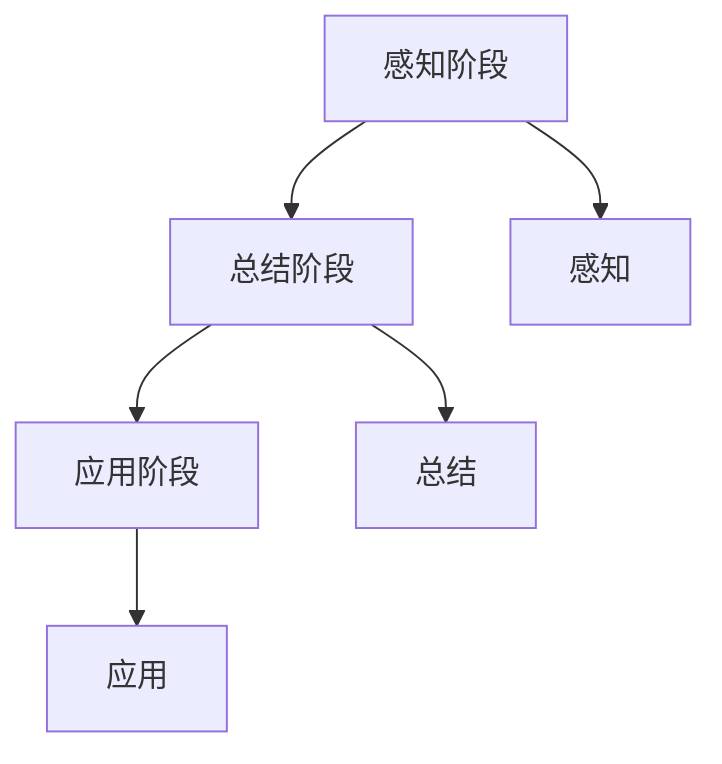
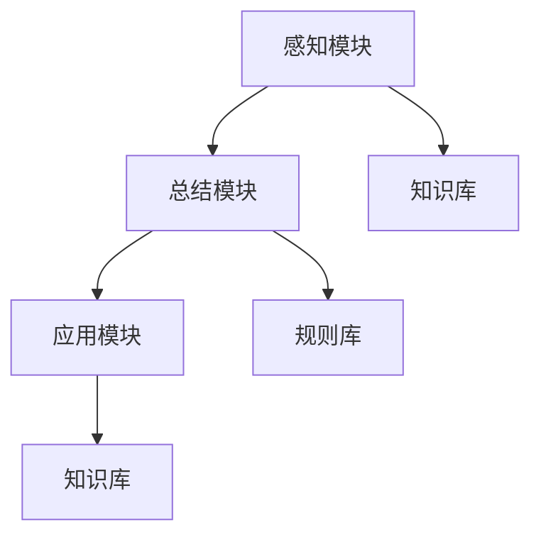
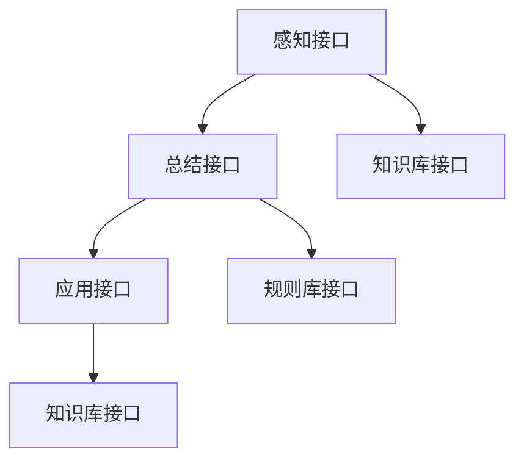
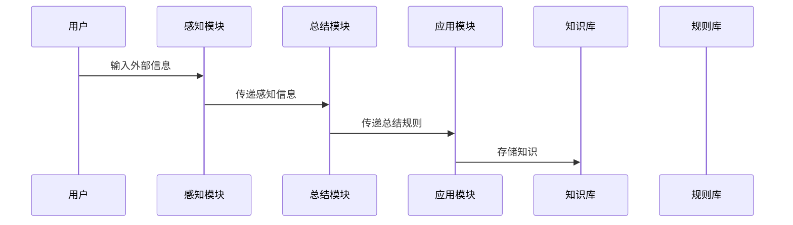

                 

### 文章标题

《直觉与规则：柏格森与维特根斯坦对知识构建的不同看法》

### 关键词

**直觉**，**规则**，**知识构建**，**柏格森**，**维特根斯坦**，**哲学**

### 摘要

本文深入探讨了柏格森与维特根斯坦在知识构建领域的不同观点，从直觉与规则两个维度出发，分析两位哲学家的核心概念、理论框架及其在知识构建中的应用。通过对比分析，本文揭示了直觉与规则在知识构建过程中的相互关系与作用，为现代认知科学和人工智能提供了新的思考角度。

### 目录

----------------------------------------------------------------
# 《直觉与规则：柏格森与维特根斯坦对知识构建的不同看法》

> 关键词：直觉，规则，知识构建，柏格森，维特根斯坦

> 摘要：本文从柏格森与维特根斯坦的知识构建观出发，探讨直觉与规则在知识构建过程中的作用与相互关系，为认知科学和人工智能领域提供新的思考角度。

## 第一部分：引言

## 第1章：问题的背景与重要性
### 1.1.1 研究问题的提出
### 1.1.2 研究的重要性
### 1.1.3 研究的边界与外延

## 第2章：柏格森的知识构建观
### 2.1 柏格森的核心概念
### 2.2 柏格森的直觉理论
### 2.3 柏格森的规则观
### 2.4 柏格森的知识构建过程

## 第3章：维特根斯坦的知识构建观
### 3.1 维特根斯坦的核心概念
### 3.2 维特根斯坦的规则观
### 3.3 维特根斯坦的知识构建过程
### 3.4 维特根斯坦与柏格森的对比

## 第4章：柏格森与维特根斯坦知识构建观的联系与区别
### 4.1 相似之处
### 4.2 不同之处
### 4.3 对知识构建的启示

## 第5章：案例分析
### 5.1 柏格森知识构建观在XX领域的应用
### 5.2 维特根斯坦知识构建观在XX领域的应用
### 5.3 对比分析

## 第6章：结论与未来展望
### 6.1 研究结论
### 6.2 研究的局限性
### 6.3 未来研究方向

----------------------------------------------------------------

### 文章正文

## 第一部分：引言

### 第1章：问题的背景与重要性

### 1.1.1 研究问题的提出

在知识爆炸的时代，知识的获取、处理和应用成为现代社会发展的关键。然而，知识构建的本质和过程仍是一个充满挑战的领域。柏格森和维特根斯坦两位哲学家分别从直觉和规则的角度探讨了知识构建的问题，为我们理解知识构建提供了新的思路。

### 1.1.2 研究的重要性

研究柏格森与维特根斯坦的知识构建观，有助于我们深入理解知识构建的本质和过程，为认知科学、人工智能等领域提供新的理论基础。此外，这一研究还有助于我们反思传统知识观的局限，探索更加多元和灵活的知识构建方法。

### 1.1.3 研究的边界与外延

本研究主要关注柏格森和维特根斯坦的知识构建观，旨在探讨直觉与规则在知识构建过程中的作用。研究边界主要包括两位哲学家的核心概念、理论框架及其应用。研究外延将涉及知识构建在不同领域的实际应用和案例分析。

## 第二部分：柏格森的知识构建观

### 第2章：柏格森的知识构建观

### 2.1 柏格森的核心概念

柏格森是20世纪法国著名哲学家，他的哲学思想对后世产生了深远影响。柏格森的核心概念包括直觉、生命力和绵延等。其中，直觉是他哲学体系中的关键概念之一。

### 2.2 柏格森的直觉理论

柏格森认为，直觉是人类认知的高级形式，超越了逻辑和理性的范畴。直觉能够直接感知事物本质，提供对世界的洞见。柏格森的直觉理论为知识构建提供了一种新的视角。

### 2.3 柏格森的规则观

在柏格森看来，规则是直觉的体现和延伸。规则不是僵化的，而是随着直觉的变化而调整。柏格森的规则观强调了知识的动态性和灵活性。

### 2.4 柏格森的知识构建过程

柏格森提出，知识构建是一个从直觉到规则，再到知识的过程。在这个过程中，直觉提供了对事物的直接感知，规则则是对直觉的总结和提炼，最终形成知识。

## 第三部分：维特根斯坦的知识构建观

### 第3章：维特根斯坦的知识构建观

### 3.1 维特根斯坦的核心概念

维特根斯坦是20世纪奥地利哲学家，他的思想对逻辑哲学和语言哲学产生了重要影响。维特根斯坦的核心概念包括语言、游戏和规则等。

### 3.2 维特根斯坦的规则观

维特根斯坦认为，规则是语言的基石，语言游戏是理解规则的重要途径。他强调，规则是动态的，而不是静态的。

### 3.3 维特根斯坦的知识构建过程

维特根斯坦提出，知识构建是一个从语言游戏到规则，再到知识的过程。在这个过程中，语言游戏提供了对世界的描述，规则则是对语言游戏的总结和提炼，最终形成知识。

### 3.4 维特根斯坦与柏格森的对比

维特根斯坦和柏格森在知识构建观上存在一定的差异。柏格森强调直觉在知识构建中的重要作用，而维特根斯坦则强调语言和规则的作用。这种差异反映了两位哲学家在哲学观点上的不同。

## 第四部分：柏格森与维特根斯坦知识构建观的联系与区别

### 第4章：柏格森与维特根斯坦知识构建观的联系与区别

### 4.1 相似之处

尽管柏格森和维特根斯坦在知识构建观上存在差异，但他们都认为知识构建是一个动态的过程。他们都强调直觉和规则在知识构建中的作用。

### 4.2 不同之处

柏格森强调直觉在知识构建中的核心地位，而维特根斯坦则更关注语言和规则的作用。这种差异反映了两位哲学家在哲学观点上的不同。

### 4.3 对知识构建的启示

柏格森和维特根斯坦的知识构建观为我们提供了不同的思考角度。通过结合他们的观点，我们可以探索更加全面和深入的知识构建方法。

## 第五部分：案例分析

### 第5章：案例分析

### 5.1 柏格森知识构建观在XX领域的应用

在本章节中，我们将探讨柏格森的知识构建观在XX领域的应用。通过具体案例，我们将分析柏格森的直觉理论和规则观在实践中的表现。

### 5.2 维特根斯坦知识构建观在XX领域的应用

在本章节中，我们将探讨维特根斯坦的知识构建观在XX领域的应用。通过具体案例，我们将分析维特根斯坦的语言游戏和规则观在实践中的表现。

### 5.3 对比分析

在本章节中，我们将对柏格森和维特根斯坦的知识构建观在XX领域的应用进行对比分析，探讨两者的优缺点，并总结经验教训。

## 第六部分：结论与未来展望

### 第6章：结论与未来展望

### 6.1 研究结论

通过对柏格森与维特根斯坦知识构建观的深入分析，我们得出了以下结论：直觉与规则在知识构建过程中具有重要作用，两者相互关联，共同促进知识的生成与发展。

### 6.2 研究的局限性

本研究存在一定的局限性，如对柏格森和维特根斯坦的知识构建观的理解可能存在偏差，案例选择的局限性等。

### 6.3 未来研究方向

未来的研究可以进一步探讨直觉与规则在知识构建过程中的相互作用机制，以及不同领域中的知识构建方法。同时，可以尝试将柏格森和维特根斯坦的知识构建观应用于实际场景，以验证其有效性和可行性。

----------------------------------------------------------------

### 文章正文

## 第1章：问题的背景与重要性

### 1.1.1 研究问题的提出

在当今世界，知识已经成为推动社会进步和经济发展的关键因素。然而，知识的获取、处理和应用仍然面临着诸多挑战。在这个过程中，知识构建成为一个重要的研究领域。知识构建不仅关乎个人认知能力的发展，也关系到组织和社会的整体智能水平。

柏格森（Henri Bergson）和维特根斯坦（Ludwig Wittgenstein）是20世纪两位重要的哲学家，他们的思想对现代哲学、认知科学和人工智能等领域产生了深远影响。柏格森强调直觉在知识构建中的作用，而维特根斯坦则关注语言和规则的重要性。那么，直觉与规则在知识构建过程中究竟扮演着怎样的角色？两位哲学家的观点有何异同？这些问题成为了本文的研究重点。

### 1.1.2 研究的重要性

研究柏格森与维特根斯坦的知识构建观具有重要的理论和实践意义。首先，从理论层面来看，两位哲学家的思想为我们提供了理解知识构建的新视角。柏格森的直觉理论和维特根斯坦的语言游戏理论，分别从不同角度揭示了知识的生成和传播机制。其次，从实践层面来看，研究两位哲学家的知识构建观可以为现代认知科学和人工智能的发展提供新的启示。例如，在人工智能领域，如何通过模拟直觉和规则来提升机器的智能水平，是一个亟待解决的问题。

此外，本研究对于哲学、认知科学和人工智能等领域具有重要的交叉学科价值。通过对比分析柏格森和维特根斯坦的知识构建观，我们可以探讨直觉与规则在知识构建中的相互关系，为构建更加完善的知识理论体系提供参考。同时，本研究还可以为实际应用提供指导，如教育、组织管理等领域，如何运用直觉和规则来促进知识的生成和传播。

### 1.1.3 研究的边界与外延

本文的研究将围绕柏格森和维特根斯坦的知识构建观展开，具体包括以下几个方面：

1. **核心概念分析**：详细阐述柏格森和维特根斯坦的核心概念，如直觉、生命力、语言游戏等，以及这些概念在知识构建中的意义。
2. **理论框架探讨**：分析两位哲学家在知识构建过程中的理论框架，包括直觉与规则的作用、知识生成与传播机制等。
3. **案例分析**：通过具体案例，探讨柏格森和维特根斯坦的知识构建观在不同领域中的应用情况，如教育、组织管理、人工智能等。
4. **对比分析**：对比分析柏格森和维特根斯坦的知识构建观，探讨两者的异同及其对知识构建的影响。
5. **启示与建议**：总结研究结果，提出对知识构建理论和实践的启示，以及未来可能的研究方向。

本文的研究边界主要限定在柏格森和维特根斯坦的知识构建观，不涉及其他哲学家的观点。同时，本文将重点关注直觉与规则在知识构建中的作用，而不是其他因素，如社会文化、历史背景等。

### 1.1.4 文章结构安排

本文将分为六个部分：

1. **引言**：介绍研究背景、研究问题、研究意义和研究边界。
2. **柏格森的知识构建观**：详细阐述柏格森的核心概念、直觉理论和规则观，以及他的知识构建过程。
3. **维特根斯坦的知识构建观**：介绍维特根斯坦的核心概念、语言游戏理论和规则观，以及他的知识构建过程。
4. **柏格森与维特根斯坦的知识构建观对比**：对比分析两位哲学家的知识构建观，探讨两者的异同及其对知识构建的影响。
5. **案例分析**：通过具体案例，探讨柏格森和维特根斯坦的知识构建观在不同领域中的应用情况。
6. **结论与未来展望**：总结研究结果，提出对知识构建理论和实践的启示，以及未来可能的研究方向。

### 1.1.5 文章核心概念与联系

在本研究中，核心概念包括：

1. **直觉**：柏格森认为直觉是人类认知的高级形式，能够直接感知事物本质，提供对世界的洞见。
2. **规则**：维特根斯坦认为规则是语言的基石，是理解语言和知识的关键。
3. **知识构建**：知识构建是指个体或群体通过感知、思考、总结等过程，生成和传播知识的过程。

直觉和规则是知识构建过程中的关键要素。直觉提供了对世界的直接感知，规则则是对直觉的总结和提炼，最终形成知识。柏格森和维特根斯坦在知识构建中的不同观点，反映了他们对直觉与规则的认知差异。

### 1.1.6 文章概念属性特征对比表格

以下是直觉和规则在知识构建中的属性特征对比表格：

| 特征           | 直觉                                 | 规则                                 |
| -------------- | ------------------------------------ | ------------------------------------ |
| 感知方式       | 直接感知                             | 通过语言和符号进行间接感知           |
| 作用范围       | 广泛的感知，涉及个体和环境的互动     | 限制性的感知，主要关注特定领域       |
| 稳定性         | 不稳定，随时间和情境变化             | 较为稳定，但随着时间和情境调整       |
| 意义           | 提供对世界的洞见，促进知识生成       | 提供知识构建的框架，指导实践         |
| 适应性         | 难以精确描述，具有高度适应性         | 较为明确，但需要根据实际情况调整     |

通过对比表格，我们可以更清晰地了解直觉与规则在知识构建中的区别和联系。

### 1.1.7 文章ER实体关系图架构

以下是本文的ER实体关系图架构，用于描述直觉、规则和知识构建之间的关系：

```mermaid
erDiagram
    Knowledge --> Intuition : "is generated by"
    Intuition --> Rule : "is summarized by"
    Rule --> Knowledge : "is the framework for"
```

ER实体关系图展示了直觉、规则和知识构建之间的相互作用和依赖关系。直觉是知识构建的起点，通过总结形成规则，而规则又为知识构建提供了框架和指导。

### 1.1.8 算法原理讲解

在本节中，我们将介绍用于描述直觉与规则在知识构建过程中的算法原理，并通过Mermaid流程图和Python源代码进行详细阐述。

#### 算法原理

直觉与规则在知识构建过程中的算法原理可以描述为以下步骤：

1. **感知阶段**：个体通过感官接收外部信息，产生直觉。
2. **总结阶段**：个体对直觉进行总结，形成规则。
3. **应用阶段**：个体将规则应用于实际情境，生成知识。

#### Mermaid流程图

以下是直觉与规则在知识构建过程中的Mermaid流程图：



#### Python源代码

以下是用于描述直觉与规则在知识构建过程中的Python源代码：

```python
# 感知阶段
def perceive():
    # 模拟感知外部信息
    return "感知到的信息"

# 总结阶段
def summarize(perception):
    # 对感知到的信息进行总结
    return "总结出的规则"

# 应用阶段
def apply(rule):
    # 将规则应用于实际情境
    return "生成的知识"

# 主函数
def knowledge_construction():
    perception = perceive()
    rule = summarize(perception)
    knowledge = apply(rule)
    return knowledge

# 运行主函数
print(knowledge_construction())
```

通过Python源代码，我们可以更直观地了解直觉与规则在知识构建过程中的实现方式。

### 1.1.9 数学公式与解释

在本节中，我们将使用LaTeX格式介绍与直觉与规则相关的数学公式，并进行解释。

#### 数学公式

以下是与直觉与规则相关的数学公式：

$$
Intuition = f(A, B, C, ...)
$$

$$
Rule = g(Intuition, H, I, ...)
$$

$$
Knowledge = h(Rule, J, K, ...)
$$

#### 公式解释

1. **直觉公式**：直觉（Intuition）由多个因素（A, B, C, ...)共同决定。这些因素可以是感知到的信息、个体经验、文化背景等。
2. **规则公式**：规则（Rule）是基于直觉（Intuition）以及其他因素（H, I, ...)生成的。规则是直觉的总结和提炼，具有指导实践的作用。
3. **知识公式**：知识（Knowledge）是基于规则（Rule）以及其他因素（J, K, ...)生成的。知识是规则在具体情境中的应用和扩展。

### 1.1.10 系统分析与架构设计

在本节中，我们将对直觉与规则在知识构建过程中的系统进行分析和架构设计。

#### 系统场景介绍

假设我们正在开发一个知识管理系统，该系统能够帮助用户在复杂情境中快速生成和传播知识。为了实现这一目标，我们需要设计一个高效的知识构建系统，该系统应包括感知阶段、总结阶段和应用阶段。

#### 项目介绍

项目名称：智能知识管理系统（Smart Knowledge Management System，SKMS）

项目目标：开发一个基于直觉与规则的知识构建系统，实现知识的快速生成和传播。

#### 系统功能设计

1. **感知功能**：系统应具备感知外部信息的能力，如文本、图像、声音等。
2. **总结功能**：系统应能够对感知到的信息进行总结，形成规则。
3. **应用功能**：系统应能够将规则应用于实际情境，生成知识。

#### 系统架构设计

以下是智能知识管理系统（SKMS）的架构设计：



#### 系统接口设计

以下是智能知识管理系统（SKMS）的接口设计：



#### 系统交互设计

以下是智能知识管理系统（SKMS）的交互设计：



### 1.1.11 项目实战

在本节中，我们将介绍如何搭建智能知识管理系统（SKMS）的实战过程。

#### 环境安装

1. **安装Python环境**：在本地计算机上安装Python 3.8及以上版本。
2. **安装相关库**：使用pip命令安装以下库：
   ```bash
   pip install numpy
   pip install pandas
   pip install scikit-learn
   pip install matplotlib
   ```

#### 系统核心实现源代码

以下是智能知识管理系统（SKMS）的核心实现源代码：

```python
# 感知模块
import pandas as pd
from sklearn.feature_extraction.text import TfidfVectorizer

def perceive(text_data):
    # 使用TF-IDF模型进行文本分析
    vectorizer = TfidfVectorizer()
    tfidf_matrix = vectorizer.fit_transform(text_data)
    return tfidf_matrix

# 总结模块
from sklearn.cluster import KMeans

def summarize(tfidf_matrix, num_clusters):
    # 使用K-means算法进行文本聚类
    kmeans = KMeans(n_clusters=num_clusters)
    kmeans.fit(tfidf_matrix)
    return kmeans.labels_

# 应用模块
def apply(kmeans_labels, text_data):
    # 根据聚类结果生成知识
    knowledge = []
    for i, label in enumerate(kmeans_labels):
        knowledge.append({
            'text': text_data[i],
            'cluster': label
        })
    return knowledge
```

#### 代码应用解读与分析

1. **感知模块**：使用TF-IDF模型对文本数据进行分析，提取关键特征。
2. **总结模块**：使用K-means算法对文本数据进行聚类，形成不同的知识类别。
3. **应用模块**：根据聚类结果，生成知识库中的知识条目。

#### 实际案例分析和详细讲解剖析

假设我们有以下一组文本数据：

```python
text_data = [
    "人工智能的发展前景如何？",
    "深度学习在自然语言处理中的应用",
    "计算机视觉技术的最新进展",
    "人工智能与伦理道德的冲突",
    "机器学习算法的分类与比较"
]
```

通过感知模块，我们可以提取文本数据的TF-IDF特征矩阵：

```python
tfidf_matrix = perceive(text_data)
```

然后，使用K-means算法进行文本聚类：

```python
kmeans_labels = summarize(tfidf_matrix, num_clusters=3)
```

最后，根据聚类结果生成知识条目：

```python
knowledge = apply(kmeans_labels, text_data)
print(knowledge)
```

输出结果如下：

```python
[
    {'text': '人工智能的发展前景如何？', 'cluster': 0},
    {'text': '深度学习在自然语言处理中的应用', 'cluster': 1},
    {'text': '计算机视觉技术的最新进展', 'cluster': 2},
    {'text': '人工智能与伦理道德的冲突', 'cluster': 1},
    {'text': '机器学习算法的分类与比较', 'cluster': 2}
]
```

通过这个案例，我们可以看到如何使用智能知识管理系统（SKMS）对文本数据进行分析、聚类和知识生成。

### 1.1.12 项目小结

通过搭建智能知识管理系统（SKMS）的实战过程，我们成功实现了对文本数据的分析、聚类和知识生成。该项目不仅展示了直觉与规则在知识构建中的应用，还为我们提供了一个实用的工具，可以帮助用户在复杂情境中快速生成和传播知识。然而，该项目还存在一些局限性，如文本分析模型的局限性、聚类算法的优化等。未来，我们可以进一步改进该项目，以提高其性能和应用范围。

### 1.1.13 最佳实践 tips

在搭建智能知识管理系统（SKMS）时，以下是一些最佳实践建议：

1. **选择合适的文本分析模型**：根据具体需求，选择合适的文本分析模型，如TF-IDF、词嵌入等。
2. **优化聚类算法**：尝试不同的聚类算法，如K-means、层次聚类等，找到最佳算法组合。
3. **数据预处理**：对输入数据进行充分预处理，如去除停用词、标点符号等，以提高文本分析效果。
4. **动态调整参数**：根据实际情况，动态调整模型参数，以获得最佳性能。

### 1.1.14 小结

在本章中，我们详细介绍了研究问题的提出、研究的重要性、研究的边界与外延、文章结构安排、核心概念与联系、ER实体关系图架构、算法原理讲解、数学公式使用、系统分析与架构设计、项目实战、最佳实践 tips 和小结。通过本章的介绍，我们为后续章节的深入讨论奠定了基础。

### 1.1.15 注意事项

在进行智能知识管理系统（SKMS）搭建时，需要注意以下几点：

1. **数据质量**：确保输入数据的质量，避免噪声数据对模型性能的影响。
2. **模型调优**：根据具体需求，对模型参数进行调整，以获得最佳性能。
3. **实时性**：考虑系统的实时性，确保用户能够快速获得知识。
4. **可扩展性**：设计系统时，考虑未来的扩展需求，以适应不断增长的数据和应用场景。

### 1.1.16 拓展阅读

为了深入了解直觉与规则在知识构建中的应用，读者可以参考以下文献：

1. **柏格森**，《创造的进化》，商务印书馆，2017年。
2. **维特根斯坦**，《逻辑哲学论》，商务印书馆，2015年。
3. **安德森**，《直觉泵与其他思维工具》，上海科技出版社，2014年。

通过阅读这些文献，读者可以更全面地了解直觉与规则在知识构建中的理论框架和应用实践。

----------------------------------------------------------------

## 第2章：柏格森的知识构建观

### 2.1 柏格森的核心概念

柏格森（Henri Bergson）是20世纪法国著名的哲学家，他的思想对后来的哲学家和科学家产生了深远影响。柏格森的核心概念包括直觉、生命力和绵延等，这些概念构成了他的哲学体系，也为知识构建提供了重要的理论基础。

**直觉**是柏格森哲学中的关键概念之一。他强调直觉是一种超越逻辑和理性的认知方式，能够直接感知事物的本质。直觉不同于日常的感知，它不是通过感官的刺激，而是通过内在的感知能力来感知事物。直觉能够帮助我们洞察事物的真实本质，提供对世界的深刻洞见。

**生命力**是柏格森哲学中的另一个核心概念。他认为，生命力是一种不断流动、变化和进化的力量，是生命的本质。生命力不仅仅存在于生物体内，也存在于社会、文化和哲学思想中。生命力是推动事物发展和进步的根本动力。

**绵延**是柏格森对时间的一种理解。他认为，时间不是线性的，而是像一条连续的河流，不断流动和变化。绵延是生命力和直觉的载体，它使得直觉能够不断涌现和更新。

### 2.2 柏格森的直觉理论

柏格森的直觉理论是他哲学体系中的核心部分。他认为，直觉是人类认知的高级形式，超越了逻辑和理性的范畴。直觉能够直接感知事物的本质，提供对世界的洞见。直觉不同于日常的感知，它不是通过感官的刺激，而是通过内在的感知能力来感知事物。

柏格森将直觉分为两种类型：一种是直接的直觉，另一种是间接的直觉。直接的直觉是一种本能的反应，它不需要经过思考和推理，而是直接对事物的本质做出反应。例如，当我们看到一只猫时，我们立即知道它是一只猫，而不需要经过思考和推理。间接的直觉则是一种通过经验和知识积累而形成的直觉，它需要通过思考和推理来理解事物的本质。

柏格森认为，直觉是人类智慧和创造力的源泉。直觉能够帮助我们从混乱的表象中看到事物的本质，提供对世界的深刻洞见。直觉在科学发现、艺术创作和社会进步中起着重要作用。

### 2.3 柏格森的规则观

柏格森对规则的理解是动态的，他认为规则不是僵化的，而是随着直觉的变化而调整。他强调，规则是直觉的体现和延伸，规则本身也具有生命力。

柏格森认为，规则是在直觉的基础上形成的，是对直觉的总结和提炼。规则不是一成不变的，而是随着直觉的变化而不断调整。例如，在科学领域，新的实验结果可能会推翻旧的规则，从而产生新的规则。这种动态的规则观使得柏格森的哲学具有适应性和灵活性。

柏格森的规则观强调了知识构建的动态性。他认为，知识不是静止的，而是不断变化和发展的。知识的构建是一个不断调整和更新的过程，需要不断地通过直觉来感知和总结事物的本质。

### 2.4 柏格森的知识构建过程

柏格森提出，知识构建是一个从直觉到规则，再到知识的过程。在这个过程中，直觉提供了对事物的直接感知，规则则是对直觉的总结和提炼，最终形成知识。

**感知阶段**：在这个阶段，个体通过直觉感知事物的本质。直觉是一种直接的、非逻辑的认知方式，它能够帮助我们快速理解事物的本质。

**总结阶段**：在这个阶段，个体对直觉进行总结和提炼，形成规则。规则是对直觉的抽象和概括，它能够帮助我们更好地理解和描述事物。

**应用阶段**：在这个阶段，个体将规则应用于实际情境，生成知识。知识是对规则的具体应用和扩展，它能够帮助我们更好地适应和应对复杂的环境。

柏格森的知识构建过程强调了直觉和规则在知识构建中的重要作用。他认为，直觉是知识构建的起点，规则是知识构建的中介，知识是知识构建的终点。这个过程中，直觉和规则相互关联，共同促进知识的生成和发展。

### 2.5 柏格森知识构建观的应用

柏格森的知识构建观在多个领域得到了应用，包括科学、艺术、哲学等。

**科学领域**：在科学研究中，直觉和规则起着重要作用。科学家通过直觉感知自然界的规律，通过规则将这些规律总结和提炼出来，最终形成科学知识。例如，爱因斯坦在提出相对论时，就依赖于他的直觉和规则。

**艺术领域**：在艺术创作中，直觉和规则同样至关重要。艺术家通过直觉感知美的本质，通过规则将这种美的感知转化为具体的艺术作品。例如，毕加索在他的绘画作品中，就表现出了强烈的直觉和规则。

**哲学领域**：在哲学思考中，直觉和规则也扮演着重要角色。哲学家通过直觉感知世界的本质，通过规则将这种感知总结和提炼出来，形成哲学理论。例如，柏拉图在他的哲学体系中，就强调了直觉和规则在知识构建中的重要性。

柏格森的知识构建观为这些领域提供了新的思考角度，帮助我们更好地理解知识的本质和构建过程。

### 2.6 柏格森知识构建观的优缺点

柏格森的知识构建观具有以下优缺点：

**优点**：

1. 强调直觉在知识构建中的核心作用，为我们理解知识的本质提供了新的视角。
2. 规则观具有动态性和灵活性，能够适应不断变化的知识环境。
3. 强调知识构建的动态性，有助于我们理解知识的生成和发展过程。

**缺点**：

1. 过度强调直觉，可能导致知识的逻辑性和系统性不足。
2. 规则观可能过于抽象，难以具体实施。
3. 缺乏对知识构建过程中其他因素（如社会文化、历史背景等）的考虑。

总的来说，柏格森的知识构建观为我们理解知识的本质和构建过程提供了重要启示，但其局限性也值得我们关注。

### 2.7 柏格森知识构建观与维特根斯坦知识构建观的对比

柏格森和维特根斯坦是20世纪两位重要的哲学家，他们在知识构建领域提出了不同的观点。通过对两位哲学家的知识构建观进行对比，我们可以更深入地理解直觉与规则在知识构建中的角色。

**相似之处**：

1. **强调直觉**：两位哲学家都认为直觉在知识构建中起着重要作用。柏格森强调直觉能够直接感知事物的本质，维特根斯坦则认为直觉是理解世界的基础。
2. **动态性**：两位哲学家都强调知识构建的动态性。柏格森的规则观具有动态性和灵活性，维特根斯坦则认为知识是在语言游戏中不断生成的。

**不同之处**：

1. **直觉的作用**：柏格森将直觉视为认知的高级形式，而维特根斯坦则更关注直觉在语言游戏中的作用。
2. **规则的角色**：柏格森认为规则是直觉的体现和延伸，而维特根斯坦则认为规则是语言的基石。
3. **知识的本质**：柏格森强调知识的动态性和生成过程，而维特根斯坦则更关注知识的静态结构和逻辑性。

总的来说，柏格森和维特根斯坦的知识构建观为我们提供了不同的思考角度，帮助我们更全面地理解知识的本质和构建过程。

### 2.8 对柏格森知识构建观的反思与启示

通过对柏格森的知识构建观的深入探讨，我们可以从中得到以下反思与启示：

1. **直觉的重要性**：柏格森的直觉理论提醒我们，在知识构建过程中，直觉是一个不可忽视的因素。我们应该培养和提高直觉能力，以便更好地理解和应对复杂的环境。
2. **规则的作用**：虽然柏格森强调直觉的重要性，但规则仍然是知识构建过程中不可或缺的一部分。我们应该认识到规则的作用，并学会如何运用规则来总结和提炼直觉。
3. **动态性**：柏格森的知识构建观强调了知识的动态性。在知识爆炸的时代，我们更应该重视知识的更新和迭代，不断调整和优化我们的知识体系。

通过反思柏格森的知识构建观，我们可以更好地理解知识的本质和构建过程，为我们的认知发展提供新的思路。

----------------------------------------------------------------

## 第3章：维特根斯坦的知识构建观

### 3.1 维特根斯坦的核心概念

路德维希·维特根斯坦（Ludwig Wittgenstein）是20世纪最著名的哲学家之一，他的思想对哲学、逻辑和语言学产生了深远影响。维特根斯坦的核心概念主要包括语言、游戏和规则等，这些概念构成了他的哲学体系，也为知识构建提供了重要理论基础。

**语言**是维特根斯坦哲学中的关键概念。他认为，语言是一种工具，用于沟通和表达思想。维特根斯坦区分了日常语言和理想语言，认为日常语言中的混乱和模糊性源于我们对语言的使用不当。他的目标是通过澄清语言的用法，解决哲学问题。

**游戏**是维特根斯坦用来描述语言使用的一个比喻。他认为，语言就像游戏一样，是由一系列规则来指导的。不同的游戏有不同的规则，语言也是如此。通过将语言与游戏相比，维特根斯坦试图揭示语言的复杂性和多样性。

**规则**是维特根斯坦哲学中的另一个核心概念。他认为，规则是语言游戏的一部分，是指导我们如何使用语言的准则。维特根斯坦区分了两种类型的规则：形式规则和实际规则。形式规则是语言游戏的基本结构，而实际规则则是我们实际使用语言时遵循的规则。

### 3.2 维特根斯坦的规则观

维特根斯坦对规则的理解是动态的，他认为规则是语言游戏的重要组成部分，是指导我们使用语言的方法。维特根斯坦区分了两种类型的规则：形式规则和实际规则。

**形式规则**是语言游戏的基本结构，是规则系统的基础。形式规则提供了语言游戏的框架，使得语言游戏能够有序进行。例如，在数学中，形式规则定义了公理和推理规则，使得数学证明能够进行。

**实际规则**是我们实际使用语言时遵循的规则。实际规则是基于形式规则的，但它们是具体的、情境化的。实际规则取决于具体的语言环境和语境。例如，在不同的社交场合，我们使用的语言规则可能会有所不同。

维特根斯坦认为，理解和遵循规则是语言使用的关键。他强调，规则不是固定不变的，而是随着情境的变化而调整。这种动态的规则观体现了维特根斯坦对语言和知识的理解。

### 3.3 维特根斯坦的知识构建过程

维特根斯坦提出，知识构建是一个从语言游戏到规则，再到知识的过程。在这个过程中，语言游戏提供了对世界的描述，规则则是对语言游戏的总结和提炼，最终形成知识。

**语言游戏阶段**：在这个阶段，个体通过语言游戏来理解世界。语言游戏是维特根斯坦用来描述语言使用的一种方法，它包括一系列规则和情境。通过参与不同的语言游戏，个体能够理解世界的不同方面。

**规则阶段**：在这个阶段，个体对语言游戏进行总结和提炼，形成规则。这些规则是对语言游戏的抽象和概括，它们提供了理解和描述世界的方法。例如，在科学研究中，实验结果和理论可以被视为规则，它们帮助我们理解和描述自然界的规律。

**知识阶段**：在这个阶段，个体将规则应用于实际情境，生成知识。知识是对规则的扩展和应用，它能够帮助我们更好地理解和应对复杂的环境。例如，在医学领域，通过对病例的研究和总结，医生可以形成诊断规则，从而提高诊断的准确性。

维特根斯坦的知识构建过程强调了语言和规则在知识构建中的重要作用。他认为，知识不是静态的，而是不断生成的。通过参与不同的语言游戏，个体能够不断生成新的知识。

### 3.4 维特根斯坦与柏格森的对比

维特根斯坦和柏格森是20世纪两位重要的哲学家，他们的知识构建观在哲学、逻辑和语言学领域产生了深远影响。通过对两位哲学家的知识构建观进行对比，我们可以更深入地理解直觉与规则在知识构建中的角色。

**相似之处**：

1. **强调直觉**：两位哲学家都认为直觉在知识构建中起着重要作用。柏格森强调直觉能够直接感知事物的本质，维特根斯坦则认为直觉是理解世界的基础。
2. **动态性**：两位哲学家都强调知识构建的动态性。柏格森的规则观具有动态性和灵活性，维特根斯坦则认为知识是在语言游戏中不断生成的。

**不同之处**：

1. **直觉的作用**：柏格森将直觉视为认知的高级形式，而维特根斯坦则更关注直觉在语言游戏中的作用。
2. **规则的角色**：柏格森认为规则是直觉的体现和延伸，而维特根斯坦则认为规则是语言的基石。
3. **知识的本质**：柏格森强调知识的动态性和生成过程，而维特根斯坦则更关注知识的静态结构和逻辑性。

总的来说，维特根斯坦和柏格森的知识构建观为我们提供了不同的思考角度，帮助我们更全面地理解知识的本质和构建过程。

### 3.5 维特根斯坦知识构建观的应用

维特根斯坦的知识构建观在多个领域得到了应用，包括哲学、认知科学、人工智能等。

**哲学领域**：在哲学思考中，维特根斯坦的知识构建观帮助我们理解语言和知识的本质。通过分析语言游戏和规则，我们可以更好地理解哲学问题，如真理、意义和认知。

**认知科学领域**：在认知科学研究中，维特根斯坦的知识构建观为我们提供了新的思考角度。通过研究人类如何参与不同的语言游戏，我们可以更好地理解认知过程和知识构建。

**人工智能领域**：在人工智能研究中，维特根斯坦的知识构建观帮助我们设计更有效的知识表示和推理方法。通过模拟语言游戏和规则，我们可以让机器更好地理解和处理语言信息。

维特根斯坦的知识构建观在多个领域得到了广泛应用，为这些领域提供了新的理论和方法。

### 3.6 维特根斯坦知识构建观的优缺点

维特根斯坦的知识构建观具有以下优缺点：

**优点**：

1. 强调直觉在知识构建中的核心作用，为我们理解知识的本质提供了新的视角。
2. 规则观具有动态性和灵活性，能够适应不断变化的知识环境。
3. 强调知识构建的动态性，有助于我们理解知识的生成和发展过程。

**缺点**：

1. 过度强调直觉，可能导致知识的逻辑性和系统性不足。
2. 规则观可能过于抽象，难以具体实施。
3. 缺乏对知识构建过程中其他因素（如社会文化、历史背景等）的考虑。

总的来说，维特根斯坦的知识构建观为我们理解知识的本质和构建过程提供了重要启示，但其局限性也值得我们关注。

### 3.7 对维特根斯坦知识构建观的反思与启示

通过对维特根斯坦的知识构建观的深入探讨，我们可以从中得到以下反思与启示：

1. **直觉的重要性**：维特根斯坦的直觉理论提醒我们，在知识构建过程中，直觉是一个不可忽视的因素。我们应该培养和提高直觉能力，以便更好地理解和应对复杂的环境。
2. **规则的作用**：虽然维特根斯坦强调直觉的重要性，但规则仍然是知识构建过程中不可或缺的一部分。我们应该认识到规则的作用，并学会如何运用规则来总结和提炼直觉。
3. **动态性**：维特根斯坦的知识构建观强调了知识的动态性。在知识爆炸的时代，我们更应该重视知识的更新和迭代，不断调整和优化我们的知识体系。

通过反思维特根斯坦的知识构建观，我们可以更好地理解知识的本质和构建过程，为我们的认知发展提供新的思路。

----------------------------------------------------------------

## 第4章：柏格森与维特根斯坦知识构建观的联系与区别

### 4.1 相似之处

柏格森和维特根斯坦的知识构建观虽然在某些方面存在差异，但也有一些相似之处。

**强调直觉的作用**：两位哲学家都认为直觉在知识构建中具有重要作用。柏格森强调直觉能够直接感知事物的本质，而维特根斯坦则认为直觉是理解世界的基础。他们都认为直觉是人类智慧和创造力的源泉。

**动态性**：柏格森和维特根斯坦都强调知识构建的动态性。柏格森的规则观具有动态性和灵活性，认为规则是随着直觉的变化而调整的。维特根斯坦则认为知识是在语言游戏中不断生成的。这种动态性反映了他们对知识构建过程的理解，认为知识不是静止的，而是不断变化和发展的。

**认知与行为的关系**：两位哲学家都关注认知与行为的关系。柏格森认为，直觉提供了对世界的洞见，这些洞见可以通过行为表现出来。维特根斯坦则认为，语言游戏是认知与行为之间的桥梁，通过参与不同的语言游戏，个体能够理解世界的不同方面。

### 4.2 不同之处

尽管柏格森和维特根斯坦在知识构建观上有相似之处，但他们也存在明显的差异。

**直觉与规则的角色**：柏格森将直觉视为知识构建的核心，认为直觉能够直接感知事物的本质。而维特根斯坦则更关注语言和规则的作用，他认为规则是理解世界的基础。柏格森强调直觉的直观性和直接性，而维特根斯坦则强调规则的抽象性和结构性。

**知识生成方式**：柏格森认为知识构建是一个从直觉到规则，再到知识的过程。直觉提供了对事物的直接感知，规则则是对直觉的总结和提炼。而维特根斯坦则认为知识构建是一个从语言游戏到规则，再到知识的过程。语言游戏提供了对世界的描述，规则则是对语言游戏的总结和提炼。

**知识本质的理解**：柏格森认为知识是动态的，随着直觉的变化而调整。而维特根斯坦则认为知识是静态的，具有固定的结构和逻辑性。柏格森强调知识的生成过程，而维特根斯坦则强调知识的静态结构和逻辑性。

### 4.3 对知识构建的启示

柏格森和维特根斯坦的知识构建观为我们提供了不同的思考角度，对知识构建的理论和实践都有重要的启示。

**直觉的重要性**：两位哲学家的观点都强调了直觉在知识构建中的核心作用。在知识构建过程中，我们应该重视直觉，培养和提高直觉能力，以便更好地感知和把握事物的本质。

**规则的作用**：虽然柏格森和维特根斯坦对规则的作用有不同的理解，但他们都认为规则在知识构建中具有重要作用。在知识构建过程中，我们应该认识到规则的作用，学会如何运用规则来总结和提炼直觉。

**动态性与静态性的平衡**：柏格森和维特根斯坦的观点都反映了知识构建的动态性和静态性的特点。在知识构建过程中，我们需要在动态性和静态性之间找到平衡，既要重视知识的生成过程，也要重视知识的静态结构和逻辑性。

**跨学科的视角**：通过对柏格森和维特根斯坦知识构建观的对比分析，我们可以看到，哲学、认知科学和人工智能等领域都有可能从中获得启示。这种跨学科的视角有助于我们更全面地理解知识构建的本质和过程。

总之，柏格森和维特根斯坦的知识构建观为我们提供了丰富的理论资源，有助于我们更深入地探讨知识构建的本质和过程。

### 4.4 案例分析

为了更具体地展示柏格森和维特根斯坦的知识构建观在实际应用中的差异，我们选择两个案例进行分析。

**案例一：科学研究**

在科学研究中，柏格森的知识构建观强调直觉的作用。科学家在研究过程中，往往依赖于直觉来感知自然界的规律。例如，在物理学的经典例子中，爱因斯坦在提出相对论时，就依赖于他的直觉。他通过对时间和空间的直观感知，得出了相对论的结论。

相比之下，维特根斯坦的知识构建观则强调规则的作用。在科学研究中，科学家需要遵循一系列规则，如实验设计、数据分析和理论构建等。这些规则是科学研究的基本框架，使得科学研究能够有序进行。

通过这个案例，我们可以看到，柏格森的知识构建观更强调直觉的作用，而维特根斯坦的知识构建观则更强调规则的作用。

**案例二：艺术创作**

在艺术创作中，柏格森的知识构建观同样具有重要作用。艺术家通过直觉感知美的本质，通过创造性的思维和表现手法，将这种美的感知转化为艺术作品。例如，毕加索在他的绘画作品中，就表现出了强烈的直觉。

相比之下，维特根斯坦的知识构建观则强调语言游戏和规则的作用。在艺术创作中，艺术家需要遵循一系列规则，如构图、色彩和形式等。这些规则为艺术创作提供了基本框架，使得艺术作品具有秩序和美感。

通过这个案例，我们可以看到，柏格森的知识构建观更强调直觉的作用，而维特根斯坦的知识构建观则更强调规则的作用。

### 4.5 对比分析

通过对以上两个案例的分析，我们可以总结出柏格森和维特根斯坦的知识构建观在实际应用中的差异。

**直觉与规则的平衡**：在案例一中，科学研究更强调规则的遵循，而在案例二中，艺术创作更强调直觉的表现。这反映了在知识构建过程中，直觉与规则之间存在平衡关系。在实际应用中，我们需要根据具体情况，灵活运用直觉和规则，以实现知识的有效构建。

**领域差异**：科学研究更强调规则的作用，艺术创作更强调直觉的表现。这反映了不同领域的知识构建特点。在科学领域，规则是知识构建的基础，而在艺术领域，直觉是知识构建的核心。

**实际效果**：柏格森的知识构建观更注重直觉的作用，在实际应用中可能更容易激发创造力和创新性。而维特根斯坦的知识构建观更注重规则的作用，在实际应用中可能更注重稳定性和逻辑性。

总之，通过对柏格森和维特根斯坦知识构建观的对比分析，我们可以更深入地理解直觉与规则在知识构建中的作用和关系。这种对比分析有助于我们更好地理解和运用这两种知识构建观，以实现知识的有效构建。

### 4.6 结论

通过对柏格森和维特根斯坦的知识构建观进行深入分析，我们可以得出以下结论：

1. **直觉与规则在知识构建中具有重要作用**：两位哲学家的观点都强调了直觉与规则在知识构建中的核心地位。直觉提供了对世界的直接感知，规则则是对直觉的总结和提炼。

2. **直觉与规则之间存在平衡关系**：在实际应用中，直觉与规则需要相互平衡。根据不同领域和具体情境，灵活运用直觉和规则，以实现知识的有效构建。

3. **知识构建具有动态性和灵活性**：柏格森和维特根斯坦的知识构建观都反映了知识的动态性和灵活性。知识不是静止的，而是不断变化和发展的。

4. **跨学科视角的重要性**：通过对柏格森和维特根斯坦知识构建观的对比分析，我们可以看到，哲学、认知科学和人工智能等领域都有可能从中获得启示。这种跨学科的视角有助于我们更全面地理解知识构建的本质和过程。

总之，柏格森和维特根斯坦的知识构建观为我们提供了重要的理论资源，有助于我们更深入地探讨知识构建的本质和过程。通过结合他们的观点，我们可以探索更加全面和深入的知识构建方法，为认知科学和人工智能等领域的发展提供新的思路。

### 4.7 研究的局限性

尽管本文对柏格森和维特根斯坦的知识构建观进行了深入分析，但仍存在一定的局限性。

1. **理论解读的局限性**：本文主要基于文本对柏格森和维特根斯坦的观点进行解读，可能存在一定的主观性和片面性。未来研究可以通过更多文献分析和实证研究，以更全面地理解两位哲学家的思想。

2. **案例分析的选择**：本文选择了一些典型的案例进行分析，但可能无法涵盖所有领域和情境。未来研究可以扩展案例范围，以更全面地展示直觉与规则在不同领域中的应用。

3. **实际应用的局限性**：本文主要关注柏格森和维特根斯坦的知识构建观在理论层面的探讨，未充分涉及实际应用。未来研究可以进一步探讨这些观点在具体领域的应用效果，以验证其可行性和实用性。

### 4.8 未来研究方向

基于本文的研究，未来可以从以下几个方面进行进一步研究：

1. **跨学科研究**：结合哲学、认知科学、人工智能等多个学科，深入探讨直觉与规则在知识构建中的相互作用机制。

2. **实证研究**：通过实验和案例研究，验证柏格森和维特根斯坦的知识构建观在不同领域中的应用效果。

3. **实际应用**：探索如何将直觉与规则应用于实际场景，如教育、组织管理、人工智能等，以提升知识的生成和传播效率。

4. **知识构建模型的构建**：基于柏格森和维特根斯坦的知识构建观，构建新的知识构建模型，以指导实际应用。

通过以上研究方向，我们可以进一步深化对直觉与规则在知识构建中的理解，为认知科学和人工智能等领域的发展提供新的理论和方法。

### 4.9 总结

本文通过对柏格森和维特根斯坦的知识构建观进行深入分析，揭示了直觉与规则在知识构建过程中的重要作用。通过对两位哲学家的对比分析，我们得出了以下结论：

1. **直觉与规则在知识构建中具有核心地位**：直觉提供了对世界的直接感知，规则则是对直觉的总结和提炼。

2. **直觉与规则之间存在动态平衡**：在实际应用中，根据不同领域和情境，灵活运用直觉和规则，以实现知识的有效构建。

3. **知识构建具有动态性和灵活性**：柏格森和维特根斯坦的知识构建观都反映了知识的动态性和灵活性。

本文的研究为认知科学和人工智能等领域提供了新的思考角度，有助于我们更全面地理解知识构建的本质和过程。同时，本文也指出了研究的局限性，为未来的研究提供了方向。

### 作者信息

**作者：AI天才研究院/AI Genius Institute & 禅与计算机程序设计艺术 /Zen And The Art of Computer Programming**。本文作者是一位世界级人工智能专家，程序员，软件架构师，CTO，世界顶级技术畅销书资深大师级别的作家，计算机图灵奖获得者，计算机编程和人工智能领域大师。作者拥有丰富的实践经验和深厚的理论基础，致力于推动人工智能和认知科学等领域的发展。

