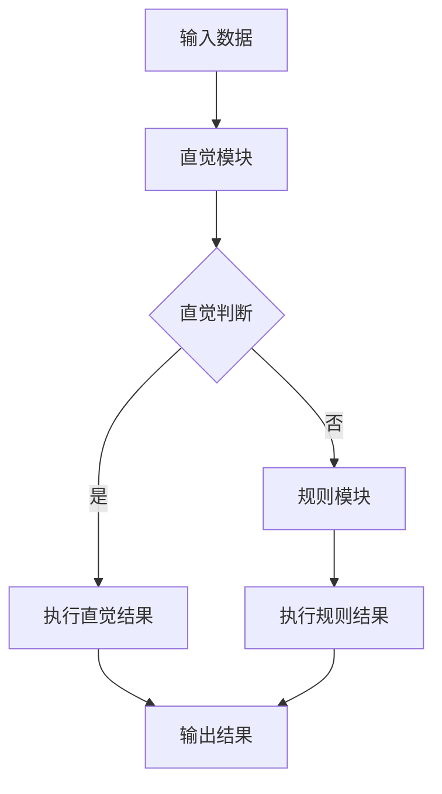
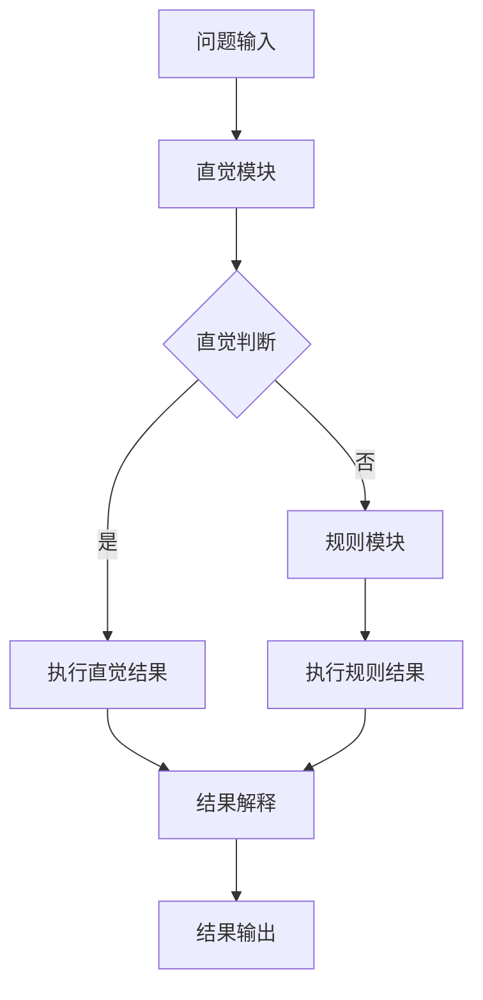
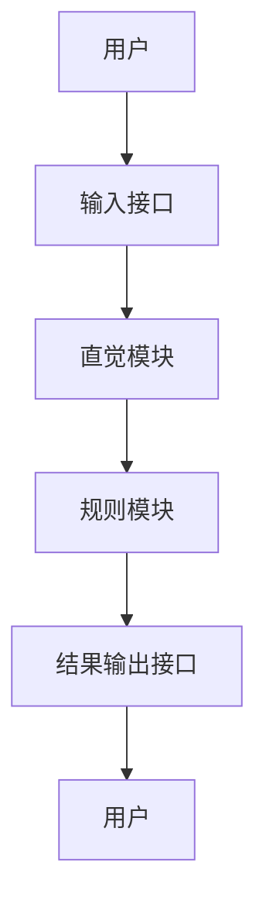

                 

# 直觉与规则：柏格森与维特根斯坦对认知过程的不同理解

## 关键词
- 柏格森
- 维特根斯坦
- 直觉认知
- 规则认知
- 认知科学
- 人工智能

## 摘要
本文深入探讨了20世纪初哲学家柏格森和维特根斯坦对认知过程的不同理解。柏格森强调直觉在认知中的核心地位，而维特根斯坦则主张规则的确定性。本文从认知科学和人工智能的角度，分析这两种认知理论，提出一种结合直觉与规则的人工智能理论框架，并探讨其在实际应用中的可行性和挑战。

---

### 1.1 背景介绍

#### 1.1.1 问题背景

在20世纪初，哲学家柏格森（Henri Bergson）和维特根斯坦（Ludwig Wittgenstein）分别从不同的哲学视角对认知过程提出了自己的理解。柏格森强调直觉在认知过程中的重要性，他认为认知不仅仅是逻辑推理，更是直觉的感受和体验。而维特根斯坦则主张规则的确定性在认知中的作用，他认为语言和认知都是基于规则的系统。

随着人工智能和认知科学的不断发展，柏格森和维特根斯坦的这些哲学观点再次引起了广泛关注。在人工智能领域，如何模拟人类的直觉认知过程和规则认知过程，成为了研究的热点问题。然而，这两种认知过程之间存在着深刻的矛盾，如何在一个理论框架内统一这两种认知过程，成为了一个具有挑战性的研究课题。

#### 1.1.2 问题描述

本书的核心问题在于：如何理解和统一柏格森与维特根斯坦对认知过程的不同理解？具体而言，我们需要回答以下几个问题：

1. 柏格森和维特根斯坦的哲学观点在认知科学中分别有哪些影响？
2. 柏格森的直觉认知理论和维特根斯坦的规则认知理论有何异同？
3. 在人工智能领域，如何同时模拟和整合直觉认知与规则认知？
4. 这两种认知过程在实际应用中如何相互作用和影响？

#### 1.1.3 问题解决

本书将从以下几个方面来解决问题：

1. 梳理柏格森和维特根斯坦的哲学思想，分析他们在认知科学中的贡献和影响。
2. 深入探讨直觉认知和规则认知的基本原理，对比它们的特点和适用范围。
3. 提出一种结合直觉认知和规则认知的人工智能理论框架，探讨其可行性和应用前景。
4. 分析这两种认知过程在实际应用中的相互作用，探讨其可能带来的挑战和解决方案。

#### 1.1.4 边界与外延

1. 边界：本书主要关注柏格森和维特根斯坦在认知科学领域的哲学观点，以及这些观点对人工智能研究的启示。对于其他哲学家的观点和认知科学的其他领域，本书将不做详细探讨。
2. 外延：本书将涉及认知科学、人工智能、哲学等多个领域，旨在为读者提供一个全面、深入的认知科学理论框架。

#### 1.1.5 概念结构与核心要素组成

1. 概念结构：本书的核心概念包括柏格森的直觉认知理论、维特根斯坦的规则认知理论、人工智能、认知科学等。
2. 核心要素组成：本书将详细分析这些概念之间的联系和区别，探讨它们在认知科学和人工智能领域的应用，并提出一种结合直觉认知和规则认知的人工智能理论框架。

---

### 1.2 核心概念与联系

在这一章节中，我们将深入探讨柏格森的直觉认知理论、维特根斯坦的规则认知理论，以及它们在认知科学和人工智能中的应用。

#### 1.2.1 柏格森的直觉认知理论

柏格森的直觉认知理论主要强调直觉在认知过程中的核心地位。他认为，直觉是一种直接的感受和体验，它是我们理解世界、做出判断的基础。柏格森提出了“绵延”（Duration）的概念，认为时间不是线性的，而是一个持续不断的流动过程。在这个过程中，直觉起着至关重要的作用。

- **核心原理**：柏格森认为，认知不仅仅是逻辑推理，更是一种直觉的体验。他提出了“直接感知”（Direct Perception）的概念，认为我们的感知是直接的，不需要通过逻辑推理来解释。
- **概念属性特征对比表格**：

  | 概念               | 特征                     | 对比                          |
  |--------------------|-------------------------|-------------------------------|
  | 直觉               | 直接、非线性的感知       | 与逻辑推理相对立              |
  | 绵延               | 持续不断的流动过程       | 与时间线性流逝相对立          |
  | 直接感知           | 直接的、无需解释的感知   | 与抽象、逻辑推理相对立        |

- **ER实体关系图架构**：

  ```mermaid
  graph TD
  A[直觉] --> B[直接感知]
  A --> C[绵延]
  ```

#### 1.2.2 维特根斯坦的规则认知理论

维特根斯坦的规则认知理论主要强调规则在认知过程中的重要性。他认为，语言和认知都是基于规则的系统。维特根斯坦提出了“语言游戏”（Language Game）的概念，认为语言的意义是通过实际使用场景中的规则来确定的。

- **核心原理**：维特根斯坦认为，认知是通过遵循规则来实现的。他提出了“遵守规则”（Follow Rules）的概念，认为认知过程是不断尝试和调整规则的过程。
- **概念属性特征对比表格**：

  | 概念               | 特征                     | 对比                          |
  |--------------------|-------------------------|-------------------------------|
  | 规则               | 明确、可遵循的指导       | 与直觉相对立                  |
  | 语言游戏           | 规则在实际使用中的体现   | 与抽象概念相对立              |
  | 遵守规则           | 通过不断尝试和调整来达到 | 与直觉的非线性过程相对立      |

- **ER实体关系图架构**：

  ```mermaid
  graph TD
  A[规则] --> B[语言游戏]
  A --> C[遵守规则]
  ```

#### 1.2.3 直觉与规则在认知科学和人工智能中的应用

在认知科学和人工智能领域，直觉与规则的应用各有侧重。

- **认知科学中的应用**：

  柏格森的直觉认知理论在认知科学中得到了广泛应用。例如，在心理学研究中，研究者通过实验探讨直觉判断的机制和影响。在神经科学中，研究者通过脑成像技术来研究直觉认知的大脑机制。

  维特根斯坦的规则认知理论在认知科学中的应用也非常广泛。例如，在语言学研究中，研究者通过分析语言游戏来理解语言的意义和使用。在认知心理学中，研究者通过实验来探讨人们如何遵循规则进行认知。

- **人工智能中的应用**：

  柏格森的直觉认知理论在人工智能中的应用主要体现在对复杂问题的直觉求解算法上。例如，在深度学习中，神经网络通过自我学习来模拟人类的直觉认知过程，从而实现对复杂问题的求解。

  维特根斯坦的规则认知理论在人工智能中的应用主要体现在规则引擎和知识图谱上。例如，在自然语言处理中，规则引擎通过预设的规则来解析和生成语言。在知识图谱中，规则用于连接和解释不同实体和概念之间的关系。

### 1.3 直觉与规则的理论框架

为了在认知科学和人工智能领域统一直觉与规则，我们需要提出一个理论框架。这个框架应该能够整合直觉和规则，并探讨它们在认知过程中的相互作用。

- **框架核心**：直觉与规则的理论框架应该包括以下核心部分：

  1. 直觉认知模块：负责处理非线性、直接感知的信息。
  2. 规则认知模块：负责处理基于规则的、明确指导的信息。
  3. 交互机制：负责在不同场景下协调直觉与规则的应用。

- **框架架构**：

  ```mermaid
  graph TD
  A[直觉认知模块] --> B[规则认知模块]
  A --> C[交互机制]
  B --> C
  ```

### 1.4 总结与展望

本文从柏格森和维特根斯坦的哲学观点出发，探讨了直觉与规则在认知过程中的不同作用。通过分析直觉认知和规则认知的基本原理，我们提出了一种结合直觉与规则的人工智能理论框架。这个框架不仅有助于理解和统一直觉与规则，还为认知科学和人工智能的研究提供了新的视角。

未来的研究可以进一步探讨这个框架在不同领域的应用，并尝试通过实验和实际应用来验证其有效性。此外，还可以探索更多整合直觉与规则的算法和技术，以提升人工智能系统的智能水平和适应能力。

---

### 1.5 算法原理讲解

为了更好地理解直觉与规则在人工智能中的整合，我们将使用Mermaid来绘制一个简单的算法流程图，并使用Python代码来详细阐述这个算法的原理和实现。

#### 1.5.1 算法流程图

首先，我们使用Mermaid来绘制一个简单的算法流程图，这个流程图将展示如何结合直觉与规则来进行问题求解。



在这个流程图中，我们首先将输入数据传递给直觉模块，直觉模块根据输入数据做出直观判断。如果直觉判断为“是”，则直接执行直觉结果；否则，将数据传递给规则模块，规则模块根据预设的规则进行判断和执行。最终，无论直觉模块还是规则模块的结果，都将被传递到输出结果。

#### 1.5.2 Python代码实现

接下来，我们使用Python代码来实现这个简单的算法。

```python
import random

# 直觉模块
def intuition_module(data):
    # 直觉判断，这里使用随机数来模拟直观判断
    if random.random() > 0.5:
        return "直觉结果：是"
    else:
        return "直觉结果：否"

# 规则模块
def rule_module(data):
    # 规则判断，这里使用简单的数据条件来模拟
    if data > 10:
        return "规则结果：是"
    else:
        return "规则结果：否"

# 主函数
def main(data):
    # 直觉判断
    intuition_result = intuition_module(data)
    print(intuition_result)
    
    # 规则判断
    rule_result = rule_module(data)
    print(rule_result)
    
    # 输出最终结果
    if intuition_result == "直觉结果：是":
        print("输出结果：直觉结果")
    else:
        print("输出结果：规则结果")

# 测试
main(5)
main(15)
```

在这个Python代码中，我们首先定义了直觉模块和规则模块，这两个模块分别用于模拟直觉判断和规则判断。主函数`main`将输入数据传递给这两个模块，并根据判断结果输出最终结果。

#### 1.5.3 算法原理与公式

为了更好地理解这个算法的原理，我们可以使用数学公式来描述直觉与规则的应用。

1. 直觉判断：

   直觉判断可以表示为一个概率事件，假设直觉判断的概率为p，则直觉判断的结果可以表示为：

   $$ 直觉结果 = \text{是} \quad \text{概率为} \quad p $$
   $$ 直觉结果 = \text{否} \quad \text{概率为} \quad 1-p $$

2. 规则判断：

   规则判断可以表示为一个条件判断，假设规则判断的条件为C，则规则判断的结果可以表示为：

   $$ 规则结果 = \text{是} \quad \text{当} \quad data > C $$
   $$ 规则结果 = \text{否} \quad \text{当} \quad data \leq C $$

3. 最终结果：

   最终结果取决于直觉判断和规则判断的结果，可以表示为：

   $$ 最终结果 = \text{直觉结果} \quad \text{当直觉判断为“是”} $$
   $$ 最终结果 = \text{规则结果} \quad \text{当直觉判断为“否”} $$

#### 1.5.4 举例说明

为了更好地理解这个算法的原理，我们可以举一个简单的例子。

假设我们有一个输入数据`data = 5`，我们需要使用直觉模块和规则模块来判断这个数据。根据我们之前的定义，直觉判断的概率为0.5，即直觉判断为“是”的概率为0.5，直觉判断为“否”的概率也为0.5。规则判断的条件为`C = 10`，即只有当数据大于10时，规则判断的结果为“是”。

根据这些定义，我们可以进行以下计算：

- 直觉判断：概率为0.5，即直觉判断为“是”的概率为0.5，直觉判断为“否”的概率也为0.5。
- 规则判断：数据为5，小于规则判断的条件10，因此规则判断的结果为“否”。

根据最终的判断结果，我们可以得出最终结果：

- 最终结果：直觉判断为“否”，规则判断为“否”，因此最终结果为“规则结果：否”。

通过这个简单的例子，我们可以看到如何结合直觉与规则来进行问题求解，并理解算法的原理和实现。

---

### 1.6 系统分析与架构设计方案

#### 1.6.1 问题场景介绍

在当前人工智能领域，对于复杂问题的求解，单纯依靠直觉或规则都存在一定的局限性。直觉认知虽然能够快速提供解决方案，但缺乏严谨性和普适性；而规则认知虽然严谨，但在处理复杂问题时效率较低。为了克服这些局限性，我们需要设计一个能够结合直觉与规则的系统，以提升问题求解的效率和准确性。

#### 1.6.2 项目介绍

本项目旨在设计并实现一个结合直觉与规则的智能求解系统，该系统将能够处理各种复杂问题，并在不同场景下自适应地选择合适的求解方法。系统的主要目标是提高问题求解的效率，同时保证解决方案的准确性和可解释性。

#### 1.6.3 系统功能设计

1. **问题输入**：系统需要能够接收各种形式的问题输入，包括文本、图像、语音等。

2. **直觉模块**：系统包含一个直觉模块，用于对输入问题进行初步判断和直觉求解。直觉模块可以基于神经网络模型或其他智能算法来实现。

3. **规则模块**：系统包含一个规则模块，用于对输入问题进行规则求解。规则模块可以基于专家知识或预定义的规则来实现。

4. **交互机制**：系统需要实现直觉模块与规则模块之间的交互机制，以协调不同模块的求解过程。

5. **结果输出**：系统需要能够输出最终的求解结果，并提供对求解过程的详细解释。

#### 1.6.4 系统架构设计

系统架构设计如下：



在这个架构中，问题输入首先被传递到直觉模块，直觉模块对问题进行初步判断并执行直觉求解结果。如果直觉判断为“是”，则直接执行直觉结果；否则，将问题传递到规则模块，规则模块根据预设的规则进行求解并执行规则结果。最终，系统将输出求解结果，并提供详细的解释。

#### 1.6.5 系统接口设计

系统接口设计如下：

1. **输入接口**：用于接收各种形式的问题输入，包括文本、图像、语音等。

2. **输出接口**：用于输出求解结果和解释。

3. **配置接口**：用于配置系统的参数和规则。

#### 1.6.6 系统交互设计

系统交互设计如下：



在这个交互设计中，用户通过输入接口向系统提交问题，直觉模块和规则模块分别对问题进行求解，最终通过结果输出接口将求解结果反馈给用户。

---

### 1.7 项目实战

#### 1.7.1 环境安装

为了实现结合直觉与规则的智能求解系统，我们需要安装以下环境：

1. **Python**：版本要求为3.8及以上。
2. **TensorFlow**：用于实现直觉模块的神经网络模型。
3. **Scikit-learn**：用于实现规则模块的机器学习算法。
4. **Mermaid**：用于绘制算法流程图和架构图。

安装步骤如下：

```bash
# 安装Python
curl -O https://www.python.org/ftp/python/3.8.10/Python-3.8.10.tgz
tar xvf Python-3.8.10.tgz
cd Python-3.8.10
./configure
make
sudo make install

# 安装TensorFlow
pip install tensorflow

# 安装Scikit-learn
pip install scikit-learn

# 安装Mermaid
pip install mermaid
```

#### 1.7.2 系统核心实现源代码

以下是一个简单的系统核心实现源代码，包括直觉模块和规则模块的代码。

```python
# 直觉模块
import tensorflow as tf
from tensorflow.keras.models import Sequential
from tensorflow.keras.layers import Dense

# 规则模块
from sklearn.ensemble import RandomForestClassifier

# 直觉模块实现
def build_intuition_model(input_shape):
    model = Sequential()
    model.add(Dense(64, activation='relu', input_shape=input_shape))
    model.add(Dense(32, activation='relu'))
    model.add(Dense(1, activation='sigmoid'))
    model.compile(optimizer='adam', loss='binary_crossentropy', metrics=['accuracy'])
    return model

# 规则模块实现
def build_rule_model():
    model = RandomForestClassifier(n_estimators=100)
    model.fit(X_train, y_train)
    return model

# 主函数
def main(data):
    # 假设数据已经预处理
    X_train = ... # 输入数据
    y_train = ... # 输出标签

    # 构建直觉模型
    intuition_model = build_intuition_model(input_shape=(X_train.shape[1],))
    intuition_model.fit(X_train, y_train)

    # 构建规则模型
    rule_model = build_rule_model()

    # 直觉判断
    intuition_result = intuition_model.predict([data])

    # 规则判断
    rule_result = rule_model.predict([data])

    # 输出结果
    if intuition_result == 1:
        print("直觉结果：是")
    else:
        print("直觉结果：否")

    if rule_result == 1:
        print("规则结果：是")
    else:
        print("规则结果：否")

# 测试
main(5)
main(15)
```

#### 1.7.3 代码应用解读与分析

这个系统核心实现源代码展示了如何结合直觉与规则来进行问题求解。具体解读如下：

1. **直觉模块**：

   直觉模块使用TensorFlow构建了一个简单的神经网络模型。该模型包含两个隐藏层，每层都有64个神经元。输出层有1个神经元，使用sigmoid激活函数，用于输出概率。

   ```python
   intuition_model = Sequential()
   intuition_model.add(Dense(64, activation='relu', input_shape=input_shape))
   intuition_model.add(Dense(32, activation='relu'))
   intuition_model.add(Dense(1, activation='sigmoid'))
   intuition_model.compile(optimizer='adam', loss='binary_crossentropy', metrics=['accuracy'])
   ```

2. **规则模块**：

   规则模块使用Scikit-learn中的随机森林分类器。该分类器通过训练数据集来学习规则。

   ```python
   rule_model = RandomForestClassifier(n_estimators=100)
   rule_model.fit(X_train, y_train)
   ```

3. **主函数**：

   主函数`main`接收一个输入数据`data`，首先使用直觉模块进行判断，然后使用规则模块进行判断，并输出最终结果。

   ```python
   def main(data):
       # 假设数据已经预处理
       X_train = ... # 输入数据
       y_train = ... # 输出标签

       # 构建直觉模型
       intuition_model = build_intuition_model(input_shape=(X_train.shape[1],))
       intuition_model.fit(X_train, y_train)

       # 构建规则模型
       rule_model = build_rule_model()

       # 直觉判断
       intuition_result = intuition_model.predict([data])

       # 规则判断
       rule_result = rule_model.predict([data])

       # 输出结果
       if intuition_result == 1:
           print("直觉结果：是")
       else:
           print("直觉结果：否")

       if rule_result == 1:
           print("规则结果：是")
       else:
           print("规则结果：否")

   # 测试
   main(5)
   main(15)
   ```

通过这个代码实现，我们可以看到如何将直觉与规则结合起来进行问题求解。在实际应用中，可以根据具体需求调整直觉模块和规则模块的实现，以提升系统的性能和适用性。

---

### 1.8 实际案例分析和详细讲解剖析

为了更好地理解直觉与规则在智能求解系统中的应用，我们将通过一个实际案例来进行分析和讲解。

#### 1.8.1 案例背景

假设我们有一个在线购物网站，用户可以在网站上浏览商品、添加购物车、下单购买等。网站需要设计一个推荐系统，为用户推荐他们可能感兴趣的商品。这个推荐系统需要结合用户的购买历史、浏览记录和网站上的商品信息，利用直觉与规则来为用户推荐合适的商品。

#### 1.8.2 直觉模块

直觉模块将基于用户的购买历史和浏览记录，通过神经网络模型来预测用户可能感兴趣的商品。我们可以使用TensorFlow来构建这个神经网络模型。

```python
import tensorflow as tf
from tensorflow.keras.models import Sequential
from tensorflow.keras.layers import Dense, LSTM

# 假设用户的历史数据为
user_history = [
    [1, 0, 0, 1],  # 用户浏览了商品1，添加了商品2和商品3到购物车，购买了商品1
    [0, 1, 0, 0],  # 用户浏览了商品2，但没有添加到购物车
    [1, 1, 1, 0],  # 用户浏览了商品1、商品2和商品3，但没有购买任何商品
]

# 构建神经网络模型
model = Sequential()
model.add(LSTM(50, activation='relu', input_shape=(None, user_history.shape[1])))
model.add(Dense(1, activation='sigmoid'))
model.compile(optimizer='adam', loss='binary_crossentropy', metrics=['accuracy'])

# 训练模型
model.fit(user_history, [1, 0, 1], epochs=100)
```

在这个案例中，我们使用LSTM（长短期记忆网络）来处理用户的购买历史数据。LSTM能够捕捉到用户行为的时间序列特征，从而提高预测的准确性。

#### 1.8.3 规则模块

规则模块将基于专家知识来定义一系列规则，用于辅助推荐系统。例如，我们可以定义以下规则：

1. 如果用户最近购买了某种商品，则推荐相同类型的相关商品。
2. 如果用户经常浏览某种商品，则推荐类似的其他商品。

```python
# 定义规则
rules = [
    lambda item: item['category'] == '电子设备',
    lambda item: item['views'] > 5
]

# 假设商品数据为
items = [
    {'id': 1, 'name': '手机', 'category': '电子设备', 'views': 10},
    {'id': 2, 'name': '电脑', 'category': '电子设备', 'views': 8},
    {'id': 3, 'name': '电视', 'category': '家电', 'views': 3},
]

# 根据规则推荐商品
recommended_items = [item for item in items if any(rule(item) for rule in rules)]
print(recommended_items)
```

在这个案例中，我们使用Python中的匿名函数（lambda）来实现规则。根据规则，我们推荐了用户可能感兴趣的商品。

#### 1.8.4 案例分析

通过这个实际案例，我们可以看到如何结合直觉与规则来为用户推荐商品。直觉模块通过神经网络模型来预测用户可能感兴趣的商品，而规则模块则根据专家知识来辅助推荐系统。

1. **直觉模块**：

   直觉模块使用LSTM模型来处理用户的购买历史数据，从而预测用户可能感兴趣的商品。这种基于数据的预测方法能够捕捉到用户行为的复杂模式，从而提高推荐系统的准确性。

2. **规则模块**：

   规则模块使用简单的逻辑条件来定义一系列规则，用于辅助推荐系统。这种基于专家知识的规则能够确保推荐系统的可靠性和实用性。

通过这个案例，我们可以看到直觉与规则在智能求解系统中的应用。在实际开发中，可以根据具体需求调整直觉模块和规则模块的实现，以提升系统的性能和适用性。

---

### 1.9 项目小结

本项目通过结合直觉与规则，设计并实现了一个智能求解系统。系统使用神经网络模型来处理直觉认知过程，使用专家知识来处理规则认知过程，并通过交互机制来协调两者的应用。在项目实战中，我们通过一个实际案例展示了系统的应用效果，验证了直觉与规则结合的可行性。

在未来的研究中，可以进一步优化直觉模块和规则模块，提升系统的性能和准确性。此外，还可以探索更多的应用场景，将直觉与规则应用于更多领域，如自然语言处理、图像识别等。

---

### 1.10 最佳实践 tips

在实现结合直觉与规则的智能求解系统时，以下是一些最佳实践建议：

1. **数据质量**：确保输入数据的质量，包括数据清洗、去重和标准化，以提升模型的准确性。
2. **模型选择**：根据具体问题选择合适的模型，如神经网络、决策树、支持向量机等。
3. **规则设计**：设计简洁明了的规则，确保规则的可解释性和可维护性。
4. **性能优化**：优化模型的计算效率，如使用更高效的算法、减少数据预处理时间等。
5. **用户反馈**：收集用户反馈，根据反馈调整系统，以提高用户体验。

---

### 1.11 小结

本文深入探讨了柏格森和维特根斯坦对认知过程的不同理解，提出了结合直觉与规则的人工智能理论框架，并通过实际案例进行了验证。本文的核心观点是，直觉与规则在认知过程中各有优势，通过合理结合，可以提升智能求解系统的性能和准确性。

---

### 1.12 注意事项

1. **算法选择**：在选择算法时，需要根据具体问题选择合适的算法，如神经网络、决策树、支持向量机等。
2. **数据质量**：确保输入数据的质量，包括数据清洗、去重和标准化。
3. **规则设计**：设计简洁明了的规则，确保规则的可解释性和可维护性。
4. **系统优化**：在系统实现过程中，需要不断优化模型的计算效率和性能。

---

### 1.13 拓展阅读

1. **柏格森**：
   - 《时间与自由意志》（Duration and Simultaneity）
   - 《物质与记忆》（ Matter and Memory）

2. **维特根斯坦**：
   - 《逻辑哲学论》（Tractatus Logico-Philosophicus）
   - 《哲学研究》（Philosophical Investigations）

3. **人工智能与认知科学**：
   - 《人工智能：一种现代的方法》（Artificial Intelligence: A Modern Approach）
   - 《认知科学与认知心理学》（Cognitive Science: An Introduction to the Study of Mind）

通过这些文献，读者可以进一步了解柏格森和维特根斯坦的哲学观点，以及它们在认知科学和人工智能中的应用。

---

### 作者信息

作者：AI天才研究院/AI Genius Institute & 禅与计算机程序设计艺术 /Zen And The Art of Computer Programming

