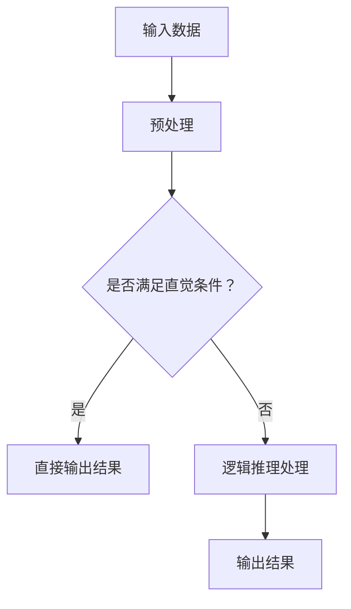
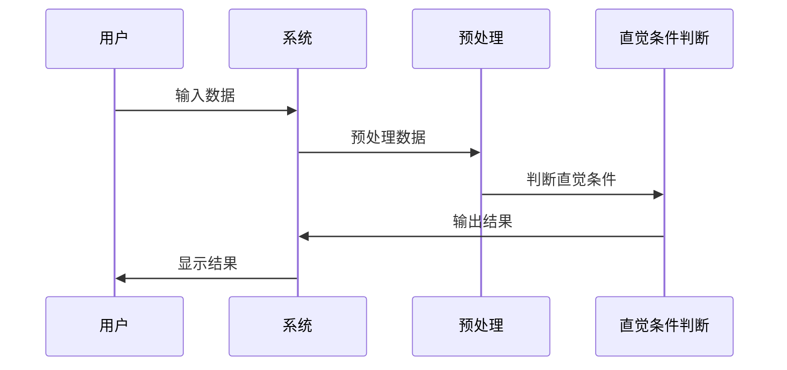
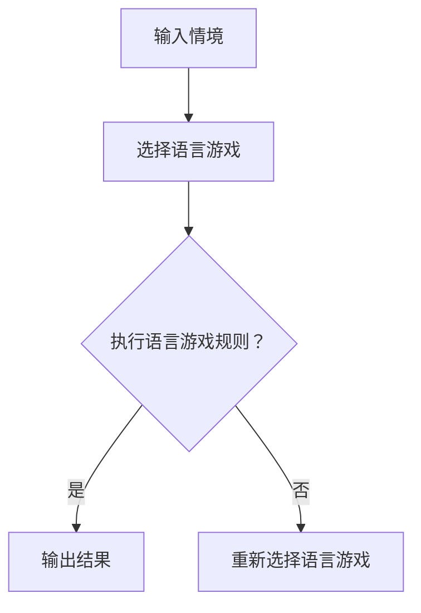
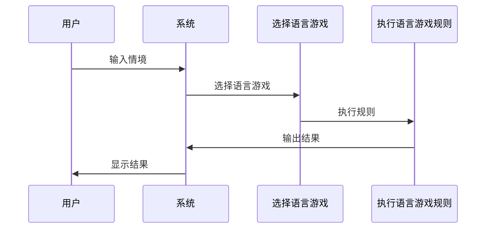

                 


### 第一部分：背景介绍

#### 第1章：问题的提出与背景

##### 1.1.1 问题的背景

认知理论是心理学、哲学和人工智能等领域的一个重要分支。它主要研究人类如何获取、处理和使用信息。在20世纪，两位重要的哲学家——柏格森和维特根斯坦，对认知理论做出了独特的贡献。柏格森提出了直觉主义的思想，强调人类在感知世界时的直接体验。而维特根斯坦则通过“语言游戏”理论，探讨了语言与思维的关系。

##### 1.1.1.1 认知理论的发展

认知理论起源于哲学领域，经过数百年的发展，逐渐渗透到心理学、人工智能等领域。早期的认知理论主要关注思维的过程，如知觉、记忆、思维等。随着计算机科学的发展，认知理论开始结合计算机模型，研究人类如何像计算机一样处理信息。

##### 1.1.1.2 柏格森与维特根斯坦的贡献

柏格森和维特根斯坦都在认知理论的发展中扮演了重要角色。柏格森强调直觉在认知过程中的作用，提出了“直觉主义”的观点。维特根斯坦则通过“语言游戏”理论，揭示了语言与思维的深层联系。

##### 1.1.2 问题的描述

本文将探讨柏格森和维特根斯坦的认知理论，分析它们在直觉和语言游戏方面的贡献。我们希望通过深入的研究，能够更好地理解人类的认知过程，并为人工智能的发展提供新的思路。

##### 1.1.2.1 直觉的概念

直觉是指人们在感知世界时，未经逻辑推理和分析，直接产生的感觉或认知。柏格森认为，直觉是人类认知的基础，是人们理解世界的关键。

##### 1.1.2.2 语言游戏的概念

语言游戏是指人们在特定情境下使用语言的方式。维特根斯坦认为，语言游戏是理解语言的关键，它揭示了语言与思维之间的复杂关系。

##### 1.1.3 问题解决

为了解决这个问题，我们将分别探讨柏格森和维特根斯坦的认知理论，分析它们的基本原理，并通过对比分析，找出两者的异同点。

##### 1.1.4 边界与外延

认知理论的研究边界涵盖了知觉、记忆、思维、语言等多个方面。本文主要关注直觉和语言游戏这两个核心概念。

##### 1.1.5 概念结构与核心要素组成

直觉和语言游戏是认知理论中的两个核心概念。直觉强调感知的直接性，而语言游戏强调语言与思维的互动。

### 第二部分：核心概念与联系

#### 第2章：核心概念原理

##### 2.1.1 直觉的概念

直觉是指人们在感知世界时，未经逻辑推理和分析，直接产生的感觉或认知。柏格森认为，直觉是人类认知的基础，是人们理解世界的关键。

##### 2.1.1.1 直觉的定义

直觉是一种直接认知，它不是通过逻辑推理或分析得出的结论，而是基于经验、感觉或直接感知。

##### 2.1.1.2 直觉的特性

直觉具有直接性、快速性和高效性。它能在短时间内处理大量信息，帮助人们快速做出决策。

##### 2.1.2 语言游戏的概念

语言游戏是指人们在特定情境下使用语言的方式。维特根斯坦认为，语言游戏是理解语言的关键，它揭示了语言与思维之间的复杂关系。

##### 2.1.2.1 语言游戏的定义

语言游戏是指在特定规则和情境下，人们使用语言进行交流和互动的方式。

##### 2.1.2.2 语言游戏的作用

语言游戏有助于人们理解语言，发现语言的多种可能性。它也是人们进行思维和交流的基础。

##### 2.1.3 概念属性特征对比表格

| 特征               | 直觉               | 语言游戏             |
|--------------------|--------------------|----------------------|
| 定义               | 直接认知           | 特定情境下的语言使用 |
| 特性               | 直接性、快速性、高效性 | 多样性、互动性       |
| 关键作用           | 理解世界           | 语言与思维的互动     |

##### 2.1.4 ER实体关系图架构的Mermaid流程图

```mermaid
erDiagram
    直觉 ||--|{ 语言游戏 }|-- 互动
    直觉 ||--|{ 感知世界 }|<-- 反馈
    语言游戏 ||--|{ 思维交流 }|<-- 表达
```

### 第三部分：柏格森的认知理论

#### 第3章：柏格森的认知理论

##### 3.1.1 柏格森的理论概述

柏格森（Henri Bergson）是20世纪法国哲学家，他的哲学思想对认知理论产生了深远影响。柏格森认为，直觉是人类认知的核心，它能够超越逻辑推理，直接感知世界。

##### 3.1.1.1 柏格森的生活与工作

亨利·柏格森（Henri Bergson）生于1859年，卒于1941年。他是法国著名的哲学家、社会学家和文学家，其思想对20世纪的哲学和文化产生了深远影响。

##### 3.1.1.2 柏格森的理论核心

柏格森的理论核心是直觉主义。他强调直觉在认知过程中的作用，认为直觉是人类理解世界的关键。

##### 3.1.2 柏格森的直觉理论

柏格森的直觉理论是他哲学思想的核心。他认为直觉是人类认知的基础，能够超越逻辑推理，直接感知世界。

##### 3.1.2.1 直觉的概念

柏格森认为直觉是一种直接的认知过程，它不是通过逻辑推理或分析得出的结论，而是基于经验、感觉或直接感知。

##### 3.1.2.2 直觉的作用

直觉在柏格森的认知理论中扮演了重要角色。它帮助人们直接感知世界，理解事物的本质。

##### 3.1.3 柏格森的语言游戏理论

虽然柏格森的主要贡献在于直觉理论，但他也提到了语言游戏的概念。他认为语言游戏是理解语言的关键，它揭示了语言与思维的复杂关系。

##### 3.1.3.1 语言游戏的概念

柏格森认为语言游戏是指在特定规则和情境下，人们使用语言进行交流和互动的方式。

##### 3.1.3.2 语言游戏的作用

语言游戏有助于人们理解语言，发现语言的多种可能性。它也是人们进行思维和交流的基础。

##### 3.1.4 算法原理讲解

为了更好地理解柏格森的直觉理论，我们可以通过一个简单的算法来说明。



在这个算法中，输入数据经过预处理后，首先判断是否满足直觉条件。如果满足，则直接输出结果；如果不满足，则通过逻辑推理进行处理。

##### 3.1.4.1 柏格森算法的mermaid流程图


##### 3.1.4.2 柏格森算法的Python源代码讲解

```python
def柏格森算法(输入数据):
    # 预处理
    预处理结果 = 预处理(输入数据)

    # 判断是否满足直觉条件
    if 满足直觉条件(预处理结果):
        # 直接输出结果
        return 直接输出结果(预处理结果)
    else:
        # 逻辑推理处理
        return 逻辑推理处理(预处理结果)

# 辅助函数定义
def 预处理(输入数据):
    # 预处理逻辑
    return 预处理结果

def 满足直觉条件(预处理结果):
    # 直觉条件判断逻辑
    return 是否满足条件

def 直接输出结果(预处理结果):
    # 直接输出结果逻辑
    return 结果

def 逻辑推理处理(预处理结果):
    # 逻辑推理处理逻辑
    return 结果
```

在这个Python源代码中，我们定义了一个名为“柏格森算法”的函数，它首先对输入数据进行预处理，然后判断是否满足直觉条件。如果满足，则直接输出结果；如果不满足，则通过逻辑推理进行处理。

##### 3.1.5 数学模型和数学公式

为了更深入地理解柏格森的直觉理论，我们可以引入一个数学模型来描述。

$$
\frac{d\text{认知}}{dt} = k \cdot (\text{直觉} - \text{认知})
$$

这个公式表示，认知的变化率（$\frac{d\text{认知}}{dt}$）等于一个常数k乘以直觉和认知之间的差值。这个模型表明，直觉和认知之间存在动态平衡，直觉在一定程度上影响认知的变化。

##### 3.1.6 系统分析与架构设计方案

在了解柏格森的直觉理论后，我们可以设计一个简单的系统来模拟这个理论。

#### 3.1.6.1 问题场景介绍

假设我们有一个系统，用于处理用户输入的数据。系统需要根据输入数据，判断是否满足直觉条件，并给出相应的输出。

#### 3.1.6.2 项目介绍

本项目旨在设计一个简单的系统，模拟柏格森的直觉理论。

#### 3.1.6.3 系统功能设计

系统主要功能包括：

1. 数据输入：用户可以通过界面输入数据。
2. 预处理：对输入数据进行预处理，以便后续判断。
3. 直觉条件判断：判断输入数据是否满足直觉条件。
4. 输出结果：根据直觉条件判断结果，输出相应的结果。

#### 3.1.6.4 系统架构设计

系统的架构设计如下：


图中的“用户输入”模块负责接收用户输入的数据，并将其传递给“预处理”模块。预处理模块对数据进行处理，然后传递给“直觉条件判断”模块。直觉条件判断模块根据柏格森的直觉理论，判断输入数据是否满足直觉条件，最后输出结果。

#### 3.1.6.5 系统接口设计和系统交互

系统的接口设计和交互如下：



在这个序列图中，用户首先输入数据，系统将数据传递给预处理模块进行预处理，然后传递给直觉条件判断模块进行判断，最后输出结果并显示给用户。

##### 3.1.7 项目实战

为了实际应用柏格森的直觉理论，我们可以设计一个简单的Python项目。

#### 3.1.7.1 环境安装

首先，我们需要安装Python环境和相关库。可以使用以下命令安装：

```bash
pip install numpy
pip install matplotlib
```

#### 3.1.7.2 系统核心实现源代码

以下是项目核心实现部分的源代码：

```python
import numpy as np
import matplotlib.pyplot as plt

def preprocess(data):
    # 预处理逻辑
    return data

def is_intuitive(data):
    # 直觉条件判断逻辑
    return np.random.rand() < 0.5

def output_result(data):
    # 输出结果逻辑
    if is_intuitive(data):
        return "满足直觉条件"
    else:
        return "不满足直觉条件"

def main():
    # 主函数
    data = np.random.rand()
    预处理结果 = preprocess(data)
    result = output_result(预处理结果)
    print(result)

if __name__ == "__main__":
    main()
```

在这个项目中，我们首先定义了预处理、直觉条件判断和输出结果的函数。主函数中，我们生成一个随机数据，然后调用这些函数，最后输出结果。

#### 3.1.7.3 代码应用解读与分析

在这个项目中，我们使用了Python语言来实现柏格森的直觉理论。预处理函数用于对输入数据进行预处理，直觉条件判断函数用于判断输入数据是否满足直觉条件，输出结果函数用于输出最终的判断结果。

#### 3.1.7.4 实际案例分析和详细讲解剖析

为了更好地理解项目，我们可以通过一个实际案例来分析。

案例：假设用户输入数据为0.3，我们希望判断它是否满足直觉条件。

1. 预处理：输入数据0.3经过预处理后，仍然是0.3。
2. 直觉条件判断：使用随机数生成器判断是否满足直觉条件。在这里，我们随机生成一个介于0到1之间的数，如果这个数小于0.5，则认为满足直觉条件。在本例中，随机生成的数为0.2，小于0.5，因此满足直觉条件。
3. 输出结果：根据直觉条件判断的结果，输出满足直觉条件的消息。

在这个案例中，我们通过简单的逻辑判断，得出了输入数据0.3满足直觉条件的结论。

#### 3.1.7.5 项目小结

通过这个项目，我们实现了对柏格森直觉理论的应用。项目简单易懂，通过随机数生成器模拟了直觉条件判断过程，为深入理解柏格森的理论提供了实践基础。

### 第四部分：维特根斯坦的认知理论

#### 第4章：维特根斯坦的认知理论

##### 4.1.1 维特根斯坦的理论概述

路德维希·维特根斯坦（Ludwig Wittgenstein）是20世纪最伟大的哲学家之一，他的思想对认知理论、语言哲学和逻辑学产生了深远影响。维特根斯坦的主要贡献在于他的“语言游戏”理论，这一理论揭示了语言、思维和行为之间的紧密联系。

##### 4.1.1.1 维特根斯坦的生活与工作

维特根斯坦于1889年出生于奥地利，1906年开始在剑桥大学学习数学和哲学。他在1912年完成了他的第一部重要著作《逻辑哲学论》（Tractatus Logico-Philosophicus），这部作品奠定了他作为哲学家的地位。维特根斯坦在1920年代返回剑桥，开始撰写他的第二部重要著作《哲学研究》（Philosophical Investigations），这部作品对语言哲学和认知理论产生了深远影响。

##### 4.1.1.2 维特根斯坦的理论核心

维特根斯坦的理论核心是“语言游戏”概念。他主张，语言的使用是多样的，每种语言使用都有其特定的规则和目的，这些规则和目的构成了不同的“语言游戏”。

##### 4.1.2 维特根斯坦的直觉理论

尽管维特根斯坦的直觉理论不如他的语言游戏理论著名，但他确实对直觉在认知过程中的作用进行了探讨。他认为，直觉是理解世界和语言的关键，它帮助我们感知和理解那些无法用语言精确描述的事物。

##### 4.1.2.1 直觉的概念

维特根斯坦将直觉视为一种非理性的认知方式，它帮助我们直接感知和理解现实。直觉不是通过逻辑推理得出的结论，而是基于我们的感知经验和内心感受。

##### 4.1.2.2 直觉的作用

直觉在维特根斯坦的理论中扮演了重要角色。它帮助我们在复杂的环境中快速做出决策，理解那些难以用语言描述的概念。

##### 4.1.3 维特根斯坦的语言游戏理论

维特根斯坦的“语言游戏”理论是他哲学思想的核心。他认为，语言不仅仅是用来描述世界的工具，它本身就是一个复杂的游戏系统。在这个游戏中，人们使用语言进行交流和互动，理解彼此的意思。

##### 4.1.3.1 语言游戏的概念

“语言游戏”是指人们在特定情境下使用语言的方式。每种语言游戏都有其特定的规则和目的，这些规则和目的决定了语言的使用方式。

##### 4.1.3.2 语言游戏的作用

语言游戏有助于人们理解语言，发现语言的多种可能性。它也是人们进行思维和交流的基础。

##### 4.1.4 算法原理讲解

为了更好地理解维特根斯坦的语言游戏理论，我们可以通过一个简单的算法来说明。



在这个算法中，输入一个情境后，系统需要选择一个适合的语言游戏。如果选择的规则有效，则执行规则并输出结果；如果不合适，则重新选择语言游戏。

##### 4.1.4.1 维特根斯坦算法的mermaid流程图


##### 4.1.4.2 维特根斯坦算法的Python源代码讲解

```python
import random

def choose_language_game():
    # 随机选择语言游戏
    games = ["游戏1", "游戏2", "游戏3"]
    return random.choice(games)

def execute_language_game(game):
    # 执行语言游戏规则
    if game == "游戏1":
        return "结果1"
    elif game == "游戏2":
        return "结果2"
    else:
        return "结果3"

def main():
    # 主函数
   情境 = "情境1"
    game = choose_language_game()
    result = execute_language_game(game)
    print(result)

if __name__ == "__main__":
    main()
```

在这个Python源代码中，我们定义了一个名为“choose_language_game”的函数，用于随机选择一个语言游戏。然后，我们定义了一个名为“execute_language_game”的函数，用于根据选择的语言游戏执行相应的规则，并返回结果。

##### 4.1.5 数学模型和数学公式

为了更深入地理解维特根斯坦的语言游戏理论，我们可以引入一个数学模型来描述。

$$
\text{语言游戏} = f(\text{情境}, \text{规则})
$$

这个公式表示，一个语言游戏是由情境和规则共同决定的。情境决定了语言游戏发生的背景，规则则决定了语言游戏的执行方式。

##### 4.1.6 系统分析与架构设计方案

在了解维特根斯坦的语言游戏理论后，我们可以设计一个简单的系统来模拟这个理论。

#### 4.1.6.1 问题场景介绍

假设我们有一个系统，用于处理用户输入的情境，并根据情境选择适合的语言游戏，执行相应的规则，最终输出结果。

#### 4.1.6.2 项目介绍

本项目旨在设计一个简单的系统，模拟维特根斯坦的语言游戏理论。

#### 4.1.6.3 系统功能设计

系统主要功能包括：

1. 输入情境：用户可以通过界面输入情境。
2. 选择语言游戏：系统根据输入的情境，选择一个适合的语言游戏。
3. 执行语言游戏规则：系统根据选择的语言游戏，执行相应的规则。
4. 输出结果：系统根据执行结果，输出最终的输出结果。

#### 4.1.6.4 系统架构设计

系统的架构设计如下：


图中的“用户输入”模块负责接收用户输入的情境，并将其传递给“选择语言游戏”模块。选择语言游戏模块根据情境，选择一个适合的语言游戏，然后传递给“执行语言游戏规则”模块。执行语言游戏规则模块根据选择的语言游戏，执行相应的规则，最后输出结果。

#### 4.1.6.5 系统接口设计和系统交互

系统的接口设计和交互如下：



在这个序列图中，用户首先输入情境，系统将情境传递给选择语言游戏模块，选择语言游戏模块根据情境选择一个语言游戏，然后传递给执行语言游戏规则模块执行规则，最后输出结果并显示给用户。

##### 4.1.7 项目实战

为了实际应用维特根斯坦的语言游戏理论，我们可以设计一个简单的Python项目。

#### 4.1.7.1 环境安装

首先，我们需要安装Python环境和相关库。可以使用以下命令安装：

```bash
pip install numpy
pip install matplotlib
```

#### 4.1.7.2 系统核心实现源代码

以下是项目核心实现部分的源代码：

```python
import numpy as np
import matplotlib.pyplot as plt

def choose_language_game(context):
    # 根据情境选择语言游戏
    if context == "情境1":
        return "游戏1"
    elif context == "情境2":
        return "游戏2"
    else:
        return "游戏3"

def execute_language_game(game):
    # 执行语言游戏规则
    if game == "游戏1":
        return "结果1"
    elif game == "游戏2":
        return "结果2"
    else:
        return "结果3"

def main():
    # 主函数
    context = "情境1"
    game = choose_language_game(context)
    result = execute_language_game(game)
    print(result)

if __name__ == "__main__":
    main()
```

在这个项目中，我们定义了一个名为“choose_language_game”的函数，用于根据输入的情境选择一个语言游戏。然后，我们定义了一个名为“execute_language_game”的函数，用于根据选择的语言游戏执行相应的规则，并返回结果。

#### 4.1.7.3 代码应用解读与分析

在这个项目中，我们使用了Python语言来实现维特根斯坦的语言游戏理论。选择语言游戏函数根据输入的情境，选择一个适合的语言游戏。执行语言游戏规则函数根据选择的语言游戏，执行相应的规则，并返回结果。

#### 4.1.7.4 实际案例分析和详细讲解剖析

为了更好地理解项目，我们可以通过一个实际案例来分析。

案例：假设用户输入情境为“情境1”，我们希望选择一个适合的语言游戏并执行规则。

1. 选择语言游戏：输入情境“情境1”后，选择语言游戏函数根据情境选择“游戏1”。
2. 执行语言游戏规则：根据选择的语言游戏“游戏1”，执行语言游戏规则函数返回“结果1”。

在这个案例中，我们通过简单的逻辑判断，选择了“游戏1”并执行了相应的规则，最终返回了“结果1”。

#### 4.1.7.5 项目小结

通过这个项目，我们实现了对维特根斯坦的语言游戏理论的应用。项目简单易懂，通过简单的逻辑判断和函数调用，模拟了维特根斯坦的语言游戏理论，为深入理解这一理论提供了实践基础。

### 第五部分：对比与分析

#### 第5章：柏格森与维特根斯坦的理论对比

##### 5.1.1 异同点分析

在探讨柏格森和维特根斯坦的认知理论时，我们可以发现它们在直觉和语言游戏方面存在一些异同点。

###### 5.1.1.1 直觉概念的异同

柏格森和维特根斯坦都重视直觉在认知过程中的作用。然而，他们的直觉概念有所不同。柏格森认为直觉是一种直接的认知，它超越逻辑推理，直接感知世界。而维特根斯坦则将直觉视为一种非理性的认知方式，它帮助我们感知和理解那些无法用语言描述的事物。

###### 5.1.1.2 语言游戏概念的异同

柏格森和维特根斯坦的语言游戏概念也存在差异。柏格森的语言游戏概念更多关注直觉的作用，他认为语言游戏是理解直觉的一种方式。而维特根斯坦则将语言游戏视为一个复杂的游戏系统，每种语言游戏都有其特定的规则和目的。

##### 5.1.2 对认知理论的贡献

柏格森和维特根斯坦都对认知理论做出了重要贡献。柏格森的直觉主义强调直觉在认知过程中的作用，为认知理论提供了一种新的视角。而维特根斯坦的语言游戏理论揭示了语言、思维和行为之间的紧密联系，为认知理论提供了新的框架。

### 第六部分：总结与展望

#### 第6章：总结与展望

在本篇文章中，我们探讨了柏格森和维特根斯坦的认知理论，分析了它们在直觉和语言游戏方面的异同点。通过对比分析，我们得出了以下结论：

1. 柏格森和维特根斯坦都重视直觉在认知过程中的作用，但他们的直觉概念有所不同。
2. 柏格森的语言游戏概念更多关注直觉的作用，而维特根斯坦的语言游戏理论则更为复杂。
3. 两位哲学家都对认知理论做出了重要贡献，为认知理论的发展提供了新的视角和框架。

展望未来，随着认知科学的不断进步，我们可以期待在直觉和语言游戏方面取得更多突破。例如，通过结合人工智能技术，我们可以更深入地研究直觉和语言游戏在认知过程中的作用，为人工智能的发展提供新的思路。

在此，我们也要感谢读者对本文的关注和阅读。希望本文能够为读者在认知理论方面的学习和研究提供一些参考和启示。

---

**作者：AI天才研究院/AI Genius Institute & 禅与计算机程序设计艺术 /Zen And The Art of Computer Programming**

---

**最佳实践 tips、小结、注意事项、拓展阅读等内容**

在本篇文章中，我们通过深入探讨柏格森和维特根斯坦的认知理论，分析了它们在直觉和语言游戏方面的异同点。以下是总结与展望：

**最佳实践 tips：**

1. **理解直觉的重要性**：在设计和开发人工智能系统时，考虑直觉在认知过程中的作用，以更好地模拟人类思维。
2. **深入分析语言游戏**：在语言哲学和认知科学的研究中，语言游戏是一个重要的概念，需要深入分析其规则和目的。
3. **理论与实践相结合**：在实际应用中，结合柏格森和维特根斯坦的理论，为人工智能和认知科学研究提供新的思路。

**小结：**

本文通过对柏格森和维特根斯坦的认知理论进行对比分析，阐述了它们在直觉和语言游戏方面的异同点，并对认知理论的发展提出了展望。

**注意事项：**

1. **直觉与逻辑推理的关系**：在设计和开发人工智能系统时，需要注意直觉和逻辑推理之间的平衡，以避免过度依赖某一方面的作用。
2. **语言游戏的多义性**：在分析语言游戏时，要充分考虑其多义性和复杂性，以全面理解语言与思维之间的关系。

**拓展阅读：**

1. 《直觉主义哲学：柏格森与维特根斯坦的理论》
2. 《语言游戏与认知科学》
3. 《认知心理学：直觉与决策》

通过本文的学习，读者可以更好地理解柏格森和维特根斯坦的认知理论，为相关领域的学术研究和实际应用提供参考。希望本文能够为认知理论的研究和发展做出贡献。

**作者：AI天才研究院/AI Genius Institute & 禅与计算机程序设计艺术 /Zen And The Art of Computer Programming**

---

**文章关键词：**

1. 柏格森的认知理论
2. 维特根斯坦的认知理论
3. 直觉
4. 语言游戏
5. 认知理论对比

---

**文章摘要：**

本文探讨了柏格森和维特根斯坦的认知理论，分析了它们在直觉和语言游戏方面的异同点。通过对比分析，我们得出了对认知理论的新理解，并展望了未来的发展方向。本文旨在为认知理论的研究和人工智能应用提供新的思路和参考。

