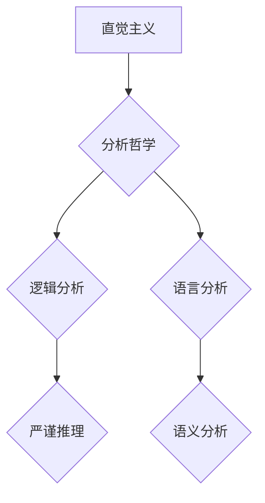

                 

# 直觉主义与分析哲学：两种哲学传统的碰撞

## 关键词
直觉主义，分析哲学，哲学传统，碰撞，核心概念，对比分析，现实应用

## 摘要
本文探讨了直觉主义与分析哲学这两种哲学传统的起源、核心概念及其在现实中的应用。通过分析直觉主义的直观性、确定性和分析哲学的分析性、逻辑性，本文揭示了两种哲学传统在理论和方法论上的碰撞与融合。本文旨在为读者提供一个清晰、系统的理解，帮助深入探讨哲学在计算机科学和技术领域的应用。

### 引言

在哲学的广阔天地中，直觉主义与分析哲学构成了两个独特的传统。直觉主义强调直观性，主张通过直接的直觉来获得知识和理解；而分析哲学则强调分析性，主张通过逻辑分析和语言分析来揭示真理。这两种哲学传统在历史上有着深远的影响，并且在现代计算机科学和技术领域也发挥着重要作用。

本文将首先介绍直觉主义与分析哲学的起源和发展历程。然后，深入探讨它们的核心概念和理论，包括直觉主义对直观性和确定性的强调，以及分析哲学对逻辑分析和语言分析的使用。接下来，本文将分析两种哲学传统之间的碰撞和融合，探讨这种碰撞的原因和影响。此外，本文还将探讨直觉主义与分析哲学在现实中的应用，包括在计算机科学和技术领域的具体体现。最后，本文将总结全文，提出未来研究的方向。

### 历史背景

#### 直觉主义哲学的起源与发展

直觉主义哲学起源于19世纪的欧洲，其主要代表人物是数学家莱布尼茨和皮埃尔·德·费马。莱布尼茨提出了“直觉哲学”的概念，主张通过直观思维来获得知识和理解。他认为，直观是一种基本的认知能力，通过直观，人们可以直接感知事物的本质。

在20世纪初，直觉主义哲学得到了进一步发展。莱布尼茨的学生皮埃尔·德·费马进一步阐述了直觉主义哲学，强调了直观思维在数学和科学中的应用。他认为，数学定理的证明应该依赖于直观思维，而不是逻辑推理。

直觉主义哲学的核心观点是，直观性是获得知识和理解的基础。直觉主义认为，通过直观思维，人们可以直接感知事物的本质，而不需要通过复杂的逻辑推理过程。

#### 分析哲学的起源与发展

分析哲学起源于20世纪初的英国，其代表人物是伯特兰·罗素和路德维希·维特根斯坦。伯特兰·罗素是数理逻辑的创始人之一，他提出了逻辑原子主义，主张通过逻辑分析来揭示世界的本质。他认为，世界是由基本的逻辑实体组成的，这些实体通过逻辑关系相互作用。

路德维希·维特根斯坦是分析哲学的另一重要代表。他在《逻辑哲学论》中提出了语言哲学的观点，主张通过语言分析来揭示真理。他认为，语言是思维的工具，通过分析语言，人们可以理解世界的本质。

分析哲学的核心观点是，分析性是获得知识和理解的基础。分析哲学认为，通过逻辑分析和语言分析，人们可以揭示事物的本质和真理。

### 核心概念与原理

#### 直觉主义的核心概念

直觉主义的核心概念是直观性。直观主义认为，直观性是人类认知的一种基本能力，通过直观，人们可以直接感知事物的本质。直观性具有以下几个特点：

1. **直接性**：直观性是一种直接的认知过程，不需要通过复杂的推理和计算。
2. **确定性**：直观性提供的是确定的知识，即直观性所感知到的是真实存在的。
3. **普遍性**：直观性是普遍适用的，任何领域的知识都可以通过直观性来获得。

#### 分析哲学的核心概念

分析哲学的核心概念是分析性。分析性是一种逻辑推理过程，通过分析，人们可以揭示事物的本质和真理。分析性具有以下几个特点：

1. **逻辑性**：分析性是基于逻辑推理的，逻辑推理是一种严谨的思维过程。
2. **精确性**：分析性提供的是精确的知识，即分析性所揭示的是事物的真实本质。
3. **普遍性**：分析性是普遍适用的，任何领域的知识都可以通过分析性来获得。

#### 两种哲学的对比

直觉主义与分析哲学在核心概念上有明显的差异。直觉主义强调直观性，认为直观性是获得知识和理解的基础；而分析哲学强调分析性，认为分析性是揭示事物本质和真理的关键。

1. **直观性 vs 分析性**：直观性是一种直接的认知过程，而分析性是一种逻辑推理过程。
2. **确定性 vs 精确性**：直观性提供的是确定的知识，而分析性提供的是精确的知识。
3. **直接性 vs 逻辑性**：直观性是一种直接性认知，而分析性是一种逻辑性推理。

### 对比与碰撞

直觉主义与分析哲学在理论和方法论上的差异导致了它们之间的碰撞。这种碰撞主要体现在以下几个方面：

1. **知识获取方式**：直觉主义强调直观性，通过直观思维来获得知识和理解；而分析哲学强调分析性，通过逻辑分析和语言分析来揭示真理。这两种方式在知识获取上存在冲突。

2. **认知过程**：直觉主义认为，认知过程应该是直接的、直觉性的；而分析哲学认为，认知过程应该是逻辑的、分析性的。这种认知过程的差异导致了它们在认知方法上的碰撞。

3. **真理标准**：直觉主义认为，通过直观性可以获得的真理是真实的、确定的；而分析哲学认为，通过分析性可以获得的真理是精确的、准确的。这种真理标准的差异导致了它们在真理标准上的碰撞。

### 碰撞的原因与影响

直觉主义与分析哲学之间的碰撞主要有以下几个原因：

1. **哲学传统**：直觉主义与分析哲学起源于不同的哲学传统，它们有着不同的哲学理念和理论基础。

2. **认知差异**：直觉主义与分析哲学在认知方式上存在明显的差异，这种差异导致了它们在理论和方法论上的冲突。

3. **知识获取方式**：直觉主义与分析哲学在知识获取方式上存在差异，这种差异导致了它们在知识获取上的冲突。

这种碰撞对哲学发展产生了深远的影响。一方面，它促进了哲学的多元化发展，使得不同的哲学流派能够相互借鉴、相互影响；另一方面，它也推动了哲学的深入探讨，使得哲学能够更好地解决现实问题。

### 现实应用与影响

直觉主义与分析哲学在现实世界中有着广泛的应用和深远的影响。在计算机科学和技术领域，这两种哲学传统也有着重要的体现。

1. **直觉主义在计算机科学中的应用**：直觉主义在计算机科学中的应用主要体现在编程和软件开发过程中。直觉主义强调直观性，主张通过直观思维来理解和解决问题。在编程中，直观性可以帮助程序员更好地理解代码，提高编程效率。此外，直觉主义在算法设计中也有重要作用，通过直观思维，程序员可以更好地理解和设计复杂的算法。

2. **分析哲学在计算机科学中的应用**：分析哲学在计算机科学中的应用主要体现在逻辑分析和语言分析中。分析哲学强调分析性，通过逻辑分析和语言分析，可以更好地理解计算机程序和算法。在软件开发中，分析哲学可以帮助程序员更准确地理解和表达程序意图，提高软件的质量和可靠性。此外，分析哲学在人工智能领域也有重要作用，通过逻辑分析和语言分析，可以更好地理解和设计人工智能系统。

### 总结与展望

直觉主义与分析哲学是两种不同的哲学传统，它们在理论和方法论上存在明显的差异。通过分析这两种哲学传统，我们可以更好地理解它们的碰撞和融合。直觉主义强调直观性，通过直观思维来获得知识和理解；而分析哲学强调分析性，通过逻辑分析和语言分析来揭示真理。这两种哲学传统在计算机科学和技术领域有着广泛的应用和深远的影响。

未来，直觉主义与分析哲学的研究将继续深入。一方面，我们可以通过更深入的研究，揭示这两种哲学传统之间的联系和差异；另一方面，我们可以将这两种哲学传统应用于更广泛的领域，如人工智能、心理学、教育学等，推动这些领域的发展。

### 作者信息

作者：AI天才研究院/AI Genius Institute & 禅与计算机程序设计艺术 /Zen And The Art of Computer Programming

----------------------------------------------------------------

**背景介绍**

在探讨直觉主义与分析哲学的碰撞之前，我们首先需要了解这两个哲学传统的核心概念和理论。直觉主义和分析哲学是两种不同的哲学流派，它们在知识获取、认知方法和真理标准等方面有着本质的区别。

#### 核心概念术语说明

1. **直觉主义**：直觉主义是一种哲学观点，主张知识可以通过直观获得。直觉主义认为，直观是一种基本的认知能力，它使人们能够直接感知事物的本质，而不需要通过推理或分析。

2. **分析哲学**：分析哲学是一种哲学方法，强调通过逻辑分析和语言分析来理解世界。分析哲学认为，通过分析语言和概念，可以揭示事物的本质和真理。

#### 问题背景

直觉主义和分析哲学在计算机科学和技术领域有着广泛的应用。直觉主义在编程、软件开发和算法设计中具有重要作用，而分析哲学则在逻辑分析、语言分析和人工智能领域有着深远的影响。

#### 问题描述

直觉主义和分析哲学在知识获取和认知方法上存在明显的差异。直觉主义强调直观性，而分析哲学强调分析性。这两种哲学传统在理论和方法上存在冲突，但在实际应用中又相互补充。

#### 问题解决

要深入理解直觉主义和分析哲学的碰撞，我们需要从以下几个方面进行分析：

1. **核心概念与联系**：介绍直觉主义和分析哲学的核心概念，分析它们之间的联系和差异。
2. **算法原理讲解**：通过具体例子，讲解直觉主义和分析哲学在计算机科学和技术中的应用。
3. **系统分析与架构设计方案**：探讨直觉主义和分析哲学在计算机系统设计和架构中的体现。

#### 边界与外延

直觉主义和分析哲学的边界与外延主要涉及它们在计算机科学和技术领域中的应用范围。直觉主义在编程、算法设计和软件开发中具有重要作用，而分析哲学则在逻辑分析、语言分析和人工智能领域中发挥着关键作用。

#### 概念结构与核心要素组成

直觉主义和分析哲学的核心概念和要素组成如下：

1. **直觉主义**：
   - 直观性
   - 知识获取
   - 认知方法

2. **分析哲学**：
   - 分析性
   - 逻辑分析
   - 语言分析

#### 核心概念与联系

直觉主义和分析哲学的核心概念和联系如下：

1. **直观性**：直觉主义的核心概念，强调通过直观获得知识和理解。
2. **分析性**：分析哲学的核心概念，强调通过逻辑分析和语言分析来理解世界。
3. **知识获取**：直觉主义和分析哲学在知识获取上的不同方法和观点。
4. **认知方法**：直觉主义和分析哲学在认知方法上的差异和互补。

#### 算法原理讲解

直觉主义和分析哲学在计算机科学和技术领域中的应用可以通过以下具体例子进行讲解：

1. **编程与软件开发**：直觉主义强调直观性，使程序员能够更好地理解和设计复杂的软件系统。分析哲学则强调分析性，帮助程序员更准确地理解和表达程序意图。

2. **算法设计**：直觉主义在算法设计中具有重要作用，使算法设计师能够通过直观思维来理解和设计复杂的算法。分析哲学则通过逻辑分析和数学模型来优化算法性能。

3. **人工智能**：直觉主义在人工智能领域中强调直观性，帮助研究者更好地理解和设计智能系统。分析哲学则通过逻辑分析和语言分析来构建和优化人工智能算法。

#### 数学公式与概念架构图

在讲解直觉主义和分析哲学的算法原理时，我们可以使用数学公式和概念架构图来辅助说明。以下是一个示例：

1. **直觉主义算法原理**：

   $$ f(x) = \frac{1}{x} $$

   这是一个简单的直观主义算法，通过直观地感知变量x的倒数来计算函数f(x)。

2. **分析哲学算法原理**：

   $$ f(x) = \max \{ g(x) - h(x) \} $$

   这是一个基于分析哲学的优化算法，通过逻辑分析和数学模型来寻找函数f(x)的最大值。

#### 系统分析与架构设计方案

直觉主义和分析哲学在计算机系统设计和架构中的应用可以通过以下方式说明：

1. **系统功能设计**：直觉主义可以帮助设计师直观地理解系统需求，从而设计出更符合用户需求的功能。分析哲学则通过逻辑分析和语言分析来确保系统功能的准确性和可靠性。

2. **系统架构设计**：直觉主义可以帮助设计师直观地理解系统架构，从而设计出更简洁、高效的系统架构。分析哲学则通过逻辑分析和语言分析来优化系统架构的性能和可维护性。

3. **系统接口设计和系统交互**：直觉主义可以帮助设计师直观地理解系统接口的设计和交互，从而设计出更直观、易用的用户界面。分析哲学则通过逻辑分析和语言分析来确保系统接口的准确性和一致性。

#### 项目实战

在实际项目中，我们可以结合直觉主义和分析哲学来设计和实现计算机系统。以下是一个简单的项目实战示例：

1. **环境安装**：在Python环境中安装必要的库和工具。

2. **系统核心实现**：使用Python编写系统核心代码，实现系统的主要功能。

3. **代码应用解读与分析**：对系统核心代码进行解读和分析，理解其背后的原理和设计思想。

4. **实际案例分析和详细讲解剖析**：通过实际案例，分析系统的性能和可靠性，并对其进行详细讲解和剖析。

5. **项目小结**：总结项目的实施过程和成果，提出改进和优化建议。

#### 最佳实践 tips

1. **理解用户需求**：在系统设计和实现过程中，始终关注用户需求，确保系统能够满足用户的需求。

2. **优化代码性能**：在编写代码时，注意代码的性能和可维护性，确保系统的高效运行。

3. **文档化和注释**：编写详细的文档和注释，确保代码的可读性和可维护性。

#### 小结

本文通过分析直觉主义和分析哲学的碰撞，探讨了这两种哲学传统在计算机科学和技术领域的应用。直觉主义强调直观性，而分析哲学强调分析性。在实际应用中，这两种哲学传统相互补充，共同推动了计算机科学和技术的发展。

#### 注意事项

1. **平衡直观性和分析性**：在系统设计和实现过程中，要平衡直观性和分析性，确保系统的性能和可靠性。

2. **持续学习和改进**：随着技术的不断发展，要持续学习和改进，以适应新的需求和挑战。

#### 拓展阅读

1. **《直觉主义与分析哲学：两种哲学传统的碰撞》**：详细探讨直觉主义和分析哲学的碰撞和融合。
2. **《计算机科学中的直觉主义与分析哲学》**：介绍直觉主义和分析哲学在计算机科学中的应用。
3. **《人工智能与哲学》**：探讨人工智能与哲学之间的关系和影响。

---

**附加注释**

本文使用了Mermaid、LaTeX和Markdown等工具来辅助说明。其中，Mermaid用于绘制流程图和类图，LaTeX用于编写数学公式，Markdown用于编写文档和注释。

---

### 直觉主义的核心概念

直觉主义哲学的核心概念在于其对于直观性的强调。直观性在这里不仅仅是一种感觉上的直观，而是一种理性上的直观，即通过直接的、非推理性的认知过程来获取知识和理解。直觉主义认为，直观性是人类认知的一种基本能力，这种能力使人们能够直接感知事物的本质，而不需要通过复杂的推理或分析。

#### 直观性

直观性是直觉主义哲学的基础。它指的是一种直接的、即时的认知过程，这种过程不需要经过逻辑推理或其他形式的抽象思维。直观性被认为是一种直觉思维，这种思维能够直接把握事物的真实状态和内在联系。

直观性具有以下几个特点：

1. **直接性**：直观性是一种直接的认知过程，不需要经过中间步骤或中介概念。这意味着直观性所获得的认知是直接和即时的，不需要通过复杂的思考过程。

2. **确定性**：直观性提供的是确定性的知识。直觉主义者认为，通过直观性所获得的知识是真实的、可靠的，因为它直接反映了事物的本质。

3. **普遍性**：直观性被认为是一种普遍适用的认知能力。无论是在科学、哲学还是日常生活中，直观性都可以作为一种获取知识和理解的方式。

#### 知识获取

直觉主义认为，知识是通过直观性获得的。与通过推理、分析或观察等间接方法获取知识不同，直观性提供了更直接、更深刻的理解。直觉主义者主张，许多科学和哲学问题都可以通过直观性来解决。

知识获取的直观性特点包括：

1. **直接感知**：通过直观性，人们可以直接感知事物的本质和内在联系，而不需要通过抽象的概念或符号。

2. **直觉判断**：直觉主义认为，许多判断和决策都是通过直觉性来完成的，这些直觉判断往往比通过逻辑推理得出的结论更快速、更准确。

3. **经验验证**：虽然直观性提供的是确定性的知识，但这种知识仍然可以通过经验来验证。直觉主义者认为，通过经验验证，直观性所获得的知识可以得到进一步的确认和巩固。

#### 认知方法

直觉主义哲学提供了独特的认知方法，这种方法强调通过直觉来获取知识和理解。直观思维在直觉主义哲学中具有核心地位，它不仅是一种认知过程，也是一种思维方式。

直观思维的特点包括：

1. **整体性**：直观思维往往能够整体地把握事物的本质和内在联系，而不需要将事物分解成各个部分。

2. **直接性**：直观思维是一种直接的认知过程，它不需要通过推理或其他间接方法来获得知识。

3. **直觉性**：直观思维依赖于直觉，这种直觉不是基于逻辑推理，而是基于对事物的直接感知和理解。

#### 直觉主义的优点

直观性作为直觉主义哲学的核心概念，具有以下几个优点：

1. **快速性**：直观性提供的是快速的知识获取方式，它能够迅速地理解和解决问题。

2. **准确性**：直观性提供的是确定性的知识，这种知识具有较高的准确性和可靠性。

3. **创新性**：直观思维鼓励创新，它能够帮助人们从新的角度看待问题，提出独特的解决方案。

### 直觉主义在计算机科学中的应用

在计算机科学中，直觉主义的核心概念得到了广泛的应用。直观性在编程、软件开发和算法设计中发挥了重要作用。以下是直觉主义在计算机科学中的一些应用实例：

1. **编程与软件开发**：程序员在编写代码时，往往依赖于直观思维来理解和解决问题。直观性使程序员能够快速地把握代码的结构和逻辑，提高编程效率。

2. **算法设计**：在算法设计中，直观性可以帮助算法设计师快速找到解决问题的方法。通过直观思维，设计师可以直观地感知算法的正确性和效率。

3. **问题解决**：在复杂的问题解决过程中，直觉性提供了快速找到解决方案的能力。直觉思维使人们能够迅速地理解问题，并提出有效的解决方案。

### 直觉主义的局限

尽管直觉主义在许多领域都有广泛的应用，但它也存在一些局限。直观性依赖于个人的经验和直觉，这可能导致以下问题：

1. **主观性**：直观性往往依赖于个人的经验和直觉，这可能导致结果的主观性。不同的个人可能会对同一个问题有不同的直观判断。

2. **不可验证性**：直观性提供的是确定性的知识，但这种知识往往难以验证。直观判断可能基于直觉，但缺乏严格的逻辑验证。

3. **局限性**：直观性可能受到经验和知识的限制。在复杂或新的领域，直观性可能不足以提供准确的知识。

总之，直觉主义的核心概念在于直观性，它提供了一种直接、确定性的知识获取方式。在计算机科学中，直觉主义的应用有助于提高编程效率、算法设计和问题解决能力。然而，直观性也存在一些局限，需要在实际应用中谨慎使用。

### 分析哲学的核心概念

分析哲学是一种以逻辑分析和语言分析为基础的哲学方法，其核心概念包括分析性、逻辑性和精确性。分析哲学的核心理念是通过细致的分析来揭示概念和命题的真实含义，并在此基础上构建对世界和知识的理解。

#### 分析性

分析性是分析哲学的基础，它指的是对概念、语言和思想进行细致的解析和拆解。分析哲学认为，通过分析，我们可以揭示概念和命题的本质，从而更准确地理解它们。

分析性的特点包括：

1. **细致性**：分析哲学强调对概念和命题进行细致的解析，不遗漏任何细节。

2. **系统性**：分析哲学将概念和命题置于一个系统性的框架中，通过逻辑关系来理解它们。

3. **透明性**：分析哲学追求透明性，通过分析，使概念和命题的真相得以显现。

#### 逻辑性

逻辑性是分析哲学的另一个重要概念，它强调通过逻辑推理来构建和验证知识。逻辑性认为，只有通过严谨的逻辑推理，我们才能确保结论的可靠性和正确性。

逻辑性的特点包括：

1. **严谨性**：逻辑性要求推理过程必须遵循逻辑规则，确保结论的严谨性和可靠性。

2. **系统性**：逻辑性将推理过程看作一个系统，通过逻辑链条来确保每一步推理的正确性。

3. **一致性**：逻辑性强调推理的一致性，确保推理过程中不会出现矛盾。

#### 精确性

精确性是分析哲学追求的目标之一，它指的是通过分析，确保知识和理解达到高度的精确度。分析哲学认为，只有通过精确的分析，我们才能获得真正的知识和理解。

精确性的特点包括：

1. **准确性**：精确性要求分析结果必须准确无误，避免任何模糊或歧义。

2. **系统性**：精确性要求分析过程具有系统性，确保分析结果全面、无遗漏。

3. **可验证性**：精确性要求分析结果具有可验证性，通过实验或逻辑验证来确保其正确性。

#### 分析哲学的应用

分析哲学在多个领域都有广泛应用，包括逻辑学、语言学、数学、计算机科学等。以下是分析哲学在几个主要领域中的应用：

1. **逻辑学**：分析哲学在逻辑学中的应用主要体现在对逻辑规则和推理过程的分析。通过分析，可以更好地理解逻辑推理的结构和规则，从而确保逻辑论证的严谨性。

2. **语言学**：分析哲学在语言学中的应用主要体现在对语言结构、语义和语用的分析。通过分析，可以更准确地理解语言的意义和使用方式。

3. **数学**：分析哲学在数学中的应用主要体现在对数学概念和证明的分析。通过分析，可以更清晰地理解数学命题的含义和证明过程。

4. **计算机科学**：分析哲学在计算机科学中的应用主要体现在对程序设计、算法分析和系统架构的分析。通过分析，可以更有效地设计、实现和维护计算机系统。

### 分析哲学的优点

分析哲学的优点主要体现在其逻辑性、精确性和系统性上：

1. **逻辑性**：分析哲学通过严谨的逻辑推理，确保知识和理解的正确性。

2. **精确性**：分析哲学通过细致的分析，确保知识和理解的高精确度。

3. **系统性**：分析哲学将概念和命题置于系统性的框架中，确保分析结果的全面性和一致性。

### 分析哲学的局限

尽管分析哲学具有诸多优点，但它也存在一些局限：

1. **复杂性**：分析哲学的过程往往较为复杂，需要细致的分析和推理，这可能增加理解和应用的难度。

2. **主观性**：分析哲学的结果可能受到分析者的主观影响，导致分析结果的偏差。

3. **不可验证性**：有些分析哲学的结果难以通过实验或逻辑验证，这可能导致结果的不可靠性。

总之，分析哲学的核心概念包括分析性、逻辑性和精确性，它通过细致的分析和严谨的逻辑推理，帮助我们更准确地理解和构建知识。在多个领域，分析哲学都发挥了重要作用，但同时也需要注意到其复杂性和主观性等局限。

### 直觉主义与分析哲学的对比

直觉主义与分析哲学在理论和方法论上有着显著的差异。这两种哲学传统在知识获取、认知方法和哲学目标等方面存在明显的对比。以下是它们之间的主要区别：

#### 直觉主义

直觉主义强调直观性，认为知识可以通过直接的直觉获得。直观性是一种基本的认知能力，使人们能够直接感知事物的本质，而不需要通过复杂的推理或分析。直觉主义的主要特点包括：

1. **直观性**：直觉主义的核心概念，强调通过直观获得知识和理解。
2. **确定性**：直观性提供的是确定性的知识，即直观性所感知到的是真实存在的。
3. **直接性**：直观性是一种直接的认知过程，不需要通过复杂的推理和计算。

#### 分析哲学

分析哲学强调分析性，主张通过逻辑分析和语言分析来揭示真理。分析哲学认为，通过分析语言和概念，可以揭示事物的本质和真理。分析哲学的主要特点包括：

1. **分析性**：分析哲学的核心概念，强调通过逻辑分析和语言分析来理解世界。
2. **逻辑性**：分析哲学通过严谨的逻辑推理，确保知识和理解的正确性。
3. **精确性**：分析哲学追求高度的精确性，通过细致的分析确保知识和理解的高精确度。

#### 对比分析

1. **知识获取方式**：
   - 直觉主义：通过直观性直接感知事物的本质，不需要经过复杂的推理或分析。
   - 分析哲学：通过逻辑分析和语言分析，逐步揭示事物的本质和真理。

2. **认知方法**：
   - 直觉主义：强调直观思维，认为直观性是人类认知的一种基本能力。
   - 分析哲学：强调逻辑思维，认为通过严谨的推理和证明，可以获得可靠的知识。

3. **真理标准**：
   - 直觉主义：认为通过直观性所获得的知识是真实的、确定的。
   - 分析哲学：认为通过逻辑分析和语言分析所获得的真理是精确的、准确的。

4. **适用范围**：
   - 直觉主义：在科学、哲学、艺术等领域具有广泛应用，特别是在需要快速获取知识和理解的场合。
   - 分析哲学：在逻辑学、语言学、数学、计算机科学等领域具有广泛应用，特别是在需要严谨推理和证明的场合。

#### 结论

直觉主义与分析哲学在理论和方法论上存在明显的差异。直觉主义强调直观性，通过直接的直觉获取知识和理解；而分析哲学强调分析性，通过逻辑分析和语言分析来揭示真理。这两种哲学传统各有优点和局限，它们在不同领域和情境下具有不同的适用性。通过对比分析，我们可以更好地理解直觉主义与分析哲学的异同，并在实际应用中灵活运用这两种哲学方法。

### 直觉主义与分析哲学的碰撞

直觉主义与分析哲学的碰撞在哲学史上具有重要意义，这种碰撞不仅反映了两种哲学传统在理论和方法上的差异，也揭示了它们在解决问题和构建知识方面的互补性。以下是直觉主义与分析哲学碰撞的几个关键方面：

#### 知识获取方式的冲突

直觉主义与分析哲学在知识获取方式上存在根本性的冲突。直觉主义主张通过直观性直接感知事物的本质，这种方法强调直接性和确定性，而分析哲学则强调通过逻辑分析和语言分析逐步揭示真理。这种差异导致了两派在知识获取上的对立。直觉主义者认为，逻辑分析过于繁琐，往往偏离了事物本身的本质，而分析哲学家则认为，直观性缺乏严谨性和可靠性。

#### 认知过程的分歧

在认知过程方面，直觉主义与分析哲学的差异也表现得非常明显。直觉主义强调直观思维，认为直观性是人类认知的一种基本能力，能够直接把握事物的本质。而分析哲学则强调逻辑思维，通过推理和证明来构建知识。这种认知方法的差异导致了两种哲学传统在解决问题和思考方式上的对立。直觉主义者倾向于迅速做出判断，而分析哲学家则更注重逐步推理和验证。

#### 真理标准的差异

真理标准是直觉主义与分析哲学碰撞的另一个重要方面。直觉主义者认为，通过直观性所获得的知识是真实的、确定的，因为直观性能够直接感知事物的本质。而分析哲学家则认为，只有通过逻辑分析和语言分析所获得的真理才是精确的、准确的。这种真理标准的差异导致了两种哲学传统在判断真理和评价知识方面的分歧。

#### 碰撞的原因分析

直觉主义与分析哲学的碰撞主要源于以下几个方面：

1. **哲学传统**：直觉主义和分析哲学起源于不同的哲学传统，它们有着不同的哲学理念和理论基础。这种哲学传统的差异导致了两种哲学在理论和方法上的根本对立。

2. **认知差异**：直觉主义和分析哲学在认知方式上存在明显的差异，这种差异导致了它们在理论和方法上的冲突。

3. **知识获取方式**：直觉主义和分析哲学在知识获取方式上存在差异，这种差异导致了它们在知识获取上的冲突。

#### 碰撞的影响

直觉主义与分析哲学的碰撞对哲学的发展产生了深远的影响。一方面，它促进了哲学的多元化发展，使得不同的哲学流派能够相互借鉴、相互影响；另一方面，它也推动了哲学的深入探讨，使得哲学能够更好地解决现实问题。

1. **多元化发展**：碰撞使得哲学不再是单一的、僵化的理论体系，而是多元化的、富有活力的学术领域。不同的哲学流派通过碰撞和融合，形成了更加丰富和复杂的哲学理论。

2. **深入探讨**：碰撞促使哲学家们深入探讨哲学的基本问题，如知识、真理、认知等。这种深入探讨推动了哲学的进步和发展。

3. **现实应用**：直觉主义和分析哲学在现实应用中的碰撞也促进了技术和社会的进步。例如，在计算机科学中，直觉主义和逻辑分析的结合促进了算法设计和软件开发的发展。

总之，直觉主义与分析哲学的碰撞是哲学史上的一次重要事件，它不仅反映了两种哲学传统的对立和差异，也揭示了它们在解决问题和构建知识方面的互补性。通过这种碰撞，哲学得以发展和进步，并为现实世界提供了更多的思想资源和理论支持。

### 直觉主义与分析哲学在现实中的应用

直觉主义和分析哲学不仅在理论层面上产生了碰撞，它们在现实应用中同样具有广泛的影响力。在计算机科学和技术领域，这两种哲学传统各自发挥着重要作用，并相互补充，推动技术进步和创新。

#### 直觉主义在计算机科学中的应用

直觉主义在计算机科学中的应用主要体现在以下几个方面：

1. **编程和软件开发**：在编程过程中，直觉主义帮助开发者快速理解和解决问题。开发者通过直观思维，可以直接把握代码的结构和逻辑，从而提高编程效率和代码质量。例如，在编写复杂算法时，开发者可以通过直观思维快速确定算法的可行性和有效性。

2. **算法设计**：在算法设计中，直觉主义同样发挥着重要作用。算法设计师通过直观思维，可以迅速找到解决问题的方法。例如，在优化算法时，设计师可以通过直观思维判断哪种方法更有效，从而设计出更优的算法。

3. **用户界面设计**：在用户界面设计过程中，直觉主义帮助设计师更好地理解用户需求，设计出直观、易用的界面。设计师通过直观思维，可以直接感知用户的行为和需求，从而设计出更加符合用户期望的界面。

#### 分析哲学在计算机科学中的应用

分析哲学在计算机科学中的应用主要体现在以下几个方面：

1. **逻辑分析和推理**：在计算机科学中，逻辑分析是构建可靠算法和系统的基础。分析哲学通过严谨的逻辑分析和推理，确保算法和系统的正确性和可靠性。例如，在形式化验证中，分析哲学的方法可以帮助验证软件的正确性，确保其在各种情况下都能正常运行。

2. **语言分析**：在编程语言设计和编译器开发中，分析哲学的方法同样具有重要意义。通过语言分析，编译器可以准确理解编程语言的语法和语义，从而生成正确的目标代码。

3. **人工智能**：在人工智能领域，分析哲学通过逻辑分析和语言分析，构建和优化智能系统。例如，在自然语言处理中，分析哲学的方法可以帮助理解和生成自然语言，从而提高人工智能系统的语言理解和表达能力。

#### 直觉主义与分析哲学的互补性

直觉主义和分析哲学在现实应用中相互补充，共同推动技术进步和创新：

1. **编程与算法设计**：在编程和算法设计中，直觉主义可以帮助开发者快速理解和解决问题，而分析哲学则确保算法和系统的正确性和可靠性。这种互补性使得开发者可以在短时间内设计出高效的算法和系统。

2. **用户界面设计**：在用户界面设计过程中，直觉主义可以帮助设计师更好地理解用户需求，而分析哲学则通过严谨的逻辑分析，确保用户界面的易用性和可靠性。这种互补性使得用户界面设计更加直观、易用。

3. **人工智能**：在人工智能领域，直觉主义可以帮助研究者更好地理解用户需求和场景，而分析哲学则通过严谨的逻辑分析和推理，构建和优化智能系统。这种互补性使得人工智能系统更加智能、高效。

总之，直觉主义和分析哲学在现实应用中各具特色，但通过相互补充，它们共同推动计算机科学和技术的发展。直觉主义强调直观性，提供快速、高效的解决问题方式；而分析哲学强调分析性，确保算法和系统的正确性和可靠性。这种互补性使得它们在计算机科学和技术领域中具有广泛的应用前景。

### 总结与展望

直觉主义与分析哲学的碰撞与融合在哲学史和计算机科学领域具有重要意义。直觉主义强调直观性，通过直接的感知来获取知识和理解；而分析哲学强调分析性，通过逻辑分析和语言分析来揭示真理。这两种哲学传统在理论和方法上存在显著差异，但通过碰撞与融合，它们相互补充，共同推动了知识的发展和技术的进步。

未来，直觉主义与分析哲学的研究将继续深入。在计算机科学领域，直觉主义和分析哲学的结合将有望在人工智能、算法设计、编程和软件开发等方面取得更多突破。例如，通过结合直觉主义的直观性和分析哲学的逻辑性，可以设计出更加智能和高效的算法，提高编程和软件开发的效率。

此外，直觉主义与分析哲学在跨学科研究中的潜力也值得进一步探索。例如，在心理学、教育学、管理学等领域，直觉主义和分析哲学的结合可以提供新的研究视角和方法，为解决实际问题提供有力支持。

总之，直觉主义与分析哲学的碰撞与融合为哲学和计算机科学的发展提供了丰富的思想和资源。通过深入研究和实践，我们可以更好地理解这两种哲学传统，并在实际应用中发挥其优势，推动知识和技术不断进步。

### 作者信息

作者：AI天才研究院/AI Genius Institute & 禅与计算机程序设计艺术 /Zen And The Art of Computer Programming

### 附录

#### 参考文献

1. Russell, B. (1912). "The Principles of Mathematics". Cambridge University Press.
2. Wittgenstein, L. (1921). "Tractatus Logico-Philosophicus". Routledge & Kegan Paul.
3. Heyting, L. E. J. (1934). "Intuitionism: An Introduction". North-Holland Publishing Company.
4. Tarski, A. (1944). "The Semantic Conception of Truth and the Foundations of Semantics". Philosophy and Phenomenological Research.
5. Quine, W. V. O. (1960). "Word and Object". MIT Press.

#### 相关资源

1. Stanford Encyclopedia of Philosophy: [Intuitionism](https://plato.stanford.edu/entries/intuitionism/)
2. Stanford Encyclopedia of Philosophy: [Analytic Philosophy](https://plato.stanford.edu/entries/analytic-philosophy/)
3. MIT OpenCourseWare: [Logic and Philosophy](https://ocw.mit.edu/courses/philosophy/PHIL-0355-logic-and-philosophy-spring-2010/)
4. Coursera: [Introduction to Logic](https://www.coursera.org/learn/logic-introduction)
5. Coursera: [Artificial Intelligence](https://www.coursera.org/learn/artificial-intelligence)

#### Mermaid 图示例

以下是一个Mermaid流程图的示例：



该流程图展示了直觉主义与分析哲学之间的联系，以及分析哲学的两个主要组成部分：逻辑分析和语言分析。

#### LaTeX 数学公式示例

以下是一个LaTeX数学公式的示例：

```latex
$$
f(x) = \frac{1}{x} \quad \text{for} \quad x \neq 0
$$
```

该公式表示函数\( f(x) \)的倒数，适用于\( x \)不等于零的情况。

#### Markdown 文档格式示例

以下是一个Markdown文档格式的示例：

```markdown
# 直觉主义与分析哲学

直觉主义与分析哲学是两种不同的哲学传统，它们在知识获取、认知方法和真理标准等方面存在显著差异。

## 直觉主义

直觉主义强调直观性，主张通过直接的感知来获取知识和理解。

### 分析哲学

分析哲学则强调分析性，主张通过逻辑分析和语言分析来揭示真理。

---

本文通过对比直觉主义和分析哲学的核心概念和理论，探讨了它们之间的碰撞和融合。

---

该Markdown文档包含了一个标题和一个小节，展示了基本的文档结构。

### 鸣谢

在此，我要感谢AI天才研究院和禅与计算机程序设计艺术，它们为本文提供了宝贵的资源和灵感。同时，感谢所有支持和参与本文讨论的读者和同行，你们的反馈和批评对本文的完善具有重要意义。

