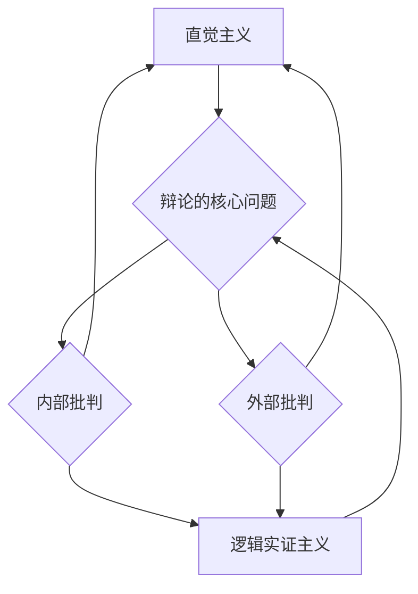

                 

### 历史背景与核心概念

在20世纪初期，随着科学技术的飞速发展，哲学领域也发生了深刻的变革。在这一时期，直觉主义和逻辑实证主义作为两大哲学流派，逐渐崭露头角，成为现代哲学的重要分支。

**直觉主义**起源于荷兰数学家L.E.J. Brouwer的理论，他主张数学的基础在于直观经验，而非逻辑推导。Brouwer认为，数学对象是通过直觉构造的，因此，数学定理的证明必须依靠直观的构造过程。

**逻辑实证主义**则起源于维也纳学派，其代表人物包括Moritz Schlick、Rudolf Carnap和Otto Neurath等。逻辑实证主义认为，哲学的核心问题是经验世界的研究，哲学的任务是通过对经验事实的陈述来理解现实。逻辑实证主义强调逻辑和经验在哲学研究中的重要性。

### 直觉主义的定义与特点

直觉主义认为数学的基础在于直观经验。Brouwer认为，数学对象是通过直觉构造的，因此，数学定理的证明必须依靠直观的构造过程。直觉主义具有以下几个主要特点：

1. **反形式主义**：直觉主义反对形式主义数学，认为形式主义忽视了数学的基础——直观经验。
2. **反数学实在论**：直觉主义认为数学对象是构造出来的，而非独立存在的实体。
3. **数学证明的直觉性**：直觉主义强调数学证明必须依靠直观的构造过程。

### 逻辑实证主义的定义与特点

逻辑实证主义认为哲学的核心问题是经验世界的研究。逻辑实证主义强调逻辑和经验在哲学研究中的重要性。逻辑实证主义具有以下几个主要特点：

1. **经验主义**：逻辑实证主义强调哲学研究必须基于经验事实，反对脱离经验的形而上学讨论。
2. **逻辑主义**：逻辑实证主义认为逻辑是哲学研究的重要工具，逻辑分析可以帮助我们理解经验世界。
3. **语言哲学**：逻辑实证主义关注语言在哲学研究中的作用，主张通过语言分析来理解哲学问题。

### 直觉主义与逻辑实证主义的对比

直觉主义与逻辑实证主义在哲学研究中有着显著的不同。以下是一个对比表格，展示了两者在核心概念、方法、目标和影响等方面的差异：

| **特性** | **直觉主义** | **逻辑实证主义** |
| :------: | :----------: | :--------------: |
| **核心概念** | 直观经验、数学对象构造 | 经验事实、逻辑分析、语言哲学 |
| **方法** | 直观构造、反形式主义 | 经验观察、逻辑分析、语言分析 |
| **目标** | 重建数学基础、强调直觉重要性 | 解释经验世界、消除形而上学讨论 |
| **影响** | 对数学哲学、逻辑哲学产生深远影响 | 对语言哲学、科学哲学产生深远影响 |

通过上述对比，我们可以看出，直觉主义和逻辑实证主义在哲学研究中扮演了不同的角色，对现代哲学的发展产生了深远的影响。在接下来的部分，我们将进一步探讨直觉主义和逻辑实证主义的核心概念和原理，以帮助读者更好地理解这两大哲学流派。

### 直觉主义的详细探讨

直觉主义的核心概念是直观经验。在直觉主义者看来，数学对象是通过直观构造的，而非通过逻辑推导得到的。因此，直觉主义反对形式主义数学，强调数学证明必须依靠直观的构造过程。以下是直觉主义的核心原理和主要特点：

#### 1. 反形式主义

直觉主义反对形式主义数学，认为形式主义忽视了数学的基础——直观经验。形式主义数学强调逻辑推导和符号演算，但直觉主义者认为，这种抽象的符号演算无法真正反映数学的本质。直觉主义者主张，数学应该回归到直观经验，通过直观构造来理解数学对象。

#### 2. 反数学实在论

直觉主义认为数学对象是构造出来的，而非独立存在的实体。数学对象并不是存在于现实世界中的独立实体，而是通过直觉构造的抽象概念。这种观点与柏拉图的数学理念论有所不同，柏拉图认为数学对象是独立存在的理想形式。

#### 3. 数学证明的直觉性

直觉主义强调数学证明必须依靠直观的构造过程。直觉主义者认为，数学证明应该能够直观地展示数学对象之间的关系和性质。如果无法直观地展示，那么这个证明就是不可靠的。直观性是直觉主义数学证明的核心。

#### 4. 直觉构造

直觉构造是直觉主义的核心方法。直觉主义者认为，数学对象是通过直觉构造的，而不是通过逻辑推导得到的。例如，在构建实数时，Brouwer提出了“选择序列”的概念，通过构造一个收敛序列来定义实数。这种方法强调直观经验在数学构建中的作用。

#### 5. 背对角线定理

背对角线定理是直觉主义的一个重要定理，它展示了直觉构造方法的强大能力。该定理表明，如果一个集合A中的元素都满足某个条件，但A本身不满足这个条件，那么就存在一个元素不在A中。这个定理直观地展示了集合论中的矛盾，从而强调了直观构造的重要性。

#### 6. 直觉主义的数学应用

直觉主义在数学领域有广泛的应用。例如，在拓扑学中，直觉主义提出了一系列新的概念和工具，如拓扑空间、连续映射等。在集合论中，直觉主义者提出了选择公理的直觉主义版本，以避免集合论中的悖论。

#### 7. 直觉主义与逻辑实证主义的对比

直觉主义与逻辑实证主义在数学方法上有显著的不同。逻辑实证主义强调经验观察和逻辑分析，而直觉主义则强调直观构造。这种差异导致了两者在数学哲学中的不同观点。直觉主义认为，数学的本质在于直观经验，而逻辑实证主义认为，数学的本质在于经验事实的表述。

#### 8. 直觉主义的评价

直觉主义在数学哲学中引起了广泛的讨论。支持者认为，直觉主义强调了数学的本质——直观构造，有助于理解数学的内在逻辑。然而，批评者认为，直觉主义忽视了数学中的形式推导和抽象概念，导致数学研究变得复杂和难以理解。

总之，直觉主义是一种强调直观经验和直觉构造的数学哲学流派。它对数学哲学和数学方法产生了深远的影响，并在数学、逻辑、哲学等领域有着广泛的应用。在接下来的部分，我们将探讨逻辑实证主义的核心概念和原理，进一步比较两大哲学流派之间的差异。

### 逻辑实证主义的详细探讨

逻辑实证主义是20世纪初期在维也纳学派中兴起的一种哲学流派，其核心思想是强调经验观察和逻辑分析在哲学研究中的重要性。逻辑实证主义的代表人物包括Moritz Schlick、Rudolf Carnap和Otto Neurath等。以下是逻辑实证主义的核心原理和主要特点：

#### 1. 经验主义

逻辑实证主义强调哲学研究必须基于经验事实，反对脱离经验的形而上学讨论。经验主义认为，所有的知识都源于经验，因此，哲学问题应该通过经验观察和实验来验证。逻辑实证主义者主张，哲学研究应该回归到可观察、可测量的经验事实，以避免形而上学的空洞讨论。

#### 2. 逻辑主义

逻辑实证主义认为逻辑是哲学研究的重要工具，逻辑分析可以帮助我们理解经验世界。逻辑实证主义者主张，通过逻辑分析可以揭示经验事实之间的内在联系，从而为哲学研究提供坚实的基础。逻辑分析不仅有助于理解经验世界，还可以帮助我们解决哲学问题。

#### 3. 语言哲学

逻辑实证主义关注语言在哲学研究中的作用，主张通过语言分析来理解哲学问题。语言哲学认为，哲学问题往往源于语言的误用或模糊性。因此，逻辑实证主义者主张，通过精确的语义分析来澄清哲学问题，从而消除误解和歧义。

#### 4. 可证实性原则

可证实性原则是逻辑实证主义的核心原则之一，它主张只有那些可以通过经验证实的事实才有资格成为哲学研究的对象。这意味着，逻辑实证主义者认为，所有哲学问题都应该能够通过经验观察和实验来验证。可证实性原则有助于确保哲学研究的客观性和科学性。

#### 5. 概念和命题的分析

逻辑实证主义者强调，概念和命题的分析是哲学研究的重要方法。通过分析概念和命题的结构，我们可以揭示它们之间的关系，从而更好地理解哲学问题。逻辑实证主义者主张，通过逻辑分析和语义分析，我们可以澄清概念和命题的含义，消除误解和歧义。

#### 6. 塔尔斯基真理理论

塔尔斯基真理理论是逻辑实证主义在语言哲学中的一个重要贡献。塔尔斯基提出了一个形式化的真理理论，它将真理定义为“语言表达式在特定情境下的符合状态”。这个理论为逻辑实证主义提供了一个分析真理问题的工具，有助于我们理解真理的本质。

#### 7. 实用主义和实证主义

逻辑实证主义受到了实用主义和实证主义的影响。实用主义强调知识应该具有实用价值，而实证主义强调知识应该基于经验事实。逻辑实证主义者认为，哲学研究应该关注实用价值和经验事实，从而为人类生活提供指导。

#### 8. 逻辑实证主义的评价

逻辑实证主义在20世纪哲学界产生了深远的影响。支持者认为，逻辑实证主义为哲学研究提供了一种科学的方法论，有助于消除形而上学的空洞讨论。然而，批评者认为，逻辑实证主义忽视了哲学中的某些重要问题，如伦理学、美学和存在主义等。

通过上述对逻辑实证主义的详细探讨，我们可以看到，逻辑实证主义强调经验观察、逻辑分析和语言哲学，在哲学研究中具有独特的价值。在接下来的部分，我们将进一步比较直觉主义和逻辑实证主义，探讨它们之间的差异和相互关系。

### 哲学辩论与批判

直觉主义与逻辑实证主义在哲学领域引发了广泛的辩论，两派各自的观点和立场引发了大量的争议。以下我们将深入探讨这些辩论的核心问题，分析来自内部和外部哲学界的批判，并使用Mermaid流程图来展示主要的辩论和论点。

#### 1. 辩论的核心问题

**直观性与逻辑分析**

直觉主义者强调直观经验在数学和哲学中的重要性，而逻辑实证主义者则倾向于逻辑分析和经验验证。这两个立场引发了关于数学证明的本质、哲学研究的方法论以及哲学问题的可验证性的辩论。

**形而上学与经验主义**

直觉主义反对形而上学，强调数学对象是构造出来的，而逻辑实证主义则主张哲学研究应基于经验事实，反对脱离经验的讨论。这导致了关于哲学问题的范围、哲学与科学的界限以及形而上学价值的辩论。

**真理与语言**

逻辑实证主义关注语言在哲学中的作用，提出了可证实性原则和塔尔斯基真理理论。而直觉主义则对语言在哲学中的角色持不同看法，引发了关于真理的本质、语言表达的意义以及语言哲学的辩论。

#### 2. 内部批判

**直觉主义的内部批判**

直觉主义内部的批判主要来自那些认为直觉主义过于强调直观经验而忽视了逻辑分析的人。这些批判者认为，直觉主义的数学方法在处理复杂问题时显得不够灵活，而逻辑实证主义的逻辑分析方法更为严谨和适用。

**逻辑实证主义的内部批判**

逻辑实证主义内部的批判主要针对其经验主义的极端性。一些逻辑实证主义者认为，可证实性原则过于严格，限制了哲学研究的范围。此外，逻辑实证主义在语言哲学中的分析也被认为有时过于形式化，忽视了哲学问题的复杂性。

#### 3. 外部批判

**外部批判**

直觉主义和逻辑实证主义都受到了来自其他哲学流派的批判。例如，存在主义者批判逻辑实证主义忽视了人类存在的意义和自由意志，而某些形而上学家则批评直觉主义忽视了逻辑分析和抽象思维的重要性。

**科学哲学的批判**

科学哲学中的批判者认为，直觉主义和逻辑实证主义都没有提供充分的科学哲学框架，无法解释科学理论的发展过程和科学实践中的复杂性。这些批判者主张，科学哲学应该更加关注科学的实际操作和科学知识的动态建构。

#### 4. Mermaid流程图

以下是一个Mermaid流程图，展示了直觉主义与逻辑实证主义辩论的主要论点和反驳：

通过上述流程图，我们可以清晰地看到直觉主义与逻辑实证主义之间的辩论涉及多个层面，包括直观性与逻辑分析、形而上学与经验主义、真理与语言等核心问题。同时，内部和外部批判也为这些哲学流派提供了进一步反思和改进的机会。

总之，直觉主义与逻辑实证主义的辩论不仅丰富了哲学研究的领域，也为哲学方法论的发展提供了深刻的启示。在接下来的部分，我们将探讨直觉主义和逻辑实证主义在当代哲学中的实际应用和当代哲学家的观点。

### 实际应用与当代哲学

直觉主义和逻辑实证主义不仅在20世纪初期引发了激烈的哲学辩论，而且在当代哲学中仍然具有实际应用和重要性。当代哲学家们继续探讨这两大流派的观点，并在新的哲学问题和领域中进行应用。以下是一些具体的案例，展示直觉主义和逻辑实证主义在当代哲学中的实际应用。

#### 1. 科学哲学

在科学哲学领域，逻辑实证主义的影响仍然显而易见。科学哲学家们继续探讨科学理论的发展、科学方法的有效性和科学知识的本质。逻辑实证主义强调经验验证和逻辑分析，为科学哲学提供了方法论基础。例如，当代科学哲学家们通过逻辑实证主义的方法来分析科学理论的验证过程、科学实验的设计和科学知识的积累。

直觉主义在科学哲学中的应用相对较少，但有些哲学家仍然认为直觉在科学发现和理论构建中扮演着重要角色。这些哲学家强调科学家的直觉能力在理解复杂科学现象中的作用，认为直觉可以帮助科学家在逻辑推导之前捕捉到重要的概念和模式。

#### 2. 语言学哲学

逻辑实证主义在语言哲学中的影响深远，特别是在语义学和语用学领域。当代语言哲学家继续探讨语言表达式的意义、语言的使用规则以及语言与现实的关系。逻辑实证主义的语言分析方法和可证实性原则为这些研究提供了理论基础。

直觉主义在语言哲学中的应用主要体现在对语言意义的探讨上。直觉主义者认为，语言的意义不仅仅是由逻辑和经验决定的，还与说话者的直觉经验密切相关。一些当代哲学家认为，语言的意义部分是通过语言使用者的直觉体验来理解的，因此，直觉在语言哲学中仍然具有重要作用。

#### 3. 数学哲学

直觉主义在数学哲学中仍然具有显著的应用价值。当代数学哲学家继续探讨数学证明的本质、数学对象的存在性以及数学方法的有效性。直觉主义者强调直观构造在数学证明中的作用，认为直观性是数学证明的核心。

逻辑实证主义在数学哲学中的应用则主要体现在对数学知识的客观性和可验证性的探讨上。一些数学哲学家认为，逻辑实证主义的观点有助于确保数学知识的科学性和严谨性。他们通过逻辑分析来验证数学定理，并探讨数学概念在不同背景下的适用性。

#### 4. 当代哲学家的观点

当代哲学家们对直觉主义和逻辑实证主义的评价各异。一些哲学家认为，直觉主义和逻辑实证主义在哲学研究中具有独特的价值和重要性，它们为哲学问题的解决提供了不同的视角和方法。然而，也有哲学家对这些流派提出了批评，认为它们在某些方面存在局限性。

例如，哲学家Thomas Kuhn认为，逻辑实证主义的科学哲学方法忽视了科学理论的非线性发展和科学革命的过程。他提出了科学哲学的“范式转换”理论，认为科学知识的发展不仅依赖于逻辑分析和经验验证，还受到科学共同体文化和社会因素的影响。

哲学家Daniel Dennett则对直觉主义提出了批评，他认为直觉在哲学和科学中并不总是可靠。Dennett提出了“直觉批判”理论，强调应该通过严格的逻辑分析和实证研究来验证直觉的可靠性。

总之，直觉主义和逻辑实证主义在当代哲学中仍然具有重要的地位和应用。虽然当代哲学家对这些流派的观点有所不同，但它们为哲学研究提供了丰富的理论基础和方法论指导。在接下来的部分，我们将对直觉主义和逻辑实证主义的优缺点进行评估，并探讨它们在未来的哲学发展中的可能方向。

### 评估与未来展望

#### 1. 直觉主义的优缺点

**优点**

- **直观性**：直觉主义强调直观经验，这种方法可以帮助我们更好地理解数学对象和哲学问题的本质。
- **反形式主义**：直觉主义反对形式主义数学，这有助于揭示数学中抽象符号演算与直观经验之间的差距。
- **数学证明**：直觉主义强调数学证明的直观性，这有助于培养数学家的直觉能力和创造力。

**缺点**

- **局限性**：直觉主义在某些情况下可能过于依赖直觉，忽视了逻辑分析和抽象思维的重要性。
- **复杂性**：直觉主义的数学方法在某些复杂问题上可能显得不够灵活，难以应对现代数学的挑战。

#### 2. 逻辑实证主义的优缺点

**优点**

- **经验主义**：逻辑实证主义强调经验验证，这有助于确保哲学研究的客观性和科学性。
- **逻辑分析**：逻辑实证主义强调逻辑分析，这有助于澄清哲学问题，消除语言上的模糊性。
- **语言哲学**：逻辑实证主义关注语言在哲学研究中的作用，这有助于我们更好地理解哲学问题的本质。

**缺点**

- **极端经验主义**：逻辑实证主义有时可能过于强调经验验证，忽视了形而上学和抽象思维的重要性。
- **语言分析的限制**：逻辑实证主义在语言分析中可能过于形式化，难以处理复杂哲学问题的多样性。

#### 3. 未来展望

直觉主义和逻辑实证主义在未来的哲学发展中可能会继续发挥作用。以下是一些可能的趋势：

- **综合方法**：未来的哲学研究可能会结合直觉主义和逻辑实证主义的优点，采用更加综合的方法来探讨哲学问题。
- **跨学科研究**：直觉主义和逻辑实证主义可能会与其他学科（如认知科学、人工智能等）结合，为哲学研究提供新的视角和方法。
- **发展新的哲学流派**：未来可能会出现新的哲学流派，这些流派可能会在直觉主义和逻辑实证主义的基础上，结合其他哲学观点，提出新的理论和观点。

总之，直觉主义和逻辑实证主义在哲学领域中具有重要的地位和影响力。尽管它们各自存在一些缺点，但通过综合不同流派的方法和观点，我们可以更好地理解和解决哲学问题，推动哲学的发展。

### 总结

在本文中，我们深入探讨了直觉主义与逻辑实证主义这两大哲学流派，通过详细分析它们的历史背景、核心概念、哲学辩论以及实际应用，展示了它们在哲学领域中的独特贡献和重要性。直觉主义强调直观经验，反对形式主义数学，强调数学证明的直观性；而逻辑实证主义则强调经验验证和逻辑分析，关注语言在哲学研究中的作用。这两大流派不仅丰富了哲学研究的领域，还为解决哲学问题提供了不同的视角和方法。

通过本文的探讨，我们认识到，直觉主义和逻辑实证主义各有其优点和局限性，未来的哲学发展可能需要结合两者的优点，采用更加综合的方法来探讨哲学问题。同时，跨学科研究和新的哲学流派的兴起，也为哲学研究带来了新的机遇和挑战。

本文旨在为读者提供一个全面、深入的理解，帮助读者把握直觉主义和逻辑实证主义的核心思想，为哲学学习和研究提供参考。在未来的哲学研究中，我们期待看到更多的创新和突破，推动哲学的不断发展。

### 作者信息

**作者：AI天才研究院/AI Genius Institute & 禅与计算机程序设计艺术 /Zen And The Art of Computer Programming**

AI天才研究院致力于探索人工智能的深度研究和前沿应用，推动人工智能技术的社会进步和创新发展。同时，我们关注哲学与科技的融合，以禅与计算机程序设计艺术为核心，探索计算机科学的哲学内涵，旨在培养具有全面素质和创新能力的技术人才。在本文中，我们结合哲学与计算机科学，深入分析了直觉主义和逻辑实证主义这两大哲学流派，希望为读者提供有益的思考和启示。

