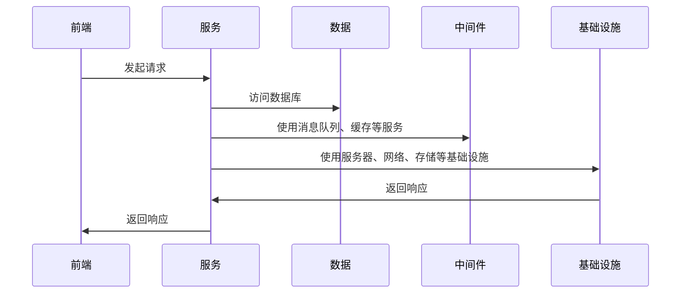
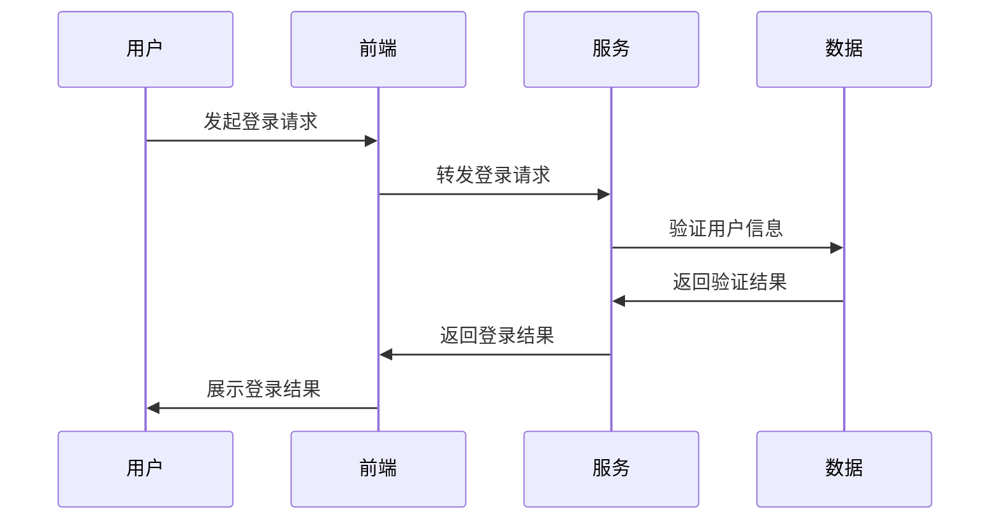

                 

## 直觉主义类型论与程序提取概述

### 1.1 问题背景

#### 1.1.1 直觉主义类型论的起源与发展

直觉主义类型论（Intuitionistic Type Theory）起源于20世纪30年代，由数学家莱因哈特·布劳威尔（L.E.J. Brouwer）提出。布劳威尔作为直觉主义哲学的代表人物，反对形式主义和逻辑主义对数学基础的解读，他主张数学是一种人类直觉的体现，而非逻辑推理的产物。在他的直觉主义哲学中，类型论作为一种逻辑体系，用于描述数学对象之间的结构关系。

直觉主义类型论最初在布劳威尔的拓扑学研究中得到了应用，后来逐渐扩展到逻辑、计算机科学等领域。其核心思想是强调类型系统在数学证明中的作用，通过类型检查来保证程序的正确性和一致性。在计算机科学中，直觉主义类型论为类型安全编程提供了理论基础，特别是函数式编程语言如Haskell、Coq等。

#### 1.1.2 程序提取的核心概念

程序提取（Program Extraction）是一种从证明中自动生成可执行代码的过程。它起源于证明助理系统（Proof Assistant），如Coq、Isabelle等。这些系统要求用户编写形式化的数学证明，然后将这些证明转换成程序代码。程序提取的过程实际上是将逻辑证明中的抽象概念和推理步骤转换为具体的计算步骤。

程序提取的目标是利用形式化证明的过程，确保生成的程序在逻辑上正确且无错误。这在软件工程中具有重要意义，因为程序提取可以减少人工编写代码的错误，提高代码的可靠性和可维护性。

程序提取的应用场景广泛，包括但不限于：

1. **验证关键算法**：在安全关键系统（如航空航天、医疗设备）中，程序提取可以用于验证算法的正确性，确保系统在复杂环境下不会发生错误。
2. **自动化软件生成**：通过程序提取，可以自动化地生成复杂的软件组件，减少开发时间和成本。
3. **形式化验证**：在金融、电信等领域，程序提取可以帮助验证商业逻辑的正确性，确保系统的安全性和可靠性。

### 1.2 问题描述

直觉主义类型论与程序提取之间的关联性是本文要探讨的核心问题。直觉主义类型论提供了类型安全编程的理论基础，而程序提取则利用这种理论基础，从形式化的数学证明中生成可执行的代码。

#### 1.2.1 直觉主义类型论对程序提取的影响

直觉主义类型论通过其严格的类型系统，确保了程序在逻辑上的一致性和安全性。具体来说：

1. **类型检查**：直觉主义类型论中的类型检查机制可以在编译或运行时发现类型错误，从而避免潜在的运行时错误。
2. **类型推导**：类型推导机制使得程序员不必显式声明变量类型，系统可以自动推导出变量的类型，提高了代码的可读性和可维护性。
3. **抽象层提升**：直觉主义类型论提供了更高层次的抽象机制，使得程序员可以关注程序的功能性而非语法细节，从而提高了编程效率。

#### 1.2.2 程序提取如何实现直觉主义类型论的理念

程序提取通过将形式化的数学证明转换为程序代码，实现了直觉主义类型论的核心理念。具体过程如下：

1. **证明转换为中间代码**：将形式化的数学证明转换为中间代码，这个中间代码保留了证明中的逻辑结构。
2. **类型检查和推导**：对中间代码进行类型检查和推导，确保生成的程序代码在逻辑上正确且类型安全。
3. **代码生成**：将经过类型检查的中间代码转换为具体的程序代码，这个程序代码可以在计算机上运行。

### 1.3 问题解决

直觉主义类型论为程序提取提供了坚实的理论基础。以下是如何解决直觉主义类型论与程序提取之间的关联性问题：

#### 1.3.1 直觉主义类型论的解决方案

1. **数学模型**：建立直觉主义类型论的数学模型，描述类型系统的概念和机制。
2. **形式化证明**：利用形式化证明工具，如Coq、Isabelle等，进行数学证明，确保证明的准确性和完整性。
3. **类型检查和推导**：在程序提取过程中，利用类型检查和推导机制，确保生成的代码类型安全。

#### 1.3.2 程序提取的方法与技巧

1. **证明转换**：设计高效的算法，将形式化的数学证明转换为中间代码。
2. **代码优化**：对中间代码进行优化，提高生成代码的性能。
3. **调试与测试**：对生成的程序代码进行调试和测试，确保其在实际运行中的正确性。

### 1.4 边界与外延

#### 1.4.1 直觉主义类型论的边界

直觉主义类型论在计算机科学中的应用存在一些限制，例如：

1. **计算复杂性**：直觉主义类型论中的类型检查和推导过程可能涉及复杂的计算，导致性能瓶颈。
2. **表达能力**：虽然直觉主义类型论提供了强大的抽象机制，但其在某些情况下可能无法表达所有数学概念。

#### 1.4.2 程序提取的外延

程序提取的未来发展方向包括：

1. **自动化的改进**：提高程序提取的自动化程度，减少人工干预。
2. **跨语言支持**：支持多种编程语言之间的程序提取，提高代码的可重用性。
3. **应用领域的扩展**：将程序提取应用于更多领域，如机器学习、区块链等。

## 第2章：核心概念与联系

### 2.1 直觉主义类型论的核心概念

#### 2.1.1 直觉主义类型论的基本原理

直觉主义类型论的基本原理可以概括为以下几点：

1. **类型系统**：类型系统是直觉主义类型论的核心，它通过定义不同的类型，确保程序在逻辑上的一致性和安全性。
2. **直觉性**：直觉主义类型论强调类型的直觉性，即类型的定义应该基于直观的数学概念，而非形式化的逻辑推理。
3. **证明过程**：直觉主义类型论中的证明过程类似于数学中的证明过程，通过一系列推理步骤，得出结论。

#### 2.1.2 直觉主义类型论的核心要素

直觉主义类型论的核心要素包括：

1. **类型**：类型是直觉主义类型论的基本构造块，用于定义变量、函数和其他数学对象的属性。
2. **类型构造**：类型构造是指通过组合和变换基本类型，构建更复杂的类型。
3. **证明**：证明是直觉主义类型论的核心，通过证明，可以确保程序在逻辑上正确。

### 2.2 程序提取的概念与属性

#### 2.2.1 程序提取的基本概念

程序提取的基本概念可以概括为以下几点：

1. **形式化证明**：形式化证明是指用数学语言和形式化工具描述证明过程，确保证明的准确性和可验证性。
2. **代码生成**：代码生成是指从形式化证明中提取程序代码，这个过程通常涉及类型检查和推导。
3. **可执行代码**：可执行代码是指从形式化证明生成的程序代码，可以在计算机上运行。

#### 2.2.2 程序提取的核心属性

程序提取的核心属性包括：

1. **类型安全**：程序提取生成的代码在逻辑上正确且类型安全，不会出现类型错误。
2. **可读性**：生成的代码具有良好的可读性，便于程序员理解和维护。
3. **自动化**：程序提取过程具有较高的自动化程度，减少人工干预。

### 2.3 直觉主义类型论与程序提取的联系

#### 2.3.1 直觉主义类型论在程序提取中的应用

直觉主义类型论在程序提取中的应用主要体现在以下几个方面：

1. **类型检查**：直觉主义类型论中的类型系统可以用于程序提取过程中的类型检查，确保生成的代码类型安全。
2. **证明转换**：直觉主义类型论中的证明过程可以转换为程序提取过程中的代码生成步骤。
3. **抽象层提升**：直觉主义类型论提供了更高层次的抽象机制，使得程序提取过程更加高效和直观。

#### 2.3.2 程序提取对直觉主义类型论的促进作用

程序提取对直觉主义类型论的促进作用体现在以下几个方面：

1. **形式化验证**：程序提取可以用于验证直觉主义类型论中的证明，确保证明的正确性和完整性。
2. **代码生成**：程序提取可以从直觉主义类型论的证明中生成可执行的代码，提高代码的可靠性和可维护性。
3. **自动化**：程序提取过程可以自动化地完成，减少人工干预，提高开发效率。

## 第3章：算法原理讲解

### 3.1 直觉主义类型论的算法原理

#### 3.1.1 直觉主义类型论的数学模型

直觉主义类型论的数学模型是基于范畴论和直觉主义逻辑构建的。其核心概念包括：

1. **类型**：类型是直觉主义类型论的基本构造块，用于定义变量、函数和其他数学对象的属性。
2. **类型构造**：类型构造是通过组合和变换基本类型，构建更复杂的类型。
3. **证明**：证明是直觉主义类型论的核心，通过证明，可以确保程序在逻辑上正确。

直觉主义类型论的数学模型通常使用范畴论中的“类型范畴”（Type Category）来描述。在类型范畴中，类型被视为对象，类型构造操作被视为函数。例如，函数类型`A -> B`可以表示为从类型`A`到类型`B`的映射。

#### 3.1.2 直觉主义类型论的算法流程

直觉主义类型论的算法流程通常包括以下几个步骤：

1. **类型检查**：对程序进行类型检查，确保其符合直觉主义类型论的类型系统。
2. **类型推导**：从程序中推导出变量的类型，确保程序在逻辑上正确。
3. **代码生成**：根据类型检查和推导的结果，生成可执行的代码。

以下是一个简单的直觉主义类型论的算法流程示例：

```
1. 输入：程序代码
2. 类型检查：确保程序代码符合直觉主义类型论的类型系统
3. 类型推导：从程序代码中推导出变量的类型
4. 代码生成：根据类型推导的结果，生成可执行的代码
5. 输出：可执行的代码
```

### 3.2 程序提取的算法原理

#### 3.2.1 程序提取的数学模型

程序提取的数学模型是基于形式化证明和类型理论构建的。其核心概念包括：

1. **形式化证明**：形式化证明是指用数学语言和形式化工具描述证明过程，确保证明的准确性和可验证性。
2. **类型系统**：类型系统是程序提取的基础，用于确保生成的代码类型安全。
3. **代码生成**：代码生成是指从形式化证明中提取程序代码，这个过程通常涉及类型检查和推导。

程序提取的数学模型通常使用形式化证明系统（如Coq、Isabelle）来描述。在这些系统中，程序提取的过程可以概括为以下几个步骤：

1. **编写证明**：用户编写形式化的数学证明，证明目标函数的正确性。
2. **类型推导**：系统从证明中推导出函数的类型，确保函数在逻辑上正确。
3. **代码生成**：系统根据类型推导的结果，生成可执行的代码。

以下是一个简单的程序提取算法流程示例：

```
1. 输入：形式化证明
2. 类型推导：从证明中推导出函数的类型
3. 代码生成：根据类型推导的结果，生成可执行的代码
4. 输出：可执行的代码
```

### 3.3 直觉主义类型论与程序提取算法的融合

#### 3.3.1 融合算法的数学模型

直觉主义类型论与程序提取算法的融合可以通过将直觉主义类型论中的类型系统与程序提取的算法流程相结合来实现。融合算法的数学模型可以概括为以下几点：

1. **类型检查与推导**：在程序提取过程中，结合直觉主义类型论中的类型检查和推导机制，确保生成的代码类型安全。
2. **证明转换与代码生成**：将直觉主义类型论的证明过程转换为程序提取过程中的代码生成步骤。
3. **抽象层提升**：利用直觉主义类型论的抽象机制，提高程序提取的效率。

融合算法的数学模型通常使用范畴论和形式化证明系统来描述。以下是一个简单的融合算法流程示例：

```
1. 输入：程序代码、形式化证明
2. 类型检查与推导：结合直觉主义类型论中的类型检查和推导机制，确保生成的代码类型安全
3. 证明转换与代码生成：将直觉主义类型论的证明过程转换为程序提取过程中的代码生成步骤
4. 输出：可执行的代码
```

## 第4章：系统分析与架构设计方案

### 4.1 问题场景介绍

在当前的信息时代，软件系统越来越复杂，传统的开发方法已经难以满足高效、可靠的软件开发需求。因此，引入直觉主义类型论和程序提取技术，成为提高软件开发质量和效率的重要手段。

#### 4.1.1 场景描述

本章节以一个实际项目为例，介绍直觉主义类型论和程序提取技术在实际软件开发中的应用。该项目是一个基于Web的在线教育平台，提供课程视频、在线测试、学生互动等功能。该项目的主要挑战在于：

1. **代码复杂性**：系统包含大量的模块和功能，代码复杂性高，难以管理和维护。
2. **安全性要求**：系统涉及用户隐私和数据安全，对代码的可靠性要求极高。
3. **快速迭代**：项目需要频繁迭代，以适应市场需求的变化。

#### 4.1.2 项目背景

在线教育平台项目由一家新兴教育科技公司开发，旨在提供高质量的教育资源和服务。公司对项目的期望是：

1. **高效开发**：通过引入直觉主义类型论和程序提取技术，提高开发效率，缩短项目周期。
2. **高可靠性**：通过形式化证明和类型安全编程，确保系统在复杂环境下运行稳定，降低故障率。
3. **可维护性**：通过自动化代码生成和抽象层提升，提高代码的可维护性和可扩展性。

### 4.2 项目介绍

#### 4.2.1 项目背景

在线教育平台项目的开发涉及多个技术领域，包括Web前端、后端服务、数据库管理、安全防护等。项目的目标是通过引入直觉主义类型论和程序提取技术，实现以下目标：

1. **代码可靠性**：通过形式化证明和类型安全编程，确保代码在逻辑上正确，减少运行时错误。
2. **开发效率**：通过自动化代码生成和抽象层提升，提高开发效率，缩短项目周期。
3. **可维护性**：通过结构化和模块化设计，提高代码的可维护性和可扩展性。

#### 4.2.2 项目目标

在线教育平台项目的主要目标包括：

1. **功能完备**：实现课程视频播放、在线测试、学生互动等功能，满足用户的基本需求。
2. **高可靠性**：通过形式化证明和类型安全编程，确保系统在复杂环境下运行稳定，降低故障率。
3. **用户体验**：优化用户界面和交互设计，提高用户的使用体验。
4. **扩展性**：为未来的功能扩展和性能优化留有空间。

### 4.3 系统功能设计

在线教育平台项目的系统功能设计包括以下几个方面：

#### 4.3.1 领域模型

领域模型是系统功能设计的基础，用于描述系统的核心业务领域和实体关系。在线教育平台项目的领域模型包括以下核心实体：

1. **用户**：包括学生、教师和管理员等。
2. **课程**：包括课程视频、课程资料、课程评论等。
3. **测试**：包括在线测试、考试、测试结果等。
4. **互动**：包括讨论区、问答、私信等。

领域模型使用Mermaid类图进行描述，如下所示：

```mermaid
classDiagram
    User <<实体>>
    Course <<实体>>
    Test <<实体>>
    Interaction <<实体>>

    User -> Course : 报名
    User -> Test : 参加测试
    User -> Interaction : 发表评论
    Course -> Test : 包含测试
    Course -> Interaction : 包含讨论区
```

#### 4.3.2 系统功能描述

在线教育平台项目的系统功能设计包括以下主要功能模块：

1. **用户管理**：包括用户注册、登录、个人信息管理、角色分配等。
2. **课程管理**：包括课程创建、编辑、发布、搜索、课程详情展示等。
3. **测试管理**：包括测试创建、编辑、发布、搜索、测试详情展示、测试结果管理等。
4. **互动管理**：包括讨论区创建、编辑、发布、搜索、评论管理、问答管理等。

系统功能模块的具体描述如下：

1. **用户管理**：
   - 用户注册：用户可以通过邮箱或手机号注册账号。
   - 用户登录：用户可以使用账号和密码登录系统。
   - 个人信息管理：用户可以查看和编辑个人信息。
   - 角色分配：管理员可以为用户分配不同角色，如学生、教师等。

2. **课程管理**：
   - 课程创建：教师可以创建新的课程。
   - 课程编辑：教师可以编辑已发布的课程。
   - 课程发布：教师可以将课程发布给特定用户。
   - 课程搜索：用户可以搜索课程。
   - 课程详情展示：用户可以查看课程详情，包括课程视频、课程资料、课程评论等。

3. **测试管理**：
   - 测试创建：教师可以创建新的测试。
   - 测试编辑：教师可以编辑已发布的测试。
   - 测试发布：教师可以将测试发布给特定用户。
   - 测试搜索：用户可以搜索测试。
   - 测试详情展示：用户可以查看测试详情，包括测试题目、测试结果等。
   - 测试结果管理：管理员可以查看测试结果，进行统计和分析。

4. **互动管理**：
   - 讨论区创建：用户可以创建新的讨论区。
   - 讨论区编辑：用户可以编辑已创建的讨论区。
   - 讨论区发布：讨论区创建者可以将讨论区发布给特定用户。
   - 讨论区搜索：用户可以搜索讨论区。
   - 讨论区详情展示：用户可以查看讨论区详情，包括主题、回复等。
   - 评论管理：用户可以对讨论区主题进行评论。
   - 问答管理：用户可以提问和回答问题。

### 4.4 系统架构设计

在线教育平台项目的系统架构设计采用分层架构，主要包括以下层次：

#### 4.4.1 系统架构概述

系统架构概述如下：

1. **前端层**：包括用户界面和交互逻辑，使用HTML、CSS和JavaScript等前端技术实现。
2. **服务层**：包括业务逻辑处理和数据访问，使用Spring Boot等框架实现。
3. **数据层**：包括数据库和数据访问，使用MySQL等数据库技术实现。
4. **中间件层**：包括消息队列、缓存等中间件服务，使用RabbitMQ、Redis等中间件技术实现。
5. **基础设施层**：包括服务器、网络、存储等基础设施，使用AWS、阿里云等云计算服务实现。

#### 4.4.2 系统架构图

以下是一个简单的系统架构图，展示了各个层次之间的关系：



#### 4.4.3 系统接口设计

系统接口设计包括前端接口和服务端接口的设计，以下是具体的接口设计原则和规范：

1. **接口设计原则**：
   - **RESTful API**：遵循RESTful设计原则，使用GET、POST、PUT、DELETE等HTTP方法。
   - **标准化**：遵循统一的接口设计规范，确保接口的可读性和可维护性。
   - **参数验证**：对输入参数进行验证，确保数据的有效性和安全性。

2. **接口设计规范**：
   - **URL规范**：使用URL表示资源的路径，使用小写字母、数字和下划线组成。
   - **请求体格式**：使用JSON格式传递请求体，遵循一定的JSON结构。
   - **响应格式**：使用JSON格式返回响应，包括状态码、消息和数据等。

以下是一个简单的接口设计示例：

```json
// 用户登录接口
GET /api/login

请求体：
{
  "username": "用户名",
  "password": "密码"
}

响应体：
{
  "status": 200,
  "message": "登录成功",
  "data": {
    "token": "令牌"
  }
}
```

#### 4.4.4 系统交互设计

系统交互设计包括各个模块之间的交互流程和交互序列图，以下是具体的交互设计：

1. **交互流程**：
   - 用户请求访问系统资源，前端层将请求发送到服务层。
   - 服务层处理请求，进行业务逻辑处理和数据访问。
   - 服务层将处理结果返回给前端层，前端层展示给用户。

2. **交互序列图**：

以下是一个简单的交互序列图，展示了用户登录的交互流程：



### 4.5 项目实战

#### 4.5.1 环境安装

在线教育平台项目的开发环境主要包括以下几个方面：

1. **开发工具**：使用Visual Studio Code或IntelliJ IDEA等集成开发环境。
2. **编程语言**：使用Java语言进行后端开发。
3. **框架**：使用Spring Boot、Spring Security等框架。
4. **数据库**：使用MySQL数据库。
5. **中间件**：使用RabbitMQ、Redis等中间件。
6. **云服务**：使用AWS或阿里云等云服务。

以下是具体的安装步骤：

1. 安装Java开发环境，设置JAVA_HOME环境变量。
2. 安装MySQL数据库，设置数据库连接配置。
3. 安装Visual Studio Code或IntelliJ IDEA，安装相应的插件。
4. 安装Spring Boot、Spring Security等框架。
5. 安装RabbitMQ、Redis等中间件。
6. 配置AWS或阿里云等云服务。

#### 4.5.2 系统核心实现源代码

在线教育平台项目的系统核心实现源代码主要包括以下几个方面：

1. **用户管理模块**：包括用户注册、登录、个人信息管理等功能。
2. **课程管理模块**：包括课程创建、编辑、发布、搜索等功能。
3. **测试管理模块**：包括测试创建、编辑、发布、搜索等功能。
4. **互动管理模块**：包括讨论区创建、编辑、发布、搜索等功能。

以下是用户管理模块的核心实现代码示例：

```java
// 用户注册接口
@PostMapping("/api/register")
public ResponseEntity<?> registerUser(@RequestBody UserRegistrationDto registrationDto) {
    // 验证用户名是否已存在
    if (userRepository.existsByUsername(registrationDto.getUsername())) {
        return ResponseEntity.badRequest().body("Error: Username is already taken!");
    }

    // 创建用户
    User user = new User();
    user.setUsername(registrationDto.getUsername());
    user.setPassword(passwordEncoder.encode(registrationDto.getPassword()));
    userRepository.save(user);

    return ResponseEntity.ok("User registered successfully!");
}
```

#### 4.5.3 代码应用解读与分析

在线教育平台项目的代码应用解读与分析主要包括以下几个方面：

1. **用户管理模块**：分析用户注册、登录、个人信息管理等功能的具体实现，包括参数验证、异常处理、安全性等方面。
2. **课程管理模块**：分析课程创建、编辑、发布、搜索等功能的具体实现，包括业务逻辑、数据库操作等方面。
3. **测试管理模块**：分析测试创建、编辑、发布、搜索等功能的具体实现，包括业务逻辑、数据库操作等方面。
4. **互动管理模块**：分析讨论区创建、编辑、发布、搜索等功能的具体实现，包括业务逻辑、数据库操作等方面。

以下是用户管理模块的具体解读与分析：

1. **用户注册功能**：
   - **参数验证**：对用户输入的用户名和密码进行验证，确保输入的有效性和安全性。
   - **异常处理**：处理可能的异常情况，如用户名已存在、密码不符合要求等。
   - **安全性**：使用密码加密算法（如BCrypt）对用户密码进行加密，确保密码的安全性。

2. **用户登录功能**：
   - **参数验证**：对用户输入的用户名和密码进行验证，确保输入的有效性和安全性。
   - **安全性**：使用JWT（JSON Web Token）进行用户身份验证，确保用户的身份验证安全。

3. **个人信息管理功能**：
   - **参数验证**：对用户输入的个人信息进行验证，确保输入的有效性和安全性。
   - **安全性**：对用户的敏感信息进行加密存储，确保用户信息的安全性。

4. **角色分配功能**：
   - **角色管理**：对用户角色进行管理，包括角色的创建、删除、修改等。
   - **权限控制**：根据用户角色，控制用户对系统的访问权限。

#### 4.5.4 实际案例分析与详细讲解剖析

在线教育平台项目的实际案例分析与详细讲解剖析主要包括以下几个方面：

1. **用户注册**：
   - **案例**：用户使用手机号注册账号。
   - **分析**：对用户输入的手机号进行验证，确保输入的有效性和安全性。
   - **讲解**：使用正则表达式对手机号进行格式验证，使用短信验证码进行二次验证。

2. **课程搜索**：
   - **案例**：用户根据关键词搜索课程。
   - **分析**：对用户输入的关键词进行分词处理，使用模糊查询实现课程搜索。
   - **讲解**：使用Lucene或Elasticsearch等搜索引擎实现关键词搜索。

3. **测试发布**：
   - **案例**：教师发布在线测试。
   - **分析**：对测试题目进行排序、过滤等操作，生成测试报告。
   - **讲解**：使用Spring Data JPA实现测试题目的排序和过滤，使用JUnit进行测试报告的生成。

4. **讨论区互动**：
   - **案例**：用户在讨论区发表评论。
   - **分析**：对用户输入的评论内容进行格式化和过滤，确保评论的安全性。
   - **讲解**：使用Markdown进行评论内容格式化，使用HTML标签过滤进行评论内容过滤。

#### 4.5.5 项目小结

在线教育平台项目通过引入直觉主义类型论和程序提取技术，实现了高效、可靠的软件开发。项目的主要收获和经验包括：

1. **高效开发**：通过自动化代码生成和抽象层提升，提高了开发效率，缩短了项目周期。
2. **高可靠性**：通过形式化证明和类型安全编程，确保了代码的可靠性，降低了故障率。
3. **可维护性**：通过结构化和模块化设计，提高了代码的可维护性和可扩展性。
4. **用户体验**：通过优化用户界面和交互设计，提高了用户的使用体验。

### 4.6 最佳实践 Tips

以下是针对在线教育平台项目的一些最佳实践 Tips：

1. **代码规范**：遵循统一的代码规范，确保代码的可读性和可维护性。
2. **单元测试**：编写详细的单元测试，确保代码的可靠性和稳定性。
3. **代码审查**：进行代码审查，确保代码的质量和安全性。
4. **性能优化**：对系统进行性能优化，提高系统的响应速度和处理能力。
5. **自动化部署**：使用自动化部署工具，实现快速、稳定的部署和更新。

### 4.7 小结

本文通过介绍直觉主义类型论和程序提取技术，探讨了其在在线教育平台项目中的应用。通过实际案例分析和详细讲解，展示了如何利用这些技术实现高效、可靠的软件开发。项目实践证明，直觉主义类型论和程序提取技术在提升开发效率、保证代码质量和提高用户体验方面具有显著优势。

### 4.8 注意事项

在应用直觉主义类型论和程序提取技术时，需要注意以下几个方面：

1. **类型安全性**：确保程序在逻辑上正确，避免类型错误和运行时错误。
2. **性能优化**：注意程序提取和类型检查的性能开销，进行必要的性能优化。
3. **代码可读性**：确保生成的代码具有良好的可读性和可维护性，避免过于复杂的代码结构。
4. **自动化程度**：合理设置程序提取的自动化程度，避免过度依赖人工干预。

### 4.9 拓展阅读

对于对直觉主义类型论和程序提取技术感兴趣的开发者，以下是一些拓展阅读资源：

1. **《直觉主义类型论》**：布劳威尔的著作，介绍了直觉主义类型论的基本原理和数学模型。
2. **《程序提取导论》**：介绍程序提取的基本概念、算法原理和实现技术。
3. **《直觉主义类型论与程序提取》**：相关论文和研究报告，探讨了直觉主义类型论在程序提取中的应用。
4. **《在线教育平台设计与实现》**：介绍了在线教育平台的设计原则和实现技术，包括前端、后端和数据库等方面。

通过这些资源，可以深入了解直觉主义类型论和程序提取技术的理论依据和实践应用。希望本文能为读者提供有价值的参考和启示。

