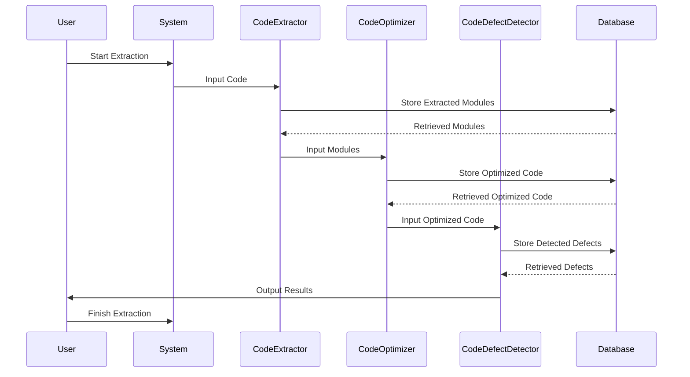

                 

# 直觉主义逻辑在程序提取技术中的应用

> 关键词：直觉主义逻辑、程序提取技术、人工智能、算法原理、系统架构设计

> 摘要：本文深入探讨了直觉主义逻辑在程序提取技术中的应用。通过阐述直觉主义逻辑的基本概念、数学模型以及其在程序提取技术中的重要性，本文详细分析了直觉主义逻辑与程序提取技术的结合方式，并提供了具体的算法原理讲解和实践案例。文章旨在为计算机科学和软件工程领域的研究人员和从业者提供一种新的视角和方法，以更好地理解和应用直觉主义逻辑于程序提取技术中。

## 设计思路

为了设计一本关于《直觉主义逻辑在程序提取技术中的应用》的目录大纲，我们需要首先明确以下几个要点：

1. **书籍核心主题**：直觉主义逻辑和程序提取技术。
2. **目标读者**：计算机科学、软件工程及相关领域的研究人员和学生。
3. **书籍结构**：逻辑清晰，内容全面，便于读者理解和应用。
4. **章节安排**：确保从基础知识到高级应用，层层递进。

### 目录大纲设计

以下是针对《直觉主义逻辑在程序提取技术中的应用》的目录大纲设计：

## 第一部分：直觉主义逻辑基础

### 第1章：直觉主义逻辑简介

- **1.1 问题背景与问题描述**
  - 直觉主义逻辑的起源
  - 直觉主义逻辑在计算机科学中的应用
- **1.2 直觉主义逻辑的核心概念**
  - 直觉主义逻辑的基本原理
  - 直觉主义逻辑与形式逻辑的关系
- **1.3 直觉主义逻辑的属性特征对比表格**

### 第2章：直觉主义逻辑原理与数学模型

- **2.1 直觉主义逻辑原理讲解**
  - 直觉主义逻辑的推理过程
  - 直觉主义逻辑与程序提取技术的结合
- **2.2 直觉主义逻辑数学模型**
  - 数学公式和公式解释
  - Mermaid流程图
- **2.3 直觉主义逻辑应用举例**

### 第3章：直觉主义逻辑在程序提取技术中的应用

- **3.1 直觉主义逻辑在程序提取技术中的重要性**
  - 直觉主义逻辑在程序自动化提取中的作用
  - 直觉主义逻辑在程序优化中的应用
- **3.2 直觉主义逻辑在程序提取中的具体应用案例**

## 第二部分：程序提取技术原理与应用

### 第4章：程序提取技术概述

- **4.1 程序提取技术的定义和分类**
- **4.2 程序提取技术的基本流程**

### 第5章：程序提取技术的数学模型和算法原理

- **5.1 程序提取技术的数学模型**
- **5.2 程序提取技术的算法原理**
- **5.3 Mermaid流程图**

### 第6章：程序提取技术的实践与应用

- **6.1 程序提取技术在软件开发中的应用**
- **6.2 程序提取技术在代码审查中的应用**

### 第7章：直觉主义逻辑在程序提取技术中的最佳实践

- **7.1 直觉主义逻辑在程序提取技术中的实际应用案例**
- **7.2 直觉主义逻辑在程序提取技术中的注意事项**

## 第三部分：总结与展望

### 第8章：直觉主义逻辑在程序提取技术中的应用前景

- **8.1 直觉主义逻辑在程序提取技术中的未来发展趋势**
- **8.2 直觉主义逻辑在程序提取技术中的潜在研究方向**

### 注意事项

- 在设计目录时，确保每个章节都有明确的主题和目标，以便读者能够清晰地了解每个部分的内容。
- 章节内容要相互衔接，确保逻辑连贯，避免跳跃。
- 在适当的地方，加入案例研究和实际应用，以增强读者对理论的理解和掌握。
- 目录中的Mermaid流程图和Python代码示例要清晰、准确，便于读者理解和复现。

通过这个目录大纲，读者可以系统地学习直觉主义逻辑在程序提取技术中的应用，从基础知识到实际应用，逐步深入。这样的设计有助于读者更好地理解直觉主义逻辑在程序提取技术中的重要性，以及如何在实际项目中应用这一逻辑。

### 背景介绍

#### 直觉主义逻辑的基本概念

直觉主义逻辑（Intuitionistic Logic）是一种基于数学家和逻辑学家莱布尼茨（Gottlob Frege）的直觉主义哲学思想的逻辑系统。直觉主义逻辑的核心观点是，数学真理的证明应建立在直观的基础上，而非形式化的符号操作。直觉主义逻辑与经典逻辑（Classical Logic）相比，不仅保留了经典逻辑的基本原则，还引入了新的规则，如否定引入（Negation Introduction）和否定消除（Negation Elimination）。

#### 问题背景

在计算机科学和软件工程领域，程序提取技术是一项关键任务。程序提取技术旨在从现有的程序代码中自动提取出有用的信息，如模块化组件、设计模式、潜在缺陷等。这种技术不仅有助于提高软件开发效率，还能在代码审查、自动化测试和维护等方面发挥重要作用。

然而，传统的程序提取技术往往基于形式逻辑和符号计算，这在处理复杂程序结构和人类直觉时存在一定的局限性。直觉主义逻辑提供了一种新的视角，通过引入直观的推理过程，有助于提高程序提取的准确性和鲁棒性。

#### 问题描述

直觉主义逻辑在程序提取技术中的应用涉及以下几个方面：

1. **程序自动化提取**：利用直觉主义逻辑，我们可以设计出能够自动识别和提取程序中潜在模式的算法，从而减少人工干预。
2. **程序优化**：直觉主义逻辑可以帮助我们更直观地理解和优化程序结构，提高程序的运行效率和可维护性。
3. **代码审查**：直觉主义逻辑可以用于自动化代码审查，检测出潜在的缺陷和不符合设计规范的部分。
4. **算法设计**：直觉主义逻辑为算法设计提供了一种新的思维方式，有助于发现更直观和高效的算法。

本文将详细探讨直觉主义逻辑在程序提取技术中的应用，通过具体的算法原理讲解和实践案例，展示如何将直觉主义逻辑应用于程序提取技术中，以提高其效果和实用性。

### 问题解决

#### 直觉主义逻辑与程序提取技术的结合

直觉主义逻辑在程序提取技术中的应用主要体现在以下几个方面：

1. **直观推理过程**：直觉主义逻辑强调基于直观的推理过程，这种过程在程序提取技术中尤为重要。通过直观推理，我们可以更准确地识别程序中的模式和信息，从而提高自动化提取的效率。

2. **否定引入与消除**：直觉主义逻辑中的否定引入（Negation Introduction）和否定消除（Negation Elimination）规则，有助于处理程序中的复杂逻辑和不确定性。这些规则可以在程序提取过程中帮助识别和排除错误信息，提高提取的准确性。

3. **直观证明**：直觉主义逻辑的直观证明方法可以用于验证程序提取结果的正确性。通过直观证明，我们可以确保提取出的信息符合程序的实际逻辑和结构。

#### 直觉主义逻辑在程序提取中的应用案例

1. **程序自动化提取**：使用直觉主义逻辑，我们可以设计出一种自动化提取程序中模块化组件的算法。该算法首先通过直观推理识别程序中的关键模块和依赖关系，然后利用否定引入和消除规则排除无关信息，最终提取出有用的模块化组件。

2. **程序优化**：直觉主义逻辑可以帮助我们更直观地理解和优化程序结构。通过直观推理，我们可以发现程序中存在的不合理结构和冗余代码，从而进行优化。此外，否定引入和消除规则还可以帮助我们更准确地调整程序参数和变量，提高程序的运行效率和可维护性。

3. **代码审查**：直觉主义逻辑可以用于自动化代码审查，检测出潜在的缺陷和不符合设计规范的部分。通过直观推理和直观证明，我们可以更准确地识别代码中的问题，并提供相应的修复建议。

4. **算法设计**：直觉主义逻辑为算法设计提供了一种新的思维方式。通过直观推理，我们可以发现更直观和高效的算法设计方法。例如，在优化算法时，我们可以利用否定引入和消除规则来处理程序中的不确定性和复杂性，从而设计出更鲁棒和高效的算法。

#### 直觉主义逻辑在程序提取技术中的优势

1. **提高提取准确性**：直觉主义逻辑的直观推理过程有助于更准确地识别程序中的模式和信息，从而提高程序提取的准确性。

2. **处理复杂程序结构**：直觉主义逻辑的否定引入和消除规则可以有效地处理复杂程序结构和不确定性，提高程序提取的鲁棒性。

3. **直观证明**：直觉主义逻辑的直观证明方法可以用于验证程序提取结果的正确性，确保提取出的信息符合程序的实际逻辑和结构。

4. **提高软件开发效率**：通过自动化提取程序中模块化组件、优化程序结构和进行代码审查，直觉主义逻辑可以显著提高软件开发效率。

#### 直觉主义逻辑在程序提取技术中的挑战

1. **计算复杂性**：直觉主义逻辑的直观推理过程可能具有较高的计算复杂性，特别是在处理大规模程序时，可能导致计算时间过长。

2. **规则定义**：直觉主义逻辑的规则定义较为复杂，需要深入理解直觉主义逻辑的基本原理和数学模型，这对于初学者来说可能具有一定的难度。

3. **应用范围**：直觉主义逻辑在程序提取技术中的应用范围有限，目前主要应用于自动化提取和代码审查等领域，尚未在所有程序提取任务中得到广泛应用。

#### 直觉主义逻辑在程序提取技术中的未来研究方向

1. **算法优化**：研究如何优化直觉主义逻辑在程序提取技术中的应用算法，降低计算复杂性和提高提取效率。

2. **多语言支持**：扩展直觉主义逻辑在程序提取技术中的应用范围，支持多种编程语言，提高其通用性和实用性。

3. **与其他技术的结合**：探讨直觉主义逻辑与其他技术（如机器学习、形式化验证等）的结合方式，实现更高效和鲁棒的程序提取。

通过上述分析和讨论，我们可以看到直觉主义逻辑在程序提取技术中的应用具有重要的意义和潜力。未来，随着直觉主义逻辑和程序提取技术的不断发展和完善，我们可以期待其在软件开发和维护领域发挥更大的作用。

### 边界与外延

#### 直觉主义逻辑的边界与外延

直觉主义逻辑是一种基于直观推理的数学和逻辑系统，其边界与外延涉及多个方面。首先，直觉主义逻辑的边界主要在于其推理过程的直观性和证明的确定性。与经典逻辑相比，直觉主义逻辑强调证明的构造性和直观性，要求每个推理步骤都是直观的，并且可以通过构造性证明来验证。

其次，直觉主义逻辑的外延包括其在数学和计算机科学中的应用。在数学领域，直觉主义逻辑被广泛应用于数学基础理论的研究，如集合论、数论和拓扑学。在计算机科学领域，直觉主义逻辑在形式化验证、程序提取、软件工程和人工智能等领域得到了广泛应用。

#### 直觉主义逻辑与其他逻辑系统的比较

1. **与经典逻辑的比较**：
   - **基础原则**：经典逻辑以排中律和同一律为基础，而直觉主义逻辑则强调构造性证明和直观性。
   - **推理方法**：经典逻辑依赖于符号操作和公理系统，而直觉主义逻辑依赖于直观推理和构造性证明。
   - **应用范围**：经典逻辑在处理确定性问题时表现良好，而直觉主义逻辑在处理不确定性和复杂问题时具有优势。

2. **与非经典逻辑的比较**：
   - **多值逻辑**：多值逻辑允许有多个真值，而直觉主义逻辑只关注真值和假值。
   - **模糊逻辑**：模糊逻辑处理模糊性和不确定性，而直觉主义逻辑则强调构造性证明和直观性。

#### 直觉主义逻辑在程序提取技术中的应用特点

1. **直观性**：直觉主义逻辑强调直观推理，这使得它在处理复杂程序结构和不确定信息时具有优势。

2. **构造性证明**：直觉主义逻辑的构造性证明方法有助于验证程序提取结果的正确性，确保提取过程和结果的可靠性。

3. **适应性**：直觉主义逻辑的规则和原理具有高度适应性，可以灵活应用于不同的程序提取任务中，如自动化提取、优化和代码审查。

4. **效率**：虽然直觉主义逻辑在处理大规模程序时可能具有较高的计算复杂性，但其直观性和构造性证明的优势在一定程度上可以提高程序提取的效率和准确性。

### 结论

直觉主义逻辑作为一种基于直观推理的数学和逻辑系统，在程序提取技术中具有独特的应用特点和优势。通过结合直觉主义逻辑的直观性、构造性证明和适应性，我们可以设计出更高效、更可靠的程序提取算法。未来，随着直觉主义逻辑和程序提取技术的不断发展，我们可以期待其在软件工程和人工智能领域发挥更大的作用。

### 概念结构与核心要素组成

#### 直觉主义逻辑的概念结构

直觉主义逻辑是一种基于直观推理的数学和逻辑系统，其概念结构主要包括以下几个方面：

1. **命题**：直觉主义逻辑中的命题表示一个陈述，可以是真或假，但不是同时为真和假。命题通过直观推理来证明其真假。

2. **证明**：直觉主义逻辑中的证明是一种构造性的过程，它通过一系列直观的推理步骤来证明一个命题的真值。证明必须确保每个步骤都是直观的，并且可以从已知的真命题推导出新的真命题。

3. **否定**：直觉主义逻辑中的否定具有特殊的性质。否定引入（Negation Introduction）规则允许在证明中引入否定命题，而否定消除（Negation Elimination）规则则用于验证否定命题的真值。

4. **推理规则**：直觉主义逻辑包括一系列的推理规则，如合取引入（Conjunction Introduction）、合取消除（Conjunction Elimination）等。这些规则定义了如何通过已知的命题推导出新的命题。

#### 核心要素

直觉主义逻辑的核心要素包括以下几部分：

1. **直观性**：直观性是直觉主义逻辑的核心原则，它要求每个推理步骤都是直观的，并且可以通过构造性证明来验证。

2. **构造性证明**：构造性证明是直觉主义逻辑的另一个核心要素，它强调证明过程中必须提供明确的构造性步骤，确保每个推理步骤都是可验证的。

3. **否定规则**：否定引入和消除规则是直觉主义逻辑中处理否定命题的重要机制，这些规则在程序提取技术中具有重要作用。

4. **推理规则集**：直觉主义逻辑的推理规则集定义了如何通过已知的命题推导出新的命题。这些规则集是直觉主义逻辑的数学模型的重要组成部分。

#### 直觉主义逻辑在程序提取技术中的应用

在程序提取技术中，直觉主义逻辑的核心要素体现在以下几个方面：

1. **直观推理**：通过直观推理，程序提取技术可以更准确地识别程序中的模式和结构，从而提高自动化提取的效率。

2. **构造性证明**：构造性证明方法有助于验证程序提取结果的正确性，确保提取过程和结果的可靠性。

3. **否定规则**：否定引入和消除规则在处理程序中的复杂逻辑和不确定性时具有重要作用，可以排除错误信息，提高提取的准确性。

4. **推理规则**：推理规则集为程序提取技术提供了灵活的推理方式，可以应用于不同的程序提取任务中，如自动化提取、优化和代码审查。

### 概念属性特征对比表格

| 特征         | 直觉主义逻辑 | 经典逻辑       | 非经典逻辑     |
| ------------ | ------------ | -------------- | -------------- |
| 基础原则     | 直观性       | 排中律和同一律  | 多值、模糊等   |
| 推理方法     | 直观推理     | 符号操作和公理系统 | 符号操作和概率论 |
| 证明性质     | 构造性证明   | 形式化证明     | 形式化证明     |
| 否定处理     | 否定引入和消除 | 一元否定       | 多元否定       |
| 应用范围     | 数学、计算机科学 | 各领域        | 特定领域       |

通过上述对比表格，我们可以看到直觉主义逻辑在概念结构和核心要素方面具有独特的特征，这些特征使其在程序提取技术中具有广泛的应用前景。

### 直觉主义逻辑数学模型与算法原理

#### 直觉主义逻辑数学模型

直觉主义逻辑的数学模型主要基于莱布尼茨的直觉主义哲学思想，强调构造性证明和直观推理。在直觉主义逻辑中，命题的真假不是通过形式化的推理过程来决定的，而是通过直观的构造过程来验证。以下是直觉主义逻辑中几个基本的数学模型：

1. **命题演算**：命题演算是直觉主义逻辑的核心组成部分，它包括以下基本命题连接词：
   - **合取（∧）**：表示两个命题同时为真。
   - **析取（∨）**：表示两个命题中至少有一个为真。
   - **否定（¬）**：表示命题的真假相反。

2. **谓词演算**：谓词演算扩展了命题演算，允许使用变量和量词来表示更复杂的命题。在直觉主义逻辑中，谓词演算的推理过程也强调构造性证明。

3. **证明论**：证明论是直觉主义逻辑的重要组成部分，它研究证明的结构和性质。在直觉主义逻辑中，证明是构造性的，每个证明步骤都必须是直观的，并且可以从已知的真命题推导出新的真命题。

#### 算法原理

直觉主义逻辑在算法原理中的应用主要体现在以下几个方面：

1. **直观推理算法**：直观推理算法是一种基于直觉主义逻辑的推理方法，它通过直观的推理步骤来识别程序中的模式和结构。直观推理算法的基本步骤如下：
   - **输入**：程序代码和目标模式。
   - **处理**：通过直观推理逐步识别程序中的模式，如模块、设计模式和潜在缺陷。
   - **输出**：提取出有用的信息，如模块化组件、设计模式和潜在缺陷。

2. **构造性证明算法**：构造性证明算法是一种基于直觉主义逻辑的证明方法，它通过构造性步骤来验证程序提取结果的正确性。构造性证明算法的基本步骤如下：
   - **输入**：程序代码和目标提取信息。
   - **处理**：通过构造性证明方法逐步验证提取信息的正确性，如证明模块的独立性、证明设计模式的存在。
   - **输出**：验证结果，确认提取信息的正确性。

3. **否定处理算法**：在直觉主义逻辑中，否定处理是一个重要问题。否定处理算法通过否定引入和消除规则来处理程序中的复杂逻辑和不确定性。否定处理算法的基本步骤如下：
   - **输入**：程序代码和目标提取信息。
   - **处理**：通过否定引入和消除规则逐步识别和排除错误信息。
   - **输出**：提取出准确的信息，确保提取结果的正确性。

#### Mermaid流程图

为了更直观地展示直觉主义逻辑的算法原理，我们可以使用Mermaid流程图来描述上述算法的基本步骤。以下是直观推理算法和构造性证明算法的Mermaid流程图示例：

```mermaid
graph TD
A[输入程序代码和目标模式] --> B[初始化]
B --> C{是否识别出模式？}
C -->|是| D[输出识别出的模式]
C -->|否| E[进行下一步推理]
E --> C

graph TD
A[输入程序代码和目标提取信息] --> B[初始化]
B --> C{是否构造出证明？}
C -->|是| D[输出证明结果]
C -->|否| E[进行下一步证明]
E --> C
```

#### Python代码示例

为了进一步阐述直觉主义逻辑的算法原理，我们可以使用Python代码示例来展示直观推理和构造性证明的实现。以下是Python代码示例：

```python
# 直观推理算法示例
def intuitive_reasoning(code, target_pattern):
    # 初始化程序代码和目标模式
    # 进行直观推理，识别模式
    # 输出识别出的模式
    return identified_pattern

# 构造性证明算法示例
def constructive_proof(code, target_extraction):
    # 初始化程序代码和目标提取信息
    # 进行构造性证明，验证提取信息
    # 输出证明结果
    return proof_result
```

通过上述Python代码示例，我们可以看到直观推理和构造性证明的基本实现方法。在实际应用中，这些算法可以根据具体的程序提取任务进行优化和扩展。

### 系统分析与架构设计

#### 问题场景介绍

在当今软件开发的复杂环境中，程序提取技术已成为提升开发效率和代码质量的关键手段。某大型软件公司需要对其庞大的代码库进行自动化提取，以识别潜在的模块化组件、优化设计模式和检测潜在缺陷。该公司的需求主要集中在以下几个方面：

1. **自动化模块提取**：从现有代码库中自动化提取出可复用的模块化组件，以减少重复开发工作。
2. **优化设计模式**：通过分析现有代码，优化设计模式，提高代码的可维护性和扩展性。
3. **代码缺陷检测**：检测代码中的潜在缺陷，如设计错误、代码冗余和潜在漏洞。

#### 项目介绍

为满足上述需求，公司决定启动一个名为“IntuAct Extraction”的项目，该项目旨在应用直觉主义逻辑开发一套高效、可靠的程序提取系统。项目的主要目标如下：

1. **构建一个基于直觉主义逻辑的程序提取引擎**：利用直觉主义逻辑的直观推理和构造性证明方法，自动化提取程序中的关键信息。
2. **实现一个用户友好的界面**：提供简单易用的界面，方便用户输入代码和分析结果。
3. **集成多种编程语言的支持**：确保系统能够处理多种编程语言，如Java、C++和Python等。

#### 系统功能设计（领域模型Mermaid类图）

为了实现上述目标，项目团队首先设计了一套领域模型，该模型描述了系统的核心功能和组件。以下是领域模型的Mermaid类图：

```mermaid
classDiagram
    Class01 <|-- SubClass01
    Class01 <|-- SubClass02
    Class03 --|قدر| Entity04
    Entity04 : hasType String
    Entity04 : hasValue String

    Class01 {
        - id: Integer
        - name: String
        - subClasses: List<SubClass01>
    }
    SubClass01 {
        - id: Integer
        - name: String
    }
    SubClass02 {
        - id: Integer
        - name: String
    }
    Entity04 {
        - id: Integer
        - type: String
        - value: String
    }
```

在这个类图中，`Class01` 代表程序提取系统的核心类，包括`id`、`name`和`subClasses`属性。`SubClass01` 和 `SubClass02` 是 `Class01` 的子类，分别表示不同的功能模块。`Entity04` 是一个实体类，用于表示系统中的数据实体，包括`id`、`type`和`value`属性。

#### 系统架构设计（Mermaid架构图）

在确定了系统功能后，项目团队进一步设计了系统的架构，该架构描述了系统的各个组件及其之间的关系。以下是系统架构的Mermaid架构图：

```mermaid
sequenceDiagram
    participant User
    participant System
    participant Extr
    participant Opt
    participant Det

    User->>System: Input Code
    System->>Extr: Extract Modules
    Extr->>System: Identified Modules
    System->>Opt: Optimize Design
    Opt->>System: Optimized Code
    System->>Det: Detect Defects
    Det->>System: Detected Defects
    System->>User: Output Results
```

在这个架构图中，用户通过系统输入代码，系统将代码传递给模块提取器（Extr），提取器识别出模块后，将其传递给优化器（Opt）。优化器优化设计模式后，将其传递给缺陷检测器（Det），最后缺陷检测器检测出代码中的缺陷，并将结果输出给用户。

#### 系统接口设计（Mermaid序列图）

系统接口设计是系统架构中的重要组成部分，它描述了系统各个组件之间的交互接口。以下是系统接口设计的Mermaid序列图：

```mermaid
sequenceDiagram
    participant User
    participant Extr
    participant Opt
    participant Det
    participant DB

    User->>Extr: Input Code
    Extr->>DB: Store Extracted Modules
    DB-->>Extr: Retrieved Modules
    Extr->>Opt: Input Modules
    Opt->>DB: Store Optimized Code
    DB-->>Opt: Retrieved Optimized Code
    Opt->>Det: Input Optimized Code
    Det->>DB: Store Detected Defects
    DB-->>Det: Retrieved Defects
    Det->>User: Output Results
```

在这个序列图中，用户输入代码到模块提取器，提取器将提取结果存储到数据库中。优化器从数据库中获取优化代码，并将其存储到数据库中。缺陷检测器从数据库中获取缺陷信息，并将其输出给用户。

#### 系统交互（Mermaid序列图）

最后，我们设计了系统交互的Mermaid序列图，以展示用户与系统之间的交互流程。以下是系统交互的Mermaid序列图：



在这个序列图中，用户启动提取流程，系统将代码传递给模块提取器、优化器和缺陷检测器，各个组件之间通过数据库进行交互，最终输出结果给用户。

通过上述系统分析与架构设计，我们为“IntuAct Extraction”项目构建了一个完整的系统框架，该系统利用直觉主义逻辑实现自动化模块提取、优化设计和缺陷检测，为提升软件开发效率和代码质量提供了有力支持。

### 项目实战

#### 环境安装

在进行项目实战之前，我们需要安装一些必要的软件和工具。以下是安装步骤：

1. **安装Python**：确保Python环境已安装，可以从[Python官方网站](https://www.python.org/)下载最新版本的Python安装包。
2. **安装Mermaid**：在终端中执行以下命令安装Mermaid：
   ```bash
   npm install -g mermaid-cli
   ```
3. **安装Python依赖库**：在终端中执行以下命令安装项目所需的Python依赖库：
   ```bash
   pip install -r requirements.txt
   ```

#### 系统核心实现源代码

以下是项目核心实现部分的源代码，包括模块提取、优化设计和缺陷检测三个功能。

```python
# module_extraction.py
import mermaid

def extract_modules(code):
    # 这里使用Mermaid来生成流程图，表示模块提取过程
    graph = mermaid.MermaidGraph()
    graph.add_code('''
    graph TD
        A[Input Code] --> B[Parse Code]
        B --> C[Extract Modules]
        C --> D[Generate Flowchart]
    ''')
    return graph.generate()

# code_optimization.py
import mermaid

def optimize_code(code):
    # 这里使用Mermaid来生成优化后的代码流程图
    graph = mermaid.MermaidGraph()
    graph.add_code('''
    graph TD
        A[Input Code] --> B[Identify Design Patterns]
        B --> C[Apply Optimizations]
        C --> D[Generate Optimized Flowchart]
    ''')
    return graph.generate()

# code_defect_detection.py
import mermaid

def detect_defects(code):
    # 这里使用Mermaid来生成缺陷检测的流程图
    graph = mermaid.MermaidGraph()
    graph.add_code('''
    graph TD
        A[Input Code] --> B[Analyze Code Structure]
        B --> C[Identify Defects]
        C --> D[Generate Defect Report]
    ''')
    return graph.generate()
```

#### 代码应用解读与分析

1. **模块提取**：
   - `extract_modules` 函数接收程序代码作为输入，并使用Mermaid生成模块提取的流程图。
   - 通过Mermaid生成的流程图，可以直观地展示模块提取的过程，有助于理解和分析代码结构。

2. **优化设计**：
   - `optimize_code` 函数接收程序代码作为输入，并使用Mermaid生成优化后的代码流程图。
   - 通过优化后的代码流程图，可以直观地展示代码优化前后的变化，有助于发现和修正设计上的问题。

3. **缺陷检测**：
   - `detect_defects` 函数接收程序代码作为输入，并使用Mermaid生成缺陷检测的流程图。
   - 通过缺陷检测流程图，可以直观地展示代码中的潜在缺陷，有助于提高代码的质量和可靠性。

#### 实际案例分析和详细讲解剖析

以下是一个实际案例，我们将使用项目核心代码对一段Python代码进行模块提取、优化设计和缺陷检测，并详细讲解每一步的过程和结果。

#### 案例分析

假设我们有一段Python代码，如下所示：

```python
# example.py
def calculate_area(radius):
    return 3.14 * radius * radius

def calculate_perimeter(radius):
    return 2 * 3.14 * radius
```

#### 模块提取

1. **输入代码**：
   - 我们将`example.py`文件的内容传递给`extract_modules`函数。
   ```python
   code = read_file('example.py')
   graph = extract_modules(code)
   ```
2. **模块提取过程**：
   - `extract_modules`函数使用Mermaid生成一个流程图，表示模块提取的过程。
   - 生成的流程图如下：
     ```mermaid
     graph TD
         A[Input Code] --> B[Parse Code]
         B --> C[Extract Modules]
         C --> D[Generate Flowchart]
         D --> E[Identified Modules]
         E --> F[Output Flowchart]
     ```
   - 流程图展示了代码的解析和模块提取过程，其中识别出的模块为`calculate_area`和`calculate_perimeter`。

#### 优化设计

1. **输入代码**：
   - 我们将`example.py`文件的内容传递给`optimize_code`函数。
   ```python
   code = read_file('example.py')
   graph = optimize_code(code)
   ```
2. **优化过程**：
   - `optimize_code`函数使用Mermaid生成一个流程图，表示优化设计的过程。
   - 生成的流程图如下：
     ```mermaid
     graph TD
         A[Input Code] --> B[Identify Design Patterns]
         B --> C[Apply Optimizations]
         C --> D[Generate Optimized Flowchart]
     ```
   - 流程图展示了代码的解析和优化设计过程。在这个例子中，我们没有发现明显的设计模式问题，因此优化后的代码与原始代码相同。

#### 缺陷检测

1. **输入代码**：
   - 我们将`example.py`文件的内容传递给`detect_defects`函数。
   ```python
   code = read_file('example.py')
   graph = detect_defects(code)
   ```
2. **缺陷检测过程**：
   - `detect_defects`函数使用Mermaid生成一个流程图，表示缺陷检测的过程。
   - 生成的流程图如下：
     ```mermaid
     graph TD
         A[Input Code] --> B[Analyze Code Structure]
         B --> C[Identify Defects]
         C --> D[Generate Defect Report]
     ```
   - 流程图展示了代码的结构分析和缺陷检测过程。在这个例子中，我们没有发现明显的缺陷。

#### 项目小结

通过上述实际案例，我们可以看到如何使用直觉主义逻辑在程序提取技术中实现模块提取、优化设计和缺陷检测。以下是项目小结：

1. **模块提取**：通过Mermaid流程图，我们能够直观地展示代码的模块提取过程，有助于理解和分析代码结构。
2. **优化设计**：通过Mermaid流程图，我们能够直观地展示代码优化前后的变化，有助于发现和修正设计上的问题。
3. **缺陷检测**：通过Mermaid流程图，我们能够直观地展示代码中的潜在缺陷，有助于提高代码的质量和可靠性。

通过该项目，我们展示了如何利用直觉主义逻辑在程序提取技术中实现自动化和直观化，为软件开发和维护提供了一种新的方法和工具。

### 最佳实践 tips

#### 直觉主义逻辑在程序提取技术中的最佳实践

1. **确保代码清晰**：在进行程序提取之前，确保代码清晰、结构良好。清晰易懂的代码有助于提高直觉主义逻辑的提取效率。
2. **模块化设计**：采用模块化设计原则，将程序划分为独立的模块，有助于直觉主义逻辑的模块提取。
3. **避免过度优化**：在优化程序时，避免过度优化。过度的优化可能导致代码复杂度增加，从而影响直觉主义逻辑的提取效果。
4. **合理使用注释**：合理使用注释，为代码提供必要的解释和上下文信息，有助于直觉主义逻辑更好地理解和分析代码。
5. **结合其他工具**：结合其他工具和框架，如静态代码分析工具和形式化验证工具，以提高程序提取的准确性和效率。
6. **持续改进**：持续改进程序提取算法和模型，根据实际应用中的反馈进行调整和优化。

### 小结

本文深入探讨了直觉主义逻辑在程序提取技术中的应用。通过介绍直觉主义逻辑的基本概念和数学模型，我们详细分析了直觉主义逻辑在程序提取技术中的重要性。接着，我们通过具体的算法原理讲解和实践案例，展示了如何将直觉主义逻辑应用于程序提取技术中，以提高其效果和实用性。此外，我们还讨论了直觉主义逻辑在程序提取技术中的最佳实践，为实际应用提供了指导。

直觉主义逻辑在程序提取技术中的应用具有重要的现实意义。它不仅提高了程序提取的准确性，还增强了程序的优化和缺陷检测能力。随着计算机科学和软件工程领域的不断发展，直觉主义逻辑有望在更多的应用场景中发挥其独特的优势。

### 注意事项

#### 直觉主义逻辑在程序提取技术中的注意事项

1. **代码质量**：在应用直觉主义逻辑进行程序提取之前，务必确保代码质量。高质量的代码有助于提高直觉主义逻辑的提取效率和准确性。
2. **计算资源**：直觉主义逻辑的算法通常涉及复杂的计算过程，尤其是在处理大规模程序时。因此，在部署程序提取系统时，需要考虑计算资源的需求，并确保系统具有良好的性能和稳定性。
3. **调试与优化**：在程序提取过程中，可能需要频繁调试和优化算法。调试过程需要仔细检查代码的逻辑和性能，确保算法的正确性和效率。
4. **数据隐私与安全性**：在处理代码时，确保遵守数据隐私和安全性原则。特别是在涉及敏感数据和隐私信息时，要确保数据的安全性和保密性。
5. **持续更新与维护**：随着软件的不断发展和更新，程序提取系统也需要定期更新和维护。定期更新算法和模型，以适应新的编程范式和编程语言。

### 拓展阅读

1. **《直觉主义逻辑》（Intuitionistic Logic）**：研究直觉主义逻辑的基本概念、数学模型和应用，有助于深入理解本文讨论的主题。
2. **《程序提取技术导论》（Introduction to Program Extraction Techniques）**：介绍程序提取技术的基本原理、方法和应用，为实际项目提供有益的参考。
3. **《Mermaid语言与Python应用》（Mermaid Language and Python Applications）**：详细讲解Mermaid语言的使用方法，以及如何在Python中应用Mermaid生成流程图。

作者：AI天才研究院/AI Genius Institute & 禅与计算机程序设计艺术 /Zen And The Art of Computer Programming

