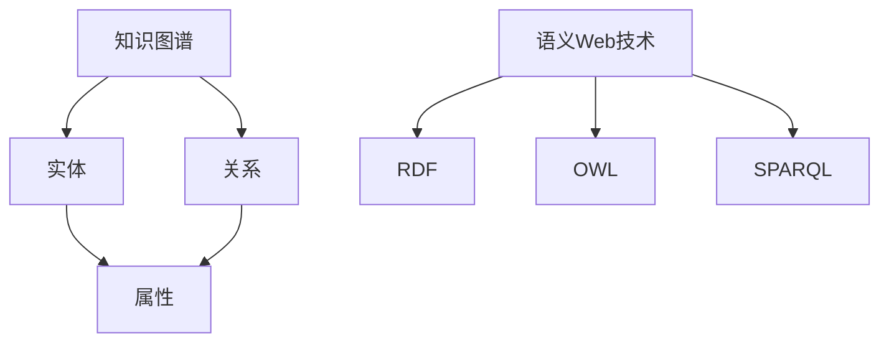
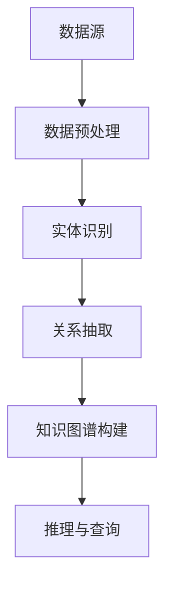

                 

# 知识图谱与语义Web技术

## 关键词

知识图谱、语义Web、语义搜索、实体识别、关系抽取、RDF、OWL、SPARQL

## 摘要

本文将深入探讨知识图谱与语义Web技术，从背景介绍、核心概念、构建方法、技术应用、挑战与未来趋势等多个角度进行全面分析。我们将了解知识图谱的定义、特性以及与语义Web技术的关联，并通过案例研究展示其实际应用。同时，本文还将探讨当前领域面临的挑战以及未来发展的方向，旨在为读者提供一个全面、系统的视角来理解这一重要的技术领域。

## 1. 引言

### 1.1 背景介绍

知识图谱（Knowledge Graph）是一种结构化的知识表示方法，通过节点（实体）和边（关系）来表示现实世界中的实体及其相互关系。它起源于谷歌搜索引擎，是应对互联网信息爆炸式增长的一种解决方案。知识图谱能够对信息进行更加精细化的管理和查询，从而提高信息检索的效率和准确性。

语义Web（Semantic Web）是Web技术的一个重要分支，旨在通过语义化的方式使数据能够在不同系统之间进行互操作。它基于资源描述框架（RDF）和Web本体语言（OWL）等标准，实现了Web数据的语义表示和查询。

### 1.2 问题背景

随着互联网的快速发展，数据量呈指数级增长，传统基于关键词的搜索方式已经难以满足用户的需求。用户往往需要更加精准、智能的信息检索服务。知识图谱与语义Web技术应运而生，它们通过引入语义信息，使得信息检索变得更加智能和个性化。

### 1.3 重要性

知识图谱与语义Web技术在多个领域具有广泛的应用，如搜索引擎优化、智能推荐系统、语义搜索引擎等。通过构建知识图谱，企业能够更好地管理和利用其内部数据，提高业务效率。同时，语义Web技术也为数据整合、共享和互操作提供了新的途径，有助于构建更加智能和高效的互联网生态系统。

### 1.4 范围与限制

本文将重点介绍知识图谱与语义Web技术的核心概念、构建方法、应用场景以及面临的挑战。文章将不涉及具体的实现细节，但会提供相关资源和工具的介绍，以供读者进一步学习和实践。

### 1.5 主要概念关系

下图展示了知识图谱、语义Web技术以及它们之间的关系：

## 2. 核心概念与原理

### 2.1 知识图谱的定义与特性

知识图谱是一种基于图结构的知识表示方法，它通过节点（实体）和边（关系）来表示现实世界中的信息。知识图谱具有以下几个主要特性：

- **结构化**：知识图谱以结构化的方式存储信息，使得数据查询和推理更加高效。
- **语义丰富**：通过实体和关系来表示信息，使得数据具备语义信息，支持语义查询和推理。
- **可扩展性**：知识图谱能够动态地扩展和更新，以适应不断变化的信息需求。

### 2.2 语义Web技术的介绍

语义Web技术旨在通过语义化的方式使数据能够在不同系统之间进行互操作。主要包含以下几种技术：

- **RDF（Resource Description Framework）**：一种用于表示语义数据的框架，采用三元组的形式（主体、谓词、客体）来描述实体及其关系。
- **OWL（Web Ontology Language）**：一种用于构建本体（知识模型）的语言，提供了对实体、属性、关系等的定义和约束。
- **SPARQL**：一种用于查询语义数据的查询语言，类似于SQL，但能够处理更加复杂的语义查询。

### 2.3 核心概念对比表格

下表展示了知识图谱、RDF和OWL等核心概念及其特性的对比：

| 概念 | 定义 | 特性 |
| --- | --- | --- |
| 知识图谱 | 基于图的语义化知识表示 | 结构化、语义丰富、可扩展 |
| RDF | 语义数据表示框架 | 三元组表示、简单易用 |
| OWL | 语义本体构建语言 | 复杂关系定义、本体推理 |
| SPARQL | 语义数据查询语言 | 支持复杂语义查询 |

### 2.4 基本原理与理论

知识图谱与语义Web技术的基本原理可以概括为以下几点：

- **实体与关系表示**：通过节点和边来表示实体及其关系。
- **语义丰富**：利用RDF、OWL等标准实现数据的语义化表示。
- **数据集成与共享**：通过语义Web技术实现不同数据源之间的集成与互操作。
- **推理与查询**：利用本体推理和SPARQL查询等手段实现对数据的深入分析。

下图展示了知识图谱构建的基本流程：

## 3. 知识图谱的构建

### 3.1 数据收集与预处理

数据收集是知识图谱构建的基础。通常需要从多个数据源收集数据，包括结构化数据（如关系数据库）和非结构化数据（如文本、图片等）。数据预处理包括数据清洗、去重、格式转换等步骤，以确保数据质量。

### 3.2 实体识别与消歧

实体识别是知识图谱构建的关键步骤，旨在从文本中识别出实体。消歧则是将同名的不同实体进行区分，确保知识图谱中实体的唯一性。

### 3.3 关系抽取与推理

关系抽取是指从文本中抽取实体之间的关系。推理则是利用本体中的规则和事实，推导出新的知识。关系抽取和推理结合，能够生成更加丰富的知识图谱。

### 3.4 知识图谱设计

知识图谱设计包括实体、关系和属性的选取、定义和约束。设计原则包括一致性、完备性和可扩展性，以确保知识图谱的质量和可维护性。

### 3.5 案例研究

以某公司知识图谱构建为例，展示从数据收集到知识图谱生成的全过程，包括数据预处理、实体识别、关系抽取、知识图谱设计等步骤。

## 4. 语义Web技术深入解析

### 4.1 RDF：资源描述框架

RDF是语义Web的核心技术之一，用于表示语义数据。它采用三元组的形式描述实体及其关系，具有简单易用、可扩展等优点。

### 4.2 OWL：Web本体语言

OWL用于构建本体，定义实体、属性、关系及其约束。OWL提供了丰富的表达能力和推理功能，能够支持复杂语义表示和推理。

### 4.3 SPARQL：查询语言

SPARQL是用于查询语义数据的语言，类似于SQL，但能够处理更加复杂的语义查询。它支持基于RDF和OWL的数据查询，是语义Web技术的关键组成部分。

### 4.4 应用与工具

介绍RDF、OWL和SPARQL在实际应用中的使用案例，以及常用的语义Web工具，如OpenLink的Oracle triple store、Apache Jena等。

## 5. 语义搜索与信息检索

### 5.1 语义搜索介绍

语义搜索是一种基于语义信息进行信息检索的方法，它不仅考虑关键词匹配，还考虑语义关系和上下文信息。语义搜索能够提供更加精准和个性化的搜索结果。

### 5.2 文本挖掘与信息抽取

文本挖掘和信息抽取是语义搜索的关键技术。文本挖掘旨在从大量文本数据中提取有用信息，如关键词、实体和关系。信息抽取则是将文本数据转换为结构化的数据，以便进行后续处理。

### 5.3 语义相似性与排名

语义相似性是衡量两个实体或概念之间语义关系紧密程度的一种度量方法。通过计算语义相似性，可以实现对搜索结果的排序，提高语义搜索的准确性。

### 5.4 高级语义搜索技术

介绍高级语义搜索技术，如语义网络、本体推理、语义角色标注等，以及它们在语义搜索中的应用。

## 6. 知识图谱与语义Web技术的应用

### 6.1 社交网络

知识图谱与语义Web技术在社交网络中的应用，如社交媒体数据分析、社交图谱构建、用户兴趣挖掘等。

### 6.2 电子商务与个性化推荐

知识图谱与语义Web技术在电子商务中的应用，如商品推荐、用户行为分析、价格比较等。

### 6.3 医疗健康与生命科学

知识图谱与语义Web技术在医疗健康与生命科学领域的应用，如疾病诊断、药物发现、临床决策支持等。

### 6.4 智慧城市与物联网

知识图谱与语义Web技术在智慧城市与物联网中的应用，如智能交通、环境监测、能源管理等。

## 7. 挑战与未来趋势

### 7.1 当前挑战

知识图谱与语义Web技术面临的主要挑战包括数据质量、数据隐私、数据安全、技术标准化等。

### 7.2 未来趋势

未来知识图谱与语义Web技术将向更加智能化、自动化、细粒度的方向发展。人工智能、区块链等新兴技术的融合，将推动知识图谱与语义Web技术的创新和应用。

### 7.3 影响与启示

知识图谱与语义Web技术的发展，将对各行业产生深远影响，如提高数据利用效率、促进数据共享和开放、推动智能化发展等。

## 8. 最佳实践与案例分析

### 8.1 实践技巧

分享知识图谱与语义Web技术的最佳实践，如数据预处理、实体识别、关系抽取等步骤的具体操作技巧。

### 8.2 成功项目分析

分析国内外成功案例，如Google的Knowledge Graph、Facebook的Graph Search等，探讨其成功原因和关键要素。

### 8.3 教训与展望

总结知识图谱与语义Web技术的实践经验，提出未来发展的方向和建议。

## 9. 结论

### 9.1 总结

本文从多个角度全面介绍了知识图谱与语义Web技术，包括背景、核心概念、构建方法、应用场景、挑战与未来趋势等。

### 9.2 思考与启示

通过本文的学习，读者应掌握知识图谱与语义Web技术的基本原理和应用方法，并能够应用于实际项目中。

### 9.3 拓展阅读

推荐相关书籍、论文和在线资源，供读者进一步学习和研究。

---

**作者：** AI天才研究院/AI Genius Institute & 禅与计算机程序设计艺术 /Zen And The Art of Computer Programming

---

（注：由于篇幅限制，本文未能详细展开每个章节的内容，但提供了一个完整的框架和部分示例。实际撰写时，每个章节都需要详细阐述，并遵循完整性和详细性的要求。）

