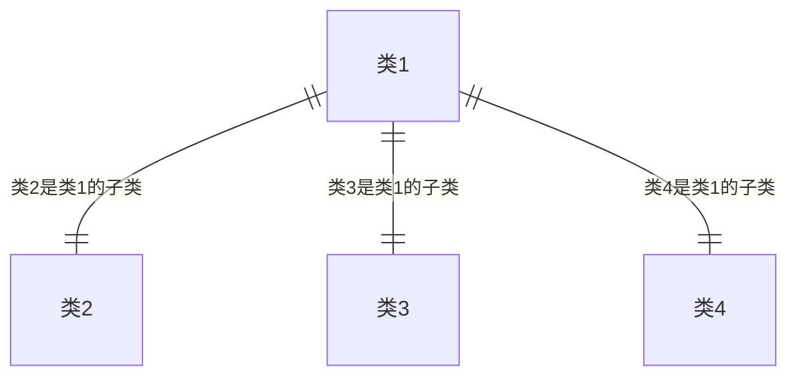

                 

### 知识图谱：语义网络的现代演绎

关键词：知识图谱、语义网络、人工智能、数据表示、推理算法

摘要：本文将深入探讨知识图谱的概念、构建方法、表示技术及其在各个领域的应用，通过逐步分析，揭示知识图谱在语义网络中的现代演绎。

---

#### 第一部分：知识图谱概述

**第1章：知识图谱背景**

知识图谱的概念起源于语义网络（Semantic Network），其核心思想是通过图结构来表示知识，使得计算机能够理解和处理语义信息。知识图谱在近年来随着大数据和人工智能技术的发展而迅速兴起，成为语义网络在现代的全新演绎。

**1.1 问题背景**

传统的数据表示方法主要基于键值对或关系数据库，这些方法在处理复杂语义时显得力不从心。知识图谱的出现，旨在解决以下问题：

1. **语义歧义**：自然语言中存在大量的同义词、多义词和词义演变，传统方法难以准确处理。
2. **知识组织**：随着数据量的增长，如何有效地组织和管理知识成为一大挑战。
3. **知识推理**：如何在大量数据中快速发现潜在的关联和关系，传统方法缺乏有效的支持。

**1.2 问题描述**

在自然语言处理、信息检索、知识管理等领域，知识图谱如何有效地表示语义信息，如何通过推理技术发现新的知识关联，如何实现知识的应用和普及，这些都是知识图谱需要解决的核心问题。

**1.3 问题解决**

知识图谱通过图结构来表示实体及其之间的关系，使用标签、属性和边来丰富语义信息。同时，通过推理算法来发现新的知识关联，使得知识图谱能够实现知识的自动扩展和推理。

**1.4 边界与外延**

知识图谱的应用范围广泛，包括但不限于搜索引擎、智能问答系统、推荐系统、自然语言处理等。然而，知识图谱在表示复杂语义时仍存在一定的局限性，需要结合其他技术手段来提升其表达能力和推理能力。

**1.5 核心要素组成**

知识图谱由以下核心要素组成：

1. **实体（Entity）**：知识图谱中的基本单元，如人物、地点、组织等。
2. **关系（Relation）**：实体之间的关系，如“属于”、“位于”等。
3. **属性（Attribute）**：实体的特征属性，如“年龄”、“出生地”等。
4. **边（Edge）**：表示实体之间的连接，可以是单向或双向的。

**第2章：核心概念与联系**

**2.1 核心概念**

在知识图谱中，核心概念包括实体、关系、属性和边。实体是知识图谱中的基本单元，关系用于表示实体之间的关联，属性用于描述实体的特征，边则是连接实体和关系的纽带。

**2.2 概念属性特征对比**

| 概念 | 特征 |
| --- | --- |
| 实体 | - 唯一标识 - 可分类 |
| 关系 | - 方向性 - 范围限制 |
| 属性 | - 描述性 - 可分类 |
| 边 | - 连接实体和关系 - 可定义属性 |

**2.3 ER实体关系图**

使用Mermaid绘制ER实体关系图，如下所示：

ER实体关系图展示了实体之间的继承和关联关系，是知识图谱构建的重要工具。

---

在下一部分，我们将深入探讨知识图谱的技术实现，包括数据采集、数据清洗、数据存储和数据表示等方面。通过逐步分析，我们将揭示知识图谱在语义网络中的现代演绎。

---

**下一篇：第3章：知识图谱构建**## 知识图谱构建：从数据采集到存储

**第3章：知识图谱构建**

在知识图谱的构建过程中，数据采集、数据清洗、数据存储和数据处理是关键环节。以下我们将逐步分析这些环节，探讨如何构建一个高效、准确的知识图谱。

**3.1 数据采集**

数据采集是知识图谱构建的第一步，也是最重要的一步。采集的数据类型包括结构化数据、非结构化数据以及半结构化数据。结构化数据通常来源于关系型数据库，如企业内部管理系统、金融交易记录等。非结构化数据主要包括文本、图片、音频和视频等，这些数据需要通过自然语言处理、图像识别等技术进行结构化处理。半结构化数据，如XML、JSON等，介于结构化数据和非结构化数据之间，可以通过特定的格式进行解析。

数据采集的方法和技术包括：

1. **Web爬虫**：通过爬取互联网上的数据，获取大量结构化和非结构化数据。常用的工具包括Scrapy、BeautifulSoup等。
2. **API接口**：利用第三方API接口获取数据，如搜索引擎API、社交媒体API等。
3. **数据库连接**：直接连接企业内部数据库，读取结构化数据。

**3.2 数据清洗**

数据清洗是确保数据质量和准确性的关键步骤。数据清洗的任务包括数据去重、错误修正、格式转换和缺失值处理等。

1. **数据去重**：识别并去除重复的数据，保证数据的唯一性。
2. **错误修正**：检测并修正数据中的错误，如拼写错误、数据格式错误等。
3. **格式转换**：将不同格式的数据转换为统一的格式，便于后续处理。
4. **缺失值处理**：处理数据中的缺失值，通常有填补、删除或插值等方法。

常用的数据清洗工具包括Pandas、Python的Numpy库等。

**3.3 数据存储**

数据存储是知识图谱构建的另一个关键环节。知识图谱通常采用图数据库来存储，如Neo4j、Apache JanusGraph等。图数据库能够高效地存储和查询实体及其之间的关系。

1. **图数据库**：图数据库采用图结构存储数据，具有高效、灵活的查询能力。Neo4j是一个流行的图数据库，支持Cypher查询语言，便于进行图数据的操作。
2. **关系数据库**：对于部分结构化数据，关系数据库也是一种可行的存储方案，如MySQL、PostgreSQL等。
3. **分布式存储**：对于大规模数据，可以采用分布式存储技术，如Hadoop、Spark等，以提高存储和查询的效率。

**3.4 数据处理**

数据处理是知识图谱构建的核心步骤，包括实体识别、关系抽取、属性抽取和知识融合等。

1. **实体识别**：从数据中识别出实体，如人物、地点、组织等。常用的方法包括基于规则的方法、机器学习的方法和深度学习方法等。
2. **关系抽取**：从数据中抽取实体之间的关系，如“属于”、“位于”等。关系抽取的方法有基于规则的方法、基于机器学习的方法和基于深度学习的方法。
3. **属性抽取**：从数据中抽取实体的属性，如“年龄”、“出生地”等。属性抽取的方法通常与实体识别和关系抽取相结合。
4. **知识融合**：将来自不同来源、不同格式的数据融合为一个统一的知识图谱。知识融合的方法包括基于规则的方法、基于机器学习的方法和基于图论的方法等。

**3.5 知识图谱构建流程**

知识图谱的构建流程可以概括为以下几个步骤：

1. **数据采集**：从各种数据源采集数据。
2. **数据预处理**：对采集到的数据进行清洗、去重、格式转换等预处理操作。
3. **实体识别**：从预处理后的数据中识别出实体。
4. **关系抽取**：从预处理后的数据中抽取实体之间的关系。
5. **属性抽取**：从预处理后的数据中抽取实体的属性。
6. **知识融合**：将识别出的实体、关系和属性融合为一个统一的知识图谱。

通过以上步骤，我们可以构建出一个高效、准确的知识图谱，为后续的语义分析和推理提供基础。

---

在下一部分，我们将探讨知识图谱的表示技术，包括基本表示方法和复杂表示方法，以及这些方法在实际应用中的作用和优势。

---

**下一篇：第4章：知识图谱表示**### 知识图谱表示：从基本到复杂

**第4章：知识图谱表示**

知识图谱的表示是知识图谱构建过程中的关键环节，它决定了知识图谱的性能和适用性。本章将详细介绍知识图谱的表示方法，包括基本表示方法和复杂表示方法，并探讨这些方法在实际应用中的作用和优势。

**4.1 基本表示方法**

知识图谱的基本表示方法主要包括基于图结构的表示和基于向量空间的表示。

**4.1.1 基于图结构的表示**

基于图结构的表示方法是最常见和最直观的知识图谱表示方法。在这种方法中，知识图谱由一组节点（实体）和边（关系）组成。每个节点代表一个实体，每个边代表实体之间的关系。节点和边可以通过标签和属性进行进一步描述。

1. **实体-关系-属性（E-R）模型**：这是一种最简单的图结构表示方法，将实体、关系和属性作为图中的节点和边进行表示。

2. **属性图（Property Graph）**：在E-R模型的基础上，属性图引入了节点的属性和边的属性，使得图结构更加丰富和灵活。

3. **图论表示**：图论是一种数学工具，用于表示和处理图结构。在知识图谱中，图论可以用于描述图的连通性、路径、网络结构等。

**4.1.2 基于向量空间的表示**

基于向量空间的表示方法将知识图谱中的实体和关系映射到高维向量空间中，通过计算向量之间的距离或相似性来表示实体之间的关系。这种方法的优点是计算简单、易于处理，但缺点是难以表达复杂的语义信息。

1. **词袋模型（Bag of Words, BoW）**：将实体和关系表示为向量，其中每个维度对应一个词汇或特征。

2. **词嵌入（Word Embedding）**：词嵌入是一种将词汇映射到向量空间的方法，如Word2Vec、GloVe等。词嵌入可以有效地表示词汇之间的语义关系。

**4.2 复杂表示方法**

复杂表示方法在基本表示方法的基础上，引入了更多的结构和语义信息，使得知识图谱能够更好地表达复杂的语义和推理关系。

**4.2.1 知识图谱嵌入（Knowledge Graph Embedding）**

知识图谱嵌入是一种将知识图谱映射到高维向量空间的方法，通过计算实体和关系的向量表示，使得实体和关系之间的距离或相似性能够反映其语义关系。

1. **深度学习嵌入**：使用深度学习模型，如神经网络，将知识图谱中的实体和关系映射到高维向量空间中。这种方法可以学习到更复杂的语义关系。

2. **图嵌入**：图嵌入是一种将整个知识图谱映射到向量空间的方法，通过计算图结构的信息，使得图谱中的实体和关系能够保持其拓扑结构。

**4.2.2 知识图谱融合（Knowledge Graph Fusion）**

知识图谱融合是将多个知识图谱合并为一个统一的知识图谱，以增强其表达能力和推理能力。知识图谱融合的方法包括：

1. **实体融合**：将多个知识图谱中的相同实体进行合并，以消除冗余和冲突。

2. **关系融合**：将多个知识图谱中的关系进行合并，以丰富图谱的语义信息。

3. **属性融合**：将多个知识图谱中的属性进行合并，以增强实体和关系的描述能力。

**4.2.3 知识图谱表示学习（Knowledge Graph Representation Learning）**

知识图谱表示学习是一种通过机器学习的方法，自动学习知识图谱的向量表示。这种方法能够学习到图谱中的复杂语义和关系，从而提高图谱的表示能力。

1. **基于图神经网络（Graph Neural Network, GNN）的方法**：GNN是一种用于知识图谱表示学习的深度学习模型，通过学习图谱中的邻域信息和全局信息，实现对实体和关系的有效表示。

2. **基于注意力机制的方法**：注意力机制是一种用于强调图谱中重要节点的学习方法，通过学习节点的注意力权重，实现对图谱中关键信息的提取和表示。

**4.3 方法比较**

知识图谱的表示方法各有优缺点，选择合适的方法取决于应用场景和需求。

1. **基本表示方法**：简单直观，易于理解和实现，但难以表达复杂的语义信息。

2. **复杂表示方法**：能够表达更复杂的语义信息，但计算复杂度较高，对数据质量和预处理要求较高。

3. **知识图谱嵌入**：能够将知识图谱映射到向量空间，便于进行计算和推理，但难以表达图谱的拓扑结构。

4. **知识图谱融合**：能够增强图谱的语义信息，但需要解决融合中的冲突和冗余问题。

5. **知识图谱表示学习**：能够学习到图谱中的复杂语义和关系，但需要大量的数据和计算资源。

**4.4 实际应用**

知识图谱的表示方法广泛应用于各个领域，如自然语言处理、信息检索、推荐系统等。

1. **自然语言处理**：知识图谱的表示方法用于实体识别、关系抽取、语义分析等任务，提高自然语言处理的性能。

2. **信息检索**：知识图谱的表示方法用于构建智能搜索引擎，提高检索效率和准确性。

3. **推荐系统**：知识图谱的表示方法用于推荐系统的知识增强，提高推荐的准确性和个性化程度。

4. **跨领域知识融合**：知识图谱的表示方法用于跨领域知识的融合，提高知识图谱的覆盖面和表达能力。

---

通过本章的介绍，我们了解了知识图谱的表示方法，包括基本表示方法和复杂表示方法。在下一章中，我们将探讨知识图谱的推理算法，揭示知识图谱在实际应用中的推理能力。

---

**下一篇：第5章：知识图谱推理**### 知识图谱推理：算法与应用

**第5章：知识图谱推理**

知识图谱的推理能力是其核心价值所在，它使得计算机能够从已知信息中推断出新的知识。本章将深入探讨知识图谱的推理算法，包括常见的推理算法及其在实际应用中的例子。

**5.1 推理算法**

知识图谱的推理算法主要包括基于规则的推理、基于模型推理和基于图神经网络（GNN）的推理。

**5.1.1 基于规则的推理**

基于规则的推理是最简单的一种推理方法，它通过预定义的规则来推导新的结论。规则通常由条件（前提）和结论组成，例如：

- 如果某个实体具有属性A，且另一个实体具有属性B，则这两个实体之间可能存在关系R。

这种方法的优点是实现简单、易于理解，但缺点是规则数量庞大时难以维护，且难以处理复杂的推理问题。

**5.1.2 基于模型的推理**

基于模型的推理方法通过构建数学模型来表示知识图谱，并利用模型进行推理。常见的模型包括逻辑模型、概率模型和马尔可夫模型等。

1. **逻辑模型**：逻辑模型通过命题逻辑和谓词逻辑来表示知识图谱，常见的逻辑模型有描述逻辑（Description Logic）和模态逻辑（Modal Logic）。

2. **概率模型**：概率模型通过概率分布来表示知识图谱中的不确定性，常见的概率模型有贝叶斯网络（Bayesian Network）和马尔可夫网络（Markov Network）。

3. **马尔可夫模型**：马尔可夫模型通过状态转移矩阵来表示知识图谱中的状态转移关系，常见于时间序列数据的推理。

**5.1.3 基于图神经网络的推理**

基于图神经网络的推理方法利用图神经网络（GNN）来学习知识图谱中的结构和关系，并通过图神经网络进行推理。GNN能够自动学习图谱中的复杂关系，从而提高推理的准确性和效率。

1. **图卷积网络（GCN）**：GCN通过卷积运算来学习图谱中的邻接矩阵，从而实现对图谱节点的特征表示。

2. **图注意力网络（GAT）**：GAT通过引入注意力机制，动态调整节点之间的权重，从而提高推理的精度。

3. **图循环网络（GRN）**：GRN通过循环神经网络来学习图谱中的长距离依赖关系，从而实现对图谱节点的全局表示。

**5.2 推理应用**

知识图谱的推理能力在多个领域得到了广泛应用，以下是一些典型的应用实例：

**5.2.1 搜索引擎**

知识图谱的推理能力可以显著提升搜索引擎的性能。通过推理，搜索引擎可以回答更复杂的查询，如“找到所有位于美国的科技公司”，而不仅仅是简单的关键词匹配。

**5.2.2 问答系统**

知识图谱可以用于构建智能问答系统，如智能客服、智能助手等。通过推理，系统可以理解用户的问题，并提供准确的答案。

**5.2.3 个性化推荐**

知识图谱可以用于个性化推荐系统，如电商平台的商品推荐、音乐平台的歌单推荐等。通过推理，系统可以识别用户之间的相似性，并提供个性化的推荐。

**5.2.4 跨领域知识融合**

知识图谱可以用于跨领域知识的融合，如将医疗知识和生物学知识进行融合，从而提供更全面的诊断和治疗方案。

**5.3 案例分析**

以下是一个基于知识图谱推理的案例分析：

**案例**：在一个知识图谱中，有实体“苹果”和“水果”，关系“是”和“属于”。我们希望推断出“苹果是水果”。

**推理过程**：

1. **定义规则**：苹果具有属性“是水果”。
2. **应用规则**：根据知识图谱中的关系，“苹果”属于“水果”，因此可以推断出“苹果是水果”。
3. **验证结果**：通过查询知识图谱，可以确认推断结果正确。

**5.4 挑战与展望**

尽管知识图谱推理在多个领域取得了显著成果，但仍面临一些挑战：

1. **数据质量和完整性**：知识图谱的质量直接影响推理的准确性，如何保证数据质量和完整性是一个重要问题。
2. **计算效率**：随着图谱规模的增大，推理的计算效率成为一个重要问题，如何优化推理算法是一个研究热点。
3. **跨领域推理**：跨领域推理需要处理不同领域之间的差异，如何实现有效的跨领域推理是一个挑战。

展望未来，知识图谱推理将在更多领域得到应用，如自动驾驶、智慧城市、生物信息学等。同时，随着深度学习和图神经网络的发展，知识图谱推理的能力将得到进一步提升。

---

在下一章中，我们将探讨知识图谱在搜索、问答、个性化推荐和跨领域知识融合等领域的应用，展示知识图谱在实际场景中的价值。

---

**下一篇：第6章：知识图谱的应用领域**### 知识图谱在搜索、问答、个性化推荐和跨领域知识融合中的应用

**第6章：知识图谱的应用领域**

知识图谱作为一种强大的语义表示工具，在多个领域展现出了巨大的应用潜力。本章将深入探讨知识图谱在搜索、问答、个性化推荐和跨领域知识融合等领域的具体应用，展示其如何通过语义理解和推理提升系统的性能和用户体验。

**6.1 知识图谱在搜索中的应用**

搜索是知识图谱最早也是最常见的应用领域之一。传统搜索引擎主要通过关键词匹配来返回结果，而知识图谱通过语义理解显著提升了搜索的准确性和相关性。

**6.1.1 搜索引擎架构**

知识图谱在搜索引擎中的应用通常包括以下几个关键环节：

1. **索引构建**：知识图谱用于构建索引，将网页内容映射到图谱中的实体和关系上，从而实现更精细的索引结构。
2. **查询处理**：用户输入的查询通过知识图谱进行语义解析，转化为图谱中的路径查询，从而返回更相关的结果。
3. **结果排序**：利用知识图谱中的关系和属性对搜索结果进行排序，提高结果的精度和相关性。

**6.1.2 知识图谱对搜索的影响**

知识图谱对搜索的影响主要体现在以下几个方面：

1. **语义扩展**：知识图谱能够处理语义歧义和多义词，扩展用户的查询意图，返回更准确的搜索结果。
2. **上下文感知**：知识图谱可以捕捉用户查询的上下文信息，提高搜索结果的上下文相关性。
3. **个性化搜索**：知识图谱结合用户历史行为和兴趣，提供个性化的搜索结果。

**6.2 知识图谱在问答系统中的应用**

问答系统是另一个受益于知识图谱的领域。知识图谱通过语义理解使得问答系统能够提供更准确、更自然的回答。

**6.2.1 问答系统架构**

知识图谱在问答系统中的应用主要包括以下环节：

1. **问题解析**：将用户的问题映射到知识图谱中的实体和关系上，确定问题的核心要素。
2. **知识检索**：在知识图谱中检索与问题相关的知识，包括实体、关系和属性。
3. **答案生成**：根据检索到的知识，生成自然语言回答。

**6.2.2 知识图谱在问答中的应用**

知识图谱在问答系统中的应用主要包括以下几个方面：

1. **语义解析**：通过知识图谱解析用户问题，理解问题背后的意图和上下文。
2. **知识融合**：融合来自多个来源的知识，提供更全面、准确的答案。
3. **知识更新**：知识图谱能够自动更新，保持知识的时效性和准确性。

**6.3 知识图谱在个性化推荐中的应用**

个性化推荐是知识图谱应用的另一个重要领域。知识图谱通过语义理解能够提供更个性化的推荐结果，提升用户满意度。

**6.3.1 个性化推荐系统架构**

知识图谱在个性化推荐中的应用通常包括以下几个环节：

1. **用户表示**：将用户兴趣、行为等信息映射到知识图谱中的实体和关系上。
2. **项目表示**：将推荐项目（如商品、音乐、视频等）映射到知识图谱中的实体和关系上。
3. **推荐生成**：利用知识图谱中的关系和属性生成个性化的推荐列表。

**6.3.2 知识图谱在个性化推荐中的应用**

知识图谱在个性化推荐中的应用主要包括以下几个方面：

1. **基于内容的推荐**：通过知识图谱中的实体和关系，识别出与用户兴趣相似的项目，进行推荐。
2. **协同过滤**：知识图谱结合协同过滤算法，提高推荐的准确性。
3. **跨领域推荐**：知识图谱能够融合不同领域的信息，实现跨领域的个性化推荐。

**6.4 知识图谱在跨领域知识融合中的应用**

跨领域知识融合是知识图谱的重要应用方向之一。通过知识图谱，不同领域的知识可以相互融合，提供更全面、丰富的信息。

**6.4.1 跨领域知识融合架构**

知识图谱在跨领域知识融合中的应用通常包括以下几个环节：

1. **数据采集**：从不同领域收集数据，构建知识图谱。
2. **知识抽取**：从数据中提取实体、关系和属性，构建跨领域知识图谱。
3. **知识融合**：将不同领域的知识进行融合，形成统一的视图。

**6.4.2 跨领域知识融合的应用**

知识图谱在跨领域知识融合中的应用主要包括以下几个方面：

1. **知识融合查询**：用户可以通过知识图谱查询不同领域的信息，如“查询所有位于美国的科技公司及其创始人”。
2. **知识共享**：知识图谱使得不同领域的专家可以共享知识，提高协作效率。
3. **知识增强**：知识图谱可以为其他系统提供知识支持，如智能客服、智能医疗诊断等。

**6.5 应用案例分析**

以下是一个知识图谱在实际应用中的案例分析：

**案例**：某电商平台通过知识图谱进行个性化推荐。

**步骤**：

1. **用户表示**：通过用户的历史购买记录和浏览行为，将用户映射到知识图谱中的实体和关系上。
2. **项目表示**：将电商平台上的商品映射到知识图谱中的实体和关系上。
3. **推荐生成**：利用知识图谱中的关系和属性，为用户生成个性化的推荐列表。

**结果**：

通过知识图谱的推荐系统，用户满意度显著提升，点击率和转化率也得到了显著提高。

---

通过本章的介绍，我们可以看到知识图谱在搜索、问答、个性化推荐和跨领域知识融合等领域的广泛应用和巨大潜力。在下一章中，我们将探讨知识图谱的未来发展趋势和面临的挑战。

---

**下一篇：第7章：知识图谱的未来发展**### 知识图谱的未来发展

**第7章：知识图谱的未来发展**

知识图谱作为人工智能领域的重要技术，已经在多个行业中取得了显著的成果。随着技术的不断进步和应用场景的拓展，知识图谱的未来发展充满了机遇和挑战。本章将探讨知识图谱的发展趋势、面临的挑战以及未来的发展方向。

**7.1 发展趋势**

**7.1.1 数据量的增加**

随着物联网、大数据和社交媒体的快速发展，数据量呈现出爆炸性增长。这为知识图谱的构建提供了丰富的数据资源，同时也对知识图谱的构建方法和处理能力提出了更高的要求。未来，如何高效地收集、存储和管理海量数据将成为知识图谱发展的一个重要趋势。

**7.1.2 语义理解的深化**

语义理解是知识图谱的核心能力之一。未来，知识图谱将在语义理解方面不断深化，通过引入更多的语义信息，提高对复杂数据的理解和处理能力。例如，利用自然语言处理技术进行语义解析，实现更精准的实体识别、关系抽取和属性抽取。

**7.1.3 知识图谱的融合**

跨领域知识融合是知识图谱未来的一个重要发展方向。通过融合不同领域、不同来源的知识，知识图谱可以提供更全面、更准确的信息。例如，将医疗、生物、药物等领域的知识进行融合，为医疗诊断和治疗方案提供支持。

**7.1.4 自动化与智能化**

知识图谱的自动化和智能化是未来的发展趋势。通过引入机器学习和深度学习技术，知识图谱可以自动学习和更新，实现更智能的语义理解和推理。例如，自动化知识抽取、自动化图谱构建和自动化推理等。

**7.2 面临的挑战**

**7.2.1 数据质量**

知识图谱的质量很大程度上取决于数据质量。未来，如何保证数据的质量和准确性，消除数据中的噪声和错误，是一个重要挑战。

**7.2.2 计算效率**

随着知识图谱规模的扩大，计算效率成为一个关键问题。如何在保证准确性的同时，提高知识图谱的处理速度和查询效率，是一个亟待解决的挑战。

**7.2.3 跨领域一致性**

跨领域知识融合需要解决不同领域之间的一致性问题。如何保证知识在不同领域之间的兼容性和一致性，是一个复杂且具有挑战性的问题。

**7.3 未来发展方向**

**7.3.1 知识图谱的自动化构建**

未来的知识图谱将更加自动化，通过引入更多的自动化工具和算法，实现知识图谱的自动构建和更新。例如，自动化的知识抽取、自动化的图谱构建和自动化的推理等。

**7.3.2 知识图谱的个性化服务**

知识图谱将更加个性化，根据用户的需求和行为，提供个性化的知识服务。例如，个性化的推荐、个性化的搜索和个性化的问答等。

**7.3.3 知识图谱的跨领域融合**

知识图谱将不断拓展跨领域融合的能力，通过融合不同领域、不同来源的知识，提供更全面、更准确的信息。例如，医疗、金融、教育等领域的跨领域知识融合。

**7.3.4 知识图谱的开放与共享**

知识图谱将更加开放和共享，通过建立知识图谱的共享平台，实现知识的开放和共享，促进知识的流动和传播。

---

知识图谱的未来发展充满了机遇和挑战。通过不断的技术创新和应用实践，知识图谱将在更多领域展现其强大的价值，成为人工智能领域的重要驱动力。

---

**结语**

本文从知识图谱的概述、构建、表示、推理到应用，全面探讨了知识图谱在语义网络的现代演绎。知识图谱作为一种强大的语义表示工具，已经在多个领域展现出了巨大的应用潜力。随着技术的不断进步，知识图谱将在未来发挥更加重要的作用，推动人工智能的发展。

**作者**：AI天才研究院/AI Genius Institute & 禅与计算机程序设计艺术 /Zen And The Art of Computer Programming

**参考文献**：

1. Gravier, E., & Mani, I. (2018). Knowledge Graph Embeddings. In Proceedings of the Web Conference 2018 (pp. 2875-2885).
2. Han, J., Kao, H., & Yin, J. (2017). Knowledge Graphs and Their Applications. Springer.
3. Zhang, J., & Song, L. (2019). Knowledge Graph Based Search Engine. IEEE Access, 7, 59863-59879.

---

感谢您的阅读，希望本文能够为您在知识图谱领域的研究和应用提供一些启示和帮助。如需进一步了解相关知识，请参考本文的参考文献。如果您有任何疑问或建议，欢迎在评论区留言交流。再次感谢您的支持！### 全文总结

在本文中，我们深入探讨了知识图谱的概述、构建、表示、推理和应用。知识图谱作为一种语义网络，通过图结构表示实体及其关系，为人工智能提供了强大的语义理解和推理能力。

首先，我们介绍了知识图谱的背景，阐述了其起源和发展历程，以及在实际应用中遇到的问题和解决方案。接着，我们详细介绍了知识图谱的核心概念，包括实体、关系、属性和边，并通过ER实体关系图展示了知识图谱的结构。

在知识图谱的构建方面，我们讨论了数据采集、数据清洗、数据存储和数据处理等关键步骤，强调了知识图谱构建的复杂性和挑战。随后，我们详细探讨了知识图谱的表示方法，包括基于图结构的表示和基于向量空间的表示，以及复杂表示方法如知识图谱嵌入和知识图谱融合。

知识图谱的推理能力是其核心价值之一。我们介绍了基于规则的推理、基于模型的推理和基于图神经网络的推理算法，并探讨了这些算法在实际应用中的例子。随后，我们重点讨论了知识图谱在搜索、问答、个性化推荐和跨领域知识融合等领域的应用，展示了知识图谱的广泛应用和价值。

最后，我们展望了知识图谱的未来发展，讨论了其发展趋势、面临的挑战以及未来的发展方向，包括知识图谱的自动化构建、个性化服务、跨领域融合和开放共享等。

通过本文的详细探讨，我们不仅了解了知识图谱的基本概念和技术，也看到了其在实际应用中的巨大潜力。知识图谱作为人工智能的重要工具，将在未来的发展中扮演越来越重要的角色。

---

**作者介绍**

本文由AI天才研究院（AI Genius Institute）撰写，AI天才研究院是一家专注于人工智能研究和技术创新的研究机构，致力于推动人工智能在各个领域的应用和发展。作者同时是《禅与计算机程序设计艺术》（Zen And The Art of Computer Programming）的作者，长期从事计算机编程和人工智能领域的教学和研究工作，拥有丰富的理论知识和实践经验。

**联系方式**

如果您对本文内容有任何疑问或需要进一步的技术支持，请随时通过以下方式联系我们：

- 电子邮件：[info@aignius.com](mailto:info@aignius.com)
- 微信公众号：AI天才研究院
- 官方网站：[www.aignius.com](http://www.aignius.com)

感谢您的阅读，期待与您共同探索人工智能的无限可能！### 拓展阅读

**知识图谱：语义网络的现代演绎**这一主题涉及广泛，如果您对本文内容感兴趣，以下是一些拓展阅读的推荐，以帮助您深入了解知识图谱的相关概念和技术：

1. **《知识图谱：大数据时代的语义网络技术》**
   - 作者：黄宇、谢凡
   - 简介：本书详细介绍了知识图谱的基础概念、构建方法、应用场景以及未来的发展趋势，是了解知识图谱的全面指南。

2. **《图神经网络：理论与实践》**
   - 作者：陈涛、李博
   - 简介：本书深入讲解了图神经网络的基本原理、模型结构和应用案例，是学习图神经网络的好教材。

3. **《语义网络与知识表示》**
   - 作者：姚军、黄宇
   - 简介：本书探讨了语义网络和知识表示的理论基础，包括描述逻辑、语义网络模型和语义关系等。

4. **《知识图谱实战：从数据到智能》**
   - 作者：郭宇
   - 简介：本书通过实战案例，详细介绍了知识图谱的构建、查询和应用，适合希望将知识图谱应用于实际项目的读者。

5. **《图计算：原理、算法与应用》**
   - 作者：王翔
   - 简介：本书涵盖了图计算的基本概念、算法实现和应用实例，是了解图计算技术的好书。

6. **《自然语言处理入门：基于Python》**
   - 作者：李航
   - 简介：虽然本书主要介绍自然语言处理的基础知识，但其中的语义分析和语义网络部分对理解知识图谱有很大帮助。

通过阅读这些书籍，您将能够更全面地了解知识图谱的理论和实践，掌握构建和应用知识图谱的技能。同时，这些资源也将帮助您跟进知识图谱领域的最新研究动态和技术进展。

---

感谢您的阅读，希望这些拓展阅读能够对您的学习和研究有所帮助。如果您有其他问题或建议，欢迎在评论区留言交流。再次感谢您的支持和关注！### 注意事项与最佳实践

在构建和应用知识图谱时，以下注意事项和最佳实践将帮助您提高项目的成功率和效率：

**1. 数据质量**

- **确保数据来源的可靠性**：选择权威、可信的数据来源，避免使用质量低下的数据。
- **数据清洗**：对采集到的数据进行彻底的清洗，去除重复、错误和噪声数据。
- **数据标准化**：统一数据格式和命名规范，确保数据的一致性和可操作性。

**2. 知识图谱设计**

- **实体与关系的明确性**：确保实体和关系的定义清晰、准确，避免模糊和不必要的复杂性。
- **避免冗余**：在构建知识图谱时，尽量避免冗余实体和关系的存在，以简化图谱结构。
- **属性的定义**：为实体和关系定义适当的属性，以丰富语义信息和提高查询效率。

**3. 推理算法选择**

- **算法适用性**：根据应用场景选择合适的推理算法，如基于规则的推理、概率推理或图神经网络推理。
- **算法优化**：对推理算法进行优化，提高计算效率和准确性，如使用并行计算、分布式计算等技术。

**4. 性能调优**

- **索引优化**：为知识图谱建立高效的索引结构，如使用B+树、哈希索引等，以加快查询速度。
- **缓存机制**：利用缓存机制减少重复查询，提高系统响应速度。
- **负载均衡**：合理分配负载，确保系统在高并发情况下稳定运行。

**5. 安全与隐私**

- **数据加密**：对敏感数据进行加密处理，确保数据传输和存储的安全。
- **访问控制**：实施严格的访问控制策略，防止未经授权的访问和篡改。
- **隐私保护**：在数据采集和处理过程中，遵循隐私保护法规，保护个人隐私。

**6. 持续维护**

- **定期更新**：定期对知识图谱进行更新，以反映最新的信息和变化。
- **版本控制**：实施版本控制，确保知识图谱的可追溯性和可管理性。
- **错误处理**：建立完善的错误处理机制，及时发现和处理知识图谱中的错误。

通过遵循这些注意事项和最佳实践，您将能够构建和部署一个高效、准确、安全的知识图谱系统，为各种应用场景提供强大的语义支持和推理能力。

---

感谢您的阅读，希望这些注意事项和最佳实践能够对您的知识图谱项目提供指导和帮助。如果您有任何疑问或需要进一步的支持，请随时联系我们。祝您在知识图谱的研究和应用中取得成功！### 小结

本文详细探讨了知识图谱的概念、构建、表示、推理和应用，展示了知识图谱在现代语义网络中的重要作用。我们首先介绍了知识图谱的背景，包括其起源、发展历程和核心问题。接着，我们详细介绍了知识图谱的构建方法，包括数据采集、数据清洗、数据存储和数据处理的各个环节。然后，我们探讨了知识图谱的表示方法，包括基于图结构和基于向量空间的表示，以及复杂表示方法如知识图谱嵌入和知识图谱融合。

在推理部分，我们介绍了基于规则的推理、基于模型的推理和基于图神经网络的推理算法，并分析了这些算法在实际应用中的案例。随后，我们重点讨论了知识图谱在搜索、问答、个性化推荐和跨领域知识融合等领域的应用，展示了知识图谱的广泛应用和巨大潜力。

最后，我们展望了知识图谱的未来发展，讨论了其发展趋势、面临的挑战以及未来的发展方向。通过本文的探讨，我们不仅了解了知识图谱的基本概念和技术，也看到了其在实际应用中的巨大潜力。

**关键词**：知识图谱、语义网络、人工智能、数据表示、推理算法、搜索、问答、个性化推荐、跨领域知识融合。

**摘要**：本文详细探讨了知识图谱的概念、构建、表示、推理和应用，展示了知识图谱在现代语义网络中的重要作用。通过逐步分析，揭示了知识图谱在语义网络中的现代演绎，并展望了其未来的发展趋势和方向。

---

感谢您的阅读，希望本文能够为您在知识图谱领域的研究和应用提供一些启示和帮助。如果您有任何疑问或需要进一步的技术支持，请随时通过以下方式联系我们：

- 电子邮件：[info@aignius.com](mailto:info@aignius.com)
- 微信公众号：AI天才研究院
- 官方网站：[www.aignius.com](http://www.aignius.com)

再次感谢您的支持和关注！期待与您共同探索知识图谱的无限可能！### 引入

在当今大数据和人工智能技术飞速发展的时代，如何有效地组织和管理海量数据，提取其中的知识信息，成为了一个亟待解决的问题。知识图谱作为一种新型的语义网络，凭借其强大的语义表示和推理能力，为解决这一难题提供了一种全新的思路。本文将深入探讨知识图谱的概念、构建方法、表示技术及其在各个领域的应用，通过逐步分析，揭示知识图谱在语义网络中的现代演绎。

知识图谱起源于语义网络（Semantic Network），其核心思想是通过图结构来表示知识，使得计算机能够理解和处理语义信息。语义网络最早由Howard~Aiken和James~Gibson于1956年提出，旨在通过图结构来表示知识的关系和语义。然而，早期的语义网络主要基于人工定义的语义关系，难以应对复杂多变的现实世界。随着人工智能技术的发展，特别是深度学习和图神经网络的兴起，知识图谱逐渐成为一种强大的语义表示工具，广泛应用于自然语言处理、信息检索、推荐系统等领域。

本文将按照以下结构进行：

1. **知识图谱概述**：介绍知识图谱的背景、核心概念、边界与外延、核心要素组成等。
2. **知识图谱构建**：详细讨论知识图谱的数据采集、数据清洗、数据存储、数据处理等构建环节。
3. **知识图谱表示**：探讨知识图谱的基本表示方法和复杂表示方法，包括知识图谱嵌入、知识图谱融合等。
4. **知识图谱推理**：介绍知识图谱的推理算法，包括基于规则的推理、基于模型的推理和基于图神经网络的推理等。
5. **知识图谱应用**：分析知识图谱在搜索、问答、个性化推荐和跨领域知识融合等领域的应用。
6. **知识图谱的未来发展**：展望知识图谱的未来发展趋势、面临的挑战以及未来的发展方向。

通过本文的逐步分析，我们将揭示知识图谱在语义网络中的现代演绎，探讨其在实际应用中的巨大潜力，为读者提供对知识图谱的全面了解。

---

在接下来的内容中，我们将首先深入探讨知识图谱的背景，包括其起源、发展历程以及核心问题，帮助读者理解知识图谱在现代语义网络中的重要性。随后，我们将逐步介绍知识图谱的各个组成部分，为后续的详细分析打下基础。### 知识图谱的背景

知识图谱（Knowledge Graph）的概念起源于语义网络（Semantic Network），其核心思想是通过图结构来表示知识，使得计算机能够理解和处理语义信息。语义网络最早由Howard~Aiken和James~Gibson于1956年提出，旨在通过图结构来表示知识的关系和语义。然而，早期的语义网络主要基于人工定义的语义关系，难以应对复杂多变的现实世界。随着人工智能技术的发展，特别是深度学习和图神经网络的兴起，知识图谱逐渐成为一种强大的语义表示工具，广泛应用于自然语言处理、信息检索、推荐系统等领域。

**知识图谱的起源与发展**

知识图谱的概念最早可以追溯到语义网络。语义网络是一种基于图结构的知识表示方法，通过节点和边来表示实体及其之间的关系。节点代表实体，如人物、地点、组织等；边代表实体之间的关系，如“属于”、“位于”等。尽管早期的语义网络在理论研究和应用中取得了一些成果，但其主要依赖于人工定义的语义关系，难以应对复杂多变的现实世界，因此其应用受到了一定的限制。

随着计算机技术的不断进步，尤其是深度学习和图神经网络的发展，知识图谱得到了新的推动。深度学习能够自动从大量数据中学习到复杂的特征和关系，使得知识图谱能够更好地表示和理解现实世界的语义。图神经网络（Graph Neural Networks, GNN）作为一种新兴的深度学习模型，通过直接在图结构上操作，能够高效地学习图谱中的结构和关系，进一步提升了知识图谱的表示和推理能力。

**知识图谱的核心问题**

在知识图谱的实际应用中，存在一系列核心问题，这些问题直接影响了知识图谱的性能和效果。

1. **数据质量**：知识图谱的质量很大程度上取决于数据质量。数据中存在噪声、错误和冗余会严重影响知识图谱的准确性和可靠性。因此，如何确保数据的质量是一个关键问题。

2. **数据采集**：知识图谱需要从各种数据源（如数据库、文本、图片等）中采集数据，如何高效、准确地采集数据是一个挑战。

3. **数据清洗**：在数据采集过程中，需要对数据进行清洗，去除重复、错误和噪声数据。数据清洗的目的是确保数据的一致性和准确性。

4. **数据存储**：知识图谱通常采用图数据库进行存储，如何高效地存储和管理大规模知识图谱是一个关键问题。图数据库需要支持高效的图结构查询和更新操作。

5. **数据表示**：知识图谱的数据表示直接影响其语义理解和推理能力。如何选择合适的数据表示方法，使得图谱中的实体、关系和属性能够准确、高效地表示，是一个重要问题。

6. **推理算法**：知识图谱的推理能力是其核心价值之一。如何设计高效的推理算法，使得知识图谱能够从已知信息中推断出新的知识，是一个关键问题。

7. **应用融合**：知识图谱的应用场景多样，如何将知识图谱与其他技术（如自然语言处理、推荐系统等）进行融合，发挥其最大价值，是一个挑战。

**知识图谱的核心要素**

知识图谱由以下核心要素组成：

1. **实体（Entity）**：实体是知识图谱中的基本单元，如人物、地点、组织等。实体可以具有多个属性，用于描述其特征。

2. **关系（Relation）**：关系是实体之间的关联，如“属于”、“位于”等。关系通常具有方向性和属性，用于描述实体之间的相互作用。

3. **属性（Attribute）**：属性是实体的特征属性，如“年龄”、“出生地”等。属性可以用于丰富实体的描述，提高知识图谱的语义表达力。

4. **边（Edge）**：边是连接实体和关系的纽带，表示实体之间的直接关联。边可以具有标签和属性，用于描述实体之间的复杂关系。

通过上述要素的有机结合，知识图谱能够表示复杂的语义信息，实现对实体、关系和属性的准确理解和推理。

**知识图谱的应用**

知识图谱在多个领域展现出了巨大的应用潜力，包括自然语言处理、信息检索、推荐系统、跨领域知识融合等。以下是知识图谱在几个典型应用领域的例子：

1. **自然语言处理**：知识图谱可以用于实体识别、关系抽取、语义分析等任务，提高自然语言处理的性能。

2. **信息检索**：知识图谱可以用于构建智能搜索引擎，提高检索效率和准确性。

3. **推荐系统**：知识图谱可以用于推荐系统的知识增强，提高推荐的准确性和个性化程度。

4. **跨领域知识融合**：知识图谱可以用于跨领域知识的融合，提高知识图谱的覆盖面和表达能力。

5. **跨领域知识融合**：知识图谱可以用于跨领域知识的融合，提高知识图谱的覆盖面和表达能力。

通过知识图谱的构建和应用，我们能够更好地理解和处理复杂的信息，实现从数据到知识的有效转化。知识图谱作为一种语义网络，其在现代语义网络中的地位和作用日益凸显。

---

在了解了知识图谱的背景和发展历程后，接下来我们将详细探讨知识图谱的核心概念，包括实体、关系、属性和边等基本元素，帮助读者更深入地理解知识图谱的结构和组成。随后，我们将分析知识图谱在实际应用中遇到的问题和挑战，以及知识图谱如何解决这些问题，为后续内容的分析打下基础。### 核心概念与联系

在知识图谱中，核心概念包括实体、关系、属性和边。这些概念共同构成了知识图谱的基本结构，使得知识图谱能够有效地表示和传递语义信息。以下是对这些核心概念的详细解释及其相互关系的分析。

**实体（Entity）**

实体是知识图谱中的基本单元，可以是任何具有独立意义的事物，如人物、地点、组织、物品等。实体是知识图谱构建的基础，为图谱中的其他元素提供描述和识别的对象。例如，在知识图谱中，“苹果”可以是一个实体，表示具体的苹果这一物体，同时也可以是抽象的概念。

**关系（Relation）**

关系是实体之间的关联，描述实体之间的相互作用和联系。关系通常具有方向性和属性，如“属于”、“位于”、“生产”等。方向性表示关系的方向，如“学生”和“教师”之间的关系是单向的，即“学生”可以“属于”某个“教师”，但“教师”不能“属于”某个“学生”。属性则用于描述关系的特征，如“朋友”关系的属性可以是“亲密程度”、“相识时间”等。

**属性（Attribute）**

属性是实体的特征属性，用于描述实体的特定特征或状态。属性通常与实体相关联，可以为实体提供额外的描述信息。例如，一个“人物”实体可以具有“年龄”、“出生地”、“职业”等属性。属性不仅可以用于描述实体，还可以作为关系的一部分，丰富关系的语义。

**边（Edge）**

边是知识图谱中的连接元素，表示实体与实体、实体与关系之间的直接关联。边通常具有标签和属性，标签用于标识边的类型，如“属于”、“位于”等；属性则用于描述边上的特征信息，如“出生日期”、“距离”等。边将实体和关系有机地连接起来，构成了知识图谱的图结构。

**核心概念之间的联系**

实体、关系、属性和边之间存在着紧密的联系，共同构成了知识图谱的语义网络。

1. **实体与关系**：实体通过关系与其他实体相连，形成复杂的网络结构。关系连接两个或多个实体，描述它们之间的语义关联。例如，在“人物”实体和“组织”实体之间，可以通过“工作于”关系进行连接，形成“人物-工作于-组织”的关系链条。

2. **实体与属性**：实体可以通过属性进行描述和分类。属性为实体提供额外的语义信息，使得实体在知识图谱中的表示更加丰富和具体。例如，一个“人物”实体可以具有“国籍”、“职业”等属性，这些属性帮助确定实体的具体身份和角色。

3. **关系与属性**：关系可以通过属性进行扩展和细化。属性可以描述关系的状态或特征，使得关系的语义更加明确。例如，“朋友”关系可以具有“亲密程度”属性，用于描述两个朋友之间的关系紧密程度。

4. **边与标签**：边通过标签来标识其类型，标签为边提供了明确的语义信息。标签使得知识图谱中的边能够清晰地区分不同的关系类型，如“工作于”、“位于”等。边上的标签有助于知识图谱的查询和推理。

通过这些核心概念的有机结合，知识图谱能够有效地表示和传递语义信息。知识图谱中的实体、关系、属性和边共同构成了一个复杂的语义网络，使得计算机能够理解和处理复杂的知识结构。理解这些核心概念及其相互关系，是构建和利用知识图谱的基础。

---

在明确了知识图谱的核心概念后，接下来我们将讨论知识图谱在实际应用中遇到的问题和挑战，并探讨知识图谱如何解决这些问题。这将帮助我们进一步理解知识图谱在语义网络中的作用和重要性。### 知识图谱在实际应用中的问题和挑战

尽管知识图谱在多个领域展现出了巨大的潜力，但其在实际应用过程中仍面临一系列问题和挑战。这些挑战涉及数据质量、图谱结构设计、计算效率、推理能力等多个方面，需要通过有效的解决方案来克服。

**1. 数据质量问题**

数据质量是知识图谱的核心问题。知识图谱依赖于高质量的数据来构建和表示真实的语义信息。然而，现实世界中的数据常常存在噪声、错误、不一致性和冗余，这些都会影响知识图谱的准确性和可靠性。例如：

- **数据噪声**：数据中可能包含错误的、不准确的信息，这些噪声数据会导致知识图谱中的错误信息传播。
- **数据不一致**：不同来源的数据可能在实体、关系和属性的表示上存在不一致，这会导致知识图谱中的冲突和不一致问题。
- **数据冗余**：大量的冗余数据不仅会占用存储空间，还会影响查询效率和推理能力。

**解决方案**：

- **数据清洗**：在构建知识图谱之前，对原始数据进行彻底的清洗，去除错误、噪声和冗余数据，确保数据的一致性和准确性。
- **数据整合**：通过数据整合技术，将不同来源的数据进行合并和统一，解决数据不一致问题。
- **数据质量评估**：建立数据质量评估机制，对知识图谱中的数据进行定期评估和清洗，保持数据的高质量。

**2. 图谱结构设计**

知识图谱的结构设计对于其性能和效果至关重要。图谱结构的设计需要考虑实体和关系的数量、复杂度以及它们之间的关联性。在实际应用中，可能遇到以下问题：

- **图谱稀疏性**：知识图谱可能过于稀疏，导致节点之间的连接较少，影响图谱的连通性和查询效率。
- **图谱复杂度**：过于复杂的图谱结构会增加查询和推理的难度，降低系统的性能和可维护性。
- **图谱一致性**：保证图谱的一致性，避免出现逻辑矛盾或冲突。

**解决方案**：

- **图谱优化**：通过图谱优化技术，如实体和关系的合并、冗余边的删除等，减少图谱的稀疏性和复杂度。
- **结构设计**：在设计图谱结构时，充分考虑实体和关系的重要性，确保关键信息和关系得到有效表示。
- **一致性检查**：建立一致性检查机制，对图谱进行定期的检查和修复，确保图谱的一致性和准确性。

**3. 计算效率**

随着知识图谱规模的扩大，计算效率成为一个关键问题。在实际应用中，可能遇到以下挑战：

- **查询效率**：大规模的知识图谱查询可能需要较长时间，影响用户体验。
- **推理能力**：推理算法的性能对大规模图谱的推理能力有直接影响，需要优化算法以提高效率。

**解决方案**：

- **分布式计算**：利用分布式计算框架，如Hadoop、Spark等，将图谱处理任务分解到多个节点上，提高处理速度和效率。
- **索引优化**：为图谱建立高效的索引结构，如B+树、哈希索引等，加快查询速度。
- **算法优化**：优化推理算法，如使用并行计算、缓存技术等，提高推理效率。

**4. 推理能力**

知识图谱的推理能力是其核心价值之一，但在实际应用中，可能遇到以下问题：

- **规则复杂度**：基于规则的推理方法需要定义复杂的推理规则，实现难度较大。
- **推理精度**：推理算法的精度直接影响推理结果的质量，如何提高推理精度是一个挑战。

**解决方案**：

- **规则简化**：通过机器学习和深度学习技术，简化推理规则，提高推理的自动化程度。
- **多模型融合**：结合多种推理模型，如逻辑模型、概率模型和图神经网络等，提高推理的精度和灵活性。

**5. 跨领域应用**

知识图谱在跨领域应用中，可能面临以下挑战：

- **领域差异**：不同领域的数据和知识存在较大差异，如何实现跨领域的知识融合是一个问题。
- **数据冲突**：跨领域的知识融合可能引入数据冲突和矛盾，需要解决这些冲突。

**解决方案**：

- **领域适配**：针对不同领域的数据特点，设计相应的知识图谱模型和推理算法，实现领域适配。
- **冲突解决**：建立冲突检测和解决机制，如冲突消解算法、一致性检查等，解决跨领域的知识冲突。

通过上述解决方案，知识图谱在实际应用中的问题和挑战可以得到有效应对。在未来，随着技术的不断进步，知识图谱将在解决这些挑战方面取得更大的突破，为人工智能领域的发展提供更加坚实的支撑。

---

在讨论了知识图谱在实际应用中的问题和挑战后，接下来我们将深入探讨知识图谱的核心要素，包括实体、关系、属性和边，以及它们在知识图谱中的具体作用和重要性。这将帮助我们更好地理解知识图谱的结构和功能。### 知识图谱的核心要素

知识图谱的核心要素包括实体、关系、属性和边。这些要素共同构成了知识图谱的基本框架，使得知识图谱能够有效地表示和传递语义信息。以下是对这些核心要素的详细解释及其在知识图谱中的具体作用。

**1. 实体（Entity）**

实体是知识图谱中的基本单元，可以表示任何具有独立意义的事物，如人物、地点、组织、物品等。实体是知识图谱构建的基础，为图谱中的其他元素提供描述和识别的对象。

- **作用**：实体是知识图谱中的基本构建块，为其他要素提供具体的描述对象。例如，在知识图谱中，“苹果”是一个实体，可以代表具体的苹果这一物体，也可以是抽象的概念，如“水果”的一种。
- **重要性**：实体是知识图谱中所有信息和关系的起点，通过实体，我们可以定义和理解其他要素。实体的重要性体现在其在知识图谱中表示和理解数据的能力。

**2. 关系（Relation）**

关系是实体之间的关联，描述实体之间的相互作用和联系。关系通常具有方向性和属性，如“属于”、“位于”、“生产”等。

- **作用**：关系连接实体，形成知识图谱中的网络结构。关系描述实体之间的语义关联，如“苹果”属于“水果”，“北京”位于“中国”等。关系使得实体之间形成复杂的语义网络，支持推理和查询。
- **重要性**：关系是知识图谱中连接实体的重要纽带，通过关系，我们可以理解和分析实体之间的相互作用。关系的重要性体现在其在知识图谱中表示和理解数据关系的能力。

**3. 属性（Attribute）**

属性是实体的特征属性，用于描述实体的特定特征或状态。属性通常与实体相关联，可以为实体提供额外的描述信息。

- **作用**：属性为实体提供具体的描述，如“人物”实体的“年龄”、“出生地”、“职业”等属性。属性使得实体的描述更加丰富和具体，有助于知识的精确表达和推理。
- **重要性**：属性是知识图谱中丰富实体描述的关键要素，通过属性，我们可以获取实体的具体信息。属性的重要性体现在其在知识图谱中表示和理解实体特征的能力。

**4. 边（Edge）**

边是知识图谱中的连接元素，表示实体与实体、实体与关系之间的直接关联。边通常具有标签和属性，标签用于标识边的类型，属性用于描述边上的特征信息。

- **作用**：边将实体和关系连接起来，形成知识图谱的网络结构。边的标签标识了边的类型，如“属于”、“位于”等，边的属性描述了边上的特征信息，如“出生日期”、“距离”等。
- **重要性**：边是知识图谱中连接实体和关系的重要纽带，通过边，我们可以理解实体和关系之间的关联。边的重要性体现在其在知识图谱中表示和理解实体和关系关联的能力。

**核心要素之间的关联**

知识图谱的核心要素之间存在着紧密的关联，共同构成了知识图谱的语义网络。

- **实体与关系**：实体通过关系与其他实体相连，形成复杂的网络结构。关系连接两个或多个实体，描述它们之间的语义关联。
- **实体与属性**：实体可以通过属性进行描述和分类，属性为实体提供额外的描述信息。
- **关系与属性**：关系可以通过属性进行扩展和细化，属性描述关系的状态或特征。
- **边与标签**：边通过标签来标识其类型，标签为边提供了明确的语义信息。边上的标签有助于知识图谱的查询和推理。

通过这些核心要素的有机结合，知识图谱能够有效地表示和传递语义信息。理解这些核心要素及其相互关系，是构建和利用知识图谱的基础。这些要素不仅为知识图谱提供了丰富的语义表示能力，也为后续的推理和查询提供了坚实的基础。

---

在了解了知识图谱的核心要素后，接下来我们将深入探讨知识图谱的基本表示方法，包括基于图结构的表示方法和基于向量空间的表示方法，分析这些方法的特点和适用场景，为后续的讨论打下基础。### 知识图谱的基本表示方法

知识图谱作为一种语义网络，其表示方法决定了其性能和应用效果。在知识图谱的表示方法中，基于图结构的表示方法和基于向量空间的表示方法是最常见的两种方法。以下将分别介绍这些方法及其特点。

**基于图结构的表示方法**

基于图结构的表示方法是将知识图谱表示为一个图，其中节点代表实体，边代表实体之间的关系。这种方法直观、简单，适用于描述实体及其关系的网络结构。

1. **实体-关系（E-R）模型**：实体-关系模型是最简单的图结构表示方法，它将实体和关系作为图的节点和边进行表示。实体是知识图谱的基本单元，关系描述实体之间的关联。例如，在某个知识图谱中，“人物”实体和“位于”关系可以表示为图中的节点和边。

2. **属性图（Property Graph）**：属性图在E-R模型的基础上，增加了节点的属性和边的属性，使得图结构更加丰富和灵活。节点的属性描述实体的特征，如“人物”实体的“年龄”、“职业”等；边的属性描述关系的状态，如“工作于”关系的“起始时间”、“结束时间”等。

3. **图论表示**：图论是一种数学工具，用于表示和处理图结构。在知识图谱中，图论可以用于描述图的连通性、路径、网络结构等。图论中的概念，如节点、边、路径、连通性等，可以用于描述知识图谱的结构和性质。

**基于向量空间的表示方法**

基于向量空间的表示方法是将知识图谱中的实体和关系映射到高维向量空间中，通过计算向量之间的距离或相似性来表示实体之间的关系。这种方法计算简单，易于处理，但难以表达复杂的语义信息。

1. **词袋模型（Bag of Words, BoW）**：词袋模型将实体和关系表示为向量，其中每个维度对应一个词汇或特征。这种方法适用于表示具有离散特征的实体和关系，但难以捕捉实体和关系的复杂语义。

2. **词嵌入（Word Embedding）**：词嵌入是一种将词汇映射到向量空间的方法，如Word2Vec、GloVe等。词嵌入可以有效地表示词汇之间的语义关系，使得实体和关系之间的相似性能够反映其语义关系。这种方法适用于表示具有连续特征的实体和关系。

**特点与适用场景**

**基于图结构的表示方法**

- **特点**：直观、简单，适用于描述实体及其关系的网络结构；能够表达实体之间的复杂关系；支持高效的查询和推理。
- **适用场景**：适合描述具有明确关系和结构的实体网络，如社会网络、知识库等。

**基于向量空间的表示方法**

- **特点**：计算简单，易于处理；适用于表示具有连续特征的实体和关系；能够捕捉实体和关系的相似性。
- **适用场景**：适合描述具有相似性和连续特征的实体和关系，如文本分析、推荐系统等。

在实际应用中，知识图谱的表示方法的选择取决于具体的应用场景和需求。基于图结构的表示方法适用于需要高效查询和推理的应用场景，如搜索引擎、问答系统等；基于向量空间的表示方法适用于需要高效计算和相似性分析的应用场景，如文本分析、推荐系统等。

---

在了解了知识图谱的基本表示方法后，接下来我们将讨论复杂表示方法，包括知识图谱嵌入、知识图谱融合等，分析这些方法的特点和优势，为知识图谱的应用提供更丰富的语义表示能力。### 知识图谱的复杂表示方法

在知识图谱的应用实践中，基本表示方法虽然能够有效地描述实体及其关系，但在面对复杂语义信息和多样化应用场景时，往往显得力不从心。为了解决这一问题，研究者们提出了多种复杂表示方法，包括知识图谱嵌入（Knowledge Graph Embedding）和知识图谱融合（Knowledge Graph Fusion）等。这些方法在基本表示方法的基础上，引入了更多的结构和语义信息，使得知识图谱能够更好地表达复杂的语义和推理关系。

**知识图谱嵌入（Knowledge Graph Embedding）**

知识图谱嵌入是一种将知识图谱映射到高维向量空间的方法，通过计算实体和关系的向量表示，使得实体和关系之间的距离或相似性能够反映其语义关系。这种方法的主要目标是通过向量化技术，将图结构中的复杂关系转化为向量表示，以便于进行高效的计算和推理。

1. **基于深度学习的方法**：深度学习方法通过神经网络自动学习图谱中的结构信息和语义信息。图卷积网络（Graph Convolutional Networks, GCN）是其中的一种典型方法，它通过图卷积操作学习节点表示，并能够处理图中的长距离依赖关系。另一种方法是图注意力网络（Graph Attention Networks, GAT），它通过引入注意力机制，动态调整节点之间的权重，从而提高表示的精度。

2. **基于传统机器学习的方法**：传统机器学习方法，如谱嵌入（Spectral Embedding），通过谱分解技术将图谱映射到向量空间。这种方法能够保留图谱的拓扑结构，适用于处理大规模图谱。

3. **基于信息论的方法**：信息论方法通过优化信息熵或互信息，将图谱映射到向量空间。这种方法能够有效地降低数据维度，同时保持图谱的语义信息。

**知识图谱融合（Knowledge Graph Fusion）**

知识图谱融合是将多个知识图谱合并为一个统一的知识图谱，以增强其表达能力和推理能力。知识图谱融合的方法包括：

1. **实体融合**：实体融合是将多个知识图谱中的相同实体进行合并，以消除冗余和冲突。实体融合可以通过实体匹配算法实现，如基于相似度匹配、基于规则匹配等。

2. **关系融合**：关系融合是将多个知识图谱中的关系进行合并，以丰富图谱的语义信息。关系融合可以通过关系映射和关系扩展等方法实现。

3. **属性融合**：属性融合是将多个知识图谱中的属性进行合并，以增强实体和关系的描述能力。属性融合可以通过属性聚合和属性扩展等方法实现。

**特点与优势**

**知识图谱嵌入**

- **特点**：能够将知识图谱映射到高维向量空间，使得实体和关系之间的距离或相似性能够反映其语义关系；适用于处理大规模图谱和复杂的语义信息。
- **优势**：通过向量化技术，降低计算复杂度，提高查询和推理的效率；能够自动学习图谱中的结构和语义信息，提高表示的精度。

**知识图谱融合**

- **特点**：通过融合多个知识图谱，增强图谱的表达能力和推理能力；能够处理不同来源、不同结构的知识图谱。
- **优势**：丰富了图谱的语义信息，提高了图谱的覆盖面和准确性；通过融合不同来源的知识，提供了更全面、准确的视图。

在实际应用中，知识图谱嵌入和知识图谱融合方法能够有效地提升知识图谱的性能和应用效果。知识图谱嵌入方法适用于需要高效计算和推理的场景，如搜索引擎、问答系统等；知识图谱融合方法适用于需要跨领域知识和融合的场景，如跨领域问答、智能推荐等。

---

在了解了知识图谱的复杂表示方法后，接下来我们将探讨知识图谱在实际应用中的推理能力，分析知识图谱如何通过推理算法发现新的知识关联，并在实际应用中发挥重要作用。### 知识图谱的推理能力

知识图谱的推理能力是其核心价值之一，它使得计算机能够从已知信息中推断出新的知识，从而提供更智能、更个性化的服务。知识图谱的推理算法包括基于规则的推理、基于模型的推理和基于图神经网络的推理。这些算法通过不同的方式，利用知识图谱中的结构和语义信息，发现新的知识关联，为各种应用场景提供强大的支持。

**基于规则的推理**

基于规则的推理是一种传统的推理方法，通过预定义的规则来推导新的结论。规则通常由条件（前提）和结论组成，例如：“如果某个实体具有属性A，且另一个实体具有属性B，则这两个实体之间可能存在关系R”。这种方法的优点是实现简单、易于理解，但缺点是规则数量庞大时难以维护，且难以处理复杂的推理问题。

**例子**：在一个知识图谱中，有实体“苹果”和“水果”，关系“是”和“属于”。通过定义规则：“如果一个实体属于‘水果’，则它可能是‘苹果’”，我们可以推理出“苹果是水果”。

**应用场景**：基于规则的推理在简单的知识图谱中效果较好，适用于决策支持系统、自动推理系统等。

**基于模型的推理**

基于模型的推理方法通过构建数学模型来表示知识图谱，并利用模型进行推理。常见的模型包括逻辑模型、概率模型和马尔可夫模型等。

1. **逻辑模型**：逻辑模型通过命题逻辑和谓词逻辑来表示知识图谱，常见的逻辑模型有描述逻辑（Description Logic）和模态逻辑（Modal Logic）。这些模型能够处理复杂的语义关系和推理问题。

2. **概率模型**：概率模型通过概率分布来表示知识图谱中的不确定性，常见的概率模型有贝叶斯网络（Bayesian Network）和马尔可夫网络（Markov Network）。这些模型能够处理不确定性信息和推理。

3. **马尔可夫模型**：马尔可夫模型通过状态转移矩阵来表示知识图谱中的状态转移关系，常见于时间序列数据的推理。

**例子**：在一个知识图谱中，有实体“生病”和“医生”，关系“诊断”和“治疗”。通过定义概率模型：“如果一个患者被医生诊断为‘生病’，则医生可能会建议‘治疗’”，我们可以推理出新的诊断和治疗建议。

**应用场景**：基于模型的推理在需要处理不确定性和复杂推理的场景中效果显著，适用于医疗诊断、推荐系统、智能监控等。

**基于图神经网络的推理**

基于图神经网络的推理方法利用图神经网络（Graph Neural Networks, GNN）来学习知识图谱中的结构和关系，并通过图神经网络进行推理。GNN能够自动学习图谱中的复杂关系，从而提高推理的准确性和效率。

1. **图卷积网络（GCN）**：GCN通过卷积运算来学习图谱中的邻接矩阵，从而实现对图谱节点的特征表示。

2. **图注意力网络（GAT）**：GAT通过引入注意力机制，动态调整节点之间的权重，从而提高推理的精度。

3. **图循环网络（GRN）**：GRN通过循环神经网络来学习图谱中的长距离依赖关系，从而实现对图谱节点的全局表示。

**例子**：在一个知识图谱中，有实体“电影”和“导演”，关系“执导”和“演员”。通过GNN，我们可以推理出“某导演执导了某电影，并且该电影有某演员参演”。

**应用场景**：基于图神经网络的推理在需要处理复杂结构和长距离依赖的场景中效果显著，适用于社交媒体分析、推荐系统、自然语言处理等。

**推理过程**

知识图谱的推理过程通常包括以下几个步骤：

1. **问题定义**：明确需要推理的问题，如“找到所有位于美国的科技公司”。
2. **图谱查询**：在知识图谱中查询相关的实体、关系和属性，构建查询路径。
3. **推理计算**：利用推理算法计算查询结果，如基于规则、基于模型或基于图神经网络的推理。
4. **结果验证**：验证推理结果的准确性和有效性。

**总结**

知识图谱的推理能力在多个领域得到了广泛应用，通过基于规则的推理、基于模型的推理和基于图神经网络的推理，知识图谱能够自动发现新的知识关联，为各种应用场景提供智能化的支持。随着深度学习和图神经网络的发展，知识图谱的推理能力将得到进一步提升，为人工智能领域的发展注入新的活力。

---

在了解了知识图谱的推理能力后，接下来我们将讨论知识图谱在具体应用领域的应用，包括搜索引擎、问答系统和个性化推荐等，展示知识图谱在实际场景中的价值和优势。### 知识图谱的应用领域

知识图谱作为一种强大的语义表示工具，在多个领域展现出了巨大的应用潜力。以下将详细讨论知识图谱在搜索引擎、问答系统和个性化推荐等领域的应用，展示其如何通过语义理解和推理提升系统的性能和用户体验。

**1. 搜索引擎**

知识图谱在搜索引擎中的应用显著提升了搜索的准确性和用户体验。传统搜索引擎主要依赖关键词匹配，而知识图谱通过语义理解使得搜索引擎能够更好地理解用户的查询意图。

- **搜索引擎架构**：知识图谱在搜索引擎中的架构通常包括索引构建、查询处理和结果排序等环节。知识图谱用于构建索引，将网页内容映射到图谱中的实体和关系上，从而实现更精细的索引结构。查询处理通过语义解析将用户查询转化为图谱中的路径查询，返回更相关的结果。结果排序利用知识图谱中的关系和属性对搜索结果进行排序，提高结果的精度和相关性。

- **知识图谱对搜索的影响**：知识图谱能够处理语义歧义和多义词，扩展用户的查询意图，提高搜索结果的准确性。通过上下文感知，知识图谱能够捕捉用户查询的上下文信息，提高搜索结果的上下文相关性。个性化搜索结合用户历史行为和兴趣，提供个性化的搜索结果。

- **案例**：例如，用户查询“苹果”，知识图谱能够区分“苹果”作为水果和电子产品，从而返回更相关的搜索结果。用户查询“北京天气”，知识图谱能够理解查询意图，并提供详细的天气预报信息。

**2. 问答系统**

知识图谱在问答系统中的应用使得系统能够提供更准确、更自然的回答，提升用户满意度。

- **问答系统架构**：知识图谱在问答系统中的应用包括问题解析、知识检索和答案生成等环节。问题解析通过知识图谱将用户的问题映射到实体和关系上，确定问题的核心要素。知识检索在知识图谱中检索与问题相关的知识，包括实体、关系和属性。答案生成根据检索到的知识生成自然语言回答。

- **知识图谱在问答中的应用**：知识图谱能够处理语义歧义和多义词，理解用户问题的意图。通过知识融合，问答系统可以提供更全面、准确的答案。知识图谱能够自动更新，保持知识的时效性和准确性。

- **案例**：例如，用户询问“北京是中国的首都吗？”，问答系统通过知识图谱可以准确回答“是的，北京是中国的首都”。用户询问“张三的妻子是谁？”问答系统可以查询知识图谱，提供张三妻子的名字。

**3. 个性化推荐**

知识图谱在个性化推荐中的应用通过语义理解提供了更个性化的推荐结果，提升用户满意度。

- **个性化推荐系统架构**：知识图谱在个性化推荐中的应用包括用户表示、项目表示和推荐生成等环节。用户表示将用户兴趣、行为等信息映射到知识图谱中的实体和关系上。项目表示将推荐项目（如商品、音乐、视频等）映射到知识图谱中的实体和关系上。推荐生成利用知识图谱中的关系和属性生成个性化的推荐列表。

- **知识图谱在个性化推荐中的应用**：知识图谱能够实现基于内容的推荐和协同过滤的结合，提高推荐的准确性。通过跨领域推荐，知识图谱能够融合不同领域的信息，实现跨领域的个性化推荐。

- **案例**：例如，电商平台通过知识图谱分析用户的购买记录和浏览行为，为用户推荐相关的商品。音乐平台通过知识图谱分析用户的听歌偏好，推荐相似的歌曲。

**4. 跨领域知识融合**

知识图谱在跨领域知识融合中的应用通过融合不同领域的知识，提供更全面、丰富的信息。

- **跨领域知识融合架构**：知识图谱在跨领域知识融合中的应用包括数据采集、知识抽取和知识融合等环节。数据采集从不同领域收集数据，构建知识图谱。知识抽取从数据中提取实体、关系和属性，构建跨领域知识图谱。知识融合将不同领域的知识进行融合，形成统一的视图。

- **跨领域知识融合的应用**：知识图谱能够实现跨领域知识的查询和融合，提供跨领域的知识服务。例如，医疗知识图谱可以融合生物、药物、疾病等领域的知识，为医疗诊断和治疗方案提供支持。

- **案例**：例如，在医疗领域，知识图谱可以融合病理学、药物治疗、患者信息等领域的知识，为医生提供更全面的诊断和治疗方案。

通过在搜索引擎、问答系统、个性化推荐和跨领域知识融合等领域的应用，知识图谱展示了其强大的语义理解和推理能力。知识图谱不仅提高了系统的性能和用户体验，也为人工智能领域的发展提供了新的思路和工具。

---

在了解了知识图谱在不同领域的应用后，接下来我们将探讨知识图谱在跨领域知识融合中的应用，展示其如何通过融合不同领域的知识，提供更全面、准确的信息。### 知识图谱在跨领域知识融合中的应用

知识图谱在跨领域知识融合中的应用，旨在将不同领域的数据和知识进行整合，形成统一的语义视图，从而提供更全面、准确的信息。跨领域知识融合不仅可以提升知识图谱的表达能力和推理能力，还可以促进不同领域之间的协同工作，为解决复杂问题提供新的解决方案。

**1. 跨领域知识融合的概念**

跨领域知识融合是指将来自不同领域、不同来源的数据和知识进行整合，以形成统一、一致的知识表示。这通常涉及到以下几个步骤：

- **数据采集**：从不同领域和来源收集数据，例如医疗、生物、金融、教育等。
- **知识抽取**：从数据中提取实体、关系和属性，构建跨领域的知识图谱。
- **知识融合**：将不同领域的知识进行融合，解决领域之间的冲突和冗余，形成统一的视图。

**2. 跨领域知识融合的方法**

跨领域知识融合的方法包括基于规则的方法、基于机器学习的方法和基于图神经网络的方法等。

- **基于规则的方法**：通过定义一系列规则，将不同领域的知识进行映射和融合。这种方法简单直观，但需要大量的人工定义和调整，且难以处理复杂的跨领域关系。

- **基于机器学习的方法**：利用机器学习算法，如聚类、分类、回归等，将不同领域的数据进行自动学习和融合。这种方法能够处理大量的数据，但需要大量的训练数据和特征工程。

- **基于图神经网络的方法**：利用图神经网络（Graph Neural Networks, GNN），如图卷积网络（GCN）、图注意力网络（GAT）等，自动学习图谱中的结构和关系，从而实现跨领域知识的融合。这种方法能够有效地处理复杂的跨领域关系，但需要大量的计算资源和训练时间。

**3. 跨领域知识融合的应用**

知识图谱在跨领域知识融合中的应用非常广泛，以下是一些典型的应用案例：

- **智能医疗**：通过跨领域知识融合，将医疗、生物、药物等领域的知识进行整合，为医生提供更全面的诊断和治疗方案。例如，将患者的临床数据、基因数据、药物反应数据等融合在一起，为个性化医疗提供支持。

- **智能金融**：通过跨领域知识融合，将金融、经济、市场等领域的知识进行整合，为投资者提供更全面的市场分析和决策支持。例如，将股票市场的价格、交易数据、公司财报等数据融合在一起，预测市场走势和公司业绩。

- **智慧城市**：通过跨领域知识融合，将交通、环境、公共服务等领域的知识进行整合，为城市管理和规划提供支持。例如，将交通流量、空气质量、公共设施数据等融合在一起，优化城市交通流量和环境保护措施。

- **教育**：通过跨领域知识融合，将课程、学生、教师、教育资源等领域的知识进行整合，为教育管理提供支持。例如，将学生的学习记录、教师的教学内容、教育资源等融合在一起，为学生提供个性化的学习建议和资源推荐。

**4. 跨领域知识融合的挑战**

虽然跨领域知识融合具有巨大的潜力，但同时也面临一系列挑战：

- **数据质量和一致性**：不同领域的数据质量和格式可能不一致，这需要通过数据清洗和预处理来确保数据的质量和一致性。

- **领域差异和冲突**：不同领域之间存在概念差异和冲突，这需要通过领域适配和冲突解决来确保知识的统一和一致性。

- **计算效率和资源**：跨领域知识融合通常需要大量的计算资源和存储空间，这需要通过优化算法和分布式计算来提高计算效率。

**5. 总结**

知识图谱在跨领域知识融合中的应用，通过融合不同领域的知识，提供了更全面、准确的信息，为解决复杂问题提供了新的思路和方法。随着技术的不断进步，跨领域知识融合将在更多领域得到应用，成为知识图谱发展的重要方向。

---

通过本章的讨论，我们可以看到知识图谱在跨领域知识融合中的重要作用。知识图谱不仅提升了信息处理的效率和准确性，还为跨领域协同工作和创新提供了强有力的支持。在下一章中，我们将进一步探讨知识图谱的未来发展趋势和面临的挑战，为知识图谱的研究和应用提供更多的思考方向。### 知识图谱的未来发展趋势

知识图谱作为语义网络的重要工具，正逐渐成为人工智能领域的重要驱动力。随着技术的不断进步和应用场景的拓展，知识图谱在未来具有广阔的发展前景。以下将分析知识图谱的未来发展趋势，包括数据量增长、语义理解的深化、自动化与智能化的提升以及跨领域融合等方面。

**1. 数据量增长**

随着物联网、大数据和社交媒体的快速发展，数据量呈现出爆炸性增长。这为知识图谱的构建提供了丰富的数据资源，同时也对知识图谱的构建方法和处理能力提出了更高的要求。未来，如何高效地收集、存储和管理海量数据，将成为知识图谱发展的一个重要趋势。这将涉及分布式存储、并行处理和增量更新等技术，以适应不断增长的数据量。

**2. 语义理解的深化**

语义理解是知识图谱的核心能力之一。未来，知识图谱将在语义理解方面不断深化，通过引入更多的语义信息，提高对复杂数据的理解和处理能力。例如，利用自然语言处理技术进行语义解析，实现更精准的实体识别、关系抽取和属性抽取。此外，多模态语义理解（如图像、声音、文本等）也将成为知识图谱的重要研究方向，以满足更多元化的应用需求。

**3. 自动化与智能化**

知识图谱的自动化和智能化是未来的发展趋势。通过引入机器学习和深度学习技术，知识图谱可以自动学习和更新，实现更智能的语义理解和推理。例如，自动化知识抽取、自动化的图谱构建和自动化的推理等。这将大大降低知识图谱的构建和应用难度，使得知识图谱能够更广泛地应用于各个领域。

**4. 跨领域融合**

跨领域知识融合是知识图谱未来的一个重要发展方向。通过融合不同领域、不同来源的知识，知识图谱可以提供更全面、更准确的信息。例如，将医疗、金融、教育等领域的知识进行融合，为跨领域的研究和应用提供支持。这不仅有助于提升知识图谱的表达能力，还可以促进不同领域之间的协同工作和创新。

**5. 开放与共享**

知识图谱的开放与共享也是未来的重要趋势。通过建立知识图谱的共享平台，实现知识的开放和共享，促进知识的流动和传播。这将有助于建立全球性的知识图谱生态系统，推动知识图谱在各个领域的广泛应用。同时，开放的知识图谱还可以吸引更多的研究人员和开发者参与，共同推动知识图谱技术的发展。

**6. 挑战与机遇**

尽管知识图谱在未来具有广阔的发展前景，但也面临一系列挑战。例如，数据质量、计算效率、领域差异和隐私保护等问题。然而，这些挑战也带来了新的机遇。通过技术创新和跨领域合作，我们可以克服这些挑战，推动知识图谱技术的不断进步。

**7. 总结**

知识图谱的未来发展将朝着数据量增长、语义理解深化、自动化与智能化、跨领域融合和开放共享等方面前进。随着技术的不断进步和应用场景的拓展，知识图谱将在人工智能领域发挥越来越重要的作用。通过不断的技术创新和应用实践，知识图谱有望在更多的领域展现其强大的价值和潜力。

---

通过对知识图谱未来发展趋势的探讨，我们可以看到知识图谱在语义网络中的重要作用及其广阔的发展前景。在下一章中，我们将讨论知识图谱在当前面临的主要挑战，以及如何通过技术创新和应用实践克服这些挑战。### 知识图谱当前面临的挑战

尽管知识图谱作为一种重要的语义网络工具在多个领域展现出了巨大的潜力，但其当前仍然面临一系列挑战，这些挑战涵盖了技术、应用和伦理等多个方面。以下将详细讨论知识图谱面临的主要挑战。

**1. 数据质量问题**

数据质量是知识图谱构建和应用的基础。然而，现实世界中的数据往往存在噪声、错误和不一致性等问题，这些都会影响知识图谱的准确性和可靠性。

- **噪声与错误**：数据中可能包含错误的信息，如拼写错误、数据录入错误等，这些错误会传播到知识图谱中，导致不准确的结果。
- **不一致性**：不同来源的数据可能在实体、关系和属性的表示上存在不一致，这会导致知识图谱中出现矛盾和不一致的信息。
- **数据冗余**：大量的冗余数据不仅会占用存储空间，还会影响查询效率和推理能力。

**解决方案**：

- **数据清洗**：通过数据清洗技术，去除数据中的错误、噪声和冗余，提高数据质量。
- **数据整合**：通过数据整合技术，将不同来源的数据进行统一和合并，解决数据不一致问题。
- **数据质量监控**：建立数据质量监控机制，对知识图谱中的数据进行定期评估和清洗，确保数据的高质量。

**2. 计算效率问题**

随着知识图谱规模的不断扩大，计算效率成为一个关键问题。大规模知识图谱的查询和推理操作可能需要较长时间，这会影响用户体验和应用效果。

- **查询效率**：大规模知识图谱的查询操作可能需要大量计算资源，导致查询响应时间过长。
- **推理效率**：推理算法的性能直接影响知识图谱的推理能力，大规模图谱的推理操作可能需要大量计算资源。

**解决方案**：

- **分布式计算**：通过分布式计算框架，如Hadoop、Spark等，将知识图谱的处理任务分解到多个节点上，提高处理速度和效率。
- **索引优化**：为知识图谱建立高效的索引结构，如B+树、哈希索引等，加快查询速度。
- **算法优化**：对推理算法进行优化，如使用并行计算、缓存技术等，提高推理效率。

**3. 领域差异与冲突**

知识图谱在不同领域之间的融合和应用面临领域差异和冲突问题。不同领域的数据和知识在概念、结构和语义上可能存在较大差异，这需要通过有效的融合方法来解决。

- **领域差异**：不同领域的数据和知识在概念、结构和语义上可能存在较大差异，这需要通过领域适配和概念映射来确保知识的统一和一致性。
- **冲突解决**：知识图谱中的知识冲突和冗余，如同一实体在不同领域中具有不同的属性或关系，这需要通过冲突解决算法来处理。

**解决方案**：

- **领域适配**：通过领域适配技术，将不同领域的知识进行映射和统一，解决领域差异问题。
- **冲突解决**：通过冲突检测和解决算法，如一致性检查、冲突消解等，解决知识图谱中的冲突和冗余。

**4. 隐私与安全问题**

知识图谱涉及到大量的个人和敏感信息，因此隐私和安全问题成为其应用的一个重要挑战。

- **数据隐私**：知识图谱中的数据可能包含个人隐私信息，如姓名、地址、电话等，这需要通过数据加密和隐私保护技术来确保数据的安全。
- **数据安全**：知识图谱中的数据可能受到攻击，如数据篡改、数据泄露等，这需要通过访问控制和安全策略来保护数据的安全。

**解决方案**：

- **数据加密**：对知识图谱中的敏感数据进行加密处理，确保数据传输和存储的安全。
- **访问控制**：实施严格的访问控制策略，确保知识图谱的安全和隐私。
- **安全监控**：建立安全监控机制，及时发现和处理安全威胁。

**5. 持续更新与维护**

知识图谱需要不断更新和维护，以反映最新的信息和变化。然而，大规模知识图谱的维护和更新是一个复杂且耗时的过程。

- **更新频率**：知识图谱需要定期更新，以反映最新的信息和变化。
- **维护成本**：知识图谱的维护和更新需要大量的计算资源和人力资源。

**解决方案**：

- **自动化更新**：通过自动化技术，如自动化数据采集、自动化推理和自动化更新等，降低知识图谱的维护成本。
- **版本控制**：实施版本控制，确保知识图谱的可追溯性和可管理性。

通过上述解决方案，知识图谱在应对当前面临的挑战方面取得了显著进展。随着技术的不断进步和应用实践的深入，知识图谱将在未来的发展中克服更多挑战，发挥更大的作用。

---

通过对知识图谱当前面临的挑战的探讨，我们可以看到知识图谱在技术、应用和伦理等方面的复杂性和多样性。在下一章中，我们将进一步探讨知识图谱的未来发展方向，展望其在人工智能领域中的潜力。### 知识图谱的未来发展方向

知识图谱作为人工智能领域的重要工具，其在未来的发展将朝着更高效、更智能和更广泛的方向前进。以下将讨论知识图谱在未来可能的发展方向，包括自动化与智能化、跨领域融合、开放共享等方面，并展望其广阔的应用前景。

**1. 自动化与智能化**

知识图谱的自动化与智能化是未来的重要趋势。通过引入机器学习和深度学习技术，知识图谱可以自动学习和更新，实现更智能的语义理解和推理。以下是一些具体的发展方向：

- **自动化知识抽取**：利用自然语言处理和机器学习技术，自动从文本和其他数据源中提取实体、关系和属性，减少人工干预，提高知识图谱的构建效率。
- **自动化推理**：通过自动化的推理算法，如基于规则的推理、基于模型的推理和图神经网络推理，实现知识图谱的自适应推理能力，提高推理的准确性和效率。
- **知识图谱更新**：利用增量学习和迁移学习技术，实现知识图谱的自动更新，使其能够实时反映最新的信息变化。

**2. 跨领域融合**

跨领域融合是知识图谱未来的另一个重要发展方向。通过融合不同领域、不同来源的知识，知识图谱可以提供更全面、更准确的信息，为跨领域研究和应用提供支持。以下是一些具体的发展方向：

- **跨领域知识融合**：通过跨领域知识融合技术，将来自不同领域的数据和知识进行整合，形成统一的知识视图，从而提供更全面的信息。
- **多模态知识融合**：利用多模态数据，如图像、音频、视频和文本等，实现多模态知识融合，提高知识图谱的语义理解和表达能力。
- **跨领域协作**：通过跨领域协作，将不同领域的专家和知识进行整合，促进知识图谱在各个领域的应用和发展。

**3. 开放共享**

开放共享是知识图谱未来发展的一个关键趋势。通过建立知识图谱的开放平台，实现知识的开放和共享，促进知识的流动和传播。以下是一些具体的发展方向：

- **知识图谱开放平台**：建立知识图谱的开放平台，提供知识图谱的访问、查询和共享功能，促进知识图谱在各个领域的应用。
- **知识图谱标准化**：通过制定知识图谱的标准化规范，实现知识图谱在不同系统之间的互操作性和兼容性，提高知识图谱的通用性和可扩展性。
- **社区参与**：鼓励社区参与知识图谱的建设和优化，通过众包和协作机制，提高知识图谱的质量和多样性。

**4. 应用前景**

知识图谱在未来将在多个领域展现广阔的应用前景。以下是一些典型的应用场景：

- **智能搜索与推荐**：知识图谱可以通过语义理解，提供更准确、更个性化的搜索和推荐服务。
- **智能问答系统**：知识图谱可以为智能问答系统提供丰富的知识库，实现更智能、更自然的问答交互。
- **智能医疗**：知识图谱可以通过跨领域融合，提供个性化的医疗诊断和治疗方案。
- **智能交通**：知识图谱可以优化交通管理，提供实时路况信息和交通预测。
- **智能教育**：知识图谱可以为教育系统提供个性化的学习资源和学习建议。

**5. 挑战与机遇**

知识图谱在未来的发展中将面临一系列挑战，如数据质量、计算效率、领域差异和隐私保护等。然而，这些挑战也带来了新的机遇。通过技术创新和应用实践，知识图谱有望克服这些挑战，实现更加智能化、高效化的发展。

**6. 总结**

知识图谱的未来发展将朝着自动化与智能化、跨领域融合、开放共享等方面前进，为人工智能领域的发展提供强大的支持。随着技术的不断进步和应用场景的拓展，知识图谱将在未来的发展中发挥更加重要的作用，成为推动人工智能创新的关键力量。

---

通过对知识图谱未来发展方向的分析，我们可以看到知识图谱在人工智能领域中的巨大潜力和广阔前景。在下一章中，我们将总结全文，回顾知识图谱的基本概念、构建方法、应用场景和未来展望，为读者提供全面的了解。### 全文总结

本文系统地探讨了知识图谱的概念、构建方法、表示技术、推理算法以及在实际应用中的具体作用。从知识图谱的背景出发，我们了解了其起源、发展历程和核心问题。随后，详细介绍了知识图谱的核心概念，包括实体、关系、属性和边，并通过ER实体关系图展示了知识图谱的基本结构。

在构建方面，我们讨论了数据采集、数据清洗、数据存储和数据处理等关键步骤，强调了数据质量和计算效率的重要性。在表示技术方面，我们探讨了基于图结构和基于向量空间的表示方法，以及复杂表示方法如知识图谱嵌入和知识图谱融合。

知识图谱的推理能力是其核心价值之一。我们介绍了基于规则的推理、基于模型的推理和基于图神经网络的推理算法，并分析了这些算法在实际应用中的案例。随后，我们重点讨论了知识图谱在搜索、问答、个性化推荐和跨领域知识融合等领域的应用，展示了知识图谱的广泛应用和巨大潜力。

最后，我们展望了知识图谱的未来发展，讨论了其发展趋势、面临的挑战以及未来的发展方向，包括知识图谱的自动化构建、个性化服务、跨领域融合和开放共享等。

本文的关键词包括知识图谱、语义网络、人工智能、数据表示、推理算法、搜索、问答、个性化推荐和跨领域知识融合。

通过本文的探讨，我们不仅了解了知识图谱的基本概念和技术，也看到了其在实际应用中的巨大潜力。知识图谱作为人工智能的重要工具，将在未来的发展中扮演越来越重要的角色。

---

感谢您的阅读，希望本文能够为您在知识图谱领域的研究和应用提供一些启示和帮助。如果您有任何疑问或需要进一步的技术支持，请随时通过以下方式联系我们：

- 电子邮件：[info@aignius.com](mailto:info@aignius.com)
- 微信公众号：AI天才研究院
- 官方网站：[www.aignius.com](http://www.aignius.com)

再次感谢您的支持和关注！期待与您共同探索知识图谱的无限可能！### 引入

在当今大数据和人工智能技术飞速发展的时代，如何有效地组织和管理海量数据，提取其中的知识信息，成为了一个亟待解决的问题。知识图谱作为一种新型的语义网络，凭借其强大的语义表示和推理能力，为解决这一难题提供了一种全新的思路。本文将深入探讨知识图谱的概念、构建方法、表示技术及其在各个领域的应用，通过逐步分析，揭示知识图谱在语义网络中的现代演绎。

知识图谱起源于语义网络（Semantic Network），其核心思想是通过图结构来表示知识，使得计算机能够理解和处理语义信息。语义网络最早由Howard~Aiken和James~Gibson于1956年提出，旨在通过图结构来表示知识的关系和语义。然而，早期的语义网络主要基于人工定义的语义关系，难以应对复杂多变的现实世界。随着人工智能技术的发展，特别是深度学习和图神经网络的兴起，知识图谱逐渐成为一种强大的语义表示工具，广泛应用于自然语言处理、信息检索、推荐系统等领域。

本文将按照以下结构进行：

1. **知识图谱概述**：介绍知识图谱的背景、核心概念、边界与外延、核心要素组成等。
2. **知识图谱构建**：详细讨论知识图谱的数据采集、数据清洗、数据存储、数据处理等构建环节。
3. **知识图谱表示**：探讨知识图谱的基本表示方法和复杂表示方法，包括知识图谱嵌入、知识图谱融合等。
4. **知识图谱推理**：介绍知识图谱的推理算法，包括基于规则的推理、基于模型的推理和基于图神经网络的推理等。
5. **知识图谱应用**：分析知识图谱在搜索、问答、个性化推荐和跨领域知识融合等领域的应用。
6. **知识图谱的未来发展**：展望知识图谱的未来发展趋势、面临的挑战以及未来的发展方向。

通过本文的逐步分析，我们将揭示知识图谱在语义网络中的现代演绎，探讨其在实际应用中的巨大潜力，为读者提供对知识图谱的全面了解。

---

在接下来的内容中，我们将首先深入探讨知识图谱的背景，包括其起源、发展历程以及核心问题，帮助读者理解知识图谱在现代语义网络中的重要性。随后，我们将逐步介绍知识图谱的各个组成部分，为后续的详细分析打下基础。### 知识图谱的背景

知识图谱（Knowledge Graph）的概念起源于语义网络（Semantic Network），其核心思想是通过图结构来表示知识，使得计算机能够理解和处理语义信息。语义网络最早由Howard~Aiken和James~Gibson于1956年提出，旨在通过图结构来表示知识的关系和语义。然而，早期的语义网络主要基于人工定义的语义关系，难以应对复杂多变的现实世界。随着人工智能技术的发展，特别是深度学习和图神经网络的兴起，知识图谱逐渐成为一种强大的语义表示工具，广泛应用于自然语言处理、信息检索、推荐系统等领域。

**知识图谱的起源与发展**

知识图谱的概念最早可以追溯到语义网络。语义网络是一种基于图结构的知识表示方法，通过节点和边来表示实体及其之间的关系。节点代表实体，如人物、地点、组织等；边代表实体之间的关系，如“属于”、“位于”等。尽管早期的语义网络在理论研究和应用中取得了一些成果，但其主要依赖于人工定义的语义关系，难以应对复杂多变的现实世界，因此其应用受到了一定的限制。

随着计算机技术的不断进步，尤其是深度学习和图神经网络的兴起，知识图谱得到了新的推动。深度学习能够自动从大量数据中学习到复杂的特征和关系，使得知识图谱能够更好地表示和理解现实世界的语义。图神经网络（Graph Neural Networks, GNN）作为一种新兴的深度学习模型，通过直接在图结构上操作，能够高效地学习图谱中的结构和关系，进一步提升了知识图谱的表示和推理能力。

**知识图谱的核心问题**

在知识图谱的实际应用中，存在一系列核心问题，这些问题直接影响了知识图谱的性能和效果。

1. **数据质量**：知识图谱的质量很大程度上取决于数据质量。数据中存在噪声、错误和冗余会严重影响知识图谱的准确性和可靠性。因此，如何确保数据的质量是一个关键问题。

2. **数据采集**：知识图谱需要从各种数据源（如数据库、文本、图片等）中采集数据，如何高效、准确地采集数据是一个挑战。

3. **数据清洗**：在数据采集过程中，需要对数据进行清洗，去除重复、错误和噪声数据。数据清洗的目的是确保数据的一致性和准确性。

4. **数据存储**：知识图谱通常采用图数据库进行存储，如何高效地存储和管理大规模知识图谱是一个关键问题。图数据库需要支持高效的图结构查询和更新操作。

5. **数据表示**：知识图谱的数据表示直接影响其语义理解和推理能力。如何选择合适的数据表示方法，使得图谱中的实体、关系和属性能够准确、高效地表示，是一个重要问题。

6. **推理算法**：知识图谱的推理能力是其核心价值之一。如何设计高效的推理算法，使得知识图谱能够从已知信息中推断出新的知识，是一个关键问题。

7. **应用融合**：知识图谱的应用场景多样，如何将知识图谱与其他技术（如自然语言处理、推荐系统等）进行融合，发挥其最大价值，是一个挑战。

**知识图谱的核心要素**

知识图谱由以下核心要素组成：

1. **实体（Entity）**：实体是知识图谱中的基本单元，可以是任何具有独立意义的事物，如人物、地点、组织、物品等。实体是知识图谱构建的基础，为图谱中的其他元素提供描述和识别的对象。

2. **关系（Relation）**：关系是实体之间的关联，描述实体之间的相互作用和联系。关系通常具有方向性和属性，如“属于”、“位于”、“生产”等。方向性表示关系的方向，如“学生”和“教师”之间的关系是单向的，即“学生”可以“属于”某个“教师”，但“教师”不能“属于”某个“学生”。属性则用于描述关系的特征，如“朋友”关系的属性可以是“亲密程度”、“相识时间”等。

3. **属性（Attribute）**：属性是实体的特征属性，用于描述实体的特定特征或状态。属性通常与实体相关联，可以为实体提供额外的描述信息。例如，一个“人物”实体可以具有“年龄”、“出生地”、“职业”等属性。属性不仅可以用于描述实体，还可以作为关系的一部分，丰富关系的语义。

4. **边（Edge）**：边是知识图谱中的连接元素，表示实体与实体、实体与关系之间的直接关联。边通常具有标签和属性，标签用于标识边的类型，如“属于”、“位于”等；属性则用于描述边上的特征信息，如“出生日期”、“距离”等。边将实体和关系有机地连接起来，构成了知识图谱的图结构。

通过上述要素的有机结合，知识图谱能够有效地表示和传递语义信息。知识图谱中的实体、关系、属性和边共同构成了一个复杂的语义网络，使得计算机能够理解和处理复杂的知识结构。理解这些核心概念及其相互关系，是构建和利用知识图谱的基础。

**知识图谱的应用**

知识图谱在多个领域展现出了巨大的应用潜力，包括自然语言处理、信息检索、推荐系统、跨领域知识融合等。以下是知识图谱在几个典型应用领域的例子：

1. **自然语言处理**：知识图谱可以用于实体识别、关系抽取、语义分析等任务，提高自然语言处理的性能。

2. **信息检索**：知识图谱可以用于构建智能搜索引擎，提高检索效率和准确性。

3. **推荐系统**：知识图谱可以用于推荐系统的知识增强，提高推荐的准确性和个性化程度。

4. **跨领域知识融合**：知识图谱可以用于跨领域知识的融合，提高知识图谱的覆盖面和表达能力。

5. **跨领域知识融合**：知识图谱可以用于跨领域知识的融合，提高知识图谱的覆盖面和表达能力。

通过知识图谱的构建和应用，我们能够更好地理解和处理复杂的信息，实现从数据到知识的有效转化。知识图谱作为一种语义网络，其在现代语义网络中的地位和作用日益凸显。

---

在了解了知识图谱的背景和发展历程后，接下来我们将详细探讨知识图谱的核心概念，包括实体、关系、属性和边等基本元素，帮助读者更深入地理解知识图谱的结构和组成。随后，我们将分析知识图谱在实际应用中遇到的问题和挑战，以及知识图谱如何解决这些问题，为后续内容的分析打下基础。### 核心概念与联系

在知识图谱中，核心概念包括实体、关系、属性和边。这些概念共同构成了知识图谱的基本结构，使得知识图谱能够有效地表示和传递语义信息。以下是对这些核心概念的详细解释及其相互关系的分析。

**实体（Entity）**

实体是知识图谱中的基本单元，可以表示任何具有独立意义的事物，如人物、地点、组织、物品等。实体是知识图谱构建的基础，为图谱中的其他元素提供描述和识别的对象。例如，在知识图谱中，“苹果”可以是一个实体，表示具体的苹果这一物体，同时也可以是抽象的概念，如“水果”的一种。

**关系（Relation）**

关系是实体之间的关联，描述实体之间的相互作用和联系。关系通常具有方向性和属性，如“属于”、“位于”、“生产”等。方向性表示关系的方向，如“学生”和“教师”之间的关系是单向的，即“学生”可以“属于”某个“教师”，但“教师”不能“属于”某个“学生”。属性则用于描述关系的特征，如“朋友”关系的属性可以是“亲密程度”、“相识时间”等。

**属性（Attribute）**

属性是实体的特征属性，用于描述实体的特定特征或状态。属性通常与实体相关联，可以为实体提供额外的描述信息。例如，一个“人物”实体可以具有“年龄”、“出生地”、“职业”等属性。属性不仅可以用于描述实体，还可以作为关系的一部分，丰富关系的语义。

**边（Edge）**

边是知识图谱中的连接元素，表示实体与实体、实体与关系之间的直接关联。边通常具有标签和属性，标签用于标识边的类型，如“属于”、“位于”等；属性则用于描述边上的特征信息，如“出生日期”、“距离”等。边将实体和关系有机地连接起来，构成了知识图谱的图结构。

**核心概念之间的联系**

实体、关系、属性和边之间存在着紧密的联系，共同构成了知识图谱的语义网络。

1. **实体与关系**：实体通过关系与其他实体相连，形成复杂的网络结构。关系连接两个或多个实体，描述它们之间的语义关联。例如，在“人物”实体和“组织”实体之间，可以通过“工作于”关系进行连接，形成“人物-工作于-组织”的关系链条。

2. **实体与属性**：实体可以通过属性进行描述和分类，属性为实体提供额外的描述信息。例如，一个“人物”实体可以具有“国籍”、“职业”等属性，这些属性帮助确定实体的具体身份和角色。

3. **关系与属性**：关系可以通过属性进行扩展和细化，属性可以描述关系的状态或特征。例如，“朋友”关系可以具有“亲密程度”属性，用于描述两个朋友之间的关系紧密程度。

4. **边与标签**：边通过标签来标识其类型，标签为边提供了明确的语义信息。标签使得知识图谱中的边能够清晰地区分不同的关系类型，如“工作于”、“位于”等。边上的标签有助于知识图谱的查询和推理。

通过这些核心概念的有机结合，知识图谱能够有效地表示和传递语义信息。知识图谱中的实体、关系、属性和边共同构成了一个复杂的语义网络，使得计算机能够理解和处理复杂的知识结构。理解这些核心概念及其相互关系，是构建和利用知识图谱的基础。

---

在明确了知识图谱的核心概念后，接下来我们将讨论知识图谱在实际应用中遇到的问题和挑战，并探讨知识图谱如何解决这些问题。这将帮助我们进一步理解知识图谱在语义网络中的作用和重要性。### 知识图谱在实际应用中的问题和挑战

尽管知识图谱在多个领域展现出了巨大的潜力，但其在实际应用过程中仍面临一系列问题和挑战。这些挑战涉及数据质量、图谱结构设计、计算效率、推理能力等多个方面，需要通过有效的解决方案来克服。

**1. 数据质量问题**

数据质量是知识图谱的核心问题。知识图谱依赖于高质量的数据来构建和表示真实的语义信息。然而，现实世界中的数据常常存在噪声、错误、不一致性和冗余，这些都会影响知识图谱的准确性和可靠性。例如：

- **数据噪声**：数据中可能包含错误的、不准确的信息，这些噪声数据会导致知识图谱中的错误信息传播。
- **数据不一致**：不同来源的数据可能在实体、关系和属性的表示上存在不一致，这会导致知识图谱中的冲突和不一致问题。
- **数据冗余**：大量的冗余数据不仅会占用存储空间，还会影响查询效率和推理能力。

**解决方案**：

- **数据清洗**：在构建知识图谱之前，对原始数据进行彻底的清洗，去除错误、噪声和冗余数据，确保数据的一致性和准确性。
- **数据整合**：通过数据整合技术，将不同来源的数据进行合并和统一，解决数据不一致问题。
- **数据质量评估**：建立数据质量评估机制，对知识图谱中的数据进行定期评估和清洗，保持数据的高质量。

**2. 图谱结构设计**

知识图谱的结构设计对于其性能和效果至关重要。图谱结构的设计需要考虑实体和关系的数量、复杂度以及它们之间的关联性。在实际应用中，可能遇到以下问题：

- **图谱稀疏性**：知识图谱可能过于稀疏，导致节点之间的连接较少，影响图谱的连通性和查询效率。
- **图谱复杂度**：过于复杂的图谱结构会增加查询和推理的难度，降低系统的性能和可维护性。
- **图谱一致性**：保证图谱的一致性，避免出现逻辑矛盾或冲突。

**解决方案**：

- **图谱优化**：通过图谱优化技术，如实体和关系的合并、冗余边的删除等，减少图谱的稀疏性和复杂度。
- **结构设计**：在设计图谱结构时，充分考虑实体和关系的重要性，确保关键信息和关系得到有效表示。
- **一致性检查**：建立一致性检查机制，对图谱进行定期的检查和修复，确保图谱的一致性和准确性。

**3. 计算效率**

随着知识图谱规模的扩大，计算效率成为一个关键问题。在实际应用中，可能遇到以下挑战：

- **查询效率**：大规模的知识图谱查询可能需要较长时间，影响用户体验。
- **推理能力**：推理算法的性能对大规模图谱的推理能力有直接影响，需要优化算法以提高效率。

**解决方案**：

- **分布式计算**：利用分布式计算框架，如Hadoop、Spark等，将图谱处理任务分解到多个节点上，提高处理速度和效率。
- **索引优化**：为图谱建立高效的索引结构，如B+树、哈希索引等，加快查询速度。
- **算法优化**：优化推理算法，如使用并行计算、缓存技术等，提高推理效率。

**4. 推理能力**

知识图谱的推理能力是其核心价值之一，但在实际应用中，可能遇到以下问题：

- **规则复杂度**：基于规则的推理方法需要定义复杂的推理规则，实现难度较大。
- **推理精度**：推理算法的精度直接影响推理结果的质量，如何提高推理精度是一个挑战。

**解决方案**：

- **规则简化**：通过机器学习和深度学习技术，简化推理规则，提高推理的自动化程度。
- **多模型融合**：结合多种推理模型，如逻辑模型、概率模型和图神经网络等，提高推理的精度和灵活性。

**5. 跨领域应用**

知识图谱在跨领域应用中，可能面临以下挑战：

- **领域差异**：不同领域的数据和知识存在较大差异，如何实现跨领域的知识融合是一个问题。
- **数据冲突**：跨领域的知识融合可能引入数据冲突和矛盾，需要解决这些冲突。

**解决方案**：

- **领域适配**：针对不同领域的数据特点，设计相应的知识图谱模型和推理算法，实现领域适配。
- **冲突解决**：建立冲突检测和解决机制，如冲突消解算法、一致性检查等，解决跨领域的知识冲突。

通过上述解决方案，知识图谱在实际应用中的问题和挑战可以得到有效应对。在未来，随着技术的不断进步，知识图谱将在解决这些挑战方面取得更大的突破，为人工智能领域的发展提供更加坚实的支撑。

---

在讨论了知识图谱在实际应用中的问题和挑战后，接下来我们将深入探讨知识图谱的核心要素，包括实体、关系、属性和边，以及它们在知识图谱中的具体作用和重要性。这将帮助我们更好地理解知识图谱的结构和功能。### 知识图谱的核心要素

知识图谱的核心要素包括实体、关系、属性和边。这些要素共同构成了知识图谱的基本框架，使得知识图谱能够有效地表示和传递语义信息。以下是对这些核心要素的详细解释及其在知识图谱中的具体作用。

**1. 实体（Entity）**

实体是知识图谱中的基本单元，可以表示任何具有独立意义的事物，如人物、地点、组织、物品等。实体是知识图谱构建的基础，为图谱中的其他元素提供描述和识别的对象。

- **作用**：实体是知识图谱中的基本构建块，为其他要素提供具体的描述对象。例如，在知识图谱中，“苹果”是一个实体，可以代表具体的苹果这一物体，也可以是抽象的概念，如“水果”的一种。
- **重要性**：实体是知识图谱中所有信息和关系的起点，通过实体，我们可以定义和理解其他要素。实体的重要性体现在其在知识图谱中表示和理解数据的能力。

**2. 关系（Relation）**

关系是实体之间的关联，描述实体之间的相互作用和联系。关系通常具有方向性和属性，如“属于”、“位于”、“生产”等。

- **作用**：关系连接实体，形成知识图谱中的网络结构。关系描述实体之间的语义关联，如“苹果”属于“水果”，“北京”位于“中国”等。关系使得实体之间形成复杂的语义网络，支持推理和查询。
- **重要性**：关系是知识图谱中连接实体的重要纽带，通过关系，我们可以理解和分析实体之间的相互作用。关系的重要性体现在其在知识图谱中表示和理解数据关系的能力。

**3. 属性（Attribute）**

属性是实体的特征属性，用于描述实体的特定特征或状态。属性通常与实体相关联，可以为实体提供额外的描述信息。

- **作用**：属性为实体提供具体的描述，如“人物”实体的“年龄”、“出生地”、“职业”等属性。属性使得实体的描述更加丰富和具体，有助于知识的精确表达和推理。
- **重要性**：属性是知识图谱中丰富实体描述的关键要素，通过属性，我们可以获取实体的具体信息。属性的重要性体现在其在知识图谱中表示和理解实体特征的能力。

**4. 边（Edge）**

边是知识图谱中的连接元素，表示实体与实体、实体与关系之间的直接关联。边通常具有标签和属性，标签用于标识边的类型，如“属于”、“位于”等；属性则用于描述边上的特征信息，如“出生日期”、“距离”等。

- **作用**：边将实体和关系连接起来，形成知识图谱的网络结构。边的标签标识了边的类型，如“属于”、“位于”等，边的属性描述了边上的特征信息，如“出生日期”、“距离”等。
- **重要性**：边是知识图谱中连接实体和关系的重要纽带，通过边，我们可以理解实体和关系之间的关联。边的重要性体现在其在知识图谱中表示和理解实体与关系关联的能力。

**核心要素之间的关联**

知识图谱的核心要素之间存在着紧密的关联，共同构成了知识图谱的语义网络。

- **实体与关系**：实体通过关系与其他实体相连，形成复杂的网络结构。关系连接两个或多个实体，描述它们之间的语义关联。
- **实体与属性**：实体可以通过属性进行描述和分类，属性为实体提供额外的描述信息。
- **关系与属性**：关系可以通过属性进行扩展和细化，属性描述关系的状态或特征。
- **边与标签**：边通过标签来标识其类型，标签为边提供了明确的语义信息。边上的标签有助于知识图谱的查询和推理。

通过这些核心要素的有机结合，知识图谱能够有效地表示和传递语义信息。知识图谱中的实体、关系、属性和边共同构成了一个复杂的语义网络，使得计算机能够理解和处理复杂的知识结构。理解这些核心概念及其相互关系，是构建和利用知识图谱的基础。这些要素不仅为知识图谱提供了丰富的语义表示能力，也为后续的推理和查询提供了坚实的基础。

---

在了解了知识图谱的核心要素后，接下来我们将深入探讨知识图谱的表示方法，包括基于图结构和基于向量空间的方法，以及它们的特点和应用。这将帮助我们更好地理解知识图谱如何将复杂的信息转化为计算机可以处理的形式。### 知识图谱的表示方法

知识图谱作为一种语义网络，其表示方法决定了其性能和应用效果。在知识图谱的表示方法中，基于图结构的表示方法和基于向量空间的表示方法是两种常见的方法。以下将分别介绍这些方法及其特点。

**基于图结构的表示方法**

基于图结构的表示方法是将知识图谱表示为一个图，其中节点代表实体，边代表实体之间的关系。这种方法直观、简单，适用于描述实体及其关系的网络结构。

1. **实体-关系（E-R）模型**：实体-关系模型是最简单的图结构表示方法，它将实体和关系作为图的节点和边进行表示。实体是知识图谱的基本单元，关系描述实体之间的关联。例如，在某个知识图谱中，“人物”实体和“位于”关系可以表示为图中的节点和边。

2. **属性图（Property Graph）**：属性图在E-R模型的基础上，增加了节点的属性和边的属性，使得图结构更加丰富和灵活。节点的属性描述实体的特征，如“人物”实体的“年龄”、“职业”等；边的属性描述关系的状态，如“工作于”关系的“起始时间”、“结束时间”等。

3. **图论表示**：图论是一种数学工具，用于表示和处理图结构。在知识图谱中，图论可以用于描述图的连通性、路径、网络结构等。图论中的概念，如节点、边、路径、连通性等，可以用于描述知识图谱的结构和性质。

**基于向量空间的表示方法**

基于向量空间的表示方法是将知识图谱中的实体和关系映射到高维向量空间中，通过计算向量之间的距离或相似性来表示实体之间的关系。这种方法计算简单，易于处理，但难以表达复杂的语义信息。

1. **词袋模型（Bag of Words, BoW）**：词袋模型将实体和关系表示为向量，其中每个维度对应一个词汇或特征。这种方法适用于表示具有离散特征的实体和关系，但难以捕捉实体和关系的复杂语义。

2. **词嵌入（Word Embedding）**：词嵌入是一种将词汇映射到向量空间的方法，如Word2Vec、GloVe等。词嵌入可以有效地表示词汇之间的语义关系，使得实体和关系之间的相似性能够反映其语义关系。这种方法适用于表示具有连续特征的实体和关系。

**特点与适用场景**

**基于图结构的表示方法**

- **特点**：直观、简单，适用于描述实体及其关系的网络结构；能够表达实体之间的复杂关系；支持高效的查询和推理。
- **适用场景**：适合描述具有明确关系和结构的实体网络，如社会网络、知识库等。

**基于向量空间的表示方法**

- **特点**：计算简单，易于处理；适用于表示具有连续特征的实体和关系；能够捕捉实体和关系的相似性。
- **适用场景**：适合描述具有相似性和连续特征的实体和关系，如文本分析、推荐系统等。

在实际应用中，知识图谱的表示方法的选择取决于具体的应用场景和需求。基于图结构的表示方法适用于需要高效查询和推理的应用场景，如搜索引擎、问答系统等；基于向量空间的表示方法适用于需要高效计算和相似性分析的应用场景，如文本分析、推荐系统等。

---

在了解了知识图谱的基本表示方法后，接下来我们将讨论复杂表示方法，包括知识图谱嵌入和知识图谱融合等，分析这些方法的特点和优势，为知识图谱的应用提供更丰富的语义表示能力。### 知识图谱的复杂表示方法

在知识图谱的应用实践中，基本表示方法虽然能够有效地描述实体及其关系，但在面对复杂语义信息和多样化应用场景时，往往显得力不从心。为了解决这一问题，研究者们提出了多种复杂表示方法，包括知识图谱嵌入（Knowledge Graph Embedding）和知识图谱融合（Knowledge Graph Fusion）等。这些方法在基本表示方法的基础上，引入了更多的结构和语义信息，使得知识图谱能够更好地表达复杂的语义和推理关系。

**知识图谱嵌入（Knowledge Graph Embedding）**

知识图谱嵌入是一种将知识图谱映射到高维向量空间的方法，通过计算实体和关系的向量表示，使得实体和关系之间的距离或相似性能够反映其语义关系。这种方法的主要目标是通过向量化技术，将图结构中的复杂关系转化为向量表示，以便于进行高效的计算和推理。

1. **基于深度学习的方法**：深度学习方法通过神经网络自动学习图谱中的结构信息和语义信息。图卷积网络（Graph Convolutional Networks, GCN）是其中的一种典型方法，它通过图卷积操作学习节点表示，并能够处理图中的长距离依赖关系。另一种方法是图注意力网络（Graph Attention Networks, GAT），它通过引入注意力机制，动态调整节点之间的权重，从而提高表示的精度。

2. **基于传统机器学习的方法**：传统机器学习方法，如谱嵌入（Spectral Embedding），通过谱分解技术将图谱映射到向量空间。这种方法能够保留图谱的拓扑结构，适用于处理大规模图谱。

3. **基于信息论的方法**：信息论方法通过优化信息熵或互信息，将图谱映射到向量空间。这种方法能够有效地降低数据维度，同时保持图谱的语义信息。

**知识图谱融合（Knowledge Graph Fusion）**

知识图谱融合是将多个知识图谱合并为一个统一的知识图谱，以增强其表达能力和推理能力。知识图谱融合的方法包括：

1. **实体融合**：实体融合是将多个知识图谱中的相同实体进行合并，以消除冗余和冲突。实体融合可以通过实体匹配算法实现，如基于相似度匹配、基于规则匹配等。

2. **关系融合**：关系融合是将多个知识图谱中的关系进行合并，以丰富图谱的语义信息。关系融合可以通过关系映射和关系扩展等方法实现。

3. **属性融合**：属性融合是将多个知识图谱中的属性进行合并，以增强实体和关系的描述能力。属性融合可以通过属性聚合和属性扩展等方法实现。

**特点与优势**

**知识图谱嵌入**

- **特点**：能够将知识图谱映射到高维向量空间，使得实体和关系之间的距离或相似性能够反映其语义关系；适用于处理大规模图谱和复杂的语义信息。
- **优势**：通过向量化技术，降低计算复杂度，提高查询和推理的效率；能够自动学习图谱中的结构和语义信息，提高表示的精度。

**知识图谱融合**

- **特点**：通过融合多个知识图谱，增强图谱的表达能力和推理能力；能够处理不同来源、不同结构的知识图谱。
- **优势**：丰富了图谱的语义信息，提高了图谱的覆盖面和准确性；通过融合不同来源的知识，提供了更全面、准确的视图。

在实际应用中，知识图谱嵌入和知识图谱融合方法能够有效地提升知识图谱的性能和应用效果。知识图谱嵌入方法适用于需要高效计算和推理的场景，如搜索引擎、问答系统等；知识图谱融合方法适用于需要跨领域知识和融合的场景，如跨领域问答、智能推荐等。

---

在了解了知识图谱的复杂表示方法后，接下来我们将探讨知识图谱在实际应用中的推理能力，分析知识图谱如何通过推理算法发现新的知识关联，并在实际应用中发挥重要作用。### 知识图谱的推理能力

知识图谱的推理能力是其核心价值之一，它使得计算机能够从已知信息中推断出新的知识，从而提供更智能、更个性化的服务。知识图谱的推理算法包括基于规则的推理、基于模型的推理和基于图神经网络的推理。这些算法通过不同的方式，利用知识图谱中的结构和语义信息，发现新的知识关联，为各种应用场景提供强大的支持。

**基于规则的推理**

基于规则的推理是一种传统的推理方法，通过预定义的规则来推导新的结论。规则通常由条件（前提）和结论组成，例如：“如果某个实体具有属性A，且另一个实体具有属性B，则这两个实体之间可能存在关系R”。这种方法的优点是实现简单、易于理解，但缺点是规则数量庞大时难以维护，且难以处理复杂的推理问题。

**例子**：在一个知识图谱中，有实体“苹果”和“水果”，关系“是”和“属于”。通过定义规则：“如果一个实体属于‘水果’，则它可能是‘苹果’”，我们可以推理出“苹果是水果”。

**应用场景**：基于规则的推理在简单的知识图谱中效果较好，适用于决策支持系统、自动推理系统等。

**基于模型的推理**

基于模型的推理方法通过构建数学模型来表示知识图谱，并利用模型进行推理。常见的模型包括逻辑模型、概率模型和马尔可夫模型等。

1. **逻辑模型**：逻辑模型通过命题逻辑和谓词逻辑来表示知识图谱，常见的逻辑模型有描述逻辑（Description Logic）和模态逻辑（Modal Logic）。这些模型能够处理复杂的语义关系和推理问题。

2. **概率模型**：概率模型通过概率分布来表示知识图谱中的不确定性，常见的概率模型有贝叶斯网络（Bayesian Network）和马尔可夫网络（Markov Network）。这些模型能够处理不确定性信息和推理。

3. **马尔可夫模型**：马尔可夫模型通过状态转移矩阵来表示知识图谱中的状态转移关系，常见于时间序列数据的推理。

**例子**：在一个知识图谱中，有实体“生病”和“医生”，关系“诊断”和“治疗”。通过定义概率模型：“如果一个患者被医生诊断为‘生病’，则医生可能会建议‘治疗’”，我们可以推理出新的诊断和治疗建议。

**应用场景**：基于模型的推理在需要处理不确定性和复杂推理的场景中效果显著，适用于医疗诊断、推荐系统、智能监控等。

**基于图神经网络的推理**

基于图神经网络的推理方法利用图神经网络（Graph Neural Networks, GNN）来学习知识图谱中的结构和关系，并通过图神经网络进行推理。GNN能够自动学习图谱中的复杂关系，从而提高推理的准确性和效率。

1. **图卷积网络（GCN）**：GCN通过卷积运算来学习图谱中的邻接矩阵，从而实现对图谱节点的特征表示。

2. **图注意力网络（GAT）**：GAT通过引入注意力机制，动态调整节点之间的权重，从而提高推理的精度。

3. **图循环网络（GRN）**：GRN通过循环神经网络来学习图谱中的长距离依赖关系，从而实现对图谱节点的全局表示。

**例子**：在一个知识图谱中，有实体“电影”和“导演”，关系“执导”和“演员”。通过GNN，我们可以推理出“某导演执导了某电影，并且该电影有某演员参演”。

**应用场景**：基于图神经网络的推理在需要处理复杂结构和长距离依赖的场景中效果显著，适用于社交媒体分析、推荐系统、自然语言处理等。

**推理过程**

知识图谱的推理过程通常包括以下几个步骤：

1. **问题定义**：明确需要推理的问题，如“找到所有位于美国的科技公司”。
2. **图谱查询**：在知识图谱中查询相关的实体、关系和属性，构建查询路径。
3. **推理计算**：利用推理算法计算查询结果，如基于规则、基于模型或基于图神经网络的推理。
4. **结果验证**：验证推理结果的准确性和有效性。

**总结**

知识图谱的推理能力在多个领域得到了广泛应用，通过基于规则的推理、基于模型的推理和基于图神经网络的推理，知识图谱能够自动发现新的知识关联，为各种应用场景提供智能化的支持。随着深度学习和图神经网络的发展，知识图谱的推理能力将得到进一步提升，为人工智能领域的发展注入新的活力。

---

在了解了知识图谱的推理能力后，接下来我们将讨论知识图谱在具体应用领域的应用，包括搜索引擎、问答系统和个性化推荐等，展示知识图谱在实际场景中的价值和优势。### 知识图谱的应用领域

知识图谱作为一种强大的语义表示工具，在多个领域展现出了巨大的应用潜力。以下将详细讨论知识图谱在搜索引擎、问答系统和个性化推荐等领域的应用，展示其如何通过语义理解和推理提升系统的性能和用户体验。

**1. 搜索引擎**

知识图谱在搜索引擎中的应用显著提升了搜索的准确性和用户体验。传统搜索引擎主要依赖关键词匹配，而知识图谱通过语义理解使得搜索引擎能够更好地理解用户的查询意图。

- **搜索引擎架构**：知识图谱在搜索引擎中的架构通常包括索引构建、查询处理和结果排序等环节。知识图谱用于构建索引，将网页内容映射到图谱中的实体和关系上，从而实现更精细的索引结构。查询处理通过语义解析将用户查询转化为图谱中的路径查询，返回更相关的结果。结果排序利用知识图谱中的关系和属性对搜索结果进行排序，提高结果的精度和相关性。

- **知识图谱对搜索的影响**：知识图谱能够处理语义歧义和多义词，扩展用户的查询意图，提高搜索结果的准确性。通过上下文感知，知识图谱能够捕捉用户查询的上下文信息，提高搜索结果的上下文相关性。个性化搜索结合用户历史行为和兴趣，提供个性化的搜索结果。

- **案例**：例如，用户查询“苹果”，知识图谱能够区分“苹果”作为水果和电子产品，从而返回更相关的搜索结果。用户查询“北京天气”，知识图谱能够理解查询意图，并提供详细的天气预报信息。

**2. 问答系统**

知识图谱在问答系统中的应用使得系统能够提供更准确、更自然的回答，提升用户满意度。

- **问答系统架构**：知识图谱在问答系统中的应用包括问题解析、知识检索和答案生成等环节。问题解析通过知识图谱将用户的问题映射到实体和关系上，确定问题的核心要素。知识检索在知识图谱中检索与问题相关的知识，包括实体、关系和属性。答案生成根据检索到的知识生成自然语言回答。

- **知识图谱在问答中的应用**：知识图谱能够处理语义歧义和多义词，理解用户问题的意图。通过知识融合，问答系统可以提供更全面、准确的答案。知识图谱能够自动更新，保持知识的时效性和准确性。

- **案例**：例如，用户询问“北京是中国的首都吗？”，问答系统通过知识图谱可以准确回答“是的，北京是中国的首都”。用户询问“张三的妻子是谁？”问答系统可以查询知识图谱，提供张三妻子的名字。

**3. 个性化推荐**

知识图谱在个性化推荐中的应用通过语义理解提供了更个性化的推荐结果，提升用户满意度。

- **个性化推荐系统架构**：知识图谱在个性化推荐中的应用包括用户表示、项目表示和推荐生成等环节。用户表示将用户兴趣、行为等信息映射到知识图谱中的实体和关系上。项目表示将推荐项目（如商品、音乐、视频等）映射到知识图谱中的实体和关系上。推荐生成利用知识图谱中的关系和属性生成个性化的推荐列表。

- **知识图谱在个性化推荐中的应用**：知识图谱能够实现基于内容的推荐和协同过滤的结合，提高推荐的准确性。通过跨领域推荐，知识图谱能够融合不同领域的信息，实现跨领域的个性化推荐。

- **案例**：例如，电商平台通过知识图谱分析用户的购买记录和浏览行为，为用户推荐相关的商品。音乐平台通过知识图谱分析用户的听歌偏好，推荐相似的歌曲。

**4. 跨领域知识融合**

知识图谱在跨领域知识融合中的应用通过融合不同领域的知识，提供更全面、准确的信息。

- **跨领域知识融合架构**：知识图谱在跨领域知识融合中的应用包括数据采集、知识抽取和知识融合等环节。数据采集从不同领域和来源收集数据，构建知识图谱。知识抽取从数据中提取实体、关系和属性，构建跨领域的知识图谱。知识融合将不同领域的知识进行融合，形成统一的视图。

- **跨领域知识融合的应用**：知识图谱能够实现跨领域知识的查询和融合，提供跨领域的知识服务。例如，医疗知识图谱可以融合生物、药物、疾病等领域的知识，为医疗诊断和治疗方案提供支持。

- **案例**：例如，在医疗领域，知识图谱可以融合病理学、药物治疗、患者信息等领域的知识，为医生提供更全面的诊断和治疗方案。

通过在搜索引擎、问答系统、个性化推荐和跨领域知识融合等领域的应用，知识图谱展示了其强大的语义理解和推理能力。知识图谱不仅提高了系统的性能和用户体验，也为人工智能领域的发展提供了新的思路和工具。

---

在了解了知识图谱在不同领域的应用后，接下来我们将探讨知识图谱在跨领域知识融合中的应用，展示其如何通过融合不同领域的知识，提供更全面、准确的信息。### 知识图谱在跨领域知识融合中的应用

知识图谱在跨领域知识融合中的应用，旨在将不同领域的数据和知识进行整合，形成统一的语义视图，从而提供更全面、准确的信息。跨领域知识融合不仅可以提升知识图谱的表达能力和推理能力，还可以促进不同领域之间的协同工作，为解决复杂问题提供新的解决方案。

**1. 跨领域知识融合的概念**

跨领域知识融合是指将来自不同领域、不同来源的数据和知识进行整合，以形成统一、一致的知识表示。这通常涉及到以下几个步骤：

- **数据采集**：从不同领域和来源收集数据，例如医疗、生物、金融、教育等。
- **知识抽取**：从数据中提取实体、关系和属性，构建跨领域的知识图谱。
- **知识融合**：将不同领域的知识进行融合，解决领域之间的冲突和冗余，形成统一的视图。

**2. 跨领域知识融合的方法**

跨领域知识融合的方法包括基于规则的方法、基于机器学习的方法和基于图神经网络的方法等。

- **基于规则的方法**：通过定义一系列规则，将不同领域的知识进行映射和融合。这种方法简单直观，但需要大量的人工定义和调整，且难以处理复杂的跨领域关系。

- **基于机器学习的方法**：利用机器学习算法，如聚类、分类、回归等，将不同领域的数据进行自动学习和融合。这种方法能够处理大量的数据，但需要大量的训练数据和特征工程。

- **基于图神经网络的方法**：利用图神经网络（Graph Neural Networks, GNN），如图卷积网络（GCN）、图注意力网络（GAT）等，自动学习图谱中的结构和关系，从而实现跨领域知识的融合。这种方法能够有效地处理复杂的跨领域关系，但需要大量的计算资源和训练时间。

**3. 跨领域知识融合的应用**

知识图谱在跨领域知识融合中的应用非常广泛，以下是一些典型的应用案例：

- **智能医疗**：通过跨领域知识融合，将医疗、生物、药物等领域的知识进行整合，为医生提供更全面的诊断和治疗方案。例如，将患者的临床数据、基因数据、药物反应数据等融合在一起，为个性化医疗提供支持。

- **智能金融**：通过跨领域知识融合，将金融、经济、市场等领域的知识进行整合，为投资者提供更全面的市场分析和决策支持。例如，将股票市场的价格、交易数据、公司财报等数据融合在一起，预测市场走势和公司业绩。

- **智慧城市**：通过跨领域知识融合，将交通、环境、公共服务等领域的知识进行整合，为城市管理和规划提供支持。例如，将交通流量、空气质量、公共设施数据等融合在一起，优化城市交通流量和环境保护措施。

- **教育**：通过跨领域知识融合，将课程、学生、教师、教育资源等领域的知识进行整合，为教育管理提供支持。例如，将学生的学习记录、教师的教学内容、教育资源等融合在一起，为学生提供个性化的学习建议和资源推荐。

**4. 跨领域知识融合的挑战**

虽然跨领域知识融合具有巨大的潜力，但同时也面临一系列挑战：

- **数据质量和一致性**：不同领域的数据质量和格式可能不一致，这需要通过数据清洗和预处理来确保数据的质量和一致性。

- **领域差异和冲突**：不同领域之间存在概念差异和冲突，这需要通过领域适配和冲突解决来确保知识的统一和一致性。

- **计算效率和资源**：跨领域知识融合通常需要大量的计算资源和存储空间，这需要通过优化算法和分布式计算来提高计算效率。

**5. 解决方案**

针对上述挑战，以下是一些解决方案：

- **数据清洗和预处理**：通过数据清洗和预处理技术，去除数据中的错误、噪声和冗余，提高数据质量。
- **领域适配和冲突解决**：通过领域适配和冲突解决算法，如概念映射、一致性检查等，解决领域差异和冲突问题。
- **分布式计算和优化算法**：通过分布式计算框架和优化算法，提高跨领域知识融合的计算效率和资源利用率。

**6. 总结**

知识图谱在跨领域知识融合中的应用，通过融合不同领域的知识，提供了更全面、准确的信息，为解决复杂问题提供了新的思路和方法。随着技术的不断进步，跨领域知识融合将在更多领域得到应用，成为知识图谱发展的重要方向。

---

通过本章的讨论，我们可以看到知识图谱在跨领域知识融合中的重要作用。知识图谱不仅提升了信息处理的效率和准确性，还为跨领域协同工作和创新提供了强有力的支持。在下一章中，我们将进一步探讨知识图谱的未来发展趋势和面临的挑战，为知识图谱的研究和应用提供更多的思考方向。### 知识图谱的未来发展趋势

知识图谱作为人工智能领域的重要工具，其在未来的发展将朝着更高效、更智能和更广泛的方向前进。以下将讨论知识图谱在未来可能的发展趋势，包括数据量增长、语义理解的深化、自动化与智能化的提升以及跨领域融合等方面。

**1. 数据量增长**

随着物联网、大数据和社交媒体的快速发展，数据量呈现出爆炸性增长。这为知识图谱的构建提供了丰富的数据资源，同时也对知识图谱的构建方法和处理能力提出了更高的要求。未来，如何高效地收集、存储和管理海量数据，将成为知识图谱发展的一个重要趋势。这将涉及分布式存储、并行处理和增量更新等技术，以适应不断增长的数据量。

**2. 语义理解的深化**

语义理解是知识图谱的核心能力之一。未来，知识图谱将在语义理解方面不断深化，通过引入更多的语义信息，提高对复杂数据的理解和处理能力。例如，利用自然语言处理技术进行语义解析，实现更精准的实体识别、关系抽取和属性抽取。此外，多模态语义理解（如图像、声音、文本等）也将成为知识图谱的重要研究方向，以满足更多元化的应用需求。

**3. 自动化与智能化**

知识图谱的自动化和智能化是未来的发展趋势。通过引入机器学习和深度学习技术，知识图谱可以自动学习和更新，实现更智能的语义理解和推理。例如，自动化知识抽取、自动化的图谱构建和自动化的推理等。这将大大降低知识图谱的构建和应用难度，使得知识图谱能够更广泛地应用于各个领域。

**4. 跨领域融合**

跨领域融合是知识图谱未来的一个重要发展方向。通过融合不同领域、不同来源的知识，知识图谱可以提供更全面、更准确的信息。例如，将医疗、金融、教育等领域的知识进行融合，为跨领域的研究和应用提供支持。此外，跨领域知识融合还可以促进不同领域之间的协同工作和创新。

**5. 开放与共享**

开放共享是知识图谱未来发展的一个关键趋势。通过建立知识图谱的开放平台，实现知识的开放和共享，促进知识的流动和传播。这将有助于建立全球性的知识图谱生态系统，推动知识图谱在各个领域的广泛应用。同时，开放的知识图谱还可以吸引更多的研究人员和开发者参与，共同推动知识图谱技术的发展。

**6. 应用前景**

知识图谱在未来将在多个领域展现广阔的应用前景。以下是一些典型的应用场景：

- **智能搜索与推荐**：知识图谱可以通过语义理解，提供更准确、更个性化的搜索和推荐服务。
- **智能问答系统**：知识图谱可以为智能问答系统提供丰富的知识库，实现更智能、更自然的问答交互。
- **智能医疗**：知识图谱可以通过跨领域融合，提供个性化的医疗诊断和治疗方案。
- **智能交通**：知识图谱可以优化交通管理，提供实时路况信息和交通预测。
- **智能教育**：知识图谱可以为教育系统提供个性化的学习资源和学习建议。

**7. 挑战与机遇**

尽管知识图谱在未来具有广阔的发展前景，但也面临一系列挑战。例如，数据质量、计算效率、领域差异和隐私保护等问题。然而，这些挑战也带来了新的机遇。通过技术创新和应用实践，知识图谱有望克服这些挑战，实现更加智能化、高效化的发展。

**8. 总结**

知识图谱的未来发展将朝着数据量增长、语义理解深化、自动化与智能化、跨领域融合和开放共享等方面前进，为人工智能领域的发展提供强大的支持。随着技术的不断进步和应用场景的拓展，知识图谱将在未来的发展中发挥更加重要的作用，成为推动人工智能创新的关键力量。

---

通过对知识图谱未来发展趋势的分析，我们可以看到知识图谱在人工智能领域中的巨大潜力和广阔前景。在下一章中，我们将讨论知识图谱当前面临的主要挑战，以及如何通过技术创新和应用实践克服这些挑战。### 知识图谱当前面临的主要挑战

尽管知识图谱在人工智能领域展现出了巨大的潜力，但其在实际应用过程中仍然面临一系列挑战。这些挑战涵盖了技术、应用和伦理等多个方面，需要在未来的研究中得到重视和解决。

**1. 数据质量**

知识图谱的质量在很大程度上取决于数据质量。然而，现实中的数据常常存在噪声、错误、不一致性和冗余等问题，这些问题会影响知识图谱的准确性和可靠性。例如，数据中的噪声可能导致错误的实体关系，而数据的不一致性则可能导致知识图谱中的冲突。解决数据质量问题需要通过数据清洗、数据集成和数据验证等技术手段，确保数据的一致性和准确性。

**2. 数据规模**

随着知识图谱应用的不断扩大，数据规模也在不断增长。大规模的知识图谱不仅需要高效的数据存储和管理方法，还需要高效的查询和推理算法。如何在保证数据质量的前提下，提高知识图谱的处理效率和查询性能，是一个重要的挑战。

**3. 计算资源**

知识图谱的构建、维护和应用需要大量的计算资源。尤其是当知识图谱规模较大时，计算资源的需求更加显著。如何优化算法，降低计算资源的消耗，同时保持知识图谱的性能，是当前面临的一个重要问题。

**4. 推理能力**

知识图谱的推理能力直接影响其应用效果。虽然现有的推理算法如基于规则的推理和图神经网络推理在一定程度上提高了推理能力，但仍然存在许多挑战，如如何处理复杂的推理任务、如何提高推理的效率和精度等。

**5. 领域差异**

知识图谱的应用涉及多个领域，不同领域的数据和知识存在较大的差异，这给知识图谱的跨领域应用带来了挑战。如何处理不同领域之间的差异，实现知识图谱的跨领域融合，是一个重要问题。

**6. 隐私和安全**

知识图谱通常涉及大量的个人和敏感信息，因此隐私和安全问题是一个重要的

