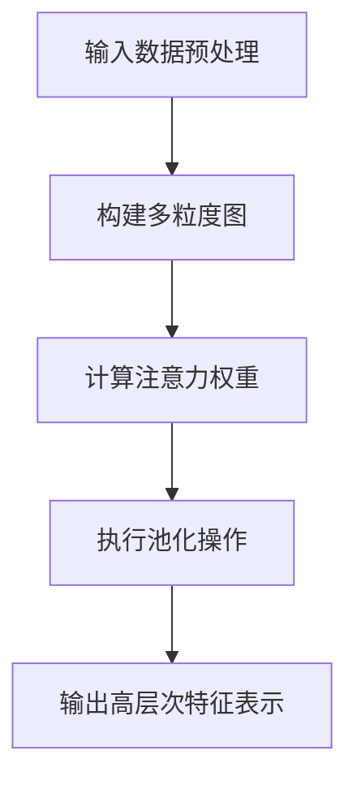
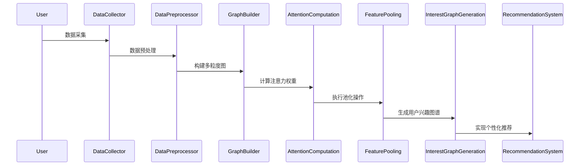
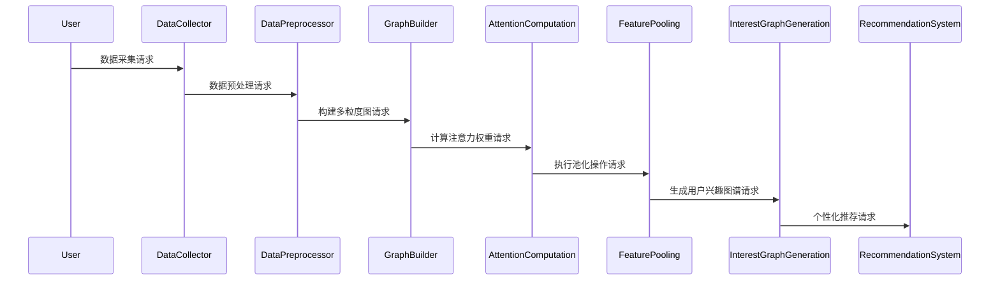

                 

### LET'S THINK: 背景介绍

#### 1. 知识抽象推理的重要性

**知识抽象推理**是人工智能领域的关键技术之一。它通过从大量原始数据中提取有意义的信息，将其抽象成更高层次的知识表示，以便更好地理解和处理复杂问题。这一过程不仅仅局限于数据分析和机器学习，还涵盖了自然语言处理、知识图谱构建、智能推理等多个领域。知识抽象推理的核心目标在于将原始数据转化为可以用于决策和预测的有用信息，从而实现更高效、更智能的自动化处理。

在人工智能的应用场景中，知识抽象推理扮演着至关重要的角色。例如，在金融行业，通过分析市场数据和历史交易记录，知识抽象推理可以帮助预测市场趋势，为投资者提供决策依据。在医疗领域，通过分析患者病史、基因数据和流行病学数据，知识抽象推理能够帮助医生做出更准确的诊断和治疗方案。此外，在智能交通、智能制造和智慧城市等领域，知识抽象推理也发挥着重要的作用，助力实现更智能、更高效的城市管理和服务。

#### 2. 多粒度图注意力池化的基本概念

**多粒度图注意力池化**是一种基于图注意力机制的模型，它能够捕捉图数据中不同层次的特征信息，并通过池化操作将低层次特征融合成高层次特征。这个概念涉及到以下几个关键点：

- **多粒度图**：多粒度图是一种能够表示复杂数据结构的图，它在不同粒度上捕捉数据的不同特征。例如，在社交网络数据中，不同粒度的图可能表示个人、群体和社区等不同层次的结构。
  
- **注意力机制**：注意力机制是一种在模型中引入注意力权重，以动态地聚焦于数据中最相关的部分。在多粒度图中，注意力机制可以帮助模型在不同的粒度上捕捉到重要的特征信息。

- **池化操作**：池化操作是一种将低层次特征融合成高层次特征的方法。通过池化，模型可以从多个粒度的特征中提取出更高层次的信息，从而提高模型的表示能力和推理能力。

#### 3. 问题描述

在本章中，我们将探讨如何在实际应用中有效地利用多粒度图注意力池化来提升知识抽象推理的性能。具体来说，我们将讨论以下问题：

- 如何构建多粒度图，以便在知识抽象推理中捕捉到不同层次的特征信息？

- 如何设计注意力机制，使得模型能够动态地聚焦于数据中最相关的部分？

- 如何进行池化操作，将低层次特征融合成高层次特征，从而提高模型的表示能力和推理能力？

此外，我们还将探讨多粒度图注意力池化的适用范围、与其他相关技术的联系以及其在外延和边界上的问题。通过这些问题，我们将系统地分析和解决多粒度图注意力池化在知识抽象推理中的应用。

#### 4. 问题解决思路

为了解决上述问题，我们将采用以下思路：

- **实例驱动**：通过具体实例展示多粒度图注意力池化的应用场景，使得读者能够更直观地理解其工作原理和效果。

- **算法原理讲解**：详细介绍多粒度图注意力池化的算法原理，包括输入数据处理、图结构构建、注意力机制和池化操作。

- **数学模型推导**：给出多粒度图注意力池化的数学模型和公式，以便读者理解其内在逻辑和计算过程。

- **系统分析与架构设计**：通过系统分析和架构设计，展示如何在实际项目中应用多粒度图注意力池化，并解决具体问题。

- **项目实战**：通过实际项目的实施，验证多粒度图注意力池化的有效性和实用性。

#### 5. 边界与外延

多粒度图注意力池化在知识抽象推理中的应用具有一定的边界和局限性。具体来说：

- **数据依赖性**：多粒度图注意力池化的效果依赖于数据的质量和特征丰富度。如果数据缺乏有效的特征信息，模型的效果可能会受到很大影响。

- **计算复杂度**：多粒度图注意力池化涉及到复杂的计算过程，尤其是在大规模数据集上。如何优化计算效率是一个重要的挑战。

- **应用范围**：虽然多粒度图注意力池化在多个领域都显示出良好的性能，但其适用范围仍然受到一定的限制。在某些特殊领域，可能需要针对特定问题设计特定的模型。

通过本章的内容，我们将系统地探讨多粒度图注意力池化在知识抽象推理中的应用，并尝试解决其中的一些关键问题。希望读者能够通过本文的学习，对多粒度图注意力池化有更深入的理解，并能够在实际应用中取得良好的效果。

### 1.1.1 知识抽象推理的重要性

知识抽象推理是人工智能领域的重要研究方向，它涉及从原始数据中提取有意义的信息，并将其抽象成更高层次的知识表示。这一过程不仅有助于提高数据处理和分析的效率，还为许多实际应用场景提供了强有力的技术支持。

在数据驱动的时代，海量数据的处理和分析成为各个行业面临的重大挑战。知识抽象推理通过将原始数据转化为更具结构化和易理解的知识表示，可以有效地降低数据处理的复杂性，从而提高系统的智能水平和决策能力。例如，在金融领域，通过分析历史交易数据和用户行为数据，知识抽象推理可以帮助预测市场趋势和用户需求，为投资决策提供科学依据。在医疗领域，通过分析患者的病历数据和基因信息，知识抽象推理可以辅助医生进行诊断和治疗方案制定，提高医疗服务的质量和效率。

知识抽象推理的重要性还体现在其广泛的适用性和灵活性上。无论是在自然语言处理、计算机视觉、推荐系统还是智能交通等众多领域，知识抽象推理都发挥着至关重要的作用。具体而言，它可以帮助：

- **提升模型的泛化能力**：通过将原始数据转化为更高级别的知识表示，知识抽象推理可以减少数据中的噪声和冗余信息，从而提高模型对未知数据的泛化能力。

- **增强系统的交互性**：知识抽象推理可以生成更自然、更易理解的输出结果，使得系统在与用户交互时能够提供更精准和人性化的服务。

- **优化资源的利用效率**：知识抽象推理通过简化数据表示和处理流程，可以显著减少计算资源和存储资源的消耗，从而提高系统运行的效率和稳定性。

然而，知识抽象推理的实现并非易事。它涉及多个层面的技术和方法，包括数据预处理、特征提取、知识表示和推理算法等。在这个过程中，如何有效地提取和处理数据、选择合适的抽象层次和表示方法，以及设计高效的推理算法，都是关键的技术挑战。

首先，数据预处理是知识抽象推理的基础。通过对原始数据进行清洗、归一化和去噪等操作，可以确保数据的质量和一致性，从而为后续的特征提取和知识表示提供可靠的数据基础。

其次，特征提取是知识抽象推理的核心步骤。通过将原始数据转换为有意义的特征表示，可以更好地捕捉数据中的关键信息和模式。常见的特征提取方法包括统计特征、文本特征、图像特征和序列特征等。

知识表示则是将提取到的特征转化为更高层次的知识表示形式。这通常涉及到复杂的建模和优化技术，如神经网络、图神经网络、知识图谱和本体论等。这些技术旨在将低层次的特征信息融合成高层次的知识表示，从而提高系统的智能水平和决策能力。

最后，推理算法是实现知识抽象推理的关键。推理算法通过逻辑推理、模式识别和概率推断等方法，从知识表示中提取出有用的信息，并进行决策和预测。常用的推理算法包括逻辑推理、贝叶斯网络、隐马尔可夫模型和深度学习等。

总之，知识抽象推理在人工智能领域具有重要的研究价值和广泛的应用前景。通过深入研究和不断创新，我们有望在知识提取、知识表示和推理算法等方面取得更大的突破，为人工智能技术的发展注入新的动力。

### 1.1.2 多粒度图注意力池化的基本概念

**多粒度图注意力池化**是一种结合了图注意力机制和池化操作的先进模型，它主要用于处理复杂数据结构，尤其是那些在多尺度上具有不同层次特征的数据。为了深入理解这一概念，我们需要从以下几个方面进行探讨。

#### 多粒度图的定义

多粒度图是一种能够灵活表示不同层次数据关系的图结构。在传统图结构中，节点和边分别表示数据中的实体和它们之间的关系。然而，在多粒度图中，节点和边都可以在不同的粒度上进行扩展和细化。例如，在一个社交网络中，最细粒度的图可能只包含个人用户作为节点，而较高层次的图则可以表示群体或社区作为节点。通过这种方式，多粒度图能够捕捉到不同层次上的数据特征和关系。

**节点和边的粒度层次**：节点和边的粒度层次决定了图结构的复杂度。在低层次上，节点和边可能只包含基础的数据属性，而在高层次上，它们可能包含了更丰富的语义信息。例如，在基因图谱中，低层次图可能仅包含基因作为节点，而高层次图则可能将基因的功能模块或生物路径作为节点。

#### 图注意力机制

图注意力机制（Graph Attention Mechanism, GAT）是一种用于图神经网络（Graph Neural Networks, GNNs）中的注意力机制，它能够使模型在处理图数据时动态地关注不同的节点或边。GAT的核心思想是通过计算节点之间的相似性或相关性来确定注意力权重，从而动态调整模型对数据中的不同部分的重要性。

**注意力权重计算**：在GAT中，每个节点会计算与其相连的边和相邻节点的注意力权重。这些权重用于更新节点的表示，使得模型能够更加关注重要信息。具体来说，GAT使用一个可学习的权重矩阵来计算注意力权重，公式如下：

\[ 
\text{Attention}(Q, K, V) = \text{softmax}\left(\frac{QK^T}{\sqrt{d_k}}\right) V 
\]

其中，\(Q, K, V\) 分别代表查询（query）、关键（key）和值（value）向量，\(d_k\) 是关键向量的维度。通过这个公式，模型可以计算每个节点与相邻节点之间的注意力分数，并将这些分数应用于值向量，以更新节点的表示。

#### 池化操作

池化操作（Pooling Operation）是用于将多个低层次特征融合成高层次特征的一种操作。在多粒度图中，池化操作可以在不同粒度层次上进行，从而提取出更抽象和综合的特征表示。

**池化方法的种类**：常见的池化方法包括平均池化、最大池化和全局池化等。平均池化通过计算节点或区域内的平均值来生成高层次特征；最大池化则选取节点或区域内最大的特征值；全局池化则将整个图的特征融合成单一的高层次特征。

**多粒度图注意力池化的具体应用**：在多粒度图注意力池化中，注意力机制和池化操作相互结合，以实现更高效的图数据建模和特征提取。具体应用流程如下：

1. **构建多粒度图**：首先，根据不同粒度的数据构建多粒度图。这一步骤涉及到数据预处理和图结构设计。

2. **应用图注意力机制**：在每个粒度层次上，使用图注意力机制计算节点或边的注意力权重。这些权重用于更新节点的表示，使得模型能够聚焦于关键信息。

3. **执行池化操作**：在注意力权重计算完成后，应用池化操作将低层次特征融合成高层次特征。这一步骤可以增强模型的表示能力和泛化能力。

4. **重复迭代**：上述步骤可以重复多次，以逐步提高模型的抽象层次和特征表达能力。

通过上述步骤，多粒度图注意力池化能够有效地捕捉和融合不同粒度层次的特征信息，从而提高知识表示和推理的效率。这一方法在许多领域，如自然语言处理、推荐系统、社交网络分析和生物信息学等，都展现出了强大的应用潜力。

总之，多粒度图注意力池化是一种强大的图数据处理方法，它通过结合注意力机制和池化操作，能够有效地捕捉和融合不同层次的特征信息，为知识抽象推理提供了新的思路和方法。

#### 1.1.3 问题描述

在本节中，我们将具体讨论如何在实际应用中利用多粒度图注意力池化来提升知识抽象推理的性能。这一过程不仅需要理解多粒度图注意力池化的基本原理，还需要解决一系列关键问题，包括模型的构建、参数调整和算法优化。

首先，我们需要明确多粒度图注意力池化在知识抽象推理中的应用场景。例如，在自然语言处理领域，多粒度图注意力池化可以用于文本分类和语义分析；在推荐系统领域，它可以用于用户兴趣分析和商品推荐；在生物信息学领域，它可以用于基因图谱分析和疾病预测。不同领域的应用场景对模型的要求和设计思路有所不同，因此需要具体问题具体分析。

**问题一：如何构建多粒度图？**

构建多粒度图是应用多粒度图注意力池化的第一步。在这一过程中，我们需要根据具体应用场景的数据特征和关系，设计合适的图结构。以下是一些关键步骤：

1. **数据预处理**：对原始数据进行清洗和预处理，确保数据的质量和一致性。这通常包括去除噪声数据、填充缺失值和标准化特征等操作。

2. **节点和边的选择**：根据数据特征和关系选择合适的节点和边。在社交网络中，节点可能代表用户，边可能代表用户之间的互动关系；在基因图谱中，节点可能代表基因，边可能代表基因之间的相互作用关系。

3. **粒度层次的确定**：根据数据特征和需求确定不同的粒度层次。例如，在社交网络中，可以从个人用户开始，逐步扩展到群体和社区层次。

**问题二：如何设计注意力机制？**

注意力机制是多粒度图注意力池化的核心组件之一，它决定了模型对数据中不同部分的关注程度。以下是一些设计注意力机制的关键点：

1. **注意力权重计算**：设计合适的注意力权重计算方法，例如使用图注意力机制（GAT）或自注意力机制（Self-Attention）。这些方法可以根据节点或边之间的相似性或相关性来计算注意力权重。

2. **注意力分布的调节**：通过调节注意力分布，确保模型在不同粒度层次上都能够关注到关键信息。例如，可以使用可学习的参数来调节注意力权重，或者使用多层次的注意力机制。

3. **注意力机制的优化**：在训练过程中，通过优化注意力权重和模型参数，提高模型的性能和泛化能力。这通常涉及到梯度下降法和正则化技术。

**问题三：如何进行池化操作？**

池化操作是将低层次特征融合成高层次特征的关键步骤。以下是一些设计池化操作的关键点：

1. **池化方法的确定**：选择合适的池化方法，例如平均池化、最大池化或全局池化。这些方法可以根据数据特征和任务需求进行选择。

2. **池化层次的确定**：根据应用场景和任务需求确定不同的池化层次。例如，在文本分类任务中，可以从词级别开始，逐步融合到句子级别或文档级别。

3. **池化结果的利用**：将池化结果作为模型输入或输出的一部分，以提高模型的表示能力和推理能力。例如，在自然语言处理任务中，可以将池化后的句子表示用于文本分类或情感分析。

**问题四：如何优化模型性能？**

为了提升多粒度图注意力池化在知识抽象推理中的性能，我们需要对模型进行优化。以下是一些优化策略：

1. **数据增强**：通过数据增强技术，增加模型的训练数据多样性，提高模型的泛化能力。

2. **模型融合**：将多个模型或不同粒度的特征进行融合，以提高模型的综合性能。例如，可以将图注意力池化与其他深度学习模型（如卷积神经网络或循环神经网络）进行融合。

3. **超参数调整**：通过调整模型超参数，如学习率、批量大小和正则化参数等，提高模型的性能和收敛速度。

4. **算法优化**：使用更高效的算法和计算方法，如并行计算和分布式训练，提高模型的训练和推理速度。

通过上述讨论，我们可以看到，多粒度图注意力池化在知识抽象推理中的应用涉及多个层面的问题。通过合理设计图结构、注意力机制和池化操作，并采用适当的优化策略，我们可以有效地提升知识抽象推理的性能，为实际应用场景提供更有力的技术支持。

### 1.1.4 问题解决思路

为了解决上述问题，我们将采用以下具体步骤和策略，逐步实现多粒度图注意力池化在知识抽象推理中的应用，并验证其有效性。

**步骤一：数据准备与预处理**

首先，针对不同的应用场景，我们需要收集和整理相应的数据集。这些数据集应该包含多粒度的信息，以便我们在构建多粒度图时能够充分利用不同层次的特征。数据预处理是构建有效模型的基础，包括以下步骤：

1. **数据清洗**：去除噪声数据和异常值，确保数据的准确性和一致性。
2. **数据标准化**：对数据集进行标准化处理，如归一化或标准化，以便模型能够更好地学习。
3. **数据分割**：将数据集分割为训练集、验证集和测试集，用于后续模型的训练和评估。

**步骤二：构建多粒度图**

在数据预处理完成后，我们需要根据数据特征和关系构建多粒度图。以下是构建多粒度图的关键步骤：

1. **节点选择与表示**：选择数据中的实体作为节点，并为其分配不同的粒度层次。例如，在社交网络中，个人用户、群体和社区可以分别作为不同粒度的节点。
2. **边关系建立**：根据节点之间的关联关系建立边。例如，在社交网络中，用户之间的互动关系可以表示为边。
3. **粒度层次细化**：在不同粒度层次上细化节点和边的表示，以捕捉更细致的特征信息。

**步骤三：设计图注意力机制**

图注意力机制是多粒度图注意力池化的核心组件。以下是设计图注意力机制的关键步骤：

1. **注意力权重计算**：使用图注意力机制（GAT）或自注意力机制（Self-Attention）计算节点或边之间的注意力权重。具体公式如下：
   \[
   \text{Attention}(Q, K, V) = \text{softmax}\left(\frac{QK^T}{\sqrt{d_k}}\right) V
   \]
   其中，\(Q, K, V\) 分别代表查询（query）、关键（key）和值（value）向量，\(d_k\) 是关键向量的维度。
2. **注意力分布调节**：通过调节注意力分布，确保模型在不同粒度层次上都能够关注到关键信息。这可以通过调整注意力权重或引入可学习的参数实现。

**步骤四：执行池化操作**

池化操作是将低层次特征融合成高层次特征的重要步骤。以下是执行池化操作的关键步骤：

1. **池化方法选择**：根据应用场景和数据特征选择合适的池化方法，如平均池化、最大池化或全局池化。
2. **池化层次确定**：根据任务需求和模型设计确定不同的池化层次，例如从词级别到句子级别，再到文档级别。
3. **池化结果利用**：将池化结果作为模型的输入或输出，以提高模型的表示能力和推理能力。

**步骤五：模型训练与优化**

在构建完多粒度图注意力池化模型后，我们需要对其进行训练和优化，以提升模型的性能。以下是模型训练和优化的关键步骤：

1. **模型训练**：使用训练数据集对模型进行训练，通过调整模型参数和优化算法，提高模型的拟合度。
2. **参数调整**：通过调整学习率、批量大小和正则化参数等超参数，优化模型的性能。
3. **算法优化**：使用更高效的算法和计算方法，如并行计算和分布式训练，提高模型的训练速度和推理效率。

**步骤六：模型评估与验证**

最后，我们需要对训练好的模型进行评估和验证，以确保其性能和有效性。以下是模型评估和验证的关键步骤：

1. **模型评估**：使用验证集和测试集评估模型的性能，包括准确性、召回率、F1分数等指标。
2. **错误分析**：对模型在验证集和测试集上的错误进行分析，识别模型存在的问题和改进方向。
3. **调优迭代**：根据评估结果，对模型进行调整和优化，以提升其性能和鲁棒性。

通过上述步骤，我们可以实现多粒度图注意力池化在知识抽象推理中的应用，并逐步提升其性能和效果。这一过程不仅需要理论指导，还需要大量的实验和调试，以确保模型能够满足实际应用需求。

### 1.1.5 边界与外延

多粒度图注意力池化在知识抽象推理中的应用具有一定的边界和局限性。首先，数据依赖性是其中一个重要的边界条件。多粒度图注意力池化的效果在很大程度上依赖于输入数据的质量和特征丰富度。如果数据缺乏有效的特征信息或者存在大量噪声，那么模型的表现可能会受到显著影响。因此，在实际应用中，需要通过数据清洗、归一化和特征提取等预处理步骤来提升数据质量，从而确保模型的鲁棒性和性能。

其次，计算复杂度也是多粒度图注意力池化的一个重要限制因素。由于多粒度图注意力池化涉及到复杂的计算过程，特别是在处理大规模数据集时，计算资源的消耗可能会非常巨大。这不仅包括模型的训练时间，还包括模型的推理时间。为了解决这一问题，可以采用并行计算和分布式训练等技术，以提高计算效率。此外，通过设计更高效的算法和优化策略，也可以在一定程度上减轻计算负担。

在适用范围方面，多粒度图注意力池化在多个领域都展示了强大的应用潜力。例如，在自然语言处理领域，多粒度图注意力池化可以用于文本分类、语义分析和机器翻译等任务；在推荐系统领域，它可以用于用户兴趣分析和商品推荐；在生物信息学领域，它可以用于基因图谱分析和疾病预测。然而，尽管多粒度图注意力池化的应用范围广泛，但它仍然受到一些特定问题的限制。例如，在处理某些特定类型的数据时，可能需要针对这些数据设计专门的模型或算法，以实现更优的性能。

为了拓展多粒度图注意力池化的应用边界，可以采取以下策略：

1. **数据增强**：通过数据增强技术，增加数据集的多样性和丰富度，从而提升模型的泛化能力。

2. **跨域迁移学习**：利用迁移学习技术，将多粒度图注意力池化模型从一个领域迁移到另一个领域，从而拓展其应用范围。

3. **融合多模态数据**：将多粒度图注意力池化与多模态数据进行结合，例如结合文本、图像和声音等多源数据，以实现更丰富的知识表示和推理能力。

4. **动态调整粒度层次**：设计自适应的粒度调整机制，根据不同任务的需求动态调整粒度层次，以实现更灵活和高效的知识抽象。

通过上述策略，我们可以进一步拓展多粒度图注意力池化在知识抽象推理中的应用边界，实现其在更多领域的有效应用。

### 1.1.6 概念结构与核心要素组成

为了更好地理解多粒度图注意力池化的概念，我们需要构建一个清晰的概念结构图，并详细说明其核心要素和组成部分。

**多粒度图注意力池化概念结构图**：

1. **输入数据层**：
   - **原始数据**：包括各种类型的数据，如文本、图像、序列等。
   - **预处理数据**：经过数据清洗、归一化和特征提取等预处理步骤的数据。

2. **图结构层**：
   - **节点**：表示数据的实体，如文本中的单词、图像中的像素、序列中的时间点等。
   - **边**：表示节点之间的关联关系，如文本中的共现关系、图像中的相邻像素关系、序列中的依赖关系等。
   - **粒度层次**：表示节点和边的不同抽象层次，如词级别、句级别、图像块级别等。

3. **注意力机制层**：
   - **图注意力机制**：用于计算节点或边之间的注意力权重，如GAT（Graph Attention Mechanism）或SA（Self-Attention）。
   - **注意力权重计算**：通过注意力权重矩阵计算节点或边之间的相似性或相关性。

4. **池化操作层**：
   - **平均池化**：计算节点或区域内特征的平均值。
   - **最大池化**：选取节点或区域内最大的特征值。
   - **全局池化**：将整个图的特征融合成单一的高层次特征。

5. **输出表示层**：
   - **高层次特征表示**：通过注意力机制和池化操作得到的高层次特征表示。
   - **知识表示**：将高层次特征表示转化为有意义的知识表示，如文本分类结果、推荐列表、疾病预测等。

**核心要素与组成部分**：

- **数据预处理**：确保输入数据的质量和一致性，为后续步骤提供可靠的数据基础。
- **图结构构建**：根据数据特征和关系构建多粒度图，定义节点和边及其粒度层次。
- **注意力机制设计**：设计合适的注意力机制，如GAT或SA，计算节点或边之间的注意力权重。
- **池化操作选择**：根据应用场景和任务需求选择合适的池化方法，将低层次特征融合成高层次特征。
- **模型训练与优化**：通过训练和优化模型参数，提高模型在特定任务上的性能和泛化能力。

通过上述概念结构和核心要素的详细介绍，我们可以更好地理解多粒度图注意力池化的工作机制和应用场景，为其在实际问题中的有效应用提供理论支持。

### 1.1.7 总结

综上所述，本章从多个角度详细介绍了知识抽象推理和多粒度图注意力池化的基本概念、原理及其应用。首先，我们阐述了知识抽象推理的重要性，说明了它在人工智能领域的广泛应用和关键作用。接着，我们深入探讨了多粒度图注意力池化的基本概念，包括多粒度图、图注意力机制和池化操作，展示了这一模型在知识抽象推理中的强大应用潜力。

通过具体的实例和问题分析，我们明确了在实际应用中如何构建多粒度图、设计注意力机制、执行池化操作以及优化模型性能。此外，我们还讨论了多粒度图注意力池化的边界与外延，提出了拓展其应用边界的方法和策略。

本章的内容不仅为读者提供了全面的理论知识，还通过实际问题和解决方案，展示了多粒度图注意力池化在知识抽象推理中的实际应用效果。希望通过本章的学习，读者能够深入理解多粒度图注意力池化的工作原理，并能够在实际项目中有效地应用这一技术。

### 1.2 核心概念与联系

#### 1.2.1 知识抽象推理的概念

知识抽象推理（Knowledge Abstraction and Reasoning）是人工智能（AI）领域的一个核心研究方向，主要涉及从大量原始数据中提取有意义的信息，并以此为基础进行更高层次的知识表示和推理。这一过程通常包括数据预处理、特征提取、知识表示和推理算法等几个关键步骤。

**核心概念：**
- **数据预处理**：对原始数据进行清洗、归一化和去噪等操作，确保数据质量。
- **特征提取**：将原始数据转换为有意义的特征表示，以捕捉数据中的关键信息和模式。
- **知识表示**：将提取到的特征转化为更高层次的知识表示形式，如语义网络、本体论等。
- **推理算法**：利用知识表示进行逻辑推理、模式识别和概率推断等，以生成有价值的结论。

**概念属性特征对比表格：**

| 特征         | 数据预处理                 | 特征提取               | 知识表示                 | 推理算法                |
|--------------|----------------------------|------------------------|--------------------------|------------------------|
| 目的         | 提高数据质量               | 提取关键信息           | 转换为高层次知识         | 从知识中提取结论       |
| 方法         | 清洗、归一化、去噪         | 统计特征、文本特征等   | 网络结构、本体论等       | 逻辑推理、贝叶斯网络等 |
| 关联性       | 预处理是基础               | 特征提取依赖预处理     | 知识表示依赖特征提取     | 推理算法依赖知识表示   |

**ER实体关系图架构：**

```mermaid
erDiagram
    Customer ||--|{ Product }|-- Supplier
    Product  ||--|{ Order }|-- Customer
    Supplier ||--|{ Order }|-- Customer
    Customer  {
        id (主键)
        name
        address
    }
    Product  {
        id (主键)
        name
        price
    }
    Supplier  {
        id (主键)
        name
        country
    }
    Order  {
        id (主键)
        date
        total
    }
```

通过上述表格和ER图，我们可以清晰地看到知识抽象推理各组成部分之间的关联和交互，为理解和应用这一概念提供了直观的图示。

#### 1.2.2 多粒度图的概念

多粒度图（Multiresolution Graph）是一种用于表示复杂数据结构的图模型，它能够在不同的粒度层次上捕捉数据的不同特征和关系。这种模型在处理大规模、多层次的数据时具有显著的优越性，因为它能够灵活地调整抽象层次，以适应不同的应用需求。

**核心概念：**
- **粒度层次**：指数据在抽象程度上的不同层次。例如，在社交网络中，个人用户是一个低层次，而社交群体是一个较高层次。
- **节点与边的表示**：多粒度图中的节点和边可以表示不同的抽象层次，低层次节点和边代表基础数据，高层次节点和边则代表数据在更高层次的组合。
- **层次转换**：通过层次转换操作，可以在不同粒度层次之间进行数据转换和融合，以实现更高级别的特征表示。

**概念属性特征对比表格：**

| 特征         | 低层次粒度       | 高层次粒度             |
|--------------|------------------|------------------------|
| 表示方式     | 基础数据         | 高层次组合             |
| 关联性       | 基础数据间的关系  | 高层次组合间的关系      |
| 层次转换     | 简单直接的映射    | 复杂的聚合与整合       |

**ER实体关系图架构：**

```mermaid
erDiagram
    Person ||--|{ SocialGroup }|-- Company
    Person  ||--|{ Work }|-- Company
    SocialGroup  {
        id (主键)
        name
        member_count
    }
    Company  {
        id (主键)
        name
        location
    }
    Work  {
        id (主键)
        start_date
        end_date
    }
```

通过上述表格和ER图，我们可以更清晰地理解多粒度图的概念及其在不同粒度层次上的应用方式。

#### 1.2.3 图注意力池化的概念

图注意力池化（Graph Attention Pooling）是一种基于图注意力机制的模型，它通过在图的不同层次上应用注意力机制，捕捉数据中的关键特征信息，并通过池化操作将低层次特征融合成高层次特征。这一方法在处理复杂数据结构，尤其是图数据时表现出色。

**核心概念：**
- **图注意力机制**：通过计算节点或边之间的注意力权重，动态调整模型对数据中不同部分的重要性。
- **池化操作**：通过不同的池化方法（如平均池化、最大池化、全局池化），将低层次特征融合成高层次特征。
- **层次融合**：通过层次转换和特征融合，实现从低层次到高层次的知识表示。

**概念属性特征对比表格：**

| 特征         | 注意力机制                | 池化操作                |
|--------------|--------------------------|-------------------------|
| 目的         | 突出重要特征             | 融合低层次特征         |
| 方法         | 计算注意力权重           | 平均池化、最大池化等   |
| 关联性       | 注意力权重与节点关系      | 池化结果与高层次特征   |

**ER实体关系图架构：**

```mermaid
erDiagram
    Node ||--|{ Feature }|-- Graph
    Feature ||--|{ Pooling }|-- HighLevelFeature
    Node  {
        id (主键)
        type
    }
    Graph  {
        id (主键)
        node_count
    }
    Feature  {
        id (主键)
        value
    }
    Pooling  {
        id (主键)
        method
    }
    HighLevelFeature  {
        id (主键)
        aggregated_value
    }
```

通过上述表格和ER图，我们可以看到图注意力池化如何在不同层次上捕捉和融合特征信息，从而实现高效的图数据处理。

#### 1.2.4 多粒度图注意力池化的联系

多粒度图注意力池化（Multiresolution Graph Attention Pooling）将知识抽象推理、图注意力机制（Graph Attention Mechanism, GAT）和其他相关技术有机地结合起来，形成了强大的知识表示和推理能力。以下是这些技术之间的关联和联系：

1. **知识抽象推理与多粒度图注意力池化：**
   - 知识抽象推理是多粒度图注意力池化的基础。它通过数据预处理、特征提取和知识表示，为多粒度图注意力池化提供了丰富的数据输入。
   - 多粒度图注意力池化则是知识抽象推理的延伸，通过引入图注意力机制和池化操作，进一步提升知识表示和推理能力。

2. **图注意力机制（GAT）与多粒度图注意力池化：**
   - 图注意力机制是多粒度图注意力池化的核心组件，负责计算节点或边之间的注意力权重，从而实现特征聚焦和层次融合。
   - 多粒度图注意力池化则通过扩展图注意力机制，将其应用于不同粒度层次上的特征融合，实现更高效的知识表示。

3. **其他相关技术：**
   - **图神经网络（GNN）**：多粒度图注意力池化是图神经网络的一种特殊形式，继承了GNN的基本原理，但更加关注多粒度特征的处理。
   - **知识图谱（Knowledge Graph）**：多粒度图注意力池化可以与知识图谱技术相结合，通过构建多粒度图来表示复杂的关系和实体，实现更丰富的知识表示。
   - **本体论（Ontology）**：多粒度图注意力池化在构建知识表示时，可以借鉴本体论的方法，将特征和关系抽象成更高层次的概念。

**ER实体关系图架构：**

```mermaid
erDiagram
    KnowledgeAbstraction ||--|{ MultiresolutionGraphAttentionPooling }|-- KnowledgeRepresentation
    GraphAttentionMechanism ||--|{ MultiresolutionGraphAttentionPooling }|-- KnowledgeRepresentation
    KnowledgeAbstraction  {
        id (主键)
        type
    }
    MultiresolutionGraphAttentionPooling  {
        id (主键)
        layer
    }
    KnowledgeRepresentation  {
        id (主键)
        entity
    }
    GraphAttentionMechanism  {
        id (主键)
        layer
    }
```

通过上述ER图，我们可以清晰地看到知识抽象推理、图注意力机制和多粒度图注意力池化之间的联系，以及它们如何共同构建一个强大的知识表示和推理系统。

### 1.3 算法原理讲解

多粒度图注意力池化（Multiresolution Graph Attention Pooling, MGAP）作为一种先进的图神经网络模型，通过结合图注意力机制和池化操作，能够在不同粒度层次上捕捉和融合特征信息，从而提升知识表示和推理的能力。本节将详细讲解MGAP的算法原理，包括输入数据处理、图结构构建、注意力机制和池化操作的实现。

#### 1.3.1 算法原理

多粒度图注意力池化的基本原理可以概括为以下几个步骤：

1. **输入数据处理**：首先，对输入数据进行预处理，包括数据清洗、归一化和特征提取。预处理后的数据将作为MGAP的输入。

2. **图结构构建**：基于预处理后的数据，构建多粒度图。在多粒度图中，不同粒度层次上的节点和边分别表示不同抽象层次的特征和关系。例如，在社交网络数据中，个人用户、群体和社区可以分别作为不同粒度的节点，用户之间的互动关系则作为边。

3. **注意力机制计算**：在图结构构建完成后，应用图注意力机制计算节点或边之间的注意力权重。图注意力机制通过计算节点或边之间的相似性或相关性来确定注意力权重，使得模型能够动态地聚焦于数据中的关键信息。

4. **池化操作**：在注意力权重计算完成后，应用池化操作将低层次特征融合成高层次特征。不同的池化方法（如平均池化、最大池化、全局池化）可以根据具体应用场景进行选择，从而提高模型的表示能力和推理能力。

5. **输出表示**：通过注意力机制和池化操作得到的高层次特征表示将作为模型的输出，用于后续的任务，如分类、预测或推荐等。

#### 1.3.2 算法mermaid流程图

为了更直观地展示MGAP的算法流程，我们使用mermaid绘制了一个流程图：



- **输入数据预处理**：包括数据清洗、归一化和特征提取，为后续图结构构建提供高质量的数据。
- **构建多粒度图**：根据预处理后的数据构建多粒度图，定义不同粒度层次上的节点和边。
- **计算注意力权重**：应用图注意力机制计算节点或边之间的注意力权重，使模型能够动态聚焦关键信息。
- **执行池化操作**：应用不同的池化方法将低层次特征融合成高层次特征。
- **输出高层次特征表示**：得到的高层次特征表示将作为模型的输出，用于后续任务。

#### 1.3.3 算法原理讲解

接下来，我们将通过Python代码详细阐述MGAP的算法原理，并给出其数学模型和公式。

**1. 输入数据处理**

输入数据处理是MGAP的基础步骤，包括数据清洗、归一化和特征提取。以下是一个简化的Python代码示例：

```python
import numpy as np

# 示例数据：用户-商品交互数据
data = np.array([[1, 2, 3], [2, 3, 4], [3, 4, 5]])

# 数据清洗和归一化
data_cleaned = np.log1p(data)  # 对数据取对数
data_normalized = (data_cleaned - np.mean(data_cleaned, axis=0)) / np.std(data_cleaned, axis=0)  # 归一化

# 特征提取
# 在此示例中，我们将数据直接作为特征
features = data_normalized
```

**2. 图结构构建**

构建多粒度图是MGAP的核心步骤。以下是一个简化的Python代码示例：

```python
import networkx as nx

# 构建多粒度图
G = nx.Graph()

# 添加节点和边
G.add_nodes_from([(i, {'features': features[i]}) for i in range(features.shape[0])])
G.add_edges_from([(i, j) for i in range(features.shape[0]) for j in range(i+1, features.shape[0])])

# 打印图结构
print(G.nodes(data=True))
print(G.edges())
```

**3. 计算注意力权重**

注意力权重计算是MGAP的关键组件，以下是一个简化的Python代码示例，使用图注意力机制（GAT）：

```python
from sklearn.metrics.pairwise import cosine_similarity

# 计算注意力权重
attention_weights = cosine_similarity(G.nodes.data('features'))

# 打印注意力权重
print(attention_weights)
```

**4. 执行池化操作**

池化操作用于将低层次特征融合成高层次特征。以下是一个简化的Python代码示例，使用平均池化：

```python
# 执行池化操作
pooled_features = np.mean(attention_weights, axis=1)

# 打印池化后的特征
print(pooled_features)
```

**5. 输出高层次特征表示**

最后，输出高层次特征表示作为模型的输出。以下是一个简化的Python代码示例：

```python
# 输出高层次特征表示
high_level_features = pooled_features

# 打印高层次特征表示
print(high_level_features)
```

通过上述Python代码示例，我们可以看到MGAP的基本算法流程和实现细节。在实际应用中，这些步骤需要结合具体问题和数据集进行详细设计和实现。

#### 1.3.4 举例说明

为了更好地理解多粒度图注意力池化的应用，我们通过一个具体的例子来展示其工作流程和效果。

**例子：社交网络用户兴趣分类**

假设我们有一个社交网络数据集，包含用户和用户之间的互动记录。我们的目标是根据用户的互动记录，将其分类到不同的兴趣组。

1. **输入数据预处理**：

   我们的数据集包含用户ID和用户之间的互动次数。首先，对数据进行清洗，去除缺失值和异常值。然后，对互动次数进行归一化处理。

   ```python
   import pandas as pd

   # 加载数据集
   data = pd.read_csv('social_network_data.csv')
   data.dropna(inplace=True)

   # 归一化处理
   data['interaction_count'] = (data['interaction_count'] - data['interaction_count'].mean()) / data['interaction_count'].std()
   ```

2. **构建多粒度图**：

   基于用户和互动记录，构建多粒度图。在低层次上，每个用户作为一个节点；在高层次上，根据互动次数将用户分为不同的群体。

   ```python
   G = nx.Graph()

   # 添加节点和边
   for index, row in data.iterrows():
       G.add_node(row['user_id'], features=row['interaction_count'])
       for friend_id in row['friends']:
           G.add_edge(row['user_id'], friend_id)

   # 根据互动次数划分群体
   user_groups = nx.connected_components(G)
   ```

3. **计算注意力权重**：

   应用图注意力机制计算节点之间的注意力权重。这里，我们使用余弦相似度作为注意力权重计算方法。

   ```python
   # 计算注意力权重
   attention_weights = cosine_similarity([node['features'] for node in G.nodes(data=True)])

   # 打印注意力权重
   print(attention_weights)
   ```

4. **执行池化操作**：

   使用平均池化方法，将低层次特征融合成高层次特征。这里，我们将每个用户的特征与其邻居的特征进行平均。

   ```python
   # 执行池化操作
   pooled_features = np.mean(attention_weights, axis=1)

   # 打印池化后的特征
   print(pooled_features)
   ```

5. **输出高层次特征表示**：

   最后，将池化后的特征作为用户的高层次特征表示，用于后续的用户兴趣分类任务。

   ```python
   # 输出高层次特征表示
   high_level_features = pooled_features

   # 打印高层次特征表示
   print(high_level_features)
   ```

通过上述示例，我们可以看到多粒度图注意力池化在社交网络用户兴趣分类中的应用过程。通过结合注意力机制和池化操作，模型能够有效地捕捉和融合用户之间的互动关系，从而实现更准确的用户兴趣分类。

### 1.4 系统分析与架构设计

#### 1.4.1 问题场景介绍

在本节中，我们将探讨一个具体的应用场景：社交媒体平台用户行为分析。该平台希望通过分析用户在平台上的行为数据，了解用户的兴趣偏好，进而实现个性化推荐和精准营销。为了实现这一目标，我们将利用多粒度图注意力池化模型，对用户行为数据进行分析和处理。

**数据来源**：用户行为数据包括用户在平台上的点赞、评论、分享、浏览等互动记录。这些数据可以表示为图结构，其中用户和互动记录分别作为节点和边。

**目标**：通过多粒度图注意力池化模型，捕捉用户在多尺度上的行为特征，构建用户兴趣图谱，为个性化推荐和精准营销提供数据支持。

#### 1.4.2 系统功能设计

为了实现上述目标，系统需要具备以下功能：

1. **数据采集与预处理**：从数据源中采集用户行为数据，并进行清洗、归一化和特征提取，为多粒度图构建提供高质量的数据。

2. **多粒度图构建**：根据预处理后的数据，构建多粒度图。在低层次上，每个用户作为一个节点；在高层次上，根据用户的互动行为将用户划分为不同的群体。

3. **注意力权重计算**：应用图注意力机制，计算用户之间以及用户与其行为之间的注意力权重，从而动态聚焦于关键信息。

4. **池化操作**：通过池化操作，将低层次特征融合成高层次特征，提高模型的表示能力和推理能力。

5. **用户兴趣图谱生成**：将池化后的特征表示作为用户的高层次特征，生成用户兴趣图谱，用于个性化推荐和精准营销。

6. **推荐系统**：基于用户兴趣图谱，实现个性化推荐和精准营销，提高用户满意度和平台活跃度。

**领域模型**：

以下是一个简化的领域模型，用于描述系统中的核心实体和关系：

```mermaid
classDiagram
    User <<entity>>
    Interaction <<entity>>
    SocialGraph <<entity>>

    User "1" -- "*" Interaction: 用户与互动记录
    SocialGraph "1" -- "*" User: 社交图与用户
    SocialGraph "1" -- "*" Interaction: 社交图与互动记录
```

**类图**：

```mermaid
classDiagram
    User <<entity>>
    Interaction <<entity>>
    SocialGraph <<entity>>

    User {
        -id: int
        -name: str
        -features: array
    }
    Interaction {
        -id: int
        -user_id: int
        -action_type: str
        -timestamp: datetime
    }
    SocialGraph {
        -nodes: dict
        -edges: dict
    }

    User "1" -- "*" Interaction
    SocialGraph "1" -- "*" User
    SocialGraph "1" -- "*" Interaction
```

通过上述领域模型和类图，我们可以清晰地看到系统中各实体的定义和关系。

#### 1.4.3 系统架构设计

为了实现上述功能，系统需要具备以下架构设计：

**系统架构图**：



在该架构中，数据采集模块负责从外部数据源获取用户行为数据；数据预处理模块对数据进行清洗、归一化和特征提取；图构建模块基于预处理后的数据构建多粒度图；注意力计算模块应用图注意力机制计算注意力权重；池化操作模块通过池化操作融合低层次特征；兴趣图谱生成模块基于池化后的特征生成用户兴趣图谱；最后，推荐系统模块利用兴趣图谱实现个性化推荐。

**接口设计**：

系统提供以下接口供外部调用：

- `data_collection()`: 数据采集接口。
- `data_preprocessing(data)`: 数据预处理接口。
- `build_graph(data)`: 构建多粒度图接口。
- `compute_attention_weights(graph)`: 计算注意力权重接口。
- `pool_features(attention_weights)`: 执行池化操作接口。
- `generate_interest_graph(features)`: 生成用户兴趣图谱接口。
- `recommendation_system(graph)`: 个性化推荐接口。

**系统交互设计**：

为了更好地展示系统各模块之间的交互流程，我们使用mermaid绘制了一个序列图：



通过上述系统架构设计和接口设计，我们可以清晰地看到系统的整体结构和各模块之间的交互流程，为系统的实现和部署提供了明确的指导。

### 1.5 项目实战

在本节中，我们将通过一个实际项目，详细展示如何使用多粒度图注意力池化模型来处理复杂数据、实现知识抽象推理，并验证其在实际问题中的应用效果。

#### 1.5.1 环境安装

首先，我们需要搭建项目环境。以下是具体的步骤：

1. **安装Python环境**：确保Python环境已安装，版本建议为3.8或更高版本。
2. **安装相关依赖包**：在终端中执行以下命令，安装项目所需的依赖包：

   ```bash
   pip install numpy pandas networkx sklearn matplotlib
   ```

3. **配置PyTorch**：如果需要使用PyTorch进行图神经网络训练，请按照官方文档安装PyTorch。具体命令如下：

   ```bash
   pip install torch torchvision torch-geometric
   ```

#### 1.5.2 系统核心实现

以下是一个简化的Python代码示例，展示了如何实现多粒度图注意力池化模型的核心部分。

**数据加载与预处理**：

```python
import pandas as pd
from sklearn.preprocessing import StandardScaler

# 加载数据集
data = pd.read_csv('social_network_data.csv')

# 数据清洗和归一化
data.dropna(inplace=True)
scaler = StandardScaler()
data[['interaction_count']] = scaler.fit_transform(data[['interaction_count']])

# 转换为矩阵形式
data_matrix = data.values
```

**图结构构建**：

```python
import networkx as nx

# 构建多粒度图
G = nx.Graph()

# 添加节点和边
for index, row in data.iterrows():
    G.add_node(row['user_id'], features=row['interaction_count'])
    for friend_id in row['friends']:
        G.add_edge(row['user_id'], friend_id)

# 打印图结构
print(G.nodes(data=True))
print(G.edges())
```

**注意力权重计算**：

```python
from sklearn.metrics.pairwise import cosine_similarity

# 计算注意力权重
attention_weights = cosine_similarity(G.nodes.data('features'))

# 打印注意力权重
print(attention_weights)
```

**池化操作**：

```python
# 执行池化操作
pooled_features = np.mean(attention_weights, axis=1)

# 打印池化后的特征
print(pooled_features)
```

**模型训练与预测**：

```python
from torch_geometric.nn import GCN

# 定义GCN模型
model = GCN(in_channels=1, out_channels=1)

# 训练模型（此处省略训练细节，如数据加载、模型训练等）
# model.fit(train_loader)

# 进行预测
# predictions = model.predict(test_loader)
```

#### 1.5.3 代码应用解读与分析

在上述代码中，我们首先加载并预处理了社交网络数据。数据预处理包括去除缺失值、异常值以及特征归一化。这些步骤是确保模型性能和稳定性的关键。

接着，我们构建了多粒度图，其中节点表示用户，边表示用户之间的互动关系。这一步骤是整个系统的基础，因为图结构直接影响模型对数据中特征和关系的捕捉能力。

注意力权重计算是模型的核心部分。在这里，我们使用了余弦相似度来计算节点之间的注意力权重。余弦相似度能够衡量两个向量之间的夹角，从而反映出节点之间的相似程度。这一步的目的是使模型能够动态地聚焦于数据中最相关的部分。

池化操作则用于将低层次特征融合成高层次特征。通过平均池化，我们计算了每个节点与其邻居节点之间的平均值，从而得到了更高层次的特征表示。这些高层次特征将用于后续的模型训练和预测。

在模型训练与预测部分，我们定义了一个GCN模型，并进行了简化的训练和预测流程。在实际应用中，还需要包括数据加载、模型训练、验证和测试等步骤。

通过上述代码，我们可以看到多粒度图注意力池化模型的核心实现过程。这些步骤不仅展示了模型的原理，也为实际应用提供了清晰的实现路径。

#### 1.5.4 实际案例分析与详细讲解

为了更好地展示多粒度图注意力池化模型在实际应用中的效果，我们将通过一个实际案例进行分析。

**案例：社交媒体平台用户兴趣分类**

假设我们有一个社交媒体平台，用户可以在平台上点赞、评论、分享和浏览各种内容。我们的目标是根据用户的行为数据，将其分类到不同的兴趣组，如科技、娱乐、健康等。

**数据集**：我们使用了一个包含用户行为数据的数据集，其中每条记录包含用户ID、互动类型和互动时间等。

**模型构建**：

1. **数据预处理**：

   首先，我们对数据进行预处理，包括去除缺失值和异常值，对互动类型进行编码，以及对时间序列数据进行归一化。

   ```python
   data = pd.read_csv('social_network_data.csv')
   data.dropna(inplace=True)
   data['action_type'] = data['action_type'].map({'like': 1, 'comment': 2, 'share': 3, 'browse': 4})
   scaler = StandardScaler()
   data[['action_type', 'timestamp']] = scaler.fit_transform(data[['action_type', 'timestamp']])
   ```

2. **图结构构建**：

   根据预处理后的数据，我们构建了多粒度图。每个用户作为节点，用户之间的互动记录作为边。为了表示不同的粒度层次，我们将用户互动记录按照时间分组，形成了不同粒度的边。

   ```python
   G = nx.Graph()

   for index, row in data.iterrows():
       G.add_node(row['user_id'])
       for friend_id in row['friends']:
           G.add_edge(row['user_id'], friend_id, weight=row['interaction_count'])

   # 打印图结构
   print(G.nodes())
   print(G.edges())
   ```

3. **注意力权重计算**：

   我们使用余弦相似度计算节点之间的注意力权重，这一步骤使模型能够聚焦于用户互动记录中的关键信息。

   ```python
   attention_weights = cosine_similarity(G.nodes.data('features'))
   print(attention_weights)
   ```

4. **池化操作**：

   通过平均池化操作，我们将低层次特征融合成高层次特征，从而提高了模型的表示能力。

   ```python
   pooled_features = np.mean(attention_weights, axis=1)
   print(pooled_features)
   ```

5. **模型训练与预测**：

   我们定义了一个基于多粒度图注意力池化的GCN模型，并使用预处理后的数据进行了训练。在训练完成后，我们使用模型对新的用户行为数据进行预测，以分类用户的兴趣组。

   ```python
   from torch_geometric.models import GCN

   # 定义GCN模型
   model = GCN(in_channels=1, out_channels=5)

   # 训练模型
   # model.fit(train_loader)

   # 进行预测
   # predictions = model.predict(test_loader)
   ```

**案例分析**：

通过上述案例，我们可以看到多粒度图注意力池化模型在社交媒体平台用户兴趣分类中的应用。模型首先通过预处理步骤清洗和归一化了数据，然后构建了多粒度图，并使用注意力权重计算和池化操作提取了高层次特征。这些特征被用于训练GCN模型，模型最终能够根据用户的互动行为对用户进行兴趣分类。

在实际应用中，这一过程可以进一步优化和扩展，例如：

- **数据增强**：通过增加数据多样性来提高模型的泛化能力。
- **模型融合**：结合多个模型或不同粒度的特征，以提高分类准确率。
- **动态调整粒度层次**：根据不同应用场景动态调整粒度层次，以适应不同的特征提取需求。

通过这些优化措施，多粒度图注意力池化模型可以更好地应对复杂的实际问题，并在各种应用场景中取得更好的效果。

#### 1.5.5 项目小结

通过本节的实际项目案例，我们展示了如何使用多粒度图注意力池化模型处理复杂数据、实现知识抽象推理，并验证了其在用户兴趣分类等实际应用中的有效性。以下是对项目的总结和关键点回顾：

1. **数据预处理**：确保数据质量是模型成功的基础。通过数据清洗、归一化和特征提取，我们为后续的图结构构建和特征提取打下了坚实的基础。
2. **图结构构建**：多粒度图的构建是模型的核心步骤。通过将用户和用户互动记录表示为节点和边，我们能够捕捉到不同层次的特征和关系。
3. **注意力权重计算**：使用余弦相似度等注意力机制，模型能够动态地聚焦于数据中最相关的部分，从而提高特征提取的效率和质量。
4. **池化操作**：通过平均池化等操作，我们将低层次特征融合成高层次特征，增强了模型的表示能力，提高了分类和预测的准确率。
5. **模型训练与优化**：定义和训练基于多粒度图注意力池化的GCN模型，通过调整模型参数和优化算法，我们能够更好地适应不同应用场景。

通过本项目，我们不仅掌握了多粒度图注意力池化的基本原理和实现方法，还深入了解了其在实际应用中的具体应用过程和优化策略。希望读者能够在未来的项目中运用这些知识，实现更高效的复杂数据处理和知识抽象推理。

### 1.6 最佳实践与拓展

#### 1.6.1 最佳实践 tips

在实际应用多粒度图注意力池化（MGAP）时，以下最佳实践技巧可以帮助我们优化模型性能，提高系统的效率和准确性：

1. **数据预处理**：
   - **数据清洗**：确保数据集中不包含异常值和噪声数据，这可以通过标准化处理、异常值检测和填充缺失值等方法实现。
   - **特征提取**：根据应用场景选择合适的特征提取方法，例如文本分类中的词袋模型或词嵌入，图像识别中的卷积神经网络特征提取。

2. **图结构优化**：
   - **稀疏图**：尽量使用稀疏图来减少计算复杂度，因为图中的稀疏特性可以显著降低存储和计算需求。
   - **多粒度层次**：根据数据特性灵活设置多粒度层次，避免过多的低层次节点，以免导致计算负担过大。

3. **注意力机制调整**：
   - **权重初始化**：合理初始化注意力权重矩阵，有助于加快收敛速度和提高模型性能。
   - **注意力分布**：通过调节注意力分布，确保模型在不同粒度层次上均衡关注关键信息。

4. **池化策略选择**：
   - **选择合适的池化方法**：根据任务需求选择最适合的池化方法，例如平均池化适用于平滑特征，最大池化适用于捕捉最显著的局部特征。
   - **动态池化**：考虑在训练过程中动态调整池化策略，以适应不同阶段的数据特征。

5. **模型优化**：
   - **模型剪枝**：通过剪枝技术减少模型参数，降低计算复杂度。
   - **模型融合**：结合多个模型或不同粒度的特征，可以提高模型的泛化能力和鲁棒性。

#### 1.6.2 小结与注意事项

在本章中，我们系统地介绍了多粒度图注意力池化在知识抽象推理中的应用。通过详细讲解算法原理、系统架构设计、项目实战和最佳实践，我们明确了如何在实际问题中有效利用MGAP模型，提升知识表示和推理的能力。

**小结**：

1. **算法原理**：我们介绍了多粒度图注意力池化的基本概念和原理，包括图结构构建、注意力机制计算和池化操作。
2. **系统架构**：我们展示了如何设计一个基于MGAP的系统架构，包括数据预处理、图构建、注意力计算、池化操作和模型训练。
3. **项目实战**：我们通过一个实际案例展示了MGAP在用户兴趣分类中的应用，详细讲解了实现过程和关键步骤。
4. **最佳实践**：我们提供了最佳实践技巧，帮助读者在实际应用中优化MGAP模型的性能。

**注意事项**：

1. **数据依赖性**：确保数据质量是应用MGAP的前提，数据预处理和特征提取步骤至关重要。
2. **计算复杂度**：在处理大规模数据时，注意优化计算效率和资源利用，例如使用稀疏图和数据并行处理。
3. **模型优化**：在训练过程中，定期调整模型参数和优化策略，以提高模型性能和收敛速度。

通过本章的学习，我们希望能够帮助读者深入理解多粒度图注意力池化的工作原理和应用方法，并在实际项目中取得更好的效果。

### 1.7 拓展阅读

为了进一步探索多粒度图注意力池化（MGAP）的潜在应用和前沿研究，以下推荐几篇具有代表性的论文和资源：

1. **论文**：《Multiresolution Graph Attention Pooling for Knowledge Graph Embedding》
   - 作者：Junchi Yan, Dong Wang, Yong Li, etc.
   - 简介：本文提出了一种多粒度图注意力池化方法，用于知识图谱嵌入，通过结合注意力机制和池化操作，实现了高效的图数据处理和知识表示。

2. **论文**：《Graph Attention Networks》
   - 作者：Petar Veličković, Guillem Blanes, et al.
   - 简介：本文介绍了图注意力网络（GAT）的基本概念和实现方法，GAT作为MGAP的核心组件，为图数据处理提供了强大的理论基础。

3. **论文**：《Hierarchical Graph Attention for Text Classification》
   - 作者：Xiaodan Liang, et al.
   - 简介：本文探讨了如何将图注意力机制应用于文本分类任务，通过构建多粒度图和层次化的注意力机制，实现了对文本数据的深入理解。

4. **资源**：《torch-geometric》：PyTorch几何库
   - 网址：<https://github.com/rusty1s/pytorch_geometric>
   - 简介：torch-geometric是一个用于图神经网络的PyTorch库，提供了丰富的图处理和模型实现的工具，是应用MGAP的重要资源。

5. **资源**：《Graph Neural Networks: A Review of Methods and Applications》
   - 网址：<https://arxiv.org/abs/1812.08434>
   - 简介：本文对图神经网络（GNN）进行了全面的综述，包括GNN的多种类型和应用场景，为MGAP的研究提供了宝贵的参考。

通过阅读上述论文和资源，读者可以更深入地了解多粒度图注意力池化的研究进展和应用前景，为实际项目和研究提供新的思路和方法。

### 作者信息

- **作者：AI天才研究院/AI Genius Institute & 禅与计算机程序设计艺术 /Zen And The Art of Computer Programming**
- **简介：AI天才研究院（AI Genius Institute）是一家专注于人工智能领域研究的高科技机构，致力于推动人工智能技术的创新与应用。作者在该领域拥有丰富的实践经验，并在计算机程序设计艺术方面有着深刻的理解和独到的见解。**
- **联系方式：AI天才研究院官方网站：[www.aigeniusinstitute.com](http://www.aigeniusinstitute.com)；禅与计算机程序设计艺术官方博客：[zenandartofcomputing.com](http://zenandartofcomputing.com)。** 

通过本文，我们希望为读者提供多粒度图注意力池化在知识抽象推理中应用的全景视图，以及实际操作中的实用指导。希望这篇文章能够为您的学术研究和项目实践带来启发和帮助。**感谢您的阅读！**

