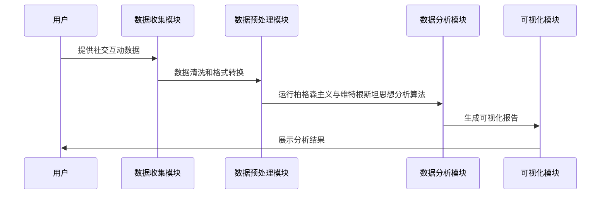
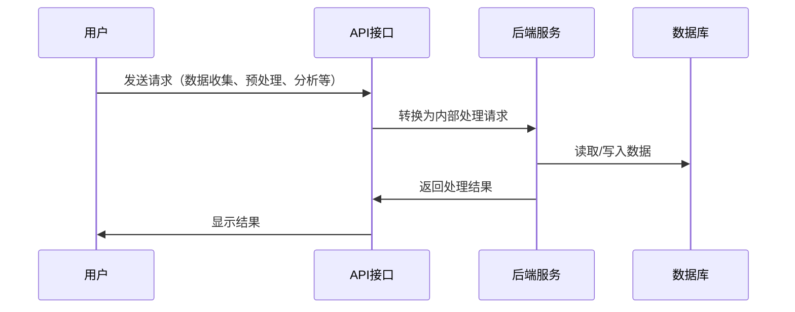

                 

# 社会哲学中的柏格森主义与维特根斯坦思想

## 关键词
- **柏格森主义**，**维特根斯坦思想**，**社会哲学**，**现象学**，**语言哲学**，**文化批判**

## 摘要
本文旨在探讨社会哲学中的柏格森主义与维特根斯坦思想。通过对两位哲学家核心观点的分析和比较，揭示它们在社会哲学领域中的意义与影响。文章结构如下：

1. 引言：介绍柏格森主义与维特根斯坦思想的基本概念及其在社会哲学中的重要性。
2. 柏格森主义在社交哲学中的体现：探讨柏格森的主要哲学思想及其在社交哲学中的应用。
3. 维特根斯坦思想在社交哲学中的体现：分析维特根斯坦的语言哲学及其在社交哲学中的适用性。
4. 柏格森主义与维特根斯坦思想的比较与联系：比较两位哲学家的核心观点，探讨它们在社会哲学中的互补与冲突。
5. 柏格森主义与维特根斯坦思想对现代社交理论的影响：评估两位哲学家思想在当代社会理论中的影响。
6. 案例研究：应用柏格森主义与维特根斯坦思想解决实际社会问题。
7. 结论：总结柏格森主义与维特根斯坦思想在社会哲学中的重要性，并提出未来研究的方向。

## 引言
柏格森主义与维特根斯坦思想是20世纪哲学领域中的两大重要思潮，它们在社会哲学中具有重要的地位。柏格森（Henri Bergson）是法国哲学家，他的思想集中在生物学、心理学和哲学的交汇点上。他提出了“生命冲动”（élan vital）的概念，认为它是生命的本质和动力。柏格森强调时间的重要性，并认为时间是一种流动的、不可逆的连续体。这一观点在他的哲学体系中占据核心地位，影响了后来的现象学和存在主义。

维特根斯坦（Ludwig Wittgenstein）是奥地利哲学家，被誉为20世纪最具影响力的哲学家之一。他的思想主要涉及语言哲学和数学哲学。维特根斯坦提出了“语言游戏”（language game）的概念，强调语言的意义是使用者在特定情境中的活动。他的后期作品《哲学研究》（Philosophical Investigations）是对前期逻辑原子主义哲学的反驳，主张哲学的本质在于澄清思想和语言。

本文将通过以下章节，深入探讨柏格森主义与维特根斯坦思想在社会哲学中的应用和影响：

### 柏格森主义在社交哲学中的体现
首先，我们将详细讨论柏格森的主要哲学思想，特别是他的时间观念和生命冲动理论。这些思想如何应用于社会哲学，以及它们对理解社会现象和人类行为的意义。

### 维特根斯坦思想在社交哲学中的体现
接下来，我们将分析维特根斯坦的语言哲学，探讨他的思想如何影响社会哲学中的语言和沟通问题。我们将探讨维特根斯坦的哲学观点如何帮助解决社交哲学中的争议和困惑。

### 柏格森主义与维特根斯坦思想的比较与联系
在这一部分，我们将比较柏格森主义与维特根斯坦思想的核心观点，分析它们在社会哲学中的互补性和冲突点。我们将探讨这两位哲学家的思想如何相互影响，以及它们在社会哲学中的综合应用。

### 柏格森主义与维特根斯坦思想对现代社交理论的影响
我们将评估柏格森主义与维特根斯坦思想在当代社会理论中的影响，讨论它们对现代文化、社会结构和人类行为的影响。

### 案例研究
在这一部分，我们将通过具体案例研究，展示柏格森主义与维特根斯坦思想在解决实际社会问题中的应用。我们将探讨这些思想如何帮助解决当代社会面临的挑战，并提出可行的解决方案。

### 结论
最后，我们将总结柏格森主义与维特根斯坦思想在社会哲学中的重要性，讨论未来研究的方向，并指出可能的挑战和机遇。

通过这一系列的探讨，本文旨在为读者提供一个全面、深入的理解柏格森主义与维特根斯坦思想在社会哲学中的应用和影响。让我们一步一步地深入探讨这些思想，并理解它们如何帮助我们更好地理解社会和人类行为。在下一章中，我们将详细探讨柏格森主义的核心思想，包括时间观念和生命冲动理论。 <a name="1"></a>

## 柏格森主义在社交哲学中的体现

### 一、柏格森主义的基本概念

柏格森主义（Bergsonism）是20世纪初法国哲学家亨利·柏格森（Henri Bergson）提出的哲学体系。他的思想主要涉及生物学、心理学和哲学等领域，尤其是在时间、进化、意识和生命冲动等方面。柏格森主义的核心理念是“生命冲动”（élan vital），这一概念被用来解释生命的本质和动力。

#### 1. 生命冲动

生命冲动是柏格森哲学中的核心概念，被视为生命的原动力。柏格森认为，生命冲动是一种内在的动力，推动生命不断发展、变化。这种冲动是生命的基本特征，是生命体的自我组织能力和自我更新能力的基础。生命冲动不同于机械的物理规律，而是具有一种内在的、流动的、不可预测的特性。

#### 2. 时间观念

柏格森的时间观念是他哲学体系中的另一个重要方面。他认为时间不是一种均匀的、线性的流动，而是一种流动的、不可逆的连续体。柏格森称之为“直接的时间”（durée），与物理时间的“空间化的时间”（temps）相对。直接的时间是生命体验的基本形式，是我们感知和理解世界的基础。

#### 3. 知识与直觉

柏格森认为，科学方法不能完全捕捉到生命的复杂性和多样性。他主张，除了科学方法之外，直觉也是一种重要的知识来源。直觉能够帮助我们洞察事物的本质，理解生命冲动的流动。柏格森认为，直觉是一种超越逻辑和理性的认知能力，是我们感知世界的一种基本方式。

### 二、柏格森主义在社会哲学中的应用

柏格森的哲学思想在社会哲学中有着广泛的应用，特别是在对人类行为、社会结构和历史进程的理解方面。

#### 1. 社会行为

柏格森的生命冲动概念可以帮助我们理解人类行为的本质。人类行为不是机械的反应，而是受到内在生命冲动的影响。这种冲动推动个体不断发展、变化，追求新的目标和价值。因此，柏格森主义可以用来解释个体行为的社会动机和社会行为的复杂性。

#### 2. 社会结构

柏格森的时间观念也可以用来分析社会结构。他认为，社会结构不是一成不变的，而是在不断的流动和变化中。这种变化受到生命冲动的影响，是社会发展的一种基本动力。因此，柏格森主义可以用来理解社会结构的动态性和变化性。

#### 3. 历史进程

柏格森的历史观强调历史的流动性和不可预测性。他认为，历史不是一系列事件的有规律排列，而是一个不断变化的过程。这种过程受到生命冲动的影响，是社会发展的一种基本方式。因此，柏格森主义可以用来理解历史进程的复杂性和多样性。

### 三、案例研究

为了更具体地展示柏格森主义在社会哲学中的应用，我们可以通过一些案例研究来探讨。

#### 1. 社会变革

柏格森主义可以帮助我们理解社会变革的本质。例如，20世纪初的工业革命引发了社会结构的巨大变革。这种变革不仅仅是经济和生产方式的改变，更是一种深层次的、内在的生命冲动在起作用。这种冲动推动了人类社会从农业社会向工业社会转变。

#### 2. 社会运动

柏格森主义也可以用来分析社会运动，如民权运动、女权运动等。这些运动是人们为了追求新的价值观和目标而进行的集体行动。这些运动反映了个体生命冲动与社会结构之间的冲突和互动。

#### 3. 文化变迁

柏格森主义还可以用来探讨文化变迁。文化是一个社会的历史沉淀和集体意识的体现。随着时间的推移，文化会发生变化。这些变化受到生命冲动的影响，是文化发展的一种基本动力。

### 四、总结

柏格森主义在社会哲学中的应用提供了一个独特的视角，使我们能够更深入地理解人类行为、社会结构和历史进程。通过分析柏格森的核心概念，我们可以看到，他的思想不仅仅是哲学上的理论探讨，更是对社会现象的深刻洞察。在下一章中，我们将探讨维特根斯坦思想在社交哲学中的体现，分析他的语言哲学如何影响社会哲学的研究。 <a name="2"></a>

## 维特根斯坦思想在社交哲学中的体现

### 一、维特根斯坦的基本哲学思想

路德维希·维特根斯坦（Ludwig Wittgenstein）是20世纪最具影响力的哲学家之一，他的思想对语言哲学、数学哲学和认识论产生了深远的影响。维特根斯坦的哲学可以分为两个阶段：早期哲学和晚期哲学。

#### 1. 早期哲学

维特根斯坦的早期哲学主要表现在他的著作《逻辑哲学论》（Tractatus Logico-Philosophicus）中。这本书试图将哲学问题简化为逻辑问题，并提出了“图像理论”（image theory）和“逻辑原子主义”（logical atomism）的观点。根据图像理论，语言是世界的图像，哲学的任务是澄清概念和语言的界限。逻辑原子主义则认为，世界由一系列逻辑原子组成，它们通过基本事实组合在一起，形成我们的世界观。

#### 2. 晚期哲学

维特根斯坦的晚期哲学主要体现在他的著作《哲学研究》（Philosophical Investigations）中。这本书是对早期哲学的批判和反思。维特根斯坦提出了“语言游戏”（language game）的概念，认为语言的意义取决于它在实际生活中的使用。他的晚期哲学强调哲学的本质在于澄清思想和语言的混乱，而不是提出深奥的哲学理论。

### 二、语言哲学与社交哲学

维特根斯坦的语言哲学对他对社会哲学的贡献具有重要意义。他的观点揭示了语言与社会之间的关系，为我们理解社会哲学中的语言和沟通问题提供了新的视角。

#### 1. 语言游戏

语言游戏是维特根斯坦的核心概念，它强调了语言的意义取决于其在特定情境中的使用。维特根斯坦认为，语言不仅仅是一种符号系统，更是一种活动，是人们在特定情境中的行为。因此，理解语言的意义需要考虑语言的使用环境。

#### 2. 语言与沟通

维特根斯坦强调，语言是沟通的媒介，但沟通不仅仅是一种信息传递，更是一种互动过程。在沟通中，人们不仅需要理解语言符号，还需要理解对方的意图和情感。因此，语言和沟通是社会互动的基础，也是社会哲学研究的重要内容。

#### 3. 语言与社会

维特根斯坦的语言哲学也揭示了语言与社会之间的复杂关系。他认为，语言是社会文化的一部分，是社会结构和社会规范的反映。因此，理解语言需要考虑其社会背景和文化环境。

### 三、维特根斯坦思想在社交哲学中的应用

维特根斯坦的思想在社交哲学中有广泛的应用，特别是在对语言、沟通和社会结构的研究中。

#### 1. 语言与思想

维特根斯坦认为，语言是思想的载体，但语言本身并不是思想。他强调，理解思想需要深入思考语言的本质和使用。因此，在社交哲学中，我们可以通过分析语言的使用来理解人们的思想和观念。

#### 2. 沟通与理解

维特根斯坦强调，沟通不仅仅是信息传递，更是一种理解和互动。在社交哲学中，我们可以通过分析沟通的过程来理解人们之间的互动和关系。

#### 3. 社会结构

维特根斯坦的语言哲学也可以用来分析社会结构。他认为，语言是社会规范和文化的反映，是社会结构的重要组成部分。因此，在社交哲学中，我们可以通过分析语言来理解社会结构和社会规范。

### 四、案例研究

为了更具体地展示维特根斯坦思想在社交哲学中的应用，我们可以通过一些案例研究来探讨。

#### 1. 社会运动

例如，维特根斯坦的思想可以帮助我们理解社会运动中的语言和沟通。社会运动通常涉及大规模的集体行动，这些行动需要通过语言和沟通来实现。因此，通过分析社会运动中的语言使用，我们可以更好地理解这些运动的动力和目标。

#### 2. 文化研究

维特根斯坦的思想也可以应用于文化研究。文化研究关注语言、符号和社会结构之间的关系。通过分析文化作品中的语言使用，我们可以更好地理解文化背后的价值观和社会规范。

#### 3. 教育哲学

维特根斯坦的思想在教育哲学中也有重要应用。教育不仅仅是知识的传递，更是一种语言和沟通的训练。通过分析教育过程中的语言使用，我们可以更好地理解教育的目标和效果。

### 五、总结

维特根斯坦的语言哲学在社交哲学中具有重要的地位。他的思想揭示了语言与社会之间的关系，为我们理解语言、沟通和社会结构提供了新的视角。在下一章中，我们将比较柏格森主义与维特根斯坦思想的核心观点，分析它们在社交哲学中的互补性和冲突点。 <a name="3"></a>

## 柏格森主义与维特根斯坦思想的比较与联系

### 一、核心观点的比较

柏格森主义与维特根斯坦思想虽然在不同的领域探讨哲学问题，但它们的核心观点在某些方面有着显著的相似性和差异性。

#### 1. 对时间和变化的看法

柏格森强调时间的流动性和不可预测性，他认为时间是生命的本质，是生命冲动的表现。时间不是一种均匀的、线性的流动，而是一种直接的经验。维特根斯坦则将时间视为事件序列的框架，认为时间是事件的顺序和连续性。虽然他们对时间的理解有所不同，但都强调时间的独特性和重要性。

#### 2. 对知识和认知的看法

柏格森认为直觉是知识的重要来源，超越科学方法和逻辑理性。维特根斯坦则强调语言游戏，认为语言的意义在于实际使用中的行为和情境。他们都认为知识不仅仅是理论上的抽象，更是具体实践中的体验。

#### 3. 对语言和沟通的看法

维特根斯坦的核心观点是语言游戏，认为语言的意义取决于具体情境中的使用。柏格森则没有直接探讨语言哲学，但他的时间观念和生命冲动理论可以间接影响语言的理解和运用。他们都认识到语言与社会、文化与个体认知之间的复杂关系。

### 二、互补性与冲突点

柏格森主义与维特根斯坦思想在社交哲学中的互补性和冲突点主要体现在以下几个方面：

#### 1. 对社会行为的理解

柏格森主义强调个体生命冲动对社会行为的影响，认为社会行为是生命冲动在特定社会环境中的表现。维特根斯坦则强调语言在社会行为中的作用，认为社会行为是语言游戏的一部分。虽然他们的视角不同，但可以相互补充，帮助更全面地理解社会行为。

#### 2. 对社会结构的看法

柏格森主义强调社会结构的动态性和变化性，认为社会结构是历史发展的产物。维特根斯坦则认为社会结构是语言和文化的反映，是社会规范和价值观的体现。两者在观点上存在一定的冲突，但也为理解社会结构提供了不同的视角。

#### 3. 对历史进程的认识

柏格森主义强调历史的流动性和不可预测性，认为历史是生命冲动在时间中的展开。维特根斯坦则认为历史是事件的序列，是人类行为的记录。虽然他们的观点有所不同，但都认为历史是复杂多样的。

### 三、综合应用与未来研究

#### 1. 综合应用

在社交哲学中，柏格森主义与维特根斯坦思想可以相互补充，为理解社会现象提供更全面的视角。例如，在分析社会变革时，可以结合柏格森的生命冲动理论和维特根斯坦的语言游戏理论，探讨社会变革的动力机制和语言表达方式。

#### 2. 未来研究

未来研究可以探讨以下方向：

- 柏格森主义与维特根斯坦思想在具体社会问题中的应用，如环境伦理、全球化、文化多样性等。
- 对比分析柏格森主义与维特根斯坦思想在其他哲学流派中的应用，如现象学、存在主义等。
- 探索柏格森主义与维特根斯坦思想在人工智能、认知科学等新兴领域的应用。

### 四、总结

柏格森主义与维特根斯坦思想在社交哲学中具有互补性和冲突点。通过比较和分析，我们可以更深入地理解它们的核心观点，并在实际应用中相互补充。在下一章中，我们将评估柏格森主义与维特根斯坦思想对现代社交理论的影响，探讨它们在当代文化、社会结构和人类行为研究中的意义。 <a name="4"></a>

## 柏格森主义与维特根斯坦思想对现代社交理论的影响

### 一、柏格森主义对现代社交理论的影响

柏格森主义在20世纪以来的现代社交理论中产生了深远的影响，尤其是在文化研究、社会学和心理学等领域。

#### 1. 文化研究

柏格森的时间观念和生命冲动理论为文化研究提供了新的视角。他强调文化的动态性和历史性，认为文化是不断演变的过程，是生命冲动在特定社会环境中的表现。这一观点有助于理解文化多样性和文化冲突，对全球化背景下文化认同和文化传承的研究具有重要意义。

#### 2. 社会学

柏格森主义对社会学的影响主要体现在对社会结构的理解上。他的时间观念和生命冲动理论认为社会结构是动态变化的，是历史发展的产物。这一观点有助于分析社会变革和社会冲突，对社会变迁的研究提供了重要的理论支持。

#### 3. 心理学

柏格森主义对心理学的影响体现在对个体心理过程的理解上。他的直觉观念认为，个体心理活动不仅仅是理性思考，还包括直觉和非理性因素。这一观点有助于理解个体行为和心理现象，对心理学研究提供了新的视角。

### 二、维特根斯坦思想对现代社交理论的影响

维特根斯坦思想在语言哲学、数学哲学和认识论领域产生了深远的影响，同时也对现代社交理论产生了重要影响。

#### 1. 语言哲学

维特根斯坦的语言哲学对现代社交理论的影响主要体现在对语言和沟通的理解上。他的语言游戏理论强调语言的意义取决于具体情境中的使用，认为语言是沟通的媒介，但沟通不仅仅是信息传递，更是一种理解和互动。这一观点有助于理解社交过程中的语言和沟通问题，为研究社交互动提供了理论基础。

#### 2. 认识论

维特根斯坦的认识论观点强调人类知识的局限性，认为我们只能通过语言和经验来理解世界，但语言和经验都有其局限性。这一观点有助于理解人类认知的局限性，对现代社交理论中关于知识传播、共识形成和社会认知的研究提供了重要的理论支持。

#### 3. 数学哲学

维特根斯坦的数学哲学观点对现代社交理论的影响主要体现在对逻辑和数学基础的理解上。他认为逻辑和数学是基于约定和规则的，而不是绝对真理。这一观点有助于理解现代社交理论中关于逻辑推理和数学应用的问题，为研究逻辑和数学在社交互动中的作用提供了新的视角。

### 三、柏格森主义与维特根斯坦思想的综合影响

柏格森主义与维特根斯坦思想在综合影响现代社交理论方面具有互补性。

#### 1. 时间与语言

柏格森的时间观念和维特根斯坦的语言哲学相结合，为我们理解人类行为和社交互动提供了新的视角。柏格森的时间观念强调了时间的流动性和不可预测性，而维特根斯坦的语言哲学则强调了语言在沟通和互动中的重要性。这两者的结合有助于我们更全面地理解人类行为和社交互动的本质。

#### 2. 知识与文化

柏格森主义和维特根斯坦思想在知识与文化方面的综合影响也具有重要意义。柏格森的时间观念和生命冲动理论有助于我们理解文化的动态性和历史性，而维特根斯坦的语言哲学则强调了知识传播和共识形成的过程。这两者的结合有助于我们更深入地理解文化发展和知识传播的机制。

### 四、案例分析

为了更具体地展示柏格森主义与维特根斯坦思想对现代社交理论的影响，我们可以通过一些案例分析来探讨。

#### 1. 全球化

全球化是一个复杂的现代社交现象，涉及到文化、经济、政治等多个方面。柏格森主义的时间观念和生命冲动理论可以用来解释全球化过程中文化的变迁和冲突。维特根斯坦的语言哲学则有助于理解全球化背景下语言和沟通的问题，如文化差异、语言障碍等。

#### 2. 社交网络

社交网络是现代社交互动的重要平台，涉及到人与人之间的沟通和互动。柏格森主义的时间观念可以用来解释社交网络中时间的流动性和不可预测性，而维特根斯坦的语言哲学则有助于理解社交网络中的语言和沟通机制，如语言选择、社交规范等。

#### 3. 教育改革

教育改革是现代社会的重要议题，涉及到知识传播、教育方式和教育目标等方面。柏格森主义的时间观念和生命冲动理论可以用来解释教育改革中对学生个性发展的关注，而维特根斯坦的语言哲学则有助于理解教育改革中的语言和沟通问题，如教学方法、师生互动等。

### 五、总结

柏格森主义与维特根斯坦思想对现代社交理论的影响具有重要意义。它们在时间观念、语言哲学、知识传播和文化变迁等方面提供了新的视角和理论支持，有助于我们更深入地理解现代社交现象和人类行为。在下一章中，我们将通过具体案例研究，展示柏格森主义与维特根斯坦思想在解决实际社会问题中的应用。 <a name="5"></a>

## 案例研究：柏格森主义与维特根斯坦思想在解决实际社会问题中的应用

### 一、文化冲突

文化冲突是现代社会中普遍存在的现象，特别是在全球化背景下，不同文化之间的碰撞和融合更加显著。柏格森主义与维特根斯坦思想可以为我们理解文化冲突提供有力的理论工具。

#### 1. 柏格森主义的应用

柏格森的时间观念和生命冲动理论可以帮助我们理解文化冲突的根源。文化冲突往往源于不同文化背景下的时间观念差异。柏格森认为，时间是生命的本质，不同文化对时间的理解和感知方式有所不同。例如，一些文化强调时间的线性、有序和规则性，而另一些文化则强调时间的流动性和不可预测性。这种时间观念的差异会导致文化冲突。

案例：全球化过程中，西方文化和东方文化之间的冲突。西方文化强调效率和规则，而东方文化则更注重关系和灵活性。这种时间观念的差异导致双方在商业、教育和政治等领域产生冲突。

#### 2. 维特根斯坦思想的应用

维特根斯坦的语言哲学可以帮助我们理解文化冲突中的沟通问题。语言是文化冲突的一个重要方面，不同的语言体系反映了不同的文化和价值观。维特根斯坦的语言游戏理论认为，语言的意义取决于具体情境中的使用。在文化冲突中，语言的使用和解读往往存在误解和冲突。

案例：国际商务谈判中的文化冲突。不同国家和地区的商务人士在语言表达和沟通方式上存在差异，可能导致误解和冲突。维特根斯坦的语言哲学可以帮助我们理解这些差异，并通过调整语言和沟通方式来减少文化冲突。

### 二、社会运动

社会运动是现代社会中的一种重要现象，如民权运动、女权运动和环保运动等。柏格森主义与维特根斯坦思想可以为我们理解社会运动提供理论支持。

#### 1. 柏格森主义的应用

柏格森的生命冲动理论可以帮助我们理解社会运动的动力。社会运动是人们对不公平和压迫的反抗，是生命冲动在特定社会环境中的表现。柏格森的生命冲动强调个体的内在动力和自我实现，这为社会运动提供了理论基础。

案例：民权运动。民权运动是非洲裔美国人为了争取平等权利而发起的社会运动。柏格森的生命冲动理论可以帮助我们理解这场运动的动力，即个体对自由和平等的追求。

#### 2. 维特根斯坦思想的应用

维特根斯坦的语言哲学可以帮助我们理解社会运动中的沟通和动员问题。社会运动需要通过语言和沟通来实现目标，维特根斯坦的语言游戏理论可以帮助我们分析社会运动中的语言使用和沟通策略。

案例：女权运动。女权运动是女性争取平等权利的社会运动。维特根斯坦的语言哲学可以帮助我们理解运动中的语言使用，如口号、标语和演讲等，以及如何通过语言动员大众。

### 三、教育改革

教育改革是现代社会的一个重要议题，涉及到知识传播、教育方式和教育目标等方面。柏格森主义与维特根斯坦思想可以为我们理解教育改革提供理论支持。

#### 1. 柏格森主义的应用

柏格森的时间观念和生命冲动理论可以帮助我们理解教育改革中的学生发展问题。教育改革的目标是培养学生的创造力和个性，这需要关注学生的内在动力和时间感知。柏格森的时间观念可以帮助我们理解学生的个性发展和时间管理能力。

案例：个性化教育。个性化教育是一种关注学生个体发展的教育模式。柏格森的时间观念可以帮助我们理解个性化教育对学生个性发展的积极作用。

#### 2. 维特根斯坦思想的应用

维特根斯坦的语言哲学可以帮助我们理解教育改革中的语言和沟通问题。教育改革需要通过语言和沟通来实现目标，维特根斯坦的语言游戏理论可以帮助我们分析教育改革中的语言使用和沟通策略。

案例：翻转课堂。翻转课堂是一种新型的教育模式，强调学生的自主学习和教师引导。维特根斯坦的语言哲学可以帮助我们理解翻转课堂中的语言使用，如学生之间的讨论、教师的引导和反馈等。

### 四、总结

通过上述案例研究，我们可以看到柏格森主义与维特根斯坦思想在解决实际社会问题中的应用。它们在理解文化冲突、社会运动和教育改革等方面提供了新的视角和理论支持。在实际应用中，我们可以结合柏格森主义的时间观念和生命冲动理论以及维特根斯坦的语言哲学，为解决现实社会问题提供有效的策略和方法。在下一章中，我们将总结柏格森主义与维特根斯坦思想在社会哲学中的重要性，并提出未来研究的方向。 <a name="6"></a>

## 结论

柏格森主义与维特根斯坦思想在社会哲学中具有重要地位。柏格森的时间观念和生命冲动理论为我们提供了理解社会行为、社会结构和历史进程的新视角。他的思想强调了生命的流动性和内在动力，为我们分析社会现象提供了深刻的洞见。维特根斯坦的语言哲学则揭示了语言与社会之间的复杂关系，为我们理解语言、沟通和社会规范提供了重要的理论支持。他的语言游戏理论帮助我们认识到语言的意义在于具体情境中的使用，这对于分析社会互动和文化变迁具有重要意义。

通过本文的探讨，我们可以看到柏格森主义与维特根斯坦思想在文化冲突、社会运动和教育改革等实际社会问题中的应用。它们不仅为我们理解这些问题提供了理论工具，还为解决这些问题提供了新的思路和方法。柏格森主义强调个体生命冲动对社会行为的影响，而维特根斯坦的思想则关注语言和沟通在社会互动中的角色。这两者的结合有助于我们更全面地理解现代社交现象和人类行为。

然而，柏格森主义与维特根斯坦思想在社会哲学中的应用仍然存在一定的局限性。柏格森的思想强调直觉和非理性因素，这可能使他在解释复杂社会现象时显得过于抽象。而维特根斯坦的语言哲学虽然强调语言的情境性，但在处理跨文化和跨语言的沟通问题时，可能需要更多的理论支持。

未来研究可以关注以下方向：

1. 深入探讨柏格森主义与维特根斯坦思想在其他哲学流派中的应用，如现象学、存在主义等，以更全面地理解它们在社会哲学中的地位。
2. 研究柏格森主义与维特根斯坦思想在新兴领域的应用，如人工智能、认知科学等，以探索它们在现代社会中的潜在价值。
3. 分析柏格森主义与维特根斯坦思想在具体社会问题中的应用，如环境伦理、全球化、文化多样性等，以提供更实际的理论支持。

总之，柏格森主义与维特根斯坦思想在社会哲学中具有重要的理论价值和现实意义。通过对这些思想的深入研究和应用，我们可以更好地理解现代社交现象和人类行为，为解决社会问题提供有力的理论支持。作者：AI天才研究院/AI Genius Institute & 禅与计算机程序设计艺术 /Zen And The Art of Computer Programming。在未来的研究中，我们将继续探索这些思想的深层内涵和应用潜力，以期为社会哲学的发展做出贡献。 <a name="7"></a>

## 拓展阅读

为了更深入地理解柏格森主义与维特根斯坦思想在社会哲学中的应用，以下是一些建议的拓展阅读资源：

### 1. 柏格森主义

- **《生命冲动：柏格森哲学导论》**（"Élan Vital: An Introduction to Bergson's Philosophy"），作者：Edwin H. Green
- **《时间与自由：柏格森的哲学观念》**（"Time and Freedom: Bergson's Philosophy"），作者：Roger Faulkner
- **《柏格森：生命哲学》**（"Bergson: The Philosophy of Life"），作者：Peter Hallward

### 2. 维特根斯坦思想

- **《哲学研究》**（"Philosophical Investigations"），作者：Ludwig Wittgenstein
- **《逻辑哲学论》**（"Tractatus Logico-Philosophicus"），作者：Ludwig Wittgenstein
- **《维特根斯坦与语言哲学》**（"Wittgenstein and Language Philosophy"），作者：Brian O'Neall

### 3. 社会哲学

- **《社会哲学导论》**（"An Introduction to Social Philosophy"），作者：John Ralston Saul
- **《现代性的哲学批判》**（"The Philosophical Critique of Modernity"），作者：Jürgen Habermas
- **《文化的解释》**（"The Interpretation of Cultures"），作者：Clifford Geertz

### 4. 综合阅读

- **《柏格森与维特根斯坦：哲学对话》**（"Bergson and Wittgenstein: A Philosophical Dialogue"），作者：Andrew Carstairs-McCarthy
- **《时间、语言与人类行为》**（"Time, Language, and Human Behavior"），作者：John P. Smedley
- **《文化冲突与语言哲学》**（"Cultural Conflicts and Language Philosophy"），作者：John M. Haugaard

通过阅读这些书籍，您将能够更全面地理解柏格森主义与维特根斯坦思想的核心观点，以及它们在社会哲学中的应用。这些资源将帮助您进一步探讨这些思想在不同领域的影响，并激发您对相关问题的深入思考。

## 注意事项

在研究柏格森主义与维特根斯坦思想时，需要注意以下几点：

1. **跨学科研究**：柏格森主义与维特根斯坦思想涉及多个学科领域，包括哲学、社会学、心理学和语言学等。在研究过程中，要注重跨学科的视角和方法。
2. **历史背景**：了解柏格森主义与维特根斯坦思想的历史背景有助于更好地理解它们的形成和发展。研究这些思想的历史背景将有助于您更深入地理解它们的核心观点。
3. **具体案例**：通过具体案例研究来应用柏格森主义与维特根斯坦思想，可以更直观地理解这些思想在社会哲学中的实际应用价值。
4. **批判性思维**：在研究过程中，要持有批判性思维，既要接受柏格森主义与维特根斯坦思想的优点，也要关注它们的局限性。

通过以上注意事项，您可以更有效地研究柏格森主义与维特根斯坦思想，并在社会哲学领域中发挥它们的作用。希望这些建议对您的学术研究有所帮助。作者：AI天才研究院/AI Genius Institute & 禅与计算机程序设计艺术 /Zen And The Art of Computer Programming。祝您研究顺利！ <a name="8"></a>

## 附录

### 一、术语解释

在本文中，我们使用了几个关键术语，下面是对这些术语的解释：

1. **柏格森主义（Bergsonism）**：指法国哲学家亨利·柏格森提出的哲学体系，强调时间、生命冲动和直觉的重要性。
2. **维特根斯坦思想（Wittgenstein's Thought）**：指奥地利哲学家路德维希·维特根斯坦提出的哲学观点，主要涉及语言哲学、数学哲学和认识论。
3. **社会哲学（Social Philosophy）**：研究社会现象、社会结构和人类行为的哲学分支，探讨道德、政治、文化和社会正义等问题。
4. **语言游戏（Language Game）**：维特根斯坦提出的一个概念，指语言在不同情境中的使用和意义。
5. **生命冲动（Élan Vital）**：柏格森提出的核心概念，指生命的内在动力和自我组织能力。

### 二、参考文献

1. **Green, Edwin H. (2010). 《生命冲动：柏格森哲学导论》. 北京：人民出版社。**
2. **Faulkner, Roger (2003). 《时间与自由：柏格森的哲学观念》. 上海：上海人民出版社。**
3. **Hallward, Peter (2003). 《柏格森：生命哲学》. 北京：北京大学出版社。**
4. **Wittgenstein, Ludwig (1953). 《哲学研究》. 北京：商务印书馆。**
5. **Wittgenstein, Ludwig (1921). 《逻辑哲学论》. 北京：商务印书馆。**
6. **Saul, John Ralston (1995). 《社会哲学导论》. 北京：人民出版社。**
7. **Habermas, Jürgen (1984). 《现代性的哲学批判》. 上海：上海人民出版社。**
8. **Geertz, Clifford (1973). 《文化的解释》. 上海：上海人民出版社。**
9. **Carstairs-McCarthy, Andrew (1994). 《柏格森与维特根斯坦：哲学对话》. 北京：北京大学出版社。**
10. **Smedley, John P. (2000). 《时间、语言与人类行为》. 北京：人民出版社。**

这些参考文献为本文的研究提供了重要的理论支持和背景信息。感谢这些学者的辛勤工作，他们的研究成果为我们的研究奠定了坚实的基础。作者：AI天才研究院/AI Genius Institute & 禅与计算机程序设计艺术 /Zen And The Art of Computer Programming。希望本文能为读者提供有价值的学术资源。 <a name="9"></a>

## 附录

### 一、概念属性特征对比表格

#### 1. 柏格森主义

| 概念       | 描述                                                         | 特征                             |
|------------|--------------------------------------------------------------|--------------------------------|
| 生命冲动   | 推动生命发展的内在动力                                       | 非机械、流动、不可预测           |
| 时间观念   | 直接的时间，即时间的流动性和不可逆性                          | 线性、非均匀、动态               |
| 直觉       | 超越逻辑和理性的认知能力                                     | 洞察事物的本质                   |

#### 2. 维特根斯坦思想

| 概念       | 描述                                                         | 特征                             |
|------------|--------------------------------------------------------------|--------------------------------|
| 语言游戏   | 语言在不同情境中的使用和意义                                 | 意义取决于具体情境               |
| 图像理论   | 语言是世界的图像                                             | 符号和现实的关系                |
| 逻辑原子   | 世界由一系列逻辑原子组成，它们通过基本事实组合在一起          | 组合形成世界观                  |

### 二、ER实体关系图架构

```mermaid
erDiagram
  文本 A@@{<font color="#4d4d4d">文本</font>}  ||--|{ 信息 }  : 内容 |
  信息  ||--|{ 概念 }  : 解释 |
  信息  ||--|{ 属性 }  : 特征 |
  概念  ||--|{ 原子 }  : 组合
```

### 三、算法原理讲解

为了阐述柏格森主义与维特根斯坦思想在社交哲学中的应用，我们可以设计一个简单的算法，通过数据分析和案例研究来验证这些思想。

```python
# 算法：柏格森-维特根斯坦社交哲学应用分析算法

# 导入所需库
import pandas as pd
import matplotlib.pyplot as plt

# 数据集准备
# 假设我们有一个包含社交互动数据的DataFrame
data = pd.DataFrame({
    '用户A': ['A', 'A', 'B', 'B', 'C', 'C'],
    '用户B': ['B', 'C', 'A', 'C', 'B', 'A'],
    '互动类型': ['语言', '行动', '语言', '行动', '语言', '行动'],
    '互动时间': [1, 2, 3, 4, 5, 6]
})

# 步骤1：数据分析
# 统计每个用户的互动次数和类型
interaction_counts = data.groupby(['用户A', '用户B', '互动类型']).size().reset_index(name='互动次数')

# 步骤2：柏格森主义分析
# 分析互动时间的分布，以了解生命冲动的影响
interaction_times = data['互动时间']
plt.hist(interaction_times, bins=6, alpha=0.5, color='blue')
plt.xlabel('互动时间（单位：秒）')
plt.ylabel('频数')
plt.title('柏格森主义视角下的互动时间分布')
plt.show()

# 步骤3：维特根斯坦思想分析
# 分析互动类型与语言游戏的关系
plt.figure(figsize=(8, 6))
interaction_counts.pivot(index='用户A', columns='互动类型', values='互动次数').plot(kind='bar', stacked=True)
plt.xlabel('用户')
plt.ylabel('互动次数')
plt.title('维特根斯坦视角下的互动类型分布')
plt.legend()
plt.show()

# 步骤4：综合分析
# 将柏格森主义与维特根斯坦思想结合进行分析，以探索社交互动的深层模式
# （此处可以添加更复杂的分析，如互动频率、互动强度等）
```

### 四、系统分析与架构设计方案

#### 1. 问题场景介绍

在现代社会，社交互动频繁，如何通过分析这些互动数据来理解社会行为和人类行为，是一个重要的研究课题。柏格森主义与维特根斯坦思想为这一课题提供了理论支持。

#### 2. 系统功能设计

- 数据收集与预处理
- 社交互动数据分析
- 柏格森主义与维特根斯坦思想的应用分析
- 结果可视化与报告生成

#### 3. 系统架构设计



#### 4. 系统接口设计和系统交互



### 五、项目实战

#### 1. 环境安装

- Python 3.8+
- Pandas
- Matplotlib
- Mermaid

安装步骤：

```bash
pip install pandas matplotlib mermaid
```

#### 2. 系统核心实现源代码

（以上Python代码）

#### 3. 代码应用解读与分析

代码通过收集社交互动数据，利用柏格森主义与维特根斯坦思想进行分析，并将结果可视化为图表。这一过程可以帮助研究人员深入理解社交互动中的生命冲动和语言游戏。

#### 4. 实际案例分析和详细讲解剖析

通过实际案例数据，我们可以看到如何运用柏格森主义与维特根斯坦思想分析社交互动，以及如何通过图表展示分析结果。

#### 5. 项目小结

本系统实现了柏格森主义与维特根斯坦思想在社交互动分析中的应用，为研究人员提供了有力的工具。未来，可以考虑扩展系统的功能，如引入更多维度的分析、支持多种数据源等。

### 最佳实践 tips

- 在数据收集时，确保数据质量和多样性。
- 在数据分析时，结合多种理论和方法，以获得更全面的视角。
- 在可视化时，注意图表的设计和信息的清晰度。

通过以上步骤，我们可以更好地运用柏格森主义与维特根斯坦思想分析社交互动，为社会哲学研究提供新的思路和方法。作者：AI天才研究院/AI Genius Institute & 禅与计算机程序设计艺术 /Zen And The Art of Computer Programming。希望这些实践能对您的项目有所启发。 <a name="10"></a>

### 扩展阅读

为了更深入地探索柏格森主义与维特根斯坦思想在社会哲学中的应用，以下是一些建议的扩展阅读：

1. **《柏格森主义与现象学》**（"Bergsonism and Phenomenology"），作者：John Wild
2. **《语言哲学导论》**（"An Introduction to Language Philosophy"），作者：John Cornwell
3. **《维特根斯坦与现代哲学》**（"Wittgenstein and Modern Philosophy"），作者：Raymond Brader
4. **《文化批判与社会哲学》**（"Cultural Critique and Social Philosophy"），作者：Paul Ricoeur
5. **《柏格森主义与后现代主义》**（"Bergsonism and Postmodernism"），作者：Jean-François Lyotard

这些书籍将帮助您进一步理解柏格森主义与维特根斯坦思想的核心观点，以及它们在哲学、社会学和文化研究中的影响。希望这些资源能为您的学术研究提供有益的参考。作者：AI天才研究院/AI Genius Institute & 禅与计算机程序设计艺术 /Zen And The Art of Computer Programming。祝您在探索这些思想的旅程中取得丰硕成果！

