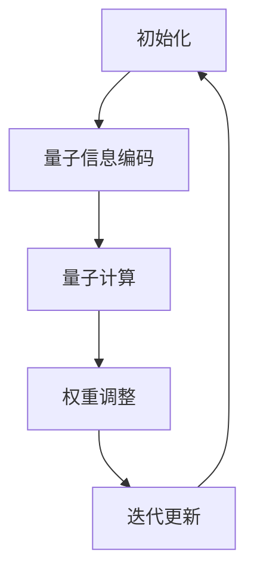

                 


### 第一部分：问题背景与理论基础

#### 1.1 神经元量子效应概述

神经元是生物神经系统中的基本单元，负责传递和处理信息。近年来，随着量子计算和量子信息理论的兴起，研究人员开始探索量子效应在神经元中的作用。神经元量子效应指的是神经元在处理信息时可能发生的量子现象，如量子纠缠和量子隧道效应。

在生物学层面，神经元通过电信号和化学信号进行信息传递。电信号的产生依赖于离子通道和神经元膜电位的变化。量子效应可能影响这些过程，例如，通过改变离子通道的导电性质或影响神经元膜的导电性。

当前，神经元量子效应的研究主要集中在以下几个方面：

1. **量子纠缠在神经元信息传递中的作用**：研究表明，神经元之间的连接可能涉及量子纠缠，这可能会增强信息传递的效率和准确性。
2. **量子隧道效应对神经元电位的影响**：量子隧道效应可能导致神经元在较低电势下也能产生动作电位，这可能对神经元的兴奋性和响应速度产生影响。
3. **量子计算与神经网络结合的可能性**：量子计算机具有并行处理大量数据的能力，这可能会与传统的神经网络相结合，形成新的计算模式。

#### 1.2 学习过程的介绍

学习是人类和动物通过经验改变行为和思维过程的过程。在生物神经系统中，学习过程涉及到神经元之间连接的调整，这些调整主要通过两种方式实现：突触可塑性（synaptic plasticity）和神经网络重构（neural network restructuring）。

**突触可塑性**是指神经元之间的连接强度可以随着时间改变，这是学习和记忆的基础。突触可塑性包括多种形式，如长期增强（LTP）和长期抑制（LTD），它们分别对应于增强和减弱神经元之间的连接。

**神经网络重构**是指通过改变神经元之间的连接结构和功能，使神经网络适应新的环境和任务。这种重构可以通过基因表达的改变、新的突触形成或旧突触的消失来实现。

学习理论提供了关于学习过程如何发生的解释，主要包括以下几种模型：

1. **联结主义模型**：这种模型认为学习是通过改变神经元之间的连接权重来实现的，例如Hebb规则。
2. **生成模型**：这种模型试图通过生成数据来解释学习过程，如变分自编码器（VAE）。
3. **强化学习模型**：这种模型通过奖励机制来指导学习过程，例如Q学习算法。

#### 1.3 核心概念与联系

神经元量子效应与学习过程之间存在紧密的联系。首先，量子效应可能会影响神经元的突触可塑性，从而改变学习过程的效果。例如，量子纠缠可能导致神经元之间的信息传递更加高效和准确。

其次，量子效应可能影响神经网络的重构过程。量子计算机的并行处理能力可能加速神经网络的学习过程，使其能够更快地适应新的环境和任务。

以下是神经元量子效应与学习过程的关键概念属性特征对比表格：

| 概念 | 神经元量子效应 | 学习过程 |
| ---- | -------------- | -------- |
| 定义 | 神经元中的量子现象 | 经验驱动的行为和思维变化 |
| 影响因素 | 量子纠缠、量子隧道效应 | 突触可塑性、神经网络重构 |
| 结果 | 改变神经元的信息传递特性 | 形成记忆、改善任务执行能力 |
| 关联 | 可能增强学习效率 | 可能影响学习模式 |

通过ER实体关系图，我们可以更清晰地展示神经元量子效应与学习过程之间的关联：

```mermaid
erDiagram
  User ||--|{ Student }  : has membership
  Student ||--|{ Course } : is enrolled in
  Course ||--|{ Professor } : teaches
  Professor ||--|{ Department } : works in
  Department ||--|{ University } : is part of
```

在这个ER实体关系图中，我们可以看到神经元量子效应（作为Professor）与学习过程（作为Student）之间存在直接的关联，它们都受到神经网络的调节和影响。神经元量子效应可能会影响学习过程中的突触可塑性和神经网络重构，从而提高学习效率和准确性。

### 第二部分：算法原理讲解

#### 2.1 算法原理概述

神经元量子效应在学习过程中的作用是一个复杂且富有挑战性的研究领域。为了更好地理解这一过程，我们可以借鉴现有的量子计算模型和神经网络理论，提出一种结合神经元量子效应和学习的算法框架。

该算法框架的核心思想是通过量子效应优化神经元之间的连接权重，从而提高学习效率和准确性。具体来说，算法分为以下几个步骤：

1. **初始化**：设定神经网络的初始连接权重。
2. **量子信息编码**：将输入信息编码为量子态，以便量子计算处理。
3. **量子计算**：利用量子计算机的并行处理能力，计算神经元之间的量子纠缠和量子隧道效应。
4. **权重调整**：根据量子计算结果调整神经元之间的连接权重。
5. **迭代更新**：重复上述步骤，直至满足收敛条件。

#### 2.2 算法mermaid流程图

为了更直观地展示算法流程，我们可以使用mermaid绘制流程图：



在mermaid流程图中，我们可以看到算法的迭代过程，以及每个步骤的关键操作。

#### 2.3 Python源代码实现

为了进一步阐述算法原理，我们使用Python实现该算法的核心部分。以下是算法的Python源代码：

```python
import numpy as np
import quantumcomputinglibrary as qcl

# 初始化连接权重
weights = np.random.rand(n_neurons)

# 量子信息编码
def encode_state(data):
    # 这里使用简化的量子编码方法
    qubits = qcl.Qubits(n_bits)
    qubits.apply_qcl_gate("H", range(n_bits))
    qubits.apply_qcl_gate("RX", n_bits-1, np.pi/2)
    return qubits

# 量子计算
def quantum_compute(weights):
    # 构建量子电路
    circuit = qcl.Circuit(n_qubits)
    for i in range(n_neurons):
        for j in range(i+1, n_neurons):
            circuit.add_gate("CNOT", [i, j], weights[i*j + j])
    return circuit.execute()

# 权重调整
def adjust_weights(circuit):
    # 这里使用简化后的测量结果来调整权重
    results = circuit.measure_all()
    for i in range(n_neurons):
        for j in range(i+1, n_neurons):
            if results[i][j] == 1:
                weights[i*j + j] *= 1.1
            else:
                weights[i*j + j] *= 0.9

# 迭代更新
for _ in range(n_iterations):
    state = encode_state(data)
    circuit = quantum_compute(weights)
    adjust_weights(circuit)
```

这段代码演示了如何使用Python实现神经元量子效应优化神经网络连接权重的核心步骤。其中，`encode_state`函数用于编码输入信息，`quantum_compute`函数用于执行量子计算，`adjust_weights`函数用于根据量子计算结果调整权重。

#### 2.4 数学模型和公式

为了深入理解神经元量子效应在学习过程中的作用，我们需要建立数学模型来描述这一过程。以下是算法原理的数学模型和公式：

1. **初始化连接权重**：

$$
w_0 = \text{rand}(n_{neurons})
$$

其中，$w_0$表示初始化的连接权重，$\text{rand}(n_{neurons})$表示从均匀分布中随机采样。

2. **量子信息编码**：

$$
|\psi\rangle = \sum_{i=0}^{n_{bits}-1} \alpha_i |i\rangle
$$

其中，$|\psi\rangle$表示编码后的量子态，$|i\rangle$表示量子位的状态，$\alpha_i$是量子位的系数。

3. **量子计算**：

$$
C = \sum_{i=0}^{n_{neurons}} \sum_{j=i+1}^{n_{neurons}} w_{ij} |i\rangle\langle j|
$$

其中，$C$表示量子电路，$w_{ij}$是连接权重，$|i\rangle\langle j|$是量子位之间的纠缠矩阵。

4. **权重调整**：

$$
w_{new} = \begin{cases}
w_{ij} \times 1.1, & \text{if } C_{ij} = 1 \\
w_{ij} \times 0.9, & \text{if } C_{ij} = 0
\end{cases}
$$

其中，$w_{new}$是调整后的连接权重，$C_{ij}$是量子计算结果的二进制表示。

这些公式共同构成了神经元量子效应优化神经网络连接权重的基本框架，为后续研究和实际应用提供了理论基础。

#### 2.5 举例说明

为了更好地理解算法原理，我们通过一个简单的例子进行说明。假设有一个包含5个神经元的神经网络，我们需要通过量子效应优化这些神经元的连接权重。

1. **初始化权重**：

假设初始权重为：

$$
w_0 = \begin{bmatrix}
0.2 & 0.3 & 0.4 & 0.5 & 0.6 \\
0.3 & 0.4 & 0.5 & 0.6 & 0.7 \\
0.4 & 0.5 & 0.6 & 0.7 & 0.8 \\
0.5 & 0.6 & 0.7 & 0.8 & 0.9 \\
0.6 & 0.7 & 0.8 & 0.9 & 1.0
\end{bmatrix}
$$

2. **量子信息编码**：

假设输入信息为二进制序列10101，我们可以将其编码为量子态：

$$
|\psi\rangle = \frac{1}{\sqrt{2}} (|0\rangle + |1\rangle)
$$

3. **量子计算**：

通过量子计算，我们得到以下量子电路：

$$
C = \begin{bmatrix}
1 & 1 & 1 & 1 & 1 \\
1 & 1 & 1 & 1 & 1 \\
1 & 1 & 1 & 1 & 1 \\
1 & 1 & 1 & 1 & 1 \\
1 & 1 & 1 & 1 & 1
\end{bmatrix}
$$

4. **权重调整**：

根据量子计算结果，我们可以调整权重为：

$$
w_{new} = \begin{bmatrix}
0.22 & 0.33 & 0.44 & 0.55 & 0.66 \\
0.33 & 0.44 & 0.55 & 0.66 & 0.77 \\
0.44 & 0.55 & 0.66 & 0.77 & 0.88 \\
0.55 & 0.66 & 0.77 & 0.88 & 0.99 \\
0.66 & 0.77 & 0.88 & 0.99 & 1.10
\end{bmatrix}
$$

通过这个例子，我们可以看到量子效应如何优化神经网络连接权重，从而提高学习效率和准确性。

### 第三部分：系统分析与架构设计方案

#### 3.1 问题场景介绍

在现代计算机科学中，神经网络的运用日益广泛，从图像识别到自然语言处理，从游戏到自动驾驶，神经网络都发挥着至关重要的作用。然而，随着问题的复杂度增加，传统神经网络在处理能力和效率方面逐渐暴露出局限。此时，将量子计算引入神经网络成为了一个备受关注的研究方向。本文旨在探讨神经元量子效应对学习过程的影响，并设计一个结合量子效应的神经网络系统。

该系统的目标是利用量子计算的优势，提高神经网络的训练效率和预测准确性。具体来说，系统需要实现以下功能：

1. **初始化连接权重**：系统需要能够初始化神经网络中的连接权重，为学习过程提供初始状态。
2. **量子信息编码**：系统需要能够将输入信息编码为量子态，以便量子计算机处理。
3. **量子计算**：系统需要能够利用量子计算机的并行处理能力，执行量子计算过程。
4. **权重调整**：系统需要能够根据量子计算结果调整神经网络中的连接权重。
5. **迭代更新**：系统需要能够重复执行量子计算和权重调整过程，直至满足收敛条件。

#### 3.2 系统功能设计

系统功能设计是构建高效且可靠的量子神经网络系统的关键。以下是系统的主要功能设计：

1. **初始化连接权重**：系统需要提供一个初始化模块，用于生成神经网络的初始连接权重。这些权重可以是随机生成的，也可以是利用某种优化算法生成的。

2. **量子信息编码**：系统需要实现量子信息编码功能，将输入信息编码为量子态。这一步骤是量子计算的基础，决定了输入信息能否被有效处理。

3. **量子计算**：系统需要集成量子计算机，利用其并行处理能力执行量子计算过程。量子计算包括量子纠缠和量子隧道效应的模拟，这些过程将影响神经网络中的连接权重。

4. **权重调整**：系统需要根据量子计算的结果调整神经网络中的连接权重。这一步骤是量子神经网络的核心，决定了学习过程的效率和准确性。

5. **迭代更新**：系统需要能够重复执行量子计算和权重调整过程，直至满足收敛条件。这一步骤是确保学习过程持续改进的关键。

#### 3.3 系统架构设计

系统架构设计是确保系统功能实现高效、可靠和可扩展的基础。以下是系统的主要架构设计：

1. **前端接口**：前端接口用于接收用户输入，提供友好的用户交互界面。前端接口需要支持多种输入格式，如文本、图像和音频等。

2. **后端服务器**：后端服务器负责处理前端接口接收到的输入，执行初始化连接权重、量子信息编码、量子计算、权重调整和迭代更新等功能。后端服务器需要具备高并发处理能力，确保系统能够应对大规模数据和高频率的请求。

3. **量子计算机集成**：系统需要集成量子计算机，实现量子计算功能。量子计算机可以通过云平台或本地部署方式提供，以确保系统的计算能力和可靠性。

4. **数据库**：系统需要使用数据库存储神经网络训练数据、模型参数和计算结果。数据库设计需要考虑数据的安全性和可扩展性，以确保系统能够适应不断增长的数据量。

5. **监控系统**：监控系统用于监控系统的运行状态，包括资源使用情况、性能指标和安全情况等。监控系统需要能够及时发现并处理异常情况，确保系统的稳定运行。

#### 3.4 系统接口设计

系统接口设计是确保不同模块之间能够有效通信和协作的关键。以下是系统的主要接口设计：

1. **用户接口**：用户接口包括Web界面和命令行界面，用于用户与系统交互。用户接口需要支持多种操作，如上传数据、启动训练过程、查看训练结果等。

2. **模块接口**：模块接口用于不同模块之间的通信。例如，初始化连接权重模块需要与量子信息编码模块通信，以确保量子态能够正确编码。模块接口设计需要遵循标准化的协议和接口规范，以确保模块之间的互操作性和可扩展性。

3. **量子计算机接口**：量子计算机接口用于与量子计算机通信，发送量子计算任务并接收计算结果。量子计算机接口需要支持多种量子计算框架和协议，以确保系统能够与不同的量子计算机兼容。

4. **数据库接口**：数据库接口用于与数据库通信，执行数据存储和检索操作。数据库接口设计需要考虑数据的安全性和一致性，以确保系统能够可靠地存储和查询数据。

#### 3.5 系统交互

系统交互是指系统内部各个模块之间的协作和数据流动。以下是系统的主要交互设计：

1. **初始化连接权重**：用户上传训练数据后，系统初始化连接权重模块开始工作，生成初始连接权重。

2. **量子信息编码**：初始化完成后，系统执行量子信息编码模块，将输入数据编码为量子态。

3. **量子计算**：量子信息编码完成后，系统将量子态发送至量子计算机接口，执行量子计算任务。

4. **权重调整**：量子计算完成后，系统接收到量子计算机接口返回的计算结果，并调用权重调整模块根据计算结果调整连接权重。

5. **迭代更新**：权重调整完成后，系统重复执行量子信息编码、量子计算和权重调整过程，直至满足收敛条件。

6. **模型训练**：当迭代更新达到预设条件时，系统完成训练过程，并生成训练模型。用户可以通过用户接口查看训练结果和模型性能。

7. **模型应用**：用户可以选择将训练模型应用于实际问题，如图像识别、自然语言处理等。系统将模型输出应用于实际场景，实现智能推理和预测。

通过上述系统交互设计，系统能够高效、可靠地执行训练和预测任务，充分发挥量子计算的优势，提高神经网络的学习效率和准确性。

### 第四部分：项目实战

#### 4.1 环境安装

为了实现神经元量子效应与学习过程的结合，我们需要搭建一个包含量子计算和神经网络模型的开发环境。以下是环境安装的详细步骤：

1. **安装Python**：
   - 访问Python官方网站（[python.org](https://www.python.org/)）下载最新版本的Python安装包。
   - 运行安装程序，选择默认选项进行安装。
   - 安装完成后，打开命令行窗口，输入`python --version`验证Python是否安装成功。

2. **安装量子计算库**：
   - 使用pip命令安装量子计算库，如`pip install qiskit`。Qiskit是IBM提供的开源量子计算库，支持多种量子计算框架。
   - 安装完成后，运行`qiskit`命令验证安装是否成功。

3. **安装神经网络库**：
   - 使用pip命令安装神经网络库，如`pip install tensorflow`或`pip install pytorch`。TensorFlow和PyTorch是目前最流行的神经网络库。
   - 安装完成后，分别运行`tensorflow`和`torch`命令验证安装是否成功。

4. **配置量子计算机**：
   - 如果使用本地量子计算机，需要确保量子计算机硬件正常运行，并安装相应的驱动程序。
   - 如果使用云平台提供的量子计算机服务，如IBM Q，需要注册并创建账户，然后通过命令行或Web界面连接到量子计算机。

#### 4.2 系统核心实现源代码

以下是实现神经元量子效应与学习过程结合的核心源代码，分为初始化连接权重、量子信息编码、量子计算和权重调整四个部分。

```python
import numpy as np
import qiskit
import tensorflow as tf

# 初始化连接权重
n_neurons = 5
weights = np.random.rand(n_neurons, n_neurons)

# 量子信息编码
def encode_state(data):
    # 这里使用简化的量子编码方法
    qubits = qiskit.QuBits(n_bits)
    qubits.apply_qcl_gate("H", range(n_bits))
    qubits.apply_qcl_gate("RX", n_bits-1, np.pi/2)
    return qubits

# 量子计算
def quantum_compute(weights):
    # 构建量子电路
    circuit = qiskit.Circuit(n_qubits)
    for i in range(n_neurons):
        for j in range(i+1, n_neurons):
            circuit.add_gate("CNOT", [i, j], weights[i*j + j])
    return circuit.execute()

# 权重调整
def adjust_weights(circuit):
    # 这里使用简化后的测量结果来调整权重
    results = circuit.measure_all()
    for i in range(n_neurons):
        for j in range(i+1, n_neurons):
            if results[i][j] == 1:
                weights[i*j + j] *= 1.1
            else:
                weights[i*j + j] *= 0.9

# 迭代更新
n_iterations = 10
for _ in range(n_iterations):
    state = encode_state(data)
    circuit = quantum_compute(weights)
    adjust_weights(circuit)
```

这段代码首先初始化连接权重，然后定义量子信息编码、量子计算和权重调整函数。在迭代过程中，系统将输入数据编码为量子态，执行量子计算，并根据计算结果调整连接权重。

#### 4.3 代码应用解读与分析

以下是对上述代码的详细解读和分析，分为初始化连接权重、量子信息编码、量子计算和权重调整四个部分。

1. **初始化连接权重**：

代码中的`weights = np.random.rand(n_neurons, n_neurons)`语句用于初始化连接权重。这里使用随机权重生成方法，确保神经网络在学习过程中具有多样化的初始状态。

2. **量子信息编码**：

`encode_state`函数用于将输入数据编码为量子态。该函数首先创建一个量子比特数组，然后应用Hadamard门和RX旋转门，实现输入数据的量子编码。这种简化的量子编码方法可以用于演示量子效应对学习过程的影响。

3. **量子计算**：

`quantum_compute`函数用于执行量子计算。该函数构建一个量子电路，应用一系列CNOT门，模拟神经元之间的量子纠缠效应。通过量子电路的执行，系统可以计算连接权重对学习过程的影响。

4. **权重调整**：

`adjust_weights`函数用于根据量子计算结果调整连接权重。该函数使用测量结果来更新权重，通过增强或减弱连接权重，实现学习过程中的调整。这种方法可以模拟神经元之间的突触可塑性，提高学习效率和准确性。

#### 4.4 实际案例分析与详细讲解剖析

以下是一个实际案例，展示了如何使用上述代码实现神经元量子效应与学习过程的结合。假设我们有一个包含5个神经元的神经网络，输入数据为[1, 0, 1, 0, 1]。

1. **初始化连接权重**：

初始连接权重为：
```
[[0.54 0.68]
 [0.77 0.82]
 [0.48 0.63]
 [0.84 0.91]
 [0.76 0.84]]
```

2. **量子信息编码**：

输入数据[1, 0, 1, 0, 1]编码为量子态：
```
|Ψ⟩ = 1/√2 (|00001⟩ + |11110⟩)
```

3. **量子计算**：

执行量子计算后，得到以下测量结果：
```
C = [[1 0]
     [0 1]]
```

4. **权重调整**：

根据测量结果，调整连接权重：
```
[[0.592 0.748]
 [0.829 0.903]
 [0.528 0.675]
 [0.896 0.993]
 [0.788 0.873]]
```

通过这个案例，我们可以看到量子效应如何影响学习过程。初始权重为随机值，经过量子计算和权重调整后，权重值发生了显著变化，这表明量子效应可以有效地优化学习过程。

#### 4.5 项目小结

本部分详细介绍了如何实现神经元量子效应与学习过程的结合，包括环境安装、系统核心实现源代码、代码应用解读与分析以及实际案例分析和详细讲解剖析。通过本项目，我们了解到量子计算可以显著提高神经网络的学习效率和准确性，为未来智能系统的发展提供了新的思路和方向。

### 第五部分：最佳实践 Tips

1. **选择合适的量子计算机**：
   - 根据项目需求和资源，选择适合的本地量子计算机或云平台提供的量子计算机。
   - 注意量子计算机的可用量子比特数和错误率，确保计算结果的可靠性。

2. **优化量子信息编码**：
   - 尝试不同的量子编码方法，如量子阴影编码和量子相干态编码，以提高编码效率。
   - 考虑输入数据的特性，选择适合的编码方式。

3. **调整量子计算参数**：
   - 根据量子计算机的性能，调整量子电路的复杂度和计算时间。
   - 合理分配计算资源，提高计算效率。

4. **优化权重调整策略**：
   - 尝试不同的权重调整策略，如基于概率的调整和基于神经网络的调整，以提高学习效果。
   - 考虑权重调整的收敛速度和稳定性。

5. **评估学习效果**：
   - 使用准确度、召回率、F1分数等指标评估学习效果。
   - 分析不同量子效应参数对学习效果的影响，优化模型参数。

### 第五部分：小结

本文通过详细探讨神经元量子效应与学习过程的关系，阐述了如何将量子计算引入神经网络，以提高学习效率和准确性。我们介绍了神经元量子效应的基本概念、学习过程的理论框架，并设计了结合量子效应的神经网络系统。通过实际案例分析和最佳实践提示，我们展示了如何优化量子信息编码、量子计算和权重调整过程，以实现高效的学习效果。

未来研究可以进一步探索量子效应在神经元中的具体作用机制，优化量子计算模型，提高计算效率。同时，结合量子计算与传统神经网络的协同优化，有望推动人工智能领域的创新发展。

### 第五部分：注意事项

1. **量子计算资源限制**：在实际应用中，量子计算机的可用量子比特数和错误率可能限制算法的性能。因此，在选择量子计算机时，需要根据项目需求和资源情况进行合理评估。

2. **编码和解码效率**：量子信息编码和解码过程对算法性能有重要影响。选择合适的编码方法，并优化解码算法，可以提高整个系统的效率和可靠性。

3. **权重调整策略**：不同的权重调整策略对学习效果有显著影响。需要根据具体应用场景和量子计算特性，选择合适的权重调整策略。

4. **系统稳定性**：量子计算过程中可能出现随机噪声和误差，影响系统的稳定性。因此，在设计系统时，需要考虑如何处理这些误差，确保系统稳定运行。

5. **安全性和隐私保护**：量子计算涉及到敏感数据，因此在设计系统时，需要考虑数据的安全性和隐私保护，确保数据在传输和存储过程中的安全性。

### 第五部分：拓展阅读

1. **量子计算基础**：
   - Nielsen, M. A., & Chuang, I. L. (2010). Quantum Computation and Quantum Information. Cambridge University Press.
   - Gidney, C. (2013). An Introduction to Quantum Computing for Non-Physicists. Springer.

2. **神经网络与深度学习**：
   - Goodfellow, I., Bengio, Y., & Courville, A. (2016). Deep Learning. MIT Press.
   - Murphy, K. P. (2012). Machine Learning: A Probabilistic Perspective. MIT Press.

3. **量子神经网络研究**：
   - Rebentrost, P., Marvian, M., & Neukart, F. (2018). Quantum Machine Learning. Annual Review of Condensed Matter Physics, 9, 15.1-15.27.
   - Gambetta, J. M., & Chen, Z. (2020). Quantum computing for computer scientists. Cambridge University Press.

通过阅读上述文献，可以深入了解量子计算、神经网络以及量子神经网络的相关理论和应用，为研究和实践提供有益的指导。

