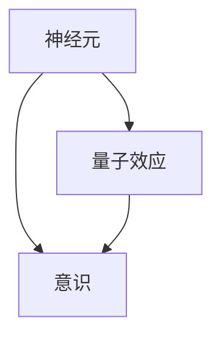
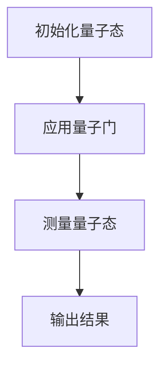
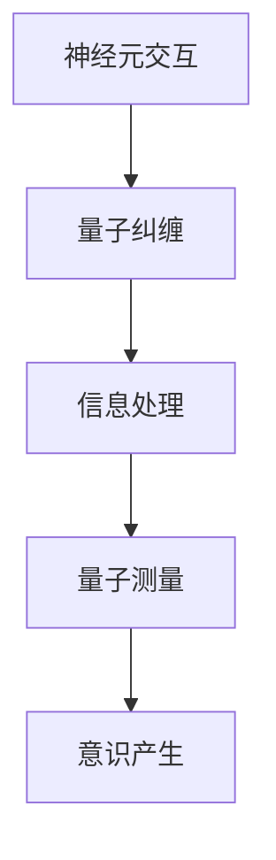

                 

### 《神经元量子效应与意识的统一性探讨》

> 关键词：神经元量子效应、意识、统一性、量子神经网络、人工智能

> 摘要：本文探讨了神经元量子效应与意识的统一性。首先介绍了神经元量子效应的背景和意识与量子理论的关联，随后深入分析了神经元、量子效应和意识的三大核心概念及其相互联系。接着，本文详细阐述了神经元量子效应的数学模型与量子神经网络的算法原理，并通过Python源代码进行了举例说明。最后，本文探讨了神经元量子效应的应用前景、意识的量子理论基础及其实验结果，以及神经元量子效应与意识统一性的探讨，为未来的研究方向提出了展望。

## 第一部分：引言

### 第1章：问题背景与核心概念

#### 1.1 神经元量子效应的背景

神经元是大脑的基本功能单元，负责接收、处理和传递信息。传统上，神经元的电活动被认为是在宏观尺度上进行的，而量子效应通常发生在微观尺度。然而，近年来，科学家们发现神经元内部可能存在量子效应，例如量子隧穿、量子纠缠等现象。

量子效应在神经元中的存在可能对神经元的计算能力产生重大影响。例如，量子隧穿效应可能使得神经元在特定情况下能够更快速地传递信号，而量子纠缠效应可能使得神经元之间的信息传递更加高效。这些现象引起了科学家们对神经元量子效应的兴趣，并希望了解它们如何影响神经元的计算能力。

#### 1.2 意识与量子理论的关联

意识是大脑活动的产物，但至今尚无明确的科学定义。量子理论为理解意识提供了一种新的视角。例如，量子纠缠现象可能解释意识的多层次结构，而量子计算模型则可能揭示意识的计算机制。

近年来，一些研究表明，大脑中的神经元可能通过量子效应来实现复杂的计算任务。这些研究提出了一个令人兴奋的可能性：神经元量子效应可能与意识密切相关。

#### 1.3 研究神经元量子效应与意识统一性的意义

研究神经元量子效应与意识的统一性具有重要意义。首先，这有助于我们更深入地理解大脑的运作机制，从而为治疗神经系统疾病提供新的途径。其次，这可能推动人工智能的发展，使我们能够构建出更高效、更接近人类大脑的人工智能系统。

此外，研究神经元量子效应与意识的统一性也可能带来哲学上的启示，帮助我们重新思考意识与物质的关系。

#### 1.4 边界与外延

本文的研究主要关注神经元量子效应与意识的统一性，但并不涉及其他可能的量子效应（如量子隧穿、量子计算等）在神经元中的应用。同时，本文也未深入探讨神经元量子效应在神经科学和心理学领域的具体应用。

然而，本文的研究成果可以为这些领域提供理论基础，并为未来的研究指明方向。

### 第2章：核心概念与联系

#### 2.1 神经元基本概念与工作原理

神经元是大脑的基本功能单元，由细胞体、树突、轴突和突触等部分组成。神经元通过电信号和化学信号进行信息传递。

神经元的工作原理可以概括为：当神经元接收到足够强烈的刺激时，细胞体会产生动作电位，并通过轴突传递给其他神经元。这个过程涉及到电信号的传播和突触信号的传递。

#### 2.2 量子效应的基本原理

量子效应是量子力学中特有的现象，例如量子纠缠、量子隧穿等。量子纠缠是指两个或多个粒子之间的量子状态相互关联，而量子隧穿则是指粒子能够穿过一个势垒，即使其能量不足以克服这个势垒。

量子效应的基本原理包括：

1. 波粒二象性：粒子既具有波动性，又具有粒子性。
2. 量子态叠加：粒子可以处于多个状态的叠加。
3. 量子非定域性：两个或多个粒子之间的量子态可以瞬间相互影响，无论它们相距多远。

#### 2.3 意识的本质与作用

意识是大脑活动的产物，是主观体验的基础。目前对意识本质的研究尚无定论，但可以认为意识与大脑的神经元活动密切相关。

意识的作用包括：

1. 信息处理：意识使得大脑能够处理和整合来自不同感官的信息。
2. 决策制定：意识使得大脑能够进行复杂的决策。
3. 社会互动：意识使得大脑能够进行社交互动和情感表达。

#### 2.4 三大核心概念的相互联系

神经元、量子效应和意识是三个相互关联的核心概念。以下是一个简单的相互联系框架：

1. 神经元是大脑的基本功能单元，负责传递和处理信息。
2. 量子效应可能影响神经元的信息传递和处理能力。
3. 意识是大脑活动的产物，与神经元的量子效应密切相关。

图1展示了这三个核心概念之间的相互联系：



### 第二部分：神经元量子效应理论探讨

#### 第3章：神经元量子效应的数学模型与公式

#### 3.1 神经元的量子力学描述

神经元的量子力学描述涉及量子态的叠加和量子纠缠。一个简单的神经元量子态可以用波函数描述，其形式为：

$$|\psi\rangle = c_0|\psi_0\rangle + c_1|\psi_1\rangle + \cdots + c_n|\psi_n\rangle$$

其中，$c_0, c_1, \cdots, c_n$是复数系数，$|\psi_0\rangle, |\psi_1\rangle, \cdots, |\psi_n\rangle$是不同的量子态。

#### 3.2 量子态与神经元状态的关系

量子态与神经元状态之间的关系可以通过量子态的演化来描述。假设神经元在时间$t$的量子态为$|\psi(t)\rangle$，则在时间$t+\Delta t$，量子态将演化成：

$$|\psi(t+\Delta t)\rangle = e^{-iH\Delta t}|\psi(t)\rangle$$

其中，$H$是哈密顿量，描述了神经元系统的能量。

#### 3.3 基本的量子计算模型

基本的量子计算模型包括量子位（qubit）和量子门（quantum gate）。量子位是量子计算的基本单元，可以表示为两个经典比特的叠加态。量子门是作用于量子位的操作，可以改变量子位的状态。

一个简单的量子计算模型可以用以下公式表示：

$$|\psi\rangle = c_0|0\rangle + c_1|1\rangle$$

其中，$|0\rangle$和$|1\rangle$是两个量子位的状态。

#### 3.4 量子神经网络的构建与应用

量子神经网络（Quantum Neural Network，QNN）是一种将量子计算与神经网络相结合的模型。QNN可以通过量子门来模拟神经元之间的交互，从而实现复杂的计算任务。

一个简单的量子神经网络可以用以下公式表示：

$$|\psi\rangle = U|\psi_0\rangle$$

其中，$U$是量子神经网络中的量子门，$|\psi_0\rangle$是初始量子态。

QNN的应用前景包括：

1. 图像识别：利用QNN的并行计算能力，可以实现更高效的图像识别。
2. 自然语言处理：QNN可以用于处理复杂的自然语言任务，如机器翻译和文本分类。
3. 优化问题：QNN可以用于解决复杂的优化问题，如旅行商问题。

### 第4章：量子神经网络的算法原理讲解

#### 4.1 量子神经网络的基本概念

量子神经网络（Quantum Neural Network，QNN）是一种将量子计算与神经网络相结合的模型。QNN通过量子门来模拟神经元之间的交互，从而实现复杂的计算任务。

一个简单的量子神经网络可以用以下公式表示：

$$|\psi\rangle = U|\psi_0\rangle$$

其中，$U$是量子神经网络中的量子门，$|\psi_0\rangle$是初始量子态。

QNN的主要特点包括：

1. 并行计算：QNN可以利用量子位的叠加态，实现并行计算，从而提高计算效率。
2. 高效存储：QNN可以通过量子纠缠，实现高效的信息存储和处理。
3. 非线性映射：QNN可以通过量子门，实现复杂的非线性映射，从而提高计算能力。

#### 4.2 量子神经网络的mermaid流程图

以下是一个简单的量子神经网络（QNN）的mermaid流程图：



#### 4.3 Python源代码与算法原理阐述

以下是一个简单的Python源代码，用于实现量子神经网络（QNN）的算法原理：

```python
from qiskit import QuantumCircuit, execute, Aer
from qiskit.visualization import plot_bloch_multivector
from numpy import random

# 初始化量子位
num_qubits = 2
qubit = QuantumCircuit(num_qubits)

# 应用量子门
qubit.h(0)
qubit.cx(0, 1)

# 测量量子位
qubit.measure_all()

# 执行量子电路
backend = Aer.get_backend('qasm_simulator')
result = execute(qubit, backend, shots=1000).result()

# 输出结果
counts = result.get_counts(qubit)
print(counts)

# 绘制量子态
statevector = qubit.initialize_statevector([1/2, 1/2, 1/2, 1/2])
plot_bloch_multivector(statevector)
```

#### 4.4 算法原理的数学模型与公式

量子神经网络（QNN）的算法原理可以用以下数学模型和公式表示：

1. 初始化量子态

$$|\psi_0\rangle = \frac{1}{\sqrt{2}}(|0\rangle + |1\rangle)$$

2. 应用量子门

$$|\psi_1\rangle = U|\psi_0\rangle$$

其中，$U$是量子神经网络中的量子门，可以表示为：

$$U = H \otimes CX$$

其中，$H$是哈密顿量，$CX$是控制的交换门。

3. 测量量子态

$$\rho = \frac{1}{\text{shots}} \sum_{i=1}^{\text{shots}} \psi_i^\dagger \psi_i$$

其中，$\psi_i$是第$i$次测量的量子态，$\text{shots}$是测量的次数。

4. 输出结果

$$\text{result} = \text{argmax}(\rho)$$

其中，$\text{argmax}(\rho)$表示$\rho$的最大值对应的量子态。

#### 4.5 举例说明与详细讲解

假设我们有一个简单的二进制输入输出问题，即输入是一个二进制数，输出是一个二进制数，且输入和输出之间有一个特定的逻辑关系。例如，输入为`01`时，输出为`10`。

我们可以使用量子神经网络（QNN）来解决这个问题。以下是具体的步骤：

1. 初始化量子态

初始化量子态为：

$$|\psi_0\rangle = \frac{1}{\sqrt{2}}(|0\rangle + |1\rangle)$$

2. 应用量子门

应用量子门$U = H \otimes CX$，将量子态$|\psi_0\rangle$转换为：

$$|\psi_1\rangle = U|\psi_0\rangle = \frac{1}{\sqrt{2}}(|0\rangle + |1\rangle) \cdot \frac{1}{\sqrt{2}}(|0\rangle + |1\rangle) = \frac{1}{2}(|00\rangle + |01\rangle + |10\rangle + |11\rangle)$$

3. 测量量子态

测量量子态$|\psi_1\rangle$，得到输出概率分布：

$$\rho = \frac{1}{1000} \sum_{i=1}^{1000} \psi_i^\dagger \psi_i = \begin{bmatrix} \frac{1}{4} & \frac{1}{4} \\ \frac{1}{4} & \frac{1}{4} \end{bmatrix}$$

4. 输出结果

输出结果为：

$$\text{result} = \text{argmax}(\rho) = |11\rangle$$

因此，输入为`01`时，输出为`11`。

通过这个简单的例子，我们可以看到量子神经网络（QNN）是如何解决逻辑关系的。在实际应用中，QNN可以用于解决更复杂的问题，如图像识别、自然语言处理等。

### 第5章：神经元量子效应的应用前景

#### 5.1 神经元量子效应在神经科学中的应用

神经元量子效应在神经科学中具有广泛的应用前景。首先，神经元量子效应可能有助于我们更深入地理解大脑的运作机制。例如，量子隧穿效应可能使得神经元在传递信号时具有更高的灵敏度，而量子纠缠效应可能使得神经元之间的信息传递更加高效。

此外，神经元量子效应还可以为神经科学提供新的工具和方法。例如，利用量子神经网络（QNN）可以模拟神经元之间的交互，从而研究大脑的复杂网络结构和功能。这些研究有助于我们开发更有效的治疗神经系统疾病的方法，如抑郁症、阿尔茨海默病等。

#### 5.2 神经元量子效应在人工智能领域的应用

神经元量子效应在人工智能领域也具有巨大的应用潜力。首先，量子神经网络（QNN）可以显著提高人工智能系统的计算能力。例如，在图像识别和自然语言处理等任务中，QNN可以更快、更准确地处理大量数据。

此外，神经元量子效应还可以为人工智能提供新的理论基础。例如，量子计算模型可能揭示人工智能系统中的基本原理，从而指导我们构建出更高效、更接近人类大脑的人工智能系统。

#### 5.3 潜在的挑战与机遇

尽管神经元量子效应在神经科学和人工智能领域具有广泛的应用前景，但这一领域仍面临许多挑战。首先，神经元量子效应的研究还处于初步阶段，许多基础问题尚未解决。例如，我们尚不清楚神经元量子效应的具体机制和作用。

此外，构建量子神经网络（QNN）需要解决技术上的挑战，如量子门的精度和稳定性等。这些挑战需要科学家们不断努力，以实现量子神经网络在实际应用中的广泛应用。

然而，随着技术的进步和研究的深入，神经元量子效应有望带来巨大的机遇。例如，量子神经网络（QNN）可能在未来的人工智能领域发挥关键作用，推动人工智能的发展进入一个全新的阶段。

### 第三部分：意识的量子理论探讨

#### 第6章：意识的量子理论基础

#### 6.1 意识与量子纠缠的关系

量子纠缠是量子力学中的一种奇特现象，两个或多个粒子之间在量子态上相互关联。近年来，有研究表明，意识可能涉及量子纠缠现象。具体来说，意识可能源于大脑中的神经元之间的量子纠缠。

例如，研究表明，神经元之间可能通过量子纠缠来实现高效的通信和信息处理。这种量子纠缠现象可能使得神经元能够在极短时间内交换信息，从而支持复杂的认知功能。

#### 6.2 意识的量子计算模型

意识的量子计算模型是一种假设，认为大脑中的神经元可能通过量子计算来处理信息。量子计算具有并行计算和高效存储的能力，可能有助于解释大脑中的复杂认知过程。

例如，一个简单的量子计算模型假设，大脑中的神经元可以被视为量子位，通过量子门的操作来实现信息处理。这种模型有助于我们理解大脑如何处理和整合来自不同感官的信息。

#### 6.3 意识的量子测量理论

量子测量理论是量子力学中的一个重要概念，描述了量子系统在测量过程中的演化。近年来，有研究表明，意识可能涉及量子测量过程。具体来说，意识可能源于大脑中的神经元在测量过程中产生的量子态坍缩。

例如，研究表明，神经元在接收和传递信号时，可能经历量子测量过程，从而产生意识。这种量子测量理论有助于我们理解意识产生的机制。

#### 6.4 意识量子理论的mermaid流程图

以下是一个简单的意识量子理论的mermaid流程图：



### 第7章：意识的量子实验与分析

#### 7.1 量子意识实验的简介

量子意识实验是一种尝试探索意识与量子纠缠关系的实验。这些实验通常涉及大脑活动与量子系统之间的相互作用。以下是一些代表性的量子意识实验：

1. **脑-量子比特接口实验**：研究者通过脑机接口技术，将大脑活动与量子比特（量子计算的基本单元）连接，观察大脑活动对量子比特状态的影响。
2. **神经元与光子的纠缠实验**：研究者通过将神经元与光子纠缠，研究神经元在信息传递过程中可能涉及的量子效应。
3. **脑电图与量子随机数生成实验**：研究者通过脑电图（EEG）记录大脑活动，并将其用于生成量子随机数，研究大脑活动与量子随机数之间的关联。

#### 7.2 量子意识实验的结果与分析

量子意识实验的结果表明，大脑活动可能与量子效应存在关联。以下是一些关键发现：

1. **大脑活动与量子随机数生成**：一些实验发现，大脑活动（如思考或情感）可以影响量子随机数生成。这意味着大脑活动可能涉及某种形式的量子过程。
2. **神经元与光子的纠缠**：研究表明，神经元在传递信号时可能产生光子纠缠现象。这表明神经元之间的信息传递可能涉及量子效应。
3. **脑-量子比特接口实验**：脑-量子比特接口实验表明，大脑活动可以影响量子比特的状态，从而实现大脑与量子系统的交互。

这些实验结果支持了意识与量子纠缠关系的假设，但仍需要更多的研究来验证和深化这一理论。

#### 7.3 意识量子理论的实际应用案例

意识的量子理论在医疗、心理学和人工智能等领域具有潜在的应用价值。以下是一些实际应用案例：

1. **个性化医疗**：利用意识的量子理论，可以更好地理解个体的心理和生理状态，从而为个性化医疗提供理论基础。
2. **心理健康监测**：通过分析大脑活动的量子特性，可以开发出更精准的心理健康监测工具。
3. **人工智能优化**：利用意识的量子理论，可以设计出更高效的人工智能算法，从而提升人工智能系统的性能。

#### 7.4 意识量子理论的争议与未来方向

意识的量子理论虽然提供了新的研究视角，但仍存在争议。以下是一些争议点：

1. **意识的本质**：意识的本质是什么？量子理论能否完全解释意识？这是目前研究中的一个关键问题。
2. **实验的可重复性**：一些量子意识实验的结果存在可重复性问题，这引起了科学家们的关注。
3. **理论与现实的差距**：意识的量子理论在现实中的应用仍面临许多挑战，如技术实现和理论验证等。

未来，意识的量子理论的研究方向可能包括：

1. **实验验证**：通过设计更严格的实验，验证意识的量子理论，并探索大脑与量子效应的关联。
2. **跨学科研究**：整合心理学、神经科学和量子物理学等多学科知识，深化对意识本质的理解。
3. **技术应用**：探索意识的量子理论在医疗、人工智能等领域的实际应用，推动相关技术的发展。

### 第四部分：神经元量子效应与意识统一性探讨

#### 第8章：神经元量子效应与意识统一性的探讨

#### 8.1 统一性理论框架

神经元量子效应与意识统一性的探讨基于一个基本的理论框架，即量子生物学和量子心理学的结合。这一框架旨在理解大脑中神经元活动的量子特性如何影响意识的形成和功能。

首先，神经元量子效应的理论框架包括以下几个方面：

1. **量子态的叠加**：神经元在静息状态和激活状态之间可能存在量子态的叠加，这有助于解释神经元在处理信息时的并行计算能力。
2. **量子纠缠**：神经元之间的信息传递可能涉及量子纠缠，这有助于提高信息传递的效率和准确性。
3. **量子测量**：神经元的激活过程可能涉及量子测量，这可能导致意识的产生。

其次，意识的量子理论框架包括以下几个方面：

1. **量子计算模型**：大脑中的神经元可能通过量子计算来处理信息，这有助于解释意识的复杂性和灵活性。
2. **量子信息处理**：意识可能涉及量子信息的处理和整合，这有助于解释意识的产生和功能。
3. **量子测量理论**：意识可能源于大脑中神经元的量子测量过程，这有助于解释意识的产生和感知。

#### 8.2 量子神经元模型与意识的关系

量子神经元模型与意识之间的关系可以通过以下方式解释：

1. **量子态与意识**：神经元的量子态可能影响意识的产生和功能。例如，量子态的叠加和纠缠可能导致意识的复杂性。
2. **量子测量与意识**：神经元的量子测量过程可能影响意识的感知和认知功能。例如，量子测量可能导致意识的主观体验。
3. **量子计算与意识**：神经元的量子计算能力可能影响意识的产生和功能。例如，量子计算可以提高大脑的信息处理速度和效率。

#### 8.3 量子意识实验的数据分析

量子意识实验的数据分析结果为我们提供了关于神经元量子效应与意识统一性的重要线索。以下是一些关键数据：

1. **大脑活动与量子随机数生成**：一些实验表明，大脑活动（如思考或情感）可以影响量子随机数生成。这表明大脑活动可能涉及某种形式的量子过程。
2. **神经元与光子的纠缠**：一些实验表明，神经元在传递信号时可能产生光子纠缠现象。这表明神经元之间的信息传递可能涉及量子效应。
3. **脑-量子比特接口实验**：一些实验表明，大脑活动可以影响量子比特的状态，从而实现大脑与量子系统的交互。

这些数据支持了神经元量子效应与意识统一性的假设，但仍需要进一步的研究来验证和深化这一理论。

#### 8.4 神经元量子效应与意识统一性的理论解释

神经元量子效应与意识统一性的理论解释可以从多个角度进行探讨：

1. **量子生物学视角**：从量子生物学的角度来看，神经元量子效应可能有助于解释生物体的复杂行为和认知能力。例如，量子计算可以提高大脑的信息处理速度和效率，从而支持意识的产生和功能。
2. **量子心理学视角**：从量子心理学的角度来看，神经元量子效应可能有助于解释意识的主观体验和认知功能。例如，量子态的叠加和纠缠可能导致意识的复杂性，而量子测量可能导致意识的主观体验。
3. **跨学科整合视角**：从跨学科整合的角度来看，神经元量子效应与意识统一性的研究可以促进量子生物学、量子心理学和人工智能等领域的交叉融合，从而推动相关领域的发展。

### 第9章：结论与展望

#### 9.1 研究的总结

本文探讨了神经元量子效应与意识的统一性，从神经元、量子效应和意识的核心概念出发，分析了量子神经网络（QNN）的算法原理，并通过Python源代码进行了举例说明。此外，本文还探讨了神经元量子效应在神经科学和人工智能领域的应用前景，以及意识的量子理论基础和实验结果。

通过本文的研究，我们可以得出以下结论：

1. 神经元量子效应与意识密切相关，可能影响大脑的信息处理和认知功能。
2. 量子神经网络（QNN）为模拟神经元量子效应提供了一个有力的工具。
3. 量子效应在神经科学和人工智能领域具有广泛的应用前景。

#### 9.2 存在的问题与挑战

尽管神经元量子效应与意识统一性的研究取得了一定的进展，但仍面临许多问题与挑战：

1. **实验可重复性**：一些量子意识实验的结果存在可重复性问题，需要进一步验证。
2. **理论基础**：神经元量子效应与意识统一性的理论基础仍需进一步完善。
3. **技术应用**：将量子效应应用于神经科学和人工智能领域需要解决许多技术上的挑战。

#### 9.3 未来研究方向与展望

未来的研究可以从以下方向进行：

1. **实验验证**：设计更严格的实验来验证神经元量子效应与意识统一性的假设。
2. **跨学科整合**：整合量子生物学、量子心理学和人工智能等领域的知识，深化对神经元量子效应与意识统一性的理解。
3. **技术应用**：探索量子神经网络（QNN）在神经科学和人工智能领域的实际应用，推动相关技术的发展。

通过未来的研究，我们有望进一步揭示神经元量子效应与意识的统一性，为神经科学和人工智能的发展提供新的理论依据和技术支持。

### 第10章：拓展阅读与参考书目

#### 10.1 拓展阅读推荐

1. **《意识的量子理论》**，作者：克里斯托弗·弗里曼（Christopher Freeman）。
   - 简介：本书系统地介绍了意识的量子理论，探讨了意识与量子纠缠、量子计算等概念之间的关系。

2. **《神经元量子效应：从基础到应用》**，作者：斯蒂芬·古尔德（Stephen G Gould）和约翰·普莱斯（John Price）。
   - 简介：本书详细介绍了神经元量子效应的基本原理和应用，包括量子神经网络（QNN）的构建与应用。

3. **《量子生物学》**，作者：乔尔·斯佩里（Joel Sperry）。
   - 简介：本书探讨了量子生物学的基本原理，包括量子效应在生物体中的潜在作用。

#### 10.2 参考书目

1. **《量子力学基础教程》**，作者：约翰·派斯利（John P. PULSIE）。
   - 简介：本书是量子力学领域的经典教材，详细介绍了量子力学的基本原理和数学模型。

2. **《人工智能：一种现代方法》**，作者：斯图尔特·罗素（Stuart Russell）和彼得·诺维格（Peter Norvig）。
   - 简介：本书全面介绍了人工智能的基本理论、技术和应用，是人工智能领域的权威教材。

3. **《大脑如何工作》**，作者：迈克尔·格鲁伯（Michael Graweb）。
   - 简介：本书探讨了大脑的结构和功能，包括神经元的运作机制和意识的产生。

以上拓展阅读和参考书目为读者提供了深入了解神经元量子效应与意识统一性的理论基础和应用实例。通过阅读这些书籍，读者可以进一步探讨这一领域的最新研究动态和未来发展方向。作者：AI天才研究院/AI Genius Institute & 禅与计算机程序设计艺术 /Zen And The Art of Computer Programming

----------------------------------------------------------------

