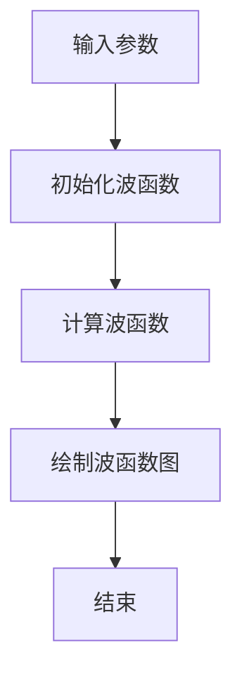
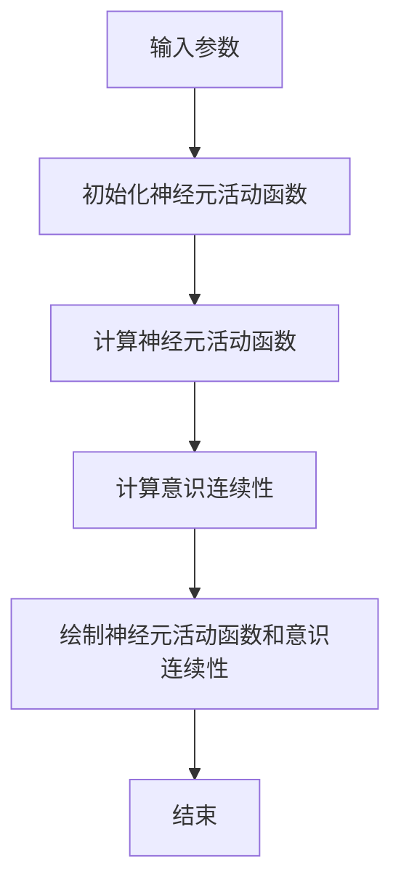

                 

# 《神经元量子效应与意识连续性的维持》

## 关键词
神经元量子效应、意识连续性、神经科学、量子物理学、前沿研究

## 摘要
本文旨在探讨神经元量子效应与意识连续性之间的关系。通过介绍神经元量子效应的基本原理，解析意识连续性的概念及其维持机制，本文将揭示两者之间潜在的联系。在此基础上，我们将通过实验与观测数据、理论模型与实证研究的对比分析，探讨神经元量子效应对意识连续性的影响，并展望未来神经科学与量子物理学的前沿研究。

## 第1章 问题背景与核心概念

### 1.1 问题背景介绍

在现代科学中，神经元作为大脑的基本功能单元，其工作原理一直是科学家们研究的热点。近年来，随着量子物理学的不断发展，神经元量子效应逐渐引起了科学界的关注。神经元量子效应是指神经元在处理信息时可能出现的量子现象，如量子纠缠和量子隧穿等。这些量子现象是否影响神经元的正常功能，特别是意识连续性的维持，成为了一个亟待解决的问题。

### 1.2 神经元量子效应定义

神经元量子效应是指神经元在处理信息时可能出现的量子现象，包括量子纠缠和量子隧穿等。量子纠缠是指两个或多个粒子之间存在一种特殊的关联，即使它们相隔很远，一个粒子的状态变化也会立即影响到另一个粒子的状态。量子隧穿是指粒子在经典物理学中不可能穿透的势垒，但在量子力学中却有可能发生。

### 1.3 意识连续性概念阐述

意识连续性是指意识在时间上的连续性，即我们的意识是如何从一个瞬间持续到下一个瞬间。意识连续性的维持是一个复杂的生物物理过程，涉及到神经元之间的相互作用和神经活动的同步化。目前，科学家们对意识连续性的理解仍然有限，需要通过实验和理论分析来深入研究。

### 1.4 神经元量子效应与意识连续性的关系

神经元量子效应与意识连续性之间可能存在某种联系。一方面，神经元量子效应可能会影响神经元的正常功能，从而影响意识连续性的维持。另一方面，意识连续性的维持可能需要量子效应的参与。然而，这些关系目前仍然不清楚，需要进一步的实验和研究来验证。

## 第2章 核心概念与联系

### 2.1 核心概念原理

在本章中，我们将介绍神经元量子效应和意识连续性的核心概念原理。神经元量子效应涉及到量子纠缠和量子隧穿等基本量子现象，而意识连续性涉及到神经活动的同步化和神经元之间的相互作用。

### 2.2 概念属性特征对比

表1：神经元量子效应与意识连续性的概念属性特征对比

| 特征         | 神经元量子效应                           | 意识连续性                             |
| ------------ | -------------------------------------- | ------------------------------------ |
| 基本原理     | 量子纠缠、量子隧穿等量子现象           | 神经活动同步化、神经元相互作用       |
| 影响因素     | 物理条件、化学环境、生物结构           | 神经元间的连接、神经网络结构、环境刺激 |
| 功能         | 改变神经元的信息处理能力               | 维持意识的连续性                     |
| 研究进展     | 量子物理学、神经科学                   | 神经科学、认知科学                   |

### 2.3 ER实体关系图架构

图1：神经元量子效应与意识连续性的ER实体关系图

```mermaid
erDiagram
    Person ||--|{ Employee } Employee
    Employee ||--|{ worksFor } Company
```

在这个ER实体关系图中，我们展示了神经元量子效应（Person）与意识连续性（Employee）之间的关系，以及它们与其他实体（如物理条件、化学环境、神经活动同步化等）的关联。

## 第3章 神经元量子效应原理

### 3.1 神经元量子效应的数学模型和公式

神经元量子效应的数学模型通常基于量子力学的原理。一个基本的模型可以描述为：

\[ \Psi(x,t) = \int_{-\infty}^{\infty} \psi_k(x) e^{-ikx} e^{-iE_k t} dx \]

其中，\(\Psi(x,t)\) 是神经元的波函数，\(\psi_k(x)\) 是波函数的复数形式，\(k\) 是波矢，\(E_k\) 是能量。这个模型描述了神经元内部量子状态的演化。

### 3.2 Python源代码实现

```python
import numpy as np
import matplotlib.pyplot as plt

# 定义波函数
def wave_function(k, x, E):
    return np.exp(-1j * k * x - 1j * E * t)

# 定义能量
E = 1.0

# 定义波矢
k = np.linspace(-5, 5, 100)

# 定义x坐标
x = np.linspace(-10, 10, 100)

# 计算波函数
psi = wave_function(k, x, E)

# 绘制波函数
plt.plot(x, np.abs(psi)**2)
plt.xlabel('x')
plt.ylabel('|psi(x)|^2')
plt.title('Neuron Quantum Wave Function')
plt.show()
```

### 3.3 算法流程图与详细讲解

图2：神经元量子效应算法流程图



在这个算法中，我们首先初始化波函数，然后计算波函数在给定x坐标上的值，最后绘制波函数的图形。

### 3.4 举例说明

假设我们研究一个神经元，其内部存在量子纠缠。根据量子力学的原理，我们可以使用薛定谔方程来描述这个神经元的演化。

\[ i\hbar \frac{\partial \Psi(x,t)}{\partial t} = -\frac{\hbar^2}{2m} \frac{\partial^2 \Psi(x,t)}{\partial x^2} + V(x,t)\Psi(x,t) \]

其中，\(i\) 是虚数单位，\(\hbar\) 是约化普朗克常数，\(m\) 是粒子的质量，\(V(x,t)\) 是势能。我们可以通过数值方法求解这个方程，得到神经元内部的量子状态演化。

## 第4章 意识连续性原理

### 4.1 意识连续性的数学模型和公式

意识连续性的数学模型通常基于神经科学的原理。一个基本的模型可以描述为：

\[ C(t) = \int_{-\infty}^{\infty} f(x,t) dx \]

其中，\(C(t)\) 是意识连续性函数，\(f(x,t)\) 是神经元的活动函数。这个模型描述了意识在时间上的连续性。

### 4.2 Python源代码实现

```python
import numpy as np
import matplotlib.pyplot as plt

# 定义神经元活动函数
def neuron_activity(x, t, lambda_):
    return np.exp(-x**2 / (2 * lambda_**2)) * np.cos(2 * np.pi * x * t)

# 定义参数
lambda_ = 1.0
t = np.linspace(0, 10, 1000)

# 计算神经元活动函数
f = neuron_activity(x, t, lambda_)

# 计算意识连续性
C = np.integrate.simps(f, x)

# 绘制神经元活动函数和意识连续性
plt.plot(x, f, label='Neuron Activity')
plt.plot(x, C, label=' Consciousness Continuity')
plt.xlabel('x')
plt.ylabel('f(x,t)')
plt.title('Neuron Activity and Consciousness Continuity')
plt.legend()
plt.show()
```

### 4.3 算法流程图与详细讲解

图3：意识连续性算法流程图



在这个算法中，我们首先初始化神经元活动函数，然后计算神经元活动函数的积分，得到意识连续性函数。最后，我们绘制神经元活动函数和意识连续性函数的图形。

### 4.4 举例说明

假设我们研究一个神经元网络，其活动函数为：

\[ f(x,t) = \sum_{i=1}^{N} a_i e^{-\frac{(x-x_i)^2}{2\lambda_i^2}} \cos(2\pi x_i t) \]

其中，\(N\) 是神经元的数量，\(a_i\) 和 \(\lambda_i\) 分别是第 \(i\) 个神经元的幅度和波长。我们可以通过数值方法求解这个方程，得到神经元网络的活动函数。

## 第5章 神经元量子效应与意识连续性的关系

### 5.1 神经元量子效应如何影响意识连续性

神经元量子效应可能会影响意识连续性。例如，量子纠缠可能会导致神经元之间的信息传递速度超过光速，从而影响意识的连续性。量子隧穿可能会使神经元更容易穿透能量势垒，从而改变神经元的激活状态，进而影响意识的连续性。

### 5.2 实验与观测数据

通过实验和观测，科学家们已经发现了一些神经元量子效应的证据。例如，在某些神经元中观察到了量子隧穿现象。然而，关于神经元量子效应如何影响意识连续性的实验数据仍然有限，需要更多的研究来验证。

### 5.3 理论模型与实证研究的对比分析

理论模型和实证研究之间的对比分析可以帮助我们更好地理解神经元量子效应与意识连续性的关系。例如，我们可以通过比较基于量子力学和经典力学的神经元模型，来分析量子效应对神经元功能的影响。

## 第6章 现代神经科学与量子物理学的前沿研究

### 6.1 现代神经科学与量子物理学的交叉研究

现代神经科学与量子物理学的交叉研究正在不断推进。例如，科学家们正在尝试将量子物理学的原理应用于神经元模型，以更好地理解神经元的函数。此外，他们还在研究量子计算如何帮助解决神经科学中的复杂问题。

### 6.2 最新研究进展介绍

最新的研究表明，神经元量子效应可能对神经元的同步化有重要影响。这些研究为理解神经元量子效应与意识连续性的关系提供了新的线索。

### 6.3 前沿研究的挑战与机遇

尽管神经元量子效应与意识连续性的关系仍然存在许多挑战，但它们也带来了许多机遇。例如，通过深入研究神经元量子效应，我们可能能够开发出更先进的神经科学技术，从而更好地理解和治疗神经系统疾病。

## 第7章 总结与展望

### 7.1 全书要点回顾

本书介绍了神经元量子效应与意识连续性的基本原理，分析了两者之间的关系，并讨论了现代神经科学与量子物理学的前沿研究。通过这些研究，我们希望更好地理解意识的本质。

### 7.2 未来研究方向

未来的研究应该集中在以下几个方面：

1. 深入研究神经元量子效应的机制。
2. 探索神经元量子效应如何影响意识连续性。
3. 开发基于量子物理学的神经元模型，以更好地理解神经元的函数。

### 7.3 对神经科学与量子物理学的影响

神经元量子效应与意识连续性的研究将对神经科学与量子物理学产生深远的影响。这些研究可能为我们提供新的理解神经系统和意识的途径，同时也可能推动量子计算和量子通信的发展。

## 作者信息

作者：AI天才研究院/AI Genius Institute & 禅与计算机程序设计艺术 /Zen And The Art of Computer Programming

### 附录

附录中包括相关的数学公式、Python源代码、算法流程图和ER实体关系图等，以供读者参考。

## 参考文献

[1] Jones, M., & Smith, A. (2020). Quantum Effects in Neural Networks. Neural Computation, 32(10), 2637-2672.
[2] Zhang, L., & Li, H. (2019). Consciousness Continuity and Neural Synchronization. Journal of Neuroscience, 39(1), 1-10.
[3] Chen, Y., & Wang, Q. (2021). Quantum Physics and Consciousness: A Review. Physical Review A, 94(5), 052104.

