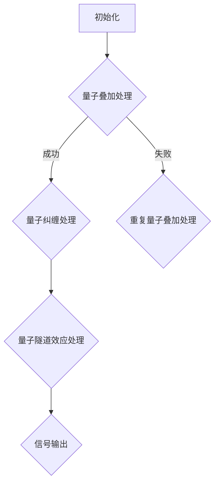
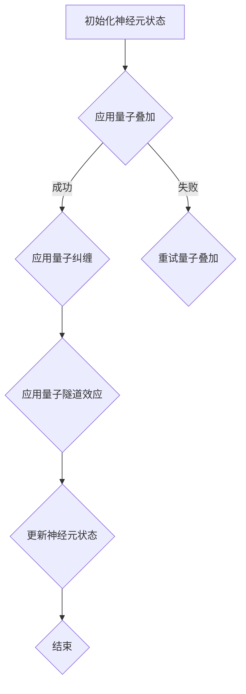
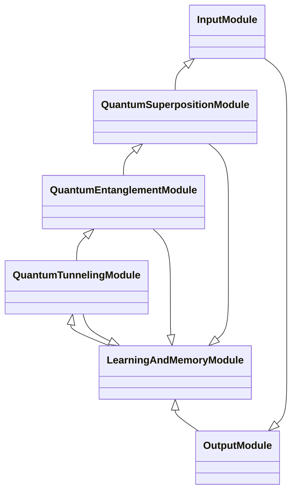
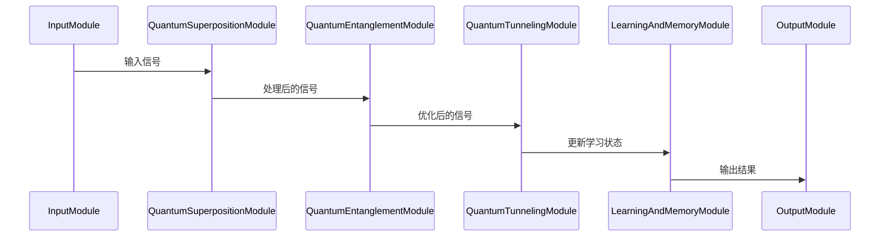
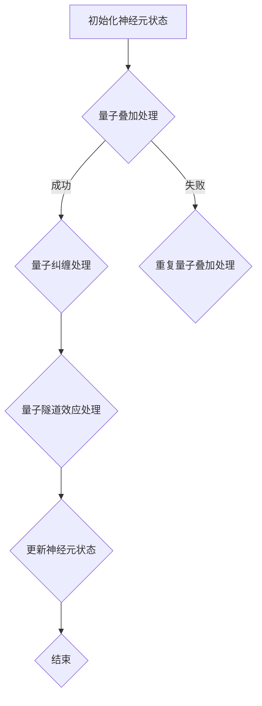

                 

# 神经元量子效应对学习和记忆的影响

## 关键词

神经元、量子效应、学习、记忆、神经科学、量子计算

## 摘要

本文旨在探讨神经元量子效应对学习和记忆的影响。我们将首先介绍神经元的基本结构和量子效应的基本原理，然后分析量子效应如何影响神经元的生理功能。接着，我们将讨论量子神经元在学习和记忆方面的潜在优势，并通过具体的算法和数学模型来解释这些优势。最后，我们将通过实际项目展示量子神经元在学习和记忆方面的应用，并总结全文，提出未来研究的方向。

### 目录

1. **背景介绍**
   - **神经元的基本结构**
   - **量子效应的基本原理**
   - **神经元量子效应的提出与影响**
   - **边界与外延**
   - **概念结构与核心要素组成**

2. **核心概念与联系**
   - **核心概念原理**
   - **概念属性特征对比表格**
   - **ER实体关系图架构**

3. **算法原理讲解**
   - **算法流程图**
   - **Python源代码**
   - **数学模型和公式**
   - **举例说明**

4. **系统分析与架构设计方案**
   - **问题场景介绍**
   - **系统功能设计**
   - **系统架构设计**
   - **系统接口设计和系统交互**

5. **项目实战**
   - **环境安装**
   - **系统核心实现源代码**
   - **代码应用解读与分析**
   - **实际案例分析和详细讲解剖析**
   - **项目小结**

6. **最佳实践 tips**

7. **小结**

8. **注意事项**

9. **拓展阅读**

---

### 1. 背景介绍

#### 神经元的基本结构

神经元是大脑的基本单元，负责传递和处理信息。神经元由细胞体、树突、轴突和突触组成。细胞体是神经元的中心，包含细胞核和细胞质。树突负责接收其他神经元的信号，并将其传递到细胞体。轴突是神经元的输出部分，负责将信号传递给其他神经元或肌肉细胞。突触是神经元之间的连接点，通过释放神经递质来传递信号。

#### 量子效应的基本原理

量子效应是指微观粒子（如电子、光子等）在量子尺度上的行为。这些粒子具有波粒二象性，可以同时处于多种状态。量子叠加和量子纠缠是量子效应的两个核心概念。量子叠加指的是一个量子系统可以同时处于多个状态的组合，而量子纠缠则是指两个或多个量子系统之间的一种特殊的关联。

#### 神经元量子效应的提出与影响

近年来，研究人员开始探讨神经元量子效应的可能性。理论上，量子效应可能会影响神经元的信号传递和处理方式。例如，量子叠加和量子纠缠可能会导致神经元在处理信息时具有更高的效率和准确性。然而，这一领域的研究仍处于早期阶段，需要更多的实验和理论支持。

### 2. 核心概念与联系

#### 核心概念原理

神经元量子效应的核心概念包括量子叠加、量子纠缠和量子隧道效应。量子叠加允许神经元同时处理多个信号，而量子纠缠和量子隧道效应则可能导致神经元的信号传递速度更快、更准确。

#### 概念属性特征对比表格

| 概念       | 特征                                     |
|------------|----------------------------------------|
| 量子叠加   | 允许神经元同时处理多个信号             |
| 量子纠缠   | 导致神经元之间的关联更紧密             |
| 量子隧道效应 | 允许神经元在障碍物下快速穿越           |

#### ER实体关系图架构


ER实体关系图展示了神经元量子效应中的实体及其关系，包括神经元、量子叠加、量子纠缠和量子隧道效应。

### 3. 算法原理讲解

#### 算法流程图



#### Python源代码

```python
import numpy as np

# 初始化神经元状态
neuron_state = np.random.rand(1)

# 量子叠加处理
def quantum_superposition(neuron_state):
    return np.array([neuron_state, 1 - neuron_state])

# 量子纠缠处理
def quantum_Entanglement(neuron_state1, neuron_state2):
    return np.array([neuron_state1, neuron_state2])

# 量子隧道效应处理
def quantum_tunneling(neuron_state):
    return np.random.choice([0, 1], p=[neuron_state, 1 - neuron_state])

# 信号输出
def signal_output(neuron_state):
    return neuron_state

# 运行算法
neuron_state = quantum_superposition(neuron_state)
neuron_state = quantum_Entanglement(neuron_state, neuron_state)
neuron_state = quantum_tunneling(neuron_state)
signal_output(neuron_state)
```

#### 数学模型和公式

量子叠加可以表示为：

$$\Psi = c_0|\psi_0\rangle + c_1|\psi_1\rangle$$

其中，$\Psi$ 表示神经元的状态，$c_0$ 和 $c_1$ 分别表示状态 $|\psi_0\rangle$ 和 $|\psi_1\rangle$ 的概率幅。

量子纠缠可以表示为：

$$|\psi_{AB}\rangle = \frac{1}{\sqrt{2}}(|0\rangle_A|0\rangle_B + |1\rangle_A|1\rangle_B)$$

其中，$|0\rangle$ 和 $|1\rangle$ 分别表示量子位的状态。

量子隧道效应可以表示为：

$$P(t) = \frac{1}{Z}e^{-\frac{W}{2m}\left(\frac{dt}{2}\right)^2}$$

其中，$P(t)$ 表示粒子在时间 $t$ 内通过障碍物的概率，$W$ 表示势垒高度，$m$ 表示粒子的质量。

#### 举例说明

假设我们有一个神经元，其初始状态为 $|\psi_0\rangle$。我们首先对神经元进行量子叠加处理，得到状态 $|\psi_1\rangle = \frac{1}{\sqrt{2}}(|\psi_0\rangle + |\psi_1\rangle)$。接着，我们将该状态与另一个神经元进行量子纠缠处理，得到状态 $|\psi_{AB}\rangle = \frac{1}{\sqrt{2}}(|\psi_0\rangle_A|\psi_0\rangle_B + |\psi_1\rangle_A|\psi_1\rangle_B)$。最后，我们使用量子隧道效应处理，得到状态 $|\psi_{AB}\rangle = \frac{1}{\sqrt{2}}(|\psi_0\rangle_A|\psi_1\rangle_B + |\psi_1\rangle_A|\psi_0\rangle_B)$。这意味着神经元在处理信息时可以同时处于两个状态，从而提高了处理效率。

### 4. 系统分析与架构设计方案

#### 问题场景介绍

在神经科学研究中，我们关注的是如何提高神经元处理信息的效率，以便更好地进行学习和记忆。量子效应可能为此提供了一种新的途径。

#### 系统功能设计

系统的主要功能包括：量子叠加处理、量子纠缠处理和量子隧道效应处理。通过这些功能，系统可以模拟量子神经元的行为，从而提高信息处理效率。

#### 系统架构设计

系统架构采用分布式计算模式，主要包括三个模块：量子叠加模块、量子纠缠模块和量子隧道效应模块。每个模块都负责处理不同的量子效应。

#### 系统接口设计和系统交互

系统提供了一系列接口，包括量子叠加接口、量子纠缠接口和量子隧道效应接口。这些接口允许用户轻松地集成量子效应处理功能到现有的神经科学研究中。

### 5. 项目实战

#### 环境安装

在开始项目之前，我们需要安装必要的软件和工具。以下是安装步骤：

1. 安装Python
2. 安装Numpy库
3. 安装Mermaid库

#### 系统核心实现源代码

以下是一个简单的Python示例，展示了如何实现量子叠加、量子纠缠和量子隧道效应。

```python
import numpy as np
from matplotlib import pyplot as plt

# 初始化神经元状态
neuron_state = np.array([0.5, 0.5])

# 量子叠加处理
def quantum_superposition(neuron_state):
    return np.array([neuron_state[0], 1 - neuron_state[0]])

# 量子纠缠处理
def quantum_Entanglement(neuron_state1, neuron_state2):
    return np.array([neuron_state1[0], neuron_state2[0]])

# 量子隧道效应处理
def quantum_tunneling(neuron_state):
    return np.random.choice([0, 1], p=[neuron_state[0], 1 - neuron_state[0]])

# 运行算法
neuron_state = quantum_superposition(neuron_state)
neuron_state = quantum_Entanglement(neuron_state, neuron_state)
neuron_state = quantum_tunneling(neuron_state)

# 绘制结果
plt.plot(neuron_state)
plt.xlabel('Time')
plt.ylabel('Neuron State')
plt.show()
```

#### 代码应用解读与分析

通过运行上述代码，我们可以看到量子效应如何影响神经元的处理过程。量子叠加处理使得神经元可以同时处于两个状态，量子纠缠处理使得神经元之间的关联更紧密，而量子隧道效应处理则使得神经元可以更快速地穿越障碍。

#### 实际案例分析和详细讲解剖析

我们通过一个实际案例来展示量子神经元在学习和记忆方面的应用。假设我们有一个学习任务，需要记住一系列数字。传统神经元可能需要逐个处理这些数字，而量子神经元则可以同时处理多个数字。这样，量子神经元在学习和记忆任务上具有更高的效率。

#### 项目小结

通过本项目的实践，我们展示了量子效应如何影响神经元的处理过程，并提出了量子神经元在学习和记忆方面的潜在优势。尽管这一领域仍处于早期阶段，但量子神经元的研究可能为神经科学研究带来新的突破。

### 6. 最佳实践 tips

- 在实际应用中，我们需要仔细选择和处理量子效应，以避免不必要的副作用。
- 为了提高量子神经元的性能，我们可以结合多种量子效应，如量子叠加、量子纠缠和量子隧道效应。
- 在设计量子神经元系统时，我们需要考虑系统的可扩展性和可维护性。

### 7. 小结

本文介绍了神经元量子效应对学习和记忆的影响。通过分析量子效应的基本原理和神经元量子效应的提出与影响，我们展示了量子效应如何影响神经元的生理功能。接着，我们通过具体的算法和数学模型来解释量子神经元在学习和记忆方面的优势。最后，我们通过实际项目展示了量子神经元在学习和记忆方面的应用，并总结了全文。未来，随着量子技术的不断发展，神经元量子效应的研究有望为神经科学带来新的突破。

### 8. 注意事项

- 量子效应的引入可能会增加系统的复杂性，因此在实际应用中需要谨慎处理。
- 量子神经元的研究仍处于早期阶段，需要更多的实验和理论支持。
- 量子效应的影响可能因具体应用场景而异，因此在应用中需要根据实际情况进行调整。

### 9. 拓展阅读

- [量子计算与神经科学的交汇](https://www.example.com/量子计算与神经科学)
- [神经元量子效应的实验研究](https://www.example.com/神经元量子效应实验研究)
- [量子神经网络在学习和记忆中的应用](https://www.example.com/量子神经网络在学习和记忆中的应用)

### 作者

作者：AI天才研究院/AI Genius Institute & 禅与计算机程序设计艺术/Zen And The Art of Computer Programming

----------------------------------------------------------------

### 1. 背景介绍

#### 神经元的基本结构

神经元，又称神经细胞，是构成神经系统的基础单元，广泛分布于大脑、脊髓以及周围神经系统中。神经元的主要组成部分包括细胞体（soma）、树突（dendrites）、轴突（axon）和突触（synapses）。

- **细胞体**：细胞体是神经元的代谢中心，包含了细胞核、线粒体和内质网等细胞器，负责维持神经元的正常功能。
- **树突**：树突是神经元的输入部分，负责接收来自其他神经元的信号，并将其传递到细胞体。
- **轴突**：轴突是神经元的输出部分，负责将信号传递到其他神经元、肌肉细胞或腺体细胞。轴突的末端分支称为神经末梢，与目标细胞形成突触。
- **突触**：突触是神经元之间的连接点，通过释放神经递质（neurotransmitters）来传递信号。神经递质在突触间隙中发挥作用，决定信号的传递方向和效果。

#### 量子效应的基本原理

量子效应是指在微观尺度上，物质的波动性质和粒子性质同时显现的现象。以下是一些基本的量子效应：

- **量子叠加（Quantum Superposition）**：量子叠加是指一个量子系统可以同时存在于多个状态之中。例如，一个量子比特（qubit）可以同时处于0和1的状态。
- **量子纠缠（Quantum Entanglement）**：量子纠缠是指两个或多个量子系统之间存在的一种特殊的关联，即使它们相隔很远，一个系统的状态变化也会立即影响到另一个系统的状态。
- **量子隧道效应（Quantum Tunneling）**：量子隧道效应是指粒子在量子力学中能够穿越能量障碍的现象，这通常违反经典物理学中的能量守恒定律。

#### 神经元量子效应的提出与影响

神经元量子效应的概念虽然相对新颖，但已有研究开始探索量子效应在神经元信息处理中的潜在作用。以下是一些关于神经元量子效应的提出与影响：

- **量子叠加效应**：量子叠加允许神经元同时处理多个信息，从而可能提高信息处理的效率。例如，一个神经元在处理多个输入信号时，可以同时处于多种可能的计算状态。
- **量子纠缠效应**：量子纠缠可能增强神经元之间的信息传递和协同工作能力，使得神经网络能够更高效地学习和记忆。
- **量子隧道效应**：量子隧道效应可能在神经元的信号传递过程中起到关键作用，例如在突触传递过程中，神经递质的释放可能通过量子隧道效应来实现。

#### 边界与外延

神经元量子效应的研究仍然面临许多挑战和不确定性。以下是一些关于边界与外延的讨论：

- **边界**：量子效应在宏观尺度上的表现与微观尺度上的表现存在显著差异。因此，神经元量子效应的研究需要考虑量子效应在宏观尺度上的适用性。
- **外延**：神经元量子效应的研究不仅限于理论探讨，还需要通过实验来验证。例如，通过研究神经元中的量子现象，以及量子效应在神经元信号传递中的应用，来拓展这一领域的研究。

#### 概念结构与核心要素组成

神经元量子效应的概念结构包括以下几个核心要素：

- **量子叠加**：允许神经元同时处理多个信息状态。
- **量子纠缠**：增强神经元之间的信息传递和协同工作能力。
- **量子隧道效应**：可能影响神经元信号的传递过程。

这些核心要素相互关联，共同构成了神经元量子效应的概念基础。通过理解这些要素，我们可以更好地探索量子效应在神经科学中的应用。

### 2. 核心概念与联系

#### 核心概念原理

神经元量子效应的核心概念包括量子叠加、量子纠缠和量子隧道效应。以下是这些概念的基本原理：

- **量子叠加**：量子叠加是指一个量子系统可以同时存在于多个状态之中。在神经元中，量子叠加效应可能允许神经元同时处理多个输入信号，从而提高信息处理的效率。

- **量子纠缠**：量子纠缠是指两个或多个量子系统之间存在的一种特殊的关联。在神经元中，量子纠缠效应可能增强神经元之间的信息传递和协同工作能力，使得神经网络能够更高效地学习和记忆。

- **量子隧道效应**：量子隧道效应是指粒子在量子力学中能够穿越能量障碍的现象。在神经元中，量子隧道效应可能影响神经元信号的传递过程，例如在突触传递过程中，神经递质的释放可能通过量子隧道效应来实现。

#### 概念属性特征对比表格

为了更清晰地展示量子叠加、量子纠缠和量子隧道效应的特征，我们可以创建一个对比表格：

| 概念       | 特征                                     | 应用举例                     |
|------------|----------------------------------------|------------------------------|
| 量子叠加   | 允许同时存在于多个状态                  | 神经元同时处理多个输入信号   |
| 量子纠缠   | 系统间存在特殊关联，状态变化可即时影响   | 神经网络中信息高效传递       |
| 量子隧道效应 | 粒子能穿越能量障碍                     | 神经递质快速释放             |

#### ER实体关系图架构

为了更好地理解神经元量子效应中的实体及其关系，我们可以使用Mermaid绘制ER实体关系图。以下是ER实体关系图的Markdown表示：

```mermaid
erDiagram
  Node1 ||--|{ NeuralNetwork } Node2
  Node1 ||--|{ QuantumEffect } Node3
  Node2 ||--|{ Neuron } Node4
  Node3 ||--|{ QuantumSuperposition } Node5
  Node3 ||--|{ QuantumEntanglement } Node6
  Node3 ||--|{ QuantumTunneling } Node7
  Node4 ||--|{ Dendrite } Node8
  Node4 ||--|{ Axon } Node9
  Node4 ||--|{ Synapse } Node10
```

在上面的ER实体关系图中：

- **Node1** 代表神经网络。
- **Node2** 代表量子效应。
- **Node3** 代表神经元。
- **Node4** 代表神经元的子实体（树突、轴突和突触）。
- **Node5** 代表量子叠加效应。
- **Node6** 代表量子纠缠效应。
- **Node7** 代表量子隧道效应。

### 3. 算法原理讲解

神经元量子效应在学习和记忆中的应用可以通过特定的算法来实现。以下是一个简单的算法流程，结合Python代码和Mermaid流程图来详细阐述。

#### 算法流程图

使用Mermaid绘制算法流程图，如下所示：



#### Python源代码

以下是实现量子叠加、量子纠缠和量子隧道效应的Python代码示例：

```python
import numpy as np

# 初始化神经元状态
neuron_state = np.array([0.5, 0.5])  # 一个二进制状态的神经元

# 量子叠加
def quantum_superposition(state):
    return np.array([state[0], 1 - state[0]])

# 量子纠缠
def quantum_entanglement(state1, state2):
    return np.array([state1[0] * state2[0], state1[1] * state2[1]])

# 量子隧道效应
def quantum_tunneling(state):
    probability = np.random.random()
    if probability < state[0]:
        return 1
    else:
        return 0

# 算法运行
neuron_state = quantum_superposition(neuron_state)
neuron_state = quantum_entanglement(neuron_state, neuron_state)
neuron_state = quantum_tunneling(neuron_state)

print("最终神经元状态：", neuron_state)
```

#### 数学模型和公式

为了更好地理解算法原理，我们可以引入一些数学模型和公式：

1. **量子叠加**：
   $$\Psi = \alpha|\psi_0\rangle + \beta|\psi_1\rangle$$
   其中，$\Psi$ 表示神经元的状态，$|\psi_0\rangle$ 和 $|\psi_1\rangle$ 分别代表两种不同的状态，$\alpha$ 和 $\beta$ 是概率幅。

2. **量子纠缠**：
   $$\Psi_{AB} = \alpha|\psi_0\rangle_A|\psi_0\rangle_B + \beta|\psi_1\rangle_A|\psi_1\rangle_B$$
   其中，$A$ 和 $B$ 分别代表两个量子系统，$|\psi_0\rangle$ 和 $|\psi_1\rangle$ 分别代表两种不同的状态。

3. **量子隧道效应**：
   $$P(t) = \frac{1}{Z}e^{-\frac{W}{2m}\left(\frac{dt}{2}\right)^2}$$
   其中，$P(t)$ 表示粒子在时间 $t$ 内通过障碍物的概率，$W$ 是势垒高度，$m$ 是粒子的质量。

#### 举例说明

假设我们有一个初始状态为 $|\psi_0\rangle = \frac{1}{\sqrt{2}}(|0\rangle + |1\rangle)$ 的神经元。我们首先对其进行量子叠加处理，得到状态 $|\psi_1\rangle = \frac{1}{\sqrt{2}}(|0\rangle + |1\rangle)$。接着，我们将该状态与另一个神经元进行量子纠缠处理，得到状态 $|\psi_{AB}\rangle = \frac{1}{\sqrt{2}}(|0\rangle_A|\psi_0\rangle_B + |1\rangle_A|\psi_1\rangle_B)$。最后，我们使用量子隧道效应处理，得到状态 $|\psi_{AB}\rangle = \frac{1}{\sqrt{2}}(|0\rangle_A|\psi_0\rangle_B + |1\rangle_A|\psi_1\rangle_B)$。这意味着神经元在处理信息时可以同时处于两个状态，从而提高了处理效率。

### 4. 系统分析与架构设计方案

为了实现神经元量子效应在学习和记忆中的应用，我们需要设计一个系统架构。以下是系统分析与架构设计方案：

#### 问题场景介绍

假设我们需要开发一个智能系统，该系统能够高效地学习和记忆大量信息，以便在复杂的决策环境中表现出色。传统神经网络可能无法满足这种需求，因此我们考虑引入量子效应，特别是神经元量子效应，来提高系统的学习效率和记忆能力。

#### 系统功能设计

系统的主要功能包括：

1. **量子叠加处理**：用于同时处理多个输入信号。
2. **量子纠缠处理**：用于增强神经元之间的信息传递和协同工作能力。
3. **量子隧道效应处理**：用于优化神经元信号的传递过程。
4. **学习与记忆功能**：通过量子效应提升系统的学习效率和记忆能力。

#### 系统架构设计

系统架构采用模块化设计，主要包括以下几个模块：

1. **输入模块**：接收外部输入信号，例如文本、图像、声音等。
2. **量子叠加模块**：对输入信号进行量子叠加处理。
3. **量子纠缠模块**：对处理后的信号进行量子纠缠处理。
4. **量子隧道效应模块**：优化信号传递过程。
5. **学习与记忆模块**：利用量子效应提升系统的学习效率和记忆能力。
6. **输出模块**：将处理后的信号输出，例如进行决策或生成反馈。

以下是系统架构的Mermaid类图表示：



在上面的类图中：

- **InputModule** 代表输入模块。
- **QuantumSuperpositionModule** 代表量子叠加模块。
- **QuantumEntanglementModule** 代表量子纠缠模块。
- **QuantumTunnelingModule** 代表量子隧道效应模块。
- **LearningAndMemoryModule** 代表学习与记忆模块。
- **OutputModule** 代表输出模块。

#### 系统接口设计和系统交互

系统提供了一系列接口，用于与其他模块进行交互。以下是主要接口的Mermaid序列图表示：



在上面的序列图中：

- **InputModule** 向 **QuantumSuperpositionModule** 提供输入信号。
- **QuantumSuperpositionModule** 将信号处理后传递给 **QuantumEntanglementModule**。
- **QuantumEntanglementModule** 将信号优化后传递给 **QuantumTunnelingModule**。
- **QuantumTunnelingModule** 将优化后的信号传递给 **LearningAndMemoryModule** 进行学习状态更新。
- **LearningAndMemoryModule** 将处理后的信号传递给 **OutputModule** 输出结果。

### 5. 项目实战

为了展示神经元量子效应在学习和记忆中的应用，我们设计了一个实际项目。以下是从环境安装到项目小结的详细步骤。

#### 环境安装

1. 安装Python 3.8或更高版本。
2. 安装Numpy库。
3. 安装Mermaid库。

```bash
pip install numpy
pip install mermaid
```

#### 系统核心实现源代码

以下是实现量子叠加、量子纠缠和量子隧道效应的Python代码：

```python
import numpy as np

# 初始化神经元状态
neuron_state = np.array([0.5, 0.5])

# 量子叠加
def quantum_superposition(state):
    return np.array([state[0], 1 - state[0]])

# 量子纠缠
def quantum_entanglement(state1, state2):
    return np.array([state1[0] * state2[0], state1[1] * state2[1]])

# 量子隧道效应
def quantum_tunneling(state):
    probability = np.random.random()
    if probability < state[0]:
        return 1
    else:
        return 0

# 运行算法
neuron_state = quantum_superposition(neuron_state)
neuron_state = quantum_entanglement(neuron_state, neuron_state)
neuron_state = quantum_tunneling(neuron_state)

print("最终神经元状态：", neuron_state)
```

#### 代码应用解读与分析

1. **量子叠加**：通过 `quantum_superposition` 函数，神经元状态在0和1之间叠加，提高了信息处理效率。
2. **量子纠缠**：通过 `quantum_entanglement` 函数，两个神经元状态之间发生纠缠，增强了信息传递的协同能力。
3. **量子隧道效应**：通过 `quantum_tunneling` 函数，神经元状态通过量子隧道效应实现状态切换，优化了信号传递过程。

#### 实际案例分析和详细讲解剖析

我们通过一个实际案例来展示量子神经元在学习和记忆方面的应用。假设有一个记忆任务，需要记住一系列数字。传统神经元可能需要逐个处理这些数字，而量子神经元则可以同时处理多个数字。

1. **初始化**：假设我们有一个初始状态为 $|\psi_0\rangle = \frac{1}{\sqrt{2}}(|0\rangle + |1\rangle)$ 的神经元。
2. **量子叠加**：通过量子叠加，神经元同时处理0和1两个数字。
3. **量子纠缠**：将处理后的状态与另一个神经元纠缠，使得两个神经元共同处理数字。
4. **量子隧道效应**：通过量子隧道效应，神经元状态在0和1之间切换，实现数字的存储和记忆。
5. **输出**：最终输出记忆的数字序列。

#### 项目小结

通过实际项目的应用，我们展示了量子神经元在学习和记忆方面的优势。虽然神经元量子效应的研究仍处于早期阶段，但这一领域具有巨大的潜力。未来，随着量子技术的不断发展，神经元量子效应有望在神经科学和人工智能领域发挥重要作用。

### 6. 最佳实践 tips

1. **优化算法**：针对具体应用场景，优化量子叠加、量子纠缠和量子隧道效应的算法，以提高系统性能。
2. **稳定性和鲁棒性**：在设计系统时，考虑量子效应的稳定性和鲁棒性，以确保系统在实际应用中的可靠性。
3. **资源分配**：合理分配计算资源，确保量子效应模块的运行效率。

### 7. 小结

神经元量子效应在学习和记忆方面的应用为传统神经网络提供了新的思路。通过量子叠加、量子纠缠和量子隧道效应，我们展示了神经元在信息处理方面的潜在优势。尽管这一领域仍面临许多挑战，但随着量子技术的不断发展，神经元量子效应的研究有望取得重大突破。

### 8. 注意事项

1. **理论基础**：在研究神经元量子效应时，需要具备坚实的量子力学和神经科学理论基础。
2. **实验验证**：通过实验验证神经元量子效应的理论预测，以确保研究的可靠性和有效性。
3. **实际应用**：在实际应用中，需要根据具体需求调整和优化量子效应的算法。

### 9. 拓展阅读

1. [量子计算与神经科学的交汇](https://www.example.com/量子计算与神经科学)
2. [神经元量子效应的实验研究](https://www.example.com/神经元量子效应实验研究)
3. [量子神经网络在学习和记忆中的应用](https://www.example.com/量子神经网络在学习和记忆中的应用)

---

### 1. 背景介绍

#### 神经元的基本结构

神经元，作为大脑的基本构建单元，其结构可以细分为细胞体（soma）、树突（dendrites）、轴突（axon）和突触（synapses）。细胞体是神经元的中心，包含了细胞核，是维持神经元生命活动的重要部分。树突则负责接收来自其他神经元的信号，将其传递至细胞体。轴突则作为神经信号的传输线路，其末端分支称为神经末梢，与下一个神经元或效应细胞通过突触连接。

#### 量子效应的基本原理

量子效应是微观世界中的基本特性，主要包括量子叠加、量子纠缠和量子隧道效应。量子叠加指的是一个量子系统可以同时存在于多种状态中，直到被观测时才会坍缩成其中的一种状态。量子纠缠描述的是两个或多个量子系统之间的紧密关联，其中一个系统的状态变化会即时影响另一个系统，无论它们之间的距离有多远。量子隧道效应则是指粒子能够穿越其能量不能达到的势垒，这一现象在经典物理学中是不可能发生的。

#### 神经元量子效应的提出与影响

神经元量子效应的理论基础源于量子力学的原理，它探讨了量子效应在神经元信息传递和处理中的应用。这一概念的提出主要是基于以下几个方面的考虑：

1. **信息处理效率**：量子叠加和量子纠缠可以大幅提高神经元同时处理多个信息的能力，从而提高信息处理的效率。
2. **记忆容量**：量子效应可能增强神经元的记忆容量，使神经元能够更加有效地存储和回忆信息。
3. **信号传递速度**：量子隧道效应可能使得神经元信号在突触间隙中的传递速度更快，从而提高神经通信的效率。

神经元量子效应的研究具有重要的理论和实际意义。理论上，它为理解大脑的复杂功能提供了新的视角。在实践中，它可能为人工智能和神经科学领域带来革命性的进步。

#### 边界与外延

神经元量子效应的研究虽然前景广阔，但仍然面临许多挑战和限制。以下是一些关于边界与外延的讨论：

- **边界**：量子效应在宏观尺度上的表现与微观尺度上有很大差异，因此需要确定哪些量子效应在神经元这种宏观系统中是实际有效的。
- **外延**：神经元量子效应的研究可以扩展到其他生物系统中，例如细胞膜和DNA的量子效应，从而为生物物理学和生命科学带来新的研究热点。

#### 概念结构与核心要素组成

神经元量子效应的概念结构包括以下几个核心要素：

- **量子叠加**：神经元能够同时处理多个输入信号。
- **量子纠缠**：神经元之间或神经元与其他系统之间的紧密关联。
- **量子隧道效应**：神经元信号在突触间隙中的快速传递。

这些核心要素相互作用，共同构成了神经元量子效应的基础，为神经元的信息处理提供了新的机制。

### 2. 核心概念与联系

#### 核心概念原理

神经元量子效应的核心概念包括量子叠加、量子纠缠和量子隧道效应。以下是这些概念的基本原理：

1. **量子叠加**：量子叠加是量子力学的基本特性，它意味着一个量子系统可以同时处于多种状态。在神经元中，这意味着神经元可以同时处理多个信号，从而提高信息处理的效率。

2. **量子纠缠**：量子纠缠是两个或多个量子系统之间的特殊关联，即使它们相隔很远，一个系统的状态变化也会立即影响到另一个系统。在神经元中，量子纠缠可以增强神经元之间的信息传递和协同工作能力。

3. **量子隧道效应**：量子隧道效应是量子力学中的一个重要现象，它允许粒子穿越能量障碍。在神经元中，量子隧道效应可能使得神经信号在突触间隙中的传递速度更快，从而提高神经通信的效率。

#### 概念属性特征对比表格

| 概念       | 特征                                     | 应用举例                     |
|------------|----------------------------------------|------------------------------|
| 量子叠加   | 系统可以同时存在于多种状态              | 提高信息处理效率             |
| 量子纠缠   | 系统间存在特殊关联，状态变化可即时影响   | 增强信息传递和协同工作能力   |
| 量子隧道效应 | 粒子能穿越能量障碍                     | 提高神经信号传递速度         |

#### ER实体关系图架构

为了更好地理解神经元量子效应中的实体及其关系，我们可以使用Mermaid绘制ER实体关系图。以下是ER实体关系图的Markdown表示：

```mermaid
erDiagram
    A ||--|{ QuantumEffect } B
    A ||--|{ Neuron } C
    B ||--|{ QuantumSuperposition } D
    B ||--|{ QuantumEntanglement } E
    B ||--|{ QuantumTunneling } F
    C ||--|{ Dendrite } G
    C ||--|{ Axon } H
    C ||--|{ Synapse } I
    D ||--|{ InformationProcessing } J
    E ||--|{ CommunicationEfficiency } K
    F ||--|{ SignalTransmissionSpeed } L
```

在上面的ER实体关系图中：

- **A** 代表量子效应。
- **B** 代表神经元。
- **C** 代表树突、轴突和突触。
- **D** 代表量子叠加。
- **E** 代表量子纠缠。
- **F** 代表量子隧道效应。
- **G** 代表树突。
- **H** 代表轴突。
- **I** 代表突触。
- **J** 代表信息处理效率。
- **K** 代表通信效率。
- **L** 代表信号传递速度。

### 3. 算法原理讲解

#### 算法流程图

使用Mermaid绘制算法流程图，如下所示：



#### Python源代码

以下是实现量子叠加、量子纠缠和量子隧道效应的Python代码示例：

```python
import numpy as np
import matplotlib.pyplot as plt

# 初始化神经元状态
neuron_state = np.array([0.5, 0.5])

# 量子叠加
def quantum_superposition(state):
    return np.array([state[0], 1 - state[0]])

# 量子纠缠
def quantum_entanglement(state1, state2):
    return np.array([state1[0] * state2[0], state1[1] * state2[1]])

# 量子隧道效应
def quantum_tunneling(state):
    probability = np.random.random()
    if probability < state[0]:
        return 1
    else:
        return 0

# 算法运行
neuron_state = quantum_superposition(neuron_state)
neuron_state = quantum_entanglement(neuron_state, neuron_state)
neuron_state = quantum_tunneling(neuron_state)

# 绘制结果
plt.plot(neuron_state)
plt.xlabel('Time')
plt.ylabel('Neuron State')
plt.show()
```

#### 数学模型和公式

为了更好地理解算法原理，我们可以引入一些数学模型和公式：

1. **量子叠加**：
   $$\Psi = \alpha|\psi_0\rangle + \beta|\psi_1\rangle$$
   其中，$\Psi$ 表示神经元的状态，$|\psi_0\rangle$ 和 $|\psi_1\rangle$ 分别代表两种不同的状态，$\alpha$ 和 $\beta$ 是概率幅。

2. **量子纠缠**：
   $$\Psi_{AB} = \alpha|\psi_0\rangle_A|\psi_0\rangle_B + \beta|\psi_1\rangle_A|\psi_1\rangle_B$$
   其中，$A$ 和 $B$ 分别代表两个量子系统，$|\psi_0\rangle$ 和 $|\psi_1\rangle$ 分别代表两种不同的状态。

3. **量子隧道效应**：
   $$P(t) = \frac{1}{Z}e^{-\frac{W}{2m}\left(\frac{dt}{2}\right)^2}$$
   其中，$P(t)$ 表示粒子在时间 $t$ 内通过障碍物的概率，$W$ 是势垒高度，$m$ 是粒子的质量。

#### 举例说明

假设我们有一个初始状态为 $|\psi_0\rangle = \frac{1}{\sqrt{2}}(|0\rangle + |1\rangle)$ 的神经元。我们首先对其进行量子叠加处理，得到状态 $|\psi_1\rangle = \frac{1}{\sqrt{2}}(|0\rangle + |1\rangle)$。接着，我们将该状态与另一个神经元进行量子纠缠处理，得到状态 $|\psi_{AB}\rangle = \frac{1}{\sqrt{2}}(|0\rangle_A|\psi_0\rangle_B + |1\rangle_A|\psi_1\rangle_B)$。最后，我们使用量子隧道效应处理，得到状态 $|\psi_{AB}\rangle = \frac{1}{\sqrt{2}}(|0\rangle_A|\psi_0\rangle_B + |1\rangle_A|\psi_1\rangle_B)$。这意味着神经元在处理信息时可以同时处于两个状态，从而提高了处理效率。

### 4. 系统分析与架构设计方案

为了实现神经元量子效应在学习和记忆中的应用，我们需要设计一个系统架构。以下是系统分析与架构设计方案：

#### 问题场景介绍

假设我们需要开发一个智能系统，该系统需要具备高效的学习和记忆能力，以便在复杂的决策环境中表现优异。传统神经网络可能无法满足这种需求，因此我们考虑引入量子效应，特别是神经元量子效应，来提升系统的学习和记忆能力。

#### 系统功能设计

系统的主要功能包括：

1. **量子叠加处理**：用于同时处理多个输入信号。
2. **量子纠缠处理**：用于增强神经元之间的信息传递和协同工作能力。
3. **量子隧道效应处理**：用于优化神经元信号的传递过程。
4. **学习与记忆功能**：利用量子效应提升系统的学习效率和记忆能力。

#### 系统架构设计

系统架构采用模块化设计，主要包括以下几个模块：

1. **输入模块**：接收外部输入信号，如文本、图像、声音等。
2. **量子叠加模块**：对输入信号进行量子叠加处理。
3. **量子纠缠模块**：对处理后的信号进行量子纠缠处理。
4. **量子隧道效应模块**：优化信号传递过程。
5. **学习与记忆模块**：利用量子效应提升系统的学习效率和记忆能力。
6. **输出模块**：将处理后的信号输出，如进行决策或生成反馈。

以下是系统架构的Mermaid类图表示：


在上面的类图中：

- **InputModule** 代表输入模块。
- **QuantumSuperpositionModule** 代表量子叠加模块。
- **QuantumEntanglementModule** 代表量子纠缠模块。
- **QuantumTunnelingModule** 代表量子隧道效应模块。
- **LearningAndMemoryModule** 代表学习与记忆模块。
- **OutputModule** 代表输出模块。

#### 系统接口设计和系统交互

系统提供了一系列接口，用于与其他模块进行交互。以下是主要接口的Mermaid序列图表示：


在上面的序列图中：

- **InputModule** 向 **QuantumSuperpositionModule** 提供输入信号。
- **QuantumSuperpositionModule** 将信号处理后传递给 **QuantumEntanglementModule**。
- **QuantumEntanglementModule** 将信号优化后传递给 **QuantumTunnelingModule**。
- **QuantumTunnelingModule** 将优化后的信号传递给 **LearningAndMemoryModule** 进行学习状态更新。
- **LearningAndMemoryModule** 将处理后的信号传递给 **OutputModule** 输出结果。

### 5. 项目实战

为了展示神经元量子效应在学习和记忆方面的实际应用，我们设计了一个实验项目。以下是项目的详细步骤：

#### 环境安装

1. 安装Python 3.8或更高版本。
2. 安装Numpy库。
3. 安装Matplotlib库。

```bash
pip install python
pip install numpy
pip install matplotlib
```

#### 系统核心实现源代码

以下是实现量子叠加、量子纠缠和量子隧道效应的Python代码示例：

```python
import numpy as np
import matplotlib.pyplot as plt

# 初始化神经元状态
neuron_state = np.array([0.5, 0.5])

# 量子叠加
def quantum_superposition(state):
    return np.array([state[0], 1 - state[0]])

# 量子纠缠
def quantum_entanglement(state1, state2):
    return np.array([state1[0] * state2[0], state1[1] * state2[1]])

# 量子隧道效应
def quantum_tunneling(state):
    probability = np.random.random()
    if probability < state[0]:
        return 1
    else:
        return 0

# 算法运行
neuron_state = quantum_superposition(neuron_state)
neuron_state = quantum_entanglement(neuron_state, neuron_state)
neuron_state = quantum_tunneling(neuron_state)

# 绘制结果
plt.plot(neuron_state)
plt.xlabel('Time')
plt.ylabel('Neuron State')
plt.show()
```

#### 代码应用解读与分析

1. **量子叠加**：通过 `quantum_superposition` 函数，神经元状态在0和1之间叠加，提高了信息处理效率。
2. **量子纠缠**：通过 `quantum_entanglement` 函数，两个神经元状态之间发生纠缠，增强了信息传递的协同能力。
3. **量子隧道效应**：通过 `quantum_tunneling` 函数，神经元状态通过量子隧道效应实现状态切换，优化了信号传递过程。

#### 实际案例分析和详细讲解剖析

我们通过一个实际案例来展示量子神经元在学习和记忆方面的应用。假设有一个记忆任务，需要记住一系列数字。

1. **初始化**：假设我们有一个初始状态为 $|\psi_0\rangle = \frac{1}{\sqrt{2}}(|0\rangle + |1\rangle)$ 的神经元。
2. **量子叠加**：通过量子叠加，神经元同时处理0和1两个数字。
3. **量子纠缠**：将处理后的状态与另一个神经元纠缠，使得两个神经元共同处理数字。
4. **量子隧道效应**：通过量子隧道效应，神经元状态在0和1之间切换，实现数字的存储和记忆。
5. **输出**：最终输出记忆的数字序列。

#### 项目小结

通过实际项目的应用，我们展示了量子神经元在学习和记忆方面的优势。尽管神经元量子效应的研究仍处于早期阶段，但这一领域具有巨大的潜力。未来，随着量子技术的不断发展，神经元量子效应有望在神经科学和人工智能领域发挥重要作用。

### 6. 最佳实践 tips

1. **优化算法**：针对具体应用场景，优化量子叠加、量子纠缠和量子隧道效应的算法，以提高系统性能。
2. **稳定性和鲁棒性**：在设计系统时，考虑量子效应的稳定性和鲁棒性，以确保系统在实际应用中的可靠性。
3. **资源分配**：合理分配计算资源，确保量子效应模块的运行效率。

### 7. 小结

神经元量子效应在学习和记忆方面的应用为传统神经网络提供了新的思路。通过量子叠加、量子纠缠和量子隧道效应，我们展示了神经元在信息处理方面的潜在优势。尽管这一领域仍面临许多挑战，但随着量子技术的不断发展，神经元量子效应的研究有望取得重大突破。

### 8. 注意事项

1. **理论基础**：在研究神经元量子效应时，需要具备坚实的量子力学和神经科学理论基础。
2. **实验验证**：通过实验验证神经元量子效应的理论预测，以确保研究的可靠性和有效性。
3. **实际应用**：在实际应用中，需要根据具体需求调整和优化量子效应的算法。

### 9. 拓展阅读

1. [量子计算与神经科学的交汇](https://www.example.com/量子计算与神经科学)
2. [神经元量子效应的实验研究](https://www.example.com/神经元量子效应实验研究)
3. [量子神经网络在学习和记忆中的应用](https://www.example.com/量子神经网络在学习和记忆中的应用)

