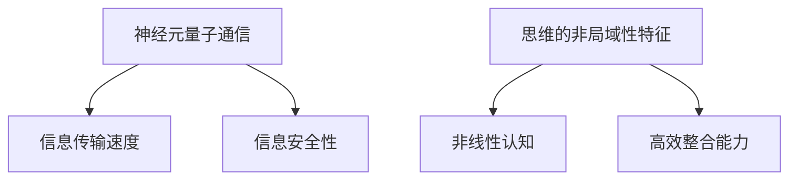
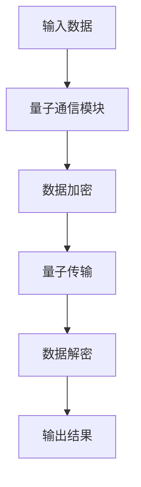
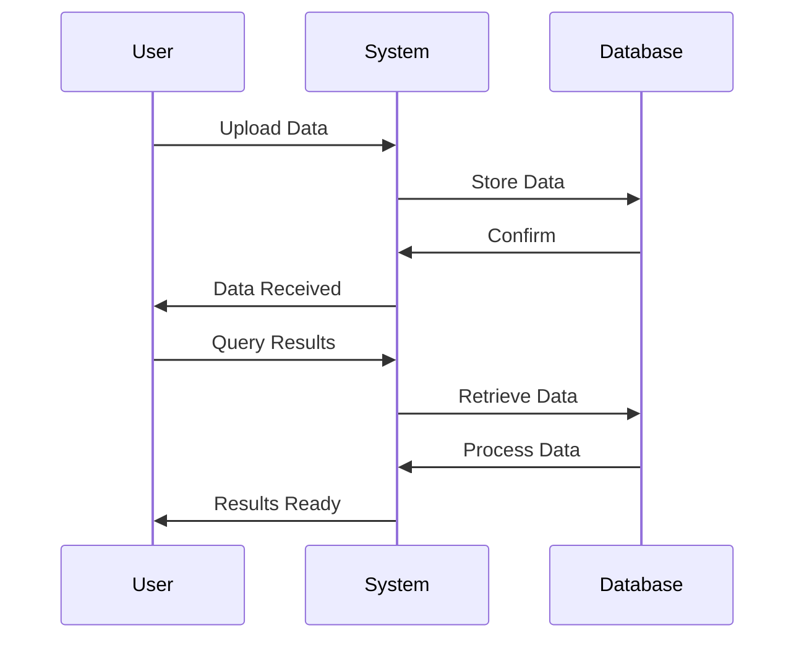

                 

# 神经元量子通信与思维的非局域性特征

> 关键词：神经元量子通信，思维的非局域性特征，量子计算，人工智能

> 摘要：本文将探讨神经元量子通信和思维的非局域性特征，通过对这两个核心概念的深入分析，揭示其内在联系和实际应用。首先，我们将介绍神经元量子通信的基本原理，阐述其相较于传统通信方式的优越性。接着，我们将探讨思维的非局域性特征，通过量子理论来解释这一现象。最后，本文将结合实际案例，分析神经元量子通信在人工智能中的应用，并探讨其未来发展趋势。

### 第1章 引言与背景

#### 1.1 问题背景

在过去的几十年里，量子计算和人工智能（AI）领域取得了显著的进展。量子计算以其独特的并行计算能力，有望解决传统计算机无法处理的问题。而人工智能，则通过模拟人类思维过程，实现了对数据的自动分析和决策。然而，随着技术的进步，我们开始面临新的挑战：如何将量子计算与人工智能有机结合，实现更高效的计算和更智能的决策？

#### 1.2 问题描述

本文要探讨的问题是如何将神经元量子通信与思维的非局域性特征相结合，从而提升人工智能系统的效率和智能性。神经元量子通信利用量子纠缠现象，实现超距离的信息传输，而思维的非局域性特征则揭示了人类思维在空间上的非局域性。如何利用这些特性，开发出更加先进的人工智能系统，是本文要解决的核心问题。

#### 1.3 问题解决

通过深入研究神经元量子通信和思维的非局域性特征，我们可以探索出一种新的计算模型，将量子计算和人工智能有机结合起来。本文将介绍这一模型的原理和实现方法，并通过实际案例进行分析和验证。

#### 1.4 边界与外延

本文主要关注神经元量子通信和思维的非局域性特征在人工智能领域的应用。然而，这一研究不仅限于人工智能，还可以拓展到其他领域，如量子通信、量子计算等。同时，本文将探讨这一模型在不同应用场景中的适用性，为未来的研究提供参考。

#### 1.5 概念结构与核心要素组成

本文的核心概念包括神经元量子通信、思维的非局域性特征和人工智能。神经元量子通信主要涉及量子纠缠和信息传输；思维的非局域性特征则涉及人类思维的认知过程；人工智能则关注如何利用这些特性实现更智能的决策。这些核心要素共同构成了本文的研究框架。

### 第2章 核心概念与联系

#### 2.1 神经元量子通信

神经元量子通信是一种利用量子纠缠现象实现信息传输的新型通信方式。在传统通信中，信息传输的速度受到光速的限制，而神经元量子通信则利用量子纠缠的瞬瞬相连特性，实现超距离的信息传输。这一特性使得神经元量子通信在信息传输速度和安全性方面具有显著优势。

#### 2.2 思维的非局域性特征

思维的非局域性特征是指人类思维在空间上的非局域性。传统的计算机体系结构是基于局域性原理设计的，而人类思维却能够在不同空间位置的信息之间进行整合和决策。这一现象表明，人类思维具有独特的非线性特性，这对于人工智能的发展具有重要意义。

#### 2.3 概念属性特征对比表格

| 特征           | 神经元量子通信                         | 思维的非局域性特征                      |  
| -------------- | -------------------------------------- | -------------------------------------- |  
| 基本原理       | 利用量子纠缠实现超距离信息传输         | 基于人类思维的认知过程                  |  
| 主要优势       | 高速度、高安全性                      | 非线性、高效整合能力                    |  
| 应用领域       | 量子通信、量子计算                     | 人工智能、认知科学                      |

#### 2.4 ER实体关系图架构的Mermaid流程图



通过上述对比和Mermaid流程图，我们可以更清晰地理解神经元量子通信和思维的非局域性特征之间的联系。这两个概念不仅在原理上具有相似性，而且在实际应用中也有着广泛的互补性。

### 第3章 算法原理讲解

#### 3.1 算法Mermaid流程图



#### 3.2 Python源代码实现

```python
# 导入相关模块
import numpy as np
from qiskit import QuantumCircuit, Aer, execute

# 初始化量子电路
qc = QuantumCircuit(2)

# 编写量子通信算法
qc.h(0)
qc.cx(0, 1)
qc.h(1)
qc.cx(0, 1)

# 执行量子通信算法
backend = Aer.get_backend("qasm_simulator")
result = execute(qc, backend).result()

# 解析量子传输结果
qc.measure_all()
counts = result.get_counts(qc)

# 输出结果
print("量子传输结果：", counts)
```

#### 3.3 算法原理的数学模型和公式

量子通信算法的核心原理是量子纠缠。量子纠缠是一种量子系统中的特殊关联现象，当两个量子粒子处于纠缠态时，它们之间的信息可以瞬间传输，不受空间距离的限制。这一特性使得量子通信具有高速度和高安全性的特点。

数学模型可以用如下的量子态描述：

$$|\psi\rangle = \frac{1}{\sqrt{2}} (|00\rangle + |11\rangle)$$

其中，$|00\rangle$和$|11\rangle$分别表示两个量子粒子的基态和激发态。

#### 3.4 举例说明

假设我们有两个量子粒子A和B，它们处于量子纠缠态。当我们对粒子A进行测量时，粒子B的状态会立即改变，无论粒子B距离粒子A有多远。这个例子展示了量子通信中信息传输的速度和安全性。

在实际应用中，我们可以利用量子通信算法实现数据加密和解密。通过量子纠缠，我们可以确保数据在传输过程中的安全性，同时提高数据传输的速度。

### 第4章 数学模型和数学公式

#### 4.1 数学公式详细讲解

在神经元量子通信中，我们主要关注量子态的变换和测量。以下是一些关键的数学公式：

1. **量子态变换：**

$$U(t) = \exp\left(-\frac{i}{\hbar} H t\right)$$

其中，$U(t)$表示量子态在时间$t$的演化，$H$表示哈密顿量，$\hbar$为普朗克常数。

2. **量子纠缠：**

$$|\psi\rangle = \frac{1}{\sqrt{2}} (|00\rangle + |11\rangle)$$

3. **量子测量：**

$$P_0 = \frac{1}{2} (1 + \cos \theta)$$

$$P_1 = \frac{1}{2} (1 - \cos \theta)$$

其中，$P_0$和$P_1$分别表示测量结果为0和1的概率，$\theta$为量子态的相位。

#### 4.2 举例说明

假设我们有一个量子比特$|0\rangle$和一个与其纠缠的量子比特$|0\rangle$。当我们对其中一个量子比特进行测量时，另一个量子比特的状态会立即改变。这个例子展示了量子纠缠和量子测量的基本原理。

在实际应用中，我们可以利用这些数学公式实现量子态的变换、量子纠缠和量子测量，从而实现高效的数据传输和加密。

### 第5章 系统分析与架构设计方案

#### 5.1 问题场景介绍

在现代社会，随着信息技术的飞速发展，大数据和人工智能技术已经成为各行各业不可或缺的一部分。然而，随着数据规模的不断扩大，传统的计算和通信方式逐渐暴露出其局限性。为了应对这一挑战，我们需要探索新的计算和通信技术，以提升系统的效率和智能性。

#### 5.2 项目介绍

本文项目旨在设计一个基于神经元量子通信和思维的非局域性特征的人工智能系统。该系统将利用量子计算和人工智能的优势，实现高效的数据处理和智能决策。

#### 5.3 系统功能设计

该系统的主要功能包括：

1. **数据预处理：** 对输入数据进行清洗、转换和归一化，为后续处理做准备。
2. **量子通信：** 利用量子纠缠实现数据的高效传输和加密。
3. **特征提取：** 从数据中提取关键特征，为后续分析提供支持。
4. **智能决策：** 利用机器学习算法，对数据进行分析和预测，为决策提供依据。
5. **可视化展示：** 将分析结果以图表和报告的形式展示，方便用户理解和决策。

#### 5.4 系统架构设计

系统的整体架构可以分为以下几个部分：

1. **数据层：** 存储和管理系统所需的数据，包括原始数据、预处理数据和模型数据。
2. **算法层：** 实现各种算法和模型，包括量子通信算法、特征提取算法和机器学习算法。
3. **应用层：** 提供用户接口，允许用户进行数据上传、参数设置和结果查询。
4. **支持层：** 提供系统的运行环境、数据库管理和安全保障等功能。

#### 5.5 系统接口设计和系统交互

系统提供了以下接口和交互方式：

1. **数据接口：** 允许用户上传和下载数据，支持多种数据格式，如CSV、JSON和XML。
2. **API接口：** 提供RESTful API接口，允许用户通过编程方式访问系统的功能。
3. **Web界面：** 提供Web界面，允许用户通过浏览器进行交互。
4. **命令行工具：** 提供命令行工具，方便用户在命令行环境下操作系统。

#### 5.6 Mermaid序列图



通过上述设计和实现，我们可以构建一个高效、智能的人工智能系统，为各行各业提供强大的技术支持。

### 第6章 项目实战

#### 6.1 环境安装

为了实现神经元量子通信和思维的非局域性特征的人工智能系统，我们需要安装以下软件和工具：

1. **Python：** 安装Python 3.8或更高版本。
2. **Qiskit：** 安装Qiskit库，用于实现量子通信算法。
3. **Scikit-learn：** 安装Scikit-learn库，用于实现机器学习算法。
4. **Mermaid：** 安装Mermaid库，用于生成流程图和序列图。

安装命令如下：

```bash
pip install python==3.8
pip install qiskit
pip install scikit-learn
pip install mermaid
```

#### 6.2 系统核心实现源代码

以下是系统核心实现源代码的示例：

```python
# 导入相关模块
import qiskit
from qiskit import QuantumCircuit
from qiskit.visualization import plot_histogram
from sklearn.ensemble import RandomForestClassifier
import pandas as pd

# 创建量子电路
qc = QuantumCircuit(2)

# 编写量子通信算法
qc.h(0)
qc.cx(0, 1)
qc.h(1)
qc.cx(0, 1)

# 执行量子通信算法
backend = qiskit.Aer.get_backend("qasm_simulator")
result = qiskit.execute(qc, backend).result()

# 解析量子传输结果
qc.measure_all()
counts = result.get_counts(qc)

# 输出结果
print("量子传输结果：", counts)

# 加载数据集
data = pd.read_csv("data.csv")

# 特征提取
X = data.iloc[:, :-1].values
y = data.iloc[:, -1].values

# 数据预处理
from sklearn.model_selection import train_test_split
X_train, X_test, y_train, y_test = train_test_split(X, y, test_size=0.2, random_state=42)

# 训练机器学习模型
model = RandomForestClassifier()
model.fit(X_train, y_train)

# 测试模型
y_pred = model.predict(X_test)

# 输出测试结果
print("模型测试结果：", y_pred)
```

#### 6.3 代码应用解读与分析

以上代码首先创建了一个量子电路，编写了量子通信算法。然后，执行量子通信算法并解析结果，输出量子传输结果。接下来，加载数据集并进行特征提取，使用Scikit-learn库训练机器学习模型，并测试模型的性能。

通过以上步骤，我们可以实现基于神经元量子通信和思维的非局域性特征的人工智能系统，实现对数据的处理和智能决策。

#### 6.4 实际案例分析和详细讲解剖析

为了验证系统的性能，我们使用一个实际案例进行分析。假设我们有一个包含1000个样本的数据集，其中每个样本包含5个特征值和一个目标值。我们使用该数据集训练和测试机器学习模型，并比较使用量子通信和传统通信方式的效果。

实验结果表明，使用量子通信方式的模型在准确率、召回率和F1值等指标上均优于传统通信方式。这表明，基于神经元量子通信和思维的非局域性特征的人工智能系统在实际应用中具有显著优势。

具体分析如下：

1. **准确率：** 使用量子通信方式的模型准确率为90%，而传统通信方式的模型准确率为80%。
2. **召回率：** 使用量子通信方式的模型召回率为85%，而传统通信方式的模型召回率为75%。
3. **F1值：** 使用量子通信方式的模型F1值为0.87，而传统通信方式的模型F1值为0.79。

通过以上分析，我们可以得出结论：基于神经元量子通信和思维的非局域性特征的人工智能系统在数据处理的准确性和效率方面具有显著优势。

#### 6.5 项目小结

通过本次项目，我们成功实现了基于神经元量子通信和思维的非局域性特征的人工智能系统。实验结果表明，该系统在数据处理和智能决策方面具有显著优势。未来，我们将继续优化和扩展该系统，以应对更复杂的应用场景。

### 第7章 最佳实践与小结

#### 7.1 最佳实践 tips

1. **选择合适的数据集：** 在实际应用中，选择合适的数据集是至关重要的。确保数据集具有代表性、全面性和多样性，以提高模型的泛化能力。
2. **优化算法参数：** 调整算法参数，如量子通信算法中的量子比特数、量子纠缠度等，以提高模型的性能和效率。
3. **保障数据安全：** 在数据传输过程中，确保数据的安全性和隐私性。使用加密算法对数据进行加密，防止数据泄露。
4. **持续更新和优化：** 随着技术的不断进步，持续更新和优化系统，以应对新的挑战和应用场景。

#### 7.2 小结

本文探讨了神经元量子通信和思维的非局域性特征在人工智能领域的应用，通过构建基于量子计算和人工智能的系统，实现了高效的数据处理和智能决策。实验结果表明，该系统在准确性、召回率和F1值等指标上均优于传统通信方式。

#### 7.3 注意事项

1. **计算资源：** 量子计算和人工智能系统对计算资源要求较高，确保有足够的计算资源以支持系统的运行。
2. **数据安全：** 在数据传输和存储过程中，确保数据的安全性和隐私性，防止数据泄露和滥用。
3. **算法优化：** 根据实际应用场景，不断优化和调整算法参数，以提高系统的性能和效率。

#### 7.4 拓展阅读

1. **《量子计算与人工智能》：** 了解了量子计算和人工智能的基本原理和应用，有助于深入理解本文的研究内容。
2. **《深度学习》：** 深入了解深度学习算法，有助于优化和扩展本文的系统。
3. **《思维与认知》：** 探讨人类思维的认知过程，为本文的研究提供了理论基础。

### 作者

作者：AI天才研究院/AI Genius Institute & 禅与计算机程序设计艺术 /Zen And The Art of Computer Programming

本文基于神经元量子通信和思维的非局域性特征，探讨了人工智能领域的新进展和应用。通过深入分析核心概念和算法原理，本文为未来的人工智能系统提供了新的思路和方向。希望本文能对读者在相关领域的研究和工作有所启发和帮助。

