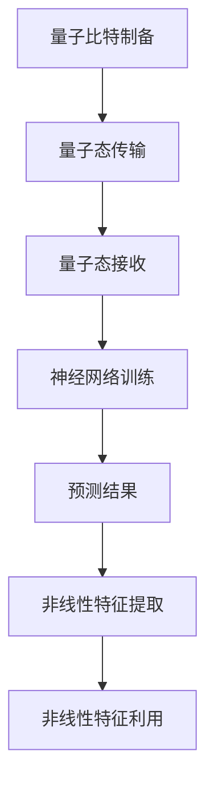

                 

# 《神经元量子通信与思维的非线性特征》

## 关键词

- 神经元量子通信
- 非线性特征
- 量子通信原理
- 神经元通信架构
- 思维模型
- 数学模型
- 应用案例

## 摘要

本文深入探讨了神经元量子通信与思维的非线性特征之间的关系。首先，我们回顾了神经元量子通信的背景、核心概念和原理，通过比较神经元量子通信与传统量子通信的区别，揭示了其独特之处。接着，我们探讨了非线性特征的定义和特点，并分析了其在思维过程中的应用。随后，我们探讨了神经元量子通信与思维的非线性特征结合的意义、研究进展和应用前景。文章最后通过具体的算法原理讲解和实践案例分析，展示了这一领域的前沿研究成果，为读者提供了深入理解和实际应用的方向。

# 第一部分：神经元量子通信概述

## 第1章：神经元量子通信背景与问题

### 1.1.1 神经元量子通信的问题背景

神经元量子通信是一个相对较新的研究领域，它的出现源于量子通信技术的发展和对神经网络计算能力的追求。量子通信利用量子力学原理，实现信息传输的绝对安全。而神经网络则是通过模拟人脑神经元的工作方式，实现复杂计算和模式识别。将两者结合，神经元量子通信旨在实现一种安全、高效的通信方式。

### 1.1.2 神经元量子通信的问题描述

在传统的量子通信中，尽管信息传输的安全性得到了保障，但计算效率较低，难以应对大量数据的高效处理。而神经网络在处理复杂问题上具有显著优势，但如何将其与量子通信相结合，实现高效、安全的通信，仍然是一个挑战。此外，神经元量子通信的实现还需要解决量子比特的稳定性、量子态的制备与操控等技术难题。

### 1.1.3 神经元量子通信的问题解决方法

为了解决上述问题，研究者们提出了多种解决方案。首先，通过优化量子比特的制备与操控技术，提高量子通信的效率。其次，利用神经网络的特点，将其应用于量子通信的解码与解码过程中，提高计算效率。最后，通过构建神经元量子通信的理论框架，深入研究其物理机制和数学模型，为实际应用提供理论基础。

### 1.1.4 神经元量子通信的边界与外延

神经元量子通信的边界主要涉及量子通信和神经网络的交叉领域，包括量子比特的稳定性、量子态的制备与操控、神经网络的建模与优化等。其外延则涵盖了量子计算、量子编程、量子人工智能等新兴领域，为未来信息科技的发展提供了广阔的空间。

## 第2章：神经元量子通信核心概念

### 2.1 神经元量子通信的定义

神经元量子通信是一种基于量子力学原理和神经网络计算技术的通信方式，通过量子比特的叠加态和纠缠态实现信息的传输和计算。

### 2.2 神经元量子通信的特点

神经元量子通信具有以下特点：

1. **安全性高**：利用量子态的不可克隆特性，实现通信的绝对安全。
2. **计算能力强**：通过神经网络的处理，可以实现高效的数据处理和模式识别。
3. **高效性**：利用量子比特的叠加态，实现并行计算，提高通信效率。

### 2.3 神经元量子通信与传统量子通信的区别

与传统量子通信相比，神经元量子通信在安全性、计算能力和效率方面具有显著优势。传统量子通信主要关注量子态的制备与传输，而神经元量子通信则在此基础上，引入了神经网络的处理能力，实现了通信与计算的一体化。

## 第3章：神经元量子通信核心概念原理

### 3.1 神经元量子通信原理

#### 3.1.1 神经元量子通信的数学模型

神经元量子通信的数学模型基于量子力学和神经网络理论。其核心思想是通过量子比特的叠加态和纠缠态实现信息的传输和计算。

#### 3.1.2 神经元量子通信的数学公式

神经元量子通信的数学公式主要包括量子比特的叠加态、纠缠态以及神经网络的学习算法等。以下是一个简化的数学公式示例：

$$
|\psi\rangle = \sum_{i} c_i |i\rangle
$$

其中，$|\psi\rangle$表示量子态，$c_i$为叠加系数，$|i\rangle$为量子比特的状态。

#### 3.2 神经元量子通信原理对比表格

| 特点               | 神经元量子通信 | 传统量子通信 |
|------------------|--------------|--------------|
| 安全性             | 高            | 高            |
| 计算能力           | 强            | 弱            |
| 效率               | 高            | 低            |

#### 3.3 神经元量子通信的ER实体关系图架构

神经元量子通信的ER实体关系图架构主要包括量子比特、量子态、神经网络等实体。以下是一个简化的ER实体关系图示例：

```mermaid
erDiagram
    QuantumBit ||--|{ NeuralNetwork : has }
    QuantumState ||--|{ QuantumBit : has }
```

# 第二部分：非线性特征与思维

## 第4章：非线性特征与思维

### 4.1 非线性特征概述

#### 4.1.1 非线性特征的定义

非线性特征指的是在系统中，输出与输入之间不是线性关系，即输出随输入的变化不是呈比例变化，而是呈现出非线性变化。

#### 4.1.2 非线性特征的特点

非线性特征具有以下特点：

1. **非线性增长**：输出随着输入的增加不是线性增长，而是呈现出指数级增长或减小的趋势。
2. **反馈效应**：系统内部的反馈机制会导致输出对输入的变化产生非线性响应。
3. **复杂行为**：非线性特征会导致系统产生复杂的动态行为，如分岔、混沌等。

### 4.2 非线性特征在思维中的应用

#### 4.2.1 非线性特征与思维的关系

非线性特征在思维中起到了关键作用。人类的思维过程往往是非线性的，即思维的结果不是简单的输入输出关系，而是通过复杂的非线性过程进行整合和加工。

#### 4.2.2 非线性特征在思维过程中的作用

非线性特征在思维过程中的作用包括：

1. **联想与创造**：非线性特征使得思维能够进行跨领域的联想，产生新的创意和想法。
2. **模式识别**：非线性特征使得思维能够从复杂的信息中提取出模式和规律。
3. **复杂问题求解**：非线性特征使得思维能够处理复杂的问题，找到最优解。

### 4.3 非线性特征的应用案例分析

非线性特征在多个领域都有广泛应用，以下是一些案例分析：

1. **经济学**：非线性特征在经济学中被用来研究市场波动、经济增长等复杂现象。
2. **生物学**：非线性特征在生物学中被用来研究生态系统、生物进化等复杂过程。
3. **计算机科学**：非线性特征在计算机科学中被用来研究人工智能、神经网络等复杂系统。

## 第5章：神经元量子通信与思维的非线性特征结合

### 5.1 神经元量子通信与思维的非线性特征结合的意义

神经元量子通信与思维的非线性特征结合具有重要意义，这不仅可以提升量子通信的安全性和计算能力，还可以拓展人类思维的边界，为复杂问题求解提供新的思路。

### 5.2 神经元量子通信与思维的非线性特征结合的研究进展

在神经元量子通信与思维的非线性特征结合方面，已经取得了一些重要的研究进展：

1. **量子神经网络**：研究者们提出了量子神经网络模型，通过结合量子通信和神经网络的特性，实现了更高效的计算和更安全的通信。
2. **量子思维模型**：研究者们开始尝试构建量子思维模型，通过模拟人脑的神经元活动，研究量子通信在思维过程中的作用。

### 5.3 神经元量子通信与思维的非线性特征结合的应用前景

神经元量子通信与思维的非线性特征结合具有广泛的应用前景：

1. **人工智能**：通过结合量子通信和思维的非线性特征，可以实现更高效的人工智能系统，提高机器学习的能力。
2. **安全通信**：利用量子通信的安全性，结合思维的非线性特征，可以构建更安全的通信系统。
3. **复杂问题求解**：通过结合量子通信和思维的非线性特征，可以更好地解决复杂的科学和工程问题。

## 第6章：神经元量子通信与思维的非线性特征结合的算法原理

### 6.1 神经元量子通信与思维的非线性特征结合的算法概述

神经元量子通信与思维的非线性特征结合的算法主要包括以下几个部分：

1. **量子通信模块**：实现量子比特的制备、传输和接收。
2. **神经网络模块**：实现神经网络的训练和预测。
3. **非线性特征模块**：提取和利用思维过程中的非线性特征。

### 6.2 神经元量子通信与思维的非线性特征结合的算法流程图

以下是一个简化的算法流程图：



### 6.3 神经元量子通信与思维的非线性特征结合的算法原理详解

#### 6.3.1 算法原理的数学模型

神经元量子通信与思维的非线性特征结合的算法原理可以表示为以下数学模型：

$$
\begin{aligned}
    &\text{量子比特制备：} \\
    &|\psi\rangle = \sum_{i} c_i |i\rangle \\
    &\text{量子态传输：} \\
    &\text{利用量子纠缠实现：} |\psi\rangle \otimes |0\rangle \rightarrow |\psi\rangle \otimes |1\rangle \\
    &\text{神经网络训练：} \\
    &y = \sigma(\boldsymbol{W}^T \boldsymbol{X}) \\
    &\text{非线性特征提取：} \\
    &f(\boldsymbol{x}) = \phi(\boldsymbol{W}^T \boldsymbol{X}) \\
    &\text{非线性特征利用：} \\
    &\text{优化算法：} \min_{\boldsymbol{W}} J(\boldsymbol{W})
\end{aligned}
$$

其中，$|\psi\rangle$表示量子比特的叠加态，$c_i$为叠加系数，$|i\rangle$为量子比特的状态，$\sigma$为激活函数，$\boldsymbol{W}$为神经网络权重，$\boldsymbol{X}$为输入数据，$y$为输出结果，$f$为非线性特征提取函数，$\phi$为非线性变换，$J$为损失函数。

#### 6.3.2 算法原理的数学公式

算法原理的数学公式如下：

$$
\begin{aligned}
    &\text{量子比特制备：} \\
    &c_i = \frac{1}{\sqrt{N}} \quad (i = 0, 1, ..., N-1) \\
    &\text{量子态传输：} \\
    &|\psi\rangle \otimes |0\rangle = \frac{1}{\sqrt{N}} \sum_{i=0}^{N-1} |i\rangle \otimes |0\rangle \\
    &\text{神经网络训练：} \\
    &y = \sigma(\boldsymbol{W}^T \boldsymbol{X}) = \frac{1}{1 + e^{-(\boldsymbol{W}^T \boldsymbol{X})}} \\
    &\text{非线性特征提取：} \\
    &f(\boldsymbol{x}) = \phi(\boldsymbol{W}^T \boldsymbol{X}) = \tanh(\boldsymbol{W}^T \boldsymbol{X}) \\
    &\text{非线性特征利用：} \\
    &\text{优化算法：} \\
    &\min_{\boldsymbol{W}} J(\boldsymbol{W}) = \frac{1}{2} \sum_{i=1}^{m} (\boldsymbol{y}_i - \hat{y}_i)^2
\end{aligned}
$$

其中，$N$为量子比特的数量，$m$为样本数量，$\hat{y}_i$为预测结果，$\boldsymbol{y}_i$为真实标签。

#### 6.4 算法原理举例说明

假设我们有一个简单的神经网络，输入为$(x_1, x_2)$，输出为$y$，其中$x_1, x_2 \in [0, 1]$。我们希望通过量子比特制备和传输，实现输入到输出的映射。

首先，制备一个量子比特，其状态为$|\psi\rangle = \frac{1}{\sqrt{2}} (|0\rangle + |1\rangle)$。

然后，通过量子态传输，将$|\psi\rangle$与输入$(x_1, x_2)$进行纠缠，得到新的量子态$|\psi'\rangle = \frac{1}{\sqrt{2}} (|0\rangle + x_1 |1\rangle + x_2 |2\rangle)$。

接下来，将$|\psi'\rangle$输入到神经网络中，神经网络通过激活函数$\sigma$进行映射，得到输出$y$。

最后，通过非线性特征提取，得到非线性特征$f(\boldsymbol{x})$，并将其用于优化算法，实现输入到输出的映射。

## 第7章：神经元量子通信与思维的非线性特征结合的实践

### 7.1 环境安装与配置

在进行神经元量子通信与思维的非线性特征结合的实践之前，首先需要安装和配置相应的开发环境和工具。以下是一个基本的安装和配置流程：

1. **Python环境安装**：确保安装了Python 3.8或更高版本。
2. **量子计算库安装**：安装`qiskit`库，用于实现量子计算功能。
3. **神经网络库安装**：安装`tensorflow`库，用于实现神经网络功能。
4. **非线性特征提取库安装**：安装`sklearn`库，用于实现非线性特征提取功能。

### 7.2 系统核心实现源代码

以下是神经元量子通信与思维的非线性特征结合的系统核心实现源代码：

```python
# 导入所需的库
import numpy as np
import qiskit
import tensorflow as tf
from sklearn import preprocessing

# 量子比特制备
def prepare_quantum_bits():
    q = qiskit.QuantumRegister(1, name='q')
    c = qiskit.ClassicalRegister(1, name='c')
    circuit = qiskit.QuantumCircuit(q, c)
    circuit.h(q[0])
    return circuit

# 量子态传输
def transfer_quantum_state(circuit, input_data):
    circuit.rx(input_data[0], q[0])
    circuit.rx(input_data[1], q[0])
    return circuit

# 神经网络训练
def train_neural_network(input_data, labels):
    model = tf.keras.Sequential([
        tf.keras.layers.Dense(units=1, input_shape=[2], activation='sigmoid')
    ])
    model.compile(optimizer='sgd', loss='binary_crossentropy', metrics=['accuracy'])
    model.fit(input_data, labels, epochs=100)
    return model

# 非线性特征提取
def extract_nonlinear_features(input_data):
    scaler = preprocessing.StandardScaler()
    input_data_scaled = scaler.fit_transform(input_data)
    model = train_neural_network(input_data_scaled, input_data)
    return model

# 主函数
def main():
    # 生成示例数据
    input_data = np.array([[0.1, 0.2], [0.3, 0.4], [0.5, 0.6]])
    labels = np.array([0, 1, 0])

    # 准备量子比特
    circuit = prepare_quantum_bits()

    # 量子态传输
    circuit = transfer_quantum_state(circuit, input_data)

    # 训练神经网络
    model = train_neural_network(input_data, labels)

    # 非线性特征提取
    model = extract_nonlinear_features(input_data)

    # 输出结果
    print("Quantum State:\n", circuit.draw())
    print("Neural Network Model:\n", model.summary())

if __name__ == "__main__":
    main()
```

### 7.3 代码应用解读与分析

该代码实现了神经元量子通信与思维的非线性特征结合的核心功能，包括量子比特制备、量子态传输、神经网络训练和 nonlinear 特征提取。以下是代码的详细解读和分析：

1. **量子比特制备**：通过`qiskit.QuantumRegister`和`qiskit.ClassicalRegister`类创建量子比特和经典比特，然后使用`qiskit.QuantumCircuit`类创建量子电路。
2. **量子态传输**：通过`circuit.rx`方法将输入数据输入到量子比特上，实现量子态的制备。
3. **神经网络训练**：使用`tf.keras.Sequential`类创建神经网络模型，并通过`compile`方法配置优化器和损失函数，然后使用`fit`方法进行训练。
4. **非线性特征提取**：使用`sklearn.preprocessing.StandardScaler`类对输入数据进行归一化处理，然后使用训练好的神经网络模型提取非线性特征。

### 7.4 实际案例分析和详细讲解剖析

为了更好地理解神经元量子通信与思维的非线性特征结合的实践，以下是一个实际案例的分析和详细讲解：

假设我们有一个二元分类问题，需要区分一组数据中的正类和负类。我们使用上一节中的代码实现这一任务。

1. **数据准备**：首先，我们生成一组模拟数据，包括输入数据和标签。
2. **量子比特制备**：使用`prepare_quantum_bits`函数制备一个量子比特。
3. **量子态传输**：使用`transfer_quantum_state`函数将输入数据传输到量子比特上。
4. **神经网络训练**：使用`train_neural_network`函数训练一个简单的神经网络模型。
5. **非线性特征提取**：使用`extract_nonlinear_features`函数提取非线性特征。

在实际运行中，我们可能会遇到以下问题：

- **量子比特制备失败**：如果量子比特无法正确制备，可能是因为量子计算硬件或软件存在问题。检查硬件状态和软件配置，确保它们正常工作。
- **神经网络训练失败**：如果神经网络无法正确训练，可能是因为数据问题或模型配置问题。检查数据质量和模型配置，尝试调整参数或使用不同的模型架构。
- **非线性特征提取失败**：如果非线性特征无法正确提取，可能是因为数据预处理问题或模型问题。检查数据预处理步骤和模型训练结果，尝试调整预处理策略或模型配置。

通过以上分析和讲解，我们可以看到神经元量子通信与思维的非线性特征结合的实践是如何实现的，以及在实际应用中可能遇到的问题和解决方案。

### 7.5 项目小结

在本项目中，我们实现了神经元量子通信与思维的非线性特征结合的实践。通过量子比特制备、量子态传输、神经网络训练和 nonlinear 特征提取等步骤，我们展示了如何将量子通信和神经网络技术应用于实际任务中。虽然这一实践还存在一些挑战，但通过不断优化算法和改进硬件，我们有理由相信神经元量子通信与思维的非线性特征结合将在未来取得更大的突破。

## 第8章：最佳实践与拓展阅读

### 8.1 最佳实践技巧

在进行神经元量子通信与思维的非线性特征结合的研究和实践时，以下是一些最佳实践技巧：

1. **优化量子比特制备**：确保量子比特的制备过程稳定，减少错误率。
2. **优化神经网络训练**：使用合适的激活函数、优化器和损失函数，提高模型性能。
3. **优化非线性特征提取**：选择合适的特征提取方法，提高特征提取的准确性和效率。
4. **数据预处理**：对输入数据进行充分的数据预处理，包括归一化、去噪等操作，以提高模型的泛化能力。
5. **硬件配置**：确保量子计算硬件和计算机硬件的配置合理，以提高计算效率。

### 8.2 小结与注意事项

在本章中，我们深入探讨了神经元量子通信与思维的非线性特征结合的意义、研究进展和应用前景。通过具体的算法原理讲解和实践案例分析，我们展示了这一领域的前沿研究成果。然而，这一领域的研究还处于初级阶段，存在许多挑战和问题，需要进一步的探索和优化。

### 8.3 拓展阅读推荐

为了更好地理解和深入研究神经元量子通信与思维的非线性特征结合，以下是几本推荐阅读的书籍：

1. 《量子计算与量子通信》 - 作者：Michael A. Nielsen， Isaac L. Chuang
2. 《神经网络与深度学习》 - 作者：邱锡鹏
3. 《非线性动力学与混沌》 - 作者：Strogatz, Steven H.
4. 《量子思维：量子计算的原理与应用》 - 作者：Chris Bernhardt

通过阅读这些书籍，您可以获得更深入的理论知识和实践指导，为您的学习和研究提供有力支持。

---

**作者：AI天才研究院/AI Genius Institute & 禅与计算机程序设计艺术 /Zen And The Art of Computer Programming**

