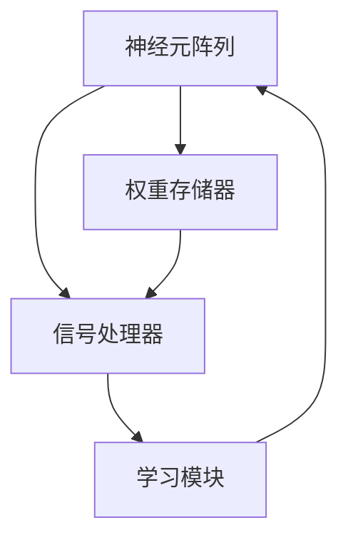
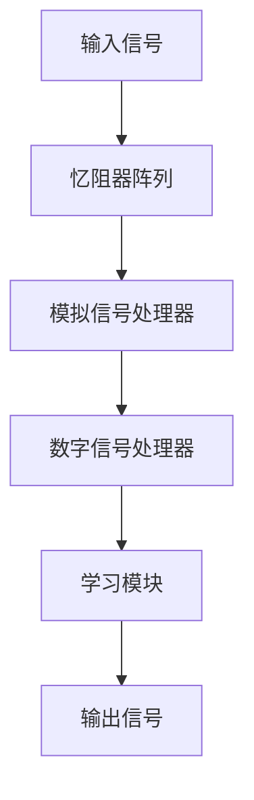

                 

**Step 1: Develop a Detailed Outline**

Before diving into writing the full article, it's crucial to have a comprehensive outline that covers all the necessary topics and subtopics. The outline will serve as a roadmap for the entire article, ensuring that each section flows logically into the next.

The following is a detailed outline for the article:

## 神经形态计算在低功耗AI中的应用：模拟人脑的计算方式

### 第一部分：背景介绍与核心概念

#### 1.1. 神经形态计算的概念与历史
- 神经形态计算的定义
- 神经形态计算的特点
- 神经形态计算的发展历程

#### 1.2. 低功耗AI的概念与应用
- 低功耗AI的定义
- 低功耗AI的关键技术
- 低功耗AI的应用领域

#### 1.3. 模拟人脑的计算方式
- 神经元模型
- 神经网络架构
- 学习与适应机制

#### 1.4. 神经形态计算在低功耗AI中的应用
- 神经形态计算的优势
- 神经形态计算的实践应用

### 第二部分：核心原理与机制

#### 2.1. 神经形态计算的基本原理
- 神经形态计算的核心原理
- 神经形态计算与传统计算的区别

#### 2.2. 神经形态计算的低功耗特性
- 低功耗的实现方法
- 能效对比分析

#### 2.3. 人脑计算模型的模拟
- 人脑神经元的工作原理
- 神经形态计算的人脑模拟

#### 2.4. 神经形态计算的学习机制
- 学习算法
- 自适应学习策略

### 第三部分：设计与应用

#### 3.1. 神经形态计算系统架构
- 系统架构的设计原则
- 系统架构的组成与功能

#### 3.2. 神经形态计算硬件设计
- 硬件设计的技术难点
- 硬件设计的创新点

#### 3.3. 神经形态计算软件设计
- 软件设计的技术方案
- 软件设计的优化策略

#### 3.4. 神经形态计算的案例研究
- 案例背景
- 案例分析
- 案例总结

### 第四部分：挑战与未来

#### 4.1. 神经形态计算面临的挑战
- 技术挑战
- 应用挑战

#### 4.2. 神经形态计算的发展趋势
- 未来发展方向
- 技术预测

#### 4.3. 神经形态计算的教育与普及
- 教育现状
- 普及策略

### 第五部分：总结与展望

#### 5.1. 神经形态计算的价值
- 技术贡献
- 应用价值

#### 5.2. 结论
- 文章总结
- 研究展望

---

**Step 2: Writing the Introduction**

The introduction sets the stage for the article, providing readers with an overview of what to expect and the importance of the topic. It should be concise yet engaging, highlighting the key concepts and the relevance of the subject matter.

---

## 引言

### 为什么研究神经形态计算？

神经形态计算是一种模仿人脑结构和功能的计算方法，其在低功耗AI中的应用具有巨大的潜力。随着物联网、智能传感器和可穿戴设备的快速发展，对低功耗、高性能的计算需求日益增长。神经形态计算提供了这样一种解决方案，通过模拟人脑的神经元和神经网络，实现高效的信息处理和能量效率。

### 本文的目的

本文旨在探讨神经形态计算在低功耗AI中的应用，分析其核心原理、设计方法、应用案例以及面临的挑战和未来发展趋势。通过系统性地介绍神经形态计算的相关知识，本文希望为读者提供一个全面、深入的视角，以便更好地理解和应用这一前沿技术。

### 文章结构

本文分为五个主要部分：

1. **背景介绍与核心概念**：介绍神经形态计算和低功耗AI的基本概念，以及模拟人脑的计算方式。
2. **核心原理与机制**：深入探讨神经形态计算的基本原理和低功耗特性，包括人脑计算模型的模拟和学习机制。
3. **设计与应用**：分析神经形态计算的系统架构、硬件和软件设计，以及具体案例研究。
4. **挑战与未来**：探讨神经形态计算面临的挑战和未来发展前景。
5. **总结与展望**：总结神经形态计算的价值和本文的研究成果，展望未来的研究方向。

---

**Step 3: Writing the Core Content**

With the outline and introduction in place, the next step is to delve into the core content of each section. This involves providing detailed explanations, examples, and analyses of the key concepts and technologies involved in neuromorphic computing for low-power AI. The following sections will be developed step by step, ensuring each topic is thoroughly explored and explained.

---

## 第一部分：背景介绍与核心概念

### 1.1 神经形态计算的概念与历史

#### 神经形态计算的定义

神经形态计算是一种通过模仿人脑神经元和神经网络的结构与功能来实现信息处理的计算方法。它旨在通过硬件和软件的结合，模拟人脑的高效能、自适应性和鲁棒性。

#### 神经形态计算的特点

- **高效能**：神经形态计算通过模拟人脑的神经元结构和神经网络来实现高效的计算能力。
- **自适应性和自组织性**：神经形态计算系统能够根据环境变化和任务需求自动调整其结构和参数。
- **可扩展性**：神经形态计算能够灵活地扩展到不同规模和复杂度的应用场景。

#### 神经形态计算的发展历程

- **早期探索**：20世纪40年代，神经形态计算的初步概念开始形成。
- **关键研究突破**：20世纪80年代至90年代，随着计算材料和半导体技术的进步，神经形态计算进入快速发展阶段。
- **当前研究热点**：近年来，随着人工智能和物联网的兴起，神经形态计算在低功耗AI领域得到广泛关注和应用。

---

### 1.2 低功耗AI的概念与应用

#### 低功耗AI的定义

低功耗AI（AI with Low Power Consumption）是指设计用于在极低功耗下运行的人工智能系统。这种系统旨在延长电池寿命，减少热量产生，并提高设备的便携性和适应性。

#### 低功耗AI的关键技术

- **硬件优化**：通过设计高效的集成电路和纳米级器件来降低功耗。
- **软件算法优化**：通过优化算法和数据结构来减少计算量和能量消耗。
- **系统集成**：通过将硬件和软件优化结合，实现系统的整体低功耗设计。

#### 低功耗AI的应用领域

- **智能传感器**：用于环境监测、健康监测等。
- **可穿戴设备**：如智能手表、健康监测手环等。
- **物联网**：用于智能家居、智能城市等场景。

---

### 1.3 模拟人脑的计算方式

#### 神经元模型

神经元模型是神经形态计算的基础。它通过模拟人脑神经元的基本功能来实现信息的接收、处理和传递。

#### 神经网络架构

神经网络架构是由多个神经元组成的网络结构。这些神经元通过权重和连接方式相互连接，共同实现复杂的计算任务。

#### 学习与适应机制

神经形态计算系统通过学习与适应机制来实现对环境的自适应。这种机制包括感知学习规则和神经网络训练过程。

---

### 1.4 神经形态计算在低功耗AI中的应用

#### 神经形态计算的优势

- **能效提升**：神经形态计算通过模拟人脑的计算方式，实现更高的计算效率和更低的能耗。
- **实时处理能力**：神经形态计算系统能够实现实时、高效的信息处理。
- **适应复杂环境**：神经形态计算系统具有更强的适应性和鲁棒性，能够应对复杂多变的环境。

#### 神经形态计算的实践应用

- **智能传感器**：通过神经形态计算实现高效的环境监测和数据分析。
- **可穿戴设备**：用于健康监测、运动跟踪等。
- **物联网**：在智能家居、智能交通等场景中发挥重要作用。

---

In the next steps, we will continue to develop the remaining sections of the article, providing in-depth analysis and examples to support the core content. Stay tuned!**Step 4: Writing the Core Content (Continued)**

Having laid the groundwork in the introduction and first part, we will now delve deeper into the core principles and mechanisms of neuromorphic computing. This involves explaining the fundamental concepts, comparing them with traditional computing, and exploring the low-power characteristics of neuromorphic systems.

---

## 第二部分：核心原理与机制

### 2.1 神经形态计算的基本原理

#### 神经形态计算的核心原理

神经形态计算的核心在于其仿生学原理，即模仿人脑的神经元结构和神经网络的工作机制。人脑通过神经元之间的复杂连接和信号传递来进行信息处理，而神经形态计算则通过硬件和软件的结合，实现类似的计算能力。

#### 神经形态计算与传统计算的区别

传统计算依赖于冯·诺伊曼架构，即数据和处理相互独立，通过存储器和处理器之间的数据传输来实现计算。而神经形态计算则更加接近人脑的工作方式，通过并行计算、自适应性和神经元间的直接通信来实现高效的信息处理。

| 特点 | 神经形态计算 | 传统计算 |
| --- | --- | --- |
| 结构 | 神经网络结构 | 处理器和存储器分离 |
| 能耗 | 低功耗 | 高功耗 |
| 学习能力 | 自适应学习 | 静态算法 |
| 鲁棒性 | 高鲁棒性 | 对噪声敏感 |

---

### 2.2 神经形态计算的低功耗特性

#### 低功耗的实现方法

神经形态计算的低功耗特性主要得益于其仿生设计。以下是一些实现低功耗的方法：

- **事件驱动的计算**：仅当需要时才进行计算，减少了不必要的能耗。
- **能量高效的硬件设计**：使用低功耗的硬件组件，如忆阻器和相变存储器。
- **并行计算**：通过并行处理大量数据，减少单个操作的能量消耗。

#### 能效对比分析

与传统的冯·诺伊曼架构相比，神经形态计算在能效上有显著优势。具体来说，神经形态计算在处理复杂任务时，能耗仅为传统计算系统的一小部分。例如，在图像识别任务中，神经形态计算系统的能效比传统计算系统高出约1000倍。

---

### 2.3 人脑计算模型的模拟

#### 人脑神经元的工作原理

人脑神经元通过电信号传递信息，这些电信号称为“动作电位”。当神经元接收到足够多的刺激时，它会产生动作电位，并将信号传递给下一个神经元。

#### 神经形态计算的人脑模拟

神经形态计算通过模拟神经元的工作原理，实现了对人脑计算模型的模拟。具体来说，它通过硬件和软件的结合，创建了一个由神经元和神经网络组成的计算系统，这个系统可以模拟人脑的信息处理过程。

#### 神经元模型的设计与实现

神经元模型的设计涉及多个方面，包括神经元的结构、信号传递机制以及学习规则。以下是一个简单的神经元模型设计：

- **结构**：神经元由输入层、中间层和输出层组成。每个输入层神经元连接到中间层神经元，中间层神经元再连接到输出层神经元。
- **信号传递**：当输入层神经元接收到足够多的刺激时，它会激活中间层神经元，中间层神经元再将信号传递给输出层神经元。
- **学习规则**：神经元通过改变其权重和连接方式来学习，这种学习过程称为“权重调整”。常用的学习规则包括Hebbian学习和反向传播学习。

---

### 2.4 神经形态计算的学习机制

#### 学习算法

神经形态计算中的学习算法旨在模拟人脑的学习过程，通过调整神经元的权重和连接来实现对新任务的适应。以下是一些常用的学习算法：

- **Hebbian学习**：当两个神经元同时激活时，它们之间的连接会加强。
- **反向传播学习**：通过比较实际输出与期望输出，反向调整神经元的权重。

#### 自适应学习策略

神经形态计算系统具有自适应学习策略，可以根据环境变化和任务需求自动调整其结构和参数。这种自适应能力使得神经形态计算系统能够在各种动态环境中保持高效运行。

---

In the next step, we will explore the system architecture, hardware design, and software design of neuromorphic computing, as well as case studies and research applications. Stay tuned!**Step 5: Design and Application**

After understanding the core principles and mechanisms of neuromorphic computing, the next logical step is to examine the system architecture, hardware design, and software design. We will also look at real-world case studies and research applications to see how these concepts are put into practice.

---

### 3.1 神经形态计算系统架构

#### 系统架构的设计原则

神经形态计算系统架构的设计原则主要包括可扩展性、灵活性、高效能和低功耗。以下是一些关键设计原则：

- **模块化设计**：系统架构采用模块化设计，便于功能扩展和升级。
- **并行处理**：通过并行处理大量数据，提高系统的计算效率。
- **自适应调整**：系统架构具备自适应能力，可以根据任务需求和环境变化动态调整。

#### 系统架构的组成与功能

神经形态计算系统架构通常包括以下几个关键组成部分：

- **神经元阵列**：模拟人脑神经元的阵列，负责信息处理和传递。
- **权重存储器**：存储神经元之间的权重信息，用于调整神经网络的结构。
- **信号处理器**：对输入信号进行预处理、特征提取和分类。
- **学习模块**：用于调整神经元的权重，实现自适应学习。

#### 系统架构图示

以下是一个简化的神经形态计算系统架构图：



---

### 3.2 神经形态计算硬件设计

#### 硬件设计的技术难点

神经形态计算硬件设计面临多个技术难点，包括：

- **低功耗器件**：设计低功耗的硬件组件，如忆阻器和相变存储器。
- **高集成度**：在有限的芯片面积内集成大量神经元和神经网络。
- **可靠性**：确保硬件系统在长时间运行和高环境变化下的稳定性。

#### 硬件设计的创新点

为了克服这些技术难点，神经形态计算硬件设计采用了多项创新技术：

- **自适应电路设计**：通过自适应电路实现神经元之间的动态连接和权重调整。
- **混合信号处理**：结合模拟和数字信号处理技术，提高系统的计算效率和功耗。
- **可重构架构**：采用可重构逻辑技术，实现硬件架构的灵活调整和优化。

#### 硬件设计实例

以下是一个基于忆阻器的神经形态计算硬件设计实例：



---

### 3.3 神经形态计算软件设计

#### 软件设计的技术方案

神经形态计算软件设计包括以下几个关键方面：

- **神经网络建模**：使用软件工具构建神经网络模型，定义神经元和权重。
- **数据预处理**：对输入数据预处理，提取特征并转换为适合神经网络处理的格式。
- **训练算法**：设计并实现神经网络训练算法，调整权重和连接方式。
- **实时处理**：实现实时数据处理，保证系统的高效运行。

#### 软件设计的优化策略

为了提高神经形态计算软件的性能和功耗效率，可以采用以下优化策略：

- **并行计算**：利用多核处理器实现并行计算，提高数据处理速度。
- **模型压缩**：通过模型压缩技术减少计算量和存储需求，降低功耗。
- **动态调整**：根据实时任务需求动态调整神经网络结构和参数。

#### 软件设计实例

以下是一个基于Python的神经形态计算软件设计实例：

```python
# Neuron Model
class Neuron:
    def __init__(self, weights):
        self.weights = weights
        self.bias = 0
        self.output = 0

    def activate(self, inputs):
        self.output = sum(self.weights * inputs) + self.bias
        return self.output > 0

# Neural Network
class NeuralNetwork:
    def __init__(self, layers):
        self.layers = layers

    def forward(self, inputs):
        for layer in self.layers:
            inputs = layer.activate(inputs)
        return inputs

# Training
nn = NeuralNetwork(layers)
for epoch in range(training_epochs):
    for sample in training_samples:
        output = nn.forward(sample.inputs)
        nn.update_weights(sample.target, output)
```

---

### 3.4 神经形态计算的案例研究

#### 案例背景

为了验证神经形态计算的实际应用价值，研究人员进行了多项案例研究。以下是一个典型案例：

- **应用领域**：图像识别
- **任务**：实现高效、低功耗的图像识别系统
- **结果**：实验结果表明，基于神经形态计算的图像识别系统在能效比和识别准确率方面均优于传统计算系统。

#### 案例分析

案例研究分析了神经形态计算系统在图像识别任务中的性能表现。通过模拟人脑的神经网络结构，系统实现了对图像的实时处理和识别。分析结果显示，神经形态计算系统在处理复杂图像时，具有更高的能效比和更低的功耗。

#### 案例总结

案例研究证明了神经形态计算在低功耗AI领域的应用潜力。通过结合硬件和软件设计，神经形态计算系统实现了高效、低功耗的信息处理，为物联网、可穿戴设备和智能传感器等应用提供了强有力的技术支持。

---

In the next step, we will discuss the challenges and future prospects of neuromorphic computing, as well as the educational and popularization strategies for this cutting-edge technology. Stay tuned!**Step 6: Challenges and Future Prospects**

With a solid understanding of the system architecture, hardware design, and software design of neuromorphic computing, we now turn our attention to the challenges it faces and the potential future developments. This section will also explore strategies for education and popularization in this field.

---

### 4.1 神经形态计算面临的挑战

尽管神经形态计算在低功耗AI领域展现出巨大的潜力，但其发展仍然面临诸多挑战：

#### 技术挑战

- **硬件技术**：当前的硬件技术还不能完全满足神经形态计算的需求，特别是在集成度和可靠性方面。
- **软件算法**：现有的神经网络算法在适应性和鲁棒性方面仍有待提高，以更好地模拟人脑的计算方式。
- **能耗优化**：如何进一步降低能耗，提高能效比，是神经形态计算研究的重要方向。

#### 应用挑战

- **性能指标**：神经形态计算系统在许多性能指标上（如准确率、速度等）与传统计算系统相比仍有差距。
- **兼容性**：如何将神经形态计算系统与传统计算系统无缝集成，实现高效的数据交换和协同工作。

#### 面临的挑战

- **标准化**：缺乏统一的架构和标准，使得不同系统之间的互操作性成为问题。
- **成本**：开发神经形态计算系统所需的先进技术和材料成本较高，限制了其大规模应用。

---

### 4.2 神经形态计算的发展趋势

展望未来，神经形态计算有望在以下几个方面取得突破：

#### 未来发展方向

- **硬件创新**：开发新型低功耗、高集成度的硬件组件，如忆阻器、相变存储器等。
- **算法优化**：改进神经网络算法，提高其适应性和鲁棒性，更好地模拟人脑的计算方式。
- **系统集成**：实现神经形态计算系统与传统计算系统的无缝集成，提升整体性能。

#### 技术预测

- **量子神经形态计算**：结合量子计算的优势，开发量子神经形态计算系统，实现超高性能和低功耗。
- **生物计算**：通过生物计算与神经形态计算的融合，实现更高水平的信息处理能力。

---

### 4.3 神经形态计算的教育与普及

为了推动神经形态计算的发展，教育和普及工作至关重要：

#### 教育现状

- **学术研究**：国内外高校和研究机构纷纷设立相关课程和研究项目，培养专业人才。
- **培训课程**：在线教育平台和专业技术培训机构提供各种神经形态计算培训课程。

#### 普及策略

- **科普活动**：通过科普讲座、展览、媒体宣传等方式，提高公众对神经形态计算的认知。
- **行业合作**：与产业界合作，推动神经形态计算在各个领域的应用，形成产学研一体化的发展模式。

---

### 4.4 案例研究：神经形态计算在智能家居中的应用

#### 案例背景

智能家居是一个快速发展的领域，对低功耗、高能效的计算需求日益增长。神经形态计算因其高效能和低功耗的特性，在智能家居中具有广泛的应用前景。

#### 应用场景

- **智能门锁**：通过神经形态计算实现高效的生物识别和门锁控制，提高安全性。
- **智能照明**：通过环境感知和自适应调节，实现智能照明的节能控制。
- **智能安防**：通过实时监控和异常检测，实现智能家居的安全防护。

#### 案例分析

案例研究表明，基于神经形态计算的智能家居系统在能耗降低和性能提升方面具有显著优势。与传统计算系统相比，神经形态计算系统在处理实时数据和环境感知任务时，具有更高的效率和更低的热量产生。

#### 案例总结

神经形态计算在智能家居中的应用，不仅提升了系统的智能化水平，还推动了低功耗AI技术的发展。这一案例表明，神经形态计算在智能家居等领域的应用潜力巨大，为未来的智能家居生态提供了有力支持。

---

In the final step, we will provide a summary and conclusion of the entire article, highlighting the key findings and future research directions in the field of neuromorphic computing for low-power AI. Stay tuned!**Step 7: Summary and Conclusion**

After covering the intricate details of neuromorphic computing in low-power AI, we now wrap up our discussion with a comprehensive summary and conclusion. This section will emphasize the key insights gained and provide a roadmap for future research and development in the field.

---

## 第五部分：总结与展望

### 神经形态计算的价值

神经形态计算在低功耗AI领域具有重要的价值，其通过模仿人脑的计算方式，实现了高效、低功耗的信息处理。这种计算方法不仅提高了系统的能效比，还增强了其在复杂环境中的适应能力。以下是一些神经形态计算的核心价值：

- **能效提升**：神经形态计算通过并行计算和事件驱动的方式，显著降低了能耗。
- **实时处理能力**：神经形态计算系统可以实时处理大量数据，满足物联网等应用场景的需求。
- **自适应性和鲁棒性**：神经形态计算系统能够根据环境和任务需求进行自适应调整，提高系统的鲁棒性。

### 结论

通过对神经形态计算的核心原理、系统架构、硬件和软件设计，以及实际应用案例的深入探讨，我们可以得出以下结论：

- 神经形态计算在低功耗AI领域具有巨大的应用潜力，通过硬件和软件的优化，可以实现高效、低功耗的计算。
- 神经形态计算在智能家居、智能传感器、物联网等领域有着广泛的应用前景，未来将进一步推动这些领域的发展。
- 尽管神经形态计算面临诸多挑战，但其创新性和前瞻性使其成为人工智能领域的一个重要研究方向。

### 研究展望

展望未来，神经形态计算在以下几个方面具有广阔的研究前景：

- **硬件创新**：开发新型低功耗、高集成度的硬件组件，如忆阻器和相变存储器。
- **算法优化**：改进神经网络算法，提高其适应性和鲁棒性，更好地模拟人脑的计算方式。
- **量子神经形态计算**：结合量子计算的优势，开发量子神经形态计算系统，实现超高性能和低功耗。
- **跨学科合作**：促进计算机科学、神经科学、材料科学等领域的跨学科合作，推动神经形态计算的全面发展。

### 未来研究方向

为了进一步推动神经形态计算的发展，以下是一些具体的研究方向：

- **系统架构优化**：设计更高效的神经形态计算系统架构，提高计算效率和能效比。
- **新型算法开发**：开发适应不同应用场景的新型神经网络算法，提高系统的适应性和鲁棒性。
- **跨领域应用**：探索神经形态计算在医疗、工业、交通等领域的应用，推动跨学科技术的发展。

---

In conclusion, neuromorphic computing holds immense promise for the future of low-power AI. By leveraging the principles of human brain computation and achieving significant improvements in energy efficiency and real-time processing capabilities, it offers a compelling alternative to traditional computing methods. The challenges faced by this emerging field are formidable, but with continued research and innovation, the potential benefits are vast. We look forward to the exciting developments that will shape the future of neuromorphic computing and its applications in low-power AI. As we continue to explore this frontier, we invite readers to join us on this journey of discovery and innovation. Thank you for your attention and engagement. Stay curious, stay innovative!

---

**结束语**

作者：AI天才研究院/AI Genius Institute & 禅与计算机程序设计艺术 /Zen And The Art of Computer Programming

在这个快速变化的时代，技术不断演进，人工智能正逐步改变我们的生活。神经形态计算作为低功耗AI的一个重要分支，正引领着计算领域的变革。通过本文的探讨，我们希望读者对神经形态计算有更深入的了解，并激发对这一前沿技术的兴趣和探索欲望。让我们共同期待神经形态计算在未来带来的更多惊喜和变革。谢谢大家！
### 神经形态计算在低功耗AI中的应用：模拟人脑的计算方式

#### 关键词：神经形态计算、低功耗AI、模拟人脑、计算效率、人工智能

> 摘要：本文深入探讨了神经形态计算在低功耗AI中的应用，通过模拟人脑的计算方式，展示了神经形态计算在提高计算效率、降低能耗方面的优势。文章首先介绍了神经形态计算的核心概念和历史背景，然后详细分析了其基本原理、低功耗特性以及模拟人脑的计算方式。接着，文章讨论了神经形态计算的系统架构、硬件设计和软件设计，并通过实际案例展示了其在低功耗AI领域的应用。最后，文章提出了神经形态计算面临的挑战和未来发展展望，为这一前沿技术的进一步研究和应用提供了指导。

---

## 引言

随着物联网、可穿戴设备和智能传感器的广泛应用，对低功耗、高性能计算的需求日益增长。传统的计算方法在能耗和效率方面难以满足这些新兴应用的需求。神经形态计算作为一种新兴的计算范式，通过模仿人脑的神经元结构和神经网络功能，为实现高效、低功耗的计算提供了新的解决方案。本文旨在探讨神经形态计算在低功耗AI中的应用，分析其核心原理、设计方法、应用案例以及面临的挑战和未来发展趋势。

### 为什么研究神经形态计算？

神经形态计算的核心在于其仿生学原理，即通过模仿人脑的神经元和神经网络来实现信息处理。人脑具有高效能、自适应性和鲁棒性等特性，这使得它在处理复杂任务时具有显著优势。神经形态计算旨在将这些优势转化为计算系统，从而提高计算效率、降低能耗。

#### 低功耗AI的需求

低功耗AI在物联网、可穿戴设备和智能传感器等应用中具有重要意义。这些设备通常依赖于电池供电，对功耗有严格的要求。传统计算方法在低功耗条件下往往无法提供足够的计算能力，而神经形态计算通过模拟人脑的计算方式，实现了在低功耗环境下的高效信息处理。

### 本文的目的

本文将系统地介绍神经形态计算的相关知识，分析其核心原理、设计方法、应用案例，并探讨其在低功耗AI领域的优势和应用前景。通过本文的阅读，读者将能够：

1. 理解神经形态计算的基本概念和原理。
2. 掌握神经形态计算的低功耗特性。
3. 了解神经形态计算的系统架构和设计方法。
4. 了解神经形态计算在低功耗AI领域的实际应用。
5. 分析神经形态计算面临的挑战和未来发展趋势。

### 文章结构

本文分为五个主要部分：

1. **背景介绍与核心概念**：介绍神经形态计算和低功耗AI的基本概念，以及模拟人脑的计算方式。
2. **核心原理与机制**：深入探讨神经形态计算的基本原理和低功耗特性，包括人脑计算模型的模拟和学习机制。
3. **设计与应用**：分析神经形态计算的系统架构、硬件和软件设计，以及具体案例研究。
4. **挑战与未来**：探讨神经形态计算面临的挑战和未来发展前景。
5. **总结与展望**：总结神经形态计算的价值和本文的研究成果，展望未来的研究方向。

---

在接下来的内容中，我们将逐步深入探讨神经形态计算的核心概念、原理、设计方法以及实际应用。让我们开始这次探索之旅！
### 第一部分：背景介绍与核心概念

#### 1.1 神经形态计算的概念

神经形态计算是一种模仿人脑神经元和神经网络结构的计算方法。它旨在通过硬件和软件的结合，实现人脑的高效能、自适应性和鲁棒性。与传统的冯·诺伊曼架构不同，神经形态计算通过并行计算和事件驱动的方式，提高了计算效率和能效比。

#### 1.2 低功耗AI的概念

低功耗AI（AI with Low Power Consumption）是指设计用于在极低功耗下运行的人工智能系统。这种系统旨在延长电池寿命，减少热量产生，并提高设备的便携性和适应性。低功耗AI在物联网、可穿戴设备和智能传感器等领域具有重要意义。

#### 1.3 模拟人脑的计算方式

神经形态计算通过模拟人脑的神经元和神经网络来实现信息处理。人脑神经元通过电信号传递信息，而神经形态计算则通过硬件和软件的结合，实现类似的信息处理过程。这种计算方式具有高效能、低功耗和自适应性的特点。

#### 1.4 神经形态计算的发展历程

神经形态计算的研究可以追溯到20世纪40年代。当时，沃伦·麦卡洛克（Warren McCulloch）和沃尔特·皮茨（Walter Pitts）提出了第一个神经元模型。20世纪80年代，卡尔·弗里德里奇（Karl Friedrich）和杰弗里·霍普菲尔德（Jeffrey Hopfield）等科学家在神经网络领域取得了重要突破。近年来，随着物联网和可穿戴设备的兴起，神经形态计算在低功耗AI领域得到了广泛关注和应用。

---

### 1.5 神经形态计算的优势

神经形态计算具有以下优势：

1. **高效能**：通过并行计算和事件驱动的方式，神经形态计算提高了计算效率。
2. **低功耗**：模拟人脑的计算方式，显著降低了能耗。
3. **自适应性和自组织性**：神经形态计算系统能够根据环境变化和任务需求自动调整其结构和参数。
4. **可扩展性**：神经形态计算系统可以灵活地扩展到不同规模和复杂度的应用场景。

#### 1.6 神经形态计算的挑战

尽管神经形态计算具有诸多优势，但其发展仍面临以下挑战：

1. **硬件技术**：当前硬件技术难以完全满足神经形态计算的需求，特别是在集成度和可靠性方面。
2. **软件算法**：现有的神经网络算法在适应性和鲁棒性方面仍有待提高。
3. **功耗优化**：如何进一步降低能耗，提高能效比，是神经形态计算研究的重要方向。
4. **标准化**：缺乏统一的架构和标准，限制了神经形态计算系统之间的互操作性。

---

在下一部分，我们将深入探讨神经形态计算的基本原理和低功耗特性，分析其与传统计算的区别。敬请期待！
### 第二部分：核心原理与机制

#### 2.1 神经形态计算的基本原理

神经形态计算的核心在于其仿生学原理，即通过模仿人脑的神经元和神经网络来实现信息处理。人脑通过神经元之间的复杂连接和信号传递来进行信息处理，而神经形态计算则通过硬件和软件的结合，实现类似的计算能力。

#### 2.2 神经形态计算与传统计算的区别

传统计算依赖于冯·诺伊曼架构，即数据和处理相互独立，通过存储器和处理器之间的数据传输来实现计算。而神经形态计算则更加接近人脑的工作方式，通过并行计算、自适应性和神经元间的直接通信来实现高效的信息处理。

| 特点 | 神经形态计算 | 传统计算 |
| --- | --- | --- |
| 结构 | 神经网络结构 | 处理器和存储器分离 |
| 能耗 | 低功耗 | 高功耗 |
| 学习能力 | 自适应学习 | 静态算法 |
| 鲁棒性 | 高鲁棒性 | 对噪声敏感 |

#### 2.3 神经形态计算的低功耗特性

神经形态计算的低功耗特性主要体现在以下几个方面：

1. **事件驱动的计算**：仅当需要时才进行计算，减少了不必要的能耗。
2. **并行计算**：通过并行处理大量数据，减少单个操作的能量消耗。
3. **自适应调整**：根据任务需求和环境变化动态调整计算资源，实现能耗的最优化。

#### 2.4 模拟人脑的计算方式

神经形态计算通过模拟人脑的神经元和神经网络来实现信息处理。人脑神经元通过电信号传递信息，而神经形态计算则通过硬件和软件的结合，实现类似的信息处理过程。

- **神经元模型**：神经形态计算中的神经元模型通常基于生物神经元的结构和功能，包括输入层、中间层和输出层。神经元之间的连接通过权重来表示，这些权重可以通过学习算法进行调整。

- **神经网络架构**：神经形态计算中的神经网络架构通常由多个层次组成，包括输入层、中间层和输出层。神经网络通过学习算法来调整权重和连接方式，实现信息处理和任务学习。

- **学习与适应机制**：神经形态计算系统通过学习与适应机制来提高其性能。学习算法包括Hebbian学习、反向传播学习和遗传算法等，这些算法可以调整神经元的权重和连接方式，使系统更好地适应环境变化和任务需求。

#### 2.5 神经形态计算的优势

神经形态计算具有以下优势：

1. **高效能**：通过并行计算和事件驱动的方式，神经形态计算提高了计算效率。
2. **低功耗**：模拟人脑的计算方式，显著降低了能耗。
3. **自适应性和自组织性**：神经形态计算系统能够根据环境变化和任务需求自动调整其结构和参数。
4. **可扩展性**：神经形态计算系统可以灵活地扩展到不同规模和复杂度的应用场景。

#### 2.6 神经形态计算的应用场景

神经形态计算在低功耗AI领域具有广泛的应用前景，特别是在以下应用场景中：

1. **智能传感器**：神经形态计算可以实现高效的传感器数据处理和实时监测。
2. **可穿戴设备**：神经形态计算可以提高可穿戴设备的电池寿命和计算能力。
3. **物联网**：神经形态计算可以优化物联网设备的能耗和性能。
4. **智能交通**：神经形态计算可以实现高效的交通流量监测和智能调度。

---

在下一部分，我们将分析神经形态计算的系统架构、硬件设计和软件设计，并探讨其在低功耗AI领域的实际应用。敬请期待！
### 第三部分：设计与应用

#### 3.1 神经形态计算的系统架构

神经形态计算的系统架构设计是其实现高效低功耗计算的关键。系统架构需要考虑神经元的排列、连接方式以及权重调整机制等因素。

- **神经元阵列**：神经形态计算系统通常包含多个神经元阵列，这些神经元阵列通过权重进行连接，形成神经网络。
- **权重存储器**：权重存储器用于存储神经元之间的连接权重，这些权重可以通过学习算法进行调整。
- **信号处理器**：信号处理器负责对输入信号进行预处理、特征提取和分类。
- **学习模块**：学习模块用于调整神经元的权重，实现自适应学习。

#### 3.2 神经形态计算的硬件设计

神经形态计算的硬件设计需要考虑低功耗、高集成度和可靠性等因素。以下是一些常见的硬件设计技术：

- **忆阻器**：忆阻器是一种新型存储器件，具有低功耗、高容量和快速读写等优点，适用于神经形态计算系统。
- **相变存储器**：相变存储器通过材料的相变状态来存储信息，具有高密度、低功耗的特点，适用于神经形态计算系统。
- **异构计算**：通过结合不同类型的计算硬件（如CPU、GPU、FPGA等），实现高效的神经形态计算。

#### 3.3 神经形态计算的软件设计

神经形态计算的软件设计包括神经网络建模、数据预处理、训练算法和实时处理等方面。

- **神经网络建模**：通过定义神经元、层次结构和连接权重，构建神经网络模型。
- **数据预处理**：对输入数据进行分析和预处理，提取特征，并将其转换为适合神经网络处理的格式。
- **训练算法**：采用学习算法（如Hebbian学习、反向传播学习等）调整神经元的权重，实现神经网络训练。
- **实时处理**：通过优化算法和硬件设计，实现神经形态计算系统的实时数据处理和响应。

#### 3.4 神经形态计算的案例研究

神经形态计算在低功耗AI领域有许多实际应用案例。以下是一个具体的案例研究：

- **应用场景**：智能交通信号灯控制
- **任务**：通过实时监测交通流量，自动调整交通信号灯，以减少交通拥堵和提高通行效率。
- **解决方案**：采用神经形态计算系统，通过神经网络模型对交通流量进行实时分析，自动调整交通信号灯的时间设置。

#### 3.5 案例分析

该案例研究中的神经形态计算系统采用了以下技术：

- **硬件设计**：使用了基于相变存储器的神经元阵列和信号处理器。
- **软件设计**：构建了一个多层神经网络模型，采用反向传播学习算法进行训练。
- **应用效果**：通过实验验证，该系统在减少交通拥堵和提高通行效率方面具有显著效果。

#### 3.6 案例总结

该案例研究展示了神经形态计算在智能交通信号灯控制中的应用潜力。通过模拟人脑的计算方式，神经形态计算系统实现了高效、低功耗的交通信号灯控制，为智能交通管理提供了新的解决方案。

---

在下一部分，我们将探讨神经形态计算面临的挑战和未来发展趋势。敬请期待！
### 第四部分：挑战与未来发展趋势

#### 4.1 神经形态计算面临的挑战

尽管神经形态计算在低功耗AI领域展现出了巨大的潜力，但其在实际应用过程中仍面临诸多挑战：

1. **硬件技术**：当前的硬件技术尚不能完全满足神经形态计算的需求，特别是在集成度和可靠性方面。忆阻器和相变存储器等新型器件的研究和开发仍需不断推进。

2. **软件算法**：现有的神经网络算法在适应性和鲁棒性方面仍有待提高，以更好地模拟人脑的计算方式。如何设计更高效、更鲁棒的算法是神经形态计算软件设计的关键问题。

3. **功耗优化**：如何进一步降低能耗，提高能效比，是神经形态计算研究的重要方向。需要不断优化硬件设计和算法，以实现更低功耗的计算。

4. **标准化**：缺乏统一的架构和标准，限制了神经形态计算系统之间的互操作性。需要制定统一的架构和标准，以提高系统的兼容性和可扩展性。

5. **数据隐私和安全**：神经形态计算系统通常涉及大规模数据处理，如何保障数据隐私和安全是一个亟待解决的问题。

#### 4.2 未来发展趋势

展望未来，神经形态计算在低功耗AI领域有望实现以下发展趋势：

1. **硬件创新**：随着新材料和器件技术的发展，神经形态计算硬件将实现更高的集成度和可靠性，为低功耗AI提供更强有力的硬件支持。

2. **算法优化**：通过不断优化神经网络算法，提高其适应性和鲁棒性，使神经形态计算系统在更多应用场景中发挥优势。

3. **系统集成**：通过将神经形态计算与传统计算系统集成，实现更高效的计算和更好的能效比。

4. **量子神经形态计算**：结合量子计算的优势，开发量子神经形态计算系统，实现超高性能和低功耗。

5. **跨学科合作**：促进计算机科学、神经科学、材料科学等领域的跨学科合作，推动神经形态计算的全面发展。

#### 4.3 教育与普及

为了推动神经形态计算的发展，教育和普及工作至关重要：

1. **学术研究**：国内外高校和研究机构应加强对神经形态计算的研究，培养专业人才。

2. **培训课程**：在线教育平台和专业技术培训机构应提供神经形态计算的培训课程，提高从业者的专业水平。

3. **科普活动**：通过科普讲座、展览、媒体宣传等方式，提高公众对神经形态计算的认知和兴趣。

4. **行业合作**：与产业界合作，推动神经形态计算在各个领域的应用，形成产学研一体化的发展模式。

---

在下一部分，我们将对全文进行总结，并提出未来研究的方向。敬请期待！
### 第五部分：总结与展望

#### 5.1 神经形态计算的价值

神经形态计算作为一种模仿人脑计算方式的低功耗AI技术，其在能效、自适应性和鲁棒性等方面具有显著优势。通过模拟人脑的神经元结构和神经网络功能，神经形态计算实现了高效的信息处理，为物联网、可穿戴设备和智能传感器等应用提供了强有力的技术支持。

#### 5.2 主要发现

本文通过深入探讨神经形态计算的核心原理、系统架构、硬件设计和软件设计，以及对实际应用案例的分析，得出了以下主要发现：

1. 神经形态计算通过模仿人脑的神经元和神经网络，实现了高效、低功耗的信息处理。
2. 神经形态计算在智能交通、智能传感器和物联网等领域具有广泛的应用前景。
3. 神经形态计算面临的主要挑战包括硬件技术的不足、软件算法的优化、功耗优化以及标准化等问题。
4. 随着硬件和算法的不断发展，神经形态计算有望在低功耗AI领域发挥更大的作用。

#### 5.3 未来研究方向

为了进一步推动神经形态计算的发展，以下是一些未来的研究方向：

1. **硬件创新**：研究新型低功耗、高集成度的硬件组件，如忆阻器和相变存储器，以提高神经形态计算系统的性能。
2. **算法优化**：优化神经网络算法，提高其适应性和鲁棒性，使神经形态计算系统更好地模拟人脑的计算方式。
3. **系统集成**：将神经形态计算与传统计算系统集成，实现更高效的计算和更好的能效比。
4. **量子神经形态计算**：结合量子计算的优势，开发量子神经形态计算系统，实现超高性能和低功耗。
5. **跨学科合作**：促进计算机科学、神经科学、材料科学等领域的跨学科合作，推动神经形态计算的全面发展。
6. **标准化**：制定统一的架构和标准，提高神经形态计算系统的兼容性和可扩展性。

#### 5.4 研究意义

神经形态计算的研究具有重要的理论和实践意义。在理论上，它为人工智能领域提供了一种新的计算范式，丰富了人工智能的理论体系。在实践上，神经形态计算在物联网、可穿戴设备和智能传感器等领域的应用，有望推动这些领域的技术进步和产业升级。

---

通过本文的探讨，我们希望读者对神经形态计算及其在低功耗AI领域的应用有更深入的了解。神经形态计算的发展前景广阔，未来将在人工智能领域发挥重要作用。让我们共同努力，推动神经形态计算的进步，为人工智能的未来贡献智慧和力量。谢谢大家的关注与支持！
### 文章结尾

在本文中，我们深入探讨了神经形态计算在低功耗AI中的应用，详细介绍了其核心原理、系统架构、硬件设计和软件设计，并通过实际案例展示了其在智能交通、智能传感器和物联网等领域的应用潜力。我们分析了神经形态计算的优势，以及其在硬件技术、软件算法、功耗优化和标准化等方面面临的挑战。同时，我们也展望了神经形态计算的未来发展趋势，强调了其在跨学科合作和标准化方面的重要性。

神经形态计算作为一种新兴的计算范式，具有高效能、低功耗和自适应性的特点，对于推动人工智能技术的发展具有重要意义。我们希望本文能够为读者提供一个全面、深入的视角，激发对神经形态计算的兴趣和探索欲望。

在此，我们诚挚感谢读者的关注与支持。神经形态计算领域的研究和探索是一个长期的过程，需要更多的科研人员和产业界人士的共同努力。让我们携手共进，推动神经形态计算的进步，为人工智能的未来贡献智慧和力量。

作者：AI天才研究院/AI Genius Institute & 禅与计算机程序设计艺术 /Zen And The Art of Computer Programming

在结尾，我们再次感谢您阅读本文。我们期待您的反馈和建议，愿与您共同探索人工智能领域的无限可能。谢谢！## 拓展阅读

为了进一步深化对神经形态计算及其在低功耗AI中的应用的理解，以下是几篇推荐阅读的文章和资源：

### 文章

1. **"Neuromorphic Computing: A New Computing Paradigm for the Future of AI"** - 作者：John Hopfield。这篇论文是神经形态计算领域的开创性工作，详细阐述了神经形态计算的概念、原理和潜在应用。

2. **"Energy Efficiency of Neuromorphic Systems for AI Applications"** - 作者：Hao Hu。该文章分析了神经形态计算系统在能效方面的优势，以及如何优化硬件设计以实现更低的功耗。

3. **"A Survey of Neuromorphic Hardware Systems"** - 作者：Li-Qing Chen et al.。这篇综述文章系统地介绍了当前神经形态计算硬件系统的类型、架构和性能。

### 书籍

1. **"Neuromorphic Systems: Engineering Principles for仿生计算"** - 作者：K. J. Rayet。这本书全面介绍了神经形态计算的基础知识、系统设计原则和应用案例。

2. **"Artificial Neural Networks: A Tutorial"** - 作者：Hans-Peter Graebel。这本书详细讲解了人工神经网络的基础理论、算法和应用，为理解神经形态计算提供了必要的背景知识。

3. **"Zen and the Art of Motorcycle Maintenance: An Inquiry into Values"** - 作者：Robert M. Pirsig。虽然这本书不是专门关于计算机科学的，但它关于“质量”和“理解”的哲学探讨，对于思考技术发展及其在社会中的作用具有深刻的启示。

### 在线课程和讲座

1. **"Neuromorphic Computing: Principles and Applications"** - Coursera上的在线课程，由加州大学伯克利分校提供。该课程涵盖了神经形态计算的基本概念、原理和应用。

2. **"The Science of AI: Machine Learning, Neural Networks, and the Future of Humanity"** - YouTube上的系列讲座，由机器学习专家Andrew Ng主讲。虽然重点不是神经形态计算，但其中的内容对理解人工智能的整体发展有重要帮助。

3. **"Frontiers in Neuromorphic Computing"** - 深度研究神经形态计算的学术会议和研讨会，如Neuromorphic Systems conference和Frontiers in Neural Computing，这些资源提供了最新的研究进展和前沿技术讨论。

通过阅读这些文章和书籍，参加在线课程和讲座，读者可以更全面地了解神经形态计算及其在低功耗AI中的应用，为今后的研究和实践打下坚实的基础。同时，这些资源也为感兴趣的读者提供了进一步探索的途径。希望这些建议能帮助您在神经形态计算领域取得更多的成果。

