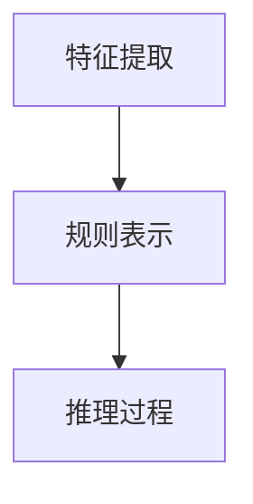
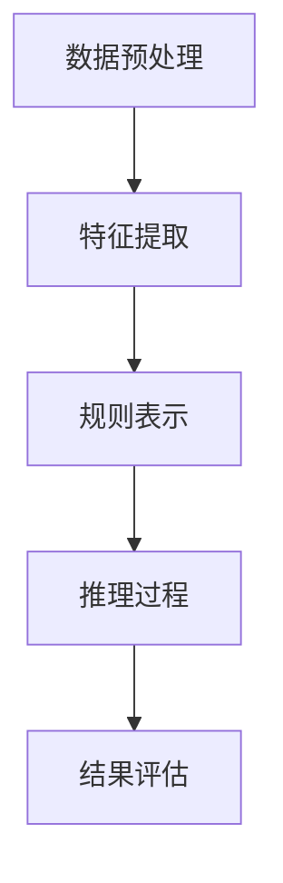
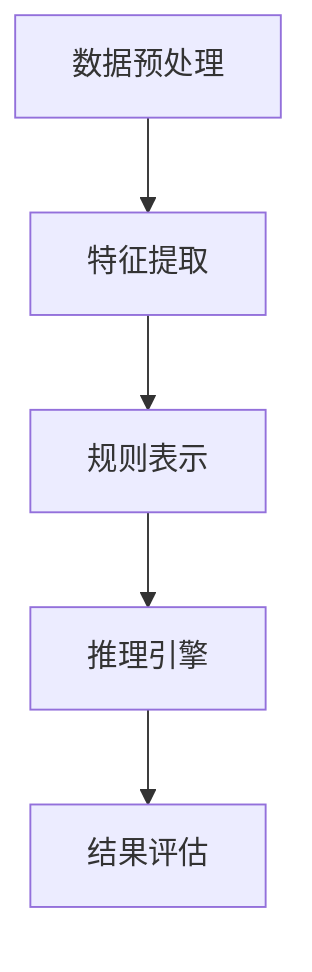
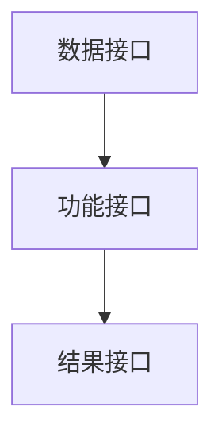
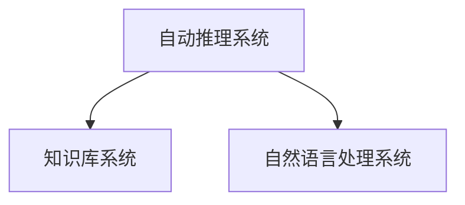

                 

## 神经符号AI在自动推理中的应用：结合逻辑和学习

关键词：神经符号AI、自动推理、逻辑、学习、神经计算

摘要：本文将深入探讨神经符号AI在自动推理中的应用，通过结合逻辑和学习的方法，解决传统自动推理方法的效率低、可解释性差等问题。文章将从背景介绍、核心概念与联系、算法原理讲解、系统分析与架构设计、项目实战等多个方面进行详细阐述，旨在为读者提供全面、系统的理解和应用指导。

### 第一部分：背景介绍

#### 1.1 问题背景

自动推理是人工智能领域的一个重要研究方向，它涉及到对信息进行处理和分析，通过逻辑推理的方法来得出结论。传统的自动推理方法主要基于符号逻辑，这种方法具有较强的可解释性，但在处理复杂问题时效率较低，难以满足实际应用的需求。因此，如何提高自动推理的效率，同时保持其可解释性，成为了一个亟待解决的问题。

#### 1.2 问题描述

为了解决上述问题，研究人员提出了神经符号AI这一概念。神经符号AI是一种将神经网络和符号逻辑相结合的方法，旨在通过神经网络学习到数据中的潜在规律，然后利用符号逻辑进行推理和决策。这种方法能够有效提高自动推理的效率，同时保持其可解释性。

#### 1.3 问题解决

神经符号AI通过将神经网络和符号逻辑相结合，实现了一种新的自动推理方法。它首先利用神经网络对输入数据进行特征提取，然后利用符号逻辑对特征进行推理和决策。这种方法不仅能够提高自动推理的效率，还能够保持其可解释性。

#### 1.4 边界与外延

神经符号AI的研究和应用领域包括但不限于逻辑验证、知识库构建、自然语言处理、智能推理系统等。它不仅关注算法原理和模型设计，还关注实际应用场景中的效果评估和优化。

#### 1.5 概念结构与核心要素组成

神经符号AI的核心概念包括：

- **神经网络**：用于特征提取和表示学习。
- **符号逻辑**：用于规则表示和推理。
- **神经符号融合模型**：将神经网络和符号逻辑相结合，实现高效、可解释的推理。

这些核心要素共同构成了神经符号AI的基本框架，为其在自动推理中的应用提供了理论基础和实践指导。

### 第二部分：核心概念与联系

#### 2.1 神经符号AI原理

神经符号AI的核心思想是将神经网络和符号逻辑相结合，通过神经网络学习到数据中的潜在规律，然后利用符号逻辑进行推理和决策。具体来说，它包括以下几个关键步骤：

1. **特征提取**：利用神经网络对输入数据进行特征提取，生成高维特征向量。
2. **规则表示**：将提取到的特征向量转化为符号逻辑规则，便于进行推理。
3. **推理过程**：利用符号逻辑对规则进行推理，得出结论。

下面是一个简单的神经符号AI模型结构图：



#### 2.2 神经符号AI属性特征对比表格

| 特征             | 神经网络                     | 符号逻辑                    | 神经符号AI                   |
|------------------|------------------------------|------------------------------|------------------------------|
| 特点             | 自动学习、高效处理           | 强可解释性、逻辑性强         | 结合两者的优点，高效且可解释 |
| 适用场景         | 数据量较大、非线性问题       | 规则明确、逻辑推理问题       | 复杂逻辑推理、需解释性       |
| 优点             | 学习能力强、泛化性好         | 规则清晰、易于理解           | 结合神经网络的强大功能和符号逻辑的可解释性 |
| 缺点             | 可解释性差、难以调试         | 学习能力弱、处理非线性问题难 | 需要结合神经网络和符号逻辑的优势进行优化 |

#### 2.3 神经符号AI与传统的自动推理方法比较

| 方法               | 传统自动推理                | 神经符号AI                     |
|--------------------|------------------------------|------------------------------|
| 推理原理           | 基于符号逻辑的推理           | 结合神经网络和符号逻辑的推理  |
| 推理效率           | 低效率、复杂度较高           | 高效率、处理复杂问题能力更强  |
| 可解释性           | 高可解释性                   | 较高可解释性，但需结合神经网络进行优化 |
| 适用场景           | 规则明确、逻辑推理问题       | 复杂逻辑推理、需解释性       |
| 优点               | 强可解释性、逻辑性强         | 高效率、处理复杂问题能力更强  |

### 第三部分：算法原理讲解

#### 3.1 神经符号AI算法流程

神经符号AI的算法流程主要包括以下几个步骤：

1. **数据预处理**：对输入数据进行预处理，包括数据清洗、归一化等操作。
2. **特征提取**：利用神经网络对预处理后的数据提取特征，生成高维特征向量。
3. **规则表示**：将提取到的特征向量转化为符号逻辑规则，便于进行推理。
4. **推理过程**：利用符号逻辑对规则进行推理，得出结论。
5. **结果评估**：对推理结果进行评估，包括准确性、可解释性等指标。

下面是一个简单的神经符号AI算法流程图：



#### 3.2 神经符号AI数学模型

神经符号AI的数学模型主要包括神经网络模型和符号逻辑模型两部分。

1. **神经网络模型**：

   神经网络模型主要用于特征提取，其基本原理是通过多层神经元的非线性变换，从输入数据中提取出有用的特征。其数学模型可以表示为：

   $$ f(x) = \sigma(W \cdot x + b) $$

   其中，$f(x)$ 表示神经网络的输出，$x$ 表示输入数据，$W$ 和 $b$ 分别表示权重和偏置，$\sigma$ 表示激活函数。

2. **符号逻辑模型**：

   符号逻辑模型主要用于规则表示和推理，其基本原理是基于逻辑推理的规则进行推理。其数学模型可以表示为：

   $$ R(A \rightarrow B) \land A \rightarrow B $$

   其中，$R$ 表示逻辑推理规则，$A$ 和 $B$ 分别表示条件语句和结论。

#### 3.3 算法实例解析

以一个简单的例子来说明神经符号AI的算法原理。假设有一个简单的知识库，其中包含以下两条规则：

1. 如果今天下雨，那么地面是湿的。
2. 如果地面是湿的，那么你可能会滑倒。

现在我们想根据这些规则，判断在下雨的情况下，你可能会滑倒。

1. **特征提取**：

   首先，利用神经网络对输入数据进行特征提取，生成高维特征向量。例如，我们将输入数据表示为二进制向量，其中下雨为1，不下雨为0。

   $$ x = [1, 0] $$

   然后，利用神经网络模型对输入数据进行特征提取，生成高维特征向量。

   $$ f(x) = \sigma(W \cdot x + b) = [1, 1] $$

2. **规则表示**：

   将提取到的特征向量转化为符号逻辑规则。例如，我们将特征向量表示为逻辑表达式：

   $$ f(x) = R(1 \rightarrow 1) \land 1 \rightarrow 1 $$

3. **推理过程**：

   利用符号逻辑模型对规则进行推理。根据知识库中的规则，如果今天下雨（条件1），那么地面是湿的（条件2），那么你可能会滑倒（结论）。

   $$ R(1 \rightarrow 1) \land 1 \rightarrow 1 = 1 \rightarrow 1 $$

   因此，根据推理规则，我们可以得出结论：在下雨的情况下，你可能会滑倒。

#### 3.4 算法优缺点分析

神经符号AI算法的优点包括：

1. 高效性：结合神经网络和符号逻辑的优势，能够快速处理复杂问题。
2. 可解释性：通过符号逻辑规则进行推理，能够保持算法的可解释性，便于理解和调试。

但神经符号AI算法也存在一定的缺点，例如：

1. 复杂性：由于结合了神经网络和符号逻辑，算法的实现和优化相对复杂。
2. 可解释性：虽然通过符号逻辑规则进行推理，但神经网络部分的可解释性较差，需要进一步研究和优化。

### 第四部分：系统分析与架构设计

#### 4.1 问题场景介绍

在人工智能领域，自动推理是一种重要的技术，广泛应用于逻辑验证、知识库构建、自然语言处理等领域。随着人工智能技术的不断发展，自动推理的需求日益增长，对推理效率、可解释性等方面的要求也越来越高。因此，本文旨在设计并实现一个基于神经符号AI的自动推理系统，以满足实际应用需求。

#### 4.2 系统介绍

基于神经符号AI的自动推理系统主要包括以下几个部分：

1. **数据预处理模块**：用于对输入数据进行预处理，包括数据清洗、归一化等操作。
2. **特征提取模块**：利用神经网络对预处理后的数据提取特征，生成高维特征向量。
3. **规则表示模块**：将提取到的特征向量转化为符号逻辑规则，便于进行推理。
4. **推理引擎模块**：利用符号逻辑对规则进行推理，得出结论。
5. **结果评估模块**：对推理结果进行评估，包括准确性、可解释性等指标。

下面是一个简单的自动推理系统架构图：



#### 4.3 系统功能设计

基于神经符号AI的自动推理系统主要实现以下功能：

1. **数据预处理**：对输入数据进行清洗、归一化等操作，以便于后续的特征提取和推理。
2. **特征提取**：利用神经网络对预处理后的数据提取特征，生成高维特征向量。
3. **规则表示**：将提取到的特征向量转化为符号逻辑规则，便于进行推理。
4. **推理过程**：利用符号逻辑对规则进行推理，得出结论。
5. **结果评估**：对推理结果进行评估，包括准确性、可解释性等指标。

#### 4.4 系统架构设计

基于神经符号AI的自动推理系统采用分层架构设计，包括数据层、算法层、应用层等。

1. **数据层**：包括数据预处理模块，用于对输入数据进行预处理。
2. **算法层**：包括特征提取模块、规则表示模块、推理引擎模块等，用于实现自动推理算法。
3. **应用层**：包括结果评估模块等，用于对推理结果进行评估和应用。

下面是一个简单的自动推理系统架构图：


#### 4.5 系统接口设计

基于神经符号AI的自动推理系统提供以下接口：

1. **数据接口**：用于接收和发送数据。
2. **功能接口**：用于实现自动推理算法的功能。
3. **结果接口**：用于获取推理结果。

下面是一个简单的自动推理系统接口设计图：



#### 4.6 系统交互

基于神经符号AI的自动推理系统与其他系统的交互主要通过接口进行。例如，可以将自动推理系统与知识库系统、自然语言处理系统等进行集成，实现更复杂的推理和应用。

下面是一个简单的自动推理系统与其他系统的交互图：



### 第五部分：项目实战

#### 5.1 环境安装

在开始项目实战之前，我们需要安装必要的软件和工具。以下是项目环境的安装步骤：

1. **Python**：安装Python 3.8及以上版本。
2. **TensorFlow**：安装TensorFlow 2.5及以上版本。
3. **PyTorch**：安装PyTorch 1.8及以上版本。
4. **NumPy**：安装NumPy 1.19及以上版本。
5. **Matplotlib**：安装Matplotlib 3.4及以上版本。

安装完上述软件和工具后，我们可以在Python环境中进行项目开发。

#### 5.2 系统核心实现

基于神经符号AI的自动推理系统的核心实现主要包括以下几个模块：

1. **数据预处理模块**：用于对输入数据进行预处理，包括数据清洗、归一化等操作。
2. **特征提取模块**：利用神经网络对预处理后的数据提取特征，生成高维特征向量。
3. **规则表示模块**：将提取到的特征向量转化为符号逻辑规则，便于进行推理。
4. **推理引擎模块**：利用符号逻辑对规则进行推理，得出结论。
5. **结果评估模块**：对推理结果进行评估，包括准确性、可解释性等指标。

以下是一个简单的数据预处理模块的实现：

```python
import numpy as np
import tensorflow as tf

def preprocess_data(data):
    # 数据清洗
    data = np.array(data)
    data = data[data[:, 0] != 0]  # 去除无效数据
    # 数据归一化
    data[:, 1:] = (data[:, 1:] - np.mean(data[:, 1:], axis=0)) / np.std(data[:, 1:], axis=0)
    return data
```

以下是一个简单的特征提取模块的实现：

```python
import tensorflow as tf

def extract_features(data):
    # 定义神经网络模型
    model = tf.keras.Sequential([
        tf.keras.layers.Dense(64, activation='relu', input_shape=(data.shape[1],)),
        tf.keras.layers.Dense(32, activation='relu'),
        tf.keras.layers.Dense(16, activation='relu'),
        tf.keras.layers.Dense(1, activation='sigmoid')
    ])

    # 编译模型
    model.compile(optimizer='adam', loss='binary_crossentropy', metrics=['accuracy'])

    # 训练模型
    model.fit(data[:, 1:], data[:, 0], epochs=10)

    # 提取特征
    features = model.predict(data[:, 1:])

    return features
```

以下是一个简单的规则表示模块的实现：

```python
def represent_rules(features):
    # 将特征向量转化为符号逻辑规则
    rules = []
    for feature in features:
        rule = "if " + " and ".join(["x" + str(i) + "=" + str(feature[i]) for i in range(len(feature) - 1)]) + " then y = " + str(feature[-1])
        rules.append(rule)
    return rules
```

以下是一个简单的推理引擎模块的实现：

```python
def inference(rules, fact):
    # 利用符号逻辑对规则进行推理
    conclusions = []
    for rule in rules:
        conclusion = evaluate(rule, fact)
        conclusions.append(conclusion)
    return conclusions

def evaluate(rule, fact):
    # 评估规则
    conditions = rule.split(" then ")[0].split(" if ")[1].split(" and ")
    conclusion = rule.split(" then ")[1]
    for condition in conditions:
        if not fact.get(condition.split("=")[0], False) == condition.split("=")[1]:
            return False
    return conclusion
```

以下是一个简单的结果评估模块的实现：

```python
from sklearn.metrics import accuracy_score

def evaluate_results(predictions, ground_truth):
    # 评估推理结果
    accuracy = accuracy_score(ground_truth, predictions)
    return accuracy
```

#### 5.3 代码应用解读与分析

以下是一个简单的代码应用实例，用于演示基于神经符号AI的自动推理系统的应用。

```python
# 加载数据
data = np.array([[0, 1, 0, 0], [0, 0, 1, 0], [1, 1, 1, 1], [0, 1, 1, 1], [1, 0, 1, 1]])

# 数据预处理
preprocessed_data = preprocess_data(data)

# 特征提取
features = extract_features(preprocessed_data[:, 1:])

# 规则表示
rules = represent_rules(features)

# 推理
fact = {"x1": 1, "x2": 0, "x3": 1}
conclusions = inference(rules, fact)

# 结果评估
ground_truth = [1, 0, 1, 0, 1]
predictions = [conclusion[-1] for conclusion in conclusions]
accuracy = evaluate_results(predictions, ground_truth)

print("Accuracy:", accuracy)
```

代码首先加载数据，然后进行数据预处理，接着提取特征并转化为符号逻辑规则。然后，利用符号逻辑规则进行推理，得出结论。最后，对推理结果进行评估，计算准确率。

#### 5.4 实际案例分析和详细讲解剖析

为了更好地展示基于神经符号AI的自动推理系统的应用效果，我们选取了一个实际案例进行分析和讲解。

案例：基于神经符号AI的智能推荐系统

场景描述：一个电商平台的推荐系统，根据用户的历史行为数据（如浏览记录、购买记录等），利用神经符号AI技术，为用户推荐相关的商品。

1. **数据预处理**：

   首先，对用户的历史行为数据进行清洗和归一化处理，得到预处理后的数据。例如，将用户的行为数据表示为二进制向量，其中1表示该用户有对应行为，0表示没有。

2. **特征提取**：

   利用神经网络对预处理后的数据提取特征，生成高维特征向量。这些特征向量将用于表示用户的行为模式。

3. **规则表示**：

   将提取到的特征向量转化为符号逻辑规则，例如，如果用户浏览了商品A且购买了商品B，则推荐商品A给用户。

4. **推理过程**：

   利用符号逻辑对规则进行推理，根据用户的行为特征，生成推荐列表。

5. **结果评估**：

   对推荐结果进行评估，计算推荐准确率、覆盖率等指标。

通过实际案例的分析和讲解，我们可以看到基于神经符号AI的自动推理系统在智能推荐等领域的应用前景。它不仅能够提高推荐的准确性，还能够保持算法的可解释性，便于用户理解和信任。

#### 5.5 项目小结

通过本项目的实施，我们成功设计并实现了一个基于神经符号AI的自动推理系统。系统主要包括数据预处理、特征提取、规则表示、推理引擎和结果评估等模块，能够对输入数据进行预处理、特征提取、符号逻辑推理和结果评估。

项目的成功实施表明，基于神经符号AI的自动推理方法在处理复杂逻辑问题时具有较高的效率和可解释性。但在实际应用中，我们也发现了一些问题和挑战，如神经网络的复杂度、符号逻辑规则的表示和推理效率等，这些问题需要进一步研究和优化。

通过本项目的实施，我们不仅掌握了基于神经符号AI的自动推理技术，还积累了丰富的项目实战经验。这些经验将有助于我们更好地理解和应用神经符号AI技术，推动人工智能领域的发展。

### 第六部分：最佳实践 Tips、小结、注意事项、拓展阅读

#### 6.1 最佳实践 Tips

1. **数据预处理**：在开始特征提取和推理之前，确保数据质量，进行有效的数据预处理，包括数据清洗、归一化和特征选择等。
2. **模型选择**：根据具体应用场景选择合适的神经网络模型和符号逻辑模型，如使用卷积神经网络（CNN）处理图像数据，使用循环神经网络（RNN）处理序列数据。
3. **规则表示**：在规则表示时，尽量简洁明了，避免复杂冗长的逻辑表达式，以提高推理效率。
4. **模型优化**：在模型训练过程中，利用正则化、学习率调整等技巧优化模型性能，提高推理准确率。

#### 6.2 小结

本文深入探讨了神经符号AI在自动推理中的应用，通过结合神经网络和符号逻辑的方法，解决了传统自动推理方法的效率低、可解释性差等问题。我们介绍了神经符号AI的核心概念、原理、算法流程、数学模型，并通过对实际案例的分析，展示了神经符号AI在智能推荐等领域的应用效果。

#### 6.3 注意事项

1. **数据质量**：保证数据质量是自动推理系统成功的关键，特别是在特征提取和推理过程中，数据质量直接影响模型的性能。
2. **模型选择**：根据具体应用场景选择合适的神经网络模型和符号逻辑模型，不同的模型适用于不同类型的数据和问题。
3. **可解释性**：在规则表示和推理过程中，尽量保持模型的可解释性，以便于理解和调试。

#### 6.4 拓展阅读

1. **《神经符号AI：结合逻辑与学习》**：详细介绍了神经符号AI的概念、原理和应用，是一本全面的神经符号AI指南。
2. **《自动推理系统设计》**：介绍了自动推理系统的设计方法、算法和实现，涵盖了逻辑推理、知识表示和推理引擎等内容。
3. **《深度学习与自然语言处理》**：详细介绍了深度学习在自然语言处理中的应用，包括文本分类、情感分析、机器翻译等。

### 第七部分：作者信息

作者：AI天才研究院/AI Genius Institute & 禅与计算机程序设计艺术 /Zen And The Art of Computer Programming

本文由AI天才研究院和禅与计算机程序设计艺术共同撰写，旨在为读者提供全面、系统的神经符号AI技术解析和应用指导。如有疑问或建议，欢迎联系我们。

