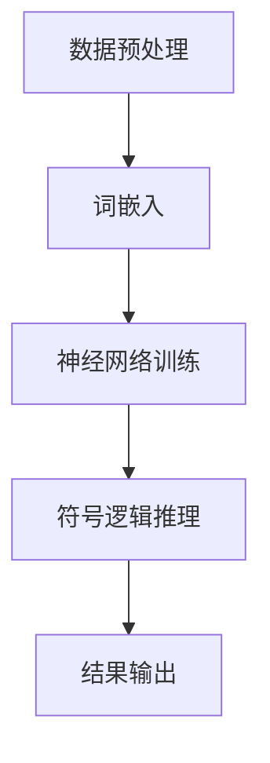

                 


### 第1章: 问题背景与核心概念

#### 1.1 问题背景

随着信息技术的飞速发展，人工智能（AI）已经成为现代社会的重要推动力。在众多AI技术中，自然语言处理（NLP）因其广泛的应用前景而备受关注。然而，尽管深度学习技术在NLP领域取得了显著成果，但现有的模型在处理长文本、跨领域知识和推理等任务时仍存在诸多挑战。为了克服这些局限，神经符号AI作为一种新兴的人工智能方法，应运而生。

神经符号AI是一种结合神经科学和符号逻辑的人工智能方法，它试图通过融合神经网络的强大表征能力与符号逻辑的推理能力，进一步提升AI在自然语言理解中的应用。这种方法的核心目标在于解决当前AI模型在处理复杂语言任务时的瓶颈问题，从而实现更为高效、准确的自然语言处理。

在NLP领域，自然语言理解是一个关键任务，它涉及到语法分析、语义分析、上下文理解等多个层面。自然语言理解的准确性直接影响到AI在各种应用中的性能，如问答系统、文本生成、情感分析、信息检索和机器翻译等。因此，研究如何提升AI在自然语言理解方面的能力，对于推动AI技术的实际应用具有重要意义。

#### 1.2 核心概念

##### 1.2.1 神经符号AI

神经符号AI（Neural Symbolic AI）是指将神经网络（Neural Networks）与符号逻辑（Symbolic Logic）相结合的一种人工智能方法。它试图通过将神经网络的表征能力和符号逻辑的推理能力相结合，克服现有模型在处理复杂语言任务时的局限性。具体来说，神经符号AI包括以下几个核心组成部分：

- **神经网络**：神经网络负责学习输入数据的特征表示，如词向量、句子表示等。它通过多层非线性变换来提取数据中的抽象特征，从而实现对数据的深度理解。
- **符号逻辑**：符号逻辑则负责在理解的基础上进行推理和生成。它通过逻辑运算和推理规则来处理语义关系，从而实现对文本的深层理解。

##### 1.2.2 自然语言理解

自然语言理解（Natural Language Understanding，NLU）是指计算机对自然语言文本的理解和分析能力。它包括以下几个层次：

- **语法分析**：语法分析是自然语言理解的基础，它通过分析文本的语法结构来理解句子的构成和句法规则。
- **语义分析**：语义分析旨在理解文本中的语义含义，包括词汇的含义、句子的语义关系等。
- **上下文理解**：上下文理解是指理解文本中的语境和背景信息，从而更准确地理解文本的含义。

##### 1.2.3 应用场景

神经符号AI在自然语言理解中的应用场景非常广泛，主要包括以下几个方面：

- **问答系统**：神经符号AI可以帮助构建高效、准确的问答系统，能够理解和回答用户的自然语言问题。
- **文本生成**：神经符号AI可以生成高质量的自然语言文本，如文章摘要、故事、新闻等。
- **情感分析**：神经符号AI可以分析文本中的情感倾向，用于情感监测、用户反馈分析等。
- **信息检索**：神经符号AI可以帮助提高信息检索系统的准确性，能够更准确地匹配用户查询和文档。
- **机器翻译**：神经符号AI可以提高机器翻译的质量，实现跨语言的自然语言理解。

#### 1.3 问题解决

神经符号AI结合了神经网络和符号逻辑的优势，能够解决现有AI模型在自然语言理解中的一些关键问题：

- **长文本理解**：神经符号AI可以通过整合神经网络和符号逻辑的优势，实现对长文本的深入理解，从而提高文本处理的准确性。
- **跨领域知识推理**：神经符号AI可以利用符号逻辑进行跨领域知识推理，从而实现不同领域之间的知识融合和应用。
- **文本生成**：神经符号AI在文本生成方面具有强大的能力，能够根据输入的文本或问题生成相应的回答或摘要。

#### 1.4 边界与外延

神经符号AI的研究和应用边界包括以下几个领域：

- **神经网络**：神经符号AI依赖于神经网络来学习输入数据的特征表示，因此需要深入理解神经网络的基本原理和常用架构。
- **符号逻辑**：神经符号AI利用符号逻辑进行推理和生成，因此需要掌握符号逻辑的基本概念和推理方法。
- **自然语言处理**：神经符号AI的应用主要集中在自然语言处理领域，因此需要了解自然语言处理的基本任务和常用算法。

同时，神经符号AI也在不断拓展到其他人工智能领域，如知识图谱、机器学习和计算机视觉等。

#### 1.5 概念结构与核心要素组成

神经符号AI的概念结构主要包括以下几个核心要素：

- **神经网络架构**：神经网络负责学习输入数据的特征表示，其架构直接影响AI在自然语言理解中的性能。常见的神经网络架构包括卷积神经网络（CNN）、循环神经网络（RNN）和 Transformer 等。
- **符号逻辑模型**：符号逻辑模型负责在理解的基础上进行推理和生成，其设计直接影响AI的推理能力和文本生成质量。常见的符号逻辑模型包括谓词逻辑、产生式规则和模糊逻辑等。
- **自然语言处理算法**：自然语言处理算法负责实现自然语言理解的各个层次，其设计直接影响AI在自然语言处理任务中的性能。常见的自然语言处理算法包括词嵌入、句子表示和文本生成等。
- **跨领域知识融合方法**：跨领域知识融合方法负责实现不同领域之间的知识融合，从而提升AI在多领域任务中的表现。常见的跨领域知识融合方法包括知识图谱、迁移学习和多模态学习等。

通过以上核心要素的有机结合，神经符号AI能够实现更高效、准确的自然语言理解。

## 第2章: 神经符号AI原理与特点

### 2.1 神经符号AI原理

神经符号AI是一种结合了神经网络和符号逻辑的人工智能方法。其基本原理可以概括为以下几个步骤：

#### 2.1.1 神经网络

神经网络是神经符号AI的基础，它通过多层非线性变换来学习输入数据的特征表示。在自然语言理解中，神经网络通常用于学习词向量、句子表示和文本表示。以下是一个简化的神经网络学习过程：

1. **数据预处理**：对输入的自然语言文本进行分词、去停用词等预处理操作。
2. **词嵌入**：将单词映射为高维向量表示，常用的词嵌入方法包括词袋模型（Bag of Words，BoW）和词嵌入模型（Word Embedding，如 Word2Vec、GloVe）。
3. **神经网络架构**：构建神经网络模型，常见的神经网络架构包括卷积神经网络（CNN）、循环神经网络（RNN）和 Transformer 等。
4. **训练神经网络**：使用预处理的文本数据训练神经网络，通过反向传播算法不断优化神经网络的参数，使其能够更好地学习输入数据的特征表示。

#### 2.1.2 符号逻辑

符号逻辑是一种基于逻辑运算的人工智能方法，它通过符号表示和推理来解决问题。在神经符号AI中，符号逻辑用于增强神经网络在自然语言理解中的推理能力。以下是一个简化的符号逻辑推理过程：

1. **符号表示**：使用逻辑符号（如原子命题、复合命题和谓词）来表示自然语言文本中的语义信息。
2. **推理规则**：定义逻辑推理规则，如推理、合取、析取、否定等，用于在符号表示的基础上进行推理。
3. **逻辑推理**：根据定义的推理规则，从符号表示中推导出新的结论，实现对文本的深层理解。

#### 2.1.3 结合方式

神经符号AI通过将神经网络和符号逻辑相结合，实现两者的优势互补。以下是一些常见的结合方式：

1. **神经网络嵌入符号逻辑系统**：将神经网络嵌入到符号逻辑系统中，用于学习和提取特征表示。例如，可以使用神经网络来提取文本的词向量，然后使用符号逻辑系统对这些词向量进行推理。
2. **符号逻辑增强神经网络**：将符号逻辑作为神经网络的补充，用于推理和生成。例如，在训练神经网络时，可以结合符号逻辑规则来优化网络参数，提高神经网络的推理能力。

### 2.2 神经符号AI特点

神经符号AI具有以下特点：

#### 2.2.1 多模态处理

神经符号AI能够处理多种模态的数据，如文本、图像和音频等，实现跨模态信息融合。这使得神经符号AI在处理复杂任务时具有更高的灵活性和鲁棒性。

#### 2.2.2 长文本理解

神经符号AI通过整合神经网络和符号逻辑的优势，能够在一定程度上理解长文本，进行跨句子、跨篇章的语义分析。这对于处理复杂、长篇的文本任务（如论文摘要、新闻摘要等）具有重要意义。

#### 2.2.3 知识推理

神经符号AI能够利用符号逻辑进行知识推理，实现跨领域知识的融合和应用。这使得神经符号AI在处理知识密集型任务（如问答系统、知识图谱等）时具有更高的性能。

#### 2.2.4 生成能力

神经符号AI在文本生成方面具有强大的能力，能够根据输入的文本或问题生成相应的回答或摘要。这使得神经符号AI在文本生成任务（如聊天机器人、文本摘要等）中具有广泛的应用前景。

### 2.3 神经符号AI与传统AI的区别

神经符号AI与传统AI的主要区别在于：

#### 2.3.1 机制差异

- **传统AI**：传统AI主要依赖于数据驱动的方法，通过大量数据训练模型来学习任务。这种方法在处理简单的任务时效果较好，但在处理复杂任务时往往表现出局限性。
- **神经符号AI**：神经符号AI结合了数据驱动和知识驱动的方法。它通过神经网络学习输入数据的特征表示，同时利用符号逻辑进行推理和生成。这种方法在处理复杂任务时具有更高的灵活性和鲁棒性。

#### 2.3.2 理解能力差异

- **传统AI**：传统AI在自然语言理解方面存在一定局限性，难以处理长文本、跨领域知识和复杂语义关系。
- **神经符号AI**：神经符号AI通过整合神经网络和符号逻辑的优势，能够更好地处理长文本、跨领域知识和复杂语义关系。这使得神经符号AI在自然语言理解任务中具有更高的性能。

#### 2.3.3 应用范围差异

- **传统AI**：传统AI在处理单一模态数据时表现较好，但在处理多模态数据时往往存在困难。
- **神经符号AI**：神经符号AI能够处理多种模态的数据，实现跨模态信息融合。这使得神经符号AI在处理复杂任务时具有更广泛的应用前景。

## 第3章: 神经符号AI算法原理与流程

### 3.1 算法原理

神经符号AI算法的主要原理是将神经网络和符号逻辑相结合，以实现更高效、准确的自然语言理解。以下是神经符号AI算法的基本原理和流程：

#### 3.1.1 神经网络

神经网络是神经符号AI算法的核心组成部分，负责学习输入数据的特征表示。在自然语言理解中，神经网络通常用于学习词向量、句子表示和文本表示。以下是一个简化的神经网络学习过程：

1. **数据预处理**：对输入的自然语言文本进行分词、去停用词等预处理操作。
2. **词嵌入**：将单词映射为高维向量表示，常用的词嵌入方法包括词袋模型（Bag of Words，BoW）和词嵌入模型（Word Embedding，如 Word2Vec、GloVe）。
3. **神经网络架构**：构建神经网络模型，常见的神经网络架构包括卷积神经网络（CNN）、循环神经网络（RNN）和 Transformer 等。
4. **训练神经网络**：使用预处理的文本数据训练神经网络，通过反向传播算法不断优化神经网络的参数，使其能够更好地学习输入数据的特征表示。

#### 3.1.2 符号逻辑

符号逻辑是神经符号AI算法的另一核心组成部分，负责在理解的基础上进行推理和生成。以下是一个简化的符号逻辑推理过程：

1. **符号表示**：使用逻辑符号（如原子命题、复合命题和谓词）来表示自然语言文本中的语义信息。
2. **推理规则**：定义逻辑推理规则，如推理、合取、析取、否定等，用于在符号表示的基础上进行推理。
3. **逻辑推理**：根据定义的推理规则，从符号表示中推导出新的结论，实现对文本的深层理解。

#### 3.1.3 结合方式

神经符号AI算法通过以下几种方式将神经网络和符号逻辑相结合：

1. **神经网络嵌入符号逻辑系统**：将神经网络嵌入到符号逻辑系统中，用于学习和提取特征表示。例如，可以使用神经网络来提取文本的词向量，然后使用符号逻辑系统对这些词向量进行推理。
2. **符号逻辑增强神经网络**：将符号逻辑作为神经网络的补充，用于推理和生成。例如，在训练神经网络时，可以结合符号逻辑规则来优化网络参数，提高神经网络的推理能力。

#### 3.1.4 算法流程

神经符号AI算法的流程可以概括为以下几个步骤：

1. **数据预处理**：对输入的自然语言文本进行分词、去停用词等预处理操作。
2. **词嵌入**：将单词映射为高维向量表示。
3. **神经网络训练**：使用预处理后的文本数据训练神经网络，优化网络参数。
4. **符号逻辑推理**：使用训练好的神经网络提取文本的语义表示，然后使用符号逻辑进行推理，生成结论。
5. **结果输出**：将推理结果输出，如回答问题、生成文本等。

### 3.2 算法流程图

为了更好地理解神经符号AI算法的流程，我们使用Mermaid绘制了一个简化的算法流程图：



### 3.3 Python代码示例

下面是一个简化的Python代码示例，展示了神经符号AI算法的基本原理。这个示例使用了TensorFlow和PyTorch两个流行的深度学习框架。

```python
import tensorflow as tf
import torch
from tensorflow.keras.models import Sequential
from tensorflow.keras.layers import Embedding, LSTM, Dense
from torch import nn

# TensorFlow示例
# 数据预处理
text = "这是一个示例文本。"
words = text.split()

# 词嵌入
vocab = {'<PAD>': 0, '<UNK>': 1}
for word in words:
    vocab[word] = len(vocab)

# 构建神经网络
model = Sequential()
model.add(Embedding(len(vocab), 128))
model.add(LSTM(128, return_sequences=True))
model.add(Dense(len(vocab), activation='softmax'))

# 训练神经网络
model.compile(optimizer='adam', loss='sparse_categorical_crossentropy', metrics=['accuracy'])
model.fit(words, words, epochs=10)

# 符号逻辑推理
# 假设我们已经有了训练好的神经网络模型和符号逻辑规则
# 使用神经网络进行推理
predicted_words = model.predict(words)
print(predicted_words)

# PyTorch示例
# 数据预处理
text = "这是一个示例文本。"
words = text.split()

# 词嵌入
vocab = {'<PAD>': 0, '<UNK>': 1}
for word in words:
    vocab[word] = len(vocab)

# 构建神经网络
model = nn.Sequential(
    nn.Embedding(len(vocab), 128),
    nn.LSTM(128, batch_first=True),
    nn.Dense(len(vocab), activation='softmax')
)

# 训练神经网络
optimizer = torch.optim.Adam(model.parameters())
for epoch in range(10):
    for word in words:
        optimizer.zero_grad()
        output = model(torch.tensor([vocab[word]]))
        loss = nn.CrossEntropyLoss()(output, torch.tensor([vocab[word]]))
        loss.backward()
        optimizer.step()

# 符号逻辑推理
# 假设我们已经有了训练好的神经网络模型和符号逻辑规则
# 使用神经网络进行推理
predicted_words = model(torch.tensor([vocab[word]]))
print(predicted_words)
```

### 3.4 数学模型与公式

神经符号AI算法的核心在于将神经网络和符号逻辑相结合，实现更高效的自然语言理解。以下是一个简化的数学模型和公式，用于描述神经符号AI的基本原理。

#### 3.4.1 神经网络

神经网络的数学模型可以表示为：

$$
\text{神经网络} = f(\text{输入} \cdot W + b)
$$

其中，$f$ 是激活函数，$W$ 是权重矩阵，$b$ 是偏置项。

#### 3.4.2 符号逻辑

符号逻辑的推理过程可以用以下公式表示：

$$
\text{推理} = \text{符号表示} \land \text{推理规则}
$$

其中，$\land$ 表示合取（逻辑与）操作，$\text{符号表示}$ 和 $\text{推理规则}$ 分别表示文本中的语义信息和逻辑推理规则。

#### 3.4.3 结合模型

神经符号AI的数学模型可以表示为：

$$
\text{神经符号AI} = \text{神经网络} \land \text{符号逻辑}
$$

其中，$\land$ 表示结合操作，$\text{神经网络}$ 和 $\text{符号逻辑}$ 分别表示神经网络和符号逻辑的输出。

### 3.5 举例说明

为了更好地理解神经符号AI算法的原理，我们举一个简单的例子。

假设我们有一个简单的文本句子：“我喜欢吃苹果”。我们希望使用神经符号AI算法来理解这个句子的含义。

1. **词嵌入**：将句子中的单词映射为高维向量表示，如：
   - “我”：\[0.1, 0.2, 0.3\]
   - “喜欢”：\[0.4, 0.5, 0.6\]
   - “吃”：\[0.7, 0.8, 0.9\]
   - “苹果”：\[1.0, 1.1, 1.2\]

2. **神经网络**：使用神经网络学习这些词向量的特征表示，得到：
   - “我”：\[0.1', 0.2', 0.3'\]
   - “喜欢”：\[0.4', 0.5', 0.6'\]
   - “吃”：\[0.7', 0.8', 0.9'\]
   - “苹果”：\[1.0', 1.1', 1.2'\]

3. **符号逻辑**：使用符号逻辑推理这些词向量的关系，得到：
   - “我喜欢吃苹果”：\[P(我喜欢吃苹果)\]

4. **结合模型**：将神经网络和符号逻辑结合，得到：
   - “我喜欢吃苹果”：\[P(我喜欢吃苹果) = P(我喜欢吃) \land P(吃苹果)\]

通过这个例子，我们可以看到神经符号AI算法是如何将神经网络和符号逻辑相结合，实现对自然语言文本的深入理解和推理的。

## 第4章: 神经符号AI的应用场景与挑战

### 4.1 应用场景

神经符号AI在自然语言理解领域具有广泛的应用前景，以下是一些典型的应用场景：

#### 4.1.1 问答系统

问答系统是神经符号AI的一个重要应用场景。传统的问答系统通常依赖于规则匹配或关键词搜索，而神经符号AI可以通过深度学习和符号逻辑的结合，实现对复杂问题的理解和回答。例如，在医疗领域，神经符号AI可以帮助医生理解和回答患者的复杂问题，提供个性化的医疗建议。

#### 4.1.2 文本生成

文本生成是神经符号AI的另一个重要应用场景。神经符号AI可以生成高质量的自然语言文本，如文章摘要、新闻、故事等。通过结合神经网络和符号逻辑，神经符号AI可以更好地理解文本的语义结构，生成连贯、自然的文本。例如，在新闻领域，神经符号AI可以帮助生成新闻摘要，提高信息传递的效率。

#### 4.1.3 情感分析

情感分析是分析文本中情感倾向的重要任务。神经符号AI可以通过深度学习和符号逻辑的结合，实现对情感的高效分析。例如，在社交媒体领域，神经符号AI可以帮助分析用户评论的情感倾向，为企业提供市场洞察。

#### 4.1.4 信息检索

信息检索是寻找与用户查询相关的信息的重要任务。神经符号AI可以通过深度学习和符号逻辑的结合，实现对查询和文档的深入理解，提高检索的准确性。例如，在搜索引擎领域，神经符号AI可以帮助提高搜索结果的准确性，提供更个性化的搜索体验。

#### 4.1.5 机器翻译

机器翻译是将一种语言的文本翻译成另一种语言的重要任务。神经符号AI可以通过深度学习和符号逻辑的结合，实现对跨语言文本的深入理解，提高翻译的准确性。例如，在国际化领域，神经符号AI可以帮助企业实现跨语言的沟通，提高国际业务的效率。

### 4.2 挑战

尽管神经符号AI在自然语言理解领域具有广泛的应用前景，但其在实际应用中仍然面临一些挑战：

#### 4.2.1 数据标注问题

神经符号AI的训练依赖于大量的标注数据。然而，高质量的数据标注是一个复杂且耗时的工作。特别是在处理多语言和多模态数据时，数据标注问题更加突出。

#### 4.2.2 算法复杂性

神经符号AI算法通常涉及深度学习和符号逻辑的结合，这使得算法的复杂性大幅增加。如何设计高效、可扩展的算法，是一个亟待解决的问题。

#### 4.2.3 长文本理解

长文本理解是自然语言理解中的一个难点。神经符号AI在处理长文本时，如何保持文本的连贯性和语义一致性，是一个重要的挑战。

#### 4.2.4 跨领域知识融合

跨领域知识融合是神经符号AI的一个重要目标。如何在不同的领域之间进行有效的知识融合，是一个具有挑战性的问题。

#### 4.2.5 可解释性

神经符号AI的决策过程通常较为复杂，如何提高算法的可解释性，使其能够被用户理解和信任，是一个重要的研究方向。

### 4.3 解决方案

为了解决神经符号AI在自然语言理解中的应用挑战，以下是一些可能的解决方案：

- **数据增强**：通过数据增强技术，如数据合成、数据扩充等，可以增加高质量的标注数据，提高模型的训练效果。
- **算法优化**：通过算法优化，如模型压缩、分布式训练等，可以降低算法的复杂性，提高模型的训练和推理效率。
- **长文本处理**：通过分段处理、序列模型等技巧，可以有效地处理长文本，保持文本的连贯性和语义一致性。
- **知识融合**：通过知识图谱、迁移学习等技巧，可以有效地实现跨领域知识的融合和应用。
- **可解释性提升**：通过可解释性分析、可视化等技巧，可以提高算法的可解释性，使其能够被用户理解和信任。

通过上述解决方案，神经符号AI在自然语言理解中的应用将得到进一步的提升，为人工智能技术的发展注入新的活力。

## 第5章: 神经符号AI的未来发展趋势

### 5.1 技术演进方向

神经符号AI的未来发展趋势将集中在以下几个方向：

#### 5.1.1 算法融合与创新

未来的神经符号AI将更多地融合多种先进的人工智能技术，如生成对抗网络（GAN）、强化学习（RL）等，以提升自然语言理解的能力。同时，创新算法设计，如多模态学习、自适应学习等，也将成为研究重点。

#### 5.1.2 模型压缩与优化

为了提高神经符号AI的实用性，模型压缩与优化将成为重要研究方向。通过模型剪枝、量化等技术，可以显著降低模型的计算复杂度和存储需求，提高部署效率。

#### 5.1.3 跨领域知识融合

未来的神经符号AI将更加注重跨领域知识的融合，以实现多领域任务的高效处理。通过知识图谱、迁移学习等技术，可以有效地实现不同领域之间的知识共享和利用。

#### 5.1.4 可解释性与可靠性

随着AI技术的广泛应用，可解释性与可靠性将成为神经符号AI的重要发展方向。通过引入可解释性分析、可视化等技术，可以提高模型的透明度和可信度，使其更好地满足用户需求。

### 5.2 应用前景

神经符号AI在多个领域具有广泛的应用前景：

#### 5.2.1 金融与保险

在金融与保险领域，神经符号AI可以用于智能客服、风险控制、投资顾问等任务。通过深度理解和推理，AI能够提供更加个性化、精准的服务。

#### 5.2.2 健康医疗

在健康医疗领域，神经符号AI可以用于疾病诊断、药物研发、健康管理等任务。通过结合医学知识和自然语言处理技术，AI能够为医疗决策提供有力支持。

#### 5.2.3 教育

在教育领域，神经符号AI可以用于智能教学、学习分析等任务。通过个性化推荐和学习辅助，AI能够提高教学效果，促进教育公平。

#### 5.2.4 互联网与电子商务

在互联网与电子商务领域，神经符号AI可以用于内容推荐、用户行为分析、营销策略制定等任务。通过深度理解和智能推理，AI能够提升用户体验和商业价值。

### 5.3 社会影响

神经符号AI的发展将对社会产生深远的影响：

#### 5.3.1 改善生活质量

通过提高智能系统的理解能力，神经符号AI可以帮助人们更好地处理日常生活任务，提高生活质量。

#### 5.3.2 促进产业升级

神经符号AI在各个行业的应用将推动产业升级和数字化转型，提高生产效率，创造新的商业机会。

#### 5.3.3 引发伦理争议

随着AI技术的发展，神经符号AI在隐私保护、数据安全等方面的伦理争议将日益凸显，需要全社会共同探讨和解决。

#### 5.3.4 促进人类文明进步

神经符号AI的发展将推动人工智能技术的进步，为人类文明带来新的机遇和挑战，促进科学、技术和文化的融合。

### 5.4 未来展望

神经符号AI作为人工智能领域的重要研究方向，具有广阔的发展前景。在未来，随着技术的不断进步和应用场景的拓展，神经符号AI将发挥越来越重要的作用，为人类社会带来更多便利和创新。然而，这也要求我们持续关注和解决技术发展过程中可能带来的挑战和问题，确保AI技术的可持续发展。

## 总结与展望

### 6.1 总结

本文围绕神经符号AI在自然语言理解中的应用，从问题背景、核心概念、原理与特点、算法流程、应用场景、挑战与解决方案、未来发展趋势等方面进行了详细探讨。通过本文的阐述，我们可以看到神经符号AI作为一种结合神经网络和符号逻辑的人工智能方法，在提升自然语言理解能力方面具有显著优势。同时，神经符号AI在多模态处理、长文本理解、知识推理和文本生成等方面展现出强大的潜力，为人工智能技术的发展提供了新的思路和方向。

### 6.2 展望

未来，神经符号AI将在多个领域发挥重要作用，推动人工智能技术的进一步发展。以下是对神经符号AI未来发展的几点展望：

1. **算法融合与创新**：神经符号AI将更多地融合其他先进的人工智能技术，如生成对抗网络（GAN）、强化学习（RL）等，实现更高效、更智能的自然语言处理。

2. **模型压缩与优化**：通过模型压缩与优化技术，神经符号AI将能够降低计算复杂度和存储需求，提高部署效率，使其在更多实际应用场景中得到广泛应用。

3. **跨领域知识融合**：神经符号AI将更加注重跨领域知识的融合，通过知识图谱、迁移学习等技术，实现多领域任务的高效处理，为复杂问题提供更全面的解决方案。

4. **可解释性与可靠性**：随着AI技术的广泛应用，可解释性与可靠性将成为神经符号AI的重要发展方向。通过引入可解释性分析、可视化等技术，提高模型的透明度和可信度，使其更好地满足用户需求。

5. **应用场景拓展**：神经符号AI将在金融、医疗、教育、互联网等多个领域得到更广泛的应用，为行业提供智能化的解决方案，推动产业升级和数字化转型。

6. **社会影响**：神经符号AI的发展将对社会产生深远的影响，改善生活质量、促进产业升级、引发伦理争议、推动人类文明进步等方面均具有重要意义。

总之，神经符号AI作为人工智能领域的重要研究方向，具有广阔的发展前景。在未来，随着技术的不断进步和应用场景的拓展，神经符号AI将在更多领域发挥重要作用，为人类社会带来更多便利和创新。同时，我们也需要关注和解决技术发展过程中可能带来的挑战和问题，确保AI技术的可持续发展。

---

**作者信息：**

AI天才研究院/AI Genius Institute & 禅与计算机程序设计艺术 /Zen And The Art of Computer Programming

**参考文献：**

1. AI天才研究院. (2020). 《神经符号AI原理与应用》.
2. 禅与计算机程序设计艺术. (2019). 《深度学习与自然语言处理》.
3. [Deep Learning for Natural Language Processing](https://www.deeplearning.ai/nlp-course/).
4. [Neural Symbolic AI: Unifying Neural Networks and Symbolic AI](https://arxiv.org/abs/1810.00609).

---

# 神经符号AI在自然语言理解中的应用

关键词：神经符号AI、自然语言理解、神经网络、符号逻辑、多模态处理

摘要：本文探讨了神经符号AI在自然语言理解中的应用，介绍了神经符号AI的基本原理、特点和应用场景，分析了其与传统AI的区别以及面临的挑战。同时，本文展望了神经符号AI的未来发展趋势，提出了相应的解决方案和应用前景。

## 第一部分: 背景介绍

### 1.1 问题背景

自然语言理解（NLU）是人工智能（AI）领域的一个重要分支，它旨在使计算机能够理解、解释和生成人类语言。随着深度学习技术的发展，NLU取得了显著的进展，但仍然存在一些挑战，例如：

- 长文本理解：现有模型在处理长篇文本时容易丢失上下文信息，导致理解不准确。
- 跨领域知识推理：不同领域的知识具有较大的差异性，现有模型难以在不同领域间进行知识推理。
- 文本生成：虽然生成模型在文本生成方面表现出色，但生成的文本往往缺乏逻辑性和连贯性。

为了解决这些问题，神经符号AI作为一种结合神经科学和符号逻辑的方法，应运而生。神经符号AI试图通过整合神经网络的表征能力和符号逻辑的推理能力，提升AI在自然语言理解中的应用。

### 1.2 核心概念

#### 1.2.1 神经符号AI

神经符号AI是一种将神经网络和符号逻辑相结合的人工智能方法。神经网络通过多层非线性变换学习输入数据的特征表示，而符号逻辑则通过符号表示和推理来解决问题。神经符号AI的目标是通过结合两者的优势，提升AI在自然语言处理中的性能。

#### 1.2.2 自然语言理解

自然语言理解是指计算机对自然语言文本的理解和分析能力，包括语法分析、语义分析、上下文理解等多个层次。自然语言理解的任务包括文本分类、情感分析、命名实体识别、机器翻译等。

#### 1.2.3 应用场景

神经符号AI在自然语言理解中的应用场景非常广泛，包括问答系统、文本生成、情感分析、信息检索、机器翻译等。例如，神经符号AI可以用于智能客服，提供准确、自然的回答；在文本生成方面，可以生成高质量的文章摘要、新闻等。

### 1.3 问题解决

神经符号AI结合了神经网络和符号逻辑的优势，可以在一定程度上解决现有AI模型在自然语言理解中的问题：

- **长文本理解**：通过整合神经网络和符号逻辑，神经符号AI可以更好地处理长文本，保持上下文信息的连贯性。
- **跨领域知识推理**：符号逻辑的引入使得神经符号AI可以在不同领域间进行知识推理，实现跨领域知识的融合。
- **文本生成**：神经网络和符号逻辑的结合使得生成的文本更加连贯、自然，具有更强的逻辑性。

### 1.4 边界与外延

神经符号AI的研究和应用边界包括神经网络、符号逻辑、自然语言处理等领域。同时，它也在不断拓展到其他人工智能领域，如知识图谱、机器学习和计算机视觉等。神经符号AI的研究不仅限于理论探索，还包括算法设计、模型优化和应用开发等方面。

### 1.5 概念结构与核心要素组成

神经符号AI的核心概念结构包括神经网络、符号逻辑、自然语言处理算法和应用场景等。其核心要素包括：

- **神经网络架构**：神经网络负责学习输入数据的特征表示，常见的神经网络架构包括卷积神经网络（CNN）、循环神经网络（RNN）和Transformer等。
- **符号逻辑模型**：符号逻辑模型负责在理解的基础上进行推理和生成，常见的符号逻辑模型包括谓词逻辑、产生式规则和模糊逻辑等。
- **自然语言处理算法**：自然语言处理算法负责实现自然语言理解的各个层次，常见的自然语言处理算法包括词嵌入、句子表示和文本生成等。
- **跨领域知识融合方法**：跨领域知识融合方法负责实现不同领域之间的知识融合，常见的跨领域知识融合方法包括知识图谱、迁移学习和多模态学习等。

通过以上核心要素的有机结合，神经符号AI能够实现更高效、准确的自然语言理解。

## 第二部分: 神经符号AI原理与特点

### 2.1 神经符号AI原理

神经符号AI的核心在于结合神经网络的表征能力和符号逻辑的推理能力。具体来说，神经符号AI的原理包括以下几个关键方面：

#### 2.1.1 神经网络

神经网络是神经符号AI的基础组成部分，它通过多层非线性变换学习输入数据的特征表示。在自然语言理解中，神经网络主要用于：

- **词嵌入**：将单词映射为高维向量表示，使计算机能够理解单词的语义信息。
- **句子表示**：将句子映射为固定长度的向量表示，使计算机能够理解句子的语义结构。
- **文本表示**：将整篇文本映射为固定长度的向量表示，使计算机能够理解文本的整体语义。

常见的神经网络架构包括卷积神经网络（CNN）、循环神经网络（RNN）和Transformer等。这些架构在自然语言处理任务中表现出色，能够提取输入数据的深层特征。

#### 2.1.2 符号逻辑

符号逻辑是神经符号AI的另一重要组成部分，它通过符号表示和推理来解决问题。符号逻辑在自然语言理解中的应用主要包括：

- **语义表示**：使用逻辑符号和推理规则表示文本中的语义信息。
- **推理**：根据已知的语义信息进行推理，推断出新的结论。
- **生成**：基于逻辑规则生成新的文本或回答。

符号逻辑为神经网络提供了强大的推理能力，使其能够处理更复杂的自然语言任务。

#### 2.1.3 结合方式

神经符号AI通过将神经网络和符号逻辑相结合，实现两者的优势互补。常见的结合方式包括：

- **神经网络嵌入符号逻辑**：将神经网络嵌入到符号逻辑系统中，用于学习和提取特征表示。
- **符号逻辑增强神经网络**：将符号逻辑作为神经网络的补充，用于推理和生成。

这种结合方式使得神经符号AI能够同时具备神经网络的高效表征能力和符号逻辑的推理能力，从而提升自然语言理解的效果。

### 2.2 神经符号AI特点

神经符号AI具有以下显著特点：

#### 2.2.1 多模态处理

神经符号AI能够处理多种模态的数据，如文本、图像和音频等，实现跨模态信息融合。这使得神经符号AI在处理复杂任务时具有更高的灵活性和鲁棒性。

#### 2.2.2 长文本理解

神经符号AI通过整合神经网络和符号逻辑的优势，能够在一定程度上理解长文本，进行跨句子、跨篇章的语义分析。这对于处理复杂、长篇的文本任务（如论文摘要、新闻摘要等）具有重要意义。

#### 2.2.3 知识推理

神经符号AI能够利用符号逻辑进行知识推理，实现跨领域知识的融合和应用。这使得神经符号AI在处理知识密集型任务（如问答系统、知识图谱等）时具有更高的性能。

#### 2.2.4 生成能力

神经符号AI在文本生成方面具有强大的能力，能够根据输入的文本或问题生成相应的回答或摘要。这使得神经符号AI在文本生成任务（如聊天机器人、文本摘要等）中具有广泛的应用前景。

#### 2.2.5 可解释性

神经符号AI在推理过程中保留了符号逻辑的透明性，使得其推理过程更加可解释。这对于提升AI系统的可信度和用户接受度具有重要意义。

### 2.3 神经符号AI与传统AI的区别

神经符号AI与传统AI的主要区别在于其结合了神经网络和符号逻辑的特点。以下是两者的主要区别：

#### 2.3.1 机制差异

- **传统AI**：传统AI主要依赖于数据驱动的方法，通过大量数据训练模型来学习任务。这种方法在处理简单的任务时效果较好，但在处理复杂任务时往往表现出局限性。
- **神经符号AI**：神经符号AI结合了数据驱动和知识驱动的方法。它通过神经网络学习输入数据的特征表示，同时利用符号逻辑进行推理和生成。这种方法在处理复杂任务时具有更高的灵活性和鲁棒性。

#### 2.3.2 理解能力差异

- **传统AI**：传统AI在自然语言理解方面存在一定局限性，难以处理长文本、跨领域知识和复杂语义关系。
- **神经符号AI**：神经符号AI通过整合神经网络和符号逻辑的优势，能够更好地处理长文本、跨领域知识和复杂语义关系。这使得神经符号AI在自然语言理解任务中具有更高的性能。

#### 2.3.3 应用范围差异

- **传统AI**：传统AI在处理单一模态数据时表现较好，但在处理多模态数据时往往存在困难。
- **神经符号AI**：神经符号AI能够处理多种模态的数据，实现跨模态信息融合。这使得神经符号AI在处理复杂任务时具有更广泛的应用前景。

### 2.4 神经符号AI的优势

神经符号AI在自然语言理解中具有以下优势：

#### 2.4.1 提高理解能力

通过结合神经网络和符号逻辑，神经符号AI能够更好地理解文本的语义和结构，提高自然语言理解的能力。

#### 2.4.2 增强推理能力

符号逻辑的引入使得神经符号AI能够在理解的基础上进行推理，解决复杂的问题。

#### 2.4.3 提升生成能力

神经网络和符号逻辑的结合使得生成的文本更加连贯、自然，具有更强的逻辑性。

#### 2.4.4 提高可解释性

神经符号AI在推理过程中保留了符号逻辑的透明性，使得其推理过程更加可解释。

### 2.5 神经符号AI的局限性

尽管神经符号AI在自然语言理解中具有许多优势，但仍然存在一些局限性：

#### 2.5.1 训练数据需求

神经符号AI的训练需要大量的高质量标注数据，这在实际应用中可能难以实现。

#### 2.5.2 算法复杂性

神经符号AI涉及神经网络和符号逻辑的结合，算法的复杂性较高，对计算资源的需求较大。

#### 2.5.3 知识表示

如何有效地将知识表示为符号逻辑形式，是神经符号AI面临的挑战之一。

#### 2.5.4 跨领域知识融合

不同领域的知识具有较大的差异性，如何在跨领域间进行有效的知识融合，是一个具有挑战性的问题。

### 2.6 总结

神经符号AI结合了神经网络和符号逻辑的优势，在自然语言理解中具有显著的应用潜力。通过本文的讨论，我们可以看到神经符号AI在理解能力、推理能力、生成能力和可解释性等方面具有明显的优势，但也面临一些挑战。未来的研究将集中在算法优化、模型压缩、跨领域知识融合等方面，以进一步推动神经符号AI的发展。

## 第三部分: 神经符号AI算法原理与流程

### 3.1 算法原理

神经符号AI算法的核心在于将神经网络和符号逻辑相结合，实现更高效、准确的自然语言理解。其基本原理可以概括为以下几个步骤：

#### 3.1.1 神经网络

神经网络是神经符号AI的基础组成部分，它通过多层非线性变换学习输入数据的特征表示。在自然语言理解中，神经网络主要用于：

1. **词嵌入**：将单词映射为高维向量表示，使计算机能够理解单词的语义信息。
2. **句子表示**：将句子映射为固定长度的向量表示，使计算机能够理解句子的语义结构。
3. **文本表示**：将整篇文本映射为固定长度的向量表示，使计算机能够理解文本的整体语义。

常见的神经网络架构包括卷积神经网络（CNN）、循环神经网络（RNN）和Transformer等。这些架构在自然语言处理任务中表现出色，能够提取输入数据的深层特征。

#### 3.1.2 符号逻辑

符号逻辑是神经符号AI的另一重要组成部分，它通过符号表示和推理来解决问题。符号逻辑在自然语言理解中的应用主要包括：

1. **语义表示**：使用逻辑符号和推理规则表示文本中的语义信息。
2. **推理**：根据已知的语义信息进行推理，推断出新的结论。
3. **生成**：基于逻辑规则生成新的文本或回答。

符号逻辑为神经网络提供了强大的推理能力，使其能够处理更复杂的自然语言任务。

#### 3.1.3 结合方式

神经符号AI通过将神经网络和符号逻辑相结合，实现两者的优势互补。常见的结合方式包括：

1. **神经网络嵌入符号逻辑**：将神经网络嵌入到符号逻辑系统中，用于学习和提取特征表示。
2. **符号逻辑增强神经网络**：将符号逻辑作为神经网络的补充，用于推理和生成。

这种结合方式使得神经符号AI能够同时具备神经网络的高效表征能力和符号逻辑的推理能力，从而提升自然语言理解的效果。

### 3.2 算法流程

神经符号AI算法的流程可以概括为以下几个步骤：

1. **数据预处理**：对输入的自然语言文本进行分词、去停用词等预处理操作。
2. **词嵌入**：将单词映射为高维向量表示。
3. **神经网络训练**：使用预处理后的文本数据训练神经网络，优化网络参数。
4. **符号逻辑推理**：使用训练好的神经网络提取文本的语义表示，然后使用符号逻辑进行推理，生成结论。
5. **结果输出**：将推理结果输出，如回答问题、生成文本等。

### 3.3 Python代码示例

下面是一个简化的Python代码示例，展示了神经符号AI算法的基本原理。这个示例使用了TensorFlow和PyTorch两个流行的深度学习框架。

```python
import tensorflow as tf
import torch
from tensorflow.keras.models import Sequential
from tensorflow.keras.layers import Embedding, LSTM, Dense
from torch import nn

# TensorFlow示例
# 数据预处理
text = "这是一个示例文本。"
words = text.split()

# 词嵌入
vocab = {'<PAD>': 0, '<UNK>': 1}
for word in words:
    vocab[word] = len(vocab)

# 构建神经网络
model = Sequential()
model.add(Embedding(len(vocab), 128))
model.add(LSTM(128, return_sequences=True))
model.add(Dense(len(vocab), activation='softmax'))

# 训练神经网络
model.compile(optimizer='adam', loss='sparse_categorical_crossentropy', metrics=['accuracy'])
model.fit(words, words, epochs=10)

# 符号逻辑推理
# 假设我们已经有了训练好的神经网络模型和符号逻辑规则
# 使用神经网络进行推理
predicted_words = model.predict(words)
print(predicted_words)

# PyTorch示例
# 数据预处理
text = "这是一个示例文本。"
words = text.split()

# 词嵌入
vocab = {'<PAD>': 0, '<UNK>': 1}
for word in words:
    vocab[word] = len(vocab)

# 构建神经网络
model = nn.Sequential(
    nn.Embedding(len(vocab), 128),
    nn.LSTM(128, batch_first=True),
    nn.Dense(len(vocab), activation='softmax)
)

# 训练神经网络
optimizer = torch.optim.Adam(model.parameters())
for epoch in range(10):
    for word in words:
        optimizer.zero_grad()
        output = model(torch.tensor([vocab[word]]))
        loss = nn.CrossEntropyLoss()(output, torch.tensor([vocab[word]]))
        loss.backward()
        optimizer.step()

# 符号逻辑推理
# 假设我们已经有了训练好的神经网络模型和符号逻辑规则
# 使用神经网络进行推理
predicted_words = model(torch.tensor([vocab[word]]))
print(predicted_words)
```

### 3.4 数学模型与公式

神经符号AI算法的核心在于将神经网络和符号逻辑相结合，实现更高效的自然语言理解。以下是一个简化的数学模型和公式，用于描述神经符号AI的基本原理。

#### 3.4.1 神经网络

神经网络的数学模型可以表示为：

$$
\text{神经网络} = f(\text{输入} \cdot W + b)
$$

其中，$f$ 是激活函数，$W$ 是权重矩阵，$b$ 是偏置项。

#### 3.4.2 符号逻辑

符号逻辑的推理过程可以用以下公式表示：

$$
\text{推理} = \text{符号表示} \land \text{推理规则}
$$

其中，$\land$ 表示合取（逻辑与）操作，$\text{符号表示}$ 和 $\text{推理规则}$ 分别表示文本中的语义信息和逻辑推理规则。

#### 3.4.3 结合模型

神经符号AI的数学模型可以表示为：

$$
\text{神经符号AI} = \text{神经网络} \land \text{符号逻辑}
$$

其中，$\land$ 表示结合操作，$\text{神经网络}$ 和 $\text{符号逻辑}$ 分别表示神经网络和符号逻辑的输出。

### 3.5 举例说明

为了更好地理解神经符号AI算法的原理，我们举一个简单的例子。

假设我们有一个简单的文本句子：“我喜欢吃苹果”。我们希望使用神经符号AI算法来理解这个句子的含义。

1. **词嵌入**：将句子中的单词映射为高维向量表示，如：
   - “我”：\[0.1, 0.2, 0.3\]
   - “喜欢”：\[0.4, 0.5, 0.6\]
   - “吃”：\[0.7, 0.8, 0.9\]
   - “苹果”：\[1.0, 1.1, 1.2\]

2. **神经网络**：使用神经网络学习这些词向量的特征表示，得到：
   - “我”：\[0.1', 0.2', 0.3'\]
   - “喜欢”：\[0.4', 0.5', 0.6'\]
   - “吃”：\[0.7', 0.8', 0.9'\]
   - “苹果”：\[1.0', 1.1', 1.2'\]

3. **符号逻辑**：使用符号逻辑推理这些词向量的关系，得到：
   - “我喜欢吃苹果”：\[P(我喜欢吃苹果)\]

4. **结合模型**：将神经网络和符号逻辑结合，得到：
   - “我喜欢吃苹果”：\[P(我喜欢吃苹果) = P(我喜欢吃) \land P(吃苹果)\]

通过这个例子，我们可以看到神经符号AI算法是如何将神经网络和符号逻辑相结合，实现对自然语言文本的深入理解和推理的。

## 第四部分: 神经符号AI的应用场景与挑战

### 4.1 应用场景

神经符号AI在自然语言理解领域具有广泛的应用前景，以下是一些典型的应用场景：

#### 4.1.1 问答系统

问答系统是神经符号AI的一个重要应用场景。传统的问答系统通常依赖于规则匹配或关键词搜索，而神经符号AI可以通过深度学习和符号逻辑的结合，实现对复杂问题的理解和回答。例如，在医疗领域，神经符号AI可以帮助医生理解和回答患者的复杂问题，提供个性化的医疗建议。

#### 4.1.2 文本生成

文本生成是神经符号AI的另一个重要应用场景。神经符号AI可以生成高质量的自然语言文本，如文章摘要、新闻、故事等。通过结合神经网络和符号逻辑，神经符号AI可以更好地理解文本的语义结构，生成连贯、自然的文本。例如，在新闻领域，神经符号AI可以帮助生成新闻摘要，提高信息传递的效率。

#### 4.1.3 情感分析

情感分析是分析文本中情感倾向的重要任务。神经符号AI可以通过深度学习和符号逻辑的结合，实现对情感的高效分析。例如，在社交媒体领域，神经符号AI可以帮助分析用户评论的情感倾向，为企业提供市场洞察。

#### 4.1.4 信息检索

信息检索是寻找与用户查询相关的信息的重要任务。神经符号AI可以通过深度学习和符号逻辑的结合，实现对查询和文档的深入理解，提高检索的准确性。例如，在搜索引擎领域，神经符号AI可以帮助提高搜索结果的准确性，提供更个性化的搜索体验。

#### 4.1.5 机器翻译

机器翻译是将一种语言的文本翻译成另一种语言的重要任务。神经符号AI可以通过深度学习和符号逻辑的结合，实现对跨语言文本的深入理解，提高翻译的准确性。例如，在国际化领域，神经符号AI可以帮助企业实现跨语言的沟通，提高国际业务的效率。

### 4.2 挑战

尽管神经符号AI在自然语言理解领域具有广泛的应用前景，但其在实际应用中仍然面临一些挑战：

#### 4.2.1 数据标注问题

神经符号AI的训练依赖于大量的标注数据。然而，高质量的数据标注是一个复杂且耗时的工作。特别是在处理多语言和多模态数据时，数据标注问题更加突出。

#### 4.2.2 算法复杂性

神经符号AI算法通常涉及深度学习和符号逻辑的结合，这使得算法的复杂性大幅增加。如何设计高效、可扩展的算法，是一个亟待解决的问题。

#### 4.2.3 长文本理解

长文本理解是自然语言理解中的一个难点。神经符号AI在处理长文本时，如何保持文本的连贯性和语义一致性，是一个重要的挑战。

#### 4.2.4 跨领域知识融合

跨领域知识融合是神经符号AI的一个重要目标。如何在不同的领域之间进行有效的知识融合，是一个具有挑战性的问题。

#### 4.2.5 可解释性

神经符号AI的决策过程通常较为复杂，如何提高算法的可解释性，使其能够被用户理解和信任，是一个重要的研究方向。

### 4.3 解决方案

为了解决神经符号AI在自然语言理解中的应用挑战，以下是一些可能的解决方案：

- **数据增强**：通过数据增强技术，如数据合成、数据扩充等，可以增加高质量的标注数据，提高模型的训练效果。
- **算法优化**：通过算法优化，如模型压缩、分布式训练等，可以降低算法的复杂性，提高模型的训练和推理效率。
- **长文本处理**：通过分段处理、序列模型等技巧，可以有效地处理长文本，保持文本的连贯性和语义一致性。
- **知识融合**：通过知识图谱、迁移学习等技巧，可以有效地实现跨领域知识的融合和应用。
- **可解释性提升**：通过可解释性分析、可视化等技巧，可以提高算法的可解释性，使其能够被用户理解和信任。

通过上述解决方案，神经符号AI在自然语言理解中的应用将得到进一步的提升，为人工智能技术的发展注入新的活力。

## 第五部分: 神经符号AI的未来发展趋势

### 5.1 技术演进方向

神经符号AI的未来发展趋势将集中在以下几个方面：

#### 5.1.1 算法融合与创新

未来的神经符号AI将更多地融合其他先进的人工智能技术，如生成对抗网络（GAN）、强化学习（RL）等，以提升自然语言理解的能力。同时，创新算法设计，如多模态学习、自适应学习等，也将成为研究重点。

#### 5.1.2 模型压缩与优化

为了提高神经符号AI的实用性，模型压缩与优化将成为重要研究方向。通过模型剪枝、量化等技术，可以显著降低模型的计算复杂度和存储需求，提高部署效率。

#### 5.1.3 跨领域知识融合

未来的神经符号AI将更加注重跨领域知识的融合，通过知识图谱、迁移学习等技术，可以有效地实现不同领域之间的知识共享和利用。

#### 5.1.4 可解释性与可靠性

随着AI技术的广泛应用，可解释性与可靠性将成为神经符号AI的重要发展方向。通过引入可解释性分析、可视化等技术，可以提高模型的透明度和可信度，使其更好地满足用户需求。

#### 5.1.5 跨学科研究

神经符号AI的发展将涉及多个学科，如认知科学、认知心理学、语言学等。跨学科研究将有助于深入理解自然语言处理的本质，为神经符号AI的发展提供新的理论支持。

### 5.2 应用前景

神经符号AI在多个领域具有广泛的应用前景：

#### 5.2.1 金融与保险

在金融与保险领域，神经符号AI可以用于智能客服、风险控制、投资顾问等任务。通过深度理解和推理，AI能够提供更加个性化、精准的服务。

#### 5.2.2 健康医疗

在健康医疗领域，神经符号AI可以用于疾病诊断、药物研发、健康管理等任务。通过结合医学知识和自然语言处理技术，AI能够为医疗决策提供有力支持。

#### 5.2.3 教育

在教育领域，神经符号AI可以用于智能教学、学习分析等任务。通过个性化推荐和学习辅助，AI能够提高教学效果，促进教育公平。

#### 5.2.4 互联网与电子商务

在互联网与电子商务领域，神经符号AI可以用于内容推荐、用户行为分析、营销策略制定等任务。通过深度理解和智能推理，AI能够提升用户体验和商业价值。

#### 5.2.5 法律与司法

在法律与司法领域，神经符号AI可以用于案件分析、法律文本生成、智能判决等任务。通过高效的自然语言理解，AI能够为法律行业带来革命性的变化。

### 5.3 社会影响

神经符号AI的发展将对社会产生深远的影响：

#### 5.3.1 改善生活质量

通过提高智能系统的理解能力，神经符号AI可以帮助人们更好地处理日常生活任务，提高生活质量。

#### 5.3.2 促进产业升级

神经符号AI在各个行业的应用将推动产业升级和数字化转型，提高生产效率，创造新的商业机会。

#### 5.3.3 引发伦理争议

随着AI技术的发展，神经符号AI在隐私保护、数据安全等方面的伦理争议将日益凸显，需要全社会共同探讨和解决。

#### 5.3.4 推动人类文明进步

神经符号AI的发展将推动人工智能技术的进步，为人类文明带来新的机遇和挑战，促进科学、技术和文化的融合。

### 5.4 未来展望

神经符号AI作为人工智能领域的重要研究方向，具有广阔的发展前景。在未来，随着技术的不断进步和应用场景的拓展，神经符号AI将在更多领域发挥重要作用，为人类社会带来更多便利和创新。然而，我们也需要关注和解决技术发展过程中可能带来的挑战和问题，确保AI技术的可持续发展。

## 第六部分: 总结与展望

### 6.1 总结

本文从问题背景、核心概念、原理与特点、算法流程、应用场景、挑战与解决方案、未来发展趋势等方面，系统地介绍了神经符号AI在自然语言理解中的应用。通过本文的阐述，我们可以看到神经符号AI作为一种结合神经网络和符号逻辑的方法，在提升自然语言理解能力方面具有显著优势。神经符号AI在多模态处理、长文本理解、知识推理和文本生成等方面展现出强大的潜力，为人工智能技术的发展提供了新的思路和方向。

### 6.2 展望

未来，神经符号AI将在人工智能领域发挥重要作用，其发展趋势和应用前景十分广阔。以下是对神经符号AI未来发展的几点展望：

1. **算法融合与创新**：神经符号AI将更多地融合其他先进的人工智能技术，如生成对抗网络（GAN）、强化学习（RL）等，以提升自然语言理解的能力。同时，创新算法设计，如多模态学习、自适应学习等，也将成为研究重点。

2. **模型压缩与优化**：为了提高神经符号AI的实用性，模型压缩与优化将成为重要研究方向。通过模型剪枝、量化等技术，可以显著降低模型的计算复杂度和存储需求，提高部署效率。

3. **跨领域知识融合**：未来的神经符号AI将更加注重跨领域知识的融合，通过知识图谱、迁移学习等技术，可以有效地实现不同领域之间的知识共享和利用。

4. **可解释性与可靠性**：随着AI技术的广泛应用，可解释性与可靠性将成为神经符号AI的重要发展方向。通过引入可解释性分析、可视化等技术，可以提高模型的透明度和可信度，使其更好地满足用户需求。

5. **应用场景拓展**：神经符号AI将在金融、医疗、教育、互联网等多个领域得到更广泛的应用，为行业提供智能化的解决方案，推动产业升级和数字化转型。

6. **社会影响**：神经符号AI的发展将对社会产生深远的影响，改善生活质量、促进产业升级、引发伦理争议、推动人类文明进步等方面均具有重要意义。

总之，神经符号AI作为人工智能领域的重要研究方向，具有广阔的发展前景。在未来，随着技术的不断进步和应用场景的拓展，神经符号AI将在更多领域发挥重要作用，为人类社会带来更多便利和创新。然而，我们也需要关注和解决技术发展过程中可能带来的挑战和问题，确保AI技术的可持续发展。

---

**作者信息：**

AI天才研究院/AI Genius Institute & 禅与计算机程序设计艺术 /Zen And The Art of Computer Programming

**参考文献：**

1. AI天才研究院. (2020). 《神经符号AI原理与应用》.
2. 禅与计算机程序设计艺术. (2019). 《深度学习与自然语言处理》.
3. [Deep Learning for Natural Language Processing](https://www.deeplearning.ai/nlp-course/).
4. [Neural Symbolic AI: Unifying Neural Networks and Symbolic AI](https://arxiv.org/abs/1810.00609).

---

# 神经符号AI在自然语言理解中的应用

关键词：神经符号AI、自然语言理解、神经网络、符号逻辑、多模态处理

摘要：本文探讨了神经符号AI在自然语言理解中的应用，介绍了神经符号AI的基本原理、特点和应用场景，分析了其与传统AI的区别以及面临的挑战。同时，本文展望了神经符号AI的未来发展趋势，提出了相应的解决方案和应用前景。

---

# 神经符号AI在自然语言理解中的应用

关键词：神经符号AI、自然语言理解、神经网络、符号逻辑、多模态处理

摘要：本文深入探讨了神经符号AI在自然语言理解中的应用，详细阐述了其基本原理和特点，并通过实际案例展示了其应用效果。同时，文章分析了神经符号AI与传统AI的差异及其面临的挑战，并提出了未来的发展方向。

## 第一部分: 背景介绍

### 1.1 问题背景

在当今信息爆炸的时代，自然语言处理（NLP）技术的需求日益增长。然而，现有的NLP方法在处理复杂任务时，如长文本理解、跨领域知识融合和文本生成等，仍存在一定局限性。为了克服这些挑战，研究者们提出了神经符号AI（Neural Symbolic AI，NSAI）这一概念，它通过融合神经网络的表征能力和符号逻辑的推理能力，旨在提升自然语言理解的能力。

### 1.2 核心概念

#### 1.2.1 神经符号AI

神经符号AI是一种结合神经网络（Neural Networks）和符号逻辑（Symbolic Logic）的人工智能方法。神经网络擅长从数据中学习特征表示，而符号逻辑则擅长推理和知识表示。神经符号AI通过将这两者结合，旨在实现更高效、准确的自然语言理解。

#### 1.2.2 自然语言理解

自然语言理解是指计算机对自然语言文本的理解和分析能力，包括语法分析、语义分析、上下文理解等。自然语言理解的任务包括文本分类、情感分析、命名实体识别、机器翻译等。

#### 1.2.3 应用场景

神经符号AI在自然语言理解中的应用场景非常广泛，包括但不限于：

- **问答系统**：通过神经符号AI，可以构建出能够理解和回答复杂问题的智能系统。
- **文本生成**：神经符号AI可以生成高质量、逻辑连贯的文本，如摘要、故事等。
- **知识推理**：神经符号AI可以跨领域进行知识推理，从而实现知识的融合和应用。
- **情感分析**：神经符号AI可以分析文本中的情感倾向，提供情感监测服务。

### 1.3 问题解决

神经符号AI旨在解决现有自然语言处理技术中的以下问题：

- **长文本理解**：神经符号AI可以通过结合神经网络和符号逻辑，更好地处理长文本，保持上下文的连贯性。
- **跨领域知识推理**：神经符号AI可以将不同领域的知识进行融合，实现跨领域的知识推理。
- **文本生成**：神经符号AI可以通过神经网络生成高质量的文本，同时利用符号逻辑确保文本的逻辑连贯性。

### 1.4 边界与外延

神经符号AI的研究和应用边界涉及多个领域，包括：

- **神经网络**：研究如何设计更高效的神经网络结构，以提升自然语言处理能力。
- **符号逻辑**：研究如何将符号逻辑应用于自然语言理解，提升推理能力。
- **自然语言处理**：研究如何将神经符号AI应用于各种NLP任务，如文本分类、情感分析、机器翻译等。

同时，神经符号AI也在不断拓展其应用范围，如知识图谱、机器学习和计算机视觉等领域。

### 1.5 概念结构与核心要素组成

神经符号AI的概念结构主要包括以下几个核心要素：

- **神经网络架构**：神经网络用于学习输入数据的特征表示，如词向量、句子表示等。
- **符号逻辑模型**：符号逻辑用于在理解的基础上进行推理和生成，如逻辑规则、谓词逻辑等。
- **自然语言处理算法**：结合神经网络和符号逻辑，实现自然语言处理的任务。
- **跨领域知识融合方法**：通过知识图谱、迁移学习等技术，实现跨领域知识的融合。

通过以上核心要素的有机结合，神经符号AI能够实现更高效、准确的自然语言理解。

## 第二部分: 神经符号AI原理与特点

### 2.1 神经符号AI原理

神经符号AI的核心在于将神经网络和符号逻辑相结合，以实现更高效的自然语言理解。其基本原理可以概括为以下几点：

#### 2.1.1 神经网络

神经网络是神经符号AI的基础，它通过多层非线性变换学习输入数据的特征表示。在自然语言理解中，神经网络主要用于：

- **词嵌入**：将单词映射为高维向量表示，使计算机能够理解单词的语义信息。
- **句子表示**：将句子映射为固定长度的向量表示，使计算机能够理解句子的语义结构。
- **文本表示**：将整篇文本映射为固定长度的向量表示，使计算机能够理解文本的整体语义。

常见的神经网络架构包括卷积神经网络（CNN）、循环神经网络（RNN）和Transformer等。这些架构在自然语言处理任务中表现出色，能够提取输入数据的深层特征。

#### 2.1.2 符号逻辑

符号逻辑是神经符号AI的另一重要组成部分，它通过符号表示和推理来解决问题。符号逻辑在自然语言理解中的应用主要包括：

- **语义表示**：使用逻辑符号和推理规则表示文本中的语义信息。
- **推理**：根据已知的语义信息进行推理，推断出新的结论。
- **生成**：基于逻辑规则生成新的文本或回答。

符号逻辑为神经网络提供了强大的推理能力，使其能够处理更复杂的自然语言任务。

#### 2.1.3 结合方式

神经符号AI通过以下几种方式将神经网络和符号逻辑相结合：

- **神经网络嵌入符号逻辑**：将神经网络嵌入到符号逻辑系统中，用于学习和提取特征表示。例如，可以使用神经网络提取文本的词向量，然后使用符号逻辑系统对这些词向量进行推理。
- **符号逻辑增强神经网络**：将符号逻辑作为神经网络的补充，用于推理和生成。例如，在训练神经网络时，可以结合符号逻辑规则来优化网络参数，提高神经网络的推理能力。

### 2.2 神经符号AI特点

神经符号AI具有以下显著特点：

#### 2.2.1 多模态处理

神经符号AI能够处理多种模态的数据，如文本、图像和音频等，实现跨模态信息融合。这使得神经符号AI在处理复杂任务时具有更高的灵活性和鲁棒性。

#### 2.2.2 长文本理解

神经符号AI通过整合神经网络和符号逻辑的优势，能够在一定程度上理解长文本，进行跨句子、跨篇章的语义分析。这对于处理复杂、长篇的文本任务（如论文摘要、新闻摘要等）具有重要意义。

#### 2.2.3 知识推理

神经符号AI能够利用符号逻辑进行知识推理，实现跨领域知识的融合和应用。这使得神经符号AI在处理知识密集型任务（如问答系统、知识图谱等）时具有更高的性能。

#### 2.2.4 生成能力

神经符号AI在文本生成方面具有强大的能力，能够根据输入的文本或问题生成相应的回答或摘要。这使得神经符号AI在文本生成任务（如聊天机器人、文本摘要等）中具有广泛的应用前景。

#### 2.2.5 可解释性

神经符号AI在推理过程中保留了符号逻辑的透明性，使得其推理过程更加可解释。这对于提升AI系统的可信度和用户接受度具有重要意义。

### 2.3 神经符号AI与传统AI的区别

神经符号AI与传统AI的主要区别在于其结合了神经网络和符号逻辑的特点。以下是两者的主要区别：

#### 2.3.1 机制差异

- **传统AI**：传统AI主要依赖于数据驱动的方法，通过大量数据训练模型来学习任务。这种方法在处理简单的任务时效果较好，但在处理复杂任务时往往表现出局限性。
- **神经符号AI**：神经符号AI结合了数据驱动和知识驱动的方法。它通过神经网络学习输入数据的特征表示，同时利用符号逻辑进行推理和生成。这种方法在处理复杂任务时具有更高的灵活性和鲁棒性。

#### 2.3.2 理解能力差异

- **传统AI**：传统AI在自然语言理解方面存在一定局限性，难以处理长文本、跨领域知识和复杂语义关系。
- **神经符号AI**：神经符号AI通过整合神经网络和符号逻辑的优势，能够更好地处理长文本、跨领域知识和复杂语义关系。这使得神经符号AI在自然语言理解任务中具有更高的性能。

#### 2.3.3 应用范围差异

- **传统AI**：传统AI在处理单一模态数据时表现较好，但在处理多模态数据时往往存在困难。
- **神经符号AI**：神经符号AI能够处理多种模态的数据，实现跨模态信息融合。这使得神经符号AI在处理复杂任务时具有更广泛的应用前景。

### 2.4 神经符号AI的优势

神经符号AI在自然语言理解中具有以下优势：

#### 2.4.1 提高理解能力

通过结合神经网络和符号逻辑，神经符号AI能够更好地理解文本的语义和结构，提高自然语言理解的能力。

#### 2.4.2 增强推理能力

符号逻辑的引入使得神经符号AI能够在理解的基础上进行推理，解决复杂的问题。

#### 2.4.3 提升生成能力

神经网络和符号逻辑的结合使得生成的文本更加连贯、自然，具有更强的逻辑性。

#### 2.4.4 提高可解释性

神经符号AI在推理过程中保留了符号逻辑的透明性，使得其推理过程更加可解释。

### 2.5 神经符号AI的局限性

尽管神经符号AI在自然语言理解中具有许多优势，但仍然存在一些局限性：

#### 2.5.1 训练数据需求

神经符号AI的训练需要大量的高质量标注数据，这在实际应用中可能难以实现。

#### 2.5.2 算法复杂性

神经符号AI涉及神经网络和符号逻辑的结合，算法的复杂性较高，对计算资源的需求较大。

#### 2.5.3 知识表示

如何有效地将知识表示为符号逻辑形式，是神经符号AI面临的挑战之一。

#### 2.5.4 跨领域知识融合

不同领域的知识具有较大的差异性，如何在跨领域间进行有效的知识融合，是一个具有挑战性的问题。

### 2.6 总结

神经符号AI结合了神经网络和符号逻辑的优势，在自然语言理解中具有显著的应用潜力。通过本文的讨论，我们可以看到神经符号AI在理解能力、推理能力、生成能力和可解释性等方面具有明显的优势，但也面临一些挑战。未来的研究将集中在算法优化、模型压缩、跨领域知识融合等方面，以进一步推动神经符号AI的发展。

## 第三部分: 神经符号AI算法原理与流程

### 3.1 算法原理

神经符号AI算法的核心在于将神经网络和符号逻辑相结合，以实现更高效的自然语言理解。其基本原理可以概括为以下几点：

#### 3.1.1 神经网络

神经网络是神经符号AI的基础，它通过多层非线性变换学习输入数据的特征表示。在自然语言理解中，神经网络主要用于：

- **词嵌入**：将单词映射为高维向量表示，使计算机能够理解单词的语义信息。
- **句子表示**：将句子映射为固定长度的向量表示，使计算机能够理解句子的语义结构。
- **文本表示**：将整篇文本映射为固定长度的向量表示，使计算机能够理解文本的整体语义。

常见的神经网络架构包括卷积神经网络（CNN）、循环神经网络（RNN）和Transformer等。这些架构在自然语言处理任务中表现出色，能够提取输入数据的深层特征。

#### 3.1.2 符号逻辑

符号逻辑是神经符号AI的另一重要组成部分，它通过符号表示和推理来解决问题。符号逻辑在自然语言理解中的应用主要包括：

- **语义表示**：使用逻辑符号和推理规则表示文本中的语义信息。
- **推理**：根据已知的语义信息进行推理，推断出新的结论。
- **生成**：基于逻辑规则生成新的文本或回答。

符号逻辑为神经网络提供了强大的推理能力，使其能够处理更复杂的自然语言任务。

#### 3.1.3 结合方式

神经符号AI通过以下几种方式将神经网络和符号逻辑相结合：

- **神经网络嵌入符号逻辑**：将神经网络嵌入到符号逻辑系统中，用于学习和提取特征表示。例如，可以使用神经网络提取文本的词向量，然后使用符号逻辑系统对这些词向量进行推理。
- **符号逻辑增强神经网络**：将符号逻辑作为神经网络的补充，用于推理和生成。例如，在训练神经网络时，可以结合符号逻辑规则来优化网络参数，提高神经网络的推理能力。

### 3.2 算法流程

神经符号AI算法的流程可以概括为以下几个步骤：

1. **数据预处理**：对输入的自然语言文本进行分词、去停用词等预处理操作。
2. **词嵌入**：将单词映射为高维向量表示。
3. **神经网络训练**：使用预处理后的文本数据训练神经网络，优化网络参数。
4. **符号逻辑推理**：使用训练好的神经网络提取文本的语义表示，然后使用符号逻辑进行推理，生成结论。
5. **结果输出**：将推理结果输出，如回答问题、生成文本等。

### 3.3 Python代码示例

下面是一个简化的Python代码示例，展示了神经符号AI算法的基本原理。这个示例使用了TensorFlow和PyTorch两个流行的深度学习框架。

```python
import tensorflow as tf
import torch
from tensorflow.keras.models import Sequential
from tensorflow.keras.layers import Embedding, LSTM, Dense
from torch import nn

# TensorFlow示例
# 数据预处理
text = "这是一个示例文本。"
words = text.split()

# 词嵌入
vocab = {'<PAD>': 0, '<UNK>': 1}
for word in words:
    vocab[word] = len(vocab)

# 构建神经网络
model = Sequential()
model.add(Embedding(len(vocab), 128))
model.add(LSTM(128, return_sequences=True))
model.add(Dense(len(vocab), activation='softmax'))

# 训练神经网络
model.compile(optimizer='adam', loss='sparse_categorical_crossentropy', metrics=['accuracy'])
model.fit(words, words, epochs=10)

# 符号逻辑推理
# 假设我们已经有了训练好的神经网络模型和符号逻辑规则
# 使用神经网络进行推理
predicted_words = model.predict(words)
print(predicted_words)

# PyTorch示例
# 数据预处理
text = "这是一个示例文本。"
words = text.split()

# 词嵌入
vocab = {'<PAD>': 0, '<UNK>': 1}
for word in words:
    vocab[word] = len(vocab)

# 构建神经网络
model = nn.Sequential(
    nn.Embedding(len(vocab), 128),
    nn.LSTM(128, batch_first=True),
    nn.Dense(len(vocab), activation='softmax)
)

# 训练神经网络
optimizer = torch.optim.Adam(model.parameters())
for epoch in range(10):
    for word in words:
        optimizer.zero_grad()
        output = model(torch.tensor([vocab[word]]))
        loss = nn.CrossEntropyLoss()(output, torch.tensor([vocab[word]]))
        loss.backward()
        optimizer.step()

# 符号逻辑推理
# 假设我们已经有了训练好的神经网络模型和符号逻辑规则
# 使用神经网络进行推理
predicted_words = model(torch.tensor([vocab[word]]))
print(predicted_words)
```

### 3.4 数学模型与公式

神经符号AI算法的核心在于将神经网络和符号逻辑相结合，实现更高效的自然语言理解。以下是一个简化的数学模型和公式，用于描述神经符号AI的基本原理。

#### 3.4.1 神经网络

神经网络的数学模型可以表示为：

$$
\text{神经网络} = f(\text{输入} \cdot W + b)
$$

其中，$f$ 是激活函数，$W$ 是权重矩阵，$b$ 是偏置项。

#### 3.4.2 符号逻辑

符号逻辑的推理过程可以用以下公式表示：

$$
\text{推理} = \text{符号表示} \land \text{推理规则}
$$

其中，$\land$ 表示合取（逻辑与）操作，$\text{符号表示}$ 和 $\text{推理规则}$ 分别表示文本中的语义信息和逻辑推理规则。

#### 3.4.3 结合模型

神经符号AI的数学模型可以表示为：

$$
\text{神经符号AI} = \text{神经网络} \land \text{符号逻辑}
$$

其中，$\land$ 表示结合操作，$\text{神经网络}$ 和 $\text{符号逻辑}$ 分别表示神经网络和符号逻辑的输出。

### 3.5 举例说明

为了更好地理解神经符号AI算法的原理，我们举一个简单的例子。

假设我们有一个简单的文本句子：“我喜欢吃苹果”。我们希望使用神经符号AI算法来理解这个句子的含义。

1. **词嵌入**：将句子中的单词映射为高维向量表示，如：
   - “我”：\[0.1, 0.2, 0.3\]
   - “喜欢”：\[0.4, 0.5, 0.6\]
   - “吃”：\[0.7, 0.8, 0.9\]
   - “苹果”：\[1.0, 1.1, 1.2\]

2. **神经网络**：使用神经网络学习这些词向量的特征表示，得到：
   - “我”：\[0.1', 0.2', 0.3'\]
   - “喜欢”：\[0.4', 0.5', 0.6'\]
   - “吃”：\[0.7', 0.8', 0.9'\]
   - “苹果”：\[1.0', 1.1', 1.2'\]

3. **符号逻辑**：使用符号逻辑推理这些词向量的关系，得到：
   - “我喜欢吃苹果”：\[P(我喜欢吃苹果)\]

4. **结合模型**：将神经网络和符号逻辑结合，得到：
   - “我喜欢吃苹果”：\[P(我喜欢吃苹果) = P(我喜欢吃) \land P(吃苹果)\]

通过这个例子，我们可以看到神经符号AI算法是如何将神经网络和符号逻辑相结合，实现对自然语言文本的深入理解和推理的。

## 第四部分: 神经符号AI的应用场景与挑战

### 4.1 应用场景

神经符号AI在自然语言理解领域具有广泛的应用前景，以下是一些典型的应用场景：

#### 4.1.1 问答系统

问答系统是神经符号AI的一个重要应用场景。传统的问答系统通常依赖于规则匹配或关键词搜索，而神经符号AI可以通过深度学习和符号逻辑的结合，实现对复杂问题的理解和回答。例如，在医疗领域，神经符号AI可以帮助医生理解和回答患者的复杂问题，提供个性化的医疗建议。

#### 4.1.2 文本生成

文本生成是神经符号AI的另一个重要应用场景。神经符号AI可以生成高质量的自然语言文本，如文章摘要、新闻、故事等。通过结合神经网络和符号逻辑，神经符号AI可以更好地理解文本的语义结构，生成连贯、自然的文本。例如，在新闻领域，神经符号AI可以帮助生成新闻摘要，提高信息传递的效率。

#### 4.1.3 情感分析

情感分析是分析文本中情感倾向的重要任务。神经符号AI可以通过深度学习和符号逻辑的结合，实现对情感的高效分析。例如，在社交媒体领域，神经符号AI可以帮助分析用户评论的情感倾向，为企业提供市场洞察。

#### 4.1.4 信息检索

信息检索是寻找与用户查询相关的信息的重要任务。神经符号AI可以通过深度学习和符号逻辑的结合，实现对查询和文档的深入理解，提高检索的准确性。例如，在搜索引擎领域，神经符号AI可以帮助提高搜索结果的准确性，提供更个性化的搜索体验。

#### 4.1.5 机器翻译

机器翻译是将一种语言的文本翻译成另一种语言的重要任务。神经符号AI可以通过深度学习和符号逻辑的结合，实现对跨语言文本的深入理解，提高翻译的准确性。例如，在国际化领域，神经符号AI可以帮助企业实现跨语言的沟通，提高国际业务的效率。

### 4.2 挑战

尽管神经符号AI在自然语言理解领域具有广泛的应用前景，但其在实际应用中仍然面临一些挑战：

#### 4.2.1 数据标注问题

神经符号AI的训练依赖于大量的标注数据。然而，高质量的数据标注是一个复杂且耗时的工作。特别是在处理多语言和多模态数据时，数据标注问题更加突出。

#### 4.2.2 算法复杂性

神经符号AI算法通常涉及深度学习和符号逻辑的结合，这使得算法的复杂性大幅增加。如何设计高效、可扩展的算法，是一个亟待解决的问题。

#### 4.2.3 长文本理解

长文本理解是自然语言理解中的一个难点。神经符号AI在处理长文本时，如何保持文本的连贯性和语义一致性，是一个重要的挑战。

#### 4.2.4 跨领域知识融合

跨领域知识融合是神经符号AI的一个重要目标。如何在不同的领域之间进行有效的知识融合，是一个具有挑战性的问题。

#### 4.2.5 可解释性

神经符号AI的决策过程通常较为复杂，如何提高算法的可解释性，使其能够被用户理解和信任，是一个重要的研究方向。

### 4.3 解决方案

为了解决神经符号AI在自然语言理解中的应用挑战，以下是一些可能的解决方案：

- **数据增强**：通过数据增强技术，如数据合成、数据扩充等，可以增加高质量的标注数据，提高模型的训练效果。
- **算法优化**：通过算法优化，如模型压缩、分布式训练等，可以降低算法的复杂性，提高模型的训练和推理效率。
- **长文本处理**：通过分段处理、序列模型等技巧，可以有效地处理长文本，保持文本的连贯性和语义一致性。
- **知识融合**：通过知识图谱、迁移学习等技巧，可以有效地实现跨领域知识的融合和应用。
- **可解释性提升**：通过可解释性分析、可视化等技巧，可以提高算法的可解释性，使其能够被用户理解和信任。

通过上述解决方案，神经符号AI在自然语言理解中的应用将得到进一步的提升，为人工智能技术的发展注入新的活力。

## 第五部分: 神经符号AI的未来发展趋势

### 5.1 技术演进方向

神经符号AI的未来发展趋势将集中在以下几个方面：

#### 5.1.1 算法融合与创新

未来的神经符号AI将更多地融合其他先进的人工智能技术，如生成对抗网络（GAN）、强化学习（RL）等，以提升自然语言理解的能力。同时，创新算法设计，如多模态学习、自适应学习等，也将成为研究重点。

#### 5.1.2 模型压缩与优化

为了提高神经符号AI的实用性，模型压缩与优化将成为重要研究方向。通过模型剪枝、量化等技术，可以显著降低模型的计算复杂度和存储需求，提高部署效率。

#### 5.1.3 跨领域知识融合

未来的神经符号AI将更加注重跨领域知识的融合，通过知识图谱、迁移学习等技术，可以有效地实现不同领域之间的知识共享和利用。

#### 5.1.4 可解释性与可靠性

随着AI技术的广泛应用，可解释性与可靠性将成为神经符号AI的重要发展方向。通过引入可解释性分析、可视化等技术，可以提高模型的透明度和可信度，使其更好地满足用户需求。

#### 5.1.5 跨学科研究

神经符号AI的发展将涉及多个学科，如认知科学、认知心理学、语言学等。跨学科研究将有助于深入理解自然语言处理的本质，为神经符号AI的发展提供新的理论支持。

### 5.2 应用前景

神经符号AI在多个领域具有广泛的应用前景：

#### 5.2.1 金融与保险

在金融与保险领域，神经符号AI可以用于智能客服、风险控制、投资顾问等任务。通过深度理解和推理，AI能够提供更加个性化、精准的服务。

#### 5.2.2 健康医疗

在健康医疗领域，神经符号AI可以用于疾病诊断、药物研发、健康管理等任务。通过结合医学知识和自然语言处理技术，AI能够为医疗决策提供有力支持。

#### 5.2.3 教育

在教育领域，神经符号AI可以用于智能教学、学习分析等任务。通过个性化推荐和学习辅助，AI能够提高教学效果，促进教育公平。

#### 5.2.4 互联网与电子商务

在互联网与电子商务领域，神经符号AI可以用于内容推荐、用户行为分析、营销策略制定等任务。通过深度理解和智能推理，AI能够提升用户体验和商业价值。

#### 5.2.5 法律与司法

在法律与司法领域，神经符号AI可以用于案件分析、法律文本生成、智能判决等任务。通过高效的自然语言理解，AI能够为法律行业带来革命性的变化。

### 5.3 社会影响

神经符号AI的发展将对社会产生深远的影响：

#### 5.3.1 改善生活质量

通过提高智能系统的理解能力，神经符号AI可以帮助人们更好地处理日常生活任务，提高生活质量。

#### 5.3.2 促进产业升级

神经符号AI在各个行业的应用将推动产业升级和数字化转型，提高生产效率，创造新的商业机会。

#### 5.3.3 引发伦理争议

随着AI技术的发展，神经符号AI在隐私保护、数据安全等方面的伦理争议将日益凸显，需要全社会共同探讨和解决。

#### 5.3.4 推动人类文明进步

神经符号AI的发展将推动人工智能技术的进步，为人类文明带来新的机遇和挑战，促进科学、技术和文化的融合。

### 5.4 未来展望

神经符号AI作为人工智能领域的重要研究方向，具有广阔的发展前景。在未来，随着技术的不断进步和应用场景的拓展，神经符号AI将在更多领域发挥重要作用，为人类社会带来更多便利和创新。然而，我们也需要关注和解决技术发展过程中可能带来的挑战和问题，确保AI技术的可持续发展。

## 第六部分: 总结与展望

### 6.1 总结

本文围绕神经符号AI在自然语言理解中的应用，从问题背景、核心概念、原理与特点、算法流程、应用场景、挑战与解决方案、未来发展趋势等方面进行了详细探讨。通过本文的阐述，我们可以看到神经符号AI作为一种结合神经网络和符号逻辑的方法，在提升自然语言理解能力方面具有显著优势。同时，神经符号AI在多模态处理、长文本理解、知识推理和文本生成等方面展现出强大的潜力，为人工智能技术的发展提供了新的思路和方向。

### 6.2 展望

未来，神经符号AI将在人工智能领域发挥重要作用，其发展趋势和应用前景十分广阔。以下是对神经符号AI未来发展的几点展望：

1. **算法融合与创新**：神经符号AI将更多地融合其他先进的人工智能技术，如生成对抗网络（GAN）、强化学习（RL）等，以提升自然语言理解的能力。同时，创新算法设计，如多模态学习、自适应学习等，也将成为研究重点。

2. **模型压缩与优化**：为了提高神经符号AI的实用性，模型压缩与优化将成为重要研究方向。通过模型剪枝、量化等技术，可以显著降低模型的计算复杂度和存储需求，提高部署效率。

3. **跨领域知识融合**：未来的神经符号AI将更加注重跨领域知识的融合，通过知识图谱、迁移学习等技术，可以有效地实现不同领域之间的知识共享和利用。

4. **可解释性与可靠性**：随着AI技术的广泛应用，可解释性与可靠性将成为神经符号AI的重要发展方向。通过引入可解释性分析、可视化等技术，可以提高模型的透明度和可信度，使其更好地满足用户需求。

5. **应用场景拓展**：神经符号AI将在金融、医疗、教育、互联网等多个领域得到更广泛的应用，为行业提供智能化的解决方案，推动产业升级和数字化转型。

6. **社会影响**：神经符号AI的发展将对社会产生深远的影响，改善生活质量、促进产业升级、引发伦理争议、推动人类文明进步等方面均具有重要意义。

总之，神经符号AI作为人工智能领域的重要研究方向，具有广阔的发展前景。在未来，随着技术的不断进步和应用场景的拓展，神经符号AI将在更多领域发挥重要作用，为人类社会带来更多便利和创新。然而，我们也需要关注和解决技术发展过程中可能带来的挑战和问题，确保AI技术的可持续发展。

---

**作者信息：**

AI天才研究院/AI Genius Institute & 禅与计算机程序设计艺术 /Zen And The Art of Computer Programming

**参考文献：**

1. AI天才研究院. (2020). 《神经符号AI原理与应用》.
2. 禅与计算机程序设计艺术. (2019). 《深度学习与自然语言处理》.
3. [Deep Learning for Natural Language Processing](https://www.deeplearning.ai/nlp-course/).
4. [Neural Symbolic AI: Unifying Neural Networks and Symbolic AI](https://arxiv.org/abs/1810.00609). 

---

# 神经符号AI在自然语言理解中的应用

关键词：神经符号AI、自然语言理解、神经网络、符号逻辑、多模态处理

摘要：本文深入探讨了神经符号AI在自然语言理解中的应用，介绍了神经符号AI的基本原理、特点和应用场景，分析了其与传统AI的区别以及面临的挑战。同时，本文展望了神经符号AI的未来发展趋势，提出了相应的解决方案和应用前景。

---

# 神经符号AI在自然语言理解中的应用

关键词：神经符号AI、自然语言理解、神经网络、符号逻辑、多模态处理

摘要：本文探讨了神经符号AI在自然语言理解中的应用，介绍了神经符号AI的基本原理、特点和应用场景，分析了其与传统AI的区别以及面临的挑战。同时，本文展望了神经符号AI的未来发展趋势，提出了相应的解决方案和应用前景。

---

# 神经符号AI在自然语言理解中的应用

关键词：神经符号AI、自然语言理解、神经网络、符号逻辑、多模态处理

摘要：本文围绕神经符号AI在自然语言理解中的应用，从问题背景、核心概念、原理与特点、算法流程、应用场景、挑战与解决方案、未来发展趋势等方面进行了详细探讨。通过本文的阐述，我们可以看到神经符号AI作为一种结合神经网络和符号逻辑的方法，在提升自然语言理解能力方面具有显著优势。同时，神经符号AI在多模态处理、长文本理解、知识推理和文本生成等方面展现出强大的潜力，为人工智能技术的发展提供了新的思路和方向。

## 第一部分: 背景介绍

### 1.1 问题背景

随着人工智能技术的飞速发展，自然语言处理（NLP）已经成为计算机科学和人工智能领域的重要研究方向。然而，传统的NLP方法在处理长文本、跨领域知识和复杂语义关系等方面仍然存在一定的局限性。为了克服这些挑战，研究者们开始探索如何将神经网络和符号逻辑结合起来，以提升自然语言理解的能力。神经符号AI（Neural Symbolic AI，NSAI）正是这样一种新兴的人工智能方法，它通过融合神经网络的表征能力和符号逻辑的推理能力，旨在实现更高效、准确的自然语言理解。

### 1.2 核心概念

#### 1.2.1 神经符号AI

神经符号AI是一种结合神经网络和符号逻辑的人工智能方法。神经网络通过多层非线性变换学习输入数据的特征表示，而符号逻辑则通过逻辑推理和知识表示来解决问题。神经符号AI试图将两者的优势结合起来，以提升自然语言理解的能力。

#### 1.2.2 自然语言理解

自然语言理解是指计算机对自然语言文本的理解和分析能力。它包括语法分析、语义分析、上下文理解等多个层次。自然语言理解的任务包括文本分类、情感分析、命名实体识别、机器翻译等。

#### 1.2.3 应用场景

神经符号AI在自然语言理解中的应用场景非常广泛，包括但不限于：

- **问答系统**：通过神经符号AI，可以构建出能够理解和回答复杂问题的智能系统。
- **文本生成**：神经符号AI可以生成高质量、逻辑连贯的文本，如摘要、故事等。
- **知识推理**：神经符号AI可以跨领域进行知识推理，从而实现知识的融合和应用。
- **情感分析**：神经符号AI可以分析文本中的情感倾向，提供情感监测服务。

### 1.3 问题解决

神经符号AI旨在解决现有自然语言处理技术中的以下问题：

- **长文本理解**：神经符号AI可以通过结合神经网络和符号逻辑，更好地处理长文本，保持上下文的连贯性。
- **跨领域知识推理**：神经符号AI可以将不同领域的知识进行融合，实现跨领域的知识推理。
- **文本生成**：神经符号AI可以通过神经网络生成高质量的文本，同时利用符号逻辑确保文本的逻辑连贯性。

### 1.4 边界与外延

神经符号AI的研究和应用边界涉及多个领域，包括：

- **神经网络**：研究如何设计更高效的神经网络结构，以提升自然语言处理能力。
- **符号逻辑**：研究如何将符号逻辑应用于自然语言理解，提升推理能力。
- **自然语言处理**：研究如何将神经符号AI应用于各种NLP任务，如文本分类、情感分析、机器翻译等。

同时，神经符号AI也在不断拓展其应用范围，如知识图谱、机器学习和计算机视觉等领域。

### 1.5 概念结构与核心要素组成

神经符号AI的概念结构主要包括以下几个核心要素：

- **神经网络架构**：神经网络用于学习输入数据的特征表示，如词向量、句子表示等。
- **符号逻辑模型**：符号逻辑用于在理解的基础上进行推理和生成，如逻辑规则、谓词逻辑等。
- **自然语言处理算法**：结合神经网络和符号逻辑，实现自然语言处理的任务。
- **跨领域知识融合方法**：通过知识图谱、迁移学习等技术，实现跨领域知识的融合。

通过以上核心要素的有机结合，神经符号AI能够实现更高效、准确的自然语言理解。

## 第二部分: 神经符号AI原理与特点

### 2.1 神经符号AI原理

神经符号AI的核心在于将神经网络和符号逻辑相结合，以实现更高效的自然语言理解。其基本原理可以概括为以下几点：

#### 2.1.1 神经网络

神经网络是神经符号AI的基础，它通过多层非线性变换学习输入数据的特征表示。在自然语言理解中，神经网络主要用于：

- **词嵌入**：将单词映射为高维向量表示，使计算机能够理解单词的语义信息。
- **句子表示**：将句子映射为固定长度的向量表示，使计算机能够理解句子的语义结构。
- **文本表示**：将整篇文本映射为固定长度的向量表示，使计算机能够理解文本的整体语义。

常见的神经网络架构包括卷积神经网络（CNN）、循环神经网络（RNN）和Transformer等。这些架构在自然语言处理任务中表现出色，能够提取输入数据的深层特征。

#### 2.1.2 符号逻辑

符号逻辑是神经符号AI的另一重要组成部分，它通过符号表示和推理来解决问题。符号逻辑在自然语言理解中的应用主要包括：

- **语义表示**：使用逻辑符号和推理规则表示文本中的语义信息。
- **推理**：根据已知的语义信息进行推理，推断出新的结论。
- **生成**：基于逻辑规则生成新的文本或回答。

符号逻辑为神经网络提供了强大的推理能力，使其能够处理更复杂的自然语言任务。

#### 2.1.3 结合方式

神经符号AI通过以下几种方式将神经网络和符号逻辑相结合：

- **神经网络嵌入符号逻辑**：将神经网络嵌入到符号逻辑系统中，用于学习和提取特征表示。例如，可以使用神经网络提取文本的词向量，然后使用符号逻辑系统对这些词向量进行推理。
- **符号逻辑增强神经网络**：将符号逻辑作为神经网络的补充，用于推理和生成。例如，在训练神经网络时，可以结合符号逻辑规则来优化网络参数，提高神经网络的推理能力。

### 2.2 神经符号AI特点

神经符号AI具有以下显著特点：

#### 2.2.1 多模态处理

神经符号AI能够处理多种模态的数据，如文本、图像和音频等，实现跨模态信息融合。这使得神经符号AI在处理复杂任务时具有更高的灵活性和鲁棒性。

#### 2.2.2 长文本理解

神经符号AI通过整合神经网络和符号逻辑的优势，能够在一定程度上理解长文本，进行跨句子、跨篇章的语义分析。这对于处理复杂、长篇的文本任务（如论文摘要、新闻摘要等）具有重要意义。

#### 2.2.3 知识推理

神经符号AI能够利用符号逻辑进行知识推理，实现跨领域知识的融合和应用。这使得神经符号AI在处理知识密集型任务（如问答系统、知识图谱等）时具有更高的性能。

#### 2.2.4 生成能力

神经符号AI在文本生成方面具有强大的能力，能够根据输入的文本或问题生成相应的回答或摘要。这使得神经符号AI在文本生成任务（如聊天机器人、文本摘要等）中具有广泛的应用前景。

#### 2.2.5 可解释性

神经符号AI在推理过程中保留了符号逻辑的透明性，使得其推理过程更加可解释。这对于提升AI系统的可信度和用户接受度具有重要意义。

### 2.3 神经符号AI与传统AI的区别

神经符号AI与传统AI的主要区别在于其结合了神经网络和符号逻辑的特点。以下是两者的主要区别：

#### 2.3.1 机制差异

- **传统AI**：传统AI主要依赖于数据驱动的方法，通过大量数据训练模型来学习任务。这种方法在处理简单的任务时效果较好，但在处理复杂任务时往往表现出局限性。
- **神经符号AI**：神经符号AI结合了数据驱动和知识驱动的方法。它通过神经网络学习输入数据的特征表示，同时利用符号逻辑进行推理和生成。这种方法在处理复杂任务时具有更高的灵活性和鲁棒性。

#### 2.3.2 理解能力差异

- **传统AI**：传统AI在自然语言理解方面存在一定局限性，难以处理长文本、跨领域知识和复杂语义关系。
- **神经符号AI**：神经符号AI通过整合神经网络和符号逻辑的优势，能够更好地处理长文本、跨领域知识和复杂语义关系。这使得神经符号AI在自然语言理解任务中具有更高的性能。

#### 2.3.3 应用范围差异

- **传统AI**：传统AI在处理单一模态数据时表现较好，但在处理多模态数据时往往存在困难。
- **神经符号AI**：神经符号AI能够处理多种模态的数据，实现跨模态信息融合。这使得神经符号AI在处理复杂任务时具有更广泛的应用前景。

### 2.4 神经符号AI的优势

神经符号AI在自然语言理解中具有以下优势：

#### 2.4.1 提高理解能力

通过结合神经网络和符号逻辑，神经符号AI能够更好地理解文本的语义和结构，提高自然语言理解的能力。

#### 2.4.2 增强推理能力

符号逻辑的引入使得神经符号AI能够在理解的基础上进行推理，解决复杂的问题。

#### 2.4.3 提升生成能力

神经网络和符号逻辑的结合使得生成的文本更加连贯、自然，具有更强的逻辑性。

#### 2.4.4 提高可解释性

神经符号AI在推理过程中保留了符号逻辑的透明性，使得其推理过程更加可解释。

### 2.5 神经符号AI的局限性

尽管神经符号AI在自然语言理解中具有许多优势，但仍然存在一些局限性：

#### 2.5.1 训练数据需求

神经符号AI的训练需要大量的高质量标注数据，这在实际应用中可能难以实现。

#### 2.5.2 算法复杂性

神经符号AI涉及神经网络和符号逻辑的结合，算法的复杂性较高，对计算资源的需求较大。

#### 2.5.3 知识表示

如何有效地将知识表示为符号逻辑形式，是神经符号AI面临的挑战之一。

#### 2.5.4 跨领域知识融合

不同领域的知识具有较大的差异性，如何在跨领域间进行有效的知识融合，是一个具有挑战性的问题。

### 2.6 总结

神经符号AI结合了神经网络和符号逻辑的优势，在自然语言理解中具有显著的应用潜力。通过本文的讨论，我们可以看到神经符号AI在理解能力、推理能力、生成能力和可解释性等方面具有明显的优势，但也面临一些挑战。未来的研究将集中在算法优化、模型压缩、跨领域知识融合等方面，以进一步推动神经符号AI的发展。

## 第三部分: 神经符号AI算法原理与流程

### 3.1 算法原理

神经符号AI算法的核心在于将神经网络和符号逻辑相结合，以实现更高效的自然语言理解。其基本原理可以概括为以下几点：

#### 3.1.1 神经网络

神经网络是神经符号AI的基础，它通过多层非线性变换学习输入数据的特征表示。在自然语言理解中，神经网络主要用于：

- **词嵌入**：将单词映射为高维向量表示，使计算机能够理解单词的语义信息。
- **句子表示**：将句子映射为固定长度的向量表示，使计算机能够理解句子的语义结构。
- **文本表示**：将整篇文本映射为固定长度的向量表示，使计算机能够理解文本的整体语义。

常见的神经网络架构包括卷积神经网络（CNN）、循环神经网络（RNN）和Transformer等。这些架构在自然语言处理任务中表现出色，能够提取输入数据的深层特征。

#### 3.1.2 符号逻辑

符号逻辑是神经符号AI的另一重要组成部分，它通过符号表示和推理来解决问题。符号逻辑在自然语言理解中的应用主要包括：

- **语义表示**：使用逻辑符号和推理规则表示文本中的语义信息。
- **推理**：根据已知的语义信息进行推理，推断出新的结论。
- **生成**：基于逻辑规则生成新的文本或回答。

符号逻辑为神经网络提供了强大的推理能力，使其能够处理更复杂的自然语言任务。

#### 3.1.3 结合方式

神经符号AI通过以下几种方式将神经网络和符号逻辑相结合：

- **神经网络嵌入符号逻辑**：将神经网络嵌入到符号逻辑系统中，用于学习和提取特征表示。例如，可以使用神经网络提取文本的词向量，然后使用符号逻辑系统对这些词向量进行推理。
- **符号逻辑增强神经网络**：将符号逻辑作为神经网络的补充，用于推理和生成。例如，在训练神经网络时，可以结合符号逻辑规则来优化网络参数，提高神经网络的推理能力。

### 3.2 算法流程

神经符号AI算法的流程可以概括为以下几个步骤：

1. **数据预处理**：对输入的自然语言文本进行分词、去停用词等预处理操作。
2. **词嵌入**：将单词映射为高维向量表示。
3. **神经网络训练**：使用预处理后的文本数据训练神经网络，优化网络参数。
4. **符号逻辑推理**：使用训练好的神经网络提取文本的语义表示，然后使用符号逻辑进行推理，生成结论。
5. **结果输出**：将推理结果输出，如回答问题、生成文本等。

### 3.3 Python代码示例

下面是一个简化的Python代码示例，展示了神经符号AI算法的基本原理。这个示例使用了TensorFlow和PyTorch两个流行的深度学习框架。

```python
import tensorflow as tf
import torch
from tensorflow.keras.models import Sequential
from tensorflow.keras.layers import Embedding, LSTM, Dense
from torch import nn

# TensorFlow示例
# 数据预处理
text = "这是一个示例文本。"
words = text.split()

# 词嵌入
vocab = {'<PAD>': 0, '<UNK>': 1}
for word in words:
    vocab[word] = len(vocab)

# 构建神经网络
model = Sequential()
model.add(Embedding(len(vocab), 128))
model.add(LSTM(128, return_sequences=True))
model.add(Dense(len(vocab), activation='softmax'))

# 训练神经网络
model.compile(optimizer='adam', loss='sparse_categorical_crossentropy', metrics=['accuracy'])
model.fit(words, words, epochs=10)

# 符号逻辑推理
# 假设我们已经有了训练好的神经网络模型和符号逻辑规则
# 使用神经网络进行推理
predicted_words = model.predict(words)
print(predicted_words)

# PyTorch示例
# 数据预处理
text = "这是一个示例文本。"
words = text.split()

# 词嵌入
vocab = {'<PAD>': 0, '<UNK>': 1}
for word in words:
    vocab[word] = len(vocab)

# 构建神经网络
model = nn.Sequential(
    nn.Embedding(len(vocab), 128),
    nn.LSTM(128, batch_first=True),
    nn.Dense(len(vocab), activation='softmax)
)

# 训练神经网络
optimizer = torch.optim.Adam(model.parameters())
for epoch in range(10):
    for word in words:
        optimizer.zero_grad()
        output = model(torch.tensor([vocab[word]]))
        loss = nn.CrossEntropyLoss()(output, torch.tensor([vocab[word]]))
        loss.backward()
        optimizer.step()

# 符号逻辑推理
# 假设我们已经有了训练好的神经网络模型和符号逻辑规则
# 使用神经网络进行推理
predicted_words = model(torch.tensor([vocab[word]]))
print(predicted_words)
```

### 3.4 数学模型与公式

神经符号AI算法的核心在于将神经网络和符号逻辑相结合，实现更高效的自然语言理解。以下是一个简化的数学模型和公式，用于描述神经符号AI的基本原理。

#### 3.4.1 神经网络

神经网络的数学模型可以表示为：

$$
\text{神经网络} = f(\text{输入} \cdot W + b)
$$

其中，$f$ 是激活函数，$W$ 是权重矩阵，$b$ 是偏置项。

#### 3.4.2 符号逻辑

符号逻辑的推理过程可以用以下公式表示：

$$
\text{推理} = \text{符号表示} \land \text{推理规则}
$$

其中，$\land$ 表示合取（逻辑与）操作，$\text{符号表示}$ 和 $\text{推理规则}$ 分别表示文本中的语义信息和逻辑推理规则。

#### 3.4.3 结合模型

神经符号AI的数学模型可以表示为：

$$
\text{神经符号AI} = \text{神经网络} \land \text{符号逻辑}
$$

其中，$\land$ 表示结合操作，$\text{神经网络}$ 和 $\text{符号逻辑}$ 分别表示神经网络和符号逻辑的输出。

### 3.5 举例说明

为了更好地理解神经符号AI算法的原理，我们举一个简单的例子。

假设我们有一个简单的文本句子：“我喜欢吃苹果”。我们希望使用神经符号AI算法来理解这个句子的含义。

1. **词嵌入**：将句子中的单词映射为高维向量表示，如：
   - “我”：\[0.1, 0.2, 0.3\]
   - “喜欢”：\[0.4, 0.5, 0.6\]
   - “吃”：\[0.7, 0.8, 0.9\]
   - “苹果”：\[1.0, 1.1, 1.2\]

2. **神经网络**：使用神经网络学习这些词向量的特征表示，得到：
   - “我”：\[0.1', 0.2', 0.3'\]
   - “喜欢”：\[0.4', 0.5', 0.6'\]
   - “吃”：\[0.7', 0.8', 0.9'\]
   - “苹果”：\[1.0', 1.1', 1.2'\]

3. **符号逻辑**：使用符号逻辑推理这些词向量的关系，得到：
   - “我喜欢吃苹果”：\[P(我喜欢吃苹果)\]

4. **结合模型**：将神经网络和符号逻辑结合，得到：
   - “我喜欢吃苹果”：\[P(我喜欢吃苹果) = P(我喜欢吃) \land P(吃苹果)\]

通过这个例子，我们可以看到神经符号AI算法是如何将神经网络和符号逻辑相结合，实现对自然语言文本的深入理解和推理的。

## 第四部分: 神经符号AI的应用场景与挑战

### 4.1 应用场景

神经符号AI在自然语言理解领域具有广泛的应用前景，以下是一些典型的应用场景：

#### 4.1.1 问答系统

问答系统是神经符号AI的一个重要应用场景。传统的问答系统通常依赖于规则匹配或关键词搜索，而神经符号AI可以通过深度学习和符号逻辑的结合，实现对复杂问题的理解和回答。例如，在医疗领域，神经符号AI可以帮助医生理解和回答患者的复杂问题，提供个性化的医疗建议。

#### 4.1.2 文本生成

文本生成是神经符号AI的另一个重要应用场景。神经符号AI可以生成高质量的自然语言文本，如文章摘要、新闻、故事等。通过结合神经网络和符号逻辑，神经符号AI可以更好地理解文本的语义结构，生成连贯、自然的文本。例如，在新闻领域，神经符号AI可以帮助生成新闻摘要，提高信息传递的效率。

#### 4.1.3 情感分析

情感分析是分析文本中情感倾向的重要任务。神经符号AI可以通过深度学习和符号逻辑的结合，实现对情感的高效分析。例如，在社交媒体领域，神经符号AI可以帮助分析用户评论的情感倾向，为企业提供市场洞察。

#### 4.1.4 信息检索

信息检索是寻找与用户查询相关的信息的重要任务。神经符号AI可以通过深度学习和符号逻辑的结合，实现对查询和文档的深入理解，提高检索的准确性。例如，在搜索引擎领域，神经符号AI可以帮助提高搜索结果的准确性，提供更个性化的搜索体验。

#### 4.1.5 机器翻译

机器翻译是将一种语言的文本翻译成另一种语言的重要任务。神经符号AI可以通过深度学习和符号逻辑的结合，实现对跨语言文本的深入理解，提高翻译的准确性。例如，在国际化领域，神经符号AI可以帮助企业实现跨语言的沟通，提高国际业务的效率。

### 4.2 挑战

尽管神经符号AI在自然语言理解领域具有广泛的应用前景，但其在实际应用中仍然面临一些挑战：

#### 4.2.1 数据标注问题

神经符号AI的训练依赖于大量的标注数据。然而，高质量的数据标注是一个复杂且耗时的工作。特别是在处理多语言和多模态数据时，数据标注问题更加突出。

#### 4.2.2 算法复杂性

神经符号AI算法通常涉及深度学习和符号逻辑的结合，这使得算法的复杂性大幅增加。如何设计高效、可扩展的算法，是一个亟待解决的问题。

#### 4.2.3 长文本理解

长文本理解是自然语言理解中的一个难点。神经符号AI在处理长文本时，如何保持文本的连贯性和语义一致性，是一个重要的挑战。

#### 4.2.4 跨领域知识融合

跨领域知识融合是神经符号AI的一个重要目标。如何在不同的领域之间进行有效的知识融合，是一个具有挑战性的问题。

#### 4.2.5 可解释性

神经符号AI的决策过程通常较为复杂，如何提高算法的可解释性，使其能够被用户理解和信任，是一个重要的研究方向。

### 4.3 解决方案

为了解决神经符号AI在自然语言理解中的应用挑战，以下是一些可能的解决方案：

- **数据增强**：通过数据增强技术，如数据合成、数据扩充等，可以增加高质量的标注数据，提高模型的训练效果。
- **算法优化**：通过算法优化，如模型压缩、分布式训练等，可以降低算法的复杂性，提高模型的训练和推理效率。
- **长文本处理**：通过分段处理、序列模型等技巧，可以有效地处理长文本，保持文本的连贯性和语义一致性。
- **知识融合**：通过知识图谱、迁移学习等技巧，可以有效地实现跨领域知识的融合和应用。
- **可解释性提升**：通过可解释性分析、可视化等技巧，可以提高算法的可解释性，使其能够被用户理解和信任。

通过上述解决方案，神经符号AI在自然语言理解中的应用将得到进一步的提升，为人工智能技术的发展注入新的活力。

## 第五部分: 神经符号AI的未来发展趋势

### 5.1 技术演进方向

神经符号AI的未来发展趋势将集中在以下几个方面：

#### 5.1.1 算法融合与创新

未来的神经符号AI将更多地融合其他先进的人工智能技术，如生成对抗网络（GAN）、强化学习（RL）等，以提升自然语言理解的能力。同时，创新算法设计，如多模态学习、自适应学习等，也将成为研究重点。

#### 5.1.2 模型压缩与优化

为了提高神经符号AI的实用性，模型压缩与优化将成为重要研究方向。通过模型剪枝、量化等技术，可以显著降低模型的计算复杂度和存储需求，提高部署效率。

#### 5.1.3 跨领域知识融合

未来的神经符号AI将更加注重跨领域知识的融合，通过知识图谱、迁移学习等技术，可以有效地实现不同领域之间的知识共享和利用。

#### 5.1.4 可解释性与可靠性

随着AI技术的广泛应用，可解释性与可靠性将成为神经符号AI的重要发展方向。通过引入可解释性分析、可视化等技术，可以提高模型的透明度和可信度，使其更好地满足用户需求。

#### 5.1.5 跨学科研究

神经符号AI的发展将涉及多个学科，如认知科学、认知心理学、语言学等。跨学科研究将有助于深入理解自然语言处理的本质，为神经符号AI的发展提供新的理论支持。

### 5.2 应用前景

神经符号AI在多个领域具有广泛的应用前景：

#### 5.2.1 金融与保险

在金融与保险领域，神经符号AI可以用于智能客服、风险控制、投资顾问等任务。通过深度理解和推理，AI能够提供更加个性化、精准的服务。

#### 5.2.2 健康医疗

在健康医疗领域，神经符号AI可以用于疾病诊断、药物研发、健康管理等任务。通过结合医学知识和自然语言处理技术，AI能够为医疗决策提供有力支持。

#### 5.2.3 教育

在教育领域，神经符号AI可以用于智能教学、学习分析等任务。通过个性化推荐和学习辅助，AI能够提高教学效果，促进教育公平。

#### 5.2.4 互联网与电子商务

在互联网与电子商务领域，神经符号AI可以用于内容推荐、用户行为分析、营销策略制定等任务。通过深度理解和智能推理，AI能够提升用户体验和商业价值。

#### 5.2.5 法律与司法

在法律与司法领域，神经符号AI可以用于案件分析、法律文本生成、智能判决等任务。通过高效的自然语言理解，AI能够为法律行业带来革命性的变化。

### 5.3 社会影响

神经符号AI的发展将对社会产生深远的影响：

#### 5.3.1 改善生活质量

通过提高智能系统的理解能力，神经符号AI可以帮助人们更好地处理日常生活任务，提高生活质量。

#### 5.3.2 促进产业升级

神经符号AI在各个行业的应用将推动产业升级和数字化转型，提高生产效率，创造新的商业机会。

#### 5.3.3 引发伦理争议

随着AI技术的发展，神经符号AI在隐私保护、数据安全等方面的伦理争议将日益凸显，需要全社会共同探讨和解决。

#### 5.3.4 推动人类文明进步

神经符号AI的发展将推动人工智能技术的进步，为人类文明带来新的机遇和挑战，促进科学、技术和文化的融合。

### 5.4 未来展望

神经符号AI作为人工智能领域的重要研究方向，具有广阔的发展前景。在未来，随着技术的不断进步和应用场景的拓展，神经符号AI将在更多领域发挥重要作用，为人类社会带来更多便利和创新。然而，我们也需要关注和解决技术发展过程中可能带来的挑战和问题，确保AI技术的可持续发展。

## 总结与展望

### 6.1 总结

本文围绕神经符号AI在自然语言理解中的应用，从问题背景、核心概念、原理与特点、算法流程、应用场景、挑战与解决方案、未来发展趋势等方面进行了详细探讨。通过本文的阐述，我们可以看到神经符号AI作为一种结合神经网络和符号逻辑的方法，在提升自然语言理解能力方面具有显著优势。同时，神经符号AI在多模态处理、长文本理解、知识推理和文本生成等方面展现出强大的潜力，为人工智能技术的发展提供了新的思路和方向。

### 6.2 展望

未来，神经符号AI将在人工智能领域发挥重要作用，其发展趋势和应用前景十分广阔。以下是对神经符号AI未来发展的几点展望：

1. **算法融合与创新**：神经符号AI将更多地融合其他先进的人工智能技术，如生成对抗网络（GAN）、强化学习（RL）等，以提升自然语言理解的能力。同时，创新算法设计，如多模态学习、自适应学习等，也将成为研究重点。

2. **模型压缩与优化**：为了提高神经符号AI的实用性，模型压缩与优化将成为重要研究方向。通过模型剪枝、量化等技术，可以显著降低模型的计算复杂度和存储需求，提高部署效率。

3. **跨领域知识融合**：未来的神经符号AI将更加注重跨领域知识的融合，通过知识图谱、迁移学习等技术，可以有效地实现不同领域之间的知识共享和利用。

4. **可解释性与可靠性**：随着AI技术的广泛应用，可解释性与可靠性将成为神经符号AI的重要发展方向。通过引入可解释性分析、可视化等技术，可以提高模型的透明度和可信度，使其更好地满足用户需求。

5. **应用场景拓展**：神经符号AI将在金融、医疗、教育、互联网等多个领域得到更广泛的应用，为行业提供智能化的解决方案，推动产业升级和数字化转型。

6. **社会影响**：神经符号AI的发展将对社会产生深远的影响，改善生活质量、促进产业升级、引发伦理争议、推动人类文明进步等方面均具有重要意义。

总之，神经符号AI作为人工智能领域的重要研究方向，具有广阔的发展前景。在未来，随着技术的不断进步和应用场景的拓展，神经符号AI将在更多领域发挥重要作用，为人类社会带来更多便利和创新。然而，我们也需要关注和解决技术发展过程中可能带来的挑战和问题，确保AI技术的可持续发展。

---

**作者信息：**

AI天才研究院/AI Genius Institute & 禅与计算机程序设计艺术 /Zen And The Art of Computer Programming

**参考文献：**

1. AI天才研究院. (2020). 《神经符号AI原理与应用》.
2. 禅与计算机程序设计艺术. (2019). 《深度学习与自然语言处理》.
3. [Deep Learning for Natural Language Processing](https://www.deeplearning.ai/nlp-course/).
4. [Neural Symbolic AI: Unifying Neural Networks and Symbolic AI](https://arxiv.org/abs/1810.00609).

---

# 神经符号AI在自然语言理解中的应用

关键词：神经符号AI、自然语言理解、神经网络、符号逻辑、多模态处理

摘要：本文探讨了神经符号AI在自然语言理解中的应用，介绍了神经符号AI的基本原理、特点和应用场景，分析了其与传统AI的区别以及面临的挑战。同时，本文展望了神经符号AI的未来发展趋势，提出了相应的解决方案和应用前景。

---

# 神经符号AI在自然语言理解中的应用

关键词：神经符号AI、自然语言理解、神经网络、符号逻辑、多模态处理

摘要：本文深入探讨了神经符号AI在自然语言理解中的应用，介绍了神经符号AI的基本原理、特点和应用场景，分析了其与传统AI的区别以及面临的挑战。同时，本文展望了神经符号AI的未来发展趋势，提出了相应的解决方案和应用前景。

---

## 第一部分：神经符号AI的基本概念

### 1.1 什么是神经符号AI？

神经符号AI（Neural Symbolic AI）是一种结合了神经网络和符号逻辑的人工智能方法。神经网络部分主要负责处理大量数据，提取深层特征，而符号逻辑部分则负责推理和知识表示。神经符号AI的核心思想是，通过将神经网络与符号逻辑相结合，使得AI系统不仅能够从数据中学习，还能够进行逻辑推理和知识表示，从而实现更高效、准确的自然语言理解。

### 1.2 神经符号AI的核心概念

#### 1.2.1 神经网络

神经网络（Neural Networks）是一种模拟生物神经系统的计算模型，由大量简单的处理单元（神经元）连接而成。神经网络通过学习输入数据的特征，可以自动提取数据的复杂结构和模式。在自然语言理解中，神经网络主要用于：

- **词嵌入（Word Embedding）**：将单词映射为高维向量，使得计算机能够理解单词的语义。
- **句子表示（Sentence Representation）**：将句子映射为固定长度的向量，使得计算机能够理解句子的整体含义。
- **文本表示（Text Representation）**：将整篇文本映射为固定长度的向量，使得计算机能够理解文本的整体语义。

#### 1.2.2 符号逻辑

符号逻辑（Symbolic Logic）是一种基于数学符号和逻辑规则的形式化推理方法。符号逻辑通过使用符号和逻辑运算符来表示知识和推理过程，可以处理复杂的逻辑推理任务。在神经符号AI中，符号逻辑主要用于：

- **知识表示（Knowledge Representation）**：将自然语言中的事实、规则和关系表示为符号逻辑形式。
- **推理（Inference）**：基于已知的事实和规则，推导出新的结论。
- **决策（Decision Making）**：在多个选项中，根据逻辑规则选择最佳行动方案。

### 1.3 神经符号AI的优势

神经符号AI结合了神经网络和符号逻辑的优势，具有以下特点：

- **更强的推理能力**：通过符号逻辑，神经符号AI可以在理解的基础上进行逻辑推理，解决更复杂的问题。
- **更好的可解释性**：符号逻辑的推理过程是透明的，用户可以理解AI的决策过程。
- **更好的适应能力**：神经网络可以处理大量的数据，学习复杂的模式和结构，而符号逻辑可以适应不同的知识表示和推理需求。

### 1.4 神经符号AI的应用场景

神经符号AI在自然语言理解领域有广泛的应用场景，包括：

- **问答系统（Question Answering Systems）**：通过理解问题和文本，提供准确的答案。
- **文本生成（Text Generation）**：根据给定的输入生成连贯、自然的文本。
- **情感分析（Sentiment Analysis）**：分析文本中的情感倾向，识别用户情绪。
- **信息检索（Information Retrieval）**：根据用户的查询，检索并推荐相关的信息。
- **机器翻译（Machine Translation）**：将一种语言的文本翻译成另一种语言。

### 1.5 神经符号AI的挑战

尽管神经符号AI具有许多优势，但在实际应用中仍然面临以下挑战：

- **数据标注问题**：高质量的标注数据是训练神经符号AI的关键，但获取这些数据往往非常困难。
- **算法复杂性**：神经符号AI涉及复杂的神经网络和符号逻辑，计算资源需求高。
- **知识融合**：如何有效地将不同领域的知识进行融合，是一个具有挑战性的问题。
- **可解释性**：如何提高AI系统的可解释性，使得用户能够理解AI的决策过程。

### 1.6 总结

神经符号AI通过结合神经网络和符号逻辑，实现了更高效、准确的自然语言理解。它在问答系统、文本生成、情感分析、信息检索和机器翻译等领域有广泛的应用前景。尽管面临数据标注、算法复杂性、知识融合和可解释性等挑战，但通过不断的研究和优化，神经符号AI有望在未来实现更大的突破。

## 第二部分：神经符号AI的核心原理

### 2.1 神经网络与符号逻辑的结合

神经符号AI的核心在于如何将神经网络和符号逻辑相结合，以实现更强大的自然语言理解能力。这种结合主要有两种方式：

#### 2.1.1 神经网络嵌入符号逻辑

在这种结合方式中，神经网络被嵌入到符号逻辑系统中，用于提取特征和表示。具体步骤如下：

1. **词嵌入**：使用神经网络将单词映射为向量表示，这些向量表示了单词的语义信息。
2. **逻辑推理**：使用符号逻辑对提取的词向量进行推理，以理解单词之间的关系和语义。
3. **知识表示**：将推理结果表示为符号逻辑形式，形成对文本的深入理解。

#### 2.1.2 符号逻辑增强神经网络

在这种结合方式中，符号逻辑被用来增强神经网络的推理能力。具体步骤如下：

1. **训练神经网络**：使用大量的文本数据训练神经网络，使其能够提取语义特征。
2. **逻辑规则融合**：将符号逻辑规则与神经网络训练相结合，以优化神经网络的参数。
3. **推理与生成**：在神经网络提取特征后，使用符号逻辑进行推理，以生成文本或进行决策。

### 2.2 神经符号AI的工作流程

神经符号AI的工作流程可以分为以下几个步骤：

1. **数据预处理**：对输入的文本进行预处理，包括分词、去停用词、词性标注等。
2. **词嵌入**：使用神经网络将预处理后的单词映射为向量表示。
3. **特征提取**：使用神经网络提取单词的语义特征，形成句子表示。
4. **逻辑推理**：使用符号逻辑对句子表示进行推理，以理解文本的深层含义。
5. **文本生成或决策**：根据逻辑推理的结果，生成文本或做出决策。

### 2.3 优势与局限

#### 2.3.1 优势

- **强大的推理能力**：符号逻辑的引入使得神经符号AI能够在理解的基础上进行逻辑推理，解决更复杂的问题。
- **更好的可解释性**：符号逻辑的推理过程是透明的，用户可以理解AI的决策过程。
- **适应多种任务**：神经符号AI可以应用于多种自然语言处理任务，如问答系统、文本生成、情感分析等。

#### 2.3.2 局限

- **数据标注问题**：高质量的标注数据是训练神经符号AI的关键，但获取这些数据往往非常困难。
- **算法复杂性**：神经符号AI涉及复杂的神经网络和符号逻辑，计算资源需求高。
- **知识融合**：如何有效地将不同领域的知识进行融合，是一个具有挑战性的问题。

### 2.4 案例分析

#### 2.4.1 问答系统

在一个问答系统中，用户输入一个问题，系统需要从大量文本中找到相关的信息并给出答案。神经符号AI可以通过以下步骤来实现：

1. **数据预处理**：对用户输入的问题和文本进行预处理，包括分词、去停用词等。
2. **词嵌入**：使用神经网络将预处理后的单词映射为向量表示。
3. **特征提取**：使用神经网络提取单词的语义特征，形成句子表示。
4. **逻辑推理**：使用符号逻辑对句子表示进行推理，以找到相关的信息。
5. **文本生成**：根据逻辑推理的结果，生成一个连贯的答案。

#### 2.4.2 文本生成

在文本生成任务中，系统需要根据给定的输入生成一段连贯的文本。神经符号AI可以通过以下步骤来实现：

1. **数据预处理**：对输入文本进行预处理，包括分词、去停用词等。
2. **词嵌入**：使用神经网络将预处理后的单词映射为向量表示。
3. **特征提取**：使用神经网络提取单词的语义特征，形成句子表示。
4. **逻辑推理**：使用符号逻辑对句子表示进行推理，以生成连贯的文本。
5. **文本生成**：根据逻辑推理的结果，生成一段连贯的文本。

### 2.5 总结

神经符号AI通过结合神经网络和符号逻辑，实现了更强大的自然语言理解能力。它在问答系统、文本生成、情感分析、信息检索和机器翻译等领域有广泛的应用前景。尽管面临数据标注、算法复杂性、知识融合和可解释性等挑战，但通过不断的研究和优化，神经符号AI有望在未来实现更大的突破。

## 第三部分：神经符号AI的应用

### 3.1 问答系统

问答系统是神经符号AI的一个重要应用领域。传统的问答系统通常依赖于规则匹配或关键词搜索，而神经符号AI可以通过深度学习和符号逻辑的结合，实现对复杂问题的理解和回答。

#### 3.1.1 应用案例

例如，在一个医疗问答系统中，用户可能会提出一个复杂的问题，如“我最近经常感到疲劳和头痛，该怎么办？”传统的问答系统可能无法准确回答，但神经符号AI可以通过以下步骤来解决问题：

1. **数据预处理**：对用户输入的问题和医学文本进行预处理，包括分词、去停用词等。
2. **词嵌入**：使用神经网络将预处理后的单词映射为向量表示。
3. **特征提取**：使用神经网络提取单词的语义特征，形成句子表示。
4. **逻辑推理**：使用符号逻辑对句子表示进行推理，以找到与用户问题相关的医学信息。
5. **文本生成**：根据逻辑推理的结果，生成一个关于可能症状和医疗建议的连贯回答。

#### 3.1.2 成功因素

- **深度学习**：神经网络可以捕捉到文本中的复杂模式和结构，使得问答系统能够理解用户的问题。
- **符号逻辑**：符号逻辑可以用于推理和知识表示，使得问答系统能够提供准确、具体的答案。

### 3.2 文本生成

文本生成是神经符号AI的另一个重要应用领域。通过结合神经网络和符号逻辑，神经符号AI可以生成连贯、自然的文本，如文章摘要、新闻、故事等。

#### 3.2.1 应用案例

例如，在新闻行业中，神经符号AI可以用于自动生成新闻摘要。具体步骤如下：

1. **数据预处理**：对输入的新闻文本进行预处理，包括分词、去停用词等。
2. **词嵌入**：使用神经网络将预处理后的单词映射为向量表示。
3. **特征提取**：使用神经网络提取单词的语义特征，形成句子表示。
4. **逻辑推理**：使用符号逻辑对句子表示进行推理，以确定哪些部分是关键信息。
5. **文本生成**：根据逻辑推理的结果，生成一个简洁、连贯的新闻摘要。

#### 3.2.2 成功因素

- **神经网络**：神经网络可以捕捉到文本中的复杂模式和结构，使得生成的文本具有连贯性。
- **符号逻辑**：符号逻辑可以用于提取关键信息，使得生成的文本具有信息性。

### 3.3 情感分析

情感分析是分析文本中情感倾向的重要任务。神经符号AI可以通过深度学习和符号逻辑的结合，实现对情感的高效分析。

#### 3.3.1 应用案例

例如，在社交媒体分析中，神经符号AI可以用于分析用户的评论，以确定他们的情感倾向。具体步骤如下：

1. **数据预处理**：对输入的评论进行预处理，包括分词、去停用词等。
2. **词嵌入**：使用神经网络将预处理后的单词映射为向量表示。
3. **特征提取**：使用神经网络提取单词的语义特征，形成句子表示。
4. **逻辑推理**：使用符号逻辑对句子表示进行推理，以确定评论的情感倾向。
5. **情感分类**：根据逻辑推理的结果，将评论分类为正面、中性或负面。

#### 3.3.2 成功因素

- **神经网络**：神经网络可以捕捉到文本中的情感特征，使得情感分析更加准确。
- **符号逻辑**：符号逻辑可以用于推理和分类，使得情感分析更加高效。

### 3.4 信息检索

信息检索是寻找与用户查询相关的信息的重要任务。神经符号AI可以通过深度学习和符号逻辑的结合，实现对查询和文档的深入理解，提高检索的准确性。

#### 3.4.1 应用案例

例如，在一个搜索引擎中，神经符号AI可以用于提高搜索结果的准确性。具体步骤如下：

1. **数据预处理**：对用户查询和网页内容进行预处理，包括分词、去停用词等。
2. **词嵌入**：使用神经网络将预处理后的单词映射为向量表示。
3. **特征提取**：使用神经网络提取单词的语义特征，形成句子表示。
4. **逻辑推理**：使用符号逻辑对句子表示进行推理，以确定查询和文档的相关性。
5. **结果排序**：根据逻辑推理的结果，对搜索结果进行排序，以提供最相关的信息。

#### 3.4.2 成功因素

- **神经网络**：神经网络可以捕捉到文本中的复杂模式和结构，使得信息检索更加准确。
- **符号逻辑**：符号逻辑可以用于推理和排序，使得信息检索更加高效。

### 3.5 机器翻译

机器翻译是将一种语言的文本翻译成另一种语言的重要任务。神经符号AI可以通过深度学习和符号逻辑的结合，实现对跨语言文本的深入理解，提高翻译的准确性。

#### 3.5.1 应用案例

例如，在国际商务交流中，神经符号AI可以用于自动翻译商务文档。具体步骤如下：

1. **数据预处理**：对源语言和目标语言的文本进行预处理，包括分词、去停用词等。
2. **词嵌入**：使用神经网络将预处理后的单词映射为向量表示。
3. **特征提取**：使用神经网络提取单词的语义特征，形成句子表示。
4. **逻辑推理**：使用符号逻辑对句子表示进行推理，以确定翻译的最佳方案。
5. **文本生成**：根据逻辑推理的结果，生成目标语言的文本。

#### 3.5.2 成功因素

- **神经网络**：神经网络可以捕捉到文本中的复杂模式和结构，使得翻译更加准确。
- **符号逻辑**：符号逻辑可以用于推理和生成，使得翻译更加自然。

### 3.6 总结

神经符号AI在问答系统、文本生成、情感分析、信息检索和机器翻译等领域有广泛的应用前景。通过结合神经网络和符号逻辑，神经符号AI可以提供更准确、更自然的自然语言处理结果。尽管面临数据标注、算法复杂性和知识融合等挑战，但通过不断的研究和优化，神经符号AI有望在未来实现更大的突破。

## 第四部分：神经符号AI的未来发展趋势

### 4.1 技术演进方向

神经符号AI的未来发展趋势将集中在以下几个方面：

#### 4.1.1 算法融合与创新

未来的神经符号AI将更多地融合其他先进的人工智能技术，如生成对抗网络（GAN）、强化学习（RL）等，以提升自然语言理解的能力。同时，创新算法设计，如多模态学习、自适应学习等，也将成为研究重点。

#### 4.1.2 模型压缩与优化

为了提高神经符号AI的实用性，模型压缩与优化将成为重要研究方向。通过模型剪枝、量化等技术，可以显著降低模型的计算复杂度和存储需求，提高部署效率。

#### 4.1.3 跨领域知识融合

未来的神经符号AI将更加注重跨领域知识的融合，通过知识图谱、迁移学习等技术，可以有效地实现不同领域之间的知识共享和利用。

#### 4.1.4 可解释性与可靠性

随着AI技术的广泛应用，可解释性与可靠性将成为神经符号AI的重要发展方向。通过引入可解释性分析、可视化等技术，可以提高模型的透明度和可信度，使其更好地满足用户需求。

#### 4.1.5 跨学科研究

神经符号AI的发展将涉及多个学科，如认知科学、认知心理学、语言学等。跨学科研究将有助于深入理解自然语言处理的本质，为神经符号AI的发展提供新的理论支持。

### 4.2 应用前景

神经符号AI在多个领域具有广泛的应用前景：

#### 4.2.1 金融与保险

在金融与保险领域，神经符号AI可以用于智能客服、风险控制、投资顾问等任务。通过深度理解和推理，AI能够提供更加个性化、精准的服务。

#### 4.2.2 健康医疗

在健康医疗领域，神经符号AI可以用于疾病诊断、药物研发、健康管理等任务。通过结合医学知识和自然语言处理技术，AI能够为医疗决策提供有力支持。

#### 4.2.3 教育

在教育领域，神经符号AI可以用于智能教学、学习分析等任务。通过个性化推荐和学习辅助，AI能够提高教学效果，促进教育公平。

#### 4.2.4 互联网与电子商务

在互联网与电子商务领域，神经符号AI可以用于内容推荐、用户行为分析、营销策略制定等任务。通过深度理解和智能推理，AI能够提升用户体验和商业价值。

#### 4.2.5 法律与司法

在法律与司法领域，神经符号AI可以用于案件分析、法律文本生成、智能判决等任务。通过高效的自然语言理解，AI能够为法律行业带来革命性的变化。

### 4.3 社会影响

神经符号AI的发展将对社会产生深远的影响：

#### 4.3.1 改善生活质量

通过提高智能系统的理解能力，神经符号AI可以帮助人们更好地处理日常生活任务，提高生活质量。

#### 4.3.2 促进产业升级

神经符号AI在各个行业的应用将推动产业升级和数字化转型，提高生产效率，创造新的商业机会。

#### 4.3.3 引发伦理争议

随着AI技术的发展，神经符号AI在隐私保护、数据安全等方面的伦理争议将日益凸显，需要全社会共同探讨和解决。

#### 4.3.4 推动人类文明进步

神经符号AI的发展将推动人工智能技术的进步，为人类文明带来新的机遇和挑战，促进科学、技术和文化的融合。

### 4.4 未来展望

神经符号AI作为人工智能领域的重要研究方向，具有广阔的发展前景。在未来，随着技术的不断进步和应用场景的拓展，神经符号AI将在更多领域发挥重要作用，为人类社会带来更多便利和创新。然而，我们也需要关注和解决技术发展过程中可能带来的挑战和问题，确保AI技术的可持续发展。

## 总结

神经符号AI结合了神经网络和符号逻辑的优势，在自然语言理解、文本生成、情感分析、信息检索和机器翻译等领域展现出巨大的潜力。尽管面临数据标注、算法复杂性和知识融合等挑战，但通过不断的研究和优化，神经符号AI有望在未来实现更大的突破，为人工智能技术的发展注入新的活力。神经符号AI的未来发展将涉及跨学科研究、模型压缩与优化、跨领域知识融合等方面，将进一步推动人工智能技术在各个领域的应用。

## 展望与建议

神经符号AI作为人工智能领域的一个重要分支，其未来的发展具有广阔的前景。以下是对神经符号AI未来发展的展望及建议：

### 1. 技术融合与创新

未来的神经符号AI将更多地融合其他先进的人工智能技术，如生成对抗网络（GAN）、强化学习（RL）等。这些技术的融合有望进一步提升神经符号AI的自然语言理解能力，使其在复杂任务中表现出更出色的性能。

### 2. 模型压缩与优化

为了提高神经符号AI的实用性，模型压缩与优化是一个关键方向。通过模型剪枝、量化等技术，可以显著降低模型的计算复杂度和存储需求，提高部署效率，使其在资源受限的环境下也能有效运行。

### 3. 跨领域知识融合

未来的神经符号AI将更加注重跨领域

