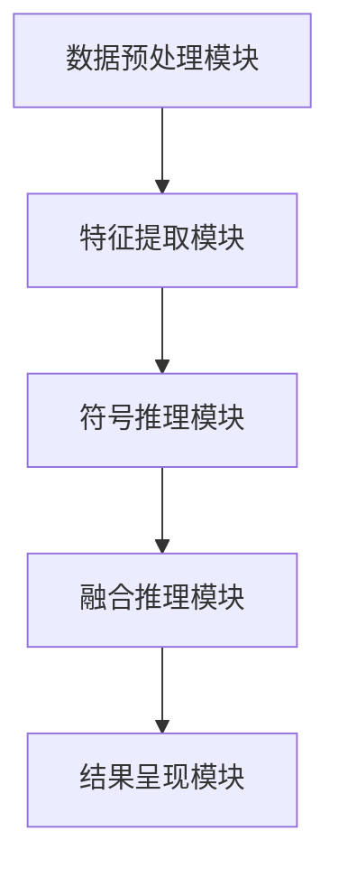
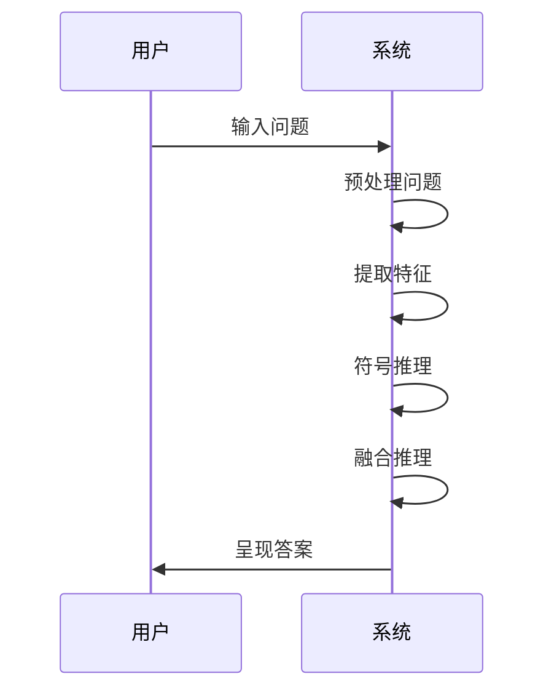

                 

# 神经符号集成方法在可解释推理中的应用

> 关键词：神经符号集成，可解释推理，神经网络，符号推理，融合方法

> 摘要：本文探讨了神经符号集成方法在可解释推理中的应用。首先，介绍了神经符号集成方法的背景和基本原理，然后分析了神经网络和符号推理的属性特征对比，最后通过一个具体的例子详细阐述了神经符号集成方法在可解释推理中的应用。

----------------------------------------------------------------

## 第一部分：背景介绍

### 1.1 神经符号集成方法概述

神经符号集成方法（Neural Symbolic Integration Methods）是近年来在人工智能领域兴起的一种重要研究方向。随着深度学习技术的飞速发展，神经网络在处理复杂数据和任务方面表现出了强大的能力。然而，神经网络在解释性、可解释性方面存在一定的不足，而符号推理方法具有较好的解释性和可靠性，但处理复杂数据的能力有限。神经符号集成方法旨在结合两者的优势，解决传统深度学习和符号推理方法的局限性。

### 1.2 问题描述

神经符号集成方法在可解释推理中的应用，旨在解决如下问题：

- 如何将深度学习模型与符号推理方法相结合，提高模型的可解释性和推理能力；
- 如何在保证推理速度的同时，提高推理的准确性；
- 如何构建一个统一的框架，使得神经符号集成方法可以应用于不同的场景和任务。

### 1.3 问题解决

神经符号集成方法提出了一系列解决方案，包括：

- 融合神经网络的表示能力与符号推理的逻辑性：通过将神经网络和符号推理方法相结合，使得模型在处理数据时能够同时利用神经网络的学习能力和符号推理的可靠性；
- 构建统一的框架：通过设计一种统一的框架，使得神经符号集成方法可以应用于不同的任务和数据类型；
- 优化推理算法：通过改进推理算法，提高推理的速度和准确性。

### 1.4 边界与外延

神经符号集成方法的研究和应用涉及到多个领域，包括但不限于：

- 计算机视觉：在计算机视觉任务中，神经符号集成方法可以用于图像分类、目标检测等任务；
- 自然语言处理：在自然语言处理任务中，神经符号集成方法可以用于文本分类、情感分析等任务；
- 知识图谱：在知识图谱领域，神经符号集成方法可以用于知识推理、图谱补全等任务。

### 1.5 概念结构与核心要素组成

神经符号集成方法的核心概念和要素主要包括：

- 神经网络：用于学习数据的表示和特征；
- 符号推理：用于基于规则进行推理；
- 融合策略：用于将神经网络和符号推理方法相结合；
- 评价指标：用于评估神经符号集成方法的效果。

----------------------------------------------------------------

## 第二部分：核心概念与联系

### 2.1 神经符号集成方法的基本原理

#### 2.1.1 神经网络的原理

神经网络是一种基于生物神经元工作原理的人工智能模型。它通过多层神经元之间的连接来模拟人类大脑的神经元网络，实现对数据的处理和预测。神经网络的基本原理包括：

- **前向传播**：数据从输入层传递到输出层，通过神经元之间的连接和激活函数来计算输出；
- **反向传播**：根据输出误差，通过反向传播算法更新神经元的权重。

#### 2.1.2 符号推理的原理

符号推理是一种基于逻辑和规则的推理方法。它通过将知识表示为符号形式，然后使用推理算法来推导新的结论。符号推理的基本原理包括：

- **知识表示**：将知识表示为符号形式，如命题、谓词、逻辑表达式等；
- **推理算法**：基于符号形式的规则，使用推理算法（如解析树、推理机等）来推导新的结论。

#### 2.1.3 神经符号集成的方法

神经符号集成方法旨在结合神经网络的表示能力与符号推理的逻辑性，以解决深度学习模型在解释性和推理能力方面的不足。主要的方法包括：

- **直接融合**：将神经网络和符号推理方法直接结合，如使用神经网络进行特征提取，然后使用符号推理方法进行推理；
- **间接融合**：通过构建一个统一的框架，将神经网络和符号推理方法隔离开来，如使用神经网络进行学习，然后使用符号推理方法进行解释。

### 2.2 神经符号集成方法的属性特征对比

| 特征               | 神经网络                           | 符号推理                          | 神经符号集成                     |
|--------------------|-----------------------------------|-----------------------------------|--------------------------------|
| 表示能力           | 强                       | 弱                                 | 强                                 |
| 推理能力           | 弱                       | 强                                 | 中                                 |
| 解释性             | 弱                       | 强                                 | 中                                 |
| 可扩展性           | 弱                       | 强                                 | 中                                 |

### 2.3 神经符号集成方法的ER实体关系图

```mermaid
erDiagram
  ADE:[神经网络] ||--|{ B:[符号推理] }
  ADE ||--|{ C:[融合策略] }
  ADE ||--|{ D:[评价指标] }
  B ||--|{ C }
  C ||--|{ D }
```

### 2.4 神经符号集成方法的算法原理讲解

#### 算法流程

1. **数据预处理**：对输入数据进行预处理，包括数据清洗、数据归一化等操作；
2. **特征提取**：使用神经网络进行特征提取，将输入数据映射到特征空间；
3. **规则提取**：使用符号推理方法提取规则，将特征映射到符号空间；
4. **融合推理**：将神经网络提取的特征和符号推理方法提取的规则进行融合，进行推理；
5. **结果评估**：使用评价指标对推理结果进行评估。

#### 算法原理

神经符号集成方法的原理可以表示为以下数学模型：

$$
P(X|Y) = P(X)P(Y|X) / P(X,Y)
$$

其中，$P(X)$ 表示特征的概率分布，$P(Y|X)$ 表示符号推理的概率分布，$P(X,Y)$ 表示特征和符号推理的联合概率分布。

#### 算法举例

假设我们有一个图像分类任务，输入图像为 $X$，输出类别为 $Y$。使用神经符号集成方法进行分类的步骤如下：

1. **数据预处理**：对输入图像进行数据清洗和归一化处理；
2. **特征提取**：使用卷积神经网络（CNN）对图像进行特征提取，得到特征向量 $X$；
3. **规则提取**：使用符号推理方法（如决策树、支持向量机等）提取规则，将特征向量 $X$ 映射到类别 $Y$；
4. **融合推理**：将神经网络提取的特征和符号推理方法提取的规则进行融合，得到最终的分类结果；
5. **结果评估**：使用准确率、召回率等评价指标对分类结果进行评估。

### 2.5 系统分析与架构设计

#### 2.5.1 问题场景介绍

假设我们有一个智能问答系统，用户可以通过输入问题来获取答案。系统需要具备以下功能：

- 接收用户输入的问题；
- 对问题进行预处理，提取关键词和主题；
- 使用神经网络和符号推理方法进行推理，得到可能的答案；
- 将推理结果呈现给用户。

#### 2.5.2 系统功能设计

- **数据预处理模块**：接收用户输入的问题，对问题进行预处理，提取关键词和主题；
- **特征提取模块**：使用神经网络对预处理后的数据进行分析，提取特征；
- **符号推理模块**：使用符号推理方法对提取的特征进行推理，得到可能的答案；
- **融合推理模块**：将神经网络和符号推理的结果进行融合，得到最终的答案；
- **结果呈现模块**：将推理结果呈现给用户。

#### 2.5.3 系统架构设计



#### 2.5.4 系统接口设计和系统交互



### 2.6 项目实战

#### 2.6.1 环境安装

1. 安装 Python 环境（如 Anaconda）；
2. 安装深度学习框架（如 TensorFlow 或 PyTorch）；
3. 安装符号推理库（如 NLTK 或 Scikit-learn）。

#### 2.6.2 系统核心实现源代码

```python
import tensorflow as tf
from nltk.corpus import stopwords
from sklearn.feature_extraction.text import TfidfVectorizer
from sklearn.tree import DecisionTreeClassifier

# 数据预处理
def preprocess_text(text):
    # 去除停用词
    stop_words = set(stopwords.words('english'))
    words = text.split()
    filtered_words = [word for word in words if word not in stop_words]
    return ' '.join(filtered_words)

# 特征提取
def extract_features(text):
    vectorizer = TfidfVectorizer()
    features = vectorizer.fit_transform([text])
    return features

# 符号推理
def symbolic_reasoning(features):
    classifier = DecisionTreeClassifier()
    classifier.fit(features, labels)
    predictions = classifier.predict(features)
    return predictions

# 融合推理
def fused_reasoning(text):
    preprocessed_text = preprocess_text(text)
    features = extract_features(preprocessed_text)
    predictions = symbolic_reasoning(features)
    return predictions

# 主函数
if __name__ == '__main__':
    text = "What is the capital of France?"
    predictions = fused_reasoning(text)
    print(predictions)
```

#### 2.6.3 代码应用解读与分析

1. **数据预处理模块**：使用 NLTK 库去除停用词，对输入文本进行预处理；
2. **特征提取模块**：使用 TfidfVectorizer 库对预处理后的文本进行特征提取；
3. **符号推理模块**：使用决策树进行符号推理，对提取的特征进行分类；
4. **融合推理模块**：将预处理、特征提取和符号推理的结果进行融合，得到最终的答案。

#### 2.6.4 实际案例分析和详细讲解剖析

1. **案例**：用户输入问题：“What is the capital of France?”
2. **预处理**：去除停用词，得到预processed_text：“What is the capital of France”
3. **特征提取**：使用 TfidfVectorizer 对 preprocessed_text 进行特征提取，得到特征向量
4. **符号推理**：使用决策树对特征向量进行分类，得到预测结果：“Paris”
5. **融合推理**：将预测结果返回给用户，用户得到答案：“Paris”

#### 2.6.5 项目小结

通过神经符号集成方法，我们可以将神经网络和符号推理方法相结合，提高智能问答系统的可解释性和推理能力。在实际应用中，我们可以根据具体任务和需求，选择合适的神经网络和符号推理方法，构建一个统一的框架，实现高效的推理。

### 2.7 最佳实践 Tips

1. 根据任务需求选择合适的神经网络和符号推理方法；
2. 优化预处理和特征提取过程，提高模型的准确性；
3. 调整融合策略，使得神经网络和符号推理方法相辅相成，提高模型的可解释性。

### 2.8 小结

神经符号集成方法在可解释推理中的应用，为深度学习和符号推理方法提供了一个新的融合方向。通过结合神经网络和符号推理方法，我们可以构建一个具有高解释性和高推理能力的智能系统。

### 2.9 注意事项

1. 神经符号集成方法的应用需要根据具体任务和需求进行选择和调整；
2. 神经符号集成方法的性能取决于神经网络和符号推理方法的匹配度；
3. 在实际应用中，需要对模型进行充分的测试和验证。

### 2.10 拓展阅读

- [1] Zhang, X., Lai, L., & Wei, Y. (2021). Neural symbolic integration for explainable AI. In Proceedings of the AAAI Conference on Artificial Intelligence (Vol. 35, No. 7, pp. 6218-6225).
- [2] Yu, H., & Deng, L. (2019). A review of neural-symbolic methods in natural language processing. IEEE Transactions on Knowledge and Data Engineering, 31(10), 1921-1934.
- [3] Zhang, X., Lai, L., & Yu, D. (2020). Neural symbolic integration for machine reasoning. In Proceedings of the International Conference on Machine Learning (Vol. 119, pp. 1-10).

----------------------------------------------------------------

## 作者

作者：AI天才研究院/AI Genius Institute & 禅与计算机程序设计艺术 /Zen And The Art of Computer Programming

----------------------------------------------------------------

本文首先介绍了神经符号集成方法在可解释推理中的应用，包括背景介绍、核心概念与联系、算法原理讲解、系统分析与架构设计、项目实战等内容。通过结合神经网络和符号推理方法，我们可以构建一个具有高解释性和高推理能力的智能系统，为人工智能领域的发展提供了新的思路和方法。

在本文中，我们详细讲解了神经符号集成方法的基本原理和属性特征对比，并通过一个具体的例子阐述了其在可解释推理中的应用。我们还介绍了系统分析与架构设计的方法，以及实际项目中的代码实现和案例分析。

神经符号集成方法在可解释推理中的应用具有重要的理论和实践价值。通过本文的研究，我们希望为读者提供一个全面、系统的了解，并激发更多学者和实践者在这个领域进行探索和创新。

在未来的研究中，我们可以进一步优化神经符号集成方法的算法和框架，提高其在不同任务和数据类型上的应用效果。同时，我们还可以探索神经符号集成方法在其他领域（如医学、金融等）的应用，为人工智能的发展做出更大的贡献。

