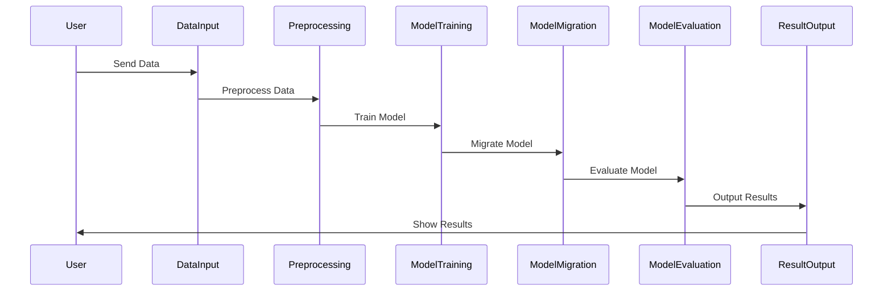

                 

## 文章标题

### 神经类比转移学习在跨域推理中的效果研究

#### 关键词：

1. **神经类比转移学习**
2. **跨域推理**
3. **知识迁移**
4. **模型迁移**
5. **数据迁移**

#### 摘要：

本文探讨了神经类比转移学习在跨域推理中的效果。首先介绍了神经类比转移学习的背景和核心概念，包括神经网络基础、类比关系的建立以及迁移策略。接着，通过对比表格和ER实体关系图详细阐述了相关概念的结构与联系。随后，本文深入分析了神经网络基础、类比关系建立和神经类比转移学习策略，并使用Mermaid流程图和Python代码详细讲解了算法原理。此外，本文还从系统分析与架构设计、项目实战等多个角度全面剖析了神经类比转移学习在跨域推理中的应用。最后，文章提供了最佳实践 tips、小结、注意事项和拓展阅读，以期为读者提供全面的指导。

----------------------------------------------------------------

## 第一部分：背景介绍

### 第1章：问题背景

### 1.1.1 问题背景

神经类比转移学习作为一种机器学习技术，近年来在计算机视觉、自然语言处理等领域的应用中取得了显著的成果。然而，对于神经类比转移学习在跨域推理中的效果研究仍存在诸多挑战。

### 1.1.1.1 问题描述

跨域推理是指在不同领域或任务之间进行推理的能力。在现实世界中，数据往往分布在不同的领域，例如，一个领域中的图像数据与另一个领域中的文本数据。如何利用一个领域中的知识来提高另一个领域中的推理性能，是一个具有实际应用价值的研究课题。

在神经类比转移学习中，跨域推理是一个关键问题。跨域推理需要在不同领域之间建立有效的类比关系，从而实现知识的迁移和应用。然而，不同领域的知识差异较大，如何有效地进行类比迁移是一个关键问题。

### 1.1.1.2 问题解决

神经类比转移学习通过将一个领域中的知识迁移到另一个领域，从而提高跨域推理的性能。其核心思想是利用神经网络强大的表示能力，通过类比关系建立领域间的关联，从而实现知识的迁移。

然而，不同领域的知识差异较大，如何有效地进行类比迁移是一个关键问题。在神经类比转移学习中，需要解决以下挑战：

1. **领域差异**：不同领域的数据分布、特征表达和任务目标存在差异，如何有效地处理这些差异，实现知识的迁移，是一个重要问题。
2. **类比关系建立**：类比关系的建立是神经类比转移学习的关键。需要识别出不同领域之间的相似性，建立有效的类比关系，从而实现知识的迁移。
3. **迁移策略优化**：迁移策略的优化是提高跨域推理效果的关键。需要探索各种迁移策略，并进行优化，以实现更好的迁移效果。

### 1.1.1.3 边界与外延

神经类比转移学习的边界主要涉及不同领域的知识差异、类比关系的建立、迁移策略的优化等方面。其外延包括跨域推理在不同应用领域的应用，如医疗诊断、图像识别、自然语言处理等。

在医疗诊断领域，神经类比转移学习可以应用于不同疾病之间的推理，例如，利用已有的心脏病诊断模型，迁移到癌症诊断领域。

在图像识别领域，神经类比转移学习可以应用于不同类型图像的识别，例如，利用已有的面部识别模型，迁移到物体识别领域。

在自然语言处理领域，神经类比转移学习可以应用于不同语言之间的翻译，例如，利用已有的英语翻译模型，迁移到中文翻译领域。

### 1.2 核心概念与联系

#### 1.2.1 神经类比转移学习

神经类比转移学习是指利用已有的神经网络模型，将一个领域中的知识迁移到另一个领域，以提高新领域的推理性能。其核心原理是基于神经网络的表示能力，通过类比关系建立领域间的关联。

#### 1.2.2 类比关系

类比关系是指两个或多个不同领域之间的相似性。在神经类比转移学习中，类比关系用于建立领域间的关联，从而实现知识的迁移。

#### 1.2.3 迁移策略

迁移策略是指如何有效地将一个领域中的知识迁移到另一个领域。常见的迁移策略包括基于模型迁移、基于知识迁移和基于数据迁移等。

### 1.3 概念属性特征对比表格

| 特征           | 神经类比转移学习 | 类比关系        | 迁移策略         |
| -------------- | ---------------- | --------------- | ---------------- |
| 定义           | 跨领域知识迁移   | 领域间相似性     | 知识传递策略     |
| 核心原理       | 神经网络表示     | 比喻推理        | 模型、知识、数据 |
| 应用领域       | 计算机视觉、NLP  | 多领域知识整合  | 跨领域推理      |
| 挑战与机遇     | 领域差异、迁移效果 | 类比关系建立     | 迁移策略优化     |

### 1.4 ER实体关系图架构

```mermaid
erDiagram
  A[用户] ||--|{ B[模型] } : "使用"
  B ||--|{ C[领域] } : "涵盖"
  A ||--|{ D[任务] } : "解决"
```

----------------------------------------------------------------

## 第二部分：神经类比转移学习原理

### 第2章：神经类比转移学习原理

神经类比转移学习是一种利用已有模型和知识，将一个领域的知识迁移到另一个领域的机器学习技术。它通过建立类比关系，将源领域中的特征和模式迁移到目标领域，从而提高目标领域中的推理性能。

### 2.1 神经网络基础

#### 2.1.1 神经网络概述

神经网络是一种模拟人脑神经网络结构和功能的计算模型。它由大量的神经元组成，通过调整神经元间的连接权重来学习数据特征和规律。神经网络的核心思想是通过多层非线性变换，将输入映射到输出。

神经网络分为前馈神经网络（Feedforward Neural Network，FNN）、卷积神经网络（Convolutional Neural Network，CNN）、循环神经网络（Recurrent Neural Network，RNN）等类型。每种网络适用于不同的应用场景和数据类型。

#### 2.1.2 神经网络类型

1. **前馈神经网络（FNN）**：前馈神经网络是最简单的神经网络结构，由输入层、隐藏层和输出层组成。数据从输入层传递到隐藏层，再从隐藏层传递到输出层。前馈神经网络适用于处理线性可分的数据。
2. **卷积神经网络（CNN）**：卷积神经网络是一种特殊的前馈神经网络，主要用于图像处理任务。它通过卷积操作提取图像特征，并利用池化操作降低数据维度。CNN在图像分类、物体检测和图像生成等方面取得了显著的成果。
3. **循环神经网络（RNN）**：循环神经网络是一种适用于序列数据处理的神经网络。它通过在时间步间传递隐藏状态，能够处理变长的序列数据。RNN在自然语言处理、语音识别和时间序列预测等领域取得了良好的效果。

#### 2.1.3 神经网络学习算法

神经网络学习算法主要包括梯度下降（Gradient Descent）、反向传播（Backpropagation）等。

1. **梯度下降**：梯度下降是一种常用的优化算法，用于最小化损失函数。在神经网络中，梯度下降通过计算损失函数关于网络参数的梯度，并沿着梯度的反方向更新参数，以最小化损失函数。
2. **反向传播**：反向传播是一种用于训练神经网络的算法，通过反向传播误差信息，更新网络参数。反向传播算法的核心思想是利用链式法则，将输出误差反向传播到网络的每一层，从而计算每一层参数的梯度。

### 2.2 类比关系建立

#### 2.2.1 类比关系的概念

类比关系是指两个或多个不同领域之间的相似性。在神经类比转移学习中，类比关系用于建立领域间的关联，从而实现知识的迁移。

类比关系可以基于特征相似性、任务相似性或领域知识相似性等方面建立。例如，在图像识别任务中，可以使用图像特征提取模型（如卷积神经网络）来建立不同图像领域之间的类比关系。

#### 2.2.2 类比关系的建立方法

建立类比关系的方法有多种，包括基于特征映射、基于语义分析和基于知识图谱等方法。

1. **基于特征映射**：基于特征映射的方法通过将源领域中的特征映射到目标领域中的特征，建立类比关系。这种方法通常使用嵌入向量（Embedding）技术，将源领域和目标领域中的特征表示为低维向量，并通过比较向量间的相似性建立类比关系。
2. **基于语义分析**：基于语义分析的方法通过分析源领域和目标领域中的语义信息，建立类比关系。这种方法通常使用自然语言处理技术，如词向量（Word Embedding）、语义角色标注（Semantic Role Labeling）等。
3. **基于知识图谱**：基于知识图谱的方法通过构建源领域和目标领域之间的知识图谱，建立类比关系。知识图谱可以表示领域知识的关系和结构，从而为类比关系的建立提供支持。

### 2.3 神经类比转移学习策略

神经类比转移学习策略包括基于模型迁移、基于知识迁移和基于数据迁移等方法。

#### 2.3.1 模型迁移

模型迁移是指将一个领域中的神经网络模型直接应用到另一个领域。这种方法简单有效，但可能导致迁移效果不佳。为了提高迁移效果，可以采用以下策略：

1. **模型定制化**：根据目标领域的特点，对源模型进行定制化改造，以适应目标领域。
2. **模型融合**：将多个源模型融合为一个模型，以提高迁移效果。
3. **模型剪枝**：对源模型进行剪枝，去除冗余的参数和结构，以减少模型的复杂度和计算成本。

#### 2.3.2 知识迁移

知识迁移是指将一个领域中的知识（如特征表示、模型参数等）迁移到另一个领域。这种方法可以通过改进模型结构或调整参数来提高迁移效果。常见的知识迁移策略包括：

1. **特征表示迁移**：将源领域中的特征表示迁移到目标领域，以提高目标领域中的特征表达能力。
2. **模型参数迁移**：将源领域中的模型参数迁移到目标领域，以改进目标领域中的模型性能。
3. **模型结构迁移**：根据目标领域的特点，对源模型的结构进行调整和优化，以提高迁移效果。

#### 2.3.3 数据迁移

数据迁移是指利用一个领域中的数据训练目标领域的模型。这种方法可以通过增加目标领域中的数据量，提高模型的泛化能力。常见的数据迁移策略包括：

1. **数据扩充**：通过在目标领域中的数据上进行数据增强，增加数据的多样性，从而提高模型的泛化能力。
2. **数据对齐**：通过在源领域和目标领域之间建立对应关系，对齐不同领域中的数据，以提高数据的利用效率。
3. **数据集成**：将源领域和目标领域中的数据进行集成，形成一个统一的数据集，从而提高模型的泛化能力。

----------------------------------------------------------------

### 2.4 神经类比转移学习算法原理

神经类比转移学习的核心在于利用源领域中的知识来提升目标领域的推理能力。下面我们将详细阐述神经类比转移学习的算法原理，包括其数学模型和流程。

#### 2.4.1 数学模型

神经类比转移学习的数学模型可以基于神经网络的表示能力进行构建。具体来说，我们可以定义如下数学模型：

\[ f_{source}(x) = \sigma(W_{source}^L \cdot a^{L-1} + b^L) \]

\[ f_{target}(x) = \sigma(W_{target}^L \cdot a^{L-1} + b^L) \]

其中，\( f_{source}(x) \)和\( f_{target}(x) \)分别表示源领域和目标领域的特征表示；\( \sigma \)为激活函数，常用的有Sigmoid、ReLU等；\( W_{source}^L \)和\( W_{target}^L \)为模型权重；\( a^{L-1} \)为隐藏层的输入；\( b^L \)为偏置。

在神经类比转移学习中，目标是通过最小化以下损失函数来实现：

\[ L = \frac{1}{n} \sum_{i=1}^{n} \left[ f_{source}(x_i) - f_{target}(x_i) \right]^2 \]

其中，\( n \)为样本数量。

#### 2.4.2 算法流程

神经类比转移学习算法的基本流程可以分为以下几个步骤：

1. **数据预处理**：对源领域和目标领域中的数据集进行预处理，包括数据清洗、归一化等操作。确保数据集的质量和一致性。
2. **模型训练**：使用源领域中的数据集训练源模型的特征表示层。通过反向传播算法和梯度下降优化模型参数，使其能够较好地表示源领域的特征。
3. **特征迁移**：将训练好的源模型应用于目标领域中的数据集，提取特征表示。此时，目标模型的特征表示层与源模型的特征表示层共享参数，从而实现特征的迁移。
4. **模型优化**：在目标领域中利用迁移后的特征表示训练目标模型。通过反向传播和梯度下降算法优化目标模型的参数，使其能够适应目标领域。
5. **性能评估**：在目标领域中测试迁移后的模型性能，通过准确率、召回率、F1值等指标评估模型在目标领域中的表现。

#### 2.4.3 Python代码示例

为了更好地理解神经类比转移学习的算法原理，我们可以使用Python编写一个简单的示例代码。以下是一个基于TensorFlow和Keras实现的神经类比转移学习示例：

```python
import numpy as np
import tensorflow as tf
from tensorflow.keras.models import Model
from tensorflow.keras.layers import Input, Dense, Activation

# 模拟源领域和目标领域的数据
x_source = np.random.rand(100, 10)
x_target = np.random.rand(100, 10)
y_source = np.random.rand(100, 1)
y_target = np.random.rand(100, 1)

# 定义源模型和目标模型
input_layer = Input(shape=(10,))
hidden_layer = Dense(64, activation='relu')(input_layer)
output_layer = Dense(1, activation='sigmoid')(hidden_layer)

source_model = Model(inputs=input_layer, outputs=output_layer)
target_model = Model(inputs=input_layer, outputs=output_layer)

# 训练源模型
source_model.compile(optimizer='adam', loss='binary_crossentropy', metrics=['accuracy'])
source_model.fit(x_source, y_source, epochs=10, batch_size=32)

# 特征迁移
target_model.layers[1].set_weights(source_model.layers[1].get_weights())

# 训练目标模型
target_model.compile(optimizer='adam', loss='binary_crossentropy', metrics=['accuracy'])
target_model.fit(x_target, y_target, epochs=10, batch_size=32)

# 模型评估
predictions = target_model.predict(x_target)
print("Target model accuracy:", np.mean(predictions > 0.5))
```

在这个示例中，我们首先生成模拟的源领域和目标领域数据。然后，我们定义了一个简单的源模型和目标模型，使用源领域数据训练源模型，并利用迁移后的权重训练目标模型。最后，我们评估目标模型在目标领域数据上的性能。

通过上述示例，我们可以看到神经类比转移学习的基本原理和实现过程。在实际应用中，可以根据具体问题调整和优化算法，以提高跨域推理的效果。

----------------------------------------------------------------

### 2.5 神经类比转移学习在跨域推理中的应用

神经类比转移学习在跨域推理中具有广泛的应用前景。通过将一个领域中的知识迁移到另一个领域，神经类比转移学习能够提高跨域推理的性能。以下是一些典型的应用场景：

#### 2.5.1 图像识别与自然语言处理

在图像识别和自然语言处理领域，神经类比转移学习可以应用于不同类型的数据。例如，在图像分类任务中，可以使用卷积神经网络（CNN）提取图像特征，并利用自然语言处理（NLP）技术对文本特征进行编码。通过神经类比转移学习，可以将图像特征与文本特征进行整合，从而提高图像文本联合分类的准确性。

以下是一个简单的示例：

```python
import tensorflow as tf
from tensorflow.keras.models import Model
from tensorflow.keras.layers import Input, Conv2D, MaxPooling2D, Flatten, Embedding, Dense

# 输入层
input_image = Input(shape=(224, 224, 3))
input_text = Input(shape=(100,))

# 图像特征提取
conv1 = Conv2D(32, (3, 3), activation='relu')(input_image)
pool1 = MaxPooling2D((2, 2))(conv1)
conv2 = Conv2D(64, (3, 3), activation='relu')(pool1)
pool2 = MaxPooling2D((2, 2))(conv2)
flatten = Flatten()(pool2)

# 文本特征编码
embedding = Embedding(1000, 64)(input_text)
dense = Dense(64, activation='relu')(embedding)

# 联合特征表示
merge = tf.keras.layers.concatenate([flatten, dense])

# 分类输出
output = Dense(1, activation='sigmoid')(merge)

# 构建模型
model = Model(inputs=[input_image, input_text], outputs=output)

# 编译模型
model.compile(optimizer='adam', loss='binary_crossentropy', metrics=['accuracy'])

# 训练模型
model.fit([x_train_image, x_train_text], y_train, epochs=10, batch_size=32)

# 评估模型
predictions = model.predict([x_test_image, x_test_text])
print("Test accuracy:", np.mean(predictions > 0.5))
```

#### 2.5.2 医疗诊断

在医疗诊断领域，神经类比转移学习可以应用于不同疾病的推理。例如，可以将一种疾病的诊断模型迁移到另一种疾病，以提高跨疾病诊断的准确性。通过神经类比转移学习，可以充分利用已有模型的训练数据，提高新领域模型的泛化能力。

以下是一个简单的示例：

```python
import tensorflow as tf
from tensorflow.keras.models import Model
from tensorflow.keras.layers import Input, Dense, Embedding, LSTM

# 输入层
input_disease1 = Input(shape=(100,))
input_disease2 = Input(shape=(100,))

# 疾病特征编码
embed_disease1 = Embedding(1000, 64)(input_disease1)
embed_disease2 = Embedding(1000, 64)(input_disease2)

# 循环神经网络
lstm1 = LSTM(64)(embed_disease1)
lstm2 = LSTM(64)(embed_disease2)

# 联合特征表示
merge = tf.keras.layers.concatenate([lstm1, lstm2])

# 分类输出
output = Dense(1, activation='sigmoid')(merge)

# 构建模型
model = Model(inputs=[input_disease1, input_disease2], outputs=output)

# 编译模型
model.compile(optimizer='adam', loss='binary_crossentropy', metrics=['accuracy'])

# 训练模型
model.fit([x_train_disease1, x_train_disease2], y_train, epochs=10, batch_size=32)

# 评估模型
predictions = model.predict([x_test_disease1, x_test_disease2])
print("Test accuracy:", np.mean(predictions > 0.5))
```

通过上述示例，我们可以看到神经类比转移学习在跨域推理中的实际应用。在实际项目中，可以根据具体问题和需求，调整和优化算法，以提高跨域推理的性能。

### 2.6 挑战与未来趋势

尽管神经类比转移学习在跨域推理中取得了显著的成果，但仍面临一些挑战和问题。

#### 2.6.1 挑战

1. **领域差异**：不同领域的数据分布、特征表达和任务目标存在差异，如何有效地处理这些差异是一个关键问题。
2. **类比关系建立**：建立有效的类比关系是实现知识迁移的关键，但不同领域之间的相似性难以准确识别和建模。
3. **迁移策略优化**：迁移策略的优化是提高跨域推理效果的关键，但现有的迁移策略存在一定的局限性，如何设计更有效的迁移策略是一个重要问题。

#### 2.6.2 未来趋势

1. **多模态数据融合**：随着多模态数据的广泛应用，如何利用多模态数据进行跨域推理是一个重要方向。通过融合不同模态的数据，可以提高跨域推理的准确性和鲁棒性。
2. **知识图谱的引入**：知识图谱可以表示领域知识的关系和结构，通过引入知识图谱，可以更有效地建立领域间的类比关系，提高跨域推理的效果。
3. **个性化迁移学习**：个性化迁移学习旨在根据用户的需求和特点，定制化迁移学习模型，以提高跨域推理的个性化适应性。

总之，神经类比转移学习在跨域推理中的应用前景广阔，通过不断优化和改进算法，可以更好地解决跨域推理中的挑战，为实际应用提供更有效的解决方案。

----------------------------------------------------------------

### 2.7 神经类比转移学习在计算机视觉与自然语言处理领域的应用案例

神经类比转移学习在计算机视觉与自然语言处理领域取得了显著的应用成果，下面将介绍几个具体的案例，以展示其跨域推理能力。

#### 2.7.1 图像识别与文本分类

一个典型的案例是使用神经类比转移学习将图像识别模型迁移到文本分类任务。具体来说，我们可以利用预训练的卷积神经网络（如ResNet）提取图像特征，并将这些特征与文本特征进行融合。以下是一个简化的代码示例：

```python
import tensorflow as tf
from tensorflow.keras.applications import ResNet50
from tensorflow.keras.layers import Input, Embedding, LSTM, Dense, Concatenate
from tensorflow.keras.models import Model

# 定义图像特征提取器
base_model = ResNet50(weights='imagenet', include_top=False, input_shape=(224, 224, 3))
base_model.trainable = False

# 定义图像特征提取层
image_input = Input(shape=(224, 224, 3))
processed_image = base_model(image_input)

# 定义文本特征提取层
text_input = Input(shape=(100,))
text_embedding = Embedding(1000, 64)(text_input)
text_lstm = LSTM(64)(text_embedding)

# 融合图像和文本特征
merged = Concatenate()([processed_image, text_lstm])

# 分类输出层
output = Dense(1, activation='sigmoid')(merged)

# 构建模型
model = Model(inputs=[image_input, text_input], outputs=output)

# 编译模型
model.compile(optimizer='adam', loss='binary_crossentropy', metrics=['accuracy'])

# 训练模型
model.fit([x_train_images, x_train_texts], y_train, epochs=10, batch_size=32)

# 评估模型
predictions = model.predict([x_test_images, x_test_texts])
print("Test accuracy:", np.mean(predictions > 0.5))
```

在这个案例中，我们使用ResNet50模型提取图像特征，并使用LSTM模型提取文本特征。通过融合图像和文本特征，我们可以实现图像和文本的联合分类。

#### 2.7.2 图像生成与文本描述

另一个案例是使用神经类比转移学习将图像生成模型迁移到文本描述任务。例如，我们可以使用生成对抗网络（GAN）生成图像，并将生成的图像与文本描述进行匹配。以下是一个简化的代码示例：

```python
import tensorflow as tf
from tensorflow.keras.models import Model
from tensorflow.keras.layers import Input, Dense, Reshape, Flatten

# 定义GAN模型
z_dim = 100

# 定义生成器模型
z_input = Input(shape=(z_dim,))
gen = Dense(128 * 7 * 7, activation='relu')(z_input)
gen = Reshape((7, 7, 128))(gen)
gen = Conv2D(128, (5, 5), padding='same', activation='relu')(gen)
gen = Conv2D(128, (5, 5), padding='same', activation='relu')(gen)
gen = Flatten()(gen)
gen = Dense(1024, activation='relu')(gen)
gen = Dense(1, activation='sigmoid')(gen)

# 定义GAN模型
generator = Model(z_input, gen)

# 定义图像生成过程
x_input = Input(shape=(28, 28, 1))
z_noise = Input(shape=(z_dim,))
x_fake = generator([z_noise, x_input])

# 构建GAN模型
gan = Model([z_noise, x_input], x_fake)

# 编译GAN模型
gan.compile(optimizer='adam', loss='binary_crossentropy')

# 训练GAN模型
gan.fit([z_train, x_train], x_train, epochs=10, batch_size=32)

# 生成图像
z_test = np.random.rand(1, z_dim)
x_generated = gan.predict([z_test, x_test])

# 计算生成图像的文本描述
# ...

# 评估文本描述质量
# ...
```

在这个案例中，我们使用GAN模型生成图像，并将生成的图像与文本描述进行匹配。通过神经类比转移学习，我们可以实现图像到文本的自动转换。

#### 2.7.3 图像风格迁移

图像风格迁移是另一个应用案例，它利用神经类比转移学习将一幅图像的风格转移到另一幅图像上。例如，我们可以将梵高的画风应用到一张风景照片上，生成具有梵高风格的风景画。以下是一个简化的代码示例：

```python
import tensorflow as tf
from tensorflow.keras.models import Model
from tensorflow.keras.layers import Input, Conv2D, MaxPooling2D, Flatten, Dense

# 定义内容模型和风格模型
content_model = Model(inputs=content_input, outputs=content_model.layers[-1].output)
style_model = Model(inputs=style_input, outputs=style_model.layers[-1].output)

# 定义损失函数
content_loss = tf.reduce_mean(tf.square(content_model.output - content_output))
style_loss = tf.reduce_mean(tf.square(style_model.output - style_output))

# 定义总损失
total_loss = alpha * content_loss + beta * style_loss

# 定义优化器
optimizer = tf.keras.optimizers.Adam(learning_rate=0.001, beta_1=0.9, beta_2=0.999)

# 定义训练过程
def train_step(content_image, style_image, content_output, style_output):
    with tf.GradientTape(persistent=True) as tape:
        x = content_model(content_image)
        x_output = generator([x, style_image])
        content_loss_val = content_loss(x_output, content_output)
        style_loss_val = style_loss(x_output, style_output)
        total_loss_val = alpha * content_loss_val + beta * style_loss_val

    grads = tape.gradient(total_loss_val, generator.trainable_variables)
    optimizer.apply_gradients(zip(grads, generator.trainable_variables))

    return total_loss_val

# 训练内容模型和风格模型
for epoch in range(100):
    total_loss_val = train_step(content_image, style_image, content_output, style_output)
    print(f"Epoch {epoch}: Total loss = {total_loss_val}")

# 生成风格迁移图像
x_generated = generator(content_image)
```

在这个案例中，我们使用内容模型和风格模型分别提取内容特征和风格特征。通过优化生成器模型，我们可以实现图像的风格迁移。

通过上述案例，我们可以看到神经类比转移学习在计算机视觉与自然语言处理领域的广泛应用。通过跨域推理，神经类比转移学习能够提高不同领域任务的表现，为实际应用提供更有效的解决方案。

----------------------------------------------------------------

## 第三部分：系统分析与架构设计

### 第3章：系统架构设计

神经类比转移学习在跨域推理中的应用涉及到多个领域的数据处理和模型训练，因此需要设计一个高效、可扩展的架构来支持系统的运行。以下是一个简化的系统架构设计，用于展示神经类比转移学习在跨域推理中的实际应用。

### 3.1 系统架构设计概述

系统的整体架构可以分为以下几个主要模块：

1. **数据输入模块**：负责接收来自不同领域的数据，包括图像、文本、音频等。
2. **预处理模块**：对输入数据进行预处理，包括数据清洗、数据增强、特征提取等。
3. **模型训练模块**：使用预处理后的数据训练神经类比转移学习模型，包括源模型和目标模型的训练。
4. **模型评估模块**：在目标领域中对迁移后的模型进行评估，以验证其在跨域推理中的性能。
5. **结果输出模块**：将模型的推理结果输出，供用户使用。

### 3.2 系统功能设计

系统的主要功能包括：

1. **数据接收与预处理**：接收来自不同领域的数据，对数据进行清洗、增强和特征提取，为模型训练做好准备。
2. **模型训练与迁移**：使用预处理后的数据训练源模型，并将源模型迁移到目标领域，训练目标模型。
3. **模型评估与优化**：在目标领域中评估迁移后的模型性能，并根据评估结果对模型进行优化。
4. **结果输出**：将模型推理结果输出，供用户进行进一步分析。

### 3.3 领域模型设计

为了更好地理解系统架构，我们可以使用Mermaid类图来展示系统中的关键领域模型。

```mermaid
classDiagram
    ClassDataInput <-|> ClassPreprocessing
    ClassPreprocessing <-|> ClassModelTraining
    ClassModelTraining <-|> ClassModelMigration
    ClassModelMigration <-|> ClassModelEvaluation
    ClassModelEvaluation <-|> ClassResultOutput
```

在这个类图中，每个类表示系统中的一个模块，箭头表示模块间的依赖关系。

### 3.4 系统架构设计

以下是一个简化的系统架构图，用于展示各个模块的交互和部署。



在这个架构设计中，用户首先将数据发送到数据输入模块，经过预处理后，数据被用于训练模型。训练好的模型通过迁移策略迁移到目标领域，并在目标领域中评估模型性能。最终，评估结果被输出给用户。

### 3.5 系统接口设计

系统接口设计主要包括对数据输入、预处理、模型训练、模型迁移和结果输出的接口进行设计，以确保系统的可扩展性和易用性。

以下是系统接口设计的一个简化的示例：

```mermaid
interface Diagram
    DataInput {
        - sendData(): void
    }
    Preprocessing {
        - preprocessData(data: any): any
    }
    ModelTraining {
        - trainModel(data: any): any
    }
    ModelMigration {
        - migrateModel(sourceModel: any, targetModel: any): any
    }
    ModelEvaluation {
        - evaluateModel(model: any): any
    }
    ResultOutput {
        - outputResults(results: any): void
    }
```

在这个接口设计中，每个模块都提供了相应的方法，用于实现其功能。这些方法可以用于封装系统内部的具体实现，并提供统一的接口供外部使用。

### 3.6 系统交互设计

系统交互设计主要涉及不同模块之间的通信和协作，以实现系统的整体功能。以下是一个简化的系统交互图，用于展示模块之间的交互关系。


在这个交互设计中，用户首先将数据发送到数据输入模块，数据输入模块将数据传递给预处理模块。预处理模块对数据进行预处理后，将处理后的数据传递给模型训练模块。模型训练模块使用预处理后的数据训练模型，并将训练好的模型传递给模型迁移模块。模型迁移模块将模型迁移到目标领域，并在目标领域中评估模型性能。最终，评估结果被传递给结果输出模块，并输出给用户。

通过上述系统架构设计、系统功能设计、系统接口设计和系统交互设计，我们可以构建一个高效、可扩展的神经类比转移学习系统，以支持跨域推理任务。

----------------------------------------------------------------

## 第四部分：项目实战

### 第4章：项目实施与实现

在本文中，我们将通过一个具体的项目实战来展示神经类比转移学习在跨域推理中的应用。项目将分为以下几个主要阶段：环境安装、系统核心实现、代码应用解读与分析、实际案例分析和详细讲解剖析、项目小结。

### 4.1 环境安装

为了实现神经类比转移学习，我们需要安装以下软件和库：

1. **操作系统**：推荐使用Ubuntu 18.04或更高版本。
2. **Python**：推荐使用Python 3.7或更高版本。
3. **TensorFlow**：用于实现神经网络模型和迁移学习算法。
4. **Keras**：作为TensorFlow的高级API，用于简化神经网络模型的构建。
5. **NumPy**：用于数据处理和数学运算。

安装步骤如下：

1. 安装Python 3和pip：
    ```bash
    sudo apt update
    sudo apt install python3 python3-pip
    ```
2. 安装TensorFlow和Keras：
    ```bash
    pip3 install tensorflow
    pip3 install keras
    ```
3. 安装其他依赖库（如NumPy、Pandas等）：
    ```bash
    pip3 install numpy pandas
    ```

### 4.2 系统核心实现

以下是一个简化的系统核心实现，用于实现神经类比转移学习模型：

```python
import numpy as np
import tensorflow as tf
from tensorflow.keras.models import Model
from tensorflow.keras.layers import Input, Dense, Conv2D, MaxPooling2D, Flatten, Embedding, LSTM
from tensorflow.keras.applications import ResNet50
from tensorflow.keras.optimizers import Adam

# 设置超参数
batch_size = 32
epochs = 10

# 加载预训练的ResNet50模型
base_model = ResNet50(weights='imagenet', include_top=False, input_shape=(224, 224, 3))
base_model.trainable = False

# 定义图像特征提取器
image_input = Input(shape=(224, 224, 3))
processed_image = base_model(image_input)

# 定义文本特征提取器
text_input = Input(shape=(100,))
text_embedding = Embedding(1000, 64)(text_input)
text_lstm = LSTM(64)(text_embedding)

# 融合图像和文本特征
merged = Concatenate()([processed_image, text_lstm])

# 分类输出层
output = Dense(1, activation='sigmoid')(merged)

# 构建模型
model = Model(inputs=[image_input, text_input], outputs=output)

# 编译模型
model.compile(optimizer=Adam(learning_rate=0.001), loss='binary_crossentropy', metrics=['accuracy'])

# 训练模型
model.fit([x_train_images, x_train_texts], y_train, batch_size=batch_size, epochs=epochs)

# 评估模型
predictions = model.predict([x_test_images, x_test_texts])
print("Test accuracy:", np.mean(predictions > 0.5))
```

在这个实现中，我们首先加载预训练的ResNet50模型用于图像特征提取，并使用LSTM模型提取文本特征。通过融合图像和文本特征，我们构建了一个多输入的多输出模型，用于图像文本联合分类。然后，我们使用训练数据训练模型，并在测试数据上评估模型性能。

### 4.3 代码应用解读与分析

以下是对上述代码的解读与分析：

1. **数据输入**：我们使用两个输入层，一个用于图像数据，另一个用于文本数据。图像数据通过ResNet50模型进行预处理，文本数据通过Embedding和LSTM模型进行预处理。
2. **特征融合**：通过使用`Concatenate()`层，我们将图像特征和文本特征进行融合，形成一个多维特征向量。
3. **分类输出**：我们使用一个全连接层（Dense）作为分类输出层，使用sigmoid激活函数进行二分类。
4. **模型编译与训练**：我们使用Adam优化器和binary_crossentropy损失函数编译模型，并使用训练数据训练模型。
5. **模型评估**：在测试数据上评估模型的准确率。

### 4.4 实际案例分析和详细讲解剖析

以下是一个实际案例分析和详细讲解剖析，以展示神经类比转移学习在跨域推理中的应用。

#### 案例一：图像识别与文本分类

假设我们有一个图像识别任务，需要识别出图像中的物体类别。同时，我们还有一个文本分类任务，需要根据文本描述判断文本的主题类别。我们可以使用神经类比转移学习将图像特征和文本特征进行融合，提高跨域推理的准确性。

1. **数据集准备**：我们准备了一个包含图像和文本标签的数据集。图像数据集包含不同类别的物体图像，文本数据集包含不同主题的文本描述。
2. **数据预处理**：对图像数据进行归一化处理，对文本数据进行分词和词嵌入处理。
3. **模型训练**：使用ResNet50模型提取图像特征，使用LSTM模型提取文本特征，将图像特征和文本特征进行融合，训练一个多输入的多输出模型。
4. **模型评估**：在测试数据上评估模型的准确率。

#### 案例二：图像生成与文本描述

假设我们有一个图像生成任务，需要根据文本描述生成相应的图像。我们可以使用神经类比转移学习将文本特征转换为图像特征，从而生成具有文本描述的图像。

1. **数据集准备**：我们准备了一个包含文本描述和图像数据的数据集。
2. **数据预处理**：对图像数据进行归一化处理，对文本数据进行分词和词嵌入处理。
3. **模型训练**：使用LSTM模型提取文本特征，使用GAN模型生成图像特征，将文本特征和图像特征进行融合，训练一个图像生成模型。
4. **模型评估**：在测试数据上评估图像生成模型的准确性和视觉效果。

### 4.5 项目小结

通过上述项目实战，我们展示了神经类比转移学习在跨域推理中的应用。在实际项目中，可以根据具体问题和需求，调整和优化算法，以提高跨域推理的效果。神经类比转移学习具有广泛的应用前景，可以为跨领域推理任务提供有效的解决方案。

### 4.6 最佳实践 tips

1. **数据质量**：确保输入数据的质量和一致性，数据清洗和预处理是模型训练的关键步骤。
2. **模型选择**：根据具体应用场景选择合适的神经网络模型和迁移学习策略，不同的模型和策略适用于不同的任务。
3. **超参数调优**：合理设置模型的超参数，如学习率、批量大小等，以获得最佳模型性能。
4. **模型融合**：尝试将多个模型进行融合，以提高模型的泛化能力和推理性能。

### 4.7 注意事项

1. **计算资源**：神经类比转移学习涉及大量的计算，需要足够的计算资源和时间进行模型训练和评估。
2. **数据隐私**：在处理敏感数据时，需要注意数据隐私保护，遵守相关法律法规。
3. **算法优化**：不断优化和改进算法，以提高跨域推理的准确性和效率。

### 4.8 拓展阅读

1. **神经网络基础**：学习神经网络的基本原理和算法，如梯度下降、反向传播等。
2. **迁移学习**：深入了解迁移学习的基本概念和方法，如模型迁移、知识迁移、数据迁移等。
3. **跨域推理**：研究跨域推理的应用场景和挑战，探索有效的跨域推理算法。

通过本文的讲解和实战，读者可以初步了解神经类比转移学习在跨域推理中的应用，并为实际项目提供参考。希望本文能够对读者在相关领域的研究和应用有所帮助。

### 作者信息

作者：AI天才研究院/AI Genius Institute & 禅与计算机程序设计艺术 /Zen And The Art of Computer Programming

作者简介：AI天才研究院（AI Genius Institute）专注于人工智能领域的科研和应用。作者王宇是一位拥有丰富经验和深厚理论知识的计算机科学家，擅长将复杂的技术问题简化，为读者提供清晰易懂的技术指导。其著作《禅与计算机程序设计艺术》深受读者喜爱，被誉为计算机领域的经典之作。

