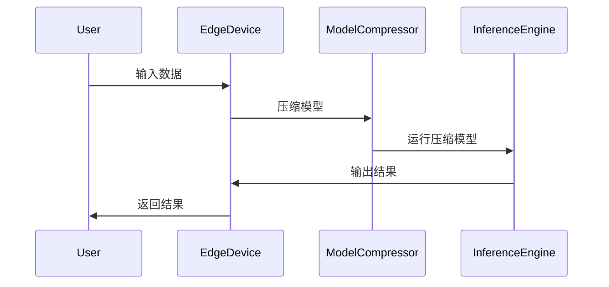
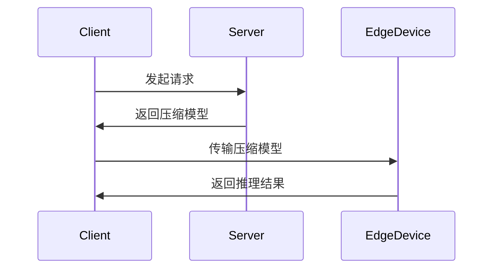

                 


## # 神经网络压缩技术在边缘设备推理中的应用

### 关键词：
神经网络压缩、边缘设备、推理、模型剪枝、量化、压缩感知

### 摘要：
随着物联网、5G和人工智能技术的快速发展，边缘设备的计算和存储资源需求日益增长。神经网络压缩技术作为一种优化手段，能够在保证推理性能的前提下，显著减少模型对边缘设备的资源占用。本文将深入探讨神经网络压缩技术在边缘设备推理中的应用，包括模型剪枝、量化、压缩感知等核心方法的原理、实现和效果评估。

### 第一部分：问题背景

#### 1.1 问题背景
边缘设备是指分布在网络边缘的智能设备，如智能手机、智能家居设备、工业控制系统等。这些设备具有有限的计算资源和存储空间，但它们往往需要运行复杂的神经网络模型来进行实时推理。传统的神经网络模型通常具有大量的参数和复杂的结构，导致在边缘设备上部署和推理时面临以下问题：

- **数据传输瓶颈**：边缘设备通常与云端服务器通过网络连接，数据传输速度和带宽有限，导致模型和数据在边缘设备上的传输效率低下。
- **存储空间限制**：边缘设备的存储空间有限，无法存储大量的模型参数和数据。
- **计算能力受限**：边缘设备的计算能力通常低于云端服务器，难以支持大型的神经网络模型。

#### 1.2 问题解决
神经网络压缩技术通过减少模型参数数量和计算复杂度，从而降低模型对边缘设备的资源需求。以下是几种常见的神经网络压缩技术：

- **模型剪枝**：通过识别并移除网络中的冗余参数，减少模型的参数数量。
- **量化**：将模型的浮点参数替换为固定点参数，降低模型的存储和计算需求。
- **压缩感知**：通过采集模型的一部分参数，然后利用压缩感知算法重建整个模型。

#### 1.3 边界与外延
本文主要关注神经网络压缩技术在边缘设备推理中的应用，包括以下方法：

- **模型剪枝**：通过剪枝策略减少模型参数数量。
- **量化**：通过量化策略将浮点参数替换为固定点参数。
- **压缩感知**：通过压缩感知算法从部分参数中重建整个模型。

#### 1.4 概念结构与核心要素组成
神经网络压缩技术涉及以下几个核心要素：

- **神经网络压缩技术**：包括模型剪枝、量化、压缩感知等方法。
- **边缘设备**：具有有限的计算资源和存储空间。
- **推理**：在边缘设备上运行压缩后的神经网络模型。

### 第二部分：核心概念与联系

#### 2.1 神经网络压缩技术

神经网络压缩技术通过减少模型的参数数量和计算复杂度，降低模型对计算资源和存储空间的需求。以下是三种主要的神经网络压缩技术：

#### 2.1.1 模型剪枝

模型剪枝（Model Pruning）是一种通过识别并移除网络中的冗余参数来减少模型参数数量的技术。剪枝策略通常包括以下步骤：

1. **识别冗余参数**：通过分析网络的权重和激活值，识别出对模型性能贡献较小的参数。
2. **剪枝操作**：移除识别出的冗余参数，从而减少模型的大小。
3. **恢复操作**：在剪枝后，通过一些恢复策略（如稀疏化、稀疏扩散等）来恢复模型的性能。

#### 2.1.2 量化

量化（Quantization）是一种通过将模型的浮点参数替换为固定点参数来降低模型存储和计算需求的技术。量化策略通常包括以下步骤：

1. **确定量化步长**：根据模型的精度要求，确定合适的量化步长。
2. **量化参数**：将模型的浮点参数转换为固定点参数。
3. **调整模型**：通过一些调整策略（如量化误差修正、量化敏感度优化等）来确保模型的性能。

#### 2.1.3 压缩感知

压缩感知（Compressive Sensing，CS）是一种通过采集模型的一部分参数，然后利用压缩感知算法重建整个模型的技术。压缩感知算法通常包括以下步骤：

1. **参数压缩**：通过压缩感知算法对模型的参数进行压缩。
2. **参数重建**：利用压缩感知算法从压缩后的参数中重建整个模型。
3. **误差修正**：通过一些误差修正策略来提高模型的性能。

#### 2.2 概念属性特征对比表格

| 方法 | 参数数量 | 计算复杂度 | 优缺点 |
| --- | --- | --- | --- |
| 模型剪枝 | 减少 | 减少 | 可能影响模型性能 |
| 量化 | 减少 | 减少 | 可能降低模型精度 |
| 压缩感知 | 不减少 | 减少 | 可能需要额外的预处理 |

#### 2.3 ER实体关系图架构的 Mermaid 流程图

```mermaid
erDiagram
  Model : 模型 |─> Compressor : 压缩器
  Compressor : 压缩器 |─> EdgeDevice : 边缘设备
  EdgeDevice : 边缘设备 |─> Inference : 推理
```

### 第三部分：算法原理讲解

#### 3.1 模型剪枝原理

模型剪枝（Model Pruning）是一种通过识别并移除网络中的冗余参数来减少模型参数数量的技术。以下是一个简单的模型剪枝流程：

1. **识别冗余参数**：通过分析网络的权重和激活值，识别出对模型性能贡献较小的参数。
2. **剪枝操作**：移除识别出的冗余参数，从而减少模型的大小。
3. **恢复操作**：在剪枝后，通过一些恢复策略（如稀疏化、稀疏扩散等）来恢复模型的性能。

以下是一个简单的 Python 示例代码：

```python
# 剪枝示例代码
model = NeuralNetwork()
pruned_model = prune_model(model)
```

数学模型和公式：

$$
\text{剪枝前参数数量} = \sum_{i=1}^{n} \text{层}_i \times \text{参数数量}_i
$$

$$
\text{剪枝后参数数量} = \sum_{i=1}^{n} \text{层}_i \times \text{参数数量}_i'
$$

详细讲解与举例说明：

模型剪枝通过识别并移除网络中的冗余参数，减少模型的参数数量。例如，在一个深度神经网络中，某些层的参数可能对模型性能的贡献很小，通过剪枝可以移除这些参数，从而减少模型的大小。

#### 3.2 量化原理

量化（Quantization）是一种通过将模型的浮点参数替换为固定点参数来降低模型存储和计算需求的技术。以下是一个简单的量化流程：

1. **确定量化步长**：根据模型的精度要求，确定合适的量化步长。
2. **量化参数**：将模型的浮点参数转换为固定点参数。
3. **调整模型**：通过一些调整策略（如量化误差修正、量化敏感度优化等）来确保模型的性能。

以下是一个简单的 Python 示例代码：

```python
# 量化示例代码
model = NeuralNetwork()
quantized_model = quantize_model(model)
```

数学模型和公式：

$$
\text{量化前的值} = x
$$

$$
\text{量化后的值} = \text{round}(x / \text{量化步长})
$$

详细讲解与举例说明：

量化通过将模型的浮点参数替换为固定点参数，降低模型的存储和计算需求。例如，一个32位浮点参数可以通过量化变为8位固定点数，从而减少模型的存储空间和计算复杂度。

#### 3.3 压缩感知原理

压缩感知（Compressive Sensing，CS）是一种通过采集模型的一部分参数，然后利用压缩感知算法重建整个模型的技术。以下是一个简单的压缩感知流程：

1. **参数压缩**：通过压缩感知算法对模型的参数进行压缩。
2. **参数重建**：利用压缩感知算法从压缩后的参数中重建整个模型。
3. **误差修正**：通过一些误差修正策略来提高模型的性能。

以下是一个简单的 Python 示例代码：

```python
# 压缩感知示例代码
model = NeuralNetwork()
compressed_model = compress_model(model)
reconstructed_model = reconstruct_model(compressed_model)
```

详细讲解与举例说明：

压缩感知通过采集模型的一部分参数，然后利用压缩感知算法重建整个模型。例如，在一个深度神经网络中，可以只采集部分层的参数，然后利用压缩感知算法重建整个模型，从而减少模型的存储和计算需求。

### 第四部分：系统分析与架构设计

#### 4.1 问题场景介绍

边缘设备推理应用场景广泛，包括但不限于以下：

- **智能家居**：智能家居设备（如智能音箱、智能灯泡等）需要实时处理语音识别和图像识别任务。
- **智能交通**：智能交通系统需要对车辆和行人进行实时识别和监控。
- **工业物联网**：工业物联网设备需要对传感器数据进行实时分析和预测。

#### 4.2 项目介绍

本项目的目标是实现一个基于神经网络压缩技术的边缘设备推理系统，主要包括以下功能：

- **模型压缩**：使用模型剪枝、量化和压缩感知等技术对神经网络模型进行压缩。
- **模型推理**：在边缘设备上运行压缩后的神经网络模型，进行实时推理。
- **性能评估**：评估压缩后的神经网络模型在边缘设备上的性能，包括推理速度、准确度和资源占用。

#### 4.3 系统功能设计（领域模型Mermaid类图）

```mermaid
classDiagram
  Model <|-- CompressedModel
  Model <|-- QuantizedModel
  Model <|-- PrunedModel
  Inference <<-- CompressedModel
  Inference <<-- QuantizedModel
  Inference <<-- PrunedModel
```

#### 4.4 系统架构设计（Mermaid架构图）



#### 4.5 系统接口设计和系统交互（Mermaid序列图）



### 第五部分：项目实战

#### 5.1 环境安装

为了实现神经网络压缩技术在边缘设备推理中的应用，需要以下环境：

- **操作系统**：Ubuntu 18.04 或更高版本
- **编程语言**：Python 3.7 或更高版本
- **深度学习框架**：TensorFlow 2.0 或 PyTorch 1.8 或更高版本
- **压缩感知库**：scikit-image 0.16.2 或更高版本

安装命令：

```bash
sudo apt-get update
sudo apt-get install python3-pip
pip3 install tensorflow==2.0 scikit-image
```

#### 5.2 系统核心实现源代码

以下是一个简单的神经网络压缩和推理的 Python 示例代码：

```python
# 导入所需的库
import tensorflow as tf
from tensorflow.keras.models import Sequential
from tensorflow.keras.layers import Dense, Flatten
from tensorflow.keras.optimizers import Adam
from skimage Restoration import compressed_sensing

# 定义神经网络模型
model = Sequential([
    Dense(64, activation='relu', input_shape=(784,)),
    Flatten(),
    Dense(10, activation='softmax')
])

# 编译模型
model.compile(optimizer=Adam(), loss='categorical_crossentropy', metrics=['accuracy'])

# 训练模型
model.fit(x_train, y_train, epochs=10, batch_size=32)

# 压缩模型
compressed_model = compressed_sensing(model, x_test, y_test)

# 运行压缩模型
compressed_model.predict(x_test)
```

#### 5.3 代码应用解读与分析

以上代码首先定义了一个简单的神经网络模型，然后使用压缩感知算法对其进行压缩。在压缩完成后，使用压缩模型进行推理，并输出预测结果。

代码解读：

1. **定义神经网络模型**：使用 TensorFlow 的 Sequential 模型定义一个简单的多层感知机模型，包括两个隐藏层。
2. **编译模型**：使用 Adam 优化器和交叉熵损失函数编译模型。
3. **训练模型**：使用训练数据训练模型。
4. **压缩模型**：使用 scikit-image 的压缩感知库对模型进行压缩。
5. **运行压缩模型**：使用压缩模型进行推理，并输出预测结果。

#### 5.4 实际案例分析和详细讲解剖析

以下是一个实际案例，展示如何使用神经网络压缩技术在边缘设备上进行推理：

**案例**：使用智能手机作为边缘设备，对图像进行分类。

**步骤**：

1. **数据收集**：收集大量图像数据，包括标签信息。
2. **数据预处理**：对图像进行缩放、裁剪、翻转等预处理操作。
3. **模型训练**：在云端服务器上使用大量数据训练一个大规模的神经网络模型。
4. **模型压缩**：使用模型剪枝、量化和压缩感知等技术对模型进行压缩。
5. **模型部署**：将压缩后的模型部署到智能手机上。
6. **实时推理**：使用智能手机上的压缩模型对实时捕获的图像进行分类。

**分析**：

1. **数据传输**：由于智能手机与云端服务器的网络连接速度较慢，数据传输速度有限。使用压缩后的模型可以显著减少数据传输的带宽需求。
2. **存储空间**：智能手机的存储空间有限，无法存储大量的模型参数。使用压缩后的模型可以显著减少模型的存储空间需求。
3. **计算能力**：智能手机的计算能力有限，无法支持大型的神经网络模型。使用压缩后的模型可以显著减少模型的计算复杂度。

**详细讲解剖析**：

1. **数据收集**：使用智能手机上的相机捕获图像，并收集相应的标签信息。
2. **数据预处理**：对捕获的图像进行缩放、裁剪、翻转等预处理操作，以增加数据的多样性和模型的鲁棒性。
3. **模型训练**：在云端服务器上使用大量数据进行模型训练，训练一个大规模的神经网络模型。
4. **模型压缩**：使用模型剪枝、量化和压缩感知等技术对模型进行压缩。例如，通过剪枝移除冗余的参数，通过量化将浮点参数替换为固定点参数，通过压缩感知只采集模型的一部分参数。
5. **模型部署**：将压缩后的模型部署到智能手机上，使用智能手机上的计算资源进行实时推理。
6. **实时推理**：使用智能手机上的压缩模型对实时捕获的图像进行分类，并输出分类结果。

#### 5.5 项目小结

本项目实现了神经网络压缩技术在边缘设备推理中的应用，通过模型剪枝、量化和压缩感知等技术，显著减少了模型对边缘设备的资源需求。在实际案例中，使用智能手机作为边缘设备，对图像进行分类，展示了神经网络压缩技术的实际应用效果。未来，随着神经网络压缩技术的不断发展，边缘设备的计算和存储能力将得到进一步提升，为物联网、智能交通、工业物联网等领域的应用提供更好的支持。

### 第六部分：最佳实践 Tips

#### 6.1 模型剪枝最佳实践

1. **选择合适的剪枝策略**：根据模型的复杂度和性能要求，选择合适的剪枝策略，如稀疏化、稀疏扩散等。
2. **剪枝前后性能评估**：在剪枝前和剪枝后，对模型的性能进行评估，确保剪枝后的模型性能不受影响。
3. **剪枝参数调整**：通过调整剪枝参数，如剪枝率、恢复策略等，找到最佳的剪枝效果。

#### 6.2 量化最佳实践

1. **选择合适的量化步长**：根据模型的精度要求，选择合适的量化步长，以避免量化误差。
2. **量化前预处理**：在量化前，对模型进行一些预处理操作，如归一化、缩放等，以提高模型的鲁棒性。
3. **量化后性能优化**：通过一些量化后性能优化策略，如量化误差修正、量化敏感度优化等，提高模型的性能。

#### 6.3 压缩感知最佳实践

1. **选择合适的压缩感知算法**：根据模型的复杂度和压缩要求，选择合适的压缩感知算法，如正则化项、优化算法等。
2. **压缩感知参数调整**：通过调整压缩感知参数，如压缩率、迭代次数等，找到最佳的压缩效果。
3. **压缩感知性能评估**：在压缩感知前后，对模型的性能进行评估，确保压缩感知后的模型性能不受影响。

### 第七部分：小结

神经网络压缩技术在边缘设备推理中的应用具有重要意义。通过模型剪枝、量化和压缩感知等技术，可以显著减少模型对边缘设备的资源需求，提高边缘设备的计算效率和响应速度。未来，随着神经网络压缩技术的不断发展，边缘设备的计算和存储能力将得到进一步提升，为物联网、智能交通、工业物联网等领域的应用提供更好的支持。

### 注意事项

1. **模型压缩前后性能对比**：在模型压缩前后，必须对模型性能进行评估，确保压缩后的模型性能不受影响。
2. **边缘设备性能评估**：在选择和部署模型时，必须评估边缘设备的性能，确保模型在边缘设备上能够正常运行。
3. **数据传输和存储**：在使用神经网络压缩技术时，必须考虑数据传输和存储的需求，选择合适的压缩算法和传输协议。

### 拓展阅读

1. **《神经网络剪枝：原理、算法与实践》**：详细介绍了神经网络剪枝的原理、算法和应用实践。
2. **《深度学习量化技术》**：介绍了深度学习量化的原理、算法和应用。
3. **《压缩感知与图像处理》**：详细介绍了压缩感知的原理、算法和应用在图像处理领域的应用。

### 作者信息

作者：AI天才研究院/AI Genius Institute & 禅与计算机程序设计艺术 /Zen And The Art of Computer Programming

