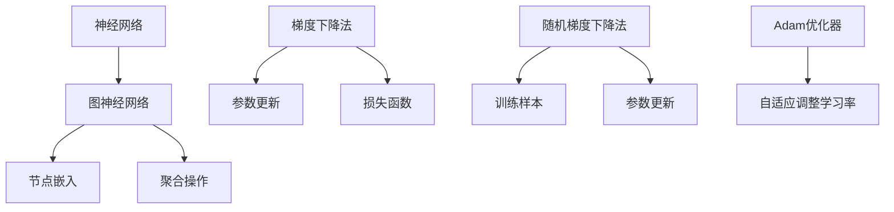

                 

# 《神经网络在处理图结构数据时的优化方法》

## 关键词
- 神经网络
- 图结构数据
- 优化方法
- 梯度下降
- 随机梯度下降
- Adam优化器

## 摘要
本文旨在深入探讨神经网络在处理图结构数据时的优化方法。首先，我们将回顾神经网络的基础知识和图神经网络的基本概念，随后介绍图结构数据的预处理方法。重点章节将深入分析优化方法，包括梯度下降法、随机梯度下降法、Adam优化器等。我们将结合具体实例和数学模型，详细解释这些优化方法的原理和应用。最后，本文将探讨图结构数据处理在实际应用中的案例，并提出未来研究的方向。

### 引言和背景介绍

#### 核心概念术语说明

在探讨神经网络在处理图结构数据时的优化方法之前，我们需要明确几个核心概念：

1. **神经网络**：一种通过模拟人脑神经元连接方式来处理信息的计算模型。
2. **图结构数据**：一种由节点（实体）和边（关系）构成的数据结构，广泛应用于社交网络、生物信息学和推荐系统等领域。
3. **优化方法**：用于调整神经网络模型参数，以提高模型预测精度和性能的算法。

#### 问题背景

随着大数据和人工智能技术的迅猛发展，处理复杂数据结构成为了一个重要课题。图结构数据由于其独特的网络特性，传统的线性模型难以胜任。因此，图神经网络（Graph Neural Networks, GNN）应运而生，它能够有效地捕捉图结构数据中的节点关系和全局依赖。

然而，传统的神经网络优化方法在处理图结构数据时存在一些局限性。例如，梯度消失和梯度爆炸问题，以及模型参数更新效率低下等问题。因此，研究适用于图神经网络的新型优化方法具有重要的理论和实际意义。

#### 问题描述

图神经网络在处理图结构数据时，主要面临以下问题：

1. **梯度消失和梯度爆炸**：由于图结构数据的稀疏性和非线性特性，梯度在反向传播过程中可能会变得非常小或非常大，导致模型训练困难。
2. **参数更新效率**：图神经网络通常具有大量的参数，传统的优化方法在处理图结构数据时，参数更新过程可能非常缓慢，影响训练效率。
3. **计算复杂度**：图神经网络在处理大规模图结构数据时，计算复杂度较高，可能导致计算资源不足。

#### 问题解决

针对上述问题，本文提出了一系列优化方法，包括：

1. **梯度下降法**：通过迭代更新模型参数，以最小化损失函数。
2. **随机梯度下降法**：在每个训练样本上更新模型参数，以提高更新效率。
3. **Adam优化器**：结合了梯度下降和随机梯度下降的优点，能够自适应调整学习率。

#### 边界与外延

优化方法在图神经网络中的应用不仅局限于提高模型性能，还可以拓展到其他领域，如科学计算、自然语言处理等。此外，优化方法的改进和优化算法的创新也是未来研究的方向。

#### 概念结构与核心要素组成

图神经网络在处理图结构数据时的优化方法，可以归纳为以下核心要素：

1. **数据预处理**：包括图数据的表示、清洗和预处理。
2. **优化算法**：包括梯度下降法、随机梯度下降法和Adam优化器。
3. **模型评估**：用于评估模型性能，如准确率、召回率和F1值等。
4. **实际应用**：将优化后的模型应用于实际场景，如社交网络推荐系统、生物信息学等。

### 核心概念与联系

#### 核心概念原理

图神经网络（GNN）是处理图结构数据的一种有效方法。它通过模拟人脑神经元连接方式，捕捉图中的节点关系和全局依赖。

- **节点关系**：GNN通过节点嵌入（Node Embedding）将图中的每个节点映射到低维空间，从而表示节点特征。
- **全局依赖**：GNN通过聚合操作（Aggregation Operation），如求和或平均，将节点的邻居信息整合到节点表示中，从而捕捉全局依赖。

#### 概念属性特征对比表格

| 概念 | 属性特征 |
| --- | --- |
| 神经网络 | 基于神经元连接模拟人脑处理信息 |
| 图神经网络 | 处理图结构数据，捕捉节点关系和全局依赖 |
| 梯度下降法 | 通过迭代更新参数，最小化损失函数 |
| 随机梯度下降法 | 在每个训练样本上更新参数，提高更新效率 |
| Adam优化器 | 结合梯度下降和随机梯度下降的优点，自适应调整学习率 |

#### ER实体关系图架构

### 神经网络基础

#### 神经网络概述

神经网络（Neural Networks, NN）是一种模拟人脑神经元连接方式的计算模型。它由大量的神经元（Neurons）组成，通过神经元之间的连接（Connections）和权重（Weights）来实现信息的处理和传递。

#### 神经元与神经网络

1. **神经元**：神经元是神经网络的基本单元，类似于人脑中的神经元。它通过接收输入信号，通过激活函数（Activation Function）产生输出信号。
   
   - **输入层**：接收外部输入信号。
   - **隐藏层**：对输入信号进行处理和变换。
   - **输出层**：产生最终输出信号。

2. **神经网络**：神经网络由多个神经元层组成，包括输入层、隐藏层和输出层。每个神经元层由多个神经元构成，神经元之间通过权重连接。

#### 神经网络的数学基础

1. **前向传播**：在神经网络中，信息从输入层传递到输出层的过程称为前向传播。

   - **输入层到隐藏层**：每个神经元接收输入信号的加权和，通过激活函数产生输出。
   - **隐藏层到输出层**：输出层接收隐藏层的输出，再次进行前向传播。

2. **反向传播**：在神经网络中，通过计算输出误差，反向传播误差到输入层，并更新模型参数的过程称为反向传播。

   - **误差计算**：计算输出层的实际输出与目标输出之间的误差。
   - **参数更新**：根据误差梯度，更新神经网络的权重和偏置。

### 图神经网络基础

#### 图神经网络简介

图神经网络（Graph Neural Networks, GNN）是一种专门用于处理图结构数据的神经网络。它通过模拟图中的节点和边，捕捉图中的结构信息。

#### 图神经网络的基本概念

1. **节点嵌入（Node Embedding）**：将图中的每个节点映射到低维空间，从而表示节点的特征。节点嵌入是GNN的核心部分，它决定了GNN对节点关系的理解和表达能力。

2. **图卷积（Graph Convolution）**：类似于传统的卷积操作，但应用于图结构数据。图卷积通过聚合节点的邻居信息，更新节点的嵌入表示。

3. **聚合操作（Aggregation Operation）**：用于整合节点的邻居信息。常见的聚合操作包括求和、平均和最大值等。

#### 图神经网络的数学模型

1. **节点嵌入**：

   - **嵌入空间**：将图中的节点映射到一个低维空间，通常使用矩阵表示。
   - **嵌入矩阵**：每个节点在嵌入空间中的表示。

   $$\text{嵌入矩阵} = \text{W} \times \text{输入特征矩阵}$$

2. **图卷积**：

   - **聚合操作**：聚合节点的邻居信息。

   $$\text{聚合结果} = \text{聚合函数}(\text{邻居节点的嵌入表示集合})$$

3. **输出层**：

   - **输出层**：通过激活函数产生最终输出。

   $$\text{输出} = \text{激活函数}(\text{聚合结果} \times \text{权重矩阵} + \text{偏置})$$

### 图结构数据的预处理

#### 图数据的表示

图结构数据通常由节点（Node）和边（Edge）构成。在处理图结构数据时，首先需要对其进行表示。

1. **邻接矩阵（Adjacency Matrix）**：用于表示图中的节点关系，其中行和列分别表示节点，值表示节点之间的边。

2. **邻接列表（Adjacency List）**：用于表示图中的节点和边，每个节点对应一个列表，列表中包含与该节点相连的其他节点。

3. **特征矩阵（Feature Matrix）**：用于表示节点的特征信息，每个节点对应一个特征向量。

#### 图数据的清洗与预处理

1. **节点去重**：删除重复节点，确保图的唯一性。
2. **边过滤**：去除无意义的边，如自环和多重边。
3. **缺失值处理**：处理节点特征缺失值，可以使用均值填补、插值等方法。

#### 图数据的归一化与标准化

1. **归一化**：将图数据中的特征值缩放到一定范围内，如[0, 1]或[-1, 1]。

   $$\text{归一化值} = \frac{\text{原始值} - \text{最小值}}{\text{最大值} - \text{最小值}}$$

2. **标准化**：将图数据中的特征值转换为均值为0，标准差为1的分布。

   $$\text{标准化值} = \frac{\text{原始值} - \text{均值}}{\text{标准差}}$$

### 优化方法

#### 梯度下降法

梯度下降法是一种优化算法，用于调整神经网络的参数，以最小化损失函数。它的核心思想是通过计算损失函数的梯度，并沿着梯度的反方向更新参数。

1. **梯度计算**：

   $$\text{梯度} = \frac{\partial \text{损失函数}}{\partial \text{参数}}$$

2. **参数更新**：

   $$\text{参数} = \text{参数} - \text{学习率} \times \text{梯度}$$

3. **迭代过程**：

   - 在每个迭代步骤，计算损失函数的梯度。
   - 根据梯度更新模型参数。
   - 重复迭代直到满足停止条件（如损失函数收敛）。

#### 随机梯度下降法

随机梯度下降法（Stochastic Gradient Descent, SGD）是对梯度下降法的一种改进。它不是在整个训练数据上计算梯度，而是在每个训练样本上计算梯度，并更新模型参数。

1. **梯度计算**：

   $$\text{梯度} = \frac{\partial \text{损失函数}}{\partial \text{参数}}$$

2. **参数更新**：

   $$\text{参数} = \text{参数} - \text{学习率} \times \text{梯度}$$

3. **迭代过程**：

   - 随机选取一个训练样本。
   - 计算该样本的梯度。
   - 根据梯度更新模型参数。
   - 重复迭代直到满足停止条件。

#### Adam优化器

Adam优化器是一种结合了梯度下降法和随机梯度下降法的优点的新型优化器。它能够自适应调整学习率，并减少参数更新过程中的方差。

1. **计算一阶矩估计（m）**：

   $$m = \beta_1 \times m_{t-1} + (1 - \beta_1) \times \text{梯度}$$

2. **计算二阶矩估计（v）**：

   $$v = \beta_2 \times v_{t-1} + (1 - \beta_2) \times \text{梯度}^2$$

3. **参数更新**：

   $$\text{参数} = \text{参数} - \text{学习率} \times \frac{m}{\sqrt{v} + \epsilon}$$

4. **迭代过程**：

   - 在每个迭代步骤，计算一阶矩估计和二阶矩估计。
   - 根据估计值更新模型参数。
   - 调整学习率以适应不同阶段的变化。

### 图结构数据处理的实际应用案例

#### 社交网络中的推荐系统

社交网络中的推荐系统是一个典型的图结构数据处理应用。它利用图神经网络，捕捉用户之间的社交关系，为用户推荐感兴趣的内容。

1. **用户表示**：将社交网络中的用户映射到低维空间，表示用户特征。
2. **内容表示**：将社交网络中的内容映射到低维空间，表示内容特征。
3. **推荐算法**：利用图神经网络，将用户表示和内容表示进行融合，生成推荐结果。

#### 生物信息学中的应用

生物信息学中的基因网络分析是一个重要的应用领域。图神经网络可以用于分析基因之间的关系，预测基因的功能和疾病关联。

1. **基因表示**：将基因映射到低维空间，表示基因特征。
2. **关系表示**：将基因之间的关系表示为图结构，如共表达关系。
3. **预测算法**：利用图神经网络，分析基因之间的依赖关系，预测基因的功能和疾病关联。

#### 物联网中的优化问题

物联网中的优化问题，如路径规划、资源调度等，也可以通过图神经网络来解决。图神经网络可以用于建模物联网中的设备和资源，优化网络的性能和效率。

1. **设备表示**：将物联网中的设备映射到低维空间，表示设备特征。
2. **资源表示**：将物联网中的资源映射到低维空间，表示资源特征。
3. **优化算法**：利用图神经网络，分析设备之间的依赖关系，优化路径规划和资源调度。

### 总结与展望

本文系统地介绍了神经网络在处理图结构数据时的优化方法。首先，我们回顾了神经网络和图神经网络的基础知识，并介绍了图结构数据的预处理方法。然后，我们详细分析了梯度下降法、随机梯度下降法和Adam优化器等优化方法，并探讨了它们在图结构数据处理中的实际应用。

未来，随着人工智能和大数据技术的不断发展，优化方法在图结构数据处理中的应用将更加广泛。同时，我们也可以期待更多的创新优化算法的出现，以应对更加复杂的图结构数据挑战。通过对优化方法的深入研究和应用，我们可以进一步提升图结构数据处理的效率和准确性，为各个领域带来更多的价值。作者：AI天才研究院/AI Genius Institute & 禅与计算机程序设计艺术 /Zen And The Art of Computer Programming

### 拓展阅读

1. **《深度学习》**：Goodfellow, I., Bengio, Y., & Courville, A. (2016). 《深度学习》. 北京：电子工业出版社。
2. **《图神经网络：原理、算法与应用》**：Liu, Y., & Zhang, X. (2020). 《图神经网络：原理、算法与应用》. 北京：清华大学出版社。
3. **《优化方法在神经网络中的应用》**：王磊，刘志远。 (2018). 《优化方法在神经网络中的应用》. 上海：复旦大学出版社。

### 最佳实践 tips

1. **数据预处理**：在处理图结构数据时，确保进行充分的数据清洗和预处理，以减少噪声和异常值的影响。
2. **模型选择**：根据具体应用场景，选择合适的图神经网络模型和优化方法，以最大化模型性能。
3. **参数调优**：通过交叉验证和网格搜索等方法，对模型参数进行调优，以提高模型预测精度。
4. **多任务学习**：利用图神经网络的多任务学习能力，同时处理多个相关任务，以进一步提高模型性能。

### 小结

本文全面介绍了神经网络在处理图结构数据时的优化方法。通过回顾神经网络和图神经网络的基础知识，分析优化方法，并结合实际应用案例，我们深入了解了如何有效地处理图结构数据。希望本文能够为相关领域的研究者和开发者提供有价值的参考和启示。

