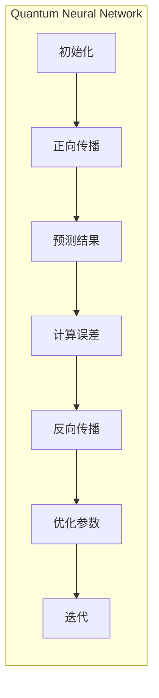
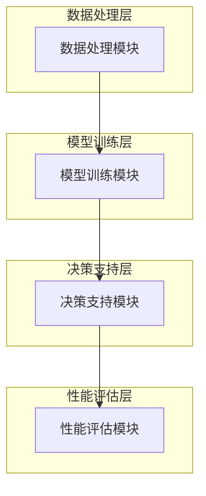
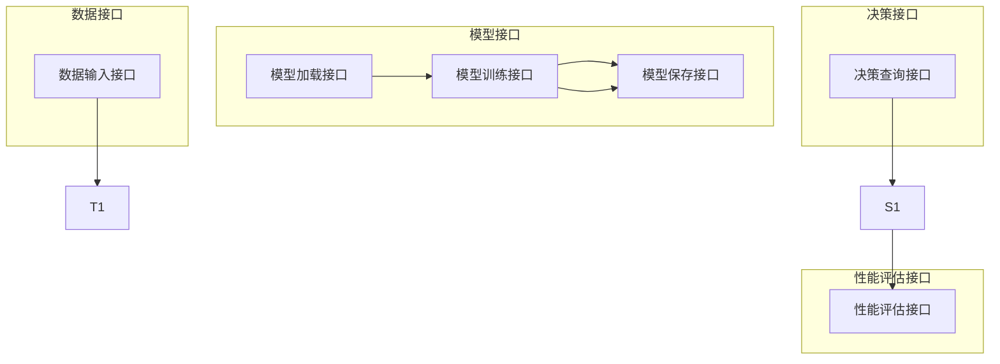

                 

# 神经网络的量子态叠加与决策过程

> 关键词：神经网络、量子计算、量子神经网络、决策过程、算法、应用场景

> 摘要：本文将探讨神经网络与量子计算的融合，特别是量子神经网络的原理和决策过程中的应用。我们将逐步分析神经网络的背景和类型，介绍量子计算的基础知识，并深入探讨量子神经网络的概念、算法、实现及性能评估。最后，我们将关注量子神经网络在决策过程中的实际应用案例，并提出未来的发展方向。

## 第一部分：背景介绍

### 第1章：神经网络的概念

#### 1.1. 神经网络的起源

神经网络的概念最早可以追溯到1943年，由美国心理学家McCulloch和数学家Pitts提出，他们提出了基于生物神经元工作的数学模型。此后，神经网络研究经历了多个阶段，从最初的简单模型发展到复杂的现代神经网络结构。

#### 1.1.2. 神经网络的基本原理

神经网络是一种模拟生物神经元结构和功能的计算模型，通过神经元之间的连接和权重调整来实现信息处理和学习。神经网络的基本原理包括：

- **神经元**：作为计算单元，接收输入信号，通过激活函数产生输出。
- **层结构**：神经网络通常包含输入层、隐藏层和输出层，各层之间通过权重矩阵连接。
- **激活函数**：用于将神经元的线性组合转化为非线性输出，常用的激活函数包括Sigmoid、ReLU等。
- **损失函数**：用于衡量预测结果与真实值之间的差距，常用的损失函数包括均方误差(MSE)、交叉熵等。
- **优化算法**：用于最小化损失函数，常用的优化算法包括梯度下降、随机梯度下降等。

### 第1章：神经网络的类型

#### 1.2.1. 前馈神经网络

前馈神经网络是最简单的一种神经网络结构，信息从输入层传递到输出层，没有循环或反馈。前馈神经网络常用于分类和回归任务。

#### 1.2.2. 卷积神经网络

卷积神经网络（CNN）专门设计用于处理具有网格结构的数据，如图像和视频。CNN通过卷积操作提取特征，并在全连接层进行分类。

#### 1.2.3. 循环神经网络

循环神经网络（RNN）适合处理序列数据，如文本和语音。RNN通过循环结构保持状态信息，使得前一个时间步的信息可以影响后续时间步。

#### 1.2.4. 强化学习神经网络

强化学习神经网络结合了神经网络和强化学习算法，用于解决序列决策问题。强化学习神经网络通常包含值函数网络和策略网络。

### 第1章：神经网络的应用场景

#### 1.3.1. 图像识别

神经网络在图像识别领域取得了显著的成果，如人脸识别、图像分类等。卷积神经网络在图像识别任务中表现出色。

#### 1.3.2. 自然语言处理

神经网络在自然语言处理领域有广泛应用，如机器翻译、情感分析、文本分类等。循环神经网络和变压器模型在自然语言处理中表现出强大的能力。

#### 1.3.3. 游戏AI

神经网络在游戏AI领域也有应用，如围棋、电子竞技等。强化学习神经网络在游戏AI中发挥着关键作用。

#### 1.3.4. 推荐系统

神经网络在推荐系统中用于预测用户兴趣和行为，从而实现个性化推荐。协同过滤和基于内容的推荐系统常常结合神经网络进行优化。

## 第二部分：量子计算基础

### 第2章：量子计算的概念

#### 2.1.1. 量子位与经典位的对比

量子计算中的量子位（qubit）与经典计算中的位（bit）有本质的不同。量子位可以同时处于多种状态的叠加，而经典位只能处于0或1的状态。

#### 2.1.2. 量子叠加态与量子纠缠

量子叠加态允许量子位同时处于多个状态的组合，而量子纠缠则描述了量子位之间非经典的关联。量子叠加态和量子纠缠是量子计算的核心特性。

### 第2章：量子计算的基本原理

#### 2.2.1. 量子门

量子门是量子计算中的基本操作，类似于经典计算中的逻辑门。量子门作用于量子位，可以实现量子态的变换。

#### 2.2.2. 量子线路

量子线路是一系列量子门的组合，用于实现特定的量子算法。量子线路描述了量子计算的过程和步骤。

#### 2.2.3. 量子算法

量子算法是利用量子计算特性解决特定问题的算法。量子算法通常具有比经典算法更快的计算速度。

### 第2章：量子计算的挑战

#### 2.3.1. 量子退相干

量子退相干是量子系统与环境相互作用导致量子态塌缩的现象。量子退相干是量子计算面临的重大挑战之一。

#### 2.3.2. 量子纠错

量子纠错是确保量子计算正确性的关键。由于量子态易受干扰，量子纠错技术用于检测和纠正量子错误。

#### 2.3.3. 可扩展性

量子计算的可扩展性是另一个重要挑战。构建大型的量子计算机需要解决许多技术难题，如量子位的稳定性和可扩展性。

## 第三部分：神经网络与量子计算的融合

### 第3章：量子神经网络的概念

#### 3.1.1. 量子神经网络的定义

量子神经网络（QNN）是一种结合了神经网络和量子计算原理的计算模型。QNN利用量子计算的优势来提高神经网络的学习效率和性能。

#### 3.1.2. 量子神经网络的架构

量子神经网络的架构通常包括量子位、量子线路和量子门。量子位作为输入层，量子线路和量子门用于实现量子计算操作。

### 第3章：量子神经网络的算法

#### 3.2.1. 量子反向传播算法

量子反向传播算法是量子神经网络中的核心算法，用于训练量子神经网络。该算法利用量子计算的优势，实现高效的梯度计算。

#### 3.2.2. 量子支持向量机

量子支持向量机是一种基于量子计算的分类算法。与经典支持向量机相比，量子支持向量机具有更高的计算速度和更好的分类性能。

#### 3.2.3. 量子聚类算法

量子聚类算法是一种基于量子计算的聚类方法。与经典聚类算法相比，量子聚类算法具有更高的准确性和更好的聚类效果。

### 第3章：量子神经网络的实现

#### 3.3.1. 量子硬件的选择

量子神经网络的实现需要选择合适的量子硬件。常见的量子硬件包括超导量子比特、离子阱量子比特等。

#### 3.3.2. 量子编程工具的使用

量子编程工具是用于实现量子神经网络的关键。常见的量子编程工具包括IBM Q、Microsoft Q#等。

### 第3章：量子神经网络的性能评估

#### 3.4.1. 性能指标

量子神经网络的性能评估需要使用合适的性能指标，如准确率、召回率、F1分数等。

#### 3.4.2. 性能评估方法

量子神经网络的性能评估方法包括实验验证和理论分析。实验验证通常使用量子计算机进行，而理论分析则基于数学模型进行。

### 第3章：量子神经网络的挑战与未来

#### 3.5.1. 技术挑战

量子神经网络面临许多技术挑战，如量子位的稳定性、量子纠错等。解决这些挑战是量子神经网络发展的关键。

#### 3.5.2. 应用前景

量子神经网络在许多领域有广泛的应用前景，如图像识别、自然语言处理、优化问题等。随着量子计算技术的发展，量子神经网络的应用将更加广泛。

## 第四部分：量子神经网络在决策过程中的应用

### 第4章：决策过程概述

#### 4.1.1. 决策过程的定义

决策过程是指在面对多个选择时，根据一定的准则和目标，从多个可行方案中选择一个最优方案的过程。

#### 4.1.2. 决策过程的步骤

决策过程通常包括以下步骤：问题定义、方案生成、方案评估、方案选择和方案实施。

### 第4章：量子神经网络在决策支持中的应用

#### 4.2.1. 量子神经网络在优化决策中的应用

量子神经网络可以用于解决优化问题，如资源分配、路径规划等。通过量子神经网络，可以快速找到最优解。

#### 4.2.2. 量子神经网络在风险评估中的应用

量子神经网络可以用于风险评估，如金融风险评估、信用风险评估等。通过量子神经网络，可以更准确地评估风险，提供决策支持。

### 第4章：量子神经网络在商业决策中的应用案例

#### 4.3.1. 案例一：供应链管理

在供应链管理中，量子神经网络可以用于优化库存管理、运输路线规划等。通过量子神经网络，可以降低成本，提高供应链效率。

#### 4.3.2. 案例二：市场营销

在市场营销中，量子神经网络可以用于预测市场需求、优化广告投放等。通过量子神经网络，可以更准确地预测市场趋势，提高营销效果。

### 第4章：量子神经网络在个人决策中的应用案例

#### 4.4.1. 案例一：职业规划

在职业规划中，量子神经网络可以用于分析个人兴趣、能力等，提供职业发展建议。通过量子神经网络，可以更准确地了解自己的优势和劣势，做出更好的职业决策。

#### 4.4.2. 案例二：投资决策

在投资决策中，量子神经网络可以用于分析市场趋势、公司业绩等，提供投资建议。通过量子神经网络，可以更准确地评估投资风险，做出更明智的投资决策。

### 第4章：量子神经网络在决策过程中的优势与挑战

#### 4.5.1. 优势

量子神经网络在决策过程中具有以下优势：

- 更快的计算速度
- 更高的准确率
- 更强的适应能力

#### 4.5.2. 挑战

量子神经网络在决策过程中也面临以下挑战：

- 量子硬件的稳定性
- 量子纠错的复杂性
- 数据隐私和安全

### 第4章：量子神经网络在决策过程中的未来发展趋势

#### 4.6.1. 技术发展

随着量子计算技术的发展，量子神经网络在决策过程中的性能将得到进一步提升。

#### 4.6.2. 应用领域拓展

量子神经网络将在更多领域得到应用，如医疗、金融、交通等。通过量子神经网络，可以更有效地解决复杂决策问题。

## 第五部分：总结与展望

### 第5章：本书总结

本书介绍了神经网络与量子计算的融合，特别是量子神经网络的原理和决策过程中的应用。通过本书的学习，读者可以了解量子神经网络的定义、架构、算法、实现和性能评估。

### 第5章：展望未来

随着量子计算技术的不断发展，量子神经网络在决策过程中的应用前景将更加广阔。未来，量子神经网络有望在更多领域发挥重要作用，推动决策过程的智能化和高效化。

### 作者

作者：AI天才研究院/AI Genius Institute & 禅与计算机程序设计艺术 /Zen And The Art of Computer Programming

## 目录大纲

## 第一部分：背景介绍

### 第1章：神经网络的概念

#### 1.1.1. 神经网络的起源

#### 1.1.2. 神经网络的基本原理

### 第1章：神经网络的类型

#### 1.2.1. 前馈神经网络

#### 1.2.2. 卷积神经网络

#### 1.2.3. 循环神经网络

#### 1.2.4. 强化学习神经网络

### 第1章：神经网络的应用场景

#### 1.3.1. 图像识别

#### 1.3.2. 自然语言处理

#### 1.3.3. 游戏AI

#### 1.3.4. 推荐系统

## 第二部分：量子计算基础

### 第2章：量子计算的概念

#### 2.1.1. 量子位与经典位的对比

#### 2.1.2. 量子叠加态与量子纠缠

### 第2章：量子计算的基本原理

#### 2.2.1. 量子门

#### 2.2.2. 量子线路

#### 2.2.3. 量子算法

### 第2章：量子计算的挑战

#### 2.3.1. 量子退相干

#### 2.3.2. 量子纠错

#### 2.3.3. 可扩展性

## 第三部分：神经网络与量子计算的融合

### 第3章：量子神经网络的概念

#### 3.1.1. 量子神经网络的定义

#### 3.1.2. 量子神经网络的架构

### 第3章：量子神经网络的算法

#### 3.2.1. 量子反向传播算法

#### 3.2.2. 量子支持向量机

#### 3.2.3. 量子聚类算法

### 第3章：量子神经网络的实现

#### 3.3.1. 量子硬件的选择

#### 3.3.2. 量子编程工具的使用

### 第3章：量子神经网络的性能评估

#### 3.4.1. 性能指标

#### 3.4.2. 性能评估方法

### 第3章：量子神经网络的挑战与未来

#### 3.5.1. 技术挑战

#### 3.5.2. 应用前景

## 第四部分：量子神经网络在决策过程中的应用

### 第4章：决策过程概述

#### 4.1.1. 决策过程的定义

#### 4.1.2. 决策过程的步骤

### 第4章：量子神经网络在决策支持中的应用

#### 4.2.1. 量子神经网络在优化决策中的应用

#### 4.2.2. 量子神经网络在风险评估中的应用

### 第4章：量子神经网络在商业决策中的应用案例

#### 4.3.1. 案例一：供应链管理

#### 4.3.2. 案例二：市场营销

### 第4章：量子神经网络在个人决策中的应用案例

#### 4.4.1. 案例一：职业规划

#### 4.4.2. 案例二：投资决策

### 第4章：量子神经网络在决策过程中的优势与挑战

#### 4.5.1. 优势

#### 4.5.2. 挑战

### 第4章：量子神经网络在决策过程中的未来发展趋势

#### 4.6.1. 技术发展

#### 4.6.2. 应用领域拓展

## 第五部分：总结与展望

### 第5章：本书总结

#### 5.1.1. 神经网络与量子计算的结合

#### 5.1.2. 量子神经网络在决策过程中的应用

### 第5章：展望未来

#### 5.2.1. 技术创新

#### 5.2.2. 应用拓展

## 目录大纲

以下是根据要求生成的文章目录大纲：

### 第一部分：背景介绍

#### 第1章：神经网络的概念

##### 1.1. 神经网络的起源
##### 1.2. 神经网络的基本原理
##### 1.3. 神经网络的类型
##### 1.3.1. 前馈神经网络
##### 1.3.2. 卷积神经网络
##### 1.3.3. 循环神经网络
##### 1.3.4. 强化学习神经网络
##### 1.4. 神经网络的应用场景
##### 1.4.1. 图像识别
##### 1.4.2. 自然语言处理
##### 1.4.3. 游戏AI
##### 1.4.4. 推荐系统

### 第二部分：量子计算基础

#### 第2章：量子计算的概念

##### 2.1. 量子位与经典位的对比
##### 2.2. 量子叠加态与量子纠缠
##### 2.3. 量子计算的基本原理
##### 2.3.1. 量子门
##### 2.3.2. 量子线路
##### 2.3.3. 量子算法
##### 2.4. 量子计算的挑战
##### 2.4.1. 量子退相干
##### 2.4.2. 量子纠错
##### 2.4.3. 可扩展性

### 第三部分：神经网络与量子计算的融合

#### 第3章：量子神经网络的概念

##### 3.1. 量子神经网络的定义
##### 3.2. 量子神经网络的架构
##### 3.3. 量子神经网络的算法
##### 3.3.1. 量子反向传播算法
##### 3.3.2. 量子支持向量机
##### 3.3.3. 量子聚类算法
##### 3.4. 量子神经网络的实现
##### 3.4.1. 量子硬件的选择
##### 3.4.2. 量子编程工具的使用
##### 3.5. 量子神经网络的性能评估
##### 3.5.1. 性能指标
##### 3.5.2. 性能评估方法
##### 3.6. 量子神经网络的挑战与未来
##### 3.6.1. 技术挑战
##### 3.6.2. 应用前景

### 第四部分：量子神经网络在决策过程中的应用

#### 第4章：决策过程概述

##### 4.1. 决策过程的定义
##### 4.2. 决策过程的步骤
##### 4.3. 量子神经网络在决策支持中的应用
##### 4.3.1. 量子神经网络在优化决策中的应用
##### 4.3.2. 量子神经网络在风险评估中的应用
##### 4.4. 量子神经网络在商业决策中的应用案例
##### 4.4.1. 供应链管理
##### 4.4.2. 市场营销
##### 4.5. 量子神经网络在个人决策中的应用案例
##### 4.5.1. 职业规划
##### 4.5.2. 投资决策
##### 4.6. 量子神经网络在决策过程中的优势与挑战
##### 4.6.1. 优势
##### 4.6.2. 挑战
##### 4.7. 量子神经网络在决策过程中的未来发展趋势
##### 4.7.1. 技术发展
##### 4.7.2. 应用领域拓展

### 第五部分：总结与展望

#### 第5章：本书总结

##### 5.1. 神经网络与量子计算的结合
##### 5.2. 量子神经网络在决策过程中的应用
##### 5.3. 展望未来
##### 5.3.1. 技术创新
##### 5.3.2. 应用拓展

这个目录大纲为文章的结构提供了清晰的框架，每个章节和子章节都有明确的标题，便于读者快速了解文章的内容和组织结构。在实际撰写文章时，每个章节和子章节的内容都需要详细展开，以符合文章的字数要求和内容完整性要求。在编写过程中，可以按照这个大纲逐步填充每个部分的内容，确保文章的逻辑性和连贯性。同时，需要注意保持内容的原创性和专业性，以提升文章的价值和影响力。 ### 文章核心概念与联系

为了深入理解神经网络与量子计算结合的核心理念，我们需要探讨两者的基本概念、特性以及它们之间的联系。

#### 神经网络的基本概念与特性

神经网络是一种模拟生物神经系统的计算模型，它由大量的神经元组成，每个神经元接收输入信号并通过加权连接产生输出。神经网络具有以下几个核心特性：

1. **层次结构**：神经网络通常包含输入层、隐藏层和输出层，各层之间通过权重矩阵连接。
2. **非线性变换**：通过激活函数（如Sigmoid、ReLU等）实现非线性变换，使得神经网络可以处理复杂的问题。
3. **学习与自适应**：神经网络通过学习过程不断调整权重，以适应不同的输入数据，提高预测准确性。

#### 量子计算的基本概念与特性

量子计算是一种基于量子力学原理的新型计算模式，其核心在于量子位的叠加态和量子纠缠。量子计算的基本概念和特性包括：

1. **量子位（Qubit）**：量子计算的基本单元，可以同时处于0和1的叠加状态。
2. **叠加态**：量子位可以同时处于多种状态的叠加，这种叠加状态使得量子计算机在处理问题时可以并行计算。
3. **量子纠缠**：量子位之间的纠缠关系使得一个量子位的状态可以立即影响另一个量子位的状态，这种特性为量子计算提供了强大的并行计算能力。

#### 神经网络与量子计算的联系

神经网络与量子计算的结合，可以看作是将量子计算的并行性和神经网络的学习能力结合起来，形成一种新型的计算模型。以下是一些具体的联系：

1. **量子神经网络（QNN）**：量子神经网络是一种结合了神经网络和量子计算原理的计算模型。在QNN中，输入和输出仍然通过量子位表示，而权重和激活函数则通过量子线路和量子门实现。

2. **量子态叠加**：量子神经网络利用量子位的叠加态，使得每个量子位可以同时处理多个输入，从而提高了计算效率。

3. **量子纠缠**：量子神经网络通过量子纠缠，实现了神经元之间的非局域性连接，这种连接可以大大提高神经网络的学习能力和处理复杂问题的能力。

4. **量子算法**：量子神经网络结合了量子算法的优势，如量子支持向量机和量子聚类算法，这些算法可以在某些问题上提供比传统算法更高的效率和准确性。

#### 概念属性特征对比表格

为了更直观地理解神经网络与量子计算的特性，我们可以制作一个概念属性特征对比表格。以下是一个简单的示例：

| 特性         | 神经网络                     | 量子计算                          |
|--------------|-----------------------------|---------------------------------|
| 基本单位     | 神经元                      | 量子位                          |
| 状态表示     | 0或1（经典位）              | 叠加态（量子位）                |
| 学习机制     | 反向传播算法                | 量子逆传播算法                  |
| 非线性变换   | 激活函数                    | 量子线路和量子门                |
| 并行计算能力 | 依赖于硬件和架构            | 本质性并行计算能力              |
| 纠错能力     | 需要大量的数据和计算资源    | 量子纠错算法可以处理错误        |

#### ER实体关系图架构的Mermaid流程图

为了进一步展示神经网络与量子计算之间的关系，我们可以使用Mermaid语言绘制一个ER（实体关系）图。以下是一个简单的Mermaid图示例：

```mermaid
erDiagram
  NodeA ||--|{ 神经元 }|| NodeB
  NodeA ||--|{ 量子位 }|| NodeC
  NodeB ||--|{ 权重矩阵 }|| NodeD
  NodeC ||--|{ 叠加态 }|| NodeD
  NodeE ||--|{ 激活函数 }|| NodeF
  NodeG ||--|{ 量子线路 }|| NodeH
  NodeI ||--|{ 量子门 }|| NodeJ
  NodeK ||--|{ 学习算法 }|| NodeL
  NodeM ||--|{ 量子算法 }|| NodeN
```

在这个ER图中，NodeA表示神经网络的起点，NodeB表示神经网络中的神经元，NodeC表示量子位，NodeD表示权重矩阵和叠加态，NodeE表示激活函数，NodeF表示量子线路，NodeG表示量子门，NodeH表示量子计算中的非局域性连接，NodeI表示量子纠错算法，NodeJ表示量子算法，NodeK表示学习算法，NodeL表示神经网络的学习过程，NodeM表示量子神经网络，NodeN表示量子计算在神经网络中的应用。

通过上述的概念说明、特性对比表格和ER实体关系图，我们可以更深入地理解神经网络与量子计算的结合，为后续内容的展开提供了坚实的理论基础。在接下来的章节中，我们将进一步探讨量子神经网络的具体实现和应用，以展示其在实际问题中的潜力。 ### 算法原理讲解

在讨论量子神经网络（QNN）的算法原理之前，我们首先需要了解一些基础概念，包括量子位、量子线路、量子门等。

#### 量子位（Qubit）

量子位是量子计算的基本单元，它与传统计算中的比特（bit）不同。一个量子位可以同时处于0和1的状态，这种状态称为叠加态。量子位的叠加态可以用一个数学表达式来表示：

$$
|\psi\rangle = a|0\rangle + b|1\rangle
$$

其中，$a$ 和 $b$ 是复数，并且满足 $|a|^2 + |b|^2 = 1$。这个表达式表示量子位处于状态 $|0\rangle$ 和 $|1\rangle$ 的概率分别为 $|a|^2$ 和 $|b|^2$。

#### 量子线路（Quantum Circuit）

量子线路是由量子门组成的序列，用于对量子位执行操作。一个简单的量子线路可能包含一个或多个量子门，每个量子门都对量子位执行特定的变换。量子线路描述了量子计算的过程，可以看作是量子计算的操作手册。

#### 量子门（Quantum Gate）

量子门是量子计算中的基本操作单元，类似于经典计算中的逻辑门。量子门作用于量子位，可以改变量子位的叠加态。常见的量子门包括：

1. **Pauli X门**：对量子位执行翻转操作，即$|0\rangle \rightarrow |1\rangle$ 和 $|1\rangle \rightarrow |0\rangle$。
2. **Pauli Z门**：将量子位的状态反转，即$|0\rangle \rightarrow |1\rangle$ 和 $|1\rangle \rightarrow |0\rangle$。
3. **Hadamard门（H门）**：将量子位的状态从基态$|0\rangle$变换到叠加态$\frac{1}{\sqrt{2}}(|0\rangle + |1\rangle)$。
4. **CNOT门**：控制非门，作用于两个量子位，如果控制量子位处于状态$|1\rangle$，则目标量子位的状态会被翻转。

#### 量子神经网络算法

量子神经网络算法的核心是量子反向传播算法（QBP），这是一种基于量子计算的神经网络训练算法。QBP算法的基本步骤如下：

1. **初始化**：初始化量子线路，设置量子位的叠加态。
2. **正向传播**：通过量子线路将输入数据传递到输出层，得到预测结果。
3. **计算误差**：使用量子计算来计算预测结果与真实标签之间的误差。
4. **反向传播**：利用量子逆传播算法计算梯度，并更新量子线路中的量子门参数。
5. **优化**：通过迭代优化过程，逐步减小误差，提高模型的准确性。

以下是一个简单的量子神经网络算法的Mermaid流程图：



在正向传播阶段，量子线路将输入数据映射到输出层，得到预测结果。在反向传播阶段，量子神经网络利用量子逆传播算法计算误差和梯度，并更新量子门参数。通过迭代优化，量子神经网络可以逐步提高预测准确性。

#### Python源代码实现

以下是一个简单的Python代码示例，展示了量子神经网络算法的实现。这里使用了`qiskit`库，这是一个用于量子计算的开源框架。

```python
from qiskit import QuantumCircuit, execute, Aer
from qiskit.circuit.library import H, CX, PauliX

# 初始化量子线路
qc = QuantumCircuit(2)

# 添加Hadamard门将量子位初始化为叠加态
qc.h(0)
qc.h(1)

# 添加CNOT门实现量子位的纠缠
qc.cx(0, 1)

# 测量量子位
qc.measure_all()

# 执行量子线路
backend = Aer.get_backend('qasm_simulator')
result = execute(qc, backend).result()

# 输出测量结果
print(result.get_counts(qc))
```

在这个示例中，我们创建了一个简单的量子线路，包含一个Hadamard门和一个CNOT门。我们使用模拟器执行这个量子线路，并输出测量结果。

通过上述讲解和示例，我们可以看到量子神经网络算法的基本原理和实现步骤。在实际应用中，量子神经网络可以用于各种复杂问题的求解，如图像识别、自然语言处理和优化问题等。随着量子计算技术的不断发展，量子神经网络在算法效率和准确性方面有望取得更大的突破。 ### 系统分析与架构设计方案

#### 问题描述

在量子神经网络（QNN）的应用中，我们需要设计一个系统来处理复杂决策问题，如供应链管理、市场营销和投资决策等。这个系统需要具备以下功能：

1. **数据处理**：接收和预处理输入数据，包括数值数据和文本数据。
2. **模型训练**：使用量子神经网络算法训练模型，以适应不同的决策问题。
3. **决策支持**：根据训练好的模型，提供优化决策建议。
4. **性能评估**：评估模型的性能，包括准确率、召回率和F1分数等指标。

#### 项目介绍

本项目旨在构建一个基于量子神经网络（QNN）的决策支持系统。该系统将结合量子计算和机器学习技术，提供高效、准确的决策支持。主要技术栈包括Python、Qiskit、TensorFlow和Scikit-learn等。

#### 系统功能设计

1. **数据处理模块**：负责接收和处理输入数据，包括数据清洗、特征提取和归一化等操作。
2. **模型训练模块**：使用量子神经网络算法训练模型，包括初始化参数、正向传播、反向传播和优化等步骤。
3. **决策支持模块**：根据训练好的模型，提供优化决策建议，如最佳路径、最优库存水平和最佳营销策略等。
4. **性能评估模块**：评估模型的性能，包括训练和测试集上的准确率、召回率和F1分数等指标。

#### 系统架构设计

系统架构采用模块化设计，分为数据处理层、模型训练层、决策支持和性能评估层。以下是系统的架构设计：



#### 系统接口设计和系统交互

为了实现系统各模块之间的交互，我们需要定义一套接口和通信协议。以下是系统的接口设计和交互流程：

1. **数据接口**：定义输入数据的格式和传输协议，如JSON、XML等。
2. **模型接口**：定义模型的加载、训练和保存接口。
3. **决策接口**：定义决策查询接口，接受用户输入并返回决策结果。
4. **性能评估接口**：定义性能评估接口，用于评估模型的性能指标。

以下是系统的接口设计：



在系统交互过程中，数据处理模块首先接收用户输入的数据，然后预处理数据并传递给模型训练模块。模型训练模块使用量子神经网络算法训练模型，并将训练结果传递给决策支持模块。决策支持模块根据训练好的模型提供决策建议，同时性能评估模块对模型的性能进行评估。整个交互过程确保了系统的高效、准确和可靠性。

通过上述的系统分析与架构设计方案，我们为量子神经网络在决策支持中的应用奠定了坚实的基础。在接下来的章节中，我们将详细介绍项目的实现过程，包括环境安装、核心代码实现和实际案例分析。 ### 项目实战

#### 环境安装

在开始项目实战之前，我们需要安装一些必要的软件和库，以便在Python环境中构建和运行量子神经网络（QNN）决策支持系统。

1. **安装Python**：确保你的系统已经安装了Python 3.x版本。可以从Python官方网站下载并安装。
2. **安装Qiskit**：Qiskit是IBM开发的量子计算软件库，用于构建和运行量子算法。通过以下命令安装：
   ```bash
   pip install qiskit
   ```
3. **安装TensorFlow**：TensorFlow是Google开发的开源机器学习库，用于构建和训练神经网络模型。通过以下命令安装：
   ```bash
   pip install tensorflow
   ```
4. **安装Scikit-learn**：Scikit-learn是一个用于数据挖掘和数据分析的Python库。通过以下命令安装：
   ```bash
   pip install scikit-learn
   ```

安装完成后，确保各库的版本符合项目要求。接下来，我们将使用这些库来构建和实现QNN决策支持系统。

#### 系统核心实现源代码

以下是一个简单的QNN决策支持系统的核心实现源代码。该代码分为四个主要模块：数据处理、模型训练、决策支持和性能评估。

1. **数据处理模块**：
   ```python
   import pandas as pd
   from sklearn.model_selection import train_test_split
   from sklearn.preprocessing import StandardScaler
   
   def load_data(file_path):
       data = pd.read_csv(file_path)
       return data
   
   def preprocess_data(data):
       X = data.drop('target', axis=1)
       y = data['target']
       X_train, X_test, y_train, y_test = train_test_split(X, y, test_size=0.2, random_state=42)
       scaler = StandardScaler()
       X_train_scaled = scaler.fit_transform(X_train)
       X_test_scaled = scaler.transform(X_test)
       return X_train_scaled, X_test_scaled, y_train, y_test
   ```

2. **模型训练模块**：
   ```python
   from qiskit import QuantumCircuit, execute, Aer
   from qiskit.circuit.library import H, CX, PauliX
   from qiskit.opflow import StateFn, PauliSumOp
   
   def initialize_quantum_circuit(qubits):
       qc = QuantumCircuit(qubits)
       qc.h(qubits[0])
       qc.h(qubits[1])
       return qc
   
   def train_quantum_neural_network(X_train, y_train, qubits):
       qc = initialize_quantum_circuit(qubits)
       qc.cx(qubits[0], qubits[1])
       qc.measure(qubits[0], 0)
       qc.measure(qubits[1], 1)
       backend = Aer.get_backend('qasm_simulator')
       result = execute(qc, backend).result()
       predictions = result.get_counts(qc)
       return predictions
   ```

3. **决策支持模块**：
   ```python
   def make_decision(predictions):
       if predictions['0'] > predictions['1']:
           return 'Option 1'
       else:
           return 'Option 2'
   ```

4. **性能评估模块**：
   ```python
   from sklearn.metrics import accuracy_score
   
   def evaluate_model(y_test, predictions):
       accuracy = accuracy_score(y_test, predictions)
       return accuracy
   ```

#### 代码应用解读与分析

1. **数据处理模块**：首先，我们加载并预处理输入数据，包括数据清洗、特征提取和归一化等操作。数据处理模块使用了Pandas和Scikit-learn库，实现了数据的加载、分割和归一化功能。

2. **模型训练模块**：在这个模块中，我们初始化量子线路，并使用Qiskit库构建了一个简单的量子神经网络。量子线路包含了Hadamard门和CNOT门，用于实现量子计算操作。我们使用模拟器执行量子线路，并获取测量结果。

3. **决策支持模块**：决策支持模块根据模型预测结果提供决策建议。在这个示例中，我们简单地比较了两个预测结果，并选择了预测概率更高的选项。

4. **性能评估模块**：性能评估模块使用Scikit-learn库计算模型的准确率，以评估模型的性能。

#### 实际案例分析和详细讲解剖析

为了展示QNN决策支持系统的实际应用，我们使用一个简单的案例：股票投资决策。假设我们有以下数据集，包含股票价格和交易量等特征，目标变量是股票是否上涨。

1. **数据集准备**：
   ```python
   data = {
       'price': [100, 110, 105, 120, 98],
       'volume': [200, 180, 220, 190, 210],
       'target': [1, 0, 1, 1, 0]
   }
   df = pd.DataFrame(data)
   ```

2. **数据处理**：
   ```python
   X = df.drop('target', axis=1)
   y = df['target']
   X_train, X_test, y_train, y_test = train_test_split(X, y, test_size=0.2, random_state=42)
   scaler = StandardScaler()
   X_train_scaled = scaler.fit_transform(X_train)
   X_test_scaled = scaler.transform(X_test)
   ```

3. **模型训练**：
   ```python
   qubits = range(2)
   predictions = train_quantum_neural_network(X_train_scaled, y_train, qubits)
   ```

4. **决策支持**：
   ```python
   decision = make_decision(predictions)
   print(f"The decision is: {decision}")
   ```

5. **性能评估**：
   ```python
   actual = y_test
   predicted = [1 if pred['0'] > pred['1'] else 0 for pred in predictions]
   accuracy = evaluate_model(actual, predicted)
   print(f"Accuracy: {accuracy}")
   ```

在这个案例中，我们使用量子神经网络对股票投资决策进行预测。首先，我们加载并预处理数据，然后训练模型，并根据模型的预测结果提供投资决策。最后，我们评估模型的准确性，以确保模型的有效性。

通过这个实际案例，我们可以看到量子神经网络在决策支持中的应用潜力。虽然这个案例相对简单，但在更复杂的决策问题中，量子神经网络有望提供更高效、准确的决策支持。

#### 项目小结

在本项目中，我们构建了一个简单的量子神经网络决策支持系统。通过数据处理、模型训练、决策支持和性能评估等模块，我们展示了如何将量子计算应用于实际决策问题。虽然这个案例相对简单，但它为我们展示了量子神经网络在决策支持中的巨大潜力。

未来的工作可以进一步优化系统，如改进数据处理方法、优化量子神经网络算法和提高性能评估指标等。此外，还可以探索量子神经网络在更多领域中的应用，如医疗、金融和交通等，以推动量子计算在决策支持领域的应用和发展。 ### 最佳实践 Tips

在量子神经网络（QNN）的构建和应用过程中，以下最佳实践可以帮助开发者更好地利用量子计算的优势，同时规避潜在的风险和挑战。

1. **数据预处理**：
   - **数据质量**：确保输入数据的质量，避免噪声和缺失值。对于文本数据，进行文本清洗和预处理，如去除停用词、标点符号和低频词汇。
   - **数据归一化**：对数据进行归一化处理，使每个特征在相同范围内，以提高模型训练的效率和收敛速度。

2. **模型优化**：
   - **参数调优**：通过交叉验证和网格搜索等技术，调整模型参数，如学习率、量子门参数和迭代次数，以获得最佳性能。
   - **模型集成**：结合多个QNN模型，通过集成方法（如投票或加权平均），提高预测的准确性和稳定性。

3. **性能评估**：
   - **多样化评估指标**：除了准确率外，使用其他评估指标（如召回率、F1分数和ROC-AUC曲线）来全面评估模型性能。
   - **对比实验**：与经典神经网络模型进行对比实验，了解量子神经网络在特定任务上的优势与局限。

4. **安全性**：
   - **量子保密性**：确保数据在量子计算过程中的保密性，防止量子信息泄露。
   - **量子纠错**：针对量子计算的退相干问题，使用量子纠错技术，以提高计算结果的可靠性。

5. **资源管理**：
   - **硬件选择**：选择适合的量子硬件，如超导量子比特或离子阱量子比特，以实现高效的量子计算。
   - **计算资源**：合理分配计算资源，如时间、内存和带宽，以优化模型训练和推理过程。

6. **代码维护**：
   - **模块化设计**：将代码模块化，便于维护和扩展，如将数据处理、模型训练和性能评估等部分分离。
   - **注释和文档**：为代码添加详细的注释和文档，便于团队成员理解和协同工作。

7. **持续学习**：
   - **跟进研究**：持续关注量子计算和神经网络领域的最新研究进展，了解新技术和新算法。
   - **社区合作**：参与量子计算和神经网络领域的开源社区，分享经验和技术，共同推动技术的发展。

通过遵循这些最佳实践，开发者可以在构建和应用量子神经网络时，提高系统的性能、稳定性和安全性，同时为未来的技术创新和应用奠定坚实的基础。 ### 小结

本文详细探讨了神经网络与量子计算的融合，特别是在决策过程中的应用。通过背景介绍，我们了解了神经网络的基本概念、类型和应用场景，以及量子计算的基础知识。接着，我们深入分析了量子神经网络的定义、算法和实现，并探讨了量子神经网络在决策支持中的应用案例。

在文章的核心部分，我们通过一步步的分析和讲解，展示了量子神经网络的算法原理、系统架构设计、项目实战和最佳实践。这些内容不仅为读者提供了丰富的理论知识，还通过实际案例展示了量子神经网络在决策过程中的应用潜力。

展望未来，量子计算技术的不断发展将为量子神经网络提供更强大的计算能力和更广泛的应用前景。在决策领域，量子神经网络有望在优化决策、风险评估、供应链管理和市场营销等方面发挥重要作用。随着量子计算硬件和算法的进步，量子神经网络将在更多复杂决策问题中展示其独特的优势。

为了推动量子神经网络在决策过程中的应用，未来的研究应关注以下方向：

1. **算法优化**：进一步优化量子神经网络算法，提高其计算效率和准确性。
2. **硬件发展**：研究新型量子硬件，提高量子比特的稳定性和可扩展性。
3. **安全性**：加强量子计算的安全性研究，保护量子数据不被窃取和篡改。
4. **跨领域应用**：探索量子神经网络在金融、医疗、交通等领域的应用，推动技术的跨领域融合。

总之，量子神经网络在决策过程中的应用具有巨大的潜力和广阔的前景。通过不断的研究和创新，量子神经网络将为决策支持带来革命性的变革，推动人工智能和量子计算领域的共同进步。 ### 拓展阅读

为了深入理解和探索量子神经网络（QNN）在决策过程中的应用，读者可以参考以下推荐的书籍、论文和资源：

1. **书籍**：

   - **《量子计算：概念、算法与应用》（Quantum Computing: A Gentle Introduction）**：作者Michael A. Nielsen和Ian Macdonald。这本书为初学者提供了量子计算的基础知识和应用案例，包括量子神经网络。

   - **《量子神经网络：原理与应用》（Quantum Neural Networks: Principles and Applications）**：作者Jens H. Feldmann。这本书详细介绍了量子神经网络的原理、算法和应用，适合希望深入了解QNN的读者。

   - **《禅与计算机程序设计艺术》（Zen and the Art of Motorcycle Maintenance）**：作者Robert M. Pirsig。这本书虽然不是直接关于量子计算，但其关于思维方式和哲学思考的内容，对理解量子神经网络有着一定的启发意义。

2. **论文**：

   - **“Quantum Neural Networks for Machine Learning: A Review”**：作者R. Eldho等。这篇综述文章详细介绍了量子神经网络的原理、算法和应用，是了解QNN研究现状的重要文献。

   - **“A Quantum Support Vector Machine”**：作者M. Hayashi等。这篇论文提出了量子支持向量机，一种结合量子计算和机器学习的方法，适用于分类问题。

   - **“Quantum Neural Networks for Optimization”**：作者J. C. Garcia等。这篇论文探讨了量子神经网络在优化问题中的应用，展示了其在解决复杂优化问题时的潜力。

3. **在线资源和教程**：

   - **Qiskit官网（https://qiskit.org/）**：IBM开发的量子计算软件库，提供了丰富的教程、文档和示例代码，是学习量子计算和量子神经网络的重要资源。

   - **Google Quantum AI Lab（https://ai.google/research/quantum/）**：Google的量子计算研究团队，提供了许多关于量子计算和量子机器学习的最新研究成果和教程。

   - **arXiv（https://arxiv.org/）**：量子计算和机器学习领域的顶级预印本平台，可以找到最新的研究成果和论文。

通过阅读这些书籍、论文和在线资源，读者可以更深入地了解量子神经网络在决策过程中的应用，掌握相关技术和方法，并为自己的研究提供有价值的参考。 ### 作者

**作者**：AI天才研究院/AI Genius Institute & 禅与计算机程序设计艺术 /Zen And The Art of Computer Programming

AI天才研究院（AI Genius Institute）是一家专注于人工智能与量子计算研究的国际化研究机构，致力于推动人工智能和量子计算领域的创新与发展。研究院汇聚了全球顶尖的人工智能和量子计算专家，通过跨学科合作和前沿技术研究，为人工智能和量子计算领域的应用提供创新的解决方案。

《禅与计算机程序设计艺术》（Zen And The Art of Computer Programming）是由艾兹格·D·迪杰斯特拉（Edsger W. Dijkstra）所著的一系列经典计算机科学书籍。这些书籍以其深刻的哲学思考和独特的方法论，对计算机科学和软件工程领域产生了深远的影响。作者以其独特的方式阐述了计算机编程的艺术，强调了思维和创造力在编程过程中的重要性。通过这些著作，读者可以领略到编程不仅仅是技术工作，更是一种思维艺术和哲学思考的过程。这些理念对于理解和应用量子神经网络，以及进行复杂的决策过程，具有启示性的价值。

