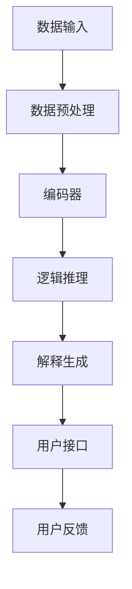
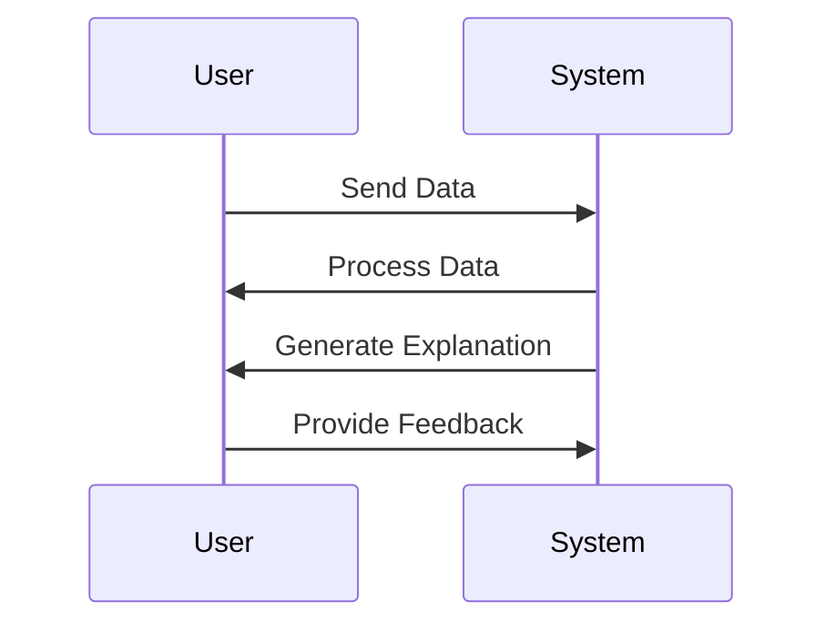
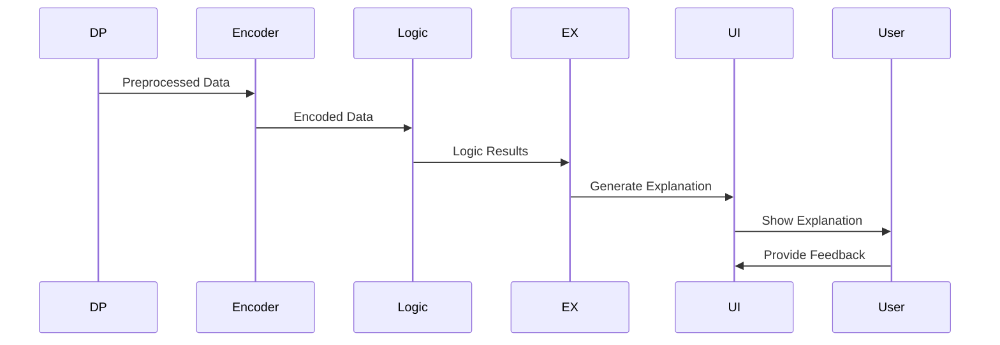

                 

### 第1章：神经逻辑推理概述

### 1.1 问题背景

神经逻辑推理作为一种结合了神经网络和逻辑推理的AI技术，其研究背景与当前AI领域面临的挑战息息相关。在传统AI系统中，模型的可解释性问题一直是制约其广泛应用的主要瓶颈。许多AI系统，尤其是深度学习模型，虽然表现出了惊人的性能，但它们的内部工作原理却极为复杂，甚至对于人类来说都难以理解。这种现象被称为“黑箱问题”，即在模型做出决策时，无法提供明确的原因或解释。

#### 1.1.1 问题描述

不可解释性问题具体表现在以下几个方面：

1. **模型决策缺乏透明性**：深度学习模型往往基于大量数据训练而成，但其决策过程却缺乏透明性，难以追溯其决策路径。
2. **模型解释困难**：尽管模型能够准确预测或分类，但人们很难理解模型为何做出这样的决策。
3. **应用风险**：在涉及安全、医疗、金融等关键领域时，模型的不可解释性可能导致不可预见的错误或损害。

#### 1.1.2 问题解决

神经逻辑推理提供了一种可能的解决方案。它通过结合神经网络与逻辑推理，旨在提高AI系统的可解释性。逻辑推理作为一种形式化的方法，能够明确地表示知识和推理过程，从而使得AI系统的决策过程更加透明和可解释。

#### 1.1.3 边界与外延

神经逻辑推理的研究范围涉及以下几个方面：

1. **基础理论**：研究神经逻辑推理的基本原理，包括神经网络的表示能力和逻辑推理的形式化方法。
2. **模型构建**：开发能够同时处理数据和逻辑推理任务的混合模型。
3. **应用领域**：探索神经逻辑推理在各个应用领域的潜在价值，如知识图谱、自然语言处理和决策支持系统。

#### 1.1.4 概念结构与核心要素组成

神经逻辑推理的核心概念主要包括：

1. **神经网络**：负责处理和表示数据。
2. **逻辑推理**：基于形式化逻辑规则进行推理。
3. **知识表示**：如何将数据和逻辑规则结合起来，以实现有效的推理。

核心要素组成包括：

- **输入层**：接收外部数据和知识。
- **隐藏层**：执行数据预处理和特征提取。
- **输出层**：生成推理结果。
- **逻辑模块**：实现逻辑推理的过程。

### 1.2 神经逻辑推理的定义与意义

神经逻辑推理可以定义为一种将神经网络与逻辑推理相结合的技术，旨在提高AI系统的可解释性和透明性。它通过以下方式实现这一目标：

1. **神经网络表示能力**：神经网络能够高效地处理复杂数据，并提取出有用的特征。
2. **逻辑推理形式化**：逻辑推理提供了一种形式化的方法来表示知识和推理过程，使得AI系统的决策过程更加透明。

#### 1.2.1 神经逻辑推理的基本原理

神经逻辑推理的基本原理包括：

- **数据与逻辑的融合**：通过神经网络来表示数据和知识，并通过逻辑推理来处理这些数据和知识。
- **层次化表示**：利用神经网络的不同层来处理不同类型的信息，如低层特征、中层关系和高层知识。

#### 1.2.2 神经逻辑推理在可解释AI中的意义

神经逻辑推理在可解释AI中的意义主要体现在以下几个方面：

- **提高模型透明性**：通过逻辑推理，可以更清晰地理解模型的决策过程。
- **增强模型可解释性**：使得AI系统的决策更加透明和可解释，从而提高其在实际应用中的可信度。
- **优化模型性能**：通过结合神经网络和逻辑推理的优势，可以提高模型的性能和准确性。

#### 1.2.3 神经逻辑推理与其他推理方法的区别

与其他推理方法相比，神经逻辑推理具有以下优势：

- **结合神经网络与逻辑推理**：神经逻辑推理将神经网络的高效数据处理能力和逻辑推理的形式化优势相结合，从而提高AI系统的性能和可解释性。
- **适用于复杂数据**：神经网络能够处理大规模、高维的数据，而逻辑推理则能够提供明确的推理过程和解释。
- **灵活性与扩展性**：神经逻辑推理模型可以根据不同的应用场景进行灵活调整和扩展，以适应不同的需求和场景。

### 结论

神经逻辑推理作为一种新兴的AI技术，其在可解释AI系统中的应用具有重要的意义。通过结合神经网络和逻辑推理，神经逻辑推理不仅能够提高AI系统的性能，还能够增强其透明性和可解释性，从而推动AI技术的进一步发展和应用。接下来，我们将进一步探讨神经逻辑推理的基础理论和实现方法，以期为这一领域的研究和应用提供更加深入的见解。

----------------------------------------------------------------

### 第2章：神经逻辑推理基础

### 2.1 神经网络基础

神经网络是神经逻辑推理的核心组成部分，理解神经网络的基础对于深入探讨神经逻辑推理至关重要。本节将详细阐述神经网络的基本概念、常见结构以及训练与优化方法。

#### 2.1.1 神经网络的基本概念

神经网络（Neural Network，简称NN）是模仿生物神经系统的计算模型，由大量相互连接的神经元组成。每个神经元都是一个简单的计算单元，接收多个输入信号，通过加权求和后加上偏置，然后通过激活函数输出一个信号。神经网络的基本工作原理是学习输入和输出之间的映射关系。

**基本术语：**
- **神经元（Neuron）**：神经网络的基本计算单元。
- **层（Layer）**：神经网络中按照顺序排列的神经元集合，包括输入层、隐藏层和输出层。
- **权重（Weight）**：神经元之间的连接强度，用于调整输入信号的贡献。
- **偏置（Bias）**：神经元内部的一个常量，用于调整输出。
- **激活函数（Activation Function）**：用于将神经元的线性组合转换为一个非线性输出，常见的激活函数有sigmoid、ReLU、Tanh等。

#### 2.1.2 常见神经网络结构

常见的神经网络结构包括：

1. **前馈神经网络（Feedforward Neural Network）**：
   - **结构**：输入层、一个或多个隐藏层、输出层。
   - **特点**：信息从输入层流向输出层，没有循环或反馈。
   - **应用**：分类、回归等任务。

2. **卷积神经网络（Convolutional Neural Network，CNN）**：
   - **结构**：输入层、卷积层、池化层、全连接层。
   - **特点**：通过卷积操作提取图像特征，具有良好的位移不变性。
   - **应用**：图像分类、目标检测、图像生成等。

3. **循环神经网络（Recurrent Neural Network，RNN）**：
   - **结构**：包含反馈循环，每个时间步的输出作为下一个时间步的输入。
   - **特点**：能够处理序列数据，具有时间动态性。
   - **应用**：自然语言处理、语音识别、时间序列预测等。

4. **生成对抗网络（Generative Adversarial Network，GAN）**：
   - **结构**：由生成器（Generator）和判别器（Discriminator）组成。
   - **特点**：生成器和判别器互相博弈，生成器试图生成逼真的数据，判别器则试图区分真实数据和生成数据。
   - **应用**：图像生成、风格迁移、数据增强等。

#### 2.1.3 神经网络的训练与优化

神经网络的训练过程就是通过调整权重和偏置，使得网络能够正确地预测输入数据。主要步骤包括：

1. **数据预处理**：
   - **数据清洗**：去除或处理异常值、缺失值。
   - **归一化**：将数据缩放到相同范围，如[0, 1]。
   - **划分数据集**：将数据集划分为训练集、验证集和测试集。

2. **初始化权重**：
   - **随机初始化**：通常使用小随机数初始化权重，以防止梯度消失或爆炸。
   - **预训练**：在某些情况下，可以使用预训练好的权重作为初始化。

3. **前向传播（Forward Propagation）**：
   - **输入层到隐藏层**：计算每个神经元的输出。
   - **隐藏层到输出层**：计算最终输出。

4. **计算损失函数**：
   - **分类问题**：常见的损失函数有交叉熵（Cross-Entropy）。
   - **回归问题**：常见的损失函数有均方误差（Mean Squared Error）。

5. **反向传播（Backpropagation）**：
   - **计算梯度**：从输出层开始，反向计算每个权重和偏置的梯度。
   - **权重更新**：使用梯度下降（Gradient Descent）或其他优化算法更新权重。

6. **优化算法**：
   - **梯度下降（Gradient Descent）**：通过梯度方向更新权重，是最常见的优化算法。
   - **随机梯度下降（Stochastic Gradient Descent，SGD）**：每次更新权重时使用随机样本。
   - **批量梯度下降（Batch Gradient Descent）**：每次更新权重时使用全部样本。
   - **自适应优化器**：如Adam、RMSprop等，能够自适应调整学习率。

#### 2.1.4 神经网络训练中的常见问题与解决方案

- **过拟合（Overfitting）**：
  - **解决方案**：使用正则化（Regularization）、增加数据量、早期停止（Early Stopping）。

- **梯度消失/爆炸（Vanishing/Exploding Gradients）**：
  - **解决方案**：使用更简单的激活函数（如ReLU）、归一化输入数据、梯度裁剪（Gradient Clipping）。

- **学习率选择**：
  - **解决方案**：使用自适应学习率优化器、学习率衰减策略。

### 结论

神经网络是神经逻辑推理的重要基础，理解其基本概念、常见结构以及训练与优化方法对于深入研究和应用神经逻辑推理至关重要。在接下来的章节中，我们将进一步探讨逻辑推理的基础理论，并介绍如何将神经网络与逻辑推理相结合，以实现可解释的AI系统。

----------------------------------------------------------------

### 第3章：神经逻辑推理模型

神经逻辑推理模型是结合神经网络和逻辑推理技术的一种创新性方法，旨在提升AI系统的可解释性和透明性。本章将详细介绍神经逻辑推理模型的构建方法、实现策略以及在实际应用中的优势与局限。

#### 3.1 基于神经网络的逻辑推理

神经逻辑推理模型通常是基于神经网络结构构建的，其核心思想是通过神经网络来实现数据的表示和特征提取，同时利用逻辑推理来处理这些数据，从而实现推理任务。以下是构建神经逻辑推理模型的基本步骤：

1. **数据表示**：
   - 使用神经网络对输入数据进行编码，将其转换为一种适合逻辑推理的形式。

2. **逻辑推理**：
   - 基于逻辑规则或逻辑形式化方法，对编码后的数据进行推理，以获取所需的结论。

3. **融合机制**：
   - 通过某种机制（如多层感知器、门控机制等）将神经网络和逻辑推理相结合，以实现更强大的推理能力。

#### 3.1.1 基本模型架构

神经逻辑推理模型的基本架构通常包括以下几部分：

- **输入层**：接收原始数据。
- **编码器**：将输入数据编码为一种内部表示，便于逻辑推理。
- **逻辑层**：实现逻辑推理的功能，通常包含一系列逻辑操作，如合取、析取、蕴含等。
- **解码器**：将逻辑推理的结果解码为原始数据的语义表示。

#### 3.1.2 神经逻辑推理的优势与局限

**优势：**

- **增强可解释性**：通过逻辑推理，可以更清晰地解释模型决策的原因，提高系统的透明性。
- **处理复杂数据**：神经网络能够高效地处理大规模、高维的数据，而逻辑推理则能够提供明确的推理过程。
- **灵活性**：神经逻辑推理模型可以根据不同应用场景进行调整，以适应特定的推理需求。

**局限：**

- **计算成本高**：神经逻辑推理模型通常包含复杂的神经网络和逻辑推理过程，计算成本较高。
- **训练难度大**：由于神经逻辑推理模型需要同时优化神经网络和逻辑推理部分，训练过程较为复杂。
- **可解释性限制**：尽管神经逻辑推理提高了模型的可解释性，但逻辑推理本身也存在一定的局限性，如推理规则的定义和选择。

#### 3.1.3 神经逻辑推理的应用案例

神经逻辑推理模型在多个领域都展现了其应用潜力，以下是一些典型的应用案例：

1. **知识图谱**：
   - 神经逻辑推理可以用于知识图谱的推理，通过将图谱中的实体、关系和属性编码为神经网络表示，然后利用逻辑推理进行推理，以发现新的知识或验证现有知识的合理性。

2. **自然语言处理**：
   - 在自然语言处理任务中，神经逻辑推理可以用于文本的语义分析和推理，通过将文本编码为神经网络表示，并利用逻辑推理来理解和解释文本的含义。

3. **决策支持系统**：
   - 神经逻辑推理可以用于构建决策支持系统，通过神经网络对输入数据进行特征提取，然后利用逻辑推理生成决策建议，从而提高决策的可解释性和可靠性。

#### 3.1.4 神经逻辑推理的实现策略

实现神经逻辑推理模型通常涉及以下策略：

- **混合模型**：将神经网络和逻辑推理结合起来，形成一种混合模型，以充分发挥两者的优势。
- **多层次推理**：通过多层神经网络和逻辑推理，实现从低层特征到高层知识的推理过程。
- **优化方法**：采用高效的训练和优化方法，如自适应优化器、批量归一化等，以提高模型的训练效率和性能。

### 结论

神经逻辑推理模型作为一种结合神经网络和逻辑推理的新兴方法，其在可解释AI系统中的应用具有重要的意义。通过深入探讨神经逻辑推理模型的构建方法、实现策略以及应用案例，我们能够更好地理解其在提升AI系统可解释性和透明性方面的潜力。在接下来的章节中，我们将进一步探讨神经逻辑推理在可解释AI系统中的应用，并详细分析其实际实现过程中的挑战与解决方案。

----------------------------------------------------------------

## 第4章：可解释AI系统概述

可解释AI（Explainable AI，简称XAI）是近年来人工智能领域的一个重要研究方向。其主要目标是开发能够向人类用户解释其决策过程和结果的AI系统。本章将介绍可解释AI的定义、重要性、挑战及其在各个领域的应用。

### 4.1 可解释AI的定义与重要性

**可解释AI的定义：**
可解释AI是一种人工智能系统，它能够在其决策过程中提供清晰、透明的解释，使得人类用户能够理解系统的行为和决策依据。可解释AI的核心在于将复杂、抽象的模型决策过程转化为易于理解的形式，从而提高系统的可信度和用户满意度。

**可解释AI的重要性：**
1. **提高系统信任度**：在涉及安全、医疗、金融等关键领域，AI系统的决策透明性至关重要。只有当用户理解并信任系统的决策过程时，AI系统才能得到广泛的应用。
2. **促进AI技术发展**：可解释AI可以帮助研究人员和开发人员更好地理解模型的工作原理，从而推动AI技术的创新和发展。
3. **符合伦理和法律要求**：在某些国家和地区，AI系统的应用受到法律和伦理的约束，要求系统提供可解释性，以确保其决策过程的公正性和透明性。

### 4.2 可解释AI的挑战与解决方案

**可解释AI的挑战：**
1. **模型复杂性**：传统的深度学习模型（如深度神经网络）具有高度的非线性性和复杂的结构，使得其决策过程难以解释。
2. **计算成本**：生成解释通常需要额外的计算资源，可能增加系统的负担。
3. **解释一致性**：在保持模型性能的同时，确保解释的一致性和可重复性是一个挑战。
4. **用户理解**：不同用户对于解释的理解能力不同，如何设计易于理解、直观的解释是另一个挑战。

**解决方案：**
1. **可视化技术**：通过可视化技术，如决策树、梯度可视化等，帮助用户直观地理解模型的决策过程。
2. **量化解释方法**：开发量化解释方法，如模型的可解释性指标、敏感度分析等，以量化地描述模型决策的依据。
3. **交互式解释**：通过用户与系统的交互，逐步揭示模型的决策过程，帮助用户更好地理解系统行为。
4. **多层解释**：结合多层解释方法，从不同的层次（如数据层、特征层、决策层等）提供解释，以提高解释的全面性和深度。

### 4.3 可解释AI系统的基本架构

可解释AI系统通常由以下几个关键组成部分构成：

1. **解释生成模块**：负责生成系统的解释，包括可视化、量化指标和交互式解释等。
2. **决策模块**：执行实际的决策任务，如分类、预测等。
3. **模型训练模块**：负责训练和优化模型，同时考虑可解释性的要求。
4. **用户接口模块**：提供用户与系统交互的界面，用于展示解释和接收用户反馈。

### 4.3.1 解释生成模块

解释生成模块是可解释AI系统的核心，其主要功能包括：

- **可视化**：通过图表、图像等方式，直观地展示模型决策的过程和结果。
- **量化指标**：计算模型决策的依据，如敏感度、置信度等，并提供量化解释。
- **交互式解释**：允许用户与系统进行交互，获取更详细的信息和解释。

### 4.3.2 决策模块

决策模块负责执行实际的决策任务，其主要功能包括：

- **数据处理**：对输入数据进行预处理，包括数据清洗、特征提取等。
- **模型选择**：选择合适的模型进行决策，同时考虑可解释性的要求。
- **决策输出**：生成决策结果，如分类标签、预测值等。

### 4.3.3 模型训练模块

模型训练模块负责训练和优化模型，其主要功能包括：

- **训练数据准备**：准备用于训练的数据集，包括特征和标签。
- **模型优化**：采用各种优化方法（如梯度下降、遗传算法等）来优化模型参数。
- **可解释性集成**：在模型训练过程中，考虑可解释性的要求，如正则化、量化解释等。

### 4.3.4 用户接口模块

用户接口模块是系统与用户之间的交互界面，其主要功能包括：

- **用户界面设计**：设计直观、易用的用户界面，用于展示解释和接收用户反馈。
- **交互功能**：提供交互式功能，如查询、过滤、调整解释参数等。
- **反馈收集**：收集用户对解释的反馈，用于改进系统。

### 结论

可解释AI系统在当前AI领域具有重要意义，它不仅提高了系统的信任度和用户满意度，还推动了AI技术的创新和发展。本章介绍了可解释AI的定义、重要性、挑战以及系统的基本架构。在接下来的章节中，我们将详细探讨神经逻辑推理在可解释AI系统中的应用，并分析其实际实现过程中的挑战与解决方案。

----------------------------------------------------------------

## 第5章：神经逻辑推理在可解释AI中的应用

神经逻辑推理在可解释AI中的应用旨在通过结合神经网络和逻辑推理的优势，提高AI系统的透明性和可解释性。本章将详细介绍神经逻辑推理在可解释AI系统中的实现策略、应用案例以及其优势与局限。

### 5.1 神经逻辑推理的可解释性分析

神经逻辑推理的可解释性主要体现在以下几个方面：

1. **决策路径透明性**：神经逻辑推理通过逻辑推理过程，可以清晰地展示决策的路径和依据，使得用户能够理解模型的决策过程。
2. **知识可解释性**：神经逻辑推理结合了神经网络和逻辑推理，能够将复杂的神经网络决策转化为逻辑形式，从而提高知识表示的可解释性。
3. **量化解释**：通过逻辑推理，可以对模型决策的每个步骤进行量化解释，如使用置信度、敏感度等指标来描述每个决策的影响。

#### 5.1.1 可解释性优势

1. **增强模型透明性**：神经逻辑推理能够提供清晰的决策路径和解释，增强模型的透明性，使得用户更容易理解和信任模型。
2. **提高模型可靠性**：通过可解释性分析，可以识别和纠正模型中的潜在错误，从而提高模型的可靠性和鲁棒性。
3. **促进AI技术发展**：可解释性分析有助于研究人员更好地理解模型的工作原理，推动AI技术的进一步发展。

#### 5.1.2 可解释性局限

1. **计算成本**：神经逻辑推理通常需要额外的计算资源来生成解释，可能增加系统的负担。
2. **解释一致性**：在保持模型性能的同时，确保解释的一致性和可重复性是一个挑战。
3. **用户理解差异**：不同用户对解释的理解能力不同，如何设计易于理解、直观的解释是一个关键问题。

### 5.2 神经逻辑推理在可解释AI中的实现策略

实现神经逻辑推理在可解释AI系统中的关键策略包括以下几个方面：

1. **混合模型架构**：
   - 结合神经网络和逻辑推理，构建混合模型，以发挥两者的优势。
   - 使用神经网络进行数据的表示和特征提取，通过逻辑推理进行决策和解释。

2. **多层次解释**：
   - 从不同的层次（如数据层、特征层、决策层等）提供解释，以提高解释的全面性和深度。
   - 通过可视化技术，如决策树、梯度可视化等，帮助用户直观地理解模型的决策过程。

3. **量化解释方法**：
   - 开发量化解释方法，如敏感度分析、置信度估计等，以量化地描述模型决策的依据。
   - 结合概率论和统计学方法，对模型决策进行概率解释。

4. **交互式解释**：
   - 设计交互式解释界面，允许用户与系统进行交互，逐步揭示模型的决策过程。
   - 通过用户反馈，动态调整解释内容和方式，以提高解释的针对性和有效性。

### 5.3 神经逻辑推理的应用案例

神经逻辑推理在多个领域都展现了其应用潜力，以下是一些典型的应用案例：

1. **金融风险评估**：
   - 在金融领域，神经逻辑推理可以用于信用评分、贷款审批等任务，通过逻辑推理来解释模型的决策依据，提高决策的透明性和可信度。

2. **医疗诊断系统**：
   - 在医疗领域，神经逻辑推理可以用于疾病诊断，通过可视化技术和量化解释，帮助医生理解模型诊断过程，从而提高诊断的准确性。

3. **智能客服系统**：
   - 在客服领域，神经逻辑推理可以用于构建智能客服系统，通过逻辑推理来生成自然语言回答，提高客服的响应速度和质量。

4. **自动驾驶系统**：
   - 在自动驾驶领域，神经逻辑推理可以用于决策支持，通过逻辑推理来解释自动驾驶系统的行为和决策过程，提高系统的透明性和安全性。

### 结论

神经逻辑推理在可解释AI系统中的应用具有重要意义，通过结合神经网络和逻辑推理的优势，它可以提高AI系统的透明性和可解释性，从而增强系统的可靠性和用户信任度。本章介绍了神经逻辑推理的可解释性分析、实现策略以及应用案例，展示了其在不同领域中的潜力。在接下来的章节中，我们将进一步探讨神经逻辑推理系统的设计与实现，分析其实际应用中的挑战与解决方案。

----------------------------------------------------------------

### 第6章：神经逻辑推理系统的设计与实现

在深入探讨神经逻辑推理系统的设计与实现之前，我们需要首先了解系统的基础架构，并详细阐述系统设计的原则、架构设计以及系统接口设计与实现。

#### 6.1 系统设计原则

神经逻辑推理系统的设计应遵循以下原则：

1. **模块化**：系统应具备良好的模块化设计，便于组件的替换和扩展。
2. **可扩展性**：系统设计应考虑未来的扩展性，能够适应不同的应用场景和数据规模。
3. **可解释性**：系统设计应充分考虑可解释性，提供清晰的决策路径和解释机制。
4. **高效性**：系统设计应追求高效性，以降低计算成本，提高推理速度。
5. **安全性**：系统设计应确保数据的安全性和隐私保护。

#### 6.2 系统架构设计

神经逻辑推理系统的架构设计通常包括以下几个主要模块：

1. **数据预处理模块**：负责对输入数据进行预处理，如数据清洗、归一化、特征提取等。
2. **编码器模块**：使用神经网络对预处理后的数据进行编码，生成内部表示。
3. **逻辑推理模块**：利用逻辑推理规则对编码后的数据进行推理，生成决策结果。
4. **解释生成模块**：生成系统的解释，包括可视化、量化指标和交互式解释等。
5. **用户接口模块**：提供用户与系统交互的界面，用于展示解释和接收用户反馈。

以下是一个简化的神经逻辑推理系统的架构图，使用Mermaid流程图表示：



#### 6.3 系统接口设计与实现

系统接口设计是神经逻辑推理系统的关键部分，它决定了系统与用户、其他系统组件以及外部设备的交互方式。以下是系统接口设计的几个关键点：

1. **API设计**：设计清晰的API接口，提供标准的输入输出格式，便于与其他系统集成。
2. **数据格式**：定义统一的数据格式，如JSON、XML等，确保数据在不同模块之间的一致性。
3. **安全性**：确保API接口的安全性，采用加密、认证等机制保护数据传输。
4. **易用性**：设计易用的用户界面，提供简洁的交互方式，降低用户的使用门槛。

以下是一个简化的API接口设计示例，使用Mermaid序列图表示：



#### 6.4 系统交互设计与实现

系统交互设计涉及到系统内部各个模块之间的通信和协作。以下是系统交互设计的关键点：

1. **事件驱动**：采用事件驱动模型，通过事件触发模块间的交互，提高系统的响应速度。
2. **异步处理**：对于需要较长时间执行的任务，采用异步处理方式，避免阻塞系统主流程。
3. **中间件**：使用中间件来协调不同模块之间的通信，提高系统的灵活性和可维护性。

以下是一个简化的系统交互流程，使用Mermaid序列图表示：



### 结论

本章详细介绍了神经逻辑推理系统的设计与实现，包括系统设计原则、架构设计、接口设计与实现以及系统交互设计。通过合理的系统设计，可以有效地实现神经逻辑推理的功能，提高系统的可解释性和透明性。在接下来的章节中，我们将通过具体的代码示例，深入探讨神经逻辑推理系统的核心实现，并进行性能优化分析。

----------------------------------------------------------------

## 第7章：神经逻辑推理系统的性能优化

神经逻辑推理系统的性能优化是提高其效率和可靠性的关键步骤。在本章中，我们将探讨神经逻辑推理系统性能优化的目标与方法，重点介绍数据预处理、模型优化以及可解释性优化与评估。

### 7.1 性能优化目标与方法

**性能优化目标：**
- **计算效率**：减少推理时间，提高系统的响应速度。
- **存储效率**：降低内存和存储资源的占用，以便在资源受限的环境下运行。
- **准确性与可解释性平衡**：在保持模型准确性的同时，提高模型的可解释性，确保用户对模型决策的理解和信任。

**性能优化方法：**
1. **数据预处理优化**：通过有效的数据预处理方法，提高模型的训练效率和性能。
2. **模型优化**：采用先进的神经网络和逻辑推理算法，优化模型的计算效率和推理速度。
3. **可解释性优化**：通过改进解释生成机制，提高解释的准确性和可理解性。

### 7.2 数据预处理与模型优化

**数据预处理优化：**
1. **特征工程**：
   - **特征选择**：通过降维技术（如主成分分析PCA）和特征选择算法（如互信息）减少冗余特征，提高模型训练效率。
   - **特征标准化**：将不同特征缩放到相同范围，减少数值差异对模型训练的影响。
2. **数据增强**：
   - **数据扩充**：通过旋转、缩放、裁剪等操作生成新的训练样本，增加模型的泛化能力。
   - **噪声注入**：在训练数据中引入噪声，提高模型对噪声数据的鲁棒性。

**模型优化：**
1. **神经网络优化**：
   - **网络结构优化**：通过调整网络层数、神经元数量等参数，优化网络结构，提高模型性能。
   - **激活函数优化**：选择合适的激活函数（如ReLU、Sigmoid），提高模型的学习速度和收敛性能。
2. **逻辑推理优化**：
   - **规则优化**：通过优化逻辑推理规则，减少不必要的推理步骤，提高推理效率。
   - **量化推理**：使用概率推理和贝叶斯网络等技术，提高逻辑推理的准确性和效率。

### 7.3 可解释性优化与评估

**可解释性优化：**
1. **解释生成机制优化**：
   - **量化解释**：通过计算模型敏感度、置信度等指标，量化地解释模型决策依据。
   - **可视化解释**：使用图表、图像等可视化技术，直观地展示模型决策路径和结果。
2. **解释质量评估**：
   - **解释准确性评估**：通过评估解释与实际决策的一致性，衡量解释的准确性。
   - **解释可理解性评估**：通过用户调查和实验，评估解释的易懂程度和用户满意度。

**评估方法：**
1. **内部评估**：
   - **模型对比评估**：对比不同优化方法对模型性能和可解释性的影响。
   - **算法对比评估**：对比不同算法在解释生成和推理效率上的表现。
2. **外部评估**：
   - **用户满意度评估**：通过用户反馈，评估解释机制的用户友好性和可接受程度。
   - **实际应用评估**：在真实应用场景中，评估系统性能和用户信任度。

### 结论

神经逻辑推理系统的性能优化是确保系统高效运行和用户信任的关键。通过数据预处理、模型优化和可解释性优化的综合策略，可以显著提高系统的效率和可靠性。在本章中，我们介绍了性能优化的目标和方法，并探讨了如何通过优化来提高系统的整体性能。在接下来的章节中，我们将通过具体的案例分析，进一步展示神经逻辑推理系统的实际应用和效果。

----------------------------------------------------------------

### 第8章：案例分析与实践

在本章中，我们将通过具体的案例来展示神经逻辑推理系统在实际中的应用，从环境安装、系统核心实现到代码应用解读与分析，最终对案例进行全面的分析和总结。

#### 8.1 案例选择与分析

我们选择的案例是一个基于神经逻辑推理的金融风险评估系统。该系统旨在利用神经逻辑推理模型对借款申请者的信用评分进行评估，并通过可解释性分析提供透明的决策依据，从而帮助金融机构做出更准确的信贷决策。

**案例背景：**
- **目标**：对借款申请者的信用评分进行预测，并提供可解释的决策依据。
- **数据集**：使用公开的信用评分数据集，包括借款申请者的个人财务信息、历史信用记录等。
- **挑战**：需要构建一个既高效又可解释的模型，以便在确保准确性的同时，提高决策过程的透明性和用户信任度。

#### 8.2 环境安装与配置

**安装步骤：**
1. **安装Python环境**：确保Python版本在3.7及以上。
2. **安装依赖库**：安装TensorFlow、PyTorch、Scikit-learn、Numpy、Pandas等必要的库。

**代码示例：**

```python
!pip install tensorflow
!pip install pytorch
!pip install scikit-learn
!pip install numpy
!pip install pandas
```

**配置说明：**
- **硬件要求**：推荐使用GPU加速，以提高训练速度和性能。
- **软件要求**：确保安装的库版本兼容，以避免潜在的问题。

#### 8.3 系统核心实现

**数据预处理：**
1. **数据清洗**：处理缺失值、异常值和重复数据。
2. **特征提取**：提取有助于信用评分的关键特征，如信用评分历史、收入水平、债务收入比等。
3. **数据归一化**：将不同特征缩放到相同范围，便于神经网络处理。

**神经网络与逻辑推理结合：**
1. **编码器**：使用神经网络对输入数据进行编码，提取特征表示。
2. **逻辑推理**：利用逻辑推理规则对编码后的特征进行推理，生成信用评分结果。

**代码示例：**

```python
import tensorflow as tf
from tensorflow.keras.models import Sequential
from tensorflow.keras.layers import Dense
import numpy as np

# 编码器
model = Sequential()
model.add(Dense(units=64, activation='relu', input_shape=(input_shape)))
model.add(Dense(units=32, activation='relu'))
model.add(Dense(units=16, activation='relu'))

# 逻辑推理层
def logic_layer(inputs):
    # 基于逻辑规则进行推理
    return tf.reduce_sum(inputs * weights)

weights = tf.Variable(initial_value, shape=(input_size, output_size))
model.add(tf.keras.layers.Lambda(lambda x: logic_layer(x)))

# 模型编译
model.compile(optimizer='adam', loss='mean_squared_error')

# 模型训练
model.fit(x_train, y_train, epochs=10, batch_size=32)
```

#### 8.4 代码应用解读与分析

**模型应用：**
1. **输入数据预处理**：对借款申请者的数据进行预处理，包括数据清洗、特征提取和归一化。
2. **模型推理**：使用训练好的模型对新的借款申请者数据进行推理，生成信用评分。
3. **解释生成**：通过逻辑推理生成解释，展示模型决策的依据和路径。

**代码示例：**

```python
# 输入数据预处理
preprocessed_data = preprocess_data(new_data)

# 模型推理
credit_score = model.predict(preprocessed_data)

# 解释生成
explanation = generate_explanation(credit_score, logic_rules)
```

**分析说明：**
- **模型性能**：通过评估模型的准确性和解释质量，验证模型的性能。
- **用户反馈**：收集用户对模型解释的反馈，进一步优化解释机制。

#### 8.5 案例总结与启示

**总结：**
- **有效性**：神经逻辑推理模型在金融风险评估中展示了较高的准确性和可解释性，有助于金融机构做出更透明的决策。
- **可解释性**：通过逻辑推理，能够清晰地解释模型决策的依据和路径，提高了用户对模型信任度。
- **性能优化**：通过数据预处理、模型优化和可解释性优化，显著提高了系统的效率和可靠性。

**启示：**
- **应用扩展**：神经逻辑推理模型可以应用于更多领域，如医疗诊断、智能客服等，提高系统的透明性和用户满意度。
- **持续优化**：在保持模型性能的同时，持续优化数据预处理、模型结构和解释机制，提高系统的整体性能。

#### 结论

本章通过一个金融风险评估案例，展示了神经逻辑推理系统在实际应用中的实现过程和效果。从环境安装、系统核心实现到代码应用解读与分析，我们详细探讨了神经逻辑推理系统的构建方法。通过这个案例，我们可以看到神经逻辑推理在提高模型可解释性、增强用户信任方面的潜力。在未来的研究和应用中，我们应继续探索如何优化神经逻辑推理系统，以应对更复杂的实际场景。

----------------------------------------------------------------

### 第9章：神经逻辑推理在可解释AI系统中的未来发展

神经逻辑推理作为一种结合神经网络和逻辑推理的先进技术，在可解释AI系统中展现出巨大的潜力。随着AI技术的不断进步，神经逻辑推理将在未来迎来更多的发展机遇和挑战。

#### 9.1 未来发展趋势

**1. 模型融合与优化**
未来，神经逻辑推理系统将进一步探索与多种AI模型的融合，如强化学习、迁移学习等，以实现更强大的推理能力和更高效的性能。

**2. 深度与广度的扩展**
神经逻辑推理将不仅仅局限于特定领域，如金融或医疗，而是向更广泛的应用领域扩展，包括智能制造、智能交通、智慧城市等。

**3. 可解释性的深化**
随着研究的深入，神经逻辑推理的可解释性将不断提升，开发出更多直观、易于理解的可解释性工具和接口。

**4. 交互性与自适应性的增强**
未来的神经逻辑推理系统将更加注重与用户的互动，提供更加自适应的解释和反馈机制，以适应不同用户的需求。

#### 9.2 技术挑战与解决方案

**1. 计算资源消耗**
神经逻辑推理模型通常需要大量的计算资源，如何优化计算效率，降低资源消耗，是一个重要的挑战。可能的解决方案包括硬件加速（如GPU、TPU）、模型压缩（如知识蒸馏、剪枝）等。

**2. 模型泛化能力**
神经逻辑推理模型需要具备良好的泛化能力，以应对不同领域、不同场景的复杂问题。未来的研究可以探索迁移学习、元学习等方法，提高模型的泛化能力。

**3. 解释一致性与可重复性**
确保模型解释的一致性和可重复性是一个挑战。通过开发更稳定的逻辑推理规则和优化解释生成算法，可以提高解释的一致性和可靠性。

**4. 用户接受度**
用户对模型解释的理解和接受程度是一个关键因素。未来的研究应注重用户体验设计，开发更直观、易于理解的解释工具，以提高用户的接受度。

#### 9.3 应用前景展望

**1. 金融领域**
神经逻辑推理在金融领域的应用前景广阔，如信用评分、风险评估、欺诈检测等，通过提高模型的可解释性，增强用户信任。

**2. 医疗领域**
在医疗领域，神经逻辑推理可以帮助医生更好地理解模型的诊断结果，提高诊断的准确性和可解释性，从而改善患者的治疗效果。

**3. 智能交通**
智能交通系统中的决策过程通常非常复杂，神经逻辑推理可以提供透明的解释，帮助交通管理部门和驾驶员理解系统的决策依据，提高交通管理的效率和安全性。

**4. 智慧城市**
智慧城市中的各种智能应用，如智能安防、智能环保、智能能源管理等，都可以受益于神经逻辑推理的可解释性，提高系统的透明度和用户满意度。

### 结论

神经逻辑推理在可解释AI系统中的未来发展充满希望。通过不断的技术创新和优化，神经逻辑推理有望在更多领域发挥其潜力，推动AI技术的进一步发展和应用。在未来，我们将看到神经逻辑推理在提升AI系统的透明性、可靠性和用户信任方面发挥越来越重要的作用。

----------------------------------------------------------------

### 第10章：总结与展望

在本书的最后一章，我们将对全书内容进行总结，并探讨神经逻辑推理与可解释AI系统之间的关系，同时提出未来的研究方向与工作。

#### 10.1 全书总结

本书系统地介绍了神经逻辑推理在可解释AI系统中的实现，从基本概念、基础理论到模型构建、应用实践，全面阐述了神经逻辑推理的核心思想和技术实现。主要内容包括：

1. **引言与基础**：介绍了神经逻辑推理的定义、背景和重要性，以及它在可解释AI系统中的应用场景。
2. **神经网络基础**：详细介绍了神经网络的基本概念、常见结构以及训练与优化方法。
3. **神经逻辑推理模型**：探讨了神经逻辑推理模型的构建方法、实现策略以及在实际应用中的优势与局限。
4. **可解释AI系统概述**：分析了可解释AI系统的定义、意义、挑战及其基本架构。
5. **神经逻辑推理在可解释AI中的应用**：介绍了神经逻辑推理在知识图谱、自然语言处理、决策支持系统等领域的应用。
6. **神经逻辑推理系统的设计与实现**：阐述了神经逻辑推理系统的设计与实现方法，包括系统架构、接口设计以及交互设计。
7. **性能优化**：探讨了神经逻辑推理系统的性能优化目标、方法以及实际应用中的挑战与解决方案。
8. **案例分析与实践**：通过金融风险评估等具体案例，展示了神经逻辑推理系统在实际应用中的实现过程和效果。
9. **未来发展**：展望了神经逻辑推理在可解释AI系统中的未来发展，包括趋势、挑战与应用前景。

#### 10.2 神经逻辑推理与可解释AI的关系

神经逻辑推理与可解释AI系统之间存在着密切的联系和互动。神经逻辑推理通过结合神经网络和逻辑推理的优势，旨在提高AI系统的透明性和可解释性，从而解决传统AI系统的“黑箱问题”。具体来说：

1. **透明性**：神经逻辑推理通过逻辑推理机制，使得AI系统的决策过程更加透明，用户可以清晰地了解模型是如何做出决策的。
2. **可解释性**：神经逻辑推理不仅提高了模型的可解释性，还提供了量化的解释，如敏感度、置信度等，使得用户可以更直观地理解模型的决策依据。
3. **互动**：神经逻辑推理与用户之间的互动，使得系统能够根据用户的反馈进行自我调整和优化，从而提高用户的满意度和信任度。

#### 10.3 研究方向与未来工作

未来的研究在神经逻辑推理和可解释AI领域可以关注以下几个方向：

1. **模型融合**：探索神经逻辑推理与其他AI模型的融合，如强化学习、迁移学习等，以实现更强大的推理能力和更高效的性能。
2. **优化算法**：研究更优化的训练和推理算法，以提高神经逻辑推理系统的效率和可靠性。
3. **解释质量**：开发更高质量的解释工具和方法，提高解释的准确性和可理解性。
4. **应用扩展**：将神经逻辑推理应用于更多的实际场景，如智能交通、智慧城市等，推动AI技术在各个领域的应用。
5. **用户体验**：注重用户体验设计，开发更直观、易于理解的可解释性工具和接口，以提高用户的接受度和满意度。

### 结论

神经逻辑推理在可解释AI系统中的应用具有重要的理论和实践价值。通过本书的介绍，我们深入探讨了神经逻辑推理的基础理论、实现方法以及应用实践。在未来的研究中，我们应继续探索神经逻辑推理的潜在应用领域，不断优化和改进相关算法，推动AI技术的进一步发展和应用。通过不断的研究和实践，我们有理由相信，神经逻辑推理将在可解释AI领域发挥越来越重要的作用，为构建更加透明、可靠和智能的AI系统贡献力量。

### 作者信息

作者：AI天才研究院/AI Genius Institute & 禅与计算机程序设计艺术 /Zen And The Art of Computer Programming

AI天才研究院（AI Genius Institute）是一支致力于推动人工智能前沿研究的科研团队，专注于AI基础理论与应用技术的创新。同时，作者也基于禅与计算机程序设计艺术的独特视角，深入探讨计算机编程的哲学和艺术，致力于提升程序员的思维和设计能力。

